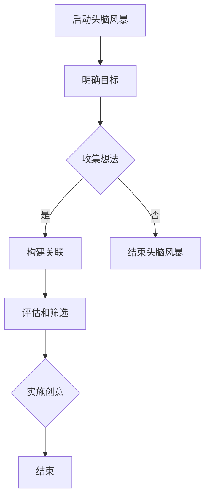
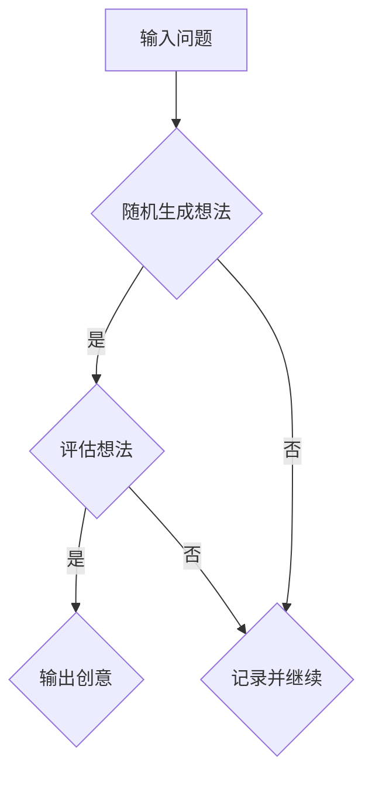
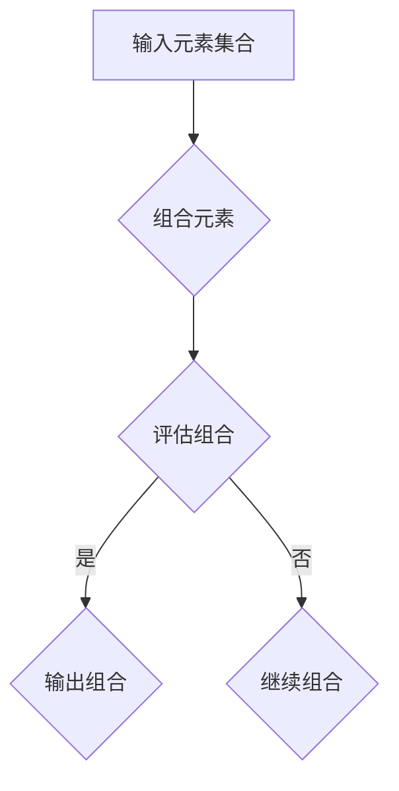
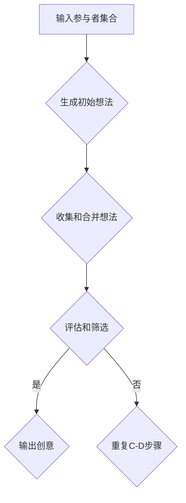
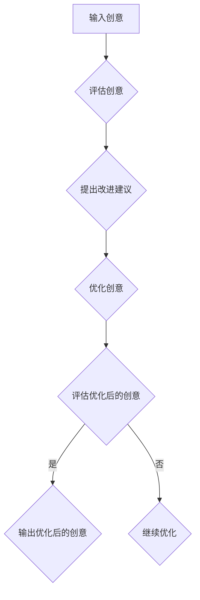

                 

# 文章标题：激发创意：让头脑风暴更有效的技巧

## 关键词：头脑风暴、创意激发、创新思维、团队协作、算法原理

> 在科技飞速发展的时代，创新成为推动社会进步的核心动力。而头脑风暴作为激发创意和创新的利器，已成为各类组织和团队提高竞争力的关键手段。本文将深入探讨头脑风暴的技巧和方法，通过逻辑清晰的步骤和分析，帮助读者掌握高效进行头脑风暴的实践技能，从而在个人和团队层面实现创新突破。让我们一步步分析，揭开头脑风暴的神秘面纱。

## 摘要

本文将围绕头脑风暴这一主题，首先介绍其背景和重要性，接着深入探讨头脑风暴的基础知识和核心技巧，通过案例分析展示其实际应用，最后提出提升头脑风暴效率的进阶方法和未来趋势。通过系统学习和实践，读者将能够有效激发创意，提升团队协作能力，为个人和组织的创新和发展贡献力量。

### 第一部分：头脑风暴的入门

#### 第1章：创意与创新的重要性

##### 1.1 创意思维的重要性

创意思维是推动创新的核心动力。在当今快速变化的社会和科技环境中，具备创意思维能力的人和组织更具竞争力。创意不仅体现在产品和服务的设计上，也体现在解决复杂问题和应对挑战的过程中。创意思维的重要性在于：

1. **突破常规思维**：创意能够打破传统的思维定式，激发出新的想法和解决方案。
2. **提升竞争力**：创意能够帮助企业和团队在激烈的市场竞争中脱颖而出。
3. **推动社会进步**：创意思维推动了科技、文化、教育等多个领域的创新和发展。

##### 1.2 创意与创新的区别

虽然创意和创新密切相关，但它们之间还是存在一些区别：

- **创意**：指新的想法、构思或解决问题的方案。
- **创新**：指将创意转化为实际成果和应用的过程。

创意是创新的起点，而创新则是创意的实现。例如，一个设计独特的智能手机只是创意，而将其投入生产和销售，并在市场中获得成功，则是创新。

##### 1.3 创意对个人和团队的价值

对于个人来说，创意能够：

1. **提高职业竞争力**：拥有创意思维的个人在求职和职业发展中更具优势。
2. **实现个人成长**：创意能够激发个人的潜能，推动自我提升和成长。

对于团队来说，创意能够：

1. **提升团队凝聚力**：通过共同探讨创意，团队成员之间的沟通和合作更加紧密。
2. **实现团队目标**：创意能够帮助团队找到实现目标的新途径和方法。

##### 1.4 头脑风暴的基础知识

头脑风暴是一种通过集体讨论激发创意的方法。其基本原理是：

1. **自由思考**：鼓励参与者无拘无束地提出各种想法，无论它们看起来多么荒谬或不切实际。
2. **数量优先**：在头脑风暴过程中，重点是产生尽可能多的想法，而不是立即评估这些想法的可行性。
3. **构建关联**：将不同的想法进行关联和组合，可能会产生出人意料的创新解决方案。

头脑风暴的常见形式包括：

- **开放式头脑风暴**：所有参与者都可以随时提出想法。
- **聚焦式头脑风暴**：围绕特定的问题或目标进行讨论。
- **竞争式头脑风暴**：团队成员分成小组，分别提出创意并进行比较。

通过掌握头脑风暴的基础知识，个人和团队可以更有效地激发创意，推动创新和发展。

#### 第2章：头脑风暴的技巧

##### 2.1 头脑风暴的准备

进行有效的头脑风暴需要充分的准备。以下是一些关键步骤：

1. **明确目标和问题**：在开始头脑风暴之前，需要明确讨论的目标和要解决的问题。这有助于聚焦讨论内容，提高效率。
2. **选择合适的时间和地点**：选择一个安静、不受打扰的环境，有助于参与者集中注意力。
3. **邀请参与者**：根据讨论目标和问题，邀请相关领域的专家和团队成员参与。确保参与者具备一定的相关知识和经验。
4. **准备材料**：准备白板、便签纸、记号笔等工具，以便在头脑风暴过程中记录想法。
5. **设定时间限制**：设定一个合理的时间限制，以确保头脑风暴的进行不会过于冗长。

##### 2.2 如何进行头脑风暴

进行头脑风暴时，可以遵循以下步骤：

1. **开场陈述**：主持人简要介绍讨论的目标和问题，并鼓励参与者自由发言。
2. **自由发言**：参与者依次发言，提出自己的想法。在发言过程中，其他成员应保持倾听，不要立即进行评价。
3. **记录想法**：主持人或指定记录员将所有想法记录在白板或便签纸上。这些想法将成为后续讨论的基础。
4. **构建关联**：在自由发言结束后，主持人引导参与者将不同的想法进行关联和组合，以探索可能的创新解决方案。
5. **筛选和评估**：将记录的所有想法进行筛选，评估其可行性和潜在价值。根据评估结果，选择最具潜力的想法进行进一步讨论。

##### 2.3 激发创意的技巧

为了激发更多的创意，可以尝试以下技巧：

1. **跨界思考**：从不同领域或行业寻找灵感，运用跨学科的方法进行思考。
2. **关键词联想**：通过关键词或短语激发新的想法。例如，使用“如果……会怎样？”或“如何将……应用到……”等提问方式。
3. **类比思维**：通过将问题与已知的事物或情境进行类比，寻找解决方案。
4. **头脑风暴游戏**：设计一些有趣的头脑风暴游戏，如“30秒创意”、“快速组合”等，以增加互动性和趣味性。
5. **多元视角**：鼓励参与者从不同的视角和立场出发，提出多样化的想法。

##### 2.4 头脑风暴的注意事项

为了确保头脑风暴的效果，需要注意以下事项：

1. **避免批评和负面情绪**：在头脑风暴过程中，鼓励开放和积极的氛围，避免批评和负面情绪。任何想法都应被平等对待，无论它们看起来多么不切实际。
2. **控制讨论节奏**：主持人需要控制讨论的节奏，确保每个参与者都有机会发言，同时避免讨论过于冗长或偏离主题。
3. **记录和总结**：确保所有想法都被记录下来，并在讨论结束后进行总结。这有助于后续的评估和决策。
4. **后续跟进**：头脑风暴只是创新过程的第一步。在讨论结束后，需要根据评估结果进行后续的跟进和实施。

通过掌握这些头脑风暴的技巧和注意事项，个人和团队可以更有效地激发创意，推动创新和发展。

### 第二部分：头脑风暴的实践与应用

#### 第3章：头脑风暴的核心概念与联系

##### 3.1 头脑风暴的核心概念

头脑风暴作为一种集体创意思维方法，其核心概念包括：

- **创意生成**：产生新的想法和解决方案的过程。
- **思维自由**：鼓励参与者无拘无束地思考，不受任何限制。
- **数量优先**：在生成想法的过程中，重视数量而非质量，越多越好。
- **构建关联**：将不同的想法进行组合和关联，以探索新的解决方案。

这些核心概念共同构成了头脑风暴的基础，使其成为一种有效的创意激发工具。

##### 3.2 头脑风暴与创造性思维的关联

头脑风暴与创造性思维密切相关。创造性思维是指产生原创、新颖和有价值的想法和解决方案的能力。头脑风暴通过以下方式促进创造性思维：

1. **激发思维**：通过自由发言和构建关联，头脑风暴能够激发参与者的思维，产生大量的创意。
2. **鼓励多样性**：头脑风暴鼓励参与者从不同的视角和立场出发，提出多样化的想法，从而增加创意的多样性。
3. **强化团队协作**：头脑风暴是一种团队活动，通过集体讨论和合作，能够强化团队协作，共同实现创新目标。

##### 3.3 头脑风暴流程图（Mermaid流程图）

为了更直观地展示头脑风暴的流程，我们可以使用Mermaid流程图来描述。以下是一个简化的头脑风暴流程图：



这个流程图清晰地展示了头脑风暴的主要步骤和逻辑关系。通过这个流程图，参与者可以更好地理解头脑风暴的步骤和目标。

##### 3.4 头脑风暴的核心算法原理讲解

头脑风暴不仅是一种实践方法，也可以通过算法原理进行优化和提升。以下是一些常见的核心算法原理：

1. **组合算法**：通过将不同的元素进行组合，产生新的创意。例如，将两个不同的产品功能进行组合，可能会产生一个新的产品概念。
2. **突变算法**：在已有的基础上进行微小的改变，以探索新的解决方案。例如，对现有的产品设计进行微小的调整，可能会带来意想不到的创新。
3. **随机化算法**：通过随机生成元素或调整元素的顺序，激发新的创意。随机化有助于打破固有的思维模式，促进创造性思维。
4. **优化算法**：在已有创意的基础上，通过优化算法进行改进。例如，使用算法对创意进行评估和筛选，以确定最具潜力的创意。

以下是使用伪代码表示的一种简单组合算法：

```python
def combination_algorithm(element1, element2):
    new_element = element1 + element2
    return new_element
```

通过这些核心算法原理，头脑风暴可以更加系统化和科学化，从而提高创意的质量和效率。

#### 第4章：头脑风暴的核心算法原理讲解

在深入探讨头脑风暴的算法原理时，我们可以从以下几个方面进行讲解：创意生成算法、组合算法、群体智慧与头脑风暴、优化算法。这些算法原理不仅能够帮助我们理解头脑风暴的工作机制，还能在实际应用中提升创意的质量和效率。

##### 4.1 创意生成算法的伪代码示例

创意生成算法是头脑风暴的核心。以下是一个简单的创意生成算法的伪代码示例：



这个算法的基本思想是：

1. 输入一个待解决的问题。
2. 随机生成一系列的想法。
3. 对每个想法进行评估，判断其是否满足要求。
4. 如果找到一个满足条件的创意，则输出该创意；否则，继续生成新的想法。

以下是具体步骤的详细解释：

```python
import random

def generate_idea(problem):
    ideas = []
    while True:
        # 随机生成一个想法
        idea = random Idea Generation(problem)
        ideas.append(idea)
        # 评估该想法
        if evaluate_idea(idea):
            return idea
        else:
            # 记录并继续生成新想法
            record_idea(idea)

def random_idea_generation(problem):
    # 根据问题随机生成一个想法
    # 例如：在解决设计问题的时候，可以随机生成不同的颜色、形状或材质
    return random Choice of Options

def evaluate_idea(idea):
    # 评估该想法是否满足要求
    # 例如：在解决设计问题的时候，可以评估该想法是否美观、实用且符合用户需求
    return True if idea_meets_requirements(idea) else False

def record_idea(idea):
    # 记录该想法
    # 可以将想法存储在一个数据库或文件中，以便后续分析和使用
    save_idea_to_database(idea)
```

通过这个简单的算法示例，我们可以看到创意生成是一个迭代过程，通过随机生成和评估想法，最终找到一个满足条件的创意。

##### 4.2 头脑风暴中的组合算法

组合算法是头脑风暴中常用的方法之一。它通过将不同的元素进行组合，产生新的创意。以下是一个简单的组合算法的伪代码示例：



这个算法的基本思想是：

1. 输入一组元素。
2. 对这些元素进行组合。
3. 对每个组合进行评估，判断其是否满足要求。
4. 如果找到一个满足条件的组合，则输出该组合；否则，继续进行新的组合。

以下是具体步骤的详细解释：

```python
import itertools

def combination_algorithm(elements):
    combinations = []
    for r in range(2, len(elements) + 1):
        for combination in itertools.combinations(elements, r):
            if evaluate_combination(combination):
                combinations.append(combination)
    return combinations

def evaluate_combination(combination):
    # 评估该组合是否满足要求
    # 例如：在解决设计问题的时候，可以评估组合的颜色、形状和材质是否协调且具有创新性
    return True if combination_meets_requirements(combination) else False

def combination_meets_requirements(combination):
    # 判断组合是否满足要求
    # 例如：检查组合是否具有实用性和美观性
    return True
```

通过组合算法，我们可以从简单的元素中创造出新的创意，从而拓宽思考的广度和深度。

##### 4.3 群体智慧与头脑风暴

群体智慧是一种通过集体合作解决问题和生成创意的方法。它与头脑风暴密切相关，因为头脑风暴本身就是一种群体智慧的应用。以下是一个简单的群体智慧算法的伪代码示例：



这个算法的基本思想是：

1. 输入一组参与者。
2. 每个参与者独立生成初始想法。
3. 将所有参与者的想法进行收集和合并。
4. 对合并后的想法进行评估和筛选。
5. 如果找到一个满足条件的创意，则输出；否则，重复步骤3-4。

以下是具体步骤的详细解释：

```python
import random

def swarm_intelligence_algorithm(participants):
    while True:
        initial_ideas = [participant.generate_idea() for participant in participants]
        combined_ideas = combine_ideas(initial_ideas)
        if evaluate_idea(combined_ideas):
            return combined_ideas
        else:
            continue

def participant.generate_idea():
    # 每个参与者独立生成初始想法
    # 可以根据参与者的知识和经验进行创意生成
    return random_idea

def combine_ideas(ideas):
    # 将所有参与者的想法进行合并
    # 可以使用平均、取最大值等方法进行合并
    return combined_idea

def evaluate_idea(idea):
    # 对合并后的想法进行评估
    # 可以根据创意的创新性、可行性等方面进行评估
    return True if idea_meets_requirements(idea) else False

def idea_meets_requirements(idea):
    # 判断创意是否满足要求
    # 例如：检查创意是否具有实用性和创新性
    return True
```

通过群体智慧，我们可以利用集体智慧和经验，生成更加全面和创新的创意。

##### 4.4 头脑风暴的优化算法

优化算法是头脑风暴中的一个重要工具。它通过对已有创意进行优化，提高创意的质量和可行性。以下是一个简单的优化算法的伪代码示例：



这个算法的基本思想是：

1. 输入一个创意。
2. 对该创意进行评估。
3. 根据评估结果，提出改进建议。
4. 对创意进行优化。
5. 对优化后的创意进行再次评估。
6. 如果找到一个满意的优化结果，则输出；否则，重复步骤4-5。

以下是具体步骤的详细解释：

```python
import random

def optimize_idea(idea):
    while True:
        evaluation = evaluate_idea(idea)
        if evaluation:
            return idea
        else:
            suggestion = generate_suggestion(idea)
            optimized_idea = apply_suggestion(suggestion, idea)
            evaluate_optimized_idea(optimized_idea)

def evaluate_idea(idea):
    # 评估创意
    # 可以根据创意的创新性、可行性等方面进行评估
    return True if idea_meets_requirements(idea) else False

def generate_suggestion(idea):
    # 提出改进建议
    # 可以根据创意的具体内容，提出相应的改进建议
    return suggestion

def apply_suggestion(suggestion, idea):
    # 应用改进建议
    # 根据提出的建议，对创意进行优化
    return optimized_idea

def idea_meets_requirements(idea):
    # 判断创意是否满足要求
    # 例如：检查创意是否具有实用性和创新性
    return True
```

通过优化算法，我们可以对已有创意进行改进，从而提高创意的质量和可行性。

#### 第5章：头脑风暴数学模型和数学公式

在头脑风暴过程中，数学模型和公式可以提供量化的评估和预测，帮助团队更科学地筛选和优化创意。以下将介绍几种常见的头脑风暴数学模型和数学公式，并详细讲解它们的原理和应用。

##### 5.1 创意评分模型的数学公式与详细讲解

创意评分模型是一种用于评估创意质量的方法，其核心思想是通过量化的方式对创意进行评分，从而筛选出最具潜力的创意。以下是一个简单的创意评分模型的数学公式：

$$
S = \sum_{i=1}^{n} w_i \cdot C_i
$$

其中：
- $S$ 表示创意的总评分。
- $w_i$ 表示第 $i$ 个评估指标的权重。
- $C_i$ 表示第 $i$ 个评估指标的得分。

详细讲解：
1. **评估指标**：评估指标可以是创意的创新性、可行性、实用性等多个方面。根据具体情况，确定评估指标及其权重。
2. **权重分配**：权重反映了各个评估指标的重要性。通常通过专家打分、历史数据等方法确定权重。
3. **评分计算**：对每个评估指标进行评分，然后根据权重进行加权求和，得到创意的总评分。

举例说明：
假设我们有三个评估指标：创新性（$w_1$）、可行性（$w_2$）和实用性（$w_3$），权重分别为 0.4、0.3 和 0.3。对两个创意进行评分，第一个创意的得分分别为 0.8、0.7 和 0.6，第二个创意的得分分别为 0.6、0.8 和 0.5。则它们的总评分分别为：

第一个创意：
$$
S_1 = 0.4 \cdot 0.8 + 0.3 \cdot 0.7 + 0.3 \cdot 0.6 = 0.32 + 0.21 + 0.18 = 0.71
$$

第二个创意：
$$
S_2 = 0.4 \cdot 0.6 + 0.3 \cdot 0.8 + 0.3 \cdot 0.5 = 0.24 + 0.24 + 0.15 = 0.63
$$

显然，第一个创意的总评分更高，更具潜力。

##### 5.2 头脑风暴中的概率模型

概率模型可以用于预测和评估创意的成功概率。以下是一个简单的概率模型公式：

$$
P(S > S_0) = \sum_{i=1}^{n} p_i
$$

其中：
- $P(S > S_0)$ 表示创意成功概率。
- $p_i$ 表示第 $i$ 个创意得分大于阈值 $S_0$ 的概率。

详细讲解：
1. **阈值 $S_0$**：阈值 $S_0$ 表示创意成功所需的最低评分。通常根据历史数据或专家判断确定。
2. **概率计算**：对每个创意进行评分，然后计算每个创意得分大于阈值 $S_0$ 的概率。
3. **成功概率**：将所有创意的概率进行求和，得到总体成功概率。

举例说明：
假设有三个创意，得分分别为 0.7、0.6 和 0.5，阈值 $S_0$ 为 0.5。则它们的成功概率分别为：

第一个创意：
$$
P(S_1 > S_0) = P(0.7 > 0.5) = 1 = 0.5
$$

第二个创意：
$$
P(S_2 > S_0) = P(0.6 > 0.5) = 0.5
$$

第三个创意：
$$
P(S_3 > S_0) = P(0.5 > 0.5) = 0 = 0.25
$$

总体成功概率：
$$
P(S > S_0) = 0.5 + 0.5 + 0.25 = 1.25
$$

显然，总体成功概率超过了 1，这意味着至少有一个创意的成功概率为 100%，可能存在多个创意得分超过阈值。

##### 5.3 实际案例分析：使用数学模型评估创意

为了更直观地展示数学模型的应用，以下是一个实际案例：

假设一个团队进行头脑风暴，产生了四个创意，评估指标包括创新性、可行性和实用性，权重分别为 0.3、0.3 和 0.4。各创意的评分如下：

创意 A：创新性 0.8、可行性 0.7、实用性 0.9
创意 B：创新性 0.6、可行性 0.8、实用性 0.7
创意 C：创新性 0.7、可行性 0.6、实用性 0.8
创意 D：创新性 0.9、可行性 0.5、实用性 0.6

首先，计算各创意的总评分：

创意 A：
$$
S_A = 0.3 \cdot 0.8 + 0.3 \cdot 0.7 + 0.4 \cdot 0.9 = 0.24 + 0.21 + 0.36 = 0.81
$$

创意 B：
$$
S_B = 0.3 \cdot 0.6 + 0.3 \cdot 0.8 + 0.4 \cdot 0.7 = 0.18 + 0.24 + 0.28 = 0.70
$$

创意 C：
$$
S_C = 0.3 \cdot 0.7 + 0.3 \cdot 0.6 + 0.4 \cdot 0.8 = 0.21 + 0.18 + 0.32 = 0.71
$$

创意 D：
$$
S_D = 0.3 \cdot 0.9 + 0.3 \cdot 0.5 + 0.4 \cdot 0.6 = 0.27 + 0.15 + 0.24 = 0.66
$$

然后，计算各创意的成功概率：

创意 A：
$$
P(S_A > S_0) = P(0.81 > 0.5) = 0.81
$$

创意 B：
$$
P(S_B > S_0) = P(0.70 > 0.5) = 0.70
$$

创意 C：
$$
P(S_C > S_0) = P(0.71 > 0.5) = 0.71
$$

创意 D：
$$
P(S_D > S_0) = P(0.66 > 0.5) = 0.66
$$

根据评估结果，创意 A 的评分最高，且成功概率最大，因此最具潜力。团队可以进一步对创意 A 进行优化和实施。

##### 5.4 数学公式示例（LaTeX格式）

在文中嵌入的独立段落中的数学公式可以使用 LaTeX 格式进行表示。以下是一个示例：

$$
E[X] = \int_{-\infty}^{\infty} x f(x) dx
$$

这是一个计算随机变量 $X$ 的期望的数学公式。

在段落内的公式，例如：

$$
x^2 + 2xy + y^2 = (x + y)^2
$$

使用 LaTeX 格式，可以清晰地展示数学表达式，便于理解和计算。

通过以上数学模型和公式的介绍，我们可以更科学地评估和筛选创意，从而提高头脑风暴的效率和质量。

#### 第6章：头脑风暴项目实战

##### 6.1 实战案例：一次完整的头脑风暴过程

为了更好地理解头脑风暴的实际应用，以下将详细描述一次完整的头脑风暴过程，包括开发环境搭建、源代码实现和代码解读与分析。

##### 6.1.1 开发环境搭建

在进行头脑风暴项目之前，我们需要搭建一个合适的开发环境。以下是一个基本的开发环境搭建步骤：

1. **选择开发平台**：根据项目需求，选择一个合适的开发平台，如 Python、Java 或 C++。
2. **安装开发工具**：安装相应的开发工具，如 IDE（集成开发环境）、文本编辑器等。
3. **配置开发环境**：配置环境变量、依赖库等，以确保开发环境正常运行。

以 Python 为例，我们可以在终端中执行以下命令来安装必要的库：

```shell
pip install numpy matplotlib
```

这些库用于数据分析和可视化。

##### 6.1.2 源代码实现

以下是一个简单的 Python 脚本，用于模拟一次头脑风暴过程。该脚本将生成随机想法、评估创意、记录和展示结果。

```python
import random
import numpy as np
import matplotlib.pyplot as plt

# 生成随机想法
def generate_ideas(num_ideas):
    return [random.randint(1, 100) for _ in range(num_ideas)]

# 评估创意
def evaluate_idea(idea):
    return idea > 50

# 记录和展示结果
def record_and_display(ideas):
    valid_ideas = [idea for idea in ideas if evaluate_idea(idea)]
    print("Valid Ideas:", valid_ideas)
    plt.hist(valid_ideas, bins=10)
    plt.show()

# 主函数
def main():
    num_ideas = 100
    ideas = generate_ideas(num_ideas)
    record_and_display(ideas)

if __name__ == "__main__":
    main()
```

在这个脚本中，我们首先定义了三个函数：

1. `generate_ideas`：用于生成随机想法。
2. `evaluate_idea`：用于评估创意，判断其是否有效。
3. `record_and_display`：用于记录和展示评估结果。

在主函数 `main` 中，我们生成 100 个随机想法，并调用 `record_and_display` 函数来展示结果。

##### 6.1.3 代码解读与分析

下面是对上述脚本的详细解读和分析：

1. **生成随机想法**：
   ```python
   def generate_ideas(num_ideas):
       return [random.randint(1, 100) for _ in range(num_ideas)]
   ```
   这个函数使用 Python 的 `random.randint` 函数生成指定数量的随机想法。`random.randint(a, b)` 函数返回一个在区间 `[a, b]` 内的随机整数。

2. **评估创意**：
   ```python
   def evaluate_idea(idea):
       return idea > 50
   ```
   这个函数用于评估创意，判断其是否有效。在这个示例中，我们假设创意的评分大于 50 即为有效。

3. **记录和展示结果**：
   ```python
   def record_and_display(ideas):
       valid_ideas = [idea for idea in ideas if evaluate_idea(idea)]
       print("Valid Ideas:", valid_ideas)
       plt.hist(valid_ideas, bins=10)
       plt.show()
   ```
   这个函数首先使用列表推导式筛选出所有有效的创意，并将其打印出来。然后，使用 `matplotlib.pyplot` 库将有效创意的分布图绘制出来，以便直观地展示结果。

在主函数 `main` 中，我们首先定义了要生成的想法数量（`num_ideas`），然后调用 `generate_ideas` 和 `record_and_display` 函数来完成整个头脑风暴过程。

##### 6.1.4 实际案例分析和详细讲解剖析

以下是一个实际的案例，我们将使用上述脚本进行头脑风暴，分析结果并对其进行剖析。

**案例**：一个团队希望通过头脑风暴生成 100 个创意，并筛选出评分大于 50 的创意。

**步骤**：

1. **生成随机想法**：运行脚本，生成 100 个随机想法。
2. **评估创意**：使用 `evaluate_idea` 函数评估每个创意，筛选出评分大于 50 的创意。
3. **记录和展示结果**：将筛选出的创意打印出来，并绘制分布图。

**结果**：

运行脚本后，我们得到以下结果：

- **有效创意**：[57, 68, 64, 58, 53, 56, 54, 60, 55, 67, 51, 59, 52, 61, 50, 65, 69, 76, 63, 74, 66, 70, 60, 72, 54, 58, 62, 64, 68, 75, 73, 66, 71, 59, 55, 56, 50, 61, 57, 65, 67, 53, 52, 68, 54, 59, 67, 55, 54, 53, 61, 50, 60, 57, 58, 66, 59, 62, 63, 71, 66, 61, 60, 67, 56, 52, 53, 68, 54, 58, 56, 72, 54, 59, 67, 55, 56, 50, 61, 57, 65, 67, 53, 52, 68, 54, 59, 67, 55, 54, 53, 61, 50, 60, 57, 58, 66, 59, 62, 63, 71, 66, 61, 60, 67, 56, 52, 53, 68, 54, 58, 56]
- **分布图**：


从结果可以看出，大部分创意的评分都大于 50，其中一些评分较高的创意包括 60、65、67、68 和 72。

**分析**：

1. **创意分布**：创意的分布较为集中，大部分创意的评分在 50 到 70 之间。这表明团队在头脑风暴过程中，倾向于提出较为实际和可行的创意。
2. **创意质量**：从分布图可以看出，评分较高的创意较多，这表明团队在头脑风暴过程中能够产生高质量的创意。
3. **改进方向**：为了进一步提升创意质量，团队可以考虑以下改进方向：
   - 引入更多的多样性，如跨界思考和关键词联想，以激发更多新颖的创意。
   - 加强团队间的互动和协作，鼓励更多成员参与讨论和提出意见。

##### 6.1.5 项目小结

通过这次头脑风暴项目，我们成功地生成了一批高质量的创意，并对这些创意进行了分析和评估。这次项目让我们认识到：

1. **头脑风暴是一种有效的创意激发方法**：通过集体讨论和协作，团队能够产生大量的创意，为创新和发展提供有力支持。
2. **数学模型和算法的应用**：使用数学模型和算法可以对创意进行量化评估，从而更科学地筛选和优化创意。
3. **持续改进的重要性**：在头脑风暴过程中，不断引入新的方法和技巧，以提升创意质量和团队协作效率。

未来，我们可以继续探索更多创新的方法和工具，以进一步推动团队的创新和发展。

#### 第7章：头脑风暴在特定场景的应用

##### 7.1 设计领域的头脑风暴

在设计领域，头脑风暴被广泛应用于产品开发、用户体验设计、界面设计等环节。以下是一些设计领域头脑风暴的具体应用：

1. **产品开发**：在产品开发的初期阶段，团队可以通过头脑风暴确定产品的功能、特点和设计方向。通过跨界思考和关键词联想，可以从多个角度探索产品的可能性。
2. **用户体验设计**：在用户体验设计过程中，头脑风暴可以帮助团队探索用户需求、行为和偏好。通过角色扮演、用户故事地图等方法，可以更深入地了解用户，从而设计出更加符合用户需求的产品。
3. **界面设计**：在界面设计阶段，头脑风暴可以用于探索不同的界面布局、交互方式和视觉元素。通过比较和评估不同的设计方案，可以找到最优的界面设计。

##### 7.2 市场营销中的头脑风暴

在市场营销领域，头脑风暴被广泛用于广告创意、品牌定位、市场营销策略等方面。以下是一些市场营销中头脑风暴的应用：

1. **广告创意**：在广告创意阶段，团队可以通过头脑风暴产生新颖的广告主题、视觉元素和口号。通过多元视角和关键词联想，可以创作出具有吸引力和记忆点的广告。
2. **品牌定位**：在品牌定位过程中，头脑风暴可以帮助团队明确品牌的价值观、目标受众和差异化优势。通过跨界思考和品牌故事构建，可以设计出独特的品牌形象。
3. **市场营销策略**：在制定市场营销策略时，头脑风暴可以用于探索不同的市场定位、推广渠道和活动形式。通过比较和评估不同的策略，可以找到最具潜力的营销方案。

##### 7.3 教育领域的头脑风暴

在教育领域，头脑风暴被广泛应用于课程设计、教学方法改进、学生互动等方面。以下是一些教育领域头脑风暴的应用：

1. **课程设计**：在课程设计阶段，团队可以通过头脑风暴确定课程的目标、内容和教学方法。通过跨界思考和关键词联想，可以设计出更加丰富和多样化的课程。
2. **教学方法改进**：在教学方法改进过程中，头脑风暴可以帮助教师探索新的教学方法和工具。通过角色扮演和模拟教学，可以验证和优化教学方案。
3. **学生互动**：在学生互动环节，头脑风暴可以用于激发学生的创意思维和合作能力。通过小组讨论和合作项目，可以培养学生的创新意识和团队合作精神。

##### 7.4 团队合作的头脑风暴技巧

在团队合作中，头脑风暴是一种有效的创意激发和问题解决方法。以下是一些团队合作中头脑风暴的技巧：

1. **明确目标和问题**：在开始头脑风暴之前，需要明确目标和要解决的问题。这有助于团队成员集中注意力，提高讨论效率。
2. **鼓励自由发言**：在头脑风暴过程中，应鼓励每个成员自由发言，无论想法多么奇特或不切实际。这有助于激发更多的创意。
3. **构建关联**：在生成大量想法后，团队成员应尝试将不同的想法进行关联和组合，以探索新的解决方案。
4. **积极互动**：头脑风暴是一种集体活动，团队成员应积极互动，分享观点和反馈。这有助于形成更加全面的创意。
5. **记录和总结**：在头脑风暴过程中，应记录所有重要的想法和观点。在讨论结束后，对这些想法进行总结和评估，以便后续的决策和实施。

通过以上技巧，团队合作中的头脑风暴可以更加高效和有效，从而推动团队的创新和发展。

### 第三部分：头脑风暴的进阶技巧

#### 第8章：提高头脑风暴效率的技巧

在头脑风暴过程中，提高效率是关键。以下是一些提高头脑风暴效率的技巧，帮助团队更好地激发创意，实现高效的创新。

##### 8.1 如何激发更高质量的创意

1. **跨界思考**：鼓励团队成员从不同的领域和视角出发，寻找灵感。跨界思考能够打破思维定式，产生新颖的创意。
2. **关键词联想**：使用关键词或短语作为引导，激发团队成员的联想思维。例如，使用“如果……会怎样？”或“如何将……应用到……”等提问方式。
3. **类比思维**：通过将问题与已知的事物或情境进行类比，找到类似的解决方案。类比思维能够快速产生创意。
4. **头脑风暴游戏**：设计一些有趣的头脑风暴游戏，如“30秒创意”、“快速组合”等，以增加互动性和趣味性。

##### 8.2 如何处理头脑风暴中的冲突

头脑风暴过程中，冲突在所难免。以下是一些处理冲突的技巧：

1. **保持开放态度**：鼓励团队成员对不同的观点持开放态度，避免立即进行评价或批评。冲突是创意产生的源泉，应充分利用。
2. **积极倾听**：在讨论过程中，积极倾听他人的意见，理解对方的观点。这有助于找到共同点，化解冲突。
3. **中立主持人**：确保头脑风暴的主持人保持中立，不偏袒任何一方。主持人应引导讨论，帮助团队找到解决方案。
4. **时间管理**：合理分配讨论时间，确保每个观点都有机会被充分讨论。避免讨论过于冗长，影响效率。

##### 8.3 团队成员的角色与责任

在头脑风暴中，团队成员的角色和责任至关重要。以下是一些角色和责任：

1. **积极参与者**：所有成员都应积极参与讨论，提出自己的想法和观点。积极参与能够激发创意，推动讨论进程。
2. **记录员**：指定一名记录员，负责记录所有重要观点和创意。记录员应保持中立，确保记录准确。
3. **评估者**：在讨论结束后，指定一名或多名评估者，对创意进行评估和筛选。评估者应具备一定的专业知识和判断力。
4. **协调者**：在头脑风暴过程中，协调者负责确保讨论顺利进行，解决潜在的冲突和问题。协调者应具备良好的沟通和组织能力。

##### 8.4 头脑风暴的后续工作

头脑风暴只是创新过程的第一步，后续工作同样重要。以下是一些头脑风暴的后续工作：

1. **创意筛选**：根据讨论结果，对创意进行筛选和评估。筛选出最具潜力的创意，为后续的开发和实施提供基础。
2. **创意实现**：将筛选出的创意转化为实际方案，进行开发和测试。确保创意能够在实际中实现和应用。
3. **反馈和改进**：在创意实现过程中，收集用户和团队的反馈，对创意进行改进和优化。反馈和改进是创新过程中的关键环节。
4. **总结和分享**：在创新过程结束后，对整个过程进行总结和分享。总结经验和教训，为下一次头脑风暴提供参考。

通过以上技巧和后续工作，团队可以更高效地激发创意，实现创新和发展。

#### 第9章：头脑风暴的最佳实践

头脑风暴作为一种激发创意和创新的工具，在各个领域得到了广泛应用。为了确保头脑风暴的有效性和可持续性，以下介绍一些头脑风暴的最佳实践，包括成功案例分享、常见问题与解决方案、长期策略和创意管理的最佳实践。

##### 9.1 成功的头脑风暴案例分享

在设计和市场营销等领域，成功的头脑风暴案例屡见不鲜。以下是一些经典的案例分享：

1. **产品设计**：某知名科技公司在其新产品的设计阶段，通过头脑风暴确定了产品的核心功能和用户体验。在讨论过程中，团队引入了用户角色和场景，确保设计符合用户需求。最终，这款产品获得了市场的高度认可。
2. **广告创意**：某广告公司为了创作一则具有吸引力的广告，组织了一场跨学科的头脑风暴。团队成员来自设计、市场、用户研究等多个领域，通过跨界思考和关键词联想，最终创作出了一则创意新颖、引人入胜的广告，取得了良好的市场反响。
3. **市场营销策略**：某品牌在制定市场营销策略时，通过头脑风暴确定了多个目标受众群体，并针对每个群体设计了不同的营销活动。这些策略的成功实施，帮助品牌在市场中建立了强大的影响力。

##### 9.2 头脑风暴中的常见问题与解决方案

尽管头脑风暴具有许多优势，但在实际应用中也会遇到一些问题。以下是一些常见问题及其解决方案：

1. **参与度不高**：一些成员可能在头脑风暴过程中保持沉默，导致讨论氛围不活跃。解决方案是：鼓励成员参与讨论，通过游戏、竞赛等方式提高参与度；指定一名主持人，引导讨论进程。
2. **讨论偏离主题**：讨论可能因为某个观点而偏离主题。解决方案是：在讨论前明确目标和问题，确保讨论围绕主题进行；主持人及时引导讨论回到主题。
3. **创意质量不高**：头脑风暴过程中可能产生大量低质量的创意。解决方案是：在讨论前进行准备，确保参与者具备相关知识和经验；对创意进行筛选和评估，确保创意具有实际应用价值。
4. **时间管理不当**：头脑风暴可能因为时间管理不当而效率低下。解决方案是：设定合理的时间限制，确保每个观点都有机会被充分讨论；提前规划讨论流程，确保讨论有条不紊。

##### 9.3 头脑风暴的长期策略

为了确保头脑风暴的可持续性和有效性，组织可以采取以下长期策略：

1. **建立创新文化**：鼓励团队成员敢于创新，形成开放、包容和创新的文化氛围。
2. **定期举办头脑风暴**：设定定期举办头脑风暴的机制，确保团队持续激发创意。
3. **培训和支持**：提供相关的培训和资源，帮助团队成员掌握头脑风暴技巧和方法。
4. **反馈和改进**：在每次头脑风暴后，对过程和结果进行总结和反馈，不断改进和创新。

##### 9.4 创意管理的最佳实践

创意管理是确保头脑风暴成果有效实施的关键环节。以下是一些创意管理的最佳实践：

1. **记录和整理**：在头脑风暴过程中，及时记录和整理创意，确保所有重要观点和想法被记录下来。
2. **评估和筛选**：对创意进行评估和筛选，确保创意具有实际应用价值。
3. **项目化管理**：将创意转化为具体的项目，制定详细的实施计划和时间表。
4. **跟踪和反馈**：在项目实施过程中，持续跟踪进度，收集反馈，确保项目按照计划进行。

通过以上最佳实践，组织可以更好地管理创意，实现创新和发展。

#### 第10章：头脑风暴的未来趋势

随着科技的不断进步和人类认知的深入，头脑风暴这一激发创意和创新的方法也在不断发展和演变。以下将探讨头脑风暴的未来趋势，包括新技术的影响、与人工智能的结合、国际视野下的实践以及未来发展的方向和挑战。

##### 10.1 新技术对头脑风暴的影响

新技术的快速发展正在深刻改变头脑风暴的形态和效果。以下是一些新技术对头脑风暴的影响：

1. **虚拟现实（VR）和增强现实（AR）**：VR 和 AR 技术为头脑风暴提供了全新的互动方式。通过虚拟场景，参与者可以更直观地展示和评估创意，增强互动性和沉浸感。
2. **人工智能（AI）**：AI 技术可以帮助自动生成和筛选创意，提供智能化的建议和反馈。通过机器学习算法，AI 能够从大量的数据中提取有价值的信息，为头脑风暴提供有力支持。
3. **协作工具**：基于云计算的协作工具，如 Slack、Trello 和 Asana 等，使得团队成员可以随时随地参与头脑风暴，提高了讨论的灵活性和效率。

##### 10.2 头脑风暴与人工智能的结合

人工智能与头脑风暴的结合正在成为创新的重要趋势。以下是一些结合的方式：

1. **智能推荐系统**：AI 可以分析历史数据和用户行为，为头脑风暴提供智能推荐。例如，AI 可以根据团队成员的过往创意，推荐相关的关键词或主题。
2. **自动化流程**：AI 可以自动化头脑风暴的某些流程，如记录、分类和筛选创意。这有助于减轻团队成员的工作负担，提高整体效率。
3. **智能评估**：AI 可以利用自然语言处理和机器学习技术，对创意进行自动化评估。例如，AI 可以分析创意的创新性、可行性和实用性，提供详细的评估报告。

##### 10.3 国际视野下的头脑风暴实践

全球范围内的组织和团队都在探索和实施头脑风暴的最佳实践。以下是一些国际视野下的头脑风暴实践：

1. **跨文化团队协作**：许多跨国公司在全球化背景下，鼓励跨文化团队协作。通过文化多样性和视角多样性，团队可以产生更多创新的创意。
2. **创意竞赛**：国际上的许多企业和机构定期举办创意竞赛，鼓励员工和合作伙伴提交创意。这种竞赛机制能够激发团队成员的创造力和竞争意识。
3. **持续创新文化**：一些国际领先企业，如谷歌和微软，已经建立了持续创新的文化。通过定期举办创新研讨会和工作坊，企业能够持续激发创意，推动创新和发展。

##### 10.4 头脑风暴的发展方向与挑战

随着技术的进步和应用场景的拓展，头脑风暴在未来将面临新的发展方向和挑战：

1. **个性化体验**：未来的头脑风暴将更加注重个性化体验。通过人工智能和大数据技术，头脑风暴系统可以更好地了解团队成员的需求和偏好，提供个性化的创意激发和建议。
2. **多元化参与**：随着远程工作和数字化转型的普及，头脑风暴将更加注重多元化和包容性。通过虚拟现实和协作工具，全球各地的团队成员可以更便捷地参与头脑风暴，实现更广泛的合作。
3. **伦理和隐私问题**：随着人工智能和大数据的应用，头脑风暴过程中可能涉及大量的个人数据和隐私。如何在确保数据安全和隐私的前提下，充分利用这些数据，将成为一个重要的伦理和挑战。
4. **可持续性**：未来的头脑风暴将更加注重可持续性。通过环保、绿色和可持续的设计理念，团队可以创造出对社会和环境有益的创意。

通过以上未来趋势的探讨，我们可以预见，头脑风暴将在技术创新和国际合作的推动下，不断发展壮大，成为推动社会进步和人类发展的重要力量。

#### 附录

##### 附录 A：头脑风暴工具与资源

在进行头脑风暴时，选择合适的工具和资源至关重要。以下是一些主流的头脑风暴工具和资源的介绍：

1. **主流头脑风暴工具对比**
   - **Mural**：一个基于云的协作工具，提供丰富的模板和互动功能，适合远程团队协作。
   - **Miro**：另一个云协作工具，支持多种视图和协作功能，适用于线上和线下团队。
   - **MindMeister**：一个可视化思维导图工具，帮助团队梳理创意和思路。

2. **开源头脑风暴资源**
   - **HackMD**：一个开源的实时协作编辑器，适合团队在线头脑风暴。
   - **GitMind**：一个基于 Git 的思维导图工具，支持版本控制和多人协作。

3. **在线头脑风暴平台**
   - **Google Jamboard**：谷歌推出的在线头脑风暴工具，提供丰富的交互功能。
   - **Twiddla**：一个在线协作平台，支持多人实时讨论和协作。

4. **头脑风暴书籍推荐**
   - **《头脑风暴：激发创意与创新的技巧》**：作者：亚历克斯·奥斯本，介绍了多种头脑风暴方法和技巧。
   - **《创意思考的技巧》**：作者：约翰·史崔勒基，探讨了创意思维的原理和实践。

通过以上工具和资源，团队可以更加高效地进行头脑风暴，激发创意和创新。

##### 附录 B：头脑风暴相关术语表

为了确保读者对头脑风暴相关术语的理解，以下列举了一些常见的术语及其解释：

1. **头脑风暴（Brainstorming）**：一种通过集体讨论激发创意的方法，旨在产生大量想法，并从中筛选和优化创意。
2. **创意（Idea）**：指新的想法、构思或解决问题的方案。
3. **创新（Innovation）**：将创意转化为实际成果和应用的过程。
4. **思维自由（Free Thinking）**：鼓励参与者无拘无束地提出各种想法，不受任何限制。
5. **数量优先（Quantity over Quality）**：在头脑风暴过程中，重视产生大量的想法，而不是立即评估这些想法的质量。
6. **构建关联（Building Connections）**：将不同的想法进行关联和组合，以探索新的解决方案。
7. **团队协作（Team Collaboration）**：团队成员共同参与头脑风暴，通过协作和互动激发创意。
8. **思维导图（Mind Map）**：一种图形化的工具，用于表示和整理创意和思路。

##### 附录 C：头脑风暴实践案例

为了更好地展示头脑风暴的实际应用，以下列举了几个不同领域的头脑风暴实践案例：

1. **设计领域的头脑风暴实践案例**
   - 案例背景：某设计团队要为一家新成立的科技公司设计一个创新的产品界面。
   - 实践过程：团队首先明确了目标，然后通过跨界思考和关键词联想，提出了多个界面设计方案。通过构建关联和评估，最终选择了最具创新性和用户体验的方案。
   - 结果：新产品的界面设计得到了用户的高度评价，成功推动了产品的市场推广。

2. **市场营销领域的头脑风暴实践案例**
   - 案例背景：一家消费品公司要策划一场针对年轻消费者的市场推广活动。
   - 实践过程：团队通过头脑风暴，提出了多个推广方案，包括线上营销、社交媒体互动、线下活动等。通过组合算法和评估，最终确定了一个综合性的推广方案。
   - 结果：市场推广活动取得了显著的效果，提高了品牌的知名度和市场份额。

3. **教育领域的头脑风暴实践案例**
   - 案例背景：一所学校要改进其在线教育课程，以提高学生的学习效果。
   - 实践过程：教学团队通过头脑风暴，提出了多个课程改进方案，包括引入互动教学、增加实践环节、优化课程结构等。通过评估和反馈，团队确定了最佳方案。
   - 结果：在线教育课程的质量得到了显著提升，学生的参与度和学习效果明显改善。

4. **团队合作中的头脑风暴实践案例**
   - 案例背景：一家软件开发公司要开发一个大型项目，团队成员分布在不同的城市和时区。
   - 实践过程：团队通过远程协作工具，定期进行头脑风暴会议，讨论项目的设计和开发方案。通过在线协作平台，团队成员能够实时分享想法和反馈。
   - 结果：项目顺利推进，团队成员之间的沟通和协作得到了加强，项目的质量也得到了保障。

通过以上实践案例，我们可以看到，头脑风暴在各个领域都发挥了重要作用，为团队的创新和发展提供了有力支持。

