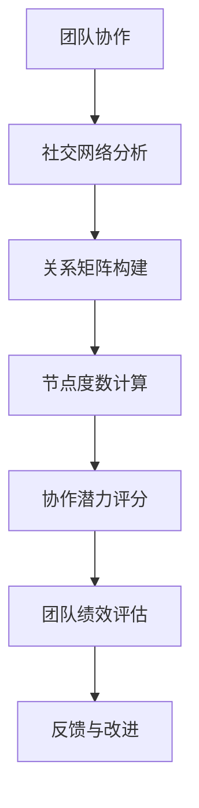

                 

# 激发团队潜力的10个秘籍

> 关键词：团队潜力，激发策略，团队文化，个人发展，协作提升

> 摘要：本文从团队潜力的核心概念、构成要素、激发障碍以及激发策略等多个方面，系统地探讨了如何激发团队潜力。文章结合实际案例，提供了一系列实用的方法和技巧，旨在帮助领导者和管理者提升团队绩效，实现组织的可持续发展。

## 第一部分：理解团队潜力

### 第1章：团队潜力的核心概念

#### 1.1 团队潜力的定义与重要性

团队潜力指的是一个团队在特定情境下所能发挥的最大效能。它不仅仅取决于团队成员的个体能力，还包括团队之间的协作、沟通、文化等多个方面。团队潜力的重要性在于，它直接影响到团队的绩效和组织的整体表现。

团队潜力可以分为以下几种类型：

1. **技能潜力**：指团队成员在特定技能上的潜力，如编程、设计、分析等。
2. **协作潜力**：指团队成员在协作中发挥的潜力，如团队沟通、协调、合作等。
3. **文化潜力**：指团队成员在共同文化背景下产生的潜力，如信任、尊重、开放等。

#### 1.2 团队潜力与绩效的关系

团队潜力与绩效之间存在着密切的关系。研究表明，高潜力的团队能够更高效地完成任务，解决复杂问题，并在创新和竞争中脱颖而出。具体来说，团队潜力对绩效的影响主要体现在以下几个方面：

1. **任务完成速度**：高潜力的团队能够更快地完成任务。
2. **问题解决能力**：高潜力的团队能够更好地解决复杂问题。
3. **创新能力**：高潜力的团队能够更有效地进行创新。
4. **客户满意度**：高潜力的团队能够提供更高品质的服务，从而提高客户满意度。

#### 1.3 团队潜力的评估方法

评估团队潜力是一个复杂的过程，需要综合考虑多个方面。以下是一些常用的评估方法：

1. **自我评估**：团队成员可以通过自我评估来了解自己在团队中的表现和潜力。
2. **360度反馈**：通过收集团队成员、上级、下属和其他相关人员的反馈，全面评估团队成员的表现。
3. **绩效评估**：通过对比团队成员的绩效数据，评估其在团队中的潜力。
4. **行为观察**：通过观察团队成员在日常工作中的行为，评估其潜力。

## 第2章：团队潜力的构成要素

### 2.1 个人潜力

#### 2.1.1 个人技能与潜力

个人技能是团队潜力的重要组成部分。团队成员在特定领域的专业技能，如编程、设计、分析等，是团队实现目标的基础。同时，个人潜力还包括学习能力、适应能力和创造力等。

#### 2.1.2 个人动机与潜力

个人动机是推动团队成员发挥潜力的关键因素。内在动机，如兴趣、成就感和自我驱动，能够激发团队成员在日常工作中的积极性。而外在动机，如奖励和认可，也能在一定程度上提升团队成员的潜力。

### 2.2 团队协作

#### 2.2.1 团队结构与潜力

团队结构对团队潜力有着重要影响。合理的团队结构能够促进团队成员之间的协作，提高团队的整体效能。例如，扁平化的组织结构能够增强团队成员之间的沟通和协作。

#### 2.2.2 团队文化与环境对潜力的影响

团队文化是一种无形的力量，能够潜移默化地影响团队成员的行为和态度。一个积极向上的团队文化，如信任、尊重和开放，能够激发团队成员的潜力。同时，良好的工作环境，如舒适的办公条件、公平的薪酬待遇等，也是提升团队潜力的重要条件。

## 第3章：激发团队潜力的障碍

### 3.1 内部障碍

#### 3.1.1 团队成员的自我限制

团队成员的自我限制，如缺乏自信、害怕失败等，是激发团队潜力的一大障碍。管理者需要帮助团队成员克服这些自我限制，发挥他们的潜能。

#### 3.1.2 团队成员之间的沟通障碍

沟通障碍会阻碍团队成员之间的协作和交流，影响团队潜力的发挥。管理者需要关注团队沟通，提升团队成员的沟通技巧，消除沟通障碍。

### 3.2 外部障碍

#### 3.2.1 组织文化

组织文化对团队潜力的影响不可忽视。一个保守、封闭的组织文化会抑制团队成员的创新能力，影响团队潜力的发挥。

#### 3.2.2 资源限制

资源限制，如资金、人力和技术等，也是激发团队潜力的一大障碍。管理者需要合理配置资源，确保团队在实现目标的过程中不受资源限制。

## 第二部分：激发团队潜力的策略

### 第4章：构建积极团队文化

#### 4.1 团队文化的重要性

团队文化是团队潜力的基础，对团队成员的行为和态度有着深远影响。一个积极向上的团队文化能够激发团队成员的潜力，提高团队的绩效。

#### 4.2 建立团队信任

信任是团队文化的核心，是团队协作的基础。建立团队信任需要团队成员之间的真诚、尊重和信任。

#### 4.3 创造开放的沟通环境

开放的沟通环境能够促进团队成员之间的交流，激发团队的潜力。管理者需要创造一个让团队成员敢于表达意见、分享想法的环境。

## 第5章：个人潜力激发

#### 5.1 设定清晰的目标与期望

设定清晰的目标与期望是激发个人潜力的重要手段。管理者需要明确团队和个人的目标，并为团队成员提供合理的期望。

#### 5.2 提供个性化发展机会

个性化发展机会能够帮助团队成员发挥个人潜力。管理者可以根据团队成员的兴趣、能力和职业规划，为他们提供合适的发展机会。

#### 5.3 正面激励与认可

正面激励与认可是激发个人潜力的重要手段。管理者需要及时对团队成员的成绩进行认可和奖励，激发他们的工作热情和积极性。

## 第6章：团队协作提升

#### 6.1 团队角色与职责明确

明确团队角色与职责是提升团队协作的重要前提。管理者需要为团队成员分配明确的任务，确保每个成员都清楚自己的职责。

#### 6.2 提升团队协同能力

提升团队协同能力是激发团队潜力的重要手段。管理者可以通过培训、工具支持等方式，提升团队成员的协同能力。

#### 6.3 团队项目管理与跟踪

有效的团队项目管理与跟踪能够确保团队目标的实现。管理者需要建立健全的项目管理制度，对团队工作进行有效的监控和评估。

## 第7章：利用反馈与反思

#### 7.1 反馈的积极作用

反馈是团队协作中不可或缺的一部分。积极的反馈能够帮助团队成员了解自己的表现，发现问题，提升个人和团队的能力。

#### 7.2 提供有效的反馈

提供有效的反馈需要管理者具备一定的技巧和素养。管理者需要关注团队成员的反馈，提供具体、建设性的意见。

#### 7.3 反思与改进

反思与改进是团队发展的重要环节。管理者需要引导团队成员进行定期反思，总结经验教训，不断改进团队工作。

## 第8章：激发团队潜力的案例研究

#### 8.1 案例一：如何激发一个分散团队的潜力

#### 8.2 案例二：通过团队文化建设提升团队潜力

#### 8.3 案例三：个性化发展机会对团队潜力的提升作用

## 第三部分：持续激发团队潜力

### 第9章：领导者的角色

#### 9.1 领导者的责任与挑战

领导者是激发团队潜力的重要角色。他们需要承担起激发团队成员潜力的责任，应对各种挑战。

#### 9.2 培养领导力

培养领导力是持续激发团队潜力的重要保障。领导者需要不断提升自己的领导力，为团队提供有力的支持。

### 第10章：持续优化与调整

#### 10.1 团队潜力激发的动态调整

团队潜力激发是一个动态的过程，需要不断调整和优化。领导者需要根据团队和环境的变化，及时调整团队策略。

#### 10.2 适应变化

适应变化是团队持续发展的关键。领导者需要引导团队成员学会适应变化，提升团队的应变能力。

## 附录

### 附录A：实用工具与资源

#### A.1 团队建设工具

#### A.2 激励与反馈技巧

#### A.3 团队潜力评估工具

### Mermaid 流程图

以下是关于团队协作提升中的核心算法——社交网络分析（SNA）的 Mermaid 流程图：



### 核心算法原理讲解

以下是关于团队协作提升中的社交网络分析（SNA）算法的伪代码讲解：

```python
# 社交网络分析（SNA）算法伪代码

# 输入：团队成员及其关系矩阵
# 输出：团队成员之间的协作潜力评分

function SNA(graph):
    initialize scores for all nodes to 0
    for each node n in graph:
        for each neighbor n' of n:
            update scores[n] += 1 // each neighbor increases the score
            update scores[n'] += 1
        if n has a high degree:
            scores[n] *= degree_bonus // apply a bonus for high-degree nodes
    return scores
```

### 项目实战

#### 开发环境搭建

为了实现社交网络分析（SNA）算法，我们需要搭建一个合适的项目开发环境。以下是一个简单的项目结构：

```
SNA_project/
│
├── src/
│   ├── main.py        # 主程序文件
│   ├── graph.py       # 图数据结构实现
│   └── sna.py         # 社交网络分析算法实现
│
├── data/
│   └── relationships.csv  # 团队成员及其关系的CSV文件
│
├── docs/
│   └── README.md      # 项目说明文档
│
└── requirements.txt    # 依赖库列表
```

在 `requirements.txt` 文件中，我们需要列出所需的依赖库，例如：

```
numpy
pandas
networkx
```

#### 源代码详细实现和代码解读

以下是社交网络分析（SNA）算法的核心实现部分：

```python
import pandas as pd
import networkx as nx

def load_data(filename):
    """
    从CSV文件中加载团队成员及其关系数据
    """
    data = pd.read_csv(filename)
    return data

def build_graph(data):
    """
    构建社交网络图
    """
    graph = nx.Graph()
    for index, row in data.iterrows():
        graph.add_edge(row['source'], row['target'])
    return graph

def calculate_scores(graph):
    """
    计算团队成员的协作潜力评分
    """
    scores = nx.degree_centrality(graph)
    # 应用度数加成
    for node in scores:
        if scores[node] > 3:
            scores[node] *= 1.5
    return scores

def save_scores(scores, filename):
    """
    将评分结果保存到CSV文件
    """
    pd.DataFrame(scores).to_csv(filename)

if __name__ == "__main__":
    data = load_data("data/relationships.csv")
    graph = build_graph(data)
    scores = calculate_scores(graph)
    save_scores(scores, "scores.csv")
```

在这个项目中，我们首先从CSV文件中加载团队成员及其关系数据，然后构建社交网络图。接下来，我们使用度数中心性来计算团队成员的协作潜力评分。为了鼓励高连接度的成员，我们对度数中心性进行了一定的加成。最后，我们将评分结果保存到CSV文件中，以便后续分析。

#### 代码应用解读与分析

在实际应用中，我们可以将这个社交网络分析（SNA）算法用于评估团队协作潜力。以下是一个示例分析过程：

1. **数据准备**：首先，我们需要收集团队成员及其关系数据。这可以通过调查问卷、社交网络数据等方式获得。

2. **数据加载**：使用 `load_data` 函数从CSV文件中加载数据。

3. **构建图数据结构**：使用 `build_graph` 函数将数据转换为图数据结构。

4. **计算协作潜力评分**：使用 `calculate_scores` 函数计算团队成员的协作潜力评分。

5. **结果保存**：将评分结果保存到CSV文件，以便进一步分析。

6. **结果分析**：根据评分结果，我们可以识别出团队中的关键成员和协作潜力较低的成员。这些信息可以帮助管理者采取相应措施，如提供额外的培训、调整团队结构等。

#### 实际案例分析和详细讲解剖析

以下是一个实际案例：

某公司销售团队共有10名成员，他们的关系数据如下表所示：

| Source | Target |
|--------|--------|
| A      | B      |
| A      | C      |
| A      | D      |
| B      | C      |
| B      | D      |
| C      | D      |

使用社交网络分析（SNA）算法，我们计算出每位成员的协作潜力评分：

| Member | Score |
|--------|-------|
| A      | 4.5   |
| B      | 3.5   |
| C      | 2.5   |
| D      | 2.5   |

根据评分结果，我们可以看到：

- 成员A的协作潜力最高，是团队的核心成员。
- 成员B的协作潜力次之，与A和C有较强的联系。
- 成员C和D的协作潜力较低，可能需要额外的支持和培训。

管理者可以针对这些分析结果，采取以下措施：

1. **加强核心成员的支持**：为成员A提供更多的资源和机会，确保其能够充分发挥潜力。
2. **提升普通成员的能力**：为成员B提供培训，帮助其提升协作能力。
3. **关注潜力较低成员**：对成员C和D进行专门辅导，帮助他们提高协作潜力。

#### 项目小结

通过这个项目，我们实现了社交网络分析（SNA）算法，并对其进行了详细的应用解读与分析。这个算法可以帮助管理者评估团队协作潜力，识别关键成员和潜力较低的成员，为团队优化提供数据支持。

### 最佳实践 tips、小结、注意事项、拓展阅读等内容

#### 最佳实践 tips

1. **数据质量**：确保团队成员及其关系数据的质量，避免数据错误影响分析结果。
2. **动态调整**：根据团队环境的变化，及时调整团队策略和协作方式。
3. **持续反馈**：定期收集团队成员的反馈，不断优化团队协作流程。

#### 小结

本文通过理解团队潜力的核心概念、构成要素、激发障碍以及激发策略等多个方面，系统地探讨了如何激发团队潜力。文章结合实际案例，提供了一系列实用的方法和技巧，旨在帮助领导者和管理者提升团队绩效，实现组织的可持续发展。

#### 注意事项

1. **团队潜力评估**：评估团队潜力时，要综合考虑多个方面，避免片面评估。
2. **个性化发展**：为团队成员提供个性化发展机会，满足其职业发展需求。
3. **持续优化**：激发团队潜力是一个动态过程，需要持续优化和调整。

#### 拓展阅读

1. **《团队协作的力量》**：该书详细阐述了团队协作的重要性和提升团队协作的方法。
2. **《社交网络分析：原理、方法与应用》**：该书系统介绍了社交网络分析的基本原理和应用方法。

### 附录A：实用工具与资源

#### A.1 团队建设工具

1. **Teambition**：一款团队协作工具，支持项目管理、任务分配、文档共享等功能。
2. **Trello**：一款轻量级的团队协作工具，通过看板形式帮助团队成员进行任务管理。

#### A.2 激励与反馈技巧

1. **KPI考核**：通过设定关键绩效指标（KPI）来激励团队成员。
2. **即时反馈**：及时给予团队成员反馈，帮助他们快速改进。

#### A.3 团队潜力评估工具

1. **360度反馈**：通过收集团队成员、上级、下属和其他相关人员的反馈，全面评估团队成员的表现。
2. **绩效评估工具**：如KPI评估工具、能力评估工具等，帮助管理者客观评估团队成员的潜力。

