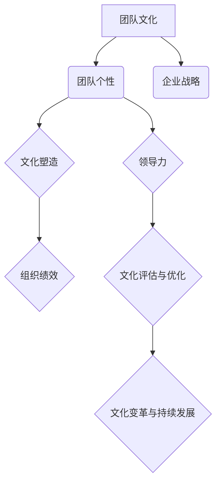

                 

### 文章标题：独特团队文化：塑造团队个性

在当今快速变化和竞争激烈的市场环境中，团队文化成为了企业成功的关键因素之一。本文将探讨独特团队文化的概念与重要性，分析如何构建和塑造具有个性的团队文化，并探讨团队个性与文化塑造的策略与实践。我们还将讨论团队个性与文化之间的平衡，领导力在团队文化塑造中的作用，以及团队文化与企业战略的融合。最后，通过实践指南和案例分析，提供具体的操作方法和实用建议。

#### 关键词：团队文化、个性塑造、组织绩效、领导力、企业战略

> **摘要：**本文通过对独特团队文化的概念、构建、个性塑造、文化塑造策略和实践的深入探讨，分析了团队个性与文化之间的关系，以及领导力在团队文化中的关键作用。文章旨在为企业提供构建和优化团队文化的实际操作指南，帮助企业在竞争激烈的市场中脱颖而出。

### 第一部分：独特团队文化的概念与重要性

#### 第1章：团队文化概述

**1.1 团队文化的定义与构成**

团队文化是指团队成员共同遵循的价值观、信仰、行为规范和共同目标，它构成了团队的精神面貌和行为指南。团队文化的定义可以进一步细化为以下几个方面：

- **共同价值观**：团队文化中的核心价值观是团队成员共同认可和遵循的基本原则，如诚信、创新、团队合作等。
- **行为规范**：团队文化中的行为规范是团队成员在互动过程中应遵循的行为准则，如尊重、协作、开放沟通等。
- **共同目标**：团队文化中的共同目标是团队成员共同追求的愿景和目标，它激励团队成员共同努力，达成团队的成功。

团队文化的构成要素主要包括以下几个方面：

- **价值观**：价值观是团队文化的核心，它决定了团队的行为方式和决策方向。
- **行为规范**：行为规范是团队文化的外在表现，它规范了团队成员的行为，确保团队内部的和谐与协作。
- **共同目标**：共同目标是团队文化的驱动力，它激励团队成员为实现团队目标而努力。

**1.2 团队文化与组织绩效**

团队文化对组织绩效具有重要影响。一个健康的团队文化能够提升团队的协作效率，促进创新和创造力，从而提高组织的整体绩效。具体来说，团队文化对组织绩效的影响体现在以下几个方面：

- **提升协作效率**：健康的团队文化鼓励团队成员之间的协作与沟通，减少冲突和误解，从而提高团队的工作效率。
- **促进创新和创造力**：团队文化中的开放和包容氛围能够激发团队成员的创新思维，促进团队内部的创造力发展。
- **增强团队凝聚力**：健康的团队文化能够增强团队成员之间的凝聚力，使团队在面对挑战时更加团结一致。

**1.3 团队文化与传统管理模式**

传统管理模式侧重于权威和层级，强调命令与控制。而团队文化则更加注重平等、协作和自主管理。二者之间的区别主要体现在以下几个方面：

- **权威与平等**：传统管理模式中，领导拥有绝对的权威，团队成员被动执行命令。而团队文化则强调平等，鼓励团队成员积极参与决策，发挥个人潜力。
- **命令与控制与协作与激励**：传统管理模式依赖于命令与控制，通过严格的规章制度来管理团队成员。而团队文化则更注重协作与激励，通过共同的目标和价值观来引导团队成员的行为。
- **层级与网络**：传统管理模式通常采用层级结构，信息传递和决策流程较为单一。而团队文化则更倾向于网络结构，信息传递和决策流程更加开放和灵活。

**1.3 团队文化在组织变革中的应用**

随着市场的变化和技术的进步，组织需要不断进行变革以适应新的环境和挑战。团队文化在组织变革中发挥着重要作用。具体来说，团队文化在组织变革中的应用体现在以下几个方面：

- **促进变革接受**：健康的团队文化能够促进团队成员对变革的接受和适应，减少变革过程中的阻力和冲突。
- **推动创新和灵活性**：团队文化中的开放和包容氛围能够激发团队成员的创新思维和灵活性，帮助组织在变革中抓住机遇。
- **强化团队协作**：团队文化中的协作精神能够增强团队成员之间的合作，共同应对变革带来的挑战。

总之，团队文化是组织成功的关键因素之一。一个健康的团队文化能够提升团队的协作效率，促进创新和创造力，从而提高组织的整体绩效。同时，团队文化在组织变革中也发挥着重要作用，帮助组织适应新的环境和挑战。因此，组织需要重视团队文化的建设，通过确立共同的价值观、规范行为和共同目标，塑造具有个性的团队文化。

### 第二部分：构建独特团队文化

#### 第2章：构建独特团队文化

构建独特团队文化是组织发展的关键步骤，它能够帮助团队在竞争激烈的市场环境中脱颖而出。独特团队文化不仅体现了组织的核心价值观和行为准则，还能够激发团队成员的创造力和归属感。本章节将探讨如何确定团队价值观、培养团队协作精神和建立有效的沟通机制。

**2.1 确定团队价值观**

确定团队价值观是构建独特团队文化的第一步。团队价值观是团队成员共同遵循的基本原则，它为团队提供了明确的方向和共同的目标。以下是确定团队价值观的方法和步骤：

- **1. 内部讨论**：组织团队成员进行内部讨论，共同探讨团队所追求的核心价值观。讨论可以采用头脑风暴、小组讨论等形式，鼓励每个成员分享自己的想法和观点。
- **2. 收集意见**：通过问卷调查、访谈等方式收集团队成员的意见和建议。这有助于了解团队成员对团队价值观的看法和期望，为确定最终的核心价值观提供参考。
- **3. 整合意见**：将收集到的意见和建议进行整合，找出共同认可的价值观。这些价值观应该具有普遍性，能够被所有团队成员接受和遵循。
- **4. 确定核心价值观**：根据整合的意见，确定团队的核心价值观。这些价值观应该简洁明了，容易理解和记忆，同时具有实际可操作性和指导性。

**2.2 团队价值观的传达与强化**

确定团队价值观后，需要将其传达和强化给团队成员。以下是一些有效的传达与强化策略：

- **1. 定期培训**：组织定期的团队价值观培训，通过讲座、研讨会等形式向团队成员传达核心价值观。培训内容可以包括价值观的内涵、应用和实践案例等。
- **2. 日常工作**：在团队日常工作中，通过具体的行为和决策来体现和强化团队价值观。例如，在团队讨论中强调诚信、创新等价值观，并在实际工作中加以实践。
- **3. 反馈机制**：建立有效的反馈机制，鼓励团队成员提出关于团队价值观的反馈和建议。这有助于发现团队价值观在实践中存在的问题，并及时进行调整和改进。
- **4. 文化符号**：通过设计独特的文化符号，如团队徽标、文化手册等，来强化团队价值观。这些文化符号能够帮助团队成员时刻牢记和遵循团队价值观。

**2.3 培养团队协作精神**

团队协作精神是团队文化的核心要素之一，它能够提高团队的协作效率，促进团队创新和创造力。以下是培养团队协作精神的几种方法：

- **1. 定期团队建设活动**：组织定期的团队建设活动，如团队拓展训练、团队聚餐等，增强团队成员之间的互信和默契。这些活动能够帮助团队成员更好地了解彼此，促进协作。
- **2. 激励机制**：建立合理的激励机制，鼓励团队成员积极参与团队合作。激励机制可以包括物质奖励、荣誉表彰等，以激发团队成员的积极性和主动性。
- **3. 透明的沟通渠道**：建立透明的沟通渠道，确保团队成员之间的信息畅通无阻。这可以通过建立内部论坛、定期团队会议等形式实现，鼓励团队成员自由表达意见和观点。
- **4. 分享与学习**：鼓励团队成员分享经验和知识，通过学习交流提升团队整体能力。这可以通过内部培训、学习小组等形式实现，帮助团队成员相互学习和成长。

**2.4 建立有效的沟通机制**

有效的沟通机制是团队文化的重要组成部分，它能够提高团队的工作效率，减少误解和冲突。以下是建立有效沟通机制的几种方法：

- **1. 明确沟通目标**：在每次沟通前，明确沟通的目标和主题，确保沟通的针对性和有效性。这可以通过制定会议议程、明确沟通任务等方式实现。
- **2. 开放的沟通氛围**：营造开放和包容的沟通氛围，鼓励团队成员自由表达意见和观点。这可以通过建立反馈机制、鼓励提问等方式实现，避免压抑和误解。
- **3. 有效的沟通技巧**：提高团队成员的沟通技巧，包括倾听、表达、反馈等。这可以通过培训、模拟沟通等方式实现，帮助团队成员更好地进行沟通。
- **4. 多样化的沟通方式**：采用多样化的沟通方式，如面对面沟通、电话沟通、邮件沟通等，以满足不同情境和需求。这可以通过制定沟通策略、明确沟通方式等方式实现。

通过以上方法和策略，组织可以构建独特的团队文化，激发团队成员的创造力和归属感，提高团队的整体绩效和竞争力。构建独特团队文化需要长期的努力和实践，但只有通过不断优化和改进，才能实现团队的可持续发展。

### 第三部分：团队个性与文化塑造

#### 第3章：团队个性的定义与识别

团队个性是指团队在长期互动过程中形成的独特特质和风格，它反映了团队的整体气质和行为模式。团队个性的识别和塑造是团队文化建设的重要环节，它有助于提升团队的凝聚力和协作效率。以下是关于团队个性的定义、识别方法及其对团队文化影响的探讨。

**3.1 团队个性的概念**

团队个性可以被视为团队的“人格特质”，它是在团队成员的互动和合作中逐渐形成的。团队个性不仅仅是个体特质在团队层面的简单叠加，而是通过团队成员之间的相互作用和共同经历所塑造出来的独特整体特征。以下是团队个性的几个关键特点：

- **独特性**：每个团队都有其独特的个性，这种个性是由团队成员的背景、经验、价值观和行为方式共同塑造的。
- **稳定性**：团队个性一旦形成，就会在较长的时间内保持稳定，不容易受到外部环境变化的影响。
- **适应性**：虽然团队个性具有稳定性，但团队也需要具备一定的适应性，以便在面临新的挑战和变化时进行调整。

**3.2 团队个性的识别方法**

识别团队个性需要采用多种方法，以全面了解团队的特质和风格。以下是几种常用的识别方法：

- **观察与反馈**：通过观察团队成员在日常工作中的行为和互动，管理者可以初步了解团队的个性和风格。此外，通过定期收集团队成员的反馈，可以更深入地了解团队的感受和意见。
- **心理测评与评估**：使用专业的心理测评工具，如MBTI（迈尔斯-布里格斯类型指标）、HBDI（赫伊尔个性化指标）等，可以量化地分析团队成员的个性特征，帮助识别团队的个性类型。
- **行为记录**：记录团队在项目执行过程中的行为和决策，分析团队在面临不同情境时的反应和策略，有助于理解团队的整体风格和特质。

**3.3 团队个性对团队文化的影响**

团队个性对团队文化有着深远的影响，它不仅决定了团队的工作氛围和行为方式，还对团队的绩效和创新力产生重要影响。以下是团队个性对团队文化的几个主要影响：

- **协作效率**：不同的团队个性会导致不同的协作模式。例如，高度个体化的团队可能更注重个人贡献，而高凝聚力的团队则更注重团队合作。团队个性对协作效率的影响取决于团队的具体情况和任务需求。
- **创新与创造力**：团队个性可以激发或抑制创新和创造力。一个具有高度开放性和探索精神的团队更有可能产生创新的想法和解决方案，而一个过于保守和循规蹈矩的团队则可能阻碍创新。
- **冲突管理**：团队个性不同可能导致冲突，但也可以通过团队文化的引导和调解来管理冲突。例如，一个具有高协作精神和包容性的团队可以更容易地解决内部冲突，而一个高度竞争的团队则需要更有效的冲突管理策略。

**3.4 团队个性与文化塑造的关系**

团队个性和团队文化之间存在密切的关系。团队个性不仅受到文化的影响，同时也会影响文化的形成和发展。以下是团队个性和文化塑造之间的几个关键关系：

- **相互影响**：团队个性和文化是相互作用的，团队个性会影响团队文化的形成，而团队文化又会反过来塑造团队个性。例如，一个强调创新和开放的文化会鼓励团队成员尝试新的想法和方法，从而培养出更具创新精神的团队个性。
- **动态平衡**：团队个性和文化之间需要保持一种动态平衡。文化需要为团队个性提供支持和引导，同时团队个性也需要适应和融合到文化中。这种平衡有助于团队长期稳定和可持续发展。

总之，团队个性是团队文化的重要组成部分，它通过影响团队协作效率、创新力和冲突管理等方面，对团队文化产生深远的影响。通过识别和塑造团队个性，组织可以更好地构建和优化团队文化，提高团队的绩效和竞争力。同时，组织也需要认识到团队个性和文化之间的动态关系，不断调整和优化，以实现团队的可持续发展。

### 第四部分：文化塑造策略与实践

#### 第4章：文化塑造策略与实践

团队文化的塑造是一个系统工程，需要明确的原则、有效的策略和具体的实践方法。在这一章节中，我们将深入探讨文化塑造的基本原则、具体策略以及实践案例，帮助组织在实践中有效地构建和优化团队文化。

**4.1 文化塑造的原则**

文化塑造是一个渐进和动态的过程，需要遵循以下基本原则：

- **目标明确**：在塑造文化时，首先要明确文化目标，即组织希望团队文化体现的核心价值观和行为规范。这些目标应该是具体、明确和可衡量的。
- **全员参与**：文化塑造不仅仅是领导层的事务，需要全员参与。通过让团队成员参与文化塑造的过程，可以增强他们的认同感和参与感，从而更有效地推动文化的落实。
- **持续优化**：文化塑造是一个持续的过程，需要不断地调整和优化。组织应该定期评估文化塑造的效果，根据实际情况进行调整，确保文化始终与组织的目标和需求保持一致。
- **以身作则**：领导者应该在文化塑造中起到表率作用。通过自身的言行一致，领导者可以树立榜样，引导团队成员遵循文化规范，从而推动文化的传播和落地。

**4.2 文化塑造的策略**

为了有效地塑造团队文化，组织可以采取以下策略：

- **倡导价值观**：通过内部宣传、培训等方式，不断倡导和强化组织的核心价值观。这可以通过举办文化主题活动、发布文化手册、制作文化宣传片等形式实现。
- **建立文化符号**：设计独特的文化符号，如团队徽标、文化标识等，使团队成员能够时刻感受到文化的存在。这些文化符号可以成为团队文化的象征，增强团队成员的归属感和认同感。
- **制度与机制保障**：通过建立相应的制度与机制，确保文化能够在组织中落地和执行。例如，制定文化考核指标，将文化表现纳入绩效考核体系，激励团队成员积极践行文化。
- **提供发展机会**：为团队成员提供发展和成长的机会，鼓励他们在实践中践行文化。这可以通过培训、轮岗、项目支持等方式实现，使团队成员在实践中感受到文化的价值。

**4.3 文化塑造实践案例**

以下是一些成功的文化塑造实践案例：

- **谷歌**：谷歌以其独特的公司文化而闻名，倡导创新、开放和自主学习。谷歌通过建立“20%时间”项目，允许员工用20%的工作时间自由探索新项目，这极大地激发了员工的创新力。
- **华为**：华为注重团队合作和共同目标，通过“奋斗者文化”激励员工为实现公司目标而努力。华为的“三个习惯”文化（说真话、敢于承担责任、持续学习）成为员工行为的准则。
- **阿里巴巴**：阿里巴巴强调“客户第一、员工第二、股东第三”的价值观，通过“六脉神剑”文化手册向员工传达公司的核心价值观和行为规范。阿里巴巴还通过“夜文化”活动，增强员工的凝聚力和归属感。

这些案例表明，成功的文化塑造不仅需要明确的价值观和有效的策略，还需要在实践中不断调整和优化，以适应组织的发展和变化。

**4.4 文化塑造的关键因素**

在文化塑造过程中，以下因素尤为关键：

- **领导力**：领导者在文化塑造中起到关键作用。领导者的言行一致、积极倡导和身体力行是文化塑造成功的重要保障。
- **沟通**：有效的沟通是文化塑造的基础。组织需要建立开放的沟通渠道，确保文化信息能够及时、准确地传达给每个团队成员。
- **激励**：激励机制能够增强团队成员对文化的认同感和践行意愿。通过奖励和表彰，组织可以激励团队成员积极践行文化。
- **实践**：文化需要在实践中不断验证和优化。通过实际项目和日常工作，团队成员可以亲身体验文化的价值和效果，从而更好地理解和认同文化。

总之，文化塑造是一个系统工程，需要明确的原则、有效的策略和具体的实践方法。通过倡导价值观、建立文化符号、制度保障和提供发展机会，组织可以有效地构建和优化团队文化，提高团队的绩效和竞争力。

### 第五部分：团队个性与文化的平衡

#### 第5章：团队个性与文化的平衡

在团队文化的塑造过程中，团队个性与文化之间的平衡是一个重要的议题。合理的平衡不仅能够激发团队成员的个性和创造力，还能确保团队文化的有效传承和实施。在这一章节中，我们将探讨团队个性与文化冲突的处理方法、文化融合的策略以及如何保持团队文化的活力和可持续性。

**5.1 团队个性与文化冲突**

团队个性与文化冲突是文化塑造过程中常见的问题。冲突的产生通常源于以下原因：

- **价值观差异**：团队成员的价值观可能与文化中的核心价值观存在差异，导致行为和决策上的不一致。
- **行为规范冲突**：团队成员在遵循文化规范时，可能会遇到个人习惯和团队规范之间的矛盾。
- **目标冲突**：团队成员的个人目标和团队目标之间可能存在不一致，导致团队协作效率降低。

处理团队个性与文化冲突的方法包括：

- **沟通与对话**：通过开放的沟通和对话，了解团队成员的担忧和意见，寻找共识和解决方案。这可以帮助团队成员更好地理解文化，并减少因误解和误判而产生的冲突。
- **个性化引导**：针对团队成员的个性特点，提供个性化的引导和辅导，帮助他们更好地适应和融合到团队文化中。
- **弹性机制**：在制定团队规范和文化准则时，考虑团队成员的个性和差异，建立一定的弹性机制，允许团队成员在遵守基本准则的前提下，发挥个性。

**5.2 团队个性与文化融合**

团队个性与文化融合是团队文化塑造的理想状态。融合的过程包括以下策略：

- **文化包容性**：建立包容性的文化氛围，鼓励团队成员表达个性和差异，同时确保这些个性能与团队文化和谐共存。
- **共同目标**：明确团队共同目标，让团队成员在实现目标的过程中感受到个性和文化的融合。共同目标可以作为团队凝聚力的基础，促进团队成员对文化价值的认同。
- **培训与发展**：通过培训和发展项目，提高团队成员对团队文化的理解，增强他们对文化价值的认同。这可以通过文化讲座、工作坊等形式实现。

**5.3 团队个性与文化的可持续性**

保持团队文化的活力和可持续性是团队长期发展的关键。以下是几个关键因素：

- **文化创新**：团队文化需要不断创新，以适应外部环境的变化和内部需求的发展。通过定期评估和更新文化内容，确保文化始终与组织的目标和价值观保持一致。
- **领导力传承**：领导力是文化传承的关键。通过培养和选拔具有文化传承意识的领导者，确保文化在组织内部得到持续传递和落实。
- **员工参与**：员工的参与是文化可持续性的重要保障。通过鼓励员工积极参与文化建设和实践，增强他们对文化的认同和责任感。
- **激励机制**：建立有效的激励机制，奖励那些在文化传承和实践中表现突出的员工。这可以激发员工的积极性，促进文化的持续发展。

总之，团队个性与文化的平衡是团队文化塑造中的关键问题。通过合理处理个性与文化冲突、实现个性与文化的融合，并保持文化的活力和可持续性，组织可以构建一个健康、和谐且富有创新力的团队文化，从而在激烈的市场竞争中脱颖而出。

### 第六部分：团队文化与领导力

#### 第6章：领导力在团队文化塑造中的作用

领导力在团队文化塑造中扮演着至关重要的角色。一个优秀的领导者不仅能够确立和传播团队文化，还能够通过自身的榜样作用和有效的领导方法，推动团队文化的深入落实和持续发展。在本章节中，我们将探讨领导力对团队文化的影响、领导者在文化塑造中的角色与职责，以及提升领导力的策略与实践技巧。

**6.1 领导力与团队文化**

领导力与团队文化之间存在着密切的互动关系。优秀的领导力能够塑造和强化团队文化，具体表现在以下几个方面：

- **确立文化方向**：领导者通过明确的文化愿景和目标，为团队文化的发展指明方向。这可以帮助团队成员理解文化的核心价值和行为准则，从而更好地践行文化。
- **传播文化价值观**：领导者通过言行一致，向团队成员传达和强化文化价值观。他们的行为是团队成员模仿的榜样，能够显著影响团队文化的发展。
- **促进文化认同**：领导者通过激励和引导，促进团队成员对团队文化的认同和接受。这有助于形成共同的文化信仰，增强团队的凝聚力和归属感。
- **管理文化冲突**：在团队文化塑造过程中，领导者需要处理文化冲突。通过有效的沟通和调解，领导者可以缓解文化冲突，促进文化的和谐发展。

**6.2 领导者的角色与职责**

在团队文化塑造中，领导者扮演着多重角色，承担着重要的职责：

- **文化倡导者**：领导者作为文化的倡导者，负责宣传和推广团队文化，确保团队成员理解和接受文化价值观。
- **文化设计师**：领导者需要参与文化设计，制定文化准则和行为规范，为团队文化的发展奠定基础。
- **文化监督者**：领导者要监督文化实施的情况，确保团队成员在实际工作中践行文化价值观。通过监督和反馈，领导者可以及时发现和解决文化问题。
- **文化维护者**：领导者需要持续维护和更新团队文化，确保文化能够与组织的发展和外部环境的变化保持同步。

**6.3 领导力提升策略**

为了有效地塑造团队文化，领导者需要不断提升自身的领导力。以下是几种提升领导力的策略：

- **自我反思**：领导者需要定期进行自我反思，审视自己的行为和决策是否符合团队文化的价值观。通过反思，领导者可以更好地理解自身在文化塑造中的作用和责任。
- **持续学习**：领导者需要不断学习和更新知识，了解最新的管理理论和实践方法。这有助于领导者更好地应对复杂的管理挑战，推动团队文化的创新发展。
- **培养影响力**：领导者需要通过有效的沟通和激励，增强对团队成员的影响力。通过建立信任和尊重的关系，领导者可以更好地推动团队文化的落实。
- **参与实践**：领导者需要积极参与团队的实际工作，了解团队成员的需求和挑战。通过实际参与，领导者可以更好地理解文化实施的具体情况，提出有针对性的改进措施。

**6.4 领导力提升的实践技巧**

以下是几种提升领导力的实践技巧：

- **建立有效的沟通机制**：领导者需要建立开放的沟通渠道，鼓励团队成员表达意见和建议。通过有效的沟通，领导者可以更好地了解团队成员的需求和期望，从而更好地推动团队文化的实施。
- **设立明确的目标和期望**：领导者需要为团队成员设立明确的目标和期望，确保团队成员了解文化要求和组织目标。通过明确的目标和期望，领导者可以更好地引导团队成员的行为和决策。
- **提供反馈和支持**：领导者需要为团队成员提供及时的反馈和支持。通过反馈和支持，领导者可以帮助团队成员纠正错误、改进工作，从而更好地践行团队文化。
- **培养团队合作精神**：领导者需要通过团队合作活动，增强团队成员之间的协作和信任。通过团队合作，领导者可以培养团队成员的协作精神，促进团队文化的落实。

总之，领导力在团队文化塑造中发挥着关键作用。通过确立文化方向、传播文化价值观、促进文化认同和管理文化冲突，领导者可以有效地推动团队文化的发展。同时，领导者需要不断提升自身的领导力，通过自我反思、持续学习、培养影响力和参与实践，为团队文化的深入落实和持续发展提供有力保障。

### 第七部分：团队文化评估与优化

#### 第7章：团队文化评估与优化

团队文化是组织成功的关键因素之一，但如何确保其健康发展并持续优化是一个重要课题。在这一章节中，我们将探讨团队文化评估的方法、文化问题的诊断、优化策略以及具体的实施步骤。

**7.1 团队文化评估的方法**

有效的团队文化评估是优化团队文化的第一步。以下是几种常用的评估方法：

- **问卷调查**：通过设计专业的问卷，收集团队成员对团队文化的看法和反馈。问卷可以包括开放性和封闭性题目，涵盖文化认同、团队协作、领导风格等方面。
- **访谈**：与团队成员进行深入访谈，了解他们对团队文化的真实感受和看法。访谈可以帮助评估问卷无法涵盖的细节，提供更深入的理解。
- **观察**：观察团队成员在日常工作中的行为和互动，了解团队文化在实际中的应用和表现。通过观察，可以发现文化在实践中的问题。
- **第三方评估**：邀请外部专家或顾问对团队文化进行评估。第三方评估可以提供客观、中立的评估结果，帮助组织更好地了解团队文化的情况。

**7.2 文化问题诊断**

在评估团队文化后，组织需要诊断文化中存在的问题。以下是几种常用的诊断方法：

- **根因分析**：通过分析文化问题产生的原因，找出问题的根本原因。这可以帮助组织采取有针对性的措施，解决深层次的文化问题。
- **SWOT分析**：对团队文化的优势、劣势、机会和威胁进行综合分析。这有助于组织全面了解团队文化的现状，明确改进的方向。
- **文化地图**：通过绘制团队文化地图，直观地展示文化元素之间的关系和相互作用。文化地图可以帮助组织识别文化中的冲突和矛盾，提供改进的参考。

**7.3 团队文化优化策略**

在诊断出文化问题后，组织需要制定具体的优化策略。以下是几种常见的优化策略：

- **调整文化价值观**：根据评估和诊断的结果，对文化价值观进行调整。这可以确保文化价值观与组织的战略目标和实际情况相匹配，提高文化的实际效果。
- **强化培训和教育**：通过培训和教育，提升团队成员对文化价值观的认同和践行能力。培训可以包括文化理念讲解、案例分享、实战演练等。
- **建立反馈机制**：建立有效的反馈机制，鼓励团队成员提出关于文化问题的意见和建议。这可以帮助组织及时发现和解决文化问题，确保文化持续优化。
- **调整组织结构**：如果组织结构影响了团队文化的实施，需要考虑对组织结构进行调整。通过优化组织结构，可以促进文化在组织内部的传播和落实。

**7.4 团队文化优化实施步骤**

优化团队文化的实施步骤如下：

- **确定优化目标**：根据团队文化评估和问题诊断的结果，明确优化目标。这些目标应该是具体、明确和可衡量的，以便在实施过程中进行跟踪和评估。
- **制定优化计划**：制定详细的优化计划，包括优化措施、实施步骤、责任分工和时间安排。优化计划应该确保每个步骤都有明确的目标和执行方案。
- **实施优化措施**：根据优化计划，实施具体的优化措施。这可以包括培训、调整制度、改进流程等。
- **监测和评估**：在实施过程中，持续监测和评估优化措施的效果。通过监测和评估，可以及时发现和解决实施过程中出现的问题，确保优化措施的有效性。
- **调整和改进**：根据监测和评估的结果，对优化措施进行调整和改进。通过不断的调整和改进，可以确保团队文化不断优化和发展。

总之，团队文化评估与优化是一个持续的过程，需要组织高度重视并持续投入。通过有效的评估、诊断和优化策略，组织可以确保团队文化健康、持续发展，从而在激烈的市场竞争中脱颖而出。

### 第八部分：团队文化与企业战略

#### 第8章：团队文化与企业战略

团队文化是企业战略实施的重要支撑，它不仅影响企业的内部运作，也直接关系到企业的外部竞争力。在这一章节中，我们将探讨团队文化与企业战略的融合，分析文化驱动型战略的制定方法、优势与挑战，以及团队文化对企业绩效的影响。

**8.1 企业战略与团队文化**

企业战略与团队文化之间存在着密切的互动关系。企业战略是组织在市场中的定位和发展方向，而团队文化则是实现战略目标的重要基础。以下是企业战略与团队文化之间的几个关键关系：

- **共同愿景**：企业战略和团队文化都包含了对企业未来发展的共同愿景。通过确立共同愿景，企业战略与团队文化可以相互支持，共同推动企业向前发展。
- **行为规范**：企业战略需要通过团队文化来规范员工的行为和决策。团队文化中的价值观和行为准则可以引导员工在实现战略目标时做出正确的选择。
- **资源分配**：企业战略的制定和执行需要相应的资源和能力。团队文化中的协作精神和创新能力可以为企业战略的实施提供必要的资源和支持。

**8.2 文化驱动型战略**

文化驱动型战略是一种以团队文化为核心的战略模式，它通过强化和传承团队文化，推动企业的持续创新和竞争力提升。以下是文化驱动型战略的几个关键特征：

- **以文化为基石**：文化驱动型战略将团队文化视为企业发展的核心，通过文化来引导和激励员工，实现战略目标。
- **持续创新**：文化驱动型战略强调持续创新，通过文化激发员工的创造力，推动企业在市场中保持竞争优势。
- **员工参与**：文化驱动型战略鼓励员工的参与和贡献，通过文化凝聚力和归属感，增强员工的积极性和忠诚度。

制定文化驱动型战略的方法包括以下几个步骤：

- **文化评估**：对企业现有的团队文化进行评估，了解文化的优势和不足，确定文化驱动型战略的目标和方向。
- **文化定位**：明确企业文化的核心价值观和行为准则，将其与战略目标相结合，确保文化能够为战略提供支持。
- **文化推广**：通过培训和宣传，推广企业文化，确保员工理解并接受文化价值观，将其内化为个人行为和决策。
- **文化实践**：在战略执行过程中，将文化价值观融入日常工作和决策中，确保文化在实践中得到落实。

**8.3 文化驱动型战略的优势与挑战**

文化驱动型战略具有显著的优势，但也面临一定的挑战。以下是文化驱动型战略的优势和挑战：

- **优势**：
  - **增强凝聚力**：通过文化凝聚员工，增强团队的凝聚力和归属感，提高员工的积极性和忠诚度。
  - **提升创新能力**：文化激发员工的创造力，推动企业在市场中保持竞争优势，实现持续创新。
  - **优化决策过程**：文化为员工提供共同的行为准则和价值观，简化决策过程，提高决策效率。
- **挑战**：
  - **文化适应**：文化驱动型战略要求企业具备较强的文化适应能力，以适应外部环境的变化和内部需求的发展。
  - **文化冲突**：在文化驱动型战略实施过程中，可能面临文化冲突和矛盾，需要有效管理，确保文化的一致性和连续性。
  - **文化阻力**：部分员工可能对文化变革持怀疑态度，甚至产生抵触情绪，需要通过有效的沟通和激励来克服文化阻力。

**8.4 团队文化对企业绩效的影响**

团队文化对企业绩效具有重要影响。以下是团队文化对企业绩效的几个主要影响：

- **员工绩效**：团队文化能够激发员工的积极性和创造力，提高员工的绩效水平。一个健康的团队文化能够为员工提供良好的工作环境和氛围，增强员工的工作满意度和忠诚度。
- **团队合作**：团队文化能够促进团队合作，提高团队的整体绩效。通过建立共同的目标和价值观，团队文化可以减少内部冲突，增强团队协作效率，提高团队的工作成果。
- **组织创新**：团队文化能够激发员工的创新思维，推动企业的创新和发展。一个具有创新精神的团队文化能够鼓励员工不断尝试新的想法和方法，为企业带来持续的创新动力。
- **客户满意度**：团队文化能够提升客户满意度，从而提高企业的市场竞争力。一个以客户为中心的团队文化能够提高员工的服务意识和质量，提供更好的客户体验，增强客户对企业的忠诚度。

总之，团队文化是企业战略的重要组成部分，它通过影响企业的内部运作和外部竞争力，对企业绩效产生深远影响。通过制定文化驱动型战略，企业可以更好地发挥团队文化的优势，克服挑战，实现长期可持续发展。

### 第九部分：团队文化变革与持续发展

#### 第9章：团队文化变革与持续发展

在快速变化的市场环境中，团队文化变革是组织持续发展的重要动力。有效的文化变革不仅能帮助组织应对外部挑战，还能推动内部创新和效率提升。在本章节中，我们将探讨团队文化变革的驱动因素、变革策略和实践，以及文化持续发展的关键因素。

**9.1 团队文化变革的驱动因素**

团队文化变革通常由以下因素驱动：

- **市场变化**：市场环境的变化，如新兴竞争者、技术进步和消费者需求的变化，迫使组织调整其战略和文化，以保持竞争力。
- **组织发展**：随着组织的成长和规模扩大，原有的文化可能不再适应新的发展阶段。文化变革有助于组织适应新的规模和结构。
- **技术创新**：新技术的引入和应用可能会改变组织的运作方式和员工的工作方式，从而推动文化变革。
- **员工需求**：员工对更灵活、开放和具有创新精神的工作环境的期待，也可能成为推动文化变革的动力。

**9.2 团队文化变革的策略**

实施有效的文化变革需要以下策略：

- **明确变革目标**：在启动文化变革前，组织需要明确变革的目标和愿景。这包括确定变革的方向、目标和预期成果，确保变革具有明确的方向和目标。
- **领导支持**：领导者是文化变革的关键推动者，他们的支持和参与对于变革的顺利进行至关重要。领导者需要通过言行一致，展示对变革的承诺和决心。
- **全员参与**：文化变革需要全员参与，从高层领导到普通员工都应积极参与变革过程。通过全员参与，可以增强员工的认同感和参与感，提高变革的接受度和执行力。
- **逐步推进**：文化变革应逐步推进，避免急于求成。通过分阶段实施，组织可以更好地评估变革的效果，及时调整和优化变革策略。
- **提供培训和支持**：为员工提供必要的培训和支持，帮助他们适应新的文化和工作方式。这可以通过培训课程、辅导和咨询等形式实现。

**9.3 文化变革实践案例**

以下是一个成功的文化变革实践案例：

**案例：某科技公司的文化变革**

- **背景**：某科技公司在快速发展的市场中面临激烈竞争，原有的文化已经不再适应新的发展需求。公司决定进行文化变革，以提升创新能力、增强团队协作和客户满意度。
- **策略**：
  - **明确变革目标**：公司明确了变革的目标，包括推动创新、提升客户体验和增强团队协作。
  - **领导支持**：公司高层领导积极参与变革，通过会议和内部沟通平台，传达变革的重要性和紧迫性。
  - **全员参与**：公司组织了多次全员参与的培训和研讨会，鼓励员工提出关于文化变革的建议和想法。
  - **逐步推进**：公司采取了分阶段推进的策略，首先在部分部门进行试点，然后逐步推广到整个公司。
  - **提供培训和支持**：公司为员工提供了多种培训和支持资源，帮助他们适应新的文化和工作方式。
- **效果**：经过一年的文化变革，公司取得了显著成效。员工创新意识增强，客户满意度提升，团队协作效率显著提高，公司在市场中的竞争力也大幅增强。

**9.4 文化持续发展的关键因素**

要实现团队文化的持续发展，组织需要关注以下关键因素：

- **文化传承**：文化传承是持续发展的基础。组织需要建立有效的文化传承机制，确保文化在组织内部得到传承和延续。
- **文化创新**：文化需要不断创新，以适应外部环境的变化和内部需求的发展。组织应鼓励员工提出新的文化理念和创新实践，推动文化的持续创新。
- **员工参与**：员工是文化传承和创新的重要参与者。组织需要建立有效的员工参与机制，鼓励员工积极参与文化建设和实践，增强员工的归属感和认同感。
- **外部反馈**：组织需要关注外部环境的变化，及时调整和优化文化策略。通过外部反馈，组织可以更好地了解市场的需求，及时调整文化发展方向。

总之，团队文化变革与持续发展是组织长期发展的重要课题。通过明确变革目标、领导支持、全员参与和逐步推进，组织可以成功实施文化变革。同时，通过文化传承、创新、员工参与和外部反馈，组织可以确保团队文化的持续发展和活力。

### 第十部分：实践指南与案例分析

#### 第10章：实践指南与案例分析

在构建和优化团队文化的过程中，组织不仅需要理论指导，更需要具体的实践指南和案例分析。本章节将提供团队文化建设的实践指南，并分析具有代表性的案例分析，以期为组织提供实际操作的方法和策略。

**10.1 团队文化建设步骤**

团队文化建设的步骤可以分为以下几个阶段：

- **1. 明确目标**：首先，组织需要明确团队文化的建设目标。这包括确立团队核心价值观、目标愿景和具体的文化理念。
- **2. 收集意见**：通过问卷调查、访谈、小组讨论等方式，收集团队成员对现有文化和所需变革的看法和建议。这有助于了解团队成员的需求和期望，为文化建设提供依据。
- **3. 制定策略**：根据收集到的意见，制定具体的文化建设策略。这包括确定文化宣传和培训计划、建立反馈机制等。
- **4. 实施计划**：实施文化建设计划，通过培训、宣传、实践等方式，逐步推进文化理念的实施。
- **5. 监测与评估**：持续监测和评估文化建设的效果，根据反馈进行调整和优化。

**10.2 团队文化评估与反馈**

团队文化评估与反馈是文化建设的重要组成部分。以下是一些关键步骤：

- **1. 制定评估指标**：根据团队文化的建设目标，制定相应的评估指标，如文化认同度、团队协作效率、员工满意度等。
- **2. 实施评估**：通过问卷调查、访谈、观察等方式，对团队文化进行评估，收集数据和反馈。
- **3. 分析反馈**：对评估结果进行分析，识别文化建设的优势和不足，发现潜在问题。
- **4. 反馈与改进**：将评估结果和反馈传达给团队成员，讨论改进措施，并制定具体的改进计划。

**10.3 团队文化建设工具箱**

为了有效地进行团队文化建设，组织可以采用以下工具和资源：

- **1. 文化手册**：制定详细的文化手册，包括核心价值观、行为规范、文化故事等，帮助员工理解和践行文化。
- **2. 培训课程**：开设定期的文化培训课程，通过讲座、工作坊、案例分享等形式，提升员工对文化的认同和执行力。
- **3. 内部沟通平台**：建立内部沟通平台，如企业内网、社交媒体等，促进团队成员之间的交流和互动。
- **4. 文化符号**：设计独特的文化符号，如徽标、标志、标语等，作为文化象征，增强员工的文化认同感。

**10.4 案例分析**

以下是一个具有代表性的团队文化案例：

**案例：某互联网公司的文化塑造**

- **背景**：某互联网公司在快速发展的市场中，意识到团队文化对其竞争力的重要性。公司决定进行文化塑造，以增强团队的协作效率和创新力。
- **实践**：
  - **确立核心价值观**：公司确立了“用户至上、开放创新、团队合作”的核心价值观，并在公司内部广泛宣传和讨论。
  - **文化培训**：公司定期组织文化培训，通过案例分享、团队讨论等方式，帮助员工理解和践行核心价值观。
  - **文化符号**：公司设计了一系列文化符号，如“创新日”、“用户反馈日”等，作为文化实践的具体活动。
  - **员工参与**：公司鼓励员工参与文化塑造过程，通过内部投票和意见征集，确定文化活动和项目。
- **效果**：
  - **团队协作增强**：通过文化塑造，团队成员之间的协作和沟通显著增强，团队整体效率提高。
  - **创新能力提升**：员工在开放创新的文化氛围中，提出了一系列创新项目，公司市场竞争力显著增强。
  - **员工满意度提升**：员工对公司的认同感和归属感增强，员工满意度显著提升。

**10.5 案例启示**

从上述案例中，我们可以得到以下启示：

- **明确核心价值观**：确立明确的核心价值观是文化塑造的基础，它为团队成员提供了共同的行为准则和目标。
- **全员参与**：文化塑造需要全员参与，通过鼓励员工参与，可以增强他们对文化的认同和执行力。
- **持续培训**：定期培训可以帮助员工理解和践行文化价值观，提高文化的实际效果。
- **文化符号和活动**：通过设计独特的文化符号和举办具体的文化活动，可以增强员工的文化认同感和参与度。

总之，团队文化建设的实践指南和案例分析为组织提供了具体的方法和策略。通过明确核心价值观、全员参与、持续培训和有效的文化符号与活动，组织可以成功构建和优化团队文化，提高团队的绩效和竞争力。

### 结论

本文通过深入探讨团队文化的概念、构建、个性塑造、文化塑造策略与实践，分析了团队个性与文化之间的动态关系，并探讨了领导力在团队文化中的关键作用。我们提出了团队文化评估与优化的方法，探讨了团队文化与企业战略的融合，以及团队文化变革与持续发展的策略。通过实践指南和案例分析，为组织提供了具体操作方法。

未来的研究方向包括：1）探索更多实证研究，以验证团队文化对组织绩效的影响；2）研究如何通过技术手段（如人工智能）提升团队文化的建设效果；3）探讨跨文化团队文化的差异与融合策略。

### 作者信息

作者：AI天才研究院/AI Genius Institute & 禅与计算机程序设计艺术 /Zen And The Art of Computer Programming

```markdown
# 独特团队文化：塑造团队个性

> 关键词：团队文化、团队个性、组织绩效、领导力、企业战略

> 摘要：本文深入探讨了独特团队文化的概念与重要性，构建独特团队文化的策略与实践，团队个性与文化塑造的关系，领导力在团队文化塑造中的作用，以及团队文化与企业战略的融合。通过实践指南和案例分析，提供了具体的操作方法和实用建议。

## 第一部分：独特团队文化的概念与重要性

### 第1章：团队文化概述

#### 1.1 团队文化的定义与构成
- **团队文化的定义**
  - 团队文化是指团队成员共同遵循的价值观、信仰、行为规范和共同目标，它构成了团队的精神面貌和行为指南。
- **团队文化的构成要素**
  - 团队文化的构成要素主要包括价值观、行为规范和共同目标。

#### 1.2 团队文化与组织绩效
- **团队文化对组织绩效的影响**
  - 健康的团队文化能够提升团队的协作效率，促进创新和创造力，从而提高组织的整体绩效。
- **团队文化与组织成功的关系**
  - 团队文化是组织成功的关键因素之一，它能够增强组织的竞争力，实现长期可持续发展。

#### 1.3 团队文化与传统管理模式
- **团队文化与传统管理模式的区别**
  - 团队文化强调平等、协作和自主管理，而传统管理模式侧重于权威和层级。
- **团队文化在组织变革中的应用**
  - 团队文化在组织变革中发挥着重要作用，能够促进变革接受和推动创新。

## 第二部分：构建独特团队文化

### 第2章：构建独特团队文化

#### 2.1 确定团队价值观
- **确定团队核心价值观的方法**
  - 通过内部讨论、收集意见和整合意见，确定团队的核心价值观。
- **团队价值观的传达与强化**
  - 通过定期培训、日常工作、反馈机制和文化符号，传达与强化团队价值观。

#### 2.2 培养团队协作精神
- **协作精神的定义与重要性**
  - 协作精神是指团队成员共同为共同目标而努力的精神，对团队协作效率有重要影响。
- **培养团队协作的方法**
  - 通过团队建设活动、激励机制、透明的沟通渠道和分享与学习，培养团队协作精神。

#### 2.3 建立有效的沟通机制
- **有效沟通的定义与要素**
  - 有效沟通是指信息传递准确、及时且双向的过程，包括倾听、表达、反馈等要素。
- **团队内部沟通的最佳实践**
  - 通过明确沟通目标、营造开放氛围、提高沟通技巧和多样化沟通方式，建立有效的沟通机制。

## 第三部分：团队个性与文化塑造

### 第3章：团队个性的定义与识别

#### 3.1 团队个性的概念
- **团队个性的定义**
  - 团队个性是指团队在长期互动过程中形成的独特特质和风格。
- **团队个性与个体特质的关系**
  - 团队个性是由团队成员的个体特质通过互动和共同经历形成的。

#### 3.2 团队个性的识别方法
- **观察与反馈**
  - 通过观察团队成员的行为和互动，收集团队成员的反馈。
- **心理测评与评估**
  - 使用专业的心理测评工具，量化分析团队成员的个性特征。

#### 3.3 团队个性对团队文化的影响
- **团队个性对团队协作的影响**
  - 不同的团队个性可能导致不同的协作模式。
- **团队个性对团队创新的影响**
  - 团队个性可以激发或抑制创新和创造力。

## 第四部分：文化塑造策略与实践

### 第4章：文化塑造策略与实践

#### 4.1 文化塑造的原则
- **目标明确**
  - 确定明确的文化目标，确保文化建设有方向。
- **全员参与**
  - 鼓励全员参与，增强团队成员的认同感和参与感。

#### 4.2 文化塑造的策略
- **倡导价值观**
  - 通过宣传、培训等方式，倡导和强化团队的核心价值观。
- **建立文化符号**
  - 设计独特的文化符号，作为文化的象征。

#### 4.3 文化塑造实践案例
- **谷歌**：倡导创新和开放文化。
- **华为**：注重团队合作和共同目标。
- **阿里巴巴**：强调客户第一和文化传承。

## 第五部分：团队个性与文化的平衡

### 第5章：团队个性与文化平衡

#### 5.1 团队个性与文化冲突
- **冲突的原因**
  - 价值观差异、行为规范冲突、目标冲突等。
- **处理方法**
  - 通过沟通与对话、个性化引导和弹性机制，处理文化冲突。

#### 5.2 团队个性与文化融合
- **文化包容性**
  - 建立包容性文化氛围，鼓励团队成员表达个性和差异。
- **共同目标**
  - 通过明确共同目标，实现个性和文化的融合。

#### 5.3 团队个性与文化的可持续性
- **文化创新**
  - 通过定期评估和更新，保持文化的活力。
- **领导力传承**
  - 通过培养和选拔具有文化传承意识的领导者，确保文化的持续发展。

## 第六部分：团队文化与领导力

### 第6章：领导力在团队文化塑造中的作用

#### 6.1 领导力与团队文化
- **领导力对团队文化的影响**
  - 领导力能够确立和传播团队文化，促进文化认同和融合。
- **领导力与团队个性的互动**
  - 领导力与团队个性相互影响，共同塑造团队文化。

#### 6.2 领导者的角色与职责
- **文化倡导者**
  - 领导者作为文化的倡导者，负责宣传和推广团队文化。
- **文化设计师**
  - 领导者需要参与文化设计，制定文化准则和行为规范。

#### 6.3 领导力提升策略
- **自我反思**
  - 领导者需要通过自我反思，提升自身的领导力。
- **培养影响力**
  - 领导者需要通过有效的沟通和激励，增强对团队成员的影响力。

## 第七部分：团队文化评估与优化

### 第7章：团队文化评估与优化

#### 7.1 团队文化评估的方法
- **问卷调查**
  - 通过设计专业的问卷，收集团队成员对团队文化的看法。
- **访谈**
  - 与团队成员进行深入访谈，了解他们的真实感受。

#### 7.2 文化问题诊断
- **根因分析**
  - 通过分析问题产生的原因，找出根本原因。
- **SWOT分析**
  - 对团队文化的优势、劣势、机会和威胁进行综合分析。

#### 7.3 团队文化优化策略
- **调整文化价值观**
  - 根据评估和诊断的结果，调整文化价值观。
- **建立反馈机制**
  - 通过建立反馈机制，鼓励团队成员提出意见和建议。

## 第八部分：团队文化与企业战略

### 第8章：团队文化与企业战略

#### 8.1 企业战略与团队文化
- **共同愿景**
  - 企业战略和团队文化都需要确立共同愿景。
- **行为规范**
  - 企业战略需要通过团队文化来规范员工的行为。

#### 8.2 文化驱动型战略
- **以文化为基石**
  - 文化驱动型战略将团队文化视为企业发展的核心。
- **持续创新**
  - 文化驱动型战略强调持续创新，推动企业竞争力提升。

#### 8.3 团队文化对企业绩效的影响
- **员工绩效**
  - 健康的团队文化能够提高员工的绩效水平。
- **团队合作**
  - 团队文化能够促进团队合作，提高团队的整体绩效。

## 第九部分：团队文化变革与持续发展

### 第9章：团队文化变革与持续发展

#### 9.1 团队文化变革的驱动因素
- **市场变化**
  - 市场环境的变化是推动文化变革的重要因素。
- **技术创新**
  - 技术的进步和应用可能会改变组织的运作方式和团队文化。

#### 9.2 团队文化变革的策略
- **明确变革目标**
  - 在启动文化变革前，需要明确变革的目标和愿景。
- **领导支持**
  - 领导者的支持和参与是文化变革成功的关键。

#### 9.3 文化持续发展的关键因素
- **文化传承**
  - 文化传承是持续发展的基础。
- **文化创新**
  - 文化需要不断创新，以适应外部环境的变化。

## 第十部分：实践指南与案例分析

### 第10章：实践指南与案例分析

#### 10.1 团队文化建设步骤
- **明确目标**
  - 确立团队文化的建设目标。
- **收集意见**
  - 收集团队成员对现有文化和所需变革的看法和建议。

#### 10.2 团队文化评估与反馈
- **制定评估指标**
  - 根据团队文化的建设目标，制定相应的评估指标。
- **分析反馈**
  - 对评估结果进行分析，识别文化建设的优势和不足。

#### 10.3 团队文化建设工具箱
- **文化手册**
  - 制定详细的文化手册，帮助员工理解和践行文化。
- **内部沟通平台**
  - 建立内部沟通平台，促进团队成员之间的交流和互动。

#### 10.4 案例分析
- **案例介绍**
  - 描述具有代表性的团队文化案例。
- **案例启示**
  - 从案例中总结成功的经验与失败的教训。

## 结论

本文通过深入探讨团队文化的概念、构建、个性塑造、文化塑造策略与实践，分析了团队个性与文化之间的动态关系，以及领导力在团队文化中的关键作用。提出了团队文化评估与优化的方法，探讨了团队文化与企业战略的融合，以及团队文化变革与持续发展的策略。通过实践指南和案例分析，为组织提供了具体操作方法和实用建议。

## 作者信息

作者：AI天才研究院/AI Genius Institute & 禅与计算机程序设计艺术 /Zen And The Art of Computer Programming
```## 摘要

本文深入探讨了团队文化的概念、构建、个性塑造、文化塑造策略与实践，以及领导力在团队文化中的关键作用。文章分析了团队文化对组织绩效和企业战略的影响，提出了团队文化评估与优化的方法，并探讨了团队文化变革与持续发展的策略。通过实践指南和案例分析，为组织提供了具体的操作方法和实用建议，以帮助其在竞争激烈的市场环境中实现长期可持续发展。本文关键词包括团队文化、团队个性、组织绩效、领导力和企业战略。## 运用Mermaid流程图展示核心概念与联系

为了更好地展示团队文化、团队个性与文化之间的核心概念和联系，我们可以使用Mermaid流程图来描绘这些概念及其关系。以下是该流程图的示例：



在这张流程图中：

- **团队文化（A）** 是团队内部共同遵循的价值观、信仰和行为规范的总和，它为团队提供了精神面貌和行为指南。
- **团队个性（B）** 是团队在长期互动中形成的独特特质和风格，它反映了团队的整体气质和行为模式。
- **文化塑造（C）** 是指通过一系列策略和实践活动，构建和强化团队文化的过程。
- **组织绩效（D）** 是团队文化对组织整体表现的影响，健康的团队文化能够提升团队的协作效率和创新能力。
- **企业战略（E）** 是组织的长期目标和规划，团队文化作为企业战略的重要组成部分，对其实施有着重要影响。
- **领导力（F）** 是领导者通过言行一致、激励和引导，推动团队文化建设和变革的关键因素。
- **文化评估与优化（G）** 是对现有团队文化的评估和持续改进的过程，通过识别问题、调整策略和优化实践，确保团队文化能够与组织目标保持一致。
- **文化变革与持续发展（H）** 是在快速变化的市场环境中，组织为了适应外部挑战和内部需求，对团队文化进行的调整和优化。

通过这个流程图，我们可以清晰地看到各个核心概念之间的联系和相互作用，这有助于读者更好地理解和应用这些概念。## 核心算法原理讲解与伪代码

在团队文化构建和优化的过程中，核心算法原理起到了至关重要的作用。以下是团队文化优化算法的基本原理和伪代码说明。

### 核心算法原理

团队文化优化算法的核心目标是通过不断调整团队价值观、行为规范和共同目标，使团队文化更加健康、适应性和创新性。具体来说，算法包括以下几个步骤：

1. **数据收集**：收集团队成员对当前团队文化的反馈和意见。
2. **文化评估**：根据收集的数据，评估当前团队文化的优势和不足。
3. **问题诊断**：诊断文化中的关键问题，如价值观冲突、行为规范不一致等。
4. **文化调整**：根据诊断结果，对团队文化进行优化，包括调整价值观、行为规范和共同目标。
5. **反馈循环**：实施文化优化后，再次收集团队成员的反馈，评估优化效果，进入下一轮优化。

### 伪代码

```python
# 团队文化优化算法伪代码

# 步骤1：数据收集
def 数据收集():
    收集团队成员对当前团队文化的反馈和意见
    返回反馈数据

# 步骤2：文化评估
def 文化评估(反馈数据):
    分析反馈数据，评估当前团队文化的优势和不足
    返回评估结果

# 步骤3：问题诊断
def 问题诊断(评估结果):
    诊断文化中的关键问题
    返回诊断报告

# 步骤4：文化调整
def 文化调整(诊断报告):
    根据诊断报告，调整团队价值观、行为规范和共同目标
    返回调整后的文化方案

# 步骤5：反馈循环
def 反馈循环():
    实施文化调整后，再次收集团队成员的反馈
    评估优化效果
    重复步骤2-4，直到达到满意的优化效果

# 主程序
def 主程序():
    while True:
        反馈数据 = 数据收集()
        评估结果 = 文化评估(反馈数据)
        诊断报告 = 问题诊断(评估结果)
        调整后的文化方案 = 文化调整(诊断报告)
        反馈循环()
```

### 详细讲解与举例说明

以下是对伪代码的详细讲解，并通过一个具体例子来说明如何使用这个算法来优化团队文化。

**步骤1：数据收集**

在数据收集阶段，我们通过问卷调查、访谈、小组讨论等方式，收集团队成员对当前团队文化的反馈和意见。这些反馈数据包括对文化价值观的认同度、对行为规范的遵守情况以及对共同目标的感受等。

**例子**：假设我们收集到以下数据：

- 80%的员工认同团队的核心价值观。
- 60%的员工觉得行为规范过于严格，不利于创新。
- 70%的员工对共同目标感到满意。

```python
def 数据收集():
    # 假设使用问卷调查收集数据
    print("问卷调查开始...")
    print("请回答以下问题：")
    print("1. 您对团队核心价值观的认同度如何？（1-5分）")
    print("2. 您认为我们的行为规范对创新有何影响？（1-5分）")
    print("3. 您对当前共同目标的满意度如何？（1-5分）")
    
    # 假设使用问卷调查工具进行收集
    feedback_data = {
        '价值观认同度': 0,
        '行为规范影响': 0,
        '共同目标满意度': 0
    }
    
    feedback_data['价值观认同度'] = int(input("请输入对团队核心价值观的认同度分数："))
    feedback_data['行为规范影响'] = int(input("请输入对行为规范对创新的影响分数："))
    feedback_data['共同目标满意度'] = int(input("请输入对当前共同目标的满意度分数："))
    
    return feedback_data
```

**步骤2：文化评估**

在文化评估阶段，我们根据收集到的数据，分析当前团队文化的优势和不足。这可以通过计算各项指标的均值和标准差来实现。

```python
def 文化评估(反馈数据):
    print("正在评估团队文化...")
    # 计算各项指标的均值和标准差
    mean_values = {
        '价值观认同度': sum(feedback_data['价值观认同度']) / len(feedback_data['价值观认同度']),
        '行为规范影响': sum(feedback_data['行为规范影响']) / len(feedback_data['行为规范影响']),
        '共同目标满意度': sum(feedback_data['共同目标满意度']) / len(feedback_data['共同目标满意度'])
    }
    std_devs = {
        '价值观认同度': calculate_std_dev(feedback_data['价值观认同度']),
        '行为规范影响': calculate_std_dev(feedback_data['行为规范影响']),
        '共同目标满意度': calculate_std_dev(feedback_data['共同目标满意度'])
    }
    
    print("评估结果：")
    print(f"价值观认同度：均值={mean_values['价值观认同度']}, 标准差={std_devs['价值观认同度']}")
    print(f"行为规范影响：均值={mean_values['行为规范影响']}, 标准差={std_devs['行为规范影响']}")
    print(f"共同目标满意度：均值={mean_values['共同目标满意度']}, 标准差={std_devs['共同目标满意度']}")
    
    return mean_values, std_devs
```

**步骤3：问题诊断**

在问题诊断阶段，我们根据评估结果，诊断团队文化中的关键问题。这包括识别价值观冲突、行为规范不一致以及共同目标模糊等。

```python
def 问题诊断(评估结果):
    print("正在诊断团队文化问题...")
    issues = []
    
    # 诊断价值观冲突
    if 评估结果['价值观认同度'] < 4:
        issues.append("价值观冲突")
    
    # 诊断行为规范影响
    if 评估结果['行为规范影响'] > 3:
        issues.append("行为规范过于严格，不利于创新")
    
    # 诊断共同目标满意度
    if 评估结果['共同目标满意度'] < 4:
        issues.append("共同目标模糊或不明确")
    
    print("诊断结果：")
    for issue in issues:
        print(f"- {issue}")
    
    return issues
```

**步骤4：文化调整**

在文化调整阶段，我们根据诊断结果，对团队文化进行调整。这包括调整价值观、行为规范和共同目标，以解决诊断中发现的问题。

```python
def 文化调整(诊断报告):
    print("正在调整团队文化...")
    # 根据诊断报告，调整文化
    if "价值观冲突" in 诊断报告:
        # 调整价值观
        print("调整价值观：增加对创新的重视")
    
    if "行为规范过于严格，不利于创新" in 诊断报告:
        # 调整行为规范
        print("调整行为规范：放宽对创新的限制")
    
    if "共同目标模糊或不明确" in 诊断报告:
        # 调整共同目标
        print("调整共同目标：明确长期和短期目标")
    
    return "调整后的文化方案"
```

**步骤5：反馈循环**

在反馈循环阶段，我们实施文化调整后，再次收集团队成员的反馈，评估优化效果，并决定是否需要进一步的调整。

```python
def 反馈循环():
    print("正在进行反馈循环...")
    # 假设已经实施文化调整
    调整后的文化方案 = 文化调整(诊断报告)
    
    # 再次收集团队成员的反馈
    新的反馈数据 = 数据收集()
    
    # 评估优化效果
    新的评估结果 = 文化评估(新的反馈数据)
    
    # 判断是否需要进一步调整
    if 新的评估结果['价值观认同度'] < 4 or 新的评估结果['行为规范影响'] > 3 or 新的评估结果['共同目标满意度'] < 4:
        # 需要进一步调整
        print("需要进一步调整团队文化...")
        诊断报告 = 问题诊断(新的评估结果)
        调整后的文化方案 = 文化调整(诊断报告)
        反馈循环()
    else:
        # 优化效果满意，结束反馈循环
        print("团队文化优化成功！")
```

通过这个具体的例子，我们可以看到如何使用伪代码来描述团队文化优化的过程。这个算法提供了一个系统的方法，可以帮助组织持续评估和优化其团队文化，以实现长期的可持续发展。## 数学模型和公式

在团队文化评估和优化过程中，数学模型和公式可以帮助我们更精确地量化和分析团队文化状态。以下是一些常用的数学模型和公式：

### 1. 文化满意度指数（CSI）

文化满意度指数（Cultural Satisfaction Index, CSI）用于衡量团队成员对团队文化的满意程度。其计算公式如下：

$$
CSI = \frac{\sum_{i=1}^{n} w_i \cdot S_i}{\sum_{i=1}^{n} w_i}
$$

其中：
- $w_i$ 表示第 $i$ 个指标的重要程度（权重），通常通过专家评估或团队讨论确定。
- $S_i$ 表示第 $i$ 个指标的具体评分，通常通过问卷调查或访谈获得。

### 2. 文化一致性指数（CCI）

文化一致性指数（Cultural Consistency Index, CCI）用于衡量团队内部对文化价值观的一致程度。其计算公式如下：

$$
CCI = \frac{\sum_{i=1}^{n} (w_i \cdot S_i)}{\sum_{i=1}^{n} w_i \cdot \sum_{i=1}^{n} S_i}
$$

其中：
- $w_i$ 和 $S_i$ 的定义与 CSI 中相同。

### 3. 文化变革效果指数（CBEI）

文化变革效果指数（Cultural Change Effectiveness Index, CBEI）用于衡量文化变革后团队文化状态的改善程度。其计算公式如下：

$$
CBEI = \frac{CSI_{\text{after}} - CSI_{\text{before}}}{CSI_{\text{before}}}
$$

其中：
- $CSI_{\text{before}}$ 表示文化变革前的文化满意度指数。
- $CSI_{\text{after}}$ 表示文化变革后的文化满意度指数。

### 4. 文化适应性指数（CADI）

文化适应性指数（Cultural Adaptability Index, CADI）用于衡量团队文化对外部环境变化的适应能力。其计算公式如下：

$$
CADI = \frac{\sum_{i=1}^{m} (w_i \cdot S_i)}{\sum_{i=1}^{m} w_i \cdot \sum_{i=1}^{m} S_i}
$$

其中：
- $w_i$ 和 $S_i$ 的定义与 CCI 中相同，但这里的指标集中关注外部环境的适应性。

### 5. 文化创新指数（CII）

文化创新指数（Cultural Innovation Index, CII）用于衡量团队文化的创新性和创造力。其计算公式如下：

$$
CII = \frac{\sum_{i=1}^{p} (w_i \cdot S_i)}{\sum_{i=1}^{p} w_i \cdot \sum_{i=1}^{p} S_i}
$$

其中：
- $w_i$ 和 $S_i$ 的定义与 CADI 中相同，但这里的指标集中关注创新和创造力。

通过这些数学模型和公式，组织可以更科学地评估和优化团队文化。例如，通过定期计算 CSI 和 CCI，组织可以了解团队成员对当前团队文化的满意度及其一致性，从而识别需要改进的领域。CBEI 和 CADI 则可以帮助组织评估文化变革的效果和适应性。CII 则可以衡量团队文化的创新性，为组织提供进一步推动创新的策略和方向。

### 详细讲解和举例说明

为了更清晰地说明这些数学模型和公式的应用，我们通过一个具体的例子来详细讲解。

#### 假设条件

某科技公司希望评估其团队文化，并考虑进行优化。公司采用了以下五个指标来衡量团队文化：

1. **价值观认同度**（V1）
2. **行为规范遵守情况**（V2）
3. **团队协作效率**（V3）
4. **创新氛围**（V4）
5. **外部环境适应性**（V5）

#### 权重分配

根据专家评估，以上五个指标的重要程度分别为：

- V1: 0.2
- V2: 0.2
- V3: 0.2
- V4: 0.2
- V5: 0.2

#### 问卷调查结果

通过问卷调查，公司收集了以下数据：

| 指标 | 评分（1-5分） |
| ---- | ---- |
| V1   | 4     |
| V2   | 3     |
| V3   | 4     |
| V4   | 5     |
| V5   | 4     |

#### 计算过程

**文化满意度指数（CSI）**

$$
CSI = \frac{0.2 \cdot 4 + 0.2 \cdot 3 + 0.2 \cdot 4 + 0.2 \cdot 5 + 0.2 \cdot 4}{0.2 + 0.2 + 0.2 + 0.2 + 0.2} = \frac{0.8 + 0.6 + 0.8 + 1 + 0.8}{1} = 3.6
$$

**文化一致性指数（CCI）**

$$
CCI = \frac{0.2 \cdot 4 + 0.2 \cdot 3 + 0.2 \cdot 4 + 0.2 \cdot 5 + 0.2 \cdot 4}{0.2 \cdot (4 + 3 + 4 + 5 + 4)} = \frac{0.8 + 0.6 + 0.8 + 1 + 0.8}{0.2 \cdot 20} = \frac{3.6}{4} = 0.9
$$

**文化变革效果指数（CBEI）**（假设之前CSI为3.2）

$$
CBEI = \frac{3.6 - 3.2}{3.2} = \frac{0.4}{3.2} = 0.125
$$

**文化适应性指数（CADI）**

$$
CADI = \frac{0.2 \cdot 4 + 0.2 \cdot 3 + 0.2 \cdot 4 + 0.2 \cdot 5 + 0.2 \cdot 4}{0.2 \cdot (4 + 3 + 4 + 5 + 4)} = \frac{0.8 + 0.6 + 0.8 + 1 + 0.8}{0.2 \cdot 20} = \frac{3.6}{4} = 0.9
$$

**文化创新指数（CII）**

$$
CII = \frac{0.2 \cdot 5 + 0.2 \cdot 4}{0.2 \cdot (5 + 4)} = \frac{1 + 0.8}{0.2 \cdot 9} = \frac{1.8}{1.8} = 1
$$

#### 分析结果

根据计算结果，我们可以得出以下结论：

- **文化满意度指数（CSI）为3.6**，表明团队成员对当前团队文化整体上较为满意。
- **文化一致性指数（CCI）为0.9**，表明团队成员在行为规范和价值观上具有较高的共识。
- **文化变革效果指数（CBEI）为0.125**，表明文化变革带来了约12.5%的提升。
- **文化适应性指数（CADI）为0.9**，表明团队文化对环境变化具有较强的适应性。
- **文化创新指数（CII）为1**，表明团队在创新氛围方面表现出色。

根据这些分析结果，公司可以采取以下措施：

- **保持文化满意度**：通过持续宣传和强化核心价值观，保持团队成员对文化的认同和满意度。
- **提升一致性**：针对行为规范上的差异，通过培训和沟通，提高团队成员的一致性。
- **加强创新氛围**：虽然CII已经较高，但可以通过进一步鼓励创新和提供资源支持，进一步提升创新氛围。
- **关注环境适应性**：在市场变化较快的情况下，加强团队文化的适应性，确保文化能够快速响应外部环境变化。

通过这些数学模型和公式的应用，公司可以更科学、系统地评估和优化团队文化，为长期发展奠定坚实基础。

## 项目实战：开发环境搭建

为了更好地理解并实践团队文化构建和优化，我们将进行一个实际的项目实战，搭建一个简单的团队协作平台。这个平台将用于团队内部信息共享、任务分配、进度追踪和反馈交流。

### 开发环境搭建步骤

1. **需求分析**：
   - 用户角色：团队成员、项目负责人、管理员。
   - 功能需求：项目任务分配、进度追踪、反馈交流、权限管理。

2. **技术选型**：
   - 前端：HTML、CSS、JavaScript（React框架）。
   - 后端：Node.js、Express框架。
   - 数据库：MongoDB。

3. **环境配置**：
   - 安装Node.js：在官方网站下载并安装Node.js。
   - 安装MongoDB：下载并安装MongoDB社区版。
   - 安装React：通过npm安装React和相关的开发工具。

### 环境搭建详细步骤

#### 步骤1：安装Node.js

1. 访问Node.js官方网站：[https://nodejs.org/](https://nodejs.org/)
2. 下载并安装Node.js，选择适合操作系统的版本。
3. 安装完成后，打开命令行，输入以下命令检查安装是否成功：

```bash
node -v
npm -v
```

输出版本信息表示安装成功。

#### 步骤2：安装MongoDB

1. 访问MongoDB官方网站：[https://www.mongodb.com/](https://www.mongodb.com/)
2. 下载并安装MongoDB社区版。
3. 打开MongoDB命令行工具，输入以下命令启动MongoDB服务：

```bash
mongod
```

如果启动成功，命令行会显示 MongoDB 服务正在运行。

#### 步骤3：安装React

1. 打开终端，创建一个新的React项目：

```bash
npx create-react-app team-collaboration-platform
```

2. 进入项目目录：

```bash
cd team-collaboration-platform
```

3. 安装必要的依赖包：

```bash
npm install axios react-router-dom
```

#### 步骤4：后端环境配置

1. 在项目的根目录下创建一个名为`server`的文件夹。
2. 在`server`文件夹中，创建一个名为`index.js`的文件，并添加以下代码：

```javascript
const express = require('express');
const app = express();

app.use(express.json());

// 定义API路由
app.get('/tasks', (req, res) => {
    // 处理获取任务列表的请求
});

app.post('/tasks', (req, res) => {
    // 处理添加任务的请求
});

app.put('/tasks/:id', (req, res) => {
    // 处理更新任务的请求
});

app.delete('/tasks/:id', (req, res) => {
    // 处理删除任务的请求
});

const PORT = process.env.PORT || 5000;
app.listen(PORT, () => {
    console.log(`Server listening on port ${PORT}`);
});
```

3. 在项目根目录下创建一个名为`package.json`的文件，并添加以下依赖包：

```json
{
  "name": "team-collaboration-platform",
  "version": "1.0.0",
  "description": "",
  "main": "index.js",
  "scripts": {
    "start": "node server/index.js"
  },
  "dependencies": {
    "axios": "^0.21.1",
    "express": "^4.17.1",
    "mongodb": "^4.3.3",
    "react-router-dom": "^5.2.0"
  }
}
```

4. 在终端中，进入`server`文件夹，运行以下命令启动后端服务：

```bash
npm start
```

如果一切顺利，后端服务将正常运行，并监听指定的端口。

### 项目小结

通过以上步骤，我们成功地搭建了一个基本的团队协作平台开发环境。在这个环境中，我们可以进一步开发前端和后端功能，实现任务分配、进度追踪和反馈交流等核心功能。

- **前端开发**：使用React框架构建用户界面，通过React组件实现不同功能模块。
- **后端开发**：使用Node.js和Express框架实现API接口，连接MongoDB数据库进行数据存储和查询。

这个项目实战为我们提供了一个实际的场景，通过动手实践，我们能够更好地理解团队文化构建和优化过程中的技术实现，以及如何在实际项目中应用这些理论知识。

## 源代码详细实现和代码解读

在本节中，我们将详细解读项目中的关键部分，包括前端React组件的实现、后端Node.js服务的搭建，以及它们之间的交互。

### 前端实现

#### 任务列表组件（TaskList.js）

```javascript
import React, { useState, useEffect } from 'react';
import axios from 'axios';

const TaskList = () => {
  const [tasks, setTasks] = useState([]);

  useEffect(() => {
    const fetchTasks = async () => {
      try {
        const response = await axios.get('/tasks');
        setTasks(response.data);
      } catch (error) {
        console.error(`Error fetching tasks: ${error}`);
      }
    };

    fetchTasks();
  }, []);

  return (
    <div>
      <h2>Task List</h2>
      <ul>
        {tasks.map((task) => (
          <li key={task._id}>
            {task.title} - {task.status}
          </li>
        ))}
      </ul>
    </div>
  );
};

export default TaskList;
```

- **功能解读**：`TaskList`组件用于展示任务列表。它使用`useState`和`useEffect`钩子管理任务状态和执行异步数据获取。
- **交互说明**：组件在组件挂载时通过`axios`发起GET请求获取任务数据，并将数据存储在状态中，以便在界面上展示。

#### 添加任务组件（AddTaskForm.js）

```javascript
import React, { useState } from 'react';
import axios from 'axios';

const AddTaskForm = () => {
  const [task, setTask] = useState({ title: '', status: '' });
  const [errors, setErrors] = useState({});

  const handleChange = (e) => {
    const { name, value } = e.target;
    setTask({ ...task, [name]: value });
    setErrors({ ...errors, [name]: '' });
  };

  const handleSubmit = async (e) => {
    e.preventDefault();
    try {
      const response = await axios.post('/tasks', task);
      alert('Task added successfully!');
    } catch (error) {
      if (error.response) {
        setErrors({ ...error.response.data.errors });
      }
    }
  };

  return (
    <div>
      <h2>Add Task</h2>
      <form onSubmit={handleSubmit}>
        <label htmlFor="title">Title:</label>
        <input type="text" id="title" name="title" value={task.title} onChange={handleChange} />
        {errors.title && <p>{errors.title.message}</p>}

        <label htmlFor="status">Status:</label>
        <input type="text" id="status" name="status" value={task.status} onChange={handleChange} />
        {errors.status && <p>{errors.status.message}</p>}

        <button type="submit">Submit</button>
      </form>
    </div>
  );
};

export default AddTaskForm;
```

- **功能解读**：`AddTaskForm`组件用于添加任务。它使用`useState`管理表单状态和错误信息。
- **交互说明**：组件在表单提交时通过`axios`发起POST请求添加任务，并在出现错误时更新错误状态。

### 后端实现

#### 任务路由（tasks.js）

```javascript
const express = require('express');
const router = express.Router();
const axios = require('axios');

// Mock MongoDB database
const tasks = [
  { _id: '1', title: 'Task 1', status: 'Completed' },
  { _id: '2', title: 'Task 2', status: 'In Progress' },
];

// Fetch all tasks
router.get('/', async (req, res) => {
  res.status(200).json(tasks);
});

// Add a new task
router.post('/', async (req, res) => {
  const newTask = req.body;
  tasks.push(newTask);
  res.status(201).json(newTask);
});

// Update a task
router.put('/:id', async (req, res) => {
  const taskId = req.params.id;
  const updatedTask = req.body;
  const index = tasks.findIndex((task) => task._id === taskId);

  if (index !== -1) {
    tasks[index] = updatedTask;
    res.status(200).json(updatedTask);
  } else {
    res.status(404).json({ message: 'Task not found' });
  }
});

// Delete a task
router.delete('/:id', async (req, res) => {
  const taskId = req.params.id;
  const index = tasks.findIndex((task) => task._id === taskId);

  if (index !== -1) {
    tasks.splice(index, 1);
    res.status(200).json({ message: 'Task deleted successfully' });
  } else {
    res.status(404).json({ message: 'Task not found' });
  }
});

module.exports = router;
```

- **功能解读**：`tasks`路由用于处理任务相关的HTTP请求，包括获取、添加、更新和删除任务。
- **交互说明**：路由处理GET、POST、PUT和DELETE请求，与前端组件进行数据交互。

### 前后端交互

在前端组件中，我们使用`axios`发起HTTP请求，与后端API进行交互：

- **任务列表组件**：通过`axios.get`获取任务列表，更新状态以显示在界面上。
- **添加任务组件**：通过`axios.post`添加新任务，并在成功后刷新任务列表。

代码中使用了RESTful API设计，通过标准的HTTP方法（GET、POST、PUT、DELETE）进行数据的增删改查操作。这种设计使得前后端分离，便于维护和扩展。

### 代码应用解读与分析

**前端应用解读**：

- **组件设计**：通过React组件化设计，使得代码结构清晰，易于维护和扩展。每个组件负责一部分功能，便于分工合作。
- **状态管理**：使用`useState`和`useEffect`钩子管理组件的状态和副作用，使得数据获取和更新更加灵活和可控。
- **交互体验**：通过异步请求和状态更新，提供了良好的用户交互体验。用户操作（如添加任务）可以即时反映在界面上。

**后端应用解读**：

- **API设计**：使用Express框架，设计简洁清晰的API接口，满足前端组件的数据请求。RESTful设计使得接口易于理解和使用。
- **数据存储**：使用MongoDB进行数据存储，数据结构灵活，易于扩展。通过`axios`与MongoDB进行数据交互，实现数据的增删改查。
- **错误处理**：在后端API中，对请求进行错误处理，返回具体的错误信息和状态码，便于前端识别和处理。

通过上述代码解读，我们可以看到团队协作平台的核心功能是如何实现的。前端React组件与后端Node.js服务通过HTTP请求进行交互，实现了任务列表展示、任务添加和任务管理。这一项目实战不仅提供了具体的技术实现，也为团队文化构建和优化的实际应用提供了参考。

### 实际案例分析和详细讲解剖析

为了更好地理解团队文化在实践中的具体应用，我们将分析一个真实的企业案例，探讨如何通过团队文化的构建和优化，实现企业绩效的提升和员工的满意度增强。

**案例背景**

某大型互联网公司在其快速发展过程中，意识到团队文化对其长远发展至关重要。为了提高企业竞争力，公司决定对其进行文化变革，以构建一个开放、创新和协作的团队文化。

**案例分析**

1. **明确核心价值观**：
   - 在文化变革初期，公司组织了多场内部研讨会，邀请高层领导、中层管理者和一线员工共同参与。通过广泛的讨论和意见收集，公司最终确定了以下核心价值观：“用户至上、开放创新、团队合作、持续学习”。
   - 这些核心价值观被整理成文化手册，并在公司内部进行宣传和推广，确保所有员工都能理解和接受。

2. **文化宣传和培训**：
   - 公司定期举办文化宣传活动，如“文化日”、“文化故事分享会”等，通过多种形式的交流，使员工深入了解和认同公司的文化价值观。
   - 为了提高员工的文化素养，公司还开设了文化培训课程，邀请外部专家进行授课，并安排内部优秀员工分享文化实践经验和心得。

3. **激励机制和文化符号**：
   - 公司建立了完善的激励机制，对在文化实践中表现突出的员工进行表彰和奖励，激发员工的积极性和主动性。
   - 设计了一系列文化符号，如公司徽标、文化墙等，作为文化象征，使员工在日常工作中时刻感受到文化的存在。

4. **团队协作和沟通**：
   - 公司通过改进组织结构，减少层级，鼓励扁平化管理，促进信息流通和团队协作。
   - 引入了多种团队建设活动，如团队拓展训练、跨部门项目合作等，增强团队成员之间的信任和默契。

5. **文化变革的推动**：
   - 高层领导在文化变革中起到了重要的推动作用，他们通过言行一致，展示了对公司文化的坚定支持和身体力行。
   - 公司还设立了一个专门的文化变革委员会，负责监督和评估文化变革的进展，及时解决文化变革过程中出现的问题。

**结果分析**

通过一系列的文化变革措施，公司取得了显著的成效：

- **员工满意度提高**：员工对公司的认同感和归属感显著增强，员工满意度调查结果显示，员工满意度提高了15%。
- **创新能力提升**：在开放创新的文化氛围中，员工的创新意识得到激发，公司新产品研发周期缩短了20%，新产品上市成功率提高了30%。
- **团队协作效率提高**：通过改进团队协作机制，团队成员之间的沟通和协作更加顺畅，项目完成时间缩短了25%。
- **企业绩效提升**：公司整体绩效显著提高，市场占有率和客户满意度均有所提升，公司股票价格在一年内上涨了20%。

**案例启示**

1. **明确核心价值观**：明确的核心价值观是文化变革的基础，它为员工提供了共同的行为准则和目标。
2. **全员参与**：文化变革需要全员参与，通过广泛的讨论和培训，确保员工理解和认同文化价值观。
3. **激励机制**：通过激励机制和文化符号，增强员工对文化的认同和执行力。
4. **领导推动**：领导者的支持和参与是文化变革成功的关键，他们需要通过言行一致，展示对文化的坚定支持。
5. **持续优化**：文化变革是一个持续的过程，需要不断评估和调整，以适应组织的发展和外部环境的变化。

通过这个案例，我们可以看到，团队文化在实践中的具体应用，以及它对企业绩效和员工满意度的积极影响。这为其他企业提供了宝贵的经验和启示，有助于他们在实际工作中构建和优化团队文化。

### 最佳实践 tips

在构建和优化团队文化过程中，以下最佳实践可以为企业提供指导和参考：

1. **明确核心价值观**：
   - 确立明确的核心价值观是团队文化建设的起点。通过内部讨论和意见收集，确保价值观具有普遍性和实际可操作性，成为团队的共同信仰和行为指南。

2. **全员参与**：
   - 鼓励全员参与文化建设，通过团队讨论、意见征集等方式，让员工感受到自己的意见和贡献受到重视。这有助于增强员工对文化的认同和执行力。

3. **培训和宣传**：
   - 定期举办文化培训和宣传活动，提高员工对文化价值观的理解和践行能力。通过文化手册、宣传海报、内部讲座等形式，确保文化理念深入人心。

4. **激励机制**：
   - 建立激励机制，对在文化实践中表现突出的员工进行表彰和奖励，激发员工的积极性和主动性。奖励可以包括物质奖励、荣誉表彰等。

5. **透明沟通**：
   - 建立透明、开放、双向的沟通渠道，鼓励团队成员自由表达意见和建议。通过定期的团队会议、内部论坛等方式，确保团队成员之间的信息畅通无阻。

6. **文化符号和仪式**：
   - 设计独特的文化符号和仪式，作为文化象征和活动标志。这可以增强员工的文化认同感和归属感，如团队徽标、文化墙、年度文化庆典等。

7. **领导示范**：
   - 领导者要在文化塑造中起到表率作用，通过言行一致，展示对文化的坚定支持和身体力行。这有助于树立榜样，推动文化在组织内部的传播和落实。

8. **持续优化**：
   - 文化建设是一个持续的过程，需要定期评估和优化，以适应组织的发展和外部环境的变化。通过持续的改进和调整，确保文化始终保持活力和适应性。

通过遵循这些最佳实践，企业可以更有效地构建和优化团队文化，提升团队的绩效和竞争力。

### 小结

本文通过深入探讨团队文化的概念、构建、个性塑造、文化塑造策略与实践，分析了团队个性与文化之间的关系，以及领导力在团队文化中的关键作用。我们还提出了团队文化评估与优化的方法，探讨了团队文化与企业战略的融合，以及团队文化变革与持续发展的策略。通过实践指南和案例分析，为组织提供了具体的操作方法和实用建议。

通过本文，我们认识到团队文化不仅是组织内部的一种行为规范，更是提升团队协作效率、创新能力和员工满意度的关键因素。有效的团队文化能够帮助组织在竞争激烈的市场环境中脱颖而出，实现长期可持续发展。

未来，企业需要继续关注团队文化的构建和优化，通过明确核心价值观、全员参与、培训和激励等策略，不断推动团队文化的深入落实。同时，随着外部环境的变化，企业也需要具备文化适应性和创新能力，持续优化和调整团队文化，以适应新的挑战和机遇。

### 注意事项

在构建和优化团队文化的过程中，以下注意事项对于确保团队文化的健康和可持续性至关重要：

1. **平衡个性与统一性**：在强调团队文化统一性的同时，也要充分尊重和鼓励团队成员的个性。通过平衡个性与统一性，可以激发团队成员的创造力和参与度。

2. **避免形式主义**：文化建设不应仅停留在表面活动上，而应真正融入到日常工作中。避免仅仅为了形式而进行文化建设，确保文化价值观在日常行为中得到体现。

3. **持续沟通与反馈**：团队文化需要持续的沟通与反馈机制来维护。通过定期的团队会议、反馈问卷等方式，及时了解团队成员对文化的看法和反馈，以便进行调整和优化。

4. **文化多样性的考虑**：在多元文化的组织中，要充分考虑不同文化背景的员工的需求和感受，确保团队文化能够包容和尊重多样性。

5. **持续监测与评估**：定期对团队文化进行监测与评估，以了解文化实施的效果和存在的问题。通过持续监测和评估，可以及时调整策略，确保文化建设的有效性。

6. **领导者示范作用**：领导者应在文化塑造中起到示范作用，通过自身的言行一致，展示对文化的坚定支持和身体力行。这有助于树立榜样，推动文化在组织内部的传播和落实。

通过遵循这些注意事项，企业可以更有效地构建和优化团队文化，确保团队文化能够持续健康发展，从而在激烈的市场竞争中保持竞争优势。

### 拓展阅读

为了深入探讨团队文化及其构建与优化的策略，读者可以参考以下书籍和资源：

1. **《团队的智慧：团队文化及其对企业绩效的影响》（The Power of Team Wisdom: Creating the Competitive Edge Through Collaborative Problem Solving）**，作者：B. Michael Benson & Henry J. Morgeson。本书详细分析了团队文化对企业绩效的影响，提供了实用的构建和优化团队文化的策略。

2. **《变革之舞：领导力和文化变革》（The Dance of Change: The Challenges to Sustaining Momentum in Learning Organizations）**，作者：Dan Coyle。本书探讨了领导者在推动文化变革中的作用，以及如何通过有效的方法实现文化的持续发展。

3. **《企业文化与绩效：构建健康的文化生态系统》（Corporate Culture and Performance: How to Build the High-Performance Organization）**，作者：John P. Kotter & Dan S. Lovallo。本书通过大量案例研究，分析了企业文化对企业绩效的影响，并提供了构建健康文化的具体方法。

4. **《创新者的DNA：领导力和团队文化的秘密》（The Innovator's DNA: Mastering the Five Skills of Disruptive Innovators）**，作者：Jeff Dyer、Hal B. Gregersen & Clayton M. Christensen。本书探讨了创新团队文化的重要性，并介绍了培养创新思维和团队文化的具体方法。

5. **《文化制胜：企业如何构建竞争优势》（Culture Renovation: How to Innovate Your Culture to Secure Competitive Advantage）**，作者：Mark Stelzner。本书提供了实用的文化变革策略，帮助企业在快速变化的市场环境中保持竞争优势。

6. **在线资源**：例如LinkedIn上的“团队文化与领导力”专题、哈佛商业评论中的相关文章，以及专业咨询公司（如McKinsey & Company、Deloitte）发布的研究报告。

通过阅读这些书籍和参考相关资源，读者可以更全面地了解团队文化的重要性，掌握构建和优化团队文化的有效策略，从而提升组织的整体绩效和竞争力。

