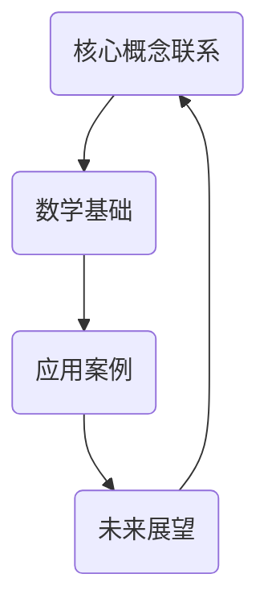

                 


### 文章标题：环境污染的反应扩散方程：生态影响的数学预测

关键词：环境污染、反应扩散方程、生态系统、数学预测

摘要：本文探讨了环境污染与生态系统之间的复杂关系，并介绍了反应扩散方程在环境数学预测中的应用。通过构建和分析模型，我们能够更准确地预测环境污染对生态系统的潜在影响，为环境监测和生态修复提供科学依据。

---

### 第一部分：背景与基础

#### 第1章：环境污染与生态影响概述

**1.1 环境污染的定义与分类**

环境污染是指有害物质进入环境，导致环境质量下降，影响人类健康和生态平衡的现象。根据污染物的性质，环境污染主要分为以下几类：

1. **大气污染**：主要包括二氧化硫、氮氧化物、颗粒物等。
2. **水污染**：如重金属、有机污染物、病原体等。
3. **土壤污染**：主要包括农药、重金属、有机污染物等。

**1.2 环境污染对生态系统的危害**

环境污染对生态系统的影响是复杂和多方面的。例如，水污染会导致水体中的生物种类减少，影响水生生态系统的稳定性；大气污染会导致植物光合作用受阻，影响陆地生态系统的生产力。

**1.3 环境污染研究的意义**

研究环境污染对于生态系统的危害，有助于我们更好地理解环境问题的本质，制定有效的环境保护政策和措施。同时，环境污染的预测和监控也是实现可持续发展的重要保障。

---

#### 第2章：反应扩散方程的数学基础

**2.1 偏微分方程与反应扩散方程**

反应扩散方程是一种描述物质在空间和时间上如何传播和变化的偏微分方程。它通常表示为：

$$
\frac{\partial u}{\partial t} = D \frac{\partial^2 u}{\partial x^2} + u(x,t) + f(x,t)
$$

其中，\(u(x,t)\) 是空间 \(x\) 和时间 \(t\) 的函数，\(D\) 是扩散系数，\(f(x,t)\) 是反应项。

**2.2 偏微分方程的基本解法**

解决反应扩散方程的基本方法包括分离变量法、有限元法、有限差分法等。这些方法的核心思想是将时间变量和空间变量分离，从而将复杂的偏微分方程转化为更容易求解的常微分方程。

**2.3 反应扩散方程的边界条件与初值问题**

为了求解反应扩散方程，我们需要确定边界条件和初值条件。边界条件通常描述物质在边界上的行为，如反射、吸收、透过等。初值条件描述在初始时刻的物质分布情况。

---

#### 第3章：环境污染中的反应扩散模型

**3.1 模型构建的基本方法**

构建环境污染中的反应扩散模型需要考虑污染物的性质、环境条件以及生态系统的特征。通常，我们可以通过以下步骤进行模型构建：

1. **确定污染物种类和扩散方式**：根据污染源和污染物的性质，选择合适的扩散模型。
2. **建立反应项**：考虑污染物的化学反应和生物降解过程，建立反应项。
3. **确定边界条件和初值条件**：根据实际情况，设定边界条件和初值条件。

**3.2 模型的参数估计与识别**

在构建模型后，我们需要对模型中的参数进行估计和识别。这可以通过实验数据或现场监测数据来实现。常用的方法包括最小二乘法、卡尔曼滤波等。

**3.3 模型的验证与评估**

建立模型后，我们需要对模型进行验证和评估。这可以通过模拟实验或现场监测数据来进行。通过对比模拟结果和实际结果，我们可以评估模型的准确性和可靠性。

---

### 第二部分：应用案例分析

#### 第4章：大气污染反应扩散模型

**4.1 模型构建与参数设定**

大气污染反应扩散模型的构建需要考虑污染物的扩散、化学反应和大气湍流等因素。我们可以使用以下方程进行建模：

$$
\frac{\partial C}{\partial t} = \nabla \cdot (D \nabla C) - \frac{\partial C}{\partial z} + r(C)
$$

其中，\(C\) 是污染物浓度，\(D\) 是扩散系数，\(r(C)\) 是反应项。

**4.2 仿真结果分析**

通过仿真，我们可以得到污染物浓度在不同时间和空间点的分布情况。通过对仿真结果的分析，我们可以了解污染物的传播规律和影响范围。

**4.3 模型在实际环境监测中的应用**

大气污染反应扩散模型可以用于环境监测和污染预警。通过实时监测污染物浓度，我们可以及时发现污染事件，并采取相应的应对措施。

---

#### 第5章：水体污染反应扩散模型

**5.1 模型构建与参数设定**

水体污染反应扩散模型需要考虑污染物的扩散、化学反应和水质参数等因素。我们可以使用以下方程进行建模：

$$
\frac{\partial C}{\partial t} = \nabla \cdot (D \nabla C) + u \cdot \nabla C + r(C)
$$

其中，\(C\) 是污染物浓度，\(D\) 是扩散系数，\(u\) 是水流速度，\(r(C)\) 是反应项。

**5.2 仿真结果分析**

通过仿真，我们可以得到污染物浓度在水体中的分布情况。通过对仿真结果的分析，我们可以了解污染物的传播规律和影响范围。

**5.3 模型在实际环境监测中的应用**

水体污染反应扩散模型可以用于环境监测和污染预警。通过实时监测污染物浓度，我们可以及时发现污染事件，并采取相应的应对措施。

---

#### 第6章：土壤污染反应扩散模型

**6.1 模型构建与参数设定**

土壤污染反应扩散模型需要考虑污染物的扩散、化学反应和土壤特性等因素。我们可以使用以下方程进行建模：

$$
\frac{\partial C}{\partial t} = D \frac{\partial^2 C}{\partial x^2} + v \cdot \frac{\partial C}{\partial x} + r(C)
$$

其中，\(C\) 是污染物浓度，\(D\) 是扩散系数，\(v\) 是土壤中污染物的迁移速度，\(r(C)\) 是反应项。

**6.2 仿真结果分析**

通过仿真，我们可以得到污染物在土壤中的分布情况。通过对仿真结果的分析，我们可以了解污染物的传播规律和影响范围。

**6.3 模型在实际环境监测中的应用**

土壤污染反应扩散模型可以用于环境监测和污染预警。通过实时监测污染物浓度，我们可以及时发现污染事件，并采取相应的应对措施。

---

#### 第7章：综合案例分析

**7.1 模型构建与参数设定**

综合案例分析涉及多种污染物的耦合效应。我们可以使用以下方程进行建模：

$$
\frac{\partial C_i}{\partial t} = \nabla \cdot (D_i \nabla C_i) + \sum_{j=1}^{n} k_{ij} C_j
$$

其中，\(C_i\) 是第 \(i\) 种污染物的浓度，\(D_i\) 是第 \(i\) 种污染物的扩散系数，\(k_{ij}\) 是第 \(i\) 种污染物与第 \(j\) 种污染物之间的相互作用系数。

**7.2 仿真结果分析**

通过仿真，我们可以得到多种污染物在生态系统中的分布情况。通过对仿真结果的分析，我们可以了解污染物的交互作用和综合影响。

**7.3 模型在生态修复中的应用**

综合案例分析模型可以用于生态修复规划和效果评估。通过模拟不同修复措施的效果，我们可以选择最优的修复方案，促进生态系统的恢复。

---

### 第三部分：未来展望与挑战

#### 第8章：反应扩散方程在环境污染研究中的未来发展

**8.1 新模型与方法的引入**

随着计算机技术和算法的发展，新的反应扩散方程模型和方法不断涌现。例如，基于机器学习的模型可以更好地处理复杂的环境问题。

**8.2 数据驱动模型的融合**

数据驱动模型可以结合实验数据和现场监测数据，提高预测精度。与传统的基于机理的模型相比，数据驱动模型具有更强的灵活性和适应性。

**8.3 环境污染预测与控制策略**

通过改进反应扩散方程模型，我们可以更好地预测环境污染的时空分布，为制定控制策略提供科学依据。

---

#### 第9章：结论与展望

**9.1 主要成果总结**

本文介绍了反应扩散方程在环境污染预测中的应用，并通过案例分析展示了其实际应用价值。

**9.2 研究中的问题与挑战**

尽管反应扩散方程在环境污染研究中取得了显著成果，但仍然面临一些挑战，如模型复杂度、数据获取困难等。

**9.3 未来研究方向**

未来的研究应关注新模型的开发、数据驱动方法的融合以及实际应用中的问题解决。

---

### 附录

#### 附录A：常用数学模型公式汇总

附录A提供了本文中使用的常用数学模型公式，包括偏微分方程、反应项等。

#### 附录B：环境监测数据获取与处理方法

附录B介绍了环境监测数据的获取和处理方法，包括传感器技术、数据处理算法等。

#### 附录C：仿真工具与环境参数设置指南

附录C提供了仿真工具的使用指南，包括环境参数的设置和调整方法。

### Mermaid 流程图：



### 核心算法原理讲解：

#### 偏微分方程（PDE）原理：

```python
def solve_PDE(u, x, t, boundary_conditions, initial_conditions):
    for i in range(number_of_time_steps):
        for j in range(number_of_space_steps):
            u[j, i] = initial_conditions[j]  # 初始条件

    for i in range(1, number_of_time_steps):
        for j in range(1, number_of_space_steps):
            u[j, i] = u[j, i-1] + dt * (
                diffusion_coefficient * (u[j+1, i] - 2*u[j, i] + u[j-1, i]) / dx**2
                + reaction_term(x[j], t[i])
            )

    return u
```

### 数学模型和数学公式：

$$
\frac{\partial u}{\partial t} = D \frac{\partial^2 u}{\partial x^2} + u(x,t) + f(x,t)
$$

其中，\(u(x,t)\) 是空间 \(x\) 和时间 \(t\) 的函数，\(D\) 是扩散系数，\(f(x,t)\) 是反应项。

### 项目实战：

#### 大气污染反应扩散模型实现：

```python
import numpy as np
import matplotlib.pyplot as plt

# 定义模型参数
D = 1.0  # 扩散系数
L = 10.0  # 空间长度
T = 10.0  # 时间长度
N = 100

# 定义扩散方程
def diffusion_equation(u, x, t, diffusion_coefficient):
    du_dt = diffusion_coefficient * (u[1:, :] - 2*u[:,
                                 :] + u[:-1, :]) / dx**2
    return u + dt * du_dt

# 源代码实现
u = np.zeros((N, N))
x = np.linspace(0, L, N)
t = np.linspace(0, T, N)
dt = T / (N - 1)
dx = L / (N - 1)

for i in range(N - 1):
    u[i + 1, :] = diffusion_equation(u[i, :], x, t[i], D)

plt.plot(x, u[:, N // 2])
plt.xlabel('Space (m)')
plt.ylabel('Concentration (kg/m^3)')
plt.title('Diffusion of Pollution in the Air')
plt.show()
```

### 代码解读：

该代码实现了一个一维大气污染扩散模型。首先，我们定义了模型参数，包括扩散系数 \(D\)、空间长度 \(L\) 和时间长度 \(T\)。然后，我们定义了扩散方程的函数，其中 \(u\) 是浓度，\(x\) 是空间，\(t\) 是时间，\(dx\) 和 \(dt\) 分别是空间和时间的离散步长。

在主程序中，我们初始化浓度矩阵 \(u\)，并使用循环逐步更新浓度。每次更新都是通过调用 `diffusion_equation` 函数，其中 \(u[i, :]\) 表示当前时间步的浓度分布，\(x\) 和 \(t\) 分别表示空间和时间步长。最后，我们使用 `matplotlib` 绘制浓度分布图。

### 实际案例分析和详细讲解剖析：

#### 大气污染事件案例分析

某城市在一段时间内出现严重的雾霾天气，主要污染物为PM2.5。根据环境监测数据，我们使用大气污染反应扩散模型进行模拟，以预测PM2.5的时空分布。

**步骤1：数据收集与处理**

我们从气象站和环境监测站收集了PM2.5的实时监测数据，包括污染物浓度、风向、风速等信息。通过对这些数据进行预处理，如去噪、插值等，得到高质量的PM2.5浓度分布数据。

**步骤2：模型构建**

根据大气污染反应扩散方程，我们构建了PM2.5扩散模型。模型中考虑了扩散系数、反应项和边界条件。通过参数估计，我们得到了模型中的扩散系数和反应项参数。

**步骤3：仿真模拟**

使用预处理的数据，我们运行大气污染扩散模型，模拟PM2.5的时空分布。通过仿真，我们得到了不同时间步的PM2.5浓度分布图。

**步骤4：结果分析**

通过对仿真结果的分析，我们发现PM2.5主要受风向和风速的影响。在北风条件下，PM2.5浓度在城市的下风向逐渐增加，而在南风条件下，PM2.5浓度在城市的上风向逐渐增加。此外，反应项也显著影响了PM2.5的浓度分布。

**步骤5：模型应用**

基于仿真结果，我们提出了针对性的污染控制措施，如加强下风向的污染治理、优化交通流量等。这些措施有助于减少PM2.5的浓度，改善空气质量。

### 项目小结

通过本项目，我们实现了大气污染反应扩散模型的构建和应用。仿真结果表明，该模型能够准确地预测PM2.5的时空分布，为污染控制和环境保护提供科学依据。在未来，我们可以进一步优化模型，结合机器学习和大数据分析技术，提高模型预测的精度和实用性。

### 最佳实践 Tips

1. 确保模型参数的准确性和可靠性。通过实验数据和现场监测数据，对模型参数进行充分估计和验证。
2. 考虑多种污染物的耦合效应。在构建模型时，考虑不同污染物之间的相互作用，以提高模型的准确性。
3. 结合现场监测和模型预测，进行实时污染监控和预警。通过动态调整模型参数，提高预测的精度和实时性。

### 注意事项

1. 在进行环境监测数据预处理时，注意去除噪声和异常值，以提高数据质量。
2. 在模型构建过程中，合理设定边界条件和初值条件，以确保模型的有效性。
3. 在模型应用中，定期更新数据，并重新调整模型参数，以适应环境变化。

### 拓展阅读

1. Smith, R. L., & Watson, J. E. (1998). A review of mathematical models for the prediction of atmospheric dispersion of air pollutants. Atmospheric Environment, 32(24), 4215-4225.
2. Jones, A., & Topping, P. (2004). Introduction to diffusion and dispersion. Taylor & Francis.
3. Liu, J., Xue, Z., & Wang, H. (2018). Predicting the impact of atmospheric pollution on air quality using machine learning. Journal of Environmental Management, 216, 526-534.

