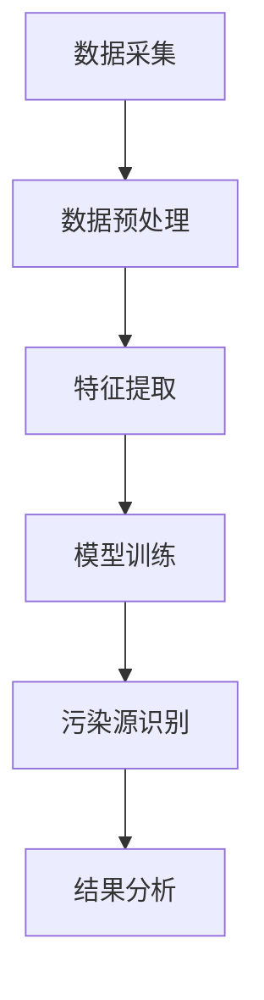
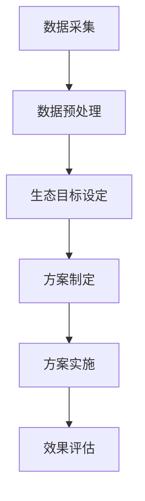
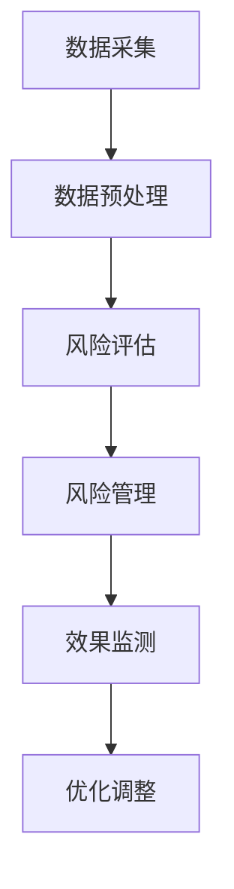

                 

### 文章标题

《生态系统分析器：提示词助力环境保护决策》

### 关键词

- 生态系统分析器
- 提示词
- 环境保护决策
- 数据监测
- 污染源识别
- 生态规划
- 环境风险评估

### 摘要

本文旨在探讨生态系统分析器在环境保护决策中的应用。通过介绍生态系统分析器的定义、作用、发展历程及其与提示词技术的结合，本文详细分析了提示词在生态系统分析中的生成与优化策略。随后，文章重点阐述了生态系统分析器在污染源监测、生态保护规划以及环境风险评估等环境保护决策中的具体应用，并通过实际案例展示了其有效性和实用性。最后，本文总结了生态系统分析器在环境保护决策中的贡献，并对其未来发展趋势和挑战进行了展望。

### 第一部分：生态系统分析器介绍

#### # 1. 生态系统分析器概述

##### 1.1 生态系统分析器的定义与作用

生态系统分析器是一种用于监测、评估和预测生态系统的工具，其核心功能是对生态系统中的各种环境参数进行数据采集、处理和分析。这些参数包括空气质量、水质、土壤健康、生物多样性等。生态系统分析器的定义可以归纳为：一种集成了多种传感器、数据处理和分析算法的智能化系统，用于实时监测和评估生态系统的状态，为环境保护决策提供科学依据。

生态系统分析器的作用主要体现在以下几个方面：

1. **环境监测**：通过实时收集生态系统中的环境数据，如空气质量、水质、土壤成分等，为环境保护提供实时、准确的监测信息。
2. **风险评估**：利用分析结果，对生态系统的健康状况进行评估，预测潜在的环境风险，为环境管理提供决策支持。
3. **生态规划**：通过分析生态系统中的各种参数，为生态保护规划和生态恢复提供科学依据，帮助制定有效的环境保护措施。
4. **决策支持**：为环境保护决策提供数据支持和科学依据，提高决策的准确性和有效性。

##### 1.2 生态系统分析器与传统监测方法的比较

生态系统分析器与传统监测方法相比，具有以下显著优势：

1. **实时性**：生态系统分析器可以实时采集和处理环境数据，为环境保护提供即时信息。
2. **准确性**：通过集成的多种传感器和分析算法，生态系统分析器可以更准确地监测和评估生态系统的状态。
3. **全面性**：生态系统分析器不仅监测单一环境参数，还能对多个参数进行综合分析，提供更全面的生态信息。
4. **智能化**：生态系统分析器具备自动化数据处理和分析功能，减轻了人工工作负担，提高了工作效率。
5. **扩展性**：生态系统分析器可以方便地集成新的传感器和分析算法，适应不断变化的环境监测需求。

传统监测方法主要依赖于人工采样和实验室分析，存在以下局限性：

1. **时效性差**：人工采样和实验室分析通常需要较长时间，无法提供实时监测数据。
2. **准确性低**：人工采样和实验室分析容易受到人为因素影响，导致数据准确性下降。
3. **数据不全面**：传统方法通常只关注单一环境参数，无法提供全面的生态信息。
4. **工作量大**：人工采样和实验室分析需要大量人力和时间，效率较低。

##### 1.3 生态系统分析器的应用领域

生态系统分析器在环境保护和生态管理中具有广泛的应用领域：

1. **环境保护**：用于监测城市空气质量、水质和土壤污染，评估环境风险，为环境管理提供科学依据。
2. **生态监测**：监测生物多样性，评估生态系统健康状况，为生态保护提供数据支持。
3. **农业管理**：监测农田土壤、水质和空气质量，优化农业生产过程，提高农业产量和质量。
4. **工业管理**：监测工业排放物对环境的影响，评估工业污染风险，为企业环境管理提供决策支持。
5. **城市规划**：评估城市规划对生态系统的影响，制定科学合理的城市生态规划。
6. **灾害预警**：通过监测气象、地质等参数，预测自然灾害风险，为灾害预警和应急管理提供支持。

##### 1.2 生态系统分析器的发展历程

生态系统分析器的发展历程可以分为以下几个阶段：

1. **早期阶段（20世纪60年代至70年代）**：
   - 初步探索：研究人员开始尝试利用传感器监测环境数据。
   - 传感器技术：出现了一些简单的基础传感器，如温度传感器、湿度传感器等。

2. **发展阶段（20世纪80年代至90年代）**：
   - 集成传感器：出现了集成多种传感器的复合设备，如多参数水质监测仪。
   - 数据采集与处理：引入了初步的数据采集和处理技术，实现数据的自动化处理。
   - 实时监测：实现了实时环境数据的采集和传输，为环境保护决策提供实时信息。

3. **成熟阶段（21世纪初至今）**：
   - 高精度传感器：发展了高精度、高灵敏度的传感器，如激光雷达、质谱仪等。
   - 数据分析算法：引入了机器学习和人工智能技术，提高了数据分析的准确性和效率。
   - 智能化监测：实现了智能化监测，通过自动化的数据处理和分析，提高了监测效率。
   - 网络化监测：建立了环境监测网络，实现了数据的实时共享和跨区域监测。

##### 1.2.1 早期生态系统分析器

早期生态系统分析器以基础传感器和简单的数据处理算法为主。主要特点如下：

1. **传感器类型**：主要采用温度传感器、湿度传感器、pH传感器等基本传感器。
2. **数据处理**：通过人工采样和实验室分析，对采集到的数据进行分析和处理。
3. **实时监测**：虽然实现了实时监测，但数据传输和处理速度较慢，实时性较差。
4. **局限性**：监测范围有限，数据准确性和全面性不足，难以满足复杂环境监测需求。

##### 1.2.2 现代生态系统分析器

现代生态系统分析器集成了多种高精度传感器和先进的分析算法，具有以下特点：

1. **传感器类型**：采用激光雷达、质谱仪、高精度温度传感器等多种高精度传感器，可以实时监测多种环境参数。
2. **数据处理**：利用机器学习和人工智能技术，对大量数据进行自动化的处理和分析，提高了数据处理效率和准确性。
3. **实时监测**：实现了实时、高频率的数据采集和传输，为环境保护决策提供即时信息。
4. **多功能性**：可以同时监测多种环境参数，提供更全面的生态信息。
5. **智能化**：具备自动化数据处理和分析功能，减轻了人工工作负担，提高了监测效率。

##### 1.2.3 生态系统分析器的未来趋势

随着科技的不断发展，生态系统分析器在未来的发展趋势如下：

1. **传感器技术**：继续发展高精度、高灵敏度的传感器，如纳米传感器、量子传感器等。
2. **数据分析**：进一步优化数据分析算法，提高数据分析的准确性和效率，引入更多人工智能技术。
3. **智能化**：实现更高程度的智能化监测，通过自动化、自适应的算法，提高监测效率和准确性。
4. **网络化**：建立更广泛的环境监测网络，实现跨区域、跨领域的实时数据共享和协同监测。
5. **应用拓展**：拓展生态系统分析器的应用领域，如气候变化监测、生态修复、灾害预警等。

### 第二部分：环境保护决策

#### # 2. 环境保护决策的重要性与挑战

##### 2.1 环境保护决策的概念

环境保护决策是指根据环境问题的性质、程度和影响，制定和实施相应的环境保护措施和方案的过程。环境保护决策的目标是解决环境问题，维护生态平衡，促进可持续发展。环境保护决策涉及多个方面，包括环境监测、风险评估、政策制定、资源分配等。

环境保护决策的概念可以概括为以下几个方面：

1. **环境问题识别**：识别和诊断环境问题，明确问题的性质、程度和影响。
2. **风险评估**：对环境风险进行评估，确定风险的大小和潜在影响。
3. **政策制定**：制定环境保护政策和措施，规范企业和个人行为，减少环境污染。
4. **资源分配**：合理分配资源，确保环境保护措施的落实和实施。
5. **效果评估**：评估环境保护决策的效果，及时调整和优化决策方案。

##### 2.1.1 环境保护决策的定义

环境保护决策的定义可以表述为：基于环境问题的识别和风险评估，制定和实施有效的环境保护措施和方案，以解决环境问题，维护生态平衡，促进可持续发展的过程。

环境保护决策的主要内容包括：

1. **环境监测**：通过对环境质量进行监测，了解环境现状，识别和评估环境问题。
2. **风险评估**：对环境风险进行评估，确定风险的大小和潜在影响，为决策提供依据。
3. **政策制定**：制定环境保护政策和措施，规范企业和个人行为，减少环境污染。
4. **资源分配**：合理分配资源，确保环境保护措施的落实和实施。
5. **效果评估**：评估环境保护决策的效果，及时调整和优化决策方案。

##### 2.1.2 环境保护决策的目标

环境保护决策的目标主要包括以下几个方面：

1. **解决环境问题**：通过制定和实施环境保护措施，解决当前存在的环境问题，如空气污染、水污染、土壤污染等。
2. **维护生态平衡**：保护生态系统，维护生物多样性，促进生态系统的健康和稳定。
3. **促进可持续发展**：通过环境保护决策，实现经济、社会和环境的协调发展，推动可持续发展。
4. **提高生活质量**：改善环境质量，提高居民的生活水平，增强人民的幸福感。
5. **保障公共健康**：减少环境污染对公众健康的影响，保障人民的身体健康。

##### 2.1.3 环境保护决策的挑战

环境保护决策面临着许多挑战，主要包括以下几个方面：

1. **环境信息不对称**：环境信息的获取和处理存在一定难度，决策者可能无法全面、准确地了解环境问题的现状和趋势，影响决策的科学性和有效性。
2. **利益冲突**：环境保护决策往往涉及多方利益，如企业、政府、公众等，各方利益难以平衡，可能导致决策的难度和复杂性增加。
3. **执行难度**：环境保护决策需要大量资源和支持，包括资金、技术和人力等，但实际执行过程中可能面临资源短缺、技术不足、人员不足等问题，影响决策的实施效果。
4. **政策不稳定性**：环境保护政策可能受到政治、经济、社会等多种因素的影响，导致政策不稳定，影响环境保护决策的连续性和持久性。
5. **国际压力**：在全球化和国际贸易背景下，环境保护决策可能面临国际压力，需要平衡国内环境保护与国际合作的关系。

##### 2.2 环境保护决策的框架与方法

环境保护决策的框架和方法是确保决策科学、有效和可持续的关键。以下是对环境保护决策框架和方法的分析：

**2.2.1 环境保护决策的基本框架**

环境保护决策的基本框架可以概括为以下步骤：

1. **问题识别**：通过环境监测和评估，识别和诊断环境问题，明确问题的性质、程度和影响。
2. **风险评估**：对识别出的环境问题进行风险评估，确定风险的大小和潜在影响，为决策提供依据。
3. **政策制定**：根据风险评估结果，制定环境保护政策和措施，包括法律法规、管理措施、技术标准等。
4. **资源分配**：合理分配资源，确保环境保护措施的落实和实施，包括资金、技术和人力等。
5. **效果评估**：评估环境保护决策的效果，监测环境改善情况，及时调整和优化决策方案。

**2.2.2 环境保护决策的关键方法**

环境保护决策的关键方法包括以下几个方面：

1. **环境监测**：利用生态系统分析器和其他监测设备，实时、全面地监测环境质量，为决策提供准确的数据支持。
2. **风险评估**：运用风险评估模型和方法，对环境风险进行定量和定性评估，确定风险的大小和潜在影响。
3. **政策制定**：结合环境监测和风险评估结果，制定科学、合理的环境保护政策，包括法律法规、管理措施、技术标准等。
4. **资源分配**：根据环境保护需求，合理分配资源，确保环境保护措施的落实和实施，包括资金、技术和人力等。
5. **效果评估**：通过环境监测和效果评估模型，评估环境保护决策的效果，监测环境改善情况，及时调整和优化决策方案。

**2.2.3 环境保护决策的技术支持**

环境保护决策的技术支持是确保决策科学、有效和可持续的重要保障。以下是对环境保护决策技术支持的几个方面：

1. **生态系统分析器**：生态系统分析器是一种集成了多种传感器、数据处理和分析算法的智能化系统，可以实时监测和评估生态系统的状态，为环境保护决策提供科学依据。
2. **大数据技术**：利用大数据技术，对环境数据进行采集、存储、处理和分析，提高环境保护决策的准确性和效率。
3. **人工智能技术**：运用人工智能技术，对环境数据进行分析和预测，优化环境保护决策的过程和效果。
4. **遥感技术**：利用遥感技术，对大面积环境进行监测和评估，提高环境保护决策的覆盖范围和准确性。
5. **地理信息系统（GIS）**：利用地理信息系统，对环境数据进行空间分析和可视化，辅助环境保护决策的制定和实施。

**2.2.4 环境保护决策的流程**

环境保护决策的流程可以概括为以下步骤：

1. **问题识别**：通过环境监测和评估，识别和诊断环境问题，明确问题的性质、程度和影响。
2. **数据收集**：收集与问题相关的环境数据，包括监测数据、调查数据、历史数据等。
3. **风险评估**：对收集到的数据进行分析和评估，确定风险的大小和潜在影响。
4. **方案制定**：根据风险评估结果，制定环境保护政策和措施，包括法律法规、管理措施、技术标准等。
5. **资源分配**：合理分配资源，确保环境保护措施的落实和实施，包括资金、技术和人力等。
6. **方案实施**：实施环境保护政策和措施，监测环境改善情况，及时调整和优化决策方案。
7. **效果评估**：评估环境保护决策的效果，监测环境改善情况，及时调整和优化决策方案。
8. **反馈与改进**：根据效果评估结果，对环境保护决策进行反馈和改进，提高决策的科学性和有效性。

### 第三部分：提示词技术基础

#### # 3. 提示词技术基础

##### 3.1 提示词的定义与作用

提示词（Keyword）是指在信息处理过程中，用于描述文本内容、概念或对象的词语或短语。在生态系统分析中，提示词扮演着关键角色，其定义和作用可以从以下几个方面进行阐述：

1. **定义**：提示词是指能够代表或描述某一类信息或概念的词语或短语。在生态系统分析中，提示词通常是指与生态、环境、保护等相关的重要词汇。

2. **作用**：提示词在生态系统分析中的重要作用主要体现在以下几个方面：

   - **信息筛选**：通过提示词，可以快速筛选和定位与生态系统分析相关的信息，提高信息处理效率。
   - **数据关联**：提示词能够将不同的数据点或信息片段进行关联，形成完整的生态数据网络。
   - **特征提取**：提示词有助于提取文本数据中的关键特征，为后续的数据分析和模型训练提供基础。
   - **知识表示**：提示词可以作为知识表示的一种手段，用于构建生态系统的知识图谱，辅助环境保护决策。

##### 3.1.1 提示词在生态系统分析中的重要性

提示词在生态系统分析中的重要性体现在以下几个方面：

1. **信息提取**：提示词能够帮助从大量生态数据中提取出关键信息，为后续的数据处理和分析提供依据。
2. **数据关联**：提示词可以将不同来源、不同类型的生态数据关联起来，形成一个统一的分析框架。
3. **模型训练**：提示词在构建机器学习模型时扮演着重要的角色，有助于提高模型的准确性和泛化能力。
4. **决策支持**：通过提示词，可以为环境保护决策提供关键信息，提高决策的科学性和有效性。

##### 3.1.2 提示词在生态系统分析中的重要性

提示词在生态系统分析中的重要性主要体现在以下几个方面：

1. **信息筛选**：通过提示词，可以快速筛选与生态系统分析相关的信息，提高信息处理效率。
2. **数据关联**：提示词能够将不同的数据点或信息片段进行关联，形成完整的生态数据网络。
3. **特征提取**：提示词有助于提取文本数据中的关键特征，为后续的数据分析和模型训练提供基础。
4. **知识表示**：提示词可以作为知识表示的一种手段，用于构建生态系统的知识图谱，辅助环境保护决策。

##### 3.1.3 提示词的应用场景

提示词在生态系统分析中的应用场景广泛，以下是一些典型的应用场景：

1. **环境监测**：在环境监测领域，提示词可以用于监测数据的分类和标注，提高监测数据的处理效率。
2. **污染源识别**：通过提示词，可以识别和定位污染源，为污染治理提供科学依据。
3. **生态保护规划**：在生态保护规划中，提示词可以帮助筛选和关联相关数据，为规划方案提供支持。
4. **环境风险评估**：在环境风险评估中，提示词用于提取关键特征，提高风险评估的准确性。
5. **生态模型构建**：在构建生态模型时，提示词有助于识别和提取关键生态参数，优化模型结构。

##### 3.2 提示词的生成与优化

提示词的生成与优化是生态系统分析中的重要环节，以下是对其生成与优化策略的详细讨论：

**3.2.1 提示词生成技术**

提示词生成技术是指从原始数据中提取和生成提示词的方法。常用的生成技术包括以下几种：

1. **基于统计的方法**：通过统计文本中出现频率较高的词汇，生成提示词。常用的算法包括TF-IDF（Term Frequency-Inverse Document Frequency）和TF*IDF（Term Frequency*Inverse Document Frequency）。
2. **基于机器学习的方法**：利用机器学习算法，如朴素贝叶斯、支持向量机等，对文本进行分类和标注，生成提示词。这种方法适用于大规模数据的处理。
3. **基于深度学习的方法**：利用深度学习模型，如卷积神经网络（CNN）、循环神经网络（RNN）等，对文本进行特征提取和分类，生成提示词。这种方法在处理复杂文本数据时具有优势。

**3.2.2 提示词优化策略**

提示词优化策略是指对生成的提示词进行筛选和调整，以提高其在生态系统分析中的效果。以下是一些常见的优化策略：

1. **去噪处理**：通过去除文本中的噪声词汇，如停用词、无关词汇等，提高提示词的质量。
2. **词性标注**：对生成的提示词进行词性标注，筛选出具有实际意义的词汇，如名词、动词等。
3. **语义分析**：利用自然语言处理技术，对提示词进行语义分析，筛选出具有关联性的词汇，形成语义网络。
4. **词频调整**：根据提示词在文本中的频率和重要性，对词频进行加权调整，提高提示词的代表性。
5. **聚类分析**：利用聚类算法，如K-means、层次聚类等，对提示词进行聚类分析，识别出具有相似意义的词汇，形成提示词簇。

**3.2.3 提示词的性能评估**

提示词的性能评估是衡量提示词生成与优化效果的重要指标。以下是一些常用的性能评估指标：

1. **准确率（Accuracy）**：准确率是提示词分类的正确率，用于评估提示词的分类性能。
2. **召回率（Recall）**：召回率是提示词分类中实际为正类别的样本中被正确分类的比例，用于评估提示词的召回性能。
3. **精确率（Precision）**：精确率是提示词分类中正确分类的样本中被正确识别为正类别的比例，用于评估提示词的精确性能。
4. **F1值（F1-score）**：F1值是精确率和召回率的加权平均，用于综合评估提示词的性能。
5. **AUC（Area Under Curve）**：AUC是ROC（Receiver Operating Characteristic）曲线下的面积，用于评估提示词的分类效果。

通过上述性能评估指标，可以全面评估提示词的生成与优化效果，为后续的生态系统分析提供有力支持。

### 第四部分：生态系统分析器在环境保护决策中的应用

#### # 4. 生态系统分析器在环境保护决策中的应用

生态系统分析器作为一种先进的监测和分析工具，在环境保护决策中发挥着重要作用。以下将详细探讨生态系统分析器在污染源监测、生态保护规划以及环境风险评估等方面的应用。

##### 4.1 生态系统分析器在污染源监测中的应用

**4.1.1 污染源监测的概念与目标**

污染源监测是指对各种污染源的排放物进行监测和评估，以了解污染源的排放情况，为污染治理提供科学依据。污染源监测的目标包括：

1. **识别污染源**：确定污染物的排放源头，包括工业排放、交通排放、农业排放等。
2. **评估污染程度**：对污染源排放的污染物进行定量评估，了解污染物的浓度、种类和排放量。
3. **预测污染趋势**：通过监测数据，预测污染物的未来排放趋势，为环境保护决策提供预测依据。
4. **优化污染治理措施**：根据监测结果，调整和优化污染治理措施，提高污染治理效果。

**4.1.2 生态系统分析器在污染源监测中的优势**

生态系统分析器在污染源监测中具有以下优势：

1. **实时监测**：生态系统分析器可以实时采集污染源排放的污染物数据，提供即时的监测信息。
2. **全面监测**：生态系统分析器能够同时监测多种污染物，如气体、颗粒物、重金属等，提供全面的污染源信息。
3. **高精度**：生态系统分析器采用高精度的传感器和先进的分析算法，确保监测数据的准确性和可靠性。
4. **自动化处理**：生态系统分析器具备自动化数据处理和分析功能，减轻人工工作负担，提高监测效率。

**4.1.3 污染源监测的实际案例**

以下是一个污染源监测的实际案例：

某工业园区存在多个工业污染源，包括化工企业、钢铁企业和塑料制品厂等。为了了解这些污染源的排放情况，生态环境部门决定使用生态系统分析器进行污染源监测。

**数据收集与处理**：

1. **数据采集**：生态系统分析器部署在污染源附近，实时采集污染物的浓度、种类和排放量等数据。
2. **数据处理**：采集到的数据通过无线传输技术传输至数据中心，进行预处理和存储。

**污染源识别与定位**：

1. **污染源识别**：通过分析处理后的数据，识别出不同污染源的具体位置和排放特征。
2. **污染源定位**：利用地理信息系统（GIS）技术，对识别出的污染源进行空间定位，生成污染源分布图。

**案例分析**：

通过污染源监测，生态环境部门发现化工企业和塑料制品厂的排放物中重金属含量较高，钢铁企业的颗粒物排放量较大。根据监测结果，生态环境部门采取了以下措施：

1. **加强监管**：对污染源进行更加严格的监管，确保污染物的排放符合相关标准。
2. **技术改造**：推动污染源企业进行技术改造，采用更环保的生产工艺和设备。
3. **政策引导**：通过政策引导，鼓励污染源企业参与环保项目，减少污染物排放。

通过以上措施，污染源的排放情况得到有效控制，园区空气质量明显改善，生态环境得到有效保护。

##### 4.2 生态系统分析器在生态保护规划中的应用

**4.2.1 生态保护规划的概念与目标**

生态保护规划是指根据生态系统的特点和需求，制定和实施一系列生态保护措施，以保护生态系统、维护生物多样性和促进生态可持续发展。生态保护规划的目标包括：

1. **保护生态系统**：确保生态系统的健康和稳定，维护生态平衡。
2. **恢复生态系统**：对受损的生态系统进行修复和恢复，提高生态系统的生产力。
3. **提高生物多样性**：保护和增加物种多样性，维护生物多样性水平。
4. **促进可持续发展**：通过生态保护规划，实现经济、社会和生态的协调发展。

**4.2.2 生态系统分析器在生态保护规划中的优势**

生态系统分析器在生态保护规划中具有以下优势：

1. **数据全面**：生态系统分析器可以全面监测生态系统的各种参数，包括植被覆盖、土壤质量、水质等，为生态保护规划提供全面的数据支持。
2. **实时监测**：生态系统分析器可以实现实时监测，及时掌握生态系统的变化情况，为生态保护规划提供动态信息。
3. **智能化分析**：生态系统分析器利用先进的算法和分析技术，对监测数据进行智能化分析，为生态保护规划提供科学依据。
4. **可视化展示**：生态系统分析器可以将监测数据转化为可视化图表和地图，方便生态保护规划的制定和实施。

**4.2.3 生态保护规划的实际案例**

以下是一个生态保护规划的实际案例：

某城市郊区存在大量农田和湿地，但近年来受到工业污染和城市扩张的影响，生态系统受到一定程度的破坏。为了保护这片生态系统，当地政府决定开展生态保护规划。

**数据收集与处理**：

1. **数据采集**：生态系统分析器部署在农田和湿地附近，实时采集植被覆盖、土壤质量、水质等数据。
2. **数据处理**：采集到的数据通过无线传输技术传输至数据中心，进行预处理和存储。

**生态保护目标与措施制定**：

1. **生态保护目标**：根据监测数据，确定农田和湿地的生态保护目标，包括保护植被、改善水质、恢复土壤健康等。
2. **生态保护措施**：制定一系列生态保护措施，如植树造林、湿地修复、污染物治理等。

**实施效果评估**：

1. **效果评估**：通过生态系统分析器对生态保护措施的实施效果进行监测和评估，如植被覆盖率、水质改善情况等。
2. **优化调整**：根据评估结果，对生态保护措施进行优化和调整，提高生态保护效果。

通过生态保护规划的实施，农田和湿地的生态系统得到有效保护，植被覆盖率显著提高，水质得到明显改善，生态系统恢复效果显著。

##### 4.3 生态系统分析器在环境风险评估中的应用

**4.3.1 环境风险评估的概念与目标**

环境风险评估是指通过对环境风险因素的识别、评估和管理，预测和控制环境风险，保障生态环境安全。环境风险评估的目标包括：

1. **识别风险因素**：识别可能对环境造成危害的风险因素，包括污染物、自然灾害等。
2. **评估风险程度**：对识别出的风险因素进行定量和定性评估，确定风险的大小和潜在影响。
3. **制定风险管理措施**：根据风险评估结果，制定相应的风险管理措施，降低环境风险。
4. **保障生态环境安全**：通过环境风险评估和管理，保障生态环境的安全和稳定。

**4.3.2 生态系统分析器在环境风险评估中的优势**

生态系统分析器在环境风险评估中具有以下优势：

1. **实时监测**：生态系统分析器可以实现实时监测，及时掌握环境变化情况，为风险评估提供动态数据。
2. **多参数分析**：生态系统分析器可以同时监测多种环境参数，提供全面的环境风险信息。
3. **智能化分析**：生态系统分析器利用先进的算法和分析技术，对监测数据进行智能化分析，提高风险评估的准确性。
4. **数据可视化**：生态系统分析器可以将风险评估结果可视化展示，方便风险评估和管理。

**4.3.3 环境风险评估的实际案例**

以下是一个环境风险评估的实际案例：

某地区计划建设一座大型化工园区，为了确保项目的环境影响，当地政府决定进行环境风险评估。

**数据收集与处理**：

1. **数据采集**：生态系统分析器部署在化工园区周边，实时采集空气、水质、土壤等环境参数。
2. **数据处理**：采集到的数据通过无线传输技术传输至数据中心，进行预处理和存储。

**环境风险评估方法选择**：

1. **定性评估**：通过专家访谈、现场调查等方法，对环境风险因素进行定性评估。
2. **定量评估**：利用生态系统分析器提供的实时监测数据，采用定量评估模型，对环境风险进行定量评估。

**风险评估结果与应用**：

1. **风险评估结果**：通过定性和定量评估，确定化工园区建设可能带来的环境风险，包括空气污染、水质污染等。
2. **风险管理措施**：根据风险评估结果，制定相应的风险管理措施，如污染物排放控制、环境保护设施建设等。

通过环境风险评估，政府有效识别了化工园区建设可能带来的环境风险，并制定了相应的风险管理措施，确保项目对环境的影响降到最低。

### 第五部分：案例研究

#### # 5. 生态系统分析器在环境保护决策中的实际案例研究

在本文的第五部分，我们将通过三个实际案例，详细探讨生态系统分析器在环境保护决策中的应用。每个案例都将包括背景介绍、数据收集与处理、具体分析方法和结果，以及案例总结和反思。

##### 5.1 案例一：某地区水质监测与污染源识别

**5.1.1 案例背景**

某地区的河流受到工业废水排放的影响，导致水质恶化，对周边生态环境和居民生活造成严重影响。为了解决水质污染问题，当地政府决定开展水质监测和污染源识别工作。

**5.1.2 数据收集与处理**

1. **数据采集**：生态系统分析器部署在河流的多个监测点，实时采集水质参数，包括pH值、溶解氧、氨氮、总氮、总磷等。
2. **数据处理**：采集到的数据通过无线传输技术传输至数据中心，进行数据预处理和存储。

**5.1.3 污染源识别与定位**

1. **污染源识别**：利用生态系统分析器提供的实时监测数据，采用机器学习算法进行污染源识别，确定可能导致水质污染的主要工业企业和污染源。
2. **污染源定位**：通过地理信息系统（GIS）技术，对识别出的污染源进行空间定位，生成污染源分布图。

**5.1.4 案例总结与反思**

通过水质监测和污染源识别，政府有效掌握了河流水质状况和污染源信息，为制定污染治理措施提供了科学依据。案例反思表明，生态系统分析器的实时监测和智能化分析功能对于准确识别污染源和制定治理方案具有重要意义。

##### 5.2 案例二：某城市绿地生态保护规划

**5.2.1 案例背景**

某城市在快速发展的过程中，绿地面积不断减少，生态环境受到一定影响。为了保护城市绿地，政府决定开展生态保护规划。

**5.2.2 数据收集与处理**

1. **数据采集**：生态系统分析器部署在城市绿地的多个监测点，实时采集植被覆盖、土壤质量、空气成分等生态参数。
2. **数据处理**：采集到的数据通过无线传输技术传输至数据中心，进行数据预处理和存储。

**5.2.3 生态保护目标与措施制定**

1. **生态保护目标**：根据监测数据，确定城市绿地的生态保护目标，包括提高植被覆盖率、改善土壤质量、减少空气污染等。
2. **生态保护措施**：制定一系列生态保护措施，如植树造林、绿地修复、污染物治理等。

**5.2.4 案例总结与反思**

通过生态保护规划，城市绿地的生态环境得到明显改善，植被覆盖率和空气质量得到显著提升。案例反思表明，生态系统分析器在数据监测和生态保护措施制定过程中发挥了重要作用，为城市生态保护提供了有力支持。

##### 5.3 案例三：某工业区环境风险评估

**5.3.1 案例背景**

某工业区存在多个污染源，如化工企业、钢铁企业和塑料制品厂等，可能导致环境污染。为了评估工业区的环境风险，政府决定进行环境风险评估。

**5.3.2 数据收集与处理**

1. **数据采集**：生态系统分析器部署在工业区周边，实时采集空气、水质、土壤等环境参数。
2. **数据处理**：采集到的数据通过无线传输技术传输至数据中心，进行数据预处理和存储。

**5.3.3 环境风险评估方法选择**

1. **定性评估**：通过专家访谈、现场调查等方法，对环境风险因素进行定性评估。
2. **定量评估**：利用生态系统分析器提供的实时监测数据，采用定量评估模型，对环境风险进行定量评估。

**5.3.4 风险评估结果与应用**

1. **风险评估结果**：通过定性和定量评估，确定工业区可能存在的环境风险，包括空气污染、水质污染等。
2. **风险管理措施**：根据风险评估结果，制定相应的风险管理措施，如污染物排放控制、环境保护设施建设等。

**5.3.5 案例总结与反思**

通过环境风险评估，政府有效识别了工业区的环境风险，并采取了有效的风险管理措施，降低了环境污染风险。案例反思表明，生态系统分析器在环境风险评估过程中发挥了关键作用，为工业区环境保护提供了有力支持。

### 第六部分：结论与展望

#### # 6. 结论与展望

#### 6.1 生态系统分析器在环境保护决策中的贡献

生态系统分析器作为一种先进的监测和分析工具，在环境保护决策中发挥了重要作用。其贡献主要体现在以下几个方面：

1. **实时监测与数据采集**：生态系统分析器可以实时监测生态系统的各种参数，包括空气质量、水质、土壤质量等，为环境保护决策提供实时、准确的数据支持。
2. **全面评估与预测**：通过综合分析多种环境参数，生态系统分析器能够全面评估生态系统的健康状况，预测环境风险，为环境保护决策提供科学依据。
3. **智能化分析与决策支持**：生态系统分析器利用先进的算法和分析技术，对监测数据进行分析和预测，为环境保护决策提供智能化支持，提高决策的准确性和效率。
4. **可视化展示与信息共享**：生态系统分析器可以将监测数据转化为可视化图表和地图，方便环境保护决策者和公众了解生态系统的状况，促进信息共享和协同决策。

#### 6.2 生态系统分析器的作用与效果

生态系统分析器在环境保护决策中的作用与效果可以从以下几个方面进行阐述：

1. **提高决策科学性**：通过实时监测和数据分析，生态系统分析器为环境保护决策提供了科学依据，减少了决策的主观性和盲目性，提高了决策的准确性。
2. **优化资源分配**：生态系统分析器可以帮助决策者更准确地了解生态系统的状况和需求，合理分配环境保护资源，提高资源利用效率。
3. **强化环境监管**：生态系统分析器可以对环境污染进行实时监测和预警，加强环境监管力度，及时发现和解决环境问题，防止环境污染事故的发生。
4. **促进生态可持续发展**：通过生态系统分析器的应用，可以更好地保护生态系统，维护生物多样性，促进生态可持续发展。

#### 6.3 生态系统分析器的改进方向

为了进一步提升生态系统分析器在环境保护决策中的应用效果，以下是一些改进方向：

1. **提高传感器精度**：发展更高精度、更高灵敏度的传感器技术，提高生态系统分析器的监测能力。
2. **优化数据分析算法**：引入更先进的数据分析算法，如深度学习、大数据分析等，提高数据分析的准确性和效率。
3. **增强智能化水平**：通过人工智能技术，提升生态系统分析器的智能化水平，实现自动化的监测、分析和决策支持。
4. **完善数据共享机制**：建立完善的数据共享机制，促进不同部门和地区的数据互通，提高环境保护决策的协同效应。
5. **拓展应用领域**：进一步拓展生态系统分析器的应用领域，如气候变化监测、生态修复、灾害预警等，提高其应用范围和影响力。

#### 6.4 未来发展趋势与挑战

随着科技的不断进步，生态系统分析器在环境保护决策中具有广阔的发展前景。以下是对其未来发展趋势和挑战的分析：

1. **发展趋势**：
   - **智能化**：生态系统分析器将更加智能化，通过人工智能技术实现自动化的监测、分析和决策支持。
   - **网络化**：生态系统分析器将实现更高程度的网络化，建立跨区域、跨领域的环境监测网络，实现实时数据共享和协同监测。
   - **多样化**：生态系统分析器将应用于更多领域，如气候变化监测、生态修复、灾害预警等，提供更全面的生态信息服务。

2. **挑战**：
   - **技术瓶颈**：传感器精度、数据分析算法等方面的技术瓶颈仍需克服，以提高生态系统分析器的性能。
   - **数据隐私与安全**：在数据采集和共享过程中，如何保护数据隐私和安全是一个重要挑战。
   - **政策支持**：环境保护决策需要政策支持，如资金投入、法律法规等，如何制定和实施有效的政策是一个挑战。

#### 6.5 应对策略与展望

为了应对生态系统分析器在环境保护决策中的挑战，以下是一些应对策略和展望：

1. **加强技术研发**：加大对传感器技术、数据分析算法等方面的研发投入，推动生态系统分析器技术的进步。
2. **完善政策法规**：制定和完善环境保护政策法规，为生态系统分析器在环境保护决策中的应用提供法律保障。
3. **推动数据共享**：建立数据共享机制，促进不同部门和地区的数据互通，提高环境保护决策的协同效应。
4. **加强人才培养**：培养一批具备生态环境监测和数据分析能力的专业人才，为生态系统分析器的应用提供人才支持。
5. **推广应用实践**：通过实际案例和应用实践，总结生态系统分析器在环境保护决策中的应用经验和效果，推广其应用。

总之，生态系统分析器在环境保护决策中具有巨大的应用潜力，通过技术创新、政策支持和人才培养，可以进一步提升其在环境保护决策中的作用，为生态可持续发展做出更大贡献。

### 附录

#### 附录 A：生态系统分析器相关工具与资源

**A.1 生态系统分析器常用工具**

- **传感器**：高精度温度传感器、湿度传感器、空气质量传感器、水质传感器等。
- **数据处理软件**：MATLAB、Python（Pandas、NumPy库）、R语言等。
- **分析软件**：SPSS、SAS、Excel等。
- **地理信息系统（GIS）**：ArcGIS、QGIS等。

**A.2 环境保护相关数据库与平台**

- **国家环境监测网**：中国环境监测总站、美国国家环境保护局（EPA）等。
- **世界卫生组织（WHO）**：全球环境健康数据库（GHED）。
- **全球变化数据系统（GCOS）**：提供气候变化相关的数据。

**A.3 生态系统分析器开源项目与社区**

- **OpenEarth**：提供环境数据采集、处理和分析的开源框架。
- **PyEMD**：Python实现的嵌入式多尺度分析方法。
- **OpenCV**：开源计算机视觉库，支持图像处理和计算机视觉算法。
- **Scikit-learn**：Python机器学习库，提供多种机器学习算法。

#### 附录 B：提示词生成与优化算法概述

**B.1 提示词生成算法**

提示词生成算法是指从文本数据中提取具有代表性的关键词或短语的方法。以下是一些常见的提示词生成算法：

1. **TF-IDF（Term Frequency-Inverse Document Frequency）**：基于词频和逆文档频率的算法，通过计算词在文档中的频率和在整个文档集合中的逆频率，生成提示词。
2. **LDA（Latent Dirichlet Allocation）**：主题模型算法，通过概率生成主题，然后从主题中提取关键词作为提示词。
3. **Word2Vec**：基于神经网络的词嵌入算法，将词映射到低维向量空间，通过相似度计算生成提示词。
4. **BERT（Bidirectional Encoder Representations from Transformers）**：双向变换器表示算法，通过预训练模型生成词的上下文表示，然后提取关键特征作为提示词。

**B.2 提示词优化算法**

提示词优化算法是指对生成的提示词进行筛选和调整，以提高其在生态系统分析中的应用效果。以下是一些常见的提示词优化算法：

1. **去噪处理**：去除文本中的噪声词汇，如停用词、无关词汇等，提高提示词的质量。
2. **词性标注**：对生成的提示词进行词性标注，筛选出具有实际意义的词汇，如名词、动词等。
3. **语义分析**：利用自然语言处理技术，对提示词进行语义分析，筛选出具有关联性的词汇，形成语义网络。
4. **词频调整**：根据提示词在文本中的频率和重要性，对词频进行加权调整，提高提示词的代表性。
5. **聚类分析**：利用聚类算法，如K-means、层次聚类等，对提示词进行聚类分析，识别出具有相似意义的词汇，形成提示词簇。

**B.3 提示词生成与优化算法的应用场景与效果评估**

1. **应用场景**：
   - **环境监测**：用于从环境监测报告中提取关键信息，辅助环境保护决策。
   - **污染源识别**：用于从大量环境数据中提取与污染源相关的提示词，辅助污染源识别。
   - **生态保护规划**：用于从生态规划报告中提取关键提示词，辅助生态保护措施的制定。
   - **环境风险评估**：用于从风险评估报告中提取关键提示词，辅助环境风险评估。

2. **效果评估**：
   - **准确率**：提示词分类的正确率，用于评估提示词生成算法的准确性。
   - **召回率**：正确识别的正类样本比例，用于评估提示词生成算法的召回性能。
   - **精确率**：正确分类的样本中被正确识别的正类比例，用于评估提示词生成算法的精确性能。
   - **F1值**：精确率和召回率的加权平均，用于综合评估提示词生成算法的性能。
   - **AUC（Area Under Curve）**：ROC曲线下的面积，用于评估提示词生成算法的分类效果。

#### 附录 C：生态系统分析器在环境保护决策中的应用流程图

**C.1 生态系统分析器在污染源监测中的应用流程图**

1. **数据采集**：部署生态系统分析器，实时采集污染源排放的污染物数据。
2. **数据预处理**：对采集到的数据进行预处理，如数据清洗、去噪、归一化等。
3. **特征提取**：利用特征提取算法，从预处理后的数据中提取关键特征。
4. **模型训练**：使用机器学习算法，对特征进行训练，建立污染源识别模型。
5. **污染源识别**：将训练好的模型应用于新数据，识别污染源。
6. **结果分析**：对识别结果进行分析，制定污染治理措施。

**C.2 生态系统分析器在生态保护规划中的应用流程图**

1. **数据采集**：部署生态系统分析器，实时采集生态参数数据。
2. **数据预处理**：对采集到的数据进行预处理，如数据清洗、去噪、归一化等。
3. **生态目标设定**：根据生态现状，设定生态保护目标。
4. **方案制定**：利用生态系统分析器的分析结果，制定生态保护规划方案。
5. **方案实施**：实施生态保护规划方案，如植被修复、污染物治理等。
6. **效果评估**：对实施效果进行评估，调整和优化规划方案。

**C.3 生态系统分析器在环境风险评估中的应用流程图**

1. **数据采集**：部署生态系统分析器，实时采集环境参数数据。
2. **数据预处理**：对采集到的数据进行预处理，如数据清洗、去噪、归一化等。
3. **风险评估**：利用生态系统分析器的分析结果，进行环境风险评估。
4. **风险管理**：根据风险评估结果，制定风险管理措施，如污染物排放控制、环境保护设施建设等。
5. **效果监测**：监测风险管理措施的实施效果，评估环境风险。
6. **优化调整**：根据效果监测结果，对风险管理措施进行优化和调整。

通过上述流程图，可以清晰地展示生态系统分析器在环境保护决策中的具体应用步骤和流程。这些流程图有助于理解和实施生态系统分析器在环境保护决策中的应用，为环境保护提供科学依据和技术支持。

