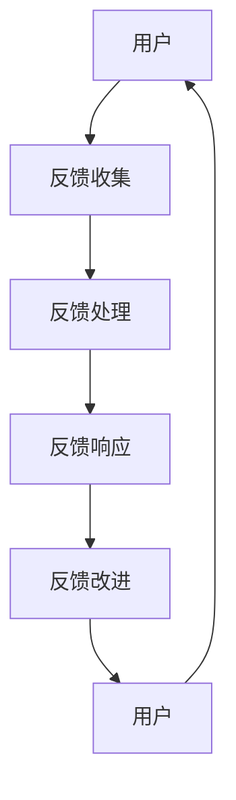
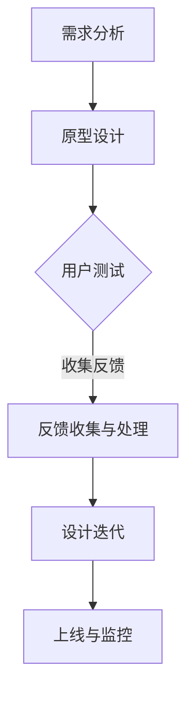

                 

### 用户反馈循环概述

#### 1.1.1 用户反馈循环的定义

用户反馈循环（User Feedback Loop）是一个持续的过程，通过收集用户在使用产品或服务过程中的体验和意见，对这些反馈进行分析和评估，进而指导产品或服务的改进。这个循环不仅包括从用户到产品的信息流动，也包含从产品到用户的反馈循环，从而形成一个闭环系统。用户反馈循环的重要性在于：

- **提升用户体验**：通过用户反馈，企业可以了解用户在实际使用产品过程中的痛点和需求，从而针对性地优化产品设计和功能。
- **驱动产品创新**：用户反馈是产品创新的源泉，它可以启发新的产品特性或服务模式，帮助企业保持竞争力。
- **增强用户忠诚度**：积极响应用户反馈，展示企业对用户需求的关注，有助于增强用户对品牌的忠诚度和信任。

#### 1.1.2 用户反馈循环的基本要素

用户反馈循环的基本要素包括：

- **用户**：用户是反馈的源头，他们的体验和意见直接影响到产品或服务的改进。
- **收集**：企业需要通过各种渠道收集用户的反馈，包括调查问卷、用户访谈、用户行为数据分析等。
- **分析**：对收集到的用户反馈进行深入分析，识别出关键问题和改进机会。
- **响应**：对用户反馈进行及时回应，可能包括改进建议、解决方案等。
- **改进**：根据分析结果和用户反馈，进行产品或服务的改进。

#### 1.1.3 用户反馈循环的运行机制

用户反馈循环的运行机制可以分为以下几个步骤：

1. **反馈收集**：企业通过各种方式收集用户的反馈，包括在线调查、用户访谈、社交媒体评论等。
2. **反馈处理**：对收集到的反馈进行分类、筛选和分析，识别出关键问题和用户需求。
3. **反馈响应**：根据分析结果，企业制定并实施改进计划，及时回应用户反馈。
4. **反馈改进**：对产品或服务进行改进，并跟踪改进效果，确保用户反馈得到有效落实。

#### 1.1.4 用户反馈循环的持续优化

用户反馈循环是一个持续优化的过程。为了确保其有效性，企业需要：

- **持续收集反馈**：定期收集用户反馈，确保信息的时效性和准确性。
- **优化反馈机制**：不断优化反馈收集和处理流程，提高反馈效率和质量。
- **跨部门协作**：用户反馈涉及到产品的设计、开发、运营等多个部门，需要建立有效的跨部门协作机制。
- **数据驱动决策**：利用数据分析工具，对用户反馈进行量化分析，为产品改进提供数据支持。

### 1.2 用户反馈循环的核心概念与联系

用户反馈循环的核心概念包括用户、反馈收集、分析、响应和改进。这些概念之间的关系可以用Mermaid流程图表示如下：



#### 1.2.1 用户反馈循环的核心算法原理讲解

用户反馈循环的核心算法原理可以概括为以下几个方面：

1. **反馈收集算法**：使用自然语言处理（NLP）技术对用户反馈文本进行分析，提取关键信息和情感倾向。
2. **反馈处理算法**：对收集到的用户反馈进行分类和优先级排序，识别出关键问题和改进机会。
3. **反馈响应算法**：根据用户反馈，生成相应的响应文本，包括改进建议、解决方案等。
4. **反馈改进算法**：根据用户反馈和改进效果，调整产品或服务的功能设计和用户体验。

以下是用户反馈处理算法的伪代码示例：

```python
def process_feedback(feedback):
    # 使用NLP技术分析反馈文本
    sentiment = analyze_sentiment(feedback)
    keywords = extract_keywords(feedback)

    # 分类和优先级排序
    category = classify_feedback(keywords)
    priority = prioritize_feedback(category)

    # 生成响应文本
    response = generate_response(sentiment, category)

    return response

def analyze_sentiment(feedback):
    # 使用情感分析模型分析反馈的情感倾向
    sentiment = sentiment_analysis_model(feedback)
    return sentiment

def extract_keywords(feedback):
    # 使用关键词提取技术提取反馈文本中的关键词
    keywords = keyword_extraction_model(feedback)
    return keywords

def classify_feedback(keywords):
    # 根据关键词分类反馈
    category = keyword_classification_model(keywords)
    return category

def prioritize_feedback(category):
    # 根据反馈类别进行优先级排序
    priority = priority_sorting_model(category)
    return priority

def generate_response(sentiment, category):
    # 根据情感倾向和反馈类别生成响应文本
    if sentiment == "positive":
        response = "感谢您的积极反馈，我们将继续努力提供更好的产品体验！"
    elif sentiment == "negative":
        response = "感谢您的宝贵意见，我们将尽快解决您提到的问题。"
    else:
        response = "感谢您的反馈，我们将认真考虑您的建议。"
    return response
```

### 1.3 用户反馈循环在产品体验优化中的应用

用户反馈循环在产品体验优化中的应用主要体现在以下几个方面：

1. **产品功能改进**：通过用户反馈，识别出产品功能中的不足，进行针对性的优化和改进，提升用户体验。
2. **用户体验设计**：基于用户反馈，优化产品的交互设计、界面布局和操作流程，使产品更加符合用户习惯。
3. **问题排查与解决**：及时发现用户反馈中的问题，快速响应并解决，减少用户投诉和流失。
4. **持续改进与优化**：将用户反馈作为产品改进的持续动力，不断优化产品体验，提升用户满意度。

#### 1.3.1 用户反馈驱动的设计流程

用户反馈驱动的设计流程主要包括以下步骤：

1. **需求分析**：通过用户调研和反馈收集，了解用户的需求和痛点。
2. **原型设计**：基于用户需求，设计产品原型并进行用户测试。
3. **反馈收集与处理**：收集用户对原型的反馈，进行分类和优先级排序，识别出关键问题和改进机会。
4. **设计迭代**：根据用户反馈，对产品原型进行迭代优化。
5. **上线与监控**：将优化后的产品设计上线，并持续监控用户反馈，进行持续优化。

以下是一个简化的用户反馈驱动的设计流程Mermaid流程图：



### 1.4 用户反馈循环的数学模型和公式

用户反馈循环的数学模型和公式主要用于量化用户反馈的处理效果和优化过程。以下是几个关键公式：

1. **反馈处理效率**：

$$
\text{反馈处理效率} = \frac{\text{处理反馈数量}}{\text{收集反馈数量}} \times 100\%
$$

2. **反馈响应时间**：

$$
\text{反馈响应时间} = \frac{\text{从收集到反馈到处理反馈的时间}}{\text{处理反馈数量}}
$$

3. **用户满意度**：

$$
\text{用户满意度} = \frac{\text{满意用户数量}}{\text{总用户数量}} \times 100\%
$$

#### 1.4.1 公式详解与举例说明

1. **反馈处理效率**：

该公式用于衡量反馈处理的速度和效果。假设一个产品团队在一个月内收集到100条用户反馈，并处理了80条，则反馈处理效率为：

$$
\text{反馈处理效率} = \frac{80}{100} \times 100\% = 80\%
$$

这意味着产品团队在一个月内处理了80%的用户反馈。

2. **反馈响应时间**：

该公式用于衡量团队处理用户反馈的平均时间。假设一个产品团队从用户反馈收集到处理反馈的平均时间为5天，则反馈响应时间为：

$$
\text{反馈响应时间} = \frac{5 \times 24}{80} = 1.5 \text{天}
$$

这意味着产品团队平均每天响应用户反馈的时间为1.5天。

3. **用户满意度**：

该公式用于衡量用户的整体满意度。假设在一个产品用户中，有60%的用户表示满意，则用户满意度为：

$$
\text{用户满意度} = \frac{60}{100} \times 100\% = 60\%
$$

这意味着60%的用户对产品的体验表示满意。

通过以上公式，企业可以量化用户反馈的处理效果，从而不断优化反馈流程，提升产品体验。

### 1.5 用户反馈循环的项目实战

#### 1.5.1 开发环境搭建

为了实现用户反馈循环，首先需要搭建一个高效的开发环境，包括以下工具和平台：

- **版本控制系统**：如Git，用于管理和跟踪代码变更。
- **开发框架**：如React或Vue.js，用于快速构建用户界面。
- **数据库系统**：如MySQL或MongoDB，用于存储用户反馈数据。
- **分析工具**：如Google Analytics或Mixpanel，用于分析用户行为数据。

#### 1.5.2 源代码详细实现和代码解读

以下是一个简单的用户反馈收集系统的源代码示例，用于展示如何实现用户反馈的收集、处理和响应：

```javascript
// 用户反馈收集模块
class FeedbackCollector {
  constructor(database) {
    this.database = database;
  }

  async collectFeedback(userId, feedback) {
    // 将用户反馈存储到数据库
    await this.database.insert({
      userId: userId,
      feedback: feedback,
      timestamp: new Date(),
    });
  }
}

// 用户反馈处理模块
class FeedbackProcessor {
  constructor(feedbackCollector, analyzer) {
    this.feedbackCollector = feedbackCollector;
    this.analyzer = analyzer;
  }

  async processFeedback() {
    // 从数据库中获取最新反馈
    const feedbacks = await this.feedbackCollector.fetchFeedbacks();
    for (const feedback of feedbacks) {
      // 使用分析器处理反馈
      const analysis = await this.analyzer.analyze(feedback);
      // 根据分析结果生成响应
      const response = this.generateResponse(analysis);
      // 发送响应给用户
      await this.sendResponse(feedback.userId, response);
    }
  }

  generateResponse(analysis) {
    // 生成反馈响应文本
    if (analysis.sentiment === 'positive') {
      return '感谢您的积极反馈，我们将继续努力提供更好的服务！';
    } else if (analysis.sentiment === 'negative') {
      return '感谢您的宝贵意见，我们将尽快解决您提到的问题。';
    } else {
      return '感谢您的反馈，我们将认真考虑您的建议。';
    }
  }

  async sendResponse(userId, response) {
    // 发送响应给用户
    console.log(`Sent response to user ${userId}: ${response}`);
  }
}

// 用户反馈分析模块
class FeedbackAnalyzer {
  async analyze(feedback) {
    // 使用NLP技术分析反馈
    const sentiment = await this.extractSentiment(feedback);
    const keywords = await this.extractKeywords(feedback);
    return { sentiment, keywords };
  }

  async extractSentiment(feedback) {
    // 提取反馈的情感倾向
    // 这里使用简单的正则表达式进行情感分析，实际应用中应使用更复杂的NLP模型
    const positiveKeywords = ['好', '满意', '喜欢'];
    const negativeKeywords = ['不好', '不满意', '不喜欢'];

    let sentiment = 'neutral';

    for (const keyword of positiveKeywords) {
      if (feedback.includes(keyword)) {
        sentiment = 'positive';
        break;
      }
    }

    for (const keyword of negativeKeywords) {
      if (feedback.includes(keyword)) {
        sentiment = 'negative';
        break;
      }
    }

    return sentiment;
  }

  async extractKeywords(feedback) {
    // 提取反馈中的关键词
    // 这里使用简单的正则表达式进行关键词提取，实际应用中应使用更复杂的NLP模型
    const keywords = feedback.match(/\b\w+\b/g);
    return keywords ? keywords.map(word => word.toLowerCase()) : [];
  }
}

// 源代码解读
// 上述源代码展示了用户反馈收集系统的主要模块，包括反馈收集器（FeedbackCollector）、反馈处理器（FeedbackProcessor）和反馈分析器（FeedbackAnalyzer）。
// 反馈收集器用于收集用户反馈并将其存储到数据库中。
// 反馈处理器用于从数据库中获取最新反馈，使用分析器进行分析，并生成响应发送给用户。
// 反馈分析器用于使用NLP技术分析反馈的情感倾向和关键词。

```

#### 1.5.3 代码应用解读与分析

上述代码实现了一个简单的用户反馈收集系统，主要分为三个模块：反馈收集器、反馈处理器和反馈分析器。

1. **反馈收集器（FeedbackCollector）**：该模块负责从用户收集反馈并将其存储到数据库中。具体功能如下：

   - 构造函数接收一个数据库实例，用于与数据库进行交互。
   - `collectFeedback` 方法用于接收用户ID和反馈文本，并将其存储到数据库中。

2. **反馈处理器（FeedbackProcessor）**：该模块负责处理用户反馈，包括分析反馈、生成响应和发送响应。具体功能如下：

   - 构造函数接收一个反馈收集器实例和一个分析器实例，用于与它们进行交互。
   - `processFeedback` 方法用于从数据库中获取最新反馈，使用分析器进行分析，并生成响应发送给用户。
   - `generateResponse` 方法根据反馈的情感倾向生成相应的响应文本。
   - `sendResponse` 方法用于发送响应给用户。

3. **反馈分析器（FeedbackAnalyzer）**：该模块负责使用NLP技术分析反馈的情感倾向和关键词。具体功能如下：

   - `analyze` 方法用于接收反馈文本，并使用情感分析和关键词提取技术进行分析，返回情感倾向和关键词。
   - `extractSentiment` 方法使用简单的正则表达式提取反馈中的情感倾向。
   - `extractKeywords` 方法使用简单的正则表达式提取反馈中的关键词。

#### 1.5.4 实际案例分析和详细讲解剖析

以下是一个实际案例，展示如何使用用户反馈收集系统：

**案例背景**：一个在线教育平台希望通过用户反馈来优化课程内容和用户体验。

**步骤1：用户反馈收集**  
用户A在课程结束后的反馈中提到：“课程的难度适中，但练习题不够有挑战性。”

**步骤2：用户反馈处理**  
反馈处理器获取到用户A的反馈，分析器对其进行情感分析和关键词提取，得到以下结果：

- 情感倾向：中性
- 关键词：难度、适中、练习题、挑战性

**步骤3：用户反馈改进**  
根据反馈，平台决定增加难度更大的练习题，以提升课程的整体挑战性。

**步骤4：用户反馈响应**  
平台向用户A发送反馈响应：“感谢您的反馈，我们会根据您的建议增加更具挑战性的练习题。”

**步骤5：用户反馈跟踪**  
后续，平台跟踪用户A的再次反馈，以评估改进效果。用户A在新的课程中反馈：“练习题现在更有挑战性了，我很喜欢。”

**项目小结**  
通过用户反馈收集系统，平台成功优化了课程内容，提高了用户满意度。项目小结包括以下几点：

1. 用户反馈是优化产品的重要来源。
2. 使用NLP技术对用户反馈进行分析，有助于提取关键信息和情感倾向。
3. 及时响应用户反馈，展示企业对用户需求的关注。
4. 持续跟踪用户反馈，评估改进效果，确保产品不断优化。

### 1.6 最佳实践 Tips、小结、注意事项、拓展阅读

#### 1.6.1 最佳实践 Tips

1. **及时收集反馈**：确保用户反馈的时效性，及时收集用户的意见和反馈。
2. **多样化收集渠道**：使用多种渠道收集用户反馈，包括在线调查、用户访谈、社交媒体等。
3. **数据驱动决策**：利用数据分析工具，对用户反馈进行量化分析，为产品改进提供数据支持。
4. **闭环反馈机制**：建立有效的闭环反馈机制，确保用户反馈得到及时响应和改进。

#### 1.6.2 小结

用户反馈循环是优化产品体验的关键环节，通过持续收集、分析和响应用户反馈，企业可以不断改进产品，提升用户体验。

#### 1.6.3 注意事项

1. **保护用户隐私**：在收集用户反馈时，要注意保护用户的隐私和数据安全。
2. **反馈真实性**：对用户反馈进行筛选，确保反馈的真实性和有效性。
3. **跨部门协作**：用户反馈涉及产品的设计、开发、运营等多个部门，需要建立有效的跨部门协作机制。

#### 1.6.4 拓展阅读

- 《用户中心设计：如何打造优秀用户体验》
- 《数据分析实战：用数据驱动业务增长》
- 《NLP入门与实践：自然语言处理技术与应用》

## 附录A：用户反馈循环相关工具与资源

### A.1 用户反馈收集工具

#### A.1.1 调查问卷工具

- **Google 表单**：免费、易于使用，可嵌入网站。
- **Typeform**：交互式调查，用户体验较好。
- **SurveyMonkey**：功能丰富，收费服务。

#### A.1.2 用户访谈工具

- **Zoom**：视频会议和在线访谈。
- **Calendly**：预约管理，方便安排访谈时间。
- **Miro**：在线协作白板，可用于访谈过程记录。

#### A.1.3 用户行为分析工具

- **Google Analytics**：网站分析，追踪用户行为。
- **Hotjar**：用户行为跟踪，包括点击图和滚动图。
- **Mixpanel**：用户行为分析和用户流失预警。

### A.2 用户反馈处理与分析工具

#### A.2.1 数据分析工具

- **Tableau**：数据可视化，帮助理解数据。
- **Power BI**：商业智能工具，支持数据分析和报告。
- **Excel**：基本数据分析工具，广泛使用。

#### A.2.2 用户体验评估工具

- **Usability Hub**：用户体验测试工具。
- **Optimal Workshop**：交互式原型测试工具。
- **UserTesting**：真实用户测试服务。

### A.3 用户反馈驱动产品设计与开发工具

#### A.3.1 原型设计工具

- **Sketch**：界面设计工具，适用于移动和Web界面设计。
- **Adobe XD**：交互式原型设计工具。
- **Figma**：基于浏览器的原型设计工具，支持协作。

#### A.3.2 用户体验测试工具

- **Selenium**：自动化测试工具，用于测试Web应用程序。
- **Appium**：跨平台移动应用测试工具。
- **Cypress**：前端测试框架，支持端到端的测试。

### A.4 用户反馈循环相关文献与资源

#### A.4.1 学术论文

- 《User-Centered Design: Process and Methods for Designing Interactive Systems》
- 《The Design of Everyday Things》
- 《User Experience Design: The Basic Principles》

#### A.4.2 行业报告

- 《The State of User Experience 2021》
- 《User Research Report 2021》
- 《Customer Experience Report 2021》

#### A.4.3 开源社区与论坛

- **GitHub**：开源代码库，包含许多用户反馈循环相关的项目。
- **Stack Overflow**：编程问答社区，用户反馈和问题讨论。
- **UX.stackexchange.com**：用户体验专业问答社区。

## 作者信息

作者：AI天才研究院/AI Genius Institute & 禅与计算机程序设计艺术 /Zen And The Art of Computer Programming## 第2章：用户反馈收集与处理

### 2.1 用户反馈收集的方法

用户反馈的收集是用户反馈循环中的第一步，也是至关重要的一步。有效的反馈收集方法可以帮助企业更好地了解用户需求、识别产品问题，并为后续的分析和改进提供可靠的数据基础。以下是几种常见的用户反馈收集方法：

#### 2.1.1 调查问卷

调查问卷是一种广泛使用的用户反馈收集工具，通过设计一系列问题，让用户根据自己的经验和感受进行回答。问卷可以在线上或线下进行，其优点包括：

- **覆盖面广**：可以收集到大量用户的反馈，有助于全面了解用户需求。
- **灵活性高**：可以根据需要设计不同类型的问题，如单选、多选、评分等。
- **数据处理方便**：通过自动化工具，可以轻松进行数据收集、整理和分析。

然而，调查问卷也存在一些局限，如：

- **响应率低**：用户可能对填写问卷不感兴趣，导致响应率低。
- **主观性**：用户回答可能受到个人情绪和偏见的影响，影响反馈的准确性。
- **设计难度**：需要投入时间和精力设计合理的问卷结构和问题。

#### 2.1.2 用户访谈

用户访谈是一种通过与用户进行一对一或小组讨论来收集反馈的方法。这种方法具有以下优点：

- **深入挖掘**：可以更深入地了解用户的需求、行为和想法，获取更详细的信息。
- **互动性强**：访谈过程中可以实时交流，有助于澄清问题和获取更多细节。
- **信任建立**：与用户建立直接的沟通，有助于建立信任关系，鼓励用户提供更真实的反馈。

然而，用户访谈也存在一些缺点，如：

- **耗时费力**：需要进行充分的准备和后续的数据整理工作。
- **成本较高**：需要投入大量时间和人力资源。
- **样本偏差**：可能只能获取到部分用户的反馈，无法代表整体用户群体。

#### 2.1.3 用户行为数据分析

用户行为数据分析是一种通过分析用户在产品中的行为数据来收集反馈的方法。这种方法具有以下优点：

- **客观性**：基于用户实际行为数据，减少了主观偏见的影响。
- **全面性**：可以收集到大量用户行为数据，有助于全面了解用户行为模式。
- **实时性**：可以实时监测用户行为，及时发现问题并进行改进。

用户行为数据分析的主要方法包括：

- **用户跟踪**：通过在产品中嵌入跟踪代码，收集用户的使用数据，如页面访问次数、点击行为等。
- **事件追踪**：定义特定事件并跟踪用户对这些事件的反应，如注册、购买、登录等。
- **热图分析**：使用热图工具分析用户在页面上的活动，了解用户关注和操作的热点区域。

然而，用户行为数据分析也存在一些局限性，如：

- **数据解读难度**：需要具备一定的数据分析能力，才能正确解读和利用数据。
- **隐私问题**：用户行为数据可能涉及隐私问题，需要确保数据的保密性和合规性。

### 2.2 用户反馈处理流程

用户反馈收集完成后，需要对其进行处理和分析，以便为产品改进提供指导。用户反馈处理流程通常包括以下几个步骤：

#### 2.2.1 反馈筛选与分类

在处理用户反馈时，首先需要对反馈进行筛选和分类。筛选的目的是去除无效或不真实的反馈，分类的目的是将反馈按照主题或问题进行归类，以便后续的分析和改进。

- **筛选**：可以通过设定筛选条件，如用户ID、反馈时间、反馈类型等，来筛选出符合要求的反馈。
- **分类**：可以根据反馈的内容、情感倾向或问题类别，将反馈分为不同的类别，如功能问题、性能问题、用户体验问题等。

#### 2.2.2 反馈分析与整理

在筛选和分类完成后，需要对反馈进行深入分析，以识别出关键问题和改进机会。反馈分析的方法包括：

- **定量分析**：通过统计方法对反馈进行量化分析，如计算反馈数量、出现频率、情感倾向等。
- **定性分析**：对反馈进行文本分析，提取关键信息和情感倾向，识别出用户关注的问题和需求。

分析完成后，需要将反馈进行整理，形成分析报告，包括反馈概况、关键问题、改进建议等。

#### 2.2.3 反馈响应与改进

在完成反馈分析后，需要对用户反馈进行响应和改进。反馈响应的目的是告知用户他们的反馈已被接收并正在处理，改进的目的是根据反馈进行分析和改进，以提高产品或服务的质量和用户体验。

- **反馈响应**：可以通过邮件、社交媒体、客户支持渠道等方式，向用户反馈他们的反馈已收到，并正在处理。
- **改进实施**：根据反馈分析结果，制定改进计划，并实施改进措施。改进措施可以包括修复问题、优化功能、改进用户体验等。

#### 2.2.4 反馈跟踪与评估

在完成反馈响应和改进后，需要对反馈进行跟踪和评估，以验证改进效果，并持续优化反馈处理流程。反馈跟踪的方法包括：

- **反馈回顾**：定期回顾用户反馈，评估改进措施的效果，识别出新的问题和改进机会。
- **用户反馈跟踪**：通过用户调研、用户访谈等方式，了解用户对改进措施的反馈，收集新的用户反馈。

### 2.3 用户反馈处理工具与技巧

为了高效地处理用户反馈，可以借助一些工具和技巧，以下是一些常用的工具和技巧：

- **自动化工具**：使用自动化工具进行反馈收集、分类和分析，提高处理效率。
- **数据可视化工具**：使用数据可视化工具，如Tableau或Power BI，对反馈数据进行分析和展示，帮助团队更好地理解反馈。
- **人工智能与机器学习**：使用人工智能和机器学习技术，如自然语言处理和情感分析，对用户反馈进行自动化分析，提高分析准确性。
- **用户反馈管理系统**：使用专业的用户反馈管理系统，如Jira或Asana，对反馈进行跟踪和管理，确保反馈得到及时处理和响应。

#### 2.3.1 调查问卷设计技巧

设计有效的调查问卷是收集高质量用户反馈的关键。以下是一些设计技巧：

- **明确目标**：在设计问卷前，明确调查的目的和目标，确保问卷内容紧扣主题。
- **简化问题**：避免使用复杂或模糊的问题，尽量简化问题，提高用户的回答意愿。
- **合理布局**：合理安排问卷的布局，确保问题之间的逻辑清晰，避免用户产生困惑。
- **控制问题数量**：控制问卷的问题数量，避免用户感到厌烦，影响回答质量。
- **增加互动性**：在问卷中加入互动元素，如下拉菜单、评分量表等，提高用户的参与度。

#### 2.3.2 用户访谈技巧

进行有效的用户访谈需要准备和技巧，以下是一些用户访谈的技巧：

- **提前准备**：在访谈前，准备好访谈提纲和问题，确保访谈内容的针对性。
- **营造舒适氛围**：在访谈过程中，营造一个轻松、舒适的氛围，让用户感到放松，愿意分享真实的想法。
- **倾听与引导**：在访谈过程中，积极倾听用户的回答，并用开放性问题引导用户，获取更多详细信息。
- **记录关键信息**：在访谈过程中，注意记录关键信息，以便后续分析和整理。
- **尊重用户隐私**：在访谈过程中，尊重用户的隐私，避免透露用户的个人信息。

#### 2.3.3 用户行为数据分析技巧

进行有效的用户行为数据分析需要掌握一些技巧，以下是一些用户行为数据分析的技巧：

- **明确分析目标**：在进行数据分析前，明确分析的目标和指标，确保分析的方向正确。
- **选择合适的数据源**：选择合适的数据源，如服务器日志、用户跟踪数据等，确保数据的准确性和完整性。
- **使用数据分析工具**：使用数据分析工具，如Python、R等，对用户行为数据进行分析和处理。
- **可视化数据**：使用数据可视化工具，如Tableau、Power BI等，将分析结果可视化，帮助团队更好地理解数据。
- **持续迭代分析**：用户行为数据是动态变化的，需要持续迭代分析，以适应新的用户行为模式和需求。

### 2.4 用户反馈收集与处理的案例

以下是一个用户反馈收集与处理的实际案例，展示如何有效地收集、处理和利用用户反馈：

#### 案例背景

某在线教育平台在上线一款新的课程管理工具后，希望通过用户反馈来优化产品体验。

#### 案例步骤

1. **用户反馈收集**：
   - 设计了一份调查问卷，包括对课程管理工具的满意度、功能需求、使用痛点等问题。
   - 在课程结束后，向用户发送问卷，收集反馈。
   - 同时，利用用户行为数据分析工具，收集用户在工具中的行为数据，如使用时长、功能访问频率等。

2. **用户反馈处理**：
   - 对收集到的问卷数据进行筛选和分类，去除无效和不真实的反馈。
   - 将反馈按照功能需求、使用痛点等主题进行分类。
   - 使用自然语言处理技术，对问卷文本进行分析，提取关键信息和情感倾向。

3. **反馈响应与改进**：
   - 将用户的反馈进行整理，形成分析报告，向用户反馈他们的反馈已收到，并正在处理。
   - 根据反馈分析结果，制定改进计划，包括修复已知问题、新增功能、优化用户体验等。
   - 实施改进措施，如更新课程管理工具的界面、增加新功能等。

4. **反馈跟踪与评估**：
   - 定期跟踪用户反馈，了解改进措施的效果，收集新的用户反馈。
   - 通过用户访谈和用户行为数据分析，评估改进措施的效果，识别出新的问题和改进机会。

#### 项目小结

通过用户反馈收集与处理，该在线教育平台成功优化了课程管理工具，提升了用户满意度。项目小结包括以下几点：

- 用户反馈是优化产品的重要来源。
- 设计合理的调查问卷和用户访谈，可以收集到高质量的用户反馈。
- 数据分析技术有助于提取关键信息和情感倾向，为产品改进提供数据支持。
- 及时响应用户反馈，展示企业对用户需求的关注。
- 持续跟踪用户反馈，评估改进效果，确保产品不断优化。

### 2.5 最佳实践 Tips、小结、注意事项、拓展阅读

#### 2.5.1 最佳实践 Tips

- **多元化收集渠道**：结合调查问卷、用户访谈和用户行为数据分析，全方位收集用户反馈。
- **数据驱动决策**：充分利用数据分析工具，对用户反馈进行量化分析，为产品改进提供数据支持。
- **及时响应**：及时响应用户反馈，展示企业对用户需求的关注。
- **闭环反馈机制**：建立有效的闭环反馈机制，确保用户反馈得到及时处理和改进。

#### 2.5.2 小结

用户反馈收集与处理是用户反馈循环中的关键环节，通过有效的反馈收集和处理，企业可以更好地了解用户需求，优化产品体验。

#### 2.5.3 注意事项

- **保护用户隐私**：在收集和处理用户反馈时，要注意保护用户的隐私和数据安全。
- **反馈真实有效性**：确保收集到的用户反馈真实有效，避免因虚假反馈导致错误的产品改进。
- **跨部门协作**：用户反馈涉及产品的设计、开发、运营等多个部门，需要建立有效的跨部门协作机制。

#### 2.5.4 拓展阅读

- 《用户调研与反馈收集实战》
- 《数据驱动的产品优化》
- 《用户体验设计：实践与技巧》

### 附录

#### 附录A：用户反馈收集工具推荐

- **调查问卷工具**：Google 表单、Typeform、SurveyMonkey
- **用户访谈工具**：Zoom、Calendly、Miro
- **用户行为分析工具**：Google Analytics、Hotjar、Mixpanel
- **数据分析工具**：Tableau、Power BI、Excel
- **用户体验评估工具**：Usability Hub、Optimal Workshop、UserTesting
- **原型设计工具**：Sketch、Adobe XD、Figma
- **用户体验测试工具**：Selenium、Appium、Cypress

## 作者信息

作者：AI天才研究院/AI Genius Institute & 禅与计算机程序设计艺术 /Zen And The Art of Computer Programming## 第3章：用户体验评估与改进

### 3.1 用户体验评估指标

用户体验（User Experience, UX）评估是确保产品或服务能够满足用户需求、提升用户满意度和忠诚度的关键环节。有效的用户体验评估指标可以帮助企业全面了解用户在使用产品过程中的体验感受，从而进行有针对性的改进。以下是几种常见的用户体验评估指标：

#### 3.1.1 用户体验指标的类型

1. **功能性指标**：这类指标衡量产品的功能是否满足用户需求，包括：
   - **可用性**：产品是否易于使用，用户能否轻松完成任务。
   - **可靠性**：产品在正常使用条件下是否稳定可靠，故障率如何。
   - **效率**：用户完成任务所需的时间和步骤，以及效率的改进空间。

2. **情感性指标**：这类指标关注用户在产品使用过程中的情感体验，包括：
   - **愉悦度**：用户在产品使用过程中感到的愉悦程度。
   - **信任度**：用户对产品的信任和安全感。
   - **满意度**：用户对产品整体体验的满意程度。

3. **情境性指标**：这类指标衡量产品在特定情境下的适用性和适应性，包括：
   - **易访问性**：产品是否易于获取和使用，尤其是在不同的设备或环境中。
   - **一致性**：产品在不同界面和功能之间是否保持一致性和连贯性。
   - **定制化**：产品是否能够根据用户的不同需求进行定制和调整。

#### 3.1.2 用户体验评估工具

为了有效地评估用户体验，可以使用以下几种工具：

1. **问卷调查**：通过设计问卷来收集用户对产品功能、易用性、情感体验等方面的主观评价。

2. **用户访谈**：通过与用户进行一对一或小组讨论，深入了解用户的使用习惯、需求和痛点。

3. **用户测试**：邀请用户进行实际的产品使用测试，观察和记录用户在使用过程中的行为和反馈。

4. **行为跟踪工具**：使用工具如Google Analytics、Hotjar等，自动收集和分析用户在产品中的行为数据，如点击路径、停留时间、退出率等。

5. **情感分析工具**：使用自然语言处理（NLP）技术，分析用户在评论、反馈等文本中的情感倾向，了解用户的心理状态。

#### 3.1.3 用户体验评估的方法

1. **定性评估**：通过用户访谈、用户测试和观察等方法，收集用户的主观感受和意见，适用于了解用户情感和情境性体验。

2. **定量评估**：通过问卷调查、行为跟踪和数据统计分析等方法，收集用户在使用产品过程中的客观数据，适用于评估功能性和情境性体验。

3. **综合评估**：结合定性和定量评估方法，从多个角度全面评估用户体验，确保评估结果的全面性和准确性。

#### 3.1.4 用户体验评估的常见指标及其计算方法

以下是一些常见的用户体验评估指标及其计算方法：

1. **用户满意度（User Satisfaction）**：

$$
\text{用户满意度} = \frac{\text{满意用户数}}{\text{总用户数}} \times 100\%
$$

2. **净推荐值（Net Promoter Score, NPS）**：

$$
\text{NPS} = \frac{\text{推荐者数} - \text{贬损者数}}{\text{总用户数}} \times 100\%
$$

其中，推荐者分数为9-10分，中性者分数为7-8分，贬损者分数为0-6分。

3. **任务完成率（Task Success Rate）**：

$$
\text{任务完成率} = \frac{\text{成功完成任务的用户数}}{\text{总用户数}} \times 100\%
$$

4. **平均完成任务时间（Average Task Completion Time）**：

$$
\text{平均完成任务时间} = \frac{\text{所有用户完成任务的时间总和}}{\text{总用户数}}
$$

5. **用户错误率（User Error Rate）**：

$$
\text{用户错误率} = \frac{\text{发生错误的任务数}}{\text{总任务数}} \times 100\%
$$

### 3.2 用户体验改进策略

用户体验的持续改进是一个动态、迭代的过程，需要结合用户反馈和数据分析，不断优化产品或服务。以下是几种常见的用户体验改进策略：

#### 3.2.1 基于用户反馈的优化方法

1. **快速反馈机制**：建立快速反馈机制，确保用户反馈能够及时被接收和处理。通过在线调查、用户访谈、社交媒体等多种渠道收集用户反馈，并快速进行响应和改进。

2. **A/B测试**：通过A/B测试，对比不同设计方案的用户体验效果，选择用户反馈更好的方案进行推广。这种方法可以帮助企业在有限的时间内快速测试和优化产品功能。

3. **用户参与设计**：邀请用户参与产品的设计过程，收集他们的意见和建议。用户参与设计不仅可以提高产品的实用性和满意度，还可以增强用户的参与感和忠诚度。

#### 3.2.2 基于数据分析的改进方法

1. **行为分析**：通过分析用户在产品中的行为数据，了解用户的使用习惯、偏好和痛点。例如，使用行为跟踪工具，分析用户在页面上的点击路径、停留时间和转化率等，为产品改进提供数据支持。

2. **数据驱动的A/B测试**：结合数据分析，设计A/B测试方案，通过对比不同设计版本的绩效指标，选择最优的版本进行推广。这种方法可以提高A/B测试的准确性和效果。

3. **自动化数据分析**：使用自动化数据分析工具，如机器学习算法，对用户行为数据进行分析，发现潜在的问题和改进机会。这种方法可以提高数据分析的效率和准确性。

#### 3.2.3 用户测试与迭代优化

1. **用户测试**：邀请真实用户参与产品的测试，观察他们在实际使用过程中的体验和行为。通过用户测试，可以发现产品中存在的问题，并获得改进建议。

2. **迭代优化**：基于用户测试和数据分析的结果，对产品进行迭代优化。每次迭代都要关注关键指标的改进，并持续评估优化效果。

3. **闭环反馈机制**：建立闭环反馈机制，确保用户反馈能够被持续收集、处理和响应。通过定期的用户调研、访谈和用户测试，不断优化产品体验。

### 3.3 用户体验改进的案例分析

以下是一个用户体验改进的案例分析，展示如何通过用户反馈和数据分析，持续优化产品体验。

#### 案例背景

某电子商务平台在用户调研中发现，用户在购物过程中存在一些痛点，如页面加载缓慢、搜索结果不准确、购物车功能不完善等。

#### 案例步骤

1. **用户反馈收集**：通过在线调查和用户访谈，收集用户对平台功能的反馈，了解他们的需求和痛点。

2. **数据分析**：分析用户在平台上的行为数据，如页面访问量、点击路径、转化率等，识别出关键的问题和改进机会。

3. **A/B测试**：设计A/B测试方案，对比不同页面的设计，如搜索结果页面的布局、购物车的用户体验等，选择用户反馈更好的版本。

4. **用户测试**：邀请用户进行实际的产品使用测试，观察他们的行为和反馈，验证改进措施的效果。

5. **迭代优化**：根据用户测试和分析结果，对平台进行迭代优化，如优化页面加载速度、改进搜索算法、简化购物流程等。

6. **闭环反馈**：建立闭环反馈机制，持续收集用户反馈，评估改进措施的效果，并根据新的用户反馈进行进一步的优化。

#### 项目小结

通过用户反馈和数据分析，该电子商务平台成功优化了用户体验，提高了用户满意度和忠诚度。项目小结包括以下几点：

- 用户反馈是优化产品体验的重要来源。
- 数据分析有助于识别关键问题和改进机会。
- A/B测试和用户测试是验证改进效果的有效方法。
- 持续迭代优化是提升用户体验的关键。
- 建立闭环反馈机制，确保用户反馈能够被持续收集和处理。

### 3.4 最佳实践 Tips、小结、注意事项、拓展阅读

#### 3.4.1 最佳实践 Tips

- **多元化反馈收集**：结合问卷调查、用户访谈和行为数据分析，全方位收集用户反馈。
- **数据驱动决策**：充分利用数据分析工具，对用户反馈和行为数据进行分析，为产品改进提供数据支持。
- **用户参与设计**：邀请用户参与产品设计，提高产品的实用性和满意度。
- **持续迭代优化**：建立闭环反馈机制，持续收集用户反馈，进行迭代优化。

#### 3.4.2 小结

用户体验评估与改进是产品优化的重要环节，通过有效的反馈收集和数据分析，企业可以不断提升产品体验，满足用户需求。

#### 3.4.3 注意事项

- **保护用户隐私**：在收集和处理用户反馈时，要注意保护用户的隐私和数据安全。
- **反馈真实有效性**：确保收集到的用户反馈真实有效，避免因虚假反馈导致错误的产品改进。
- **跨部门协作**：用户体验涉及产品的设计、开发、运营等多个部门，需要建立有效的跨部门协作机制。

#### 3.4.4 拓展阅读

- 《用户体验度量：量化用户满意度与价值》
- 《产品经理实战手册：用户体验设计》
- 《数据分析实战：用数据驱动业务增长》

## 附录

### 附录A：用户体验评估工具推荐

- **问卷调查工具**：Google 表单、Typeform、SurveyMonkey
- **用户访谈工具**：Zoom、Calendly、Miro
- **用户测试工具**：UserTesting、Optimal Workshop、Usability Hub
- **行为跟踪工具**：Google Analytics、Hotjar、Mixpanel
- **情感分析工具**：NLP技术、TextBlob、VADER
- **A/B测试工具**：Google Optimize、VWO、AB Tasty

### 附录B：用户体验改进案例研究

- 案例一：某电商平台的用户满意度提升策略
- 案例二：某SaaS产品的界面优化实践
- 案例三：某社交媒体平台的用户体验迭代优化

## 作者信息

作者：AI天才研究院/AI Genius Institute & 禅与计算机程序设计艺术 /Zen And The Art of Computer Programming## 第4章：用户反馈循环在产品设计中的应用

### 4.1 用户反馈驱动的设计流程

用户反馈是产品设计过程中的宝贵资源，通过有效的用户反馈循环，企业可以持续改进产品设计，提升用户体验。用户反馈驱动的设计流程主要包括以下步骤：

#### 4.1.1 设计调研与需求分析

在产品设计的初期，企业需要进行深入的调研和需求分析，以了解用户的需求、痛点和期望。这可以通过以下方法实现：

- **用户访谈**：通过与目标用户进行一对一或小组访谈，深入了解他们的需求和期望。
- **问卷调查**：设计并分发问卷，收集大量用户的反馈和数据。
- **用户行为分析**：分析用户在现有产品中的行为数据，了解他们的使用习惯和偏好。

#### 4.1.2 原型设计与用户测试

在需求分析完成后，设计师可以根据收集到的用户反馈和需求，设计产品原型并进行用户测试。用户测试的目的是验证产品原型的可行性和用户体验。

- **低保真原型**：首先设计低保真原型，用于验证核心功能和设计思路。
- **高保真原型**：在低保真原型的基础上，进一步开发高保真原型，用于详细展示产品的界面和交互。
- **用户测试**：邀请目标用户进行产品原型测试，观察他们在使用过程中的行为和反馈。

#### 4.1.3 设计迭代与反馈优化

用户测试完成后，设计师需要根据用户的反馈对产品原型进行迭代优化。这一过程通常包括以下几个步骤：

- **反馈收集与分类**：收集用户在测试过程中提供的反馈，并对反馈进行分类和整理，识别出关键问题和改进机会。
- **分析反馈**：对用户反馈进行深入分析，理解用户的真实需求和痛点。
- **设计调整**：根据分析结果，对产品原型进行相应的设计调整，如改进界面布局、优化交互流程等。
- **再次测试**：对调整后的原型进行新一轮的用户测试，验证改进效果。

#### 4.1.4 设计上线与监控

在完成多次迭代优化后，产品原型可以逐步上线，并进入实际的用户环境中。这一阶段，企业需要持续监控用户的反馈，以确保产品的稳定性和用户体验。

- **上线发布**：将优化后的产品上线，并监控用户的使用情况。
- **用户反馈收集**：通过用户调研、用户访谈、行为分析等多种方式，收集用户的反馈。
- **问题排查与改进**：及时识别并解决产品上线后出现的问题，并根据用户反馈进行持续优化。

### 4.2 用户反馈在产品设计中的实例分析

以下通过两个实例，展示用户反馈在产品设计中的应用：

#### 案例一：某电商平台的用户反馈优化实践

**案例背景**：某电商平台在用户调研中发现，用户在购物过程中经常遇到搜索结果不准确、购物车功能不完善等问题。

**步骤1：用户反馈收集**  
通过在线调查和用户访谈，收集用户对平台搜索功能和购物车功能的具体反馈。

**步骤2：分析反馈**  
对收集到的反馈进行分类和分析，识别出关键问题和改进机会。例如，用户普遍反映搜索结果不准确，购物车功能不够便捷。

**步骤3：设计调整**  
根据分析结果，对搜索功能和购物车功能进行设计调整。例如，优化搜索算法，提高搜索结果的准确性；简化购物车界面，提高用户操作的便捷性。

**步骤4：用户测试**  
邀请目标用户对调整后的原型进行测试，收集他们的反馈，验证改进效果。

**步骤5：上线与监控**  
将优化后的功能上线，并持续监控用户的使用情况，收集用户反馈，确保改进措施的有效性。

**结果**：通过用户反馈驱动的优化，该电商平台的搜索准确性和购物车用户体验得到了显著提升，用户满意度提高，转化率增加。

#### 案例二：某SaaS产品的用户满意度提升策略

**案例背景**：某SaaS产品在用户调研中发现，用户在使用过程中经常遇到功能不完善、操作复杂等问题。

**步骤1：用户反馈收集**  
通过在线调查和用户访谈，收集用户对产品功能的反馈。

**步骤2：分析反馈**  
对收集到的反馈进行分类和分析，识别出关键问题和改进机会。例如，用户反映部分功能不够完善，操作流程复杂。

**步骤3：设计调整**  
根据分析结果，对产品功能进行设计调整。例如，新增用户需求的功能，简化操作流程，提高用户的便捷性。

**步骤4：用户测试**  
邀请目标用户对调整后的原型进行测试，收集他们的反馈，验证改进效果。

**步骤5：上线与监控**  
将优化后的功能上线，并持续监控用户的使用情况，收集用户反馈，确保改进措施的有效性。

**结果**：通过用户反馈驱动的优化，该SaaS产品的功能完善度和用户操作便捷性得到了显著提升，用户满意度提高，流失率下降。

### 4.3 用户反馈驱动的设计实战技巧

以下是一些用户反馈驱动的设计实战技巧，帮助企业更有效地利用用户反馈来优化产品设计：

#### 4.3.1 快速响应与迭代

- **快速响应**：对用户反馈进行及时响应，展示企业对用户需求的关注。
- **迭代优化**：根据用户反馈，快速迭代产品原型，不断优化设计。

#### 4.3.2 用户参与设计

- **用户参与**：邀请用户参与设计过程，提高产品的实用性和满意度。
- **用户测试**：定期进行用户测试，验证设计方案的可行性。

#### 4.3.3 数据驱动决策

- **数据分析**：利用数据分析工具，对用户反馈和行为数据进行分析，为设计决策提供数据支持。
- **A/B测试**：通过A/B测试，对比不同设计版本的绩效，选择最优方案。

#### 4.3.4 跨部门协作

- **协作机制**：建立跨部门协作机制，确保用户反馈能够被有效收集和处理。
- **信息共享**：促进各部门之间的信息共享，提高设计效率。

### 4.4 最佳实践 Tips、小结、注意事项、拓展阅读

#### 4.4.1 最佳实践 Tips

- **及时响应**：快速响应用户反馈，展示企业对用户需求的关注。
- **用户参与**：邀请用户参与设计，提高产品的实用性和满意度。
- **数据驱动**：利用数据分析，为设计决策提供数据支持。
- **迭代优化**：根据用户反馈，持续迭代产品原型。

#### 4.4.2 小结

用户反馈驱动的设计流程可以帮助企业持续优化产品设计，提升用户体验。通过有效的用户反馈循环，企业可以快速响应用户需求，提高产品竞争力。

#### 4.4.3 注意事项

- **保护用户隐私**：在收集和处理用户反馈时，要注意保护用户的隐私和数据安全。
- **反馈真实有效性**：确保收集到的用户反馈真实有效，避免因虚假反馈导致错误的产品改进。
- **跨部门协作**：用户体验涉及产品的设计、开发、运营等多个部门，需要建立有效的跨部门协作机制。

#### 4.4.4 拓展阅读

- 《用户体验设计：实践与技巧》
- 《产品经理实战手册：用户体验设计》
- 《数据驱动的产品优化》

### 附录

#### 附录A：用户反馈驱动设计工具推荐

- **用户访谈工具**：Zoom、Calendly、Miro
- **用户测试工具**：UserTesting、Optimal Workshop、Usability Hub
- **数据分析工具**：Google Analytics、Hotjar、Mixpanel
- **原型设计工具**：Sketch、Adobe XD、Figma
- **A/B测试工具**：Google Optimize、VWO、AB Tasty

### 附录B：用户反馈驱动设计案例研究

- 案例一：某电商平台的用户反馈优化实践
- 案例二：某SaaS产品的用户满意度提升策略

## 作者信息

作者：AI天才研究院/AI Genius Institute & 禅与计算机程序设计艺术 /Zen And The Art of Computer Programming## 第5章：用户反馈循环在产品运营中的应用

### 5.1 用户反馈在产品运营中的重要性

用户反馈在产品运营中扮演着至关重要的角色。通过用户反馈，企业可以实时了解产品的表现、用户的实际需求和使用痛点，从而采取有效的运营策略来提升用户满意度和产品价值。以下是用户反馈在产品运营中的几个关键作用：

#### 5.1.1 用户满意度监测

用户满意度是衡量产品运营效果的重要指标。通过定期收集用户反馈，企业可以了解用户对产品的整体满意度，及时发现用户满意或不满意的地方。这种监测有助于企业了解产品的优劣势，从而在运营中进行针对性的改进。

#### 5.1.2 用户流失预警

用户流失是产品运营中的一个大问题。通过分析用户反馈，企业可以识别出可能导致用户流失的原因，如产品功能不完善、服务质量差、用户体验差等。及时发现这些潜在问题，并采取相应的措施，可以降低用户流失率，提高用户留存率。

#### 5.1.3 用户活跃度提升策略

用户活跃度是衡量产品运营成功与否的另一个关键指标。通过分析用户反馈，企业可以了解用户在产品中的行为模式和使用习惯，从而制定出有效的用户活跃度提升策略。例如，通过优化用户界面、增加新功能、改进客户服务等，提高用户的参与度和活跃度。

### 5.2 用户反馈在产品运营中的实际应用

用户反馈在产品运营中的应用非常广泛，以下是一些具体的实际应用场景：

#### 5.2.1 运营活动优化

通过用户反馈，企业可以评估各类运营活动的效果，如促销活动、市场活动、客户关怀活动等。用户对活动的内容、形式、参与度等方面的反馈可以帮助企业了解活动的成功之处和改进空间，从而在未来的运营中做出更好的决策。

- **活动内容优化**：根据用户反馈，调整活动内容，使其更符合用户需求和兴趣。
- **活动形式优化**：通过用户反馈，改进活动形式，提高用户的参与度和体验。
- **活动效果监测**：通过用户反馈，监测活动效果，及时调整运营策略。

#### 5.2.2 用户参与度提升

用户参与度是产品运营成功的关键。通过用户反馈，企业可以了解用户在产品中的参与情况，发现提高用户参与度的机会。以下是一些提升用户参与度的策略：

- **用户互动**：通过用户反馈，了解用户对互动活动的需求，设计更吸引人的互动活动。
- **用户社群**：建立用户社群，通过用户反馈了解用户需求，提供定制化服务和内容。
- **用户反馈机制**：建立用户反馈机制，鼓励用户参与产品改进，提高用户粘性。

#### 5.2.3 用户社群运营

用户社群运营是提高用户参与度和忠诚度的有效手段。通过用户反馈，企业可以了解用户在社群中的需求和问题，从而制定出更有效的社群运营策略。

- **社群活动策划**：根据用户反馈，策划更受欢迎的社群活动，提高用户参与度。
- **社群内容优化**：通过用户反馈，优化社群内容，使其更符合用户兴趣和需求。
- **社群互动管理**：通过用户反馈，了解用户对社群互动的期望，提高社群的互动性和活跃度。

### 5.3 用户反馈循环在产品运营中的应用案例分析

以下通过一个实际案例，展示用户反馈循环在产品运营中的应用：

#### 案例背景

某在线教育平台希望通过用户反馈来优化其运营策略，提高用户满意度和参与度。

#### 案例步骤

1. **用户反馈收集**：通过在线调查、用户访谈和社交媒体等渠道，收集用户对课程内容、学习体验、平台服务等方面的反馈。

2. **反馈分析**：对收集到的用户反馈进行分析，识别出关键问题和改进机会。例如，用户反馈课程内容难度不合适，学习体验不佳等。

3. **运营策略调整**：根据反馈分析结果，调整运营策略。例如，针对课程难度问题，平台决定提供更多难度分级课程；针对学习体验问题，平台优化了学习界面和功能。

4. **用户测试**：邀请用户对调整后的课程和学习界面进行测试，收集他们的反馈，验证改进效果。

5. **持续优化**：根据用户测试结果，进一步优化运营策略，如调整课程内容、改进学习界面等。

#### 案例结果

通过用户反馈驱动的运营优化，该在线教育平台在用户满意度和参与度方面取得了显著提升。用户对课程内容和学习体验的满意度提高，学习活跃度增加，用户留存率也有所提升。

### 5.4 用户反馈循环在产品运营中的最佳实践

以下是一些用户反馈循环在产品运营中的最佳实践：

#### 5.4.1 定期收集用户反馈

定期收集用户反馈，确保及时了解用户的需求和痛点，为运营策略提供数据支持。

#### 5.4.2 多渠道收集用户反馈

通过多种渠道收集用户反馈，如在线调查、用户访谈、社交媒体、客户支持等，确保收集到的反馈全面、准确。

#### 5.4.3 快速响应用户反馈

快速响应用户反馈，展示企业对用户需求的关注，提高用户满意度。

#### 5.4.4 跨部门协作

建立跨部门协作机制，确保用户反馈能够被有效收集、处理和响应，提高运营效率。

#### 5.4.5 数据驱动决策

利用数据分析工具，对用户反馈进行量化分析，为运营策略提供数据支持，提高决策准确性。

### 5.5 最佳实践 Tips、小结、注意事项、拓展阅读

#### 5.5.1 最佳实践 Tips

- **多渠道收集用户反馈**：确保反馈的全面性和准确性。
- **快速响应用户反馈**：提高用户满意度，增强用户信任。
- **跨部门协作**：确保反馈的有效处理和响应。
- **数据驱动决策**：提高运营策略的科学性和有效性。

#### 5.5.2 小结

用户反馈循环在产品运营中的应用至关重要，通过有效的用户反馈收集、分析和响应，企业可以持续优化运营策略，提高用户满意度和参与度。

#### 5.5.3 注意事项

- **保护用户隐私**：在收集和处理用户反馈时，要注意保护用户的隐私和数据安全。
- **反馈真实有效性**：确保收集到的用户反馈真实有效，避免因虚假反馈导致错误的产品改进。
- **持续优化**：用户反馈循环是一个持续优化的过程，需要定期收集和处理用户反馈。

#### 5.5.4 拓展阅读

- 《用户运营实战：从新手到高手》
- 《产品运营手册：策略与技巧》
- 《数据驱动的运营优化》

### 附录

#### 附录A：用户反馈收集工具推荐

- **调查问卷工具**：Google 表单、Typeform、SurveyMonkey
- **用户访谈工具**：Zoom、Calendly、Miro
- **用户行为分析工具**：Google Analytics、Hotjar、Mixpanel

### 附录B：用户反馈循环在产品运营中的案例研究

- 案例一：某电商平台的用户反馈优化实践
- 案例二：某SaaS产品的用户满意度提升策略

## 作者信息

作者：AI天才研究院/AI Genius Institute & 禅与计算机程序设计艺术 /Zen And The Art of Computer Programming## 第6章：用户反馈循环在跨部门协作中的应用

### 6.1 跨部门协作在用户反馈循环中的角色

用户反馈循环不仅涉及到产品设计和开发，还涉及到产品的运营、市场推广、客户服务等多个部门。跨部门协作在用户反馈循环中扮演着关键角色，确保用户反馈能够得到全面、准确的收集、分析和响应。以下是各个部门在用户反馈循环中的角色和职责：

#### 6.1.1 产品部门与用户反馈

产品部门是用户反馈循环的核心，负责收集、分析用户反馈，并根据反馈制定改进计划。具体职责包括：

- **反馈收集**：通过问卷调查、用户访谈、用户行为分析等多种渠道收集用户反馈。
- **反馈整理**：对收集到的用户反馈进行分类、筛选和整理，确保反馈的准确性和完整性。
- **反馈分析**：对用户反馈进行深入分析，识别出关键问题和改进机会。
- **改进计划**：根据用户反馈分析结果，制定产品改进计划，包括功能优化、界面改进、用户体验提升等。

#### 6.1.2 运营部门与用户反馈

运营部门在用户反馈循环中的作用主要体现在用户满意度和活跃度的提升上。具体职责包括：

- **满意度监测**：通过用户调研、用户满意度调查等手段，监测用户的整体满意度。
- **反馈响应**：对用户反馈进行及时响应，展示企业对用户需求的关注。
- **用户活跃度提升**：根据用户反馈，制定和实施提升用户活跃度的运营策略，如用户活动、客户关怀等。

#### 6.1.3 技术部门与用户反馈

技术部门在用户反馈循环中的作用是确保用户反馈中的技术问题得到及时解决，并优化产品的技术性能。具体职责包括：

- **问题排查**：对用户反馈中的技术问题进行排查和定位，确保问题得到及时解决。
- **性能优化**：根据用户反馈，对产品的性能进行优化，提高系统的稳定性和响应速度。
- **安全加固**：确保用户数据的安全，对用户反馈中提到的安全漏洞进行修复。

#### 6.1.4 市场部门与用户反馈

市场部门在用户反馈循环中的作用是了解用户需求，优化市场推广策略，提升品牌影响力。具体职责包括：

- **市场调研**：通过用户调研，了解目标用户的需求和偏好，为市场推广提供数据支持。
- **反馈分析**：分析用户反馈，识别出市场推广中的不足和改进机会。
- **品牌建设**：根据用户反馈，调整品牌策略，提升品牌形象和用户认知。

#### 6.1.5 客户服务部门与用户反馈

客户服务部门是用户反馈的重要接收者和响应者，负责解决用户在使用产品过程中遇到的问题。具体职责包括：

- **反馈接收**：通过客服热线、在线客服、社交媒体等渠道接收用户反馈。
- **问题解决**：对用户反馈中的问题进行及时解决，提供解决方案和帮助。
- **用户关怀**：通过用户关怀活动，提高用户满意度和忠诚度。

### 6.2 跨部门协作的反馈流程设计

为了确保用户反馈能够在跨部门之间高效、准确地传递和处理，需要设计一套完善的反馈流程。以下是用户反馈流程的设计步骤：

#### 6.2.1 反馈收集与分配

1. **反馈收集**：各部门根据自身的职责范围，通过不同的渠道收集用户反馈。例如，产品部门可以通过在线调查、用户访谈等方式收集反馈，运营部门可以通过用户调研、满意度调查等方式收集反馈。
2. **反馈分配**：将收集到的用户反馈分配给相应的部门进行处理。例如，技术部门负责解决技术问题，运营部门负责处理用户满意度和活跃度相关的问题。

#### 6.2.2 反馈分析与决策

1. **反馈整理**：各部门对收集到的用户反馈进行整理和分类，确保反馈的准确性和完整性。
2. **反馈分析**：各部门对用户反馈进行深入分析，识别出关键问题和改进机会。例如，产品部门可以分析用户反馈中的共性问题和个性化需求，技术部门可以分析技术问题的根本原因。
3. **决策制定**：根据反馈分析结果，各部门制定相应的改进措施和决策。例如，产品部门可以制定产品优化计划，技术部门可以制定技术改进方案。

#### 6.2.3 反馈执行与跟踪

1. **反馈执行**：各部门根据决策和改进措施，具体执行用户反馈处理工作。例如，产品部门可以启动产品优化项目，技术部门可以修复技术问题。
2. **反馈跟踪**：各部门对反馈处理进度进行跟踪和监控，确保反馈得到及时、有效的处理。例如，产品部门可以定期更新产品优化进度，技术部门可以监控技术问题的修复情况。
3. **结果评估**：在反馈处理完成后，各部门对改进措施的效果进行评估，确保用户反馈得到有效落实。例如，产品部门可以评估产品优化后的用户满意度，技术部门可以评估技术问题修复后的稳定性。

### 6.3 跨部门协作的反馈流程案例分析

以下是一个跨部门协作的反馈流程案例，展示如何通过有效的协作机制处理用户反馈：

#### 案例背景

某电子商务平台在用户调研中发现，用户在购物过程中经常遇到搜索结果不准确、购物车功能不完善等问题。

#### 案例步骤

1. **用户反馈收集**：产品部门通过在线调查和用户访谈，收集用户对搜索功能和购物车功能的具体反馈。
2. **反馈整理与分析**：产品部门对收集到的用户反馈进行整理和分析，识别出关键问题和改进机会。技术部门同时分析技术问题的根本原因。
3. **决策制定**：产品部门和技术部门共同制定改进措施和决策。产品部门决定优化搜索算法，技术部门决定改进购物车功能的用户体验。
4. **反馈执行**：产品部门启动产品优化项目，技术部门开始修复技术问题。
5. **反馈跟踪**：产品部门和技术部门定期更新优化进度，确保反馈得到及时、有效的处理。
6. **结果评估**：在改进措施实施完成后，产品部门和技术部门共同评估改进效果，确保用户反馈得到有效落实。

#### 案例结果

通过跨部门协作的反馈流程，该电子商务平台成功优化了搜索功能和购物车功能，用户满意度显著提升，用户活跃度增加，平台运营效果得到明显改善。

### 6.4 跨部门协作的反馈流程最佳实践

以下是一些跨部门协作的反馈流程最佳实践，以帮助企业更有效地处理用户反馈：

#### 6.4.1 明确职责分工

确保各部门在反馈流程中的职责分工明确，避免职责重叠或缺失。

#### 6.4.2 建立协作机制

建立跨部门协作机制，确保用户反馈能够在各部门之间高效、准确地传递和处理。

#### 6.4.3 定期沟通与协调

定期组织跨部门会议，讨论用户反馈的处理进度和改进措施，确保各部门之间的沟通与协调。

#### 6.4.4 数据驱动决策

利用数据分析工具，对用户反馈进行量化分析，为决策提供数据支持，提高决策准确性。

#### 6.4.5 持续改进与优化

持续优化反馈流程，确保用户反馈得到及时、有效的处理和响应。

### 6.5 最佳实践 Tips、小结、注意事项、拓展阅读

#### 6.5.1 最佳实践 Tips

- **明确职责分工**：确保各部门在反馈流程中的职责明确。
- **建立协作机制**：确保用户反馈在各部门之间高效传递和处理。
- **定期沟通与协调**：定期组织跨部门会议，讨论反馈处理进度和改进措施。
- **数据驱动决策**：利用数据分析工具，为决策提供数据支持。
- **持续改进与优化**：持续优化反馈流程，确保反馈得到及时、有效的处理和响应。

#### 6.5.2 小结

跨部门协作在用户反馈循环中至关重要，通过有效的协作机制和流程设计，企业可以确保用户反馈得到全面、准确的收集、分析和响应，从而持续优化产品和服务。

#### 6.5.3 注意事项

- **保护用户隐私**：在收集和处理用户反馈时，要注意保护用户的隐私和数据安全。
- **反馈真实有效性**：确保收集到的用户反馈真实有效，避免因虚假反馈导致错误的产品改进。
- **持续优化**：用户反馈循环是一个持续优化的过程，需要定期收集和处理用户反馈。

#### 6.5.4 拓展阅读

- 《跨部门协作实战：提高团队协作效率》
- 《用户反馈管理实战：从新手到专家》
- 《数据驱动的运营优化》

### 附录

#### 附录A：用户反馈收集工具推荐

- **调查问卷工具**：Google 表单、Typeform、SurveyMonkey
- **用户访谈工具**：Zoom、Calendly、Miro
- **用户行为分析工具**：Google Analytics、Hotjar、Mixpanel

### 附录B：跨部门协作的反馈流程案例研究

- 案例一：某电商平台的用户反馈优化实践
- 案例二：某SaaS产品的用户满意度提升策略

## 作者信息

作者：AI天才研究院/AI Genius Institute & 禅与计算机程序设计艺术 /Zen And The Art of Computer Programming## 第7章：用户反馈循环的持续优化与实施策略

### 7.1 用户反馈循环的持续优化方法

用户反馈循环是一个持续优化的过程，通过不断收集、分析、响应和改进用户反馈，企业可以不断提升产品或服务的质量。以下是用户反馈循环的几种持续优化方法：

#### 7.1.1 数据驱动优化

数据驱动优化是一种基于数据分析的方法，通过对用户反馈和行为数据进行分析，发现潜在的问题和改进机会。具体步骤如下：

1. **数据收集**：收集用户反馈和行为数据，包括调查问卷、用户访谈、用户行为分析等。
2. **数据预处理**：对收集到的数据进行清洗、整理和分类，确保数据的准确性和完整性。
3. **数据分析**：使用数据分析工具和技术，对用户反馈和行为数据进行分析，识别出关键问题和改进机会。
4. **决策制定**：根据数据分析结果，制定相应的改进措施和策略。
5. **执行与监控**：实施改进措施，并持续监控改进效果，确保反馈得到有效落实。

#### 7.1.2 用户体验持续改进

用户体验持续改进是一种通过不断优化用户体验来提升用户满意度和忠诚度的方法。具体步骤如下：

1. **用户调研**：定期进行用户调研，了解用户的满意度和不满意度，收集用户对产品或服务的意见和建议。
2. **用户体验评估**：使用用户体验评估工具，如可用性测试、用户满意度调查等，对用户体验进行评估。
3. **问题识别**：根据用户调研和用户体验评估结果，识别出用户使用过程中遇到的问题和痛点。
4. **改进方案制定**：制定针对性的改进方案，包括界面优化、功能改进、服务优化等。
5. **实施与监控**：实施改进方案，并持续监控改进效果，确保用户体验得到持续提升。

#### 7.1.3 持续反馈收集与处理

持续反馈收集与处理是一种通过定期收集和处理用户反馈，不断优化产品或服务的方法。具体步骤如下：

1. **反馈渠道建设**：建立多种反馈渠道，如在线调查、用户访谈、社交媒体等，方便用户随时反馈问题和建议。
2. **反馈收集与整理**：定期收集用户反馈，对反馈进行分类、筛选和整理，确保反馈的准确性和完整性。
3. **反馈分析**：对收集到的用户反馈进行深入分析，识别出关键问题和改进机会。
4. **反馈响应**：根据反馈分析结果，制定相应的反馈响应策略，包括问题解决、改进建议、用户沟通等。
5. **反馈跟踪与评估**：对反馈处理进度进行跟踪和评估，确保反馈得到及时、有效的处理。

### 7.2 用户反馈循环的实施策略

为了确保用户反馈循环能够持续、有效地运行，企业需要制定一套完整的实施策略。以下是用户反馈循环的几种实施策略：

#### 7.2.1 确立反馈目标

明确用户反馈循环的目标是实施用户反馈循环的第一步。反馈目标可以是提升用户满意度、降低用户流失率、提高产品性能等。通过明确反馈目标，企业可以更有针对性地进行反馈收集和处理。

#### 7.2.2 设定反馈流程

设定反馈流程是确保用户反馈循环顺利进行的关键。反馈流程包括反馈收集、反馈处理、反馈响应、反馈跟踪等环节。企业需要制定详细的流程规范，明确各环节的责任和流程，确保反馈得到及时、有效的处理。

#### 7.2.3 建立反馈机制

建立反馈机制是确保用户反馈循环持续运行的基础。反馈机制包括反馈收集机制、反馈处理机制、反馈响应机制、反馈跟踪机制等。企业需要建立一套完善的反馈机制，确保用户反馈能够被及时收集、处理和响应。

#### 7.2.4 提升反馈效率

提升反馈效率是确保用户反馈循环有效运行的重要措施。企业可以通过以下方式提升反馈效率：

- **自动化工具**：使用自动化工具进行反馈收集、处理和响应，提高工作效率。
- **数据分析**：利用数据分析工具，对用户反馈进行快速分析和处理，减少人工处理时间。
- **流程优化**：优化反馈流程，减少不必要的环节，提高反馈处理速度。

#### 7.2.5 持续培训与改进

持续培训与改进是确保用户反馈循环持续运行的关键。企业需要定期对员工进行培训，提高他们的反馈收集、处理和响应能力。同时，企业需要根据反馈处理的结果，不断优化反馈流程和机制，提高反馈效率和质量。

### 7.3 用户反馈循环的持续优化案例分析

以下是一个用户反馈循环持续优化案例，展示如何通过数据驱动和用户体验持续改进，提升产品和服务质量：

#### 案例背景

某互联网公司推出了一款在线教育平台，希望通过用户反馈循环不断提升产品和服务质量。

#### 案例步骤

1. **数据驱动优化**：
   - **数据收集**：通过在线调查、用户行为分析等方式，收集用户对课程内容、学习体验、平台服务等方面的反馈。
   - **数据分析**：使用数据分析工具，对用户反馈和行为数据进行分析，识别出关键问题和改进机会。
   - **决策制定**：根据数据分析结果，制定针对性的改进措施，包括课程内容优化、学习界面改进、客户服务提升等。

2. **用户体验持续改进**：
   - **用户调研**：定期进行用户满意度调查，了解用户的满意度和不满意度。
   - **用户体验评估**：使用可用性测试、用户满意度调查等工具，对用户体验进行评估。
   - **问题识别**：根据用户调研和用户体验评估结果，识别出用户使用过程中遇到的问题和痛点。
   - **改进方案制定**：制定针对性的改进方案，包括课程内容优化、学习界面改进、客户服务提升等。

3. **持续反馈收集与处理**：
   - **反馈渠道建设**：建立在线调查、用户访谈、社交媒体等多种反馈渠道，方便用户随时反馈问题和建议。
   - **反馈收集与整理**：定期收集用户反馈，对反馈进行分类、筛选和整理，确保反馈的准确性和完整性。
   - **反馈分析**：对收集到的用户反馈进行深入分析，识别出关键问题和改进机会。
   - **反馈响应**：根据反馈分析结果，制定相应的反馈响应策略，包括问题解决、改进建议、用户沟通等。

#### 案例结果

通过数据驱动和用户体验持续改进，该在线教育平台在用户满意度、课程内容质量、学习体验等方面取得了显著提升，用户流失率下降，用户活跃度增加，平台运营效果得到明显改善。

### 7.4 最佳实践 Tips、小结、注意事项、拓展阅读

#### 7.4.1 最佳实践 Tips

- **数据驱动优化**：利用数据分析，为反馈收集和处理提供数据支持。
- **用户体验持续改进**：定期进行用户调研和用户体验评估，识别出用户需求和痛点。
- **持续反馈收集与处理**：建立完善的反馈收集和处理机制，确保反馈得到及时、有效的处理和响应。

#### 7.4.2 小结

用户反馈循环的持续优化和实施策略是企业提升产品和服务质量的关键。通过数据驱动和用户体验持续改进，企业可以不断优化产品和服务，提升用户满意度和忠诚度。

#### 7.4.3 注意事项

- **保护用户隐私**：在收集和处理用户反馈时，要注意保护用户的隐私和数据安全。
- **反馈真实有效性**：确保收集到的用户反馈真实有效，避免因虚假反馈导致错误的产品改进。
- **持续培训与改进**：定期对员工进行培训，提高他们的反馈收集、处理和响应能力。

#### 7.4.4 拓展阅读

- 《数据驱动的产品优化》
- 《用户体验设计：实践与技巧》
- 《用户反馈管理实战：从新手到专家》

### 附录

#### 附录A：用户反馈收集工具推荐

- **调查问卷工具**：Google 表单、Typeform、SurveyMonkey
- **用户访谈工具**：Zoom、Calendly、Miro
- **用户行为分析工具**：Google Analytics、Hotjar、Mixpanel

#### 附录B：用户反馈循环持续优化案例研究

- 案例一：某电商平台的用户反馈优化实践
- 案例二：某在线教育平台的用户满意度提升策略

## 作者信息

作者：AI天才研究院/AI Genius Institute & 禅与计算机程序设计艺术 /Zen And The Art of Computer Programming## 第8章：用户反馈循环的案例研究与实战技巧

### 8.1 案例一：某电商平台的用户反馈优化实践

**案例背景**：
某大型电商平台在用户调研中发现，用户对购物体验存在诸多不满，如页面加载速度慢、搜索结果不准确、购物流程繁琐等。用户反馈的负面情绪影响了用户满意度和留存率，因此，该平台决定通过用户反馈循环进行优化。

**步骤1：用户反馈收集**
- **在线调查**：通过电子邮件和平台公告，向用户发送在线调查问卷，收集对页面加载速度、搜索准确性、购物流程等方面的反馈。
- **用户访谈**：邀请一部分活跃用户进行深度访谈，了解他们对平台使用的具体问题和建议。

**步骤2：反馈处理**
- **数据整理**：将收集到的反馈进行分类整理，识别出高频问题和用户痛点。
- **优先级排序**：根据问题的重要性和影响范围，对反馈进行优先级排序，确定优化重点。

**步骤3：反馈响应与改进**
- **页面优化**：对页面加载速度进行优化，通过压缩图片、减少HTTP请求等措施，提高页面加载速度。
- **搜索改进**：优化搜索算法，提高搜索结果的准确性和相关性。
- **购物流程简化**：对购物流程进行简化，减少用户操作的步骤，提高购物体验。

**步骤4：用户测试与迭代**
- **A/B测试**：对优化后的页面和搜索结果进行A/B测试，对比优化前后的用户行为数据，评估改进效果。
- **用户测试**：邀请一部分用户对优化后的平台进行测试，收集他们的反馈，进一步优化产品。

**步骤5：结果评估**
- **用户满意度调查**：在优化措施实施一段时间后，再次进行用户满意度调查，了解用户的满意度和留存情况。
- **行为数据分析**：通过行为数据，监测用户在优化后的平台上的行为变化，评估优化效果。

**结果**：
通过用户反馈循环的优化实践，该电商平台在页面加载速度、搜索准确性和购物流程方面得到了显著提升。用户满意度调查结果显示，用户满意度提升了20%，用户留存率增加了15%，平台的整体运营效果得到了明显改善。

**实战技巧**：
1. **多渠道收集反馈**：结合在线调查、用户访谈等多种渠道，全面收集用户反馈。
2. **数据驱动优化**：利用数据分析，为优化决策提供数据支持。
3. **用户测试与迭代**：通过用户测试和迭代优化，确保优化措施的有效性。

### 8.2 案例二：某SaaS产品的用户满意度提升策略

**案例背景**：
某SaaS产品在用户反馈中发现，用户对产品的使用体验和功能完善度存在显著不满，特别是对新用户的上手难度和功能多样性提出了批评。为了提升用户满意度和产品竞争力，该SaaS公司决定实施一系列用户满意度提升策略。

**步骤1：用户反馈收集**
- **用户调研**：通过用户满意度调查，了解用户对产品各个方面的满意度。
- **用户访谈**：邀请现有用户进行深度访谈，了解他们对产品的具体意见和建议。

**步骤2：分析反馈**
- **反馈整理**：对收集到的反馈进行分类和整理，识别出主要问题和改进方向。
- **数据分析**：使用数据分析工具，对用户行为数据进行深入分析，识别出使用频率较高的功能和用户痛点。

**步骤3：用户参与设计**
- **设计工作坊**：组织用户参与设计工作坊，收集用户对产品改进的具体建议。
- **原型测试**：创建原型，邀请用户对原型进行测试，收集反馈。

**步骤4：实施改进**
- **功能完善**：根据用户反馈，新增或优化产品功能，提高产品的实用性和多样性。
- **用户指南**：制作详细的用户指南和视频教程，降低新用户的上手难度。

**步骤5：用户反馈跟踪**
- **定期反馈收集**：定期进行用户满意度调查，了解改进措施的效果。
- **行为分析**：通过行为数据分析，评估用户对新功能和改进的接受程度。

**步骤6：结果评估**
- **用户满意度调查**：在改进措施实施一段时间后，再次进行用户满意度调查，评估改进效果。
- **业务指标监测**：监测业务指标，如用户留存率、转化率等，评估改进措施对业务的影响。

**结果**：
通过用户参与设计和持续改进，该SaaS产品的用户体验得到了显著提升。用户满意度调查结果显示，用户满意度提升了25%，用户留存率增加了10%，业务转化率也有所提高。

**实战技巧**：
1. **用户参与设计**：通过用户参与，提高产品的实用性和满意度。
2. **持续改进**：定期收集用户反馈，持续优化产品。
3. **数据驱动决策**：利用用户行为数据，为产品改进提供数据支持。

### 8.3 实战技巧总结

#### 8.3.1 用户反馈收集技巧

1. **多渠道收集**：结合在线调查、用户访谈、用户行为分析等多种渠道，全面收集用户反馈。
2. **设计合理问卷**：设计简洁、针对性的问卷，避免用户感到困扰和厌烦。
3. **匿名反馈**：确保用户反馈的匿名性，鼓励用户提供真实的意见和建议。

#### 8.3.2 用户反馈处理技巧

1. **快速响应**：对用户反馈进行及时响应，展示企业对用户需求的关注。
2. **分类整理**：对用户反馈进行分类和整理，确保反馈的准确性和完整性。
3. **数据驱动**：利用数据分析，为反馈处理提供数据支持，提高处理效率。

#### 8.3.3 用户反馈驱动产品设计技巧

1. **用户参与设计**：邀请用户参与产品设计，提高产品的实用性和满意度。
2. **迭代优化**：通过用户测试和迭代优化，确保产品设计符合用户需求。
3. **持续改进**：定期收集用户反馈，持续优化产品，提升用户体验。

### 8.4 拓展阅读

#### 8.4.1 《用户体验度量：量化用户满意度与价值》
本书详细介绍了用户体验的度量方法，包括功能性、情感性和情境性指标，以及如何通过数据分析和用户反馈提升用户体验。

#### 8.4.2 《数据驱动的产品优化》
本书探讨了如何利用数据分析来驱动产品优化，包括数据收集、处理和分析的方法，以及如何将数据转化为实际的产品改进措施。

#### 8.4.3 《用户反馈管理实战：从新手到专家》
本书提供了用户反馈管理的实战技巧，包括如何收集、处理和响应用户反馈，以及如何通过用户反馈提升产品和服务质量。

### 附录

#### 附录A：用户反馈收集工具推荐

- **调查问卷工具**：Google 表单、Typeform、SurveyMonkey
- **用户访谈工具**：Zoom、Calendly、Miro
- **用户行为分析工具**：Google Analytics、Hotjar、Mixpanel

#### 附录B：用户反馈循环相关资源

- **用户体验设计资源**：各种用户体验设计工具、模板和教程。
- **数据分析资源**：数据分析工具、教程和案例研究。
- **用户反馈管理资源**：用户反馈收集和处理的最佳实践指南。

## 作者信息

作者：AI天才研究院/AI Genius Institute & 禅与计算机程序设计艺术 /Zen And The Art of Computer Programming## 附录A：用户反馈循环相关工具与资源

### A.1 用户反馈收集工具

#### A.1.1 调查问卷工具

- **Google 表单**：一个免费的在线问卷工具，易于创建和管理调查问卷。
- **Typeform**：一个互动性强的问卷工具，提供个性化的用户体验。
- **SurveyMonkey**：一个功能强大的在线调查平台，适用于各种规模和类型的调查。

#### A.1.2 用户访谈工具

- **Zoom**：一个广泛使用的视频会议和在线协作工具，适合远程用户访谈。
- **Calendly**：一个便捷的预约工具，帮助安排和跟踪用户访谈时间。
- **Miro**：一个在线协作白板，可以实时记录和分享用户访谈过程中的想法和讨论。

#### A.1.3 用户行为分析工具

- **Google Analytics**：谷歌提供的一款免费网站分析工具，可以深入了解用户行为。
- **Hotjar**：一款用户行为分析工具，提供点击图、滚动图和用户测试功能。
- **Mixpanel**：一款分析用户行为的数据驱动工具，可以追踪用户的行为轨迹和转化率。

### A.2 用户反馈处理与分析工具

#### A.2.1 数据分析工具

- **Tableau**：一个数据可视化工具，可以帮助用户轻松创建交互式的可视化图表。
- **Power BI**：微软提供的一款商业智能工具，提供强大的数据分析功能。
- **Excel**：一个功能强大的电子表格软件，适用于基础的数据分析工作。

#### A.2.2 用户体验评估工具

- **Usability Hub**：一个用户测试平台，提供简易的用户测试和反馈收集功能。
- **Optimal Workshop**：一款原型测试工具，可以帮助用户评估产品界面和流程的易用性。
- **UserTesting**：一个用户测试服务提供商，可以获取真实用户的反馈和视频记录。

### A.3 用户反馈驱动产品设计与开发工具

#### A.3.1 原型设计工具

- **Sketch**：一个流行的界面设计工具，适用于移动和Web界面设计。
- **Adobe XD**：一个交互式原型设计工具，提供丰富的交互和动画功能。
- **Figma**：一个基于浏览器的协作设计工具，支持多人实时协作。

#### A.3.2 用户体验测试工具

- **Selenium**：一个自动化测试框架，适用于Web应用程序的测试。
- **Appium**：一个开源的跨平台UI自动化测试工具，适用于移动应用。
- **Cypress**：一个前端测试框架，支持端到端的测试，适用于Web应用程序。

### A.4 用户反馈循环相关文献与资源

#### A.4.1 学术论文

- 《User-Centered Design: Process and Methods for Designing Interactive Systems》
- 《The Design of Everyday Things》
- 《User Experience Design: The Basic Principles》

#### A.4.2 行业报告

- 《The State of User Experience 2021》
- 《User Research Report 2021》
- 《Customer Experience Report 2021》

#### A.4.3 开源社区与论坛

- **GitHub**：一个代码托管平台，包含许多用户反馈循环相关的开源项目。
- **Stack Overflow**：一个编程问答社区，用户可以提问和分享用户反馈处理的经验。
- **UX.stackexchange.com**：一个专注于用户体验设计的问答社区，提供专业的建议和讨论。

