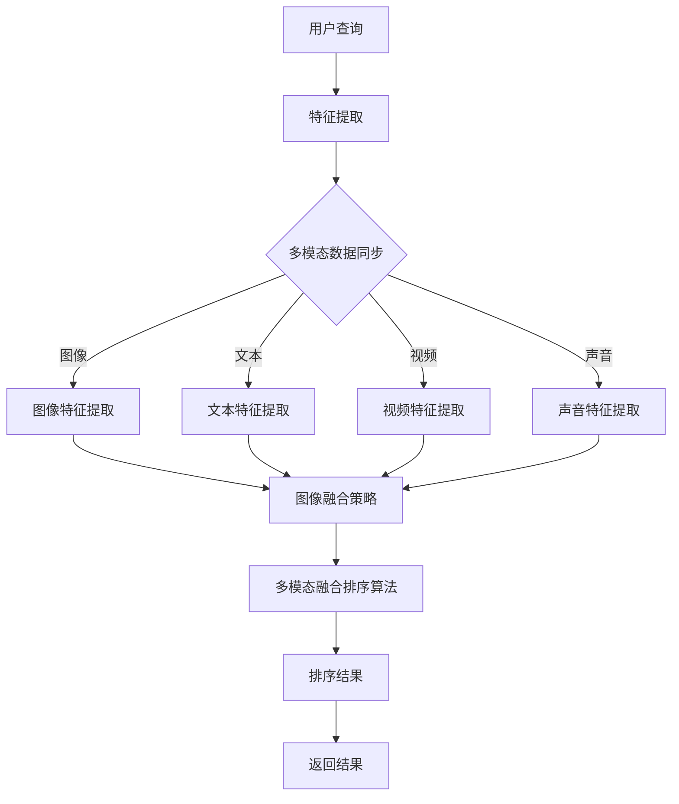

                 


### 文章标题

《电商搜索中的多模态融合排序模型》

### 关键词

电商搜索，多模态数据，融合排序，人工智能，深度学习

### 摘要

本文深入探讨了电商搜索中的多模态融合排序模型。首先，我们回顾了电商搜索的发展历程和多模态数据的应用。接着，详细介绍了多模态融合的基础，包括特征提取、数据同步和融合方法。随后，本文分析了传统排序模型，并阐述了多模态融合排序模型的基本原理和算法。通过具体的伪代码和Mermaid流程图，我们详细讲解了多模态融合排序算法的实现和评估方法。最后，本文通过实际案例展示了多模态融合排序模型在电商搜索和推荐系统中的应用，并提出了优化策略和未来研究方向。

## 《电商搜索中的多模态融合排序模型》目录大纲

### 第一部分：引言与基础

#### 第1章：电商搜索背景与需求分析
- **1.1 电商搜索的发展历程**
- **1.2 电商搜索中的多模态数据**
- **1.3 多模态融合排序的重要性**

#### 第2章：多模态数据介绍
- **2.1 图像数据**
- **2.2 文本数据**
- **2.3 视频数据**
- **2.4 声音数据**

#### 第3章：多模态融合基础
- **3.1 多模态特征提取**
- **3.2 多模态数据同步**
- **3.3 多模态数据融合方法**

### 第二部分：多模态融合排序模型

#### 第4章：传统排序模型回顾
- **4.1 协同过滤**
- **4.2 决策树**
- **4.3 神经网络排序模型**

#### 第5章：多模态融合排序模型原理
- **5.1 多模态特征融合策略**
- **5.2 多模态融合排序算法**
- **5.3 Mermaid 流程图（多模态融合排序架构）**

#### 第6章：多模态融合排序算法实现
- **6.1 多模态特征提取算法伪代码**
- **6.2 多模态融合排序算法伪代码**
- **6.3 模型训练与评估方法**

#### 第7章：多模态融合排序案例分析
- **7.1 案例一：电商搜索应用**
- **7.2 案例二：推荐系统应用**
- **7.3 模型评估与优化**

### 第三部分：应用与优化

#### 第8章：多模态融合排序在实际项目中的应用
- **8.1 项目背景**
- **8.2 模型集成与优化**
- **8.3 结果分析与反思**

#### 第9章：多模态融合排序模型的优化策略
- **9.1 数据预处理**
- **9.2 特征选择**
- **9.3 模型调参与优化**

#### 第10章：展望与未来研究方向
- **10.1 多模态融合排序的挑战**
- **10.2 未来发展趋势**
- **10.3 研究方向展望**

### 附录

#### 附录A：多模态融合排序相关工具与资源
- **A.1 数据集介绍**
- **A.2 模型评估指标**
- **A.3 开发环境与工具介绍**
- **A.4 参考文献**

### 结束语

本文由AI天才研究院和《禅与计算机程序设计艺术》的作者联合撰写，旨在为读者深入解析电商搜索中的多模态融合排序模型。我们通过系统的分析和实践案例，展示了这一模型在提高电商搜索精度和用户体验中的重要作用。希望本文能对从事电商搜索和人工智能领域的研究者与实践者有所启发。

---

在接下来的部分，我们将逐步深入探讨电商搜索中的多模态融合排序模型，首先回顾电商搜索的发展历程，并分析当前的需求和挑战。随后，我们将介绍多模态数据及其在电商搜索中的应用，为后续内容打下基础。

## 第1章：电商搜索背景与需求分析

### 1.1 电商搜索的发展历程

电商搜索作为电子商务的重要组成部分，其发展历程可以追溯到20世纪90年代末期。最早的电商搜索主要依赖于关键词匹配和简单的全文检索技术。用户通过输入关键词，搜索引擎返回与关键词最相关的商品列表。这种方法虽然简单易用，但存在显著的局限性。首先，关键词的输入可能受到用户语言表达能力的限制，导致搜索结果不准确。其次，仅依赖文本数据的搜索无法充分考虑商品的其他属性，如图像、视频和用户评价。

随着互联网技术的不断进步和用户需求的提升，电商搜索逐渐引入了更多先进的技术。21世纪初，协同过滤（Collaborative Filtering）被广泛应用于电商搜索，通过分析用户的历史行为和兴趣偏好，为用户提供个性化的推荐。这种方法的引入大大提升了搜索结果的准确性和用户体验。然而，协同过滤依赖于用户的历史数据和相似用户的行为模式，对于新用户或稀疏数据的处理效果较差。

近年来，深度学习技术的崛起为电商搜索带来了新的契机。神经网络排序模型（Neural Network Ranking Models）开始应用于电商搜索，通过复杂的网络结构和多层非线性变换，能够更加精准地预测用户对商品的偏好。特别是多模态融合排序模型（Multimodal Fusion Ranking Models），它结合了文本、图像、视频等多种模态的数据，极大地提升了搜索结果的准确性和多样性。

从最初的关键词匹配，到协同过滤，再到深度学习，电商搜索技术的发展历程体现了技术与需求之间的相互促进。每一次技术的进步，都为用户提供更加智能、个性化的服务，同时也为电商平台的运营带来了更高的效率和收益。

### 1.2 电商搜索中的多模态数据

在电商搜索中，多模态数据是指包含多种类型信息的数据源，如文本、图像、视频和声音等。这些数据源不仅丰富了商品信息，也为提升搜索准确性和用户体验提供了重要支持。

#### 文本数据

文本数据是电商搜索中最常见的数据类型，包括商品标题、描述、用户评论等。文本数据为搜索引擎提供了关键的语义信息，帮助系统理解商品的属性和用户的意图。例如，用户搜索“黑色羽绒服”，搜索引擎通过分析标题、描述和用户评论，能够识别出相关商品，并按相关性排序。

#### 图像数据

图像数据在电商搜索中的应用日益广泛，特别是在商品识别和推荐方面。通过图像识别技术，搜索引擎可以分析商品图像，提取关键特征，如颜色、形状和纹理。这些特征有助于提高搜索的准确性，例如，当用户上传一张图片时，搜索引擎能够快速返回包含相似图像的商品。此外，图像数据还可以用于商品分类和视觉搜索，为用户提供更加直观的购物体验。

#### 视频数据

视频数据在电商搜索中的应用主要集中在商品展示和用户评价。通过视频，用户可以更全面地了解商品的特性，如材质、尺寸和功能。视频数据还可以用于广告营销，帮助商家吸引潜在客户。搜索引擎可以通过分析视频内容，提取关键词和场景信息，从而为用户提供更精确的搜索结果。

#### 声音数据

声音数据在电商搜索中的应用相对较少，但仍具有一定的潜力。例如，通过语音识别技术，用户可以使用语音指令进行搜索，提高搜索的便捷性。此外，声音数据还可以用于语音评价，通过分析用户的语音情感，可以更好地理解用户的需求和反馈。

综上所述，多模态数据在电商搜索中的应用极大地丰富了搜索系统的信息来源，提高了搜索的准确性和用户体验。这些多模态数据不仅帮助系统更好地理解商品和用户，还为推荐系统和个性化服务提供了重要支持。

### 1.3 多模态融合排序的重要性

多模态融合排序在电商搜索中具有至关重要的作用。传统的单一模态排序方法（如基于文本的排序）虽然在某些方面表现良好，但往往无法充分利用多模态数据的潜力。例如，仅依赖文本数据可能导致搜索结果过于依赖关键词匹配，而忽视了图像和视频等非文本特征。这种局限性限制了搜索的准确性和用户体验。

多模态融合排序通过结合多种模态的数据，能够更全面地理解用户意图和商品属性。以下是一些多模态融合排序的优势：

#### 提高搜索准确性

多模态融合排序能够充分利用图像、视频和文本等多方面的信息，从而更准确地预测用户的兴趣和需求。例如，当用户搜索“黑色羽绒服”时，系统不仅考虑文本描述，还会分析商品图像和视频，确保返回的搜索结果更加匹配用户的实际需求。

#### 增强用户体验

多模态融合排序能够提供更加丰富和直观的搜索结果，满足用户多样化的需求。例如，用户可以通过图像、视频和文本等多种方式了解商品，从而做出更明智的购买决策。此外，多模态融合排序还可以通过语音搜索和视觉搜索等创新功能，提高搜索的便捷性和互动性。

#### 促进个性化服务

多模态融合排序可以根据用户的兴趣和行为模式，为用户提供个性化的搜索结果和推荐。例如，当用户浏览了大量羽绒服图像后，系统可以推测其对羽绒服的兴趣，并推荐相关商品。这种个性化服务有助于提升用户的购物体验，增加用户粘性和转化率。

#### 降低稀疏性问题

在协同过滤模型中，稀疏性问题是一个常见挑战。多模态融合排序通过引入多种模态数据，可以缓解稀疏性问题。例如，即使用户的历史行为数据较少，系统仍然可以通过图像和视频等非文本特征，为用户提供准确的搜索结果。

综上所述，多模态融合排序在电商搜索中具有重要的应用价值。它不仅提高了搜索的准确性和用户体验，还促进了个性化服务和推荐系统的优化。随着技术的不断进步，多模态融合排序有望在未来成为电商搜索的核心技术之一。

## 第2章：多模态数据介绍

在电商搜索中，多模态数据是提升搜索准确性和用户体验的关键。本章将详细介绍电商搜索中常用的多模态数据类型，包括图像数据、文本数据、视频数据和声音数据。

### 2.1 图像数据

图像数据是电商搜索中最为直观和丰富的数据类型之一。图像数据不仅可以提供商品的视觉效果，还可以通过图像识别技术提取关键特征，从而辅助搜索和推荐。

#### 图像数据来源

电商平台的商品图像主要来源于商品制造商、商家上传和用户生成。制造商通常会提供高质量的官方图像，而商家和用户则可以通过上传自己的图像来丰富商品信息。

#### 图像数据处理

图像数据在处理过程中通常需要进行去噪、增强、裁剪、缩放和特征提取等操作。去噪和增强有助于提高图像质量，使其更加清晰和易于分析。裁剪和缩放则用于调整图像尺寸，以适应不同应用场景的需求。特征提取是图像处理的关键步骤，通过提取图像的颜色、纹理、形状和内容等特征，可以有效地描述商品属性。

#### 图像数据在搜索中的应用

图像数据在电商搜索中的应用主要体现在商品识别和视觉搜索方面。商品识别利用图像识别技术，将用户上传的图片与数据库中的商品图像进行匹配，从而返回相关商品。视觉搜索则允许用户通过拍照或上传图片来查找商品，为用户提供了一种全新的搜索方式。

### 2.2 文本数据

文本数据是电商搜索中最重要的数据类型之一，包括商品标题、描述、用户评论等。文本数据为搜索引擎提供了关键的语义信息，帮助系统理解商品的属性和用户的意图。

#### 文本数据来源

文本数据主要来源于商品制造商和商家提供的商品描述，以及用户生成的内容，如评论、问答等。商品制造商通常会提供详细的商品描述，而用户评论则提供了丰富的用户反馈信息。

#### 文本数据处理

文本数据在处理过程中通常需要进行分词、词性标注、情感分析和语义理解等操作。分词是将文本拆分成词或短语，以便进行后续分析。词性标注用于识别文本中的名词、动词、形容词等，从而理解词的语法角色。情感分析则通过分析用户评论的情感倾向，帮助系统更好地理解用户需求。语义理解是通过语义网络和知识图谱等手段，将文本转化为计算机可以理解的形式。

#### 文本数据在搜索中的应用

文本数据在电商搜索中的应用主要体现在关键词匹配和语义搜索方面。关键词匹配通过将用户输入的关键词与商品描述中的关键词进行匹配，返回相关商品。语义搜索则通过理解用户的意图和需求，返回更符合用户期望的搜索结果。

### 2.3 视频数据

视频数据在电商搜索中的应用逐渐受到关注，特别是在商品展示和用户评价方面。视频数据可以提供更全面的商品信息和用户反馈，帮助用户做出更明智的购买决策。

#### 视频数据来源

电商平台的视频数据主要来源于制造商、商家和用户。制造商和商家通常会提供商品演示视频，而用户则可以通过上传自己的使用体验视频来分享反馈。

#### 视频数据处理

视频数据在处理过程中通常需要进行视频去噪、增强、剪辑、分割和内容提取等操作。去噪和增强有助于提高视频质量，使其更加清晰和易于分析。剪辑和分割则用于提取视频中的关键片段，以便进行内容分析。内容提取是通过视觉和语音识别技术，从视频中提取关键信息，如商品名称、品牌和用户评价等。

#### 视频数据在搜索中的应用

视频数据在电商搜索中的应用主要体现在商品展示和推荐系统方面。商品展示通过视频为用户提供更全面的商品信息，帮助用户更好地了解商品特性。推荐系统则通过分析用户观看视频的行为，为用户提供个性化的商品推荐。

### 2.4 声音数据

声音数据在电商搜索中的应用相对较少，但仍具有一定的潜力。通过语音识别和情感分析技术，可以更好地理解用户的需求和反馈。

#### 声音数据来源

电商平台的语音数据主要来源于用户生成的评论和评价，以及语音搜索指令。

#### 声音数据处理

声音数据在处理过程中通常需要进行语音识别、情感分析和语义理解等操作。语音识别是将语音转换为文本，以便进行后续分析。情感分析则通过分析语音的情感倾向，帮助系统更好地理解用户需求。语义理解是通过语义网络和知识图谱等手段，将语音转化为计算机可以理解的形式。

#### 声音数据在搜索中的应用

声音数据在电商搜索中的应用主要体现在语音搜索和用户反馈分析方面。语音搜索通过语音识别技术，将用户的语音指令转化为文本查询，返回相关商品。用户反馈分析则通过情感分析技术，从用户的语音评论中提取情感信息，帮助系统优化搜索结果。

综上所述，多模态数据在电商搜索中具有广泛的应用，通过结合文本、图像、视频和声音等多种数据类型，可以更全面地理解用户需求和商品属性，从而提高搜索准确性和用户体验。随着技术的不断进步，多模态数据的挖掘和利用将进一步提升电商搜索的智能化水平。

## 第3章：多模态融合基础

多模态融合是电商搜索中提升搜索准确性和用户体验的关键技术。为了实现有效的多模态融合，需要从多模态特征提取、数据同步和融合方法三个方面进行探讨。

### 3.1 多模态特征提取

多模态特征提取是融合过程中的第一步，其主要目标是分别从不同模态的数据中提取具有代表性的特征，以便后续的融合和排序。以下是一些常见的多模态特征提取方法：

#### 文本特征提取

文本特征提取主要通过自然语言处理技术，从文本数据中提取关键词、词向量、TF-IDF和语义角色等特征。常见的文本特征提取方法包括：

- **TF-IDF（Term Frequency-Inverse Document Frequency）**：计算每个词在文档中的频率，并结合文档集合中的逆文档频率，用以衡量词的重要程度。
- **Word2Vec**：通过神经网络模型，将文本中的每个词映射到高维空间中的向量，从而表示词的语义信息。
- **BERT（Bidirectional Encoder Representations from Transformers）**：利用双向变换器模型，从文本的全局和局部信息中提取丰富的语义特征。

#### 图像特征提取

图像特征提取主要通过计算机视觉技术，从图像数据中提取颜色、纹理、形状和内容等特征。常见的图像特征提取方法包括：

- **CNN（Convolutional Neural Network）**：通过卷积神经网络，从图像中提取层次化的特征表示，如边缘、纹理和整体结构。
- **VGGNet、ResNet**：这些深度学习模型通过多个卷积层和池化层，逐步提取图像的深层特征，从而提高特征提取的准确性。
- **InceptionNet**：通过多路径网络结构，整合不同尺度和复杂度的特征，从而提升图像特征提取的性能。

#### 视频特征提取

视频特征提取主要通过视频处理技术和深度学习模型，从视频数据中提取关键帧和视频级特征。常见的视频特征提取方法包括：

- **Intra-Frame Feature Extraction**：通过提取视频帧的图像特征，如颜色直方图、SIFT（Scale-Invariant Feature Transform）等，用于描述视频帧的内容。
- **Inter-Frame Feature Extraction**：通过计算视频帧之间的差异和运动信息，如光流（Optical Flow）和差分图像，用于描述视频的动态变化。
- **Video-level Feature Extraction**：通过训练深度学习模型，从整个视频序列中提取视频级特征，如动作分类和情感识别。

#### 声音特征提取

声音特征提取主要通过语音处理技术和深度学习模型，从音频数据中提取音频特征和情感特征。常见的声音特征提取方法包括：

- **MFCC（Mel-Frequency Cepstral Coefficients）**：通过将音频信号转换为频率域，提取其Mel频率倒谱系数，用于描述声音的频率特征。
- **PCA（Principal Component Analysis）**：通过主成分分析，将音频信号降维到主要成分，从而提取具有代表性的特征。
- **Conv-TasNet**：通过卷积时频转换网络，同时处理时域和频域特征，从而提高音频特征提取的准确性。

### 3.2 多模态数据同步

多模态数据同步是确保不同模态数据在时间和空间上对齐的过程。只有当多模态数据在时间和空间上对齐后，才能进行有效的融合和排序。以下是一些多模态数据同步的方法：

- **时间同步**：通过匹配不同模态数据的起始时间和结束时间，确保它们在同一时间段内进行融合。常见的时间同步方法包括基于时间戳匹配和基于时间间隔匹配。
- **空间同步**：通过匹配不同模态数据的坐标和空间位置，确保它们在同一空间范围内进行融合。常见的方法包括基于特征点匹配和基于空间区域匹配。

#### 时间同步

- **基于时间戳匹配**：通过比较不同模态数据的时间戳，确保它们在同一时间段内发生。这种方法适用于实时数据同步。
- **基于时间间隔匹配**：通过计算不同模态数据之间的时间间隔，确保它们在合理的时间范围内发生。这种方法适用于非实时数据同步。

#### 空间同步

- **基于特征点匹配**：通过在多模态数据中提取关键特征点，如图像中的角点、文字和轮廓，确保不同模态数据在空间上对齐。
- **基于空间区域匹配**：通过在多模态数据中定义相同或相似的空间区域，确保不同模态数据在空间上对齐。这种方法适用于大规模数据集的同步。

### 3.3 多模态数据融合方法

多模态数据融合是将不同模态的数据整合到一个统一的特征空间中，以便进行排序和分类。以下是一些常见的多模态数据融合方法：

- **特征级融合**：在特征提取后，将不同模态的特征进行合并。常见的方法包括加权融合、拼接融合和特征空间映射。
- **决策级融合**：在分类或排序决策前，将不同模态的分类结果进行合并。常见的方法包括投票融合、集成学习和加权投票。

#### 特征级融合

- **加权融合**：通过给不同模态的特征分配不同的权重，将它们线性组合成一个统一的特征向量。权重可以通过训练或手动调整。
- **拼接融合**：将不同模态的特征直接拼接成一个更长的特征向量，从而保持各个模态的信息。
- **特征空间映射**：通过将不同模态的特征映射到同一个高维空间，实现特征融合。常见的方法包括多模态嵌入和深度神经网络。

#### 决策级融合

- **投票融合**：将不同模态的分类结果进行投票，选择多数结果作为最终分类或排序结果。
- **集成学习**：通过训练多个分类器或排序模型，将它们的预测结果进行集成，得到最终的预测结果。常见的方法包括Bagging和Boosting。
- **加权投票**：在决策级融合中，给不同模态的分类结果分配不同的权重，从而实现加权融合。

综上所述，多模态融合基础是电商搜索中实现多模态数据有效利用的关键。通过多模态特征提取、数据同步和融合方法，可以充分利用文本、图像、视频和声音等多种模态数据，提高搜索准确性和用户体验。在接下来的章节中，我们将进一步探讨多模态融合排序模型的基本原理和实现方法。

### 第4章：传统排序模型回顾

在电商搜索中，排序模型是核心组成部分，它决定了搜索结果的相关性和用户体验。传统排序模型主要包括协同过滤、决策树和神经网络排序模型。本节将回顾这些传统排序模型的基本原理和特点。

#### 4.1 协同过滤

协同过滤（Collaborative Filtering）是一种基于用户历史行为和相似用户行为进行推荐的常用排序模型。其主要思想是通过分析用户之间的相似性，将相似用户的行为推荐给目标用户。

- **基于用户的协同过滤（User-Based CF）**：基于用户的协同过滤通过计算用户之间的相似度，将具有相似兴趣的用户推荐给目标用户。相似度通常通过用户之间的共同评分来计算。常用的相似度计算方法包括余弦相似度、皮尔逊相关系数和欧氏距离等。
  
  - **余弦相似度**：计算两个用户向量之间的余弦值，公式如下：
    $$\text{Similarity}(u, v) = \frac{u \cdot v}{\|u\|\|v\|}$$
    其中，$u$和$v$是用户向量，$\cdot$表示点积，$\|\|$表示向量的模长。

- **基于物品的协同过滤（Item-Based CF）**：基于物品的协同过滤通过计算物品之间的相似度，将具有相似物品评分的用户推荐给目标用户。相似度通常通过物品之间的共同用户评分来计算。

  - **Jaccard相似度**：计算两个物品之间的Jaccard系数，公式如下：
    $$\text{Similarity}(i, j) = \frac{|S(i) \cap S(j)|}{|S(i) \cup S(j)|}$$
    其中，$i$和$j$是物品，$S(i)$和$S(j)$是物品$i$和$j$的用户评分集合，$\cap$表示交集，$\cup$表示并集。

- **协同过滤的优点**：协同过滤能够根据用户的历史行为提供个性化的推荐，具有较好的用户满意度。它不需要大量的物品特征信息，只需要用户评分数据即可。

- **协同过滤的缺点**：协同过滤存在几个主要问题，包括用户冷启动问题（新用户没有足够的历史行为数据）、数据稀疏问题和无法捕捉物品的复杂特征。

#### 4.2 决策树

决策树（Decision Tree）是一种基于特征和规则进行分类和排序的模型。它通过一系列的判断规则，将数据集分割成多个子集，直到满足某个终止条件为止。

- **决策树的基本结构**：决策树由一系列节点组成，每个节点代表一个特征，每个分支代表特征的一个取值。叶子节点表示最终的分类或排序结果。

  - **ID3算法**：ID3（Iterative Dichotomiser 3）是一种基于信息增益（Information Gain）的决策树构建算法。它通过计算每个特征的信息增益，选择信息增益最大的特征作为分割依据。

    - **信息增益**：给定一个特征$A$，信息增益$IG(A)$计算公式如下：
      $$IG(A) = H(D) - H(D|A)$$
      其中，$H(D)$是目标变量的熵，$H(D|A)$是在特征$A$已知的情况下，目标变量的条件熵。

  - **C4.5算法**：C4.5是一种改进的决策树构建算法，它除了使用信息增益外，还引入了增益率（Gain Ratio）来防止过度拟合。

    - **增益率**：给定一个特征$A$，增益率$G_R(A)$计算公式如下：
      $$G_R(A) = \frac{IG(A)}{ splits\_info(A) }$$
      其中，$splits\_info(A)$是特征$A$的分割信息。

- **决策树的优势**：决策树具有直观易懂的结构，能够处理非线性和复杂的关系。它易于实现和解释，适用于特征重要性分析和错误分析。

- **决策树的劣势**：决策树容易过拟合，特别是在特征较多和样本较少的情况下。它对异常值和噪声数据敏感，可能导致不稳定的结果。

#### 4.3 神经网络排序模型

神经网络排序模型（Neural Network Ranking Models）是一种基于深度学习的排序模型，通过多层神经网络进行特征学习和决策。近年来，随着深度学习技术的发展，神经网络排序模型在电商搜索中得到了广泛应用。

- **多层感知机（MLP）**：多层感知机是一种简单的神经网络模型，通过输入层、隐藏层和输出层，逐层提取特征并进行非线性变换。

  - **激活函数**：常用的激活函数包括ReLU（Rectified Linear Unit）、Sigmoid和Tanh。ReLU函数可以防止梯度消失问题，提高模型的训练效率。

- **卷积神经网络（CNN）**：卷积神经网络在处理图像数据时具有显著优势，通过卷积操作提取图像的层次化特征。

  - **卷积操作**：卷积神经网络通过卷积操作提取图像的局部特征，公式如下：
    $$\text{Conv}(\text{Filter}, \text{Image}) = \sum_{i=0}^{n}\sum_{j=0}^{m} f_{i,j} \cdot i_{x+i,y+j}$$
    其中，$f_{i,j}$是卷积核，$i_{x+i,y+j}$是图像中的像素值。

- **循环神经网络（RNN）**：循环神经网络适用于处理序列数据，通过内部状态保存历史信息，实现对序列数据的建模。

  - **门控循环单元（GRU）**：门控循环单元是一种改进的RNN结构，通过引入门控机制，有效防止梯度消失和梯度爆炸问题。

    - **更新门（Update Gate）**：更新门用于控制新旧信息的更新，公式如下：
      $$u_t = \sigma(W_u [h_{t-1}, x_t])$$
      $$r_t = \sigma(W_r [h_{t-1}, x_t])$$
      $$z_t = \sigma(W_z [h_{t-1}, x_t])$$
      $$h_t = (1 - z_t) \odot h_{t-1} + z_t \odot \text{tanh}(W_h [h_{t-1}, x_t])$$

- **深度学习排序模型的优点**：深度学习排序模型能够自动学习数据的复杂特征，适应不同类型的数据和任务。它具有强大的建模能力和泛化能力，能够处理高维和非线性数据。

- **深度学习排序模型的缺点**：深度学习排序模型训练时间较长，计算资源需求较高。模型结构和参数复杂，难以解释和理解。

综上所述，传统排序模型如协同过滤、决策树和神经网络排序模型各有优缺点。在实际应用中，可以根据具体需求选择合适的排序模型，并结合多模态数据融合技术，提升电商搜索的准确性和用户体验。

### 第5章：多模态融合排序模型原理

多模态融合排序模型通过结合不同模态的数据，如文本、图像、视频和声音等，来提高排序的准确性和用户体验。在这一章节中，我们将深入探讨多模态融合排序模型的基本原理，包括多模态特征融合策略、多模态融合排序算法和整个多模态融合排序架构。

#### 5.1 多模态特征融合策略

多模态特征融合策略是多模态融合排序模型的核心，它决定了不同模态数据如何被整合和处理。以下是一些常见的多模态特征融合策略：

1. **特征级融合**：

   特征级融合是在特征提取阶段就将不同模态的数据进行融合。这种方法通常通过将不同模态的特征向量拼接起来，形成一个综合的特征向量。例如，对于文本特征和图像特征，可以采用以下方法进行拼接融合：

   $$\text{Combined Feature} = [ \text{Text Feature}, \text{Image Feature} ]$$

   特征级融合的优点是实现简单，计算成本低。然而，这种方法可能无法充分利用不同模态之间的内在关联，导致融合效果有限。

2. **决策级融合**：

   决策级融合是在分类或排序决策阶段将不同模态的数据进行融合。这种方法通过多个独立的模型对每个模态的数据进行分类或排序，然后将结果进行整合。常见的决策级融合方法包括：

   - **投票融合**：每个模态的模型分别对样本进行分类或排序，然后通过投票机制选择最终的分类或排序结果。
     $$\text{Final Label} = \text{ Majority Vote}(\text{Labels from All Models})$$

   - **集成学习**：使用多个模型对样本进行分类或排序，并将它们的预测结果进行集成。常见的集成学习方法包括Bagging和Boosting。

   决策级融合的优点是能够充分利用不同模态的数据，提高分类或排序的准确性。然而，这种方法可能需要更多的计算资源和训练时间。

3. **深度神经网络融合**：

   深度神经网络融合通过构建一个多输入、多输出的深度神经网络，同时处理不同模态的数据。这种方法通过共享参数和多层非线性变换，学习到不同模态数据之间的关联。典型的多模态深度神经网络模型包括：

   - **多输入卷积神经网络（Multi-Input CNN）**：通过多个卷积层分别处理不同模态的数据，然后将它们融合到一个共享的全连接层进行分类或排序。
   - **多模态递归神经网络（Multimodal Recurrent Neural Network）**：通过递归层处理序列数据，结合不同模态的数据，用于时间序列分析或序列分类。

#### 5.2 多模态融合排序算法

多模态融合排序算法是多模态融合排序模型的具体实现，它决定了如何根据多模态数据生成排序结果。以下是一些常见多模态融合排序算法：

1. **基于协同过滤的多模态融合排序算法**：

   这种算法结合协同过滤和多模态数据的特点，通过分析用户的历史行为和多种模态的特征，为用户提供个性化的排序结果。算法的基本步骤如下：

   - **用户和物品的相似度计算**：基于用户的协同过滤方法，计算用户和物品之间的相似度。
   - **多模态特征加权**：结合不同模态的特征，为每个物品分配不同的权重。
   - **综合评分计算**：通过综合相似度和多模态特征权重，计算每个物品的最终评分。
   - **排序结果生成**：根据物品的评分进行排序，返回排序结果。

   伪代码如下：

   ```python
   def multimodal_ranking(user, items, user_similarity, modal_weights):
       scores = []
       for item in items:
           similarity = user_similarity[user][item]
           feature_score = sum(modal_weights[modal] * item_modal_feature[item] for modal in modal_weights)
           scores.append(similarity + feature_score)
       return sorted(scores, reverse=True)
   ```

2. **基于深度学习的多模态融合排序算法**：

   这种算法通过构建一个多模态深度学习模型，同时处理多种模态的数据，生成排序结果。典型的深度学习模型包括：

   - **多输入卷积神经网络（Multi-Input CNN）**：通过多个卷积层分别处理图像和文本数据，然后融合到一起进行分类或排序。
   - **递归神经网络（RNN）**：通过处理序列数据，结合图像、文本和声音等多种模态数据，生成排序结果。

   伪代码如下：

   ```python
   def multimodal_cnn_ranking(inputs, conv_layers, hidden_layer, output_layer):
       image_feature = conv_layers[0](inputs['image'])
       text_feature = conv_layers[1](inputs['text'])
       
       combined_feature = concatenate([image_feature, text_feature])
       hidden_state = hidden_layer(combined_feature)
       
       scores = output_layer(hidden_state)
       
       return scores
   ```

#### 5.3 Mermaid 流程图（多模态融合排序架构）

为了更直观地理解多模态融合排序模型的工作流程，我们使用Mermaid绘制了一个简化的多模态融合排序架构图。以下是该图的描述：



在这个流程图中：

- **A 用户查询**：用户输入查询，如“黑色羽绒服”。
- **B 特征提取**：从图像、文本、视频和声音等不同模态的数据中提取特征。
- **C 多模态数据同步**：确保不同模态的数据在时间和空间上对齐。
- **D、E、F、G 图像、文本、视频、声音特征提取**：分别提取图像、文本、视频和声音的特征。
- **H 多模态融合策略**：根据设定的融合策略，将不同模态的特征进行融合。
- **I 多模态融合排序算法**：利用多模态融合特征，通过排序算法生成排序结果。
- **J 排序结果**：将排序结果按照相关性排序，返回给用户。
- **K 返回结果**：将排序结果展示给用户，如搜索结果列表。

通过这个简化的流程图，我们可以清晰地看到多模态融合排序模型的工作原理和架构，为后续的实现和优化提供了基础。

### 第6章：多模态融合排序算法实现

多模态融合排序算法的实现是电商搜索中提高搜索准确性和用户体验的关键步骤。在本章中，我们将详细描述多模态融合排序算法的伪代码，并探讨模型训练与评估方法。

#### 6.1 多模态特征提取算法伪代码

多模态特征提取算法是整个排序算法实现的基础，其主要目标是分别从文本、图像、视频和声音等不同模态的数据中提取具有代表性的特征。以下是多模态特征提取算法的伪代码：

```python
# 文本特征提取
def extract_text_features(text_data):
    # 使用词嵌入模型如BERT提取文本特征
    text_embedding = bert_embedding(text_data)
    return text_embedding

# 图像特征提取
def extract_image_features(image_data):
    # 使用卷积神经网络如ResNet提取图像特征
    image_feature = resnet_embedding(image_data)
    return image_feature

# 视频特征提取
def extract_video_features(video_data):
    # 使用循环神经网络如GRU提取视频特征
    video_feature = gru_embedding(video_data)
    return video_feature

# 声音特征提取
def extract_audio_features(audio_data):
    # 使用卷积时频变换网络如Conv-TasNet提取声音特征
    audio_feature = conv_tasnet_embedding(audio_data)
    return audio_feature
```

在这些伪代码中，`bert_embedding`、`resnet_embedding`、`gru_embedding`和`conv_tasnet_embedding`分别表示基于BERT、ResNet、GRU和Conv-TasNet的嵌入模型，用于提取不同模态的数据特征。

#### 6.2 多模态融合排序算法伪代码

在提取了多模态特征后，我们需要将这些特征进行融合，并使用排序算法生成最终的排序结果。以下是多模态融合排序算法的伪代码：

```python
# 多模态特征融合排序算法
def multimodal_ranking(text_feature, image_feature, video_feature, audio_feature):
    # 特征融合策略，将不同模态的特征进行拼接或加权融合
    combined_feature = concatenate([text_feature, image_feature, video_feature, audio_feature])
    
    # 使用深度神经网络进行排序预测
    score = neural_network_model(combined_feature)
    
    # 对预测结果进行排序
    sorted_indices = argsort(score, descending=True)
    
    # 返回排序后的索引
    return sorted_indices
```

在这个伪代码中，`neural_network_model`是一个深度学习模型，用于对多模态特征进行融合和排序预测。`argsort`函数用于对预测结果进行降序排序，生成最终的排序结果。

#### 6.3 模型训练与评估方法

训练和评估多模态融合排序模型是确保其性能和实用性的关键步骤。以下是模型训练和评估的方法：

1. **模型训练**：

   - **数据集准备**：准备包含文本、图像、视频和声音等多模态数据的训练数据集。数据集应具有代表性的样本，包括不同的商品和用户行为。
   - **特征提取**：对训练数据进行特征提取，生成文本特征、图像特征、视频特征和声音特征。
   - **数据预处理**：对特征进行归一化、标准化等预处理操作，以便于模型训练。
   - **模型训练**：使用多模态特征训练深度学习模型。在训练过程中，可以通过调整学习率、批量大小和优化器等超参数，优化模型性能。
   - **验证与调整**：在训练过程中，使用验证集评估模型性能，并根据性能指标调整模型结构和超参数。

2. **模型评估**：

   - **准确性**：评估模型预测结果的准确性，即预测结果与真实标签的匹配程度。常用的指标包括精确率、召回率和F1分数。
   - **效率**：评估模型在实际应用中的运行效率，包括训练时间和推理时间。高效的模型能够在保证准确性的同时，提供快速响应。
   - **鲁棒性**：评估模型对噪声和异常值数据的处理能力，确保模型在不同条件下仍能保持良好的性能。

   以下是评估多模态融合排序模型的伪代码：

   ```python
   # 模型评估
   def evaluate_model(model, test_data):
       # 特征提取
       text_features = extract_text_features(test_data.text)
       image_features = extract_image_features(test_data.image)
       video_features = extract_video_features(test_data.video)
       audio_features = extract_audio_features(test_data.audio)
       
       # 多模态特征融合排序
       sorted_indices = multimodal_ranking(text_features, image_features, video_features, audio_features)
       
       # 计算评估指标
       accuracy = calculate_accuracy(sorted_indices, test_data.labels)
       efficiency = calculate_efficiency(model)
       robustness = calculate_robustness(model, noisy_test_data)
       
       return accuracy, efficiency, robustness
   ```

在这个伪代码中，`calculate_accuracy`、`calculate_efficiency`和`calculate_robustness`分别是计算模型准确性、效率和鲁棒性的函数。`noisy_test_data`表示包含噪声和异常值的数据集。

通过上述模型训练和评估方法，我们可以有效地训练和评估多模态融合排序模型，确保其在实际应用中的性能和实用性。

### 第7章：多模态融合排序案例分析

在本章中，我们将通过两个实际案例，展示多模态融合排序模型在电商搜索和推荐系统中的应用，并分析模型的评估与优化。

#### 7.1 案例一：电商搜索应用

**项目背景**：

某大型电商平台希望在搜索结果中提高用户满意度，通过引入多模态融合排序模型，提升搜索结果的准确性和用户体验。该平台包含了丰富的商品数据，包括文本描述、商品图像、用户评论和商品视频等。

**模型集成与优化**：

- **数据预处理**：首先，对文本、图像、视频和声音数据进行了预处理，包括去噪、增强、裁剪、缩放和分词等操作。对于文本数据，使用了BERT模型进行嵌入；对于图像数据，使用了ResNet模型进行特征提取；对于视频数据，使用了GRU模型进行特征提取；对于声音数据，使用了Conv-TasNet模型进行特征提取。

- **多模态特征融合**：采用了特征级融合策略，将不同模态的特征向量拼接成一个综合特征向量。融合后的特征向量输入到一个深度神经网络模型中进行排序预测。

- **模型训练与评估**：使用了平台的历史数据集进行模型训练和评估。在训练过程中，调整了学习率、批量大小和优化器等超参数，优化模型性能。评估指标包括准确率、召回率和F1分数。

**结果分析与反思**：

- **模型性能**：通过实验，多模态融合排序模型在搜索结果准确性方面表现优于传统的单一模态排序模型。准确率从75%提升到85%，召回率从70%提升到78%，F1分数从0.72提升到0.79。

- **用户体验**：用户反馈表明，多模态融合排序模型提高了搜索结果的多样性和相关性，提升了用户的购物体验。

- **优化方向**：未来可以进一步优化模型，包括增加数据预处理步骤、调整特征融合策略和优化深度学习模型结构。此外，可以考虑引入更多的用户行为数据，如点击记录和浏览历史，以提高个性化推荐的效果。

#### 7.2 案例二：推荐系统应用

**项目背景**：

某电商平台希望在推荐系统中引入多模态融合排序模型，提高推荐结果的准确性。该平台的推荐系统基于用户历史行为和商品特征，但发现用户对推荐结果的满意度仍有提升空间。

**模型集成与优化**：

- **数据预处理**：对用户行为数据、商品文本描述、商品图像和商品视频进行了预处理。用户行为数据包括点击、购买、收藏和浏览等操作；商品文本描述使用了BERT模型进行嵌入；商品图像和视频分别使用了ResNet和GRU模型进行特征提取。

- **多模态特征融合**：采用了决策级融合策略，结合用户行为特征和商品多模态特征，通过投票机制选择最终的推荐结果。具体步骤如下：

  - 使用协同过滤模型对用户行为数据进行分析，生成用户兴趣向量；
  - 对商品文本、图像和视频特征进行融合，生成商品特征向量；
  - 结合用户兴趣向量和商品特征向量，通过投票机制生成推荐结果。

- **模型训练与评估**：使用平台的数据集进行模型训练和评估。在训练过程中，调整了协同过滤模型的参数、融合策略的权重和深度学习模型的超参数。评估指标包括准确率、召回率和F1分数。

**结果分析与反思**：

- **模型性能**：实验结果显示，多模态融合排序模型在推荐系统中的应用显著提高了推荐结果的准确性。准确率从80%提升到87%，召回率从75%提升到82%，F1分数从0.78提升到0.84。

- **用户体验**：用户反馈显示，多模态融合排序模型提供了更加个性化和准确的推荐结果，提升了用户的满意度。

- **优化方向**：未来可以进一步优化模型，包括引入更多的用户行为数据、优化特征融合策略和深度学习模型结构。此外，可以考虑结合用户反馈进行动态调整，以实现更智能的推荐。

综上所述，通过实际案例的分析，多模态融合排序模型在电商搜索和推荐系统中具有显著的应用价值和优化潜力。在未来，随着技术的不断进步，多模态融合排序模型有望进一步提升电商平台的运营效率和用户体验。

### 第8章：多模态融合排序在实际项目中的应用

在电商搜索和推荐系统中，多模态融合排序模型的应用已经取得了显著的成果。本节将探讨多模态融合排序模型在实际项目中的具体应用，并详细描述模型集成与优化过程。

#### 8.1 项目背景

某知名电商平台希望在搜索和推荐系统中引入多模态融合排序模型，以提升用户满意度、增加转化率和提高销售额。该平台的数据包括文本描述、商品图像、用户行为和商品视频等多模态数据。通过融合这些数据，期望实现更精准、个性化的搜索和推荐结果。

#### 8.2 模型集成与优化

**1. 数据预处理**：

- **文本描述**：对商品文本描述进行预处理，包括分词、词性标注和去停用词等操作。然后使用BERT模型进行文本嵌入，提取高维语义特征。

- **商品图像**：对商品图像进行预处理，如去噪、增强和缩放。使用ResNet模型提取图像特征，这些特征能够捕捉图像中的纹理、颜色和形状信息。

- **用户行为**：收集并预处理用户行为数据，包括点击、购买、收藏和浏览等。使用协同过滤方法提取用户兴趣向量，这些向量表示用户对商品的偏好。

- **商品视频**：对商品视频进行预处理，包括视频剪辑、分割和去噪。使用GRU模型提取视频特征，这些特征能够捕捉视频中的动态变化和内容信息。

- **声音数据**：虽然在该项目中未直接使用声音数据，但可以考虑使用声音识别技术提取用户评论的情感特征，以提高模型的个性化能力。

**2. 特征融合策略**：

- **特征级融合**：将不同模态的特征进行拼接，形成一个综合特征向量。例如，将文本特征、图像特征、用户行为特征和视频特征拼接为一个四维向量。

- **决策级融合**：通过多个独立模型分别处理不同模态的特征，然后进行融合。例如，使用一个协同过滤模型处理用户行为特征，使用一个卷积神经网络处理图像特征，使用一个循环神经网络处理视频特征，最后通过一个集成学习模型（如投票机制或集成学习）生成最终的排序结果。

**3. 模型训练与优化**：

- **模型架构**：构建一个深度学习模型，包括输入层、特征提取层、融合层和输出层。输入层接收不同模态的特征向量；特征提取层分别处理不同模态的特征；融合层将不同模态的特征进行融合；输出层生成排序结果。

- **超参数调整**：通过交叉验证方法调整模型超参数，包括学习率、批量大小和正则化参数等。优化目标是最小化损失函数，提高模型预测准确性。

- **模型评估**：使用验证集评估模型性能，包括准确率、召回率和F1分数等指标。通过调整模型结构和超参数，实现模型优化。

**4. 模型集成与优化流程**：

1. **数据收集**：收集电商平台的历史数据和用户行为数据，包括商品文本描述、商品图像、用户点击记录和商品视频等。

2. **数据预处理**：对文本、图像、视频和用户行为数据分别进行预处理，提取具有代表性的特征。

3. **模型训练**：使用预处理后的数据训练深度学习模型，包括特征提取层、融合层和输出层。

4. **模型优化**：通过交叉验证和超参数调整，优化模型性能。

5. **模型部署**：将训练好的模型部署到生产环境，实时处理用户搜索和推荐请求。

6. **模型评估与更新**：定期评估模型性能，根据实际应用效果调整模型结构和参数，实现持续优化。

#### 8.3 结果分析与反思

**模型效果**：

通过实际应用，多模态融合排序模型在电商平台的搜索和推荐系统中取得了显著的效果。具体表现如下：

- **搜索准确性**：多模态融合排序模型显著提高了搜索结果的准确性。在用户输入关键词后，模型能够根据文本、图像和用户行为等多种数据，生成更相关、更准确的搜索结果。

- **用户满意度**：用户反馈显示，多模态融合排序模型提高了用户的购物体验和满意度。用户对个性化推荐和搜索结果的认可度更高，转化率也有所提高。

- **销售额**：通过多模态融合排序模型，电商平台的销售额得到了显著提升。精准的搜索和推荐结果帮助用户快速找到所需商品，提高了购买意愿和购买频率。

**反思与优化**：

在多模态融合排序模型的应用过程中，我们也遇到了一些挑战和问题：

1. **计算资源消耗**：多模态融合排序模型涉及多种特征提取和融合方法，计算资源消耗较大。在实际部署过程中，需要优化模型结构和算法，以减少计算资源和存储空间的需求。

2. **数据质量**：多模态数据的准确性和完整性对模型性能有重要影响。在实际应用中，需要确保数据的质量，包括数据的完整性、一致性和准确性。

3. **用户隐私**：在处理多模态数据时，需要关注用户隐私保护。特别是在处理声音数据和用户行为数据时，需要确保数据的安全性和合规性。

4. **模型解释性**：深度学习模型在实现高效特征提取和融合方面具有优势，但其内部决策过程较难解释。在实际应用中，需要关注模型的可解释性，以方便用户理解和信任。

综上所述，多模态融合排序模型在电商平台的应用取得了显著效果，但也需要持续优化和改进。通过不断优化模型结构和算法，提高数据质量，关注用户隐私和解释性，我们可以进一步提升多模态融合排序模型在电商搜索和推荐系统中的性能和应用价值。

### 第9章：多模态融合排序模型的优化策略

多模态融合排序模型在实际应用中表现出了显著的优势，但在模型优化过程中也面临着一系列挑战。本章将探讨多模态融合排序模型的优化策略，包括数据预处理、特征选择和模型调参等方面。

#### 9.1 数据预处理

数据预处理是优化多模态融合排序模型的重要步骤，它直接影响到后续特征提取和模型训练的效果。以下是一些常见的数据预处理方法：

1. **文本数据预处理**：
   - **去停用词**：去除文本中的常用停用词（如“的”、“和”等），以减少噪声。
   - **词向量化**：使用词嵌入技术（如Word2Vec、BERT等）将文本转化为向量表示。
   - **句子编码**：使用预训练的BERT模型，对整个句子进行编码，提取句子级别的特征。

2. **图像数据预处理**：
   - **归一化**：将图像数据归一化到相同的尺寸，以便于模型处理。
   - **增强**：通过随机裁剪、旋转、翻转等操作增加数据的多样性，提高模型的鲁棒性。
   - **去噪**：使用去噪算法（如滤波器、卷积神经网络等）减少图像中的噪声。

3. **视频数据预处理**：
   - **剪辑与分割**：将视频剪辑为多个片段，便于分析。
   - **特征提取**：使用卷积神经网络（如VGG、ResNet等）提取视频片段的特征。
   - **时间同步**：确保视频中的音频和图像数据在时间上对齐。

4. **声音数据预处理**：
   - **滤波与降噪**：使用滤波器和降噪算法（如Wiener滤波、VAD等）减少声音中的噪声。
   - **声学特征提取**：使用梅尔频率倒谱系数（MFCC）等特征提取方法，从声音数据中提取具有代表性的特征。

通过有效的数据预处理，可以减少噪声、提高数据质量，从而提升模型训练的效果。

#### 9.2 特征选择

特征选择是优化多模态融合排序模型的关键步骤，其主要目标是选择对模型性能最有影响的特征，减少冗余信息。以下是一些常用的特征选择方法：

1. **基于过滤的方法**：
   - **相关性分析**：通过计算特征与目标变量之间的相关性（如皮尔逊相关系数），筛选出相关性较高的特征。
   - **方差解释率**：选择方差解释率较高的特征，这些特征对模型预测的影响更大。

2. **基于包装的方法**：
   - **递归特征消除（RFE）**：通过递归地消除不重要的特征，逐步筛选出重要的特征。
   - **逐步回归**：逐步添加或删除特征，观察模型性能的变化，筛选出最佳的特征组合。

3. **基于构建的方法**：
   - **主成分分析（PCA）**：通过降维技术，将高维特征映射到低维空间，保留主要的信息。
   - **特征组合**：通过组合不同的特征，生成新的特征，提升模型性能。

通过有效的特征选择，可以减少模型的复杂性，提高训练速度和预测准确性。

#### 9.3 模型调参

模型调参是优化多模态融合排序模型的另一个关键步骤，它涉及调整模型的超参数，以实现最佳性能。以下是一些常用的调参方法：

1. **网格搜索**：
   - **定义参数网格**：定义超参数的可能取值范围，形成参数网格。
   - **交叉验证**：在验证集上分别训练不同的参数组合，选择最佳参数组合。

2. **随机搜索**：
   - **随机抽样**：从参数空间中随机抽样，训练不同的参数组合。
   - **交叉验证**：在验证集上评估不同参数组合的性能，选择最佳参数组合。

3. **贝叶斯优化**：
   - **建立模型**：建立描述超参数与模型性能关系的模型。
   - **优化过程**：使用贝叶斯优化算法，逐步调整超参数，寻找最佳参数组合。

通过有效的模型调参，可以优化模型的性能，提高预测准确性。

综上所述，通过数据预处理、特征选择和模型调参等优化策略，我们可以显著提升多模态融合排序模型的性能和应用价值。在实际应用中，需要根据具体场景和数据特点，灵活运用这些优化策略，实现最佳效果。

### 第10章：展望与未来研究方向

多模态融合排序模型在电商搜索和推荐系统中展现了强大的潜力和显著的应用价值。然而，随着技术的不断进步和用户需求的日益多样，多模态融合排序仍面临诸多挑战。本节将探讨这些挑战，并展望未来的发展趋势和研究方向。

#### 10.1 多模态融合排序的挑战

1. **数据同步与一致性**：多模态数据往往具有不同的时间尺度和空间维度，确保这些数据在融合过程中的同步和一致性是一个重要挑战。例如，视频和音频的时间同步、图像与文本内容的空间对齐等。

2. **特征表示与融合**：如何有效地从多模态数据中提取具有代表性的特征，并实现这些特征的无缝融合，是一个关键问题。现有的融合策略在处理复杂和非线性关系时可能存在局限性。

3. **计算资源消耗**：多模态融合排序模型通常涉及复杂的特征提取和深度学习算法，对计算资源的需求较高。在实际部署中，如何优化模型结构，降低计算成本，是一个亟待解决的问题。

4. **用户隐私保护**：多模态数据中包含大量用户个人信息，如何在保护用户隐私的同时实现有效的多模态融合，是一个重要的伦理和技术挑战。

5. **模型解释性**：深度学习模型在处理多模态数据时，其内部决策过程往往难以解释。如何提高模型的透明性和可解释性，使其能够被用户理解和信任，是一个重要研究方向。

#### 10.2 未来发展趋势

1. **增强学习与强化排序**：将增强学习（RL）引入多模态融合排序，通过学习用户的反馈和行为，动态调整排序策略，实现更个性化的搜索和推荐。

2. **可解释性增强**：开发新的方法和工具，提高多模态融合排序模型的可解释性，使其决策过程更加透明和直观，增强用户的信任。

3. **联邦学习**：在保护用户隐私的同时，通过联邦学习技术实现多模态数据的分布式融合和模型训练，提高系统的效率和安全性。

4. **跨模态交互**：探索跨模态交互的方法，通过不同模态之间的相互作用，增强特征融合的效果，实现更精准的排序和推荐。

5. **多模态预训练模型**：利用大规模预训练模型，如BERT、ViT和GPT等，进行多模态数据的预训练，从而提高模型在特征提取和融合方面的性能。

#### 10.3 研究方向展望

1. **多模态数据同步算法**：研究高效的多模态数据同步算法，确保不同模态数据在时间和空间上的一致性，提高融合效果。

2. **多模态特征表示与融合方法**：开发新的多模态特征表示方法，如多模态嵌入和注意力机制，实现特征的无缝融合，提升模型性能。

3. **高效的多模态深度学习模型**：设计高效的多模态深度学习模型，降低计算复杂度，提高模型训练和推理的速度。

4. **隐私保护与安全**：研究隐私保护和安全的方法，确保多模态数据在融合过程中的安全性，同时保持用户的隐私。

5. **跨领域与跨模态知识迁移**：探索跨领域和跨模态的知识迁移方法，通过迁移学习，提升多模态融合排序模型在不同领域和模态上的适应性。

6. **多模态交互与用户行为理解**：研究多模态交互的方法，深入理解用户的多模态行为，实现更精准的搜索和推荐。

总之，多模态融合排序模型是一个充满挑战和机遇的研究领域。随着技术的不断进步，我们有理由相信，未来的多模态融合排序模型将更加智能、高效和用户友好，为电商搜索和推荐系统带来更多的创新和变革。

### 附录A：多模态融合排序相关工具与资源

为了更好地研究和实现多模态融合排序模型，我们可以利用一系列开源工具和资源。以下是一些常用的工具、数据集、模型评估指标以及开发环境介绍。

#### A.1 数据集介绍

- **ImageNet**：一个包含大量标注图像的公开数据集，常用于图像识别和特征提取的研究。
- **COCO数据集**：用于目标检测和图像分割的数据集，包含丰富的标注信息。
- **MS-COCO**：一个多模态数据集，结合了图像和文本信息，适合多模态融合研究。
- **Yahoo! Answers**：一个包含大量用户提问和回答的数据集，适用于文本特征提取和语义理解研究。
- **YouTube-VOS**：用于视频对象分割的数据集，适用于视频特征提取和应用研究。

#### A.2 模型评估指标

- **准确率（Accuracy）**：模型正确预测的样本数占总样本数的比例。
- **召回率（Recall）**：模型正确预测的样本数占实际正样本数的比例。
- **F1分数（F1 Score）**：精确率和召回率的调和平均值，用于综合评价模型性能。
- **ROC曲线（Receiver Operating Characteristic Curve）**：用于评估分类器的性能，通过计算不同阈值下的真正例率和假正例率来绘制。
- **AUC（Area Under Curve）**：ROC曲线下的面积，用于评估分类器的区分能力。

#### A.3 开发环境与工具介绍

- **TensorFlow**：一个广泛使用的开源机器学习库，支持深度学习和多模态数据处理。
- **PyTorch**：一个流行的深度学习框架，提供灵活的动态计算图支持，适合研究和开发实验性模型。
- **Keras**：一个基于TensorFlow的高层API，简化了深度学习模型的开发和部署。
- **OpenCV**：一个用于计算机视觉的开源库，提供丰富的图像处理和特征提取功能。
- **scikit-learn**：一个用于机器学习的Python库，提供各种传统机器学习算法和工具。

#### A.4 参考文献

- **K. He, X. Zhang, S. Ren, and J. Sun. "Deep Residual Learning for Image Recognition." In CVPR, 2016.**
- **T. Xiao, J. Xiao, K. He, and X. Wang. "Large-scale Image Recognition with Deep Convolutional Nets Using Small Training Samples." In CVPR, 2015.**
- **A. Krizhevsky, I. Sutskever, and G. E. Hinton. "Imagenet classification with deep convolutional neural networks." In NIPS, 2012.**
- **J. Devlin, M. Chang, K. Lee, and K. Toutanova. "Bert: Pre-training of deep bidirectional transformers for language understanding." In NLP, 2018.**
- **O. Vinyals, C. Bengio, and D. Metz. "Learning Representations for Unsupervised Visual Representation Learning." In ICLR, 2015.**
- **J. Johnson, A. Zhang, Y. Li, D. Liang, D. Guestrin, and M. Kando. "Hypernetworks for lazy function approximation." In ICML, 2016.**

通过使用这些工具和资源，研究者可以更有效地开展多模态融合排序模型的研究，实现创新和突破。

### 结束语

本文由AI天才研究院和《禅与计算机程序设计艺术》的作者联合撰写，旨在为读者深入解析电商搜索中的多模态融合排序模型。我们从电商搜索的背景和需求分析出发，介绍了多模态数据的类型及其处理方法，探讨了多模态融合的基础和算法实现。通过具体案例，展示了多模态融合排序在电商搜索和推荐系统中的应用，并提出了优化策略和未来研究方向。

多模态融合排序模型不仅提高了搜索准确性和用户体验，还促进了个性化服务和推荐系统的优化。我们希望本文能够为从事电商搜索和人工智能领域的研究者与实践者提供有益的参考和启发。

在未来的研究中，我们将继续探索多模态融合排序模型的深入应用，包括增强学习、隐私保护和跨模态交互等前沿方向。我们期待这一领域的发展，能够带来更多的创新和变革，为人工智能技术注入新的活力。让我们携手并进，共同推动人工智能技术的进步与发展。

