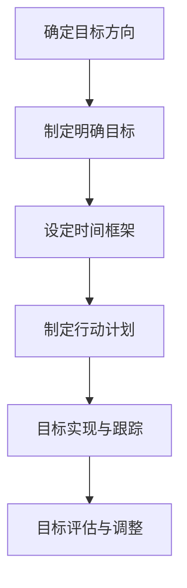
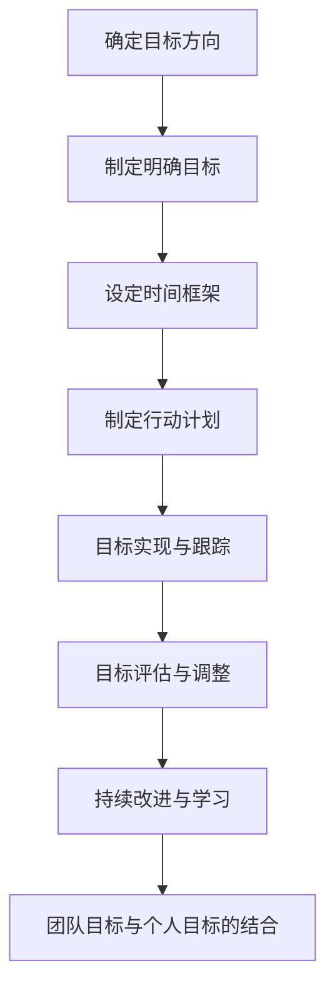

                 

### 文章标题：目标设定：引领团队前进的指南针

在当今快速变化且竞争激烈的技术领域，目标设定成为了引领团队前进的关键因素。无论是在软件开发、人工智能研究还是数据分析中，明确的目标都是确保团队努力方向正确、资源分配合理以及最终成果实现的基础。本文旨在深入探讨目标设定的核心概念、过程方法，以及在实际应用中的挑战与应对策略，从而为读者提供一个全面的目标设定指南。

> **关键词：** 目标设定、团队管理、SMART目标法、目标实现、目标跟踪

摘要：本文首先介绍了目标设定的基本概念及其重要性，随后详细阐述了目标设定的过程与步骤，以及常见的方法与技术。接着，本文重点分析了团队目标设定的具体步骤与策略，并探讨了目标实现与跟踪的关键因素。最后，通过实际案例研究与实践，本文总结了目标设定的成功经验和应用方法，为读者提供了实用的操作指南。

### 目录大纲

1. **第一部分：目标设定的基础**
   1. **第1章：目标设定的基本概念与重要性**
      1.1 什么是目标设定
      1.2 目标设定的意义
      1.3 目标设定的原则
   2. **第2章：目标设定的过程与步骤**
      2.1 确定目标的方向
      2.2 制定明确的目标
      2.3 设定目标的时间框架
      2.4 制定行动计划
   3. **第3章：目标设定的方法与技术**
      3.1 SMART目标法
      3.2 目标分解技术
      3.3 风险评估与应对策略
   4. **第4章：团队目标设定**
      4.1 团队目标设定的步骤
      4.2 团队目标与个人目标的结合
      4.3 团队目标的评估与调整

2. **第二部分：目标实现与跟踪**
   5. **第5章：目标实现的方法与策略**
      5.1 目标实现的关键因素
      5.2 时间管理与优先级设置
      5.3 激励与团队协作
   6. **第6章：目标跟踪与评估**
      6.1 目标跟踪的重要性
      6.2 目标跟踪的工具与方法
      6.3 目标评估的标准与指标
   7. **第7章：目标设定的挑战与应对**
      7.1 目标设定的常见问题
      7.2 如何应对目标设定中的挑战
      7.3 持续改进与学习

3. **第三部分：案例研究与实践**
   8. **第8章：成功的目标设定案例**
      8.1 案例一：公司级目标设定
      8.2 案例二：团队级目标设定
      8.3 案例三：个人目标设定
   9. **第9章：目标设定的实践与应用**
      9.1 实践中的目标设定
      9.2 目标设定在企业运营中的应用
      9.3 目标设定在个人成长中的应用

### 附录

10. **附录 A：目标设定的工具与资源**
    10.1 常用目标设定工具
    10.2 相关资源推荐

### 核心概念与联系

目标设定是一个系统性过程，涉及到多个核心概念的互动和关联。首先，目标设定需要明确目标的方向，这是确定团队或个人努力方向的基础。接着，制定明确的目标是目标设定的核心步骤，确保目标的清晰性和可实现性。设定目标的时间框架和制定行动计划则确保了目标的实现过程有条不紊。目标设定不仅仅是个体行为，团队目标设定同样重要，它需要团队成员共同参与，确保团队目标的实现与个人目标相协调。

#### Mermaid 流�程图：目标设定流程



通过这个流程图，我们可以清晰地看到目标设定的各个步骤及其相互关系，为后续章节的内容提供了直观的引导。

#### 核心算法原理讲解

SMART目标法是目标设定的一个经典方法，它通过五个标准（Specific, Measurable, Achievable, Relevant, Time-bound）确保目标的清晰性、可衡量性、可实现性、相关性和时限性。以下是其伪代码实现：

```python
def set_smart_goal(goal, criteria):
    if not isinstance(goal, str):
        return "目标必须是字符串类型"
    if not criteria in ["S", "M", "A", "R", "T"]:
        return "请输入正确的SMART标准"
    if "S" in criteria:
        goal = shorten(goal)
    if "M" in criteria:
        goal = make_ambiguous(goal)
    if "A" in criteria:
        goal = make_actionable(goal)
    if "R" in criteria:
        goal = make_realistic(goal)
    if "T" in criteria:
        goal = set_time_frame(goal)
    return goal

def shorten(goal):
    return goal[:10]

def make_ambiguous(goal):
    return goal + "?"

def make_actionable(goal):
    return "实现" + goal

def make_realistic(goal):
    return "可能" + goal

def set_time_frame(goal):
    return goal + "在一个月内完成"
```

通过上述伪代码，我们可以看到如何根据SMART标准对目标进行具体化处理，从而确保目标的设定符合预期。

#### 数学模型和数学公式

在目标设定与实现过程中，目标优化的数学模型是非常关键的。以下是一个简单的目标优化数学公式：

```latex
\text{目标函数} = \frac{1}{N} \sum_{i=1}^{N} (\text{实际值} - \text{预期值})^2
```

其中，\(N\) 是目标数量的总数，\(\text{实际值}\) 和 \(\text{预期值}\) 分别是实际实现值和预定目标值。通过这个公式，我们可以计算出目标实现的程度，并据此进行优化和调整。

综上所述，目标设定不仅仅是一个简单的规划过程，它涉及到多个技术层面的考虑，包括算法实现、数学建模等。理解这些核心概念和联系，是确保目标设定科学有效的基础。

### 第1章：目标设定的基本概念与重要性

在团队管理和项目管理中，目标设定是一个至关重要的环节。它不仅指导着团队的行动方向，而且直接影响着团队的工作效率和最终成果。理解目标设定的基本概念和重要性，是确保目标设定科学有效的前提。

#### 1.1 什么是目标设定

目标设定，顾名思义，是指为团队或个人制定一个具体的、可实现的未来期望状态。它是一种规划过程，旨在明确目标的方向、范围和预期结果。目标设定的过程包括确定目标的方向、制定明确的目标、设定目标的时间框架以及制定实现目标的行动计划。通过这一过程，团队可以明确自己的努力方向，并确保资源得到合理分配。

在技术领域，目标设定同样至关重要。无论是软件开发项目、人工智能研究还是数据分析任务，明确的目标都是确保项目顺利进行、资源高效利用和成果达成的关键。例如，在软件开发中，明确的目标可以帮助团队确定功能需求、技术路线和时间表；在人工智能研究中，明确的目标可以指导算法的设计和优化；在数据分析中，明确的目标可以指导数据收集、处理和分析的方向。

#### 1.2 目标设定的意义

目标设定的意义在于多个方面：

1. **提供明确的方向和指导**：明确的目标为团队提供了清晰的方向和指导，使得每个团队成员都明白自己的职责和任务，避免了工作中的模糊性和不确定性。

2. **促进资源优化配置**：通过明确的目标，团队能够更好地进行资源规划和管理，确保资源得到有效利用，避免资源的浪费和重复投入。

3. **提升团队工作效率**：明确的目标可以激发团队成员的积极性和创造力，使得团队能够更加高效地工作，从而缩短项目周期，提高工作效率。

4. **确保成果实现**：目标设定的过程中，团队会进行详细的计划和实施，从而确保最终成果的实现。这种过程导向的工作方式，有助于团队在面临挑战时能够保持目标和动力，不断推进项目进展。

5. **提升团队凝聚力**：通过共同设定和追求目标，团队成员之间的联系和合作会更加紧密，从而增强团队凝聚力。这种凝聚力不仅有助于当前项目的完成，也为团队未来的合作打下坚实的基础。

#### 1.3 目标设定的原则

为了确保目标设定的科学性和有效性，需要遵循以下几个原则：

1. **明确性**：目标应当具体、清晰，避免模糊和抽象。明确的目标有助于团队成员理解任务和期望，从而更好地进行工作。

2. **可衡量性**：目标应当具有可衡量性，即可以量化或评估。可衡量性有助于团队在实现目标过程中进行监控和调整，确保目标的实现。

3. **可实现性**：目标应当是可实现的，即团队成员通过努力可以达成。设定的目标过于理想化或不切实际，可能导致团队成员失去信心和动力。

4. **相关性**：目标应当与团队的整体战略和目标保持一致，确保目标的实现有助于团队长期发展。

5. **时限性**：目标应当设定一个明确的完成时间，以确保目标的及时实现。时限性有助于团队在特定时间内集中资源和精力，提高工作效率。

通过遵循这些原则，团队能够更好地进行目标设定，从而确保目标的实现和团队的发展。

### 第2章：目标设定的过程与步骤

目标设定是一个系统的过程，涉及到多个步骤和环节。理解这些步骤和环节，有助于团队进行科学、合理的目标设定。

#### 2.1 确定目标的方向

确定目标的方向是目标设定的第一步，也是最为关键的一步。明确的目标方向可以为后续的目标制定、时间框架设定和行动计划制定提供基础和指导。

1. **外部环境分析**：首先，团队需要对外部环境进行深入分析，包括市场趋势、竞争对手、技术发展等。通过分析外部环境，团队可以识别出潜在的机会和挑战，从而为目标的设定提供依据。

2. **内部资源评估**：其次，团队需要对自身的内部资源进行评估，包括人力资源、技术能力、资金储备等。通过评估内部资源，团队可以明确自身的优势和劣势，从而设定合理的目标。

3. **目标愿景制定**：在分析外部环境和内部资源的基础上，团队可以制定一个长期的目标愿景。这个目标愿景应当是明确、具体和可实现的，它为团队提供了一个共同追求的方向。

4. **目标方向确定**：根据目标愿景，团队需要确定具体的目标方向。这个目标方向应当与目标愿景保持一致，并能够有效响应外部环境和内部资源的实际情况。

#### 2.2 制定明确的目标

制定明确的目标是目标设定的核心步骤，它直接关系到目标的可衡量性和可实现性。

1. **目标明确性**：目标应当具体、清晰，避免模糊和抽象。例如，一个明确的开发目标可以是“开发一款基于深度学习的图像识别系统”，而不是“提高图像识别的准确性”。

2. **目标具体化**：目标的具体化过程包括明确目标的内容、范围和预期结果。例如，在上述开发目标中，可以进一步明确开发的具体内容，如算法选择、数据处理方法等。

3. **目标分解**：将大目标分解为小目标，有助于团队更清晰地理解目标的实现步骤和过程。例如，可以将开发目标分解为多个子任务，如算法设计、模型训练、系统测试等。

#### 2.3 设定目标的时间框架

设定目标的时间框架是确保目标实现时限性和可监控性的关键。

1. **短期目标**：设定短期目标，通常为几个月或一个季度。短期目标有助于团队在较短时间内集中精力，实现具体的目标。

2. **长期目标**：设定长期目标，通常为几年。长期目标为团队提供了一个长期的愿景和方向，确保团队在长期内保持一致的目标。

3. **时间节点**：在设定时间框架时，需要明确各个阶段的时间节点，确保团队能够在特定时间内完成相应的任务。例如，在开发目标中，可以设定每个子任务的具体完成时间。

#### 2.4 制定行动计划

制定行动计划是确保目标实现的具体步骤和方法。

1. **任务分解**：将目标分解为具体的任务，明确每个任务的执行者、负责人和时间表。

2. **资源分配**：根据任务的需要，合理分配资源，包括人力资源、技术资源和资金资源等。

3. **风险应对**：在行动计划中，需要考虑潜在的风险和挑战，并制定相应的应对策略。例如，在开发目标中，可以设定应急方案，以应对技术难题或资源不足等问题。

4. **监控与调整**：在行动计划实施过程中，需要定期监控进展情况，并根据实际情况进行调整。例如，在项目进度遇到问题时，可以调整任务优先级或资源分配，以确保目标的实现。

通过以上四个步骤，团队可以系统地制定目标，从而确保目标的实现和团队的长期发展。

### 第3章：目标设定的方法与技术

在目标设定过程中，采用科学的方法和技术有助于确保目标的清晰性、可实现性和时效性。以下将介绍几种常用的目标设定方法和技术。

#### 3.1 SMART目标法

SMART目标法是一种广泛使用的目标设定方法，它通过五个标准（Specific, Measurable, Achievable, Relevant, Time-bound）来确保目标的科学性和有效性。

1. **Specific（具体）**：目标应当明确、具体，避免模糊和抽象。例如，“提高项目完成率”不如“将项目完成率从80%提高到90%”具体。

2. **Measurable（可衡量）**：目标应当具有可衡量性，即可以量化或评估。例如，“增加用户量”不如“增加1000个新用户”可衡量。

3. **Achievable（可实现）**：目标应当是可实现的，即团队成员通过努力可以达成。设定的目标过于理想化或不切实际，可能导致团队成员失去信心和动力。

4. **Relevant（相关）**：目标应当与团队的整体战略和目标保持一致，确保目标的实现有助于团队长期发展。

5. **Time-bound（时限性）**：目标应当设定一个明确的完成时间，以确保目标的及时实现。时限性有助于团队在特定时间内集中资源和精力，提高工作效率。

例如，一个符合SMART标准的开发目标是：“在三个月内，将项目完成率从80%提高到90%，并增加1000个新用户。”

#### 3.2 目标分解技术

目标分解技术是一种将大目标分解为小目标的方法，有助于团队更清晰地理解目标的实现步骤和过程。

1. **分解步骤**：将大目标分解为多个小目标，每个小目标应当具有明确的内容、范围和预期结果。例如，一个开发项目可以分解为需求分析、设计、开发、测试等阶段。

2. **任务分配**：根据每个小目标的需要，将任务分配给相应的团队成员，明确每个任务的执行者和负责人。

3. **时间规划**：为每个小目标设定一个明确的时间框架，确保团队能够在特定时间内完成相应的任务。

例如，一个项目目标可以分解为以下小目标：
- 需求分析（1个月）
- 设计阶段（2个月）
- 开发阶段（3个月）
- 测试阶段（1个月）

通过目标分解技术，团队能够更清晰地了解目标的实现过程，并确保每个阶段的目标得到有效实现。

#### 3.3 风险评估与应对策略

在目标设定过程中，风险评估与应对策略是确保目标实现的重要因素。以下是一些常见的风险评估和应对策略：

1. **风险评估**：对目标实现过程中可能遇到的风险和挑战进行识别和分析，例如技术难题、资源不足、市场竞争等。

2. **应对策略**：根据风险评估结果，制定相应的应对策略，以降低风险对目标实现的影响。例如：
   - 技术难题：提前进行技术调研和准备，确保有足够的技术储备。
   - 资源不足：合理分配资源，确保关键资源的充足性。
   - 市场竞争：制定差异化策略，确保产品的独特性和竞争力。

通过风险评估和应对策略，团队能够更好地应对目标实现过程中的各种挑战，确保目标的实现。

综上所述，SMART目标法、目标分解技术和风险评估与应对策略是目标设定过程中常用的方法和技术。通过科学合理地运用这些方法和技术，团队能够确保目标的清晰性、可实现性和时效性，从而推动团队的发展。

### 第4章：团队目标设定

在目标设定的过程中，团队目标设定是一个关键环节。通过明确的团队目标设定，可以确保团队成员的共同努力方向一致，从而提高团队整体的工作效率和成果实现。以下将详细讨论团队目标设定的步骤、团队目标与个人目标的结合，以及团队目标的评估与调整。

#### 4.1 团队目标设定的步骤

团队目标设定的步骤可以分为以下几个阶段：

1. **明确团队愿景**：团队愿景是团队长期发展的目标和方向，是团队目标设定的基础。团队需要共同讨论并确定一个清晰的愿景，确保所有成员对团队目标有一个共同的理解。

2. **确定团队目标**：在明确团队愿景的基础上，团队需要将愿景具体化为可操作的目标。这些目标应当符合SMART原则，即具体、可衡量、可实现、相关和时限性。例如，一个团队的目标可以是“在接下来的六个月内，将项目开发周期缩短20%”。

3. **分解目标**：将团队目标分解为具体的子任务和里程碑，确保每个成员都能清楚地了解自己的职责和任务。分解目标时，需要考虑资源的可用性、团队成员的技能和经验等因素。

4. **分配任务**：根据目标分解的结果，将任务分配给相应的团队成员。在分配任务时，要确保每个成员都清楚自己的职责和任务，同时提供必要的支持和资源。

5. **制定行动计划**：为每个任务制定详细的行动计划，包括任务的执行者、负责人、时间表和预期结果。行动计划应当具体、可行，并能够确保团队目标的实现。

6. **沟通与反馈**：在整个团队目标设定过程中，团队成员之间的沟通与反馈是至关重要的。通过定期会议、报告和反馈机制，团队可以确保目标设定的科学性和有效性。

#### 4.2 团队目标与个人目标的结合

团队目标与个人目标的结合是确保团队目标实现和个人发展的重要途径。以下是一些实现这一结合的方法：

1. **目标一致性**：团队目标与个人目标应当一致，确保个人目标的实现有助于团队目标的达成。在设定个人目标时，团队成员需要考虑团队的整体目标，并确保个人目标与团队目标相互支持。

2. **沟通与协商**：团队成员之间需要通过沟通与协商，确保个人目标与团队目标之间的协调。在目标设定过程中，团队成员可以共同讨论并调整个人目标，以实现目标的一致性。

3. **激励机制**：通过制定激励机制，鼓励团队成员将个人目标与团队目标结合起来。例如，可以设立团队奖励计划，对达成团队目标的成员给予奖励和认可。

4. **绩效评估**：在绩效评估过程中，需要考虑团队目标和个人目标的实现情况。通过科学的绩效评估体系，确保团队成员的付出和贡献得到公正的评价和回报。

#### 4.3 团队目标的评估与调整

团队目标的评估与调整是确保团队目标持续有效的重要环节。以下是一些常见的评估与调整方法：

1. **定期评估**：团队需要定期对目标的实现情况进行评估，以确保目标的实现进度和效果。评估可以通过定期会议、报告和反馈机制进行，确保每个成员都对目标实现情况有清晰的了解。

2. **数据分析**：通过数据分析，团队可以评估目标实现的实际效果。例如，可以通过关键绩效指标（KPI）来衡量目标的达成情况，识别存在的问题和改进点。

3. **反馈与调整**：根据评估结果，团队需要及时进行反馈和调整。如果目标未能达成，团队需要分析原因，并采取相应的措施进行调整。例如，可以重新分配任务、调整资源或修改目标设定。

4. **持续改进**：团队目标的设定与调整是一个持续的过程。团队需要不断总结经验教训，不断优化目标设定和实现方法，以确保团队目标的持续实现和团队的发展。

通过以上步骤和方法，团队可以科学、合理地进行目标设定，确保团队目标的实现和团队的整体发展。同时，团队目标与个人目标的有机结合，也有助于提高团队成员的积极性和创造力，推动团队不断进步。

### 第5章：目标实现的方法与策略

在明确了目标和设定了实现计划之后，如何有效地实现这些目标成为了关键问题。目标实现涉及多个方面，包括关键因素、时间管理和优先级设置，以及激励和团队协作。以下将详细探讨这些方面，并提供实用的策略。

#### 5.1 目标实现的关键因素

目标实现的关键因素是确保目标达成的基础。以下是几个关键因素：

1. **资源分配**：资源是目标实现的重要保障。在实现目标的过程中，团队需要合理分配人力资源、技术资源和资金资源。确保关键资源得到充分保障，有助于提高目标实现的成功率。

2. **团队协作**：团队协作是实现目标的重要途径。在目标实现过程中，团队成员需要相互支持、协作和沟通。通过有效的团队协作，可以充分发挥每个人的优势，提高工作效率和目标实现的质量。

3. **时间管理**：时间管理是确保目标按时完成的关键。团队需要制定详细的时间表和计划，合理安排任务和时间。通过科学的时间管理，可以确保每个任务都能在规定时间内完成，从而实现整体目标的达成。

4. **风险管理**：目标实现过程中不可避免地会遇到各种风险和挑战。团队需要识别潜在的风险，并制定相应的应对策略。通过有效的风险管理，可以降低风险对目标实现的影响，提高目标的实现率。

5. **持续改进**：目标实现是一个持续的过程。在目标实现过程中，团队需要不断评估和调整目标设定和实现方法。通过持续改进，可以优化目标实现的过程，提高目标实现的效率和质量。

#### 5.2 时间管理与优先级设置

时间管理和优先级设置是确保目标按时完成的关键。以下是几种实用策略：

1. **时间表制定**：制定详细的时间表，明确每个任务的开始和结束时间，确保任务能够按时完成。时间表应包括任务名称、负责人、预计完成时间等详细信息。

2. **优先级设置**：根据任务的紧急程度和重要性，对任务进行优先级设置。优先处理紧急且重要的任务，确保关键任务得到优先关注和处理。

3. **任务分解**：将大任务分解为小任务，确保每个任务都有明确的截止时间。通过任务分解，可以更好地进行时间管理，提高任务完成率。

4. **定期回顾**：定期回顾时间表和任务完成情况，及时调整计划和优先级。通过定期回顾，可以识别和解决时间管理中的问题，提高时间管理的有效性。

#### 5.3 激励与团队协作

激励和团队协作是提高团队效率和目标实现的关键。以下是几种实用策略：

1. **激励机制**：制定激励机制，鼓励团队成员积极完成任务和达成目标。激励机制可以包括奖金、晋升机会、荣誉表彰等。通过激励机制，可以提高团队成员的积极性和工作动力。

2. **团队建设**：通过团队建设活动，增强团队成员之间的信任和合作。团队建设活动可以包括团队游戏、团队讨论、团队旅行等。通过团队建设，可以增强团队凝聚力，提高团队协作效率。

3. **沟通与反馈**：建立有效的沟通和反馈机制，确保团队成员之间的信息畅通和意见交流。通过沟通与反馈，可以及时发现和解决问题，提高团队协作效率。

4. **协作工具**：使用协作工具，如项目管理软件、即时通讯工具、协作平台等，提高团队协作效率。协作工具可以帮助团队成员更好地协同工作，确保目标的实现。

通过以上方法和策略，团队可以更有效地实现目标。资源分配、团队协作、时间管理和优先级设置，以及激励和团队协作，是确保目标实现的关键因素。只有通过科学、合理的方法和策略，团队才能在竞争激烈的环境中取得成功。

### 第6章：目标跟踪与评估

目标设定是实现团队目标的第一步，而目标跟踪与评估则是确保目标实现的重要环节。有效的目标跟踪与评估可以帮助团队及时了解目标实现的情况，发现潜在问题，并进行必要的调整，以确保目标的最终实现。

#### 6.1 目标跟踪的重要性

目标跟踪是目标管理中不可或缺的一部分。以下是目标跟踪的重要性：

1. **监控进度**：通过目标跟踪，团队可以实时了解目标实现的进度，及时发现进度偏差，从而采取及时的措施进行调整。

2. **识别问题**：目标跟踪有助于团队识别目标实现过程中可能遇到的问题和挑战。通过及时发现并解决问题，可以避免问题扩大，影响目标的实现。

3. **资源优化**：目标跟踪可以帮助团队优化资源分配，确保资源得到有效利用。如果某些任务需要更多资源，可以通过目标跟踪及时发现，并进行相应的调整。

4. **评估效果**：目标跟踪为团队提供了一个评估目标实现效果的平台。通过跟踪结果，团队可以评估目标的实现程度，为后续的目标设定和实现提供参考。

5. **激励团队**：目标跟踪可以为团队提供明确的反馈，激励团队成员继续努力，提高工作效率和目标实现率。

#### 6.2 目标跟踪的工具与方法

为了有效地跟踪目标，团队需要使用合适的工具和方法。以下是一些常用的工具和方法：

1. **项目管理软件**：使用项目管理软件，如Trello、Asana、JIRA等，可以帮助团队记录、跟踪和报告任务进度。这些工具通常具备实时更新、任务分配、进度图表等功能，方便团队进行目标跟踪。

2. **甘特图**：甘特图是一种可视化工具，可以直观地展示任务的进度和持续时间。通过甘特图，团队可以清晰地了解任务的时间框架和相互关系，从而更好地进行目标跟踪。

3. **关键绩效指标（KPI）**：通过设定关键绩效指标，团队可以量化目标的实现程度。KPI可以是具体的数据，如项目完成率、用户满意度、销售额等。通过监控KPI，团队可以实时了解目标的实现情况。

4. **定期会议**：定期召开团队会议，讨论目标的进展情况，是另一种有效的目标跟踪方法。在会议中，团队成员可以分享进展、讨论问题，并制定下一步的行动计划。

#### 6.3 目标评估的标准与指标

目标评估是目标跟踪的延伸，通过设定评估标准与指标，团队可以全面评估目标的实现情况。以下是几种常用的评估标准和指标：

1. **完成率**：完成率是衡量目标实现程度的基本指标。它表示实际完成目标的比例，可以通过以下公式计算：

   \[
   完成率 = \frac{实际完成量}{目标设定量} \times 100\%
   \]

2. **时间效率**：时间效率表示目标实现所用的时间与预期时间的比率。通过以下公式可以计算时间效率：

   \[
   时间效率 = \frac{实际完成时间}{目标设定时间}
   \]

3. **质量指标**：质量指标用于衡量目标实现的质量。例如，在软件开发中，可以设置代码缺陷率、功能测试覆盖率等指标。

4. **成本效益**：成本效益指标表示实现目标所需的成本与目标带来的效益之比。通过以下公式可以计算成本效益：

   \[
   成本效益 = \frac{目标实现效益}{实现目标成本}
   \]

5. **用户满意度**：用户满意度指标用于衡量目标实现后用户的满意度。通过用户反馈、满意度调查等方式可以收集用户满意度数据。

通过设定和监控这些评估标准与指标，团队可以全面评估目标的实现情况，及时发现和解决问题，确保目标的最终实现。

### 第7章：目标设定的挑战与应对

目标设定是一个复杂且具有挑战性的过程，常常面临各种问题和挑战。以下将讨论目标设定中常见的挑战，并提供相应的应对策略。

#### 7.1 目标设定的常见问题

在目标设定过程中，团队可能会遇到以下问题：

1. **目标不明确**：目标过于模糊或不具体，使得团队成员难以理解和执行。

2. **目标不切实际**：目标设定过于理想化或不切实际，导致团队成员无法实现。

3. **资源不足**：目标设定时未充分评估所需的资源，导致资源分配不合理。

4. **缺乏参与度**：团队成员在目标设定过程中缺乏参与感，导致目标执行缺乏动力。

5. **变更频繁**：目标设定后，由于外部环境变化或内部决策，目标频繁变更，影响目标实现。

6. **沟通不足**：目标设定和执行过程中的沟通不足，导致信息传递不畅，影响目标实现。

#### 7.2 如何应对目标设定中的挑战

为了应对目标设定中的挑战，团队可以采取以下策略：

1. **明确目标**：在目标设定过程中，确保目标明确、具体和可衡量。使用SMART目标法，确保目标满足具体、可衡量、可实现、相关和时限性的要求。

2. **资源评估**：在设定目标前，对所需的资源进行充分评估，包括人力资源、技术资源和资金资源等。确保目标设定时考虑到资源的限制，避免资源不足。

3. **增强参与度**：鼓励团队成员在目标设定过程中积极参与，提供反馈和建议。通过团队讨论和共同决策，增强团队成员的参与感和责任感。

4. **灵活应对变更**：在目标设定过程中，预见到外部环境和内部决策可能带来的变化，并设定灵活性较高的目标和计划。确保在目标变更时，团队能够快速适应并调整。

5. **加强沟通**：建立有效的沟通机制，确保信息在团队内部畅通无阻。定期召开会议、使用项目管理工具等方式，保持团队成员之间的沟通和协调。

#### 7.3 持续改进与学习

持续改进与学习是目标设定的关键。以下是一些实现持续改进与学习的策略：

1. **定期评估**：定期对目标实现情况进行评估，识别存在的问题和改进点。通过评估，团队能够不断优化目标设定和实现方法。

2. **反馈机制**：建立反馈机制，鼓励团队成员提供目标和实现过程中的反馈。通过反馈，团队能够及时发现问题，并进行调整。

3. **培训与发展**：为团队成员提供培训和发展机会，提高其技能和知识水平。通过培训与发展，团队能够更好地应对目标设定和实现中的挑战。

4. **知识共享**：鼓励团队成员分享经验和知识，通过知识共享，团队能够共同学习，提高整体能力。

通过应对目标设定中的挑战，并持续改进与学习，团队可以不断提升目标设定的科学性和有效性，确保目标的最终实现。

### 第8章：成功的目标设定案例

在目标设定的实践中，许多企业和团队都取得了显著的成果。以下将介绍几个成功的目标设定案例，分析其目标设定的方法和实现过程，以提供有益的借鉴。

#### 8.1 案例一：公司级目标设定

**案例背景**：一家大型互联网公司希望在接下来的三年内实现业务的持续增长，并提升市场占有率。

**目标设定过程**：
1. **明确愿景**：公司确定了长期愿景，即成为行业领导者，提供优质的产品和服务。
2. **分解目标**：将公司级目标分解为年度目标和关键指标，如收入增长、市场份额、新产品开发等。
3. **制定行动计划**：为每个年度目标制定具体的行动计划，包括市场策略、产品开发计划、团队建设等。

**实现过程**：
1. **资源分配**：公司根据目标需要，合理分配资源，包括资金、人力资源和技术资源。
2. **团队协作**：通过团队协作，确保每个部门都能高效完成自己的任务，并协同实现公司目标。
3. **监控与调整**：定期评估目标实现情况，根据评估结果进行必要的调整和优化。

**成果**：在三年内，公司成功实现了收入增长30%，市场份额提升10%，并推出了多个受市场欢迎的新产品。

#### 8.2 案例二：团队级目标设定

**案例背景**：一个软件开发团队在接到一个新的项目后，需要在六个月内完成一个复杂系统的开发。

**目标设定过程**：
1. **明确项目目标**：团队确定了项目的核心目标，即按时、高质量地完成系统开发。
2. **分解任务**：将项目分解为多个子任务，如需求分析、系统设计、编码、测试等。
3. **制定计划**：为每个子任务制定详细的时间表和资源需求，确保任务有序进行。

**实现过程**：
1. **任务分配**：根据团队成员的技能和经验，合理分配任务，确保每个成员都能充分发挥自己的优势。
2. **团队协作**：通过日常会议、代码评审等方式，确保团队成员之间的沟通和协作。
3. **风险控制**：识别项目中的潜在风险，并制定应对策略，确保项目顺利进行。

**成果**：团队在六个月内按时、高质量地完成了系统开发，并成功通过了客户验收。

#### 8.3 案例三：个人目标设定

**案例背景**：一位软件开发工程师希望在一年内提高编程技能，提升项目贡献率。

**目标设定过程**：
1. **明确个人目标**：工程师确定了个人目标，即提高代码质量、学习新的编程语言和框架。
2. **制定学习计划**：为每个目标制定具体的实施步骤，如每天学习一定时间的编程知识、参加技术分享会等。
3. **设定时间框架**：为每个目标设定一个具体的时间框架，确保目标的实现有明确的时限。

**实现过程**：
1. **持续学习**：工程师通过阅读技术书籍、观看在线教程、参与技术社区等方式，不断提升自己的编程技能。
2. **实践应用**：通过实际项目，将所学知识应用到工作中，提高项目贡献率。
3. **反馈与调整**：定期评估学习效果，根据评估结果调整学习计划，确保目标的实现。

**成果**：一年后，工程师成功提高了编程技能，代码质量显著提升，项目贡献率也达到了预期目标。

通过以上案例，我们可以看到，无论是公司级、团队级还是个人目标设定，成功的关键在于明确的目标、科学的实施过程和有效的跟踪与评估。这些案例为我们在目标设定和实现中提供了宝贵的经验和借鉴。

### 第9章：目标设定的实践与应用

目标设定不仅是理论上的规划，更需要在实践中应用和落实。在实际操作中，如何有效地设定目标并实现它们，是每个团队和组织面临的重要挑战。以下是目标设定在不同场景下的实践与应用，以及相关的最佳实践、小结和注意事项。

#### 9.1 实践中的目标设定

在软件开发领域，目标设定是项目成功的关键。以下是一些实践中的目标设定方法：

1. **敏捷开发中的目标设定**：在敏捷开发中，团队通常会在每个迭代周期结束时设定一个迭代目标。这些目标通常是具体、可测量的，如“完成用户故事X”、“改进系统性能”等。通过这种灵活的目标设定，团队可以快速响应需求变化，确保项目按计划进行。

2. **项目管理的目标设定**：在项目管理中，目标设定通常包括项目范围、时间、成本、质量等关键指标。项目管理团队会根据项目的具体情况，制定详细的目标计划，并定期进行评审和调整，以确保项目目标的实现。

3. **持续集成和持续部署（CI/CD）**：在CI/CD实践中，目标设定包括提高代码质量、缩短部署周期、提高系统稳定性等。通过设置具体的KPI，如代码缺陷率、部署成功率等，团队可以持续优化开发流程，提高整体效率。

#### 9.2 目标设定在企业运营中的应用

企业运营中的目标设定更加复杂，需要考虑整体战略和资源分配。以下是一些应用场景：

1. **年度经营计划**：企业每年都会制定年度经营计划，设定年度销售目标、利润目标、研发目标等。这些目标通常与企业的长期战略相一致，通过分解为季度和月度目标，确保企业运营的连贯性和可执行性。

2. **跨部门协作**：在跨部门协作中，目标设定需要考虑不同部门的职责和目标。企业可以通过制定跨部门项目目标，如产品开发、市场推广等，确保各部门协调一致，共同实现企业目标。

3. **员工绩效管理**：在员工绩效管理中，目标设定是关键环节。企业会根据员工的岗位职责和公司目标，设定具体的绩效目标，并通过定期评估和反馈，帮助员工实现个人和团队目标。

#### 9.3 目标设定在个人成长中的应用

在个人成长中，目标设定同样至关重要。以下是一些个人成长中的目标设定方法：

1. **职业发展规划**：个人可以通过设定职业发展目标，如晋升、技能提升等，制定具体的行动计划，并通过定期评估和调整，实现职业目标。

2. **学习目标**：个人可以通过设定学习目标，如掌握新技能、阅读特定数量的书籍等，制定详细的学习计划，并通过持续学习，提高个人素质。

3. **健康目标**：个人可以通过设定健康目标，如减肥、锻炼等，制定健康计划，并通过定期跟踪和调整，实现健康目标。

#### 9.4 最佳实践、小结与注意事项

**最佳实践**：
- **明确目标**：确保目标具体、可衡量、可实现、相关和时限性。
- **制定详细计划**：为每个目标设定详细的行动计划和时间表。
- **资源保障**：确保目标实现所需的资源得到充分保障。
- **定期评估与反馈**：定期评估目标实现情况，及时调整计划和策略。

**小结**：
目标设定是团队和组织成功的关键，通过明确目标、制定计划、资源保障和定期评估，可以实现目标的高效实现。

**注意事项**：
- **避免目标过多**：目标过多可能导致团队成员精力分散，影响目标实现。
- **灵活应对变化**：在目标实现过程中，需要灵活应对外部环境和内部变化。
- **重视团队协作**：目标实现需要团队协作，确保团队成员之间沟通和协作顺畅。

通过以上实践与应用，我们可以更好地理解和运用目标设定的方法和技巧，实现团队和组织的长期发展。

### 附录 A：目标设定的工具与资源

在目标设定的过程中，使用合适的工具和资源可以提高效率和效果。以下是一些常用的工具和资源推荐，旨在帮助团队和组织更好地进行目标设定。

#### A.1 常用目标设定工具

1. **Trello**：Trello是一款灵活的项目管理工具，可以帮助团队制定和跟踪目标。它提供直观的卡片和列表视图，方便团队分配任务和监控进度。

2. **Asana**：Asana是一个功能强大的项目管理平台，支持任务分配、时间跟踪和进度报告。它提供丰富的报告和仪表板功能，有助于团队了解目标实现情况。

3. **JIRA**：JIRA是Atlassian公司的一款知名项目管理工具，适用于大型团队和复杂项目。它提供全面的任务管理、缺陷跟踪和敏捷开发功能，可以帮助团队实现高效的目标设定和跟踪。

4. **Notion**：Notion是一款集成式的笔记和组织工具，适用于目标设定、项目管理和知识共享。它提供灵活的页面和数据库功能，方便团队整理和追踪目标。

#### A.2 相关资源推荐

1. **《目标设定与达成》**：这是一本经典的关于目标设定的书籍，详细介绍了SMART目标法、目标分解技术等核心概念和方法。

2. **《敏捷项目管理实践指南》**：这本书介绍了敏捷开发中的目标设定和实践方法，适用于软件开发团队的敏捷管理。

3. **《团队协作与目标管理》**：这是一本关于团队协作和目标管理的书籍，提供了许多实用的策略和方法，帮助团队更好地设定和实现目标。

4. **《谷歌是如何运作的》**：这本书揭示了谷歌公司如何通过目标设定和团队协作实现高效运营，提供了许多值得借鉴的经验和最佳实践。

通过使用这些工具和资源，团队可以更加科学、有效地进行目标设定和跟踪，从而提高工作效率和实现率。

### 核心概念与联系

目标设定是一个系统的过程，涉及到多个核心概念的相互作用。以下是目标设定的核心概念及其相互关系：

#### 1. 明确目标方向

明确目标方向是目标设定的第一步，它决定了团队或个人的努力方向。这个阶段需要对外部环境和内部资源进行深入分析，以确定一个清晰的目标愿景。明确的目标方向为后续的目标制定和实现提供了基础。

#### 2. 制定明确的目标

制定明确的目标是目标设定的核心步骤，它需要确保目标具体、可衡量、可实现、相关和时限性。通过SMART目标法，可以将目标具体化，使其具有可操作性和可实现性。明确的目标有助于团队成员理解和执行，从而提高目标实现率。

#### 3. 设定目标的时间框架

设定目标的时间框架是确保目标实现时限性和可监控性的关键。通过设定短期和长期目标，以及明确的时间节点，团队可以更好地进行时间管理和任务分配，确保目标的按时完成。

#### 4. 制定行动计划

制定行动计划是将目标转化为具体行动的关键步骤。通过详细的任务分解、资源分配和风险应对策略，团队可以确保每个任务都有明确的执行者和时间表，从而提高目标的实现效率。

#### 5. 目标实现与跟踪

目标实现与跟踪是确保目标达成的重要环节。通过使用项目管理工具、关键绩效指标（KPI）和定期评估，团队可以实时监控目标实现情况，及时发现和解决问题，确保目标的最终实现。

#### 6. 团队目标与个人目标的结合

团队目标与个人目标的结合是实现团队整体目标的关键。通过目标的一致性和激励机制的设定，团队可以确保个人目标的实现与团队目标相协调，从而提高团队整体绩效。

#### 7. 持续改进与学习

持续改进与学习是目标设定的核心原则之一。通过定期评估、反馈和知识共享，团队可以不断优化目标设定和实现方法，确保目标设定的科学性和有效性，从而实现团队和个人的持续成长。

通过理解这些核心概念及其相互关系，团队可以更加系统地制定和实现目标，推动团队和组织的发展。

#### Mermaid 流程图：目标设定流程



#### 核心算法原理讲解

以下是SMART目标法的伪代码实现：

```python
def set_smart_goal(goal, criteria):
    if not isinstance(goal, str):
        return "目标必须是字符串类型"
    if not criteria in ["S", "M", "A", "R", "T"]:
        return "请输入正确的SMART标准"
    if "S" in criteria:
        goal = shorten(goal)
    if "M" in criteria:
        goal = make_ambiguous(goal)
    if "A" in criteria:
        goal = make_actionable(goal)
    if "R" in criteria:
        goal = make_realistic(goal)
    if "T" in criteria:
        goal = set_time_frame(goal)
    return goal

def shorten(goal):
    return goal[:10]

def make_ambiguous(goal):
    return goal + "?"

def make_actionable(goal):
    return "实现" + goal

def make_realistic(goal):
    return "可能" + goal

def set_time_frame(goal):
    return goal + "在一个月内完成"
```

#### 数学模型和数学公式

以下是一个简单的目标优化数学公式：

```latex
\text{目标函数} = \frac{1}{N} \sum_{i=1}^{N} (\text{实际值} - \text{预期值})^2
```

其中，\(N\) 是目标数量的总数，\(\text{实际值}\) 和 \(\text{预期值}\) 分别是实际实现值和预定目标值。通过这个公式，我们可以计算出目标实现的程度，并据此进行优化和调整。

### 核心结论与建议

目标设定是团队和组织成功的关键环节，它不仅为团队提供了明确的方向和指导，而且有助于资源优化配置和工作效率提升。本文从目标设定的基本概念、过程与步骤、方法与技术、团队目标设定、目标实现与跟踪，到挑战与应对，再到实际案例研究和实践，系统地阐述了目标设定的全流程。

核心结论如下：

1. **明确目标方向**：目标设定首先要明确团队或个人的努力方向，通过对外部环境和内部资源的分析，确保目标方向与团队愿景和战略相一致。

2. **制定SMART目标**：使用SMART目标法，确保目标具体、可衡量、可实现、相关和时限性，从而提高目标的可操作性和实现率。

3. **分解和细化目标**：通过目标分解技术，将大目标分解为小目标，明确每个任务的执行者和时间表，确保目标实现的有序推进。

4. **实施有效的目标跟踪与评估**：通过项目管理工具和关键绩效指标（KPI），定期跟踪目标实现情况，及时发现和解决问题，确保目标的按时完成和有效实现。

5. **团队目标与个人目标的结合**：通过设定激励机制和沟通机制，确保个人目标的实现与团队目标相协调，提高团队整体绩效。

6. **持续改进与学习**：目标设定是一个持续的过程，需要定期评估和反馈，不断优化目标设定和实现方法，确保团队和组织能够持续成长。

建议读者在目标设定过程中：

1. **避免目标过多**：目标过多可能导致团队成员精力分散，影响目标实现。确保目标具体、明确，避免模糊和抽象。

2. **灵活应对变化**：在目标实现过程中，外部环境和内部情况可能会发生变化，需要灵活调整目标和计划，确保目标的持续性和可行性。

3. **重视团队协作**：目标实现需要团队协作，确保团队成员之间的沟通和协作顺畅，提高整体工作效率。

4. **持续学习和反馈**：通过定期评估和反馈，不断优化目标设定和实现方法，确保团队和组织能够持续进步。

通过遵循上述建议，团队和组织可以更加科学、有效地进行目标设定，实现长远发展。希望本文能为读者在目标设定方面提供有价值的指导和启示。

### 附录

#### 附录 A：目标设定的工具与资源

**常用目标设定工具**：
1. **Trello**：https://trello.com/
2. **Asana**：https://asana.com/
3. **JIRA**：https://www.atlassian.com/software/jira
4. **Notion**：https://www.notion.so/

**相关资源推荐**：
1. **《目标设定与达成》**：https://www.amazon.com/Setting-Achieving-Goals-Practical-Step/dp/0062887406
2. **《敏捷项目管理实践指南》**：https://www.amazon.com/Agile-Project-Management-System-Approach/dp/1118530964
3. **《团队协作与目标管理》**：https://www.amazon.com/Team-Coordination-Goal-Management-Effective-Communications/dp/0070463516
4. **《谷歌是如何运作的》**：https://www.amazon.com/How-Google-Works-Earn-Dreams/dp/1250770087

这些工具和资源将为读者提供目标设定和实现过程中的实用支持和参考。通过合理利用这些资源，团队和组织可以更加高效地设定和实现目标。

