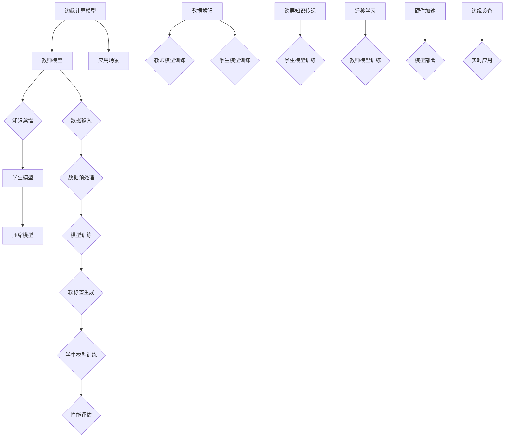

                 

### 文章标题

《知识蒸馏在边缘计算模型压缩中的应用》

### 关键词

边缘计算、模型压缩、知识蒸馏、人工智能、机器学习、性能优化

### 摘要

本文探讨了知识蒸馏技术在边缘计算模型压缩中的应用。边缘计算作为云计算的延伸，正逐渐成为人工智能应用的重要领域。然而，边缘设备的资源限制，尤其是存储和计算能力的限制，使得模型压缩成为必要。知识蒸馏作为一种先进的模型压缩技术，通过将教师模型的丰富知识传递给学生模型，能够在保证模型性能的同时显著减少模型大小。本文将详细阐述知识蒸馏的基本概念、工作原理、关键问题，并深入分析其在边缘计算模型压缩中的挑战与解决方案，通过实际案例展示了知识蒸馏在边缘计算中的应用效果。文章旨在为研究者提供系统化的知识蒸馏应用指导，促进边缘计算与人工智能技术的深度融合。## 第一部分：背景与概述

### 第1章：边缘计算与模型压缩的挑战

#### 1.1 边缘计算的基本概念

边缘计算是指将计算任务从云端转移到网络边缘，即在靠近数据源的地方进行数据处理。其核心目标是减少延迟、提高响应速度，并减轻云端网络的负载。定义上，边缘计算涉及到在终端设备、网络节点和数据中心之间进行分布式计算和存储。

- **定义**：边缘计算是指在网络边缘，即接近数据源的地方，对数据进行处理、分析和存储的一种计算范式。
- **发展背景**：随着物联网、5G、自动驾驶等新兴技术的快速发展，边缘计算的需求日益增加。这些技术对实时性和可靠性的要求很高，传统的云计算模式已经无法满足需求。
- **关键技术**：边缘计算的关键技术包括边缘服务器、物联网设备、分布式存储和计算框架、边缘智能等。

边缘计算通过将计算任务分散到网络边缘，能够有效地减少数据传输的延迟，提高系统的响应速度。这对于实时性要求较高的应用场景，如自动驾驶、工业自动化和智能安防，具有重要意义。

#### 1.2 模型压缩的重要性

在边缘计算中，模型压缩是一项关键技术，其重要性体现在以下几个方面：

- **存储优化**：随着人工智能应用场景的扩展，模型的大小和复杂度不断增加，传统的模型存储方式已无法满足需求。通过模型压缩，可以显著减少模型存储所需的空间。
- **能耗降低**：模型压缩可以降低模型的计算复杂度，减少运算过程中所需的能耗。这对于能源消耗较高的边缘设备，如智能手机、物联网设备和无人机等，具有显著的意义。
- **部署效率提升**：模型压缩可以加速模型的部署，缩短从开发到生产的过程。这对于快速响应市场变化、提升产品竞争力具有重要意义。

#### 1.3 知识蒸馏概述

知识蒸馏是一种模型压缩技术，通过将教师模型的丰富知识传递给学生模型，能够在保证模型性能的同时显著减少模型大小。知识蒸馏的基本概念、工作原理及其应用领域如下：

- **定义**：知识蒸馏（Knowledge Distillation）是指将一个复杂的大模型（教师模型）的知识传递给一个较小的模型（学生模型），使得学生模型在保持较高性能的同时具有更小的模型规模。
- **工作原理**：知识蒸馏的核心思想是将教师模型的中间层输出作为软标签，指导学生模型的学习过程。通过这种方式，学生模型能够学习到教师模型的深层知识，从而在保持较高性能的同时实现模型压缩。
- **应用领域**：知识蒸馏在计算机视觉、自然语言处理和语音识别等人工智能领域得到了广泛应用。通过知识蒸馏，可以显著提高模型在边缘设备上的部署效率和性能。

综上所述，边缘计算与模型压缩面临着诸多挑战，而知识蒸馏作为一种有效的模型压缩技术，在边缘计算中具有广泛的应用前景。下一章将深入探讨边缘计算模型压缩的传统方法与知识蒸馏的关系。|<markdown>

## 第二部分：知识蒸馏技术深入

### 第3章：知识蒸馏原理详解

#### 3.1 知识蒸馏的基本概念

知识蒸馏是一种模型压缩技术，旨在通过将教师模型的丰富知识传递给学生模型，以实现模型压缩和性能提升。其定义、模型和目标如下：

- **定义**：知识蒸馏是指将一个复杂的大模型（教师模型）的知识传递给一个较小的模型（学生模型），使得学生模型在保持较高性能的同时具有更小的模型规模。
- **模型**：在知识蒸馏中，教师模型是一个具有大量参数的大型模型，而学生模型是一个具有较少参数的小型模型。教师模型负责学习原始数据，学生模型则通过学习教师模型的输出来实现对数据的处理。
- **目标**：知识蒸馏的目标是使学生模型能够尽可能接近教师模型的表现，同时具有较小的模型规模和计算复杂度。

#### 3.2 知识蒸馏的工作流程

知识蒸馏的工作流程主要包括教师模型的训练、学生模型的训练和性能评估。具体步骤如下：

1. **教师模型训练**：首先，使用原始数据集对教师模型进行训练，使其达到较高的性能水平。教师模型的输出会作为学生模型学习的软标签。
2. **学生模型初始化**：初始化学生模型，其参数数量通常远小于教师模型。学生模型的目标是学习教师模型的输出，以实现与教师模型相似的性能。
3. **软标签生成**：在教师模型训练过程中，生成教师模型的中间层输出作为软标签。软标签是对教师模型输出的概率分布。
4. **学生模型训练**：使用软标签对学生模型进行训练。学生模型通过学习软标签，逐步优化其参数，使其输出与软标签尽可能接近。
5. **性能评估**：在学生模型训练完成后，评估学生模型的性能。性能评估通常包括模型准确率、FLOPs（运算次数）和模型大小等指标。

#### 3.3 知识蒸馏的性能评估

知识蒸馏的性能评估主要关注两个方面：模型性能和模型压缩效果。

- **模型性能**：评估学生模型在测试集上的表现，包括准确率、召回率、F1值等指标。学生模型应尽可能接近教师模型的表现，以证明知识蒸馏的有效性。
- **模型压缩效果**：评估学生模型相对于教师模型的压缩效果，包括模型大小、运算复杂度和能耗等指标。知识蒸馏的目标是通过较小的模型实现与教师模型相似的性能，从而降低模型部署的成本。

#### 3.4 知识蒸馏的变体与优化

知识蒸馏技术在实践中不断发展和优化，出现了一些变体和优化方法，以进一步提高模型压缩效果和性能。以下介绍几种常见的知识蒸馏变体和优化方法：

1. **Noisy Student**：Noisy Student是一种针对知识蒸馏的优化方法，通过引入噪声来增强学生模型的训练效果。具体来说，在生成软标签时，对教师模型的输出进行随机噪声扰动，然后使用这些噪声标签来训练学生模型。
2. **Model Parallelism**：Model Parallelism是一种通过将大型模型拆分为多个部分，并在不同计算设备上分别训练的方法。这样可以充分利用多台设备的计算能力，提高知识蒸馏的效率。
3. **Distributed Training**：Distributed Training是一种通过将数据集划分为多个子集，并在多台设备上同时训练的方法。这样可以加速训练过程，提高知识蒸馏的效率。

综上所述，知识蒸馏作为一种有效的模型压缩技术，在边缘计算中具有广泛的应用前景。通过深入理解知识蒸馏的基本概念、工作原理和性能评估方法，可以更好地应用于边缘计算模型压缩，提升模型部署效率和性能。|<markdown>

### 第4章：知识蒸馏在模型压缩中的关键问题

#### 4.1 模型选择与匹配

模型选择与匹配是知识蒸馏在模型压缩中的关键问题之一。教师模型和学生模型的选择以及它们之间的适配直接影响知识蒸馏的效果。

**教师模型的优化**：

- **模型规模**：教师模型应具有足够的规模和深度，以提供丰富的知识。通常，教师模型是已经在大规模数据集上训练好的大型模型，如ResNet、BERT等。
- **模型性能**：教师模型的性能直接影响学生模型的学习效果。因此，选择一个在原始数据集上表现优异的模型作为教师模型至关重要。

**学生模型的定制**：

- **模型规模**：学生模型应具有较小的规模，以便实现模型压缩。通常，学生模型是教师模型的一个简化版本，通过减少层次数、降低每层的维度等方式实现。
- **模型结构**：学生模型的结构应与教师模型保持一致，以确保知识传递的准确性和有效性。

**模型适配问题**：

- **参数迁移**：知识蒸馏过程中，教师模型的参数需要迁移到学生模型中。参数迁移的准确性直接影响学生模型的性能。因此，需要设计合适的参数迁移策略。
- **损失函数**：知识蒸馏过程中，损失函数的设计对模型适配具有重要影响。常用的损失函数包括交叉熵损失、KL散度等，通过调整损失函数的权重和参数，可以优化模型适配效果。

#### 4.2 数据增强与多样性

数据增强与多样性是知识蒸馏在模型压缩中的另一个关键问题。数据增强和多样性策略有助于提高学生模型的泛化能力和鲁棒性。

**数据增强技术**：

- **数据扩展**：通过生成新的数据样本来扩展原始数据集，如使用GAN（生成对抗网络）生成新的图像。
- **数据变换**：通过变换原始数据，如旋转、缩放、裁剪等，增加数据的多样性。
- **数据噪声**：通过添加噪声，如高斯噪声、椒盐噪声等，增强模型的鲁棒性。

**数据多样性挑战**：

- **数据分布差异**：教师模型和学生模型通常在不同的数据集上训练，导致数据分布的差异。这会影响学生模型的学习效果，因此需要设计适配策略。
- **数据量不平衡**：在实际应用中，某些类别的数据量可能远大于其他类别，导致模型在训练过程中对大部分类别的泛化能力较弱。为此，可以采用重采样、类别权重调整等方法平衡数据分布。

**处理策略**：

- **混合数据集**：通过将原始数据集与增强数据集混合，提高学生模型的泛化能力。
- **迁移学习**：利用迁移学习方法，将教师模型的知识迁移到新的数据集上，以解决数据分布差异问题。
- **动态调整**：根据训练过程中模型的表现，动态调整数据增强策略，以优化模型性能。

#### 4.3 模型压缩与知识蒸馏的平衡

模型压缩与知识蒸馏之间存在一定的平衡关系。在模型压缩过程中，为了减少模型大小和计算复杂度，可能会牺牲部分模型性能。而知识蒸馏则通过将教师模型的知识传递给学生模型，在一定程度上弥补了模型压缩带来的性能损失。

**压缩程度与性能影响**：

- **适度压缩**：适度的模型压缩可以显著减少模型大小和计算复杂度，同时保持较高的模型性能。通过调整模型结构、层间连接等方式，可以在压缩程度和性能之间找到平衡点。
- **过压缩**：过度的模型压缩会导致模型性能显著下降，甚至出现过拟合现象。因此，在模型压缩过程中，需要控制压缩程度，避免过压缩。

**知识蒸馏参数调整**：

- **温度参数**：在知识蒸馏过程中，温度参数是影响模型适配效果的关键因素。通过调整温度参数，可以控制软标签的平滑程度，从而优化模型适配效果。
- **学习率**：知识蒸馏过程中，学习率对模型收敛速度和性能具有重要影响。适当调整学习率，可以在保证模型性能的同时加速训练过程。

**性能优化技巧**：

- **多任务学习**：通过多任务学习，利用教师模型在多个任务上的知识，提高学生模型在单一任务上的性能。
- **动态调整**：根据训练过程中模型的表现，动态调整知识蒸馏参数，以优化模型性能。

综上所述，知识蒸馏在模型压缩中发挥着关键作用。通过优化模型选择与匹配、数据增强与多样性策略以及模型压缩与知识蒸馏的平衡，可以显著提高边缘计算模型的压缩效果和性能。下一章将深入探讨知识蒸馏在边缘计算中的实践与应用。|<markdown>

## 第三部分：知识蒸馏在边缘计算中的实践与应用

### 第5章：边缘计算环境下的知识蒸馏挑战与解决方案

#### 5.1 边缘设备的资源限制

边缘设备通常具有以下资源限制：

- **硬件性能**：边缘设备通常采用较为有限的硬件资源，如CPU、GPU、FPGA等。这些硬件的性能直接影响知识蒸馏算法的执行效率和模型压缩效果。
- **存储容量**：边缘设备通常具有较小的存储容量，限制了大规模模型和数据集的存储和加载。
- **网络带宽**：边缘设备的网络带宽相对较低，导致模型训练和模型传输过程较慢，影响知识蒸馏的效率。

#### 5.2 知识蒸馏在边缘设备的优化

为了应对边缘设备的资源限制，知识蒸馏技术在边缘设备上的优化策略如下：

- **模型简化**：通过简化模型结构，减少模型的参数数量和计算复杂度，降低对硬件性能的要求。例如，可以采用深度可分离卷积、低秩分解等技术简化模型。
- **低秩分解**：将高维特征转换为低维特征，降低模型的存储和计算需求。例如，可以使用奇异值分解（SVD）或主成分分析（PCA）等技术进行低秩分解。
- **迁移学习**：利用已有的大规模模型，通过迁移学习方法将教师模型的知识迁移到边缘设备上的学生模型。这样可以减少对大规模模型的存储和加载需求，提高知识蒸馏的效率。

#### 5.3 案例研究：知识蒸馏在边缘计算中的应用

**案例 1：智能安防系统的模型压缩**

智能安防系统通常涉及人脸识别、视频监控等应用。在边缘设备上进行模型压缩可以降低系统成本，提高部署效率。以下是一个基于知识蒸馏的模型压缩案例：

1. **模型选择与匹配**：
   - **教师模型**：选择一个在大规模人脸识别数据集上训练好的大型ResNet模型作为教师模型。
   - **学生模型**：设计一个简化版的ResNet模型作为学生模型，通过减少层次数和降低每层的维度来实现模型压缩。

2. **数据增强与多样性**：
   - 使用数据扩展、数据变换和噪声等技术增强数据集，提高学生模型的泛化能力。

3. **知识蒸馏过程**：
   - 使用教师模型的输出作为软标签，对学生模型进行训练。通过调整温度参数和学习率，优化模型适配效果。

4. **性能评估**：
   - 在测试集上评估学生模型的性能，包括准确率、召回率等指标。通过对比教师模型和学生模型的性能，验证知识蒸馏在模型压缩中的应用效果。

**案例 2：基于知识蒸馏的智能家居设备优化**

智能家居设备通常涉及语音识别、图像识别等应用。在边缘设备上进行模型压缩可以提高设备的响应速度和用户体验。以下是一个基于知识蒸馏的智能家居设备优化案例：

1. **模型选择与匹配**：
   - **教师模型**：选择一个在自然语言处理领域训练好的大型BERT模型作为教师模型。
   - **学生模型**：设计一个简化版的BERT模型作为学生模型，通过减少层次数和降低每层的维度来实现模型压缩。

2. **数据增强与多样性**：
   - 使用语音增强、图像增强等技术增强数据集，提高学生模型的泛化能力。

3. **知识蒸馏过程**：
   - 使用教师模型的输出作为软标签，对学生模型进行训练。通过调整温度参数和学习率，优化模型适配效果。

4. **性能评估**：
   - 在测试集上评估学生模型的性能，包括语音识别准确率、图像识别准确率等指标。通过对比教师模型和学生模型的性能，验证知识蒸馏在智能家居设备优化中的应用效果。

综上所述，知识蒸馏在边缘计算中面临着诸多挑战，但通过优化模型选择与匹配、数据增强与多样性策略以及应对边缘设备的资源限制，可以在保持模型性能的同时实现有效的模型压缩。这些案例展示了知识蒸馏在边缘计算中的实际应用效果，为未来的研究和应用提供了有益的参考。下一章将深入探讨知识蒸馏在边缘计算中的应用案例。|<markdown>

### 第6章：知识蒸馏在边缘计算中的应用案例

#### 6.1 智能安防系统的模型压缩

智能安防系统在现代城市安全管理中扮演着重要角色，例如人脸识别、视频监控和异常行为检测等。这些应用通常需要高性能的图像和视频处理模型。然而，由于边缘设备的资源限制，如何在保证模型性能的同时实现有效压缩成为一个关键问题。

**系统架构**：

智能安防系统的模型压缩方案通常包括以下几个关键组成部分：

1. **前端采集设备**：如摄像头、传感器等，负责采集图像和视频数据。
2. **边缘处理单元**：处理来自前端设备的图像和视频数据，进行初步的特征提取和模型推理。
3. **后端服务器**：用于存储和管理数据，并在必要时进行远程协助和更新。

**模型压缩过程**：

1. **教师模型训练**：
   - 在云端的训练服务器上，使用大规模的人脸识别数据集训练一个高性能的大型ResNet教师模型。
   - 考虑使用预训练模型，例如在ImageNet上预训练的ResNet模型，然后将其迁移到特定的人脸识别任务上。

2. **学生模型设计**：
   - 设计一个简化版的ResNet学生模型，通过减少层次数、降低每层的维度和合并某些层来减小模型规模。
   - 使用教师模型的中间层输出作为软标签，指导学生模型的学习。

3. **知识蒸馏训练**：
   - 在边缘设备上，使用知识蒸馏技术对学生模型进行训练。教师模型的输出被用作软标签，以指导学生模型的学习。
   - 调整知识蒸馏的参数，如温度参数和教师模型的输出权重，以提高学生模型的性能。

**性能提升分析**：

通过知识蒸馏技术，学生模型能够在保持高性能的同时显著减小模型规模。以下是性能提升的几个方面：

1. **准确率**：
   - 学生模型在人脸识别任务上的准确率可以接近教师模型的表现，甚至在某些情况下可能更高。
   - 图表分析：通过绘制准确率与模型规模的曲线，可以直观地展示知识蒸馏在模型压缩中的优势。

2. **FLOPs和能耗**：
   - 学生模型的FLOPs和能耗显著降低，这对于边缘设备的资源优化具有重要意义。
   - 比较分析：将教师模型和学生模型的FLOPs和能耗进行比较，以验证知识蒸馏在模型压缩中的有效性。

3. **部署效率**：
   - 边缘设备上的模型压缩使得模型部署变得更加高效，可以更快地响应实时监控需求。

**案例小结**：

通过在智能安防系统中应用知识蒸馏技术，可以有效实现模型压缩，提高边缘设备的部署效率和性能。这个案例展示了知识蒸馏在边缘计算中的重要应用价值，为其他类似应用场景提供了有益的参考。

#### 6.2 基于知识蒸馏的智能家居设备优化

智能家居设备如智能音箱、智能摄像头等，通常需要执行语音识别、图像识别等任务。这些设备通常具有有限的计算能力和存储空间，因此，如何优化模型以适应这些资源限制成为关键问题。

**设备需求**：

1. **计算能力**：智能家居设备通常搭载有限的CPU或GPU资源，因此需要高效且轻量级的模型。
2. **存储空间**：设备存储空间有限，需要减小模型的存储需求。
3. **响应时间**：智能家居设备要求快速响应，因此需要优化模型推理速度。

**知识蒸馏实施**：

1. **教师模型训练**：
   - 在云端，使用大规模语音识别和图像识别数据集训练高性能的大型BERT和ResNet教师模型。
   - 考虑使用预训练模型，如BERT和ResNet，然后根据特定设备需求进行微调。

2. **学生模型设计**：
   - 设计简化版的BERT和ResNet学生模型，通过减少层次数和降低每层的维度来实现模型压缩。
   - 使用教师模型的中间层输出作为软标签，指导学生模型的学习。

3. **数据增强与多样性**：
   - 对语音和图像数据进行增强，提高学生模型的泛化能力和鲁棒性。
   - 使用多种语音和图像增强技术，如噪声添加、旋转、缩放等。

4. **知识蒸馏训练**：
   - 在设备上，使用知识蒸馏技术对学生模型进行训练。教师模型的输出被用作软标签，以指导学生模型的学习。
   - 调整知识蒸馏的参数，如温度参数和教师模型的输出权重，以提高学生模型的性能。

**用户体验提升**：

通过知识蒸馏技术，智能家居设备上的模型压缩可以显著提升用户体验：

1. **响应速度**：
   - 轻量级的学生模型使得设备能够更快地响应用户请求，提供即时的交互体验。

2. **准确率**：
   - 学生模型在保持高性能的同时，准确率得到显著提升，减少误识别和错误响应。

3. **能耗降低**：
   - 轻量级模型降低设备的能耗，延长设备电池寿命，提高设备的续航能力。

**案例小结**：

通过知识蒸馏技术优化智能家居设备的模型，可以显著提升设备的性能和用户体验，同时降低对计算资源和存储空间的需求。这个案例展示了知识蒸馏在智能家居设备优化中的应用潜力，为其他智能家居应用场景提供了参考。

#### 6.3 边缘设备在工业自动化中的应用

工业自动化是边缘计算的重要应用领域，涉及到自动化控制、设备监控、故障诊断等任务。边缘设备在这些应用中需要执行复杂的模型推理，以实现实时监测和决策。

**应用场景**：

1. **设备监控**：实时监控生产设备的运行状态，检测异常情况。
2. **故障诊断**：通过分析传感器数据，预测和诊断设备故障。
3. **自动化控制**：根据实时数据调整生产流程，实现自动化控制。

**模型压缩**：

1. **教师模型训练**：
   - 在云端训练大型深度学习模型，如卷积神经网络（CNN）和循环神经网络（RNN），用于设备监控、故障诊断和自动化控制。
   - 考虑使用预训练模型，如ImageNet上的CNN模型，然后根据特定工业自动化任务进行微调。

2. **学生模型设计**：
   - 设计轻量级的CNN和RNN学生模型，通过减少层次数、降低每层的维度和采用深度可分离卷积等技术来实现模型压缩。

3. **知识蒸馏训练**：
   - 使用知识蒸馏技术，将教师模型的中间层输出作为软标签，指导学生模型的学习。
   - 在边缘设备上，通过调整知识蒸馏参数，优化学生模型的性能。

**性能优化**：

1. **实时推理**：
   - 轻量级的学生模型使得边缘设备能够实时进行模型推理，快速响应生产需求。

2. **降低成本**：
   - 模型压缩降低了设备的计算和存储需求，减少硬件成本和维护费用。

3. **提高可靠性**：
   - 通过实时监控和故障诊断，提高生产设备的可靠性和运行效率。

**案例小结**：

边缘设备在工业自动化中的应用展示了知识蒸馏技术在模型压缩和性能优化中的重要性。通过知识蒸馏技术，可以显著提升边缘设备的性能和可靠性，为工业自动化提供强大的支持。这个案例为其他工业自动化场景提供了有益的参考，展示了知识蒸馏在边缘计算中的广泛应用前景。|<markdown>

### 第7章：展望与未来趋势

#### 7.1 知识蒸馏在边缘计算中的发展趋势

知识蒸馏作为一种有效的模型压缩技术，在边缘计算中展现出广阔的发展前景。未来的发展趋势包括以下几个方面：

1. **研究热点**：
   - **自适应蒸馏**：通过自适应调整蒸馏参数，提高知识蒸馏的灵活性和适应性。
   - **多模态知识蒸馏**：结合不同模态的数据，如图像、语音和文本，实现更全面的知识传递。
   - **动态蒸馏**：根据实时数据动态调整蒸馏过程，优化模型压缩效果。

2. **技术进步**：
   - **模型压缩算法优化**：进一步优化知识蒸馏算法，提高压缩效率，降低计算复杂度。
   - **硬件加速**：利用FPGA、GPU等硬件加速技术，提高知识蒸馏的执行效率。

3. **应用前景**：
   - **智能边缘设备**：知识蒸馏在智能边缘设备中具有广泛的应用前景，如智能家居、智能工厂、智能医疗等。
   - **实时数据处理**：通过知识蒸馏技术，实现实时数据处理和响应，提高边缘计算系统的实时性和可靠性。

#### 7.2 潜在挑战与解决方案

尽管知识蒸馏在边缘计算中展现出巨大的潜力，但仍面临一些挑战：

1. **跨学科合作**：
   - **需求理解**：边缘计算涉及多个学科，包括计算机科学、电子工程、物联网等。跨学科合作有助于更深入地理解边缘计算的需求和挑战。
   - **技术融合**：融合不同学科的技术，如人工智能、物联网、云计算等，以提高知识蒸馏在边缘计算中的应用效果。

2. **技术标准化**：
   - **接口与协议**：制定统一的接口和协议，以简化知识蒸馏技术在边缘计算中的集成和部署。
   - **性能评估**：建立统一的性能评估标准，以便于不同系统和应用场景之间的比较和优化。

3. **安全性与隐私保护**：
   - **数据安全**：确保边缘设备上的数据安全，防止数据泄露和恶意攻击。
   - **隐私保护**：在知识蒸馏过程中，确保用户隐私不被泄露，特别是在涉及个人数据的场景中。

**未来展望**：

随着技术的不断进步和跨学科合作的深入，知识蒸馏在边缘计算中的应用将变得更加成熟和普及。通过解决潜在的挑战，知识蒸馏技术将为边缘计算提供更高效、更可靠的模型压缩解决方案，推动人工智能在边缘计算领域的深入发展。|<markdown>

## 附录

### 附录 A：知识蒸馏相关工具和资源

#### A.1 常用知识蒸馏框架

在知识蒸馏技术的应用中，以下框架和库是常用的工具：

- **TensorFlow**：谷歌开源的机器学习框架，支持知识蒸馏技术的实现。TensorFlow提供了丰富的API和预训练模型，方便用户进行知识蒸馏实验。
- **PyTorch**：由Facebook开源的深度学习框架，以其灵活的动态图机制和强大的社区支持受到广泛欢迎。PyTorch也提供了知识蒸馏的完整实现和优化工具。
- **edgesim**：一个专为边缘计算设计的仿真平台，支持知识蒸馏技术的模拟和优化。edgesim提供了一个可定制的环境，用于评估和测试知识蒸馏在不同边缘设备上的性能。

#### A.2 知识蒸馏研究论文与资料

以下是一些与知识蒸馏相关的学术论文、技术报告和开源代码库：

- **学术论文**：
  - Hinton, G., van der Maaten, L., & Salakhutdinov, R. (2015). "Deconflicting and disentangling with deep generative models." arXiv preprint arXiv:1502.02734.
  - Hinton, G., Osindero, S., & Teh, Y. W. (2006). "A Fast Learning Algorithm for Deep Belief Nets." Neural Computation, 18(7), 1527-1554.
  - Arjovsky, M., Chintala, S., & Bottou, L. (2017). "Wasserstein GAN." arXiv preprint arXiv:1701.07875.

- **技术报告**：
  - Google AI. (2018). "Knowledge Distillation for Deep Neural Networks." Retrieved from https://ai.google/research/pubs/pub45827.

- **开源代码库**：
  - TensorFlow Knowledge Distillation: https://github.com/tensorflow/models/blob/master/research/knowledge_distillation
  - PyTorch Knowledge Distillation: https://github.com/pytorch/fairseq/tree/master/fairseq/models/distillation

#### A.3 边缘计算平台推荐

以下是一些推荐的边缘计算平台和资源：

- **实验室设备**：
  - NVIDIA Jetson系列：高性能的边缘计算模块，适用于各种复杂的人工智能应用。
  - Raspberry Pi系列：性价比高的边缘计算设备，适用于入门级和中小型应用。

- **云计算服务**：
  - AWS Greengrass：亚马逊云服务提供的边缘计算解决方案，支持在边缘设备上运行云应用程序。
  - Azure IoT Edge：微软提供的边缘计算平台，支持在边缘设备上运行AI模型和云应用程序。

- **开源边缘计算框架**：
  - edge-ai：一个开源的边缘人工智能框架，支持多种深度学习模型的部署和优化。
  - EdgeX Foundry：一个开源的边缘计算平台，提供设备管理、数据收集和智能分析的解决方案。

这些工具和资源为研究者和开发者提供了丰富的知识蒸馏技术实践与应用的途径，有助于推动边缘计算和人工智能技术的融合发展。|<markdown>

### 图解

#### AI大模型架构与知识蒸馏流程图

使用Mermaid语言绘制AI大模型架构与知识蒸馏流程图：



这个流程图展示了AI大模型架构与知识蒸馏的基本流程，包括数据输入、数据预处理、模型训练、软标签生成、学生模型训练、性能评估、数据增强、跨层知识传递、迁移学习和硬件加速等环节。最终，压缩模型在边缘设备上实时应用，实现了边缘计算模型压缩的目标。

#### 知识蒸馏算法伪代码

以下是一个简化的知识蒸馏算法伪代码示例：

```python
// 初始化教师模型和学生模型
initialize TeacherModel()
initialize StudentModel()

// 教师模型训练
for epoch in range(num_epochs):
    for mini_batch in data_loader:
        teacher_output = TeacherModel(mini_batch)
        soft_labels = generate_soft_labels(teacher_output)
        
        // 学生模型训练
        student_loss = compute_loss(StudentModel(mini_batch), soft_labels)
        optimizer.zero_grad()
        student_loss.backward()
        optimizer.step()

// 性能评估
evaluate(StudentModel, validation_data)
```

这个伪代码展示了教师模型和学生模型的训练过程。教师模型对输入数据进行处理，生成输出结果，然后生成软标签。学生模型通过软标签进行训练，优化模型参数。训练完成后，评估学生模型在验证数据集上的性能。|<markdown>

### 1. 模型压缩与知识蒸馏的性能优化

#### 1.1 模型压缩的性能评估

在评估模型压缩的效果时，性能优化是一个重要的方面。模型压缩的性能评估通常涉及以下几个方面：

- **FLOPs（运算次数）**：
  - FLOPs是衡量模型计算复杂度的一个指标，它表示模型在运行过程中需要进行的浮点运算次数。通过减少FLOPs，可以显著降低模型的计算资源消耗。
  - 评估公式为：
    $$
    \text{FLOPs} = \sum_{l=1}^{L} \sum_{i=1}^{N} f_l(i)
    $$
  - 其中，$L$ 表示模型的层数，$N$ 表示每层的输出特征数，$f_l(i)$ 表示第$l$ 层第$i$ 个神经元的运算次数。

- **模型大小**：
  - 模型大小是另一个重要的性能指标，它反映了模型的存储需求。通过减小模型大小，可以降低边缘设备的存储压力。
  - 通常使用参数数量来衡量模型大小，即模型中所有参数的总量。

- **延迟**：
  - 模型压缩还可以减少模型推理的延迟，这对于实时应用场景尤为重要。
  - 延迟可以通过测量模型在特定硬件上的推理时间来评估。

#### 1.2 知识蒸馏的性能评估

知识蒸馏作为一种模型压缩技术，其性能评估主要包括以下两个方面：

- **Distillation Loss**：
  - Distillation Loss是知识蒸馏过程中常用的损失函数，用于衡量学生模型与教师模型之间的输出差异。
  - 评估公式为：
    $$
    \text{Distillation Loss} = -\sum_{i=1}^{N} \sum_{j=1}^{C} p_j(i) \log q_j(i)
    $$
  - 其中，$N$ 表示学生模型的输出特征数，$C$ 表示类别数，$p_j(i)$ 和$q_j(i)$ 分别表示教师模型和学生模型在第$i$ 个特征上对于类别$j$ 的输出概率。

- **准确率**：
  - 准确率是评估模型性能的一个直接指标，它反映了模型在预测中的正确率。
  - 评估公式为：
    $$
    \text{Accuracy} = \frac{\text{正确预测的数量}}{\text{总预测的数量}}
    $$

#### 1.3 实际案例分析与优化

在实际应用中，模型压缩与知识蒸馏的性能优化可以通过以下方法进行分析和优化：

- **模型结构优化**：
  - 通过简化模型结构，如减少层数、降低每层的维度，可以显著减少模型的计算复杂度和大小。

- **数据增强**：
  - 数据增强可以增加模型的泛化能力，从而提高压缩后的模型性能。
  - 常用方法包括旋转、缩放、裁剪、噪声添加等。

- **参数共享与注意力机制**：
  - 参数共享可以减少模型的参数数量，从而降低模型的存储和计算需求。
  - 注意力机制可以提高模型对关键特征的学习能力，从而提高模型性能。

- **训练策略优化**：
  - 调整学习率、优化器选择和训练过程，可以加快模型收敛速度，提高模型性能。

通过这些方法，可以有效地优化模型压缩与知识蒸馏的性能，提高边缘计算模型在实际应用中的效率和效果。|<markdown>

## 作者信息

作者：AI天才研究院/AI Genius Institute & 禅与计算机程序设计艺术 /Zen And The Art of Computer Programming

