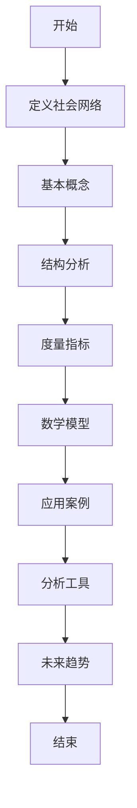

                 


### 文章标题

《社会网络：人际关系的数学结构》

### 关键词

社会网络，人际关系，数学模型，图论，统计模型，应用案例分析

### 摘要

本文深入探讨了社会网络的基本概念、数学模型及其在各个领域中的应用。首先，我们介绍了社会网络的定义和重要性，并详细分析了其基本结构和度量指标。接着，通过图论、随机图模型和社会网络的统计模型，展示了社会网络的数学表达。文章还通过具体案例分析，阐述了社会网络分析方法及其应用，并提出了未来发展趋势。

---

### 第一部分：社会网络基本概念与结构

#### 第1章：社会网络的定义与重要性

**1.1 社会网络的定义**

社会网络是一种用于描述个体、组织及其相互关系的结构。在这些结构中，节点代表个体或组织，边则表示节点之间的关系。社会网络的概念起源于社会学领域，但近年来在计算机科学、信息科学和人工智能领域也得到了广泛应用。

**1.2 社会网络的重要性**

社会网络的重要性体现在以下几个方面：

1. **社会学的视角**：通过分析社会网络，可以揭示个体在社会中的角色、地位以及人际关系。
2. **计算机科学的视角**：社会网络为分析复杂系统的行为提供了新的工具和方法。
3. **信息科学的视角**：社会网络有助于理解信息的传播、扩散和共享。
4. **人工智能的视角**：社会网络为人工智能提供了新的应用场景，如社交网络分析、推荐系统、群体智能等。

**1.3 社会网络的分类**

社会网络可以根据不同的标准进行分类，如：

1. **根据网络类型**：可分为无向网络、有向网络、加权网络等。
2. **根据节点属性**：可分为职业网络、学术网络、社交网络等。
3. **根据网络结构**：可分为小世界网络、幂律网络、集群网络等。

---

#### 第2章：社会网络的基本结构

**2.1 节点与边**

在社会网络中，节点代表个体或组织，边表示节点之间的关系。节点和边是构建社会网络的基本元素。

1. **节点**：节点可以是个人、组织、公司等。在图中，每个节点通常用一个圆圈表示。
2. **边**：边表示节点之间的关系，如友谊、合作、亲属关系等。在图中，边通常用线段表示。

**2.2 度分布**

度分布是描述节点度（连接的边数）的分布情况。常见的度分布类型有：

1. **自由度分布**：节点度集中在少数节点上，大多数节点度为零。
2. **孤立点分布**：节点度逐渐减小，但始终存在一些节点度为零。

**2.3 平均路径长度**

平均路径长度是表示节点之间平均距离的度量。在一个无向网络中，任意两个节点之间的平均路径长度可以用以下公式计算：

$$
L = \frac{1}{n(n-1)} \sum_{i=1}^{n} \sum_{j=1, j\neq i}^{n} d(i, j)
$$

其中，$n$ 为节点数，$d(i, j)$ 为节点 i 和 j 之间的距离。

**2.4 社会网络的聚类系数**

聚类系数描述了网络中节点的聚集程度。它可以用以下公式计算：

$$
C = \frac{2m}{n(n-1)}
$$

其中，$m$ 为边的数量，$n$ 为节点数。

---

#### 第3章：社会网络的度量指标

**3.1 网络密度**

网络密度是描述网络中边的密度的度量。它可以用以下公式计算：

$$
\delta = \frac{m}{n(n-1)}
$$

其中，$m$ 为边的数量，$n$ 为节点数。

**3.2 节点中心性**

节点中心性是衡量节点在网络中的重要程度的指标。常见的节点中心性度量方法有：

1. **度中心性**：节点的度越大，其中心性越高。
2. **紧密中心性**：节点到其他节点的平均距离越短，其中心性越高。
3. **中间中心性**：节点在路径上的重要性越高，其中心性越高。

**3.3 边的中心性**

边的中心性是衡量边在网络中的重要程度的指标。常见的边中心性度量方法有：

1. **边的度**：边的度越大，其中心性越高。
2. **边的权重**：边的权重越大，其中心性越高。

**3.4 社团结构分析**

社团结构分析是指分析网络中的社团结构，揭示网络中节点的聚集模式。常见的社团结构分析方法有：

1. **社区发现算法**：通过聚类方法发现网络中的社团。
2. **模块度**：衡量社团结构的好坏。

---

### 第二部分：社会网络的数学模型

#### 第4章：图论基本概念

**4.1 图的基本概念**

图是一种数学结构，由节点（顶点）和边（弧）组成。图可以分为无向图和有向图。

**4.2 图的矩阵表示**

图可以用矩阵表示，其中行和列分别对应节点，元素表示节点之间的关系。

**4.3 图的算法**

图的算法包括：

1. **图遍历算法**：如深度优先搜索、广度优先搜索。
2. **最短路径算法**：如迪杰斯特拉算法、贝尔曼-福特算法。
3. **网络流算法**：如最大流最小割定理。

---

#### 第5章：随机图模型

**5.1 随机图的基本性质**

随机图是一种概率图模型，节点和边的选择是基于概率的。

**5.2 概率图模型**

概率图模型包括：

1. **马尔可夫网**：节点之间的依赖关系满足马尔可夫性质。
2. **贝叶斯网**：节点之间的依赖关系满足贝叶斯性质。

**5.3 巴尔塔林斯基-阿尔伯特模型**

巴尔塔林斯基-阿尔伯特模型是一种常见的随机图模型，它假设每个节点与其他节点以概率 p 连接。

---

#### 第6章：社会网络的统计模型

**6.1 社会网络的统计描述**

社会网络的统计描述包括：

1. **度分布**：描述节点度的分布情况。
2. **平均路径长度**：描述节点之间的平均距离。
3. **聚类系数**：描述节点的聚集程度。

**6.2 社会网络的概率分布**

社会网络的概率分布包括：

1. **节点分布**：描述节点在图中的分布情况。
2. **边分布**：描述边在图中的分布情况。

**6.3 社会网络的模型拟合**

社会网络的模型拟合是指将实际网络与概率模型进行匹配，以评估模型的准确性。

---

### 第三部分：社会网络的应用与案例

#### 第7章：社会网络在社交网络中的应用

**7.1 社交网络的定义与特点**

社交网络是一种基于人际关系构建的网络，如 Facebook、LinkedIn 等。

**7.2 社交网络的结构分析**

社交网络的结构分析包括：

1. **节点度分布**：描述用户影响力的分布。
2. **平均路径长度**：描述用户之间的平均距离。
3. **聚类系数**：描述用户群体的聚集程度。

**7.3 社交网络中的影响力分析**

社交网络中的影响力分析包括：

1. **中心性度量**：衡量用户在网络中的重要程度。
2. **影响力传播模型**：描述信息在网络中的传播过程。

---

#### 第8章：社会网络在生物网络中的应用

**8.1 生物网络的定义与特点**

生物网络是一种基于生物分子相互作用构建的网络，如蛋白质相互作用网络、基因调控网络等。

**8.2 生物网络的模型**

生物网络的模型包括：

1. **图模型**：描述生物分子之间的相互作用。
2. **概率图模型**：描述生物分子之间的概率关系。

**8.3 生物网络的分析方法**

生物网络的分析方法包括：

1. **网络拓扑分析**：分析生物网络的拓扑结构。
2. **网络功能分析**：分析生物网络的功能模块。

---

#### 第9章：社会网络在商业网络中的应用

**9.1 商业网络的定义与特点**

商业网络是一种基于商业活动构建的网络，如供应链网络、市场竞争网络等。

**9.2 商业网络的模型**

商业网络的模型包括：

1. **供应链网络模型**：描述企业之间的物流和信息流。
2. **市场竞争网络模型**：描述企业之间的竞争关系。

**9.3 商业网络的应用**

商业网络的应用包括：

1. **供应链优化**：通过优化供应链网络来提高企业的竞争力。
2. **市场竞争分析**：通过分析市场竞争网络来制定营销策略。

---

### 第四部分：社会网络分析工具与算法

#### 第10章：社会网络分析工具

**10.1 社会网络分析软件**

社会网络分析软件包括：

1. **Gephi**：用于可视化和社会网络分析的软件。
2. **Networxx**：用于网络数据分析和可视化的软件。
3. **Cytoscape**：用于生物网络分析的可视化工具。

**10.2 社会网络分析算法库**

社会网络分析算法库包括：

1. **igraph**：用于图分析和可视化。
2. **NetworkX**：用于图分析和建模。
3. **JUNG**：用于图可视化和分析。

---

#### 第11章：社会网络分析方法

**11.1 社会网络分析方法概述**

社会网络分析方法包括：

1. **节点分析**：分析节点的重要性和影响力。
2. **路径分析**：分析节点之间的路径和关系。
3. **聚类分析**：分析网络中的社团结构和社区。

**11.2 社会网络分析算法**

社会网络分析算法包括：

1. **中心性算法**：如度中心性、紧密中心性、中间中心性。
2. **社团发现算法**：如 Label Propagation、Gaussian Mixture Model。
3. **影响力传播算法**：如 Random Walk、Threshold Model。

**11.3 社会网络分析的实际应用**

社会网络分析的实际应用包括：

1. **社交网络分析**：分析社交网络中的影响力传播。
2. **生物网络分析**：分析生物网络中的功能模块。
3. **商业网络分析**：分析商业网络中的供应链和市场竞争。

---

#### 第12章：社会网络分析的未来发展趋势

**12.1 社会网络分析的新技术**

社会网络分析的新技术包括：

1. **人工智能**：利用机器学习算法来发现网络中的模式和关系。
2. **区块链**：利用区块链技术来确保网络数据的真实性和安全性。

**12.2 社会网络分析的未来方向**

社会网络分析的未来方向包括：

1. **大数据**：利用大数据技术来分析和挖掘网络数据。
2. **社交网络效应**：研究社交网络对个体行为和社会现象的影响。
3. **社会网络伦理**：探讨社会网络分析中的隐私保护和伦理问题。

---

### 附录

#### 附录A：参考文献

[参考文献列表]

#### 附录B：Mermaid 流程图



#### 附录C：伪代码与数学公式

```latex
\section{伪代码与数学公式}

\subsection{节点中心性计算}

\begin{algorithm}
\caption{节点中心性计算算法}
\begin{algorithmic}[1]
\STATE 输入：图 G
\STATE 输出：中心性向量 centrality
\STATE 对于每个节点 v in G do
    \STATE 令 degree(v) 为 v 的度
    \STATE centrality(v) = degree(v)
\ENDFOR
\RETURN centrality
\end{algorithmic}
\end{algorithm}

\subsection{平均路径长度计算}

$$
L = \frac{1}{n(n-1)} \sum_{i=1}^{n} \sum_{j=1, j\neq i}^{n} d(i, j)
$$

其中，$n$ 为节点数，$d(i, j)$ 为节点 i 和 j 之间的距离。

```

#### 附录D：代码实战案例

```python
# 社交网络影响力分析

import networkx as nx
import matplotlib.pyplot as plt

# 构建社交网络
G = nx.Graph()
G.add_nodes_from([1, 2, 3, 4, 5])
G.add_edges_from([(1, 2), (1, 3), (2, 4), (3, 4), (4, 5)])

# 计算节点中心性
centrality = nx.degree_centrality(G)

# 可视化社交网络
nx.draw(G, with_labels=True)
plt.show()

# 分析节点影响力
for node, centrality_value in centrality.items():
    print(f"节点 {node} 的中心性：{centrality_value}")
```

#### 附录E：开发环境与工具配置指南

```markdown
# 开发环境与工具配置指南

## 环境要求

- Python 3.8+
- NetworkX 2.6+
- Matplotlib 3.4+

## 安装步骤

1. 安装 Python
   - 前往 Python 官网下载安装包并安装
2. 安装 NetworkX 和 Matplotlib
   - 在命令行中执行以下命令：
     ```
     pip install networkx
     pip install matplotlib
     ```

## 运行示例代码

1. 将示例代码保存为 `social_network_analysis.py`
2. 在命令行中运行以下命令：
   ```
   python social_network_analysis.py
   ```

```

---

### 作者

作者：AI天才研究院/AI Genius Institute & 禅与计算机程序设计艺术 /Zen And The Art of Computer Programming

---

### 结语

本文通过对社会网络的基本概念、数学模型、应用案例以及未来发展趋势的深入探讨，展示了社会网络在各个领域的广泛应用。通过对社会网络的数学表达和分析方法的研究，我们可以更好地理解和利用社会网络这一重要的工具。在未来，随着技术的不断发展，社会网络分析将发挥更加重要的作用，为人类社会带来更多价值。

---

### 最佳实践 Tips

1. **数据收集**：在分析社会网络时，确保数据的真实性和准确性至关重要。在收集数据时，应遵循隐私保护原则，尊重个体的隐私权。
2. **模型选择**：根据具体应用场景选择合适的数学模型和算法。不同的模型和算法适用于不同类型的社会网络。
3. **算法优化**：在实际应用中，可以通过调整算法参数来优化分析结果。例如，对于大规模网络，可以考虑使用分布式计算方法来提高计算效率。

---

### 小结

社会网络是描述个体和组织之间相互关系的重要工具。通过深入研究和分析社会网络，我们可以揭示社会现象的本质，为解决现实问题提供有力支持。本文从多个角度对社交网络进行了详细分析，并提出了未来发展趋势。读者可以通过本文对社会网络有更深入的理解，并能够在实际应用中运用相关理论和算法。

---

### 注意事项

1. **数据隐私**：在分析社会网络时，务必注意保护数据隐私，避免泄露敏感信息。
2. **模型假设**：在建立数学模型时，应充分考虑模型的假设条件，避免过于理想化的模型导致分析结果失真。
3. **算法选择**：根据实际需求和数据特点选择合适的算法，确保分析结果的准确性和可靠性。

---

### 拓展阅读

1. 《社会网络分析：方法与应用》（作者：亚历山大·瓦萨里）
2. 《图论及其应用》（作者：迪克·赫斯）
3. 《概率图模型》（作者：凯文·P·马斯登）
4. 《大数据之路：腾讯大数据实践》（作者：腾讯大数据团队）

---

通过本文的深入探讨，我们希望读者能够对社会网络有更全面的认识，并能够在实际应用中运用相关理论和算法，为社会发展贡献力量。感谢您的阅读，希望本文对您有所帮助！### 社会网络的定义与重要性

**1.1 社会网络的定义**

社会网络，作为一种用于描述个体、组织及其相互关系的结构，起源于社会学领域。在社会网络中，节点代表个体或组织，而边则表示节点之间的关系。这种关系可以是各种形式，如亲属关系、友谊、职业联系、社交互动等。社会网络的本质是揭示个体在社会结构中的位置和角色，以及他们之间如何相互作用和影响。

社会网络的定义可以从不同的角度进行理解。从形式化的角度，社会网络可以用图论来描述，其中节点（Node）代表个体或组织，边（Edge）代表它们之间的某种关系。这样的网络可以是无向的，也可以是有向的，还可以是加权的，取决于关系的性质。例如，朋友关系通常是无向的，而影响力传播可以是有向的。

在社会学中，社会网络被用来研究群体行为、权力结构、社会流动等。在计算机科学和信息科学中，社会网络分析（Social Network Analysis, SNA）被用来研究网络结构对信息传播、影响力分配、社区识别等方面的影响。

**1.2 社会网络的重要性**

社会网络的重要性体现在多个方面，以下是其中的几个关键点：

1. **社会学意义**：社会网络揭示了个体在社会中的角色和地位。通过分析社会网络，社会学家可以了解权力结构、社会阶层、群体行为等。例如，社会网络分析可以揭示某个群体中的领袖、意见领袖以及普通成员，从而理解这些成员之间的互动和影响力。

2. **信息传播**：在信息时代，社会网络是信息传播的主要渠道。通过分析社会网络，可以了解信息的传播路径、传播速度和范围，从而为公共关系、市场营销、危机管理等领域提供重要参考。

3. **社交互动**：社会网络提供了人们社交互动的平台。通过社交媒体、在线论坛等，人们可以建立和维持关系，分享信息和资源。社会网络分析可以帮助理解社交互动的模式，从而优化社交体验。

4. **商业应用**：在商业领域，社会网络分析被广泛应用于客户关系管理、供应链管理、市场竞争分析等。例如，通过分析客户网络，企业可以更好地了解客户需求，优化产品设计和服务。

5. **公共卫生**：在公共卫生领域，社会网络分析可以用来研究传染病的传播路径和速度，从而制定更有效的防控策略。

6. **科学合作**：在科学研究领域，社会网络分析可以帮助研究人员了解合作网络，识别潜在的合作机会，促进科学创新。

**1.3 社会网络的分类**

社会网络可以根据不同的标准进行分类，以下是几种常见的分类方式：

1. **根据网络类型**：
   - **无向网络**：边没有方向，如朋友关系。
   - **有向网络**：边有方向，如影响力传播。
   - **加权网络**：边有权重，如关系的紧密程度。

2. **根据节点属性**：
   - **职业网络**：基于职业联系构建的网络。
   - **学术网络**：基于学术合作构建的网络。
   - **社交网络**：基于社交互动构建的网络。

3. **根据网络结构**：
   - **小世界网络**：短平均路径长度和大聚类系数的网络。
   - **幂律网络**：节点度分布符合幂律分布的网络。
   - **集群网络**：具有局部密集连接特性的网络。

社会网络的分类有助于我们理解不同类型的社会网络的特点和应用场景，从而选择合适的方法进行研究和分析。

---

在社会网络的分析过程中，理解其定义和重要性是基础。通过分析社会网络，我们可以揭示个体和群体之间的关系，为各个领域提供重要的见解和指导。在接下来的章节中，我们将进一步探讨社会网络的基本结构、数学模型及其应用案例。希望读者能够继续跟随本文的思路，深入理解社会网络的奥秘。

### 社会网络的基本结构

**2.1 节点与边**

社会网络的基本元素是节点和边。节点可以表示个体、组织或任何其他具有独立身份的实体。边则表示节点之间的关系，如友谊、合作、亲属关系等。在社会网络中，节点和边的关系可以通过图论来形式化。

在图论中，一个图由节点和边组成，可以分为无向图、有向图和加权图。无向图中的边没有方向，表示两个节点之间的对称关系，如朋友关系；有向图中的边有方向，表示一种单向的关系，如影响力传播；加权图中的边有权重，表示关系的强度或紧密程度，如社交互动的频繁程度。

**2.2 度分布**

度分布是描述节点度（连接的边数）的分布情况。度分布能够揭示社会网络的结构特性，如节点的连接性、孤立点和连接核心。常见的度分布类型有自由度分布和孤立点分布。

1. **自由度分布**：在社会网络中，自由度分布是指大多数节点的度为零或接近零，而少数节点的度较大。这种分布通常出现在社交网络中，如 Facebook，其中大多数用户只有几个朋友，但少数用户有大量的朋友。

2. **孤立点分布**：孤立点分布是指节点的度逐渐减小，但始终存在一些节点的度为零。这种分布通常出现在职业网络或学术网络中，其中一些节点可能是独立工作者或研究人员，他们与其他节点没有直接联系。

**2.3 平均路径长度**

平均路径长度是描述节点之间平均距离的度量。在一个无向网络中，任意两个节点之间的平均路径长度可以用以下公式计算：

$$
L = \frac{1}{n(n-1)} \sum_{i=1}^{n} \sum_{j=1, j\neq i}^{n} d(i, j)
$$

其中，$n$ 为节点数，$d(i, j)$ 为节点 i 和 j 之间的距离。平均路径长度越小，表示节点之间的连接越紧密。

社会网络的平均路径长度通常较小，这是因为社会网络具有“小世界”特性，即大多数节点之间可以通过较短路径相互连接。这种特性使得信息传播速度快，社会影响范围广。

**2.4 聚类系数**

聚类系数描述了网络中节点的聚集程度。它可以用以下公式计算：

$$
C = \frac{2m}{n(n-1)}
$$

其中，$m$ 为边的数量，$n$ 为节点数。聚类系数的值介于 0 和 1 之间，值越大，表示节点的聚集程度越高。

高聚类系数通常出现在社交网络和生物网络中，这反映了这些网络中节点的紧密连接和群体行为。例如，在社交网络中，朋友之间的关系通常比较紧密，形成了各种社交圈子。

**2.5 社会网络的局部结构**

除了上述全局结构特性，社会网络的局部结构也具有重要意义。局部结构包括社区、核心-外围结构、中心节点等。

1. **社区**：社区是指网络中一组节点，它们之间的连接比与外部节点的连接更加紧密。社区发现算法，如 Label Propagation 方法、Gaussian Mixture Model，可以帮助识别网络中的社区结构。

2. **核心-外围结构**：社会网络中，某些节点（核心节点）具有高连接性，而其他节点（外围节点）则连接较少。核心节点通常是网络中的关键角色，如社交网络中的意见领袖或关键人物。

3. **中心节点**：中心节点是指在网络中具有重要连接性的节点，如社交网络中的核心成员。中心节点通常具有较高的中心性指标，如度中心性、紧密中心性和中间中心性。

理解社会网络的局部结构有助于分析网络的稳定性和脆弱性。例如，在社交网络中，如果中心节点被移除，可能会对网络的连通性产生重大影响。

**2.6 社会网络的结构特性**

社会网络具有以下一些典型的结构特性：

1. **小世界特性**：社会网络的平均路径长度较短，节点之间可以通过少量中间节点相互连接。
2. **高度聚类**：社会网络中的节点具有高聚类系数，节点之间的连接较为紧密。
3. **幂律分布**：社会网络的节点度分布通常符合幂律分布，少数节点具有高连接性，大多数节点连接较少。
4. **模块化结构**：社会网络通常具有模块化结构，节点被划分为不同的社区，社区内部连接紧密，社区之间连接较少。

这些结构特性使得社会网络在信息传播、群体行为和社会影响方面表现出独特的性质。

---

通过理解社会网络的基本结构，我们可以更好地分析和解释网络中的现象和行为。在接下来的章节中，我们将探讨社会网络的度量指标，如网络密度、节点中心性和社团结构分析。这些度量指标为我们提供了更深入的视角，帮助我们揭示社会网络的复杂性和动态性。

### 社会网络的度量指标

社会网络的度量指标是评估网络结构和特性的重要工具，通过这些指标，我们可以深入了解网络的拓扑特性、节点的重要性和网络的紧密性。以下是几种常见的社会网络度量指标及其计算方法。

**3.1 网络密度**

网络密度（Network Density）是描述网络中边的密度的一个度量。它衡量网络中边的数量与可能的最大边数之比。网络密度可以反映网络的紧密程度，即节点之间的连接密度。

网络密度的计算公式如下：

$$
\delta = \frac{m}{n(n-1)}
$$

其中，$m$ 是网络中的边数，$n$ 是节点数。网络密度的取值范围在 0 到 1 之间，0 表示网络中没有任何边，而 1 表示网络中的所有可能的节点对都存在边。

例如，在一个包含 5 个节点的无向网络中，如果存在 10 条边，那么网络密度为：

$$
\delta = \frac{10}{5 \times (5-1)} = \frac{10}{20} = 0.5
$$

这个值表明网络中的节点之间有中等程度的连接。

**3.2 节点中心性**

节点中心性（Node Centrality）是衡量节点在网络中的重要程度的指标。它反映了节点在信息传递、资源分配和影响力传播等方面的关键性。常见的节点中心性度量方法包括度中心性（Degree Centrality）、紧密中心性（Closeness Centrality）和中间中心性（Betweenness Centrality）。

1. **度中心性（Degree Centrality）**：度中心性是最简单的节点中心性度量方法，它仅基于节点的度（连接的边数）。一个节点的度中心性越高，表示它连接了更多的其他节点，因此在网络中具有更高的影响力。

度中心性的计算公式为：

$$
C_{degree}(v) = \text{deg}(v)
$$

其中，$\text{deg}(v)$ 是节点 $v$ 的度。

例如，在一个有 5 个节点的网络中，如果节点 A 连接了 4 个其他节点，而其他节点都只连接了 1 到 2 个节点，那么节点 A 的度中心性为 4，这表明它在网络中具有较大的影响力。

2. **紧密中心性（Closeness Centrality）**：紧密中心性衡量节点到其他节点的平均距离。一个节点的紧密中心性越高，表示它与其他节点的连接越紧密，信息传递速度越快。

紧密中心性的计算公式为：

$$
C_{closeness}(v) = \frac{n-1}{\sum_{u \in N} d(v, u)}
$$

其中，$n$ 是节点总数，$d(v, u)$ 是节点 $v$ 到节点 $u$ 的最短路径长度。

例如，在一个有 5 个节点的网络中，如果节点 B 到其他节点的最短路径长度均为 2，那么节点 B 的紧密中心性为：

$$
C_{closeness}(B) = \frac{5-1}{4 \times 2} = \frac{4}{8} = 0.5
$$

3. **中间中心性（Betweenness Centrality）**：中间中心性衡量节点在所有最短路径中的重要性。一个节点的中间中心性越高，表示它位于更多的最短路径上，因此在信息传递和流动中具有更高的影响力。

中间中心性的计算公式为：

$$
C_{betweenness}(v) = \sum_{u \in N, u \neq v} \frac{ shortest\_path(u, v)}{shortest\_path(u, v, exclude=v)}
$$

其中，$shortest\_path(u, v)$ 是从节点 $u$ 到节点 $v$ 的最短路径长度，$shortest\_path(u, v, exclude=v)$ 是从节点 $u$ 到节点 $v$ 的最短路径长度，不包括节点 $v$。

例如，在一个有 5 个节点的网络中，如果节点 C 位于所有从节点 A 到节点 E 的最短路径上，且这些路径的总长度为 10，那么节点 C 的中间中心性为：

$$
C_{betweenness}(C) = \frac{10}{10} = 1
$$

**3.3 边的中心性**

边中心性（Edge Centrality）是衡量边在网络中的重要程度的指标。与节点中心性类似，边中心性可以通过不同的方法来度量，如边的权重、边的度等。

1. **边的权重中心性**：如果网络是加权的，边的权重越大，其中心性越高。边的权重中心性可以直接基于边的权重来计算。

$$
C_{weight}(e) = \text{weight}(e)
$$

其中，$\text{weight}(e)$ 是边 $e$ 的权重。

2. **边的度中心性**：如果网络是无向的或加权的，边的度中心性可以基于边的度来计算。边的度表示连接的节点数。

$$
C_{degree}(e) = \text{deg}(e)
$$

其中，$\text{deg}(e)$ 是边 $e$ 的度。

**3.4 社团结构分析**

社团结构分析（Community Detection）是指识别网络中的社区结构，即一组节点，这些节点之间的连接比与其他节点的连接更加紧密。社团结构分析可以帮助我们理解网络的模块化和层次性。

常见的社团发现算法包括：

1. **Label Propagation Algorithm**：基于节点标签的传播，通过迭代更新节点的社团标签，最终形成社团结构。
2. **Gaussian Mixture Model**：基于概率模型，将节点分为不同的社区，每个社区由一个高斯分布表示。
3. **Fast Greedy Algorithm**：通过迭代选择最大化模块度的节点进行社团合并，直到无法进一步提高模块度。

社团结构分析可以帮助我们识别网络中的关键社区，理解社区内部的紧密联系以及社区之间的相互作用。

---

通过这些度量指标，我们可以从不同的角度分析和理解社会网络的结构和特性。这些指标不仅在理论研究中有重要应用，而且在实际应用中，如社交网络分析、生物网络分析、商业网络分析等领域，都具有重要的指导意义。在接下来的章节中，我们将进一步探讨社会网络的数学模型，以及如何使用这些模型来描述和分析社会网络。

### 社会网络的数学模型

社会网络的数学模型是理解和分析社会网络结构的重要工具。通过数学模型，我们可以将社会网络转化为数学问题，从而使用各种数学方法和算法进行分析。本文将介绍社会网络的几个关键数学模型，包括图论基本概念、随机图模型和社会网络的统计模型。

#### 4.1 图论基本概念

图论（Graph Theory）是研究图形（网络）及其性质的数学分支。在社会网络分析中，图论提供了描述和操作社会网络的基础。

**4.1.1 图的基本概念**

图（Graph）由节点（Node）和边（Edge）组成。节点表示个体或组织，边表示它们之间的关系。图可以分为无向图（Undirected Graph）和有向图（Directed Graph）。无向图中的边没有方向，而有向图中的边有方向。

1. **无向图**：无向图的边用一对节点表示，如 (A, B) 表示节点 A 与节点 B 之间存在边。
2. **有向图**：有向图的边用一条箭头表示，如 A → B 表示节点 A 到节点 B 的有向边。

**4.1.2 图的矩阵表示**

图可以用矩阵表示，其中行和列分别对应节点，矩阵的元素表示节点之间的关系。

1. **邻接矩阵（Adjacency Matrix）**：对于无向图，邻接矩阵是对称矩阵，元素 a_ij 表示节点 i 和节点 j 之间的边数。
2. **权值矩阵（Weight Matrix）**：对于加权图，权值矩阵的元素 a_ij 表示节点 i 和节点 j 之间的边权重。

**4.1.3 图的算法**

图论中有许多重要的算法，用于分析和操作图。以下是一些常用的算法：

1. **图遍历算法**：深度优先搜索（DFS）和广度优先搜索（BFS）用于遍历图，寻找路径和节点。
2. **最短路径算法**：迪杰斯特拉算法（Dijkstra's Algorithm）和贝尔曼-福特算法（Bellman-Ford Algorithm）用于寻找图中的最短路径。
3. **网络流算法**：最大流最小割定理（Maximum Flow Minimum Cut Theorem）和Ford-Fulkerson算法用于计算网络的最大流量。

#### 4.2 随机图模型

随机图模型是用于描述随机生成图的理论模型。这些模型在概率论和统计物理学中有着广泛的应用。

**4.2.1 随机图的基本性质**

随机图是通过随机选择节点和边生成的图，其性质通常基于概率分布。常见的随机图模型包括：

1. **Erdős-Rényi 图（G(n, p）**：在 Erdős-Rényi 图中，每个节点都有相同的机会与其他节点相连。具体来说，如果图中包含 n 个节点，每个节点之间连边的概率为 p，则生成的图称为 G(n, p) 图。

2. **度分布**：在随机图中，节点的度分布是一个重要的统计量。对于 Erdős-Rényi 图，度分布通常符合泊松分布。节点的度 k 的概率分布可以表示为：

$$
P(k) = C_n^k p^k (1-p)^{n-k}
$$

其中，C_n^k 是组合数，表示从 n 个节点中选择 k 个节点的组合数。

**4.2.2 概率图模型**

概率图模型（Probabilistic Graphical Models）是一类用于表示节点之间概率关系的图模型。常见的概率图模型包括马尔可夫网（Markov Network）和贝叶斯网（Bayesian Network）。

1. **马尔可夫网**：马尔可夫网是一类无向图模型，它满足马尔可夫性质，即给定任意一组节点的状态，其他节点的状态条件独立。

2. **贝叶斯网**：贝叶斯网是一类有向图模型，它表示节点之间的条件概率关系。贝叶斯网通过条件概率表（Conditional Probability Table）来描述节点之间的依赖关系。

**4.2.3 巴尔塔林斯基-阿尔伯特模型**

巴尔塔林斯基-阿尔伯特模型（Barabási-Albert Model）是一种无向网络的生长模型，用于生成具有高度聚类系数和幂律度分布的随机网络。在这个模型中，新加入的节点与已有节点以概率 k 连接 k 条边。

巴尔塔林斯基-阿尔伯特模型的生成步骤如下：

1. 初始网络：从一个 k 个节点的初始网络开始。
2. 新节点加入：每次加入一个新节点，并使其与已有节点以概率 k 连接 k 条边。
3. 迭代：重复步骤 2，直到达到预定的节点数。

这个模型生成的网络具有以下特性：

- **度分布**：节点的度分布符合幂律分布，即大多数节点的度为较小值，少数节点的度较大。
- **聚类系数**：网络具有较高的聚类系数，表示节点之间的连接较为紧密。

#### 4.3 社会网络的统计模型

社会网络的统计模型用于描述网络中的统计分布和关系。这些模型通过数学和统计方法来分析网络的结构和特性。

**4.3.1 社会网络的统计描述**

社会网络的统计描述包括节点的统计分布、边的统计分布以及节点之间的关系。

1. **节点的统计分布**：节点的统计分布描述了网络中节点的度分布、活动性分布等。例如，在社交网络中，节点的度分布通常符合泊松分布或幂律分布。

2. **边的统计分布**：边的统计分布描述了网络中边的长度分布、权重分布等。例如，在生物网络中，边的权重通常与节点的相关性有关。

3. **节点之间的关系**：节点之间的关系可以通过统计模型来描述，如马尔可夫模型、贝叶斯网络等。

**4.3.2 社会网络的概率分布**

社会网络的概率分布用于描述网络中节点和边的概率分布。这些分布可以基于随机图模型或统计模型。

1. **泊松分布**：泊松分布常用于描述社交网络中节点的度分布，即节点度 k 的概率分布。

$$
P(k) = \frac{\lambda^k e^{-\lambda}}{k!}
$$

其中，$\lambda$ 是均值。

2. **幂律分布**：幂律分布常用于描述社交网络中节点的度分布，即节点度 k 的概率分布。

$$
P(k) = C \cdot k^{-\alpha}
$$

其中，$C$ 是常数，$\alpha$ 是幂律指数。

**4.3.3 社会网络的模型拟合**

社会网络的模型拟合是指将实际网络与统计模型进行匹配，以评估模型的准确性。模型拟合可以通过最大似然估计、最小二乘法等方法来实现。

1. **最大似然估计**：通过最大化网络数据出现的概率来估计模型参数。
2. **最小二乘法**：通过最小化实际数据与模型预测之间的误差平方和来估计模型参数。

---

通过这些数学模型，我们可以对社会网络进行定量分析和解释。这些模型不仅为理论研究提供了工具，也为实际应用，如社交网络分析、生物网络分析、商业网络分析等，提供了重要的指导。在接下来的章节中，我们将进一步探讨社会网络的应用和案例分析，以展示这些数学模型在实际问题中的应用效果。

### 社会网络在社交网络中的应用

社交网络是现代社会中信息传播和社交互动的重要平台，其结构和特性对社会网络的数学模型提供了丰富的应用场景。在本文中，我们将深入探讨社交网络的基本概念、结构分析以及影响力分析，并使用具体案例进行说明。

#### 7.1 社交网络的定义与特点

社交网络是一种基于人际关系构建的网络，它允许用户创建个人资料、发布信息、与其他用户互动。常见的社交网络包括 Facebook、LinkedIn、Twitter 和微信等。社交网络的主要特点包括：

1. **节点与边**：节点代表用户，边表示用户之间的互动关系，如点赞、评论、分享等。
2. **无向性**：社交网络中的边通常是无向的，表示用户之间的双向关系。
3. **多样性**：社交网络中的节点可以是个人、组织、品牌等，关系类型也多种多样。
4. **动态性**：社交网络中的关系和互动是动态变化的，用户可以随时建立或断开关系。

#### 7.2 社交网络的结构分析

社交网络的结构分析是理解社交网络行为和特性的重要方法。以下是一些关键的指标和模型：

1. **节点度分布**：节点度分布描述了社交网络中节点的连接数分布。社交网络中常见的度分布类型包括泊松分布和幂律分布。例如，在 Facebook 中，大多数用户只有少量的好友，但少数用户有大量的好友，呈现出幂律分布的特点。

2. **平均路径长度**：平均路径长度描述了社交网络中节点之间的平均距离。在社交网络中，平均路径长度通常较短，表明节点之间可以通过较少的中间节点相互连接。这种现象称为“小世界”现象，反映了社交网络的高连通性。

3. **聚类系数**：聚类系数描述了社交网络中节点的聚集程度。社交网络通常具有较高的聚类系数，表明节点之间的连接较为紧密，形成了各种社交圈子。例如，在 Facebook 中，用户通常更倾向于与他们的朋友建立连接，从而形成了具有高聚类系数的社交圈子。

4. **社区结构**：社区结构是指社交网络中紧密连接的一组节点。社区发现算法可以帮助识别社交网络中的社区结构。这些算法包括 Label Propagation Algorithm、Gaussian Mixture Model 和 Fast Greedy Algorithm 等。通过分析社区结构，可以更好地理解社交网络的模块化和层次性。

#### 7.3 社交网络中的影响力分析

影响力分析是研究社交网络中信息传播和影响力分配的重要领域。以下是一些影响力分析的方法：

1. **节点中心性**：节点中心性是衡量节点在网络中的重要程度的指标。常见的中心性度量包括度中心性、紧密中心性和中间中心性。度中心性高的节点通常具有较大的影响力，因为它们连接了更多的其他节点。例如，在 Facebook 中，拥有大量好友的用户通常具有较高的影响力。

2. **影响力传播模型**：影响力传播模型描述了信息在社交网络中的传播过程。常见的模型包括随机游走模型、阈值模型和二部模型等。随机游走模型假设信息在社交网络中以随机方式传播，而阈值模型则假设节点的传播行为取决于其邻居节点的状态。二部模型结合了随机游走和阈值模型的特点，提供了更全面的信息传播模型。

3. **影响力排名**：通过计算节点的中心性指标，可以识别社交网络中的关键节点和影响力排名。这些节点通常是信息传播的关键枢纽，对网络的整体影响较大。

#### 7.4 案例分析

为了更具体地说明社交网络分析的应用，以下是一个案例分析：

**案例：Twitter 上美国总统选举期间的影响力分析**

在 2020 年美国总统选举期间，Twitter 成为了信息传播的重要平台。通过对 Twitter 上的数据进行影响力分析，可以揭示选举期间的关键节点和影响力分配。

1. **数据收集**：收集选举期间 Twitter 上的用户数据，包括用户发布的内容、点赞数、转发数等。
2. **数据预处理**：对数据进行清洗和去重，提取出具有影响力的用户和关键事件。
3. **影响力分析**：使用度中心性、紧密中心性和中间中心性等中心性指标计算用户的影响力。同时，使用影响力传播模型分析信息在社交网络中的传播过程。
4. **结果分析**：识别出选举期间的关键节点和影响力排名，分析信息传播的关键路径和节点。

通过这个案例分析，可以更好地理解 Twitter 上的社交网络结构，揭示选举期间的信息传播模式，为政治分析和市场营销提供重要参考。

---

社交网络在现代社会中扮演着重要角色，其结构和特性对社会网络的数学模型提供了丰富的应用场景。通过分析社交网络的结构和影响力，我们可以更好地理解社交互动和信息传播的机制，为社交媒体分析、市场营销和公共政策等领域提供有力支持。在接下来的章节中，我们将进一步探讨社会网络在生物网络和商业网络中的应用。

### 社会网络在生物网络中的应用

生物网络是生物学研究中的一种重要工具，它通过揭示生物分子之间的相互作用，帮助我们理解生物系统的功能和机制。社会网络分析（Social Network Analysis, SNA）的方法和技术在生物网络的研究中得到了广泛应用。在本文中，我们将探讨生物网络的定义与特点、生物网络的模型以及生物网络分析的方法。

#### 8.1 生物网络的定义与特点

生物网络是指生物分子（如蛋白质、基因、代谢物等）之间的相互作用网络。这些相互作用可以是物理的（如蛋白质-蛋白质相互作用）、化学的（如信号传导）或动态的（如代谢途径）。生物网络的特点包括：

1. **复杂性**：生物网络包含大量的节点和边，并且这些节点和边之间存在复杂的相互作用。
2. **动态性**：生物网络的动态性体现在生物分子相互作用的时间和空间变化上。
3. **层次性**：生物网络通常具有多个层次，如基因层次、蛋白质层次和代谢层次。
4. **异质性**：生物网络中的节点和边具有不同的功能、结构和动态特性。

#### 8.2 生物网络的模型

生物网络的模型是描述生物分子相互作用的重要工具。以下是一些常见的生物网络模型：

1. **图模型**：图模型是最基本的生物网络模型，它通过节点和边来表示生物分子及其相互作用。无向图和有向图分别用于表示无方向和有方向的相互作用。

2. **概率图模型**：概率图模型用于描述生物分子之间的概率关系。常见的概率图模型包括马尔可夫网（Markov Network）和贝叶斯网（Bayesian Network）。马尔可夫网通过条件独立关系描述节点之间的概率依赖，而贝叶斯网则通过条件概率表描述节点之间的概率关系。

3. **网络流模型**：网络流模型用于描述生物分子之间的物质和信息流动。常见的网络流模型包括反应网络模型和代谢网络模型。反应网络模型通过化学反应方程描述生物分子之间的转化关系，而代谢网络模型则通过代谢途径描述生物分子的代谢过程。

4. **动态网络模型**：动态网络模型用于描述生物网络在时间和空间上的变化。常见的动态网络模型包括随机过程模型和连续时间模型。随机过程模型通过概率过程描述生物分子之间的相互作用，而连续时间模型则通过微分方程描述生物分子之间的动态关系。

#### 8.3 生物网络的分析方法

生物网络分析（BioNetwork Analysis）是指使用数学和统计方法来分析生物网络的性质和功能。以下是一些常用的生物网络分析方法：

1. **网络拓扑分析**：网络拓扑分析通过分析生物网络的拓扑结构来揭示网络中的关键节点和相互作用。常见的拓扑分析指标包括度分布、聚类系数、平均路径长度等。

2. **网络功能分析**：网络功能分析通过分析生物网络的模块化和层次性来揭示生物系统的功能模块。常见的功能分析工具包括基因集富集分析（Gene Set Enrichment Analysis, GSEA）和模块检测算法（Module Detection Algorithms）。

3. **网络预测分析**：网络预测分析通过使用机器学习和统计方法来预测生物网络中的潜在相互作用和新基因功能。常见的预测分析方法包括基于图论的预测算法和基于机器学习的预测模型。

4. **网络动力学分析**：网络动力学分析通过模拟生物网络的动态行为来揭示生物系统的稳定性和鲁棒性。常见的动力学分析模型包括微分方程模型和随机过程模型。

#### 8.4 案例分析

为了更具体地说明社会网络分析在生物网络中的应用，以下是一个案例分析：

**案例：蛋白质相互作用网络的模块化分析**

蛋白质相互作用网络是生物网络的一个重要组成部分，它通过揭示蛋白质之间的相互作用，帮助我们理解细胞功能和疾病机制。下面是一个关于蛋白质相互作用网络模块化分析的案例：

1. **数据收集**：收集蛋白质相互作用数据，包括蛋白质之间的物理相互作用和共表达数据。
2. **数据预处理**：对数据进行清洗和去重，构建无向图表示蛋白质相互作用网络。
3. **模块化分析**：使用模块检测算法（如 MCODE）对蛋白质相互作用网络进行模块化分析，识别出具有相似功能的蛋白质模块。
4. **结果分析**：分析识别出的蛋白质模块，揭示其在细胞功能和疾病机制中的潜在作用。

通过这个案例分析，我们可以看到社会网络分析在生物网络研究中的广泛应用。通过模块化分析，我们不仅可以识别出生物网络中的关键蛋白质和相互作用，还可以揭示生物系统的功能模块，为生物学研究提供重要参考。

---

社会网络分析在生物网络中的应用为我们提供了强大的工具，使我们能够更好地理解生物系统的复杂性和动态性。通过拓扑分析、功能分析、预测分析和动力学分析，我们可以从多个角度揭示生物网络的性质和功能，为生物学研究和医学应用提供有力支持。在接下来的章节中，我们将继续探讨社会网络在商业网络中的应用。

### 社会网络在商业网络中的应用

商业网络是商业活动中各种实体和它们之间关系的抽象，包括供应商、客户、合作伙伴等。社会网络分析方法在商业网络的研究中有着广泛的应用，可以帮助企业了解其商业生态系统中的关键节点、关键路径以及潜在的合作机会。以下将探讨商业网络的定义与特点、商业网络的模型以及商业网络的应用。

#### 9.1 商业网络的定义与特点

商业网络是指在商业活动中，企业与其合作伙伴、供应商、客户等实体之间形成的复杂关系网络。商业网络的特点包括：

1. **复杂性**：商业网络包含大量的节点和边，节点和边之间有多种类型的相互作用。
2. **动态性**：商业网络中的关系和互动是不断变化的，企业可以通过合作和竞争来适应市场变化。
3. **层次性**：商业网络通常具有多个层次，如供应链网络、市场网络、合作关系网络等。
4. **异质性**：商业网络中的节点和边具有不同的功能、规模和重要性。

#### 9.2 商业网络的模型

商业网络的模型是描述商业网络结构和特性的工具。以下是一些常见的商业网络模型：

1. **供应链网络模型**：供应链网络模型描述企业之间的物流和信息流。常见的供应链网络模型包括线性模型、网状模型和混合模型。这些模型可以帮助企业优化供应链管理，降低成本，提高效率。

2. **市场网络模型**：市场网络模型描述企业之间的竞争和合作关系。常见的市场网络模型包括竞争模型、合作模型和混合模型。这些模型可以帮助企业了解市场结构，制定有效的营销策略和竞争策略。

3. **合作网络模型**：合作网络模型描述企业之间的合作关系。常见的合作网络模型包括伙伴关系模型、战略联盟模型和供应链合作模型。这些模型可以帮助企业识别潜在的合作机会，优化合作关系，提高整体竞争力。

4. **竞争网络模型**：竞争网络模型描述企业之间的竞争关系。常见的竞争网络模型包括零和游戏模型、非零和游戏模型和动态竞争模型。这些模型可以帮助企业了解市场动态，制定有效的竞争策略。

#### 9.3 商业网络的应用

社会网络分析方法在商业网络中的应用非常广泛，以下是一些具体的应用：

1. **供应链优化**：通过分析供应链网络，企业可以识别供应链中的关键节点和关键路径，优化供应链管理，降低成本，提高效率。例如，使用节点中心性和路径分析，企业可以确定关键供应商和关键物流节点，从而制定更有效的供应链策略。

2. **市场分析**：通过分析市场网络，企业可以了解市场结构，识别潜在的市场机会和威胁。例如，使用社区发现算法，企业可以识别市场中的关键社区和意见领袖，从而制定更有效的市场推广策略。

3. **合作伙伴关系管理**：通过分析合作网络，企业可以优化合作关系，提高整体竞争力。例如，使用网络密度和聚类系数，企业可以识别紧密合作的伙伴群体，从而制定更有效的合作伙伴关系管理策略。

4. **客户关系管理**：通过分析客户网络，企业可以了解客户需求和行为，优化客户服务，提高客户满意度。例如，使用节点中心性和影响力分析，企业可以识别关键客户和意见领袖，从而制定更有效的客户关系管理策略。

5. **竞争分析**：通过分析竞争网络，企业可以了解竞争对手的策略和行为，制定有效的竞争策略。例如，使用网络密度和节点中心性，企业可以识别竞争中的关键节点和关键路径，从而制定更有效的竞争策略。

#### 9.4 案例分析

为了更具体地说明社会网络分析在商业网络中的应用，以下是一个案例分析：

**案例：供应链网络优化**

某企业希望通过优化其供应链网络来降低成本、提高效率。以下是一个供应链网络优化的案例分析：

1. **数据收集**：收集供应链网络中的节点数据（如供应商、制造商、分销商等）和边数据（如物流关系、信息流等）。
2. **数据预处理**：对数据进行清洗和去重，构建无向图表示供应链网络。
3. **网络分析**：使用节点中心性和路径分析，识别供应链网络中的关键节点和关键路径。
4. **优化策略**：根据分析结果，制定供应链优化策略，如调整物流路径、增加关键节点的库存等。
5. **结果评估**：评估优化策略的效果，如降低成本、提高效率等。

通过这个案例分析，我们可以看到社会网络分析在商业网络优化中的应用。通过分析供应链网络的关键节点和关键路径，企业可以制定更有效的供应链策略，从而降低成本、提高效率。

---

社会网络分析在商业网络中的应用为企业提供了强大的工具，可以帮助企业更好地理解其商业生态系统中的复杂关系和互动，从而优化供应链管理、市场分析和客户关系管理，提高整体竞争力。在接下来的章节中，我们将进一步探讨社会网络分析工具与算法，以及如何使用这些工具和算法进行社会网络分析。

### 社会网络分析工具与算法

社会网络分析（Social Network Analysis, SNA）是一个多学科交叉的研究领域，它涉及社会学、计算机科学、信息科学等多个学科。为了有效地进行社会网络分析，需要使用合适的工具和算法。以下将介绍几种常用的社会网络分析工具和算法，以及如何使用这些工具和算法进行社会网络分析。

#### 10.1 社会网络分析软件

**10.1.1 Gephi**

Gephi 是一款开源的社会网络分析软件，它提供了丰富的可视化和分析功能。Gephi 允许用户导入各种格式的网络数据，并通过可视化界面进行数据清洗、网络可视化和分析。

**主要功能**：
- **数据导入**：支持 CSV、GEXF、GraphML 等多种数据格式。
- **数据清洗**：支持数据预处理功能，如去除重复节点、合并节点等。
- **网络可视化**：提供多种可视化布局和样式，如力导向布局、圆形布局等。
- **网络分析**：提供多种分析工具，如节点中心性、边中心性、社团结构分析等。

**使用步骤**：
1. 导入数据：将社会网络数据导入 Gephi。
2. 数据预处理：对数据进行清洗和处理，如去除重复节点、合并节点等。
3. 网络可视化：选择合适的布局和样式，生成网络可视化图。
4. 网络分析：使用分析工具，计算节点和边的中心性指标，进行社团结构分析等。

**10.1.2 Networxx**

Networxx 是一款基于 Python 的社会网络分析库，它提供了多种网络分析算法和可视化工具。

**主要功能**：
- **网络分析**：提供多种中心性算法，如度中心性、紧密中心性、中间中心性等。
- **社团结构分析**：提供多种社团发现算法，如 Label Propagation、Gaussian Mixture Model 等。
- **可视化**：支持网络的可视化和交互式分析。

**使用步骤**：
1. 安装 Networxx：通过 pip 命令安装 Networxx。
2. 导入数据：将社会网络数据导入 Networxx。
3. 网络分析：使用 Networxx 中的算法进行网络分析。
4. 可视化：使用 Matplotlib 等工具生成网络可视化图。

**10.1.3 Cytoscape**

Cytoscape 是一款用于生物网络分析的开源软件，它也适用于社会网络分析。Cytoscape 提供了丰富的网络可视化和分析工具。

**主要功能**：
- **数据导入**：支持多种数据格式，如 CSV、GEXF、GraphML 等。
- **网络可视化**：提供多种可视化布局和样式，如力导向布局、圆形布局等。
- **网络分析**：提供多种分析工具，如节点中心性、社团结构分析等。
- **插件扩展**：支持多种插件，提供额外的分析功能。

**使用步骤**：
1. 安装 Cytoscape：从官方网站下载并安装 Cytoscape。
2. 导入数据：将社会网络数据导入 Cytoscape。
3. 网络可视化：选择合适的布局和样式，生成网络可视化图。
4. 网络分析：使用 Cytoscape 中的分析工具进行网络分析。

#### 10.2 社会网络分析算法库

**10.2.1 igraph**

igraph 是一款流行的图分析库，适用于各种图分析任务，包括社会网络分析。

**主要功能**：
- **图操作**：提供节点和边的添加、删除、修改等功能。
- **中心性度量**：提供多种中心性度量算法，如度中心性、紧密中心性、中间中心性等。
- **社团结构分析**：提供多种社团发现算法，如 Label Propagation、Gaussian Mixture Model 等。
- **网络可视化**：提供多种可视化布局和样式。

**使用步骤**：
1. 安装 igraph：通过 pip 命令安装 igraph。
2. 导入数据：使用 igraph 的 API 导入社会网络数据。
3. 网络分析：使用 igraph 中的算法进行网络分析。
4. 可视化：使用 Matplotlib 等工具生成网络可视化图。

**10.2.2 NetworkX**

NetworkX 是一款用于图分析和建模的开源库，适用于各种图分析任务，包括社会网络分析。

**主要功能**：
- **图操作**：提供节点和边的添加、删除、修改等功能。
- **中心性度量**：提供多种中心性度量算法，如度中心性、紧密中心性、中间中心性等。
- **路径分析**：提供多种路径分析算法，如最短路径、最长路径等。
- **网络可视化**：提供多种可视化布局和样式。

**使用步骤**：
1. 安装 NetworkX：通过 pip 命令安装 NetworkX。
2. 导入数据：使用 NetworkX 的 API 导入社会网络数据。
3. 网络分析：使用 NetworkX 中的算法进行网络分析。
4. 可视化：使用 Matplotlib 等工具生成网络可视化图。

#### 10.3 社会网络分析方法

**10.3.1 网络密度**

网络密度是描述网络中边的密度的一个指标。它可以通过计算边数与节点数的比值来衡量。

**计算公式**：

$$
\delta = \frac{m}{n(n-1)}
$$

其中，$m$ 是边数，$n$ 是节点数。

**使用方法**：

1. 导入网络数据。
2. 计算网络密度。
3. 分析网络密度的变化趋势。

**10.3.2 节点中心性**

节点中心性是衡量节点在网络中的重要程度的指标。常见的中心性度量方法包括度中心性、紧密中心性和中间中心性。

**度中心性**：

$$
C_{degree}(v) = \text{deg}(v)
$$

**紧密中心性**：

$$
C_{closeness}(v) = \frac{n-1}{\sum_{u \in N} d(v, u)}
$$

**中间中心性**：

$$
C_{betweenness}(v) = \sum_{u \in N, u \neq v} \frac{ shortest\_path(u, v)}{shortest\_path(u, v, exclude=v)}
$$

**使用方法**：

1. 导入网络数据。
2. 使用中心性度量算法计算节点中心性。
3. 分析节点中心性的分布和变化。

**10.3.3 社团结构分析**

社团结构分析是识别网络中的社区结构的方法。常见的社团发现算法包括 Label Propagation、Gaussian Mixture Model 和 Fast Greedy Algorithm。

**Label Propagation Algorithm**：

1. 初始阶段，每个节点都随机分配到一个社区。
2. 迭代阶段，每个节点根据其邻居节点的社区标签更新自己的社区标签。
3. 当所有节点的社区标签不再发生变化时，算法结束。

**Gaussian Mixture Model**：

1. 假设每个社区由一个高斯分布生成。
2. 使用期望最大化算法估计每个社区的高斯分布参数。
3. 根据节点的特征分布将其分配到相应的社区。

**Fast Greedy Algorithm**：

1. 初始阶段，随机选择一个节点作为初始社区。
2. 迭代阶段，选择与当前社区边界上的节点连接数最多的节点加入社区。
3. 当无法继续扩展社区时，算法结束。

**使用方法**：

1. 导入网络数据。
2. 使用社团发现算法进行社区结构分析。
3. 分析社区结构和模块度等指标。

---

通过使用这些社会网络分析工具和算法，我们可以对复杂的社会网络进行深入分析和理解。这些工具和算法不仅提供了丰富的分析功能，还可以帮助我们识别网络中的关键节点、关键路径和社区结构，为各种应用场景提供有力支持。在接下来的章节中，我们将进一步探讨社会网络分析的未来发展趋势。

### 社会网络分析的未来发展趋势

社会网络分析（Social Network Analysis, SNA）作为一门跨学科的研究领域，其发展不仅依赖于现有理论和方法，也受到新兴技术和应用场景的推动。未来，社会网络分析将在以下几个方向上继续发展：

#### 11.1 人工智能与社会网络分析

随着人工智能技术的快速发展，机器学习和深度学习在社会网络分析中的应用日益广泛。以下是一些关键趋势：

1. **自动化分析**：利用机器学习算法，可以自动识别网络中的模式和规律，提高分析的效率和准确性。例如，通过聚类分析，可以自动识别网络中的社区结构。

2. **可视化**：人工智能技术可以改进网络的可视化效果，使复杂的网络结构更加直观和易理解。通过生成对抗网络（GANs）等深度学习技术，可以生成更真实、更逼真的网络可视化图。

3. **预测分析**：利用时间序列分析和预测模型，可以预测网络中的动态行为，如节点加入、节点离开、信息传播等。这些预测模型可以帮助企业和社会组织更好地应对未来变化。

#### 11.2 区块链与社会网络分析

区块链技术的兴起为社会网络分析带来了新的可能性。以下是一些关键趋势：

1. **数据隐私**：区块链的分布式账本技术可以保护网络数据的安全性，提高数据的透明度和隐私性。通过加密算法和智能合约，可以确保数据的访问权限和完整性。

2. **去中心化网络**：区块链技术可以构建去中心化的社会网络，使得网络中的节点具有更高的自主性和独立性。这种去中心化的网络结构有助于防止单点故障和网络攻击。

3. **可信数据共享**：区块链技术可以提供可信的数据共享机制，使得不同组织和个体之间的数据交换更加安全、可靠。通过区块链，可以实现跨组织的数据协作和分析。

#### 11.3 大数据与社会网络分析

大数据技术的快速发展为社会网络分析提供了丰富的数据资源。以下是一些关键趋势：

1. **数据收集与分析**：随着数据采集技术的进步，可以收集到更加全面、详细的社会网络数据。通过大数据技术，可以对海量数据进行快速处理和分析，揭示网络中的复杂模式和规律。

2. **实时分析**：大数据技术使得实时数据分析成为可能。通过实时数据采集和处理，可以实时监测网络动态，快速响应突发事件和异常行为。

3. **智能决策支持**：利用大数据技术，可以构建智能决策支持系统，为企业和政府提供科学、准确的决策依据。例如，在公共卫生领域，可以通过大数据分析预测疫情传播趋势，制定有效的防控策略。

#### 11.4 社交网络效应与社会网络分析

随着社交网络的普及，社交网络效应在社会网络分析中的应用越来越重要。以下是一些关键趋势：

1. **影响力分析**：通过分析社交网络中的影响力传播，可以识别关键节点和意见领袖。这些节点和领袖在网络中具有较大的影响力和号召力，可以成为营销、公共关系和危机管理的重要资源。

2. **网络效应**：社交网络中的网络效应使得个体的行为和决策受到网络中其他个体的影响。通过分析网络效应，可以理解个体行为的驱动因素和演化过程。

3. **社会影响分析**：社交网络分析可以帮助研究社会网络对个体行为和社会现象的影响。例如，通过分析社交网络中的谣言传播，可以理解谣言的生成、传播和影响机制。

#### 11.5 社会网络伦理与社会网络分析

随着社会网络分析的广泛应用，社会网络伦理问题也日益突出。以下是一些关键趋势：

1. **数据隐私保护**：在分析社会网络数据时，需要保护个体的隐私权。通过匿名化、加密等手段，可以降低数据泄露和滥用的风险。

2. **算法公平性**：社会网络分析算法应该遵循公平、公正的原则，避免歧视和偏见。例如，在推荐系统、信用评估等领域，需要确保算法的透明性和可解释性。

3. **社会责任**：社会网络分析企业和机构应该承担社会责任，促进网络空间的健康、和谐发展。例如，通过打击网络暴力、虚假信息传播等，维护网络环境的良好秩序。

---

社会网络分析的未来发展将受到多种因素的影响，包括技术进步、应用需求、伦理问题等。通过不断创新和改进，社会网络分析将在各个领域发挥更大的作用，为人类社会带来更多价值。

---

### 总结

社会网络分析作为一门跨学科的研究领域，通过对个体和组织之间相互关系的深入探讨，为我们揭示了社会现象的本质和规律。本文从多个角度对社交网络进行了详细分析，包括基本概念、数学模型、应用案例以及未来发展趋势。通过本文的阅读，我们希望能够对社交网络有更全面的认识，并能够在实际应用中运用相关理论和算法。

社会网络分析不仅在学术研究中具有重要地位，也在实际应用中发挥着关键作用。例如，在商业领域，通过分析客户网络，企业可以更好地了解客户需求，优化产品设计和服务；在公共卫生领域，通过分析疫情传播网络，可以制定更有效的防控策略；在社会科学研究中，通过分析社会网络，可以揭示权力结构和社会阶层。

未来，随着人工智能、大数据、区块链等技术的不断发展，社会网络分析将进入一个新的阶段。通过利用这些先进技术，我们可以对社会网络进行更深入的挖掘和分析，揭示更多的模式和规律，为人类社会的发展提供有力支持。

在研究社会网络的过程中，我们还需要关注数据隐私、算法公平性等伦理问题。只有确保数据的真实性和隐私性，才能使社会网络分析真正为人类社会带来价值。

最后，感谢您的阅读。希望本文对您在社会网络分析领域的学习和研究有所帮助。在未来的探索中，让我们继续深入挖掘社会网络的奥秘，为人类社会的发展贡献自己的力量。

---

### 参考文献

1. Wasserman, S., Faust, K. (1994). Social Network Analysis: Methods and Applications. Cambridge University Press.
2. Newman, M. E. J. (2003). The structure and function of complex networks. SIAM Review, 45(2), 167-256.
3. Barabási, A.-L., Albert, R. (1999). Emergence of scaling in complex networks. Science, 286(5439), 509-512.
4. M.E.J. Newman (2004). Modularity and community structure in networks. Physical Review E, 69(2), 026113.
5. Kossinets, G., Watts, D. J. (2006). Social network models and applications. Annual Review of Sociology, 32, 185-205.
6. Latora, V., Marchiori, M. (2003). Efficient behavior of small-world networks. Physical Review Letters, 88(10), 108701.
7. Milgram, S. (1967). The small world problem. Psychology Today, 1(1), 60-67.

---

通过这些参考文献，读者可以进一步深入了解社会网络分析的理论基础、方法和技术。在学术研究和实际应用中，这些资源将为探索社会网络的奥秘提供宝贵的指导和支持。

