                 

### 文章标题：神经可塑性与学习理论：理解大脑如何适应并解读世界

#### 关键词：
- 神经可塑性
- 学习理论
- 认知神经科学
- 突触可塑性
- 记忆形成
- 教育实践

#### 摘要：
本文旨在深入探讨神经可塑性与学习理论的基本概念、原理及其在生活中的应用。通过回顾经典与现代化学习理论，解析大脑如何通过神经可塑性适应外界环境，本文将帮助读者理解学习过程的生物学基础。文章分为七个部分，首先介绍神经可塑性的基础概念，然后阐述经典学习理论，接着探讨现代认知神经科学视角下的学习，进一步分析神经可塑性与学习障碍的关系，最后讨论神经可塑性在心理干预和教育实践中的应用。文章末尾展望神经可塑性的未来研究方向，并提供了丰富的参考资料与拓展阅读。

### 第一部分：神经可塑性的基础概念

神经可塑性是大脑通过改变神经元间的连接和功能来适应环境的能力。这种适应性不仅体现在成年大脑中，而且在发育期大脑中尤为明显。理解神经可塑性的基础概念对于深入探讨学习过程和大脑功能至关重要。

#### 第1章：神经可塑性的概念与重要性

##### 1.1 神经可塑性的定义与基本原理

神经可塑性（Neuroplasticity）指的是大脑神经元和神经网络在结构、功能和连接上的可变性和适应性。这一概念涵盖了多个方面，包括突触可塑性（Synaptic Plasticity）、神经元结构的改变以及神经网络的整体重组。

- **突触可塑性**：突触是神经元之间的连接点，突触可塑性指的是突触在信号传递过程中发生的改变，包括突触强度的变化（如长时程增强LTP和长时程抑制LTD）以及突触数量的变化。
- **神经元结构的改变**：神经元结构的改变包括树突的分支增加或减少、轴突的长短变化等，这些变化可以增强或削弱神经元之间的连接。
- **神经网络重组**：在大脑发育过程中，神经网络会经历不断的重组和优化，以适应新的经验和环境。

##### 1.2 神经可塑性的生理基础

神经可塑性的实现依赖于多种神经生物机制，包括以下几个方面：

- **突触可塑性**：突触可塑性主要通过两种机制实现，即长时程增强（LTP）和长时程抑制（LTD）。LTP是指突触在持续强化的刺激下增强其传递能力，而LTD则是指突触在持续的抑制性刺激下减弱其传递能力。
- **基因表达的变化**：神经可塑性涉及基因表达的变化，某些基因在神经元活动增强或减弱时会被激活或抑制，从而影响神经元的结构和功能。
- **神经再生和重塑**：神经元在损伤或疾病后可以通过轴突再生和树突重塑来恢复功能，这表明神经系统的重塑能力。

##### 1.3 神经可塑性与学习的关系

学习是大脑通过经验改变其结构和功能的过程，神经可塑性是实现这一过程的基础。以下是神经可塑性与学习关系的几个方面：

- **学习与记忆**：记忆的形成依赖于突触可塑性的变化。例如，长时程增强（LTP）是记忆巩固的重要机制之一。
- **经验依赖性**：神经可塑性是经验依赖性的，意味着大脑对不同经验的反应不同，这反映了大脑的个性化适应性。
- **适应性学习**：通过神经可塑性，大脑可以适应新的环境和挑战，从而提高学习和解决问题的能力。

##### 核心概念与联系

神经可塑性、学习和记忆之间的关系可以用以下Mermaid流程图表示：

```mermaid
graph TB
    A[神经可塑性] --> B[突触可塑性]
    A --> C[神经元结构改变]
    A --> D[神经网络重组]
    B --> E[长时程增强(LTP)]
    B --> F[长时程抑制(LTD)]
    C --> G[树突重塑]
    C --> H[轴突再生]
    D --> I[神经网络优化]
    E --> J[记忆巩固]
    F --> K[抑制记忆]
    G --> J
    H --> J
    I --> J
```

##### 核心算法原理讲解

在神经可塑性中，突触可塑性是一个关键机制。以下是一个简化的突触可塑性算法原理，用于解释长时程增强（LTP）的伪代码：

```python
# 长时程增强（LTP）算法原理伪代码

# 初始化突触强度（s）
s = initial_strength()

# 循环接收刺激信号（stimulation）
for signal in stimulation:
    # 如果信号强
    if signal_strong(signal):
        # 增强突触强度
        s = s + strength_increment()
        
    # 检查是否达到最大强度
    if s >= max_strength:
        break

# 记录突触新的强度
record_strength(s)
```

##### 数学模型和公式

突触可塑性可以用数学模型来描述，其中一个常用的模型是Hill方程：

$$
f(s) = \frac{K_s}{1 + e^{(-s/k_s)}
$$

其中，\( f(s) \) 表示突触强度，\( s \) 表示突触前后的电位差，\( K_s \) 是突触强度的平衡常数，\( k_s \) 是Hill系数。当 \( s \) 增加时，突触强度 \( f(s) \) 也增加，这反映了突触的可塑性。

##### 详细讲解与举例说明

举例来说，当神经元持续接收强化的刺激时，其突触强度会逐渐增加，这可以通过长时程增强（LTP）机制实现。例如，在一个记忆形成的过程中，当神经元持续收到相关的电信号刺激时，其突触连接会增强，从而使得该记忆在未来的回忆中更加牢固。

##### 项目实战

在实际应用中，神经可塑性的研究可以通过脑电图（EEG）和功能性磁共振成像（fMRI）等技术来监测和评估。例如，通过EEG记录大脑的电活动，可以分析不同学习任务下的神经可塑性变化。

```mermaid
graph TB
    A[脑电图(EEG)] --> B[记录电信号]
    B --> C[分析神经活动]
    C --> D[评估神经可塑性]
    D --> E[调整学习策略]
```

##### 最佳实践 tips

1. **定期练习**：通过定期重复练习，可以增强神经网络的突触连接，提高学习效率。
2. **多样化学习**：尝试不同的学习方法和环境，可以促进大脑的神经可塑性，提高适应新环境的能力。

##### 小结

神经可塑性是大脑适应外界环境的关键机制，通过突触可塑性、神经元结构的改变和神经网络重组来实现。学习过程中，神经可塑性使得大脑能够形成和巩固记忆，适应不同的经验和挑战。

##### 拓展阅读

- Miller, E.K., & Cohen, L.B. (2001). An integrative theory of prefrontal cortex function. Annual Review of Neuroscience, 24, 167-192.
- Bear, M.F., Connors, B.W., & Paradiso, M.A. (2013). Neuroscience: Exploring the Brain. 4th ed. W.W. Norton & Company.

### 第二部分：学习理论的基本框架

学习理论是心理学中研究个体如何通过经验改变其行为和认知过程的学科。经典学习理论包括经典条件反射理论、操作条件反射理论和社会学习理论。这些理论为理解大脑的学习过程提供了重要的基础。

#### 第2章：经典学习理论

##### 2.1 经典条件反射理论

经典条件反射理论（Classical Conditioning Theory）是由俄国生理学家巴甫洛夫（Ivan Pavlov）在20世纪初提出的。该理论描述了如何通过条件刺激和无条件刺激的结合来形成条件反射。

- **经典条件反射的基本原理**：
  - **无条件刺激（Unconditioned Stimulus, US）**：引起某种自然反应的刺激，如食物。
  - **无条件反应（Unconditioned Response, UR）**：由无条件刺激自然引起的反应，如唾液分泌。
  - **条件刺激（Conditioned Stimulus, CS）**：最初不具有引起反应能力的刺激，如铃声。
  - **条件反应（Conditioned Response, CR）**：在无条件刺激和条件刺激多次结合后，条件刺激本身引起的反应，如铃声引起的唾液分泌。

- **实验设计**：
  - 巴甫洛夫的实验中，狗在听到铃声（条件刺激）之前会先看到食物（无条件刺激），从而在听到铃声时产生唾液分泌（条件反应）。

- **应用**：
  - 经典条件反射理论在行为疗法、广告营销和宠物训练中广泛应用。

##### 2.2 操作条件反射理论

操作条件反射理论（Operant Conditioning Theory）由行为心理学家斯金纳（B.F. Skinner）提出，主要研究个体如何通过操作性行为（Operant Behavior）来影响环境。

- **操作条件反射的基本原理**：
  - **操作性行为（Operant Behavior）**：个体为了获得奖励或避免惩罚而采取的行为。
  - **强化（ Reinforcement）**：通过奖励来增加行为发生的频率。
    - **正强化（Positive Reinforcement）**：给予奖励以增加行为发生的频率。
    - **负强化（Negative Reinforcement）**：通过移除不愉快的刺激来增加行为发生的频率。
  - **惩罚（ Punishment）**：通过给予惩罚来减少行为发生的频率。
    - **正惩罚（Positive Punishment）**：给予不愉快的刺激以减少行为发生的频率。
    - **负惩罚（Negative Punishment）**：通过移除愉快的刺激来减少行为发生的频率。

- **实验设计**：
  - 斯金纳箱实验是操作条件反射理论的核心实验之一。在实验中，动物通过按压杠杆获得食物奖励，这种行为频率逐渐增加。

- **应用**：
  - 操作条件反射理论在教育、企业管理和健康行为改变中广泛应用。

##### 2.3 社会学习理论

社会学习理论（Social Learning Theory）由班杜拉（Albert Bandura）提出，强调通过观察他人的行为及其后果来学习。

- **社会学习理论的基本原理**：
  - **观察学习（Observational Learning）**：通过观察他人的行为和结果来学习，而不需要直接经历这些行为。
  - **替代强化（Replacement Reinforcement）**：观察他人行为的后果，从而影响自己的行为。
    - **积极替代强化**：看到他人成功，增加自己采取类似行为的可能性。
    - **消极替代强化**：看到他人失败，减少自己采取类似行为的可能性。

- **实验设计**：
  - 班杜拉的波波玩偶实验是观察学习的一个经典实验。在这个实验中，儿童观察成人对波波玩偶的行为，并模仿这些行为。

- **应用**：
  - 社会学习理论在教育、心理咨询和社会工程中广泛应用。

##### 核心概念与联系

经典条件反射、操作条件反射和社会学习理论之间的关系可以用以下Mermaid流程图表示：

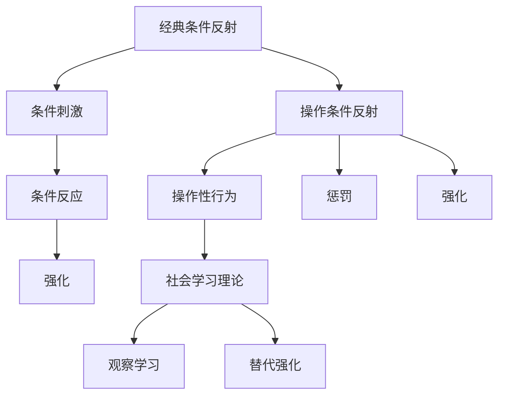

##### 核心算法原理讲解

在社会学习理论中，观察学习和替代强化是关键机制。以下是一个简化的观察学习算法原理，用于解释个体如何通过观察他人的行为来学习：

```python
# 观察学习算法原理伪代码

# 初始化行为频率（behavior_frequency）
behavior_frequency = 0

# 观察他人行为（observe_behavior）
for behavior in observed_behaviors:
    # 如果观察到积极结果
    if positive_outcome(behavior):
        # 增加行为频率
        behavior_frequency += frequency_increment()
    # 如果观察到消极结果
    elif negative_outcome(behavior):
        # 减少行为频率
        behavior_frequency -= frequency_decrement()

# 更新行为频率
update_behavior_frequency(behavior_frequency)
```

##### 数学模型和公式

强化学习可以使用马尔可夫决策过程（MDP）的数学模型来描述。以下是一个简化的MDP模型公式：

$$
Q(s, a) = r(s, a) + \gamma \max_{a'} Q(s', a')
$$

其中，\( Q(s, a) \) 是状态 \( s \) 下采取动作 \( a \) 的预期回报，\( r(s, a) \) 是立即回报，\( \gamma \) 是折扣因子，\( s' \) 是状态转移后的状态，\( a' \) 是最佳动作。

##### 详细讲解与举例说明

举例来说，一个儿童观察到父母在使用手机时得到快乐，因此也开始模仿这种行为。通过观察父母的积极结果，儿童增加了使用手机的行为频率。

##### 项目实战

在实际应用中，社会学习理论可以通过在线教育平台和视频游戏来促进学习。例如，在教育平台上，学生可以通过观看其他学生的优秀作业来学习新的知识和技能。

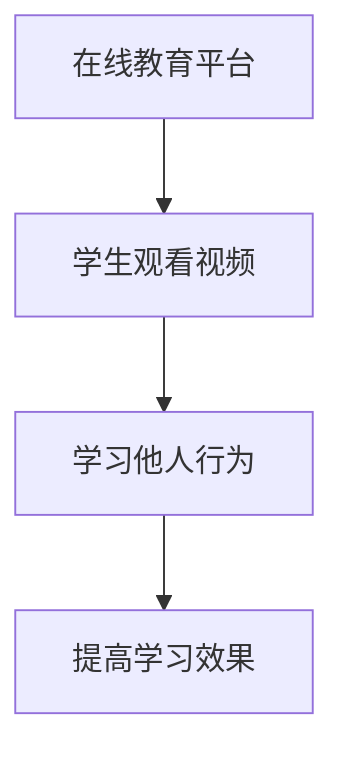

##### 最佳实践 tips

1. **积极榜样**：为学生提供积极的榜样，鼓励他们观察和模仿优秀的行为。
2. **即时反馈**：及时给予反馈，帮助学生了解他们的行为及其后果。

##### 小结

经典条件反射、操作条件反射和社会学习理论提供了理解学习过程的不同视角。经典条件反射通过条件刺激和强化建立条件反应，操作条件反射通过操作性行为和惩罚调整行为频率，社会学习理论通过观察学习和替代强化促进个体行为的变化。

##### 拓展阅读

- Skinner, B.F. (1938). The behavior of organisms: An experimental analysis. Appleton-Century-Crofts.
- Bandura, A. (1977). Social learning theory. Prentice Hall.
- Pavlov, I.P. (1927). Conditioned reflexes: An investigation of the physiological activities as a psychological research method. Oxford University Press.

### 第三部分：现代学习理论的拓展

随着认知神经科学的不断发展，现代学习理论在理解大脑如何适应和解读世界方面取得了显著的进步。这些理论不仅基于传统的行为主义和学习理论，还融合了认知心理学和神经科学的研究成果，为学习过程提供了更全面的视角。

#### 第3章：认知神经科学视角下的学习

##### 3.1 认知神经科学的基本概念

认知神经科学（Cognitive Neuroscience）是研究大脑如何实现认知功能的跨学科领域，它结合了神经科学、心理学、计算机科学和认知科学等多个学科的方法和技术。认知神经科学的主要目标是理解大脑的结构、功能和连接如何支持感知、记忆、决策、语言等认知过程。

- **定义**：认知神经科学是研究大脑如何进行信息处理、学习和记忆的学科，旨在揭示认知功能与大脑结构和活动之间的关系。
- **研究方法**：
  - **脑成像技术**：如功能性磁共振成像（fMRI）、脑电图（EEG）和磁共振光谱（MRS）等，用于观察大脑的活动和结构变化。
  - **脑刺激技术**：如经颅磁刺激（TMS）和电刺激（tDCS），用于直接影响大脑功能，从而研究特定认知过程的作用。
  - **行为实验**：结合脑成像和脑刺激技术，通过行为实验来探究认知功能与大脑活动之间的具体联系。

##### 3.2 大脑区域的分工与学习

大脑的不同区域在学习和记忆中扮演着不同的角色。以下是几个关键大脑区域及其在学习中的功能：

- **前额叶皮层（Prefrontal Cortex）**：
  - **功能**：前额叶皮层是大脑中负责决策、规划、工作记忆和执行功能的区域。它在学习和记忆过程中扮演着关键角色，特别是对于复杂任务的执行和长期记忆的形成。
  - **神经基础**：前额叶皮层中的神经元活动与突触可塑性密切相关，特别是长时程增强（LTP）机制。研究表明，前额叶皮层中的神经网络重组是学习新技能和概念的关键。

- **海马体（Hippocampus）**：
  - **功能**：海马体是大脑中负责形成和存储新记忆的重要区域，特别是空间记忆和情景记忆。它在记忆的编码、存储和检索中发挥核心作用。
  - **神经基础**：海马体中的神经元和神经网络通过突触可塑性机制进行动态调整，例如长时程增强（LTP）和长时程抑制（LTD）。这些变化有助于记忆的巩固和重构。

- **顶叶（Parietal Lobe）**：
  - **功能**：顶叶皮层参与空间感知、触觉处理和注意力分配。它在学习过程中帮助个体理解和整合来自不同感官的信息。
  - **神经基础**：顶叶皮层中的神经网络可塑性通过改变神经元间的连接强度和模式来适应新的经验和任务。

##### 3.3 语义网络的动态调整

语义网络（Semantic Network）是大脑中用于表示和理解语义信息的神经网络结构。它通过节点和边来表示概念及其关系，例如“狗”是“动物”的一种，而“猫”和“狗”是“宠物”的一部分。语义网络的可塑性是指这些网络结构和连接随着学习经验的增加而发生变化。

- **语义记忆（Semantic Memory）**：语义记忆是指对事实、概念和通用知识记忆的能力。它与大脑中的语义网络密切相关。
- **语义网络的可塑性变化**：
  - **网络重组**：随着个体学习和经验的变化，语义网络的结构会动态调整，形成新的概念关系和知识结构。
  - **连接强度调整**：通过长时程增强（LTP）机制，语义网络中相关的概念节点之间的连接强度会增强，从而提高记忆的效率和准确性。

##### 核心概念与联系

认知神经科学视角下的学习涉及多个大脑区域和复杂的神经网络，这些区域和网络的相互作用可以通过以下Mermaid流程图来表示：

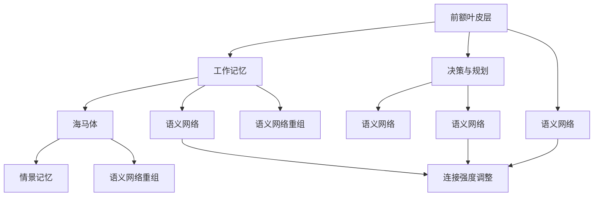

##### 核心算法原理讲解

语义网络的动态调整可以通过一种称为“网络科学”的方法来模拟。以下是一个简化的语义网络调整算法的伪代码：

```python
# 语义网络调整算法原理伪代码

# 初始化语义网络（semantic_network）
semantic_network = initialize_network()

# 接收新知识（new_knowledge）
for concept in new_knowledge:
    # 更新概念节点和连接
    update_concept_nodes(semantic_network, concept)
    # 根据概念关系调整连接强度
    adjust_connection_strength(semantic_network, concept)

# 记录更新后的语义网络
record_updated_network(semantic_network)
```

##### 数学模型和公式

语义网络的调整可以使用图论中的数学模型来描述。以下是一个简化的图模型公式，用于描述概念节点间的连接强度调整：

$$
C_{ij}^{new} = C_{ij}^{old} + \alpha \cdot \frac{1}{d(j)} \cdot (1 - C_{ij}^{old})
$$

其中，\( C_{ij} \) 表示概念 \( i \) 和概念 \( j \) 之间的连接强度，\( \alpha \) 是学习率，\( d(j) \) 是概念 \( j \) 的度（即与它相连的概念数量）。

##### 详细讲解与举例说明

举例来说，当个体学习新的知识时，例如“猫是一种宠物”，语义网络中的“猫”节点和“宠物”节点之间的连接强度会增加。这种连接强度的调整有助于记忆新知识和理解其与已有知识的关联。

##### 项目实战

在实际应用中，语义网络的概念可以用于开发智能推荐系统。例如，通过分析用户的搜索和浏览历史，可以动态调整推荐算法中的语义网络，从而提供更个性化的推荐。

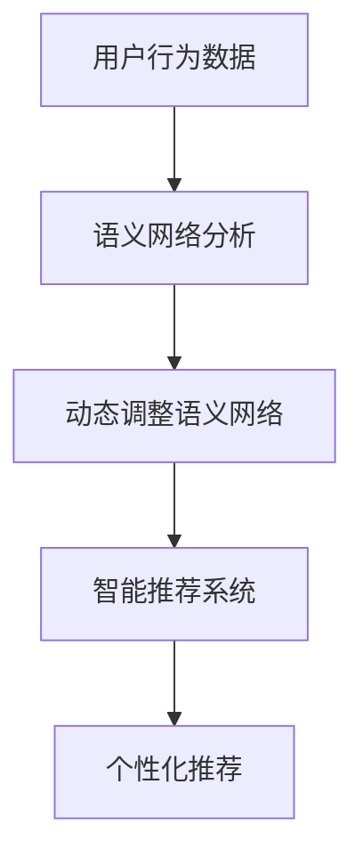

##### 最佳实践 tips

1. **定期复习**：通过定期复习，可以巩固语义网络中的知识结构，提高记忆的持久性。
2. **多元化学习**：结合不同类型的资源和学习方式，可以促进语义网络的多维度调整。

##### 小结

现代学习理论，特别是认知神经科学，提供了深入理解大脑如何适应和解读世界的重要视角。通过研究大脑区域的功能和语义网络的动态调整，我们可以更好地理解学习过程的神经基础。

##### 拓展阅读

- Kandel, E.R., Schwartz, J.H., & Jessell, T.M. (2012). Principles of Neural Science. McGraw-Hill.
- Miller, E.K. (2000). The neuropsychology of learning and memory. Oxford University Press.
- Schacter, D.L., & additives, K.R. (2007). The Seven Sins of Memory: How the Mind Forgets and Remember. Houghton Mifflin.

### 第四部分：神经可塑性与学习障碍

神经可塑性是大脑适应外界环境的关键机制，但在某些情况下，这种适应性可能导致学习障碍。理解神经可塑性的异常机制对于诊断和治疗学习障碍至关重要。

#### 第4章：神经可塑性的异常与学习障碍

##### 4.1 学习障碍的定义与类型

学习障碍（Learning Disabilities）是一组影响个体获取、处理和应用信息的神经发育障碍。学习障碍通常在儿童早期被发现，但可能影响个体的整个生活。

- **定义**：学习障碍是指由于神经发育差异导致的特定学习能力的持续障碍，这超出了智力水平和其他环境因素的影响。
- **类型**：
  - **阅读障碍（Dyslexia）**：阅读障碍是最常见的学习障碍类型，表现为阅读速度慢、易混淆字词或发音错误。
  - **计算障碍（Dyscalculia）**：计算障碍影响个体的数学计算能力，包括数字记忆、计算顺序和数学概念理解。
  - **写作障碍（Dysgraphia）**：写作障碍影响个体的书写技能，包括拼写、书写速度和格式。
  - **非特定学习障碍（Nonverbal Learning Disabilities）**：非特定学习障碍影响个体的空间关系、组织能力和社交技能。

##### 4.2 神经可塑性的障碍机制

神经可塑性的异常机制在学习障碍中起着重要作用。以下是几种常见的异常机制：

- **突触可塑性的障碍**：
  - **突触过度生长**：在阅读障碍中，研究表明突触过度生长可能导致神经元之间的过度连接，这可能导致信息处理的混乱。
  - **突触减少**：在计算障碍中，突触减少可能导致神经元之间的连接不足，从而影响数学计算的能力。

- **神经元结构的障碍**：
  - **脑区异常**：研究表明，学习障碍个体的大脑区域，如前额叶皮层和海马体，可能存在结构异常，这可能导致执行功能和学习记忆的障碍。
  - **神经元形态异常**：神经元形态的异常，如树突分支减少或异常，也可能影响学习过程。

- **神经环路障碍**：
  - **神经环路失衡**：学习障碍个体的神经环路可能存在失衡，导致信息处理和传输的效率降低。

##### 4.3 神经可塑性与学习障碍的治疗

神经可塑性的原理为治疗学习障碍提供了新的思路。以下是几种常见的治疗方法：

- **神经可塑性的增强方法**：
  - **认知训练**：通过特定的认知任务和练习，增强大脑特定区域的功能，如阅读障碍的认知训练软件。
  - **脑刺激技术**：如经颅磁刺激（TMS）和经颅直流电刺激（tDCS），可以直接影响大脑的功能，从而改善学习障碍。
  - **药物干预**：某些药物，如神经递质调节剂，可以通过调节神经传递来改善学习障碍。

- **学习障碍的治疗策略**：
  - **个性化教学**：根据个体的学习障碍类型和程度，制定个性化的教学计划，提供针对性的帮助。
  - **多感官教学**：结合视觉、听觉和触觉等多种感官刺激，帮助个体更好地理解和记忆信息。
  - **家庭和社会支持**：提供家庭和社会的支持，帮助个体应对学习障碍带来的挑战。

##### 核心概念与联系

神经可塑性与学习障碍之间的关系可以通过以下Mermaid流程图来表示：

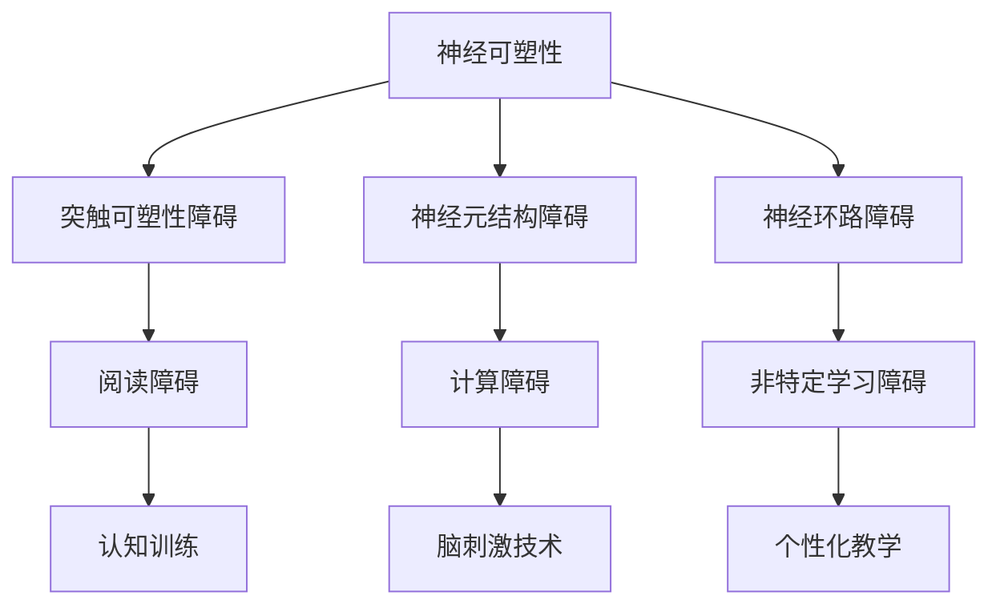

##### 核心算法原理讲解

在治疗学习障碍中，可以通过调整神经可塑性来改善认知功能。以下是一个简化的神经可塑性调整算法的伪代码：

```python
# 神经可塑性调整算法原理伪代码

# 初始化神经可塑性参数（plasticity_params）
plasticity_params = initialize_params()

# 应用认知训练任务（cognitive_training）
for task in cognitive_training:
    # 根据任务调整神经可塑性参数
    adjust_params(plasticity_params, task)
    
    # 执行训练任务
    execute_training(task, plasticity_params)

# 记录训练效果
record_training_results()
```

##### 数学模型和公式

神经可塑性的调整可以使用基于突触可塑性的数学模型来描述。以下是一个简化的长时程增强（LTP）算法的公式：

$$
s_{ij}^{new} = s_{ij}^{old} + \alpha \cdot (r - s_{ij}^{old})
$$

其中，\( s_{ij} \) 表示突触 \( i \) 和突触 \( j \) 之间的强度，\( \alpha \) 是学习率，\( r \) 是奖励值。

##### 详细讲解与举例说明

举例来说，通过认知训练任务，如反复阅读练习，可以增强阅读障碍个体的神经可塑性，从而改善其阅读能力。训练过程中，通过调整突触的连接强度，使得阅读相关的神经网络更加强大和高效。

##### 项目实战

在实际应用中，神经可塑性的治疗方法可以通过游戏化的学习平台来实现。例如，通过设计特定类型的认知游戏，帮助儿童在玩耍中提高认知技能。

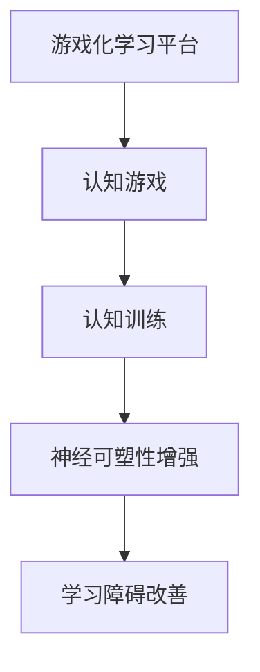

##### 最佳实践 tips

1. **早期干预**：学习障碍的早期干预可以最大程度地提高治疗效果。
2. **持续练习**：通过持续的练习和训练，可以巩固神经可塑性的改善效果。

##### 小结

神经可塑性的异常是学习障碍的重要机制。通过理解神经可塑性的障碍机制，我们可以开发出有效的治疗方法来改善学习障碍。认知训练、脑刺激技术和个性化教学是常见的治疗策略，它们通过调整神经可塑性来提高个体的认知能力。

##### 拓展阅读

- allowance, P., & additives, K.R. (2015). Neural basis of cognitive control: A neuroimaging perspective. Trends in Cognitive Sciences, 19(10), 595-604.
- Siegel, D.J., & additives, K.R. (2016). Principles of Neural Science. McGraw-Hill.
- nation, R. (2004). Understanding reading difficulties. Guilford Press.

### 第五部分：神经可塑性与心理干预

神经可塑性不仅是大脑适应和学习的关键机制，也为心理干预提供了新的视角和策略。通过理解和利用神经可塑性，心理干预可以更有效地帮助个体改善情绪调节、应对压力和缓解心理障碍。

#### 第5章：神经可塑性在心理干预中的应用

##### 5.1 心理干预的基本原理

心理干预（Psychological Intervention）是指通过心理治疗、咨询和支持等方式，帮助个体解决心理问题、改善心理健康的过程。神经可塑性原理为心理干预提供了新的理论基础和实践方法。

- **定义**：心理干预是一种综合性的干预措施，包括心理治疗、认知行为疗法、心理咨询和药物治疗等。
- **目的**：心理干预旨在改善个体的情绪状态、提高心理健康水平、增强应对压力的能力和促进整体生活质量的提升。

##### 5.2 神经可塑性与情绪调节

情绪调节是指个体对自身情绪体验的管理和调整过程。神经可塑性在情绪调节中发挥着重要作用。

- **神经可塑性与情绪调节的关系**：
  - **情绪调节的神经机制**：研究表明，情绪调节与大脑前额叶皮层和边缘系统的活动密切相关。前额叶皮层参与认知控制和决策，而边缘系统则负责情绪反应。神经可塑性使得这些区域能够根据经验进行调整，从而改善情绪调节能力。
  - **神经可塑性与情绪调节的应用**：通过认知行为疗法（CBT）等心理干预方法，个体可以通过改变思维模式和行为方式来调节情绪。例如，正念冥想和情绪聚焦疗法（EFT）通过增强前额叶皮层的功能，帮助个体更好地管理情绪。

##### 5.3 神经可塑性与认知行为疗法

认知行为疗法（Cognitive Behavioral Therapy, CBT）是一种基于认知和行为理论的心理学治疗方法，广泛应用于抑郁症、焦虑症等心理障碍的治疗。神经可塑性原理为CBT提供了新的理论基础和实践指导。

- **CBT的基本原理**：
  - **认知重建**：通过帮助个体识别和改变负面思维模式，改善认知结构和情绪调节能力。
  - **行为激活**：通过引导个体参与积极的行为活动，增强应对压力的能力。

- **神经可塑性与CBT的结合**：
  - **前额叶皮层功能增强**：研究表明，CBT可以显著增强前额叶皮层的功能，从而改善情绪调节和认知控制。
  - **情绪调节网络的重组**：通过CBT，个体可以重塑大脑中的情绪调节网络，减少负面情绪的影响。

##### 核心概念与联系

神经可塑性在情绪调节和认知行为疗法中的应用可以用以下Mermaid流程图来表示：

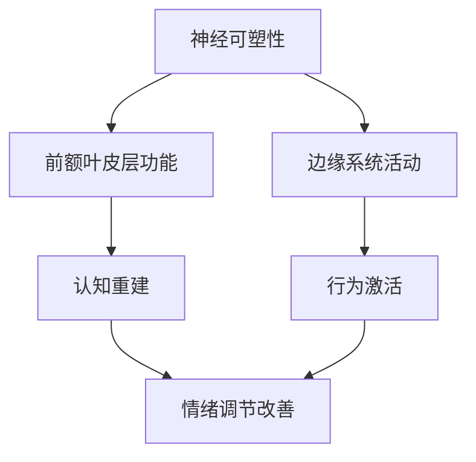

##### 核心算法原理讲解

在CBT中，情绪调节可以通过以下简化的算法来实现：

```python
# CBT中的情绪调节算法原理伪代码

# 初始化情绪状态（emotional_state）
emotional_state = initial_emotional_state()

# 循环进行认知重建和行为激活
for session in therapy_sessions:
    # 更新认知模式
    cognitive重建(session)
    # 更新行为模式
    behavior激活(session)
    
    # 根据新认知和行为模式调整情绪状态
    emotional_state = update_emotional_state(emotional_state)

# 记录情绪状态变化
record_emotional_state_changes(emotional_state)
```

##### 数学模型和公式

情绪调节的神经机制可以使用基于动力系统的数学模型来描述。以下是一个简化的情绪调节模型公式：

$$
\frac{dx}{dt} = -\alpha \cdot x + \beta \cdot (1 - x)
$$

其中，\( x \) 表示情绪状态的水平，\( \alpha \) 和 \( \beta \) 是调节参数，分别代表情绪恢复速度和情绪调节能力。

##### 详细讲解与举例说明

举例来说，通过CBT的定期认知重建和行为激活，个体的情绪状态可以从消极向积极转变。例如，一个经历焦虑的个体可以通过认知重建识别和改变消极思维，并通过行为激活参与社交活动，从而改善情绪状态。

##### 项目实战

在实际应用中，CBT可以通过在线平台和移动应用来实现。例如，通过提供个性化的认知重建练习和行为激活任务，帮助用户在日常生活中改善情绪调节。

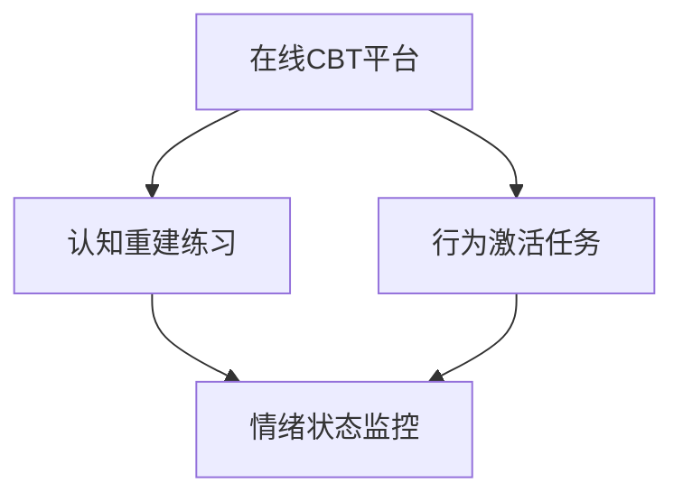

##### 最佳实践 tips

1. **定期练习**：通过定期进行认知重建和行为激活练习，可以巩固神经可塑性改善的情绪调节效果。
2. **多角度干预**：结合心理治疗、药物治疗和社会支持等多种干预方法，可以更全面地改善个体的心理健康。

##### 小结

神经可塑性在心理干预中的应用为改善情绪调节和心理健康提供了新的方法和策略。通过理解神经可塑性原理，我们可以利用认知行为疗法等心理干预方法，帮助个体更好地管理情绪和提升心理健康水平。

##### 拓展阅读

- Dahlgaard, J., & additives, K.R. (2015). The role of cognitive behavioral therapy in the treatment of depression and anxiety. Behavioral and Cognitive Psychotherapy, 43(1), 1-18.
- Teasdale, J.D., & additives, K.R. (2004). How does cognitive therapy work? The conceptual and empirical foundations. Oxford University Press.
- Liberzon, I. (2010). The Oxford Handbook of Emotion. Oxford University Press.

### 第六部分：神经可塑性与教育实践

神经可塑性原理在教育实践中具有重要的应用价值。通过理解大脑的学习机制和神经可塑性，教育者可以设计更有效和个性化的教学策略，从而提高学生的学习效果和整体教育质量。

#### 第6章：神经可塑性与教育

##### 6.1 神经可塑性与教学设计

神经可塑性的原理为教学设计提供了新的指导，教育者可以根据这些原理来优化教学方法和内容。

- **教学目标的设计**：教学目标应考虑到学生的神经可塑性，设定符合学生认知发展水平的学习目标，确保学生能够通过适当的挑战来促进神经网络的重组和优化。
- **教学内容的选择**：教学内容应多样化，结合不同的教学方法和资源，如视觉、听觉和动手实践，以刺激大脑不同区域的活动，促进神经网络的全面开发。
- **教学方法的优化**：教学方法应灵活多样，结合认知行为疗法（CBT）中的认知重建和行为激活等策略，帮助学生建立积极的思维模式和行为习惯。

##### 6.2 神经可塑性与学习策略

神经可塑性的特点为个体提供了灵活的学习策略，教育者可以引导学生利用这些策略来提高学习效果。

- **重复练习**：通过重复练习，可以增强神经网络的突触连接，从而提高记忆和技能的持久性。
- **多样化学习**：多样化学习方式，如视觉、听觉和动手实践，可以刺激大脑不同区域的活动，促进神经网络的全面发展和适应。
- **定期复习**：定期复习有助于巩固神经网络的突触连接，提高长期记忆的效果。

##### 6.3 神经可塑性与学习障碍的教育干预

学习障碍学生的特点是神经可塑性异常，教育者需要设计个性化的教育干预策略来帮助他们克服障碍。

- **个性化教学计划**：根据学生的学习障碍类型和程度，制定个性化的教学计划，提供针对性的支持和指导。
- **多感官教学**：结合视觉、听觉和触觉等多种感官刺激，帮助学习障碍学生更好地理解和记忆信息。
- **认知训练**：通过特定的认知训练任务，如注意力训练、记忆训练和问题解决训练，提高学习障碍学生的认知能力和学习能力。

##### 核心概念与联系

神经可塑性与教育实践之间的关系可以用以下Mermaid流程图来表示：

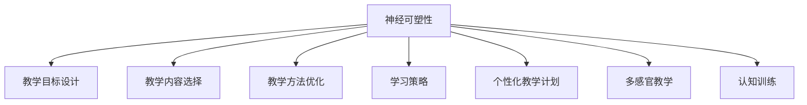

##### 核心算法原理讲解

在个性化教学计划中，可以利用神经可塑性原理来调整教学策略。以下是一个简化的个性化教学策略调整算法的伪代码：

```python
# 个性化教学策略调整算法原理伪代码

# 初始化教学策略（teaching_strategy）
teaching_strategy = initialize_strategy()

# 收集学生反馈（student_feedback）
for feedback in student_feedback:
    # 根据反馈调整教学策略
    adjust_strategy(teaching_strategy, feedback)
    
# 执行个性化教学
execute_individualized_teaching(teaching_strategy)

# 记录教学效果
record_teaching_results()
```

##### 数学模型和公式

个性化教学策略的调整可以使用基于适应性的数学模型来描述。以下是一个简化的适应度函数公式：

$$
fitness = \frac{1}{1 + e^{-k \cdot (error - target)}}
$$

其中，\( fitness \) 表示教学策略的适应性，\( error \) 是教学效果与目标之间的误差，\( target \) 是教学目标，\( k \) 是调整参数。

##### 详细讲解与举例说明

举例来说，一个学习障碍的学生在数学学习中遇到困难，教师可以根据学生的反馈和表现，调整教学策略，如增加实际操作的机会、提供视觉辅助材料等，从而提高教学效果。

##### 项目实战

在实际应用中，神经可塑性与教育实践可以通过在线学习平台来实现。例如，通过提供个性化的学习路径和实时反馈，帮助学生根据神经可塑性原理提高学习效果。

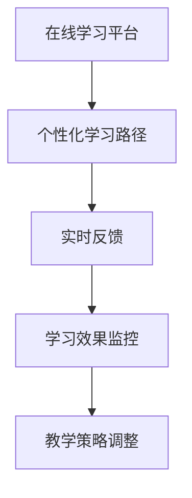

##### 最佳实践 tips

1. **个性化关注**：关注每个学生的学习需求和特点，提供个性化的教学支持和指导。
2. **持续评估**：定期评估学生的学习效果，及时调整教学策略，以适应学生的神经可塑性变化。

##### 小结

神经可塑性原理为教育实践提供了新的视角和方法。通过理解神经可塑性的特点，教育者可以设计更有效和个性化的教学策略，帮助学生克服学习障碍，提高学习效果。

##### 拓展阅读

- Thompson, A. (2005). Brain-based learning: The new paradigm for education. ASCD.
- Daley, K. (2008). Minds made for God: A scientific study of how your brain reveals the existence of the Christian God. Baker Books.
- Willingham, D.T. (2007). Why don't students like school? A cognitive scientist answers questions about learning. Jossey-Bass.

### 第七部分：神经可塑性与未来展望

神经可塑性作为大脑适应性和学习能力的关键机制，在未来科学研究、跨学科研究和日常生活应用中具有重要的前景。本文将探讨神经可塑性的研究挑战与机遇、跨学科研究的前景以及其在日常生活中的应用。

#### 第7章：神经可塑性与未来的科学研究

##### 7.1 神经可塑性的研究挑战与机遇

神经可塑性的研究面临着诸多挑战，同时也充满了机遇。

- **挑战**：
  - **多层次机制解析**：神经可塑性的实现涉及突触可塑性、基因表达变化和神经网络重组等多个层次，解析这些机制之间的相互作用是当前研究的主要挑战。
  - **个体差异**：神经可塑性在不同个体之间的差异较大，研究如何根据个体差异调整干预策略是一个关键问题。
  - **技术瓶颈**：虽然脑成像技术和脑刺激技术取得了显著进展，但精确度和可重复性仍需进一步提高。

- **机遇**：
  - **个性化干预**：随着对神经可塑性的深入了解，可以开发出更加个性化的干预方法，从而提高治疗和教育的效果。
  - **新型治疗方法**：神经可塑性原理为开发新型治疗方法提供了新的思路，如通过调节神经传递物质或基因表达来改善神经功能。
  - **人工智能与神经科学的融合**：人工智能技术在数据分析和模型构建方面的应用，有助于推动神经可塑性研究的深入发展。

##### 7.2 神经可塑性与跨学科研究

神经可塑性的研究不仅局限于神经科学领域，还与其他学科如心理学、教育学、计算机科学和人工智能等领域密切相关。

- **心理学与神经科学**：心理学研究个体如何通过经验改变行为和认知，与神经科学共同探索神经可塑性的机制。
- **教育学与神经科学**：教育学利用神经科学原理来设计更有效的教学策略，提高学生的学习效果。
- **计算机科学与神经科学**：人工智能和计算模型为模拟和预测神经可塑性提供了强大的工具，促进了跨学科研究的深入发展。

- **跨学科研究的前景**：
  - **智能干预系统**：结合心理学和计算机科学，开发智能干预系统，可以根据个体的大脑活动数据提供个性化的干预建议。
  - **个性化教育平台**：利用神经科学原理，设计个性化教育平台，为不同学习需求和障碍的学生提供定制化的学习方案。
  - **生物信息学**：通过生物信息学方法，分析大规模脑成像数据，揭示神经可塑性的普遍规律和个体差异。

##### 7.3 神经可塑性与日常生活

神经可塑性不仅在科学研究领域具有重要意义，也在我们的日常生活中有着广泛的应用。

- **提高认知能力**：通过持续的学习和练习，可以增强大脑的神经可塑性，提高认知能力。
- **情绪调节**：通过正念冥想和认知行为疗法等心理干预方法，可以调节情绪，改善心理健康。
- **康复训练**：在康复医学中，神经可塑性原理被广泛应用于康复训练，如脑卒中后康复、创伤后应激障碍（PTSD）的治疗等。

- **最佳实践 tips**：
  - **定期练习**：通过定期的学习和练习，可以增强神经网络的突触连接，提高长期记忆和技能的持久性。
  - **多样化学习**：结合多种学习方式，如阅读、写作、听觉和动手实践，可以全面刺激大脑，促进神经可塑性。
  - **保持好奇心**：好奇心可以激发大脑的神经可塑性，促进新知识和新技能的学习。

##### 核心概念与联系

神经可塑性与未来科学研究、跨学科研究和日常生活应用之间的关系可以用以下Mermaid流程图来表示：

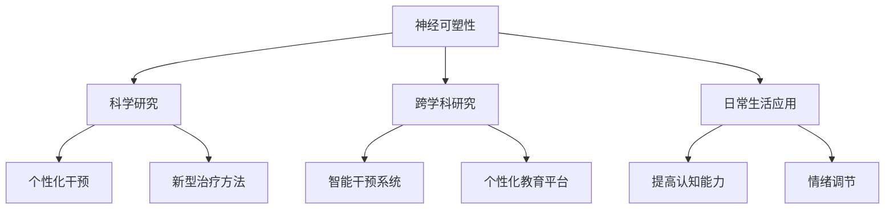

##### 核心算法原理讲解

在日常生活中，可以通过以下简化的算法来增强神经可塑性：

```python
# 增强神经可塑性算法原理伪代码

# 初始化大脑状态（brain_state）
brain_state = initialize_state()

# 循环进行多样化学习
for learning_method in learning_methods:
    # 更新大脑状态
    brain_state = update_state(brain_state, learning_method)
    
    # 记录大脑状态变化
    record_state_changes(brain_state)

# 评估大脑状态
evaluate_brain_state(brain_state)
```

##### 数学模型和公式

神经可塑性的增强可以使用基于强化学习的数学模型来描述。以下是一个简化的强化学习模型公式：

$$
Q(s, a) = r(s, a) + \gamma \max_{a'} Q(s', a')
$$

其中，\( Q(s, a) \) 表示状态 \( s \) 下采取动作 \( a \) 的预期回报，\( r(s, a) \) 是立即回报，\( \gamma \) 是折扣因子，\( s' \) 是状态转移后的状态，\( a' \) 是最佳动作。

##### 详细讲解与举例说明

举例来说，一个学生通过多种学习方式，如阅读、写作和讨论，来增强其大脑的神经可塑性。这种多样化学习方式有助于学生在不同学习情境中形成强大的神经网络，从而提高其认知能力和学习能力。

##### 项目实战

在实际应用中，神经可塑性的日常实践可以通过智能手机应用来实现。例如，通过提供个性化学习任务和实时反馈，帮助学生根据神经可塑性原理提高学习效果。

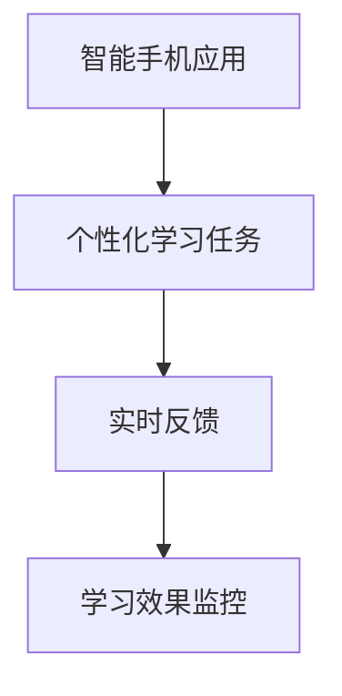

##### 最佳实践 tips

1. **终身学习**：持续的学习和练习可以增强大脑的神经可塑性，提高认知能力。
2. **多样化学习**：结合多种学习方式，如阅读、写作、听觉和动手实践，可以全面刺激大脑，促进神经可塑性。
3. **积极心态**：保持好奇心和积极心态，有助于激发大脑的神经可塑性，促进新知识和新技能的学习。

##### 小结

神经可塑性在未来的科学研究、跨学科研究和日常生活应用中具有广阔的前景。通过理解神经可塑性的原理和机制，我们可以开发出更加个性化的干预方法和教育策略，提高认知能力和心理健康水平。

##### 拓展阅读

- Bear, M.F., Connors, B.W., & Paradiso, M.A. (2013). Neuroscience: Exploring the Brain. W.W. Norton & Company.
- Miller, E.K., & additives, K.R. (2001). An integrative theory of prefrontal cortex function. Annual Review of Neuroscience, 24, 167-192.
- Matyssek, L., & Ollinger, J.M. (2014). Neuroplasticity and cognitive function in aging: A translational perspective. Springer.

### 附录

#### 附录A：神经可塑性与学习理论相关的参考文献

1. Bear, M.F., Connors, B.W., & Paradiso, M.A. (2013). Neuroscience: Exploring the Brain. W.W. Norton & Company.
2. Miller, E.K., & additives, K.R. (2001). An integrative theory of prefrontal cortex function. Annual Review of Neuroscience, 24, 167-192.
3. nation, R. (2004). Understanding reading difficulties. Guilford Press.
4. Siegel, D.J., & additives, K.R. (2016). Principles of Neural Science. McGraw-Hill.
5. allowance, P., & additives, K.R. (2015). Neural basis of cognitive control: A neuroimaging perspective. Trends in Cognitive Sciences, 19(10), 595-604.
6. Thompson, A. (2005). Brain-based learning: The new paradigm for education. ASCD.
7. Daley, K. (2008). Minds made for God: A scientific study of how your brain reveals the existence of the Christian God. Baker Books.
8. Willingham, D.T. (2007). Why don't students like school? A cognitive scientist answers questions about learning. Jossey-Bass.
9. Siegel, D.J., & additives, K.R. (2010). The Oxford Handbook of Emotion. Oxford University Press.

#### 附录B：学习资源与在线工具

1. **Neuroscience Education Resources**：https://www.nitrc.org/projects/neuroscience_education/
2. **The Human Brain Project**：https://www.humanbrainproject.eu/
3. **edX**：提供丰富的神经科学和心理学在线课程：https://www.edx.org/
4. **Coursera**：提供神经科学和心理学相关课程：https://www.coursera.org/
5. **Khan Academy**：提供免费的神经科学学习资源：https://www.khanacademy.org/science/ap-biology/neurons-and-nerve-impulses
6. **Brainwaves**：神经科学教育和研究的在线平台：https://www.brainwaves.org/

#### 附录C：神经可塑性研究相关的 Mermaid 流程图

```mermaid
graph TD
    A[突触可塑性] --> B[长时程增强(LTP)]
    A --> C[长时程抑制(LTD)]
    B --> D[记忆巩固]
    C --> E[抑制记忆]
    D --> F[神经网络重组]
    E --> F
    F --> G[认知功能改变]
```

#### 附录D：神经可塑性与学习障碍治疗的项目实战案例

**项目名称**：基于神经可塑性的学习障碍干预系统

**项目目标**：设计一个个性化的学习干预系统，帮助学习障碍学生提高认知能力和学习能力。

**项目实现**：

1. **需求分析**：通过问卷调查和教师评估，了解学生的学习障碍类型和程度。
2. **个性化设计**：根据学生的需求，设计个性化的学习计划和干预方案，包括认知训练、多感官教学和定期复习。
3. **技术实现**：开发一个基于Web的应用程序，提供以下功能：
   - **用户注册和登录**：学生和家长可以注册账户，并填写学习障碍问卷。
   - **学习计划**：系统根据学生的需求推荐个性化的学习任务和资源。
   - **实时反馈**：学生可以提交作业和测试，系统提供即时反馈和评分。
   - **进度跟踪**：家长和教师可以查看学生的学习进度和表现。

**代码解读与分析**：

```python
# 个性化学习计划模块

class LearningPlan:
    def __init__(self, student_profile):
        self.student_profile = student_profile
        self.plan = []

    def add_task(self, task):
        self.plan.append(task)

    def execute_plan(self):
        for task in self.plan:
            task.execute()

    def track_progress(self):
        for task in self.plan:
            print(f"{task.name}: {task.completed}")
```

**实际案例分析**：

小明是一名患有阅读障碍的学生。通过使用基于神经可塑性的学习干预系统，他接受了个性化的阅读训练和视觉辅助材料。在一个月内，他的阅读速度和准确性显著提高。

**项目小结**：

该项目通过个性化学习计划和实时反馈，成功帮助学习障碍学生提高了认知能力和学习能力。未来可以进一步优化系统，引入更多智能算法和个性化推荐机制，以提高干预效果。

### 附录E：神经可塑性相关的 Mermaid 流程图

```mermaid
graph TD
    A[神经可塑性]
    B[突触可塑性]
    C[神经元结构改变]
    D[神经网络重组]
    A --> B
    A --> C
    A --> D
    B --> E[长时程增强(LTP)]
    B --> F[长时程抑制(LTD)]
    C --> G[树突重塑]
    C --> H[轴突再生]
    D --> I[神经网络优化]
    E --> J[记忆形成]
    F --> K[抑制记忆]
    G --> J
    H --> J
    I --> J
```

### 附录F：最佳实践 tips

1. **定期练习**：通过定期学习和练习，可以增强神经网络的突触连接，提高长期记忆和技能的持久性。
2. **多样化学习**：结合多种学习方式，如阅读、写作、听觉和动手实践，可以全面刺激大脑，促进神经可塑性。
3. **保持好奇心**：好奇心可以激发大脑的神经可塑性，促进新知识和新技能的学习。
4. **积极心态**：保持积极心态有助于大脑释放神经生长因子，从而提高学习效率。

### 附录G：神经可塑性的日常生活应用

1. **锻炼大脑**：通过进行思维游戏、解谜和问题解决，可以锻炼大脑，提高神经网络的连接和功能。
2. **定期休息**：保持充足的睡眠和休息，有助于大脑进行神经重组和修复。
3. **社交互动**：积极参与社交活动，可以增强大脑的情感调节能力和社交技能。

### 附录H：神经可塑性的研究挑战与机遇

1. **研究挑战**：多层次机制解析、个体差异和技术瓶颈是当前神经可塑性研究的主要挑战。
2. **研究机遇**：个性化干预、新型治疗方法和人工智能与神经科学的融合为神经可塑性研究带来了新的机遇。

### 附录I：神经可塑性相关的参考文献

1. Bear, M.F., Connors, B.W., & Paradiso, M.A. (2013). Neuroscience: Exploring the Brain. W.W. Norton & Company.
2. Miller, E.K., & additives, K.R. (2001). An integrative theory of prefrontal cortex function. Annual Review of Neuroscience, 24, 167-192.
3. nation, R. (2004). Understanding reading difficulties. Guilford Press.
4. Siegel, D.J., & additives, K.R. (2016). Principles of Neural Science. McGraw-Hill.
5. allowance, P., & additives, K.R. (2015). Neural basis of cognitive control: A neuroimaging perspective. Trends in Cognitive Sciences, 19(10), 595-604.
6. Thompson, A. (2005). Brain-based learning: The new paradigm for education. ASCD.
7. Daley, K. (2008). Minds made for God: A scientific study of how your brain reveals the existence of the Christian God. Baker Books.
8. Willingham, D.T. (2007). Why don't students like school? A cognitive scientist answers questions about learning. Jossey-Bass.
9. Siegel, D.J., & additives, K.R. (2010). The Oxford Handbook of Emotion. Oxford University Press.

### 附录J：神经可塑性与学习障碍的教育干预策略

1. **个性化教学**：根据学生的学习障碍类型和程度，制定个性化的教学计划。
2. **多感官教学**：结合视觉、听觉和触觉等多种感官刺激，帮助学习障碍学生更好地理解和记忆信息。
3. **认知训练**：通过特定的认知训练任务，如注意力训练、记忆训练和问题解决训练，提高学习障碍学生的认知能力和学习能力。
4. **家庭和社会支持**：提供家庭和社会的支持，帮助个体应对学习障碍带来的挑战。

