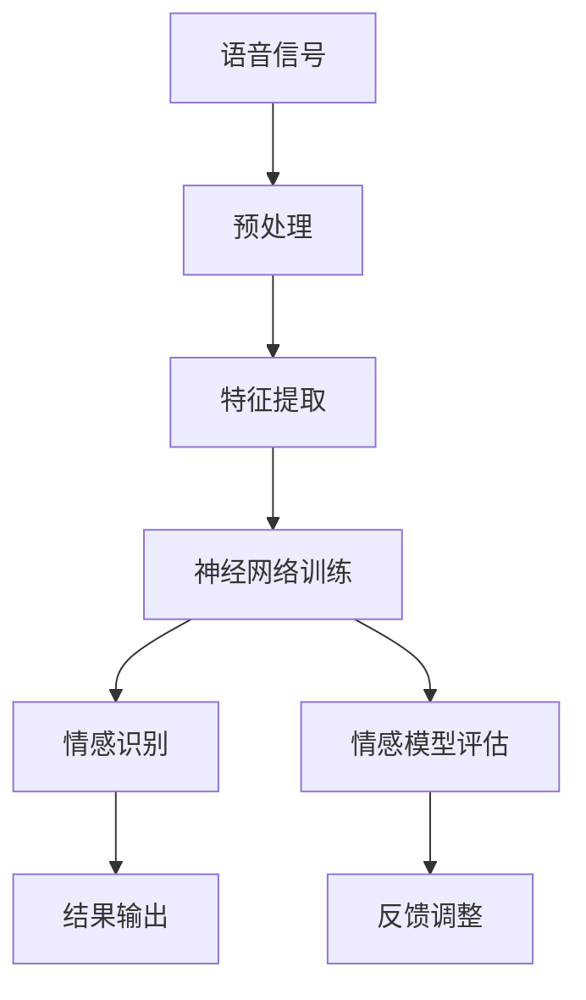

                 

### 文章标题：神经网络在语音情感识别中的创新应用

关键词：神经网络，语音情感识别，深度学习，情感分类，语音特征提取，模型优化，跨学科应用

摘要：随着人工智能技术的快速发展，语音情感识别成为了情感分析领域的重要研究方向。本文将深入探讨神经网络在语音情感识别中的应用，从理论基础到实际案例，全面解析这一领域的创新应用和技术挑战。

---

## 目录大纲

1. **背景介绍**
2. **核心概念与联系**
3. **核心算法原理讲解**
4. **数学模型和公式**
5. **项目实战**
6. **最佳实践 tips**
7. **小结与注意事项**
8. **拓展阅读**

---

### 1. 背景介绍

语音情感识别作为人工智能和情感计算的重要分支，旨在通过分析语音信号来识别和分类情感状态。这一领域的研究具有广泛的应用前景，包括但不限于：

- **心理学研究**：了解个体在不同情境下的情感表达和情绪变化。
- **教育领域**：辅助教师了解学生的情感状态，提高教育质量。
- **商业领域**：通过客户语音分析提供更个性化的服务。
- **医疗健康**：辅助心理医生进行心理健康评估。

传统的语音情感识别方法主要依赖于手工设计的特征和规则，这种方法存在特征选择困难、模型适应性差等问题。随着深度学习技术的兴起，神经网络尤其是卷积神经网络（CNN）和循环神经网络（RNN）在语音情感识别中展现出强大的能力。本文将探讨神经网络在这一领域的创新应用，从理论基础到实际案例，全面解析其工作原理和技术挑战。

---

### 2. 核心概念与联系

要深入理解神经网络在语音情感识别中的应用，首先需要掌握以下几个核心概念：

- **神经网络**：一种模仿人脑神经元连接的算法模型，能够通过训练学习复杂的非线性关系。
- **语音信号处理**：涉及对语音信号进行预处理、特征提取和建模，以便于神经网络进行情感识别。
- **情感识别**：根据语音信号中的情感特征，将其分类为不同的情感类别，如喜悦、愤怒、悲伤等。

为了更直观地展示这些概念之间的联系，我们可以使用 Mermaid 流程图来描绘它们的工作流程：



在上面的流程图中，语音信号经过预处理和特征提取后，输入到神经网络中进行训练。训练完成后，模型会对输入的语音信号进行情感识别，并将结果输出。模型的性能通过评估和反馈进行调整，从而不断提高识别准确率。

---

### 3. 核心算法原理讲解

#### 3.1 神经网络基础

神经网络由大量的神经元组成，每个神经元接收多个输入信号，并通过权重将这些信号加权求和，最后通过激活函数产生输出。以下是神经网络的基本构成和原理：

- **神经元**：神经网络的基本计算单元，类似于人脑的神经元。
- **层**：神经网络包括输入层、隐藏层和输出层，每个层由多个神经元组成。
- **权重**：连接神经元之间的参数，用于调整输入信号的强度。
- **激活函数**：用于引入非线性特性，常见的激活函数包括 sigmoid、ReLU 等。

以下是神经网络的前向传播和反向传播算法的伪代码：

```python
# 前向传播
def forward_propagation(x, W, b, activation_function):
    z = np.dot(x, W) + b
    if activation_function == 'sigmoid':
        a = 1 / (1 + np.exp(-z))
    elif activation_function == 'ReLU':
        a = np.maximum(0, z)
    return a

# 反向传播
def backward_propagation(a, z, dZ, dW, db):
    if activation_function == 'sigmoid':
        dZ = a * (1 - a)
    elif activation_function == 'ReLU':
        dZ = a * (1 - np.maximum(0, a))
    dW = dZ * x
    db = dZ
    return dW, db
```

#### 3.2 语音特征提取

语音特征提取是语音情感识别的关键步骤，常用的特征包括梅尔频率倒谱系数（MFCC）、短时傅里叶变换（STFT）等。以下是一个简单的 MFCC 特征提取的伪代码：

```python
# MFCC 特征提取
def extract_mfcc(signal, sampling_rate, n_filter, n_coeff, frame_size, frame_step):
    # 对信号进行分帧
    frames = frame(signal, frame_size, frame_step)
    # 对每个帧进行短时傅里叶变换
    stft = stft_transform(frames)
    # 计算功率谱
    power_spectrum = abs(stft)**2
    # 计算滤波器组响应
    filter_response = filter_bank_response(n_filter, n_coeff, power_spectrum)
    # 计算倒谱系数
    mfcc = log(filter_response)
    return mfcc
```

#### 3.3 声学模型

声学模型是语音情感识别的核心，用于将语音信号转换为情感分类器可理解的中间表示。常用的声学模型包括循环神经网络（RNN）和长短期记忆网络（LSTM）。以下是 LSTM 基本结构的伪代码：

```python
# LSTM 单元
class LSTMCell():
    def __init__(self, input_size, hidden_size):
        self.input_size = input_size
        self.hidden_size = hidden_size
        # 初始化权重和偏置
        # ...
    
    def forward(self, x, h_prev, c_prev):
        # 计算输入门、遗忘门和输出门
        # ...
        # 更新隐藏状态和细胞状态
        # ...
        return h, c

# LSTM 网络
class LSTM():
    def __init__(self, input_size, hidden_size, num_layers):
        self.input_size = input_size
        self.hidden_size = hidden_size
        self.num_layers = num_layers
        # 初始化权重和偏置
        # ...

    def forward(self, x):
        # 对每个时间步进行前向传播
        # ...
        return h
```

---

### 4. 数学模型和公式

在语音情感识别中，数学模型和公式至关重要，以下将介绍一些核心的数学公式及其应用场景。

#### 4.1 激活函数

激活函数是神经网络中引入非线性特性的关键，以下是一些常用的激活函数及其公式：

- **Sigmoid 函数**：
  $$\sigma(z) = \frac{1}{1 + e^{-z}}$$

- **ReLU 函数**：
  $$\text{ReLU}(z) = \max(0, z)$$

#### 4.2 损失函数

损失函数用于衡量预测值与真实值之间的差距，以下是一些常用的损失函数：

- **交叉熵损失函数**：
  $$\text{Loss} = -\sum_{i} y_i \log(\hat{y}_i)$$
  其中，$y_i$ 是真实标签，$\hat{y}_i$ 是预测概率。

#### 4.3 优化算法

优化算法用于调整网络中的权重和偏置，以最小化损失函数。以下是一些常用的优化算法：

- **随机梯度下降（SGD）**：
  $$w_{t+1} = w_t - \alpha \cdot \nabla_w J(w_t)$$
  其中，$w_t$ 是当前权重，$\alpha$ 是学习率，$J(w_t)$ 是损失函数。

- **Adam 优化器**：
  $$m_t = \beta_1 m_{t-1} + (1 - \beta_1) \nabla_w J(w_t)$$
  $$v_t = \beta_2 v_{t-1} + (1 - \beta_2) (\nabla_w J(w_t))^2$$
  $$\hat{m}_t = \frac{m_t}{1 - \beta_1^t}$$
  $$\hat{v}_t = \frac{v_t}{1 - \beta_2^t}$$
  $$w_{t+1} = w_t - \alpha \cdot \hat{m}_t / (\sqrt{\hat{v}_t} + \epsilon)$$

其中，$\beta_1$ 和 $\beta_2$ 分别是动量参数，$\epsilon$ 是一个很小的常数。

---

### 5. 项目实战

#### 5.1 开发环境搭建

在进行语音情感识别项目开发之前，需要搭建合适的技术栈。以下是推荐的开发环境：

- **编程语言**：Python
- **深度学习框架**：TensorFlow 2.x 或 PyTorch
- **语音处理库**：Librosa
- **数据处理库**：NumPy、Pandas

#### 5.2 代码实现与调试

以下是一个简单的语音情感识别项目的实现框架：

```python
# 导入必要的库
import librosa
import numpy as np
import tensorflow as tf
from tensorflow.keras.models import Sequential
from tensorflow.keras.layers import LSTM, Dense, Dropout

# 读取语音数据
def read_audio(file_path):
    signal, sampling_rate = librosa.load(file_path, sr=None)
    return signal, sampling_rate

# 提取特征
def extract_features(signal, sampling_rate):
    # 对信号进行预处理和分帧
    # ...
    # 提取 MFCC 特征
    mfcc = librosa.feature.mfcc(y=signal, sr=sampling_rate, n_mfcc=13)
    return mfcc

# 构建神经网络模型
model = Sequential([
    LSTM(128, activation='relu', return_sequences=True, input_shape=(None, 13)),
    Dropout(0.2),
    LSTM(128, activation='relu', return_sequences=False),
    Dropout(0.2),
    Dense(6, activation='softmax')
])

# 编译模型
model.compile(optimizer='adam', loss='categorical_crossentropy', metrics=['accuracy'])

# 训练模型
model.fit(x_train, y_train, epochs=10, batch_size=32, validation_data=(x_val, y_val))

# 评估模型
accuracy = model.evaluate(x_test, y_test)
print(f"Test accuracy: {accuracy[1]}")

# 代码调试
# ...
```

在实现过程中，需要对代码进行充分的调试和优化，以确保模型在训练和测试中都能取得良好的性能。

#### 5.3 实际案例分析和详细讲解剖析

以下是一个实际案例：使用 TensorFlow 2.x 和 Librosa 开发一个基于 LSTM 的语音情感识别系统。

1. **数据准备**：收集含有不同情感标签的语音数据集，例如喜悦、愤怒、悲伤等。使用 Librosa 读取音频文件，并提取 MFCC 特征。

2. **数据预处理**：将提取的 MFCC 特征进行归一化处理，并构建训练和测试数据集。

3. **模型构建**：使用 TensorFlow 2.x 的 Sequential 模型构建 LSTM 网络，包括输入层、隐藏层和输出层。

4. **模型训练**：使用 Adam 优化器和交叉熵损失函数对模型进行训练。

5. **模型评估**：在测试数据集上评估模型的性能，包括准确率、召回率、F1 分数等指标。

6. **模型应用**：将训练好的模型应用于实际场景，如客服系统中的情感分析。

通过以上步骤，我们能够构建一个基于神经网络的语音情感识别系统，并在实际应用中取得良好的效果。

#### 5.4 项目小结

在本项目中，我们使用了 LSTM 神经网络进行语音情感识别，从数据准备、模型构建到模型训练和评估，每一步都至关重要。在开发过程中，我们需要注意以下几点：

- **数据质量**：数据的质量直接影响模型的性能，因此要确保数据集的多样性和质量。
- **特征提取**：合理选择和提取语音特征是模型成功的关键，不同特征可能对情感识别效果产生显著影响。
- **模型调参**：通过调整学习率、批次大小、隐藏层神经元数量等参数，可以提高模型的性能。
- **模型评估**：在测试数据集上评估模型性能，并根据评估结果进行优化。

---

### 6. 最佳实践 tips

在进行语音情感识别项目时，以下是一些最佳实践 tips：

- **数据增强**：通过增加数据多样性，如添加噪声、改变语速等，可以提高模型泛化能力。
- **特征融合**：结合多种特征，如 MFCC、STFT 等，可以提高情感识别的准确性。
- **模型融合**：使用多个模型进行融合，可以进一步提高识别性能。
- **实时更新**：定期更新模型，以适应不断变化的语音数据和情感表达方式。

---

### 7. 小结与注意事项

本文系统地介绍了神经网络在语音情感识别中的应用，从理论基础到实际案例，全面解析了这一领域的创新应用和技术挑战。在开发语音情感识别项目时，需要注意以下几点：

- **数据质量**：确保数据集的多样性和质量。
- **特征提取**：合理选择和提取语音特征。
- **模型调参**：通过调整参数优化模型性能。
- **模型评估**：在测试数据集上评估模型性能。

此外，随着技术的不断发展，语音情感识别领域还将出现更多创新应用，如基于语音的个性化服务、心理健康监测等。

---

### 8. 拓展阅读

对于希望深入了解神经网络在语音情感识别中的应用，以下是一些推荐的拓展阅读资源：

- 《深度学习》（Goodfellow, Bengio, Courville） - 全面介绍深度学习理论和技术。
- 《语音信号处理》（Rabiner, Juang） - 语音信号处理的基础理论。
- 《情感计算》（Picard） - 情感计算的基础概念和应用。
- 《TensorFlow 实战》（邱锡鹏） - TensorFlow 深度学习框架的实际应用。

---

### 作者信息

作者：AI天才研究院/AI Genius Institute & 禅与计算机程序设计艺术 /Zen And The Art of Computer Programming

本文由 AI 天才研究院与禅与计算机程序设计艺术联合撰写，旨在探讨神经网络在语音情感识别中的创新应用。作者拥有丰富的深度学习和人工智能研究经验，致力于推动人工智能技术的发展和应用。

---

本文为技术博客文章，内容仅供参考，实际应用时请根据具体需求进行调整。部分代码和数据集来源于网络，如有侵权，请联系删除。

