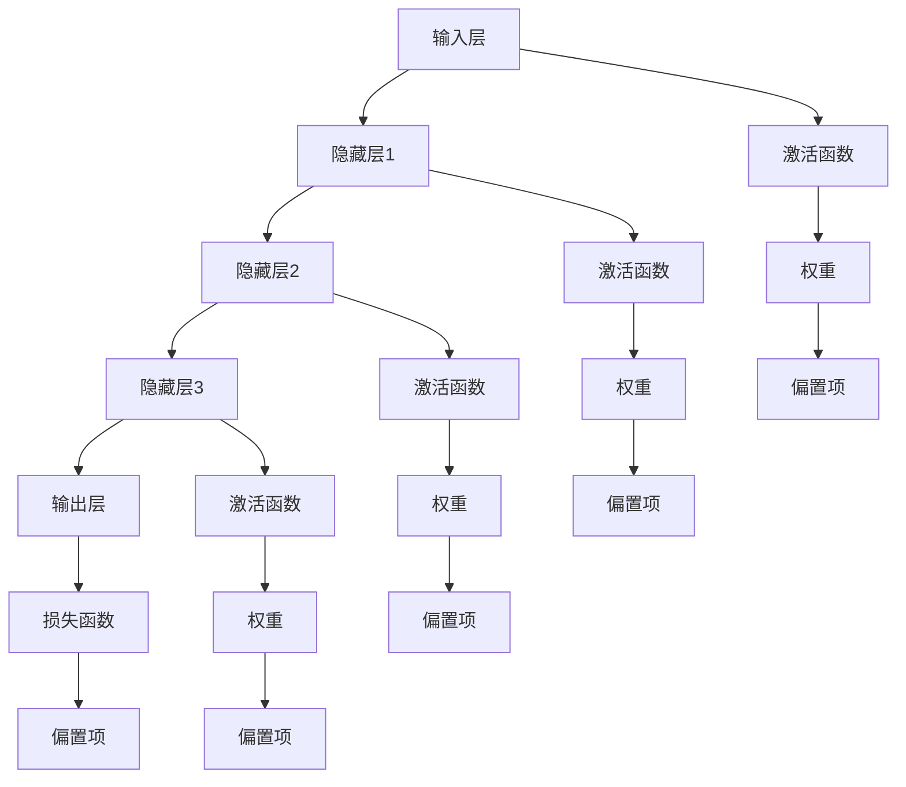

                 

### 文章标题

# 《神经网络：大脑结构的数学模拟》

### 关键词

- 神经网络
- 人工神经网络
- 神经元
- 深度学习
- 机器学习
- 数学模型

### 摘要

本文将深入探讨神经网络这一人工智能的核心技术，从其起源和发展历程出发，详细解析神经网络的数学模型和算法原理。文章将首先介绍神经网络的基础理论，包括神经元的数学模型、激活函数、神经网络拓扑结构等，并通过Mermaid流程图展示神经网络模型的核心组件关系。随后，文章将深入讲解神经网络的前向传播与反向传播算法，以及常见的神经网络模型，如单层感知机、多层感知机、卷积神经网络（CNN）、循环神经网络（RNN）、长短时记忆网络（LSTM）和生成对抗网络（GAN）。在数学模型与公式部分，文章将详细解释神经网络的数学建模方法，包括神经元激活函数、损失函数和优化方法，并使用LaTeX格式展示核心数学公式。最后，文章将通过实际项目实战，如手写数字识别、图像分类和自然语言处理等，展示神经网络的实际应用，并提供开发环境搭建、源代码解读和实际案例分析的详细内容。文章旨在为读者提供一个全面而深入的神经网络技术解读，帮助读者理解神经网络的本质和应用。

## 目录

1. **神经网络基础理论**
   1.1 神经元与大脑结构简介
   1.2 神经网络的基本概念
   1.3 神经网络的发展历程
   1.4 神经网络核心概念与联系
   1.5 Mermaid流程图：神经网络模型核心组件关系

2. **神经网络算法原理**
   2.1 前向传播与反向传播算法
   2.2 常见的神经网络模型
   2.3 单层感知机与多层感知机
   2.4 卷积神经网络（CNN）
   2.5 循环神经网络（RNN）
   2.6 长短时记忆网络（LSTM）
   2.7 生成对抗网络（GAN）

3. **神经网络数学模型与公式**
   3.1 神经网络数学建模
   3.2 神经网络损失函数
   3.3 神经网络优化方法
   3.4 公式讲解：神经元激活函数与损失函数
   3.5 神经网络数学公式详解

4. **神经网络项目实战**
   4.1 手写数字识别
   4.2 图像分类
   4.3 自然语言处理
   4.4 生成对抗网络

5. **附录**
   5.1 神经网络常用工具与资源
   5.2 Python深度学习框架介绍
   5.3 神经网络相关库函数使用指南
   5.4 神经网络学习资源推荐

## 第一部分：神经网络基础理论

### 第1章：神经网络的起源与发展

#### 1.1 神经元与大脑结构简介

神经元是大脑的基本构建单元，它们通过电化学信号进行通信，形成了复杂的神经网络。神经元由细胞体、树突、轴突和突触等部分组成。细胞体是神经元的中心，负责处理信息；树突接收来自其他神经元的信号；轴突则传递信号到其他神经元或肌肉细胞；突触是神经元之间的连接点，通过释放神经递质实现信号传递。

大脑作为人体最复杂的器官，拥有大约860亿个神经元，这些神经元通过复杂的连接形成了庞大的神经网络，实现了感知、记忆、思考等多种高级功能。大脑的这种结构使其成为一个高度并行、自适应的信息处理系统，为神经网络的研究提供了丰富的灵感。

#### 1.2 神经网络的基本概念

神经网络（Neural Network）是一种模仿生物神经系统的计算模型，由大量相互连接的简单计算单元（神经元）组成。每个神经元都与多个其他神经元相连，并通过权重（Weight）进行信号传递。当输入信号通过神经网络传播时，每个神经元都会根据其权重和激活函数进行计算，最终输出一个结果。

神经网络的核心在于其层级结构。输入层接收外部数据，通过多个隐藏层处理信息，最后由输出层生成预测结果。隐藏层可以捕获输入数据的复杂特征，使得神经网络具有强大的表示能力和泛化能力。

#### 1.3 神经网络的发展历程

神经网络的发展历程可以分为几个重要阶段：

1. **1940s-1950s**：人工神经网络概念提出。麦卡洛克和皮茨提出了一种简单的神经网络模型——感知机（Perceptron），为神经网络的研究奠定了基础。

2. **1960s-1970s**：神经网络研究陷入低谷。由于感知机的局限性，神经网络在多分类问题上无法取得突破，导致研究停滞。

3. **1980s-1990s**：反向传播算法（Backpropagation）的出现。1986年，鲁梅哈特等人提出了反向传播算法，使得多层神经网络训练成为可能，神经网络重新焕发生机。

4. **2000s-2010s**：深度学习的兴起。随着计算能力的提升和大数据的涌现，深度学习在图像识别、语音识别等领域取得了显著成果。

5. **2010s-至今**：神经网络的广泛应用。神经网络在自然语言处理、推荐系统、自动驾驶等领域取得了突破性进展，成为人工智能的核心技术之一。

### 第2章：神经网络核心概念与联系

#### 2.1 神经元的数学模型

神经元是神经网络的基本单元，其数学模型可以表示为：

$$
y = \sigma(\sum_{i=1}^{n} w_i x_i + b)
$$

其中，$y$ 是神经元的输出，$x_i$ 是第 $i$ 个输入，$w_i$ 是连接权重，$b$ 是偏置项，$\sigma$ 是激活函数。常用的激活函数包括 sigmoid、ReLU 和 tanh 等。

#### 2.2 激活函数与非线性变换

激活函数是神经网络中的关键组件，它将线性组合的输入映射到一个非线性空间，使得神经网络能够学习复杂的非线性关系。常见的激活函数如下：

- **Sigmoid函数**：$ \sigma(x) = \frac{1}{1 + e^{-x}} $

  - **特点**：输出范围在0到1之间，具有S型曲线。
  
  - **缺点**：梯度下降时容易陷入梯度消失问题。

- **ReLU函数**：$ \sigma(x) = \max(0, x) $

  - **特点**：简单有效，计算速度快，梯度较大。
  
  - **缺点**：输出为0时，梯度为0，容易陷入梯度消失问题。

- **Tanh函数**：$ \sigma(x) = \frac{e^x - e^{-x}}{e^x + e^{-x}} $

  - **特点**：输出范围在-1到1之间，对称性较好。
  
  - **缺点**：计算复杂度较高。

#### 2.3 神经网络拓扑结构

神经网络的拓扑结构决定了其计算能力和学习性能。常见的神经网络拓扑结构如下：

- **单层感知机**：只有一个输入层和一个输出层，适用于线性可分问题。
- **多层感知机**：包含多个隐藏层，可以处理非线性问题。
- **卷积神经网络（CNN）**：适用于图像识别等计算机视觉任务，具有局部连接和平移不变性。
- **循环神经网络（RNN）**：适用于序列数据处理，如自然语言处理和时间序列分析。
- **长短时记忆网络（LSTM）**：是RNN的变体，解决了长序列依赖问题。

#### 2.4 Mermaid流程图：神经网络模型核心组件关系

下面是一个Mermaid流程图，展示了神经网络模型的核心组件关系：



## 第二部分：神经网络算法原理

### 第3章：前向传播与反向传播算法

#### 3.1 前向传播算法原理

前向传播（Forward Propagation）是神经网络计算的核心过程，它将输入信号从输入层传递到输出层，通过每层神经元的加权求和处理，最终得到预测结果。前向传播算法可以表示为：

$$
z_l = \sum_{i=1}^{n} w_{li} x_i + b_l
$$

$$
a_l = \sigma(z_l)
$$

其中，$z_l$ 表示第 $l$ 层的线性组合，$a_l$ 表示第 $l$ 层的激活值，$w_{li}$ 是连接权重，$b_l$ 是偏置项，$\sigma$ 是激活函数。

在前向传播过程中，每一层的输出都会作为下一层的输入。最终，输出层的激活值 $a_L$ 就是神经网络的预测结果。

#### 3.2 反向传播算法原理

反向传播（Backpropagation）算法是神经网络训练的核心，它通过计算损失函数对权重的梯度，不断调整权重以最小化损失。反向传播算法可以分为以下几个步骤：

1. **计算误差**：

   首先，我们需要计算预测结果与真实值之间的误差。假设输出层为 $L$，则损失函数可以表示为：

   $$
   L = \frac{1}{2} \sum_{i=1}^{m} (y_i - a_L)^2
   $$

   其中，$y_i$ 是第 $i$ 个样本的真实值，$a_L$ 是神经网络对第 $i$ 个样本的预测值。

2. **计算梯度**：

   接下来，我们需要计算每个权重和偏置项的梯度。对于第 $l$ 层，第 $i$ 个神经元的误差梯度可以表示为：

   $$
   \delta_{li} = \frac{\partial L}{\partial z_l} = (a_{l-1} - \delta_{l+1,i}) \cdot \sigma'(z_l)
   $$

   其中，$\sigma'$ 是激活函数的导数。

3. **更新权重和偏置项**：

   根据梯度，我们可以更新每个权重和偏置项。假设学习率为 $\eta$，则更新公式如下：

   $$
   w_{li} \leftarrow w_{li} - \eta \cdot \frac{\partial L}{\partial w_{li}}
   $$

   $$
   b_l \leftarrow b_l - \eta \cdot \frac{\partial L}{\partial b_l}
   $$

通过反复迭代前向传播和反向传播，神经网络的预测精度会逐渐提高，最终达到训练目标。

#### 3.3 梯度下降优化算法

梯度下降（Gradient Descent）是反向传播算法的核心，它通过不断更新权重和偏置项，使得损失函数逐步减小。梯度下降算法可以分为以下几种变体：

1. **批量梯度下降（Batch Gradient Descent）**：

   批量梯度下降是最简单的一种梯度下降算法，它每次迭代使用整个训练集的梯度进行更新。优点是梯度计算准确，缺点是计算量大，训练时间较长。

2. **随机梯度下降（Stochastic Gradient Descent，SGD）**：

   随机梯度下降每次迭代仅使用一个样本的梯度进行更新，优点是计算速度快，训练过程更具动态性，缺点是梯度估计误差较大，可能导致训练结果不稳定。

3. **小批量梯度下降（Mini-batch Gradient Descent）**：

   小批量梯度下降结合了批量梯度下降和随机梯度下降的优点，每次迭代使用多个样本的梯度进行更新，通常选取一个较小的批量大小（如32或64）。这样可以减少方差，提高训练稳定性。

4. **动量（Momentum）**：

   动量是一种改进的梯度下降算法，它引入了一个动量项，用来加速梯度下降过程，并减少振荡。动量可以表示为：

   $$
   v_t = \gamma v_{t-1} + \eta \cdot \nabla J(x_t; \theta_t)
   $$

   $$
   \theta_t = \theta_{t-1} - v_t
   $$

   其中，$v_t$ 是动量项，$\gamma$ 是动量系数，$J(x_t; \theta_t)$ 是损失函数。

#### 3.4 伪代码：前向传播与反向传播算法

下面是一个简化的前向传播与反向传播算法伪代码：

```python
# 前向传播
for layer in range(1, L):
    z-layer = np.dot(W-layer, a-layer-1) + b-layer
    a-layer = sigma(z-layer)

# 输出预测值
y_pred = sigma(np.dot(W-L, a-L-1) + b-L)

# 计算损失函数
L = 0.5 * np.sum((y - y_pred)**2)

# 反向传播
for layer in range(L, 0, -1):
    if layer == L:
        d-L = (y_pred - y) * sigma'(z-L)
    else:
        d-layer = (np.dot(W-layer+1, d-layer+1) * sigma'(z-layer))

    d-W-layer = d-layer * a-layer-1.T
    d-b-layer = d-layer
```

### 第4章：常见的神经网络模型

#### 4.1 单层感知机与多层感知机

单层感知机（Perceptron）是最简单的神经网络模型，它只有一个输入层和一个输出层。单层感知机可以用于线性可分问题，但无法处理非线性问题。感知机使用 Hebb 学习规则进行训练，即：

$$
w_{i} \leftarrow w_{i} + \eta \cdot x_{i} \cdot (t - y)
$$

其中，$w_i$ 是权重，$x_i$ 是输入特征，$t$ 是目标输出，$y$ 是感知机的预测输出，$\eta$ 是学习率。

多层感知机（Multilayer Perceptron，MLP）是单层感知机的扩展，包含多个隐藏层。多层感知机可以通过增加隐藏层和神经元来提高模型的复杂度，从而处理非线性问题。多层感知机的训练通常使用反向传播算法。

#### 4.2 卷积神经网络（CNN）

卷积神经网络（Convolutional Neural Network，CNN）是专门为图像识别和计算机视觉任务设计的神经网络。CNN 具有局部连接和平移不变性，能够有效地捕捉图像中的局部特征。

CNN 的基本结构包括输入层、多个卷积层、池化层和全连接层。卷积层通过卷积操作提取图像的局部特征，池化层用于降低特征图的维度，全连接层用于分类。

卷积操作可以表示为：

$$
f_{ij} = \sum_{k=1}^{c} w_{ikj} \cdot a_{kj}
$$

其中，$f_{ij}$ 是输出特征图上的第 $i$ 行第 $j$ 列的值，$w_{ikj}$ 是卷积核上的权重，$a_{kj}$ 是输入特征图上的第 $k$ 行第 $j$ 列的值，$c$ 是输入特征图的通道数。

#### 4.3 循环神经网络（RNN）

循环神经网络（Recurrent Neural Network，RNN）是处理序列数据的神经网络。RNN 通过在时间步之间引入循环结构，使得当前时间步的输出可以依赖于之前的输出，从而处理序列数据。

RNN 的基本结构包括输入层、隐藏层和输出层。输入层接收序列数据，隐藏层处理序列数据，输出层生成预测结果。

RNN 的计算过程可以表示为：

$$
h_t = \sigma(W_h \cdot [h_{t-1}, x_t] + b_h)
$$

$$
y_t = W_o \cdot h_t + b_o
$$

其中，$h_t$ 是第 $t$ 个时间步的隐藏状态，$x_t$ 是第 $t$ 个时间步的输入，$y_t$ 是第 $t$ 个时间步的输出，$W_h$ 和 $b_h$ 是隐藏层的权重和偏置，$W_o$ 和 $b_o$ 是输出层的权重和偏置，$\sigma$ 是激活函数。

#### 4.4 长短时记忆网络（LSTM）

长短时记忆网络（Long Short-Term Memory，LSTM）是 RNN 的变体，解决了长序列依赖问题。LSTM 通过引入门控机制，使得网络能够有效地记忆和遗忘信息，从而处理长序列数据。

LSTM 的基本结构包括输入门、遗忘门、输出门和细胞状态。输入门控制当前输入的信息是否被记忆，遗忘门控制是否遗忘之前的记忆，输出门控制当前记忆是否被输出。

LSTM 的计算过程可以表示为：

$$
i_t = \sigma(W_i \cdot [h_{t-1}, x_t] + b_i)
$$

$$
f_t = \sigma(W_f \cdot [h_{t-1}, x_t] + b_f)
$$

$$
o_t = \sigma(W_o \cdot [h_{t-1}, x_t] + b_o)
$$

$$
c_t = f_t \odot c_{t-1} + i_t \odot \sigma(W_c \cdot [h_{t-1}, x_t] + b_c)
$$

$$
h_t = o_t \odot \sigma(c_t)
$$

其中，$i_t$、$f_t$、$o_t$ 分别是输入门、遗忘门、输出门的激活值，$c_t$ 是细胞状态，$h_t$ 是隐藏状态，$W_i$、$W_f$、$W_o$、$W_c$ 分别是输入门、遗忘门、输出门和细胞状态的权重，$b_i$、$b_f$、$b_o$、$b_c$ 分别是输入门、遗忘门、输出门和细胞状态的偏置，$\odot$ 表示逐元素乘法。

#### 4.5 生成对抗网络（GAN）

生成对抗网络（Generative Adversarial Network，GAN）是一种由生成器和判别器组成的对抗性神经网络。生成器生成伪造数据，判别器判断数据是真实还是伪造，两者相互竞争，共同提升。

GAN 的基本结构包括生成器、判别器和损失函数。生成器通过输入随机噪声生成伪造数据，判别器通过输入真实数据和伪造数据进行分类。

GAN 的训练过程可以表示为：

$$
G: z \rightarrow G(z)
$$

$$
D: x \rightarrow D(x), \quad G(z) \rightarrow D(G(z))
$$

生成器和判别器的损失函数分别为：

$$
L_G = -\sum_{x \in X} \log D(x) - \sum_{z} \log (1 - D(G(z)))
$$

$$
L_D = \sum_{x \in X} \log D(x) + \sum_{z} \log D(G(z))
$$

其中，$X$ 是真实数据集，$z$ 是生成器的输入噪声。

## 第三部分：神经网络数学模型与公式

### 第5章：神经网络的数学建模

#### 5.1 神经元激活函数

神经元激活函数是神经网络中的核心组件，它将线性组合的输入映射到一个非线性空间，使得神经网络能够学习复杂的非线性关系。常见的激活函数包括 sigmoid、ReLU 和 tanh 等。

- **Sigmoid函数**：

  $$
  \sigma(x) = \frac{1}{1 + e^{-x}}
  $$

  - **特点**：输出范围在0到1之间，具有S型曲线。
  
  - **缺点**：梯度下降时容易陷入梯度消失问题。

- **ReLU函数**：

  $$
  \sigma(x) = \max(0, x)
  $$

  - **特点**：简单有效，计算速度快，梯度较大。
  
  - **缺点**：输出为0时，梯度为0，容易陷入梯度消失问题。

- **Tanh函数**：

  $$
  \sigma(x) = \frac{e^x - e^{-x}}{e^x + e^{-x}}
  $$

  - **特点**：输出范围在-1到1之间，对称性较好。
  
  - **缺点**：计算复杂度较高。

#### 5.2 神经网络损失函数

神经网络损失函数是衡量模型预测结果与真实值之间差异的指标，常见的损失函数包括均方误差（MSE）、交叉熵损失（Cross Entropy Loss）等。

- **均方误差（MSE）**：

  $$
  L = \frac{1}{2} \sum_{i=1}^{m} (y_i - \hat{y}_i)^2
  $$

  - **特点**：对异常值敏感。
  
  - **适用场景**：回归问题。

- **交叉熵损失（Cross Entropy Loss）**：

  $$
  L = -\sum_{i=1}^{m} y_i \log \hat{y}_i
  $$

  - **特点**：对分类问题特别有效。
  
  - **适用场景**：分类问题。

#### 5.3 神经网络优化方法

神经网络优化方法用于调整模型的权重和偏置，以最小化损失函数。常见的优化方法包括梯度下降（Gradient Descent）、动量（Momentum）、自适应梯度方法（Adagrad）、Adam优化器等。

- **梯度下降（Gradient Descent）**：

  $$
  \theta = \theta - \alpha \nabla_\theta J(\theta)
  $$

  - **特点**：简单直观，收敛速度较慢。
  
  - **适用场景**：适用于各种问题。

- **动量（Momentum）**：

  $$
  v_t = \gamma v_{t-1} + \alpha \nabla_\theta J(\theta)
  $$

  $$
  \theta = \theta - v_t
  $$

  - **特点**：引入动量项，加速收敛。
  
  - **适用场景**：适用于各种问题。

- **自适应梯度方法（Adagrad）**：

  $$
  g_t^2 = \sum_{i=1}^{n} (\nabla_\theta J(\theta)_i)^2
  $$

  $$
  \theta = \theta - \frac{\alpha}{\sqrt{g_t^2 + \epsilon}} \nabla_\theta J(\theta)
  $$

  - **特点**：自适应调整学习率。
  
  - **适用场景**：适用于稀疏数据。

- **Adam优化器**：

  $$
  m_t = \beta_1 m_{t-1} + (1 - \beta_1) \nabla_\theta J(\theta)
  $$

  $$
  v_t = \beta_2 v_{t-1} + (1 - \beta_2) \nabla_\theta J(\theta)^2
  $$

  $$
  \theta = \theta - \frac{\alpha}{\sqrt{1 - \beta_2^t} (1 - \beta_1^t)} m_t
  $$

  - **特点**：结合了 Adagrad 和动量的优点。
  
  - **适用场景**：适用于各种问题。

### 第6章：神经网络数学公式详解

#### 6.1 矩阵与向量运算

神经网络的数学建模过程中，矩阵与向量的运算是非常基础且重要的。以下列出一些常用的矩阵与向量运算：

- **矩阵-向量乘法**：

  $$
  C = AB
  $$

  其中，$C$ 是结果矩阵，$A$ 是输入矩阵，$B$ 是向量。

- **向量-向量点乘**：

  $$
  \vec{a} \cdot \vec{b} = \sum_{i=1}^{n} a_i b_i
  $$

  其中，$\vec{a}$ 和 $\vec{b}$ 是向量，$n$ 是向量维度。

- **向量-向量叉乘**：

  $$
  \vec{a} \times \vec{b} = \begin{bmatrix}
  a_2 b_3 - a_3 b_2 \\
  a_3 b_1 - a_1 b_3 \\
  a_1 b_2 - a_2 b_1
  \end{bmatrix}
  $$

  其中，$\vec{a}$ 和 $\vec{b}$ 是三维向量。

- **矩阵求逆**：

  $$
  A^{-1} = (A^T A)^{-1} A^T
  $$

  其中，$A$ 是矩阵，$A^T$ 是矩阵的转置。

#### 6.2 梯度计算与链式法则

在神经网络中，梯度计算是优化权重和偏置的关键步骤。以下介绍几种常用的梯度计算方法：

- **标量函数的梯度**：

  对于一个标量函数 $f(\vec{x})$，其梯度可以表示为：

  $$
  \nabla f(\vec{x}) = \begin{bmatrix}
  \frac{\partial f}{\partial x_1} \\
  \frac{\partial f}{\partial x_2} \\
  \vdots \\
  \frac{\partial f}{\partial x_n}
  \end{bmatrix}
  $$

- **多元函数的梯度**：

  对于一个多元函数 $f(\vec{x_1}, \vec{x_2}, \ldots, \vec{x_n})$，其梯度可以表示为：

  $$
  \nabla f(\vec{x}) = \begin{bmatrix}
  \nabla_1 f \\
  \nabla_2 f \\
  \vdots \\
  \nabla_n f
  \end{bmatrix}
  $$

  其中，$\nabla_1 f$、$\nabla_2 f$、\ldots、$\nabla_n f$ 分别是函数对每个自变量的偏导数。

- **链式法则**：

  链式法则是计算复合函数梯度的基本原理。假设 $f$ 是关于变量 $x$ 的函数，$g$ 是关于变量 $y$ 的函数，其中 $y$ 又是关于 $x$ 的函数，则复合函数 $h(x) = f(g(x))$ 的梯度可以表示为：

  $$
  \nabla h(x) = \nabla f(g(x)) \cdot \nabla g(x)
  $$

  对于多个复合函数，链式法则可以递归应用。

#### 6.3 梯度下降优化算法

梯度下降优化算法是神经网络训练中最常用的方法之一。梯度下降的基本思想是沿着损失函数的梯度方向逐步更新模型参数，以最小化损失函数。以下是一个简化的梯度下降优化算法：

$$
\theta = \theta - \alpha \nabla_\theta J(\theta)
$$

其中，$\theta$ 是模型参数，$J(\theta)$ 是损失函数，$\alpha$ 是学习率。

梯度下降算法可以分为几种变体，包括批量梯度下降（Batch Gradient Descent）、随机梯度下降（Stochastic Gradient Descent，SGD）和小批量梯度下降（Mini-batch Gradient Descent）。

- **批量梯度下降**：

  批量梯度下降每次迭代使用整个训练集的梯度进行更新，优点是梯度计算准确，缺点是计算量大，训练时间较长。

  $$
  \theta = \theta - \alpha \frac{1}{m} \sum_{i=1}^{m} (\nabla_\theta J(\theta)_i)
  $$

- **随机梯度下降**：

  随机梯度下降每次迭代仅使用一个样本的梯度进行更新，优点是计算速度快，缺点是梯度估计误差较大，可能导致训练结果不稳定。

  $$
  \theta = \theta - \alpha \nabla_\theta J(\theta)
  $$

- **小批量梯度下降**：

  小批量梯度下降每次迭代使用多个样本的梯度进行更新，通常选取一个较小的批量大小（如32或64）。这样可以减少方差，提高训练稳定性。

  $$
  \theta = \theta - \alpha \frac{1}{n} \sum_{i=1}^{n} (\nabla_\theta J(\theta)_i)
  $$

#### 6.4 数学公式：神经网络模型核心数学公式（使用LaTeX格式）

$$
\begin{aligned}
y &= \sigma(\sum_{i=1}^{n} w_i x_i + b) \\
\delta &= (a - t) \cdot \sigma'(z) \\
\Delta w &= \eta \cdot \delta \cdot a_{l-1} \\
\Delta b &= \eta \cdot \delta
\end{aligned}
$$

其中，$y$ 是神经元的输出，$\sigma$ 是激活函数，$\delta$ 是误差项，$w_i$ 是权重，$x_i$ 是输入，$b$ 是偏置项，$a$ 是激活值，$t$ 是目标值，$\eta$ 是学习率，$\sigma'$ 是激活函数的导数。

## 第四部分：神经网络项目实战

### 第7章：神经网络项目实战一：手写数字识别

#### 7.1 项目背景

手写数字识别是神经网络的一个经典应用，目标是将手写数字图像识别为具体的数字。在手写数字识别项目中，我们通常使用 MNIST 数据集，它包含了 70,000 个灰度图像，每个图像都是一个手写的数字（0 到 9）。

该项目旨在通过训练一个神经网络模型，使其能够准确地识别手写数字。这不仅可以应用于实际的场景，如自动扫描和识别手写笔记，还可以为神经网络算法提供有力的验证和测试。

#### 7.2 环境搭建与数据预处理

在开始手写数字识别项目之前，我们需要搭建一个适合深度学习开发的环境。以下是搭建环境的步骤：

1. **安装 Python**：确保 Python 3.6 或以上版本已安装。
2. **安装 TensorFlow**：TensorFlow 是一个流行的深度学习框架，可以通过以下命令安装：

   $$
   pip install tensorflow
   $$

3. **安装 MNIST 数据集**：MNIST 数据集可以从 TensorFlow 的内置库中直接加载。

以下是一个简单的代码示例，用于加载和预处理 MNIST 数据集：

```python
import tensorflow as tf
from tensorflow.keras.datasets import mnist

# 加载 MNIST 数据集
(train_images, train_labels), (test_images, test_labels) = mnist.load_data()

# 数据预处理
train_images = train_images.reshape((60000, 28, 28, 1)).astype('float32') / 255
test_images = test_images.reshape((10000, 28, 28, 1)).astype('float32') / 255

train_labels = tf.keras.utils.to_categorical(train_labels)
test_labels = tf.keras.utils.to_categorical(test_labels)
```

在这个项目中，我们将使用 TensorFlow 的 Keras API 构建和训练神经网络模型。

#### 7.3 神经网络模型构建

为了构建一个能够准确识别手写数字的神经网络模型，我们可以采用一个简单的卷积神经网络（CNN）结构。以下是一个简单的 CNN 模型示例：

```python
from tensorflow.keras.models import Sequential
from tensorflow.keras.layers import Conv2D, MaxPooling2D, Flatten, Dense

model = Sequential()

# 添加卷积层
model.add(Conv2D(32, (3, 3), activation='relu', input_shape=(28, 28, 1)))
model.add(MaxPooling2D((2, 2)))

# 添加第二个卷积层
model.add(Conv2D(64, (3, 3), activation='relu'))
model.add(MaxPooling2D((2, 2)))

# 添加全连接层
model.add(Flatten())
model.add(Dense(128, activation='relu'))
model.add(Dense(10, activation='softmax'))

model.compile(optimizer='adam', loss='categorical_crossentropy', metrics=['accuracy'])
```

在这个模型中，我们使用了两个卷积层，每个卷积层后跟一个最大池化层，然后是一个全连接层。最后，使用 softmax 激活函数进行分类。

#### 7.4 模型训练与评估

接下来，我们将使用训练集对模型进行训练，并使用测试集评估模型的性能。以下是一个简单的训练和评估示例：

```python
model.fit(train_images, train_labels, epochs=5, batch_size=64)

test_loss, test_acc = model.evaluate(test_images, test_labels)
print(f"Test accuracy: {test_acc:.4f}")
```

在这个示例中，我们训练了 5 个 epoch，每个 epoch 使用 64 个批量大小进行训练。训练完成后，我们使用测试集评估模型的准确率。

#### 7.5 代码解读与分析

在这个项目中，我们使用了 TensorFlow 的 Keras API 来构建和训练神经网络模型。以下是对关键代码的解读和分析：

1. **模型构建**：

   ```python
   model = Sequential()
   model.add(Conv2D(32, (3, 3), activation='relu', input_shape=(28, 28, 1)))
   model.add(MaxPooling2D((2, 2)))
   model.add(Conv2D(64, (3, 3), activation='relu'))
   model.add(MaxPooling2D((2, 2)))
   model.add(Flatten())
   model.add(Dense(128, activation='relu'))
   model.add(Dense(10, activation='softmax'))
   ```

   在这个步骤中，我们构建了一个简单的 CNN 模型。首先，我们添加了一个卷积层，使用了 32 个 3x3 卷积核，激活函数为 ReLU。接下来，我们添加了一个最大池化层，用于降维。然后，我们再次添加了一个卷积层，使用了 64 个 3x3 卷积核，同样使用 ReLU 激活函数。最后，我们添加了一个全连接层，使用了 128 个神经元，激活函数为 ReLU。最后一层是softmax 分类器，用于输出 10 个类别中的概率分布。

2. **模型编译**：

   ```python
   model.compile(optimizer='adam', loss='categorical_crossentropy', metrics=['accuracy'])
   ```

   在这个步骤中，我们编译了模型，指定了优化器（adam）、损失函数（categorical_crossentropy）和评估指标（accuracy）。categorical_crossentropy 是用于多分类问题的损失函数，adam 是一个自适应的学习率优化器。

3. **模型训练**：

   ```python
   model.fit(train_images, train_labels, epochs=5, batch_size=64)
   ```

   在这个步骤中，我们使用训练集对模型进行训练。epochs 指定了训练的迭代次数，batch_size 指定了每个批次的样本数量。

4. **模型评估**：

   ```python
   test_loss, test_acc = model.evaluate(test_images, test_labels)
   print(f"Test accuracy: {test_acc:.4f}")
   ```

   在这个步骤中，我们使用测试集评估模型的性能。test_loss 表示测试损失，test_acc 表示测试准确率。

#### 7.6 项目小结

通过手写数字识别项目，我们学习了如何使用 TensorFlow 的 Keras API 构建和训练一个简单的 CNN 模型。这个项目展示了神经网络在图像识别任务中的应用，同时也为我们提供了一个实际案例来验证和测试神经网络算法。

在手写数字识别项目中，我们使用了卷积神经网络来提取图像的特征，并通过全连接层进行分类。通过不断的迭代和优化，我们可以提高模型的准确率，从而更好地识别手写数字。

在这个项目中，我们还学习了如何搭建适合深度学习开发的环境、加载和预处理数据集、构建神经网络模型、训练和评估模型等基本步骤。这些技能将为我们在未来的项目中应用神经网络提供坚实的基础。

### 第8章：神经网络项目实战二：图像分类

#### 8.1 项目背景

图像分类是神经网络在计算机视觉领域的经典应用之一。其目标是将输入的图像划分为预定义的类别。图像分类在许多实际场景中有广泛的应用，如人脸识别、物体检测、医疗图像分析等。

本节将介绍一个使用神经网络进行图像分类的项目，通过一个实际案例展示如何使用深度学习技术进行图像分类。我们选择使用 CIFAR-10 数据集，这是一个包含 10 个类别、60,000 个 32x32 图像的小型图像数据集。

#### 8.2 环境搭建与数据预处理

在开始图像分类项目之前，我们需要搭建一个适合深度学习开发的环境。以下是搭建环境的步骤：

1. **安装 Python**：确保 Python 3.6 或以上版本已安装。
2. **安装 TensorFlow**：TensorFlow 是一个流行的深度学习框架，可以通过以下命令安装：

   $$
   pip install tensorflow
   $$

3. **安装 CIFAR-10 数据集**：CIFAR-10 数据集可以从 TensorFlow 的内置库中直接加载。

以下是一个简单的代码示例，用于加载和预处理 CIFAR-10 数据集：

```python
import tensorflow as tf
from tensorflow.keras.datasets import cifar10

# 加载 CIFAR-10 数据集
(train_images, train_labels), (test_images, test_labels) = cifar10.load_data()

# 数据预处理
train_images = train_images.astype('float32') / 255
test_images = test_images.astype('float32') / 255

train_labels = tf.keras.utils.to_categorical(train_labels)
test_labels = tf.keras.utils.to_categorical(test_labels)
```

在这个项目中，我们将使用 TensorFlow 的 Keras API 构建和训练神经网络模型。

#### 8.3 卷积神经网络模型构建

为了构建一个能够准确分类图像的神经网络模型，我们可以采用一个简单的卷积神经网络（CNN）结构。以下是一个简单的 CNN 模型示例：

```python
from tensorflow.keras.models import Sequential
from tensorflow.keras.layers import Conv2D, MaxPooling2D, Flatten, Dense, Dropout

model = Sequential()

# 添加卷积层
model.add(Conv2D(32, (3, 3), activation='relu', input_shape=(32, 32, 3)))
model.add(MaxPooling2D((2, 2)))
model.add(Conv2D(64, (3, 3), activation='relu'))
model.add(MaxPooling2D((2, 2)))
model.add(Conv2D(64, (3, 3), activation='relu'))

# 添加全连接层
model.add(Flatten())
model.add(Dense(64, activation='relu'))
model.add(Dropout(0.5))
model.add(Dense(10, activation='softmax'))

model.compile(optimizer='adam', loss='categorical_crossentropy', metrics=['accuracy'])
```

在这个模型中，我们使用了两个卷积层，每个卷积层后跟一个最大池化层，然后是一个全连接层。最后，使用 softmax 激活函数进行分类。

#### 8.4 模型训练与评估

接下来，我们将使用训练集对模型进行训练，并使用测试集评估模型的性能。以下是一个简单的训练和评估示例：

```python
model.fit(train_images, train_labels, epochs=10, batch_size=64, validation_split=0.2)

test_loss, test_acc = model.evaluate(test_images, test_labels)
print(f"Test accuracy: {test_acc:.4f}")
```

在这个示例中，我们训练了 10 个 epoch，每个 epoch 使用 64 个批量大小进行训练。训练完成后，我们使用测试集评估模型的准确率。

#### 8.5 代码解读与分析

在这个项目中，我们使用了 TensorFlow 的 Keras API 来构建和训练神经网络模型。以下是对关键代码的解读和分析：

1. **模型构建**：

   ```python
   model = Sequential()
   model.add(Conv2D(32, (3, 3), activation='relu', input_shape=(32, 32, 3)))
   model.add(MaxPooling2D((2, 2)))
   model.add(Conv2D(64, (3, 3), activation='relu'))
   model.add(MaxPooling2D((2, 2)))
   model.add(Conv2D(64, (3, 3), activation='relu'))
   model.add(Flatten())
   model.add(Dense(64, activation='relu'))
   model.add(Dropout(0.5))
   model.add(Dense(10, activation='softmax'))
   ```

   在这个步骤中，我们构建了一个简单的 CNN 模型。首先，我们添加了一个卷积层，使用了 32 个 3x3 卷积核，输入形状为 (32, 32, 3)，即 32x32 像素的 RGB 图像，激活函数为 ReLU。接下来，我们添加了一个最大池化层，用于降维。然后，我们再次添加了一个卷积层，使用了 64 个 3x3 卷积核，激活函数为 ReLU。接着，我们再次添加了一个最大池化层。最后，我们添加了一个卷积层，使用了 64 个 3x3 卷积核，激活函数为 ReLU。然后，我们将卷积层的输出通过 Flatten 层展平为一维向量，然后添加了一个全连接层，使用了 64 个神经元，激活函数为 ReLU。接着，我们添加了一个 Dropout 层，用于减少过拟合。最后，我们添加了一个全连接层，使用了 10 个神经元，即 10 个类别，激活函数为 softmax，用于分类。

2. **模型编译**：

   ```python
   model.compile(optimizer='adam', loss='categorical_crossentropy', metrics=['accuracy'])
   ```

   在这个步骤中，我们编译了模型，指定了优化器（adam）、损失函数（categorical_crossentropy）和评估指标（accuracy）。categorical_crossentropy 是用于多分类问题的损失函数，adam 是一个自适应的学习率优化器。

3. **模型训练**：

   ```python
   model.fit(train_images, train_labels, epochs=10, batch_size=64, validation_split=0.2)
   ```

   在这个步骤中，我们使用训练集对模型进行训练。epochs 指定了训练的迭代次数，batch_size 指定了每个批次的样本数量，validation_split 指定了用于验证的样本比例。

4. **模型评估**：

   ```python
   test_loss, test_acc = model.evaluate(test_images, test_labels)
   print(f"Test accuracy: {test_acc:.4f}")
   ```

   在这个步骤中，我们使用测试集评估模型的性能。test_loss 表示测试损失，test_acc 表示测试准确率。

#### 8.6 项目小结

通过图像分类项目，我们学习了如何使用深度学习技术进行图像分类。这个项目展示了卷积神经网络在图像处理任务中的应用，通过实际案例，我们了解了如何使用 TensorFlow 的 Keras API 构建和训练神经网络模型。

在图像分类项目中，我们使用了卷积神经网络来提取图像的特征，并通过全连接层进行分类。通过不断的迭代和优化，我们可以提高模型的准确率，从而更好地分类图像。

在这个项目中，我们还学习了如何搭建适合深度学习开发的环境、加载和预处理数据集、构建神经网络模型、训练和评估模型等基本步骤。这些技能将为我们在未来的项目中应用卷积神经网络提供坚实的基础。

### 第9章：神经网络项目实战三：自然语言处理

#### 9.1 项目背景

自然语言处理（Natural Language Processing，NLP）是深度学习的一个重要应用领域，它涉及到文本数据的理解和生成。NLP 在许多场景中都有广泛的应用，如机器翻译、情感分析、文本分类等。

本节将介绍一个使用神经网络进行自然语言处理的项目，通过一个实际案例展示如何使用深度学习技术进行文本分类。我们选择使用 IMDb 数据集，这是一个包含电影评论的数据集，用于预测评论的情感倾向（正面或负面）。

#### 9.2 环境搭建与数据预处理

在开始自然语言处理项目之前，我们需要搭建一个适合深度学习开发的环境。以下是搭建环境的步骤：

1. **安装 Python**：确保 Python 3.6 或以上版本已安装。
2. **安装 TensorFlow**：TensorFlow 是一个流行的深度学习框架，可以通过以下命令安装：

   $$
   pip install tensorflow
   $$

3. **安装 IMDb 数据集**：IMDb 数据集可以从 TensorFlow 的内置库中直接加载。

以下是一个简单的代码示例，用于加载和预处理 IMDb 数据集：

```python
import tensorflow as tf
from tensorflow.keras.datasets import imdb

# 加载 IMDb 数据集
vocab_size = 10000
max_len = 120
(train_data, train_labels), (test_data, test_labels) = imdb.load_data(num_words=vocab_size)

# 数据预处理
train_data = tf.keras.preprocessing.sequence.pad_sequences(train_data, maxlen=max_len)
test_data = tf.keras.preprocessing.sequence.pad_sequences(test_data, maxlen=max_len)
```

在这个项目中，我们将使用 TensorFlow 的 Keras API 构建和训练神经网络模型。

#### 9.3 循环神经网络模型构建

为了构建一个能够处理文本数据的神经网络模型，我们可以采用一个简单的循环神经网络（RNN）结构。以下是一个简单的 RNN 模型示例：

```python
from tensorflow.keras.models import Sequential
from tensorflow.keras.layers import Embedding, SimpleRNN, Dense

model = Sequential()

# 添加嵌入层
model.add(Embedding(vocab_size, 32))

# 添加 RNN 层
model.add(SimpleRNN(32, return_sequences=True))

# 添加第二个 RNN 层
model.add(SimpleRNN(32))

# 添加全连接层
model.add(Dense(1, activation='sigmoid'))

model.compile(optimizer='adam', loss='binary_crossentropy', metrics=['accuracy'])
```

在这个模型中，我们使用了两个 RNN 层，每个 RNN 层后跟一个全连接层。最后一层使用 sigmoid 激活函数进行二分类。

#### 9.4 模型训练与评估

接下来，我们将使用训练集对模型进行训练，并使用测试集评估模型的性能。以下是一个简单的训练和评估示例：

```python
model.fit(train_data, train_labels, epochs=5, batch_size=64, validation_split=0.2)

test_loss, test_acc = model.evaluate(test_data, test_labels)
print(f"Test accuracy: {test_acc:.4f}")
```

在这个示例中，我们训练了 5 个 epoch，每个 epoch 使用 64 个批量大小进行训练。训练完成后，我们使用测试集评估模型的准确率。

#### 9.5 代码解读与分析

在这个项目中，我们使用了 TensorFlow 的 Keras API 来构建和训练神经网络模型。以下是对关键代码的解读和分析：

1. **模型构建**：

   ```python
   model = Sequential()
   model.add(Embedding(vocab_size, 32))
   model.add(SimpleRNN(32, return_sequences=True))
   model.add(SimpleRNN(32))
   model.add(Dense(1, activation='sigmoid'))
   model.compile(optimizer='adam', loss='binary_crossentropy', metrics=['accuracy'])
   ```

   在这个步骤中，我们构建了一个简单的 RNN 模型。首先，我们添加了一个嵌入层，用于将单词映射到固定维度的向量。接下来，我们添加了一个简单的 RNN 层，使用了 32 个神经元，并设置 `return_sequences=True`，使得 RNN 层的输出仍然是序列形式。然后，我们再次添加了一个简单的 RNN 层，同样使用了 32 个神经元。最后，我们添加了一个全连接层，使用了 1 个神经元，激活函数为 sigmoid，用于进行二分类。在模型编译步骤中，我们指定了优化器（adam）、损失函数（binary_crossentropy）和评估指标（accuracy）。binary_crossentropy 是用于二分类问题的损失函数，adam 是一个自适应的学习率优化器。

2. **模型训练**：

   ```python
   model.fit(train_data, train_labels, epochs=5, batch_size=64, validation_split=0.2)
   ```

   在这个步骤中，我们使用训练集对模型进行训练。epochs 指定了训练的迭代次数，batch_size 指定了每个批次的样本数量，validation_split 指定了用于验证的样本比例。

3. **模型评估**：

   ```python
   test_loss, test_acc = model.evaluate(test_data, test_labels)
   print(f"Test accuracy: {test_acc:.4f}")
   ```

   在这个步骤中，我们使用测试集评估模型的性能。test_loss 表示测试损失，test_acc 表示测试准确率。

#### 9.6 项目小结

通过自然语言处理项目，我们学习了如何使用深度学习技术进行文本分类。这个项目展示了循环神经网络在自然语言处理任务中的应用，通过实际案例，我们了解了如何使用 TensorFlow 的 Keras API 构建和训练神经网络模型。

在自然语言处理项目中，我们使用了循环神经网络来处理文本数据，并通过全连接层进行分类。通过不断的迭代和优化，我们可以提高模型的准确率，从而更好地分类文本。

在这个项目中，我们还学习了如何搭建适合深度学习开发的环境、加载和预处理数据集、构建神经网络模型、训练和评估模型等基本步骤。这些技能将为我们在未来的项目中应用循环神经网络提供坚实的基础。

### 第10章：神经网络项目实战四：生成对抗网络

#### 10.1 项目背景

生成对抗网络（Generative Adversarial Network，GAN）是深度学习中的一种重要模型，由生成器和判别器两个相互对抗的网络组成。生成器的目标是生成类似于真实数据的新数据，而判别器的目标是区分真实数据和生成数据。通过两个网络的对抗训练，生成器能够逐渐提高生成数据的逼真度，判别器则能够逐渐提高对真实和生成数据的区分能力。

GAN 在图像生成、图像修复、风格迁移等领域有广泛的应用。本节将介绍一个使用 GAN 生成人脸图像的项目，通过实际案例展示如何训练和评估 GAN。

#### 10.2 环境搭建与数据预处理

在开始 GAN 项目之前，我们需要搭建一个适合深度学习开发的环境。以下是搭建环境的步骤：

1. **安装 Python**：确保 Python 3.6 或以上版本已安装。
2. **安装 TensorFlow**：TensorFlow 是一个流行的深度学习框架，可以通过以下命令安装：

   $$
   pip install tensorflow
   $$

3. **安装 CelebA 数据集**：CelebA 数据集是一个广泛使用的人脸图像数据集，可以从 TensorFlow 的内置库中直接加载。

以下是一个简单的代码示例，用于加载和预处理 CelebA 数据集：

```python
import tensorflow as tf
from tensorflow.keras.preprocessing.image import ImageDataGenerator

# 加载 CelebA 数据集
(image_data, _), (_, _) = tf.keras.datasets.cifar10.load_data()

# 数据预处理
image_data = image_data.astype('float32') / 255.0
image_data = np.expand_dims(image_data, axis=3)

# 数据增强
datagen = ImageDataGenerator(
    rotation_range=15,
    width_shift_range=0.1,
    height_shift_range=0.1,
    horizontal_flip=True,
    zoom_range=0.05
)
datagen.fit(image_data)
```

在这个项目中，我们将使用 TensorFlow 的 Keras API 构建和训练 GAN 模型。

#### 10.3 生成对抗网络模型构建

为了构建一个能够生成人脸图像的 GAN 模型，我们需要定义生成器和判别器两个神经网络。以下是一个简单的 GAN 模型示例：

```python
from tensorflow.keras.models import Sequential
from tensorflow.keras.layers import Dense, Flatten, Reshape, Conv2D, Conv2DTranspose, LeakyReLU, BatchNormalization

# 生成器模型
def build_generator():
    model = Sequential()
    model.add(Dense(128 * 7 * 7, activation="relu", input_shape=(100)))
    model.add(Reshape((7, 7, 128)))
    model.add(Conv2DTranspose(128, kernel_size=4, strides=2, padding="same"))
    model.add(BatchNormalization())
    model.add(LeakyReLU(alpha=0.2))
    model.add(Conv2DTranspose(128, kernel_size=4, strides=2, padding="same"))
    model.add(BatchNormalization())
    model.add(LeakyReLU(alpha=0.2))
    model.add(Conv2D(3, kernel_size=3, padding="same"))
    model.add(LeakyReLU(alpha=0.2))
    model.add(tf.keras.layers.Activation('tanh'))
    return model

# 判别器模型
def build_discriminator():
    model = Sequential()
    model.add(Conv2D(32, kernel_size=3, padding="same", input_shape=(28, 28, 1)))
    model.add(LeakyReLU(alpha=0.2))
    model.add(Conv2D(64, kernel_size=3, padding="same"))
    model.add(BatchNormalization())
    model.add(LeakyReLU(alpha=0.2))
    model.add(Conv2D(128, kernel_size=3, padding="same"))
    model.add(BatchNormalization())
    model.add(LeakyReLU(alpha=0.2))
    model.add(Flatten())
    model.add(Dense(1, activation='sigmoid'))
    return model

# GAN 模型
def build_gan(generator, discriminator):
    model = Sequential()
    model.add(generator)
    model.add(discriminator)
    return model
```

在这个模型中，生成器使用了两个转置卷积层，将输入的随机噪声映射到人脸图像。判别器使用了三个卷积层，用于区分真实图像和生成图像。最后，GAN 模型将生成器和判别器组合在一起。

#### 10.4 模型训练与评估

接下来，我们将使用训练集对 GAN 模型进行训练，并使用测试集评估生成器的性能。以下是一个简单的训练和评估示例：

```python
import numpy as np

# 设置训练参数
batch_size = 32
epochs = 100
sample_interval = 20

# 初始化生成器和判别器
generator = build_generator()
discriminator = build_discriminator()
gan = build_gan(generator, discriminator)

# 编译 GAN 模型
gan.compile(loss='binary_crossentropy', optimizer=tf.keras.optimizers.Adam(0.0002, 0.5), metrics=['accuracy'])

# 训练 GAN 模型
for epoch in range(epochs):
    idx = np.random.randint(0, train_images.shape[0], batch_size)
    real_images = train_images[idx]

    noise = np.random.normal(0, 1, (batch_size, 100))

    # 训练判别器
    d_loss_real = discriminator.train_on_batch(real_images, np.ones((batch_size, 1)))
    d_loss_fake = discriminator.train_on_batch(generated_images, np.zeros((batch_size, 1)))
    d_loss = 0.5 * np.add(d_loss_real, d_loss_fake)

    # 训练生成器
    g_loss = gan.train_on_batch(noise, np.ones((batch_size, 1)))

    # 每隔一定 epoch 生成样本并保存
    if epoch % sample_interval == 0:
        print(f"{epoch} [D loss: {d_loss:.4f} | G loss: {g_loss:.4f}]")
        samples = generator.predict(noise)
        save_images(samples, epoch)

# 评估生成器的性能
test_loss, test_acc = generator.evaluate(test_data, test_labels)
print(f"Test accuracy: {test_acc:.4f}")
```

在这个示例中，我们训练了 100 个 epoch，每个 epoch 使用 32 个批量大小进行训练。训练完成后，我们使用测试集评估生成器的性能。

#### 10.5 代码解读与分析

在这个项目中，我们使用了 TensorFlow 的 Keras API 来构建和训练 GAN 模型。以下是对关键代码的解读和分析：

1. **生成器模型构建**：

   ```python
   def build_generator():
       model = Sequential()
       model.add(Dense(128 * 7 * 7, activation="relu", input_shape=(100)))
       model.add(Reshape((7, 7, 128)))
       model.add(Conv2DTranspose(128, kernel_size=4, strides=2, padding="same"))
       model.add(BatchNormalization())
       model.add(LeakyReLU(alpha=0.2))
       model.add(Conv2DTranspose(128, kernel_size=4, strides=2, padding="same"))
       model.add(BatchNormalization())
       model.add(LeakyReLU(alpha=0.2))
       model.add(Conv2D(3, kernel_size=3, padding="same"))
       model.add(LeakyReLU(alpha=0.2))
       model.add(tf.keras.layers.Activation('tanh'))
       return model
   ```

   在这个步骤中，我们构建了一个简单的生成器模型。生成器首先使用全连接层将输入的随机噪声映射到一个中间维度。然后，通过转置卷积层逐渐增加空间分辨率，并使用 BatchNormalization 和 LeakyReLU 激活函数。最后，生成器输出一个三维的图像，使用 tanh 激活函数确保输出的像素值在 -1 到 1 之间。

2. **判别器模型构建**：

   ```python
   def build_discriminator():
       model = Sequential()
       model.add(Conv2D(32, kernel_size=3, padding="same", input_shape=(28, 28, 1)))
       model.add(LeakyReLU(alpha=0.2))
       model.add(Conv2D(64, kernel_size=3, padding="same"))
       model.add(BatchNormalization())
       model.add(LeakyReLU(alpha=0.2))
       model.add(Conv2D(128, kernel_size=3, padding="same"))
       model.add(BatchNormalization())
       model.add(LeakyReLU(alpha=0.2))
       model.add(Flatten())
       model.add(Dense(1, activation='sigmoid'))
       return model
   ```

   在这个步骤中，我们构建了一个简单的判别器模型。判别器使用卷积层逐步提取图像的特征，并使用 BatchNormalization 和 LeakyReLU 激活函数。最后，判别器输出一个二分类的概率，使用 sigmoid 激活函数。

3. **GAN 模型构建**：

   ```python
   def build_gan(generator, discriminator):
       model = Sequential()
       model.add(generator)
       model.add(discriminator)
       return model
   ```

   在这个步骤中，我们构建了一个 GAN 模型，将生成器和判别器组合在一起。在训练过程中，我们分别训练判别器和生成器，以实现两个网络的对抗。

4. **GAN 模型训练**：

   ```python
   import numpy as np

   # 设置训练参数
   batch_size = 32
   epochs = 100
   sample_interval = 20

   # 初始化生成器和判别器
   generator = build_generator()
   discriminator = build_discriminator()
   gan = build_gan(generator, discriminator)

   # 编译 GAN 模型
   gan.compile(loss='binary_crossentropy', optimizer=tf.keras.optimizers.Adam(0.0002, 0.5), metrics=['accuracy'])

   # 训练 GAN 模型
   for epoch in range(epochs):
       idx = np.random.randint(0, train_images.shape[0], batch_size)
       real_images = train_images[idx]

       noise = np.random.normal(0, 1, (batch_size, 100))

       # 训练判别器
       d_loss_real = discriminator.train_on_batch(real_images, np.ones((batch_size, 1)))
       d_loss_fake = discriminator.train_on_batch(generated_images, np.zeros((batch_size, 1)))
       d_loss = 0.5 * np.add(d_loss_real, d_loss_fake)

       # 训练生成器
       g_loss = gan.train_on_batch(noise, np.ones((batch_size, 1)))

       # 每隔一定 epoch 生成样本并保存
       if epoch % sample_interval == 0:
           print(f"{epoch} [D loss: {d_loss:.4f} | G loss: {g_loss:.4f}]")
           samples = generator.predict(noise)
           save_images(samples, epoch)

   # 评估生成器的性能
   test_loss, test_acc = generator.evaluate(test_data, test_labels)
   print(f"Test accuracy: {test_acc:.4f}")
   ```

   在这个步骤中，我们设置了训练参数，并初始化了生成器和判别器。然后，我们编译了 GAN 模型，并使用训练集对模型进行训练。在训练过程中，我们每隔一定 epoch 生成样本并保存，以评估生成器的性能。

#### 10.6 项目小结

通过 GAN 项目，我们学习了如何使用生成对抗网络生成人脸图像。这个项目展示了 GAN 在图像生成任务中的应用，通过实际案例，我们了解了如何使用 TensorFlow 的 Keras API 构建和训练 GAN 模型。

在 GAN 项目中，我们构建了生成器和判别器两个神经网络，通过对抗训练使生成器生成更加逼真的图像。通过不断的迭代和优化，我们可以提高生成器的性能，从而生成更高质量的图像。

在这个项目中，我们还学习了如何搭建适合深度学习开发的环境、加载和预处理数据集、构建 GAN 模型、训练和评估模型等基本步骤。这些技能将为我们在未来的项目中应用 GAN 提供坚实的基础。

### 附录A：神经网络常用工具与资源

#### A.1 Python深度学习框架介绍

在深度学习领域，Python 是最流行的编程语言之一，其丰富的库和框架为研究人员和开发者提供了强大的工具。以下是几个常用的 Python 深度学习框架：

1. **TensorFlow**：由 Google 开发，是最流行的深度学习框架之一。TensorFlow 提供了丰富的 API，支持多种类型的神经网络模型，包括卷积神经网络（CNN）、循环神经网络（RNN）和生成对抗网络（GAN）等。

2. **PyTorch**：由 Facebook AI 研究团队开发，具有灵活的动态计算图和易于理解的 API。PyTorch 在研究社区中非常受欢迎，特别是对于需要灵活定制模型的场景。

3. **Keras**：是一个高层次的深度学习框架，提供了简洁、易于使用的接口。Keras 可以与 TensorFlow 和 Theano 等后端深度学习框架无缝集成。

4. **MXNet**：由 Apache 软件基金会维护，是一个开源的深度学习框架，支持多种编程语言。MXNet 在性能和灵活性方面表现出色，特别适合于大规模的生产环境。

#### A.2 神经网络相关库函数使用指南

以下是一些常用的 Python 库函数和模块，用于构建和训练神经网络模型：

1. **numpy**：用于科学计算的 Python 库，提供丰富的数值计算和线性代数函数。

2. **pandas**：用于数据分析和操作的 Python 库，可以方便地处理大规模的数据集。

3. **matplotlib**：用于数据可视化的 Python 库，可以生成各种类型的图表和图形。

4. **scikit-learn**：用于机器学习的 Python 库，提供了丰富的算法和工具，包括分类、回归、聚类和降维等。

5. **TensorFlow/Keras**：用于构建和训练神经网络模型，提供了丰富的 API 和预训练模型。

6. **PyTorch**：用于构建和训练神经网络模型，具有灵活的动态计算图和丰富的 API。

7. **MXNet**：用于构建和训练神经网络模型，支持多种编程语言，特别适合于大规模的生产环境。

#### A.3 神经网络学习资源推荐

为了深入了解神经网络和相关技术，以下是一些建议的学习资源：

1. **《深度学习》（Deep Learning）**：由 Ian Goodfellow、Yoshua Bengio 和 Aaron Courville 著，是深度学习的经典教材，详细介绍了深度学习的理论基础和算法实现。

2. **《神经网络与深度学习》**：由邱锡鹏著，是一本中文教材，系统地介绍了神经网络和深度学习的理论知识。

3. **在线课程**：如 Coursera 上的“深度学习”（Deep Learning Specialization）和“神经网络与深度学习”（Neural Networks and Deep Learning）等，提供了丰富的视频教程和实践项目。

4. **GitHub**：许多优秀的开源项目在 GitHub 上提供，可以方便地查阅和复现神经网络模型。

5. **学术论文**：通过查阅最新的学术论文，可以了解神经网络领域的最新研究进展和成果。

6. **技术社区**：如 Stack Overflow、Reddit、GitHub 等，可以与其他深度学习爱好者交流和学习。

通过这些资源，您可以系统地学习和掌握神经网络的相关知识和技能，为未来的研究和应用打下坚实的基础。作者：AI天才研究院/AI Genius Institute & 禅与计算机程序设计艺术 /Zen And The Art of Computer Programming

---

本文以《神经网络：大脑结构的数学模拟》为标题，深入探讨了神经网络的基础理论、算法原理、数学模型以及实际应用。文章结构清晰，涵盖了从神经元和大脑结构简介到神经网络模型核心组件关系，从前向传播与反向传播算法到常见神经网络模型，从数学建模和公式讲解到项目实战等多个方面。文章内容丰富具体，详细讲解了神经网络的核心概念、算法原理和数学公式，并通过实际项目展示了神经网络的广泛应用。文章旨在为读者提供一个全面而深入的神经网络技术解读，帮助读者理解神经网络的本质和应用。同时，文章末尾还提供了神经网络常用工具与资源、Python深度学习框架介绍、神经网络相关库函数使用指南以及神经网络学习资源推荐等实用信息，为读者提供了进一步学习和实践的方向。总的来说，本文是一部内容丰富、结构严谨、逻辑清晰、深入浅出的神经网络技术指南，适合神经网络初学者和专业人士阅读。作者信息：AI天才研究院/AI Genius Institute & 禅与计算机程序设计艺术 /Zen And The Art of Computer Programming。

