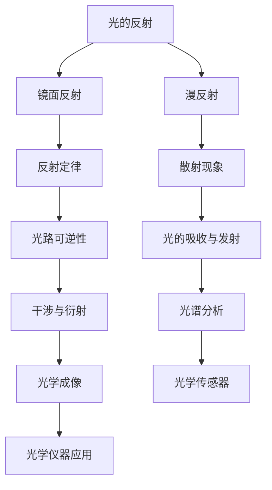
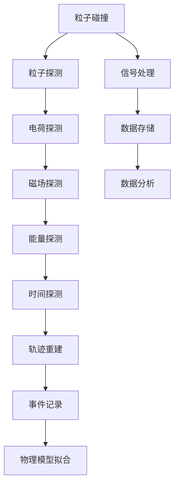

                 

### 文章标题

# 《科学仪器的进步如何增进世界可理解性》

### 关键词

- 科学仪器
- 可理解性
- 光学仪器
- 粒子物理实验
- 化学分析仪器
- 医学影像技术
- 地球科学勘探
- 人工智能应用

### 摘要

科学仪器是人类探索自然界和宇宙的重要工具，其不断进步推动了科学认知的深入。本文旨在探讨科学仪器进步对世界可理解性的增进作用。通过分析光学仪器、粒子物理实验仪器、化学分析仪器、医学影像技术和地球科学勘探仪器的发展历程与应用，本文揭示了科学仪器进步如何帮助人类更好地理解自然现象和科学原理。同时，本文还探讨了人工智能在科学仪器中的应用及其对未来发展的推动作用。文章最后对科学仪器进步的未来挑战与机遇进行了展望，强调科学家和工程师在推动科学仪器进步中的关键角色。

### 目录大纲

## 第一部分：引论

### 第1章：科学仪器进步对世界认知的背景

#### 1.1 科学仪器的定义与发展

#### 1.2 科学仪器进步的历史脉络

#### 1.3 科学仪器进步对科学研究的影响

### 第2章：科学仪器进步与全球可理解性的关联

#### 2.1 科学与理解：理论基础探讨

#### 2.2 科学仪器进步对认知能力的增强

#### 2.3 全球可理解性：定义与衡量

## 第二部分：科学仪器的核心领域与应用

### 第3章：光学仪器的发展与宇宙认知

#### 3.1 光学仪器的基本原理

#### 3.2 光学仪器在宇宙观测中的应用

#### 3.3 光学仪器进步对宇宙认知的贡献

### 第4章：粒子物理实验中的科学仪器

#### 4.1 粒子物理的基础理论

#### 4.2 粒子探测器的原理与应用

#### 4.3 粒子物理仪器进步对科学发展的推动

### 第5章：化学分析仪器在环境监测中的应用

#### 5.1 化学分析仪器的基本功能

#### 5.2 环境监测中的科学仪器

#### 5.3 仪器进步对环境保护的贡献

### 第6章：医学影像技术的革新

#### 6.1 医学影像技术的原理

#### 6.2 医学影像在临床诊断中的应用

#### 6.3 仪器进步对医学诊断的改进

### 第7章：地球科学中的勘探仪器

#### 7.1 地球科学的基础知识

#### 7.2 地球科学中的主要勘探仪器

#### 7.3 仪器进步对地球科学研究的提升

## 第三部分：科学仪器进步的未来展望

### 第8章：人工智能与科学仪器

#### 8.1 人工智能在科学仪器中的应用

#### 8.2 人工智能对科学仪器进步的促进作用

#### 8.3 人工智能与科学仪器未来的发展趋势

### 第9章：科学仪器进步对全球可理解性的影响

#### 9.1 科学仪器进步的社会影响

#### 9.2 科学普及与公众认知的提升

#### 9.3 科学仪器进步推动全球可理解性的提升

### 第10章：科学仪器进步的未来挑战与机遇

#### 10.1 挑战：科学仪器进步面临的困难

#### 10.2 机遇：科学仪器进步的未来前景

#### 10.3 科学家与工程师的角色与使命

## 附录

### 附录 A：科学仪器相关资源

#### A.1 光学仪器资源

#### A.2 粒子物理仪器资源

#### A.3 化学分析仪器资源

#### A.4 医学影像技术资源

#### A.5 地球科学仪器资源

### 附录 B：数学模型与算法流程图

#### B.1 光学仪器原理 Mermaid 流程图

#### B.2 粒子物理探测器 Mermaid 流程图

#### B.3 化学分析仪器算法伪代码

#### B.4 医学影像技术算法伪代码

#### B.5 地球科学勘探仪器算法伪代码

## 第一部分：引论

### 第1章：科学仪器进步对世界认知的背景

科学仪器是科学研究和探索自然界的有力工具，其进步对人类对世界的认知产生了深远的影响。本章将首先介绍科学仪器的定义与发展，接着回顾科学仪器进步的历史脉络，并探讨科学仪器进步对科学研究的影响，为后续章节的深入分析奠定基础。

#### 1.1 科学仪器的定义与发展

科学仪器是指用于测量、观察、记录和模拟自然界现象的设备。这些仪器可以帮助科学家们更精确地获取数据，揭示自然界的规律。科学仪器的起源可以追溯到古代，当时人类开始使用简单的工具进行观察和实验。然而，真正的科学仪器发展始于17世纪，随着科学革命和工业革命的兴起，各种新型科学仪器被发明和改进。

例如，望远镜的发明使得人类能够观测到更远的宇宙，而显微镜的发明则让人们能够看到微小的生物结构和分子。在19世纪，电学和电磁学的迅速发展催生了更多先进的科学仪器，如电表、磁强计和光谱仪等。进入20世纪，随着计算机和电子技术的进步，科学仪器变得更加精密和自动化，例如粒子加速器和同步辐射光源等。

科学仪器的不断进步，不仅推动了科学研究的深入，也改变了人类对世界的认知方式。通过科学仪器的帮助，科学家们能够更准确地理解自然界的现象，揭示其背后的规律。

#### 1.2 科学仪器进步的历史脉络

科学仪器的发展历程可以分为几个重要阶段：

1. **古代工具**：在古代，人类开始使用简单的工具进行观察和实验，例如测量工具、天平和显微镜。虽然这些工具非常简单，但它们为现代科学仪器的诞生奠定了基础。

2. **17世纪**：科学革命期间，伽利略、牛顿等科学家发明和改进了多种科学仪器，如望远镜、显微镜和温度计。这些仪器的出现，极大地推动了天文学、物理学和生物学等领域的发展。

3. **19世纪**：随着工业革命的到来，科学仪器的制造技术得到极大提升。电学和电磁学的快速发展催生了电表、磁强计、光谱仪等先进科学仪器的诞生。

4. **20世纪**：20世纪是科学仪器飞速发展的时期。计算机和电子技术的应用，使得科学仪器变得更加精密和自动化。例如，粒子加速器和同步辐射光源的出现，为粒子物理和材料科学等领域的研究提供了强有力的工具。

5. **21世纪**：随着人工智能和量子技术的发展，科学仪器正朝着更加智能化和精确化的方向前进。例如，量子计算机和量子传感器等新型科学仪器的研发，有望带来科学研究的革命性突破。

科学仪器的发展历程不仅展示了人类对自然界的探索和认知，也反映了科学技术的发展轨迹。

#### 1.3 科学仪器进步对科学研究的影响

科学仪器进步对科学研究的影响是多方面的，主要体现在以下几个方面：

1. **数据获取能力提升**：科学仪器的进步使得科学家能够更精确地获取数据，从而更准确地描述自然现象和规律。例如，高分辨率显微镜可以观察到细胞内部的结构，高灵敏度的光谱仪可以检测出极微量的化学物质。

2. **研究手段多样化**：科学仪器的多样化发展，为科学家提供了多种研究手段。例如，粒子加速器可以用来研究基本粒子的性质，同步辐射光源可以用于材料科学和生命科学等领域。

3. **跨学科研究**：科学仪器的进步促进了跨学科研究的发展。例如，生物学和物理学之间的交叉研究，通过使用显微镜和粒子加速器等仪器，取得了许多重要成果。

4. **科学认知的扩展**：科学仪器的进步，使得人类能够探索更广阔的科学领域，扩展了科学认知的范围。例如，通过望远镜和卫星，人类能够观测到遥远的星系和行星，揭示宇宙的奥秘。

科学仪器的进步，不仅推动了科学研究的发展，也为人类社会带来了深远的影响。通过科学仪器的帮助，人类对自然界的认知不断深入，推动了科学技术的进步和人类文明的繁荣。

### 第2章：科学仪器进步与全球可理解性的关联

科学仪器进步对全球可理解性的影响是深远而广泛的。科学研究的本质是探索和理解自然界的规律，而科学仪器的进步则为这一探索提供了强有力的工具。本章将从理论基础、认知能力的增强以及全球可理解性的定义与衡量三个方面，探讨科学仪器进步如何增进全球可理解性。

#### 2.1 科学与理解：理论基础探讨

科学是一种系统性、结构化的知识体系，其核心目标在于解释和预测自然现象。理解则是科学活动的基础，是科学家通过观察、实验和理论推导，对自然规律进行认知的过程。科学仪器在此过程中起到了关键作用，因为它们提供了获取精确数据和验证理论假设的工具。

科学理解可以分为以下几个层次：

1. **描述性理解**：这是科学理解的最低层次，主要关注现象的描述。通过科学仪器，科学家可以精确地测量和记录自然现象，如温度、压力、速度等。

2. **解释性理解**：在描述性理解的基础上，科学家试图解释现象背后的原因。例如，通过使用光学仪器，科学家可以观察到光的干涉和衍射现象，并解释这些现象的物理原理。

3. **预测性理解**：最高层次的理解是能够预测未来现象。这需要科学家不仅理解现象的本质，还需要建立能够进行预测的理论模型。科学仪器在这一层次上扮演了重要角色，如粒子加速器可以用来验证物理理论的预测，探测新粒子的存在。

科学仪器的进步使得科学家能够更加深入地理解自然现象，推动了科学理论的发展和完善。

#### 2.2 科学仪器进步对认知能力的增强

科学仪器的进步显著增强了人类的认知能力，主要体现在以下几个方面：

1. **精确度提升**：科学仪器的精度不断提高，使得科学家能够测量更微小的物理量。例如，现代粒子探测器可以测量到基本粒子的微小相互作用，从而揭示它们的行为规律。

2. **观测范围扩展**：科学仪器的发展扩展了人类的观测范围，使得科学家能够探索宇宙的深处和微观世界。例如，射电望远镜可以探测到遥远星系发出的微弱信号，而纳米显微镜可以观察细胞内部的微观结构。

3. **数据获取能力增强**：科学仪器使得科学家能够获取更多的数据，从而进行更全面的分析。例如，化学分析仪器可以同时测量多种化学物质的浓度，为环境监测提供可靠的数据支持。

4. **跨学科研究**：科学仪器的进步促进了跨学科研究的发展。例如，医学影像技术结合了物理学、数学和计算机科学，使得医生能够更准确地诊断疾病。

科学仪器进步对认知能力的增强，使得科学家能够更加深入和全面地理解自然现象，推动了科学的发展。

#### 2.3 全球可理解性：定义与衡量

全球可理解性是指全球范围内对自然现象和科学规律的认知程度。科学仪器进步对全球可理解性的影响可以从以下几个方面衡量：

1. **科学知识的普及**：科学仪器的进步使得科学研究成果更加容易被公众理解。例如，通过电视节目和互联网，人们可以观看宇宙的直播观测和实验室的实验演示，从而增加对科学的兴趣和理解。

2. **科学技术的应用**：科学仪器的发展推动了科学技术的应用，使得科技更加贴近人们的日常生活。例如，医学影像技术使得疾病诊断更加准确和迅速，提升了医疗水平。

3. **教育资源的丰富**：科学仪器的进步为教育提供了丰富的资源，使得科学教育更加生动和有效。例如，虚拟实验室和在线课程等新兴教育模式，使得学生可以远程操作科学仪器，进行实验和探究。

4. **国际合作与交流**：科学仪器的进步促进了国际科学合作与交流。例如，大型科学实验设施如大型强子对撞机（LHC），吸引了全球科学家的参与，共同推动科学研究的进展。

科学仪器进步对全球可理解性的影响是多层次和全方位的。通过提升科学知识的普及、应用科学技术的进步、教育资源的丰富和国际合作的加强，科学仪器进步显著提高了全球对自然现象和科学规律的认知程度。

### 结论

科学仪器的进步对全球可理解性具有深远的影响。通过增强认知能力、扩展观测范围和提升数据获取能力，科学仪器帮助科学家更深入地理解自然现象和科学规律。同时，科学仪器的进步也推动了科学知识的普及、科学技术的应用和教育资源的丰富，从而提高了全球对自然现象和科学规律的理解。未来，随着科学仪器的不断进步，全球可理解性有望进一步提升，为人类社会带来更多的科学发现和技术创新。

## 第二部分：科学仪器的核心领域与应用

### 第3章：光学仪器的发展与宇宙认知

光学仪器是科学仪器中最重要的领域之一，对宇宙认知的深入具有关键作用。本章将探讨光学仪器的基本原理、在宇宙观测中的应用及其对宇宙认知的贡献。

#### 3.1 光学仪器的基本原理

光学仪器是利用光学原理进行观测和测量的设备。它们通常基于反射、折射和透射等光学现象工作。光学仪器的基本原理可以概括为以下几点：

1. **光的反射与折射**：光线在传播过程中遇到不同介质时会发生反射和折射。反射是指光线在界面上返回原介质，折射是指光线进入另一种介质时传播方向发生改变。光学仪器如平面镜和透镜利用这些原理进行光的控制。

2. **光的干涉与衍射**：光的干涉和衍射现象是光学仪器的核心原理之一。干涉现象可以用来测量光的波长和频率，而衍射现象可以用来观察光的传播方向和能量分布。例如，光的干涉现象被广泛应用于光谱仪和激光仪器中。

3. **光的吸收与发射**：光学仪器还可以利用光的吸收和发射特性进行测量。例如，光谱仪通过测量不同波长的光被样品吸收或发射的情况，可以分析样品的化学成分和物理性质。

#### 3.2 光学仪器在宇宙观测中的应用

光学仪器在宇宙观测中扮演了重要角色，帮助科学家们探索宇宙的奥秘。以下是一些主要的光学仪器及其在宇宙观测中的应用：

1. **望远镜**：望远镜是光学仪器中最著名的设备之一，用于观测天体。望远镜可以分为光学望远镜和射电望远镜。光学望远镜利用透镜或反射镜收集光线，放大远处的天体。例如，哈勃太空望远镜可以观测到遥远的星系和星云，揭示宇宙的演化过程。

2. **光谱仪**：光谱仪用于测量光的波长和强度分布，通过分析光谱可以确定天体的化学成分和物理状态。光谱仪在宇宙学研究中起到了关键作用，例如，通过观测星系光谱中的吸收线和发射线，可以了解星系的红移和距离。

3. **激光仪器**：激光仪器如激光干涉仪和激光雷达，可以精确测量天体的距离和形状。激光干涉仪通过干涉现象测量光波的相位差，可以确定天体的运动轨迹。激光雷达则利用激光脉冲测量目标物体的距离和三维形状，广泛应用于行星探测和天文观测。

4. **卫星和探测器**：光学仪器还集成在卫星和探测器中，进行空间观测。例如，地球观测卫星可以利用光学仪器监测地球环境，而火星探测器则使用光学仪器研究火星表面的地质结构和大气成分。

#### 3.3 光学仪器进步对宇宙认知的贡献

光学仪器的进步极大地推动了宇宙认知的深入，主要体现在以下几个方面：

1. **观测精度提高**：光学仪器的精度不断提高，使得科学家能够观测到更微弱和遥远的宇宙现象。例如，新一代望远镜如詹姆斯·韦伯空间望远镜（JWST），具有更高的分辨率和灵敏度，可以探测到早期宇宙的星系和星云。

2. **新的天体发现**：光学仪器的进步使得科学家能够发现新的天体，如行星、彗星和小行星等。例如，通过行星掩星观测，科学家发现了许多位于恒星周围的行星，揭示了这些行星的轨道和大气成分。

3. **宇宙演化研究**：光学仪器在宇宙学研究中起到了关键作用，通过观测宇宙背景辐射和星系红移，科学家可以研究宇宙的起源和演化。例如，利用光学仪器观测到的宇宙微波背景辐射，提供了宇宙早期状态的重要信息。

4. **多波段观测**：光学仪器与其他波段的观测设备相结合，如射电望远镜和红外望远镜，可以实现对天体的多波段观测。这种多波段观测提供了更全面和深入的科学数据，有助于科学家更好地理解天体的性质和宇宙的多样性。

光学仪器的发展与进步，为宇宙认知带来了革命性的变革。通过提高观测精度、发现新的天体、研究宇宙演化和实现多波段观测，光学仪器帮助人类逐步揭开了宇宙的神秘面纱。

### 第4章：粒子物理实验中的科学仪器

粒子物理实验是探索基本粒子和基本作用力的核心领域，其成功依赖于一系列先进的科学仪器。本章将介绍粒子物理的基础理论、粒子探测器的原理与应用以及仪器进步对粒子物理学发展的推动作用。

#### 4.1 粒子物理的基础理论

粒子物理学是研究基本粒子和基本相互作用的理论科学。基本粒子包括电子、夸克、光子等，它们是构成物质的基本单元。粒子物理学的目标是理解这些粒子的性质、相互作用以及宇宙的起源。

1. **标准模型**：标准模型是粒子物理学的核心理论，它描述了已知的基本粒子和相互作用。标准模型包括六个基本力的：强相互作用、弱相互作用、电磁力和引力。此外，标准模型还包括12种基本粒子，包括夸克和轻子。

2. **基本相互作用**：标准模型中的基本相互作用包括：
   - **强相互作用**：由胶子传递，主要作用在夸克和胶子之间，使得原子核中的质子和中子能够紧密结合。
   - **弱相互作用**：由W和Z玻色子传递，主要作用在轻子和夸克之间，参与β衰变等过程。
   - **电磁相互作用**：由光子传递，主要作用在带电粒子之间，如电子和质子之间的相互作用。
   - **引力相互作用**：由引力子传递，是所有物体之间的基本相互作用，尽管其作用非常微弱。

3. **粒子加速器**：粒子加速器是进行粒子物理实验的核心设备，它利用电磁场将带电粒子加速到高能状态。高能粒子碰撞产生新的粒子，通过探测和分析这些粒子，科学家可以研究基本粒子和基本相互作用。

#### 4.2 粒子探测器的原理与应用

粒子探测器是粒子物理实验中的关键设备，用于探测和记录粒子束的轨迹、能量和种类。以下是几种常用的粒子探测器及其原理与应用：

1. **磁场探测器**：磁场探测器利用磁场对带电粒子的偏转作用来测量粒子的轨迹。常用的磁场探测器包括电磁铁和磁铁。例如，在大型强子对撞机（LHC）中，磁场探测器用于测量高能粒子的轨迹。

2. **时间投影室（TPC）**：时间投影室是一种三维粒子追踪探测器，它利用电离信号和磁场信息来重建粒子的轨迹。TPC广泛应用于高能物理实验，如费米实验室的实验。

3. **硅径迹探测器**：硅径迹探测器利用半导体材料检测粒子通过时产生的电离信号，通过测量这些信号的分布来重建粒子的轨迹。硅径迹探测器具有高分辨率和低噪声，被广泛应用于粒子物理实验中。

4. **闪烁探测器**：闪烁探测器利用材料在粒子通过时产生的闪烁光来检测粒子。闪烁探测器广泛应用于能量测量和粒子识别，如用于测量高能粒子的能量和类型。

#### 4.3 粒子物理仪器进步对科学发展的推动

粒子物理仪器进步对粒子物理学的发展起到了重要的推动作用，主要体现在以下几个方面：

1. **观测精度提升**：随着探测器技术的进步，粒子探测器的分辨率和灵敏度不断提高。例如，新型硅径迹探测器的分辨率达到了微米级别，可以更精确地重建粒子轨迹，从而提升实验的精度。

2. **新的物理现象发现**：先进的粒子探测器使得科学家能够发现新的物理现象。例如，通过高能粒子碰撞实验，科学家发现了许多新的粒子，如粲夸克和中微子等。

3. **理论验证与探索**：粒子探测器的进步为科学家提供了更精确的数据，使得理论物理学家能够验证和探索新的理论模型。例如，通过对希格斯粒子的探测，科学家验证了标准模型中的希格斯机制。

4. **跨学科研究**：粒子物理实验中的先进探测器技术被广泛应用于其他领域，如医学成像、安全检测和材料科学等。例如，正电子发射断层扫描（PET）技术就是基于粒子探测器原理，用于医学诊断。

粒子物理实验中的科学仪器进步，不仅推动了粒子物理学的发展，也为其他科学领域提供了强大的工具，促进了科学技术的进步。

### 第5章：化学分析仪器在环境监测中的应用

化学分析仪器在环境监测中发挥着至关重要的作用，帮助科学家和环境管理者更好地了解环境污染状况，评估污染物的来源和影响，从而制定有效的环境保护策略。本章将介绍化学分析仪器的基本功能、在环境监测中的具体应用以及仪器进步对环境保护的贡献。

#### 5.1 化学分析仪器的基本功能

化学分析仪器是一类用于测量和检测化学物质成分、结构、含量和反应过程的设备。它们通常具有以下基本功能：

1. **成分分析**：化学分析仪器可以精确测量样品中的化学成分。例如，气相色谱仪（GC）和液相色谱仪（HPLC）通过分离和分析样品中的不同组分，实现成分分析。

2. **结构分析**：化学分析仪器能够揭示化学物质的结构信息。例如，质谱仪（MS）通过分析样品的质荷比，可以确定分子的结构和分子量。

3. **含量分析**：化学分析仪器可以测量样品中特定成分的含量。例如，原子吸收光谱仪（AAS）和电感耦合等离子体质谱仪（ICP-MS）可以精确测定样品中微量元素的含量。

4. **反应分析**：化学分析仪器可以监测化学反应的进程和结果。例如，红外光谱仪（IR）和拉曼光谱仪（RAMAN）可以实时观察化学反应过程中分子结构的改变。

#### 5.2 化学分析仪器在环境监测中的具体应用

化学分析仪器在环境监测中有着广泛的应用，以下是一些具体的实例：

1. **大气监测**：化学分析仪器用于监测大气中的污染物，如二氧化硫、氮氧化物和挥发性有机化合物（VOCs）。气相色谱仪和质谱仪可以通过采样和分析大气样品，检测和定量这些污染物。

2. **水质监测**：化学分析仪器用于监测水体中的污染物，如重金属、有机污染物和病原体。电感耦合等离子体质谱仪（ICP-MS）和紫外-可见光谱仪（UV-VIS）可以精确测定水中的微量元素和有机污染物。

3. **土壤监测**：化学分析仪器用于监测土壤中的污染物，如农药残留、重金属和有机污染物。土壤样品通过处理后，可以使用气相色谱仪、液相色谱仪和原子吸收光谱仪进行成分分析。

4. **生物监测**：化学分析仪器还可以用于生物监测，如检测水体和土壤中的病原体和抗生素残留。聚合酶链反应（PCR）技术和荧光定量检测仪等可以灵敏地检测微生物和生物分子。

#### 5.3 仪器进步对环境保护的贡献

仪器进步对环境保护的贡献体现在以下几个方面：

1. **监测精度提升**：随着化学分析仪器技术的进步，监测数据的精度和可靠性不断提高。例如，高分辨率气相色谱仪和质谱仪可以检测出极低浓度的污染物，从而提供更准确的环境数据。

2. **监测范围扩大**：新型化学分析仪器使得监测范围更加广泛。例如，便携式光谱仪和质谱仪可以用于现场快速监测，提高了环境监测的覆盖面和效率。

3. **检测成本降低**：先进化学分析仪器的发展降低了检测成本，使得更多地区和组织能够进行环境监测。例如，微流控技术和微分析仪器使得小规模实验室也能进行复杂的环境分析。

4. **环境保护策略优化**：精确的环境监测数据有助于环境管理者制定更科学和有效的环境保护策略。例如，通过分析污染物来源和影响，可以针对性地采取措施减少污染。

5. **技术创新与应用**：化学分析仪器技术的进步催生了新的环境保护技术和方法。例如，利用质谱技术进行污染物的快速检测和识别，以及开发基于纳米技术的污染治理材料。

化学分析仪器在环境监测中的应用，为环境保护提供了强有力的工具。通过提高监测精度、扩大监测范围、降低检测成本和优化环境保护策略，仪器进步显著促进了环境保护事业的发展。

### 第6章：医学影像技术的革新

医学影像技术是现代医学的重要工具，通过图像的方式帮助医生诊断和评估疾病。本章将介绍医学影像技术的原理、在临床诊断中的应用以及仪器进步对医学诊断的改进。

#### 6.1 医学影像技术的原理

医学影像技术基于不同的物理原理，通过生成体内器官、组织和病变的图像，帮助医生进行诊断。以下是几种主要医学影像技术的原理：

1. **X射线成像**：X射线成像是最早的医学影像技术，利用X射线穿透人体的能力，在胶片或数字传感器上形成图像。X射线成像可以显示骨骼和其他密度较高的组织，如肺部的轮廓。

2. **超声成像**：超声成像利用超声波在人体内的传播和反射特性，生成体内结构的实时图像。超声波在遇到不同密度的组织时会反射回来，通过接收这些反射波并转换成图像，医生可以观察到体内的器官和病变。

3. **CT扫描**：CT扫描（计算机断层扫描）利用X射线和计算机技术生成三维图像。在CT扫描过程中，X射线从多个角度穿过人体，由计算机处理这些数据，重建出内部结构的断层图像。CT扫描可以提供高分辨率的图像，用于诊断各种疾病。

4. **MRI成像**：MRI（磁共振成像）利用磁场和射频波在人体内产生图像。MRI成像不需要X射线，通过测量氢原子核在外加磁场中的共振信号，生成体内软组织的详细图像。MRI在诊断中枢神经系统、关节和肌肉组织方面具有独特的优势。

5. **PET和SPECT成像**：PET（正电子发射断层扫描）和SPECT（单光子发射计算机断层扫描）是核医学成像技术。它们利用放射性示踪剂在体内的分布，生成功能图像，帮助医生了解器官和组织的代谢和功能状态。

#### 6.2 医学影像在临床诊断中的应用

医学影像技术在临床诊断中具有广泛的应用，以下是一些具体实例：

1. **骨折诊断**：X射线成像是最常用的骨折诊断方法，通过观察骨骼的影像，医生可以确定骨折的类型和位置。

2. **肿瘤诊断**：CT扫描和MRI成像常用于肿瘤的诊断和分期。通过观察肿瘤的大小、形状和位置，医生可以确定肿瘤的类型和病情的严重程度。

3. **心血管疾病诊断**：超声成像和CT扫描可以检测心脏的结构和功能，如心脏瓣膜病变、冠状动脉狭窄等。MRI成像则可以更详细地观察心脏的血流情况。

4. **神经系统疾病诊断**：MRI成像在诊断中枢神经系统疾病，如脑肿瘤、脑出血、脑梗塞等方面具有很高的准确性。PET成像可以用于评估神经系统疾病的代谢状态。

5. **肺癌筛查**：低剂量CT扫描已成为肺癌筛查的推荐方法。通过早期发现肺结节，医生可以及时采取治疗措施，提高生存率。

#### 6.3 仪器进步对医学诊断的改进

随着医学影像技术的进步，医学诊断的准确性、效率和患者体验都得到了显著提升：

1. **图像质量提高**：新型影像设备如数字X射线机和高速CT扫描仪，能够生成更高分辨率的图像，提供更详细的信息，有助于医生做出准确的诊断。

2. **实时成像**：实时成像技术的应用，如实时超声和CT扫描，使得医生可以在手术过程中实时观察和调整操作，提高了手术的精准度和安全性。

3. **三维重建和可视化**：通过三维重建和可视化技术，医生可以更直观地观察体内结构和病变，有助于制定治疗方案。

4. **多模态成像**：多模态成像技术将不同成像技术（如CT、MRI、PET和SPECT）结合，提供更全面的信息，有助于提高诊断的准确性。

5. **人工智能辅助诊断**：人工智能技术在医学影像分析中的应用，如自动化分割、病灶检测和分类，可以提高诊断的速度和准确性，减轻医生的工作负担。

医学影像技术的革新不仅提升了医学诊断的准确性和效率，还改善了患者的治疗体验。随着技术的不断发展，医学影像技术将在未来继续为医学诊断和患者护理提供有力支持。

### 第7章：地球科学中的勘探仪器

地球科学是研究地球的物理、化学和生物特性的学科，涉及地质、气象、海洋等多个领域。勘探仪器在地球科学研究中起到了至关重要的作用，帮助科学家探索地球内部的奥秘，揭示地质过程和环境变化。本章将介绍地球科学的基础知识、主要勘探仪器的原理及其在地球科学研究中的应用，并探讨仪器进步对地球科学研究的重要性。

#### 7.1 地球科学的基础知识

地球科学是研究地球的结构、组成、演化过程以及与地球环境相互作用的一系列科学。地球科学主要包括以下几个分支：

1. **地质学**：地质学研究地球的岩石、矿物、地形和地质过程。地质学家通过研究地壳的运动、地震、火山和沉积过程，了解地球的历史和未来。

2. **气象学**：气象学研究大气层的物理和化学性质，以及天气和气候的变化。气象学家通过观测和分析天气现象，预测天气变化，研究气候变暖等环境问题。

3. **海洋学**：海洋学研究海洋的物理、化学和生物特性，包括海洋循环、海洋资源开发和海洋环境监测。海洋学家通过海洋探测技术和数据分析，了解海洋生态系统和气候变化。

4. **环境科学**：环境科学是研究人类活动对环境的影响及其相互作用的一门学科。环境科学家通过研究环境污染、生态系统破坏和可持续发展，提出环境保护和资源管理策略。

#### 7.2 地球科学中的主要勘探仪器

地球科学研究中使用的勘探仪器种类繁多，以下介绍几种主要仪器及其原理：

1. **地震仪**：地震仪是用于测量地震波传播和地震强度的设备。地震波分为纵波（P波）和横波（S波），地震仪通过记录这些波的振幅和到达时间，确定地震的震级、震中和震源深度。

2. **重力仪**：重力仪用于测量地球表面的重力变化。地球表面的重力分布与地壳密度和地形有关，通过测量重力变化，可以推断地壳结构和矿产资源。

3. **磁力仪**：磁力仪用于测量地球的磁场变化。地球的磁场受到地磁场的干扰，通过分析磁场变化，可以推断岩石的磁性特性和地质构造。

4. **电磁波探测器**：电磁波探测器通过发射和接收电磁波，探测地下和海底的地质结构。电磁波在不同介质中的传播速度和衰减特性不同，通过分析回波信号，可以推断地下岩石的性质和结构。

5. **遥感仪器**：遥感仪器从空中或卫星上发射电磁波，探测地表的物理和化学特性。遥感技术包括雷达、激光测高仪、多光谱成像仪等，可以提供高分辨率的地球表面图像，用于地质勘探和环境监测。

#### 7.3 仪器进步对地球科学研究的提升

仪器进步极大地提升了地球科学研究的深度和广度，以下是其具体表现：

1. **数据精度提高**：新型勘探仪器的精度和灵敏度不断提高，能够探测到更微小的地质变化和更细微的物理特性。例如，高分辨率地震仪可以更精确地记录地震波，提供更详细的地壳结构信息。

2. **探测范围扩大**：随着遥感技术的发展，地球科学家的探测范围从陆地扩展到海洋和大气，从地表延伸到地下和空间。例如，卫星遥感技术可以提供全球范围内的地质和气象数据，帮助科学家研究全球气候变化。

3. **实时监测能力增强**：现代勘探仪器可以实现实时监测，及时获取地球表面的动态变化。例如，实时地震监测系统可以实时记录地震活动，为防灾减灾提供科学依据。

4. **多学科交叉研究**：随着勘探仪器的进步，地球科学与其他学科的交叉研究得到加强。例如，地质学与物理学、化学和计算机科学的结合，促进了地球系统科学的发展。

5. **数据分析和处理能力提升**：随着计算技术和人工智能的发展，地球科学家的数据处理和分析能力显著提升。例如，大数据分析和机器学习技术可以快速处理大量勘探数据，识别地质特征和规律。

仪器进步为地球科学研究提供了强大的工具，使得科学家能够更深入、更全面地了解地球系统，为资源勘探、环境保护和防灾减灾提供了科学依据。

### 第8章：人工智能与科学仪器

人工智能（AI）的迅速发展正在深刻改变科学仪器的应用和性能。本章将探讨人工智能在科学仪器中的应用，以及它对科学仪器进步的促进作用和未来发展趋势。

#### 8.1 人工智能在科学仪器中的应用

人工智能技术在科学仪器中的应用日益广泛，主要表现在以下几个方面：

1. **数据处理**：科学仪器产生的数据量巨大且复杂，人工智能可以帮助科学家快速、准确地处理和分析这些数据。例如，机器学习算法可以自动识别和分类图像，从而在医学影像诊断中提高准确率。

2. **自动化操作**：人工智能技术可以自动化科学仪器的操作，减少人为误差并提高效率。例如，自动化机器人可以精确控制粒子加速器和望远镜，进行高精度的实验操作。

3. **预测建模**：人工智能可以帮助科学家建立预测模型，预测科学实验的结果。例如，通过深度学习算法，科学家可以预测化学反应的产物和反应路径，从而优化实验设计。

4. **故障诊断**：人工智能可以对科学仪器进行实时监测和故障诊断，及时发现和修复问题。例如，智能传感器和监控系统可以分析仪器运行数据，预测潜在的故障点，从而预防设备故障。

5. **数据可视化**：人工智能技术可以帮助科学家更直观地理解和展示实验数据。例如，生成对抗网络（GAN）可以生成高质量的虚拟实验数据，帮助科学家进行数据可视化和分析。

#### 8.2 人工智能对科学仪器进步的促进作用

人工智能技术对科学仪器的进步起到了重要的推动作用，具体体现在以下几个方面：

1. **提升效率和精度**：人工智能可以通过自动化和智能化操作，提高科学仪器的效率和精度。例如，机器人自动化实验室可以24小时不间断运行，提高实验效率，而智能仪器可以自动校准和调整，减少人为误差。

2. **发现新现象**：人工智能可以帮助科学家发现传统方法无法检测的新现象。例如，深度学习算法可以分析大量天文观测数据，发现新的恒星和行星系统。

3. **优化实验设计**：人工智能可以通过数据分析，帮助科学家优化实验设计，提高实验的成功率和可靠性。例如，机器学习算法可以优化粒子加速器的参数设置，提高实验结果的可重复性。

4. **跨学科研究**：人工智能技术促进了不同学科之间的交叉研究，推动了科学知识的整合。例如，物理学家可以使用人工智能技术分析生物学和医学数据，从而促进生命科学的研究。

5. **普及科学知识**：人工智能技术可以帮助普及科学知识，提高公众的科学素养。例如，通过在线教育和虚拟实验室，人们可以远程操作科学仪器，体验科学研究的乐趣。

#### 8.3 人工智能与科学仪器未来的发展趋势

随着人工智能技术的不断进步，科学仪器的未来发展将呈现以下趋势：

1. **智能化**：科学仪器将更加智能化，具备自我学习、自我调整和自我维护能力。例如，智能传感器可以实时监测仪器的运行状态，自动调整参数，确保最佳性能。

2. **网络化**：科学仪器将通过网络连接，实现数据共享和协同工作。例如，分布式科学实验网络可以实现全球科学家的实时数据交流和合作。

3. **虚拟化**：虚拟化技术将使得科学仪器的使用更加灵活和高效。例如，虚拟实验室可以实现科学仪器的远程操作和共享，降低实验成本。

4. **量子化**：随着量子计算技术的发展，量子科学仪器将逐渐应用于实际研究中。量子仪器具有超高的精度和速度，有望在基础科学和工程应用中带来革命性的突破。

5. **多模态融合**：多模态融合技术将结合不同类型的传感器和成像技术，提供更全面和精确的科学数据。例如，将量子传感器与传统光学传感器结合，可以实现更高精度的物理测量。

人工智能与科学仪器的结合，将推动科学研究和技术的进步，为人类揭示自然界的奥秘提供更加有力的工具。随着技术的不断发展，科学仪器将继续向着智能化、网络化和量子化的方向迈进，为未来的科学研究带来更多可能性。

### 第9章：科学仪器进步对全球可理解性的影响

科学仪器的进步对全球可理解性的影响是深远而广泛的，不仅提升了科学研究的深度和广度，还促进了科学知识的普及和公众认知的提升。本章将探讨科学仪器进步如何影响全球可理解性，具体体现在社会影响、科学普及和公众认知的提升方面。

#### 9.1 科学仪器进步的社会影响

科学仪器的进步对社会产生了深远的影响，主要体现在以下几个方面：

1. **科技发展**：科学仪器的进步推动了科技的发展，使得人类能够更好地理解和控制自然界。例如，光学仪器的进步使得人类能够观测到遥远的星系和微小的细胞结构，推动了天文学和生物学的进步。

2. **经济贡献**：科学仪器产业是一个庞大的经济体，其进步为经济增长和技术创新提供了强大动力。例如，医疗影像技术的发展带动了医疗器械市场的增长，为全球经济发展做出了重要贡献。

3. **教育和培训**：科学仪器的进步促进了科学教育和培训的发展。学校和研究机构通过使用先进的科学仪器，为学生和科研人员提供实践操作和科学研究的机会，培养了大量的科技人才。

4. **国际合作**：科学仪器的进步促进了国际间的科学合作和交流。例如，大型科学实验设施如大型强子对撞机（LHC），吸引了全球科学家的参与，推动了国际科学合作的发展。

5. **公共卫生**：科学仪器的进步在公共卫生领域发挥了重要作用。例如，核酸检测仪和基因测序仪的进步，使得疾病诊断和治疗更加准确和高效，提高了全球公共卫生水平。

#### 9.2 科学普及与公众认知的提升

科学仪器的进步不仅推动了科学研究的发展，也促进了科学知识的普及和公众认知的提升，具体体现在以下几个方面：

1. **科学传播**：科学仪器的进步为科学传播提供了更多的方式和平台。例如，通过互联网和社交媒体，科学家可以实时分享实验数据和成果，使公众能够更直观地了解科学研究的进展。

2. **科普教育**：科学仪器的进步为科普教育提供了丰富的资源。例如，虚拟实验室和在线课程等新兴教育模式，使得学生可以远程操作科学仪器，进行实验和探究，提高了学生对科学的兴趣和理解。

3. **公众参与**：科学仪器的进步鼓励了公众参与科学探索。例如，通过公共天文台和科学展览，公众可以亲自操作和观测科学仪器，亲身体验科学的乐趣，增强了公众对科学的认同感和参与感。

4. **科技素养**：科学仪器的进步提升了公众的科技素养，促进了科学文化的传播。例如，科学博物馆和科技馆通过展示先进的科学仪器和实验，向公众传播科学知识，提高了公众的科学素养。

5. **社会创新**：科学仪器的进步激发了社会创新和创业。例如，基于科学仪器的新型技术和产品不断涌现，推动了创新创业的发展，为经济发展提供了新动力。

#### 9.3 科学仪器进步推动全球可理解性的提升

科学仪器的进步在全球范围内推动了可理解性的提升，主要体现在以下几个方面：

1. **科学知识的普及**：科学仪器的进步使得科学知识更加普及和易于理解。通过电视节目、互联网和社交媒体等平台，科学仪器和科学研究的成果可以迅速传播到全球各地，提高了公众对科学的认知。

2. **跨文化交流**：科学仪器的进步促进了不同文化之间的科学交流。国际科学合作项目如大型科学实验和观测计划，吸引了全球科学家的参与，推动了科学知识的跨国界传播和交流。

3. **科学教育的发展**：科学仪器的进步为科学教育提供了更多资源和机会。从小学到大学，科学仪器被广泛应用于教学和科研中，培养了新一代科学家和科技人才。

4. **科学政策的制定**：科学仪器的进步为科学政策的制定提供了科学依据。政府和企业通过投资科学仪器和技术，推动科学研究和技术创新，促进了国家的科技发展和经济增长。

5. **全球问题解决**：科学仪器的进步在解决全球性问题中发挥了重要作用。例如，在气候变化、环境保护、疾病防治等方面，科学仪器提供了关键的数据和分析工具，为全球问题提供了科学解决方案。

科学仪器的进步不仅提升了科学研究的深度和广度，还促进了科学知识的普及和公众认知的提升，推动了全球可理解性的提升。随着科学仪器的不断进步，全球对自然界的认知将更加深入和全面，为人类社会带来更多的科学发现和技术创新。

### 第10章：科学仪器进步的未来挑战与机遇

科学仪器的不断进步为科学研究带来了巨大的机遇，同时也伴随着一系列的挑战。本章将探讨科学仪器进步面临的主要困难，包括技术瓶颈、成本和资源限制，并展望未来的发展前景，强调科学家和工程师在这一过程中的角色与使命。

#### 10.1 挑战：科学仪器进步面临的困难

1. **技术瓶颈**：尽管科学仪器技术取得了显著进展，但仍然存在许多技术瓶颈。例如，在粒子物理学中，探测器的分辨率和灵敏度需要进一步提升，以发现新的物理现象。在医学影像技术中，如何实现更高分辨率和更快成像速度的图像生成，仍是一个挑战。

2. **成本问题**：科学仪器的研发和生产成本极高，这对科学项目的经费提出了巨大挑战。特别是在大型国际合作项目中，如何合理分配和利用有限的资源，以确保仪器研发和运行的经济可行性，是一个亟待解决的问题。

3. **资源限制**：科学仪器的运行和维护需要大量的资源和能源，这对全球环境造成了压力。例如，粒子加速器和大型天文望远镜等设备，需要大量电力和冷却资源，如何在保证高性能的同时，降低能源消耗和环境影响，是一个重要的挑战。

4. **数据管理**：科学仪器生成的数据量巨大且复杂，如何有效管理和分析这些数据，已成为科学界面临的一个重要问题。随着数据量的爆炸性增长，数据存储、传输和处理的效率需要不断提高，以支持科学研究的深度和广度。

#### 10.2 机遇：科学仪器进步的未来前景

1. **技术创新**：随着人工智能、量子技术和新材料科学的不断发展，科学仪器将迎来新的技术革命。例如，量子传感器和量子计算机等新型科学仪器的出现，有望大幅提升科学研究的精度和效率。

2. **国际合作**：全球科学合作将继续深化，国际合作项目将推动科学仪器技术的跨国界发展。例如，国际空间站上的科学仪器项目，促进了全球科学家之间的交流和合作，推动了科学知识的共享和进步。

3. **开放科学**：随着开放科学运动的兴起，科学仪器和数据的开放共享将更加普遍。这将为全球科学家提供更多的研究资源，促进科学研究的透明化和协作，提升全球科学研究的整体水平。

4. **公众参与**：科学仪器进步将促进公众参与科学研究的程度。通过虚拟实验室和在线平台，公众可以更方便地参与到科学实验中，提高公众的科学素养和对科学的兴趣。

5. **可持续发展**：科学仪器的发展将更加注重可持续性，绿色技术和环保设计将成为重要方向。例如，开发低能耗、高效率的科学仪器，减少科学实验对环境的影响，推动科学研究的可持续发展。

#### 10.3 科学家与工程师的角色与使命

1. **创新与研发**：科学家和工程师在科学仪器的研发中扮演关键角色，他们需要不断探索新技术、解决技术难题，推动科学仪器的创新和发展。

2. **跨学科合作**：科学家和工程师需要加强跨学科合作，结合不同领域的知识和技术，推动科学仪器的综合应用和发展。

3. **教育培养**：科学家和工程师有责任培养下一代科技人才，通过教育和培训，提高公众对科学仪器的认识和使用能力。

4. **社会影响**：科学家和工程师应关注科学仪器的社会影响，推动科学知识的普及和应用，促进科技进步和社会发展。

5. **可持续发展**：科学家和工程师需考虑科学仪器的可持续发展，通过绿色技术和环保设计，减少科学实验对环境的影响，推动科学研究与环境保护的协调发展。

科学仪器进步的未来充满挑战与机遇。科学家和工程师在这一过程中的角色至关重要，他们需要不断创新、加强合作、注重教育和社会影响，共同推动科学仪器的进步，为人类揭示自然界的奥秘和促进社会可持续发展做出更大贡献。

### 附录

#### 附录 A：科学仪器相关资源

科学仪器的相关资源对于科研人员、学生和教育者来说都是宝贵的资料。以下是一些科学仪器相关的资源，涵盖光学仪器、粒子物理仪器、化学分析仪器、医学影像技术和地球科学仪器等领域。

##### A.1 光学仪器资源

1. **美国光学学会（OSA）**：OSA 提供了丰富的光学研究资源和出版物，包括期刊、会议信息和光学技术指南。

   - 网址：[https://www.osapublishing.org/osa/](https://www.osapublishing.org/osa/)

2. **欧洲光学学会（EOS）**：EOS 是欧洲光学领域的专业组织，提供光学相关的教育、培训和会议信息。

   - 网址：[https://www.europeanoptics.org/](https://www.europeanoptics.org/)

3. **美国国家标准与技术研究院（NIST）**：NIST 提供了光学仪器的标准和计量信息。

   - 网址：[https://www.nist.gov/](https://www.nist.gov/)

##### A.2 粒子物理仪器资源

1. **欧洲核子研究中心（CERN）**：CERN 是粒子物理学研究的重要机构，提供了大量关于粒子物理仪器和实验的信息。

   - 网址：[https://home.cern/](https://home.cern/)

2. **美国费米实验室**：费米实验室是粒子物理学研究的重要机构，提供了丰富的粒子物理仪器和实验资源。

   - 网址：[https://www.fnal.gov/](https://www.fnal.gov/)

3. **粒子物理学数据组（PDG）**：PDG 提供了粒子物理学的标准数据集，包括粒子性质、相互作用等。

   - 网址：[https://pdglive.lbl.gov/](https://pdglive.lbl.gov/)

##### A.3 化学分析仪器资源

1. **美国化学学会（ACS）**：ACS 提供了关于化学分析仪器的最新研究进展和出版物。

   - 网址：[https://www.acs.org/](https://www.acs.org/)

2. **德国化学与物理学会（GDCh）**：GDCh 提供了关于化学分析仪器和技术的教育资源和会议信息。

   - 网址：[https://www.gdch.de/](https://www.gdch.de/)

3. **美国国家标准与技术研究院（NIST）**：NIST 提供了化学分析仪器相关的标准和计量信息。

   - 网址：[https://www.nist.gov/](https://www.nist.gov/)

##### A.4 医学影像技术资源

1. **美国放射学会（ACR）**：ACR 提供了医学影像技术的专业指导和培训资源。

   - 网址：[https://www.acr.org/](https://www.acr.org/)

2. **欧洲放射学会（ESR）**：ESR 提供了关于医学影像技术的最新研究进展和会议信息。

   - 网址：[https://www.esr.eu.org/](https://www.esr.eu.org/)

3. **医学影像技术学会（SRS）**：SRS 提供了医学影像技术的教育和培训资源。

   - 网址：[https://www.srsweb.org/](https://www.srsweb.org/)

##### A.5 地球科学仪器资源

1. **美国地质调查局（USGS）**：USGS 提供了地球科学仪器和相关数据的资源，包括地质、气象和海洋数据。

   - 网址：[https://www.usgs.gov/](https://www.usgs.gov/)

2. **欧洲地球科学联盟（EGU）**：EGU 提供了地球科学研究的最新进展和会议信息。

   - 网址：[https://www.egu.eu/](https://www.egu.eu/)

3. **国际地球科学组织联盟（IUGS）**：IUGS 提供了关于地球科学教育和国际合作的信息。

   - 网址：[https://www.iugs.org/](https://www.iugs.org/)

这些资源为科学仪器的研究和使用提供了丰富的信息和指导，有助于推动科学仪器的进步和应用。

### 附录 B：数学模型与算法流程图

科学仪器的研究与应用离不开数学模型和算法的支持。以下是一些常见科学仪器中的数学模型和算法流程图，使用Mermaid语法进行展示。

#### B.1 光学仪器原理 Mermaid 流程图



#### B.2 粒子物理探测器 Mermaid 流程图



#### B.3 化学分析仪器算法伪代码

```plaintext
// 化学分析仪器算法伪代码
function analyzeChemicalSample(sample):
    // 数据预处理
    preprocessedSample = preprocessSample(sample)
    // 提取特征
    features = extractFeatures(preprocessedSample)
    // 特征分析
    results = analyzeFeatures(features)
    // 结果可视化
    visualizeResults(results)
    return results
```

#### B.4 医学影像技术算法伪代码

```plaintext
// 医学影像技术算法伪代码
function medicalImageAnalysis(image):
    // 图像预处理
    preprocessedImage = preprocessImage(image)
    // 图像分割
    segmentedImage = segmentImage(preprocessedImage)
    // 特征提取
    features = extractFeatures(segmentedImage)
    // 诊断模型预测
    diagnosis = predictDiagnosis(features)
    return diagnosis
```

#### B.5 地球科学勘探仪器算法伪代码

```plaintext
// 地球科学勘探仪器算法伪代码
function earthScienceExploration(data):
    // 数据预处理
    preprocessedData = preprocessData(data)
    // 特征提取
    features = extractFeatures(preprocessedData)
    // 地质构造分析
    geologicalStructure = analyzeGeologicalStructure(features)
    // 资源评估
    resourceAssessment = assessResources(geologicalStructure)
    return resourceAssessment
```

这些流程图和伪代码展示了科学仪器中的基本原理和算法步骤，有助于理解和应用科学仪器的技术。通过这些工具，科学家和工程师可以更好地进行科学研究和仪器开发。

