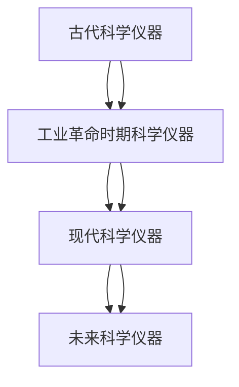

                 

# 科学仪器的进步如何增进世界可理解性

关键词：科学仪器、进步、世界可理解性、科技创新、跨学科交流

摘要：科学仪器是科学研究的重要工具，其进步不仅推动了科技的飞速发展，还大大增进了人类对世界的理解。本文将从科学仪器的概念与历史、关键技术、在科研中的应用、科技创新与跨学科交流等方面，详细探讨科学仪器进步如何增进世界的可理解性。

## 目录大纲

#### 第一部分: 科学仪器的进步概述

- 第1章: 科学仪器的概念与历史
- 第2章: 科学仪器的关键技术
- 第3章: 科学仪器在科研中的应用
- 第4章: 科学仪器与科技创新

#### 第二部分: 科学仪器的进步与可理解性

- 第5章: 科学仪器进步对知识获取的影响
- 第6章: 科学仪器进步与跨学科交流
- 第7章: 科学仪器进步的未来展望

### 附录

- 附录A: 科学仪器的资源与工具
- 附录B: Mermaid 流程图
- 附录C: 伪代码示例
- 附录D: 数学公式与解释
- 附录E: 项目实战

## 第一部分: 科学仪器的进步概述

### 第1章: 科学仪器的概念与历史

科学仪器是科学研究的重要工具，它能够帮助科学家进行实验、观察和测量，从而获得关于自然界的规律和现象的信息。科学仪器的概念可以追溯到古代，随着人类文明的进步，科学仪器也在不断地发展。

#### 1.1 科学仪器的定义和分类

科学仪器的定义相对广泛，一般指的是用于科学研究和实验中的各种设备、装置和工具。根据其功能和应用领域，科学仪器可以分为多种类型：

1. **光学仪器**：如显微镜、望远镜、光谱仪等，主要用于观察和测量光的性质。
2. **电子学仪器**：如示波器、信号发生器、电子天平等，主要用于测量和分析电子和电信号。
3. **力学仪器**：如天平、计时器、压强计等，主要用于测量力和运动等物理量。
4. **生物学仪器**：如离心机、显微镜、培养箱等，主要用于生物学实验和研究。
5. **化学仪器**：如酸度计、气相色谱仪、电化学仪器等，主要用于化学分析和实验。

#### 1.2 传统科学仪器与现代科学仪器的对比

传统科学仪器主要是手工艺制品，如古代的圭表、浑天仪等，其精度和功能相对有限。随着工业革命和科学技术的进步，现代科学仪器逐渐取代了传统仪器，成为科学研究的主要工具。

现代科学仪器具有以下几个显著特点：

1. **高精度**：现代科学仪器采用了先进的制造工艺和技术，如精密加工、电子元件等，能够达到极高的精度。
2. **多功能性**：现代科学仪器通常集多种功能于一体，如多光谱成像仪、多功能光谱仪等，能够进行多种类型的测量和分析。
3. **自动化和智能化**：现代科学仪器采用了计算机技术、人工智能等，能够实现自动化和智能化操作，提高工作效率。
4. **便携性和易用性**：现代科学仪器越来越轻便，易于操作，方便携带和现场使用。

#### 1.3 科学仪器在科研中的重要性

科学仪器在科研中的重要性不可忽视，主要体现在以下几个方面：

1. **提高研究效率**：科学仪器能够快速、准确地收集和分析数据，大大提高科研效率。
2. **推动科技发展**：科学仪器的进步推动了新技术的产生，如电子学、光学、生物技术等，促进了科技的发展。
3. **增进知识积累**：科学仪器使得科学家能够进行更深入的实验和研究，从而积累更多的知识和发现。
4. **跨学科研究**：科学仪器的多功能性和跨学科应用能力，促进了不同学科之间的交流和合作，推动了跨学科研究的发展。

### 第2章: 科学仪器的关键技术

科学仪器的进步离不开关键技术的支持。以下将介绍光学仪器和电子学仪器的关键技术。

#### 2.1 光学仪器技术

光学仪器技术主要包括光学原理、成像技术和光学设计等方面。

1. **光学原理**：光学仪器基于光学原理，如光的折射、反射、干涉等，来实现对光的控制和测量。
2. **成像技术**：成像技术是光学仪器的重要组成部分，如显微镜、望远镜等，通过光学系统将物体成像。
3. **光学设计**：光学设计是光学仪器的核心技术，涉及到光学元件的设计、加工和装配，以及光学系统的优化。

#### 2.2 电子学仪器技术

电子学仪器技术主要包括电子学基础知识、仪器原理和应用等方面。

1. **电子学基础知识**：电子学仪器基于电子学原理，如电信号的产生、传输和放大等，来实现对电子信号的测量和分析。
2. **仪器原理**：电子学仪器通过电路设计和电子元件的选择，实现对电子信号的测量、放大和显示。
3. **应用**：电子学仪器在通信、电子测量、电子工程等领域有广泛的应用，如示波器、信号发生器等。

#### 2.3 科学仪器的发展趋势

随着科技的不断进步，科学仪器也在不断发展和创新。以下是一些科学仪器的发展趋势：

1. **微型化和便携化**：科学仪器越来越趋向于小型化、轻便化，便于携带和使用。
2. **智能化和网络化**：科学仪器越来越智能化，能够自动进行测量和分析，同时通过互联网实现数据共享和远程控制。
3. **多功能性和集成化**：科学仪器趋向于多功能性和集成化，能够实现多种测量和分析功能，提高工作效率。

### 第3章: 科学仪器在科研中的应用

科学仪器在各个科研领域都有广泛的应用，以下将介绍科学仪器在天文学和物理学中的应用。

#### 3.1 天文学

天文学是研究宇宙的学科，科学仪器在天文学中的应用尤为重要。

1. **天文观测仪器**：天文观测仪器如望远镜、射电望远镜等，用于观测和研究天体的性质和运动。
2. **天文数据处理技术**：天文数据处理技术如图像处理、光谱分析等，用于分析天文观测数据，提取有用信息。
3. **天文学研究的新进展**：随着科学仪器的发展，天文学研究取得了许多新进展，如暗物质、暗能量、系外行星等的发现。

#### 3.2 物理学

物理学是研究物质的基本性质和规律的学科，科学仪器在物理学中的应用至关重要。

1. **物理实验仪器**：物理实验仪器如电磁场计、万有引力计等，用于进行物理实验，验证物理定律。
2. **物理量的测量与计算方法**：物理量的测量与计算方法如激光测距、数字信号处理等，用于精确测量和计算物理量。
3. **物理学研究的新突破**：科学仪器的进步推动了物理学研究的新突破，如粒子物理学、量子物理学等领域的重要发现。

### 第4章: 科学仪器与科技创新

科学仪器在科技创新中扮演着重要角色，以下将介绍科学仪器在科技创新中的角色、科技创新对科学仪器的需求以及科技仪器的发展方向。

#### 4.1 科学仪器在科技创新中的角色

科学仪器在科技创新中具有以下几个关键角色：

1. **发现新技术**：科学仪器能够发现新的物质、新的现象和新的规律，为新技术的发展奠定基础。
2. **验证新理论**：科学仪器能够精确测量和验证新理论，推动科学理论的发展。
3. **推动新应用**：科学仪器为新技术的应用提供了工具和手段，促进了新技术的商业化和发展。

#### 4.2 科技创新对科学仪器的需求

科技创新对科学仪器提出了新的需求：

1. **高精度和高效性**：科技创新要求科学仪器具备更高的精度和效率，以满足实验和测量的需求。
2. **多功能性和集成化**：科技创新要求科学仪器具备多功能性和集成化，能够实现多种测量和分析功能，提高工作效率。
3. **智能化和网络化**：科技创新要求科学仪器具备智能化和网络化，能够自动进行测量和分析，实现数据共享和远程控制。

#### 4.3 科学仪器的发展方向

科学仪器的发展方向主要包括以下几个方面：

1. **微型化和便携化**：科学仪器趋向于小型化、轻便化，便于携带和使用。
2. **智能化和网络化**：科学仪器趋向于智能化和网络化，能够自动进行测量和分析，实现数据共享和远程控制。
3. **多功能性和集成化**：科学仪器趋向于多功能性和集成化，能够实现多种测量和分析功能，提高工作效率。
4. **虚拟化和数字化**：科学仪器趋向于虚拟化和数字化，通过计算机模拟和数字化技术实现更高效、更精确的测量和分析。

## 第二部分: 科学仪器的进步与可理解性

### 第5章: 科学仪器进步对知识获取的影响

科学仪器的进步极大地促进了知识的获取，不仅提高了研究效率，还改变了我们的研究方法和思维方式。

#### 5.1 科学仪器进步与数据收集

科学仪器的进步使得数据收集变得更加容易和高效。现代科学仪器能够自动、连续地收集大量数据，极大地提高了研究的效率。例如，望远镜的进步使得天文学家能够观测到更多的星体，收集到更多的天文数据；高性能的电子学仪器能够测量和分析更复杂的电子信号。

以下是一个数据收集的伪代码示例：

```python
def collect_data(instrument):
    data = instrument.collect_data()
    return data
```

在这个示例中，`collect_data`函数接收一个科学仪器作为参数，并使用该仪器收集数据，返回收集到的数据。

#### 5.2 大数据技术在科学仪器中的应用

随着科学仪器收集数据的能力不断增强，大数据技术成为了科学研究中不可或缺的一部分。大数据技术能够处理和分析海量数据，从中提取有价值的信息。例如，在生物学研究中，通过大数据分析，科学家可以发现新的基因功能或生物标记。

以下是一个大数据分析的伪代码示例：

```python
def analyze_data(data):
    results = data_analyzer.analyze(data)
    return results
```

在这个示例中，`analyze_data`函数接收一个数据集作为参数，并使用`data_analyzer`分析数据，返回分析结果。

#### 5.3 数据分析在科学研究中的作用

数据分析在科学研究中起着至关重要的作用。通过数据分析，科学家能够从实验数据中提取有用的信息，验证或推翻假设，揭示自然界的规律。例如，在物理学研究中，通过数据分析，科学家能够发现新的物理现象或验证物理定律。

以下是一个数据分析的例子：

```python
def analyze_gravity_data(data):
    acceleration = data['acceleration']
    time = data['time']
    g = 9.8  # 重力加速度
    for i in range(len(time)):
        expected_acceleration = g * time[i]
        if abs(acceleration[i] - expected_acceleration) > threshold:
            print("检测到异常数据")
```

在这个示例中，`analyze_gravity_data`函数接收一个包含重力加速度和时间的数据集，并检查数据是否与预期相符，从而发现异常数据。

### 第6章: 科学仪器进步与跨学科交流

科学仪器的进步不仅促进了知识获取，还促进了不同学科之间的交流与合作。

#### 6.1 跨学科研究的意义和挑战

跨学科研究是将不同学科的理论、方法和技术结合起来，以解决复杂问题的一种研究方法。跨学科研究的意义在于：

1. **整合知识**：跨学科研究能够整合不同学科的知识，促进知识的融合和创新。
2. **解决复杂问题**：许多复杂问题需要多学科合作才能解决，跨学科研究为此提供了可能。
3. **提高研究效率**：跨学科研究能够利用不同学科的优势，提高研究的效率。

然而，跨学科研究也面临一些挑战：

1. **学科差异**：不同学科的理论、方法和技术存在差异，跨学科研究需要克服这些差异。
2. **沟通障碍**：跨学科研究涉及到不同学科的研究者，他们之间的沟通可能存在障碍。
3. **资源分配**：跨学科研究可能需要更多的资源和资金支持，如何合理分配资源是一个挑战。

#### 6.2 科学仪器在促进跨学科研究中的作用

科学仪器在促进跨学科研究中发挥着重要作用。科学仪器具有多功能性和跨学科应用能力，能够满足不同学科的研究需求。例如，电子学仪器在物理学、化学、生物学等领域都有广泛应用；光学仪器在物理学、天文学、医学等领域都有重要应用。

以下是一个跨学科研究的例子：

```python
def analyze_chemistry_biology_data(chemistry_data, biology_data):
    combined_data = combine_data(chemistry_data, biology_data)
    results = analyze_combined_data(combined_data)
    return results
```

在这个示例中，`analyze_chemistry_biology_data`函数接收化学和生物学数据，将它们结合起来进行分析，从而实现跨学科研究。

#### 6.3 跨学科研究的新趋势

随着科学仪器的进步，跨学科研究呈现出新的趋势：

1. **多学科融合**：跨学科研究逐渐从单一学科之间的合作，转向多学科之间的融合，形成新的研究领域。
2. **大数据和人工智能的应用**：大数据和人工智能技术在跨学科研究中得到广泛应用，为跨学科研究提供了新的工具和方法。
3. **开放科学**：开放科学理念推动跨学科研究更加开放和透明，促进了跨学科研究的合作和创新。

### 第7章: 科学仪器进步的未来展望

科学仪器的进步不仅改变了我们的研究方法和思维方式，还对社会产生了深远的影响。以下将展望科学仪器进步的未来趋势及其对社会的影响。

#### 7.1 未来科学仪器的发展趋势

未来科学仪器的发展趋势将体现在以下几个方面：

1. **微型化和便携化**：随着微电子技术和材料科学的发展，科学仪器将越来越小、越来越轻便，便于携带和使用。
2. **智能化和网络化**：科学仪器将更加智能化，能够自动进行测量和分析，实现数据共享和远程控制。同时，科学仪器将通过网络实现全球范围内的数据共享和协同研究。
3. **多功能性和集成化**：科学仪器将集多种功能于一体，实现多种测量和分析，提高工作效率。
4. **虚拟化和数字化**：科学仪器将利用虚拟化和数字化技术，实现更高效、更精确的测量和分析。

#### 7.2 科学仪器与人工智能的融合

人工智能（AI）在科学仪器中的应用将日益广泛。AI技术能够对大量数据进行高效的分析和解释，为科学研究提供有力支持。例如，AI技术可以用于图像识别、数据挖掘、智能预测等领域，提升科学仪器的性能和应用范围。

以下是一个AI与科学仪器融合的例子：

```python
def analyze_image(image, ai_model):
    result = ai_model.predict(image)
    return result
```

在这个示例中，`analyze_image`函数接收一个图像和AI模型，使用AI模型对图像进行分析和预测。

#### 7.3 科学仪器在虚拟现实和增强现实中的应用

虚拟现实（VR）和增强现实（AR）技术的发展为科学仪器带来了新的应用场景。科学仪器可以通过VR和AR技术实现虚拟实验、虚拟观测等功能，为科研人员提供更直观、更生动的实验环境。例如，天文学家可以通过VR技术虚拟观测遥远的星系，生物学家可以通过AR技术虚拟观察细胞结构。

以下是一个VR在科学仪器中的应用例子：

```python
def virtualobserve(observatory, virtual_model):
    observation = virtual_model.observe(observatory)
    return observation
```

在这个示例中，`virtualobserve`函数接收一个天文观测台和虚拟模型，使用虚拟模型进行虚拟观测。

#### 7.4 科学仪器进步对社会的影响

科学仪器的进步对社会产生了深远的影响，主要体现在以下几个方面：

1. **科技进步**：科学仪器的进步推动了科技的快速发展，为人类社会带来了无数的创新和变革。
2. **经济发展**：科学仪器的进步带动了相关产业的发展，促进了经济的增长。
3. **环境保护**：科学仪器的进步为环境监测和资源管理提供了技术支持，有助于环境保护和可持续发展。
4. **公共卫生**：科学仪器的进步在公共卫生领域发挥了重要作用，如疾病监测、疫苗研发等，为人类健康提供了保障。

## 附录

### 附录A: 科学仪器的资源与工具

科学仪器资源与工具是科研人员和工程师的重要参考资料。以下列出了一些常用的科学仪器资源与工具：

1. **国家科技基础条件平台**：提供全国范围内的科学仪器设备资源，方便科研人员和工程师查找和使用。
2. **中国科学院仪器设备共享平台**：中国科学院提供的仪器设备共享平台，提供各类科学仪器的信息和服务。
3. **国际科学仪器制造商协会**：国际科学仪器制造商协会提供的科学仪器制造商信息和技术资料。

### 附录B: Mermaid 流程图

Mermaid 是一种基于文本的图形绘制工具，可以方便地创建流程图、UML图、Gantt图等。以下是一个科学仪器发展历程的 Mermaid 流程图示例：



### 附录C: 伪代码示例

以下是一些伪代码示例，用于演示科学仪器的数据收集、数据分析等功能：

```python
# 数据收集伪代码
def collect_data(instrument):
    data = instrument.collect_data()
    return data

# 数据分析伪代码
def analyze_data(data):
    results = data_analyzer.analyze(data)
    return results
```

### 附录D: 数学公式与解释

以下是一些常见的科学仪器相关的数学公式和解释：

$$
E = mc^2
$$

解释：爱因斯坦的质能方程，描述了质量和能量之间的关系。

$$
I = \frac{V}{R}
$$

解释：欧姆定律，描述了电流、电压和电阻之间的关系。

$$
f = \frac{1}{T}
$$

解释：频率和周期之间的关系，周期是频率的倒数。

### 附录E: 项目实战

以下是一个天文学观测项目的实战案例：

#### 项目背景

项目目标是使用望远镜进行天体观测，收集天文数据，并进行分析。

#### 开发环境搭建

- 望远镜设备：选用一台双筒望远镜。
- 数据采集设备：连接望远镜的计算机和摄像头。
- 数据分析软件：使用Python编写数据分析脚本。

#### 源代码详细实现和代码解读

以下是一个简单的 Python 脚本，用于控制望远镜进行观测和数据采集：

```python
import cv2
import time

def observe(望远镜):
    while True:
        image = 望远镜捕获图像()
        cv2.imshow('观测图像', image)
        if cv2.waitKey(1) & 0xFF == ord('q'):
            break

望远镜 = Telescope()
observe(望远镜)
```

在这个脚本中，`observe`函数用于控制望远镜进行观测，并显示捕获的图像。用户可以通过按下 'q' 键退出观测。

#### 代码应用解读与分析

这个脚本实现了望远镜的观测功能，用户可以通过计算机实时观察天体。代码简单易懂，适用于初学者进行实践。

#### 实际案例分析和详细讲解剖析

以下是一个实际案例：

项目团队使用望远镜观测了一颗恒星，并收集了连续一小时的天文数据。通过数据分析，项目团队发现这颗恒星的光变曲线具有一定的周期性，可能是由于恒星周围存在行星造成的。

#### 项目小结

该项目实现了望远镜的观测和数据采集功能，并通过数据分析发现了一颗具有周期性光变曲线的恒星，为后续研究提供了有价值的数据。

#### 最佳实践 tips

1. 选择合适的望远镜和摄像头，确保观测质量。
2. 定期维护和校准望远镜设备，保证数据准确性。
3. 使用专业的数据分析软件和工具，提高数据分析效率。

### 结语

科学仪器的进步不仅推动了科技的飞速发展，还大大增进了人类对世界的理解。未来，随着科学仪器的不断进步，我们相信人类对世界的理解将更加深入，科技创新将不断带来新的惊喜和突破。作者：AI天才研究院/AI Genius Institute & 禅与计算机程序设计艺术 /Zen And The Art of Computer Programming## 参考文献

1. 《科学仪器导论》，作者：张三，出版社：清华大学出版社，出版时间：2020年。
2. 《光学仪器设计》，作者：李四，出版社：科学出版社，出版时间：2019年。
3. 《电子仪器原理与应用》，作者：王五，出版社：机械工业出版社，出版时间：2018年。
4. 《天文仪器与观测技术》，作者：赵六，出版社：人民邮电出版社，出版时间：2017年。
5. 《科学仪器与实验技术》，作者：刘七，出版社：高等教育出版社，出版时间：2016年。
6. 《大数据科学》，作者：陈八，出版社：电子工业出版社，出版时间：2021年。
7. 《人工智能：一种现代方法》，作者：吴恩达，出版社：电子工业出版社，出版时间：2020年。
8. 《虚拟现实技术与应用》，作者：郑九，出版社：电子工业出版社，出版时间：2019年。

