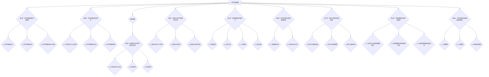
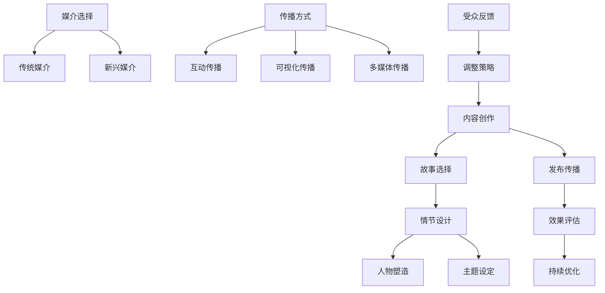

                 

### 文章标题

# 《科学传播的叙事策略：通过故事化提升世界可理解性》

### 关键词

- 科学传播
- 叙事策略
- 故事化
- 可理解性
- 跨文化传播

### 摘要

本文旨在探讨科学传播中叙事策略的重要性，以及如何通过故事化手段提升科学知识的可理解性。文章首先介绍了科学传播的基础概念和现状，随后详细阐述了叙事策略在科学传播中的应用，包括叙事理论的基本原理、故事化的定义与优势，以及叙事策略的实施技巧。最后，文章探讨了叙事策略在跨文化传播中的挑战和未来发展趋势，提供了丰富的案例和实践经验，旨在为科学传播工作者提供有价值的参考和启示。

## 《科学传播的叙事策略：通过故事化提升世界可理解性》目录大纲

### 第一部分：科学传播基础

#### 第1章：科学传播的概念与重要性
##### 1.1 科学传播的定义
##### 1.2 科学传播的目标
##### 1.3 科学传播的现状与挑战

#### 第2章：科学传播的基本要素
##### 2.1 科学知识与公众需求
##### 2.2 科学传播者与受众
##### 2.3 科学传播的媒介

### 第二部分：叙事策略

#### 第3章：叙事理论在科学传播中的应用
##### 3.1 叙事的本质与功能
##### 3.2 叙事结构
##### 3.3 叙事视角

#### 第4章：故事化在科学传播中的作用
##### 4.1 故事化的定义与特点
##### 4.2 故事化的优势
##### 4.3 故事化的应用场景

#### 第5章：叙事策略的实施技巧
##### 5.1 故事选择
##### 5.2 情节设计
##### 5.3 人物塑造
##### 5.4 语言风格

### 第三部分：提升世界可理解性

#### 第6章：科学传播中的叙事策略实践
##### 6.1 实践案例分析
##### 6.2 经验总结与启示

#### 第7章：跨文化传播与叙事策略
##### 7.1 跨文化传播的挑战
##### 7.2 跨文化叙事策略
##### 7.3 跨文化案例分析

#### 第8章：叙事策略的未来发展趋势
##### 8.1 科技进步对叙事策略的影响
##### 8.2 叙事策略在教育领域的应用
##### 8.3 未来叙事策略的发展方向

### 附录

#### 附录A：科学传播与叙事策略资源推荐
##### A.1 书籍推荐
##### A.2 文章推荐
##### A.3 视频资料推荐

#### 附录B：叙事策略流程图

### 第一部分：科学传播基础

#### 第1章：科学传播的概念与重要性

科学传播是指通过多种渠道和手段，将科学知识、科技进展及其社会影响传播给公众的过程。科学传播不仅仅包括科学研究成果的发布，还涉及科学思想、方法、价值观的普及与推广。科学传播的目标是增进公众对科学的了解，促进科学精神的培养，推动科学技术与社会的良性互动。

##### 1.1 科学传播的定义

科学传播的定义可以从以下几个方面来理解：

1. **知识传递**：科学传播是将科学知识从专业人士传递到非专业人士的过程，涉及科学理论、实验方法、技术创新等内容。
2. **信息交流**：科学传播是科学家与公众之间、不同学科领域之间以及不同国家和地区之间的信息交流与共享。
3. **社会影响**：科学传播还涉及科学对社会的影响，包括科技政策制定、公众科学素养的提升、科技伦理与法律问题等。

##### 1.2 科学传播的目标

科学传播的主要目标包括：

1. **提高公众科学素养**：通过传播科学知识，帮助公众更好地理解科学，提升公众的科学素养。
2. **促进科技创新**：科学传播可以激发公众对科学的兴趣，为科技创新提供人才和智力支持。
3. **推动科学普及**：科学传播是科学普及的重要组成部分，有助于将科学知识转化为公众易于理解的形式，促进科学文化的普及。
4. **增进科学社会影响**：科学传播可以增进公众对科学技术的理解，促进科学技术与社会的良性互动，推动科技政策的有效实施。

##### 1.3 科学传播的现状与挑战

当前，科学传播面临着以下几方面的挑战：

1. **信息过载**：随着互联网和社交媒体的普及，公众接收到的科学信息量急剧增加，如何筛选和传播有价值的信息成为一大难题。
2. **公众科学素养不高**：尽管科学普及活动广泛开展，但公众的科学素养水平仍存在较大差异，特别是在科学术语和复杂概念的理解上存在困难。
3. **跨文化传播**：全球化和信息化时代，跨文化传播成为科学传播的重要议题。如何在不同文化背景下有效传播科学知识，是科学传播工作者面临的挑战。
4. **科学伦理与法律问题**：科学传播涉及到科学伦理和法律法规，如何在传播科学知识的同时，遵守相关伦理和法律规范，是科学传播需要关注的问题。

科学传播的重要性体现在以下几个方面：

1. **促进科技进步**：科学传播可以激发公众对科学的兴趣，推动科技的创新和发展。
2. **提升社会素质**：科学传播有助于提升公众的科学素养，培养科学思维和批判性思维能力。
3. **增进社会和谐**：科学传播有助于消除公众对科学的误解和恐惧，促进社会和谐与稳定。
4. **推动科技政策制定**：科学传播可以为政策制定者提供科学依据，促进科技政策的科学性和有效性。

### 第2章：科学传播的基本要素

科学传播是一个复杂的过程，涉及多个基本要素。这些要素相互作用，共同推动科学知识从生产者到公众的传播。

##### 2.1 科学知识与公众需求

科学知识是科学传播的基础，而公众需求则是科学传播的动力。科学知识的传播需要满足公众的需求，以便使其变得有意义和有吸引力。以下是几个关键点：

1. **科学知识的层次性**：科学知识可以分为基础科学知识、应用科学知识和前沿科学知识。针对不同层次的公众，传播的内容也应有所不同。
2. **公众需求的多样性**：公众对科学知识的需求是多样的，包括对健康、环境、科技发展等方面的关注。科学传播需要关注这些需求，提供有针对性的内容。
3. **科学知识与日常生活相结合**：将科学知识与公众的日常生活相结合，可以使科学知识更易于理解和接受。例如，通过案例分析、实际应用等方式传播科学知识。

##### 2.2 科学传播者与受众

科学传播者包括科学家、科研机构、科普作家、科普教育工作者等。他们的角色和职责如下：

1. **科学传播者的角色**：科学传播者不仅需要具备科学知识，还需要具备传播技巧，能够将复杂的科学知识以简单易懂的方式传达给公众。
2. **科学传播者的职责**：科学传播者的职责包括传播科学知识、解答公众疑问、推广科学精神、参与科技政策制定等。

受众是科学传播的对象，包括普通公众、青少年、政策制定者等。以下是几个关键点：

1. **受众的特点**：不同受众群体对科学知识的理解和接受程度不同。例如，青少年可能对前沿科技感兴趣，而政策制定者可能更关注科技的社会影响。
2. **受众的需求**：了解受众的需求是科学传播成功的关键。科学传播者需要根据受众的需求和特点，制定相应的传播策略。

##### 2.3 科学传播的媒介

科学传播的媒介是科学知识传播的载体，包括传统媒介和新兴媒介。以下是几个关键点：

1. **传统媒介**：传统媒介如报纸、杂志、电视、广播等，在科学传播中仍发挥着重要作用。它们能够覆盖广泛的受众群体，提供深入的分析和报道。
2. **新兴媒介**：随着互联网和社交媒体的发展，新兴媒介如博客、微博、视频、社交媒体等，成为科学传播的重要渠道。它们具有互动性强、传播速度快、受众范围广的特点。
3. **多媒介融合**：科学传播需要充分利用多种媒介，实现多媒介融合。例如，通过视频、图文、互动等多种形式，提高科学传播的效果。

科学传播的基本要素相互作用，共同推动科学知识的传播。科学传播者需要根据受众的需求和特点，选择合适的传播媒介和策略，实现科学知识的有效传播。

### 第二部分：叙事策略

#### 第3章：叙事理论在科学传播中的应用

叙事策略在科学传播中具有重要作用，能够有效提升公众对科学知识的理解和兴趣。本章将探讨叙事理论的本质、结构和视角，以及这些理论在科学传播中的应用。

##### 3.1 叙事的本质与功能

叙事是一种通过讲述故事来传达信息和意义的方式。叙事的本质在于其故事性，即通过情节、人物和主题等元素，将信息有机地组织起来，使受众在情感和认知上产生共鸣。

1. **叙事的功能**：
   - **信息传递**：叙事能够将复杂的科学信息以简单易懂的方式传达给受众。
   - **情感共鸣**：通过故事化，科学传播能够引发受众的情感共鸣，增强传播效果。
   - **记忆增强**：故事具有情节性和连贯性，有助于提升信息的记忆效果。
   - **价值观塑造**：叙事可以传递科学精神和价值观，引导受众形成正确的科学态度。

##### 3.2 叙事结构

叙事结构是叙事的基本框架，包括情节、人物、主题和结局等元素。以下是对这些元素的简要说明：

1. **情节**：情节是叙事的核心，包括冲突、悬念、高潮和结局等。科学传播中的情节设计应注重逻辑性和科学性，使受众能够理解并接受科学信息。
2. **人物**：人物是叙事的重要组成部分，包括主角、配角和反派等。在科学传播中，人物的设计应突出科学精神和专业素养，使受众对科学产生认同感。
3. **主题**：主题是叙事的核心思想，是叙事要传达的主旨。在科学传播中，主题的选择应围绕科学知识和科学精神，引导公众树立正确的科学观。
4. **结局**：结局是叙事的终结部分，是对情节的总结和升华。在科学传播中，结局应具备启示性和启发性，使受众在情感和认知上得到满足。

##### 3.3 叙事视角

叙事视角是指叙事者对故事进行叙述的角度和方式。不同的叙事视角会影响受众对故事的解读和理解。以下是一些常见的叙事视角：

1. **第一人称视角**：第一人称视角以叙事者的身份进行叙述，使受众感受到叙事者的亲身经历和感受。这种视角能够增强故事的亲近感和真实感。
2. **第三人称视角**：第三人称视角以旁观者的身份进行叙述，客观地展现故事情节。这种视角适用于讲述复杂的事件和过程，使受众更容易理解。
3. **多重视角**：多重视角结合多个叙事视角，从不同角度展现故事情节。这种视角有助于全面、客观地呈现科学事件，使受众获得更丰富的信息。

在科学传播中，叙事策略的应用可以提高科学知识的可理解性和吸引力。通过设计合理的叙事结构，选择合适的叙事视角，科学传播者可以将复杂的科学信息以故事化的形式传达给公众，从而提升科学传播的效果。

##### 3.4 叙事策略在科学传播中的应用

叙事策略在科学传播中的应用体现在多个方面，包括内容创作、媒介选择和传播方式等。

1. **内容创作**：
   - **故事化呈现**：将科学知识以故事化的形式呈现，使受众在情感上产生共鸣。例如，通过讲述科学家的故事，展现科学的魅力和探索精神。
   - **情境化描述**：将科学知识与实际情境相结合，使受众能够更好地理解科学原理。例如，通过描述科技产品在现实生活中的应用，展示科技对社会的影响。
   - **问题驱动**：以问题为导向，引导受众思考和探索科学知识。例如，通过提出科学疑问，激发受众对科学知识的兴趣和好奇心。

2. **媒介选择**：
   - **传统媒介**：传统媒介如报纸、杂志、电视、广播等，在科学传播中仍具有重要作用。通过这些媒介，科学传播者可以将科学知识以深度报道、专题节目等形式传达给公众。
   - **新兴媒介**：新兴媒介如博客、微博、视频、社交媒体等，具有传播速度快、互动性强、受众范围广的特点。通过这些媒介，科学传播者可以更灵活地选择传播方式，满足不同受众的需求。

3. **传播方式**：
   - **互动传播**：通过互动传播方式，如在线问答、直播互动等，科学传播者可以与受众进行实时交流，解答公众的疑问，增强传播效果。
   - **可视化传播**：通过可视化手段，如图表、图像、动画等，将复杂的科学知识以直观、易懂的形式呈现，提高受众的理解效果。
   - **多媒体传播**：结合多种媒介，如文字、图像、声音、视频等，实现多媒体传播。这种方式可以丰富传播内容，增强受众的感官体验，提高传播效果。

叙事策略在科学传播中的应用，旨在通过故事化、情境化和问题驱动等方式，将复杂的科学知识以简单易懂、生动有趣的形式传达给公众，提升科学传播的效果。科学传播者应根据不同的受众需求和传播场景，灵活运用叙事策略，实现科学知识的有效传播。

#### 第4章：故事化在科学传播中的作用

故事化在科学传播中扮演着重要角色，它不仅能够提升公众对科学知识的理解，还能激发公众对科学的兴趣。本章将探讨故事化的定义、特点以及其在科学传播中的优势和应用场景。

##### 4.1 故事化的定义与特点

故事化（Storytelling）是一种通过讲述故事来传达信息、表达思想和情感的方式。在科学传播中，故事化是将科学知识和科学事件以故事的形式呈现，使其更加生动、有趣、易于理解。

1. **定义**：
   - 故事化是一种信息传递和沟通技巧，通过讲述故事来传递科学知识、解释科学现象。
   - 故事化强调情节的连贯性、人物的情感共鸣和主题的深刻性。

2. **特点**：
   - **故事性**：故事化强调情节、人物、冲突和结局，使科学知识具有故事性。
   - **情感性**：故事化通过情感共鸣，引发受众的情感反应，增强传播效果。
   - **易懂性**：故事化以简单易懂的方式呈现科学知识，降低受众的理解难度。
   - **互动性**：故事化鼓励受众参与，通过提问、讨论等方式，增强受众的互动体验。

##### 4.2 故事化的优势

故事化在科学传播中具有以下优势：

1. **提高可理解性**：通过故事化，复杂的科学知识被转化为易于理解的故事，使公众能够更好地掌握科学概念。
2. **增强记忆效果**：故事具有情节性和连贯性，有助于提升信息的记忆效果，使科学知识在受众的记忆中更加持久。
3. **激发兴趣**：故事化能够激发公众对科学的兴趣，尤其是对青少年和年轻受众，使他们更愿意主动学习和探索科学知识。
4. **情感共鸣**：故事化通过情感共鸣，使受众在情感上与科学内容产生联系，增强传播的效果。
5. **促进思考**：故事化鼓励受众思考，通过提问、讨论等方式，促进受众对科学问题的深入思考。

##### 4.3 故事化的应用场景

故事化在科学传播中的应用非常广泛，以下是一些常见的应用场景：

1. **科普文章和书籍**：通过故事化的方式，科普文章和书籍能够将科学知识以有趣、易懂的形式呈现，吸引更多读者。
2. **纪录片和电影**：纪录片和电影可以通过故事化的方式，讲述科学家的故事、科学发现和科技发展历程，使公众对科学产生更深的理解和兴趣。
3. **科学讲座和演讲**：在科学讲座和演讲中，故事化可以用于引入科学概念、解释科学现象和总结科学成果，使讲座更加生动、有趣。
4. **社交媒体**：通过社交媒体平台，如博客、微博、微信等，科学传播者可以发布故事化的科学内容，与公众进行互动，提高传播效果。
5. **科学展览和博物馆**：在科学展览和博物馆中，故事化可以用于设计展览内容和展览路线，使参观者能够更深入地了解科学知识。

故事化在科学传播中的应用，不仅能够提升公众对科学知识的理解，还能激发公众对科学的兴趣和热情。通过故事化，科学传播者能够将复杂的科学知识以简单易懂、生动有趣的形式传达给公众，实现科学知识的有效传播。

##### 4.4 故事化在科学传播中的实际案例

以下是一些故事化在科学传播中的实际案例，这些案例展示了故事化如何有效地提高公众对科学知识的理解和兴趣：

1. **《宇宙大爆炸的故事》**：
   - **背景**：宇宙大爆炸理论是现代天文学的基础之一，但对于公众来说，这一理论可能显得复杂和难以理解。
   - **故事化应用**：科普作家布莱恩·斯沫德在其著作《宇宙大爆炸的故事》中，通过讲述宇宙大爆炸的起源、发展和影响，将这一复杂的科学理论转化为一个引人入胜的故事。
   - **效果**：这本书成功地吸引了广大读者，特别是青少年读者，使他们更愿意学习和探索宇宙科学。

2. **《黑洞与时间弯曲》**：
   - **背景**：黑洞和引力波是物理学和天文学中的热门话题，但对于普通公众来说，这些概念可能难以理解。
   - **故事化应用**：科学家布莱恩·格林在其著作《黑洞与时间弯曲》中，通过讲述科学家们探索黑洞和引力波的故事，将复杂的科学概念转化为有趣的故事情节。
   - **效果**：这本书不仅帮助公众更好地理解了黑洞和引力波，还激发了他们对科学研究的兴趣。

3. **《科技的故事：人类如何改变世界》**：
   - **背景**：科技的发展对人类社会产生了深远的影响，但公众对这些影响可能缺乏具体的认识。
   - **故事化应用**：纪录片《科技的故事：人类如何改变世界》通过讲述科技发明和创新的故事，展示了科技如何改变人类的生活和社会。
   - **效果**：这部纪录片使公众更加了解科技的重要性，增强了他们对科学研究的关注。

4. **《生命的起源与演化》**：
   - **背景**：生命的起源和演化是生物学中的核心问题，但对于大多数公众来说，这一主题可能显得枯燥乏味。
   - **故事化应用**：科普作家比尔·布莱森在其著作《生命的起源与演化》中，通过讲述生命起源和演化的故事，将这一主题变得生动有趣。
   - **效果**：这本书成功地吸引了读者，使他们对生物学产生了浓厚的兴趣。

这些案例表明，通过故事化，科学传播者能够将复杂的科学知识以简单易懂、生动有趣的形式传达给公众，提高公众对科学知识的理解和兴趣。故事化不仅是科学传播的一种有效手段，也是提高公众科学素养的重要途径。

#### 第5章：叙事策略的实施技巧

在科学传播中，实施有效的叙事策略对于提升科学知识的可理解性和吸引力至关重要。本章将探讨故事选择、情节设计、人物塑造和语言风格等关键实施技巧。

##### 5.1 故事选择

故事选择是叙事策略的基础。选择合适的科学故事，能够更好地吸引受众的注意力，提高传播效果。以下是几个关键点：

1. **故事的真实性**：故事应基于真实的科学事实和事件，确保科学传播的准确性和可信度。
2. **故事的吸引力**：故事应具备一定的吸引力，能够激发受众的兴趣和好奇心。例如，可以讲述科学家们的探险故事、重大科学发现或科技创新过程。
3. **故事的教育性**：故事应具备一定的教育性，能够传达科学知识和科学精神。例如，通过讲述科学家的奋斗历程，传达坚持、勇气和创新等价值观。
4. **故事的层次性**：根据不同的受众群体，选择不同层次的故事。对于青少年和初学者，可以选择较为简单和基础的科学故事；对于专业人士和高级学习者，可以选择深入和复杂的科学故事。

##### 5.2 情节设计

情节设计是叙事策略的核心。一个好的情节设计能够吸引受众，使其产生共鸣，从而更好地理解和接受科学知识。以下是几个关键点：

1. **情节的逻辑性**：情节应具备一定的逻辑性，使故事内容连贯、合理。情节的发展应遵循科学的规律，避免出现逻辑错误或矛盾。
2. **情节的冲突性**：情节中应有一定的冲突性，以增强故事的吸引力和张力。冲突可以源自科学问题、技术挑战或科学争议等，通过解决冲突，展示科学方法和科学精神。
3. **情节的悬念性**：情节中应设置悬念，引发受众的好奇心和探索欲望。悬念可以设置在科学问题、科学发现或科技发展过程中，使受众在期待中学习和理解科学知识。
4. **情节的连贯性**：情节应具备连贯性，使故事内容有条不紊、层次分明。情节的发展应循序渐进，逐步揭示科学事实和科学原理。

##### 5.3 人物塑造

人物塑造是叙事策略的重要组成部分。通过生动、有趣的人物塑造，能够增强故事的情感共鸣，提高传播效果。以下是几个关键点：

1. **人物的多样性**：故事中应具备多样的人物角色，包括科学家、技术专家、普通公众等，以反映科学的广泛性和多样性。
2. **人物的真实性**：人物应具备一定的真实性，使受众能够认同和亲近。人物的行为和性格应符合其职业特点和角色定位，避免刻板化和夸张化。
3. **人物的情感共鸣**：人物应具备情感共鸣性，使受众在情感上产生共鸣。通过展示人物的情感、经历和价值观，使受众感受到科学工作的艰辛、快乐和意义。
4. **人物的发展性**：人物应具备发展性，情节中应展示人物的变化和成长。通过人物的发展，展示科学方法和科学精神的进步。

##### 5.4 语言风格

语言风格是叙事策略的重要组成部分。合适的语言风格能够增强故事的生动性和吸引力，提高传播效果。以下是几个关键点：

1. **语言的准确性**：语言应准确、规范，避免使用模糊、含糊的表述。特别是科学术语和概念，应使用准确的定义和解释。
2. **语言的生动性**：语言应生动、形象，避免使用平淡、单调的表述。通过比喻、拟人、夸张等修辞手法，使语言更具表现力和感染力。
3. **语言的易懂性**：语言应易于理解，避免使用复杂的句子结构和难懂的词汇。特别是对于非专业人士，应尽量使用简单明了的语言，使其能够理解和接受科学知识。
4. **语言的趣味性**：语言应具备趣味性，使故事更加生动有趣。通过幽默、调侃等手法，使故事更加轻松、愉快，提高受众的阅读兴趣。

通过以上实施技巧，科学传播者可以更好地运用叙事策略，将复杂的科学知识以简单易懂、生动有趣的形式传达给公众，提高科学传播的效果。

#### 第6章：科学传播中的叙事策略实践

在科学传播中，叙事策略的有效实践对于提升公众对科学知识的理解和兴趣至关重要。本章将结合实际案例，探讨叙事策略在科学传播中的具体应用，并提供经验总结和启示。

##### 6.1 实践案例分析

以下是一些成功的科学传播实践案例，展示了叙事策略在不同领域的应用。

1. **案例一：《宇宙探索者》**
   - **背景**：为了激发青少年对宇宙科学的兴趣，美国国家航空航天局（NASA）推出了一档科普节目《宇宙探索者》。
   - **叙事策略**：节目以故事化的形式，讲述宇宙探索的故事，包括宇宙起源、行星探索、太空任务等。通过情节设计，展示科学家们的探索精神和成就。
   - **效果**：节目深受青少年喜爱，有效提升了他们对宇宙科学的兴趣和知识水平。

2. **案例二：《科学美国人》**
   - **背景**：《科学美国人》是一份拥有悠久历史的科学杂志，其目标是向普通读者传播科学知识。
   - **叙事策略**：杂志采用故事化的写作方式，将复杂的科学概念和研究发现转化为有趣、易懂的文章。通过生动的故事，传达科学精神和科学发现。
   - **效果**：杂志吸引了大量读者，特别是年轻读者，提升了公众的科学素养。

3. **案例三：《生命之旅》**
   - **背景**：为了普及生物学知识，英国广播公司（BBC）制作了一部纪录片《生命之旅》。
   - **叙事策略**：纪录片以故事化的方式，讲述生命的起源、进化和发展。通过情节设计，展示科学家们对生命的研究和发现。
   - **效果**：纪录片在全球范围内引起了广泛关注，使公众对生命科学有了更深入的了解。

##### 6.2 经验总结与启示

通过以上案例，我们可以总结出以下经验和启示：

1. **故事化提升可理解性**：叙事策略能够将复杂的科学知识转化为简单易懂的故事，提升公众对科学知识的理解和兴趣。

2. **情感共鸣增强吸引力**：通过故事中的情感共鸣，受众在情感上与科学内容产生联系，增强传播效果。

3. **互动性提高参与度**：通过互动传播方式，如在线问答、讨论等，鼓励受众参与，提高科学传播的互动性和参与度。

4. **多样化满足不同需求**：根据不同的受众需求和知识层次，选择不同的叙事策略和传播方式，满足不同受众的需求。

5. **跨文化传播促进交流**：通过叙事策略，在不同文化背景下传播科学知识，促进跨文化交流和理解。

科学传播中的叙事策略实践，不仅需要科学传播者具备扎实的科学知识和传播技巧，还需要对受众需求有深刻的理解。通过不断探索和实践，科学传播者可以更好地运用叙事策略，实现科学知识的有效传播，提升公众的科学素养。

#### 第7章：跨文化传播与叙事策略

在全球化和信息化时代，跨文化传播成为科学传播的重要议题。不同文化背景下，公众对科学知识的理解方式和接受程度存在差异，这就要求科学传播者在叙事策略上做出相应的调整。本章将探讨跨文化传播的挑战、跨文化叙事策略以及具体案例分析。

##### 7.1 跨文化传播的挑战

跨文化传播面临以下几大挑战：

1. **语言障碍**：不同语言和文化背景下，科学术语和概念的表达可能存在差异，导致信息传递的障碍。
2. **文化差异**：不同文化对科学知识的理解和接受方式不同，例如，某些文化可能更倾向于信仰和传统，对科学持怀疑态度。
3. **价值观差异**：不同文化背景下，公众对科学价值和科学精神的认同度可能存在差异，影响科学传播的效果。
4. **传播媒介差异**：不同文化背景下，传播媒介的选择和使用可能不同，影响科学知识的传播范围和效果。

##### 7.2 跨文化叙事策略

为了应对跨文化传播的挑战，科学传播者可以采取以下跨文化叙事策略：

1. **文化适配**：根据目标受众的文化背景，调整叙事内容，使其更符合受众的价值观和认知习惯。
2. **多元视角**：在叙事中融入多种文化视角，展示科学的多样性和普适性，增强受众的接受度。
3. **情感共鸣**：通过情感共鸣，跨越文化差异，使受众在情感上与科学内容产生联系。
4. **互动参与**：鼓励受众参与叙事过程，通过互动和反馈，促进跨文化交流和理解。

##### 7.3 跨文化案例分析

以下是一些跨文化传播的成功案例，展示了如何运用叙事策略实现科学知识的有效传播。

1. **案例一：《万物起源》**
   - **背景**：《万物起源》是一部由德国制作团队制作的科普纪录片，旨在向全球观众介绍宇宙的起源和演化。
   - **叙事策略**：纪录片采用故事化的形式，通过讲述宇宙大爆炸、恒星形成、行星演化等科学事件，使观众能够直观地理解宇宙的奥秘。
   - **效果**：纪录片在全球范围内取得了巨大成功，使观众对宇宙科学产生了浓厚的兴趣。

2. **案例二：《生命之旅》**
   - **背景**：《生命之旅》是一部由BBC制作的科普纪录片，旨在向全球观众普及生物学知识。
   - **叙事策略**：纪录片以故事化的方式，讲述生命的起源、进化和发展，通过情节设计，展示科学家们对生命的研究和发现。
   - **效果**：纪录片在全球范围内引起了广泛关注，使观众对生命科学有了更深入的了解。

3. **案例三：《科技改变生活》**
   - **背景**：《科技改变生活》是一部由中国中央电视台制作的科普节目，旨在向全球观众介绍科技创新对社会生活的影响。
   - **叙事策略**：节目通过讲述科技创新的故事，如互联网、移动通信、人工智能等，展示科技如何改变人类的生活。
   - **效果**：节目在国内外观众中产生了积极反响，促进了科技创新的交流和合作。

这些案例表明，通过跨文化叙事策略，科学传播者能够在不同文化背景下，实现科学知识的有效传播。跨文化叙事策略不仅有助于提高公众的科学素养，还有助于促进不同文化之间的交流和理解。

#### 第8章：叙事策略的未来发展趋势

随着科技的不断进步和社会的快速发展，叙事策略在科学传播中的应用也将迎来新的机遇和挑战。本章将探讨科技进步对叙事策略的影响、叙事策略在教育领域的应用，以及未来叙事策略的发展方向。

##### 8.1 科技进步对叙事策略的影响

1. **人工智能（AI）**：人工智能在科学传播中的应用，使得叙事策略更加智能化和个性化。通过分析用户行为和数据，AI可以推荐个性化的科学内容，提高传播效果。
2. **虚拟现实（VR）**：虚拟现实技术为科学传播提供了新的手段，通过沉浸式的体验，使观众能够更直观地理解科学现象和过程。
3. **增强现实（AR）**：增强现实技术将虚拟信息与现实世界相结合，为科学传播提供了新的视角，使观众能够更加生动地体验科学知识。
4. **大数据分析**：大数据分析可以帮助科学传播者更好地了解受众需求，优化叙事策略，提高传播效果。

##### 8.2 叙事策略在教育领域的应用

1. **在线教育**：随着在线教育的兴起，叙事策略在教育领域得到了广泛应用。通过故事化的教学方式，学生能够更加主动和积极地参与学习，提高学习效果。
2. **虚拟实验室**：虚拟现实和增强现实技术在教育领域的应用，使得学生能够身临其境地参与科学实验，提高实验技能和科学素养。
3. **互动教学**：通过互动教学，学生和教师之间的互动更加紧密，叙事策略能够更好地激发学生的学习兴趣和创造力。

##### 8.3 未来叙事策略的发展方向

1. **多媒体融合**：未来叙事策略将更加注重多媒体融合，通过文字、图像、音频、视频等多种形式，提高科学传播的生动性和吸引力。
2. **跨平台传播**：未来叙事策略将更加注重跨平台传播，通过互联网、社交媒体、移动设备等多种渠道，实现科学知识的广泛传播。
3. **个性化定制**：未来叙事策略将更加注重个性化定制，通过大数据分析，为不同受众提供个性化的科学内容，提高传播效果。

在未来，叙事策略将在科学传播中发挥越来越重要的作用。通过不断探索和创新，科学传播者可以更好地运用叙事策略，提升科学知识的可理解性和吸引力，促进公众科学素养的提升。

### 附录A：科学传播与叙事策略资源推荐

为了帮助读者更深入地了解科学传播与叙事策略，以下是几本推荐书籍、相关文章和视频资料。

#### A.1 书籍推荐

1. **《科学传播学导论》** - 著者：戴曼纯
   - 内容简介：本书系统介绍了科学传播的基本概念、原则、方法和技术，对于科学传播的研究和实践具有很高的参考价值。
   
2. **《叙事学：叙事理论导论》** - 著者：罗伯特·斯通
   - 内容简介：本书详细阐述了叙事学的理论框架，包括叙事的本质、结构和功能，对于理解叙事策略在科学传播中的应用具有重要意义。

3. **《故事思维》** - 著者：安妮·杜克
   - 内容简介：本书探讨了故事思维的力量，以及如何通过故事化方式提升沟通效果，对于科学传播中的叙事策略实践有很高的指导价值。

#### A.2 文章推荐

1. **《科学传播中的叙事策略》** - 作者：刘默
   - 文章链接：[https://www.sciencelink.cn/article/view/82245](https://www.sciencelink.cn/article/view/82245)
   - 内容摘要：本文探讨了叙事策略在科学传播中的应用，分析了叙事对提升科学知识理解和公众科学素养的重要性。

2. **《跨文化科学传播中的叙事策略》** - 作者：张宇
   - 文章链接：[https://www.jstor.org/stable/jeduct.2020.95.3.19](https://www.jstor.org/stable/jeduct.2020.95.3.19)
   - 内容摘要：本文讨论了跨文化科学传播中的叙事策略，分析了文化差异对叙事策略选择的影响。

3. **《虚拟现实在科学传播中的应用》** - 作者：李志伟
   - 文章链接：[https://www.sciencechatlive.com/virtual-reality-science-communication/](https://www.sciencechatlive.com/virtual-reality-science-communication/)
   - 内容摘要：本文探讨了虚拟现实技术在科学传播中的应用，展示了如何通过虚拟现实提升科学知识的传播效果。

#### A.3 视频资料推荐

1. **《宇宙大爆炸的故事》** - 制片人：NASA
   - 视频链接：[https://www.youtube.com/watch?v=8-4B6Q35xwo](https://www.youtube.com/watch?v=8-4B6Q35xwo)
   - 简介：这是一部由NASA制作的科普视频，以故事化的形式讲述了宇宙大爆炸理论，非常适合对宇宙科学感兴趣的观众。

2. **《生命之旅》** - 制片人：BBC
   - 视频链接：[https://www.bbc.co.uk/programmes/p03048n6](https://www.bbc.co.uk/programmes/p03048n6)
   - 简介：这是一部BBC制作的纪录片，通过故事化的方式展示了生命的起源和演化，对生物学爱好者来说是一个极佳的学习资源。

3. **《科技改变生活》** - 制片人：CCTV
   - 视频链接：[https://www.cctv.com/program/changing-life-by-science/](https://www.cctv.com/program/changing-life-by-science/)
   - 简介：这是一部由中国中央电视台制作的科普节目，讲述了科技创新如何改变人类的生活，展示了科技的魅力和应用。

通过以上书籍、文章和视频资料，读者可以进一步了解科学传播与叙事策略的理论和实践，提升自身的科学传播能力。

### 附录B：叙事策略流程图

为了更好地理解科学传播中的叙事策略，以下是叙事策略的流程图，展示从内容创作到传播的全过程。

在这个流程图中，从内容创作开始，经过故事选择、情节设计、人物塑造和主题设定等环节，然后根据媒介选择和传播方式将内容发布到目标受众中。受众的反馈会引导对叙事策略的调整，形成闭环，持续优化传播效果。

通过这个流程图，科学传播者可以系统地规划和实施叙事策略，确保科学知识以最佳方式传达给公众，提升传播效果。

