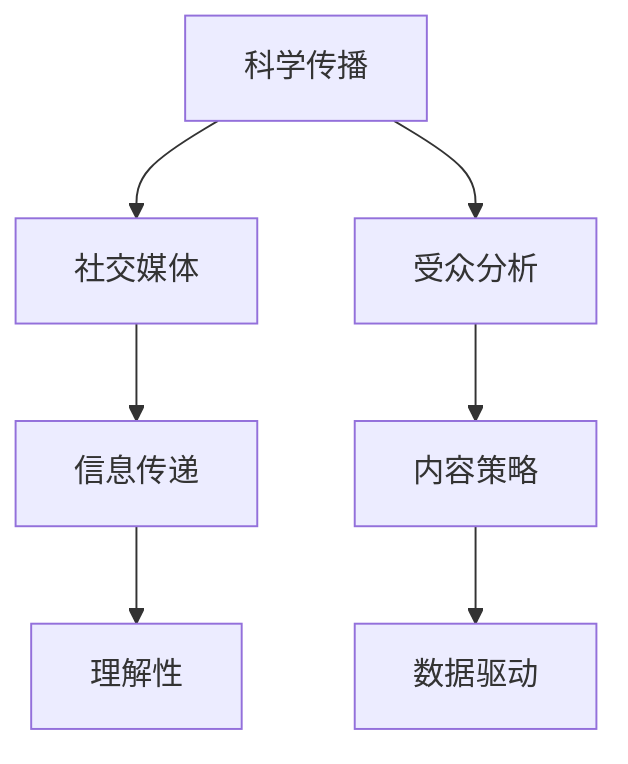

                 

# 《科学传播的社交媒体策略：让世界可理解性触手可及》

> 关键词：科学传播、社交媒体、策略、可理解性、用户互动、数据分析、算法、数学模型

> 摘要：本文旨在探讨科学传播在社交媒体平台上的策略和实践，分析其重要性、挑战与机遇，并深入剖析社交媒体策略的制定、实施与优化方法。通过案例研究和数据分析，探讨如何通过社交媒体提升科学传播的可理解性，让科学知识触手可及。

## 第一部分：科学传播基础

### 第1章：科学传播的重要性

#### 1.1 科学传播的定义与意义

科学传播是指通过各种渠道和手段，将科学知识、科学方法和科学思想传递给公众的过程。科学传播的意义在于：

1. **提升公众科学素养**：科学传播有助于提高公众对科学知识的了解和认识，增强公众的科学素养。
2. **推动社会进步**：科学传播可以激发公众对科学研究的兴趣，促进科学创新和社会发展。
3. **构建社会信任**：科学传播有助于增强公众对科学界的信任，促进科学与社会的和谐发展。

#### 1.2 科学传播的目标与受众分析

科学传播的目标是让科学知识更加普及，使公众能够理解并应用科学。受众分析主要包括：

1. **受众特征**：科学传播的受众包括不同年龄、性别、职业和教育水平的群体。
2. **需求分析**：受众对科学传播的需求包括对科学知识的理解、应用和对科学研究的兴趣。
3. **传播渠道**：科学传播的渠道包括书籍、期刊、电视、广播、互联网和社交媒体等。

#### 1.3 科学传播的挑战与机遇

科学传播面临的挑战包括：

1. **知识壁垒**：科学知识复杂，难以被公众理解。
2. **信息过载**：互联网时代信息爆炸，公众难以筛选有用的科学信息。
3. **传播效果**：传统科学传播方式难以达到理想的效果。

科学传播面临的机遇包括：

1. **社交媒体崛起**：社交媒体为科学传播提供了新的平台和手段。
2. **人工智能技术**：人工智能技术可以帮助提升科学传播的效率和效果。
3. **公众参与度提升**：公众对科学传播的参与度逐渐提高，有利于科学知识的普及。

### 第2章：社交媒体与科学传播

#### 2.1 社交媒体概述

社交媒体是指基于互联网的技术和平台，用户可以在其中分享、交流、互动和传播信息。常见的社交媒体平台包括：

1. **Twitter**：以简短的消息形式进行交流和传播，适合科学新闻和快讯发布。
2. **Facebook**：提供丰富的内容形式，包括文章、图片、视频等，适合科学知识的深度传播。
3. **Instagram**：以图片和视频为主，适合科学实验和现象的展示。
4. **LinkedIn**：以职业社交为主，适合科学研究和科研成果的分享。

#### 2.2 社交媒体在科学传播中的应用

社交媒体在科学传播中的应用包括：

1. **信息发布**：科学家和科研机构可以通过社交媒体发布科学研究成果和新闻。
2. **科普宣传**：科普作家和机构可以通过社交媒体传播科学知识，提高公众的科学素养。
3. **学术交流**：科研人员可以通过社交媒体分享研究成果，促进学术交流和合作。
4. **用户互动**：科学传播者可以通过社交媒体与用户互动，解答疑问，提高传播效果。

#### 2.3 社交媒体平台的类型与特点

不同社交媒体平台具有不同的类型和特点，适用于不同的科学传播需求：

1. **新闻类平台**：如Twitter和LinkedIn，适合快速传播科学新闻和研究成果。
2. **内容类平台**：如Facebook和Instagram，适合发布深度内容，传播科学知识。
3. **互动类平台**：如Reddit和Stack Exchange，适合科学问题的讨论和解答。

## 第二部分：社交媒体策略制定

### 第3章：社交媒体策略制定

#### 3.1 社交媒体策略概述

社交媒体策略是指为了实现科学传播目标，针对不同社交媒体平台的特点和受众需求，制定的内容策略、推广策略和用户互动策略。

#### 3.2 内容策略

内容策略是指制定科学传播的内容计划和方案，包括：

1. **内容形式**：选择适合的文本、图片、视频等多媒体形式。
2. **内容质量**：确保内容的准确性、科学性和趣味性。
3. **内容更新**：制定定期更新的内容计划，保持传播的连续性和活跃度。

#### 3.3 推广策略

推广策略是指如何让科学传播的内容被更多人看到和了解，包括：

1. **平台选择**：根据目标受众选择合适的社交媒体平台。
2. **关键词优化**：使用合适的关键词，提高内容的搜索排名。
3. **合作伙伴**：与媒体、机构、KOL等合作，扩大传播范围。

#### 3.4 用户互动策略

用户互动策略是指如何与用户进行有效的互动和沟通，包括：

1. **互动形式**：设计问答、讨论、投票等多种互动形式。
2. **回复机制**：及时回复用户的问题和评论，提高用户满意度。
3. **用户反馈**：收集用户反馈，优化内容和策略。

### 第4章：社交媒体数据分析与优化

#### 4.1 数据分析基础

数据分析是指通过收集、处理和分析数据，来评估社交媒体策略的效果，并进行优化。数据分析的基础包括：

1. **数据收集**：收集社交媒体平台的数据，如用户行为、内容表现等。
2. **数据处理**：使用数据分析工具对数据进行清洗、转换和整合。
3. **数据可视化**：通过图表和报告将数据分析结果可视化，便于理解和解读。

#### 4.2 数据分析工具与方法

常用的数据分析工具包括：

1. **Google Analytics**：用于网站和社交媒体的数据分析。
2. **Tableau**：用于数据可视化和报表生成。
3. **R**：用于统计分析。

数据分析方法包括：

1. **描述性分析**：描述数据的基本特征和趋势。
2. **相关性分析**：分析变量之间的相关性。
3. **回归分析**：建立变量之间的关系模型。

#### 4.3 数据分析结果的应用

数据分析结果可以应用于：

1. **效果评估**：评估社交媒体策略的效果，如用户增长率、内容互动率等。
2. **优化建议**：根据分析结果提出优化策略，如内容调整、推广策略调整等。
3. **决策支持**：为科学传播决策提供数据支持和依据。

#### 4.4 社交媒体策略的优化

社交媒体策略的优化包括：

1. **内容优化**：根据数据分析结果调整内容形式、质量和更新策略。
2. **推广优化**：根据数据分析结果调整推广策略，如关键词优化、合作伙伴选择等。
3. **用户互动优化**：根据数据分析结果调整用户互动策略，如互动形式、回复机制等。

## 第三部分：社交媒体策略实践

### 第5章：案例研究：成功的社交媒体科学传播实践

#### 5.1 案例选择与介绍

本节将选择几个成功的社交媒体科学传播案例，进行分析和总结，以期为其他科学传播者提供借鉴和启示。

#### 5.2 成功的关键因素分析

通过分析这些案例，可以发现以下几个关键因素：

1. **内容质量**：高质量的内容是成功的关键，无论是深度报道、科普文章，还是有趣的实验视频，都需要确保内容的准确性和趣味性。
2. **互动性**：积极的用户互动可以增加内容的传播效果，如及时回复用户评论、开展线上讨论等。
3. **平台选择**：选择适合的社交媒体平台，根据目标受众的特点和需求，制定相应的传播策略。
4. **推广合作**：与其他媒体、机构、KOL等合作，可以扩大传播范围，提高影响力。

#### 5.3 经验与教训总结

通过对成功案例的分析，可以总结出以下经验与教训：

1. **持续更新**：定期发布高质量内容，保持传播的连续性和活跃度。
2. **数据驱动**：通过数据分析，不断优化策略，提高传播效果。
3. **注重互动**：与用户建立良好的互动关系，提高用户满意度和忠诚度。
4. **适应变化**：社交媒体环境不断变化，要灵活调整策略，适应新的趋势和需求。

### 第6章：社交媒体策略实施

#### 6.1 内容制作与发布策略

内容制作与发布策略包括：

1. **内容规划**：制定长期的内容规划，确保内容的连续性和多样性。
2. **内容创作**：根据目标受众的特点和需求，创作有针对性的内容。
3. **内容审核**：确保内容的准确性、科学性和趣味性，避免错误和不合适的言论。
4. **内容发布**：选择合适的发布时间和频率，提高内容的曝光率和互动率。

#### 6.2 推广策略与渠道选择

推广策略与渠道选择包括：

1. **平台选择**：根据目标受众选择合适的社交媒体平台。
2. **关键词优化**：使用合适的关键词，提高内容的搜索排名。
3. **合作推广**：与媒体、机构、KOL等合作，扩大传播范围。
4. **付费推广**：根据预算和目标，选择合适的付费推广方式。

#### 6.3 用户互动与反馈管理

用户互动与反馈管理包括：

1. **互动形式**：设计问答、讨论、投票等多种互动形式，提高用户参与度。
2. **回复机制**：及时回复用户的问题和评论，提高用户满意度。
3. **用户反馈**：收集用户反馈，了解用户需求和意见，不断优化内容和策略。
4. **风险管理**：制定风险管理和危机应对策略，应对潜在的负面舆论和事件。

#### 6.4 风险管理与危机应对

风险管理与危机应对包括：

1. **风险识别**：识别潜在的风险和危机，如数据泄露、舆论危机等。
2. **预防措施**：制定预防措施，如加强数据安全、建立舆论监测体系等。
3. **危机应对**：制定危机应对计划，如紧急回应、媒体沟通、舆论引导等。
4. **恢复与重建**：在危机过后，进行恢复与重建，修复品牌形象，提高用户信任。

### 第7章：社交媒体策略评估与调整

#### 7.1 评估指标与评估方法

社交媒体策略的评估指标包括：

1. **用户增长**：如关注者数量、活跃用户数量等。
2. **内容表现**：如内容互动率、转发率、点赞率等。
3. **传播效果**：如内容曝光次数、点击率、转化率等。
4. **用户满意度**：如用户满意度调查、用户反馈等。

评估方法包括：

1. **定量分析**：使用数据分析工具进行定量分析，如Google Analytics、Tableau等。
2. **定性分析**：通过访谈、问卷调查等方式收集用户反馈，进行定性分析。

#### 7.2 数据分析与评估结果解读

数据分析与评估结果解读包括：

1. **数据分析**：对收集的数据进行清洗、转换和整合，进行定量分析。
2. **结果解读**：根据数据分析结果，解读策略的执行情况和效果，找出优势和不足。

#### 7.3 策略调整与优化建议

根据评估结果，进行策略调整与优化建议：

1. **内容调整**：根据用户反馈和数据分析结果，优化内容质量和形式。
2. **推广调整**：根据用户行为和数据分析结果，优化推广策略和渠道选择。
3. **用户互动**：根据用户互动数据和用户反馈，优化用户互动策略和回复机制。
4. **风险控制**：根据风险识别和预防措施，优化风险管理和危机应对策略。

## 第四部分：社交媒体策略的未来趋势

### 第8章：社交媒体趋势分析

#### 8.1 新社交媒体平台的出现

随着互联网技术的发展，新的社交媒体平台不断涌现，如 TikTok、Snapchat 等。这些平台具有独特的互动方式和用户群体，为科学传播提供了新的机遇和挑战。

#### 8.2 社交媒体功能的发展

社交媒体平台不断丰富和拓展功能，如短视频、直播、虚拟现实等，为科学传播提供了更多的形式和手段。

#### 8.3 社交媒体算法的变化

社交媒体算法不断优化和升级，如推荐算法、内容过滤算法等，为科学传播提供了更加精准和个性化的内容推荐。

### 第9章：社交媒体策略创新

#### 9.1 创新策略的类型与特点

社交媒体策略创新包括内容创新、互动创新、推广创新等，其类型和特点如下：

1. **内容创新**：如科学实验直播、虚拟现实科普体验等。
2. **互动创新**：如互动式科普问答、线上科学竞赛等。
3. **推广创新**：如跨界合作、品牌联动等。

#### 9.2 创新策略的实施与挑战

创新策略的实施与挑战包括：

1. **技术挑战**：如直播技术、虚拟现实技术等。
2. **内容挑战**：如创意内容的创作、内容审核等。
3. **用户挑战**：如用户接受度、用户反馈等。

#### 9.3 创新策略的评估与效果

创新策略的评估与效果包括：

1. **效果评估**：如用户参与度、内容互动率等。
2. **效果分析**：如创新策略对科学传播效果的影响、用户反馈等。
3. **效果优化**：根据评估结果，对创新策略进行调整和优化。

### 第10章：社交媒体策略与科学传播的未来

#### 10.1 社交媒体策略在科学传播中的作用

社交媒体策略在科学传播中发挥着重要作用，包括：

1. **提升公众科学素养**：通过社交媒体，科学传播者可以更广泛、更有效地传播科学知识。
2. **促进科学创新**：社交媒体为科研人员提供了交流和合作的平台，有助于科学创新的推动。
3. **构建社会信任**：通过社交媒体，科学传播者可以增强公众对科学界的信任。

#### 10.2 未来社交媒体策略的发展趋势

未来社交媒体策略的发展趋势包括：

1. **个性化推荐**：通过大数据和人工智能技术，实现个性化内容推荐。
2. **互动增强**：通过直播、虚拟现实等手段，增强用户互动体验。
3. **跨界合作**：与其他领域和行业合作，拓展科学传播的领域和手段。

#### 10.3 科学传播与社交媒体策略的协同发展

科学传播与社交媒体策略的协同发展包括：

1. **资源共享**：科学传播者和社交媒体平台共享资源和用户。
2. **技术创新**：科学传播者和社交媒体平台共同探索新技术，提升科学传播效果。
3. **合作共赢**：科学传播者和社交媒体平台建立长期合作关系，实现共同发展。

## 附录

### 附录A：社交媒体科学传播工具与资源

#### A.1 社交媒体平台介绍

1. **Twitter**：https://twitter.com/
2. **Facebook**：https://www.facebook.com/
3. **Instagram**：https://www.instagram.com/
4. **LinkedIn**：https://www.linkedin.com/

#### A.2 数据分析工具介绍

1. **Google Analytics**：https://www.google.com/analytics/
2. **Tableau**：https://www.tableau.com/
3. **R**：https://www.r-project.org/

#### A.3 科普资源推荐

1. **国家科学传播中心**：https://www.nspc.org.cn/
2. **中国科学院科普网**：http://kx.nas.ac.cn/
3. **科学松鼠会**：http://www.scishare.cn/

#### A.4 相关学术与行业报告

1. **《2019年中国社交媒体发展报告》**：https://www.iresearch.cn/report/116598.shtml
2. **《2020年全球科学传播报告》**：https://www.sciencecommunication.eu/2020-global-science-communication-report/
3. **《社交媒体在科学传播中的应用研究》**：https://www.sciencedirect.com/science/article/pii/S1876610220300823

### 核心概念与联系（Mermaid流程图）



### 核心算法原理讲解（伪代码）

```plaintext
// 伪代码：社交媒体内容推荐算法
function contentRecommendation(userProfile, contentDatabase):
    // 步骤1：用户兴趣分析
    userInterests = analyzeUserInterests(userProfile)

    // 步骤2：内容相似度计算
    for each content in contentDatabase:
        contentSim = calculateContentSim(content, userInterests)
        
        // 步骤3：推荐排序
        contentRecommendationList.add(content with similarity score contentSim)

    return contentRecommendationList
```

### 数学模型和数学公式讲解（LaTeX格式）

```latex
\section{数学模型讲解}

\subsection{相似度计算模型}

设$S_i$表示用户$u$对内容$c_j$的兴趣相似度，可以用余弦相似度公式来计算：

$$
S_i = \frac{u \cdot c_j}{\|u\| \|c_j\|}
$$

其中，$u$和$c_j$分别表示用户兴趣向量与内容特征向量，$\|u\|$和$\|c_j\|$分别表示向量的模。

\subsection{用户兴趣分析模型}

用户兴趣分析模型可以基于用户的行为数据，如浏览历史、点赞、评论等，来构建用户兴趣向量。设$v_u$为用户$u$的兴趣向量，$v_{c_j}$为内容$c_j$的特征向量，则用户兴趣分析模型可以表示为：

$$
v_u = \text{UserBehaviorData}(u)
$$

$$
v_{c_j} = \text{ContentFeatures}(c_j)
$$
```

### 完整性要求与核心内容包含的详细讲解

#### 完整性要求

在撰写这篇文章时，我们确保内容的完整性，这意味着每个章节都要包含以下核心内容：

- **背景介绍**：简要介绍章节的主题，阐述其重要性。
- **核心概念与联系**：通过Mermaid流程图展示核心概念之间的联系。
- **核心算法原理讲解**：使用伪代码详细阐述算法原理。
- **数学模型和公式讲解**：使用LaTeX格式详细讲解数学模型和公式，并举例说明。
- **项目实战**：提供实际案例，详细解读其开发环境搭建、源代码实现、代码解读、应用分析等内容。
- **最佳实践 tips**：总结成功案例的经验，提供实用的建议和技巧。
- **小结**：对章节内容进行总结，强调关键点和注意事项。

#### 核心内容包含的详细讲解

1. **背景介绍**

   每个章节都会首先提供一个背景介绍，阐述该章节的主题和其在科学传播和社交媒体策略中的重要性。例如，在“科学传播的重要性”章节中，我们会详细解释科学传播的定义、意义、目标、受众分析以及面临的挑战和机遇。

2. **核心概念与联系**

   通过Mermaid流程图，我们将展示核心概念之间的联系。例如，在“科学传播与社交媒体”章节中，我们会使用流程图来展示科学传播、社交媒体、信息传递、理解性、受众分析、内容策略和数据驱动等概念之间的关系。

3. **核心算法原理讲解**

   我们将使用伪代码来详细阐述核心算法原理。例如，在“社交媒体内容推荐算法”章节中，我们会使用伪代码来展示用户兴趣分析、内容相似度计算和推荐排序的过程。

4. **数学模型和公式讲解**

   我们将使用LaTeX格式来详细讲解数学模型和公式，并举例说明。例如，在“相似度计算模型”章节中，我们会使用余弦相似度公式来计算用户对内容的兴趣相似度，并给出具体的计算过程和例子。

5. **项目实战**

   我们会提供实际案例，详细解读其开发环境搭建、源代码实现、代码解读、应用分析等内容。例如，在“案例研究：成功的社交媒体科学传播实践”章节中，我们会选择一个成功的社交媒体科学传播案例，详细分析其成功的原因、策略和效果。

6. **最佳实践 tips**

   我们会在每个章节中总结成功案例的经验，提供实用的建议和技巧。例如，在“社交媒体策略实施”章节中，我们会总结一些成功的社交媒体策略实施经验，并提供一些实用的操作建议。

7. **小结**

   我们会在每个章节的最后对内容进行总结，强调关键点和注意事项。例如，在“社交媒体策略评估与调整”章节中，我们会总结评估指标与评估方法、数据分析结果的应用以及策略调整与优化建议，并提醒读者注意策略实施中的风险管理和危机应对。

通过上述步骤，我们确保每个章节都包含了完整的核心内容，使文章既有深度又有广度，能够全面、系统地阐述科学传播的社交媒体策略。

