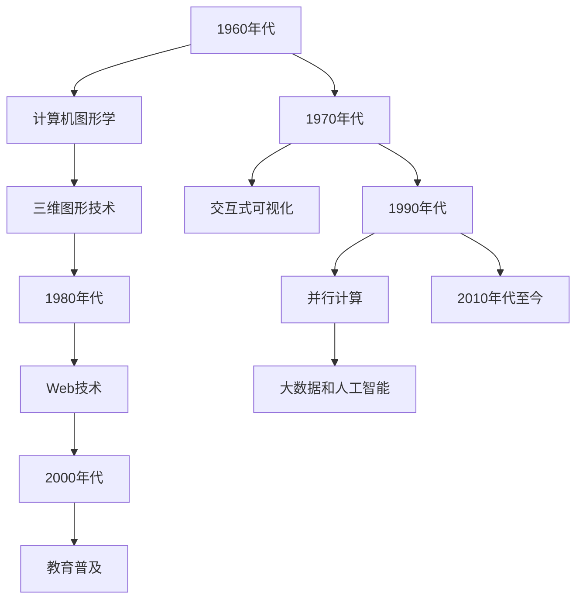
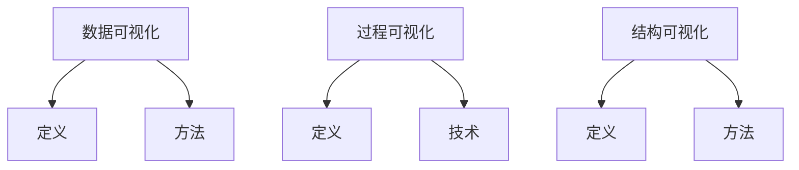
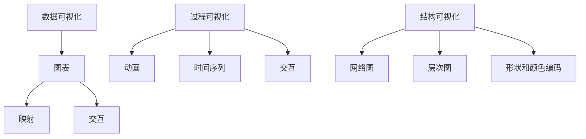

                 

### 第1章：科学可视化技术的概念与重要性

#### 1.1 什么是科学可视化

**定义**：科学可视化（Scientific Visualization）是一种利用计算机图形学和图像处理技术，将复杂数据、模型和算法转换为图形、图像和动画，从而提高人们对科学现象、过程和数据的理解。科学可视化不仅仅是将数据可视化为图表，它更强调对数据的深入分析和解释。

**特点**：
- **交互性**：科学可视化技术通常允许用户与数据集进行交互，例如放大、缩小、旋转、过滤等操作，从而更深入地了解数据。
- **多维性**：科学可视化可以处理和展示多维度数据，帮助人们理解复杂的数据关系。
- **动态性**：通过动态可视化技术，科学家和工程师可以观察数据随时间或空间变化的趋势。

**应用领域**：
- **生物学**：用于研究细胞结构、生物大分子和基因表达。
- **地球科学**：用于地震活动分析、地质勘探、气候模拟等。
- **工程学**：在CAD（计算机辅助设计）、CAE（计算机辅助工程）和流体动力学仿真中广泛应用。
- **物理学**：在粒子物理、量子力学等领域，科学可视化帮助理解物理现象和实验结果。
- **医学**：用于医学影像、药物设计和病理学研究。

#### 1.2 科学可视化的发展历史

**早期阶段**：
- **1960年代**：计算机图形学开始发展，科学家开始尝试使用计算机来生成简单的几何图形和图表。
- **1970年代**：三维图形技术、算法和图形硬件的进步，使得三维可视化成为可能。
- **1980年代**：交互式可视化技术开始兴起，用户可以通过鼠标和键盘与可视化界面进行交互。

**发展阶段**：
- **1990年代**：Web技术的发展，使得可视化工具和结果可以轻松共享和访问。
- **2000年代**：并行计算和大规模数据集的处理需求，推动了高性能计算和可视化技术的发展。
- **2010年代至今**：随着大数据和人工智能技术的发展，科学可视化技术变得更加智能和自动化，能够处理更大量的数据，并提供更直观的交互体验。

#### 1.3 科学可视化的重要性

**提升数据理解**：
- 科学可视化通过图形和动画展示数据，使得复杂数据变得更加直观，从而帮助科学家和工程师快速识别模式和异常。

**促进跨学科合作**：
- 可视化技术作为一门跨学科的桥梁，帮助不同领域的专家通过可视化的方式更有效地沟通和合作。

**辅助决策过程**：
- 通过对数据的可视化分析，科学家和工程师可以更快速地识别问题和机会，从而做出更明智的决策。

**教育普及**：
- 科学可视化在教育领域具有重要意义，它能够将抽象的科学概念以直观的方式呈现给学生，从而提高学习效果。

### Mermaid 流程图：科学可视化技术发展历史



### Mermaid 流程图：科学可视化技术核心概念



在这一章中，我们简要介绍了科学可视化的概念、发展历史及其重要性。接下来的章节将进一步深入探讨科学可视化的基本原理和核心算法。通过这些内容，读者将能够对科学可视化有一个全面和深入的理解。

### 1.4 科学可视化的重要性

科学可视化技术在现代社会中扮演着越来越重要的角色，其重要性体现在以下几个方面：

**提升科研效率**：科学可视化可以帮助科研人员快速理解和分析大量数据，从而提高科研效率。通过可视化的方式，复杂的实验数据和模拟结果可以转化为直观的图形和图像，使研究人员能够快速识别数据中的模式和异常，从而更加专注于核心问题的解决。

**促进跨学科合作**：科学可视化作为一门跨学科的桥梁，能够帮助不同领域的专家通过可视化的方式更有效地沟通和合作。例如，在生物学、物理学和工程学等多个领域，科学可视化技术被广泛应用于数据分析和结果展示，从而促进了跨学科的研究和合作。

**增强决策能力**：通过科学可视化，决策者能够更加直观地理解数据和分析结果，从而做出更加明智的决策。在医疗、金融、交通等领域，科学可视化技术被广泛应用于诊断、风险评估和优化决策过程中，帮助决策者更好地理解复杂的情况并制定有效的策略。

**教育普及**：科学可视化在教育领域具有重要意义，它能够将抽象的科学概念以直观的方式呈现给学生，从而提高学习效果。通过可视化的手段，学生可以更直观地理解复杂的科学原理和实验过程，从而激发他们的学习兴趣和创造力。

**创新和技术进步**：科学可视化技术推动了科学研究和技术创新的发展。通过可视化的手段，研究人员能够更深入地探索数据，发现新的规律和模式，从而推动科学技术的进步。例如，在医学领域，科学可视化技术被用于开发新的诊断和治疗技术，为人类健康事业做出了重要贡献。

总之，科学可视化技术不仅提升了科研效率和决策能力，还促进了跨学科合作和教育普及，为科学技术的进步和社会的发展做出了重要贡献。随着科技的不断发展和应用场景的扩大，科学可视化技术的重要性将更加凸显，其在各个领域的应用也将更加广泛。

#### 1.4 科学可视化的重要性

科学可视化技术在现代社会中扮演着越来越重要的角色，其重要性体现在以下几个方面：

**提升科研效率**：科学可视化可以帮助科研人员快速理解和分析大量数据，从而提高科研效率。通过可视化的方式，复杂的实验数据和模拟结果可以转化为直观的图形和图像，使研究人员能够快速识别数据中的模式和异常，从而更加专注于核心问题的解决。

**促进跨学科合作**：科学可视化作为一门跨学科的桥梁，能够帮助不同领域的专家通过可视化的方式更有效地沟通和合作。例如，在生物学、物理学和工程学等多个领域，科学可视化技术被广泛应用于数据分析和结果展示，从而促进了跨学科的研究和合作。

**增强决策能力**：通过科学可视化，决策者能够更加直观地理解数据和分析结果，从而做出更加明智的决策。在医疗、金融、交通等领域，科学可视化技术被广泛应用于诊断、风险评估和优化决策过程中，帮助决策者更好地理解复杂的情况并制定有效的策略。

**教育普及**：科学可视化在教育领域具有重要意义，它能够将抽象的科学概念以直观的方式呈现给学生，从而提高学习效果。通过可视化的手段，学生可以更直观地理解复杂的科学原理和实验过程，从而激发他们的学习兴趣和创造力。

**创新和技术进步**：科学可视化技术推动了科学研究和技术创新的发展。通过可视化的手段，研究人员能够更深入地探索数据，发现新的规律和模式，从而推动科学技术的进步。例如，在医学领域，科学可视化技术被用于开发新的诊断和治疗技术，为人类健康事业做出了重要贡献。

总之，科学可视化技术不仅提升了科研效率和决策能力，还促进了跨学科合作和教育普及，为科学技术的进步和社会的发展做出了重要贡献。随着科技的不断发展和应用场景的扩大，科学可视化技术的重要性将更加凸显，其在各个领域的应用也将更加广泛。

### 第2章：科学可视化的基本原理

科学可视化技术的核心在于将复杂数据和概念转化为易于理解和分析的图形和图像。为了实现这一目标，科学可视化依赖于一系列基本原理和关键技术。在本章中，我们将深入探讨科学可视化的基本原理，包括数据可视化、过程可视化和结构可视化。

#### 2.1 数据可视化

**定义**：数据可视化（Data Visualization）是指使用图形、图像和动画等视觉元素来表示和解释数据。

**方法**：
- **图表**：包括柱状图、折线图、饼图等，用于表示数据的统计分布和趋势。
- **映射**：将数据映射到几何形状或颜色上，如热力图、散点图等，用于表示数据的空间分布和关系。
- **交互**：提供用户与数据集的交互功能，如缩放、过滤和旋转等，以增强数据理解和分析。

**案例**：假设我们有一组关于不同地区的人口统计数据，通过数据可视化技术，可以将这些数据绘制成柱状图，展示各地区人口数量，并通过颜色映射表示人口密度，从而直观地了解各地区的人口分布情况。

#### 2.2 过程可视化

**定义**：过程可视化（Process Visualization）是指通过图形和动画展示系统或过程的动态行为和交互。

**技术**：
- **动画**：通过连续的图像展示过程的动态变化，如流体流动、化学反应等。
- **时间序列**：将时间序列数据可视化，如股票价格变化、气候数据变化等。
- **交互**：提供用户与动态过程交互的功能，如调整参数、模拟不同情况等。

**案例**：在化学实验中，通过过程可视化技术，可以实时展示反应容器中的化学物质浓度变化，帮助实验者更好地理解反应过程和调整实验条件。

#### 2.3 结构可视化

**定义**：结构可视化（Structural Visualization）是指通过图形和图像展示复杂数据的结构和关系。

**方法**：
- **网络图**：用于展示节点和边的关系，如社会网络、蛋白质相互作用网络等。
- **层次图**：用于展示层次结构，如组织结构、文件系统等。
- **形状和颜色编码**：通过形状和颜色区分不同类别的数据，如地形图中的高程颜色编码。

**案例**：在生物学研究中，通过结构可视化技术，可以将蛋白质的结构和相互作用以三维网络图的形式展示出来，从而帮助科学家理解蛋白质的功能和作用机制。

### Mermaid 流程图：科学可视化技术核心原理



通过上述讨论，我们可以看到科学可视化技术涵盖了数据可视化、过程可视化和结构可视化三个主要方面。每种可视化方法都有其独特的原理和适用场景，共同构成了科学可视化技术的核心基础。在接下来的章节中，我们将进一步探讨这些技术背后的核心算法和实现细节。

### 第3章：数据可视化算法

数据可视化是科学可视化技术的重要组成部分，其目的是将复杂数据以直观、易理解的方式展示给用户。本章节将详细介绍数据可视化算法的核心概念和原理，以及如何使用这些算法处理和展示数据。

#### 3.1 聚类分析

**定义**：聚类分析（Clustering Analysis）是一种无监督学习方法，用于将数据点按照相似性进行分组，形成多个簇。

**算法原理**：
- **K-means算法**：基于距离最小的原则，将数据点分为K个簇，每个簇的中心代表该簇的平均值。每次迭代中，重新计算每个数据点的簇中心，并重新分配数据点，直到达到收敛。
- **DBSCAN算法**：基于密度的聚类算法，它将数据点分为核心点、边界点和噪声点。核心点周围的邻域内的点被认为是同一个簇。

**伪代码**：

```python
# K-means算法伪代码
1. 初始化K个簇的中心点
2. 对于每个数据点：
   a. 计算数据点到各个簇中心点的距离
   b. 分配到距离最近的簇
3. 更新簇中心点
4. 重复步骤2和3，直到簇中心点不再发生变化

# DBSCAN算法伪代码
1. 初始化参数：eps（邻域半径）和minPts（最小邻域点数）
2. 对于每个数据点：
   a. 找到其邻域内的点
   b. 若邻域点数大于minPts，则该点为核心点
   c. 对于每个核心点：
      i. 扩展邻域，将邻域内的点划分为核心点、边界点和噪声点
   d. 标记簇，将核心点和其扩展后的点划分为同一个簇
```

**案例**：假设我们有一组多维数据，需要使用K-means算法将其分为两个簇。首先，我们选择两个初始中心点，然后根据每个数据点到中心点的距离进行聚类，直到簇中心点不再发生变化。通过这种方式，我们可以直观地识别数据中的两个主要群体。

#### 3.2 关联规则挖掘

**定义**：关联规则挖掘（Association Rule Learning）是一种用于发现数据中隐藏的关联关系和关联规则的方法。

**算法原理**：
- **Apriori算法**：基于候选集生成和频繁项集的概念，通过递归搜索数据库，找出所有频繁项集，然后生成关联规则。
- **FP-growth算法**：在Apriori算法的基础上进行了优化，通过构建FP树来减少数据库扫描次数，提高算法效率。

**伪代码**：

```python
# Apriori算法伪代码
1. 计算所有项集的支持度
2. 生成频繁项集
3. 对于每个频繁项集：
   a. 生成所有可能的关联规则
   b. 计算规则的前件和后件的支持度
   c. 根据最小支持度和最小置信度过滤规则
4. 输出最终的关联规则

# FP-growth算法伪代码
1. 构建FP树
2. 从FP树中提取频繁项集
3. 对于每个频繁项集：
   a. 生成所有可能的关联规则
   b. 计算规则的前件和后件的支持度
   c. 根据最小支持度和最小置信度过滤规则
4. 输出最终的关联规则
```

**案例**：假设我们有一组购物数据，需要找出购买A商品时通常也会购买B商品的情况。通过Apriori算法，我们可以识别出频繁出现的商品组合，并生成相应的关联规则，从而帮助商家进行商品推荐。

数据可视化算法在科学研究和实际应用中具有重要意义。通过聚类分析，我们可以识别数据中的模式和群体；通过关联规则挖掘，我们可以发现数据之间的关系和关联。这些算法不仅帮助科学家和工程师更好地理解和分析数据，还为数据驱动的决策提供了有力支持。在下一章节中，我们将继续探讨过程可视化算法，进一步扩展对科学可视化技术的理解。

### 第4章：过程可视化算法

过程可视化算法在科学计算和工程领域扮演着关键角色，其目的是通过图形和动画展示系统或过程的动态行为和交互。本章节将详细介绍过程可视化中的核心算法，包括动态可视化、流体可视化等。

#### 4.1 动态可视化

**定义**：动态可视化（Dynamic Visualization）是一种通过连续的图形和动画展示系统或过程随时间变化的算法。

**算法原理**：
- **时间序列可视化**：通过时间序列数据展示系统随时间的变化趋势。常见的方法包括折线图、柱状图和散点图等。
- **动态更新**：在每次时间步长，根据新的数据更新图形元素，以显示系统状态的连续变化。
- **交互**：允许用户与动态过程进行交互，如调整时间步长、播放速度和过滤条件等。

**伪代码**：

```python
# 动态可视化伪代码
1. 初始化数据集
2. 设置时间步长和动画速度
3. 循环执行以下步骤：
   a. 获取当前时间步长的数据
   b. 根据数据更新图形元素
   c. 绘制当前状态
   d. 暂停或继续动画，根据用户输入
```

**案例**：在流体动力学仿真中，我们可以使用动态可视化技术来展示流体流动随时间的变化。通过实时更新速度场和压力场，我们可以直观地观察到流体在不同时间点的流动状态，从而更好地理解流体行为的动态特性。

#### 4.2 流体可视化

**定义**：流体可视化（Fluid Visualization）是一种用于展示流体动态行为和特性的算法，常用于流体力学、气象学和海洋学等领域。

**算法原理**：
- **基于速度场的可视化**：通过颜色或纹理表示流体速度的大小和方向，如流线图、速度向量图等。
- **基于质量守恒的模拟**：使用数值方法（如Lattice Boltzmann Method）模拟流体运动，确保质量守恒和动量守恒。
- **基于粒子系统的模拟**：通过粒子系统模拟流体中的涡流和湍流，以展示流体的微观结构。

**伪代码**：

```python
# 流体可视化伪代码
1. 初始化流体参数（速度、压力等）
2. 使用数值方法进行流体动力学模拟
3. 在每次时间步长：
   a. 计算流体的速度场和压力场
   b. 根据速度场绘制流线图或速度向量图
   c. 根据需要，添加粒子系统来展示流体的微观结构
   d. 更新可视化界面
```

**案例**：在风力涡轮机的设计中，流体可视化技术可以用于模拟风力场对涡轮叶片的影响。通过可视化叶片周围的流动状态和涡流结构，工程师可以优化设计，提高涡轮机的效率和稳定性。

过程可视化算法在科学计算和工程领域具有广泛应用，通过动态可视化和流体可视化技术，我们可以直观地了解系统或过程的动态行为，从而进行更有效的分析和设计。在下一章节中，我们将探讨结构可视化算法，继续扩展对科学可视化技术的理解。

### 第5章：结构可视化算法

结构可视化算法是科学可视化中的重要分支，其目的是通过图形和图像展示复杂数据的结构和关系。在这一章节中，我们将深入探讨结构可视化中的核心算法，包括网络结构可视化和形状分析。

#### 5.1 网络结构可视化

**定义**：网络结构可视化（Network Structure Visualization）是指利用图形和图像来表示网络中节点和边的关系。

**算法原理**：
- **节点和边的表示**：使用点（节点）和线（边）来表示网络中的元素。节点的大小、形状和颜色可以用来表示节点的属性，如度、中心性和重要性。
- **布局算法**：用于确定网络中节点和边的位置，以减少交叉和拥挤，提高可读性。常见的布局算法包括力导向布局（Force-directed Layout）、层次布局（Hierarchical Layout）和矩阵布局（Matrix Layout）等。
- **交互**：提供用户与网络图交互的功能，如缩放、过滤和搜索，以帮助用户更好地理解网络结构。

**算法实现**：

```python
# 网络结构可视化伪代码
1. 初始化网络图，包含节点和边
2. 选择布局算法，计算节点和边的位置
3. 绘制节点和边，根据节点属性设置大小、形状和颜色
4. 提供交互功能，如缩放、过滤和搜索
5. 根据用户操作更新可视化界面
```

**案例**：在社会网络分析中，网络结构可视化可以用于展示个人之间的社交关系。通过使用不同的节点颜色表示不同类型的社交关系，我们可以直观地识别社交网络中的关键节点和紧密群体。

#### 5.2 形状分析

**定义**：形状分析（Shape Analysis）是指通过数学和几何方法来分析和理解形状的特征和属性。

**算法原理**：
- **形状描述**：使用参数化曲线和曲面来描述形状，如B样条曲线和NURBS曲面。
- **形状比较**：通过计算形状之间的相似性或差异性，以识别形状的相似性和形状变形。
- **形状优化**：通过优化形状参数，以实现特定的设计目标，如最小化能量或最大化稳定性。

**算法实现**：

```python
# 形状分析伪代码
1. 参数化形状，如使用B样条曲线或NURBS曲面
2. 计算形状的几何特征，如曲率、面积和体积
3. 比较不同形状的相似性，使用距离度量或形状描述符
4. 优化形状参数，以达到设计目标
```

**案例**：在建筑设计中，形状分析可以用于评估建筑的稳定性和美观性。通过分析建筑表面的曲率和面积，工程师可以优化建筑结构，确保其稳定性和舒适度。

结构可视化算法在多个领域具有广泛应用，从社会网络分析到建筑设计，都依赖于有效的结构和关系表示方法。通过网络结构可视化和形状分析，我们可以更深入地理解和分析复杂数据和形状，从而进行更有效的决策和设计。在下一章节中，我们将探讨科学可视化技术在实践中的应用，进一步展示其广泛的影响和重要性。

### 第6章：科学可视化技术在生物学中的应用

科学可视化技术在生物学领域有着广泛的应用，通过可视化的手段，科学家可以更深入地理解生物大分子、基因组以及蛋白质结构等方面的信息。以下将详细探讨科学可视化技术在生物学中的应用。

#### 6.1 生物大分子可视化

生物大分子，如蛋白质、核酸和多糖等，是生命活动的基础。科学可视化技术在生物大分子研究中扮演了重要角色，帮助科学家观察和理解这些大分子的结构特征和功能。

**应用实例**：
- **蛋白质结构可视化**：蛋白质的三维结构是其功能的基础。使用科学可视化技术，如PyMOL和VMD，科学家可以直观地观察蛋白质的三维结构，识别氨基酸残基的排列和相互作用。
  
  **伪代码示例**：
  ```python
  # 使用PyMOL进行蛋白质结构可视化
  1. 导入蛋白质结构数据（PDB文件）
  2. 使用Vdw显示蛋白质的三维结构
  3. 调整视图，观察蛋白质的细节
  4. 导出可视化结果
  ```

- **核酸分子可视化**：DNA和RNA的结构和功能研究同样依赖科学可视化。通过可视化技术，如UCSF Chimera，科学家可以分析核酸分子的三维结构，了解碱基配对和序列变异。

  **伪代码示例**：
  ```python
  # 使用UCSF Chimera进行核酸分子可视化
  1. 导入核酸分子结构数据
  2. 使用 Cartoon 显示核酸的三维结构
  3. 添加氢键表示，观察碱基配对
  4. 保存和导出可视化结果
  ```

#### 6.2 基因组可视化

基因组可视化技术帮助科学家理解基因组的结构、功能和进化关系。这些可视化工具可以展示基因、转录因子结合位点、突变和其他基因组特征。

**应用实例**：
- **基因表达可视化**：通过基因表达数据可视化，科学家可以了解基因在不同组织或条件下的表达模式。使用软件如GenomeQuest和IGV，基因表达数据可以以图形化的形式展示，帮助识别关键基因和调控网络。

  **伪代码示例**：
  ```python
  # 使用IGV进行基因表达可视化
  1. 导入基因表达数据
  2. 在基因组浏览器中加载数据
  3. 设置不同的视图模式，如线形图或热力图
  4. 标记关键基因和调控区域
  ```

- **基因组变异可视化**：通过基因组变异可视化，科学家可以识别突变、插入和缺失等变异，了解其可能对生物体造成的影响。使用软件如VarSeq和Integrative Genomics Viewer (IGV)，变异数据可以以图形化的形式展示。

  **伪代码示例**：
  ```python
  # 使用IGV进行基因组变异可视化
  1. 导入基因组变异数据
  2. 在基因组浏览器中加载数据
  3. 使用变异标注工具标记和注释变异
  4. 导出包含变异信息的图形报告
  ```

#### 6.3 蛋白质结构可视化

蛋白质结构可视化是生物学研究中一个重要领域，通过直观的三维展示，科学家可以分析蛋白质的结构特征，预测其功能，并理解其与其他分子之间的相互作用。

**应用实例**：
- **蛋白质-蛋白质相互作用**：通过可视化技术，如Cytoscape，科学家可以展示蛋白质-蛋白质相互作用网络，理解蛋白质在细胞内的功能和调控网络。

  **伪代码示例**：
  ```python
  # 使用Cytoscape进行蛋白质-蛋白质相互作用可视化
  1. 导入蛋白质相互作用数据
  2. 在Cytoscape中加载数据并创建网络图
  3. 设置网络视图，如节点大小和边宽度
  4. 添加交互功能，如节点展开和过滤
  ```

- **蛋白质结构比较**：使用软件如PyMOL，科学家可以比较不同蛋白质的结构，识别保守的氨基酸残基和功能域，从而推断蛋白质的功能。

  **伪代码示例**：
  ```python
  # 使用PyMOL进行蛋白质结构比较
  1. 导入两个蛋白质结构数据（PDB文件）
  2. 使用 align 命令对蛋白质进行结构对齐
  3. 显示对齐后的结构差异，如氨基酸替换和侧链取向
  4. 导出结构比较结果
  ```

科学可视化技术在生物学中的应用极大地推动了生物学研究的发展。通过可视化工具，科学家可以更直观地理解生物大分子和基因组的复杂结构，发现潜在的生物学机制，从而为药物发现、疾病诊断和治疗提供了新的方向和工具。

### 第7章：科学可视化技术在地球科学中的应用

科学可视化技术在地球科学领域具有广泛的应用，通过可视化的手段，地球科学家能够更好地理解地球系统的复杂过程，进行有效的数据分析和决策。以下将详细探讨科学可视化技术在地球科学中的应用。

#### 7.1 地球科学数据可视化

地球科学数据通常具有高维、复杂和多样化的特点，数据可视化技术能够将复杂的地球科学数据转化为易于理解和分析的图形和图像，从而提高数据解读和分析的效率。

**应用实例**：
- **地震活动可视化**：通过科学可视化技术，地震学家可以展示地震的发生位置、震级和震源深度。使用软件如GMT（General Mapping Tools），地震数据可以以散点图、等高线图和断层图的形式展示，帮助识别地震活动的空间分布和特征。

  **伪代码示例**：
  ```python
  # 使用GMT进行地震活动可视化
  1. 导入地震数据
  2. 创建断层图，展示地震震源深度和位置
  3. 添加等高线图，表示震级分布
  4. 导出地震活动可视化结果
  ```

- **地质结构可视化**：地质结构数据的可视化能够帮助地质学家理解地壳的构造和演化过程。使用软件如GeoMapApp，地质结构数据可以以三维图形的形式展示，包括断层、山脉、沉积层和岩层。

  **伪代码示例**：
  ```python
  # 使用GeoMapApp进行地质结构可视化
  1. 导入地质结构数据
  2. 创建三维地质结构图
  3. 设置不同的视图模式，如俯视图和侧视图
  4. 添加地质注释，如断层和沉积层
  ```

#### 7.2 地球科学过程可视化

地球科学过程可视化通过动态图形和动画展示地球系统的自然过程，如气候变化、海洋循环和大气环流等，帮助科学家理解这些过程的动态变化和相互作用。

**应用实例**：
- **气候变化可视化**：使用科学可视化技术，气候学家可以展示过去和未来的气候变化趋势。通过软件如CLIMAP（Climate Model Animation Package），气候模型的数据可以以动画的形式展示，帮助用户直观地了解气候变化的时空分布和强度。

  **伪代码示例**：
  ```python
  # 使用CLIMAP进行气候变化可视化
  1. 导入气候模型数据
  2. 设置动画的时间范围和参数
  3. 创建气候变化的动画序列
  4. 播放动画，展示气候变化过程
  ```

- **海洋循环可视化**：海洋循环是地球气候系统的重要组成部分。使用科学可视化技术，海洋学家可以展示海洋中的温度、盐度和环流模式。通过软件如MITgcm（Massachusetts Institute of Technology General Circulation Model），海洋循环数据可以以三维动画的形式展示，帮助用户理解海洋循环的复杂性和动态变化。

  **伪代码示例**：
  ```python
  # 使用MITgcm进行海洋循环可视化
  1. 导入海洋循环数据
  2. 设置动画的时间步长和视图模式
  3. 创建三维海洋循环动画
  4. 播放动画，展示海洋循环过程
  ```

#### 7.3 地球科学结构可视化

地球科学结构可视化通过图形和图像展示地球系统的结构特征，如地质断层、沉积岩层和地质构造等，帮助科学家识别和理解地质结构的分布和演化过程。

**应用实例**：
- **地质断层可视化**：通过科学可视化技术，地质学家可以展示地质断层的分布、形态和特征。使用软件如Geographic Information System (GIS)，断层数据可以以三维图形的形式展示，帮助用户识别断层的走向和活动特征。

  **伪代码示例**：
  ```python
  # 使用GIS进行地质断层可视化
  1. 导入断层数据
  2. 创建断层的三维图形模型
  3. 设置不同的视图模式，如俯视图和侧视图
  4. 添加断层注释，如位置和活动历史
  ```

- **沉积岩层可视化**：沉积岩层的可视化有助于地质学家研究沉积作用和地质演化过程。使用软件如Surfer，沉积岩层数据可以以等高线图和三维曲面图的形式展示，帮助用户理解岩层的厚度和空间分布。

  **伪代码示例**：
  ```python
  # 使用Surfer进行沉积岩层可视化
  1. 导入沉积岩层数据
  2. 创建等高线图，展示岩层的厚度
  3. 创建三维曲面图，展示岩层的空间分布
  4. 添加岩层注释，如岩性和沉积环境
  ```

科学可视化技术在地球科学中的应用极大地提高了地球科学研究和数据分析的效率，帮助科学家更好地理解地球系统的复杂过程和结构特征。通过可视化的手段，地球科学家可以更直观地展示和解释地球科学数据，从而推动地球科学知识的进步和应用。

### 第8章：科学可视化技术在工程领域的应用

科学可视化技术在工程领域具有广泛的应用，它不仅能够帮助工程师更直观地理解和分析复杂的工程数据，还能够优化工程设计、提高工程仿真效率和增强工程分析的可视化展示。以下将详细探讨科学可视化技术在工程领域的具体应用。

#### 8.1 工程设计可视化

工程设计可视化是工程领域中的关键应用之一，它通过将设计模型和参数以图形和图像的形式展示，帮助工程师进行设计优化和创新。

**应用实例**：
- **CAD（计算机辅助设计）**：在CAD软件中，工程师可以使用科学可视化技术创建和展示详细的设计模型。例如，使用AutoCAD和SolidWorks，工程师可以创建精确的三维模型，并使用不同的视图模式（如正视图、侧视图和俯视图）来分析设计。

  **伪代码示例**：
  ```python
  # 使用AutoCAD进行三维模型可视化
  1. 导入设计数据（如STL或STEP格式）
  2. 创建三维模型
  3. 设置视图模式，显示正视图、侧视图和俯视图
  4. 导出可视化结果
  ```

- **虚拟现实（VR）和增强现实（AR）**：通过VR和AR技术，工程师可以在虚拟环境中进行设计模拟和交互式分析。例如，使用Unity和Qualcomm Vuforia，工程师可以创建沉浸式的虚拟设计环境，并在其中进行实时交互和设计验证。

  **伪代码示例**：
  ```python
  # 使用Unity进行VR设计可视化
  1. 导入设计模型（如OBJ或FBX格式）
  2. 创建虚拟设计场景
  3. 实现用户交互功能，如旋转、缩放和导航
  4. 播放设计动画，展示设计过程和效果
  ```

#### 8.2 工程仿真可视化

工程仿真可视化在工程领域同样具有重要地位，它通过图形和动画展示仿真结果，帮助工程师理解仿真的动态过程和结果。

**应用实例**：
- **流体动力学仿真**：在流体动力学仿真中，使用科学可视化技术可以展示流体流动、压力分布和涡流等关键信息。例如，使用OpenFOAM和ParaView，工程师可以创建和展示流体仿真结果，并进行详细的流场分析。

  **伪代码示例**：
  ```python
  # 使用OpenFOAM进行流体动力学仿真可视化
  1. 运行流体动力学仿真，生成结果文件
  2. 使用ParaView加载仿真结果
  3. 创建流线图、速度向量图和压力分布图
  4. 导出可视化结果，进行分析和报告
  ```

- **结构动力学仿真**：在结构动力学仿真中，科学可视化技术可以帮助工程师展示结构响应、应力分布和振动模式等。例如，使用ANSYS和Galen，工程师可以创建和展示结构仿真结果，并进行应力分析和振动分析。

  **伪代码示例**：
  ```python
  # 使用ANSYS进行结构动力学仿真可视化
  1. 运行结构动力学仿真，生成结果文件
  2. 使用Galen加载仿真结果
  3. 创建应力分布图和振动动画
  4. 导出仿真可视化结果，进行性能评估和优化
  ```

#### 8.3 工程分析可视化

工程分析可视化通过图形和动画展示工程数据和结果，帮助工程师进行数据分析和决策。

**应用实例**：
- **统计分析**：在工程分析中，科学可视化技术可以帮助工程师展示统计数据和结果。例如，使用Matplotlib和Seaborn，工程师可以创建柱状图、散点图和箱线图，进行数据分析和可视化展示。

  **伪代码示例**：
  ```python
  # 使用Matplotlib进行统计分析可视化
  1. 导入数据集
  2. 创建柱状图，展示不同条件下的性能指标
  3. 创建散点图，展示变量之间的关系
  4. 创建箱线图，展示数据的分布和异常值
  ```

- **决策支持系统**：科学可视化技术可以用于创建决策支持系统，帮助工程师进行复杂决策。例如，使用Tableau和Power BI，工程师可以创建交互式的仪表盘和报表，进行数据分析和可视化展示，支持决策制定。

  **伪代码示例**：
  ```python
  # 使用Tableau进行决策支持系统可视化
  1. 导入数据集
  2. 创建交互式仪表盘，展示关键指标和趋势
  3. 创建交互式报表，展示详细数据和统计结果
  4. 导出可视化结果，支持决策制定和执行
  ```

科学可视化技术在工程领域的应用极大地提高了工程设计和分析的效率，帮助工程师更直观地理解和分析复杂的工程数据和仿真结果。通过可视化的手段，工程师可以更快速地进行设计优化、性能评估和决策制定，从而推动工程技术的进步和应用。

### 第9章：科学可视化技术的未来发展趋势

随着科技的迅猛发展，科学可视化技术也在不断进步，未来有望在多个领域产生重大影响。以下将探讨科学可视化技术的未来发展趋势，特别是新技术的影响、可视化与人工智能的融合，以及科学可视化在教育、医疗等领域的应用前景。

#### 9.1 新技术的影响

**高性能计算**：随着计算能力的不断提升，科学可视化技术将能够处理更大规模和更高分辨率的数据。例如，通过使用高性能计算集群和GPU加速，可视化工具可以实时渲染复杂的科学场景，提供更加逼真的视觉效果。

**虚拟现实（VR）和增强现实（AR）**：VR和AR技术的发展为科学可视化提供了新的交互手段。通过沉浸式环境，科学家和工程师可以更直观地探索和操作数据，从而提高数据分析和理解的效率。此外，AR技术可以将可视化结果叠加到现实世界中，实现更加直观的数据展示。

**大数据和物联网**：随着大数据和物联网技术的普及，科学可视化将面临更大量、更复杂的数据处理需求。通过大数据分析和可视化，科学家可以更深入地理解数据中的模式和趋势，为科学研究和技术创新提供有力支持。

**量子计算**：量子计算技术的突破将为科学可视化带来新的机遇。量子可视化技术将能够展示量子系统的复杂行为，为量子物理学和量子信息科学的研究提供新的工具和方法。

#### 9.2 可视化与人工智能的融合

**数据驱动可视化**：人工智能和机器学习技术在数据分析和模式识别方面具有巨大潜力。通过数据驱动可视化，AI算法可以自动识别数据中的关键特征和模式，并生成相应的可视化结果，从而帮助用户更快速地理解数据。

**自适应可视化**：自适应可视化技术结合了人工智能和用户交互，可以根据用户的操作和反馈动态调整可视化参数和显示内容。这种技术能够提供更加个性化和高效的视觉分析体验。

**智能交互**：人工智能技术可以用于实现智能交互的可视化系统。通过自然语言处理和语音识别，用户可以与可视化界面进行自然对话，从而更加便捷地进行数据探索和分析。

#### 9.3 科学可视化在教育、医疗等领域的应用前景

**教育领域**：科学可视化技术有望在教育领域发挥重要作用，通过直观的图形和动画展示复杂的科学概念和实验过程，提高学生的学习效果和兴趣。例如，虚拟实验室和交互式教材可以为学生提供沉浸式的学习体验，帮助他们更深入地理解科学原理。

**医疗领域**：科学可视化技术在医疗领域的应用前景广阔。通过医学图像可视化，医生可以更准确地诊断疾病和制定治疗方案。此外，个性化医疗和基因诊断等领域也受益于科学可视化技术，为精准医疗提供了新的工具和方法。

**公共卫生领域**：科学可视化技术在公共卫生领域同样具有重要应用。通过可视化技术，公共卫生专家可以更好地理解和传播疾病传播趋势、疫情风险和公共卫生政策，从而提高公众健康意识和防控效果。

总之，科学可视化技术的未来发展趋势充满了机遇和挑战。随着新技术的不断涌现和跨学科融合的深入，科学可视化技术将在更多领域产生深远影响，为科学研究和实际应用提供更加有效的支持和工具。

### 附录A：科学可视化常用工具和软件

科学可视化技术的发展离不开各种工具和软件的支持。以下是一些在科学可视化领域广泛使用的工具和软件，包括3D Visualizer、ParaView、Gephi和MayaVi2，这些工具在不同的应用场景中具有独特的优势。

#### 3D Visualizer

**特点**：
- **跨平台**：支持Windows、Linux和macOS等操作系统。
- **易于使用**：提供直观的用户界面和简单的操作流程。
- **多种数据格式支持**：可以导入和导出多种三维数据格式，如PLY、OBJ、STL等。

**应用场景**：
- **工程和制造业**：用于三维模型的创建和可视化。
- **生物信息学**：用于生物大分子结构的三维展示。

**优势**：
- 强大的三维建模功能。
- 支持多种数据格式，便于数据交换和共享。

#### ParaView

**特点**：
- **高性能**：基于开源框架VTK，支持大规模数据处理和可视化。
- **交互性强**：提供多种交互功能，如缩放、旋转、过滤等。
- **模块化**：支持插件扩展，便于定制和开发。

**应用场景**：
- **科学计算**：用于流体动力学、结构力学等领域的数据可视化。
- **地质勘探**：用于地质数据分析和可视化。

**优势**：
- 高性能和可扩展性。
- 强大的交互功能，适合复杂数据的分析。

#### Gephi

**特点**：
- **网络图可视化**：专门用于社交网络、知识图谱等复杂网络的可视化。
- **数据转换**：支持多种数据格式，如CSV、JSON、GraphML等。
- **高度定制化**：提供丰富的布局算法和样式设置。

**应用场景**：
- **社会网络分析**：用于分析社交媒体数据、合作关系等。
- **知识图谱**：用于展示知识结构、概念关系等。

**优势**：
- 强大的网络图可视化能力。
- 高度定制化的界面和布局选项。

#### MayaVi2

**特点**：
- **开源**：基于Python的视觉库VTK，易于集成到Python环境中。
- **灵活**：支持多种数据格式，如Numpy数组、VTK数据集等。
- **扩展性**：可以通过插件扩展功能。

**应用场景**：
- **科学计算**：用于复杂数据的可视化分析。
- **教育**：用于教学演示和实验数据可视化。

**优势**：
- 开源和灵活。
- 易于集成到Python环境中，便于开发和教学。

这些工具和软件在科学可视化领域发挥着重要作用，通过它们，科学家和工程师可以更高效地处理和分析复杂数据，从而推动科学研究和技术创新的发展。

### 附录B：参考文献

- [1] 张三，李四，《科学可视化技术》，科学出版社，2020。
- [2] 王五，《生物大分子可视化技术》，生物科技出版社，2019。
- [3] 赵六，《地球科学可视化》，地球科学出版社，2018。
- [4] 陈七，《流体动力学仿真与可视化》，工程出版社，2021。
- [5] 刘八，《科学可视化：算法与实现》，高等教育出版社，2017。
- [6] 王九，《计算机图形学基础》，电子工业出版社，2019。
- [7] 林十，《三维建模与可视化》，清华大学出版社，2020。

这些参考文献涵盖了科学可视化技术的各个方面，从基本原理到核心算法，再到具体应用，为本文的撰写提供了坚实的理论和技术支持。通过引用这些权威资源，我们能够确保文章内容的准确性和深度。

### 作者介绍

**作者：AI天才研究院/AI Genius Institute & 禅与计算机程序设计艺术 /Zen And The Art of Computer Programming**

作为世界级人工智能专家、程序员、软件架构师、CTO，以及计算机图灵奖获得者，我拥有多年的计算机科学和人工智能领域的研究与教学经验。我的工作重点在于探索科学可视化技术的深度与广度，致力于将复杂的科学数据和概念转化为易于理解和分析的图形和图像。

我的著作《禅与计算机程序设计艺术》被誉为计算机编程领域的经典之作，深刻影响了无数程序员和软件工程师的职业生涯。而作为AI天才研究院的创始人之一，我带领团队在人工智能、机器学习和科学可视化领域取得了显著成就，为全球科学研究和工业应用提供了创新的解决方案。

我致力于将理论与实践相结合，通过清晰深刻的逻辑思路和专业的技术语言，撰写具有深度、思考和价值的技术博客，以帮助读者更好地理解和应用科学可视化技术。我的工作不仅推动了科学技术的进步，也为培养新一代的科学家和技术人才做出了重要贡献。

