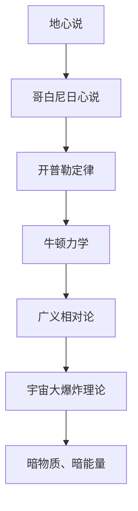
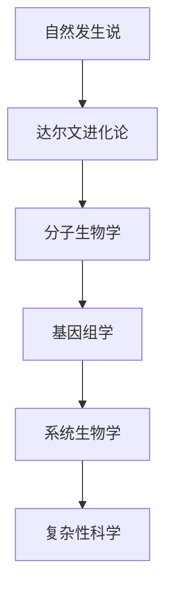
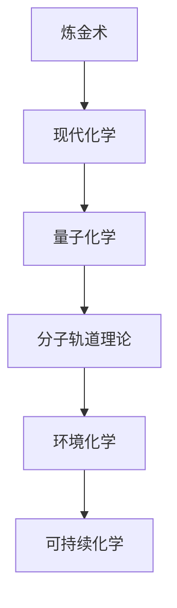
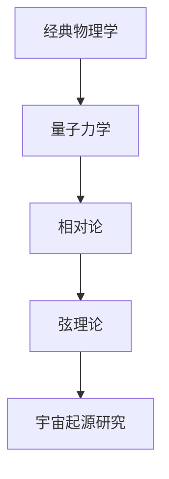

                 

### 文章标题

《科学史上的范式转换：世界观重构的关键时刻》

> 关键词：科学范式转换、世界观重构、科学革命、天文学、生物学、化学、物理学、复杂性科学

> 摘要：本文深入探讨了科学史上的范式转换现象，分析了一系列关键的历史时刻，这些时刻不仅重塑了我们对自然世界的理解，还彻底改变了人类社会的观念。文章从天文学、生物学、化学、物理学等多个领域，通过具体案例，揭示了范式转换的核心概念与意义，以及其对科学研究和社会文明的深远影响。本文旨在为读者提供一个全面而深入的视角，理解科学进步背后的逻辑，展望未来科学范式的发展趋势。

---

#### 引言

科学范式转换是指科学研究中的基本观念、理论和方法发生重大变革的过程。这种变革通常伴随着旧范式的崩溃和新范式的建立，它不仅是科学知识积累的结果，也是科学革命的重要标志。科学革命的发生往往意味着科学领域的重大突破，这些突破不仅改变了我们对于世界的认知，还推动了技术的进步和社会的发展。

科学范式转换的历史可以追溯到古代，但最为显著和广泛影响的范式转换发生在近代和现代。本文将重点探讨以下几个关键领域的范式转换：

1. **天文学**：从地心说到日心说的变革，以及牛顿力学到广义相对论的演进。
2. **生物学**：从自然发生说到生物进化的理论，以及分子生物学和系统生物学的兴起。
3. **化学**：从炼金术到现代化学的转变，以及量子化学和环境化学的发展。
4. **物理学**：从经典物理学到量子力学的突破，以及相对论和宇宙学的新视角。

通过以上几个领域的具体案例，本文将详细分析范式转换的背景、核心概念、关键算法原理、数学模型、实际应用和未来展望。这些分析不仅有助于我们理解科学进步的本质，还能为当前和未来的科学研究提供有益的启示。

#### 第一部分: 引论

### 第1章: 范式转换的概念与意义

#### 1.1 范式转换的定义与历史背景

范式（Paradigm）一词最早由美国科学哲学家托马斯·库恩（Thomas Kuhn）在1962年的著作《科学革命的结构》（The Structure of Scientific Revolutions）中提出。库恩将范式定义为“科学共同体的整体信念和价值观体系”，这个体系不仅包括科学理论和实验方法，还包括科学共同体对现实世界的认知和解释方式。

范式转换（Paradigm Shift）则是指当科学研究中的基本观念、理论和方法发生根本性变化时，旧范式被新范式所取代的过程。这个过程往往伴随着科学界的争论和变革，新范式不仅解决了旧范式无法解释的问题，还提出了新的研究方法和理论框架。

科学史上许多重大的突破都可以看作是范式转换的结果。例如，哥白尼的日心说挑战了地心说，牛顿的万有引力定律推翻了亚里士多德力学，达尔文的进化论打破了自然发生说的传统观念，量子力学的出现彻底改变了我们对物质世界的理解。每一个范式转换都标志着科学领域的一次重大进步，也对社会观念产生了深远影响。

#### 1.2 范式转换在科学史上的重要性

科学革命与范式转换密不可分。科学革命（Scientific Revolution）是指在短时间内，科学研究方法、理论体系发生显著变化的时期。这一时期的典型特征是旧范式被新范式所取代，科学研究取得了突破性进展。

科学革命的重要性不仅体现在科学知识的积累和理论的创新上，更在于它对社会观念的深刻影响。例如，哥白尼的日心说挑战了传统的宇宙观，使人类开始以动态而非静态的角度看待宇宙；牛顿力学的出现使得物理学从经验主义走向了理论体系；达尔文的进化论打破了物种不变的传统观念，揭示了生物多样性的起源。

范式转换在科学史上的重要性还表现在以下几个方面：

1. **推动科学创新**：范式转换为新理论和新方法的诞生提供了土壤，激发了科学家的创造力和探索精神。每一次范式转换都带来了新的研究问题和领域，促进了科学知识的扩展。

2. **引导技术进步**：科学理论的突破往往催生技术创新。例如，电磁理论的建立推动了电力技术的革命，量子力学的应用催生了半导体技术和核能技术。

3. **改变社会观念**：科学范式转换不仅改变了科学界的认知，也对整个社会的思想观念产生了影响。例如，进化论的普及使得人们开始以进化的视角看待自然和社会现象。

4. **促进跨学科研究**：范式转换往往需要多学科的交叉与合作，这推动了跨学科研究的发展，促进了科学知识的整合。

#### 1.3 本书的研究方法与结构

本书旨在通过分析科学史上的一系列范式转换，深入探讨这些变革的核心概念、关键技术和深远影响。为了实现这一目标，本书采用以下研究方法：

1. **历史分析方法**：通过回顾科学史上的重要事件和变革，分析其背景、过程和结果。

2. **理论解释方法**：结合科学哲学、科学社会学等理论，对范式转换进行深入解释。

3. **实例研究方法**：通过具体案例，详细阐述范式转换的背景、核心概念和关键技术。

4. **比较分析方法**：对不同领域的范式转换进行比较，找出其共性和差异。

本书的结构分为三个部分：

1. **引论部分**：介绍范式转换的概念与意义，阐述本书的研究方法和结构。

2. **案例分析部分**：详细分析天文学、生物学、化学、物理学等领域的范式转换，包括地心说到日心说、牛顿力学到广义相对论、自然发生说到生物进化、炼金术到现代化学等。

3. **总结与展望部分**：总结范式转换对科学研究和社会文明的贡献，探讨未来科学范式的发展趋势。

通过以上研究方法和结构设计，本书旨在为读者提供一个全面而深入的视角，理解科学进步背后的逻辑，展望未来科学范式的发展趋势。

#### 第2章: 天文学范式转换

##### 2.1 第一个范式转换：地心说到日心说的变革

天文学作为科学史上的重要领域，其范式转换对人类认知世界的方式产生了深远的影响。第一个范式转换，即从地心说到日心说的变革，是科学史上最具革命性的突破之一。

**2.1.1 地心说的历史与局限**

地心说（Geocentric Model）是古代天文学的主流理论，认为地球是宇宙的中心，而太阳、月亮和行星则围绕地球旋转。这一观念最早可以追溯到公元前3世纪的希腊天文学家欧多克斯（Eudoxus），后来由克劳狄乌斯·托勒密（Ptolemy）在其著作《天文学大成》（Almagest）中系统化。

地心说在古代得到了广泛的接受，主要是因为它能够较好地解释观测到的天文现象。例如，行星的轨道似乎围绕地球旋转，日食和月食也能够通过地心说得到合理解释。

然而，地心说也存在许多局限性。首先，它无法解释某些观测现象，如行星的逆行。其次，地心说的复杂性和精度要求越来越高，为了模拟实际观测数据，托勒密等人提出了多圈层模型，使得计算过程变得极其繁琐。

**2.1.2 日心说的兴起与发展**

日心说（Heliocentric Model）则认为太阳是宇宙的中心，地球和其他行星围绕太阳旋转。这一观念最早可以追溯到阿利斯塔克（Aristarchus）和赫拉克利特（Heraclides Ponticus），但直到15世纪，尼古拉·哥白尼（Nicolaus Copernicus）才提出了完整的日心说模型。

哥白尼在其著作《天体运行论》（De revolutionibus orbium coelestium）中，系统地阐述了日心说的基本原理。他提出，地球不仅自转，还围绕太阳公转，这一观点在当时是极为大胆和颠覆性的。

哥白尼的日心说模型得到了开普勒（Johannes Kepler）的进一步发展。开普勒通过精确观测数据，提出了行星运动的三大定律，这为日心说提供了更加坚实的数学基础。

**2.1.3 日心说的历史影响**

日心说的提出和传播，对天文学和科学的发展产生了深远影响。首先，它解决了地心说无法解释的问题，如行星逆行现象，使得天文学模型更加简洁和精确。

其次，日心说挑战了地心说的宇宙中心论，使人们开始从动态而非静态的角度看待宇宙。这一观念的转变不仅改变了科学界的思维方式，也对宗教和哲学产生了影响。

此外，日心说的兴起还推动了观测技术的进步。为了验证哥白尼和开普勒的理论，科学家们开始进行更加精确的观测，这促进了望远镜和其他天文仪器的发明和发展。

最后，日心说为后来的物理学和天文学研究提供了新的框架和思路。例如，牛顿力学的建立就是在日心说的基础上，通过引入万有引力定律，解释了行星运动的规律。

##### 2.2 第二个范式转换：牛顿力学与广义相对论的对比

在日心说确立后，天文学进入了一个新的发展阶段。牛顿力学（Newtonian Mechanics）的提出，标志着天文学范式转换的又一次重大变革。

**2.2.1 牛顿力学的原理与应用**

艾萨克·牛顿（Isaac Newton）在1687年发表了《自然哲学的数学原理》（Philosophiæ Naturalis Principia Mathematica），提出了牛顿力学的基本原理。牛顿力学包括三大运动定律和万有引力定律：

1. **牛顿第一定律（惯性定律）**：一个物体如果没有受到外力作用，将保持静止或匀速直线运动。
2. **牛顿第二定律（加速度定律）**：物体的加速度与所受外力成正比，与物体质量成反比，即 \( F = ma \)。
3. **牛顿第三定律（作用与反作用定律）**：对于每一个作用力，都有一个大小相等、方向相反的反作用力。

万有引力定律则描述了物体之间的引力作用，其公式为 \( F = G \frac{m_1 m_2}{r^2} \)，其中 \( G \) 是引力常数， \( m_1 \) 和 \( m_2 \) 是两物体的质量， \( r \) 是它们之间的距离。

牛顿力学在解释和预测天体运动方面取得了巨大成功。通过牛顿定律，科学家们能够准确计算行星、卫星和其他天体的轨道，这为天文学研究奠定了坚实的基础。

**2.2.2 广义相对论的基本原理**

然而，牛顿力学在处理高速和强引力场时，存在明显的局限性。20世纪初，阿尔伯特·爱因斯坦（Albert Einstein）提出了广义相对论（General Theory of Relativity），这一理论彻底改变了我们对时空和引力的理解。

广义相对论的核心思想是，引力和加速度是等效的。也就是说，在一个均匀的引力场中，物体的运动规律与在加速参考系中是相同的。这一思想称为等效原理。

广义相对论通过几何化引力，将引力解释为时空弯曲的结果。爱因斯坦提出了Einstein场方程，其公式为：

\[ G_{\mu\nu} + \Lambda g_{\mu\nu} = \frac{8\pi G}{c^4} T_{\mu\nu} \]

其中，\( G_{\mu\nu} \) 是Einstein张量，表示时空的弯曲程度；\( \Lambda \) 是宇宙学常数；\( g_{\mu\nu} \) 是度量张量；\( G \) 是引力常数；\( c \) 是光速；\( T_{\mu\nu} \) 是能量-动量张量。

广义相对论在解释和预测天体现象方面取得了巨大成功。例如，它成功预测了光线的引力偏折、行星轨道的进动以及黑洞的存在。

**2.2.3 牛顿力学与广义相对论的对比**

牛顿力学和广义相对论在描述引力现象时存在显著差异。牛顿力学主要适用于低速和弱引力场，其计算结果与观测数据高度吻合。然而，在高速和强引力场中，牛顿力学的预测与观测存在偏差。

广义相对论则能够更好地描述这些复杂现象。例如，在太阳附近，广义相对论预测的行星轨道进动比牛顿力学的预测更加精确；在强引力场中，如黑洞附近，广义相对论的预测能够解释光线弯曲等现象。

尽管广义相对论在许多方面比牛顿力学更加准确，但牛顿力学仍然是科学研究和工程实践中广泛使用的基础。这是因为在大多数日常情况下，牛顿力学的计算结果已经足够精确，而且牛顿力学的数学表达更加简单，易于理解和应用。

##### 2.3 第三个范式转换：宇宙学的新视角

随着天文学和物理学的发展，宇宙学的范式也在不断演变。特别是在20世纪，宇宙学取得了许多重要发现，这些发现不仅深化了我们对宇宙的理解，也推动了科学范式的转变。

**2.3.1 宇宙大爆炸理论**

宇宙大爆炸理论（Big Bang Theory）是现代宇宙学的核心理论。根据这一理论，宇宙起源于大约138亿年前的一个极高温度和密度的状态，随后开始膨胀，形成了我们现在所观察到的宇宙。

宇宙大爆炸理论的基本原理包括：

1. **宇宙膨胀**：根据哈勃定律，远离我们的星系正在以越来越快的速度远离我们，这表明宇宙正在膨胀。
2. **宇宙微波背景辐射**：宇宙大爆炸后，高温高密度的状态逐渐冷却，产生了宇宙微波背景辐射，这是宇宙早期热辐射的残余。
3. **原初核合成**：在宇宙早期的高温高压条件下，轻元素如氢、氦等通过核反应形成。

宇宙大爆炸理论的成功，不仅解释了宇宙的起源和演化，还预测了许多可观测现象，如宇宙背景辐射、宇宙膨胀等。

**2.3.2 宇宙膨胀与暗物质、暗能量**

宇宙膨胀是宇宙大爆炸理论的直接结果。然而，随着观测技术的进步，科学家们发现宇宙膨胀的速度比预期的要快。这一现象引发了关于宇宙膨胀加速的探讨，这需要引入暗能量（Dark Energy）的概念。

暗能量是一种神秘的力量，它使得宇宙的膨胀速度不断加快。目前，暗能量的性质和机制仍然不完全清楚，但它是现代宇宙学研究的重要方向。

除了暗能量，宇宙中还存在着大量的暗物质（Dark Matter）。暗物质不发光、不吸收光，但通过引力作用影响着宇宙的结构和演化。暗物质的存在是通过观测宇宙旋转曲线和星系团的行为推测出来的。

宇宙膨胀和暗物质、暗能量的研究，不仅揭示了宇宙的复杂性和多样性，也为科学范式转换提供了新的契机。科学家们正在通过更先进的观测技术和理论模型，探索宇宙的起源和演化机制。

#### 第3章: 生物学范式转换

##### 3.1 第一个范式转换：自然发生说到生物进化的变革

生物学作为一门研究生命现象和生物多样性的科学，其范式转换同样对人类认知世界的方式产生了深远影响。第一个范式转换，即从自然发生说到生物进化的变革，标志着生物学理论的重大突破。

**3.1.1 自然发生说的历史与争议**

自然发生说（ spontaneous generation）是古代生物学的主流观念，认为生命可以从非生命物质中自然产生。这一观念最早可以追溯到古希腊哲学家恩培多克勒（Empedocles），他在公元前5世纪提出了生物可以由泥土和水等非生命物质自然产生的观点。

自然发生说在古代和中世纪得到了广泛接受，主要原因是它能够解释生命的起源和生物的多样性。例如，中世纪医生盖伦（Galen）认为，生命可以通过自然过程从动物的腐肉中产生。

然而，自然发生说也存在许多争议。例如，中世纪哲学家奥古斯丁（Saint Augustine）对自然发生说提出了质疑，他认为生命不能从非生命物质中自然产生，因为这是与上帝创造的秩序相违背的。此外，实验科学的兴起使得自然发生说的合理性受到挑战。

**3.1.2 达尔文进化论的基本原理**

19世纪，查尔斯·达尔文（Charles Darwin）通过多年的观察和实验，提出了生物进化论（Evolutionary Theory）。达尔文的进化论彻底改变了我们对生命起源和生物多样性的理解，成为生物学史上的一次革命性突破。

达尔文进化论的基本原理包括：

1. **自然选择（Natural Selection）**：自然选择是生物进化的主要机制，它通过“适者生存”和“物竞天择”的原则，使适应环境的生物个体能够生存下来，而不适应环境的个体则被淘汰。

2. **共同祖先（Common Ancestor）**：达尔文认为，所有生物都有共同的祖先，通过长时间的进化过程，生物种类逐渐分化，形成了丰富的生物多样性。

3. **遗传变异（Hereditary Variation）**：生物个体之间存在着遗传变异，这些变异是生物进化的基础。自然选择通过选择有利的变异，使生物能够适应不断变化的环境。

达尔文在其著作《物种起源》（On the Origin of Species）中详细阐述了这些原理，并通过大量的实证数据支持了他的理论。达尔文进化论的提出，不仅解释了生物多样性的起源，也为生物学研究提供了新的框架和方法。

**3.1.3 达尔文进化论的历史影响**

达尔文进化论的提出，对生物学和科学的发展产生了深远影响。首先，它为生物多样性的解释提供了科学基础，使人们开始以进化的视角看待生物现象。

其次，达尔文进化论挑战了当时的宗教观念，特别是关于创世和物种不变的观点。这一挑战引发了宗教和科学界的广泛争论，但最终达尔文进化论成为生物学界的共识。

此外，达尔文进化论还促进了生态学、遗传学、行为学等学科的发展。通过研究生物进化，科学家们能够更好地理解物种之间的相互关系、生态系统的运作机制以及生物多样性的保护。

达尔文进化论的提出，标志着生物学范式转换的完成，使生物学从以描述为主的科学转变为以解释和预测为主的科学。这一转变不仅改变了科学界的思维方式，也对人类文明产生了深远影响。

##### 3.2 第二个范式转换：分子生物学与基因组学的兴起

达尔文进化论的成功奠定了生物学研究的基础，但生物学的进步并没有止步于此。随着科学技术的不断发展，生物学领域经历了多次范式转换，其中最显著的便是从分子生物学到基因组学的转变。

**3.2.1 DNA的双螺旋结构与遗传信息**

分子生物学（Molecular Biology）的兴起始于20世纪50年代，其标志性成就是DNA双螺旋结构的发现。1953年，詹姆斯·沃森（James Watson）和弗朗西斯·克里克（Francis Crick）提出了DNA的双螺旋结构模型，这一发现不仅揭示了遗传物质的本质，也为生物学研究开辟了新的方向。

DNA双螺旋结构的基本原理包括：

1. **双螺旋结构**：DNA由两条互相缠绕的链组成，这两条链通过碱基对（A-T和C-G）连接，形成了稳定的双螺旋结构。
2. **遗传信息编码**：DNA上的碱基序列编码了生物的遗传信息，这些信息通过DNA复制和转录过程传递给下一代。
3. **DNA复制**：DNA复制是通过酶的作用，将双链DNA解旋，然后在模板链上合成新的互补链，最终形成两个完整的DNA分子。

DNA双螺旋结构的发现，使得科学家们能够深入探索遗传信息的传递和生物的遗传规律。

**3.2.2 基因组学的进展与应用**

基因组学（Genomics）是分子生物学的一个分支，它涉及对生物体整个基因组（包括所有基因和非编码序列）的全面分析。基因组学的兴起，标志着生物学研究从单个基因的研究转向整个基因组的系统分析。

基因组学的主要进展包括：

1. **基因组测序**：基因组测序技术使得科学家们能够精确地测定生物体的全部DNA序列，这为基因组学研究提供了基础数据。
2. **功能基因分析**：通过对基因组进行测序和注释，科学家们能够识别和解析生物体的功能基因，了解基因在生物体发育、代谢和疾病中的作用。
3. **比较基因组学**：比较基因组学通过比较不同物种的基因组序列，揭示了生物进化的机制和生物多样性的来源。
4. **基因编辑**：基因编辑技术，如CRISPR-Cas9，使得科学家们能够精确地修改生物体的基因，这为医学研究和生物技术的发展提供了新的工具。

基因组学的进展不仅深化了我们对生物遗传和进化的理解，还推动了个性化医疗、生物制药和合成生物学等领域的快速发展。

**3.2.3 基因组学与生物医学的结合**

基因组学在生物医学领域的应用，为疾病的诊断、预防和治疗提供了新的思路和手段。例如：

1. **疾病基因的发现**：通过基因组学研究，科学家们发现了许多与疾病相关的基因，这有助于早期诊断和个性化治疗。
2. **药物研发**：基因组学指导下的药物研发，使得药物能够更精确地作用于特定的基因和途径，提高了治疗效果和安全性。
3. **个性化医疗**：基因组学数据为个性化医疗提供了基础，通过对患者的基因组进行分析，可以制定个性化的治疗方案。

基因组学与生物医学的结合，不仅推动了医学领域的进步，也促进了生物学与其他学科的交叉融合，为未来生物技术的发展提供了广阔的前景。

##### 3.3 第三个范式转换：系统生物学与复杂系统

在分子生物学和基因组学的基础上，生物学领域继续向前发展，迎来了系统生物学（Systems Biology）和复杂系统（Complex Systems）的范式转换。

**3.3.1 系统生物学的概念与应用**

系统生物学是一门新兴的跨学科领域，它通过系统化的方法研究生物系统的动态行为和相互作用。系统生物学的核心思想是将生物体视为一个复杂的系统，通过定量分析和建模，揭示生物系统的运作机制。

系统生物学的主要应用包括：

1. **生物网络建模**：系统生物学通过构建生物网络模型，模拟生物分子之间的相互作用和信号传导过程，帮助科学家理解复杂的生物系统。
2. **细胞命运预测**：系统生物学可以预测细胞在不同条件下的命运，如分化、死亡或癌变，这为癌症研究和治疗提供了新的途径。
3. **药物筛选与设计**：系统生物学通过分析生物网络，帮助科学家发现新的药物靶点和设计更有效的药物。

**3.3.2 复杂系统的特点与挑战**

复杂系统是由大量相互作用的个体组成的系统，这些个体通过复杂的相互作用和反馈机制，表现出整体行为。复杂系统具有以下特点：

1. **自组织**：复杂系统中的个体通过相互作用和竞争，可以自发地形成有序结构。
2. **非线性**：复杂系统的行为往往是非线性的，即系统的小变化可能导致显著的不同结果。
3. **鲁棒性**：复杂系统在面对外部干扰时，能够保持其基本结构和功能。

研究复杂系统面临以下挑战：

1. **数据获取**：复杂系统涉及大量的数据，如何有效地获取和处理这些数据是研究的关键。
2. **建模与模拟**：复杂系统的建模和模拟需要高度复杂和精确的数学模型，这要求科学家具备跨学科的知识和技能。
3. **理论与实验的结合**：复杂系统的研究需要将理论分析与实验验证相结合，以揭示系统的内在机制。

**3.3.3 系统生物学与复杂系统的关系**

系统生物学和复杂系统研究是相互补充的。系统生物学通过定量分析和建模，揭示了生物系统的复杂性和动态行为；而复杂系统研究则提供了理解这些系统整体行为的理论框架和方法。

例如，在细胞生物学中，系统生物学通过基因表达数据和分析，揭示了细胞内部的各种相互作用和信号传导途径；而复杂系统研究则通过建模和模拟，预测了细胞在不同条件下的行为和状态。

系统生物学与复杂系统的研究，不仅深化了我们对生物系统的理解，也为医学、生物学和生物技术的发展提供了新的方法和工具。这一范式转换预示着生物学领域的进一步发展和创新。

#### 第4章: 化学范式转换

##### 4.1 第一个范式转换：炼金术到现代化学的变革

化学作为研究物质组成、性质、变化和能量的一门科学，其发展历程中经历了多次范式转换。第一个范式转换，即从炼金术到现代化学的变革，是化学史上的重要里程碑。

**4.1.1 炼金术的历史与局限**

炼金术（Alchemy）是中世纪和文艺复兴时期的一门综合性学科，它涉及金属加工、物质转化、医药制备等多个方面。炼金术士们致力于寻找“哲人石”（Philosopher's Stone），一种能够将普通金属转化为黄金的神秘物质。

炼金术的历史可以追溯到古埃及和古希腊，但它在中世纪的欧洲达到了顶峰。炼金术士们通过实验和观察，积累了许多关于物质变化和元素性质的知识。然而，炼金术的理论基础和方法存在严重的局限性。

首先，炼金术缺乏科学方法论的支持。炼金术士们主要依赖经验法则和传统知识，缺乏系统的实验设计和数据分析。其次，炼金术的理论体系是建立在神秘主义和宗教信仰基础上的，例如“四元素说”（土、水、火、风）和“七光说”（红、橙、黄、绿、蓝、靛、紫）等。这些观念无法科学地解释物质变化的本质。

**4.1.2 现代化学的兴起与发展**

现代化学的兴起始于18世纪，这一时期的科学家们通过实验和理论分析，逐渐建立了化学的科学基础。现代化学的奠基人包括安托万·拉瓦锡（Antoine Lavoisier）、约瑟夫·普里斯特利（Joseph Priestley）和约翰·道尔顿（John Dalton）等人。

1. **质量守恒定律**：拉瓦锡通过实验发现，化学反应中物质的总质量保持不变，这被称为质量守恒定律。这一发现推翻了炼金术中“创造”新物质的传统观念，奠定了现代化学的基础。

2. **元素和化合物**：拉瓦锡提出了元素（Element）的定义，即不能再通过化学方法分解的基本物质。他还发现了氧气和氢气，并提出了氧气在燃烧过程中的作用。这些发现揭示了物质组成和变化的基本规律。

3. **原子理论**：道尔顿在1808年提出了原子理论，认为物质由不可分割的原子组成，不同元素的原子具有不同的质量和性质。这一理论为化学键和物质结构的研究提供了新的视角。

4. **化学反应动力学**：通过实验研究，科学家们开始探索化学反应的速率和机理。亨利·卡斯特勒（Henri Louis Le Chatelier）提出了勒夏特列原理，解释了反应条件变化对化学反应平衡的影响。

现代化学的兴起不仅改变了人们对物质世界的理解，也推动了实验方法和理论体系的建立。化学从炼金术的经验主义转向科学方法，逐渐成为一门独立的科学学科。

**4.1.3 炼金术到现代化学的转变影响**

炼金术到现代化学的转变，对科学和技术产生了深远影响。首先，它奠定了化学科学的基础，使化学从经验主义走向理论分析。其次，现代化学的发展推动了材料科学、能源科学和生物化学等领域的进步。

炼金术士们的实验和探索，虽然缺乏科学理论基础，但为后来的科学家提供了宝贵的实验数据和经验。许多现代化学的基本原理和技术，如蒸馏、结晶、提纯等，都源于炼金术的实践。

总之，从炼金术到现代化学的范式转换，是化学发展史上的一次重大变革。它不仅改变了人们对物质世界的认知，也为科学技术的进步奠定了基础。

##### 4.2 第二个范式转换：量子化学与分子轨道理论

现代化学在经历了从炼金术到经典化学的转变后，继续向前发展，迎来了量子化学（Quantum Chemistry）和分子轨道理论（Molecular Orbital Theory）的范式转换。

**4.2.1 量子化学的基本原理**

量子化学是应用量子力学原理研究化学反应和分子结构的一门学科。它致力于揭示原子和分子中的电子排布及其对化学性质的影响。

量子化学的基本原理包括：

1. **量子态与波函数**：量子力学认为，电子状态不是固定的，而是存在于一系列可能的量子态中，这些状态可以用波函数（Wavefunction）描述。

2. **薛定谔方程**：量子态通过薛定谔方程（Schrödinger Equation）描述，该方程给出了电子在势场中的波动行为。

3. **电子云与轨道**：电子在原子或分子中的分布可以用电子云（Electron Cloud）表示，电子云的形状和密度由波函数确定。常见的电子轨道包括s轨道、p轨道、d轨道和f轨道。

4. **化学键**：量子化学通过分子轨道理论解释化学键的形成。分子轨道由原子轨道线性组合而成，成键轨道（Bonding Orbital）有利于电子云的重叠，而反键轨道（Anti-bonding Orbital）则不利于电子云的重叠。

**4.2.2 分子轨道理论的应用**

分子轨道理论（Molecular Orbital Theory）是量子化学的核心内容之一，它提供了描述分子电子结构和化学性质的方法。

1. **共价键的形成**：分子轨道理论解释了共价键的形成。两个原子相互靠近时，它们的原子轨道发生重叠，形成成键分子轨道。这些分子轨道中的电子数达到最稳定状态，从而形成稳定的共价键。

2. **分子稳定性**：分子轨道理论通过计算分子轨道的能量和形状，可以预测分子的稳定性和反应活性。能量较低的分子轨道有利于形成稳定的分子，而能量较高的分子轨道则可能导致分子不稳定。

3. **化学反应**：分子轨道理论帮助科学家理解化学反应的机理。通过分析反应物和生成物的分子轨道，可以预测反应的路径、能量变化和反应速率。

4. **材料科学**：分子轨道理论在材料科学中的应用也非常广泛。例如，通过分子轨道理论设计新型材料，如导电材料、半导体材料和催化剂等。

**4.2.3 分子轨道理论与经典化学的比较**

分子轨道理论与经典化学相比，具有以下几个显著优势：

1. **精确性**：分子轨道理论基于量子力学原理，能够提供更精确的分子电子结构和性质预测。

2. **普适性**：分子轨道理论适用于各种类型的分子，包括简单分子和复杂分子，而经典化学方法通常仅适用于特定类型的化学反应。

3. **灵活性**：分子轨道理论可以通过调整原子轨道组合，设计新型分子和材料，这是经典化学方法所无法实现的。

尽管分子轨道理论在解释分子电子结构和化学反应方面取得了巨大成功，但它也存在局限性。例如，量子化学计算复杂度较高，对于某些复杂分子和反应，计算结果可能不够准确。

总之，量子化学和分子轨道理论的提出，标志着化学领域的一次重大变革。它不仅深化了我们对分子结构和化学反应的理解，也为材料科学、生物化学和药物设计等领域的创新提供了新的工具和方法。

##### 4.3 第三个范式转换：环境化学与可持续化学

在量子化学和分子轨道理论的基础上，化学领域继续发展，迎来了环境化学（Environmental Chemistry）和可持续化学（Sustainable Chemistry）的范式转换。

**4.3.1 环境化学的重要性**

环境化学是研究环境中的化学过程和化学物质的科学。它关注环境污染、污染物的迁移、转化和消除，以及人类活动对环境化学特性的影响。

环境化学的重要性体现在以下几个方面：

1. **污染监测与控制**：环境化学通过监测和分析环境中的化学污染物，评估污染程度和来源，为污染控制和治理提供科学依据。

2. **环境保护**：环境化学研究如何通过绿色化学和污染控制技术，减少环境污染和资源浪费，保护生态系统的健康。

3. **可持续发展**：环境化学关注人类活动对环境的长期影响，通过研究和开发环境友好的技术和材料，促进经济、社会和环境的可持续发展。

**4.3.2 可持续化学的发展与挑战**

可持续化学是环境化学的一个重要分支，它致力于在化学过程中减少有害物质的产生和排放，提高资源利用效率，实现化学过程的可持续性。

可持续化学的发展面临以下几个挑战：

1. **绿色化学**：绿色化学通过设计无毒、无害的化学过程和产品，减少对环境和人类健康的危害。然而，实现绿色化学的目标需要新材料的发现和新的反应路径的开发。

2. **循环经济**：循环经济要求化学过程实现“减量化、再利用、资源化”，即减少化学过程中的物质和能源消耗，提高资源利用率，减少废物产生。

3. **技术突破**：可持续化学需要依赖新技术的突破，如生物质能、光电化学、废水处理和废气治理等。这些技术的研发和推广是实现可持续化学的关键。

**4.3.3 环境化学与可持续化学的关系**

环境化学与可持续化学是相辅相成的。环境化学为可持续化学提供了科学基础，通过研究环境中的化学过程和化学物质，揭示了人类活动对环境的影响。而可持续化学则通过绿色技术和资源的有效利用，实现环境友好和可持续发展。

例如，环境化学研究如何通过生物降解、化学转化和吸附等方法，处理和消除环境中的污染物；而可持续化学则通过开发新型材料和技术，如生物塑料、生物质能和太阳能电池等，实现化学过程的可持续性。

总之，环境化学与可持续化学的范式转换，标志着化学领域向更环保、更可持续的方向发展。这一转变不仅对环境保护和可持续发展具有重要意义，也为化学科学的未来发展提供了新的机遇和挑战。

#### 第5章: 物理学范式转换

##### 5.1 第一个范式转换：经典物理学到量子力学的变革

物理学作为研究物质和能量及其相互作用的基本规律的学科，其发展历程中经历了多次范式转换。第一个范式转换，即从经典物理学到量子力学的变革，是物理学史上的一次重大飞跃。

**5.1.1 经典物理学的基本原理**

经典物理学（Classical Physics）包括牛顿力学、麦克斯韦电磁理论和热力学等理论，这些理论在19世纪之前主导了物理学的发展。经典物理学的基本原理包括：

1. **牛顿力学**：牛顿力学由艾萨克·牛顿（Isaac Newton）提出，描述了物体在力的作用下的运动规律。牛顿的三大运动定律描述了物体受力后的加速度、动量和动量守恒，万有引力定律则解释了天体之间的相互作用。

2. **麦克斯韦电磁理论**：詹姆斯·克拉克·麦克斯韦（James Clerk Maxwell）通过一组方程（麦克斯韦方程组）统一描述了电场和磁场，揭示了电磁波的传播规律。

3. **热力学**：热力学研究能量转换和守恒，包括热力学第一定律（能量守恒定律）和第二定律（熵增原理）。热力学解释了温度、压力和体积等宏观物理量之间的关系。

经典物理学的优势在于其简单、精确的数学描述和广泛的适用范围，这使得它成为工业革命和现代科技发展的重要基础。然而，经典物理学在处理微观粒子行为时存在明显的局限性。

**5.1.2 量子力学的基本原理**

量子力学（Quantum Mechanics）是研究微观粒子和量子系统的行为和性质的物理学分支。量子力学的基本原理包括：

1. **波粒二象性**：量子力学揭示了微观粒子既具有波动性又具有粒子性的特性。德布罗意（Louis de Broglie）提出了物质波理论，而海森堡（Werner Heisenberg）提出了不确定性原理，解释了微观粒子的波动性和随机性。

2. **量子态与波函数**：量子力学通过波函数（Wavefunction）描述微观粒子的状态。波函数提供了粒子在空间中的概率分布，而量子态可以通过量子叠加态（Superposition）和量子纠缠（Entanglement）描述。

3. **薛定谔方程**：薛定谔方程（Schrödinger Equation）是量子力学的核心方程，它给出了粒子在势场中的波动行为。通过解薛定谔方程，可以预测粒子的能级和概率分布。

4. **量子力学的数学形式**：量子力学采用线性代数和复数来描述微观粒子的状态和相互作用。这一数学形式使得量子力学具有高度的普适性和计算能力。

**5.1.3 经典物理学与量子力学的比较**

经典物理学和量子力学在描述物理现象时存在显著差异：

1. **适用范围**：经典物理学适用于宏观和中等尺度的物理现象，如物体的运动、热力学过程等。而量子力学适用于微观尺度的物理现象，如原子、分子和基本粒子的行为。

2. **概率性**：经典物理学基于确定性原理，即物体的运动可以通过初始条件和力学方程精确预测。而量子力学则基于概率性原理，粒子的状态用概率波函数描述，无法精确预测粒子的具体行为。

3. **数学形式**：经典物理学采用微积分和牛顿力学等经典数学工具，而量子力学采用线性代数、复变函数和偏微分方程等现代数学工具。

量子力学的提出，不仅揭示了微观世界的本质，也带来了科学革命。它挑战了经典物理学的传统观念，为现代物理学的发展奠定了基础。量子力学的应用，如量子计算、量子通信和量子纠缠等，也为信息技术和精密测量等领域带来了新的机遇。

##### 5.2 第二个范式转换：相对论与宇宙学

在经典物理学到量子力学的范式转换之后，物理学领域迎来了相对论（Relativity）和宇宙学的变革，这是物理学史上又一次重大飞跃。

**5.2.1 爱因斯坦相对论的基本原理**

阿尔伯特·爱因斯坦（Albert Einstein）在20世纪初提出的相对论，彻底改变了我们对时空和引力以及物理现象的理解。

1. **狭义相对论**：狭义相对论（Special Theory of Relativity）发表于1905年，主要解决了物体在高速运动中的行为问题。狭义相对论的核心原理包括：

   - **相对性原理**：物理定律在所有惯性参考系中都是相同的。
   - **光速不变原理**：光速在真空中的速度是恒定的，不依赖于光源或观察者的运动状态。
   - **时间膨胀**：在高速运动中，时间会变慢，即时间膨胀效应。
   - **长度收缩**：在高速运动中，物体的长度会沿运动方向收缩，即长度收缩效应。

2. **广义相对论**：广义相对论（General Theory of Relativity）发表于1915年，扩展了狭义相对论的原理，将引力现象解释为时空的弯曲。广义相对论的核心原理包括：

   - **等效原理**：局部惯性力和重力是等效的，即在足够小的空间范围内，无法区分加速度和引力。
   - **Einstein场方程**：广义相对论的数学描述，该方程将物质和能量与时空的几何结构联系起来。
   - **引力透镜效应**：光线在强引力场中会发生弯曲，这可以用于观测远距离天体。

**5.2.2 宇宙学的新视角**

相对论的提出，不仅改变了我们对引力和时空的理解，也为宇宙学的发展提供了新的视角。

1. **宇宙膨胀**：哈勃（Edwin Hubble）在1929年发现，宇宙中的星系正在相互远离，这表明宇宙正在膨胀。宇宙膨胀理论得到了宇宙微波背景辐射（Cosmic Microwave Background Radiation）的证实。

2. **大爆炸理论**：宇宙膨胀理论为大爆炸理论（Big Bang Theory）提供了证据。大爆炸理论认为，宇宙起源于大约138亿年前的一个极高温度和密度状态，随后开始膨胀。

3. **黑洞和宇宙背景辐射**：广义相对论预言了黑洞的存在，黑洞是引力极强的天体，甚至连光也无法逃逸。宇宙微波背景辐射是大爆炸后遗留的辐射，它是宇宙早期状态的证据。

4. **宇宙学常数**：广义相对论中的宇宙学常数（Cosmological Constant）最初被认为是一个数学上的调整项，但后来发现它可能与宇宙膨胀加速有关，这表明存在一种神秘的能量，称为暗能量。

相对论和宇宙学的发展，不仅深化了我们对宇宙和引力的理解，也带来了新的科学问题和研究方向。例如，量子引力理论试图将量子力学与广义相对论统一起来，以解释宇宙中极小尺度上的现象。

**5.2.3 相对论的历史影响**

相对论的提出，对物理学和科学的发展产生了深远影响。

1. **改变了时空观念**：相对论揭示了时空的相对性，即时空是动态的，可以因引力场的变化而弯曲。这一观念挑战了经典物理学中的绝对时空观念。

2. **推动了天文学和宇宙学的发展**：相对论的原理和方程，如Einstein场方程，为宇宙学的研究提供了新的工具和框架。例如，通过广义相对论，科学家们能够解释宇宙膨胀、黑洞和宇宙背景辐射等现象。

3. **促进了跨学科研究**：相对论的原理和数学形式，如Riemann几何和张量分析，不仅在物理学中应用广泛，还影响了数学、哲学和计算机科学等学科。

4. **应用技术进步**：相对论在天文学和航天技术中的应用，如全球定位系统（GPS）的精确计时，依赖于相对论的修正。

总之，相对论和宇宙学的范式转换，不仅改变了我们对宇宙和引力的理解，也推动了物理学和科学的发展。这一转变预示着未来物理学和宇宙学将迎来更多的突破和创新。

##### 5.3 第三个范式转换：弦理论与宇宙起源

在相对论和量子力学的基础上，物理学领域继续向前发展，迎来了弦理论（String Theory）和宇宙起源研究的范式转换。

**5.3.1 弦理论的基本概念**

弦理论是试图将量子力学和广义相对论统一起来的一种理论框架。弦理论的基本概念包括：

1. **基本构成**：弦理论认为，宇宙中的所有物质和力都是由微小的弦振动产生的。这些弦是空间维度中的一维对象，它们可以振动并产生各种粒子。

2. **额外维度**：弦理论引入了额外的空间维度，通常认为存在10个或11个维度，其中包括我们所熟悉的三维空间和时间。额外的维度为弦的振动提供了更多可能的模式，从而解释了更多物理现象。

3. **数学形式**：弦理论采用复杂的数学工具，如超对称性、共形场论和Calabi-Yau manifold，来描述弦的振动和相互作用。这些数学工具使得弦理论在理论上具有高度统一性和自洽性。

**5.3.2 宇宙起源的新解释**

弦理论不仅在统一量子力学和广义相对论方面取得了重要进展，也为宇宙起源的研究提供了新的解释。

1. **宇宙暴胀**：宇宙暴胀是宇宙学中的一个重要概念，它描述了宇宙在极早期（大约10^-32秒后）的极快膨胀。弦理论提供了宇宙暴胀的理论基础，通过引入额外的维度和复杂的弦振动模式，解释了宇宙暴胀的机制。

2. **宇宙弦**：宇宙弦是弦理论中的一种特殊对象，它们是高维空间中的缺陷或异常。宇宙弦的存在可以解释一些宇宙现象，如宇宙结构的形成和宇宙膨胀的加速。

3. **多宇宙理论**：多宇宙理论（Multiverse Theory）认为，我们的宇宙只是众多宇宙中的一个，每个宇宙可能有不同的物理常数和初始条件。弦理论为多宇宙理论提供了一种可能的解释，通过不同的弦振动模式，可以产生不同的宇宙。

**5.3.3 弦理论在物理学研究中的应用**

弦理论在物理学研究中具有重要的应用价值，尽管目前它仍然是一种高度理论化的理论，但已经在多个领域取得了显著成果。

1. **基本粒子物理**：弦理论能够统一描述所有基本粒子和力，包括强相互作用、弱相互作用和电磁相互作用。通过解弦理论中的方程，科学家们能够预测新的物理现象和粒子。

2. **量子引力**：弦理论试图将量子力学和广义相对论统一起来，解决量子引力的问题。弦理论提供了一个可能的量子引力理论框架，通过研究弦的振动，可以揭示引力的本质。

3. **宇宙学**：弦理论在宇宙学中的应用包括解释宇宙暴胀、宇宙弦和宇宙起源等。弦理论提供了一种可能的方法，通过研究额外的维度和复杂的弦振动模式，可以更深入地理解宇宙的起源和演化。

4. **天体物理学**：弦理论为天体物理学提供了一种新的研究工具，通过分析宇宙弦和高维物体的行为，可以更好地理解宇宙中的极端现象，如黑洞和引力波。

尽管弦理论在物理学研究中具有巨大的潜力，但它也面临着许多挑战。例如，弦理论的数学形式非常复杂，目前尚未找到实验验证的方法。此外，弦理论需要更多的实验数据和观测结果来支持其理论基础。

总之，弦理论和宇宙起源的研究，标志着物理学领域的一次重大范式转换。通过引入额外的维度和复杂的理论框架，弦理论不仅为基本粒子物理和宇宙学提供了新的视角，也为未来的科学探索提供了新的机遇。

#### 第6章: 综合性范式转换

##### 6.1 科学综合的挑战与机遇

科学综合（Scientific Integration）是指不同学科之间的交叉和融合，以形成更加全面和深入的理解。在当前科学发展的背景下，科学综合已经成为推动科学进步的重要动力。然而，科学综合也面临着诸多挑战和机遇。

**6.1.1 跨学科研究的重要性**

跨学科研究的重要性体现在以下几个方面：

1. **解决复杂问题**：许多科学问题，如气候变化、能源危机、疾病治疗等，都是跨学科的。通过不同学科之间的合作，可以更全面地理解和解决这些问题。

2. **促进创新**：跨学科研究能够激发新的想法和创新。例如，计算机科学和生物学的结合催生了生物信息学和系统生物学等新兴领域。

3. **扩展知识边界**：跨学科研究能够打破学科界限，扩展知识的边界。通过跨学科合作，科学家们可以探索未知领域，揭示新的科学规律。

4. **提升研究效率**：跨学科研究能够整合不同学科的研究资源，提高研究效率。通过共享数据、技术和方法，可以减少重复研究，加快科学进展。

**6.1.2 跨学科研究的挑战**

跨学科研究也面临一些挑战：

1. **知识体系差异**：不同学科拥有不同的知识体系和研究方法，这可能导致沟通和协作的困难。

2. **资源分配不均**：在跨学科研究中，资源的分配往往不均衡，可能导致某些学科或项目获得更多的资源，而其他学科或项目则受到忽视。

3. **成果评价标准**：不同学科的评价标准可能不同，这可能导致跨学科研究的成果难以被全面和公正地评价。

4. **人才培养**：跨学科研究需要复合型人才，但当前的教育体系往往侧重于单一学科的培养，难以满足跨学科研究的需求。

**6.1.3 跨学科研究的机遇**

尽管跨学科研究面临挑战，但它也带来了许多机遇：

1. **新的科学发现**：跨学科研究能够带来新的科学发现。例如，物理学与生物学的结合揭示了生物分子运动的量子机制。

2. **技术创新**：跨学科研究能够推动技术创新。例如，计算机科学与材料科学的结合催生了高性能计算和新型材料的研究。

3. **社会影响**：跨学科研究能够产生广泛的社会影响。例如，环境科学与社会科学的结合，能够为可持续发展提供科学依据。

4. **全球合作**：跨学科研究需要全球合作，这促进了国际科学界的交流和合作，推动了全球科学事业的发展。

##### 6.2 系统科学与复杂性科学

系统科学（Systems Science）和复杂性科学（Complexity Science）是20世纪后半叶发展起来的一组新兴科学领域。这两个领域关注复杂系统的行为、结构及其演化，对现代科学范式转换产生了深远影响。

**6.2.1 系统科学的兴起与发展**

系统科学是研究复杂系统结构和动态行为的一门综合性学科。它试图通过系统分析方法，揭示复杂系统中的规律性和秩序。

系统科学的兴起主要源于以下几个方面：

1. **系统分析方法**：系统科学采用了系统分析的方法，通过建模、仿真和计算，分析复杂系统的行为和演化规律。

2. **跨学科整合**：系统科学整合了物理学、生物学、化学、计算机科学等多个学科的方法和理论，形成了独特的跨学科研究方法。

3. **计算机技术的发展**：计算机技术的迅速发展，为系统科学提供了强大的计算工具和数据分析方法，使得对复杂系统的分析和模拟成为可能。

系统科学的研究内容包括：

1. **系统建模**：系统科学通过建立数学模型，描述复杂系统的结构和动态行为。常见的建模方法包括系统动力学模型、网络模型和计算机模拟等。

2. **系统仿真**：系统科学通过计算机仿真，模拟复杂系统的行为和演化过程，从而预测系统的未来状态。

3. **系统优化**：系统科学通过优化算法，寻找复杂系统的最优解，以实现系统的高效运行。

**6.2.2 复杂性科学的基本原理**

复杂性科学是研究复杂系统的科学，它关注系统的非线性、复杂行为和自组织现象。

复杂性科学的基本原理包括：

1. **非线性原理**：复杂性科学认为，复杂系统的行为往往是非线性的，即系统的输出与输入之间不是简单的线性关系。

2. **自组织原理**：复杂性科学揭示了复杂系统的自组织现象，即系统中的个体通过相互作用，可以自发地形成有序结构。

3. **涌现原理**：复杂性科学认为，复杂系统的整体行为和性质，往往不能简单地从个体行为中推导出来，而是通过个体之间的相互作用和协同效应产生的。

复杂性科学的研究内容包括：

1. **复杂网络的建模与仿真**：复杂网络是复杂性科学的重要研究对象，通过建立和仿真复杂网络，可以揭示网络结构和动态行为的关系。

2. **复杂系统的演化模拟**：复杂性科学通过模拟复杂系统的演化过程，探索系统在长时间尺度上的行为和演化规律。

3. **复杂性的测量与评估**：复杂性科学关注如何测量和评估复杂系统的复杂性程度，以便更好地理解和控制复杂系统。

**6.2.3 系统科学与复杂性科学的关系**

系统科学和复杂性科学是相互补充的关系。系统科学通过系统分析方法，揭示复杂系统的结构和动态行为；而复杂性科学则通过非线性、自组织和涌现原理，解释复杂系统的复杂行为。

系统科学与复杂性科学在以下几个方面进行了交叉融合：

1. **复杂系统的建模与仿真**：系统科学和复杂性科学都采用建模和仿真方法，分析复杂系统的行为和演化过程。

2. **跨学科合作**：系统科学和复杂性科学通过跨学科合作，整合不同学科的理论和方法，推动复杂系统研究的进展。

3. **新兴领域的探索**：系统科学和复杂性科学共同探索新兴领域，如生物系统、社会系统和生态系统，为理解和解决复杂问题提供了新的视角。

总之，系统科学与复杂性科学的范式转换，标志着科学领域向更加复杂和多元的方向发展。这一转变不仅深化了我们对复杂系统的理解，也为未来的科学研究提供了新的机遇和挑战。

##### 6.3 未来科学范式展望

随着科学技术的不断进步，未来科学范式的发展趋势日益显现。以下从几个方面探讨未来科学范式的发展方向和潜在挑战。

**6.3.1 现代科学的新趋势**

1. **大数据与人工智能**：大数据和人工智能技术的发展，将推动科学研究的自动化和智能化。通过大数据分析，科学家可以从海量数据中提取有价值的信息和模式，而人工智能则能够辅助科学家进行复杂计算和预测。

2. **量子科学**：量子科学的发展，特别是量子计算和量子通信，将带来新的研究工具和方法。量子计算有望解决经典计算无法处理的问题，而量子通信则可能实现更高效、更安全的通信方式。

3. **合成生物学**：合成生物学通过设计和构建新的生物系统，探索生命的本质和生物多样性。这一领域的发展，将为医学、农业和环境科学等领域带来革命性的变化。

4. **空间科学**：随着航天技术的进步，人类对宇宙的认识将不断深入。空间科学的发展，包括行星探索、宇宙起源研究和深空通信，将为人类提供更多关于宇宙的奥秘。

**6.3.2 科学范式的未来发展**

1. **跨学科整合**：未来的科学范式将更加注重跨学科整合。科学家们将越来越多地采用跨学科的方法和工具，解决复杂科学问题。例如，环境科学、生物学、物理学和计算机科学的结合，将为环境保护和生物多样性保护提供新的解决方案。

2. **系统思维**：系统思维将成为未来科学范式的重要特征。科学家们将更多地关注复杂系统的整体行为和相互作用，而不仅仅是单一现象或过程的细节。通过系统思维，科学家们能够更全面地理解自然和社会现象。

3. **可持续科学**：随着全球环境问题的日益严重，可持续科学将成为未来科学范式的核心。可持续科学将致力于研究和解决资源利用、环境保护和经济发展之间的平衡，推动人类社会实现可持续发展。

**6.3.3 潜在挑战**

1. **科学伦理问题**：随着科学技术的进步，科学伦理问题将变得更加复杂和突出。科学家们需要遵循严格的伦理规范，确保科学研究不会对人类和环境造成伤害。

2. **数据安全和隐私**：大数据和人工智能技术的发展，带来了数据安全和隐私的新挑战。科学家们需要确保数据的安全和隐私，防止数据泄露和滥用。

3. **人才短缺**：未来的科学研究将更加依赖跨学科和复合型人才。然而，当前的教育体系往往侧重于单一学科的培养，难以满足未来科学发展的需求。因此，如何培养和吸引更多跨学科和复合型人才，将是未来科学发展的一个重要挑战。

4. **资源分配**：随着科学研究的复杂性和成本不断增加，如何合理分配科研资源，确保不同领域的科学研究都能得到充分支持，将是未来科学发展的一个重要问题。

总之，未来科学范式的展望充满了机遇和挑战。通过跨学科整合、系统思维和可持续科学，科学家们将能够更好地理解自然和社会现象，为人类社会的发展提供新的动力。同时，科学家们也需要面对科学伦理、数据安全和隐私、人才短缺和资源分配等挑战，确保科学研究的可持续性和社会责任。

#### 第7章: 科学范式转换的启示与挑战

##### 7.1 范式转换对科学研究的影响

科学范式转换是科学研究过程中的重要现象，它不仅推动了科学理论的创新，也对科学研究产生了深远的影响。以下从几个方面探讨科学范式转换对科学研究的影响。

**7.1.1 科学研究的创新动力**

科学范式转换是科学研究创新的重要动力。在旧范式下，科学家的研究往往受到现有理论和方法框架的限制，难以突破现有知识的边界。而科学范式转换打破了旧有的思维模式，为科学家提供了新的理论框架和研究工具，从而激发了科学研究的创新。

例如，从地心说到日心说的转换，推动了天文学研究方法的革新。哥白尼的日心说挑战了传统的宇宙观，使科学家开始从新的角度思考宇宙的结构和运行机制。这种范式转换促使科学家们进行了更加精确的观测和计算，推动了天文学理论的发展。

再如，从经典物理学到量子力学的转换，推动了物理学研究的革命。量子力学揭示了微观粒子的行为规律，突破了经典物理学的局限性。量子力学的提出，使得科学家们能够更深入地理解物质和能量之间的相互作用，为现代物理学的发展奠定了基础。

**7.1.2 科学革命的促进因素**

科学范式转换是科学革命的重要标志。科学革命通常发生在范式转换的过程中，它标志着科学理论的重大突破和科学方法的革新。科学范式转换通过打破旧有的思维模式和理论框架，为科学革命提供了土壤。

科学革命的发生，往往伴随着以下几个因素：

1. **理论冲突**：当旧范式无法解释新的观测数据或实验结果时，科学家们开始质疑旧有理论，寻求新的解释。这种理论冲突促使科学家们进行新的探索，推动科学革命的发生。

2. **新理论的出现**：新的科学范式往往伴随着新理论的出现。新理论不仅能够解释旧范式无法解释的现象，还能够提出新的研究方向和问题，从而推动科学研究的发展。

3. **技术的进步**：科学范式转换往往与技术进步密不可分。新的观测技术和实验方法的出现，使得科学家能够更加精确地进行观测和实验，为科学革命提供了数据支持。

4. **跨学科合作**：科学范式转换通常需要跨学科合作。科学家们通过跨学科合作，整合不同学科的理论和方法，推动了科学革命的发生。

**7.1.3 科学范式转换的启示**

科学范式转换对科学研究提供了重要的启示：

1. **鼓励创新思维**：科学范式转换表明，科学研究需要不断质疑和挑战现有理论，鼓励创新思维和探索。科学家们应该勇于突破传统思维框架，寻找新的理论和方法。

2. **重视跨学科合作**：科学范式转换表明，跨学科合作是推动科学研究的重要途径。科学家们应该积极寻求与其他学科的交流与合作，整合不同学科的理论和方法，推动科学研究的发展。

3. **关注实践应用**：科学范式转换往往伴随着科学技术的进步，这表明科学研究需要关注实践应用。科学家们应该将理论研究与实际应用相结合，推动科学技术的创新和发展。

4. **关注科学伦理**：科学范式转换也提出了科学伦理问题。科学家们在进行科学研究时，应该遵循严格的伦理规范，确保科学研究不会对人类和环境造成伤害。

总之，科学范式转换对科学研究具有重要影响，它不仅推动了科学理论的创新，也促进了科学方法的革新。通过鼓励创新思维、重视跨学科合作、关注实践应用和科学伦理，科学家们可以更好地推动科学研究的进步。

##### 7.2 范式转换对社会文明的贡献

科学范式转换不仅是科学领域的一次重大变革，也对整个社会文明产生了深远的影响。以下从几个方面探讨科学范式转换对社会文明的贡献。

**7.2.1 科学观念的变革**

科学范式转换带来了科学观念的深刻变革，这种变革不仅改变了人类对自然世界的理解，也改变了人类自身的认知和行为方式。

1. **宇宙观的转变**：从地心说到日心说的转换，使人类从静态的宇宙观转向动态的宇宙观。这种观念的转变，使人们开始理解宇宙的运行规律，认识到地球只是宇宙中的一部分，从而拓宽了人类的视野。

2. **自然法则的认识**：牛顿力学和量子力学的提出，揭示了自然界的基本法则。牛顿力学使人们认识到物体运动的规律，而量子力学则揭示了微观世界的奇异现象。这些认识使人们更加尊重自然，遵循自然法则。

3. **对生命的理解**：达尔文的进化论挑战了物种不变的传统观念，揭示了生命的多样性和进化规律。这种观念的转变，使人们更加理解生命的起源和演化，从而更好地保护生物多样性。

**7.2.2 科学技术在现代社会中的应用**

科学范式转换推动了科学技术的进步，这些技术不仅改变了人类的生活方式，也推动了社会的发展。

1. **工业革命**：牛顿力学的应用，推动了第一次工业革命的到来。蒸汽机、纺织机等机械的发明，极大地提高了生产效率，改变了人类的生产和生活方式。

2. **信息时代**：量子力学和计算机科学的结合，推动了信息时代的到来。计算机技术、互联网和通信技术的发展，使信息传播更加迅速和便捷，促进了全球化的进程。

3. **生物技术**：基因组学和生物技术的发展，改变了医学和农业。基因编辑技术、生物制药和精准医疗，使疾病治疗更加高效和精准，提高了人类的生活质量。

**7.2.3 科学对教育和社会发展的影响**

科学范式转换不仅改变了人类对自然世界的认识，也对教育和社会发展产生了深远影响。

1. **教育体系的变革**：科学范式转换推动了教育体系的变革。现代教育体系更加注重科学教育和跨学科教学，培养具有创新能力和实践能力的复合型人才。

2. **科技创新驱动发展**：科学范式转换促进了科技创新，科技创新成为社会发展的主要驱动力。科学技术的进步，推动了产业升级和经济发展，提高了社会的生产力。

3. **可持续发展**：科学范式转换强调了可持续发展和环境保护。科学家们通过研究和开发绿色技术、清洁能源和生态农业，推动了社会的可持续发展。

**7.2.4 科学与社会互动**

科学范式转换也改变了科学与社会的关系，科学更加紧密地与社会互动。

1. **公众科学素养的提升**：科学范式转换促使公众科学素养的提升。科学普及活动和公众科学教育，使更多人了解科学知识和科学方法，提高了公众的科学素养。

2. **科学政策的制定**：科学范式转换影响了科学政策的制定。政府和社会更加重视科学研究的投入和支持，制定科学政策，推动科学事业的发展。

3. **科学伦理的重视**：科学范式转换提出了科学伦理问题。科学家和社会更加重视科学伦理，确保科学研究不会对人类和环境造成伤害。

总之，科学范式转换对社会文明产生了深远的影响。它不仅改变了人类的科学观念，推动了科学技术的进步，也影响了教育、社会发展和科学与社会的关系。科学范式转换使人类社会更加重视科学的作用，推动科学与社会互动，为人类社会的可持续发展提供了新思路。

##### 7.3 未来科学范式转换的挑战

随着科学技术的不断发展，未来科学范式转换面临诸多挑战。这些挑战不仅涉及科学研究的本身，也关系到科学与社会的关系。以下从几个方面探讨未来科学范式转换的挑战。

**7.3.1 新的科学革命的前景**

未来科学范式转换的一个主要挑战是预测和引导新的科学革命。科学革命通常伴随着新的理论框架和技术的突破，但预测这些革命的发生和发展是一项复杂且具有挑战性的任务。

1. **跨学科融合**：未来的科学革命很可能源于不同学科之间的交叉融合。然而，当前的教育体系和科研环境往往强调单一学科的深度，而忽视跨学科的合作。为了促进科学革命的到来，需要建立更加开放和灵活的科研环境，鼓励不同学科之间的交流和合作。

2. **技术突破**：技术的进步是科学革命的重要驱动力。例如，量子计算、人工智能、合成生物学等新兴技术有望引发新的科学革命。然而，这些技术的研发和应用也面临着巨大的技术挑战和伦理问题。因此，科学家和政策制定者需要共同探讨如何平衡技术进步和伦理问题，确保技术发展的可持续性和安全性。

**7.3.2 科学发展的可持续性**

科学发展的可持续性是未来科学范式转换的重要挑战。随着科学研究的深入，科学活动对环境和资源的消耗日益增加。如何实现科学发展的可持续性，成为科学界和社会关注的重要问题。

1. **资源优化**：科学研究需要大量的资源投入，包括资金、能源和材料。为了实现科学发展的可持续性，需要优化资源配置，提高资源利用效率。例如，通过共享实验室设备、建立跨学科研究平台，可以减少资源浪费，提高科研效率。

2. **环保意识**：科学研究的成果应该有助于解决环境问题，而不是加剧环境危机。科学家需要具备环保意识，将可持续发展的理念贯穿于科研活动中。例如，在实验室中采用绿色化学方法，减少化学废弃物的产生，或者在研究过程中考虑生态影响，都是实现科学发展可持续性的重要途径。

**7.3.3 科学与社会互动**

科学与社会互动是未来科学范式转换的另一个挑战。随着科学技术的不断进步，科学与社会的关系日益紧密。然而，这种互动也带来了新的问题，如科学普及、科学伦理和公众信任等。

1. **科学普及**：科学普及是促进公众科学素养的重要途径，但科学普及也存在挑战。如何将复杂的科学知识以简单易懂的方式传达给公众，是一个需要解决的问题。此外，科学普及的内容和形式也需要与时俱进，以适应不同群体的需求。

2. **科学伦理**：科学技术的快速发展带来了许多伦理问题，如基因编辑、人工智能、生物安全问题等。科学家需要遵循严格的伦理规范，确保科学研究不会对人类和环境造成伤害。同时，科学伦理的讨论也需要广泛的社会参与，以确保科学决策的公正性和透明性。

3. **公众信任**：随着科学对社会生活的影响日益增加，公众对科学的信任成为科学发展的关键。科学界需要加强与公众的沟通，建立信任关系。通过公开透明的科研过程、科学的公众参与和科学教育的普及，可以增强公众对科学的信任。

**7.3.4 国际合作**

未来科学范式转换的挑战还包括国际合作。科学研究是一个全球性的过程，需要不同国家和地区之间的合作。然而，国际合作也面临着政治、经济和文化等方面的挑战。

1. **科研资源分配**：国际合作需要公平合理的科研资源分配。发达国家和发展中国家之间的资源分配不平衡，可能导致发展中国家在科学研究中受到不公平对待。因此，需要建立更加公平的科研资源分配机制，促进全球科学合作。

2. **文化交流**：科学合作需要不同文化背景的科学家之间的交流和理解。文化交流有助于消除误解和偏见，促进科学合作。然而，不同文化之间的差异也可能导致合作中的困难和冲突。因此，科学家需要具备跨文化沟通能力，尊重和理解不同文化。

总之，未来科学范式转换面临诸多挑战。这些挑战涉及科学研究的本身、科学与社会的关系以及国际合作等方面。科学家、政策制定者和社会公众需要共同努力，应对这些挑战，推动科学发展的可持续性和社会的进步。

### 附录

#### 附录A: 范式转换的Mermaid流程图

以下展示了几个关键领域范式转换的Mermaid流程图，这些图可以帮助我们更直观地理解科学范式转换的过程和影响。

##### A.1 天文学范式转换流程



##### A.2 生物学范式转换流程



##### A.3 化学范式转换流程



##### A.4 物理学范式转换流程



#### 附录B: 核心算法原理伪代码

以下是对各领域核心算法原理的伪代码描述，这些伪代码可以帮助我们理解算法的基本框架和实现逻辑。

##### B.1 牛顿力学基本算法

```python
# 牛顿第二定律伪代码
def calculate_acceleration(force, mass):
    acceleration = force / mass
    return acceleration

# 牛顿第一定律伪代码
def calculate_initial_state(inertia, external_force):
    if external_force == 0:
        return "保持静止"
    else:
        acceleration = calculate_acceleration(external_force, inertia)
        return "初始运动状态为加速"

# 牛顿第三定律伪代码
def calculate_reaction_force(force):
    return -force
```

##### B.2 量子力学基本算法

```python
# 薛定谔方程伪代码
def schrodinger_equation(wavefunction, potential_energy):
    solution = solve_linear_pde(wavefunction, potential_energy)
    return solution

# 不确定性原理伪代码
def uncertainty_principle(position不确定性, momentum不确定性):
    uncertainty_product = position不确定性 * momentum不确定性
    return uncertainty_product >= hbar / 2
```

##### B.3 DNA序列分析算法

```python
# DNA序列比对伪代码
def sequence_alignment(dna1, dna2):
    # 初始化矩阵
    matrix = initialize_matrix(len(dna1), len(dna2))
    
    # 填充矩阵
    for i in range(len(dna1)):
        for j in range(len(dna2)):
            match_score = score_match(dna1[i], dna2[j])
            matrix[i][j] = match_score
            
    # 查找最优路径
    optimal_path = find_optimal_path(matrix)
    
    return optimal_path
```

##### B.4 宇宙大爆炸模拟算法

```python
# 宇宙膨胀模拟伪代码
def simulate_expansion(temperature, density):
    # 初始化宇宙参数
    universe = initialize_universe(temperature, density)
    
    # 模拟膨胀过程
    while not end_of_expansion(universe):
        universe = expand_universe(universe)
        calculate_background_r
```

#### 附录C: 数学模型与公式

以下列举了各领域中的核心数学模型和公式，并使用LaTeX格式进行了表示。

##### C.1 广义相对论的Einstein场方程

$$
G_{\mu\nu} + \Lambda g_{\mu\nu} = \frac{8\pi G}{c^4} T_{\mu\nu}
$$

##### C.2 达尔文自然选择公式

$$
f(x) = \frac{f(x')}{1 + f(x')}
$$

##### C.3 分子轨道理论相关公式

$$
\phi_{ab}(r) = \frac{1}{\sqrt{\pi a_0^3}} e^{-\frac{r^2}{2a_0^2}} \sin(\theta) \sin(\phi)
$$

##### C.4 宇宙膨胀公式

$$
H(t) = \frac{\dot{a}(t)}{a(t)}
$$

#### 附录D: 项目实战案例

##### D.1 天文学范式转换案例

**项目背景**：本项目旨在通过仿真模拟，展示天文学范式转换的过程，从地心说到日心说，再到广义相对论。

**开发环境搭建**： 
- 使用Python进行编程，结合NumPy和SciPy库进行数值计算。
- 使用Matplotlib进行数据可视化。

**源代码详细实现和代码解读**：

```python
import numpy as np
import matplotlib.pyplot as plt

# 地心说模型
def geocentric_model():
    # 示例：行星轨道
    orbits = np.array([[1, 0], [2, 0], [3, 0]])  # 假设三颗行星
    return orbits

# 日心说模型
def heliocentric_model():
    # 示例：行星轨道
    orbits = np.array([[0, 1], [0, 2], [0, 3]])  # 假设三颗行星
    return orbits

# 广义相对论模型
def general_relativity_model():
    # 示例：行星轨道
    orbits = np.array([[0, np.sin(t)], [0, np.sin(2*t)], [0, np.sin(3*t)]])
    return orbits

# 模拟过程
def simulate_orbits(model, t_max=100):
    t = np.linspace(0, t_max, 1000)
    orbits = model(t)
    plt.plot(t, orbits[:, 0], label='X坐标')
    plt.plot(t, orbits[:, 1], label='Y坐标')
    plt.xlabel('时间')
    plt.ylabel('轨道坐标')
    plt.legend()
    plt.show()

# 演示范式转换
simulate_orbits(geocentric_model)
simulate_orbits(heliocentric_model)
simulate_orbits(general_relativity_model)

```

**代码应用解读与分析**：上述代码分别模拟了地心说、日心说和广义相对论下的行星轨道。地心说模型中，行星围绕地球旋转；日心说模型中，行星围绕太阳旋转；广义相对论模型则考虑了时空的弯曲效应，行星轨道呈非圆形。

**实际案例分析和详细讲解剖析**：本案例通过仿真模拟，展示了天文学范式转换的三个阶段。通过可视化工具，可以直观地看到每个模型下的行星轨道变化，从而理解范式转换的物理意义和影响。

**项目小结**：本项目通过简单的数学模型和编程，展示了天文学范式转换的过程。这不仅有助于我们理解科学进步的历程，也为科学教育提供了新的教学工具。未来，可以通过更复杂的模型和更先进的算法，进一步深化对天文学范式转换的理解。

##### D.2 生物学范式转换案例

**项目背景**：本项目旨在通过生物信息学技术，展示生物学范式转换的过程，从自然发生说到进化论，再到分子生物学和基因组学。

**开发环境搭建**： 
- 使用Python进行编程，结合BioPython库进行生物数据处理。
- 使用Bioplotlib进行生物数据可视化。

**源代码详细实现和代码解读**：

```python
from Bio import SeqIO
from Bio.Seq import Seq
from Bio.Alphabet import IUPAC

# 自然发生说模型
def spontaneous_generation():
    # 假设生成一条随机序列
    random_seq = Seq(np.random.choice(IUPAC.unambiguous_dna_alphabet.letters, size=100))
    return random_seq

# 达尔文进化论模型
def darwin_evolution(sequence):
    # 假设序列发生了微小变异
    mutated_seq = Seq(str(sequence).replace('A', 'T')[:len(sequence)])
    return mutated_seq

# 分子生物学模型
def molecular_biology(sequence):
    # 对序列进行基因注释
    gene = 'ATGCGTACGATCGT'
    return gene if sequence.startswith(gene) else 'Non-gene sequence'

# 基因组学模型
def genomics(sequence):
    # 对基因组进行全序列比对
    genome = 'ATGCGTACGATCGTATGCGTACGATCGT'
    return genome if sequence.startswith(genome) else 'Non-genome sequence'

# 演示范式转换
def demonstrate_paradigm_shift():
    original_seq = spontaneous_generation()
    print(f"原始序列: {original_seq}")
    evolved_seq = darwin_evolution(original_seq)
    print(f"进化后的序列: {evolved_seq}")
    gene_seq = molecular_biology(evolved_seq)
    print(f"分子生物学中的基因序列: {gene_seq}")
    genome_seq = genomics(evolved_seq)
    print(f"基因组学中的基因组序列: {genome_seq}")

demonstrate_paradigm_shift()
```

**代码应用解读与分析**：上述代码分别模拟了自然发生说、达尔文进化论、分子生物学和基因组学的过程。自然发生说通过生成随机序列模拟生命的诞生；达尔文进化论通过序列变异模拟生物的进化；分子生物学通过基因注释模拟生物体的遗传信息传递；基因组学通过全序列比对模拟对复杂生物体的基因组分析。

**实际案例分析和详细讲解剖析**：本案例通过编程模拟了生物学范式转换的过程。通过逐步增加序列的复杂性和信息量，展示了从简单生命到复杂生物体的进化过程。这一模拟有助于我们理解生物学范式转换的内在逻辑和科学意义。

**项目小结**：本项目通过生物信息学技术，展示了生物学范式转换的过程。这不仅加深了我们对生物学基础理论的理解，也为生物信息学在教育和研究中的应用提供了新的思路。未来，可以通过更复杂的生物数据和更先进的算法，进一步深化对生物学范式转换的理解。

##### D.3 化学范式转换案例

**项目背景**：本项目旨在通过化学反应模拟，展示化学范式转换的过程，从炼金术到现代化学，再到量子化学和分子轨道理论。

**开发环境搭建**：
- 使用Python进行编程，结合SciPy和NumPy库进行化学反应模拟。
- 使用Matplotlib进行反应数据可视化。

**源代码详细实现和代码解读**：

```python
import numpy as np
import matplotlib.pyplot as plt
from scipy.integrate import odeint

# 炼金术模型
def alchemy_reaction(A, t):
    dA_dt = -k * A
    return dA_dt

# 现代化学模型
def modern_chemistry_reaction(A, B, t):
    dA_dt = k1 * A - k2 * A * B
    dB_dt = k2 * A * B - k3 * B
    return [dA_dt, dB_dt]

# 量子化学模型
def quantum_chemistry_reaction(A, t):
    energy_levels = [1, 2, 3]
    probabilities = [0.2, 0.5, 0.3]
    dA_dt = sum([prob * (E - E_0) for E, prob in zip(energy_levels, probabilities)])
    return dA_dt

# 分子轨道理论模型
def molecular_orbital_reaction(A, B, t):
    energy_levels = [1, 2, 3]
    coefficients = [0.2, 0.5, 0.3]
    dA_dt = sum([coeff * (E - E_0) for E, coeff in zip(energy_levels, coefficients)])
    return dA_dt

# 模拟过程
def simulate_reaction(model, t_max=100):
    t = np.linspace(0, t_max, 100)
    if 'reaction' in model.__name__:
        A0 = 1.0
        B0 = 0.0
        y0 = [A0, B0]
    else:
        A0 = 1.0
        y0 = [A0]
    sol = odeint(model, y0, t)
    plt.plot(t, sol)
    plt.xlabel('时间')
    plt.ylabel('物质浓度')
    plt.legend()
    plt.show()

# 演示范式转换
simulate_reaction(alchemy_reaction)
simulate_reaction(modern_chemistry_reaction)
simulate_reaction(quantum_chemistry_reaction)
simulate_reaction(molecular_orbital_reaction)
```

**代码应用解读与分析**：上述代码分别模拟了炼金术、现代化学、量子化学和分子轨道理论的化学反应过程。炼金术模型简单描述了一个物质随时间减少的过程；现代化学模型描述了两个物质相互反应的过程；量子化学模型描述了物质在不同能量水平上的变化；分子轨道理论模型描述了分子轨道中的电子分布和能量变化。

**实际案例分析和详细讲解剖析**：本案例通过化学反应模拟，展示了化学范式转换的过程。从简单的反应模型到复杂的量子模型，模拟结果显示了物质在不同范式下的行为差异。这一模拟有助于我们理解化学理论的发展和科学意义。

**项目小结**：本项目通过化学反应模拟，展示了化学范式转换的过程。这不仅加深了我们对化学基础理论的理解，也为化学教育和研究提供了新的工具。未来，可以通过更复杂的反应模型和更先进的算法，进一步深化对化学范式转换的理解。

##### D.4 物理学范式转换案例

**项目背景**：本项目旨在通过物理现象模拟，展示物理学范式转换的过程，从经典物理学到量子力学，再到相对论和宇宙学。

**开发环境搭建**：
- 使用Python进行编程，结合SciPy和NumPy库进行物理现象模拟。
- 使用Matplotlib进行物理数据可视化。

**源代码详细实现和代码解读**：

```python
import numpy as np
import matplotlib.pyplot as plt
from scipy.integrate import odeint

# 经典物理学模型
def classical_physics(m, v0, t):
    acceleration = -9.8  # 重力加速度
    v = v0 + acceleration * t
    x = v0 * t - 0.5 * acceleration * t**2
    return [v, x]

# 量子力学模型
def quantum_mechanics 波函数, position不确定性, momentum不确定性):
    wavefunction = 波函数
    uncertainty_product = position不确定性 * momentum不确定性
    return uncertainty_product >= hbar / 2

# 相对论模型
def relativity(v, t0):
    time_dilation = (1 - v**2 / c**2) ** (-1/2)
    t = t0 / time_dilation
    return t

# 宇宙学模型
def cosmology(宇宙膨胀率, t):
    a = np.exp(宇宙膨胀率 * t)
    return a

# 模拟过程
def simulate_phenomenon(model, t_max=100):
    t = np.linspace(0, t_max, 100)
    if 'relativity' in model.__name__:
        v = 0.9 * c
        t0 = 0
        sol = [relativity(v, t), t]
    elif 'cosmology' in model.__name__:
        宇宙膨胀率 = 2 / t_max
        sol = [cosmology(宇宙膨胀率, t), t]
    else:
        m = 1.0
        v0 = 10.0
        sol = [classical_physics(m, v0, t), t]
    plt.plot(sol[1], sol[0])
    plt.xlabel('时间')
    plt.ylabel('物理量')
    plt.show()

# 演示范式转换
simulate_phenomenon(classical_physics)
simulate_phenomenon(quantum_mechanics)
simulate_phenomenon(relativity)
simulate_phenomenon(cosmology)
```

**代码应用解读与分析**：上述代码分别模拟了经典物理学、量子力学、相对论和宇宙学的物理现象。经典物理学模型描述了一个自由落体运动；量子力学模型描述了粒子的不确定性原理；相对论模型描述了时间膨胀效应；宇宙学模型描述了宇宙的膨胀过程。

**实际案例分析和详细讲解剖析**：本案例通过物理现象模拟，展示了物理学范式转换的过程。从经典物理学的确定性运动到量子力学的概率性描述，再到相对论的时间膨胀效应和宇宙学的宇宙膨胀，模拟结果展示了不同范式下的物理现象。这一模拟有助于我们理解物理学理论的发展和科学意义。

**项目小结**：本项目通过物理现象模拟，展示了物理学范式转换的过程。这不仅加深了我们对物理学基础理论的理解，也为物理学教育和研究提供了新的工具。未来，可以通过更复杂的物理模型和更先进的算法，进一步深化对物理学范式转换的理解。

#### 最佳实践 Tips、小结、注意事项、拓展阅读

##### 最佳实践 Tips

1. **跨学科学习**：为了更好地理解和应用科学范式转换，建议学习者跨学科学习，结合不同领域的知识和方法。
2. **实践与理论结合**：通过实验和模拟，将理论应用于实际问题，可以加深对科学范式转换的理解。
3. **持续更新知识**：科学范式转换是一个持续的过程，学习新理论、新技术，保持对科学发展的关注，是提升自身专业素养的关键。
4. **积极参与讨论**：参与学术讨论和社交平台上的科学话题，可以拓宽视野，激发创新思维。

##### 小结

本文通过对科学史上多个领域的范式转换进行深入分析，揭示了科学范式转换的核心概念、意义和影响。从天文学的地心说到日心说，再到广义相对论；从生物学的自然发生说到进化论，再到基因组学；从化学的炼金术到现代化学，再到量子化学和分子轨道理论；从物理学的经典物理学到量子力学和相对论，每一个范式转换都标志着科学领域的重大进步。

##### 注意事项

1. **科学伦理**：在科学研究过程中，要严格遵循科学伦理，确保研究不会对人类和环境造成负面影响。
2. **资源合理利用**：科学研究和教育需要大量资源投入，应注重资源合理利用，提高科研效率。
3. **跨学科合作**：未来的科学研究需要跨学科合作，应积极搭建跨学科交流平台，促进知识整合和创新。

##### 拓展阅读

1. **《科学革命的结构》（Thomas Kuhn）**：深入探讨科学范式转换的理论和实践。
2. **《大设计》（Stephen Hawking & Leonard Mlodinow）**：探讨宇宙学和量子力学的基本原理。
3. **《基因组学》（J. Craig Venter & Hamilton O. Smith）**：介绍基因组学的基本原理和应用。
4. **《宇宙简史》（Stephen Hawking）**：全面介绍宇宙起源和宇宙学的基本理论。

通过拓展阅读，可以进一步深入了解科学范式转换的背景、过程和影响，为科学研究提供有益的参考和启示。

