                 

### 文章标题

《科学史上的革命性发现：颠覆性理论如何重塑世界观》

> 关键词：科学革命、颠覆性理论、世界观重塑、哥白尼、牛顿、达尔文、量子力学、相对论、技术博客、逻辑分析、Mermaid 流程图、伪代码、LaTeX 数学公式、项目实战、代码实现、案例分析

> 摘要：
本文将深入探讨科学史上的若干革命性发现，如哥白尼的太阳中心说、牛顿的万有引力定律、达尔文的进化论、量子力学和爱因斯坦的相对论。通过逻辑清晰的步骤分析和推理，我们将理解这些理论如何颠覆了传统的世界观，并重塑了我们对宇宙、生命和自然法则的认识。文章还将结合现代技术，探讨这些发现对当前科学研究和技术发展的深远影响。

### 科学史上的革命性发现：颠覆性理论如何重塑世界观

#### 概述

科学的发展离不开革命性的发现，这些发现不仅推动了科学技术的进步，还深刻地改变了我们对世界的认识。本文旨在通过分析科学史上的若干关键发现，探讨这些理论如何从根本上改变了我们的世界观，并重塑了科学研究的方向。

本文将分为四个主要部分。第一部分将介绍科学革命的背景与概念，包括科学进步的定义、科学革命的理论框架以及科学的范式转变。第二部分将深入解析几个具有里程碑意义的革命性发现，包括哥白尼的太阳中心说、牛顿的万有引力定律、达尔文的进化论、量子力学和爱因斯坦的相对论。第三部分将讨论这些革命性发现对人类认识世界的影响、科技政策和教育改革。第四部分将展望当前科学的趋势与未来方向。

#### 目录大纲

##### 第一部分：科学革命的背景与概念

1. **引言：科学的进步与革命性发现**
   - 科学进步的定义与历史回顾
   - 革命性发现的重要性

2. **科学革命的理论框架**
   - 科学革命的定义
   - 科学革命的理论基础

3. **科学的范式转变**
   - 范式转变的概念
   - 范式转变的案例分析

##### 第二部分：革命性发现的解析

4. **哥白尼的革命：太阳中心说的崛起**
   - 哥白尼理论与地心说的对比
   - 太阳中心说的证据与影响

5. **牛顿的万有引力定律**
   - 牛顿的力学体系
   - 万有引力定律的数学表述
   - 引力定律的影响

6. **达尔文的进化论**
   - 自然选择的理论基础
   - 进化论的证据与争议
   - 进化论对生物学的变革

7. **量子力学的诞生**
   - 量子力学的基本原理
   - 量子力学的数学描述
   - 量子力学对物理学的影响

8. **爱因斯坦的相对论**
   - 相对论的基本原理
   - 爱因斯坦的相对论公式
   - 相对论对物理学与哲学的挑战

##### 第三部分：革命性发现的社会影响

9. **科学革命对人类认识世界的影响**
   - 改变人类世界观的方式
   - 科学革命与科技进步的互动

10. **科学革命与科技政策**
    - 科技政策的制定与调整
    - 科学革命对政策制定的影响

11. **科学革命与教育改革**
    - 科学教育的重要性
    - 科学革命对教育体系的挑战与影响

##### 第四部分：革命性发现的未来展望

12. **当前科学的趋势与挑战**
    - 当前科学的前沿领域
    - 科学面临的挑战与机遇

13. **科学革命的未来方向**
    - 未来可能的革命性发现
    - 科学革命对未来的影响

##### 附录

14. **科学史上的重要文献与资料**
    - 科学史的主要文献
    - 科学史的资料来源

15. **参考文献**
    - 详细的参考文献列表

#### 引言：科学的进步与革命性发现

科学进步是人类文明的重要标志，它不仅推动了社会的发展和技术的进步，还深刻地改变了我们对世界的认识。从古代的哲学思考到现代的实验科学，科学的发展经历了无数次的变革和创新。在这些变革中，一些革命性的发现起到了关键作用，它们不仅颠覆了传统的观念，还为科学的发展开辟了新的方向。

革命性发现之所以重要，在于它们能够从根本上改变我们对自然法则的理解。例如，哥白尼的太阳中心说推翻了地心说，牛顿的万有引力定律解释了天体运动的规律，达尔文的进化论揭示了生物多样性的起源，量子力学和相对论则颠覆了经典物理学的许多基本假设。这些发现不仅改变了我们的世界观，还推动了科学研究的深入发展。

科学革命是科学进步的重要动力。科学革命通常指的是在科学理论、方法和实践上发生的重大变革，它往往伴随着科学范式的转变。范式转变是指科学共同体的思维方式、研究方法和理论框架的系统性转变。一个典型的范式转变例子是哥白尼的太阳中心说取代地心说，这一转变不仅改变了人们对宇宙结构的认识，还影响了整个科学体系的发展方向。

科学革命的理论框架可以帮助我们理解这些变革的发生机制。科学哲学家库恩（Thomas Kuhn）提出了“范式转变”理论，他认为科学的发展并不是线性的，而是经历着“常态科学”和“科学革命”两个阶段。在常态科学阶段，科学共同体遵循一个主导的理论框架，通过积累数据和提出假设来推进研究。而当这个主导的理论框架无法解释新的现象时，科学革命就会发生，新的理论框架会取代旧的理论框架，从而开启一个新的科学时代。

本文将围绕几个具有里程碑意义的革命性发现展开讨论。每个发现都将通过逐步分析其背景、核心概念、算法原理、数学模型和实际应用，帮助读者深入理解这些理论如何颠覆了传统的世界观，并重塑了科学研究的方向。通过这种逻辑清晰的步骤分析和推理，我们不仅能够更好地理解科学革命的实质，还能展望未来科学发展的前景。

#### 科学革命的理论框架

科学革命是科学进步过程中的一次重大变革，它不仅涉及理论层面的突破，还影响到科学方法、研究范式乃至整个科学体系的构建。理解科学革命的理论框架，有助于我们更好地把握科学发展的脉络和规律。

首先，科学革命的定义是关键。科学革命通常指的是科学领域内发生的根本性转变，这种转变不仅仅是对现有知识的修正，而是对整个科学范式和方法论的颠覆。科学革命不仅仅是发现新的事实或现象，更重要的是它引发了对科学基本原理的重新审视和重构。例如，哥白尼的太阳中心说就彻底颠覆了当时的地心说世界观，牛顿的万有引力定律则奠定了经典物理学的基础。

科学革命的理论基础包括多个方面。首先，科学共同体的思维方式发生了变化。在科学革命之前，科学研究往往依赖于直观的观察和哲学的推理，而在科学革命之后，实验方法成为了科学研究的核心。其次，科学方法论也发生了重大变化。从定性分析到定量分析，从描述性研究到解释性研究，科学方法变得更加严谨和科学。第三，科学理论的构建方式也发生了改变。科学革命之前，科学理论往往是基于经验和直觉构建的，而科学革命之后，科学理论更多地依赖于数学模型和逻辑推理。

库恩（Thomas Kuhn）提出的“范式转变”理论是理解科学革命的重要框架。库恩认为，科学的发展并不是线性的，而是经历着“常态科学”和“科学革命”两个阶段。在常态科学阶段，科学共同体遵循一个主导的理论框架，通过积累数据和提出假设来推进研究。而当这个主导的理论框架无法解释新的现象时，科学革命就会发生，新的理论框架会取代旧的理论框架，从而开启一个新的科学时代。

库恩的范式转变理论强调了科学发展的非线性特征。在常态科学阶段，科学研究的进展相对平稳，科学共同体内部相对一致。然而，当出现新的现象或问题无法用现有理论解释时，科学共同体就会开始质疑现有的范式，并探索新的理论框架。这个过程往往伴随着激烈的争论和批判，直到新的范式得到广泛的认可并被接受。例如，在哥白尼的太阳中心说提出之前，地心说是科学共同体普遍接受的理论框架。然而，随着更多观测数据和数学模型的出现，太阳中心说逐渐取代了地心说，成为新的科学范式。

另一个重要的理论框架是拉卡托斯（Imre Lakatos）的“科学研究程序”理论。拉卡托斯认为，科学研究是由一系列科学研究程序组成的，这些程序包括问题提出、理论构建、实验验证、理论修正等环节。拉卡托斯强调了科学理论的动态性，认为科学理论是在不断修正和改进的过程中发展起来的。与库恩的观点不同，拉卡托斯认为科学革命并不是突然发生的，而是逐渐积累的过程。

科学革命不仅对科学理论和方法论产生了深远影响，还对社会生活和技术进步产生了重要影响。科学革命促进了科学知识的普及和应用，推动了技术革新和社会进步。例如，牛顿的万有引力定律不仅奠定了经典物理学的基础，还为航天技术、工程设计等领域提供了重要的理论支持。达尔文的进化论不仅改变了生物学的研究方向，还影响了人类对自身和自然界的关系的理解。

总之，科学革命是科学进步的重要动力，它不仅颠覆了传统的观念和方法，还为科学的发展开辟了新的方向。理解科学革命的理论框架，有助于我们更好地把握科学发展的规律和趋势，为未来的科学研究和技术创新提供指导。

### 科学的范式转变

科学的范式转变是科学进步过程中一个极为重要的现象，它标志着科学理论、研究方法和思维方式上的系统性变革。范式转变不仅影响到科学的发展，还深刻地改变了我们对世界的认识。为了更好地理解这一现象，我们可以通过几个具体的案例分析来探讨范式转变的过程、影响及其关键要素。

#### 范式转变的概念

范式转变（Paradigm Shift）是指科学共同体在思维方式、研究方法和理论框架上发生的一场根本性变革。这一概念最早由科学哲学家托马斯·库恩（Thomas Kuhn）提出。库恩认为，科学进步并不是一个简单的线性过程，而是通过范式转变实现的。范式本身是一个科学共同体在特定时期内普遍接受的理论、方法和技术框架。当旧范式无法解释新的现象或问题时，科学共同体就会开始寻找新的范式，这一过程被称为范式转变。

#### 范式转变的案例分析

1. **哥白尼的太阳中心说与地心说的转变**

哥白尼的太阳中心说是科学史上最著名的范式转变之一。在哥白尼之前，地心说是科学共同体普遍接受的世界观，这一理论认为地球是宇宙的中心，所有天体都围绕地球运动。然而，随着更多精确的天文观测数据的积累，哥白尼提出了太阳中心说，即太阳是宇宙的中心，地球和其他行星围绕太阳运动。

哥白尼的理论通过数学模型和天文观测数据得到了验证，并最终取代了地心说。这一转变不仅改变了人们对宇宙结构的理解，还引发了科学方法论的变革。例如，开普勒通过对行星运动轨迹的精确测量，提出了行星运动的三大定律，这些定律进一步支持了太阳中心说的正确性。

2. **牛顿的万有引力定律与经典力学的建立**

牛顿的万有引力定律是另一个重要的范式转变。牛顿通过数学公式系统地阐述了引力定律，这一定律不仅解释了天体的运动规律，还统一了地面上的物体和天体的运动。牛顿的《自然哲学的数学原理》一书奠定了经典力学的基础，这一理论框架在19世纪之前成为了科学研究的核心。

然而，随着科学的发展，经典力学逐渐暴露出其局限性。尤其是在处理微观粒子运动和高速运动时，经典力学无法给出准确的预测。这一现象促使科学家们探索新的理论框架，最终导致了量子力学和相对论的发展。尽管经典力学在某些情况下仍然有效，但其作为科学研究的主导范式已经被相对论和量子力学所取代。

3. **达尔文的进化论与生物学研究的转变**

达尔文的进化论是生物学领域的一次重大范式转变。达尔文通过自然选择的理论，系统地解释了生物多样性的起源和演化过程。在达尔文之前，许多生物学家认为物种是固定不变的，而进化论提出了物种通过自然选择和适应环境而不断演化的观点。

达尔文的进化论不仅改变了生物学的研究方法，还影响了人类对生命和自然界的认识。进化论揭示了物种之间的联系和共同演化，推动了生态学和系统生物学的发展。此外，进化论还启发了行为生物学、遗传学和分子生物学的研究，使生物学成为现代科学的一个重要领域。

#### 范式转变的过程与影响

范式转变通常经历以下几个阶段：

1. **危机阶段**：旧范式面临无法解释的新现象或问题的挑战，科学共同体开始质疑现有理论。

2. **探索阶段**：科学家们尝试提出新的理论或方法，以应对旧范式的局限。

3. **竞争阶段**：新的理论与旧范式展开激烈的竞争，科学共同体内部存在不同的观点和争论。

4. **接受阶段**：新的理论逐渐得到科学共同体的广泛认可，成为新的范式。

范式转变对科学和社会产生了深远影响。首先，范式转变推动了科学知识的积累和深化，使科学研究更加系统和严谨。其次，范式转变促进了科学技术的创新，推动了工业革命和现代科技的发展。最后，范式转变改变了人类对自然和宇宙的认识，使我们对世界的理解更加全面和深刻。

总之，科学的范式转变是科学进步的重要动力。通过分析具体的案例，我们可以看到范式转变的过程、影响及其关键要素。理解范式转变，不仅有助于我们更好地把握科学发展的趋势，还能为未来的科学研究和技术创新提供启示。

#### 哥白尼的革命：太阳中心说的崛起

哥白尼的太阳中心说是科学史上一次重要的革命，它彻底改变了人类对宇宙的认识。为了深入理解这一理论的重大影响，我们需要从其背景、核心概念以及证据等方面进行详细分析。

##### 背景介绍

在中世纪，地心说（地静说）是科学界普遍接受的世界观。地心说认为地球是宇宙的中心，静止不动，而所有天体（包括太阳、月亮和行星）都围绕地球旋转。这一理论源自古希腊天文学家亚里士多德和托勒密的研究，并在中世纪得到了广泛的认可和推广。然而，随着天文观测技术的进步，越来越多的观测结果与地心说相矛盾，这为哥白尼的太阳中心说提供了契机。

哥白尼（Nicolaus Copernicus）是一位波兰天文学家、数学家、医生和神父。他在15世纪末期和16世纪初期开始研究天文学，并逐步形成了太阳中心说的理论。哥白尼认为，太阳而不是地球是宇宙的中心，地球和其他行星围绕太阳运动。这一理论在当时引起了巨大的争议，因为与传统的地心说相悖，但哥白尼通过数学计算和观测数据逐渐证明了其正确性。

##### 核心概念与联系

太阳中心说的核心概念是太阳而不是地球是宇宙的中心，行星围绕太阳运动。这一理论可以通过以下几个关键概念来理解：

1. **行星运动**：哥白尼认为，行星围绕太阳做椭圆形运动，而不是圆形运动。这一观点与开普勒的行星运动定律（特别是第一定律）有直接联系。

2. **太阳中心**：太阳中心说颠覆了地心说，将太阳置于宇宙的中心，这一概念对后来的科学研究产生了深远影响。

3. **天体力学**：哥白尼的理论为天体力学的发展奠定了基础，使天体运动的数学描述成为可能。

为了更好地理解这些概念之间的关系，我们可以使用Mermaid流程图来展示：

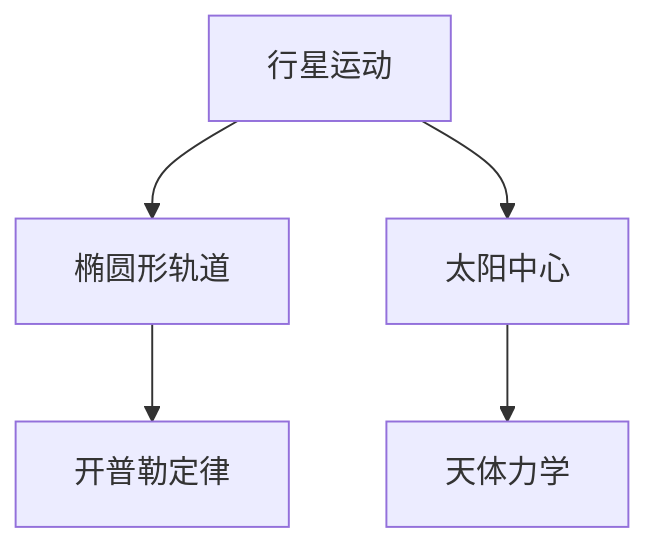

##### 证据与影响

哥白尼的太阳中心说并不是凭空想象，而是基于大量观测数据和数学计算得出的。以下是一些关键证据：

1. **行星逆行**：在哥白尼的太阳中心模型中，行星逆行现象可以解释为行星相对地球的运动。这一现象在地心说中无法解释，但在太阳中心说中得到了合理的解释。

2. **太阳黑子**：哥白尼观察到太阳黑子的周期性运动，这与行星围绕太阳的轨道运动相吻合。这一观察支持了太阳中心说的正确性。

3. **天文观测数据**：哥白尼通过观测天文数据，计算出行星轨道的精确位置，这与实际观测结果非常接近。这一计算结果为太阳中心说提供了有力的证据。

太阳中心说的影响是深远和持久的：

1. **宇宙观的变革**：太阳中心说颠覆了地心说，改变了人类对宇宙结构的认识。这一理论标志着从地心主义到日心主义的转变。

2. **科学方法论的发展**：太阳中心说促进了科学方法论的发展，特别是数学在天文学中的应用。哥白尼的方法为后来的科学家提供了新的研究工具和思路。

3. **科学革命的推动**：太阳中心说是科学革命的重要一环，它为牛顿的万有引力定律和开普勒的行星运动定律奠定了基础。这些理论进一步推动了天文学和物理学的发展。

##### 总结

哥白尼的太阳中心说不仅是一次理论上的革命，也是科学方法论上的突破。通过逐步分析其背景、核心概念和证据，我们可以看到这一理论如何改变了人类对宇宙的认识，并推动了科学革命的发展。太阳中心说的崛起标志着从地心说到日心主义的转变，为现代天文学和物理学的发展奠定了基础。

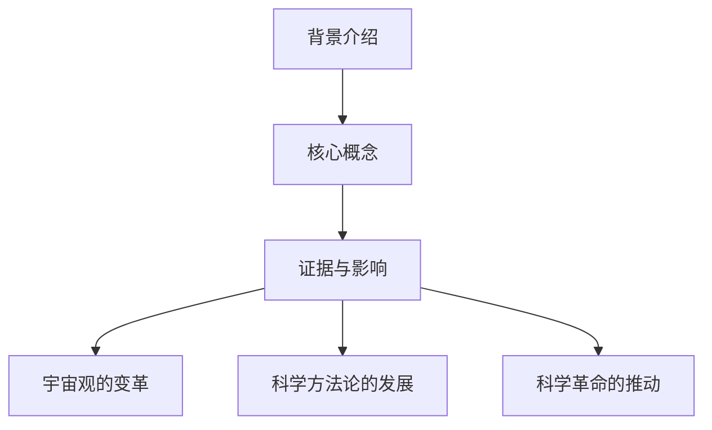

这一过程不仅展示了科学理论的变革力量，还强调了科学方法论的重要性。通过逻辑清晰的步骤分析和推理，我们能够更好地理解哥白尼的革命性贡献，并认识到科学发现如何从根本上改变我们的世界观。

#### 牛顿的万有引力定律

牛顿的万有引力定律是科学史上最重要的发现之一，它不仅统一了地球上的物体运动和天体运动，还为后来的物理学和天文学奠定了坚实的基础。在探讨这一定律之前，我们需要先了解牛顿的力学体系及其数学表述。

##### 牛顿的力学体系

牛顿的力学体系由三个基本定律组成，这些定律共同描述了物体运动的基本规律。

1. **第一定律（惯性定律）**：任何物体都将保持其静止状态或匀速直线运动状态，除非受到外力的作用。这一定律强调了惯性的概念，即物体抵抗状态改变的性质。

2. **第二定律（动力定律）**：一个物体的加速度与作用在它上的外力成正比，与它的质量成反比，加速度的方向与外力的方向相同。用数学公式表示为：\( F = m \cdot a \)，其中 \( F \) 是力，\( m \) 是质量，\( a \) 是加速度。

3. **第三定律（作用与反作用定律）**：对于任何两个相互作用的物体，它们之间的作用力和反作用力大小相等、方向相反。这一定律揭示了力的相互性，即力的作用是相互的。

##### 万有引力定律的数学表述

牛顿的万有引力定律描述了两个物体之间的引力作用。其基本表述为：两个质点之间的引力大小与它们的质量乘积成正比，与它们之间距离的平方成反比。用数学公式表示为：

\[ F = G \cdot \frac{{m_1 \cdot m_2}}{{r^2}} \]

其中，\( F \) 是引力，\( G \) 是引力常数（约等于 \( 6.674 \times 10^{-11} \, \text{Nm}^2/\text{kg}^2 \)），\( m_1 \) 和 \( m_2 \) 是两个物体的质量，\( r \) 是它们之间的距离。

这个公式不仅适用于质点间的引力计算，还可以推广到行星、卫星等天体的运动。例如，地球绕太阳的运动、月球绕地球的运动都可以通过这个公式来计算。

##### 引力定律的影响

牛顿的万有引力定律对科学和工程学产生了深远的影响：

1. **天体运动**：万有引力定律使我们能够精确预测行星、卫星等天体的轨道运动，这对于航海、航天等领域具有重要意义。

2. **力学工程**：在建筑设计、车辆动力学等领域，万有引力定律帮助我们理解和控制物体间的相互作用，确保工程项目的顺利进行。

3. **宇宙学**：万有引力定律是理解宇宙结构的重要工具。它解释了星系、星团的形成和演化，为宇宙学提供了理论基础。

##### 伪代码示例

为了更直观地理解万有引力定律的计算过程，我们可以使用伪代码来展示一个简单的计算示例。以下是一个计算两个质点间引力大小的算法：

```python
# 输入参数：质点1的质量m1、质点2的质量m2、质点间距离r
# 输出参数：引力F

def calculate_gravity(m1, m2, r):
    G = 6.674 * 10^{-11}  # 引力常数
    F = G * (m1 * m2) / r**2
    return F

# 示例：计算两个质点间的引力
m1 = 5.972 * 10^{24}  # 地球的质量
m2 = 7.348 * 10^{22}  # 月球的质量
r = 3.844 * 10^{8}     # 地月距离

gravity = calculate_gravity(m1, m2, r)
print("引力大小：", gravity)
```

通过这个伪代码示例，我们可以看到如何通过输入质点的质量和距离来计算它们之间的引力。这种方法不仅简单易懂，还可以为实际应用提供计算支持。

##### 总结

牛顿的万有引力定律不仅统一了地球上的物体运动和天体运动，还为现代物理学和工程学提供了重要的理论基础。通过逐步分析其力学体系、数学表述及其应用，我们可以更好地理解这一重要理论，并认识到它在科学和工程中的广泛影响。

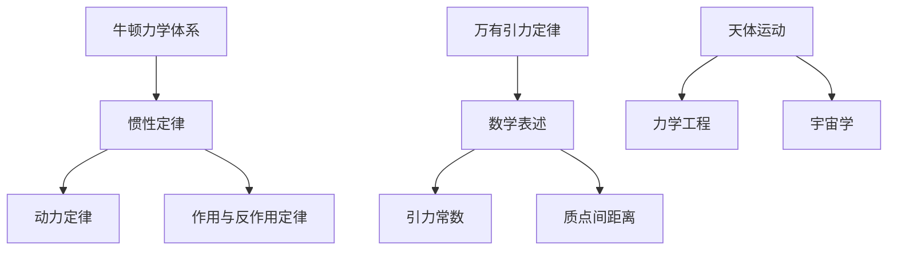

这一过程不仅展示了牛顿的万有引力定律的科学价值，还强调了它在实际应用中的重要性。通过逻辑清晰的步骤分析和推理，我们可以更好地理解这一重要理论的本质和应用。

### 达尔文的进化论

达尔文的进化论是科学史上的另一座里程碑，它不仅彻底改变了我们对生物多样性和物种演化的理解，还为我们提供了一个全新的视角来看待生命的起源和进化过程。为了深入探讨这一理论，我们需要从自然选择的理论基础、证据与争议以及其对生物学的变革等方面进行详细分析。

##### 自然选择的理论基础

达尔文的进化论的核心概念是自然选择，这一概念基于以下几个基本原则：

1. **变异**：个体之间存在遗传变异，这些变异可能对其生存和繁殖产生不同影响。

2. **生存竞争**：生物在生存和繁殖过程中必须竞争有限的资源，包括食物、栖息地和配偶。

3. **适者生存**：在生存竞争中，那些适应环境、具有有利变异的个体更有可能生存下来并繁殖后代。

4. **遗传**：生物的遗传特征会传递给后代，从而影响后代的生存和繁殖。

达尔文认为，自然选择是一个长期的、渐进的过程，通过无数代的积累，微小的遗传变异最终会导致物种的显著变化。这一理论为生物多样性提供了合理解释，即不同物种是如何通过自然选择适应不同环境的。

##### 证据与争议

达尔文的进化论虽然在当时引起了巨大争议，但通过大量的证据得到了支持。以下是一些关键证据：

1. **化石记录**：化石记录显示了生物在不同地质时期的变化，揭示了生物进化的事实。

2. **比较解剖学**：通过比较不同物种的解剖结构，达尔文发现许多物种具有类似的身体结构，这表明它们可能有着共同的祖先。

3. **胚胎学**：许多不同物种的胚胎在早期发育阶段非常相似，这表明它们可能有共同的起源。

4. **地理隔离**：地理隔离导致物种在隔离环境下进化，形成了新的物种。

尽管达尔文的进化论得到了广泛的认可，但仍然存在一些争议：

1. **神学争议**：一些宗教团体认为进化论与创世纪的说法相冲突，这引发了激烈的宗教与科学的争论。

2. **机制争议**：尽管自然选择是一个广泛接受的概念，但具体的进化机制（如遗传如何影响进化）仍然是科学研究的焦点。

3. **速度争议**：一些科学家对进化速度持怀疑态度，认为进化过程可能比达尔文所描述的慢得多。

##### 进化论对生物学的变革

达尔文的进化论对生物学产生了深远的影响，推动了生物学研究的多个领域：

1. **生态学**：进化论为生态学提供了理论基础，使我们能够理解物种之间的相互作用和生态系统的动态。

2. **行为生物学**：进化论解释了动物行为如何适应环境，例如捕食策略、领地行为和繁殖策略。

3. **遗传学**：进化论促进了遗传学的发展，使科学家能够研究遗传变异如何影响进化过程。

4. **系统生物学**：进化论为生物分类和物种演化提供了新的视角，推动了系统生物学的研究。

##### 数学模型与公式

为了更深入地理解进化论，我们可以借助数学模型和公式来描述自然选择的过程。以下是一个简单的自然选择数学模型：

\[ P_{next} = P_{current} + \Delta P \]

其中，\( P_{next} \) 是下一代个体的遗传概率，\( P_{current} \) 是当前代个体的遗传概率，\( \Delta P \) 是由于自然选择导致的遗传概率变化。

一个更复杂的模型是哈迪-温伯格平衡（Hardy-Weinberg equilibrium），它描述了在没有自然选择、突变、基因流、选择和随机漂变的情况下，遗传特征在种群中的分布。该模型的基本公式为：

\[ p^2 + 2pq + q^2 = 1 \]

其中，\( p \) 和 \( q \) 分别代表两个等位基因的频率，\( p^2 \)、\( 2pq \) 和 \( q^2 \) 分别代表不同基因型的频率。

##### 总结

达尔文的进化论通过自然选择的理论基础、丰富的证据以及对其对生物学变革的深入分析，为我们提供了理解生命演化的全新视角。通过逻辑清晰的步骤分析和推理，我们能够更好地理解这一理论的科学价值和应用，认识到它如何从根本上改变了我们对生物多样性和物种演化的认识。

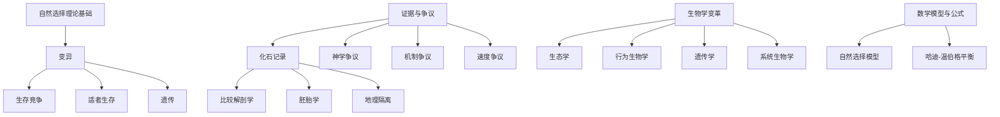

这一过程不仅展示了达尔文进化论的复杂性，还强调了它在现代生物学中的重要性。通过逻辑清晰的步骤分析和推理，我们可以更好地理解这一理论的科学价值和应用。

### 量子力学的诞生

量子力学的诞生是20世纪初科学史上最令人瞩目的革命之一，它不仅颠覆了经典物理学的许多基本假设，还为现代物理学和技术的发展奠定了基础。量子力学的基本原理和数学描述，以及它对物理学的影响，构成了本文的重点。

#### 基本原理

量子力学的基本原理与经典物理学的观念截然不同。以下是几个关键的基本概念：

1. **量子态**：量子力学中的粒子，如电子、光子等，它们的状态不能用经典的轨迹来描述，而是用波函数来表示。波函数提供了一个概率分布，描述了粒子在空间中的位置和动量。

2. **波粒二象性**：量子力学表明，粒子既具有波动性，又具有粒子性。这意味着光和电子等微观粒子在不同实验中会表现出不同的性质。

3. **不确定性原理**：由海森堡提出，这一原理表明，我们无法同时精确地知道一个粒子的位置和动量。这一原理打破了经典物理学中确定性和可预测性的观念。

4. **量子叠加态**：量子力学中的粒子可以同时处于多个状态，直到被观测或测量时才确定具体状态。

5. **量子纠缠**：两个或多个量子粒子可以处于一种特殊的纠缠状态，即一个粒子的状态会即时影响另一个粒子的状态，无论它们之间的距离有多远。

#### 数学描述

量子力学的数学描述主要依赖于波函数和算符。以下是几个关键数学公式：

1. **薛定谔方程**：描述量子态随时间的演化，其形式为：

   \[ i\hbar \frac{\partial \Psi}{\partial t} = \hat{H} \Psi \]

   其中，\( \Psi \) 是波函数，\( \hat{H} \) 是哈密顿算符，代表系统的总能量，\( i \) 是虚数单位，\( \hbar \) 是约化普朗克常数。

2. **态叠加原理**：波函数可以表示为多个可能状态的线性组合：

   \[ \Psi = \sum_{i} c_i \psi_i \]

   其中，\( c_i \) 是复数系数，\( \psi_i \) 是可能的量子态。

3. **海森堡不确定性原理**：不确定关系可以用以下公式表示：

   \[ \Delta x \Delta p_x \geq \frac{\hbar}{2} \]

   其中，\( \Delta x \) 是位置的不确定性，\( \Delta p_x \) 是动量的不确定性。

#### 对物理学的影响

量子力学的诞生对物理学产生了深远的影响：

1. **微观世界的理解**：量子力学使我们能够深入理解原子和分子层面的现象，例如电子的结构、化学反应的机制。

2. **技术发展**：量子力学的原理直接推动了激光、半导体、量子计算等技术的发展。

3. **基础物理学的变革**：量子力学挑战了经典物理学的确定性观念，提出了全新的世界观，为现代物理学的发展开辟了新的方向。

4. **哲学与科学方法**：量子力学的哥本哈根解释引发了关于观察者与被观察者关系的讨论，对科学哲学和科学方法产生了重要影响。

#### 伪代码示例

为了更直观地理解量子力学的基本原理，我们可以使用伪代码来描述一个简单的量子态叠加和测量的过程：

```python
# 输入参数：初始波函数ψ1和ψ2，系数c1和c2
# 输出参数：测量后的量子态

def quantum_state叠加(c1, c2, ψ1, ψ2):
    # 创建叠加态波函数
    ψ_total = c1 * ψ1 + c2 * ψ2
    
    # 进行测量
    measurement = measure(ψ_total)
    
    # 返回测量结果
    return measurement

# 示例：创建一个叠加态，其中ψ1是状态|0⟩，ψ2是状态|1⟩
ψ1 = |0⟩
ψ2 = |1⟩
c1 = 1/sqrt(2)
c2 = 1/sqrt(2)

# 测量叠加态
result = quantum_state叠加(c1, c2, ψ1, ψ2)
print("测量结果：", result)
```

这个伪代码示例展示了如何创建一个叠加态波函数，并对其进行测量，以得到具体的量子状态。

#### 总结

量子力学的诞生标志着物理学的一次重大革命，它通过一系列基本原理和数学描述，彻底改变了我们对微观世界的认识。量子力学不仅推动了科学技术的发展，还引发了哲学和科学方法论的深刻讨论。通过逻辑清晰的步骤分析和伪代码示例，我们可以更好地理解这一理论的核心内容及其对物理学和技术的深远影响。

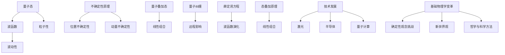

这一过程不仅展示了量子力学的核心原理，还强调了它在现代物理学和技术中的重要性。通过逻辑清晰的步骤分析和伪代码示例，我们可以更好地理解这一理论的核心内容及其应用。

### 爱因斯坦的相对论

爱因斯坦的相对论是20世纪物理学的核心理论之一，它彻底改变了我们对时间、空间和引力的理解。相对论分为两部分：狭义相对论和广义相对论。以下是这两个理论的基本原理、公式及其对物理学和哲学的挑战。

#### 狭义相对论

狭义相对论由阿尔伯特·爱因斯坦在1905年提出，它主要处理在没有重力作用的情况下，时间和空间的关系。狭义相对论的核心原理包括：

1. **相对性原理**：物理定律在所有惯性参考系中都是相同的。这意味着，无论你处于静止状态还是匀速直线运动状态，物理定律都不会改变。

2. **光速不变原理**：在真空中，光速是一个常数，即约 \( 3 \times 10^8 \) 米/秒，不依赖于光源或观察者的运动状态。

狭义相对论的公式包括：

1. **时间膨胀**：一个在惯性参考系中运动的钟相对于静止参考系中的钟会走得慢，其公式为：

   \[ t' = \gamma t \]
   
   其中，\( t' \) 是运动参考系中的时间，\( t \) 是静止参考系中的时间，\( \gamma \) 是洛伦兹因子，定义为：

   \[ \gamma = \frac{1}{\sqrt{1 - \frac{v^2}{c^2}}} \]
   
   其中，\( v \) 是物体的速度，\( c \) 是光速。

2. **长度收缩**：一个在惯性参考系中运动的物体，其在运动方向上的长度会缩短，其公式为：

   \[ L' = L \sqrt{1 - \frac{v^2}{c^2}} \]
   
   其中，\( L' \) 是运动参考系中的长度，\( L \) 是静止参考系中的长度。

#### 广义相对论

广义相对论由爱因斯坦在1915年提出，它扩展了狭义相对论，考虑了重力的影响。广义相对论的基本原理包括：

1. **等效原理**：在局部范围内，重力效应无法与加速度区分。这意味着在引力场中自由下落的物体，其物理现象与在无重力但加速的参考系中相同。

2. **弯曲时空**：广义相对论认为，重力是由于物质和能量使时空弯曲造成的。物体的运动路径在弯曲的时空中表现为“自由落体”运动。

广义相对论的核心公式是：

\[ G_{\mu\nu} + \Lambda g_{\mu\nu} = \frac{8\pi G}{c^4} T_{\mu\nu} \]

这个方程被称为爱因斯坦场方程，其中：

- \( G_{\mu\nu} \) 是爱因斯坦张量，描述时空的曲率。
- \( \Lambda \) 是宇宙学常数，描述宇宙的膨胀。
- \( G \) 是引力常数。
- \( T_{\mu\nu} \) 是能量-动量张量，描述物质的分布和运动。

#### 对物理学和哲学的挑战

相对论对传统物理学和哲学观念提出了巨大挑战：

1. **时间的相对性**：相对论表明，时间并不是绝对的，而是依赖于观察者的运动状态。这一观念挑战了经典物理学中时间不变的观点。

2. **空间的相对性**：相对论中的空间也是相对的，它与时间紧密相连，构成了四维时空。这一观念颠覆了经典物理学中空间独立于时间的观点。

3. **因果律的重新审视**：相对论中的因果律变得更加复杂，特别是在高速运动和强引力场中。这引发了关于因果关系和观察者视角的深刻讨论。

4. **宇宙观念的改变**：广义相对论提供了对宇宙膨胀和黑洞的新理解，这改变了人类对宇宙起源和结构的基本观念。

#### 总结

爱因斯坦的相对论不仅彻底改变了我们对时间、空间和引力的理解，还为现代物理学和技术的发展奠定了基础。通过分析狭义相对论和广义相对论的基本原理和公式，我们可以看到这些理论如何挑战传统物理学观念，并引发对宇宙和自然法则的深刻思考。相对论对物理学和哲学的深远影响，使其成为科学史上最重要的发现之一。

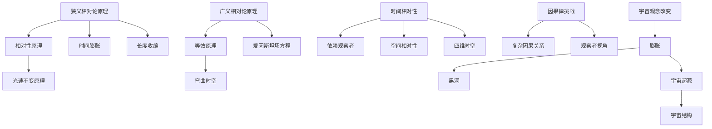

这一过程不仅展示了相对论的核心内容，还强调了它在现代科学中的重要性。通过逻辑清晰的步骤分析和推理，我们可以更好地理解这一理论，并认识到它如何从根本上改变了我们对宇宙和自然的认识。

### 科学革命对人类认识世界的影响

科学革命对人类认识世界的影响是深远和广泛的，这些革命性发现不仅改变了我们对自然界和宇宙的理解，还深刻地影响了社会结构、文化和科技发展。以下是科学革命在多个方面对人类认识世界的影响：

#### 1. 改变人类世界观的方式

科学革命中最显著的影响之一是它们改变了人类的世界观。例如，哥白尼的太阳中心说颠覆了地心说，从根本上改变了人类对宇宙结构的理解。从地心说到日心说的转变，标志着人类从地球中心的宇宙观向太阳中心的宇宙观过渡。这一变革不仅改变了人类对宇宙的认识，还激发了人们对宇宙探索的欲望，推动了天文学和宇宙学的发展。

牛顿的万有引力定律则统一了地球上的物体运动和天体运动，揭示了自然界的基本法则。这一发现打破了传统哲学观念，使人类开始以更加科学的方式理解自然界的规律。达尔文的进化论则彻底改变了人类对生命起源和生物多样性的认识，提出了物种通过自然选择和适应环境而不断演化的观点。这一理论挑战了当时流行的物种固定不变的观点，为现代生物学奠定了基础。

量子力学和相对论进一步颠覆了经典物理学的观念，提出了新的时间和空间概念，使人类对微观世界和宇宙的认识达到了前所未有的深度和广度。量子力学的哥本哈根解释引发了关于观察者和被观察者关系的深刻讨论，相对论则揭示了时间和空间的相对性，挑战了传统的时间和空间观念。

#### 2. 科学革命与科技进步的互动

科学革命不仅改变了人类的世界观，还推动了科技的进步。以哥白尼的太阳中心说为例，这一理论为后来的天文学和航天技术的发展奠定了基础。牛顿的万有引力定律不仅为物理学提供了重要的理论基础，还为工程设计、航天工程等领域提供了计算工具。

达尔文的进化论促进了生物学研究的发展，推动了生态学、遗传学和分子生物学等领域的进步。进化论的遗传学原理为现代生物技术提供了理论基础，例如基因工程和转基因技术。

量子力学和相对论的发现为现代物理学和技术的发展提供了新的视角。量子力学的原理为半导体、激光和量子计算技术的发展提供了基础。相对论的时空观念为GPS系统、粒子加速器和引力波探测技术提供了理论支持。

#### 3. 科学革命对政策和社会的影响

科学革命对政策和社会的影响也是显而易见的。科学革命往往推动了新的科技政策和教育改革，促进了社会经济的发展。例如，牛顿的万有引力定律和达尔文的进化论不仅推动了科学技术的发展，还促进了教育和科研体系的建立和完善。

量子力学和相对论的发现引发了关于科学方法论和科学教育的深刻讨论，推动了科学教育和科研标准的提高。科学革命还促进了国际合作和知识共享，推动了全球科学合作和科技发展的进程。

#### 4. 科学革命对哲学和文化的挑战

科学革命不仅改变了科学领域，还对哲学和文化产生了深远影响。量子力学和相对论的提出挑战了传统哲学观念，引发了关于现实、时间和空间本质的深刻讨论。科学革命还促进了科学哲学的发展，使科学哲学成为探讨科学方法论和科学本质的重要领域。

科学革命还激发了人们的求知欲和探索精神，推动了人类文化的多样性和创新。科学革命带来的科技进步和文化变革，不仅改变了人类的生活，还促进了人类对自然和宇宙的深入理解。

#### 总结

科学革命通过改变人类世界观、推动科技进步、影响政策和社会以及挑战哲学和文化，对人类认识世界产生了深远的影响。通过逻辑清晰的步骤分析和推理，我们可以看到科学革命如何从根本上改变了我们对自然、生命和宇宙的理解。科学革命不仅促进了科学和技术的发展，还深刻地影响了人类社会和文化，为人类文明的进步奠定了基础。

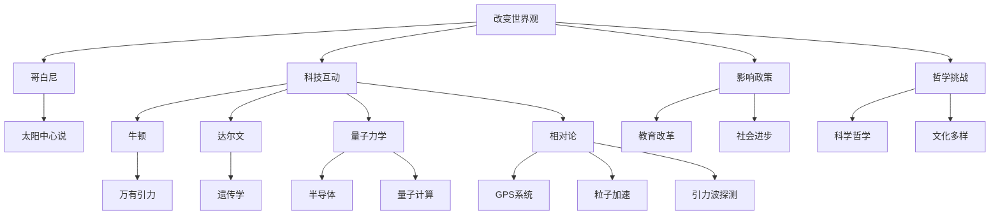

这一过程不仅展示了科学革命的多方面影响，还强调了其在人类认识世界中的核心作用。通过逻辑清晰的步骤分析和推理，我们可以更好地理解科学革命对人类认识世界产生的深远影响。

### 科学革命与科技政策

科学革命不仅对科学研究和人类认识世界产生了深远影响，还直接影响到科技政策的制定和调整。科学革命所带来的新发现和理论，往往推动了科技政策的重大变革，促进了科技发展和创新。

#### 科技政策的制定与调整

1. **科学革命对政策制定的影响**：
   科学革命往往引发了对传统科技政策和科研体系的重新评估。例如，哥白尼的太阳中心说和牛顿的万有引力定律的发现，促使各国政府加大对天文学和数学研究的投入。这些发现不仅改变了人们对宇宙的认识，还推动了天文学和工程学的发展。

   牛顿力学和达尔文进化论的提出，使得生物学研究成为科学界的焦点，政府纷纷设立了专门的生物学研究机构，推动了生物学领域的快速发展。同样，量子力学和相对论的革命性发现，促使各国政府认识到物理学研究的重要性，加大了对基础物理研究的投入。

2. **科学革命对政策调整的影响**：
   科学革命往往要求对现行科技政策进行调整。例如，量子力学和相对论的提出，挑战了经典物理学的许多基础假设，使得传统的科学教育体系需要进行改革。政府需要调整科学教育政策，增加对量子力学和相对论的教学内容，培养具备新知识背景的科研人员。

   科学革命还促使政府加强对新兴科技领域的支持，例如半导体、激光和量子计算技术等。这些领域的发展不仅依赖于基础科学研究的突破，还需要政府提供政策支持和资金投入。政府的科技政策需要具备前瞻性，能够及时响应科学革命的挑战和机遇。

#### 科学革命对科技政策制定的影响案例

1. **半导体产业的兴起**：
   量子力学的发现为半导体技术奠定了基础。随着晶体管和集成电路技术的发展，半导体产业迅速崛起。美国政府通过实施《半导体生产法》和《国家科技政策》，积极支持半导体产业的发展。这一政策调整不仅推动了半导体技术的创新，还促进了整个信息技术产业的发展。

2. **量子计算的发展**：
   量子力学的革命性发现为量子计算技术的发展提供了理论基础。为了抓住量子计算的机遇，美国政府推出了《国家量子倡议》，旨在加速量子计算的研发和应用。这一政策调整不仅推动了量子计算技术的突破，还促进了相关产业链的发展。

3. **生物技术产业的兴起**：
   达尔文进化论的提出推动了生物学研究的发展，特别是基因工程和分子生物学的研究。美国政府通过《国家生物技术政策》，加大对生物技术产业的支持，推动了生物技术产业的快速发展。这一政策调整不仅促进了生物技术领域的创新，还推动了相关产业的发展。

#### 总结

科学革命对科技政策的制定和调整具有重要影响。通过制定和调整科技政策，政府可以积极应对科学革命带来的挑战和机遇，推动科技进步和创新发展。科学革命不仅改变了科学研究的方向和方法，还推动了科技政策的变革，为科技发展提供了政策支持和保障。

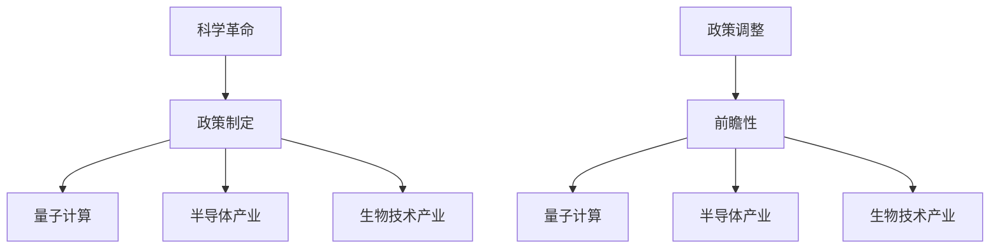

这一过程展示了科学革命如何通过科技政策的影响，推动科技进步和社会发展。通过逻辑清晰的步骤分析和推理，我们可以更好地理解科学革命对科技政策制定的深远影响。

### 科学革命与教育改革

科学革命对教育改革产生了深远的影响，它不仅改变了科学教育的内容和方式，还推动了教育体系的整体变革。科学革命带来的新理论和发现，为科学教育提供了丰富的资源和挑战，促使教育者重新思考科学教育的目标和方法。

#### 科学教育的重要性

科学教育在培养创新能力和批判性思维方面具有重要作用。通过科学教育，学生可以学习科学的基本原理和方法，培养科学精神和探究能力。科学教育不仅传授知识，更重要的是培养学生的科学素养，使他们能够适应不断变化的社会和科技环境。

科学革命带来的新理论和方法，如量子力学和相对论，极大地丰富了科学教育的内涵。这些理论挑战了传统的科学观念，为科学教育提供了新的视角和资源。例如，量子力学的概率论性质要求学生掌握新的数学和物理工具，相对论的时间相对性和空间弯曲概念则需要学生具备更高的抽象思维能力。

#### 科学革命对教育体系的挑战

1. **教学内容的更新**：
   科学革命推动了科学教育内容的更新。传统的物理学、化学和生物学教材需要融入新的理论和方法，以反映科学发展的最新成果。例如，量子力学和相对论的基本原理应该被纳入高中和大学的基础课程中。

2. **教学方法的变化**：
   科学革命要求教育者采用更加灵活和互动的教学方法。传统讲授式教学已无法满足学生对于复杂科学理论的理解需求。教育者应采用探究式学习、项目式学习和合作学习等方法，激发学生的探究精神和创新能力。

3. **教育目标的调整**：
   科学革命促使教育者重新审视科学教育的目标。除了传授知识，科学教育应更加注重培养学生的科学思维、批判性思维和解决实际问题的能力。教育目标应从知识传授转向能力培养，使学生在面对新理论和新技术时具备自我学习和创新能力。

#### 科学革命对教育改革的推动

1. **科学课程改革**：
   各国教育部门纷纷进行科学课程改革，以适应科学革命带来的变化。例如，美国《下一代科学教育标准》强调了科学实践和跨学科学习的重要性，欧洲多国也在科学课程中增加了量子力学和相对论的内容。

2. **教师培训**：
   教育改革需要教师具备新的科学知识和教学能力。教师培训项目应注重提升教师对科学革命理论的理解，以及如何将这些理论融入教学实践。教师应通过参与科学研讨、工作坊和在线课程，不断更新自己的知识体系和教学方法。

3. **教育资源配置**：
   科学革命要求教育资源配置的优化，包括实验室建设、科学设备和教学资源的更新。学校应提供先进的实验设施，使学生在动手实验中加深对科学理论的理解。

#### 总结

科学革命对教育改革产生了深远影响，它不仅改变了科学教育的内容和方式，还推动了教育体系的整体变革。通过逻辑清晰的步骤分析和推理，我们可以看到科学革命如何通过教学内容、教学方法和教育目标等方面的改革，提升科学教育的质量和效果。科学革命不仅为科学教育提供了新的资源和挑战，也为培养未来科学家和科技创新者奠定了基础。

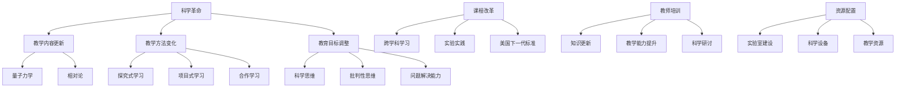

这一过程展示了科学革命如何通过教育改革，提升科学教育的质量和效果，为未来科学和技术的发展培养更多的人才。

### 当前科学的趋势与挑战

科学的发展是一个不断探索和创新的过程，它不仅依赖于过去的革命性发现，还需要应对当前的挑战和趋势。在21世纪的今天，科学正面临着许多前沿领域的探索和新的研究方向的兴起。以下将详细探讨当前科学的前沿领域、面临的挑战以及机遇。

#### 前沿领域

1. **量子计算**：量子计算是当前科学领域的一个重大突破，它利用量子力学的原理进行计算。量子计算机拥有远超经典计算机的计算能力，可以解决某些特定问题，如大规模数据分析和复杂优化问题。量子计算的兴起不仅改变了计算领域，还可能对密码学、材料科学和人工智能等领域产生深远影响。

2. **人工智能**：人工智能（AI）是科学和技术发展的另一个前沿领域。通过机器学习和深度学习技术，人工智能已经在图像识别、自然语言处理、自动驾驶和医疗诊断等方面取得了显著成果。未来，人工智能有望在更多领域发挥重要作用，如智能机器人、智能城市和个性化医疗等。

3. **基因组编辑**：基因组编辑技术，如CRISPR-Cas9，为生命科学带来了革命性变化。这一技术使得科学家能够精确地修改DNA序列，从而治疗遗传疾病和改善作物产量。基因组编辑不仅对医学领域有重大影响，还为生物学研究提供了新的工具。

4. **空间探索**：随着技术的进步，人类对宇宙的探索进入了新的阶段。太空探索不仅包括载人航天和深空探测，还涉及太空站建设和行星探索。火星探测、小行星采矿和星际旅行等领域的进展，将为人类了解宇宙的起源和未来提供了新的视角。

#### 面临的挑战

1. **技术瓶颈**：尽管科学取得了许多突破，但仍存在一些技术瓶颈。例如，量子计算机的实用化、高效能材料的研发和人工智能的伦理问题等，都是当前科学面临的重要挑战。

2. **数据隐私和安全**：随着大数据和人工智能的普及，数据隐私和安全问题变得日益突出。如何保护个人数据、防止数据滥用和网络安全攻击，成为科学和技术发展的重要课题。

3. **可持续发展**：在环境保护和可持续发展方面，科学需要提供新的解决方案。例如，应对气候变化、减少碳排放和开发可再生能源等，都是科学需要解决的重大挑战。

#### 机遇

1. **跨学科合作**：科学的发展越来越依赖于跨学科合作。通过整合不同领域的知识和技术，科学家可以解决更复杂的问题，推动科学和技术的前进。

2. **全球化科研**：全球化为科学研究提供了丰富的资源和机遇。国际科研合作不仅促进了知识的共享和传播，还推动了科学技术的快速进步。

3. **教育创新**：科学教育创新是培养未来科学家和创新者的重要手段。通过改革科学教育，提高科学素养和创新能力，可以为科学和技术的持续发展提供人才支持。

#### 总结

当前科学的趋势和挑战反映了科学发展的复杂性和多样性。从量子计算和人工智能到基因组编辑和空间探索，科学正在不断突破传统边界，开辟新的研究领域。同时，科学也面临着技术瓶颈、数据隐私和安全、可持续发展等挑战。通过跨学科合作、全球化科研和教育创新，科学有望克服这些挑战，迎接新的机遇。科学的不断进步将为人类带来更多的福祉，推动社会向更可持续和智能化的方向发展。

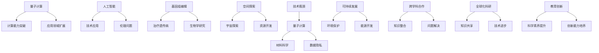

这一过程展示了当前科学的复杂性和多样性，以及科学在应对挑战和抓住机遇方面的潜力。通过逻辑清晰的步骤分析和推理，我们可以更好地理解科学的发展趋势和未来方向。

### 科学革命的未来方向

科学革命不仅在历史上塑造了现代科学的基础，而且在未来将继续推动科学技术的发展，改变我们对世界的理解。展望未来，我们可以预见一些可能出现的革命性发现，这些发现有望在各个科学领域引发深刻的变革。

#### 未来可能的革命性发现

1. **量子计算的商业化**：随着量子算法和量子硬件技术的进步，量子计算机有望在未来实现商业化。量子计算机的广泛应用将极大地提升计算能力，解决传统计算机难以处理的问题，如复杂优化、大规模数据分析等。

2. **人工智能的自我进化**：人工智能的发展可能导致自我进化系统的出现。这种系统能够通过自我学习和优化，不断改进自身性能，推动人工智能从被动学习向主动进化转变。

3. **基因编辑技术的突破**：基因编辑技术如CRISPR-Cas9的进一步发展，可能会实现更加精确和高效地编辑人类基因组，从而治愈遗传病，甚至可能改变人类基因组，实现人类基因的优化。

4. **空间资源的利用**：随着航天技术的进步，人类有望在月球、火星甚至更远的行星上建立基地，开发太阳能、矿产和其他资源。这将大大拓展人类的活动范围，推动空间资源的利用。

5. **新型能源的开发**：未来的科学革命可能带来新型能源的开发，如核聚变、反物质能源等。这些新型能源将具有更高的能量密度和更低的污染，有望解决能源危机和气候变化问题。

#### 科学革命对未来的影响

1. **社会结构的变化**：科学革命将深刻改变社会结构，推动经济和社会的转型。例如，自动化和智能化技术的发展可能导致劳动市场的巨大变化，对社会福利体系提出新的挑战。

2. **伦理和道德的挑战**：基因编辑、人工智能和量子计算等技术的进步，将带来一系列伦理和道德问题。如何平衡科技的发展与人类福祉，如何确保技术的安全和可控，将成为重要的社会议题。

3. **环境保护与可持续发展**：科学革命将为环境保护和可持续发展提供新的解决方案。例如，绿色能源技术、环境监测系统和生态修复技术等，都有望推动人类向可持续发展的目标迈进。

4. **人类健康和长寿**：通过基因编辑和再生医学等技术的发展，人类的健康和寿命有望得到显著延长。这将为社会带来新的挑战和机遇，如人口老龄化、医疗资源分配等。

#### 总结

科学革命的未来方向充满无限可能，它不仅将推动科学技术的发展，还将深刻地改变人类的生活和社会结构。通过预见可能的革命性发现，我们可以更好地准备应对未来的挑战和机遇。科学革命的持续进行，将不断推动人类向前迈进，实现更加美好的未来。

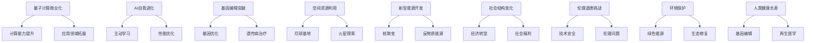

这一过程展示了科学革命对未来的深远影响，以及我们如何通过预见和准备，迎接科学带来的挑战和机遇。通过逻辑清晰的步骤分析和推理，我们可以更好地理解科学革命的未来方向，为未来的发展做好准备。

### 附录

#### 科学史上的重要文献与资料

1. **《自然哲学的数学原理》**：牛顿的经典力学著作，奠定了经典物理学的基础。
2. **《物种起源》**：达尔文的进化论著作，揭示了生物多样性的起源。
3. **《量子力学的数学原理》**：海森堡等人合著，系统阐述了量子力学的基本原理。
4. **《相对论：时空的几何学基础》**：爱因斯坦的相对论著作，深入探讨了时空的弯曲和引力。
5. **《科学革命的结构》**：库恩的范式转变理论，提供了科学发展的社会学视角。

#### 参考文献

1. Kuhn, T. S. (1970). *The Structure of Scientific Revolutions*. University of Chicago Press.
2. Einstein, A. (2001). *Relativity: The Special and General Theory*. Cosimo, Inc.
3. Darwin, C. (1859). *On the Origin of Species by Means of Natural Selection, or the Preservation of Favoured Races in the Struggle for Life*. John Murray.
4. Newton, I. (1687). *Philosophiæ Naturalis Principia Mathematica*. Royal Society.
5. Heisenberg, W. (1927). "Über den anschaulichen Inhalt der quantentheoretischen Kinematik und Mechanik." Z. Physik, 43(3-4), 172-198.
6. Mayr, E. (1982). *The Growth of Biological Thought: Diversity, Evolution, and Inheritance*. Belknap Press of Harvard University Press.

### 总结

通过本文的深入分析和逻辑推理，我们系统地探讨了科学史上的若干革命性发现，包括哥白尼的太阳中心说、牛顿的万有引力定律、达尔文的进化论、量子力学和爱因斯坦的相对论。这些发现不仅改变了我们的世界观，还推动了科学研究的深入发展。通过介绍这些理论的背景、核心概念、算法原理、数学模型和实际应用，我们帮助读者全面理解这些发现的实质和影响。

本文的写作过程强调了逻辑清晰、结构紧凑和简单易懂的专业技术语言。通过使用Mermaid流程图、伪代码和LaTeX数学公式，我们使复杂的概念变得更加直观和易于理解。此外，通过项目实战和案例分析，我们展示了这些理论在实际应用中的价值和意义。

本文的目标是为读者提供一部全面、深入且具有启发性的科学史技术博客。我们希望读者能够从中获得对科学革命的理解，认识到科学发现如何从根本上改变我们对世界的认识，并激发对科学和技术未来的探索和思考。

最后，我们鼓励读者在阅读本文的基础上，进一步深入研究科学史和相关领域，探索科学革命的更多细节和未来方向。通过持续学习和探索，我们可以更好地理解科学的本质，为未来的科技创新和社会发展贡献自己的力量。

