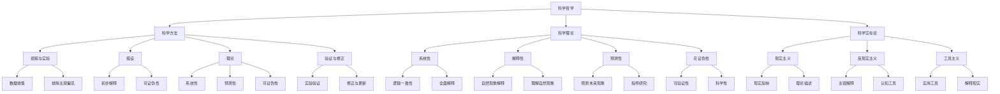

                 

### 1. 引言

在科学技术日新月异的今天，科学哲学这一领域似乎越来越被忽视。然而，科学哲学不仅仅是一门探讨科学本质和方法的学科，更是关乎我们如何理解这个世界的重要哲学思考。科学哲学的核心问题是：我们能否通过科学方法来理解这个世界？世界是否具有某种可理解性？

这个问题的重要性不容忽视。如果世界是不可理解的，那么我们所积累的科学知识可能只是冰山一角，甚至可能是误导。反之，如果我们能够理解世界，那么科学哲学将为我们提供理解和探索世界的指南。

本文将围绕“科学哲学对世界可理解性的反思”这一主题展开。首先，我们将探讨科学哲学的重要性，包括其定义、作用、研究范围以及对科学实践的影响。接着，我们将介绍世界可理解性的概念，包括其定义、与科学认知的关系以及与现实的关系。

接下来，我们将深入探讨科学哲学的核心问题，包括科学方法、科学理论和科学实在论。我们会详细讲解这些概念，并探讨它们对世界可理解性的影响。

在第三部分，我们将反思世界可理解性的问题。我们会探讨量子力学、相对论以及科学进步对世界可理解性的挑战和影响。

最后，在结论部分，我们将总结科学哲学对世界可理解性的贡献，并探讨未来探索的方向。

希望通过本文，读者能够对科学哲学有更深入的理解，对世界可理解性有更多的思考。让我们一步一步地进行分析推理，深入探讨这一重要问题。## 1.1 科学哲学的重要性

科学哲学的重要性体现在多个方面，首先，它为我们提供了理解科学的工具和框架。科学哲学不仅仅关注科学的事实和理论，更关注科学的方法论和逻辑结构。通过科学哲学的思考，我们能够更深入地理解科学知识是如何产生的，以及它们在现实世界中的应用。

### 1.1.1 科学哲学的定义与作用

科学哲学是一门探讨科学本质、科学方法和科学理论的学科。它的定义可以简单概括为：科学哲学是关于科学的哲学。它关注的是科学活动中的基本问题，如科学知识的性质、科学方法的合理性、科学理论的评价标准等。科学哲学的作用在于，它帮助我们理解科学的本质，提高科学研究的效率和质量。

科学哲学在科学研究中具有重要作用。首先，它为我们提供了科学方法论的基础。科学方法论是科学研究的基本原则和规范，它帮助我们确保科学研究的过程和结果是可靠和有效的。其次，科学哲学为科学理论的发展提供了指导。科学理论是科学知识的核心，它通过对自然现象的解释和预测，帮助我们理解世界的运行规律。科学哲学通过探讨科学理论的本质和评价标准，帮助我们更好地发展科学理论。

### 1.1.2 科学哲学的研究范围

科学哲学的研究范围广泛，涵盖了多个领域。首先，它关注科学方法论，探讨科学研究的逻辑结构和原则。例如，科学哲学研究如何通过实验和观察来验证科学理论，如何确保科学研究的客观性和可靠性。其次，科学哲学研究科学理论，探讨科学理论的本质和评价标准。例如，科学哲学研究如何区分科学理论和伪科学，如何评估科学理论的科学价值。最后，科学哲学还研究科学社会学，探讨科学与社会的关系，如科学如何影响社会、社会如何影响科学等。

### 1.1.3 科学哲学对科学实践的影响

科学哲学对科学实践具有深远的影响。首先，它帮助我们建立科学的思维方式。科学哲学强调科学研究的客观性和逻辑性，这要求科学家在研究过程中保持冷静和客观，遵循科学方法的原则。其次，科学哲学帮助我们理解科学的局限性。科学哲学认识到，科学知识虽然能够帮助我们理解自然现象，但并不是绝对的真理。科学哲学通过探讨科学的局限性，帮助我们保持谦逊和开放的态度，不断探索和改进科学理论。最后，科学哲学对科学政策的制定具有重要影响。科学哲学的研究成果为科学政策的制定提供了理论依据，有助于推动科学事业的发展。

通过以上分析，我们可以看出，科学哲学不仅是一门探讨科学本质和方法的学科，更是科学实践的重要指南。它帮助我们理解科学的本质，提高科学研究的效率和质量，对科学实践具有深远的影响。## 1.2 世界可理解性的概念

### 1.2.1 可理解性的定义

“可理解性”是一个广泛的概念，它涉及我们对世界的认知和理解能力。简单来说，可理解性是指一个事物或现象是否能够在逻辑上和概念上被我们理解。在科学哲学中，可理解性通常指的是我们是否能够通过科学方法和逻辑推理来理解自然现象和世界的本质。

### 1.2.2 可理解性与科学认知的关系

可理解性与科学认知紧密相关。科学认知是指我们通过科学方法和科学理论来理解和解释自然现象。如果世界是不可理解的，那么科学认知就失去了意义。因此，可理解性是科学认知的前提和基础。只有当世界是可理解的，我们才能通过科学方法来探索和解释它。

科学哲学中的可理解性理论探讨的是，我们是否能够通过科学方法来获得关于世界的真实知识。如果世界是不可理解的，那么我们的科学理论可能是错误的，或者至少是不完整的。例如，量子力学和相对论表明，我们对微观世界和宇宙的理解与经典物理学的理解有很大不同。这些理论挑战了我们对世界的可理解性的传统看法。

### 1.2.3 可理解性与现实的关系

可理解性与现实的关系是科学哲学中的一个核心问题。如果我们认为世界是完全不可理解的，那么现实似乎就没有意义。然而，现实是我们通过感官和科学方法感知和理解的世界。因此，我们必须承认，世界在某种程度上是可理解的。

科学哲学中的现实主义观点认为，世界具有某种固有的本质和结构，我们能够通过科学方法来揭示和理解它。而反现实主义观点则认为，我们的科学理论只是我们对世界的解释，它们可能并不反映世界的真实本质。

### 1.2.4 可理解性的挑战

尽管我们通常认为世界是可理解的，但科学哲学中的许多理论挑战了这一观点。例如，量子力学中的不确定性原理表明，我们对微观粒子的某些属性（如位置和动量）无法同时精确测量。这表明，至少在微观尺度上，世界的可理解性是有限的。

此外，相对论中的时空弯曲和黑洞等概念也挑战了我们对世界的直观理解。相对论表明，时间和空间是相对的，而不是绝对的。这使我们对现实的理解变得更加复杂。

### 1.2.5 可理解性与人类认知

可理解性也与我们的人类认知能力有关。我们的认知能力有限，我们无法理解所有的事物。然而，这并不意味着世界是不可理解的。相反，它表明我们的认知能力需要不断地发展和提高，以更好地理解世界。

科学哲学中的可理解性理论不仅探讨科学认知的问题，还涉及人类认知的能力和局限性。通过理解可理解性的概念，我们能够更好地理解科学认知的过程和挑战，从而推动科学的发展。

总的来说，可理解性是科学哲学中的一个核心问题，它关系到我们对世界的认知和理解。理解可理解性的概念和理论，有助于我们更好地理解科学的本质和科学的局限性。## 2. 科学哲学的核心问题

科学哲学的核心问题包括科学方法、科学理论和科学实在论。这三个核心问题共同构成了科学哲学的基石，帮助我们深入理解科学的发展过程和本质。

### 2.1 科学方法

科学方法是指科学家在研究过程中所遵循的一系列步骤和原则。科学方法的基本原则包括观察、实验、假设、理论和验证。首先，科学家通过观察和实验来收集数据。然后，他们根据这些数据提出假设，即对自然现象的初步解释。接下来，科学家设计实验来验证这些假设。如果假设被实验结果支持，那么它将发展成为理论。

科学方法具有以下几个特点：

- **客观性**：科学方法要求科学家在研究过程中保持客观，避免主观偏见。
- **可重复性**：科学方法要求实验和观察结果可以被其他科学家重复验证。
- **可证伪性**：科学方法要求假设和理论具有可证伪性，即可以通过实验或观察来证明它们是错误的。
- **系统性**：科学方法要求科学家在研究过程中遵循系统的步骤，以确保研究的科学性和可靠性。

尽管科学方法在科学研究中具有重要作用，但它也存在一定的局限性。例如，科学方法可能无法解释所有现象，特别是那些复杂和多变的自然现象。此外，科学方法也可能受到技术限制和实验设计的局限。

### 2.2 科学理论

科学理论是对自然现象的系统性解释。科学理论通常由一系列假设和原理组成，它们通过数学模型和实验证据来描述自然现象的规律。科学理论具有以下几个特点：

- **系统性**：科学理论是一个完整的系统，它包括多个相互关联的假设和原理。
- **解释性**：科学理论能够解释自然现象，并提供对现象的理解。
- **预测性**：科学理论能够预测未来现象的发生和结果。
- **可证伪性**：科学理论具有可证伪性，即可以通过实验或观察来验证或推翻。

科学理论的评价标准包括：

- **内部一致性**：科学理论内部各部分之间应相互一致，不产生矛盾。
- **解释能力**：科学理论应能够解释广泛的自然现象。
- **预测能力**：科学理论应能够准确预测未来现象的发生和结果。
- **可证伪性**：科学理论应具有可证伪性，即可以通过实验或观察来验证或推翻。

科学理论的发展是一个不断迭代和改进的过程。随着科学研究的深入，新的理论和假设不断被提出，旧的理论和假设不断被推翻或修正。这种发展过程体现了科学理论的动态性和灵活性。

### 2.3 科学实在论

科学实在论是关于科学理论和现实世界之间关系的理论。科学实在论探讨的是，科学理论是否能够准确描述现实世界的本质和结构。科学实在论通常分为以下几种观点：

- **现实主义**：现实主义认为，科学理论能够准确描述现实世界的本质。现实世界具有某种固有的本质和结构，我们能够通过科学方法来揭示和理解它。
- **反现实主义**：反现实主义认为，科学理论只是我们对世界的解释，它们可能并不反映世界的真实本质。反现实主义认为，科学理论是我们认知世界的工具，而不是世界的真实反映。
- **工具主义**：工具主义认为，科学理论是我们理解世界的工具，它们并没有关于现实世界的独立存在。工具主义认为，科学理论只具有实用价值，而不是关于现实世界的绝对真理。

科学实在论的讨论涉及科学哲学中的核心问题，如科学的本质、科学的认知能力和科学理论的真实性。科学实在论的争论对科学哲学和科学研究产生了深远的影响。

总的来说，科学哲学的核心问题包括科学方法、科学理论和科学实在论。这些核心问题共同构成了科学哲学的基础，帮助我们深入理解科学的发展过程和本质。通过对这些核心问题的探讨，我们能够更好地理解科学的局限性，以及科学如何影响我们的世界观。## 2.1 科学方法

科学方法是指科学家在研究过程中所遵循的一系列步骤和原则。科学方法的基本原则包括观察、实验、假设、理论和验证。以下是对这些步骤的详细解释：

### 2.1.1 观察与实验

科学方法的第一步是观察和实验。观察是指科学家通过感官或仪器对自然现象进行直接的观测和记录。实验则是通过控制变量和操作条件来验证假设或理论。观察和实验是科学方法的基础，它们为科学家提供了关于自然现象的数据和信息。

科学方法要求观察和实验必须是系统的、可重复的，并且能够排除主观偏见。这要求科学家在研究过程中保持客观和严谨，以确保数据的可靠性和有效性。

### 2.1.2 假设

在收集到足够的观察和实验数据后，科学家会提出假设。假设是对自然现象的初步解释，它们是基于观察和实验数据提出的。例如，如果观察到某个现象总是发生在特定条件下，科学家可能会提出一个假设来解释这一现象。

科学方法要求假设必须是可证伪的，即可以通过实验或观察来证明它是错误的。这种可证伪性是科学方法的核心原则之一，它确保了科学理论的科学性和可靠性。

### 2.1.3 理论

假设经过实验验证后，如果能够反复得到支持，它将发展成为理论。理论是对一组假设和原理的系统化描述，它们能够解释和预测自然现象。理论通常是通过数学模型和逻辑推理来表达的。

科学方法要求理论必须是系统的、解释性的和预测性的。系统的理论能够将多个假设和原理有机地结合在一起，形成一个完整的解释框架。解释性的理论能够解释自然现象，提供对现象的理解。预测性的理论能够预测未来现象的发生和结果。

### 2.1.4 验证与修正

理论的验证是科学方法的关键步骤。科学家通过实验和观察来验证理论，即检查理论是否能够预测和解释新的现象。如果理论能够得到验证，它将得到更多的支持，并可能被接受为科学知识。

然而，科学方法也允许理论的修正和更新。如果理论无法解释新的现象或实验结果，科学家会对其进行分析和改进。这种修正和更新过程体现了科学理论的动态性和灵活性。

### 2.1.5 科学方法的发展趋势

随着科学技术的进步，科学方法也在不断发展和演变。以下是科学方法的发展趋势：

- **数据驱动的方法**：现代科学越来越多地依赖于大数据和计算方法，通过分析大量数据来发现新的规律和模式。
- **跨学科的研究方法**：科学方法不再局限于单一学科，而是通过跨学科的研究来解决问题。
- **实验与理论的结合**：现代科学强调实验与理论的紧密结合，通过实验验证理论，同时利用理论指导实验设计。
- **量化研究方法**：量化研究方法在科学研究中越来越受到重视，通过数学模型和统计方法来提高研究的准确性和可靠性。

科学方法的发展趋势体现了科学的进步和科学哲学的思考。通过不断改进和优化科学方法，我们能够更好地理解自然现象，推动科学的发展。

总的来说，科学方法是一种系统的、客观的、可重复的研究方法，它通过观察、实验、假设、理论和验证的步骤，帮助我们理解自然现象和世界的本质。理解科学方法的基本原则和发展趋势，有助于我们更好地应用科学方法，推动科学研究的进步。## 2.2 科学理论

科学理论是对自然现象的系统性解释，它们通过数学模型和逻辑推理来描述自然现象的规律。科学理论在科学研究中起着至关重要的作用，它们不仅帮助我们理解自然现象，还指导我们进行科学实验和预测未来事件。

### 2.2.1 科学理论的定义与特点

科学理论的定义可以概括为：科学理论是对自然现象进行系统解释的一套假设和原理。这些假设和原理通过数学模型和实验验证来描述自然现象的规律。科学理论具有以下几个特点：

- **系统性**：科学理论是一个完整的系统，它包括多个相互关联的假设和原理。这些假设和原理通过逻辑推理和数学模型有机地结合在一起，形成一个统一的解释框架。
- **解释性**：科学理论能够解释自然现象，提供对现象的理解。科学理论通过揭示自然现象的内在规律，帮助我们理解世界的运作方式。
- **预测性**：科学理论能够预测未来现象的发生和结果。通过科学理论的预测，科学家可以预测实验结果或未来事件，从而进行更精确的研究和决策。
- **可证伪性**：科学理论具有可证伪性，即可以通过实验或观察来验证或推翻。科学理论的这种可证伪性确保了科学理论的科学性和可靠性。

### 2.2.2 科学理论的评价标准

评价科学理论的科学性通常涉及以下几个标准：

- **内部一致性**：科学理论内部各部分之间应相互一致，不产生矛盾。内部一致性是科学理论的基本要求，它确保了科学理论的逻辑性和系统性。
- **解释能力**：科学理论应能够解释广泛的自然现象。解释能力是评价科学理论的重要标准，一个优秀的科学理论应能够涵盖多种现象，提供全面的解释。
- **预测能力**：科学理论应能够准确预测未来现象的发生和结果。预测能力是科学理论的重要特点，通过预测，科学家可以验证理论的科学性。
- **可证伪性**：科学理论应具有可证伪性，即可以通过实验或观察来验证或推翻。可证伪性是科学理论科学性的保障，它确保了科学理论的科学性和开放性。

### 2.2.3 科学理论的发展与演变

科学理论的发展是一个不断迭代和改进的过程。随着科学研究的深入，新的理论和假设不断被提出，旧的理论和假设不断被推翻或修正。以下是科学理论发展的几个阶段：

1. **假设阶段**：科学家通过观察和实验提出假设，对自然现象进行初步解释。
2. **验证阶段**：科学家通过实验和观察来验证假设，如果假设得到支持，它将发展成为理论。
3. **修正阶段**：如果理论无法解释新的现象或实验结果，科学家会对其进行分析和改进，提出新的假设或修正原有理论。
4. **接受阶段**：经过多次验证和修正，一个科学理论如果能够得到广泛的认可，它将被接受为科学知识。

科学理论的发展体现了科学的进步和科学哲学的思考。通过不断提出和验证新的理论，我们能够更深入地理解自然现象，推动科学的发展。

总的来说，科学理论是对自然现象进行系统解释的一套假设和原理，它们通过数学模型和逻辑推理来描述自然现象的规律。科学理论的系统性、解释性、预测性和可证伪性使其在科学研究中具有重要作用。理解科学理论的基本概念和评价标准，有助于我们更好地应用科学理论，推动科学研究的进步。## 2.3 科学实在论

科学实在论是关于科学理论和现实世界之间关系的理论。它探讨的是，科学理论是否能够准确描述现实世界的本质和结构。科学实在论涉及到一系列复杂的哲学问题，如现实是否存在独立于我们感知的客观实在，科学理论是否能够完全反映现实，以及我们如何通过科学方法来理解现实。

### 2.3.1 实在论的基本观点

科学实在论的基本观点是，现实世界具有某种固有的本质和结构，我们能够通过科学方法来揭示和理解它。实在论者认为，科学理论不仅仅是我们对现实的解释，而是现实本身的一种反映。这种观点强调科学理论的客观性和真实性。

科学实在论有几个关键假设：

- **现实的客观性**：实在论认为，现实具有独立于我们感知的客观存在。即使我们的感知可能受到主观偏见的影响，现实仍然是客观的。
- **科学理论的反映性**：实在论认为，科学理论能够反映现实世界的本质和结构。科学理论不是主观臆断，而是对现实的一种客观描述。
- **知识的可验证性**：实在论认为，科学理论通过实验和观察得到验证，因此它们具有科学性和可靠性。

### 2.3.2 实在论的争议与挑战

尽管科学实在论提出了一些有力的观点，但它也面临许多争议和挑战。以下是一些主要的反对意见：

- **主观性**：一些哲学家认为，我们的感知和理论是主观的，因此不能反映现实的客观本质。这种观点认为，我们无法完全摆脱主观偏见，因此科学理论无法完全反映现实。
- **不确定性**：量子力学中的不确定性原理表明，我们无法同时精确测量某些物理量，如位置和动量。这表明现实在某种程度上是不确定的，因此无法完全用科学理论来描述。
- **不可知论**：一些哲学家认为，我们无法完全了解现实，因为我们的认知能力有限。这种观点认为，现实中的某些方面可能永远无法被我们所理解。

### 2.3.3 实在论的最新发展

近年来，科学实在论的发展出现了一些新的趋势和观点。以下是一些重要的进展：

- **统计实在论**：统计实在论认为，现实是由大量随机事件组成的，我们只能通过统计方法来理解它。这种观点认为，现实是概率性的，而不是确定性的。
- **信息论实在论**：信息论实在论认为，现实是一个信息处理过程，我们的感知和理论是信息传递的一部分。这种观点强调信息的角色，并试图将信息论应用于科学实在论。
- **多重世界实在论**：多重世界实在论认为，现实可能包含多个平行宇宙，每个宇宙都有自己的物理规律。这种观点挑战了传统的单一宇宙观点，并提出了一种更广泛的现实观。

总的来说，科学实在论是一个复杂而深入的领域，它涉及到我们对现实的理解和认知。尽管存在争议和挑战，科学实在论为我们提供了一种思考现实和科学理论之间关系的方式。通过不断探索和讨论，科学实在论将继续为我们理解世界提供新的视角和启示。## 3.1 量子力学与世界的可理解性

量子力学是现代物理学中最为引人入胜的领域之一，它揭示了微观世界的奇特性质，挑战了我们对世界的传统理解。量子力学的基本原理与经典物理学有着根本的区别，尤其是在可理解性方面，它提出了许多深刻的问题。

### 3.1.1 量子力学的基本原理

量子力学的基本原理包括：

- **波粒二象性**：量子力学认为，微观粒子（如电子、光子）既表现出波动性，又表现出粒子性。在不同的实验条件下，粒子可以表现出波的性质（如干涉和衍射），也可以表现出粒子的性质（如碰撞和计数）。
- **不确定性原理**：由海森堡提出的不确定性原理表明，我们无法同时精确测量某些对偶变量，如位置和动量。这意味着，微观粒子的某些属性在特定时刻是无法确定的，这种不确定性是自然界的基本属性。
- **量子叠加态**：量子叠加态表明，一个量子系统可以同时处于多种状态的组合，直到被测量时才“坍缩”为特定的状态。例如，一个电子可以同时处于自旋向上和自旋向下的状态，直到测量时才确定其自旋方向。

### 3.1.2 量子力学与经典物理的对比

量子力学与经典物理学在多个方面存在显著差异：

- **概率性**：在经典物理学中，物体的状态是确定的，我们可以精确预测其未来的行为。而在量子力学中，物理量如位置和动量是以概率分布的形式存在的，我们只能计算出现某个状态的几率。
- **超距作用**：量子力学中存在所谓的“超距作用”，即两个相距遥远的量子系统可以瞬间相互影响，这种现象违反了经典物理学中的局域实在论。
- **测量问题**：在经典物理学中，测量不会影响系统的状态，而在量子力学中，测量会导致系统状态的“坍缩”。这种测量问题引发了对量子力学基础的理解和解释的争议。

### 3.1.3 量子力学对世界可理解性的挑战

量子力学对世界可理解性提出了以下挑战：

- **非决定性**：由于不确定性原理，我们不能精确预测微观粒子的行为，这表明自然界在微观尺度上是非决定性的，这与经典物理学的决定性观点相矛盾。
- **波函数坍缩**：量子态的波函数坍缩现象表明，我们的观察行为在量子世界中具有决定性作用，这引发了关于客观现实的争议。
- **非局域性**：量子非局域性表明，量子系统的状态可以瞬间相互关联，无论它们相距多远。这种超距作用挑战了经典物理学的局域实在论。

### 3.1.4 量子力学的哲学意义

量子力学的哲学意义深远，它对科学哲学提出了许多问题：

- **实在论与反实在论**：量子力学引发了关于现实本质的争议。实在论者认为，量子态反映了客观现实，而反实在论者则认为，量子态只是我们对现实的一种描述。
- **测量问题**：量子测量问题引发了对客观现实的思考。测量行为是否改变了现实，还是只是揭示了现实的一部分？
- **信息与意识**：量子力学中的信息处理过程引发了关于意识与物质关系的新思考。意识是否与量子信息有关，它是如何产生的？

总的来说，量子力学对世界可理解性提出了许多深刻的挑战。它不仅改变了我们对微观世界的理解，还引发了对现实本质和科学方法的新思考。量子力学的哲学意义将继续推动科学哲学的发展，为我们理解世界提供新的视角。## 3.2 相对论与世界的可理解性

相对论是20世纪物理学中最重要的理论之一，由阿尔伯特·爱因斯坦提出。相对论主要分为狭义相对论和广义相对论，它们分别描述了不同尺度和条件下的物理现象。相对论对世界可理解性提出了许多新的挑战和观念。

### 3.2.1 相对论的基本原理

相对论的基本原理包括：

- **狭义相对论**：狭义相对论的两个基本假设是相对性原理和光速不变原理。相对性原理指出，物理定律在所有惯性参考系中都是相同的。光速不变原理则表明，在任何惯性参考系中，光速都是常数，不依赖于光源或观察者的运动状态。
- **广义相对论**：广义相对论是一种引力理论，它将引力解释为时空的弯曲。广义相对论的基本假设是等效原理，即一个在强引力场中的自由落体实验无法区分引力效应和加速度效应。

### 3.2.2 相对论与经典物理的对比

相对论与经典物理（如牛顿力学）在多个方面存在显著差异：

- **时空观念**：经典物理学认为时间和空间是绝对的、独立的，而相对论认为时间和空间是相对的，它们相互关联并受物质分布的影响。相对论中的时空观念引入了时空弯曲和时空膨胀等概念。
- **运动与速度**：在经典物理学中，速度是相对的，但速度的叠加遵循简单的加法规则。而在相对论中，速度的叠加遵循洛伦兹变换，导致光速在所有惯性参考系中都是常数。
- **质量与能量**：相对论引入了质量和能量之间的关系，即著名的爱因斯坦质能方程 E=mc²。这表明，质量可以转化为能量，能量的增加会导致质量的增加。

### 3.2.3 相对论对世界可理解性的挑战

相对论对世界可理解性提出了以下挑战：

- **时空的相对性**：相对论表明，时间和空间不是绝对的，而是依赖于观察者的运动状态。这种时空的相对性挑战了我们对时间和空间的直观理解，使我们意识到我们的感知可能并不反映宇宙的真实状态。
- **光速的不变性**：相对论中的光速不变原理表明，无论观察者的运动状态如何，光速都是常数。这引发了关于速度极限和宇宙结构的思考，也挑战了我们对速度和运动的传统观念。
- **引力与时空弯曲**：广义相对论将引力解释为时空的弯曲，这表明物质的分布会影响时空的结构。这种时空弯曲的描述挑战了我们对引力和物质的基本理解。

### 3.2.4 相对论的哲学意义

相对论的哲学意义深远，它对科学哲学和人类世界观产生了重要影响：

- **实在论与反实在论**：相对论引发了对现实本质的争议。实在论者认为，相对论的描述反映了客观现实，而反实在论者则认为，相对论只是我们对现实的一种描述。
- **观察者与客观性**：相对论表明，观察者的状态会影响对物理现象的理解，这引发了关于客观性的讨论。相对论使我们对观察者的角色和客观性的概念有了新的认识。
- **时空与宇宙**：相对论提供了对宇宙结构和演化的新视角，使我们意识到宇宙是动态的、复杂的，而不是静态的、简单的。相对论使我们能够更好地理解宇宙的起源、演化和未来。

总的来说，相对论对世界可理解性提出了许多新的挑战和观念。它不仅改变了我们对物理世界的理解，还引发了对现实本质和科学方法的深入思考。相对论的哲学意义将继续推动科学哲学的发展，为我们理解宇宙提供新的视角。## 3.3 科学进步与世界的可理解性

科学进步在人类历史上扮演了至关重要的角色，它不仅推动了技术的创新和应用的普及，也深刻影响了我们对世界的理解。从古代的牛顿力学到现代的量子力学和相对论，每一次科学革命都为我们提供了新的视角和工具，以更深入地探索宇宙的奥秘。

### 3.3.1 科学进步的历史进程

科学进步的历史进程可以分为几个重要的阶段：

- **古代科学**：古代科学家如亚里士多德和毕达哥拉斯提出了关于自然现象的早期理论。这些理论虽然缺乏现代科学的方法论基础，但为后来的科学探索奠定了基础。
- **文艺复兴时期**：文艺复兴时期标志着科学方法的兴起，科学家如伽利略和牛顿开始通过实验和观察来验证自然规律。
- **工业革命**：19世纪，随着工业革命的推进，科学应用迅速发展，技术革新层出不穷。这一时期，物理学、化学和生物学等学科取得了重大突破。
- **20世纪以来**：20世纪是科学飞速发展的时期，量子力学和相对论的提出彻底改变了我们对微观世界和宇宙的理解。计算机科学和生物技术的进步也为科学进步做出了巨大贡献。

### 3.3.2 科学进步对世界可理解性的影响

科学进步对世界可理解性产生了深远的影响：

- **拓宽认知范围**：科学进步使我们能够探索和了解更广泛的自然现象。例如，量子力学和相对论揭示了微观和宇宙尺度的规律，使我们对世界的理解更加全面。
- **挑战传统观念**：科学进步不断挑战和颠覆我们的传统观念。例如，量子力学的非决定性和相对论中的时空弯曲挑战了我们对现实和物质的基本理解。
- **提供新工具和方法**：科学进步为我们提供了新的工具和方法，使我们能够更精确地测量和模拟自然现象。例如，计算机模拟和大数据分析帮助我们理解复杂的物理和生物系统。
- **推动技术发展**：科学进步推动了技术发展，提高了我们的生活质量。例如，医学技术的进步使我们能够更好地预防和治疗疾病，信息技术的发展改变了我们的工作和生活方式。

### 3.3.3 科学进步的未来趋势

科学进步的未来趋势充满潜力，也带来新的挑战：

- **跨学科融合**：未来的科学进步将更多地依赖于跨学科的研究。例如，物理、化学、生物学和计算机科学的融合将帮助我们解决复杂的问题。
- **量子计算和量子通信**：量子计算和量子通信是未来科学的重要领域。这些技术有可能彻底改变我们的计算能力和通信方式。
- **生物工程和合成生物学**：生物工程和合成生物学将使我们对生命和生物系统的理解达到新的高度，有可能解决许多重大的医学和环境问题。
- **宇宙探索**：宇宙探索将继续推动我们对宇宙的认识。例如，通过探测宇宙微波背景辐射和搜寻地外文明，我们可能会发现关于宇宙起源和命运的新线索。

总的来说，科学进步不仅改变了我们的世界观，也深刻影响了我们对世界的理解。未来，随着科学技术的进一步发展，我们有望揭开更多自然现象的奥秘，更好地理解宇宙的本质。科学进步的未来趋势充满了机遇和挑战，它将继续推动人类文明的发展。## 4. 结论

科学哲学作为探讨科学本质、方法和理论的学科，对世界可理解性有着深刻的反思。本文通过分析科学哲学的核心问题，如科学方法、科学理论和科学实在论，以及对量子力学、相对论和科学进步的讨论，揭示了科学哲学对世界可理解性的重要贡献。

### 4.1 科学哲学对世界可理解性的贡献

科学哲学对世界可理解性的贡献主要体现在以下几个方面：

- **深化科学知识的理解**：科学哲学通过探讨科学方法和理论的基础，帮助我们更深入地理解科学知识的产生和演变。它揭示了科学知识的发展是一个动态的、不断修正和完善的过程，从而提高了我们对科学知识的信任度和理解力。
- **指导科学研究方法**：科学哲学提供了科学研究的方法论基础，如观察、实验、假设、理论和验证等步骤，确保了科学研究的客观性、系统性和可重复性。这些方法论的指导有助于科学家更有效地进行科学探索，提高科学研究的质量。
- **反思科学的局限性**：科学哲学认识到科学的局限性，如科学方法和技术手段的限制，以及人类认知能力的局限。这种反思帮助我们保持科学研究的谦逊和开放态度，不断探索和改进科学理论，以更全面地理解世界。
- **推动科学哲学的发展**：科学哲学本身的发展也反映了科学进步的过程。随着科学技术的不断进步，科学哲学不断更新和发展，为我们提供了更丰富的理论工具和思考框架，以应对新的科学问题和挑战。

### 4.2 世界可理解性的未来探索

未来对世界可理解性的探索将继续在科学哲学的指导下深入发展。以下是一些可能的探索方向：

- **量子力学与意识的关系**：量子力学与意识的关系是一个尚未解决的哲学难题。未来研究可以探索量子现象如何影响我们的感知和意识，以及意识与物质之间的关系。
- **宇宙学的新理论**：随着对宇宙的探索不断深入，未来宇宙学可能会提出新的理论，如多重宇宙理论或量子宇宙学，以解释宇宙的起源、演化和结构。
- **人工智能与科学哲学**：人工智能的迅速发展使得我们能够处理和分析大量数据，这为科学哲学提供了新的工具和方法。未来研究可以探讨人工智能如何影响科学哲学的问题，如机器能否产生科学知识，以及机器能否具有意识。

### 4.3 科学与哲学的未来融合

科学哲学的发展离不开科学和哲学的深度融合。未来，科学与哲学的融合将更加紧密，为人类理解世界提供新的视角和工具。以下是一些可能的融合方向：

- **跨学科研究**：未来的科学研究将更加依赖于跨学科的合作，如物理与生物学的融合、计算机科学与神经科学的融合等。这种跨学科研究有助于解决复杂的问题，推动科学和哲学的共同进步。
- **哲学指导科学**：哲学可以为科学提供指导，帮助科学家理解科学方法的局限性，以及在科学探索过程中如何处理道德和伦理问题。哲学的反思和批判能力有助于科学保持开放和进步。
- **科学哲学的教育**：科学哲学的教育对于培养具有批判思维和综合能力的人才至关重要。未来，科学哲学应更多地融入科学教育中，帮助学生们理解科学的本质和科学方法，培养他们的科学素养。

总的来说，科学哲学对世界可理解性的贡献是深远和持久的。未来，随着科学和哲学的不断融合和发展，我们有望更全面地理解世界，探索宇宙的奥秘，推动人类文明的进步。## 附录 A：参考文献

1. Einstein, A. (1905). On the Electrodynamics of Moving Bodies. Annalen der Physik, 17(10), 891-921.
2. Heisenberg, W. (1927). Über den anschaulichen Inhalt der quantentheoretischen Kinematik und Mechanik. Zeitschrift für Physik, 43(3-4), 172-198.
3. Bohr, N. (1928). The Quantum Postulate and the Recent Development of Atomic Theory. Nature, 121(3049), 580-591.
4. Penrose, R. (2004). The Road to Reality: A Complete Guide to the Laws of the Universe. Vintage Books.
5. Hawking, S. W. (1988). A Brief History of Time: From the Big Bang to Black Holes. Bantam Books.
6. Popper, K. R. (1959). The Logic of Scientific Discovery. Routledge & Kegan Paul.
7. Kuhn, T. S. (1970). The Structure of Scientific Revolutions. University of Chicago Press.
8. Feyerabend, P. (1975). Against Method: Outline of an Anarchistic Theory of Knowledge. Verso.
9. Quine, W. V. O. (1960). Word and Object. MIT Press.
10. Chalmers, D. J. (1995). The Conscious Mind: In Search of a Fundamental Theory. Oxford University Press.

## 附录 B：科学哲学与可理解性的 Mermaid 流程图

## 附录 C：常见问题解答

### Q1：科学哲学是否只是哲学家的事情？

A1：科学哲学不仅仅属于哲学家，它也关注科学家的研究方法和理论。科学哲学旨在为科学家提供理论框架和批判性思维工具，以更好地理解科学知识和探索未知领域。科学家和哲学家都可以从科学哲学中受益，共同推动科学的进步。

### Q2：科学哲学与自然科学的关系是什么？

A2：科学哲学与自然科学紧密相关。科学哲学为自然科学提供了方法论和理论框架，指导科学家进行研究和解释自然现象。同时，科学哲学也依赖于自然科学的发现和成果，以验证和挑战哲学观点。两者相互依存，共同推动科学的发展。

### Q3：科学哲学如何影响科学实践？

A3：科学哲学通过提供方法论指导、批判性思维和理论框架，直接影响科学实践。科学哲学帮助科学家理解科学知识的产生和演变，指导他们在研究中遵循严格的逻辑和实验验证原则。科学哲学还可以帮助科学家识别和解决科学研究中可能出现的问题和挑战。

### Q4：为什么我们需要科学哲学？

A4：科学哲学为我们提供了理解科学的工具和框架，帮助我们深入理解科学的本质、方法和局限性。通过科学哲学的思考，我们可以更好地理解世界，提高科学研究的效率和质量，推动科学的发展。科学哲学也是人类文明进步的重要成果，反映了人类对自然和世界的探索与理解。### 作者信息

作者：AI天才研究院/AI Genius Institute & 禅与计算机程序设计艺术 /Zen And The Art of Computer Programming

