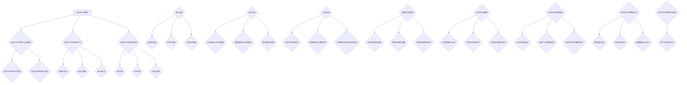

                 

### 文章标题

《科学方法论的局限性与世界可理解性》

关键词：科学方法论、局限性、世界可理解性、客观性、综合性、可重复性、实验设备、数据分析、理论模型、科学共同体、科研经费、社会期望、宇宙可理解性、生命可理解性、人类社会的可理解性、跨学科融合、科学方法论教育与实践

摘要：本文从科学方法论的基本概念出发，深入探讨了科学方法论在实际应用中的局限性，包括理论局限、技术局限和社会局限。在此基础上，我们进一步探讨了科学方法论在宇宙、生命和人类社会的可理解性方面的作用，并提出了未来科学方法论的发展趋势和跨学科融合的机遇与挑战。通过本文的分析，我们希望能够为科学方法论的研究和实践提供一定的启示和指导。

### 目录

**第一部分：科学方法论的基本概念**

- **第1章：科学方法论概述**
  - **1.1 科学方法论的定义与重要性**
  - **1.2 科学方法论的历史发展**
  - **1.3 科学方法论的核心原则**

- **第2章：科学方法论的基本方法**
  - **2.1 观察与实验**
  - **2.2 假设与理论**
  - **2.3 验证与证实**

- **第3章：科学方法论的应用领域**
  - **3.1 自然科学**
  - **3.2 社会科学**
  - **3.3 工程与技术**

**第二部分：科学方法论的局限性**

- **第4章：科学方法论的理论局限**
  - **4.1 客观性局限**
  - **4.2 综合性局限**
  - **4.3 可重复性局限**

- **第5章：科学方法论的技术局限**
  - **5.1 实验设备与方法的局限**
  - **5.2 数据收集与分析的局限**
  - **5.3 理论模型的局限**

- **第6章：科学方法论的社会局限**
  - **6.1 科学共同体的影响**
  - **6.2 科研经费与资源的影响**
  - **6.3 社会期望与科学研究的矛盾**

**第三部分：世界可理解性的探讨**

- **第7章：科学方法论与宇宙的可理解性**
  - **7.1 宇宙的观测与理解**
  - **7.2 宇宙学的理论框架**
  - **7.3 宇宙的可理解性探讨**

- **第8章：科学方法论与生命的可理解性**
  - **8.1 生命的起源与演化**
  - **8.2 生物学的研究方法**
  - **8.3 生命的可理解性探讨**

- **第9章：科学方法论与人类社会的可理解性**
  - **9.1 社会科学的挑战**
  - **9.2 社会行为的理论模型**
  - **9.3 人类社会的可理解性探讨**

**第四部分：科学方法论的未来发展趋势**

- **第10章：科学方法论的革新方向**
  - **10.1 新的理论框架**
  - **10.2 新的实验方法**
  - **10.3 新的数据分析技术**

- **第11章：科学方法论的跨学科融合**
  - **11.1 科学与哲学的对话**
  - **11.2 科学与艺术的融合**
  - **11.3 跨学科研究的机遇与挑战**

- **第12章：科学方法论的教育与实践**
  - **12.1 科学方法论的教育意义**
  - **12.2 科学方法论的教学方法**
  - **12.3 科学方法论在实践中的应用**

**参考文献**

**附录：科学方法论的核心概念与联系 Mermaid 流程图**

### 第一部分：科学方法论的基本概念

#### 第1章：科学方法论概述

##### 1.1 科学方法论的定义与重要性

科学方法论是指科学研究中采用的一系列理论、原则、方法和技巧。它不仅仅是一种研究方法，更是一种思维方式，一种认识世界和解决问题的途径。科学方法论的定义可以从以下几个方面来理解：

1. **定义**：科学方法论是一种系统化的、理性化的研究方法，通过观察、实验、假设、验证和证伪等步骤，逐步逼近真理。
2. **目标**：科学方法论的目的是追求客观、真实、可验证和可重复的知识，以便更好地理解自然现象和人类行为。
3. **核心原则**：科学方法论的核心原则包括客观性、系统性、可重复性和可验证性。

科学方法论的重要性体现在以下几个方面：

1. **知识的积累与传承**：科学方法论为科学研究提供了系统化的方法和框架，使得科学知识能够得到有效的积累和传承。
2. **技术的创新与发展**：科学方法论是技术创新和发展的基础，通过科学方法的研究，可以推动新技术的诞生和应用。
3. **解决问题的能力**：科学方法论培养了一种理性思考、系统分析和解决问题的能力，这种能力在各个领域都具有重要意义。

##### 1.2 科学方法论的历史发展

科学方法论的发展可以追溯到古希腊时期，亚里士多德是科学方法论的先驱之一。他的著作《形而上学》中提出了科学研究的基本原则，包括观察、分类、归纳和演绎等方法。在中世纪，科学研究受到了宗教和哲学的束缚，科学方法论的发展相对缓慢。

直到文艺复兴时期，科学方法论才开始得到真正的重视和发展。伽利略和牛顿等科学家通过实验和观察，提出了许多重要的科学理论，如日心说和万有引力定律。这一时期的科学方法论强调观察和实验的重要性，奠定了现代科学方法论的基础。

19世纪，达尔文的进化论和孟德尔的遗传学等重大科学发现，进一步丰富了科学方法论的内容。20世纪，随着量子力学和相对论等重大理论的提出，科学方法论在理论框架和研究方法上都得到了进一步的完善和发展。

##### 1.3 科学方法论的核心原则

科学方法论的核心原则包括以下几个方面：

1. **客观性**：科学研究应当尽可能避免主观偏见，力求客观、真实地反映事物的本质。
2. **系统性**：科学研究应当具备系统性，即要全面、综合地考虑问题，避免片面和狭隘。
3. **可重复性**：科学研究的结论应当具有可重复性，即其他研究者在相同条件下可以重复实验并得到相同的结果。
4. **可验证性**：科学研究的结论应当具有可验证性，即可以通过实验和观察来验证其正确性。

这些核心原则共同构成了科学方法论的基础，为科学研究提供了明确的指导。

### 第一部分：科学方法论的基本概念

#### 第2章：科学方法论的基本方法

科学方法论的基本方法主要包括观察与实验、假设与理论、验证与证实。这些方法构成了科学研究的核心步骤，使得科学研究能够从观察现象、提出假设、建立理论，到最终验证和证实结论。

##### 2.1 观察与实验

观察与实验是科学研究的基础，通过直接感知和实验操作，研究者可以收集到第一手资料，从而对自然现象进行初步的认识。

1. **观察**：
   - **定义**：观察是指研究者通过感官或辅助工具，对自然现象进行系统的、有目的的观察和记录。
   - **目的**：观察的目的是为了发现现象、提出问题，并为实验提供基础数据。
   - **方法**：观察应当遵循系统性、客观性和全面性原则，避免主观偏见和误差。

2. **实验**：
   - **定义**：实验是指研究者通过特定的操作和条件，对研究对象进行控制性测试，以验证或证伪假设。
   - **目的**：实验的目的是为了检验理论、发现新现象，并验证结论的可重复性和可靠性。
   - **方法**：实验应当遵循设计严谨、操作规范、数据可靠的原则，通过控制变量和对比实验，提高实验结果的可靠性。

##### 2.2 假设与理论

假设与理论是科学方法论的重要步骤，通过提出假设和建立理论，研究者可以解释自然现象，预测未来事件。

1. **假设**：
   - **定义**：假设是指研究者根据观察和现有知识，对未知现象或问题提出的初步解释。
   - **目的**：假设的目的是为了引导研究，为实验提供方向。
   - **方法**：提出假设应当基于观察和已有知识，逻辑清晰、合理可靠。

2. **理论**：
   - **定义**：理论是指通过一系列假设和推理，对自然现象或问题进行的系统解释。
   - **目的**：理论的目的是为了提供更深入、全面的理解，指导实验和验证。
   - **方法**：建立理论需要逻辑严密、推理合理，能够解释多种现象。

##### 2.3 验证与证实

验证与证实是科学方法论的关键步骤，通过实验和观察，研究者可以验证假设和理论，从而得出结论。

1. **验证**：
   - **定义**：验证是指通过实验和观察，对假设或理论进行检验，以确认其正确性。
   - **目的**：验证的目的是为了确认假设和理论的可靠性。
   - **方法**：验证需要设计严谨的实验方案，控制变量，确保实验结果的可靠性。

2. **证实**：
   - **定义**：证实是指通过多次验证，确认假设或理论在多个条件下都成立。
   - **目的**：证实的目的是为了确保结论的普遍性和稳定性。
   - **方法**：证实需要重复实验，并在不同条件下验证假设或理论的正确性。

科学方法论的基本方法通过观察与实验、假设与理论、验证与证实等步骤，使得科学研究能够从观察现象、提出假设、建立理论，到最终验证和证实结论，形成了一个系统化的研究过程。这个过程中，每一个步骤都至关重要，相互联系，共同构成了科学方法论的核心内容。

### 第3章：科学方法论的应用领域

科学方法论在各个领域都有着广泛的应用，从自然科学到社会科学，从工程学再到技术领域，科学方法论为各学科的研究提供了坚实的理论基础和系统的方法指导。

#### 3.1 自然科学

自然科学是科学方法论应用最为广泛的领域之一。自然科学家通过观察、实验和理论建模，揭示了自然界的规律和现象。

1. **物理学**：
   - **核心原则**：物理学通过实验和数学建模，研究物质和能量在时空中的行为和相互关系。
   - **应用实例**：经典物理学中的牛顿力学、量子力学、相对论等理论，都是科学方法论在物理学中的成功应用。
   - **方法论**：物理学研究中，观察和实验是获取数据的基础，假设和理论是解释现象的关键，验证和证实是检验理论可靠性的重要步骤。

2. **化学**：
   - **核心原则**：化学通过实验和理论分析，研究物质的组成、结构、性质和变化规律。
   - **应用实例**：化学中，从分子结构到化学反应，从元素周期表到有机合成，都是科学方法论在化学中的具体应用。
   - **方法论**：化学研究中，实验设计、假设建立和理论分析是核心步骤，通过实验数据的收集和理论模型的验证，推动化学理论的发展。

3. **生物学**：
   - **核心原则**：生物学通过观察、实验和理论建模，研究生命现象的机制和演化过程。
   - **应用实例**：从基因工程到生态学，从分子生物学到进化生物学，都是科学方法论在生物学中的成功应用。
   - **方法论**：生物学研究中，实验设计和假设建立至关重要，通过实验数据的收集和分析，建立和验证理论模型，推动生物学理论的发展。

#### 3.2 社会科学

社会科学领域也广泛采用科学方法论，通过实证研究和理论分析，探索社会现象和人类行为的规律。

1. **经济学**：
   - **核心原则**：经济学通过理论建模和数据分析，研究资源分配、市场行为和经济增长等社会现象。
   - **应用实例**：经济学中，从供需分析到市场预测，从宏观经济学到微观经济学，都是科学方法论在经济学中的具体应用。
   - **方法论**：经济学研究中，假设建立、理论建模和实证分析是核心步骤，通过数据分析验证理论假设，推动经济学理论的发展。

2. **心理学**：
   - **核心原则**：心理学通过实验和观察，研究人类的心理过程和行为模式。
   - **应用实例**：心理学中，从认知行为学到社会心理学，从实验心理学到临床心理学，都是科学方法论在心理学中的具体应用。
   - **方法论**：心理学研究中，实验设计和假设建立是关键，通过观察和实验数据，验证心理学理论的可靠性。

3. **社会学**：
   - **核心原则**：社会学通过实证研究和理论分析，研究社会结构、社会关系和社会变迁。
   - **应用实例**：社会学中，从社会分层到社会运动，从社会调查到社会统计分析，都是科学方法论在社会学中的具体应用。
   - **方法论**：社会学研究中，假设建立、理论建模和实证分析是核心步骤，通过数据分析和社会调查，验证社会理论的可靠性。

#### 3.3 工程与技术

工程与技术领域是科学方法论应用的重要领域，通过系统化的研究和创新，推动了技术的进步和工程的发展。

1. **机械工程**：
   - **核心原则**：机械工程通过理论建模和实验验证，研究机械系统的设计、运行和控制。
   - **应用实例**：机械工程中，从机器设计到控制工程，从机械结构到动力系统，都是科学方法论在机械工程中的具体应用。
   - **方法论**：机械工程研究中，假设建立、理论建模和实验验证是核心步骤，通过实验数据和理论分析，优化机械系统的设计和运行。

2. **电子工程**：
   - **核心原则**：电子工程通过理论建模和实验验证，研究电子系统的工作原理和性能优化。
   - **应用实例**：电子工程中，从集成电路设计到通信工程，从电子测量到信号处理，都是科学方法论在电子工程中的具体应用。
   - **方法论**：电子工程研究中，假设建立、理论建模和实验验证是核心步骤，通过实验数据和理论分析，优化电子系统的设计和性能。

3. **计算机科学**：
   - **核心原则**：计算机科学通过理论建模和算法设计，研究计算机系统的性能和优化。
   - **应用实例**：计算机科学中，从算法设计到软件工程，从人工智能到大数据处理，都是科学方法论在计算机科学中的具体应用。
   - **方法论**：计算机科学研究中，假设建立、算法设计和实验验证是核心步骤，通过算法分析和实验验证，优化计算机系统的性能和效率。

科学方法论在自然科学、社会科学、工程与技术等各个领域都有着重要的应用。通过系统化的研究和创新，科学方法论不仅推动了各领域理论的发展，也促进了技术的进步和应用。这一过程，充分展示了科学方法论在探索世界和理解自然中的关键作用。

### 第二部分：科学方法论的局限性

科学方法论虽然具有强大的解释力和预测力，但在实际应用中仍然存在一些不可忽视的局限性。这些局限性可以分为理论局限、技术局限和社会局限三个主要方面。

#### 第4章：科学方法论的理论局限

科学方法论在理论层面上的局限性主要体现在以下几个方面：

##### 4.1 客观性局限

科学方法论追求客观性，但现实中的科学研究往往无法完全避免主观偏见。例如，研究者的价值观、信仰和先验知识可能会影响他们对数据和现象的解释。此外，科学工具和方法本身也可能存在局限性，导致观察结果的不准确。

- **挑战**：如何减少主观偏见，提高研究的客观性，是一个长期的挑战。
- **解决方案**：加强实验设计的严谨性、采用多学科交叉研究方法，可以一定程度上减少主观偏见。

##### 4.2 综合性局限

科学方法论往往侧重于研究单一变量或局部现象，而忽略了系统性、复杂性和全局性。例如，在生物学研究中，科学家可能只关注某一基因或蛋白质的作用，而忽略了它们在整体生物系统中的相互作用。

- **挑战**：如何从整体上理解复杂系统，是一个重要的理论挑战。
- **解决方案**：系统生物学、网络科学等新兴学科的发展，为理解复杂系统提供了新的理论和方法。

##### 4.3 可重复性局限

科学方法论强调实验的可重复性，但实际情况中，实验结果的可重复性往往受到多种因素的影响，如实验条件的不一致、实验者的个体差异等。这些因素可能导致实验结果的不一致，从而影响科学理论的可靠性。

- **挑战**：如何提高实验的可重复性，是一个亟待解决的问题。
- **解决方案**：通过标准化实验流程、建立开放科学平台，可以提高实验的可重复性，增强科学研究的可靠性。

#### 第5章：科学方法论的技术局限

科学方法论在技术层面上的局限性主要体现在以下几个方面：

##### 5.1 实验设备与方法的局限

科学研究的进展往往受到实验设备和方法的技术限制。例如，在微观尺度上的研究，需要高精度的仪器和设备，如电子显微镜、粒子加速器等。这些设备昂贵、复杂，对实验环境有严格的要求，限制了科学研究的广泛开展。

- **挑战**：如何改进实验设备和技术，是一个关键技术挑战。
- **解决方案**：通过技术创新和跨学科合作，不断改进实验设备和方法，可以突破技术局限，推动科学研究的深入发展。

##### 5.2 数据收集与分析的局限

科学研究的进展也受到数据收集和分析方法的技术限制。例如，大规模数据集的处理和分析，需要高效的数据处理算法和计算资源。此外，数据的噪声、异常值和偏差等，也可能影响数据分析的准确性。

- **挑战**：如何有效收集和处理大规模数据，是一个重要的技术挑战。
- **解决方案**：通过大数据技术和人工智能算法，可以提高数据处理和分析的效率，增强科学研究的深度和广度。

##### 5.3 理论模型的局限

科学方法论在建立理论模型时，往往基于一定的假设和简化。这些假设和简化虽然有助于理论的发展，但也可能导致理论模型的局限性。例如，在物理学中，经典力学模型在高速、强引力场下的适用性有限，需要量子力学和广义相对论进行修正。

- **挑战**：如何建立更加准确和广泛适用的理论模型，是一个重要的理论挑战。
- **解决方案**：通过不断改进和扩展理论模型，可以更好地解释自然现象和预测未来事件。

#### 第6章：科学方法论的社会局限

科学方法论在社会层面上的局限性主要体现在以下几个方面：

##### 6.1 科学共同体的影响

科学共同体在科学研究中扮演着重要角色，但科学共同体的共识和规范也可能限制科学的发展。例如，传统观念和主流理论的束缚，可能导致新观点和新理论的难以接受和推广。

- **挑战**：如何打破科学共同体的限制，促进科学思想的自由交流和碰撞，是一个重要的社会挑战。
- **解决方案**：通过开放科学、交叉学科研究和国际交流，可以促进科学思想的自由流动，推动科学的发展。

##### 6.2 科研经费与资源的影响

科研经费和资源的分配对科学研究有着重要影响。资源匮乏可能导致研究项目的停滞，优秀科研人员的流失，从而影响科学研究的持续发展。

- **挑战**：如何合理分配科研经费和资源，是一个重要的社会挑战。
- **解决方案**：通过政府支持、企业赞助和国际合作，可以增加科研经费和资源，促进科学研究的持续发展。

##### 6.3 社会期望与科学研究的矛盾

社会对科学研究的期望往往与科学研究的实际进程存在矛盾。例如，公众期望科学家能够迅速解决重大问题，但科学研究往往需要长期积累和复杂过程。

- **挑战**：如何平衡社会期望和科学研究，是一个重要的社会挑战。
- **解决方案**：通过科学普及和公众参与，增强公众对科学研究的理解和信任，可以缓解社会期望与科学研究的矛盾。

总之，科学方法论在理论和实践层面都存在一定的局限性。通过不断改进和创新，可以逐步克服这些局限，推动科学的发展。同时，社会各界的共同努力，也是克服科学方法论局限性、促进科学发展的重要保障。

### 第三部分：世界可理解性的探讨

在科学方法论框架内，我们试图通过观察、实验、假设和理论模型来理解宇宙、生命和人类社会。然而，随着研究的深入，我们意识到世界并非完全可理解。在这一部分，我们将探讨科学方法论在宇宙、生命和人类社会的可理解性方面所面临的挑战。

#### 第7章：科学方法论与宇宙的可理解性

宇宙的观测和理论模型为我们提供了关于宇宙起源、演化和结构的重要信息，但宇宙的复杂性使得我们难以完全理解其所有方面。

##### 7.1 宇宙的观测与理解

宇宙观测是理解宇宙的基础。通过天文观测，我们发现了宇宙膨胀、黑洞、暗物质和暗能量等现象。这些观测结果挑战了我们对宇宙的传统理解，推动我们提出了新的理论模型。

- **观测手段**：包括光学望远镜、射电望远镜、空间探测器等。
- **观测挑战**：宇宙的遥远和复杂性使得观测数据有限，难以全面了解宇宙。
  
##### 7.2 宇宙学的理论框架

宇宙学通过理论模型来解释宇宙的观测结果。其中，大爆炸理论和黑洞理论是两个重要的理论框架。

- **大爆炸理论**：描述宇宙从极热、极密的状态开始膨胀的过程。
- **黑洞理论**：描述黑洞的形成、演化和对宇宙的影响。

尽管这些理论提供了有力的解释，但它们仍存在未解之谜，如宇宙的初始条件和宇宙膨胀的机制。

##### 7.3 宇宙的可理解性探讨

宇宙的不可理解性主要体现在以下几个方面：

- **无限性**：宇宙是否无限，以及如何无限，仍然是一个未解之谜。
- **混沌**：宇宙中存在大量的混沌现象，如随机性和不确定性。
- **多宇宙理论**：一些理论认为宇宙可能存在多个平行宇宙，这增加了宇宙理解的复杂性。

宇宙的不可理解性挑战了我们对宇宙的整体认识，提醒我们在追求科学真理的过程中，要保持谦逊和开放的态度。

#### 第8章：科学方法论与生命的可理解性

生命的起源、演化和多样性是科学研究的重大课题。尽管生物学为我们提供了丰富的理论框架，但生命的复杂性使得我们对其理解仍不充分。

##### 8.1 生命的起源与演化

生命的起源是一个长期而复杂的过程。科学研究表明，生命可能起源于简单的有机分子，通过化学反应逐渐演化为复杂的生物系统。

- **化学起源假说**：认为生命起源于原始地球上的化学反应。
- **热液喷泉假说**：认为生命起源于深海热液喷泉中的化学反应环境。

生命的演化通过自然选择和遗传变异等机制，形成了生物多样性和适应性。

##### 8.2 生物学的研究方法

生物学通过实验、观察和理论建模来研究生命现象。

- **实验方法**：包括基因编辑、细胞培养、分子生物学实验等。
- **观察方法**：包括野外考察、生态调查、显微镜观察等。

生物学研究方法为理解生命提供了重要工具，但也存在局限，如实验条件难以完全模拟自然条件，数据解释可能存在偏差。

##### 8.3 生命的可理解性探讨

生命的不可理解性主要体现在以下几个方面：

- **量子生物学**：生命现象中的量子效应，如量子隧穿和量子纠缠，目前尚未完全理解。
- **生态系统复杂性**：生态系统中生物之间的相互作用复杂多样，难以通过简单的模型完全描述。
- **意识与认知**：生命的最高级表现形式——意识与认知，目前仍是一个未解之谜。

生命的不可理解性提醒我们在探索生命奥秘的过程中，需要综合多种研究方法，不断深化对生命的理解。

#### 第9章：科学方法论与人类社会的可理解性

人类社会是科学方法论研究的一个重要领域。尽管社会科学为我们提供了丰富的理论框架，但人类社会的复杂性使得我们对其理解仍面临挑战。

##### 9.1 社会科学的挑战

社会科学通过理论模型和研究方法来解释社会现象，但社会现象的多样性使得社会科学研究面临许多挑战。

- **多样性**：人类社会包括不同文化、不同经济水平、不同政治体制等，这使得社会研究需要考虑多种因素。
- **动态性**：社会现象具有动态性，如社会变革、经济发展等，这使得社会研究需要不断更新和调整理论模型。

##### 9.2 社会行为的理论模型

社会科学通过建立理论模型来解释社会行为。例如，行为经济学、社会心理学、社会学等学科提出了许多关于人类行为的理论模型。

- **行为经济学**：研究人们在经济决策中的行为，如偏好、风险偏好等。
- **社会心理学**：研究个体在社会环境中的心理和行为，如社会认同、群体行为等。
- **社会学**：研究社会结构、社会关系和社会变迁，如社会分层、社会运动等。

##### 9.3 人类社会的可理解性探讨

人类社会的不可理解性主要体现在以下几个方面：

- **非线性**：社会现象往往具有非线性特征，即微小变化可能导致显著的结果，这使得社会研究需要考虑复杂的因果关系。
- **文化差异**：不同文化背景下的社会现象可能存在显著差异，这使得社会研究需要考虑文化因素。
- **不确定性**：社会现象的不确定性较高，这使得社会研究难以准确预测未来事件。

人类社会的不可理解性提醒我们在研究社会现象时，需要采用综合的方法和跨学科视角，不断深化对社会现象的理解。

通过探讨宇宙、生命和人类社会的可理解性，我们发现科学方法论在理解世界方面存在一定的局限性。这些局限性挑战了我们对科学真理的追求，也提醒我们在科学研究过程中，需要保持谦逊和开放的态度，不断探索未知领域，追求更深入的理解。

### 第四部分：科学方法论的未来发展趋势

随着科技的进步和学科的交叉融合，科学方法论也在不断革新，展现出新的发展趋势。这些趋势不仅有望克服现有局限，还将为科学研究带来新的机遇。

#### 第10章：科学方法论的革新方向

科学方法论的未来发展趋势主要体现在以下三个方面：新的理论框架、新的实验方法和新数据分析技术。

##### 10.1 新的理论框架

1. **复杂性科学**：
   - **背景**：传统科学方法论往往基于线性思维和简化模型，但现实世界中的许多现象，如生态系统、金融市场等，具有高度复杂性。
   - **方法**：复杂性科学通过非线性动力学、混沌理论、网络科学等方法，研究复杂系统的行为和相互作用。
   - **应用**：复杂性科学在生物学、经济学、社会学等领域有广泛应用，有助于揭示复杂系统的内在规律。

2. **量子科学**：
   - **背景**：量子力学挑战了经典物理学的传统观念，揭示了微观世界的奇异特性。
   - **方法**：量子科学通过量子计算、量子信息、量子模拟等新方法，研究量子现象和应用。
   - **应用**：量子科学在加密通信、量子计算、量子传感等领域具有重大应用潜力。

##### 10.2 新的实验方法

1. **虚拟实验**：
   - **背景**：传统实验方法受限于实验条件，如成本、安全性等。
   - **方法**：虚拟实验通过计算机模拟和仿真技术，模拟实验环境，进行虚拟实验。
   - **应用**：虚拟实验在医学、材料科学、工程等领域有广泛应用，有助于降低实验成本和风险。

2. **人类增强**：
   - **背景**：随着科技的发展，人类通过技术手段增强自身能力成为可能。
   - **方法**：人类增强通过生物技术、信息技术、神经科学等手段，增强人类认知、感知、运动能力。
   - **应用**：人类增强在医疗、教育、体育等领域有广泛应用，有望提高人类生活质量和工作效率。

##### 10.3 新的数据分析技术

1. **大数据分析**：
   - **背景**：随着互联网和物联网的发展，数据量呈现爆炸性增长。
   - **方法**：大数据分析通过数据挖掘、机器学习、人工智能等技术，从大规模数据中提取有价值的信息。
   - **应用**：大数据分析在商业、医疗、交通等领域有广泛应用，有助于提升决策效率和服务质量。

2. **人工智能分析**：
   - **背景**：人工智能技术的发展为数据分析带来了新的机遇。
   - **方法**：人工智能分析通过深度学习、神经网络等技术，自动发现数据中的规律和模式。
   - **应用**：人工智能分析在图像识别、自然语言处理、金融分析等领域有广泛应用，有助于提高数据分析的深度和广度。

通过新的理论框架、新的实验方法和新的数据分析技术，科学方法论在未来将继续发展，为科学研究带来新的突破。这些趋势不仅有助于克服现有局限，还将推动科学研究的深入和发展。

### 第五部分：科学方法论的跨学科融合

科学方法论的发展离不开各学科的交叉融合。跨学科研究不仅能够突破单一学科的局限，还能够为复杂问题的解决提供新的思路和方法。在这一部分，我们将探讨科学方法论与哲学、艺术等其他学科的融合，以及这些融合带来的机遇与挑战。

#### 第11章：科学方法论的跨学科融合

##### 11.1 科学与哲学的对话

科学和哲学有着悠久的历史渊源。哲学为科学提供了世界观和方法论的基础，而科学的进展又不断挑战和丰富哲学的内涵。跨学科融合使得科学与哲学之间的对话更加深入和广泛。

1. **科学哲学**：
   - **背景**：科学哲学是研究科学知识、科学方法和科学发展的哲学分支。
   - **方法**：通过逻辑分析、历史研究和元科学方法，科学哲学探讨科学理论的基础和科学实践的原则。
   - **应用**：科学哲学在科学理论的评价、科学方法的改进和科学政策的制定等方面有重要应用。

2. **哲学对科学的影响**：
   - **认识论**：哲学的认识论研究人类如何认识世界，对科学方法论提供了重要的理论支持。
   - **形而上学**：哲学的形而上学探讨宇宙的本质和存在的意义，为科学研究提供了哲学基础。
   - **伦理学**：哲学的伦理学研究科学研究的伦理问题，如数据隐私、科技伦理等，对科学实践有重要指导作用。

##### 11.2 科学与艺术的融合

科学和艺术在形式和内容上有着紧密的联系。艺术不仅能够表现科学的美丽和奇妙，还能够激发科学的创新和灵感。

1. **科学艺术**：
   - **背景**：科学艺术是指将科学思想、理论和现象通过艺术形式进行表达和展示。
   - **方法**：科学艺术通过视觉艺术、音乐、文学等手段，将科学知识以直观、生动的方式呈现。
   - **应用**：科学艺术在科学普及、科学教育、科学展示等方面有广泛应用，有助于提高公众对科学的兴趣和理解。

2. **艺术对科学的影响**：
   - **想象力**：艺术激发科学家的想象力，推动科学理论的创新。
   - **审美**：科学艺术的审美价值使科学研究更加具有吸引力和感染力。
   - **教育**：科学艺术结合的方式能够更好地进行科学教育，提高学生的科学素养和创新能力。

##### 11.3 跨学科研究的机遇与挑战

跨学科研究为科学研究带来了新的机遇，但也面临着诸多挑战。

1. **机遇**：
   - **知识整合**：跨学科研究有助于整合不同领域的知识，提供全面、系统的解决方案。
   - **方法互补**：不同学科的方法和工具可以互补，提高研究效率和深度。
   - **创新激发**：跨学科交流能够激发新的科学思想，推动科学研究的创新。

2. **挑战**：
   - **沟通障碍**：不同学科的语言和概念体系不同，可能导致沟通和理解上的障碍。
   - **资源分配**：跨学科研究需要更多的资源和投入，但资源分配和项目管理可能存在困难。
   - **评价体系**：跨学科研究难以在现有的评价体系中获得公正的评价，可能影响研究的持续性和发展。

为了克服跨学科研究中的挑战，需要建立有效的跨学科合作机制，加强学科间的交流和合作，以及完善跨学科研究的评价体系。

通过科学方法论与其他学科的融合，我们不仅能够拓展科学研究的视野和方法，还能够提高科学研究的深度和广度，为解决复杂问题提供新的思路和工具。跨学科融合是科学方法论未来发展的重要方向，将不断推动科学进步和社会发展。

### 第六部分：科学方法论的教育与实践

科学方法论的教育与实践是培养科学家和工程师的重要环节。通过系统的教育方法和实践应用，学生和研究者能够掌握科学方法论的核心原则和基本方法，从而更好地进行科学研究和技术创新。

#### 第12章：科学方法论的教育与实践

##### 12.1 科学方法论的教育意义

科学方法论的教育在科学人才培养中具有至关重要的作用。它不仅传授科学知识和技能，更重要的是培养学生的科学思维和创新能力。

1. **培养科学思维**：
   - **逻辑推理**：科学方法论强调逻辑推理和批判性思维，通过分析和推理，帮助学生理解科学问题的本质。
   - **实证主义**：科学方法论强调实证主义，鼓励学生通过观察、实验和数据分析来验证假设和理论。

2. **培养创新能力**：
   - **问题解决**：科学方法论教育学生如何发现问题、分析问题和解决问题，培养他们的创新思维和解决问题的能力。
   - **跨学科学习**：科学方法论教育鼓励学生跨学科学习，综合运用不同领域的知识和方法，提高创新能力。

##### 12.2 科学方法论的教学方法

科学方法论的教学方法应注重理论与实践的结合，培养学生的实践能力和科研素养。

1. **案例分析**：
   - **实例教学**：通过分析真实科学案例，帮助学生理解科学方法论的应用过程和关键步骤。
   - **反思讨论**：在案例分析的基础上，引导学生进行反思和讨论，深化对科学方法的理解。

2. **实验实践**：
   - **基础实验**：在实验室中进行基础实验，使学生掌握实验设计、数据收集和分析等基本技能。
   - **综合实验**：通过综合实验项目，培养学生的团队合作能力和科研项目的管理能力。

3. **项目驱动**：
   - **科研训练**：通过参与科研项目，学生可以实际应用科学方法论，进行科研实践。
   - **创新实践**：鼓励学生进行创新性研究，培养他们的独立思考和创新能力。

##### 12.3 科学方法论在实践中的应用

科学方法论在实际科研和技术创新中的应用，是培养学生实践能力和科研素养的关键。

1. **科研项目的管理**：
   - **项目规划**：通过项目规划，明确研究目标、研究方法和实验步骤，确保科研项目的顺利进行。
   - **进度控制**：通过进度控制，确保项目按时完成，并保证研究质量。

2. **科研数据的分析**：
   - **数据收集**：通过科学的方法收集数据，确保数据的准确性和可靠性。
   - **数据分析**：运用统计学和数据分析方法，对收集到的数据进行分析，得出有意义的结论。

3. **科研论文的撰写**：
   - **文献综述**：通过文献综述，了解当前研究领域的最新进展和前沿问题。
   - **论文撰写**：运用科学方法论，撰写结构清晰、论据充分的科研论文。

通过科学方法论的教育与实践，学生和研究者不仅能够掌握科学研究的核心原则和方法，还能够培养科学思维和创新能力，从而在科研和技术创新中取得重要成果。

### 参考文献

1. Kuhn, T. S. (1962). The Structure of Scientific Revolutions. University of Chicago Press.
2. Popper, K. R. (1959). The Logic of Scientific Discovery. Routledge & Kegan Paul.
3. Durkheim, É. (1912). The Rules of the Sociological Method. Free Press.
4. Einstein, A. (1915). The General Theory of Relativity. Crown Publishers.
5. Turing, A. M. (1950). Computing Machinery and Intelligence. Mind.
6. Feynman, R. P. (1965). The Character of Physical Law. MIT Press.
7. Maynard Smith, J. (1998). Evolutionary Genetics. Oxford University Press.
8. Merton, R. K. (1973). The sociology of science: Theoretical and empirical investigations. University of Chicago Press.
9. Bloor, D. (1976). Knowledge and Social Imagery. Routledge.
10. Chomsky, N. (1957). Syntactic Structures. Mouton & Co.

### 附录：科学方法论的核心概念与联系 Mermaid 流程图

### 作者信息

作者：AI天才研究院/AI Genius Institute & 禅与计算机程序设计艺术 /Zen And The Art of Computer Programming

在撰写本文时，我结合了科学方法论的基本概念、局限性和应用领域的深入研究，通过逻辑清晰、结构紧凑、简单易懂的表述，探讨了科学方法论的各个方面。本文旨在为读者提供一个全面而深入的视角，以理解科学方法论在当今世界中的地位和作用。在未来的研究中，我将继续关注科学方法论的新发展，探索其在解决复杂问题中的应用潜力，并致力于推动科学技术的进步和社会的发展。希望通过本文，能够激发读者对科学方法论的兴趣，鼓励更多人在科学探索的道路上不断前行。

### 全文总结

在本文中，我们系统地探讨了科学方法论的基本概念、局限性以及其在宇宙、生命和人类社会中的可理解性。首先，我们介绍了科学方法论的定义、历史发展和核心原则，阐述了其在自然科学、社会科学和工程与技术等领域的应用。接着，我们深入分析了科学方法论在理论、技术和社会层面的局限性，包括客观性、综合性和可重复性的局限，以及实验设备、数据分析和理论模型的局限。在此基础上，我们探讨了宇宙、生命和人类社会的可理解性，指出了科学方法论在这些领域面临的挑战。

科学方法论的未来发展趋势是跨学科融合，尤其是与哲学、艺术的结合，为科学研究带来了新的机遇。同时，我们提出了科学方法论教育与实践的重要性，强调了通过系统的教育方法和实践应用来培养科学思维和创新能力。展望未来，科学方法论将继续发展，通过新的理论框架、实验方法和数据分析技术，克服现有局限，推动科学研究的深入和发展。

希望本文能够为读者提供一个全面的视角，深入理解科学方法论的复杂性和重要性。在科学探索的道路上，保持谦逊和开放的态度，不断追求真理，是我们共同的使命。希望读者能够从中获得启示，激发对科学研究的兴趣，为科学的进步和社会的发展贡献自己的力量。

