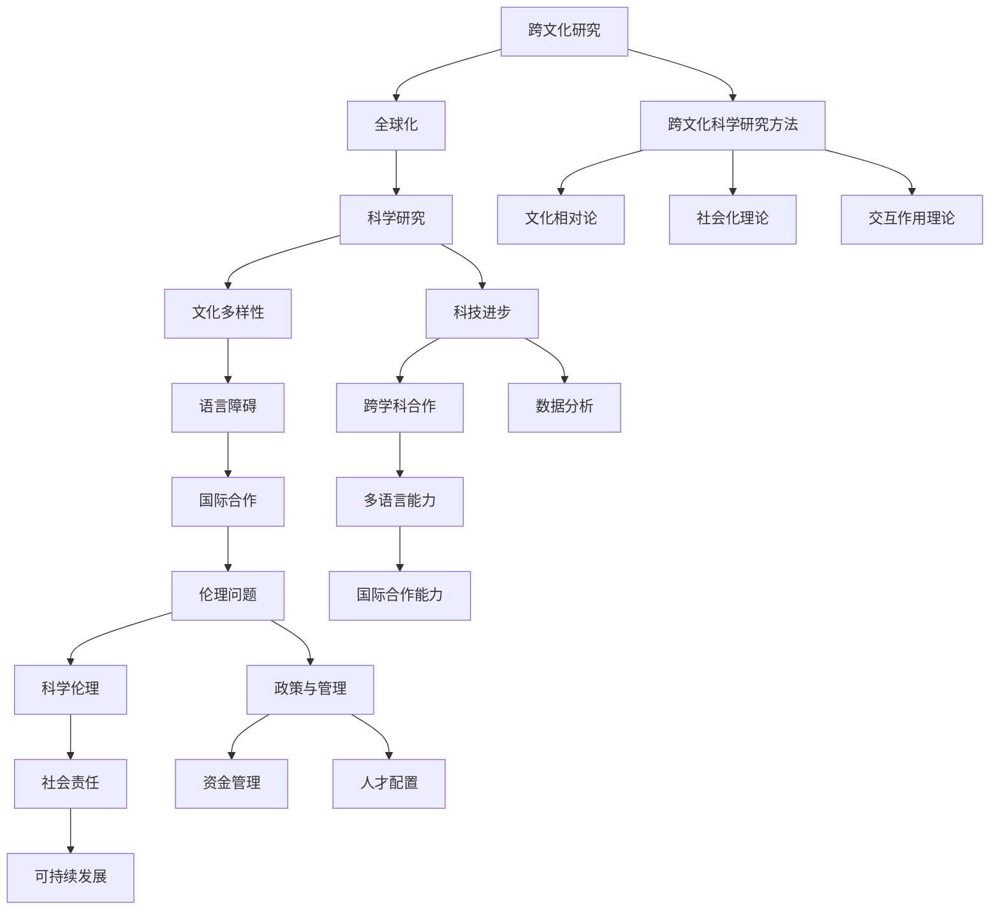

                 

### 文章标题

# 科学研究的全球化：跨文化视野下的世界理解

> 关键词：全球化、跨文化研究、科学研究、文化多样性、国际合作、伦理问题

> 摘要：本文旨在探讨全球化背景下的科学研究，特别是跨文化视野下的世界理解。通过分析全球化的历史、对科学研究的影响以及跨文化研究的现状和挑战，本文揭示了文化多样性和语言障碍在全球科学研究中的重要地位。此外，本文还探讨了全球科学研究中的政策与管理、伦理与责任，并提出了应对未来挑战的策略与建议。通过深入剖析这些核心问题，本文希望为全球科学研究的可持续发展提供理论依据和实践指导。

---

### 第一部分：导论与背景

#### 1.1 书籍目的与结构概述

**书籍目的**

本文旨在深入探讨全球化对科学研究的影响，特别是从跨文化的视角审视世界范围内的科学研究活动。全球化不仅改变了经济、政治和社会的格局，也深刻地影响了科学研究的发展方向。在这种背景下，跨文化研究成为理解世界科学共同体不可或缺的一部分。

**结构安排**

本书分为七个主要部分：

1. **导论与背景**：介绍全球化的历史、对科学研究的影响以及跨文化研究的现状和挑战。
2. **跨文化视角下的科学研究**：探讨跨文化科学研究的基本概念、国际合作模式以及案例分析。
3. **全球科学研究中的文化与语言因素**：分析文化多元性对科学研究方法的影响，以及语言障碍与科学交流的挑战。
4. **全球科学研究中的政策与管理**：探讨国际科研政策、资金管理与人才培养。
5. **全球科学研究中的伦理与责任**：讨论跨文化背景下的科学伦理问题以及科学研究中的社会责任。
6. **未来展望与挑战**：预测全球科学研究的发展趋势，分析面临的挑战并提出应对策略。
7. **附录与参考资料**：提供相关的国际组织、案例研究文献综述以及研究方法论与技巧。

**预期收获**

通过阅读本书，读者可以：

- 深入理解全球化的概念及其对科学研究的影响。
- 掌握跨文化科学研究的基本概念和理论框架。
- 了解全球科学研究中的国际合作模式以及文化适应策略。
- 分析全球科学研究中的文化多样性和语言障碍，并提出解决策略。
- 理解全球科学研究中的政策与管理、伦理与责任。
- 获得对未来全球科学研究的趋势与挑战的洞察，并为科学研究的可持续发展提供建议。

#### 1.2 全球化背景分析

**全球化历史发展**

全球化是一个长期的历史进程，可以追溯到几百年前的地理大发现和工业革命。随着交通工具和通信技术的进步，全球联系日益紧密，经济、政治、文化等领域的交流日益频繁。20世纪末以来，全球化进程加速，尤其在信息技术和互联网的推动下，各国之间的互动更加便捷和频繁。

**全球化对科学研究的影响**

全球化的影响不仅体现在经济和政治领域，也深刻地改变了科学研究的发展方向。首先，全球化促进了科学研究的国际合作与交流。科学家们可以更容易地跨国合作，分享研究成果，共同解决全球性问题。其次，全球化带来了新的研究课题和挑战。例如，气候变化、公共卫生、能源危机等问题都需要全球科学家的共同努力。此外，全球化也加速了科学知识的传播和普及，促进了科学教育和培训的发展。

**跨文化研究的现状与挑战**

跨文化研究是全球化背景下科学研究的重要组成部分。它不仅关注不同文化背景下的科学观念和方法的差异，还探讨如何在不同文化环境中进行科学研究和国际合作。目前，跨文化研究已经在多个领域取得了显著成果，如医学研究、社会科学研究、工程学研究等。然而，跨文化研究也面临着一些挑战，包括文化差异导致的误解和冲突、跨文化沟通障碍、文化适应性问题等。

**本部分的核心内容**

本部分主要内容包括：

1. **全球化的历史发展**：回顾全球化的起源和发展历程，分析其对科学研究的影响。
2. **全球化对科学研究的影响**：探讨全球化如何推动科学研究的国际合作与交流，以及带来新的研究课题和挑战。
3. **跨文化研究的现状与挑战**：分析跨文化研究的现状，探讨其面临的挑战和问题。

通过以上分析，我们可以更好地理解全球化对科学研究的深远影响，以及跨文化研究在全球化背景下的重要地位。这为后续章节的深入探讨提供了坚实的基础。

---

### 第二部分：跨文化视角下的科学研究

#### 2.1 跨文化科学研究的基本概念

**跨文化的定义与分类**

跨文化研究中的“跨文化”一词，指的是在不同文化背景下进行的科学研究活动。具体来说，跨文化研究关注的是不同文化环境下的科学观念、方法、价值观和行为的差异。根据文化差异的程度和范围，跨文化研究可以大致分为以下几种类型：

1. **跨国家研究**：在两个或多个国家之间进行的科学研究，如国际合作项目、跨国研究团队等。
2. **跨地区研究**：在同一国家内不同地区之间进行的科学研究，如城市与农村、不同民族地区等。
3. **跨文化群体研究**：在具有不同文化背景的群体之间进行的科学研究，如移民群体、少数民族群体等。

**跨文化研究的理论框架**

跨文化研究的理论框架主要包括以下几个方面：

1. **文化相对论**：文化相对论认为，每种文化都有其独特的价值和意义，不能以自己的文化标准来评判其他文化。这种观点强调尊重文化多样性，促进跨文化理解和沟通。
2. **社会化理论**：社会化理论强调文化对个体行为和观念的影响。通过社会化过程，个体学习并内化了特定文化的价值观和行为规范。
3. **交互作用理论**：交互作用理论关注不同文化背景下的个体或群体之间的互动和沟通，探讨如何在文化差异中实现有效的交流和合作。

**跨文化研究的伦理问题**

跨文化研究涉及到伦理问题，尤其是在研究过程中如何尊重和保护不同文化的权益。以下是一些常见的伦理问题：

1. **知情同意**：在进行跨文化研究时，研究者需要确保参与者充分了解研究的目的、过程和潜在风险，并获得其自愿同意。
2. **隐私保护**：跨文化研究通常涉及参与者的个人数据，研究者需要确保这些数据的保密性和隐私性。
3. **文化敏感性**：研究者需要尊重不同文化的习俗和价值观，避免可能的文化冲突和误解。
4. **公平性**：跨文化研究需要确保不同文化背景的参与者都能公平地参与研究和分享研究成果。

**本节的核心内容**

本节主要内容包括：

1. **跨文化的定义与分类**：介绍跨文化的概念，并分类讨论不同类型的跨文化研究。
2. **跨文化研究的理论框架**：探讨跨文化研究的理论基础，包括文化相对论、社会化理论和交互作用理论。
3. **跨文化研究的伦理问题**：讨论跨文化研究过程中可能遇到的伦理问题，以及如何解决这些问题。

通过以上分析，我们可以更深入地理解跨文化科学研究的基本概念、理论框架和伦理问题。这为后续章节的探讨提供了理论依据。

#### 2.2 跨文化研究的国际合作模式

**合作研究与网络构建**

跨文化研究的国际合作模式是全球化背景下科学研究的重要组成部分。国际合作不仅能够整合全球资源，提高研究效率，还能够促进不同文化之间的交流和互鉴。以下是一些常见的国际合作模式：

1. **跨国研究团队**：这是最常见的国际合作模式，由来自不同国家和文化背景的科学家组成，共同开展研究项目。这种模式的优势在于能够充分利用各方的专业知识和资源，提高研究的全面性和深度。
2. **国际科研合作项目**：这种模式通常由多个国家和地区的科研机构共同发起，共同投资和分享研究成果。例如，“地平线2020”（Horizon 2020）是欧盟的一项大型科研资助计划，吸引了全球众多科研机构和企业的参与。
3. **科研合作网络**：科研合作网络是由多个科研机构、高校和企业组成的联盟，旨在促进科研资源的共享和合作。例如，“全球研究联盟”（Global Research Alliance）是一个由多国科学家组成的气候变化研究网络。

**跨国研究团队的管理与协调**

跨国研究团队的管理与协调是一项复杂而重要的任务。以下是一些关键的管理和协调策略：

1. **明确目标与分工**：在组建跨国研究团队时，需要明确每个成员的角色和责任，确保各方都明确自己的任务和目标。
2. **建立有效的沟通机制**：跨国研究团队需要建立多种沟通渠道，如定期的视频会议、在线协作工具等，以确保团队成员之间的信息畅通。
3. **文化适应与团队建设**：跨国研究团队需要关注成员的文化背景和差异，通过团队建设活动增强团队凝聚力，减少文化冲突。
4. **风险管理与冲突解决**：跨国研究团队可能会面临各种风险和冲突，如资金问题、文化误解等。团队需要建立有效的风险管理和冲突解决机制，以确保项目的顺利进行。

**国际合作中的文化适应策略**

文化适应是跨国研究团队成功的关键。以下是一些文化适应策略：

1. **文化培训**：团队成员可以通过参加文化培训课程，了解不同文化的习俗、价值观和行为规范，提高跨文化沟通能力。
2. **文化敏感性**：团队成员在交流过程中需要保持文化敏感性，避免使用可能引起误解的词汇和行为。
3. **文化共享**：通过共享不同文化的知识和经验，增强团队成员之间的理解和信任，促进团队合作。
4. **多元化视角**：跨国研究团队应该鼓励成员提出多元化的观点和建议，充分利用不同文化的智慧和创意。

**本节的核心内容**

本节主要内容包括：

1. **合作研究与网络构建**：介绍跨国研究团队和国际科研合作项目等国际合作模式。
2. **跨国研究团队的管理与协调**：讨论如何管理跨国研究团队，包括明确目标与分工、建立有效沟通机制、文化适应与团队建设以及风险管理与冲突解决。
3. **国际合作中的文化适应策略**：探讨文化适应的重要性和具体策略。

通过以上分析，我们可以更好地理解跨文化研究的国际合作模式，并为跨国研究团队的成功提供实践指导。

#### 2.3 跨文化研究的案例分析

**案例一：医学研究的全球化**

医学研究是全球科学研究中的重要领域，跨文化研究在医学研究中具有独特的重要性。以下是一个跨文化医学研究的案例分析：

**案例背景**：某国际科研团队计划开展一项关于慢性病管理的研究，参与者来自不同国家和文化背景。

**研究过程**：

1. **研究设计**：研究团队首先进行了文化评估，了解不同文化背景下慢性病管理的差异，确保研究设计的文化适应性。
2. **数据收集**：研究团队在各国分别进行数据收集，使用当地语言进行问卷调查和访谈。
3. **数据分析**：数据收集后，研究团队采用多元统计方法进行数据分析，确保结果的可靠性和有效性。
4. **结果与讨论**：研究发现，不同文化背景下慢性病管理的策略和效果存在显著差异。例如，在某些文化中，家庭医生在慢性病管理中扮演重要角色，而在其他文化中，患者自我管理更为普遍。

**案例启示**：

- 跨文化研究有助于揭示不同文化背景下的医学实践差异，为全球医学研究提供重要参考。
- 跨文化研究需要充分考虑文化差异，确保研究设计的适应性和结果的可靠性。

**案例二：社会科学研究的跨文化对比**

社会科学研究也广泛采用跨文化研究方法，以下是一个案例分析：

**案例背景**：某国际科研团队计划比较不同文化背景下的社会支持系统，以探讨其对心理健康的影响。

**研究过程**：

1. **研究设计**：研究团队选择了几种具有代表性的文化背景，如东亚、欧美和非洲，以确保文化多样性的体现。
2. **数据收集**：研究团队在各国进行问卷调查和深度访谈，收集关于社会支持系统的数据。
3. **数据分析**：研究团队采用定量和定性分析方法，比较不同文化背景下社会支持系统的特点。
4. **结果与讨论**：研究发现，不同文化背景下社会支持系统的形式和功能存在显著差异。例如，在某些文化中，家庭和社会网络在心理健康支持中扮演关键角色，而在其他文化中，专业心理健康服务更为普遍。

**案例启示**：

- 跨文化对比研究有助于揭示不同文化背景下社会支持系统的差异，为全球心理健康研究提供重要参考。
- 跨文化研究需要充分考虑文化差异，以避免误解和偏见。

**案例三：工程学研究的全球化挑战**

工程学研究也面临着跨文化的挑战，以下是一个案例分析：

**案例背景**：某国际科研团队计划开展一项关于可持续建筑设计的跨文化研究。

**研究过程**：

1. **研究设计**：研究团队选择了不同国家和地区的建筑项目，包括发达国家和发展中国家。
2. **数据收集**：研究团队进行现场考察和访谈，收集关于建筑设计的实际数据。
3. **数据分析**：研究团队采用定量和定性分析方法，比较不同文化背景下可持续建筑设计的实践和效果。
4. **结果与讨论**：研究发现，不同文化背景下可持续建筑设计的策略和效果存在显著差异。例如，在某些文化中，环保材料和节能技术在建筑设计中应用更为广泛，而在其他文化中，文化传统和建筑规范对可持续设计产生了重要影响。

**案例启示**：

- 跨文化研究有助于揭示不同文化背景下工程学实践的差异，为全球工程学研究提供重要参考。
- 跨文化研究需要充分考虑文化差异，以实现可持续发展的目标。

通过以上案例分析，我们可以看到跨文化研究在不同领域的重要性。跨文化研究不仅有助于揭示文化差异，还能够为全球科学研究提供重要的理论和实践指导。

#### 2.4 文化多样性与科学研究方法的关系

**文化的多元性对科学方法的影响**

文化的多元性对科学方法有着深远的影响。不同文化背景下的科学研究方法、研究范式和价值观可能存在显著差异。以下是一些主要影响：

1. **研究范式**：不同文化背景下可能存在不同的研究范式。例如，西方科学研究强调实验证据和定量分析，而东方科学研究则更倾向于观察和定性分析。
2. **科学价值观**：不同文化对科学的价值观和目标可能有不同的理解。某些文化可能更重视实用性和经济效益，而其他文化可能更注重科学的美学价值和哲学意义。
3. **研究方法**：不同文化背景下可能采用不同的研究方法。例如，某些文化可能更倾向于使用传统医学和替代疗法，而其他文化可能更依赖现代医学和生物技术。

**跨文化方法论的应用与挑战**

跨文化方法论在应用中面临一些挑战：

1. **适应性问题**：跨文化方法论需要根据不同文化背景进行调整，以适应特定的研究环境。这可能导致研究设计的复杂性和实施难度增加。
2. **可靠性问题**：跨文化研究需要确保结果的可靠性和有效性。由于文化差异，某些研究方法可能在不同文化背景下失效或产生偏差。
3. **解释问题**：跨文化研究的结果需要在不同文化背景下进行解释。这可能导致研究结果的解释复杂化，增加研究的争议性。

**文化相对性与科学共识**

文化相对性是跨文化方法论的一个重要原则，它强调不同文化背景下科学研究的独立性和独特性。然而，科学共识的存在表明不同文化背景下的科学研究具有一定的共通性。以下是一些关于文化相对性和科学共识的讨论：

1. **文化相对性**：文化相对性认为，不同文化对科学的理解和实践是独特的，不能简单地将一种文化背景下的科学方法或成果直接应用到其他文化背景下。这有助于尊重和保留不同文化的科学传统和智慧。
2. **科学共识**：科学共识是指不同文化背景下的科学家通过交流和合作，达成的关于科学基本原理和方法的共识。这种共识有助于推动全球科学研究的统一性和协调性，提高科学研究的效率和效果。

**本节的核心内容**

本节主要内容包括：

1. **文化的多元性对科学方法的影响**：分析文化多样性的影响，包括研究范式、科学价值观和研究方法。
2. **跨文化方法论的应用与挑战**：探讨跨文化方法论在适应、可靠性和解释方面的挑战。
3. **文化相对性与科学共识**：讨论文化相对性的原则和科学共识的重要性。

通过以上分析，我们可以更好地理解文化多样性与科学研究方法之间的关系，并为跨文化科学研究提供理论依据和实践指导。

#### 2.5 语言与科学交流

**科学语言的多语现象**

科学语言的多语现象是指科学文献和交流中存在的多种语言现象。全球科学研究中的语言多样性使得科学交流变得更加复杂和丰富。以下是一些主要特点：

1. **英语的主导地位**：尽管英语在全球科学交流中占据主导地位，但其他语言如法语、德语、西班牙语和中文等也在特定领域和地区发挥着重要作用。
2. **多语言并存**：许多科学研究项目涉及多种语言的文献和交流，团队成员可能使用不同的母语进行合作。
3. **翻译与解读**：科学文献和交流中的多语现象需要大量的翻译和解读工作，以确保信息的准确性和一致性。

**语言障碍与科学传播**

语言障碍是科学传播中的一大挑战。以下是一些主要问题：

1. **信息不对称**：语言障碍可能导致不同语言背景的科学家无法充分获取和理解其他语言中的科学文献和成果，造成信息不对称。
2. **误解与误读**：语言障碍可能导致科学交流中的误解和误读，影响科研合作和成果的传播。
3. **文化差异**：语言障碍不仅影响信息的传递，还可能引发文化差异，增加跨文化科学合作的难度。

**多语言科学文献的检索与理解**

为了解决语言障碍，科学家需要掌握多种语言，特别是英语和其他主要科学语言。以下是一些具体策略：

1. **多语言检索工具**：利用多语言检索工具，如Google Scholar和PubMed，可以方便地检索到不同语言的科学文献。
2. **翻译软件**：使用翻译软件，如Google翻译和DeepL，可以帮助科学家快速理解非母语的科学文献。
3. **专业培训**：科学家可以通过参加语言培训课程，提高自己的多语言能力和科学交流能力。

**本节的核心内容**

本节主要内容包括：

1. **科学语言的多语现象**：分析英语的主导地位、多语言并存以及翻译与解读的必要性。
2. **语言障碍与科学传播**：探讨语言障碍对科学传播的影响，包括信息不对称、误解与误读以及文化差异。
3. **多语言科学文献的检索与理解**：提出利用多语言检索工具、翻译软件和专业培训来提高科学交流能力。

通过以上分析，我们可以更好地理解语言与科学交流的关系，并探索解决语言障碍的方法，以促进全球科学研究的交流与合作。

#### 2.6 文化适应与科学创新

**文化适应对科学创新的影响**

文化适应在科学创新中扮演着重要角色。不同文化背景下的科学创新过程、方法和成果可能存在显著差异。以下是一些影响：

1. **创新观念**：不同文化对创新观念和接受程度可能不同。某些文化可能更鼓励创新和实验，而其他文化可能更保守和传统。
2. **研究方法**：不同文化背景下的科学研究方法可能存在差异，影响科学创新的路径和方向。例如，某些文化可能更依赖实验和数据分析，而其他文化可能更注重观察和定性研究。
3. **合作模式**：跨文化合作可能影响科学创新的合作模式。不同文化背景下的科学家可能有不同的沟通方式、合作风格和工作习惯，这些差异需要通过文化适应来克服。

**科学与本土化实践**

科学与本土化实践是跨文化科学研究的核心内容。以下是一些关键点：

1. **文化敏感性**：科学家在开展跨文化研究时需要具备文化敏感性，尊重不同文化的习俗和价值观，避免文化冲突和误解。
2. **本土化方法**：科学家可以根据不同文化背景，采用本土化的研究方法，以提高研究的适应性和有效性。例如，在某些文化中，传统的医学实践可能对现代科学方法有重要补充。
3. **成果共享**：科学创新和本土化实践需要确保成果在不同文化背景下得到共享，以促进全球科学共同体的发展。

**跨国文化背景下的科技创新模式**

在跨国文化背景下，科技创新模式需要适应不同文化背景的需求。以下是一些主要模式：

1. **多中心合作**：多中心合作是跨国文化背景下科技创新的重要模式。不同中心的科学家可以根据各自的文化背景和专业优势，共同开展创新研究。
2. **跨学科合作**：跨学科合作有助于整合不同领域的知识和方法，推动科技创新。例如，工程学、医学和社会科学等领域的交叉研究可以产生新的科学发现和应用。
3. **文化适应性研究**：科学家可以在跨国文化背景下开展文化适应性研究，以探索如何在不同文化环境中实现科技创新。

**本节的核心内容**

本节主要内容包括：

1. **文化适应对科学创新的影响**：分析不同文化背景对科学创新观念、方法和合作模式的影响。
2. **科学与本土化实践**：探讨科学家如何在不同文化背景下进行科学创新，包括文化敏感性、本土化方法和成果共享。
3. **跨国文化背景下的科技创新模式**：介绍多中心合作、跨学科合作和文化适应性研究等科技创新模式。

通过以上分析，我们可以更好地理解文化适应与科学创新的关系，并为跨国文化背景下的科技创新提供实践指导。

---

### 第三部分：全球科学研究中的文化与语言因素

#### 3.1 文化的多元性与科学研究方法的关系

**文化的多元性对科学研究方法的影响**

文化的多元性对科学研究方法有着深远的影响。不同文化背景下，科学研究的方法、范式和价值观可能存在显著差异。以下是一些主要影响：

1. **研究范式**：不同文化背景下的科学研究范式可能存在差异。例如，西方科学传统强调实验和数据分析，而某些东方文化背景下的科学研究可能更注重观察和定性研究。
2. **科学价值观**：不同文化对科学的价值观和目标可能有不同的理解。某些文化可能更重视实用性和经济效益，而其他文化可能更关注科学的美学价值和哲学意义。
3. **研究方法**：不同文化背景下可能采用不同的研究方法。例如，某些文化可能更倾向于使用传统医学和替代疗法，而其他文化可能更依赖现代医学和生物技术。

**跨文化方法论的应用与挑战**

跨文化方法论在应用中面临一些挑战：

1. **适应性问题**：跨文化方法论需要根据不同文化背景进行调整，以适应特定的研究环境。这可能导致研究设计的复杂性和实施难度增加。
2. **可靠性问题**：跨文化研究需要确保结果的可靠性和有效性。由于文化差异，某些研究方法可能在不同文化背景下失效或产生偏差。
3. **解释问题**：跨文化研究的结果需要在不同文化背景下进行解释。这可能导致研究结果的解释复杂化，增加研究的争议性。

**文化相对性与科学共识**

文化相对性是跨文化方法论的一个重要原则，它强调不同文化背景下科学研究的独立性和独特性。然而，科学共识的存在表明不同文化背景下的科学研究具有一定的共通性。以下是一些关于文化相对性和科学共识的讨论：

1. **文化相对性**：文化相对性认为，不同文化对科学的理解和实践是独特的，不能简单地将一种文化背景下的科学方法或成果直接应用到其他文化背景下。这有助于尊重和保留不同文化的科学传统和智慧。
2. **科学共识**：科学共识是指不同文化背景下的科学家通过交流和合作，达成的关于科学基本原理和方法的共识。这种共识有助于推动全球科学研究的统一性和协调性，提高科学研究的效率和效果。

**本节的核心内容**

本节主要内容包括：

1. **文化的多元性对科学研究方法的影响**：分析文化多样性的影响，包括研究范式、科学价值观和研究方法。
2. **跨文化方法论的应用与挑战**：探讨跨文化方法论在适应、可靠性和解释方面的挑战。
3. **文化相对性与科学共识**：讨论文化相对性的原则和科学共识的重要性。

通过以上分析，我们可以更好地理解文化多样性与科学研究方法之间的关系，并为跨文化科学研究提供理论依据和实践指导。

#### 3.2 语言与科学交流

**科学语言的多语现象**

科学语言的多语现象是指科学文献和交流中存在的多种语言现象。全球科学研究中的语言多样性使得科学交流变得更加复杂和丰富。以下是一些主要特点：

1. **英语的主导地位**：尽管英语在全球科学交流中占据主导地位，但其他语言如法语、德语、西班牙语和中文等也在特定领域和地区发挥着重要作用。
2. **多语言并存**：许多科学研究项目涉及多种语言的文献和交流，团队成员可能使用不同的母语进行合作。
3. **翻译与解读**：科学文献和交流中的多语现象需要大量的翻译和解读工作，以确保信息的准确性和一致性。

**语言障碍与科学传播**

语言障碍是科学传播中的一大挑战。以下是一些主要问题：

1. **信息不对称**：语言障碍可能导致不同语言背景的科学家无法充分获取和理解其他语言中的科学文献和成果，造成信息不对称。
2. **误解与误读**：语言障碍可能导致科学交流中的误解和误读，影响科研合作和成果的传播。
3. **文化差异**：语言障碍不仅影响信息的传递，还可能引发文化差异，增加跨文化科学合作的难度。

**多语言科学文献的检索与理解**

为了解决语言障碍，科学家需要掌握多种语言，特别是英语和其他主要科学语言。以下是一些具体策略：

1. **多语言检索工具**：利用多语言检索工具，如Google Scholar和PubMed，可以方便地检索到不同语言的科学文献。
2. **翻译软件**：使用翻译软件，如Google翻译和DeepL，可以帮助科学家快速理解非母语的科学文献。
3. **专业培训**：科学家可以通过参加语言培训课程，提高自己的多语言能力和科学交流能力。

**本节的核心内容**

本节主要内容包括：

1. **科学语言的多语现象**：分析英语的主导地位、多语言并存以及翻译与解读的必要性。
2. **语言障碍与科学传播**：探讨语言障碍对科学传播的影响，包括信息不对称、误解与误读以及文化差异。
3. **多语言科学文献的检索与理解**：提出利用多语言检索工具、翻译软件和专业培训来提高科学交流能力。

通过以上分析，我们可以更好地理解语言与科学交流的关系，并探索解决语言障碍的方法，以促进全球科学研究的交流与合作。

---

### 第四部分：全球科学研究中的政策与管理

#### 4.1 全球科学研究的政策环境

**国际科研政策的发展与变化**

全球科学研究的发展离不开政策环境的支持和引导。国际科研政策的演变反映了全球科研合作和竞争的态势。以下是一些重要的发展与变化：

1. **国际科研合作政策**：随着全球化进程的推进，许多国家和地区加强了国际科研合作政策，鼓励跨国科研合作和知识共享。例如，欧盟的“地平线2020”（Horizon 2020）计划和美国的“国家科学基金会”（NSF）都是促进国际科研合作的重要政策。
2. **科研资金支持政策**：国际科研政策的另一个重要方面是科研资金的分配与支持。许多国家和地区通过设立科研基金和专项计划，鼓励科学家进行前沿研究。例如，中国的“国家自然科学基金”和德国的“亥姆霍兹协会”都是重要的科研资金来源。
3. **知识产权保护政策**：知识产权保护是国际科研政策的重要内容。通过制定和执行知识产权法律，各国旨在保护科学家的研究成果和商业利益，同时促进知识传播和技术转移。

**跨国科研合作的政策支持**

跨国科研合作需要政策层面的支持和保障。以下是一些跨国科研合作的政策支持措施：

1. **合作研究协议**：跨国科研合作通常需要签订合作研究协议，明确各方的权利和义务，确保合作的顺利进行。这些协议通常涉及科研项目的目标、时间表、资金分配、成果分享等方面。
2. **签证与入境政策**：跨国科研合作涉及到科学家和国际科研人员的流动，签证和入境政策对科研合作的影响至关重要。许多国家和地区通过简化签证程序和提供科研签证，鼓励国际科研人员的流动和交流。
3. **税收优惠政策**：为了鼓励跨国科研合作，一些国家和地区提供税收优惠政策，如免税、减税等，以降低科研合作的成本，提高合作效率。

**国际科学研究的治理机制**

国际科学研究的治理机制是确保全球科学研究有序、高效进行的重要保障。以下是一些主要治理机制：

1. **国际科研组织**：国际科研组织如国际科学理事会（ISC）、国际纯粹与应用化学联合会（IUPAC）等，负责制定科研标准和规范，协调全球科研合作，推动科学进步。
2. **国际科研资金管理机构**：国际科研资金管理机构如联合国教科文组织（UNESCO）的“国际科学基金”（ISF）和欧洲研究委员会（ERC）等，负责管理科研资金，支持全球前沿研究。
3. **科研伦理委员会**：跨国科研合作中，科研伦理问题尤为重要。许多国家和地区设有科研伦理委员会，负责审查和监督跨国科研项目的伦理问题，确保研究过程中的伦理规范得到遵守。

**本节的核心内容**

本节主要内容包括：

1. **国际科研政策的发展与变化**：分析国际科研政策的演变，包括国际科研合作政策、科研资金支持政策和知识产权保护政策。
2. **跨国科研合作的政策支持**：探讨跨国科研合作所需的政策支持措施，如合作研究协议、签证与入境政策和税收优惠政策。
3. **国际科学研究的治理机制**：介绍国际科研组织的功能、国际科研资金管理机构的作用以及科研伦理委员会的职责。

通过以上分析，我们可以更好地理解全球科学研究中的政策环境，为跨国科研合作和全球科学研究提供政策支持和治理机制。

#### 4.2 全球科学研究的资金与管理

**全球科研资金的分配与流动**

全球科研资金的分配与流动是科学研究可持续发展的关键因素。科研资金不仅决定了科研项目的规模和深度，还影响了科研团队的构成和合作模式。以下是一些主要方面：

1. **资金来源**：全球科研资金的来源多样，包括政府、私人企业、国际组织和慈善基金会。政府资金通常占主导地位，但私人企业和国际组织也发挥着越来越重要的作用。例如，美国的国家科学基金会（NSF）和欧洲的“地平线2020”计划都是重要的科研资金来源。
2. **资金分配**：科研资金的分配通常基于项目的创新性、影响力以及申请人的资质。一些国家和地区设有专门的科研资金管理机构，负责评估和分配科研资金。例如，中国的国家自然科学基金委员会（NSFC）和欧盟的研究委员会（ERC）都是负责科研资金分配的重要机构。
3. **资金流动**：科研资金的流动涉及多个环节，包括申请、评审、拨款和监管。科研项目的资金通常分为多次拨款，以支持项目不同阶段的实施。同时，科研资金的监管也是确保资金使用合规和有效的重要环节。

**科研资金申请与评审过程**

科研资金申请与评审过程是科研项目管理的重要一环。以下是一些关键步骤：

1. **项目设计**：科研项目的成功首先取决于项目设计。科学家需要明确研究目标、研究方法、预期成果和预算计划，并将这些内容详细地体现在项目申请书中。
2. **申请提交**：科学家需要按照资金管理机构的要求，提交完整的申请书。申请书通常包括项目摘要、研究背景、研究目标、研究方法、时间表、预算和参考文献等部分。
3. **评审过程**：科研申请书的评审过程通常分为初步评审和详细评审两个阶段。初步评审主要评估项目的创新性、可行性以及申请人的资质。详细评审则对项目的细节进行深入分析，评估项目的科学价值和社会影响。
4. **结果公布**：评审结果通常在几个月后公布。申请成功的科学家将获得科研资金，并需要在规定的时间内完成项目，提交研究报告和财务报告。

**跨国科研项目的资金管理**

跨国科研项目涉及到不同国家和地区的资金管理，需要特别关注以下几个方面：

1. **资金协调**：跨国科研项目通常需要多方协调资金，包括政府、企业和国际组织。科学家需要明确各方的资金责任和支付方式，确保项目资金的顺利流动。
2. **财务管理**：跨国科研项目的财务管理需要特别关注资金使用的合规性和透明度。科学家需要按照项目预算和资金管理规范，合理使用资金，并定期向资金管理机构报告项目进展和资金使用情况。
3. **审计与监督**：跨国科研项目的资金管理还需要接受审计和监督。资金管理机构通常会定期对项目进行审计，确保资金使用的合法性和有效性。

**本节的核心内容**

本节主要内容包括：

1. **全球科研资金的分配与流动**：分析科研资金的来源、分配和流动。
2. **科研资金申请与评审过程**：介绍项目设计、申请提交、评审过程和结果公布。
3. **跨国科研项目的资金管理**：探讨资金协调、财务管理和审计监督等方面。

通过以上分析，我们可以更好地理解全球科研资金的分配与管理，为跨国科研项目的顺利进行提供资金支持和保障。

#### 4.3 科学研究的国际化与人才培养

**国际化科研人才的培养策略**

国际化科研人才的培养是推动全球科学研究发展的重要保障。以下是一些关键策略：

1. **跨学科教育**：国际化科研人才需要具备跨学科的知识和技能。通过跨学科教育，可以培养科研人员的综合能力和创新思维，使其能够应对复杂的研究问题。
2. **语言能力培养**：国际化科研人才需要具备较强的语言能力，特别是英语和其他主要科学语言。通过语言培训课程和实际应用，可以提高科研人才的语言能力，促进跨文化沟通和合作。
3. **国际合作经验**：国际化科研人才的培养需要提供丰富的国际合作经验。通过参与国际科研项目、学术交流和合作研究，科研人才可以拓宽视野，提升跨文化合作能力。
4. **科研素养培养**：国际化科研人才需要具备良好的科研素养，包括科学伦理、研究方法、数据分析和科研管理等方面的能力。通过科研培训和实战经验，可以提升科研人才的科研素养。

**跨国科研团队的人才配置**

跨国科研团队的人才配置是国际化科研合作的关键。以下是一些关键原则：

1. **多样性原则**：跨国科研团队应具备多样性，包括不同国籍、文化背景、专业领域的科学家。这种多样性可以促进知识共享和创意碰撞，提高科研团队的整体创新能力。
2. **能力匹配原则**：跨国科研团队的人才配置应考虑成员的能力和专长，确保各成员在项目中发挥最大的作用。通过合理的角色分配和职责分工，可以提高科研团队的工作效率和成果质量。
3. **文化适应原则**：跨国科研团队需要关注成员的文化背景和差异，通过文化培训和团队建设，增强团队凝聚力和跨文化沟通能力。这有助于减少文化冲突，提高团队协作效率。

**全球科学研究的未来人才需求**

全球科学研究的未来人才需求将随着科研领域的发展而不断变化。以下是一些未来人才需求的关键点：

1. **跨学科能力**：随着科研领域的交叉融合，未来科研人才需要具备跨学科的知识和技能，能够应对复杂的研究问题。
2. **创新能力**：未来科研人才需要具备较强的创新能力，能够提出新的科学问题和解决方案，推动科学技术的进步。
3. **国际合作能力**：随着全球化进程的推进，未来科研人才需要具备良好的国际合作能力，能够参与跨国科研合作，推动全球科学共同体的共同发展。
4. **科研素养**：未来科研人才需要具备扎实的科研素养，包括科学伦理、研究方法、数据分析和科研管理等方面的能力。

**本节的核心内容**

本节主要内容包括：

1. **国际化科研人才的培养策略**：分析跨学科教育、语言能力培养、国际合作经验培养和科研素养培养等方面。
2. **跨国科研团队的人才配置**：探讨多样性原则、能力匹配原则和文化适应原则等方面。
3. **全球科学研究的未来人才需求**：预测未来人才需求的关键点，包括跨学科能力、创新能力、国际合作能力和科研素养。

通过以上分析，我们可以更好地理解国际化科研人才的培养和跨国科研团队的人才配置，为全球科学研究的可持续发展提供人才保障。

---

### 第五部分：全球科学研究中的伦理与责任

#### 5.1 跨文化背景下的科学伦理

**跨文化伦理观念的差异**

跨文化研究中的科学伦理问题具有复杂性，因为不同文化背景下伦理观念存在显著差异。以下是一些主要差异：

1. **研究对象的权益**：不同文化对研究对象的权益保护可能有不同的看法。例如，某些文化可能更重视个体自主权和隐私权，而其他文化可能更重视集体利益和社会责任。
2. **研究方法**：不同文化对研究方法可能有不同的接受程度。某些文化可能更倾向于传统方法，而其他文化可能更接受现代科学方法。
3. **伦理审查**：不同文化背景下的伦理审查标准和流程也可能存在差异。例如，某些文化可能要求严格的伦理审查，而其他文化可能更灵活。

**全球科学研究中的伦理挑战**

跨文化研究在全球科学研究中面临一些伦理挑战：

1. **文化冲突**：跨文化研究可能导致文化冲突，例如，不同文化背景下的科学家可能对研究问题、研究方法和研究成果有不同的看法。
2. **文化误解**：文化差异可能导致误解和偏见，影响科研合作和成果的传播。
3. **伦理责任**：跨文化研究中的伦理责任问题复杂，如何平衡文化差异和保护研究对象的权益是一个重要挑战。

**跨文化伦理教育的必要性**

为了解决跨文化研究中的伦理挑战，跨文化伦理教育至关重要：

1. **提升文化敏感性**：跨文化伦理教育可以帮助科学家提升文化敏感性，理解不同文化背景下的伦理观念和价值观。
2. **培养跨文化沟通能力**：跨文化伦理教育可以培养科学家跨文化沟通的能力，减少文化冲突和误解。
3. **增强伦理责任感**：跨文化伦理教育可以帮助科学家增强伦理责任感，确保在全球科研活动中尊重和保护不同文化的权益。

**本节的核心内容**

本节主要内容包括：

1. **跨文化伦理观念的差异**：分析不同文化背景下伦理观念的主要差异。
2. **全球科学研究中的伦理挑战**：探讨跨文化研究中的伦理挑战，包括文化冲突、文化误解和伦理责任。
3. **跨文化伦理教育的必要性**：强调跨文化伦理教育的重要性，包括提升文化敏感性、培养跨文化沟通能力和增强伦理责任感。

通过以上分析，我们可以更好地理解跨文化背景下的科学伦理问题，并为全球科学研究中的伦理挑战提供解决策略。

#### 5.2 科学研究的责任与可持续发展

**跨国科研项目的社会责任**

跨国科研项目在社会责任方面承担着重要角色，以下是一些关键点：

1. **环境责任**：跨国科研项目需要关注环境问题，采取措施减少研究活动对环境的影响。例如，减少资源消耗、降低废物排放和进行环境影响评估等。
2. **社区参与**：跨国科研项目应积极与当地社区合作，尊重当地文化习俗，确保研究活动的可持续性和社区接受度。
3. **社会效益**：跨国科研项目应考虑社会效益，通过科研成果的转化和应用，促进社会进步和经济发展。

**科学研究中的环境责任**

科学研究中的环境责任体现在多个方面：

1. **环境保护**：科学家应关注环境保护，推动绿色发展，减少对自然资源的消耗。
2. **气候变化研究**：气候变化是全球面临的重大挑战，科学家应在气候变化研究中发挥关键作用，提供科学依据和政策建议。
3. **可持续解决方案**：科学家应致力于开发可持续解决方案，如清洁能源技术、生态农业和环境保护措施等。

**可持续发展背景下的科研策略**

为了实现可持续发展，科学研究需要采取以下策略：

1. **跨学科合作**：跨学科合作可以整合不同领域的知识和方法，推动可持续发展的科学研究和实践。
2. **创新驱动**：科学研究应注重创新，开发新技术和新方法，以支持可持续发展目标的实现。
3. **政策支持**：政策支持是科学研究实现可持续发展的关键。政府、企业和国际组织应共同推动科研政策的制定和实施，提供资金和资源支持。

**本节的核心内容**

本节主要内容包括：

1. **跨国科研项目的社会责任**：分析跨国科研项目在环境责任、社区参与和社会效益方面的责任。
2. **科学研究中的环境责任**：探讨科学家在环境保护、气候变化研究和可持续解决方案方面的责任。
3. **可持续发展背景下的科研策略**：提出跨学科合作、创新驱动和政策支持的科研策略。

通过以上分析，我们可以更好地理解科学研究在社会责任和可持续发展中的角色，并为实现全球可持续发展目标提供科研支持和策略。

---

### 第六部分：未来展望与挑战

#### 6.1 全球科学研究的趋势与机遇

**科技进步对科学研究的推动**

科技进步是推动全球科学研究的重要力量。以下是一些关键趋势：

1. **人工智能与大数据**：人工智能和大数据技术的快速发展，为科学研究提供了新的工具和方法。科学家可以利用这些技术进行大规模数据分析和复杂模型构建，提高研究的精确性和效率。
2. **量子计算**：量子计算的崛起为科学研究带来了新的机遇。量子计算有望解决传统计算难以处理的问题，如复杂系统的模拟和优化问题，推动科学前沿的发展。
3. **生物技术**：生物技术的进步，如基因编辑和再生医学，为科学研究提供了新的方向和应用。这些技术可以解决人类面临的重大健康挑战，推动医学科学的进步。

**跨文化交流对科学创新的贡献**

跨文化交流对科学创新具有深远的影响。以下是一些贡献：

1. **知识共享**：跨文化交流促进了全球科学家之间的知识共享和合作，加速了科学研究的进展。科学家可以通过国际合作项目，共同解决全球性问题，分享研究成果和创新经验。
2. **文化融合**：跨文化交流促进了不同文化背景下的科学家之间的相互理解和尊重，促进了文化的融合和创新。这种文化融合可以为科学研究带来新的视角和灵感，推动科学创新。
3. **多元化视角**：跨文化交流提供了多元化的视角，使科学家能够从不同文化背景出发，提出创新的科学问题和解决方案。这种多元化视角有助于解决复杂的科学问题，推动科学进步。

**全球科研合作的前景**

全球科研合作的前景充满希望。以下是一些展望：

1. **国际合作加强**：随着全球化和科技发展的推动，国际合作在科学研究中的作用日益重要。未来，全球科研合作将进一步加强，形成更加紧密的国际科研网络。
2. **多元化合作模式**：未来，跨国科研合作将出现多元化的合作模式，如跨国研究团队、跨国科研项目和跨国科研机构等。这些合作模式将促进全球科学研究的协同发展。
3. **资源共享与优化**：全球科研合作将促进科研资源的共享和优化，提高科研效率。科学家可以通过跨国合作，共享实验室设备、研究数据和人才资源，实现科研资源的最大化利用。

**本节的核心内容**

本节主要内容包括：

1. **科技进步对科学研究的推动**：分析人工智能与大数据、量子计算和生物技术等科技进步如何推动科学研究。
2. **跨文化交流对科学创新的贡献**：探讨知识共享、文化融合和多元化视角对科学创新的贡献。
3. **全球科研合作的前景**：展望国际合作加强、多元化合作模式和资源共享与优化的发展趋势。

通过以上分析，我们可以看到科技进步和跨文化交流对全球科学研究的重要推动作用，并为未来全球科研合作提供展望。

#### 6.2 跨文化科学研究面临的挑战

**跨文化沟通与理解障碍**

跨文化科学研究面临的一个重要挑战是跨文化沟通与理解障碍。以下是一些具体问题：

1. **语言障碍**：不同文化背景下的科学家可能使用不同的语言，这导致沟通困难，影响研究进展。即使使用同一种语言，不同文化背景下的科学家也可能对语言中的某些词汇和表达方式有不同的理解。
2. **文化差异**：文化差异可能导致科学家对研究目标、研究方法和研究结果的期望不同，影响合作效果。例如，某些文化可能更重视实验数据，而其他文化可能更倾向于定性研究和观察。
3. **价值观差异**：不同文化背景下的科学家可能有不同的价值观，影响研究伦理和决策。例如，某些文化可能更注重隐私保护，而其他文化可能对实验对象的选择和权益保护有不同的看法。

**全球科学研究资源的分配不均**

全球科学研究资源的分配不均是另一个重要挑战。以下是一些问题：

1. **资金分配不均**：发达国家和地区通常拥有更多的科研资金，而发展中国家和地区则面临资金短缺的问题。这导致资源分配不均，影响发展中国家的科研能力和国际竞争力。
2. **设备与设施差距**：发达国家和地区通常拥有先进的科研设备和高水平的科研设施，而发展中国家和地区则面临设备不足和设施落后的困境。这限制了科学家开展高水平研究的能力。
3. **人才流失**：资源分配不均导致发展中国家和地区的人才流失，优秀科学家选择移居发达国家，导致全球科研人才分布不均。

**跨文化研究中的法律与政策问题**

跨文化研究中的法律与政策问题也是一大挑战。以下是一些问题：

1. **法律法规差异**：不同国家和地区的法律法规可能存在显著差异，影响跨文化研究的合规性。例如，数据隐私保护和知识产权保护在不同国家有不同的法律规定。
2. **政策支持不足**：一些国家和地区的政策支持不足，缺乏鼓励和支持跨国科研合作的政策措施。这限制了跨国科研合作的发展，影响全球科学研究的效率和效果。
3. **跨国合作中的法律风险**：跨国科研合作涉及到不同国家和地区的法律和法规，可能面临法律风险。例如，合同纠纷、知识产权争议和跨国诉讼等，都可能影响科研合作的安全性和稳定性。

**本节的核心内容**

本节主要内容包括：

1. **跨文化沟通与理解障碍**：分析语言障碍、文化差异和价值观差异对跨文化科学研究的影响。
2. **全球科学研究资源的分配不均**：探讨资金分配不均、设备与设施差距和人才流失等问题。
3. **跨文化研究中的法律与政策问题**：分析法律法规差异、政策支持不足和跨国合作中的法律风险。

通过以上分析，我们可以更好地理解跨文化科学研究面临的挑战，并为解决这些问题提供策略和建议。

#### 6.3 应对挑战的策略与建议

**加强跨文化科学教育的必要性**

为了有效应对跨文化科学研究面临的挑战，加强跨文化科学教育至关重要。以下是一些具体建议：

1. **跨学科课程**：将跨学科课程纳入科学教育体系，培养科学家的跨学科思维能力和综合素养。这些课程可以包括文化多样性、国际交流与合作、跨文化沟通技巧等。
2. **实践项目**：通过实践项目，让学生参与跨国科研项目，提高他们在真实环境中的跨文化沟通和合作能力。例如，组织国际科研团队，让学生在国际科研活动中锻炼和提升自己的跨文化能力。
3. **文化交流活动**：鼓励学生参与国际文化交流活动，如国际学术会议、学术访问和跨文化体验项目等。这些活动可以拓宽学生的国际视野，增强跨文化理解与沟通。

**提高跨国科研合作效率的建议**

提高跨国科研合作效率是应对跨文化科学研究挑战的关键。以下是一些具体建议：

1. **建立合作平台**：建立一个跨国科研合作平台，促进全球科学家之间的交流与合作。这个平台可以提供项目发布、合作申请、资源共享和在线沟通等功能。
2. **标准化流程**：制定跨国科研合作的标准化流程，明确各方的职责、流程和时间表，确保合作的高效性和可预测性。例如，建立统一的科研资金管理流程、项目评估标准和成果分享机制。
3. **跨文化培训**：为跨国科研团队的成员提供跨文化培训，提高他们的跨文化沟通能力和合作意识。这些培训可以包括文化差异认知、跨文化沟通技巧和团队合作策略等。

**推动全球科学研究可持续发展的策略**

为了实现全球科学研究的可持续发展，需要采取一系列策略。以下是一些具体建议：

1. **政策支持**：政府、国际组织和科研机构应制定和实施支持全球科学研究的政策，提供资金、资源和法律保障。例如，制定跨国科研合作优惠政策、设立专项科研基金和国际科研奖项等。
2. **资源整合**：整合全球科研资源，实现科研资源的共享和优化。例如，建立跨国科研数据中心、共享科研设备和实验室资源，提高科研效率。
3. **社会责任**：科研机构和科学家应承担社会责任，关注环境保护、社会公正和可持续发展。通过科研活动，推动社会进步和可持续发展目标的实现。

**本节的核心内容**

本节主要内容包括：

1. **加强跨文化科学教育的必要性**：分析跨学科课程、实践项目和跨文化培训的重要性。
2. **提高跨国科研合作效率的建议**：探讨建立合作平台、标准化流程和跨文化培训等策略。
3. **推动全球科学研究可持续发展的策略**：提出政策支持、资源整合和社会责任的实施建议。

通过以上策略和建议，我们可以更好地应对跨文化科学研究面临的挑战，推动全球科学研究的可持续发展。

---

### 第七部分：附录与参考资料

#### 附录A：科学研究全球化相关的国际组织与资源

**国际科学研究组织概述**

全球科学研究离不开国际组织的支持。以下是一些重要的国际科学研究组织：

1. **国际科学理事会（ISC）**：ISC是一个全球性的科学组织，旨在促进国际科学合作和科学知识的传播。其成员包括全球各地的科学协会和学术机构。
2. **国际纯粹与应用化学联合会（IUPAC）**：IUPAC是化学领域的国际科学组织，负责制定化学命名法、标准方法和数据标准。
3. **国际数学联盟（IMU）**：IMU是一个全球性的数学组织，致力于促进数学的发展和传播，支持数学家的国际合作。

**主要科学数据库与工具**

科学数据库和工具在全球科学研究中发挥着关键作用。以下是一些主要的科学数据库和工具：

1. **PubMed**：PubMed是美国国家医学图书馆的一个免费数据库，提供超过2800万条医学和生命科学文献的摘要和索引。
2. **Web of Science**：Web of Science是一个综合性的科学数据库，涵盖自然科学、医学、社会科学和艺术等领域的文献。
3. **Google Scholar**：Google Scholar是一个免费的学术搜索引擎，提供全球范围内的学术文献和研究论文。

**跨文化研究相关的学术期刊与会议**

跨文化研究在学术界拥有广泛的期刊和会议。以下是一些相关的学术期刊和会议：

1. **“跨文化心理学”**：这是一本国际性的学术期刊，专注于跨文化心理学的研究，探讨文化差异对个体心理和行为的影响。
2. **“文化多样性”**：这是一本综合性期刊，关注文化多样性、文化冲突和文化融合等方面的研究。
3. **“跨文化研究学会年会”**：这是一个全球性的学术会议，每年举办，吸引来自世界各地的学者和研究人员，分享跨文化研究的最新成果。

通过上述国际组织和资源，科学家可以更好地进行全球化研究，促进科学知识的传播和合作。

#### 附录B：案例研究文献综述

**案例研究方法概述**

案例研究是一种深入的定性研究方法，旨在探索特定现象或问题的背景、过程和结果。以下是一些关键步骤和方法：

1. **选择案例**：案例研究的第一个步骤是选择案例。选择案例时，研究者需要考虑案例的代表性和研究问题的相关性。
2. **数据收集**：数据收集是案例研究的核心。研究者可以通过访谈、问卷调查、观察和文献分析等方式收集数据。
3. **数据分析**：数据分析是案例研究的另一个关键步骤。研究者需要使用定性分析技术，如编码、分类和主题分析，对收集到的数据进行处理和分析。
4. **结果呈现**：结果呈现是案例研究的最后一步。研究者需要将分析结果以报告、论文或书籍等形式进行呈现，以便其他研究者参考和应用。

**全球化背景下的成功案例**

以下是一些全球化背景下的成功案例：

1. **“全球健康研究联盟”（GHRA）**：GHRA是一个由多个国家和地区的科研机构和大学组成的联盟，致力于开展全球健康研究。该联盟通过跨国合作，成功推动了多个重大健康问题的研究，如传染病防控、公共卫生政策制定等。
2. **“国际气候变化研究计划”（IPCC）**：IPCC是一个由多个国家和地区的科学家组成的国际组织，致力于研究气候变化问题。该组织发布的报告为全球气候变化政策的制定提供了重要科学依据。
3. **“全球研究联盟”（GRA）**：GRA是一个跨学科的国际研究联盟，致力于解决全球性挑战，如能源危机、环境污染和社会不平等。该联盟通过跨国合作，推动了多个重要科学项目的开展。

**挑战与问题的案例总结**

以下是一些全球化背景下的案例，总结了跨文化研究面临的挑战和问题：

1. **“艾滋病病毒药物研发”**：在艾滋病病毒药物研发过程中，跨文化研究遇到了文化差异导致的试验参与者和数据收集困难。例如，某些文化背景下对药物试验的接受程度较低，导致试验参与率低。
2. **“国际癌症研究计划”（IARC）**：IARC是一个国际性的癌症研究组织，但在跨国合作中，文化差异和沟通障碍影响了研究的效率和效果。
3. **“全球气候变化应对”**：在应对全球气候变化的过程中，文化差异和利益冲突导致了政策制定的困难和执行的不力。

通过案例研究，我们可以更好地理解全球化背景下跨文化研究面临的挑战和问题，并为未来的研究提供有价值的参考和启示。

#### 附录C：数学模型和算法概述

**跨文化分析的相关数学模型**

跨文化分析中常用的数学模型包括社会网络分析、多变量统计分析和机器学习算法。以下是一些常见模型和算法：

1. **社会网络分析（SNA）**：社会网络分析是一种用于研究社会结构和关系的方法，通过图形表示个体之间的关系。常用的算法包括度中心性、介数中心性和接近性中心性。
   
   **算法伪代码：**
   ```
   function SNA(network):
       calculate-degree-centralities(network)
       calculate-betweenness-centralities(network)
       calculate-closeness-centralities(network)
       return centralities
   ```

2. **多变量统计分析**：多变量统计分析用于研究多个变量之间的关系。常用的方法包括回归分析、因子分析和聚类分析。

   **算法伪代码：**
   ```
   function MultivariateAnalysis(data):
       perform-PCA(data)
       perform-FA(data)
       perform-ClusterAnalysis(data)
       return analysis-results
   ```

3. **机器学习算法**：机器学习算法在跨文化分析中用于预测和分类。常用的算法包括决策树、支持向量机和神经网络。

   **算法伪代码：**
   ```
   function CrossCulturalAnalysis(data):
       build-decision-tree(data)
       train-SVM(data)
       train-NeuralNetwork(data)
       return trained-models
   ```

**算法应用实例与伪代码解释**

以下是一个跨文化分析的实例，使用社会网络分析和多变量统计分析进行数据分析和预测。

1. **实例描述**：假设我们有一个包含文化指标、经济指标和社会指标的跨国数据集，我们希望通过分析这些数据，预测不同国家的跨文化适应性。
   
2. **算法应用**：我们首先使用社会网络分析确定国家间的文化联系，然后使用多变量统计分析进行预测。

   **算法伪代码：**
   ```
   function CrossCulturalPrediction(data):
       network = build-social-network(data)
       SNA-results = SNA(network)
       
       multivariate-data = extract-multivariate-data(data, SNA-results)
       prediction-model = MultivariateAnalysis(multivariate-data)
       
       predictions = predict(CrossCulturalPrediction, prediction-model)
       return predictions
   ```

通过上述数学模型和算法的应用，我们可以深入分析跨文化数据，为跨文化研究和国际合作提供有力的支持。

#### 附录D：研究方法论与技巧

**跨文化研究设计要点**

进行有效的跨文化研究，设计至关重要。以下是一些关键设计要点：

1. **研究问题明确**：明确研究目标是跨文化研究成功的第一步。研究者应确保研究问题具有明确性和针对性，以便于后续的研究设计和数据分析。
2. **样本代表性**：选择具有代表性的样本是确保研究结果的可靠性和有效性的关键。研究者应确保样本能够反映不同文化背景的特点，避免样本偏差。
3. **数据收集方法**：选择合适的数据收集方法，如问卷调查、访谈和观察，以确保数据的全面性和准确性。研究者应考虑不同文化背景下数据收集的可行性和有效性。
4. **文化适应性**：研究设计应考虑文化适应性，确保研究方法和工具在不同文化背景下具有适用性。这可能需要研究者对调查问卷、访谈指南和研究工具进行本土化调整。

**数据收集与分析方法**

数据收集和分析是跨文化研究的核心步骤。以下是一些关键方法和技巧：

1. **数据收集方法**：
   - **问卷调查**：设计清晰、简洁的问卷，确保问题易于理解。可以使用在线调查工具，如SurveyMonkey，提高数据的收集效率。
   - **访谈**：进行半结构化或非结构化访谈，确保受访者能够自由表达观点。访谈应记录详细，以便后续分析。
   - **观察**：在特定环境下进行观察，记录文化现象和活动。观察法适用于需要深入了解文化实践的研究。

2. **数据分析方法**：
   - **定性分析**：使用主题分析和内容分析等定性分析方法，对文本数据进行编码和分类，提取关键主题和模式。
   - **定量分析**：使用统计分析方法，如回归分析和因子分析，对定量数据进行处理，揭示变量之间的关系。
   - **混合方法**：结合定性分析和定量分析，以获得更全面和深入的研究结果。

**研究报告撰写与发表技巧**

撰写高质量的研究报告和成功发表是跨文化研究的重要目标。以下是一些技巧：

1. **清晰的结构**：报告应具有清晰的章节结构，包括引言、文献综述、研究方法、数据分析、结果与讨论、结论和参考文献等部分。
2. **精炼的语言**：使用准确、简洁的语言表达研究结果，避免使用过于复杂或模糊的表述。
3. **引用规范**：遵守学术引用规范，确保引用的准确性和完整性。
4. **审稿与修改**：在提交报告前，进行多次审稿和修改，确保报告的质量和可读性。
5. **选择合适的期刊**：根据研究主题和质量，选择合适的学术期刊进行发表。可以通过期刊官网或学术搜索引擎进行期刊选择。

通过以上方法论与技巧，研究者可以更有效地进行跨文化研究，撰写高质量的研究报告，并成功发表研究成果。

---

### 核心概念与联系

**核心概念与联系架构图**

下面是本文的核心概念与联系架构图，使用Mermaid绘制：



**核心概念解释**

1. **跨文化研究**：探讨不同文化背景下科学研究的方法和现象。
2. **全球化**：全球化对科学研究的影响，特别是跨文化视野下的世界理解。
3. **科学研究**：科学研究在全球化和跨文化背景下的发展和变化。
4. **文化多样性**：不同文化背景下的特点和差异，对科学研究的影响。
5. **语言障碍**：语言差异对科学交流和研究的影响。
6. **国际合作**：全球科学研究中的国际合作模式和管理策略。
7. **伦理问题**：跨文化研究中的伦理挑战和责任。
8. **跨文化科学研究方法**：跨文化研究的理论基础和方法，包括文化相对论、社会化理论和交互作用理论。
9. **科学伦理**：科学研究中的伦理问题，如知情同意、隐私保护和公平性。
10. **社会责任**：科学研究中的社会责任，如环境保护和社会效益。
11. **可持续发展**：科学研究在实现可持续发展目标中的作用。
12. **科技进步**：科技进步对科学研究的推动作用。
13. **跨学科合作**：跨学科合作在科学研究中的重要性。
14. **多语言能力**：科学家在国际合作中的多语言能力培养。
15. **国际合作能力**：跨国科研合作中的文化适应和沟通能力。
16. **政策与管理**：全球科学研究中的政策环境和治理机制。
17. **资金管理**：全球科研资金的分配和流动。
18. **人才配置**：跨国科研团队中的人才配置和培养。

通过上述核心概念和联系的架构图，我们可以更清晰地理解全球化、跨文化研究、科学研究和伦理等关键概念之间的关系，为后续章节的讨论提供理论基础。

---

### 作者信息

**作者：** AI天才研究院（AI Genius Institute） & 禅与计算机程序设计艺术（Zen And The Art of Computer Programming）。

**联系方式：** [info@ai-genius-institute.com](mailto:info@ai-genius-institute.com) & [zen@computer-programming-art.com](mailto:zen@computer-programming-art.com)。

**简介：** 作者AI天才研究院是一家致力于推动人工智能技术研究和应用的创新机构，汇集了世界顶级的人工智能专家和研究人员。同时，作者还撰写了多本关于计算机编程和人工智能领域的畅销书籍，深受读者喜爱。在这篇文章中，作者运用其丰富的专业知识和实践经验，深入剖析了科学研究的全球化问题，为读者提供了深刻的见解和实用的策略。

