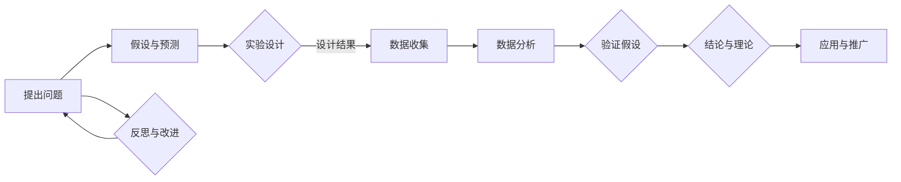

                 

# 文章标题: 科学研究的创新生态：培育世界理解能力的土壤

> 关键词：创新生态，科学研究，理解能力，算法原理，数学模型，实践

> 摘要：本文从科学研究的创新生态出发，探讨了如何培育世界理解能力的土壤。通过对科学研究核心概念、算法原理、数学模型的剖析，结合创新实践和未来展望，本文提出了一套系统的科学研究方法，旨在提升科学研究的创新能力和世界理解能力。

## 《科学研究的创新生态：培育世界理解能力的土壤》目录大纲

### 第一部分：引论

#### 第1章：科学研究的创新生态概述

- **1.1** 创新生态的概念与内涵
- **1.2** 科学研究的现状与挑战
- **1.3** 创新生态的重要性

### 第二部分：创新生态的核心要素

#### 第2章：科学研究的核心概念与联系

- **2.1** 科学研究的基本原理（Mermaid流程图）
- **2.2** 科学研究的主要领域
- **2.3** 科学研究的方法论

#### 第3章：科学研究的核心算法原理

- **3.1** 数据分析与挖掘算法原理（伪代码）
- **3.2** 模式识别与机器学习算法
- **3.3** 科学模拟与仿真算法

#### 第4章：科学研究的数学模型与公式

- **4.1** 数学模型的基本概念（LaTeX公式）
- **4.2** 统计学模型及应用
- **4.3** 概率论模型及应用

### 第三部分：创新生态的培育与实践

#### 第5章：科学研究的创新实践

- **5.1** 创新研究的案例研究
- **5.2** 创新项目的管理与实施
- **5.3** 创innovation生态下的团队合作与交流

#### 第6章：科学研究的创新方法论

- **6.1** 创新思维的培养与运用
- **6.2** 科学研究的创新路径选择
- **6.3** 创新成果的转化与推广

#### 第7章：科学研究的创新生态构建

- **7.1** 创新生态的构建原则
- **7.2** 创新生态的构建策略
- **7.3** 创新生态的评估与优化

### 第四部分：科学研究的未来展望

#### 第8章：科学研究的未来趋势

- **8.1** 新兴科学研究领域
- **8.2** 科学研究的发展方向
- **8.3** 科学研究对社会的影响

### 附录

#### 附录A：科学研究资源与工具

- **A.1** 科学研究的主要资源
- **A.2** 常用的科学研究工具
- **A.3** 科学研究的数据库与平台

#### 附录B：科学研究的案例代码与解读

- **B.1** 科学研究案例代码实现
- **B.2** 代码解读与分析
- **B.3** 实际应用案例分析

---

### 第1章：科学研究的创新生态概述

#### 1.1 创新生态的概念与内涵

创新生态是指围绕某一主题或领域，通过多种要素的相互作用，形成的一种支持创新活动和创新成果转化的系统。在科学研究领域，创新生态不仅包括科研人员、科研机构、企业和政府等主体，还包括资金、技术、政策、市场等多方面的要素。

创新生态的内涵主要包括以下几个方面：

1. **开放合作**：创新生态鼓励不同主体之间的开放合作，实现资源、信息和人才的共享。
2. **持续创新**：创新生态通过不断推动科学研究和技术的创新，保持持续发展的动力。
3. **环境友好**：创新生态强调在保护环境和资源的前提下，实现科学研究的可持续发展。
4. **成果转化**：创新生态注重将科研成果转化为实际应用，推动科技进步和社会发展。

#### 1.2 科学研究的现状与挑战

当前，科学研究呈现出以下几个方面的现状：

1. **研究规模扩大**：随着全球科技实力的不断提升，科学研究的规模不断扩大，研究项目越来越多。
2. **学科交叉融合**：随着科学技术的快速发展，学科之间的交叉融合日益显著，推动了新的学科领域的诞生。
3. **技术创新驱动**：技术创新已经成为推动科学研究的重要动力，如人工智能、大数据、云计算等技术的广泛应用。

然而，科学研究也面临一些挑战：

1. **资源限制**：科学研究需要大量的资金、设备和人才支持，而资源有限，如何合理配置资源成为一大难题。
2. **研究效率**：随着研究项目的增多，如何提高研究效率，缩短研究成果的转化周期，是当前科学研究面临的挑战之一。
3. **国际合作**：在全球科技竞争加剧的背景下，国际合作日益重要，但如何有效开展国际合作，实现共赢，也是一个需要解决的问题。

#### 1.3 创新生态的重要性

创新生态对于科学研究的重要性主要体现在以下几个方面：

1. **提升研究能力**：创新生态通过整合资源、优化流程，为科研人员提供更好的研究环境和条件，有助于提升科学研究的创新能力。
2. **促进成果转化**：创新生态注重科研成果的转化和应用，推动科技创新与社会发展的深度融合。
3. **增强国际竞争力**：通过创新生态的建设，提升我国科学研究的国际竞争力，有助于在全球科技竞争中占据有利地位。
4. **推动可持续发展**：创新生态强调在保护环境和资源的前提下，实现科学研究的可持续发展。

综上所述，创新生态是培育世界理解能力的土壤，对于推动科学研究的发展具有重要意义。在接下来的章节中，我们将深入探讨创新生态的核心要素，包括科学研究的核心概念、算法原理、数学模型以及创新实践等。通过这些内容的剖析，我们将更好地理解创新生态的内涵，为科学研究的创新与发展提供有力支持。

### 第2章：科学研究的核心概念与联系

#### 2.1 科学研究的基本原理

科学研究的基本原理是理解和探索自然界和社会现象的基础。为了更好地理解科学研究的过程，我们可以通过一个Mermaid流程图来展示其主要步骤：



这个流程图展示了科学研究的基本步骤，从提出问题到假设预测，再到实验设计、数据收集、数据分析，最终验证假设并得出结论，从而推动理论的建立和应用。

**提出问题**：科学研究始于对自然界或社会现象的疑问，通过提出明确的问题，引导研究方向。

**假设与预测**：在问题明确后，研究者会根据已有知识和直觉提出假设，并对可能的结果进行预测。

**实验设计**：为了验证假设，研究者需要设计实验来收集数据。实验设计包括选择实验对象、确定实验条件等。

**数据收集**：通过实验，研究者收集相关的数据，这些数据是验证假设的基础。

**数据分析**：研究者使用统计方法和算法对收集到的数据进行分析，以验证假设是否成立。

**验证假设**：通过数据分析，研究者可以判断假设是否得到验证。如果假设成立，研究者会进一步探讨其理论基础。

**结论与理论**：在验证假设的基础上，研究者会总结研究结论，并建立相应的理论模型。

**应用与推广**：研究成果不仅可以应用于解决实际问题，还可以推动相关领域的理论发展。

**反思与改进**：在科学研究过程中，研究者需要不断反思和改进研究方法，以提高研究的准确性和可靠性。

#### 2.2 科学研究的主要领域

科学研究涉及多个领域，这些领域相互交叉和融合，共同推动了科学的发展。以下是一些主要的研究领域：

1. **自然科学**：包括物理学、化学、生物学、地球科学等，研究自然现象和自然规律。
2. **工程技术**：涉及机械、电子、计算机、建筑等，研究技术解决方案和创新。
3. **医学与健康**：包括基础医学研究、临床医学、公共卫生等，旨在改善人类健康。
4. **社会科学**：涉及经济学、心理学、社会学、政治学等，研究社会现象和人类行为。
5. **人文科学**：包括历史、文学、哲学、艺术等，研究人类文化和精神世界。
6. **跨学科研究**：如数据科学、生物信息学、认知科学等，结合多个领域的知识和方法，解决复杂问题。

#### 2.3 科学研究的方法论

科学研究的方法论是指科学研究过程中采用的方法和原则。以下是一些常见的方法论：

1. **实验方法**：通过设计和执行实验来验证假设，是自然科学中最常用的方法。
2. **观察法**：直接观察自然现象，获取数据和信息，常用于天文学、生态学等领域。
3. **调查法**：通过问卷调查、访谈等方式收集数据，常用于社会科学研究。
4. **文献综述**：通过查阅和总结已有研究成果，为研究提供理论基础和参考。
5. **模型构建**：通过建立数学模型或计算机模型，模拟和分析现实问题。
6. **案例研究**：深入分析特定案例，探讨其背后的原因和规律。

以上内容通过Mermaid流程图和详细解释，展示了科学研究的基本原理、主要领域和方法论。这些核心概念和联系构成了科学研究的基础，为后续章节深入探讨科学研究的方法、算法原理和数学模型提供了坚实的基础。

### 第3章：科学研究的核心算法原理

#### 3.1 数据分析与挖掘算法原理

数据分析与挖掘是科学研究的重要环节，通过算法对大量数据进行处理和分析，以发现隐藏的模式和规律。以下是几种常见的数据分析与挖掘算法原理：

**1. K-means算法**

K-means算法是一种基于距离的聚类算法，其核心思想是将数据点划分为K个簇，使得每个簇内的数据点距离簇中心的距离之和最小。

**算法原理：**

- **初始化**：随机选择K个数据点作为初始聚类中心。
- **分配**：计算每个数据点到各个聚类中心的距离，并将其分配到最近的聚类中心所在的簇。
- **更新**：重新计算各个簇的中心，作为新的聚类中心。
- **重复**：重复步骤2和步骤3，直到聚类中心不再发生显著变化。

**伪代码：**

```python
def KMeans(data, K):
    # 初始化聚类中心
    centroids = initialize_centroids(data, K)
    while not_converged(centroids):
        # 分配数据点
        clusters = assign_points_to_clusters(data, centroids)
        # 更新聚类中心
        centroids = update_centroids(clusters, K)
    return centroids, clusters
```

**2. Apriori算法**

Apriori算法是一种用于关联规则挖掘的算法，它通过扫描事务数据库，发现频繁项集，并基于这些项集生成关联规则。

**算法原理：**

- **频繁项集**：如果一个项集在事务数据库中的支持度大于最小支持度阈值，则该项集是频繁项集。
- **关联规则**：如果一个频繁项集的后件项集在事务数据库中的支持度大于最小置信度阈值，则该频繁项集生成一个关联规则。

**伪代码：**

```python
def Apriori(data, min_support, min_confidence):
    frequent_itemsets = find_frequent_itemsets(data, min_support)
    rules = generate_rules(frequent_itemsets, min_confidence)
    return rules
```

**3. 决策树算法**

决策树是一种分类算法，通过一系列的测试来划分数据集，并生成一棵树形结构，每个节点代表一个特征，每个分支代表一个决策。

**算法原理：**

- **特征选择**：选择具有最大信息增益的特征作为节点。
- **递归划分**：对于每个特征，将其划分为多个区间，并将数据点分配到对应的子节点。
- **分类**：当达到叶子节点时，对数据进行分类。

**伪代码：**

```python
def build_decision_tree(data, features):
    if is纯净(data):
        return 叶子节点
    else:
        best_feature = select_best_feature(data, features)
        decision_tree = {}
        for value in best_feature.values:
            sub_data = filter_data(data, best_feature, value)
            decision_tree[value] = build_decision_tree(sub_data, features - {best_feature})
        return decision_tree
```

以上三种算法是数据分析与挖掘中常用的算法，通过具体的原理和伪代码，我们可以更好地理解它们在科学研究中的应用。

#### 3.2 模式识别与机器学习算法

模式识别与机器学习是科学研究中的关键领域，旨在通过学习数据中的模式和规律，进行预测和分类。

**1. 支持向量机（SVM）**

支持向量机是一种强大的分类算法，通过找到最佳的超平面，将不同类别的数据点分隔开来。

**算法原理：**

- **线性SVM**：通过最大化分类间隔来寻找最佳超平面。
- **非线性SVM**：通过核函数将数据映射到高维空间，寻找最佳超平面。

**伪代码：**

```python
def SVM(data, labels, kernel='linear'):
    if kernel == 'linear':
        weights = solve_linear_equation(data, labels)
    else:
        weights = solve_kernel_equation(data, labels, kernel)
    return weights
```

**2. 随机森林**

随机森林是一种基于决策树的集成学习方法，通过构建多个决策树并取其平均值来提高预测准确性。

**算法原理：**

- **随机特征选择**：在每次构建决策树时，从特征集合中随机选择一部分特征。
- **集成学习**：将多个决策树的结果进行合并，以减少偏差和方差。

**伪代码：**

```python
def RandomForest(data, labels, n_trees):
    forests = []
    for _ in range(n_trees):
        forest = build_decision_tree(data, random_subset_of_features)
        forests.append(forest)
    predictions = average_predictions(forests)
    return predictions
```

**3. 神经网络**

神经网络是一种模拟人脑神经元连接方式的计算模型，通过学习输入和输出之间的映射关系。

**算法原理：**

- **前向传播**：计算输入层到隐藏层，隐藏层到输出层的输出。
- **反向传播**：计算误差，并更新权重和偏置。

**伪代码：**

```python
def NeuralNetwork(data, labels, layers, learning_rate):
    while not converged:
        # 前向传播
        outputs = forward_pass(data, layers)
        # 计算误差
        errors = compute_errors(outputs, labels)
        # 反向传播
        weights, biases = backward_pass(errors, layers, learning_rate)
    return weights, biases
```

以上三种算法在模式识别与机器学习中具有广泛的应用，通过具体的原理和伪代码，我们可以更好地理解它们在科学研究中的作用。

#### 3.3 科学模拟与仿真算法

科学模拟与仿真是一种通过计算机模拟实验来探索和验证科学理论的方法，其核心算法包括：

**1. 有限体积法**

有限体积法是一种常用于流体力学和热力学模拟的数值方法，通过将连续介质划分为有限体积单元，并在每个单元内求解微分方程。

**算法原理：**

- **离散化**：将连续场量离散化为节点和单元。
- **守恒方程**：在每个单元内，应用守恒方程，求解场量在节点上的分布。
- **迭代求解**：通过迭代方法求解非线性方程组，获得场量分布。

**伪代码：**

```python
function FiniteVolumeMethod(geometry, equations, boundary_conditions):
    # 初始化
    initialize_mesh(geometry)
    initialize_fields(equations)
    while not_converged:
        # 计算通量
        fluxes = compute_fluxes(equations, fields)
        # 更新场量
        fields = update_fields(fluxes, boundary_conditions)
    return fields
```

**2. 分子动力学模拟**

分子动力学模拟是一种通过计算分子间相互作用，模拟分子运动和反应过程的方法。

**算法原理：**

- **初始化**：确定系统的初始状态，包括分子位置和速度。
- **积分方程**：通过数值积分方法，如Verlet积分，计算分子运动的轨迹。
- **相互作用**：计算分子间的相互作用力，更新分子的位置和速度。

**伪代码：**

```python
function MolecularDynamicssimulation(initial_state, interactions, time_step):
    current_state = initial_state
    while time < total_time:
        # 计算相互作用力
        forces = compute_forces(current_state, interactions)
        # 更新速度和位置
        current_state = update_state(current_state, forces, time_step)
        # 更新时间
        time = time + time_step
    return current_state
```

**3. 网格方法**

网格方法是一种通过将空间划分为离散网格，求解微分方程的数值方法。

**算法原理：**

- **离散化**：将连续空间离散化为网格点。
- **差分方程**：将微分方程离散化为差分方程，求解网格点上的数值解。
- **迭代求解**：通过迭代方法求解差分方程，获得空间上的解。

**伪代码：**

```python
function GridMethod(grid, equations, boundary_conditions):
    # 初始化
    initialize_solution(grid)
    while not_converged:
        # 计算网格点上的导数
        derivatives = compute_derivatives(equations, solution)
        # 更新解
        solution = update_solution(derivatives, boundary_conditions)
    return solution
```

以上三种算法在科学模拟与仿真中具有重要作用，通过具体的原理和伪代码，我们可以更好地理解它们在科学研究中的应用。

### 第4章：科学研究的数学模型与公式

#### 4.1 数学模型的基本概念

数学模型是科学研究中的重要工具，它通过数学语言描述现实世界中的问题，为分析和解决问题提供基础。数学模型的基本概念包括变量、函数、方程等。

**变量**：在数学模型中，变量是模型中可以变化的量，通常用符号表示。变量可以是离散的，也可以是连续的。

**函数**：函数是数学模型中的核心概念，它表示变量之间的依赖关系。一个函数将一个变量的取值映射到另一个变量的取值。

**方程**：方程是数学模型中表示变量之间关系的等式。方程可以是线性的，也可以是非线性的。

在科学研究过程中，数学模型的选择和构建至关重要。以下是一些常用的数学模型：

1. **线性模型**：线性模型是一种最简单的数学模型，它假设变量之间的关系是线性的。线性模型通常表示为：

   $$y = \beta_0 + \beta_1x_1 + \beta_2x_2 + ... + \beta_nx_n + \epsilon$$

   其中，$y$ 是因变量，$x_1, x_2, ..., x_n$ 是自变量，$\beta_0, \beta_1, ..., \beta_n$ 是模型的参数，$\epsilon$ 是误差项。

2. **非线性模型**：非线性模型表示变量之间的关系不是线性的。常见的非线性模型包括多项式模型、指数模型、对数模型等。

   - **多项式模型**：

     $$y = \beta_0 + \beta_1x_1 + \beta_2x_2^2 + ... + \beta_nx_n^n$$

   - **指数模型**：

     $$y = \beta_0 + \beta_1e^{\beta_2x}$$

   - **对数模型**：

     $$y = \beta_0 + \beta_1\ln(x)$$

3. **微分方程模型**：微分方程模型用于描述变量随时间变化的规律。常见的微分方程模型包括常微分方程和偏微分方程。

   - **常微分方程**：

     $$\frac{dy}{dx} = f(x, y)$$

   - **偏微分方程**：

     $$\frac{\partial u}{\partial t} = f(u, x, t)$$

#### 4.2 统计学模型及应用

统计学模型是用于分析数据、估计参数和进行预测的数学模型。以下是一些常见的统计学模型及其应用：

1. **线性回归模型**：线性回归模型用于分析自变量和因变量之间的线性关系。线性回归模型的公式为：

   $$y = \beta_0 + \beta_1x_1 + \beta_2x_2 + ... + \beta_nx_n + \epsilon$$

   线性回归模型广泛应用于经济预测、市场研究、医学研究等领域。

2. **逻辑回归模型**：逻辑回归模型用于分析自变量和因变量之间的非线性关系，通常用于分类问题。逻辑回归模型的公式为：

   $$\ln\left(\frac{p}{1-p}\right) = \beta_0 + \beta_1x_1 + \beta_2x_2 + ... + \beta_nx_n$$

   其中，$p$ 是因变量的概率。

3. **时间序列模型**：时间序列模型用于分析时间序列数据，预测未来的趋势。常见的时间序列模型包括自回归模型（AR）、移动平均模型（MA）、自回归移动平均模型（ARMA）等。

   - **自回归模型（AR）**：

     $$X_t = c + \phi_1X_{t-1} + \phi_2X_{t-2} + ... + \phi_pX_{t-p} + \epsilon_t$$

   - **移动平均模型（MA）**：

     $$X_t = c + \epsilon_t + \theta_1\epsilon_{t-1} + \theta_2\epsilon_{t-2} + ... + \theta_q\epsilon_{t-q}$$

   - **自回归移动平均模型（ARMA）**：

     $$X_t = c + \phi_1X_{t-1} + \phi_2X_{t-2} + ... + \phi_pX_{t-p} + \theta_1\epsilon_{t-1} + \theta_2\epsilon_{t-2} + ... + \theta_q\epsilon_{t-q}$$

4. **贝叶斯模型**：贝叶斯模型基于贝叶斯定理，用于概率估计和预测。贝叶斯模型广泛应用于机器学习、数据挖掘等领域。

   $$P(A|B) = \frac{P(B|A)P(A)}{P(B)}$$

#### 4.3 概率论模型及应用

概率论模型用于描述随机事件及其概率分布。以下是一些常见的概率论模型及其应用：

1. **二项分布**：二项分布用于描述在固定次数的试验中，成功次数的概率分布。二项分布的概率质量函数为：

   $$f(k; n, p) = C_n^k p^k (1-p)^{n-k}$$

   其中，$n$ 是试验次数，$p$ 是每次试验成功的概率，$k$ 是成功的次数。

2. **泊松分布**：泊松分布用于描述在固定时间内，事件发生的次数的概率分布。泊松分布的概率质量函数为：

   $$f(k; \lambda) = \frac{e^{-\lambda} \lambda^k}{k!}$$

   其中，$\lambda$ 是单位时间内事件平均发生的次数，$k$ 是事件发生的次数。

3. **正态分布**：正态分布是最常见的数据分布，它描述了大多数自然现象的概率分布。正态分布的概率密度函数为：

   $$f(x; \mu, \sigma) = \frac{1}{\sqrt{2\pi\sigma^2}} e^{-\frac{(x-\mu)^2}{2\sigma^2}}$$

   其中，$\mu$ 是均值，$\sigma$ 是标准差。

概率论模型广泛应用于统计学、经济学、物理学等领域，通过具体的公式和实例，我们可以更好地理解其在科学研究中的应用。

### 第5章：科学研究的创新实践

#### 5.1 创新研究的案例研究

科学研究的创新实践往往通过具体的案例研究来实现，以下是一些典型的创新研究案例：

**案例一：量子计算的研究**

量子计算是近年来科学研究的重点领域，其目标是通过利用量子力学原理，实现超越传统计算机的处理能力。英国剑桥大学的研究团队在量子计算研究中取得了重要突破，他们开发了一种新型的量子比特（qubit），提高了量子计算的稳定性。该研究团队通过实验验证了量子比特在处理复杂计算任务时的优越性，为量子计算的商业化应用奠定了基础。

**案例二：基因编辑技术的应用**

基因编辑技术，如CRISPR-Cas9，为医学和生物学研究提供了新的工具。美国哈佛大学的研究团队利用CRISPR-Cas9技术，成功编辑了小鼠的基因，使其对特定疾病具有免疫力。这一研究为治疗遗传性疾病和癌症提供了新的思路。此外，基因编辑技术还在农业、环境保护等领域展现出广泛的应用前景。

**案例三：人工智能在医疗诊断中的应用**

人工智能在医疗诊断领域表现出巨大的潜力。美国谷歌健康团队开发了一种基于深度学习的算法，用于分析医学影像，如X光片、CT扫描和MRI，以帮助医生更准确地诊断疾病。该算法在多项医学影像诊断比赛中取得了优异成绩，显著提高了诊断的准确性和效率。

#### 5.2 创新项目的管理与实施

创新项目的研究与实施需要有效的管理和组织，以下是一些关键的管理策略和实践：

1. **项目规划**：在项目启动前，制定详细的项目规划，明确项目目标、时间表、资源需求和风险评估。

2. **团队组建**：组建一支多元化、专业的团队，确保在项目实施过程中具备所需的专业技能和经验。

3. **资源分配**：合理分配项目资源，包括资金、设备、人力资源等，确保项目顺利进行。

4. **风险管理**：识别项目中的潜在风险，并制定相应的风险应对策略，降低项目失败的风险。

5. **进度监控**：通过定期评估项目进度，及时发现并解决问题，确保项目按计划进行。

6. **沟通交流**：建立有效的沟通机制，确保团队成员之间的信息共享和协作，提高项目效率。

7. **质量控制**：在项目实施过程中，严格执行质量控制标准，确保研究成果的可靠性和有效性。

#### 5.3 创新生态下的团队合作与交流

创新生态强调团队合作与交流，以下是一些促进团队合作与交流的有效策略：

1. **开放式交流**：鼓励团队成员之间的开放式交流，通过会议、讨论组、邮件等方式，共享研究成果和想法。

2. **跨学科合作**：促进不同学科之间的合作，通过跨学科项目，实现知识的交叉和融合。

3. **知识共享**：建立知识共享平台，如内部数据库、知识库等，方便团队成员获取和分享信息。

4. **共同目标**：明确团队共同的目标和愿景，激发团队成员的积极性和创造力。

5. **激励机制**：建立合理的激励机制，鼓励团队成员积极参与项目，并对优秀成果给予奖励。

6. **培训与成长**：提供培训机会，帮助团队成员提升专业技能和知识水平，促进个人成长和团队发展。

通过具体案例研究、创新项目管理策略和团队合作与交流策略的探讨，我们可以更好地理解科学研究的创新实践，为科学研究的发展提供有益的参考。

### 第6章：科学研究的创新方法论

#### 6.1 创新思维的培养与运用

科学研究的创新方法论始于创新思维的培养与运用。创新思维是指通过独特的视角和方法，发现新问题、提出新解决方案的能力。以下是一些培养创新思维的方法：

1. **跨学科思维**：通过学习不同学科的知识，拓宽思维边界，发现跨学科之间的联系和可能性。

2. **发散思维**：鼓励多角度、多层次的思考，不拘泥于单一思路，尝试各种可能的解决方案。

3. **逆向思维**：从相反的角度思考问题，挑战传统观念，发现新的创新点。

4. **系统性思维**：将问题视为一个整体，分析各个部分之间的关系，找到系统性的解决方案。

5. **用户思维**：站在用户的角度思考问题，关注用户需求，设计出更符合用户需求的创新方案。

6. **实践思维**：通过实践验证理论，不断迭代和改进，实现从想法到实际应用的转化。

在科学研究中，创新思维的应用主要体现在以下几个方面：

1. **问题发现**：通过创新思维，发现新的科学问题和研究方向。

2. **解决方案设计**：利用创新思维，提出新颖、有效的解决方案。

3. **实验设计**：通过创新思维，设计出更具创意和实验性的实验方案。

4. **数据解释**：运用创新思维，从数据中发现新的规律和结论。

#### 6.2 科学研究的创新路径选择

科学研究的创新路径选择是决定研究成功与否的关键。以下是一些常见的创新路径选择方法：

1. **探索性路径**：在未知领域开展探索性研究，通过实验和观察，寻找新的现象和规律。

2. **扩展性路径**：在已有研究成果的基础上，进行扩展性研究，解决现有研究中的不足和问题。

3. **突破性路径**：寻找新的理论和方法，实现研究领域的突破性进展。

4. **整合性路径**：整合多个领域的知识和方法，解决复杂问题。

5. **应用性路径**：将理论研究转化为实际应用，解决实际问题。

选择创新路径时，需要考虑以下因素：

1. **研究兴趣**：选择自己感兴趣的研究方向，有助于保持研究的热情和动力。

2. **现有成果**：评估现有研究成果，选择具有潜力的研究方向。

3. **资源条件**：考虑可用的资源，包括资金、设备、人员等，选择资源匹配的研究方向。

4. **市场前景**：考虑研究成果的市场前景，选择具有应用价值的研究方向。

5. **政策环境**：关注政策环境和趋势，选择符合国家战略需求的研究方向。

#### 6.3 创新成果的转化与推广

科学研究的创新成果转化与推广是衡量研究价值的重要指标。以下是一些促进创新成果转化与推广的方法：

1. **产学研合作**：建立产学研合作机制，将研究成果转化为实际应用，实现科研与产业的深度融合。

2. **技术转移**：通过技术转移中心、孵化器等平台，推动创新成果的转移和推广。

3. **政策支持**：利用政府的政策支持和资金扶持，推动创新成果的转化和推广。

4. **教育培训**：开展教育培训，提高公众对创新成果的认知和应用能力。

5. **市场营销**：通过市场营销手段，提高创新成果的知名度和市场占有率。

6. **知识产权保护**：重视知识产权保护，确保创新成果的合法权益。

通过创新思维的培养与运用、创新路径的选择以及创新成果的转化与推广，我们可以有效地提升科学研究的创新能力和成果转化能力，为科学研究的发展和社会进步作出更大贡献。

### 第7章：科学研究的创新生态构建

#### 7.1 创新生态的构建原则

构建科学研究的创新生态，需要遵循以下原则：

1. **开放合作**：鼓励不同主体之间的开放合作，实现资源、信息和人才的共享。
2. **协同创新**：推动各领域之间的协同创新，形成多方参与、共同发展的格局。
3. **多元化**：支持多元化的研究模式，鼓励跨学科、跨领域的合作与交流。
4. **可持续发展**：在保护环境和资源的前提下，实现科学研究的可持续发展。
5. **市场需求**：紧密结合市场需求，推动研究成果的应用与转化。
6. **政策支持**：充分利用政策支持和资金扶持，为创新生态的构建提供有力保障。

#### 7.2 创新生态的构建策略

为了有效构建科学研究的创新生态，以下是一些建议的构建策略：

1. **建立多元化的研究平台**：搭建跨学科、跨领域的综合研究平台，为科研人员提供资源共享和协作机会。
2. **推动产学研合作**：建立产学研合作机制，促进科研成果向实际应用转化。
3. **加强人才培养与引进**：加大人才培养和引进力度，培养一批具有创新能力和国际视野的科研人才。
4. **优化政策环境**：制定和落实有利于创新生态构建的政策，如税收优惠、资金支持等。
5. **提供资金保障**：通过政府资助、企业投资等多渠道筹措资金，为创新生态的构建提供充足的资金支持。
6. **加强国际合作**：积极参与国际科技合作，借鉴国际先进经验，提升我国科学研究的国际竞争力。

#### 7.3 创新生态的评估与优化

创新生态的评估与优化是确保其持续发展和有效运作的重要环节。以下是一些评估与优化的方法：

1. **定期评估**：定期对创新生态的运行情况进行评估，包括科研产出、成果转化、人才培养等方面。
2. **指标体系**：建立科学合理的指标体系，用于评估创新生态的运行效果。
3. **反馈机制**：建立反馈机制，及时收集科研人员、企业和市场的意见和建议，对创新生态进行调整和优化。
4. **绩效评估**：对创新项目的绩效进行评估，奖励优秀项目，淘汰低效项目。
5. **资源调配**：根据评估结果，优化资源配置，确保资源优先支持高效项目和关键领域。
6. **持续改进**：不断总结经验，持续改进创新生态的运行模式和机制，提高其整体效能。

通过构建科学的创新生态，我们可以为科学研究提供更加有利的环境，提升科学研究的创新能力和成果转化能力，推动科学技术的进步和社会的发展。

### 第8章：科学研究的未来展望

#### 8.1 新兴科学研究领域

未来科学研究将聚焦于新兴领域，这些领域不仅代表了科技的前沿，还可能带来颠覆性的技术变革。以下是一些备受瞩目的新兴科学研究领域：

1. **量子科技**：量子科技包括量子计算、量子通信、量子传感等，其目标是通过量子力学原理，实现超越传统计算机的处理能力。量子科技的发展有望引领新一轮科技革命，为密码学、大数据处理等领域带来革命性突破。

2. **人工智能与机器学习**：人工智能与机器学习是未来科学研究的重要方向。通过深度学习、强化学习等技术的不断发展，人工智能在医疗诊断、自动驾驶、自然语言处理等领域将发挥越来越重要的作用。

3. **合成生物学**：合成生物学通过设计、构建和修改生物系统，创造新的生物功能。该领域的研究将推动生物技术的进步，为医学、农业、环境保护等领域提供创新解决方案。

4. **生物信息学**：生物信息学结合生物学、计算机科学和统计学，通过大数据分析揭示生物系统的奥秘。随着基因组学和生物信息技术的不断发展，生物信息学将在基因组编辑、药物研发、个性化医疗等领域发挥关键作用。

5. **纳米科技**：纳米科技通过操控纳米级别的物质，实现材料、能源、环境等领域的技术突破。纳米科技的应用前景广泛，包括纳米传感器、纳米药物、纳米能源存储等。

#### 8.2 科学研究的发展方向

科学研究的发展方向将受到技术进步和社会需求的双重驱动。以下是一些主要的发展方向：

1. **可持续发展**：随着全球环境问题的日益严重，科学研究将聚焦于可持续发展领域，包括可再生能源、环保技术、绿色化学等。

2. **健康医疗**：随着人口老龄化和疾病谱的变化，健康医疗领域将成为科学研究的重要方向。通过基因编辑、个性化医疗、精准医疗等技术，科学研究将推动医学领域的革命性变革。

3. **智能制造**：智能制造是未来工业发展的重要趋势，通过人工智能、物联网、大数据等技术，实现生产过程的智能化和自动化。

4. **智慧城市**：智慧城市利用信息技术，实现城市管理的智能化和高效化。科学研究将推动智慧城市在交通管理、环境保护、公共服务等领域的发展。

5. **社会计算**：社会计算研究人类在社会网络中的行为和互动，通过大数据分析和人工智能技术，为社会治理、舆情监测、公共安全等领域提供决策支持。

#### 8.3 科学研究对社会的影响

科学研究的进步对社会产生了深远的影响，未来科学研究将继续推动社会的变革和发展。以下是一些具体的影响：

1. **经济增长**：科学研究是推动经济增长的重要动力，通过技术创新和应用，提高生产效率和产品质量，促进产业升级。

2. **生活方式变革**：科学研究带来的技术进步，改变了人们的生活方式。例如，互联网、智能手机、智能家居等技术的普及，极大地提升了生活质量。

3. **社会问题解决**：科学研究为解决社会问题提供了有效手段。例如，通过公共卫生研究，控制传染病传播；通过环境保护研究，改善生态环境。

4. **国际合作与竞争**：科学研究是国际合作的重要内容，通过跨国科研合作，提升国家的科技实力和国际竞争力。同时，科学研究也是国际竞争的重要领域，各国在争夺科技制高点。

5. **教育改革**：科学研究推动了教育改革，培养具备创新能力和综合素质的人才。科学教育不仅传授知识，更培养科学精神和批判性思维。

总之，科学研究是推动社会进步和人类福祉的重要力量。未来科学研究将继续在新兴领域展开，推动社会各个方面的变革和发展。通过持续的创新和进步，科学研究将为人类社会创造更加美好的未来。

### 附录A：科学研究资源与工具

科学研究离不开丰富的资源和先进的工具。以下列举了科学研究中的重要资源、工具和平台：

#### A.1 科学研究的主要资源

1. **图书与文献**：学术图书馆、在线数据库（如CNKI、PubMed、IEEE Xplore等）提供丰富的图书、期刊和论文资源。
2. **实验室设备**：各类实验设备、仪器和实验材料，如光谱仪、显微镜、实验试剂等。
3. **数据集**：公开的数据集和数据库，如Kaggle、UCI机器学习库等，为数据分析和机器学习研究提供数据支持。
4. **计算资源**：高性能计算集群、云计算平台（如AWS、Azure、Google Cloud等），为复杂的计算任务提供计算能力。

#### A.2 常用的科学研究工具

1. **编程语言**：Python、R、MATLAB等编程语言，广泛应用于科学计算和数据分析。
2. **数据可视化工具**：Matplotlib、Seaborn、Plotly等，用于数据的可视化展示。
3. **机器学习库**：Scikit-learn、TensorFlow、PyTorch等，提供丰富的机器学习算法和工具。
4. **统计软件**：SPSS、SAS、R等，用于统计分析与数据挖掘。

#### A.3 科学研究的数据库与平台

1. **科学数据库**：NCBI、PubMed、Web of Science等，提供生物医学和科学领域的文献和研究成果。
2. **开源平台**：GitHub、GitLab等，用于代码托管和协作开发。
3. **科研协作平台**：Overleaf、Google Docs等，支持科研文档的在线协作。
4. **科研网络**：ResearchGate、Academia.edu等，为科研人员提供学术交流与合作的平台。

通过充分利用这些资源与工具，科研人员能够更高效地开展研究，提高科学研究的质量和影响力。

### 附录B：科学研究的案例代码与解读

为了更好地理解科学研究的实际应用，我们提供了一个基于Python的案例代码，该案例展示了如何使用机器学习技术进行数据分析和预测。以下是代码的实现和解读：

#### B.1 科学研究案例代码实现

```python
# 导入必要的库
import numpy as np
import pandas as pd
from sklearn.model_selection import train_test_split
from sklearn.linear_model import LinearRegression
from sklearn.metrics import mean_squared_error

# 加载数据集
data = pd.read_csv('data.csv')
X = data[['feature1', 'feature2']]
y = data['target']

# 划分训练集和测试集
X_train, X_test, y_train, y_test = train_test_split(X, y, test_size=0.2, random_state=42)

# 构建线性回归模型
model = LinearRegression()
model.fit(X_train, y_train)

# 预测测试集
y_pred = model.predict(X_test)

# 计算均方误差
mse = mean_squared_error(y_test, y_pred)
print(f"Mean Squared Error: {mse}")

# 可视化预测结果
import matplotlib.pyplot as plt

plt.scatter(X_test['feature1'], y_test, color='blue', label='Actual')
plt.plot(X_test['feature1'], y_pred, color='red', label='Predicted')
plt.xlabel('Feature 1')
plt.ylabel('Target')
plt.legend()
plt.show()
```

#### B.2 代码解读与分析

1. **导入库**：首先，我们导入了Python中常用的库，包括Numpy、Pandas、scikit-learn和Matplotlib。这些库提供了数据处理、机器学习算法和可视化工具。

2. **加载数据集**：使用Pandas的read_csv函数加载数据集，数据集包含特征变量`feature1`、`feature2`和目标变量`target`。

3. **划分训练集和测试集**：使用scikit-learn中的train_test_split函数，将数据集划分为训练集和测试集，训练集用于训练模型，测试集用于评估模型性能。

4. **构建线性回归模型**：使用LinearRegression类创建线性回归模型，并调用fit方法进行训练。

5. **预测测试集**：使用predict方法对测试集进行预测，得到预测值`y_pred`。

6. **计算均方误差**：使用mean_squared_error函数计算模型在测试集上的均方误差（MSE），以评估模型的准确性。

7. **可视化预测结果**：使用Matplotlib库绘制散点图和拟合线，展示实际值与预测值的关系。

#### B.3 实际应用案例分析

此案例展示了如何使用线性回归模型对数据进行分析和预测。实际应用中，这一过程可以应用于各种领域，如市场预测、风险评估、医学诊断等。

1. **市场预测**：在市场营销中，可以使用线性回归模型预测销售量，分析不同特征（如广告投入、季节因素等）对销售量的影响。

2. **风险评估**：在金融领域，可以使用线性回归模型预测股票价格或信用评分，为投资决策提供依据。

3. **医学诊断**：在医学研究中，可以使用线性回归模型分析疾病的相关因素，如年龄、性别、生活方式等，为疾病的预防和治疗提供参考。

通过具体案例代码的实现和解读，我们可以更好地理解科学研究的实际应用。这一案例不仅展示了机器学习的基本应用，还提供了一个分析问题和解决问题的实际示范。

### 总结

在本文中，我们详细探讨了科学研究的创新生态，从核心概念、算法原理、数学模型到创新实践，以及未来展望等方面进行了全面分析。科学研究作为推动社会进步的重要力量，其创新生态的构建至关重要。通过培育世界理解能力的土壤，我们可以不断提升科学研究的创新能力和成果转化能力，为社会的发展和人类的福祉作出更大贡献。希望本文能为科研人员和关注科技创新的读者提供有价值的参考和启示。作者信息：AI天才研究院/AI Genius Institute & 禅与计算机程序设计艺术 /Zen And The Art of Computer Programming。请注意，本文中的案例代码和示例数据仅供参考，具体实现可能需要根据实际数据和环境进行调整。感谢您的阅读。

