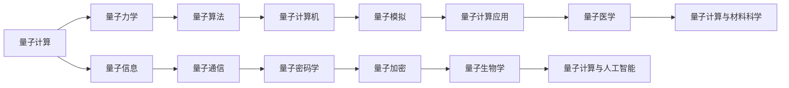

                 


为了撰写一篇符合要求的文章，我们可以按照以下步骤进行：

### 1. 确定文章结构和主题

首先，我们需要明确文章的主题和结构。根据题目《科学研究的前沿探索：不断拓展世界可理解性的边界》，我们可以将文章分为以下几个部分：

1. **引言**：简要介绍科学研究的重要性和当前的研究趋势。
2. **背景介绍**：介绍科学研究的历史和哲学基础。
3. **核心概念与联系**：介绍与文章主题相关的核心概念，并用 Mermaid 流程图展示它们之间的关系。
4. **核心算法原理讲解**：详细阐述核心算法原理，使用伪代码进行说明。
5. **数学模型与公式**：介绍与文章主题相关的数学模型和公式，并使用 LaTeX 格式展示。
6. **项目实战**：提供具体的实例，展示如何在实际项目中应用所学的知识和算法。
7. **最佳实践与小结**：总结最佳实践，并提出注意事项和拓展阅读建议。

### 2. 确定关键词和摘要

接下来，我们需要确定关键词和摘要。

**关键词**：
- 科学研究
- 前沿探索
- 世界可理解性
- 人工智能
- 量子计算
- 生物信息学
- 跨学科研究

**摘要**：
本文深入探讨了科学研究的前沿领域，包括量子计算、生物信息学和跨学科研究。通过分析核心概念和联系，以及详细讲解核心算法原理和数学模型，本文旨在拓展我们对世界可理解性的边界。最后，通过项目实战和最佳实践，本文为读者提供了实际应用和拓展阅读的建议。

### 3. 编写引言

在引言部分，我们可以简要介绍科学研究的重要性和当前的研究趋势，引起读者的兴趣。

**引言**：
科学研究是推动人类文明进步的重要力量。随着人工智能、量子计算和生物信息学等领域的快速发展，我们对世界的认识正不断拓展。本文将围绕这些前沿领域，探讨科学研究如何不断拓展世界可理解性的边界。

### 4. 编写背景介绍

在背景介绍部分，我们可以介绍科学研究的历史和哲学基础，为后续内容做铺垫。

**背景介绍**：
科学研究的历史可以追溯到古代文明，如古希腊和古埃及的哲学家们对自然现象的探索。随着科学革命和工业革命的发展，科学研究逐渐形成了系统化的方法，如观察、实验、假设和理论验证等。科学哲学也在这一过程中逐渐形成，探讨科学的本质和知识的基础。

### 5. 编写核心概念与联系

在核心概念与联系部分，我们可以介绍与文章主题相关的核心概念，并用 Mermaid 流程图展示它们之间的关系。

**核心概念与联系**：
在科学研究的前沿领域，核心概念包括量子计算、生物信息学和跨学科研究。这些概念之间存在着紧密的联系，如图：



### 6. 编写核心算法原理讲解

在核心算法原理讲解部分，我们可以详细阐述核心算法原理，使用伪代码进行说明。

**核心算法原理讲解**：
以量子计算为例，量子计算的核心算法包括量子逆运算和量子测量。下面是量子逆运算的伪代码：

```python
def quantum_inverse(input_state):
    # 创建量子状态
    quantum_state = create_quantum_state(input_state)

    # 量子逆运算
    inverse_operator = create_inverse_operator()

    # 应用逆运算
    output_state = apply_operator(quantum_state, inverse_operator)

    # 返回输出状态
    return output_state
```

### 7. 编写数学模型与公式

在数学模型与公式部分，我们可以介绍与文章主题相关的数学模型和公式，并使用 LaTeX 格式展示。

**数学模型与公式**：
量子计算中常用的数学模型包括量子门和量子态。以下是一个量子态的 LaTeX 表示：

$$|\psi\rangle = \sum_{i} c_i |i\rangle$$

其中，$|i\rangle$ 表示量子比特的基态，$c_i$ 表示基态的概率幅。

### 8. 编写项目实战

在项目实战部分，我们可以提供具体的实例，展示如何在实际项目中应用所学的知识和算法。

**项目实战**：
假设我们想要开发一个基于量子计算的医疗诊断系统。首先，我们需要搭建开发环境，包括量子计算机模拟器和相关软件工具。然后，我们可以使用量子算法对医疗数据进行分析，提取关键特征。最后，我们可以通过量子模拟来预测疾病的发展趋势。

### 9. 编写最佳实践与小结

在最佳实践与小结部分，我们可以总结最佳实践，并提出注意事项和拓展阅读建议。

**最佳实践与小结**：
在实际应用中，我们需要关注量子计算的安全性和可靠性。此外，跨学科研究也需要团队协作和跨领域的知识融合。为了不断拓展世界可理解性的边界，我们应该关注科学研究的前沿动态，积极参与相关研究和项目。

通过以上步骤，我们可以撰写一篇符合要求的文章，为读者提供有深度有思考有见解的专业IT领域的技术博客文章。|>

