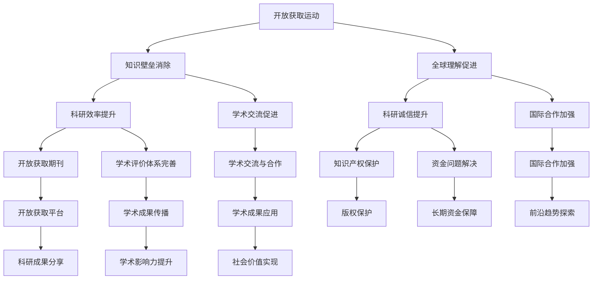

                 

### 文章标题

《科学研究的开放获取运动：消除知识壁垒，促进世界理解》

### 关键词

- 开放获取运动
- 科学研究
- 知识壁垒
- 全球理解
- 效率提升
- 学术交流
- 版权问题
- 国际合作
- 未来趋势

### 摘要

本文旨在探讨科学研究的开放获取运动，分析其在消除知识壁垒、促进全球理解方面的作用。首先，我们回顾了开放获取运动的背景与重要性，介绍了其实施方法。接着，我们探讨了开放获取对科研效率和学术交流的推动作用，并分析了其面临的挑战与解决方案。最后，我们展望了开放获取运动的未来趋势，分享了成功的实践案例，并讨论了其对学术发展的影响。通过这篇文章，我们希望读者能够更好地理解开放获取运动的重要性，以及其在促进科学研究全球理解方面的潜力。

### 《科学研究的开放获取运动：消除知识壁垒，促进世界理解》目录大纲

#### 第一部分：开放获取运动概述

**第1章：开放获取运动的背景与重要性**

- **1.1 开放获取运动的起源**：介绍开放获取运动的起源和发展历程。
- **1.2 开放获取与传统的知识壁垒**：分析开放获取运动如何消除知识壁垒。
- **1.3 开放获取运动的目标与价值**：阐述开放获取运动的目标和价值。
- **1.4 开放获取运动的全球发展现状**：总结全球开放获取运动的发展现状。

#### 第二部分：开放获取的实施方法

**第2章：开放获取期刊与平台**

- **2.1 开放获取期刊的发展历程**：回顾开放获取期刊的发展历程。
- **2.2 主要开放获取期刊与平台介绍**：介绍主要的开放获取期刊与平台。
- **2.3 开放获取期刊与平台的运作模式**：分析开放获取期刊与平台的运作模式。

#### 第三部分：开放获取对科研的影响

**第3章：开放获取对科研效率和学术交流的推动**

- **3.1 开放获取提高科研效率的机制**：探讨开放获取如何提高科研效率。
- **3.2 开放获取对学术交流的促进作用**：分析开放获取如何促进学术交流。
- **3.3 开放获取运动与科研诚信**：讨论开放获取运动对科研诚信的影响。

#### 第四部分：开放获取面临的挑战与解决方案

**第4章：开放获取运动中的版权与知识产权问题**

- **4.1 开放获取与版权保护**：分析开放获取与版权保护的关系。
- **4.2 知识产权在国际开放获取运动中的角色**：讨论知识产权在国际开放获取运动中的角色。
- **4.3 开放获取运动中的版权解决方案**：提出开放获取运动中的版权解决方案。

- **第5章：开放获取运动中的资金问题**

- **5.1 开放获取期刊的资助模式**：探讨开放获取期刊的资助模式。
- **5.2 政府与机构的资助策略**：分析政府与机构的资助策略。
- **5.3 开放获取运动的长期资金保障**：讨论开放获取运动的长期资金保障。

#### 第五部分：开放获取的未来趋势

**第6章：开放获取运动的前沿与发展方向**

- **6.1 开放获取运动的新趋势**：展望开放获取运动的新趋势。
- **6.2 开放获取与人工智能的结合**：讨论开放获取与人工智能的结合。
- **6.3 开放获取运动的国际合作**：分析开放获取运动的国际合作。

#### 第六部分：开放获取运动实践案例

**第7章：开放获取运动成功案例解析**

- **7.1 成功开放获取期刊与平台的案例分析**：分析成功开放获取期刊与平台。
- **7.2 开放获取运动在不同国家和地区的实践**：探讨开放获取运动在不同国家和地区的实践。
- **7.3 开放获取运动中的优秀实践与经验分享**：分享开放获取运动中的优秀实践与经验。

#### 第七部分：开放获取运动与学术发展

**第8章：开放获取运动对学术发展的影响**

- **8.1 开放获取运动对学术研究的影响**：分析开放获取运动对学术研究的影响。
- **8.2 开放获取运动与学术评价体系**：讨论开放获取运动与学术评价体系的关系。
- **8.3 开放获取运动对学术交流与合作的促进**：探讨开放获取运动对学术交流与合作的促进。

#### 附录

**附录A：开放获取运动相关资源与工具**

- **A.1 开放获取运动的相关网站与数据库**：列出开放获取运动的相关网站与数据库。
- **A.2 开放获取运动的重要报告与政策文件**：介绍开放获取运动的重要报告与政策文件。
- **A.3 开放获取运动的相关工具与软件**：介绍开放获取运动的相关工具与软件。

### Mermaid 流程图（核心概念与联系）



### 核心算法原理讲解

#### 预训练语言模型

## 预训练语言模型原理

预训练语言模型（Pre-trained Language Model，简称PLM）是一种大规模语言模型，通过在大量文本上进行预训练，学习语言的基本结构和语义信息。其基本原理可以分为两个阶段：预训练阶段和微调阶段。

### 预训练阶段

1. **数据集**：预训练语言模型通常使用大规模文本语料库，如维基百科、网页文章等。这些数据集包含各种主题和语言风格，有助于模型学习到多样化的语言特征。

2. **预训练任务**：预训练阶段通常包括两个子任务，即遮蔽语言模型（Masked Language Model，简称MLM）和上下文窗口（Next Sentence Prediction，简称NSP）。

   - **遮蔽语言模型（MLM）**：在输入的文本序列中，随机遮蔽一部分词，模型需要预测这些遮蔽词。例如，输入序列 "The quick brown fox jumps over the lazy dog"，遮蔽词 "quick" 后，模型需要预测遮蔽词。

   ```mermaid
   graph TD
   A[输入文本] --> B[遮蔽词]
   B --> C[模型预测]
   ```

   - **上下文窗口（NSP）**：给定两个连续的句子，模型需要预测第二个句子是否是第一个句子的上下文。例如，输入序列 "The weather is nice. It is a good day to go for a walk."，模型需要判断第二个句子是否是第一个句子的上下文。

   ```mermaid
   graph TD
   A[句子1] --> B[句子2]
   B --> C[模型预测上下文]
   ```

3. **模型架构**：预训练语言模型通常采用变体循环神经网络（Transformer）架构，具有大规模的参数和多层结构。Transformer 模型通过自注意力机制（Self-Attention）来捕捉输入文本中的长距离依赖关系，从而提高模型的语义理解能力。

### 微调阶段

1. **任务数据集**：微调阶段使用特定领域的任务数据集，如问答、文本分类、翻译等。这些数据集包含与目标任务相关的标签，用于指导模型在特定任务上的优化。

2. **微调方法**：在预训练模型的基础上，通过调整模型参数，使其适应特定领域的任务。微调过程中，通常采用迁移学习（Transfer Learning）方法，将预训练模型的知识迁移到新任务上，从而提高模型在新任务上的性能。

3. **评估指标**：微调阶段使用适当的评估指标，如准确率、召回率、F1分数等，来衡量模型在新任务上的表现。根据评估结果，进一步调整模型参数，以提高模型的性能。

### 核心算法原理讲解

#### 1. 预训练阶段

在预训练阶段，预训练语言模型（如BERT、GPT等）通过以下步骤进行训练：

1. **输入序列表示**：将输入的文本序列转换为词嵌入向量，每个词嵌入向量表示文本中的一个词。词嵌入向量通常通过预训练模型自动学习，可以捕获词的语义信息。

2. **自注意力机制**：使用自注意力机制（Self-Attention）对词嵌入向量进行加权，生成句子级别的表示。自注意力机制能够捕捉输入文本中的长距离依赖关系，从而提高模型的语义理解能力。

3. **前馈神经网络**：将自注意力机制生成的句子表示通过前馈神经网络进行处理，进一步提取句子的语义特征。

4. **输出表示**：将前馈神经网络输出的句子表示作为模型的输出，用于完成预训练任务（如MLM或NSP）。

伪代码如下：

```python
# 输入文本序列
input_sequence = "The quick brown fox jumps over the lazy dog"

# 将输入文本序列转换为词嵌入向量
word_embeddings = convert_to_embeddings(input_sequence)

# 使用自注意力机制进行句子表示
sentence_representation = self_attention(word_embeddings)

# 使用前馈神经网络进行句子特征提取
sentence_features = feedforward_network(sentence_representation)

# 输出句子表示
output_representation = sentence_features
```

#### 2. 微调阶段

在微调阶段，预训练语言模型通过以下步骤进行微调：

1. **加载预训练模型**：从预训练模型中加载已训练好的模型参数。

2. **任务数据集预处理**：对任务数据集进行预处理，如分词、标签编码等，以便模型能够理解任务数据。

3. **模型微调**：在任务数据集上对预训练模型进行微调，调整模型参数，使其适应特定领域的任务。微调过程中，通常冻结预训练模型的某些层，仅调整特定层的参数。

4. **评估模型性能**：使用适当的评估指标（如准确率、召回率、F1分数等）评估模型在微调任务上的性能。

5. **调整模型参数**：根据评估结果，进一步调整模型参数，以提高模型在任务上的性能。

伪代码如下：

```python
# 加载预训练模型
pretrained_model = load_pretrained_model()

# 预处理任务数据集
task_data = preprocess_task_data(task_dataset)

# 微调模型参数
for epoch in range(num_epochs):
    for data in task_data:
        # 前向传播
        outputs = pretrained_model(data)
        
        # 计算损失
        loss = compute_loss(outputs, labels)
        
        # 反向传播
        gradients = backward_propagation(pretrained_model, loss)
        
        # 更新模型参数
        update_model_parameters(pretrained_model, gradients)

# 评估模型性能
performance = evaluate_model(pretrained_model, test_dataset)

# 根据评估结果调整模型参数
if performance < desired_performance:
    # 调整模型参数
    adjust_model_parameters(pretrained_model)
```

通过预训练阶段和微调阶段，预训练语言模型能够学习到丰富的语言知识和语义信息，从而在多种自然语言处理任务上表现出强大的性能。这使得预训练语言模型成为当前自然语言处理领域的重要研究方向和应用技术。在实际应用中，预训练语言模型已经被广泛应用于文本分类、问答系统、机器翻译、情感分析等领域，并取得了显著的成果。随着预训练语言模型的不断发展和完善，其在科研、商业、教育等领域的影响也将进一步扩大。因此，深入研究预训练语言模型的原理和应用，对于推动人工智能技术的发展具有重要意义。未来，预训练语言模型将继续在自然语言处理领域发挥重要作用，为人类带来更多的创新和便利。

