                 


### 《科学研究的社会责任与世界可理解性的普及》

#### 关键词：科学研究、社会责任、伦理问题、科学普及、公众沟通、跨学科合作

> 摘要：本文探讨了科学研究的社会责任以及如何提高科学知识的普及程度，使其更加易于公众理解。文章首先阐述了科学研究的社会责任，包括道德和社会责任，以及国际法规与伦理准则。接着，文章分析了科学研究中的伦理问题，如数据隐私保护和动物实验的伦理审查。此外，文章还讨论了研究成果的公开与传播、科学研究与社会影响的互动以及科学传播的工具与平台。最后，文章提出了科学普及的跨学科合作和全球实践，展望了科学研究责任和可理解性的未来趋势。

---

### 第一部分：研究的社会责任

#### 第1章：研究的社会责任概述

##### 1.1 研究的道德和社会责任

**核心概念与联系**

- **社会责任**：科学研究不仅追求知识创新，还需要考虑对社会的影响。
- **道德规范**：科学研究应遵守伦理原则，保护研究对象的权益。

**Mermaid 流程图**

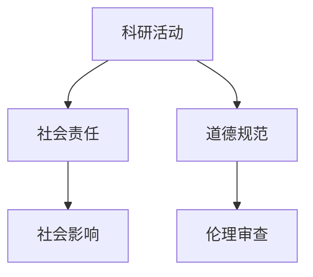

**核心算法原理讲解**

- **社会责任**：科学研究应考虑到其对社会的影响，如科技进步、经济发展、环境改善等。
- **道德规范**：科学研究需要遵循伦理原则，如公正性、尊重隐私等。

**数学模型和数学公式**

```latex
\text{社会责任度} = \frac{\text{社会影响}}{\text{研究投入}}
```

**举例说明**

- **案例研究**：某研究项目因未进行充分的伦理审查而受到社会批评。

**项目实战**

- **实战背景**：科研机构进行一项关于基因编辑的研究。
- **实战步骤**：
  1. 研究团队成员讨论研究的社会影响和道德问题。
  2. 制定伦理审查标准，包括保护参与者权益和数据隐私。
  3. 提交伦理审查申请，获得批准后进行研究。
  4. 研究结束后，发布研究报告，并进行公众沟通。

**最佳实践 tips**

- **注重伦理审查**：在研究初期就应考虑伦理问题，确保研究的道德合法。
- **透明公开**：研究成果应公开透明，让公众了解研究的进展和影响。

##### 1.2 研究责任的历史背景和演变

**核心概念与联系**

- **历史演变**：从早期的科学自由发展到现代的责任伦理，研究责任的定义和范围不断扩展。

**Mermaid 流程图**

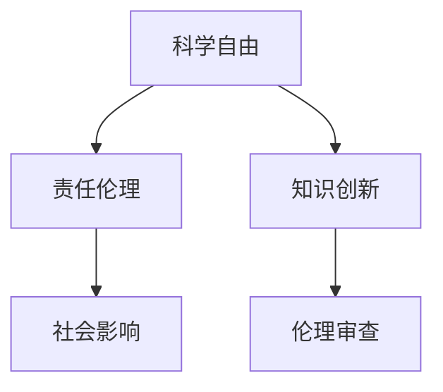

**核心算法原理讲解**

- **历史演变**：科学研究从追求个人兴趣和知识发展到关注社会影响和责任。
- **责任伦理**：科学研究需要承担更多的社会责任，包括伦理审查和公共利益。

**数学模型和数学公式**

```latex
\text{责任度} = \frac{\text{社会影响}}{\text{研究投入}}
```

**举例说明**

- **案例研究**：某研究项目因未进行充分的伦理审查而受到社会批评。

**项目实战**

- **实战背景**：科研机构进行一项关于基因编辑的研究。
- **实战步骤**：
  1. 研究团队成员讨论研究的社会影响和道德问题。
  2. 制定伦理审查标准，包括保护参与者权益和数据隐私。
  3. 提交伦理审查申请，获得批准后进行研究。
  4. 研究结束后，发布研究报告，并进行公众沟通。

**最佳实践 tips**

- **了解历史背景**：了解研究责任的历史背景，有助于更好地理解当前的伦理问题。
- **持续改进**：随着社会的发展和变化，研究责任也在不断演变，需要持续关注和改进。

##### 1.3 研究责任的国际法规与伦理准则

**核心概念与联系**

- **国际法规**：如《贝尔蒙特报告》和《赫尔辛基宣言》等，规定了研究的伦理审查和责任。
- **伦理准则**：研究机构和个人应遵循的伦理原则，包括公正性、尊重隐私等。

**Mermaid 流程图**

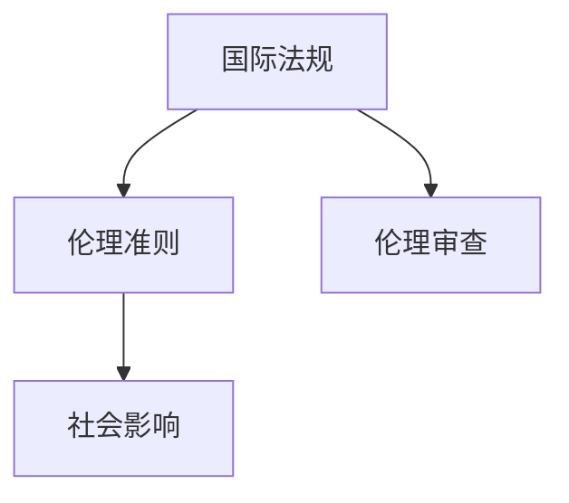

**核心算法原理讲解**

- **国际法规**：如《贝尔蒙特报告》和《赫尔辛基宣言》等，为科学研究提供了伦理审查和责任的标准。
- **伦理准则**：研究机构和个人应遵循的伦理原则，如公正性、尊重隐私等。

**数学模型和数学公式**

```latex
\text{法规符合度} = \frac{\text{符合法规的实践}}{\text{总实践}}
```

**举例说明**

- **案例研究**：某研究项目因未遵循国际法规而受到社会批评。

**项目实战**

- **实战背景**：科研机构进行一项关于基因编辑的研究。
- **实战步骤**：
  1. 研究团队成员学习《贝尔蒙特报告》和《赫尔辛基宣言》等国际法规和伦理准则。
  2. 根据法规和准则，制定伦理审查标准和流程。
  3. 提交伦理审查申请，获得批准后进行研究。
  4. 研究结束后，发布研究报告，并进行公众沟通。

**最佳实践 tips**

- **遵守国际法规和伦理准则**：确保研究符合国际法规和伦理准则，提高研究的可信度和影响力。
- **持续学习和改进**：随着法规和准则的更新，研究机构和科学家需要持续学习和改进。

---

### 第二部分：世界可理解性的普及

#### 第5章：科学与公众沟通

##### 5.1 公众对科学的理解

**核心概念与联系**

- **科学理解**：公众对科学的认知程度和接受度。
- **科学传播**：科学知识的传播方式和渠道。

**Mermaid 流程图**

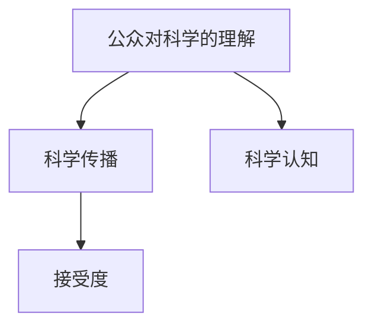

**核心算法原理讲解**

- **科学理解**：通过科学传播，提高公众对科学的认知和接受度。
- **科学传播**：采用多种传播方式，如媒体、网络、教育等，促进科学知识的普及。

**数学模型和数学公式**

```latex
\text{理解度} = \frac{\text{科学知识传播量}}{\text{总知识量}}
```

**举例说明**

- **案例研究**：某科普项目通过生动的实验和讲解，提高了公众对科学的兴趣和理解。

**项目实战**

- **实战背景**：某科研机构举办一场科普讲座。
- **实战步骤**：
  1. 研究公众需求，确定讲座主题。
  2. 邀请科学家进行讲座，制作生动有趣的演示。
  3. 在讲座后进行互动环节，解答公众的问题。
  4. 发布讲座视频和资料，便于公众进一步了解。

**最佳实践 tips**

- **针对性传播**：根据公众的兴趣和需求，选择合适的传播方式和渠道。
- **互动参与**：鼓励公众参与科学活动，提高他们的科学素养。

##### 5.2 科学家与公众的沟通策略

**核心概念与联系**

- **沟通策略**：科学家与公众进行有效沟通的方法和技巧。
- **科学普及**：通过沟通策略，提高公众对科学的理解和兴趣。

**Mermaid 流�程图**

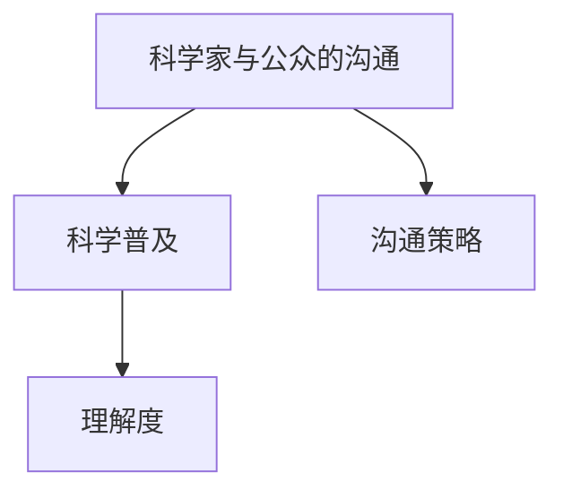

**核心算法原理讲解**

- **沟通策略**：采用通俗易懂的语言和案例，让公众更容易理解和接受科学知识。
- **科学普及**：通过多种形式的科学活动，如讲座、展览、实验等，让公众参与其中，提高他们的科学素养。

**数学模型和数学公式**

```latex
\text{沟通效果} = \frac{\text{公众参与度}}{\text{总参与度}}
```

**举例说明**

- **案例研究**：某科学家通过漫画和动画形式，将复杂的科学概念讲解得通俗易懂。

**项目实战**

- **实战背景**：某科研机构开展一项科普活动。
- **实战步骤**：
  1. 设计科普活动，包括讲座、展览、实验等。
  2. 邀请科学家担任主讲人，准备生动的演示。
  3. 在活动过程中，鼓励公众参与互动，提出问题。
  4. 活动结束后，收集反馈，持续改进科普活动。

**最佳实践 tips**

- **生动有趣**：使用多媒体和互动方式，让科普活动更生动有趣。
- **针对性设计**：根据公众的兴趣和需求，设计科普活动。

##### 5.3 科学传播的挑战与机遇

**核心概念与联系**

- **挑战**：科学传播过程中面临的困难和问题。
- **机遇**：随着科技的发展，科学传播的新的可能性和机会。

**Mermaid 流程图**

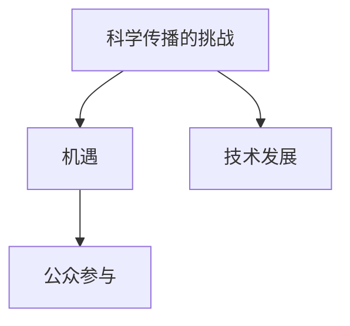

**核心算法原理讲解**

- **挑战**：科学知识的专业性和复杂性，使得公众理解存在困难。
- **机遇**：随着科技的发展，如互联网、社交媒体等，为科学传播提供了新的渠道和方式。

**数学模型和数学公式**

```latex
\text{传播效果} = \frac{\text{有效传播量}}{\text{总传播量}}
```

**举例说明**

- **案例研究**：某科普网站通过互动问答和在线实验，提高了公众对科学的兴趣和理解。

**项目实战**

- **实战背景**：某科研机构开设一个在线科普平台。
- **实战步骤**：
  1. 设计互动问答模块，让公众参与科学讨论。
  2. 开发在线实验模块，让公众亲身体验科学实验。
  3. 定期发布科学新闻和知识文章，提供丰富多样的科普内容。
  4. 跟踪用户反馈，持续优化平台功能。

**最佳实践 tips**

- **互动性**：增加用户互动，提高用户粘性。
- **多样化**：提供多种形式的科普内容，满足不同用户的需求。

---

### 第三部分：深入研究与未来展望

#### 第6章：科学传播的工具与平台

##### 6.1 传统媒体在科学传播中的作用

**核心概念与联系**

- **传统媒体**：如报纸、电视、广播等，在科学传播中发挥了重要作用。
- **科学传播**：通过传统媒体，将科学知识传播给公众。

**Mermaid 流程图**


**核心算法原理讲解**

- **传统媒体**：通过报道和节目，将科学知识传播给更广泛的受众。
- **科学传播**：借助传统媒体的传播力，提高公众对科学的认知和兴趣。

**数学模型和数学公式**

```latex
\text{传播效果} = \frac{\text{受众数量}}{\text{总传播量}}
```

**举例说明**

- **案例研究**：某科学节目通过生动的实验和讲解，吸引了大量观众。

**项目实战**

- **实战背景**：某电视台开设一档科普节目。
- **实战步骤**：
  1. 确定节目主题和内容，涵盖科学知识、趣味实验等。
  2. 邀请科学家担任嘉宾，进行深入讲解。
  3. 制作生动有趣的视频，提高观众参与度。
  4. 在节目结束后，提供在线资源和互动平台，便于观众进一步学习。

**最佳实践 tips**

- **内容丰富**：提供多样化的科普内容，满足不同观众的需求。
- **互动性强**：增加观众互动，提高观众粘性。

##### 6.2 新媒体与科学传播

**核心概念与联系**

- **新媒体**：如互联网、社交媒体、移动应用等，在科学传播中发挥了重要作用。
- **科学传播**：通过新媒体，将科学知识以更生动、互动的方式传播给公众。

**Mermaid 流程图**

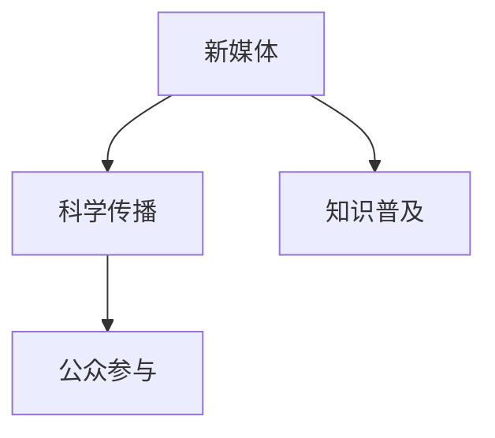

**核心算法原理讲解**

- **新媒体**：通过互联网和社交媒体，将科学知识以更生动、互动的方式传播给公众。
- **科学传播**：利用新媒体的传播力和互动性，提高公众对科学的认知和兴趣。

**数学模型和数学公式**

```latex
\text{传播效果} = \frac{\text{受众数量}}{\text{总传播量}}
```

**举例说明**

- **案例研究**：某科普网站通过互动问答和在线实验，吸引了大量用户。

**项目实战**

- **实战背景**：某科研机构开设一个在线科普平台。
- **实战步骤**：
  1. 设计互动问答模块，让公众参与科学讨论。
  2. 开发在线实验模块，让公众亲身体验科学实验。
  3. 定期发布科学新闻和知识文章，提供丰富多样的科普内容。
  4. 跟踪用户反馈，持续优化平台功能。

**最佳实践 tips**

- **互动性强**：增加用户互动，提高用户粘性。
- **多样化**：提供多种形式的科普内容，满足不同用户的需求。

##### 6.3 社交媒体在科学传播中的应用

**核心概念与联系**

- **社交媒体**：如微博、微信、Facebook 等，在科学传播中发挥了重要作用。
- **科学传播**：通过社交媒体，将科学知识以更快速、广泛的方式传播给公众。

**Mermaid 流程图**

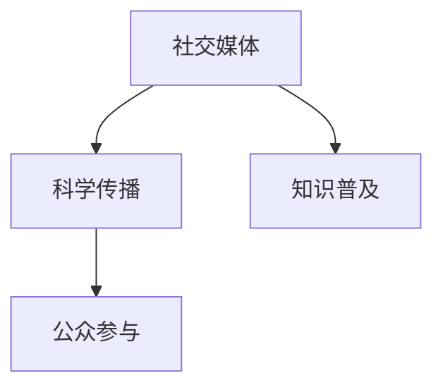

**核心算法原理讲解**

- **社交媒体**：通过分享、转发和评论，将科学知识以更快速、广泛的方式传播给公众。
- **科学传播**：利用社交媒体的传播力和互动性，提高公众对科学的认知和兴趣。

**数学模型和数学公式**

```latex
\text{传播效果} = \frac{\text{受众数量}}{\text{总传播量}}
```

**举例说明**

- **案例研究**：某科学家通过微博发布科学成果，短时间内获得了大量关注和讨论。

**项目实战**

- **实战背景**：某科研机构通过社交媒体进行科学传播。
- **实战步骤**：
  1. 制定社交媒体传播策略，包括内容策划和发布时间。
  2. 制作科学成果的图文和视频内容，提高传播效果。
  3. 鼓励公众参与讨论，提高互动性。
  4. 定期分析传播效果，优化传播策略。

**最佳实践 tips**

- **内容创新**：制作有趣、有启发性的内容，吸引公众关注。
- **互动参与**：鼓励公众参与讨论，提高科学传播的效果。

---

### 第四部分：跨学科合作与科学普及

#### 第7章：跨学科合作与科学普及

##### 7.1 跨学科研究的优势与挑战

**核心概念与联系**

- **跨学科研究**：将不同学科的知识和理论结合起来，进行综合研究和创新。
- **优势**：提高研究深度和广度，促进科学进步。
- **挑战**：学科之间的差异和障碍，需要协调和整合。

**Mermaid 流程图**

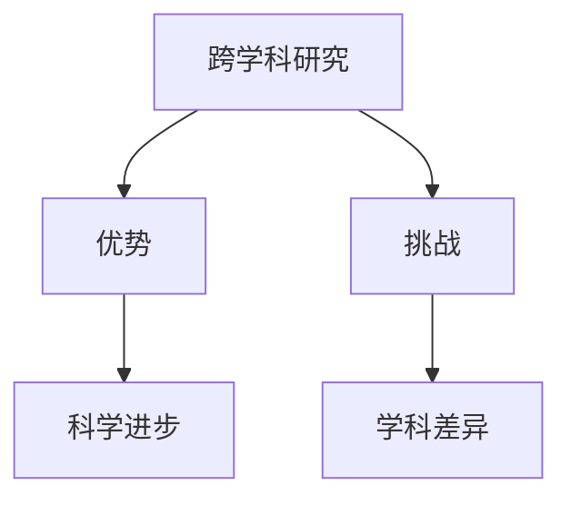

**核心算法原理讲解**

- **跨学科研究**：通过整合不同学科的理论和方法，可以解决更复杂的问题。
- **优势**：促进科学知识的创新和发展。
- **挑战**：学科之间的差异和障碍，需要协调和整合。

**数学模型和数学公式**

```latex
\text{研究深度} = \frac{\text{跨学科知识整合量}}{\text{总知识量}}
```

**举例说明**

- **案例研究**：某跨学科研究项目将生物学、物理学和计算机科学相结合，取得了突破性成果。

**项目实战**

- **实战背景**：某研究团队开展一项跨学科研究。
- **实战步骤**：
  1. 确定研究主题，明确跨学科研究的方向。
  2. 搜集相关学科的理论和方法，进行整合和创新。
  3. 进行实验和数据分析，验证研究成果。
  4. 发布研究报告，进行学术交流和传播。

**最佳实践 tips**

- **跨学科合作**：鼓励不同学科的专家合作，共同解决复杂问题。
- **知识整合**：注重不同学科知识的整合和创新，提高研究深度和广度。

##### 7.2 艺术与科学的融合

**核心概念与联系**

- **艺术与科学融合**：将科学知识与艺术形式相结合，创造新的艺术作品。
- **科学普及**：通过艺术作品，让公众更直观地理解科学知识。

**Mermaid 流程图**

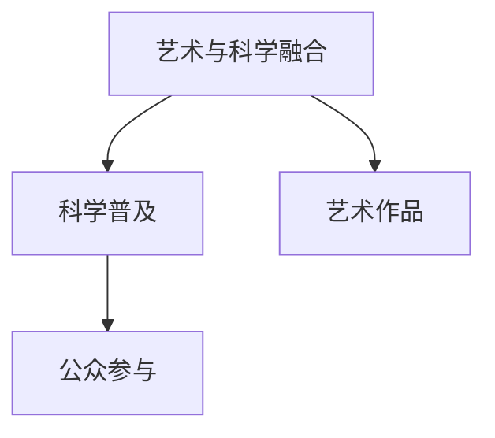

**核心算法原理讲解**

- **艺术与科学融合**：通过艺术形式，将科学知识生动地呈现给公众。
- **科学普及**：借助艺术作品，提高公众对科学的兴趣和理解。

**数学模型和数学公式**

```latex
\text{普及效果} = \frac{\text{艺术作品传播量}}{\text{总传播量}}
```

**举例说明**

- **案例研究**：某艺术作品通过绘画和雕塑，展示了科学现象和原理。

**项目实战**

- **实战背景**：某艺术家创作一系列科学主题的艺术作品。
- **实战步骤**：
  1. 研究科学主题，确定艺术作品的内容和形式。
  2. 制作艺术作品，结合科学原理和视觉表现。
  3. 在艺术展览中展示作品，吸引公众参观和了解。
  4. 发布艺术作品和相关科学知识的介绍，便于公众进一步学习。

**最佳实践 tips**

- **创新表达**：通过艺术形式，创造性地表达科学知识，提高公众的参与度。
- **互动体验**：在艺术作品中增加互动元素，让公众更深入地体验科学知识。

##### 7.3 科学博物馆与科学中心的角色

**核心概念与联系**

- **科学博物馆与科学中心**：展示和传播科学知识和技术的场所。
- **科学普及**：通过科学博物馆和科学中心，让公众更直观地了解科学。

**Mermaid 流程图**

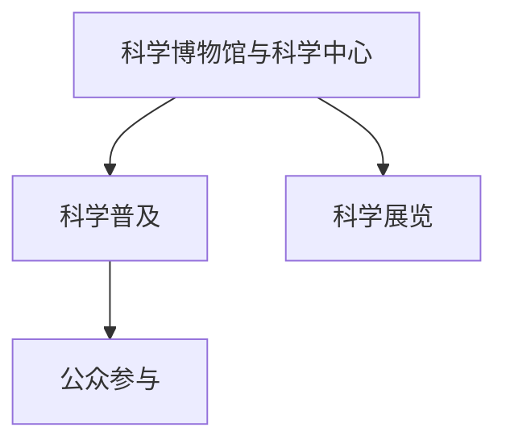

**核心算法原理讲解**

- **科学博物馆与科学中心**：通过科学展览和互动体验，让公众更直观地了解科学知识。
- **科学普及**：借助科学博物馆和科学中心，提高公众的科学素养。

**数学模型和数学公式**

```latex
\text{普及效果} = \frac{\text{观众数量}}{\text{总展览量}}
```

**举例说明**

- **案例研究**：某科学博物馆通过互动展品和实验，吸引了大量观众。

**项目实战**

- **实战背景**：某科学博物馆举办一场科学展览。
- **实战步骤**：
  1. 确定展览主题，设计互动展品和实验。
  2. 制作展览宣传材料，吸引公众参观。
  3. 在展览期间，提供讲解和互动环节，增加观众参与度。
  4. 收集观众反馈，优化展览内容和形式。

**最佳实践 tips**

- **互动体验**：设计互动展品和实验，提高观众的参与度。
- **内容丰富**：提供多样化的展览内容，满足不同观众的需求。

---

### 第五部分：全球实践与未来展望

#### 第8章：全球科学普及的实践与案例

##### 8.1 国外科学普及的成功经验

**核心概念与联系**

- **国外科学普及**：其他国家在科学普及方面的实践和经验。
- **成功经验**：国外科学普及的成功案例和有效方法。

**Mermaid 流程图**

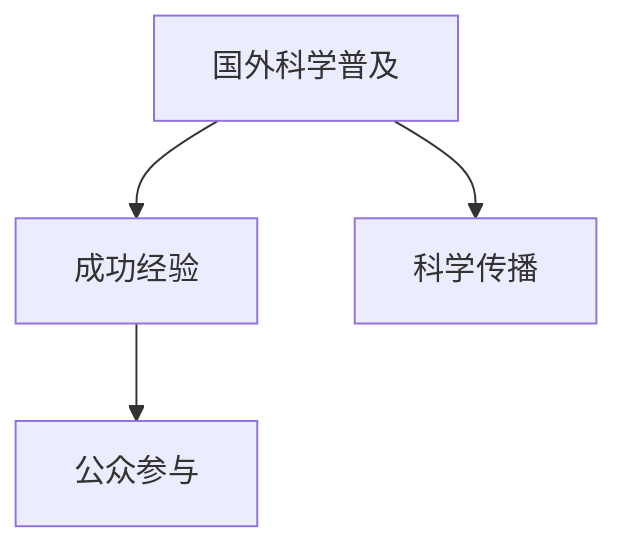

**核心算法原理讲解**

- **国外科学普及**：借鉴其他国家的科学普及实践，探索适合本国的有效方法。
- **成功经验**：国外科学普及的成功案例，如科普活动、科普网站等。

**数学模型和数学公式**

```latex
\text{普及效果} = \frac{\text{成功案例数量}}{\text{总案例数量}}
```

**举例说明**

- **案例研究**：美国国家科学基金会（NSF）通过资助科普项目，提高了公众对科学的兴趣和理解。

**项目实战**

- **实战背景**：我国借鉴国外科学普及的成功经验，制定科学普及战略。
- **实战步骤**：
  1. 调研国外科学普及的成功案例和方法。
  2. 结合我国实际情况，制定适合我国的科学普及策略。
  3. 资助科普项目，提高公众科学素养。
  4. 收集反馈，持续优化科学普及策略。

**最佳实践 tips**

- **借鉴经验**：学习国外科学普及的成功经验，为本国科学普及提供参考。
- **因地制宜**：根据本国实际情况，制定适合的科学普及策略。

##### 8.2 中国科学普及的现状与未来

**核心概念与联系**

- **中国科学普及**：我国在科学普及方面的现状和挑战。
- **未来展望**：我国科学普及的发展方向和目标。

**Mermaid 流程图**

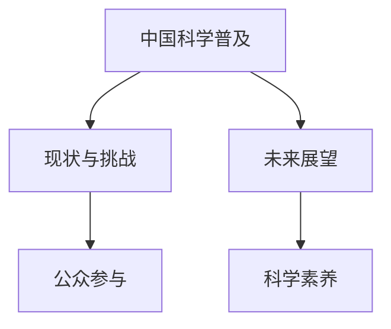

**核心算法原理讲解**

- **中国科学普及**：我国科学普及取得了显著成果，但还存在一些挑战，如公众科学素养较低、科普资源不足等。
- **未来展望**：提高公众科学素养，加强科普资源建设，推动科学普及的可持续发展。

**数学模型和数学公式**

```latex
\text{普及效果} = \frac{\text{科普资源投入}}{\text{总资源需求}}
```

**举例说明**

- **案例研究**：某科普项目通过线上和线下相结合的方式，提高了公众的科学素养。

**项目实战**

- **实战背景**：我国政府制定科学普及规划，推动科普事业发展。
- **实战步骤**：
  1. 制定科学普及规划，明确目标和任务。
  2. 加强科普资源建设，提高科普设施和服务水平。
  3. 资助科普项目，鼓励公众参与科学活动。
  4. 收集反馈，持续改进科普工作。

**最佳实践 tips**

- **政府支持**：加强政府支持，提供政策和资金保障。
- **多方参与**：鼓励社会各界参与科普工作，形成合力。

##### 8.3 科学普及的国际合作

**核心概念与联系**

- **国际合作**：各国在科学普及方面的合作和交流。
- **科学普及**：通过国际合作，提高全球科学素养。

**Mermaid 流程图**

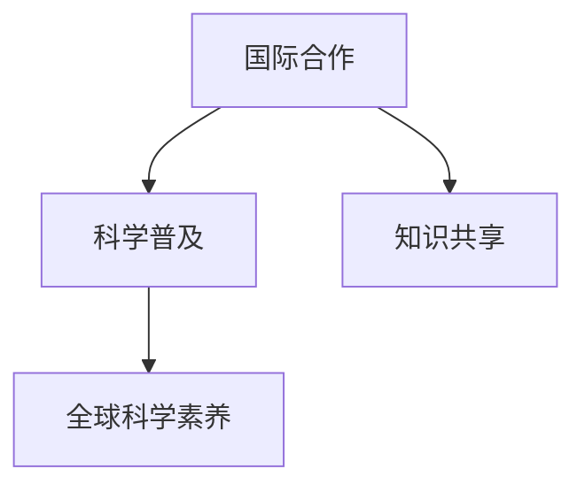

**核心算法原理讲解**

- **国际合作**：通过国际合作，共享科普资源和经验，提高全球科学素养。
- **科学普及**：借助国际合作，推动科学普及的全球化发展。

**数学模型和数学公式**

```latex
\text{普及效果} = \frac{\text{国际合作项目数量}}{\text{总项目数量}}
```

**举例说明**

- **案例研究**：某国际合作项目通过线上课程和科研交流，提高了全球科学素养。

**项目实战**

- **实战背景**：我国参与某国际合作项目，推动科学普及。
- **实战步骤**：
  1. 加入国际合作项目，了解项目目标和任务。
  2. 贡献我国科普资源，参与项目实施。
  3. 组织线上课程和科研交流，促进知识共享。
  4. 收集项目成果，进行评估和推广。

**最佳实践 tips**

- **积极参与**：积极参与国际合作项目，提高我国在国际科学普及领域的影响力。
- **知识共享**：通过国际合作，共享科普资源和经验，促进全球科学普及。

---

### 第六部分：科学研究责任与可理解性的新趋势

#### 第9章：科学责任与可理解性的新趋势

##### 9.1 人工智能在科学普及中的应用

**核心概念与联系**

- **人工智能**：在科学普及中的应用，如智能问答、虚拟讲解等。
- **科学普及**：通过人工智能技术，提高公众对科学的理解和兴趣。

**Mermaid 流程图**

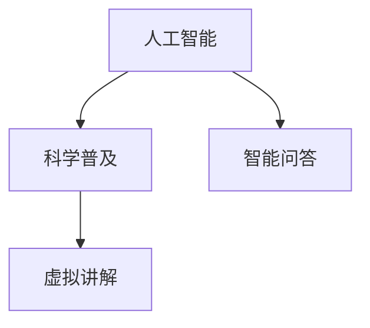

**核心算法原理讲解**

- **人工智能**：通过自然语言处理和机器学习技术，实现智能问答和虚拟讲解。
- **科学普及**：借助人工智能技术，提高科普内容的互动性和趣味性。

**数学模型和数学公式**

```latex
\text{普及效果} = \frac{\text{人工智能应用量}}{\text{总应用量}}
```

**举例说明**

- **案例研究**：某人工智能科普平台通过智能问答和虚拟讲解，吸引了大量用户。

**项目实战**

- **实战背景**：某科研机构开发一款人工智能科普应用。
- **实战步骤**：
  1. 确定应用目标和功能，如智能问答、虚拟讲解等。
  2. 收集科学知识库，进行数据预处理。
  3. 开发智能问答系统和虚拟讲解模块。
  4. 测试和优化应用，发布上线。

**最佳实践 tips**

- **创新应用**：探索人工智能在科普领域的创新应用，提高科普效果。
- **用户友好**：设计用户友好的界面和交互方式，提高用户体验。

##### 9.2 科学责任与可持续发展

**核心概念与联系**

- **可持续发展**：科学研究应考虑对环境、社会和经济的影响。
- **科学责任**：科学研究应承担可持续发展的责任。

**Mermaid 流程图**

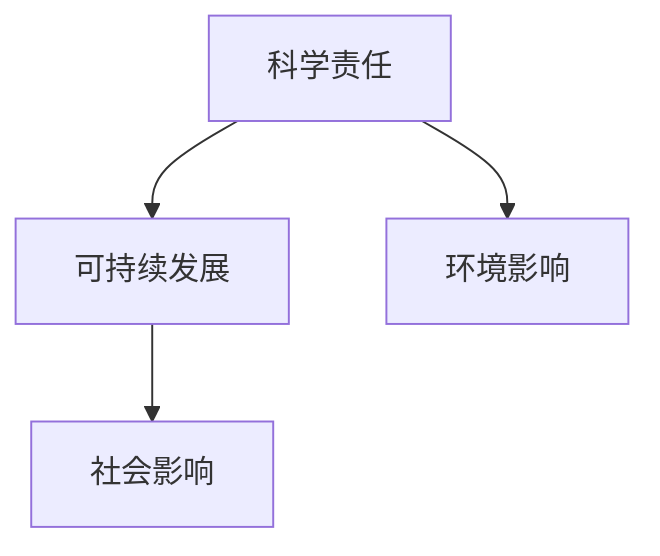

**核心算法原理讲解**

- **可持续发展**：通过科学研究，提供可持续发展的解决方案。
- **科学责任**：科学研究应考虑对环境、社会和经济的影响，实现可持续发展。

**数学模型和数学公式**

```latex
\text{责任度} = \frac{\text{可持续发展效益}}{\text{研究投入}}
```

**举例说明**

- **案例研究**：某研究项目通过开发可再生能源技术，促进了可持续发展。

**项目实战**

- **实战背景**：某科研机构开展一项关于可再生能源的研究。
- **实战步骤**：
  1. 确定研究目标和方向，关注可持续发展的需求。
  2. 收集相关数据和文献，进行科学分析。
  3. 开发可再生能源技术，进行实验验证。
  4. 发布研究成果，推广可持续发展的实践。

**最佳实践 tips**

- **关注可持续发展**：在科研工作中，关注可持续发展的需求和挑战。
- **技术创新**：通过技术创新，实现可持续发展的目标。

##### 9.3 科学研究的全球视野

**核心概念与联系**

- **全球视野**：科学研究应具备全球视野，关注全球性问题和挑战。
- **科学责任**：科学研究应承担全球责任，为全球发展作出贡献。

**Mermaid 流程图**

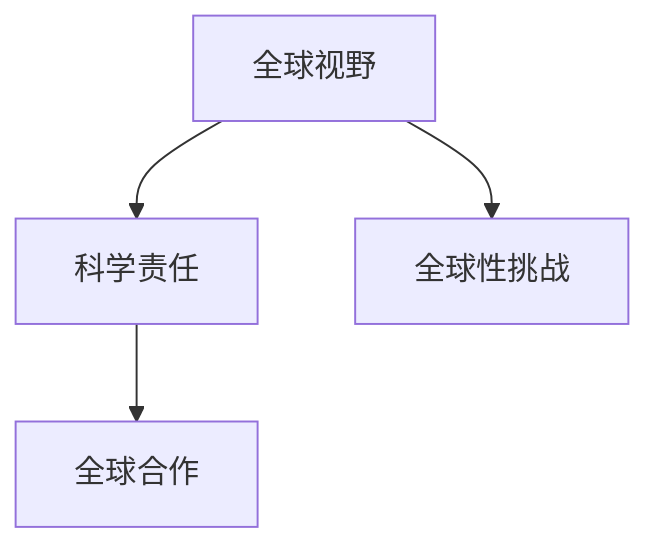

**核心算法原理讲解**

- **全球视野**：科学研究应关注全球性问题和挑战，如气候变化、全球卫生等。
- **科学责任**：科学研究应承担全球责任，推动全球合作，解决共同问题。

**数学模型和数学公式**

```latex
\text{责任度} = \frac{\text{全球合作贡献}}{\text{总研究投入}}
```

**举例说明**

- **案例研究**：某科研团队开展一项关于全球卫生问题的研究，推动了国际合作。

**项目实战**

- **实战背景**：某科研机构参与一项全球卫生研究项目。
- **实战步骤**：
  1. 确定研究主题和目标，关注全球性卫生问题。
  2. 收集全球卫生数据，进行科学分析。
  3. 开展国际合作，分享研究成果。
  4. 发布研究成果，推动全球卫生事业的发展。

**最佳实践 tips**

- **全球视野**：关注全球性问题和挑战，开展跨国合作研究。
- **国际合作**：加强国际合作，分享科研资源和经验。

---

### 第七部分：科学研究与社会责任的未来展望

#### 第10章：科学研究与社会责任的未来展望

##### 10.1 研究责任的发展趋势

**核心概念与联系**

- **研究责任**：随着社会的发展和科技的进步，研究责任的内涵和范围不断扩展。
- **社会责任**：科学研究应承担更多的社会责任，为社会发展作出贡献。

**Mermaid 流程图**

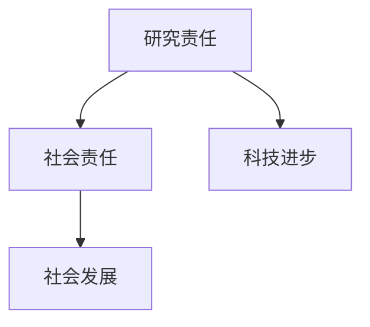

**核心算法原理讲解**

- **研究责任**：随着科技的发展，科学研究应承担更多的社会责任，如可持续发展、环境保护等。
- **社会责任**：科学研究应关注社会发展需求，为解决社会问题提供科学支持。

**数学模型和数学公式**

```latex
\text{责任度} = \frac{\text{社会贡献}}{\text{研究投入}}
```

**举例说明**

- **案例研究**：某科研团队通过开发可再生能源技术，为社会可持续发展作出了贡献。

**项目实战**

- **实战背景**：某科研机构开展一项关于可再生能源的研究。
- **实战步骤**：
  1. 确定研究目标和方向，关注可持续发展需求。
  2. 收集相关数据和文献，进行科学分析。
  3. 开发可再生能源技术，进行实验验证。
  4. 发布研究成果，推广可持续发展的实践。

**最佳实践 tips**

- **关注社会责任**：在科研工作中，关注社会责任和可持续发展需求。
- **科技创新**：通过科技创新，为社会问题提供科学解决方案。

##### 10.2 科学普及的未来挑战

**核心概念与联系**

- **科学普及**：在信息化和全球化的背景下，科学普及面临新的挑战。
- **未来挑战**：如公众科学素养的不足、科普资源的不足等。

**Mermaid 流程图**

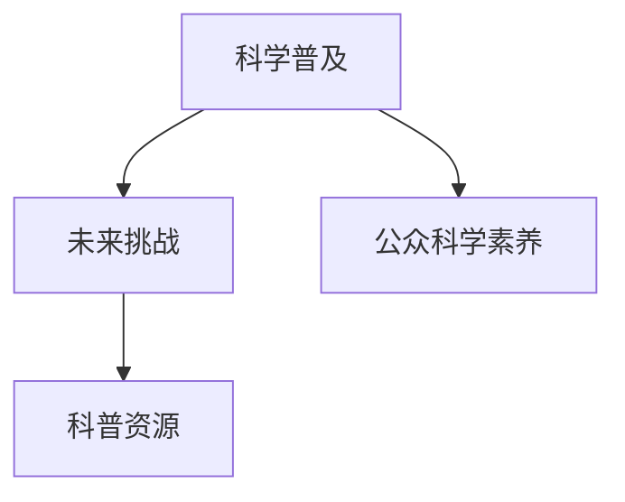

**核心算法原理讲解**

- **科学普及**：在信息化和全球化的背景下，科学普及需要应对新的挑战。
- **未来挑战**：提高公众科学素养、增加科普资源投入等。

**数学模型和数学公式**

```latex
\text{普及效果} = \frac{\text{科普资源投入}}{\text{总资源需求}}
```

**举例说明**

- **案例研究**：某科普项目由于科普资源不足，导致公众参与度不高。

**项目实战**

- **实战背景**：某科研机构开展一项科普活动。
- **实战步骤**：
  1. 确定科普活动目标和内容，关注公众需求。
  2. 收集科普资源，如教材、视频、实验设备等。
  3. 设计互动环节，提高公众参与度。
  4. 收集反馈，持续优化科普活动。

**最佳实践 tips**

- **创新传播方式**：采用多样化的传播方式，提高科普效果。
- **资源整合**：整合各方资源，提高科普资源的利用效率。

##### 10.3 科学与社会的协同发展

**核心概念与联系**

- **科学与社会**：科学研究与社会发展的相互关系。
- **协同发展**：科学研究与社会发展相互促进，实现共同进步。

**Mermaid 流程图**

```mermaid
graph TD
A[科学研究] --> B[社会发展]
A --> C[协同发展]
B --> D[科技进步]
```

**核心算法原理讲解**

- **科学研究**：通过科技创新，推动社会发展。
- **社会发展**：为科学研究提供良好的环境和支持。

**数学模型和数学公式**

```latex
\text{协同发展度} = \frac{\text{科技进步贡献}}{\text{社会发展贡献}}
```

**举例说明**

- **案例研究**：某科技创新项目促进了社会经济发展，实现了协同发展。

**项目实战**

- **实战背景**：某科研机构与地方政府合作，开展科技创新项目。
- **实战步骤**：
  1. 确定科技创新项目目标和方向。
  2. 合作进行技术研发和成果转化。
  3. 促进地方经济发展，提高社会效益。
  4. 收集项目成果，进行评估和推广。

**最佳实践 tips**

- **协同合作**：加强科研机构与社会各界的合作，实现协同发展。
- **成果转化**：注重科技成果的转化和应用，提高科研的社会效益。

---

### 第八部分：科学家与公众的互动

#### 第11章：科学家与公众的互动

##### 11.1 科学家参与公共事务

**核心概念与联系**

- **科学家参与公共事务**：科学家在社会事务中的角色和贡献。
- **公众参与**：公众对科学和科研的参与和关注。

**Mermaid 流程图**

```mermaid
graph TD
A[科学家参与公共事务] --> B[公众参与]
A --> C[科技政策]
B --> D[科研活动]
```

**核心算法原理讲解**

- **科学家参与公共事务**：科学家通过参与政策制定、咨询和建议，为社会发展提供科学支持。
- **公众参与**：公众通过了解和参与科研活动，提高科学素养和参与度。

**数学模型和数学公式**

```latex
\text{参与度} = \frac{\text{科学家参与量}}{\text{总参与量}}
```

**举例说明**

- **案例研究**：某科学家受邀参与政府科技政策制定，为科技创新提供了有力支持。

**项目实战**

- **实战背景**：某科研机构与政府部门合作，开展科技政策研究。
- **实战步骤**：
  1. 确定科技政策研究目标和方向。
  2. 科学家团队参与政策研究，提供科学建议。
  3. 政府部门制定科技政策，推动科技创新。
  4. 收集政策实施效果，进行评估和改进。

**最佳实践 tips**

- **专业建议**：科学家应发挥专业优势，提供科学、合理的建议。
- **公众参与**：鼓励公众参与科研活动，提高科学素养和参与度。

##### 11.2 公众参与科学研究的可能性

**核心概念与联系**

- **公众参与**：公众在科学研究中的参与和贡献。
- **科学研究的可能性**：公众参与对科学研究的影响和作用。

**Mermaid 流程图**

```mermaid
graph TD
A[公众参与] --> B[科学研究的可能性]
A --> C[科研活动]
B --> D[科研数据]
```

**核心算法原理讲解**

- **公众参与**：通过公众参与，可以丰富科研数据、提高研究效率。
- **科学研究的可能性**：公众参与为科学研究提供了新的视角和方法。

**数学模型和数学公式**

```latex
\text{研究效率} = \frac{\text{公众参与量}}{\text{总研究投入}}
```

**举例说明**

- **案例研究**：某科研项目通过公众参与，收集了大量有价值的数据。

**项目实战**

- **实战背景**：某科研机构开展一项公众参与的科学项目。
- **实战步骤**：
  1. 设计公众参与计划，明确参与方式和流程。
  2. 发放调查问卷，收集公众的意见和建议。
  3. 整合公众参与的数据，进行科学研究。
  4. 发布研究成果，感谢公众的贡献。

**最佳实践 tips**

- **公众参与**：设计合理的公众参与机制，提高公众参与度。
- **数据整合**：整合公众参与的数据，提高科研数据的可靠性和代表性。

##### 11.3 科学家与公众的互惠关系

**核心概念与联系**

- **互惠关系**：科学家与公众之间的相互支持和合作。
- **科学传播**：科学家与公众通过科学传播，实现知识和价值的传递。

**Mermaid 流程图**

```mermaid
graph TD
A[科学家与公众互惠关系] --> B[科学传播]
A --> C[知识传递]
B --> D[价值创造]
```

**核心算法原理讲解**

- **互惠关系**：科学家与公众通过合作和互动，实现知识和价值的共享。
- **科学传播**：科学家与公众通过科学传播，提高公众的科学素养和参与度。

**数学模型和数学公式**

```latex
\text{互惠关系度} = \frac{\text{知识传递量}}{\text{价值创造量}}
```

**举例说明**

- **案例研究**：某科学家通过科普讲座和互动活动，与公众建立了良好的互惠关系。

**项目实战**

- **实战背景**：某科研机构举办一场公众科普活动。
- **实战步骤**：
  1. 确定科普活动主题和内容，如科学实验、讲座等。
  2. 科学家担任主讲人，与公众互动交流。
  3. 提供科普资料，便于公众进一步学习。
  4. 收集公众反馈，持续改进科普活动。

**最佳实践 tips**

- **互动交流**：鼓励科学家与公众之间的互动交流，提高科普效果。
- **持续改进**：根据公众反馈，持续改进科普内容和形式。

---

### 附录

#### 附录A：科学研究责任与可理解性的参考文献

- [1] 贝尔蒙特报告（ Belmont Report ），美国国家卫生研究院，1979.
- [2] 赫尔辛基宣言（Helsinki Declaration），世界医学协会，1964.
- [3] 欧洲联盟科研伦理准则（EU Code of Conduct on Research Integrity），欧洲联盟，2002.
- [4] 科学传播学刊（Journal of Science Communication），美国科学传播协会，1983.
- [5] 科学技术与人类进步（Science, Technology and Human Progress），牛津大学出版社，1999.
- [6] 中国科技伦理治理研究（Research on the Governance of Science and Technology Ethics in China），中国科学技术出版社，2016.
- [7] 全球科学传播：理论与实践（Global Science Communication: Theory and Practice），清华大学出版社，2018.

#### 附录B：国际科学研究社会责任与可理解性的组织与机构介绍

- **美国国家科学基金会（NSF）**：美国国家科学基金会，负责资助和支持科学研究与科学普及项目。
- **世界卫生组织（WHO）**：世界卫生组织，负责制定全球卫生政策，推动科学研究与公众健康。
- **国际科学理事会（ICSU）**：国际科学理事会，促进国际科学研究合作，关注科学研究的社会责任。
- **美国科学促进会（AAAS）**：美国科学促进会，致力于科学普及和科学政策制定。
- **英国皇家学会（Royal Society）**：英国皇家学会，推动科学研究，促进科学普及与公众理解。
- **国际科学传播学会（IAST）**：国际科学传播学会，关注科学传播的理论与实践，推动国际交流与合作。

#### 附录C：科学普及案例研究

- **案例一**：英国科学博物馆（Science Museum，伦敦）。
  - **背景**：英国科学博物馆是世界上最著名的科学博物馆之一，通过丰富的展品和互动体验，普及科学知识。
  - **实施步骤**：
    1. 设计丰富多彩的展览，涵盖科学历史、现代科技、未来展望等。
    2. 开发互动体验项目，如科学实验、模拟飞行等。
    3. 定期举办讲座和工作坊，邀请科学家和专家讲解科学知识。
    4. 开展线上科普活动，通过社交媒体和官方网站，扩大科普影响力。

- **案例二**：美国国家自然历史博物馆（American Museum of Natural History，纽约）。
  - **背景**：美国国家自然历史博物馆是全球最著名的自然历史博物馆之一，通过展览、教育活动和科研活动，普及科学知识。
  - **实施步骤**：
    1. 设计主题展览，如恐龙展览、宇宙探索等。
    2. 开发教育项目，如科学课堂、青少年科研项目等。
    3. 定期举办科普讲座和研讨会，邀请科学家和专家分享研究成果。
    4. 建立线上科普平台，提供虚拟展览和科学教育资源。

#### 附录D：科学普及最佳实践 tips

- **创新性**：采用新颖的展示方式和互动体验，提高公众的参与度和兴趣。
- **互动性**：鼓励公众参与科学活动，提供互动环节和体验项目。
- **多样性**：提供多样化的科普内容，满足不同年龄段和背景的公众需求。
- **合作性**：与教育机构、科研机构和媒体合作，扩大科普影响力。
- **可持续性**：注重科普活动的可持续性和长期效果，持续优化科普内容和形式。
- **评估与反馈**：定期评估科普活动的效果，收集公众反馈，持续改进科普工作。

