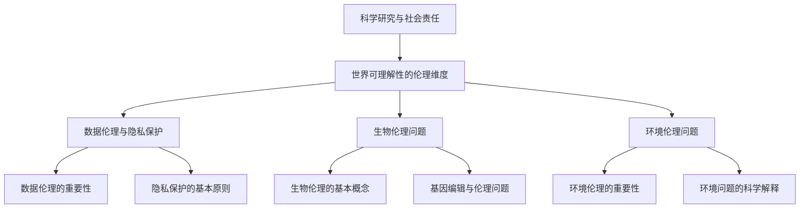

                 

### 文章标题

“《科学研究的社会责任：世界可理解性的伦理维度》”是本篇文章的标题。选择这个标题，是因为科学研究在现代社会中扮演着至关重要的角色，而其社会责任以及对世界可理解性的影响也不容忽视。科学研究的成果不仅改变了我们的生活方式，也对伦理观念和社会结构产生了深远的影响。因此，深入探讨科学研究的社会责任和伦理维度，对于构建一个更加公正、和谐的社会具有重要意义。同时，本文将围绕“世界可理解性”这一概念，探讨伦理观念在科学发展和应用中的重要性，以及科学研究如何通过提高世界的可理解性来履行其社会责任。

### 关键词

- 科学研究社会责任
- 伦理维度
- 世界可理解性
- 数据伦理
- 隐私保护
- 生物伦理
- 环境伦理

这些关键词不仅涵盖了本文的主要讨论内容，也反映了科学研究的广泛影响和复杂性。通过这些关键词，读者可以初步了解文章的核心主题，并期待在阅读过程中获得对科学研究伦理问题的深入理解。

### 摘要

本文旨在探讨科学研究在社会中的责任及其伦理维度，特别是“世界可理解性”的重要性。科学研究不仅推动科技进步，也对伦理观念和社会结构产生深远影响。首先，本文回顾了科学研究与社会责任的相互关系，强调了科研伦理的基本原则。接着，本文详细阐述了“世界可理解性”的概念，并探讨了伦理观念与科学发展的关联。在随后的章节中，本文深入分析了科学研究中的伦理问题，包括数据伦理、生物伦理和环境伦理，探讨了相关的基本原则和案例。通过这些分析，本文揭示了科学研究如何通过提高世界的可理解性来履行其社会责任，并提出了未来科研伦理发展的挑战与机遇。最后，本文总结了科学研究的社会责任与未来趋势，提出了相关建议，以期为科研人员提供有益的参考。

### 目录大纲

# 《科学研究的社会责任：世界可理解性的伦理维度》目录大纲

## 第一部分：科学研究与伦理

### 第1章：科学研究与社会责任

#### 1.1 科研与社会的相互影响

#### 1.2 科研伦理的基本原则

#### 1.3 社会责任在科研中的体现

### 第2章：世界可理解性的伦理维度

#### 2.1 世界可理解性的概念

#### 2.2 伦理观念与科学发展的关系

#### 2.3 可理解性在科研实践中的应用

## 第二部分：科学研究中的伦理问题

### 第3章：数据伦理与隐私保护

#### 3.1 数据伦理的重要性

#### 3.2 隐私保护的基本原则

#### 3.3 数据伦理问题的案例分析与解决

### 第4章：生物伦理问题

#### 4.1 生物伦理的基本概念

#### 4.2 基因编辑与伦理问题

#### 4.3 生物技术研究的伦理审查

### 第5章：环境伦理问题

#### 5.1 环境伦理的重要性

#### 5.2 环境问题的科学解释

#### 5.3 科研在环境保护中的作用

## 第三部分：科学研究的社会责任实践

### 第6章：科研伦理教育与实践

#### 6.1 科研伦理教育的现状

#### 6.2 科研伦理教育的策略与方法

#### 6.3 科研伦理实践案例分析

### 第7章：科学研究的社会责任与未来

#### 7.1 社会责任在科研中的未来发展

#### 7.2 科研伦理的挑战与机遇

#### 7.3 世界可理解性的伦理维度对科研的启示

## 参考文献

## 附录

### A.1 重要伦理准则与法规

### A.2 常见伦理问题案例分析

### A.3 科研伦理教育资源推荐

### Mermaid 流程图



### 核心算法原理讲解

本文的核心算法原理讲解主要集中在隐私保护和数据加密算法上。隐私保护算法，如K-匿名算法，通过将数据分组来保护个人隐私。而数据加密算法，如AES加密算法，则用于确保数据在传输和存储过程中的安全性。以下将分别介绍这两种算法的原理和实现。

#### K-匿名算法原理

K-匿名算法的核心思想是将数据集中的记录分组，使得每个分组中的记录无法单独识别，从而保护个人隐私。具体实现如下：

```python
def k_anonymity(data, k):
    groups = []
    for record in data:
        candidate_group = set()
        for other_record in data:
            if record != other_record and record_has_common_attributes(record, other_record):
                candidate_group.add(other_record)
        if len(candidate_group) >= k:
            groups.append(candidate_group)
    return groups

def record_has_common_attributes(record1, record2):
    return len(set(record1).intersection(record2)) >= threshold
```

在这个算法中，`k` 代表每个分组中记录的最小数量。算法首先遍历数据集中的每个记录，并与其他记录进行比较，检查它们是否具有足够数量的共同属性。如果一组记录满足条件，则将其添加到分组列表中。

#### AES加密算法原理

AES（Advanced Encryption Standard）是一种广泛使用的对称加密算法，它基于轮密钥和替换-置换网络。以下是一个简化的AES加密算法实现：

```python
def aes_encrypt(plaintext, key):
    ciphertext = ""
    for block in split_into_blocks(plaintext):
        ciphertext += encrypt_block(block, key)
    return ciphertext

def encrypt_block(block, key):
    # Implement AES encryption for a single block using the key
    # ...
    return ciphertext
```

在这个算法中，`plaintext` 是待加密的明文，`key` 是加密密钥。算法首先将明文分成若干个固定大小的块，然后对每个块进行加密，并将结果连接起来得到密文。

通过上述算法原理的讲解，我们可以看到，隐私保护和数据加密是科学研究中的重要环节，它们在保护个人隐私和数据安全方面发挥着关键作用。

## 第一部分：科学研究与伦理

### 第1章：科学研究与社会责任

#### 1.1 科研与社会的相互影响

科学研究与社会之间的关系是相辅相成的。科学技术的进步为社会的各个方面带来了巨大的变革，从医疗健康到环境保护，从经济繁荣到国家治理，科学研究无处不在，深刻地影响着人类社会的发展。同时，社会需求也是科学研究的重要驱动力。社会问题和社会需求激发了科学家们去探索未知、解决难题，从而推动科学技术的不断创新。

首先，科学研究对社会的影响体现在经济方面。科技的发展带动了产业升级和经济增长，促进了就业机会的增多。例如，互联网技术的出现改变了信息传播和商业模式的运作方式，电子商务、在线支付等新兴行业迅速崛起，为经济发展注入了新的活力。此外，科学研究在提高生产效率、降低成本、优化资源配置等方面也发挥了重要作用。

在社会福利方面，科学研究成果显著改善了人类的生活质量。医疗科学的进步使得许多曾经致命的疾病得以治愈或控制，延长了人类的寿命。比如，疫苗的研发和应用不仅提高了公共卫生水平，还减少了传染病的传播。环境保护科学的进展则为可持续发展提供了技术支持，通过减少污染、提高资源利用效率，保护了地球的生态环境。

然而，科学研究对社会的影响并非总是积极的。科技的滥用和不当使用可能导致一系列社会问题，例如隐私泄露、数据滥用、技术失业等。这些问题引发了社会对科学研究的伦理责任和道德责任的讨论。科学研究在推动社会进步的同时，也必须考虑到其可能带来的负面影响，并采取相应的措施进行控制和防范。

其次，科学研究对社会的影响还体现在文化和价值观的塑造上。科学技术的普及改变了人们的认知方式和生活方式，推动了文化的发展与变革。例如，智能手机和社交媒体的普及改变了人们的社交方式，打破了地域和时间的限制，促进了全球文化的交流和融合。然而，这也带来了文化同质化的问题，不同文化之间的差异和多样性受到了挑战。

最后，科学研究对社会的影响还体现在国家治理和国际关系上。科技实力成为衡量一个国家综合国力的重要指标。国际竞争日益激烈，科技创新能力成为国家竞争的核心。在全球化背景下，科学研究不仅关系到国家的发展和繁荣，也影响着国际秩序和国际关系的稳定。因此，科学研究在国家治理和国际合作中扮演着重要角色。

总之，科学研究与社会之间的相互影响是复杂而多维的。科学研究在推动社会进步、改善人类福祉方面发挥了关键作用，但同时也面临着诸多社会挑战。科学研究的伦理责任在于确保其成果能够惠及全人类，同时减少可能的负面影响。只有在科学研究与社会之间建立和谐的关系，才能实现科学的可持续发展和社会的全面进步。

#### 1.2 科研伦理的基本原则

科研伦理是科学研究过程中必须遵循的一系列道德规范和行为准则，旨在确保科研活动的正当性、可靠性和公正性。科研伦理的基本原则包括尊重个人、诚信、公正、责任和透明等。以下是对这些基本原则的详细阐述。

首先，尊重个人原则是科研伦理的核心。科学家在开展研究时必须尊重研究对象的隐私权和自主权。这意味着在进行人体试验或涉及个人数据的研究时，必须获得研究对象的知情同意，并严格保护其个人信息不被泄露。尊重个人原则还包括避免任何形式的歧视和剥削，确保研究活动的公平性和合理性。

其次，诚信原则是科研活动的基石。诚信要求科学家在科研过程中保持真诚和正直，不得捏造、篡改或伪造数据，不参与抄袭和剽窃等不道德行为。科研诚信不仅关系到科学研究的真实性和可靠性，也关系到科学家个人的声誉和社会的信任。科学界对诚信的重视，使得学术期刊、研究机构和大学设立了严格的学术道德委员会，对科研不端行为进行调查和处理。

公正原则要求科研活动在设计和实施过程中应保证公平性。研究人员应确保研究方法的科学性和客观性，避免因个人偏见或利益冲突而影响研究结果。此外，科研结果应公开发表，接受同行评议和公众监督，确保其透明性和可复制性。公正原则也体现在资源的分配上，应公平地对待不同的研究项目和研究人员，确保科学资源的合理使用。

责任原则强调科学家在科研活动中的社会责任。科学家不仅要追求科学真理，还要考虑其研究成果对社会和环境可能产生的影响。在研究过程中，科学家应主动识别和评估潜在风险，并采取相应措施减少负面影响。例如，在进行生物技术或环境科学的研究时，科学家需要关注其研究成果可能对生物多样性或生态系统造成的破坏，并采取措施进行保护或修复。

最后，透明原则要求科研活动的过程和结果应公开透明，以便同行评议和社会监督。透明原则包括数据共享、方法公开和研究结果的公开讨论。科学家应遵循开放科学的理念，通过共享数据和研究方法，促进科研合作和知识传播。同时，科研机构和学术期刊也需建立透明的评审和发表机制，确保科研成果的质量和可信度。

总之，科研伦理的基本原则是确保科学研究活动在道德和伦理上可行，从而为社会带来正面影响。这些原则不仅规范了科学家的行为，也为科研活动提供了道德和法律的依据。只有在遵循这些原则的基础上，科学研究才能持续、健康地发展，为社会进步和人类福祉作出贡献。

#### 1.3 社会责任在科研中的体现

科学研究的社会责任体现在多个方面，包括促进社会公正、推动可持续发展、解决社会问题以及增强社会凝聚力。首先，科学研究在促进社会公正方面发挥了重要作用。通过研究社会不平等、贫困和歧视等问题，科学家可以提供数据支持，帮助制定公平的政策和措施，以减少社会不公。例如，社会学研究揭示了不同群体在教育资源、就业机会和社会福利等方面的差异，为政策制定者提供了科学的依据，推动了社会公正的实现。

其次，科学研究在推动可持续发展方面具有重要作用。随着全球环境问题的日益严重，科学家通过研究气候变化、资源管理和生态系统保护等课题，为制定可持续发展的策略提供了科学依据。例如，环境科学研究揭示了全球变暖的原因和潜在影响，提出了减少温室气体排放和保护生物多样性的方法，为全球环境保护提供了重要支持。

在解决社会问题方面，科学研究发挥了至关重要的作用。社会问题的复杂性需要科学方法的介入，通过科学研究和数据分析，科学家可以找到解决问题的有效途径。例如，医学研究通过发现疾病机理和开发新药物，极大地提高了人类健康水平；经济学研究通过分析经济运行机制，提出了优化资源配置和促进经济增长的策略。

此外，科学研究还有助于增强社会凝聚力。科学知识的普及和传播能够提高公众的科学素养，增强人们对科学方法的信任和理解。例如，科普活动通过向公众介绍科学知识和科学方法，激发了公众对科学的兴趣，促进了科学文化的繁荣。科学合作和交流也增强了国际间的相互理解和信任，推动了全球科技合作和共同发展。

总之，科学研究通过促进社会公正、推动可持续发展、解决社会问题和增强社会凝聚力，积极履行其社会责任。科学研究的成果不仅服务于当前的社会需求，还为未来的社会进步奠定了基础。在履行社会责任的过程中，科学研究必须考虑到伦理和道德问题，确保其研究成果能够真正造福于全人类。

### 第2章：世界可理解性的伦理维度

#### 2.1 世界可理解性的概念

世界可理解性是指人类能够通过科学方法对自然现象和人类行为进行理解的程度。这个概念涉及到科学知识的获取、验证和应用，其核心在于通过逻辑推理、实验验证和理论构建，使复杂的世界现象变得可解释和可预测。世界可理解性的重要性在于，它不仅决定了科学知识的积累和进步，也深刻影响了人类的认知方式和社会发展。

首先，世界可理解性是科学探索的基础。科学研究的目的之一就是揭示自然界的规律和原理，从而使我们能够更好地理解和掌控世界。通过科学方法，科学家们能够将看似杂乱无章的现象归纳为有序的体系，从而为技术创新和社会进步提供理论支持。例如，物理学的经典力学理论使我们能够理解行星运动的规律，为航天技术的发展奠定了基础。

其次，世界可理解性对于社会发展和人类福祉至关重要。科学知识的应用可以解决许多社会问题，改善人类的生活质量。例如，医学科学的进步使得许多疾病得到了有效治疗，提升了人类的健康水平。此外，科学知识还能够提高公众的科学素养，使人们更好地理解和参与社会事务，增强社会的整体发展能力。

然而，世界可理解性并非一成不变，它是一个动态的过程。随着科学技术的不断进步，人类对世界的理解也在不断深化。例如，量子力学和相对论的提出极大地改变了我们对宇宙的理解，揭示了微观世界和宏观宇宙的深层规律。这种不断深化的理解不仅丰富了科学知识，也为解决新的科学问题提供了新的视角和方法。

世界可理解性还涉及到科学知识的社会维度。科学知识不仅是由科学家在实验室中发现的，还必须通过教育、媒体和公共讨论等方式传播给公众。科学知识的普及和传播能够增强公众对科学的信任和理解，促进科学文化的繁荣。然而，科学知识的传播也面临挑战，例如科学普及的不平衡、科学争议和误解等问题。因此，在追求世界可理解性的过程中，科学家和社会需要共同努力，确保科学知识的准确传播和有效应用。

总之，世界可理解性是科学研究的重要目标，它不仅决定了科学知识的积累和进步，也深刻影响了人类社会的认知方式和发展方向。通过科学方法不断深化对世界的理解，人类能够更好地应对挑战、解决问题，实现社会的可持续发展。

#### 2.2 伦理观念与科学发展的关系

伦理观念与科学发展之间的关系是复杂而紧密的。科学技术的进步在推动社会发展和人类福祉的同时，也带来了诸多伦理挑战和道德问题。伦理观念在科学发展中的作用主要体现在指导科学研究的方向、规范科研行为和评估科研成果的影响等方面。

首先，伦理观念是科学发展的指南针。科学研究必须遵循一定的伦理原则，以确保其过程和结果符合道德要求。伦理观念提供了科学家在研究过程中应遵循的行为准则，帮助他们识别和解决道德困境。例如，在医学研究中，伦理观念要求确保受试者的知情同意，保护他们的隐私和尊严，避免对受试者造成伤害。在生物技术研究中，伦理观念要求慎重对待基因编辑等潜在风险，避免滥用技术导致伦理危机。

其次，伦理观念规范了科研行为。科学研究不仅需要追求知识，还必须遵守道德规范，确保其过程的公正性和透明性。科研诚信是科学发展的基石，任何形式的学术不端行为，如数据造假、抄袭和剽窃等，都是对科学伦理的严重违背。科学界通过制定伦理准则和规章制度，对科研人员进行教育和监督，确保他们遵守科研道德，维护科学的纯洁性和信誉。

第三，伦理观念在评估科研成果的影响方面起到了关键作用。科研成果不仅关系到科学理论的完善和技术创新，还可能对社会、环境和人类福祉产生深远影响。伦理观念提供了评估科研成果影响的道德标准，帮助科学家和社会判断其是否符合伦理要求。例如，在环境科学研究中，伦理观念要求评估新技术对生态环境的影响，确保其不会对生态系统造成不可逆转的破坏。在人工智能研究中，伦理观念要求确保人工智能系统的公平性、透明性和安全性，避免歧视和滥用。

此外，伦理观念还在科学决策中发挥了重要作用。科学政策和社会治理需要充分考虑伦理因素，确保科学技术的应用符合社会需求和伦理标准。科学界和社会各界通过对话和协商，共同制定科学政策和伦理准则，确保科学技术的健康发展。例如，在制定基因编辑政策时，需要充分考虑伦理和社会影响，确保技术的合理应用和风险管理。

最后，伦理观念促进了科学知识的普及和传播。科学知识的普及和传播不仅是科学发展的目标，也是实现世界可理解性的重要途径。伦理观念在科学教育、科普宣传和公共讨论中起到了关键作用，帮助公众理解和接受科学知识，增强对科学的信任和理解。通过伦理观念的引导，科学知识能够更加公正、透明和有效地传播，促进科学文化的繁荣。

总之，伦理观念与科学发展之间的关系是相辅相成的。伦理观念不仅指导科学研究的方向和规范科研行为，还在评估科研成果影响和科学决策中发挥了关键作用。只有在遵循伦理观念的基础上，科学研究才能实现其真正的社会价值，为人类的可持续发展作出贡献。

#### 2.3 可理解性在科研实践中的应用

可理解性在科研实践中的应用至关重要，它不仅影响科研成果的质量和影响力，还关系到科研成果的实际应用和社会接受度。以下将具体探讨可理解性在科研实践中的几个关键应用方面，包括科研报告的撰写、科研结果的传播和科学普及。

首先，科研报告的撰写是科研实践中的重要环节，其目的在于清晰、准确地传达研究过程和结果。为了提高科研报告的可理解性，科学家需要遵循一些基本原则。首先，报告的结构应逻辑清晰，通常包括引言、方法、结果、讨论和结论等部分。其次，术语和符号的使用应规范，避免使用过于专业或晦涩难懂的术语。如果必须使用专业术语，应在首次出现时进行解释。此外，图表和数据分析应直观、简洁，有助于读者快速理解研究的关键点和数据趋势。举例来说，一个有效的科研报告可能会在讨论部分详细解释研究方法的选择理由、数据分析的过程和结果，并通过图表展示实验数据，使读者能够直观地理解研究的主要发现。

其次，科研结果的传播是科研实践中的另一个重要方面。科研结果的传播不仅有助于扩大科学知识的影响力，还促进了科学合作和跨学科交流。为了提高科研结果的可理解性，科学家可以采用多种传播方式，包括学术会议、学术期刊、科普文章、社交媒体等。在学术会议上，科学家可以通过口头报告和海报展示，使同行和公众了解研究的进展和成果。学术期刊则提供了更加详尽和系统的发表平台，通过同行评议确保科研成果的质量和可理解性。此外，科普文章和社交媒体的运用，能够将科研结果以更加生动和易于理解的方式呈现给公众，提高公众的科学素养和科学兴趣。

科学普及是提高科研结果可理解性的重要途径，其目标是将复杂的科学知识转化为普通公众能够理解和接受的形式。科学普及不仅有助于增强公众对科学的理解和信任，还能激发下一代对科学的兴趣和热情。为了实现科学普及的目标，科学家可以采用多种方法，如编写科普书籍、开设科普讲座、参与电视节目和社交媒体互动等。具体来说，科学家可以通过编写简明易懂的科普文章，使用图解、案例和互动形式，使读者能够在轻松的环境中了解科学概念和发现。此外，科学家还可以通过参与科学展览和科普讲座，与公众面对面交流，解答他们的疑问，增强公众对科学的兴趣和理解。

在实际应用中，提高科研结果的可理解性不仅有助于科学成果的传播和普及，还能促进科研成果的社会应用和转化。例如，医疗研究成果的可理解性提高了公众对医学技术的信任，促进了新技术的推广和应用。环境科学研究结果的普及，则增强了公众对环境保护意识和行动的参与度，推动了可持续发展目标的实现。

总之，可理解性在科研实践中的应用贯穿于科研报告的撰写、科研结果的传播和科学普及的各个环节。通过提高科研成果的可理解性，科学家不仅能够更好地传达研究过程和结果，还能促进科学知识的普及和应用，为社会的可持续发展做出积极贡献。

### 第三部分：科学研究中的伦理问题

#### 第3章：数据伦理与隐私保护

#### 3.1 数据伦理的重要性

数据伦理是科学研究中的一个重要方面，它关乎个人隐私、数据安全和公平性。随着大数据和人工智能技术的迅猛发展，数据伦理问题愈发凸显。首先，个人隐私保护是数据伦理的核心。在数据收集、存储和处理过程中，科学家必须确保个人数据的隐私不被泄露。任何未经授权的数据访问、使用或披露都可能导致严重的隐私侵犯问题。

其次，数据安全也是数据伦理的重要方面。科学家需要采取严格的数据保护措施，确保数据在传输、存储和处理过程中不被篡改、丢失或泄露。数据泄露不仅会损害研究项目的可靠性，还可能对参与者的隐私和安全造成威胁。因此，科学家必须遵守数据安全标准，使用加密技术、访问控制和安全审计等手段保护数据。

公平性是数据伦理的另一个关键维度。数据收集和分析应遵循公平原则，避免因数据偏见导致不公平的结果。例如，在选择样本时，应确保样本具有代表性，避免因样本选择偏差而影响研究结果的普遍性和可信度。此外，在使用数据时，科学家应尊重研究对象的权益，避免对其造成不必要的伤害或不利影响。

总之，数据伦理在科学研究中的重要性不容忽视。科学家在处理数据时必须严格遵守伦理原则，确保个人隐私得到保护，数据安全得到保障，公平性得到维护。只有这样，科学研究才能在道德和伦理上获得社会的认可和支持。

#### 3.2 隐私保护的基本原则

隐私保护是数据伦理中的核心问题，其基本原则包括透明性、知情同意、数据最小化、数据匿名化和数据安全等。

首先，透明性原则要求在数据收集和处理过程中，必须明确告知数据主体（即个人）数据的使用目的、方式、范围和存储时间。透明性有助于数据主体了解其个人数据如何被使用，从而做出知情的决定。

其次，知情同意原则是隐私保护的基础。在进行数据收集前，必须获得数据主体的明确同意，确保其了解并同意其个人数据被用于特定研究目的。知情同意应采用简单明了的语言，确保数据主体能够充分理解。

数据最小化原则要求科学家仅收集与研究目的直接相关的最小必要数据。避免收集不必要的个人信息，可以减少隐私泄露的风险。

数据匿名化是一种重要的隐私保护技术，通过去除或替换个人识别信息，使数据在分析过程中无法识别具体个人。数据匿名化可以在一定程度上保护个人隐私，但需注意匿名化过程中可能存在的匿名化不完善问题。

最后，数据安全原则要求科学家采取严格的安全措施，确保数据在传输、存储和处理过程中不被未授权访问、篡改或泄露。包括使用加密技术、访问控制和安全审计等手段，保护数据安全。

总之，隐私保护的基本原则为科学研究中个人数据的合法、合理和安全使用提供了指导和保障，确保科学研究在道德和伦理上获得社会的认可和支持。

#### 3.3 数据伦理问题的案例分析与解决

数据伦理问题在科学研究中时常出现，以下通过两个具体案例进行分析，并提出解决方案。

**案例一：基因编辑研究中的伦理困境**

背景：2018年，中国科学家贺建奎宣布成功利用CRISPR-Cas9技术编辑了人类胚胎基因，旨在使婴儿免受艾滋病的影响。

分析：这一案例引发了广泛的伦理争议。首先，基因编辑涉及潜在的健康风险和不可预测的长期影响，未经充分测试即应用于人类胚胎，存在严重安全隐患。其次，研究未获得伦理审查委员会的批准，且未获得受试者（胚胎父母）的知情同意，违反了科研伦理的基本原则。

解决方案：为了避免类似事件，首先应在开展基因编辑研究前，进行严格的伦理审查和风险评估。研究应获得伦理审查委员会的批准，并确保受试者充分知情并同意参与研究。此外，应制定明确的指导原则和法律法规，规范基因编辑技术的应用，确保其符合伦理要求。

**案例二：社交媒体数据隐私问题**

背景：2018年，剑桥分析公司未经用户同意，收集和使用数千万用户的社交媒体数据，用于政治广告定向投放，引发隐私泄露和数据滥用争议。

分析：这一案例揭示了社交媒体平台数据收集和使用的潜在风险。剑桥分析公司的行为不仅侵犯了用户的隐私权，还可能影响选举和政治稳定。

解决方案：首先，社交媒体平台应严格遵守隐私保护法规，确保用户数据的合法、合理使用。在数据收集和使用前，平台应明确告知用户数据的使用目的和范围，并取得用户的知情同意。其次，监管机构应加强对社交媒体平台的监管，确保其遵守隐私保护规定，对违规行为进行严厉处罚。此外，用户也应提高隐私保护意识，合理设置隐私权限，避免个人信息被滥用。

通过上述案例分析，可以看出，数据伦理问题在科学研究中具有普遍性和复杂性。解决这些问题需要科学家、平台运营商和监管机构的共同努力，确保科学研究在道德和伦理上获得社会的认可和支持。

### 第4章：生物伦理问题

#### 4.1 生物伦理的基本概念

生物伦理是研究生物技术和社会伦理之间关系的学科，主要关注生物科学和医学领域中的道德问题。生物伦理的基本概念包括尊重生命、公正性、自主性和无害性等。这些概念构成了生物伦理学的核心原则，指导科学家和医疗专业人员在进行生物研究和应用时的行为选择。

首先，尊重生命原则是生物伦理的核心。这一原则强调人类对生命的尊重，无论生命处于何种状态，都应给予保护和关怀。例如，在医学研究中，尊重生命原则要求科学家必须确保受试者的生命安全，避免因研究活动而造成伤害。

其次，公正性原则要求在生物技术和医疗资源的分配中，应确保公平和合理。公正性不仅体现在医疗服务的可及性上，还包括对遗传资源和生物技术的公平分配，避免因经济、社会和种族等因素造成的不公平现象。

自主性原则强调个体在医疗决策中的自由和权利。个体有权根据自己的意愿做出医疗选择，并应得到充分的信息和支持，以便做出明智的决定。在临床试验中，受试者应被告知研究的目的、风险和益处，并获得知情同意。

最后，无害性原则要求在生物研究和医疗实践中，应尽量避免对受试者和社会造成伤害。科学家和医疗专业人员应采取必要的安全措施，确保研究过程和医疗行为对受试者的利益最大化，风险最小化。

总之，生物伦理的基本概念为生物研究和医疗实践提供了伦理指导，确保科学探索和医疗活动在道德和伦理上获得社会的认可和支持。

#### 4.2 基因编辑与伦理问题

基因编辑技术，如CRISPR-Cas9，为医学和生物学领域带来了革命性的变革。然而，这一技术的广泛应用也引发了诸多伦理问题，特别是关于人类胚胎基因编辑和基因治疗中的伦理困境。

首先，人类胚胎基因编辑的伦理问题备受关注。2018年，中国科学家贺建奎宣布成功编辑了人类胚胎基因，以预防艾滋病。这一突破性成果虽然带来了医疗希望，但也引发了广泛的伦理争议。人类胚胎基因编辑涉及潜在的健康风险和不可预测的长期影响，未经充分测试即应用于人类胚胎，存在严重安全隐患。此外，未获得伦理审查委员会的批准和受试者（胚胎父母）的知情同意，违反了科研伦理的基本原则。这一案例凸显了人类胚胎基因编辑的伦理困境，引发了关于基因编辑道德边界的讨论。

其次，基因治疗中的伦理问题同样值得重视。基因治疗是一种利用基因工程技术治疗遗传病和其他疾病的方法，但其应用也面临诸多伦理挑战。首先，基因治疗的安全性和有效性尚未得到充分验证，可能导致受试者出现意外副作用或并发症。其次，基因治疗的高成本使得其可及性成为问题，可能导致医疗资源的不公平分配。此外，基因治疗可能带来“设计婴儿”和“基因增强”等问题，引发关于人类尊严和自然进化的伦理争议。

为了解决这些伦理问题，首先应在开展基因编辑和基因治疗研究前，进行严格的伦理审查和风险评估。研究应获得伦理审查委员会的批准，并确保受试者充分知情并同意参与研究。其次，应制定明确的指导原则和法律法规，规范基因编辑和基因治疗的应用，确保其符合伦理要求。此外，科学家和医疗专业人员应加强伦理教育和培训，提高其伦理意识和责任意识，确保在研究和应用过程中严格遵循伦理原则。

总之，基因编辑和基因治疗技术的发展带来了新的医疗前景，但也引发了复杂的伦理问题。解决这些问题需要全球科学界、医疗界和伦理界的共同努力，确保基因编辑和基因治疗在道德和伦理上获得社会的认可和支持。

#### 4.3 生物技术研究的伦理审查

生物技术研究的伦理审查是确保科研活动在道德和伦理上可行的重要环节。伦理审查的核心目标是评估研究项目在尊重生命、公正性、自主性和无害性等方面的合规性，从而保障研究过程的正当性和研究结果的合理性。

首先，伦理审查的基本原则包括尊重生命、公正、自主性和无害性。尊重生命原则要求确保所有研究对象，包括动物和人类，在研究过程中不受到不必要的伤害和痛苦。公正原则要求在资源分配、样本选择和利益冲突处理等方面保持公平。自主性原则强调研究对象的知情同意权，确保其在充分了解研究目的、风险和益处后做出自愿的选择。无害性原则要求在研究设计和实施过程中，尽量减少对研究对象的潜在危害。

其次，伦理审查的具体流程通常包括以下几个步骤：

1. **提交申请**：研究人员需要向伦理审查委员会提交详细的科研计划，包括研究目的、方法、预期风险和益处等。

2. **初步审查**：伦理审查委员会对申请材料进行初步审核，确保研究方案符合伦理审查的基本原则。

3. **深入审查**：伦理审查委员会组织专家对研究计划进行深入审查，评估研究方案的伦理问题、潜在风险和保障措施。

4. **决定与反馈**：伦理审查委员会根据审查结果做出批准、修改或拒绝的决定，并将决定结果通知研究人员。

5. **持续监督**：在研究过程中，伦理审查委员会定期对研究进展进行监督，确保研究活动按照伦理审查要求进行。

最后，伦理审查在国际合作项目中尤为重要。跨国研究项目面临不同的法律、文化和伦理标准，需要通过国际伦理审查合作机制，确保研究活动在全球范围内符合伦理要求。国际伦理审查合作机制包括建立国际伦理审查委员会、签订伦理审查合作协议和开展跨国伦理审查培训等。

总之，生物技术研究的伦理审查是保障科研活动在道德和伦理上可行的重要手段。通过严格的伦理审查，可以确保科学研究在尊重生命、公正、自主性和无害性等原则的指导下进行，为人类健康和福祉作出贡献。

### 第5章：环境伦理问题

#### 5.1 环境伦理的重要性

环境伦理是研究人类与自然环境之间关系的伦理学分支，它关注环境问题背后的道德责任和价值观。环境伦理的重要性体现在多个方面，首先，它为环境保护提供了道德基础。在环境问题日益严重的今天，环境伦理为人们提供了行动的指南，使环境保护不再仅仅是一个技术和经济问题，更是一个涉及道德责任和人类价值观的问题。

其次，环境伦理有助于促进可持续发展。可持续发展要求在经济、社会和环境三个方面实现平衡，环境伦理为其提供了伦理原则和道德标准，确保在追求经济发展的同时，不损害自然环境和人类未来。例如，环境伦理要求人们在资源利用和环境保护之间找到平衡点，避免过度开发和资源枯竭。

此外，环境伦理还涉及到代际正义问题。环境问题往往具有长期性，当代人的行为可能对后代产生深远影响。环境伦理强调代际公平，要求当代人承担起保护环境和为后代留下可持续家园的责任。

总之，环境伦理的重要性在于它为环境保护提供了道德基础，促进了可持续发展，并强调了代际正义。通过环境伦理的引导，人类能够更加理性地对待自然环境，实现人与自然的和谐共生。

#### 5.2 环境问题的科学解释

环境问题是指由于人类活动导致的自然环境的破坏和恶化。科学解释环境问题的核心在于揭示其成因、影响和潜在解决方案。以下从几个关键方面对环境问题进行科学解释：

首先，全球气候变化是当前最严重的环境问题之一。科学研究表明，全球气候变化主要由于人类活动产生的温室气体排放，如二氧化碳、甲烷和氟氯化碳等。这些温室气体增加了大气中的温室效应，导致全球气温上升。气候变化对生态系统、气候模式、海平面上升和极端天气事件产生了深远影响，例如，冰川融化、干旱、洪水和飓风的频率和强度增加。

其次，生物多样性丧失也是重要环境问题。人类活动，如森林砍伐、土地开发和污染，严重破坏了自然栖息地，导致许多物种濒临灭绝。生物多样性的丧失不仅影响生态系统的稳定性和功能，还削弱了生态系统的抗风险能力。科学研究发现，生物多样性的减少可能导致生态服务的减少，如水源净化、土壤肥力和气候调节。

此外，环境污染问题也不容忽视。工业废水、废气、固体废弃物的排放，以及农业化学物质的使用，都对环境造成了严重污染。例如，重金属污染、塑料污染和农药污染等，不仅威胁到人类健康，还对生态系统和生物多样性产生了负面影响。

最后，环境问题的科学解释还涉及到环境系统的复杂性和非线性。环境问题通常具有累积效应和长期影响，其解决需要跨学科的合作和多方面的综合考量。例如，气候变化的影响不仅仅是温度的升高，还涉及到海洋酸化、生态系统变化和生物分布的调整。

总之，科学解释环境问题需要综合考虑其成因、影响和复杂性，通过多学科合作，提出有效的解决方案，以实现环境保护和可持续发展。

#### 5.3 科研在环境保护中的作用

科研在环境保护中发挥着至关重要的作用，其贡献体现在多个方面，包括监测和评估环境状况、提出解决方案和技术创新、以及政策制定和公众教育。

首先，科研通过监测和评估环境状况，为环境保护提供了科学依据。例如，卫星遥感技术、自动监测设备和无人机等现代科技手段，使得科学家能够实时监测大气、水体和土壤的质量，及时发现环境问题并评估其严重程度。这些数据对于制定环保政策和监测污染源具有重要作用。

其次，科研在提出解决方案和技术创新方面也起到了关键作用。例如，在应对气候变化方面，科学家通过研究可再生能源技术、碳捕集与储存技术、以及节能减排措施，为减少温室气体排放提供了有效的技术路径。在生物多样性保护方面，生态学家通过研究生态系统服务功能、物种间相互作用和栖息地保护策略，为生物多样性保护提供了科学依据和实用方法。

科研还在政策制定中发挥了重要作用。科学家通过提供科学证据和数据分析，为政府制定环保政策和法规提供了支持。例如，在制定空气污染控制措施时，科学家提供了关于污染源、污染物传播和健康影响的研究成果，帮助政府制定有效的减排策略。在水资源管理方面，科学家通过研究水循环、水资源分布和水污染问题，为制定科学合理的水资源管理政策提供了数据支持。

此外，科研在公众教育中也具有重要作用。通过科普文章、公共讲座、电视节目和社交媒体等渠道，科学家能够向公众普及环保知识，提高公众的环境意识和参与度。例如，环保科普读物和环保纪录片等，通过生动形象的方式，使公众更好地了解环境问题及其解决方案，从而积极参与到环保行动中来。

总之，科研在环境保护中发挥着不可替代的作用。通过监测和评估环境状况、提出解决方案和技术创新、支持政策制定以及公众教育，科研为环境保护和可持续发展提供了科学依据和技术支持，为构建一个绿色、健康和可持续的未来作出了重要贡献。

### 第6章：科研伦理教育与实践

#### 6.1 科研伦理教育的现状

科研伦理教育在全球范围内逐渐受到重视，许多国家和地区已经将科研伦理教育纳入学术体系和培训计划。当前科研伦理教育的现状呈现出以下几个特点：

首先，科研伦理教育在学术体系中的地位不断提升。许多高校和研究机构设立了专门的科研伦理课程，将科研伦理教育纳入本科和研究生教育中。例如，美国许多高校要求本科生和研究生必须完成科研伦理课程，以了解科研过程中的伦理原则和规范。

其次，科研伦理教育的内容和方法不断丰富。科研伦理教育不仅涵盖了伦理原则和案例分析，还涉及到跨学科的知识和技能。例如，一些高校通过模拟实验、角色扮演和案例分析等方式，帮助学生更好地理解和应用科研伦理原则。

此外，科研伦理教育的国际化和多元化趋势也在逐步显现。国际科研合作项目增多，促使各国学者共同探讨科研伦理问题，并分享经验和最佳实践。同时，科研伦理教育也注重文化多样性的影响，确保不同文化背景下的科研人员能够理解和遵守共同的科研伦理标准。

然而，尽管科研伦理教育取得了一定进展，仍存在一些问题和挑战。首先，科研伦理教育的覆盖面和深度有待提高。一些学术机构和研究项目尚未将科研伦理教育纳入常规培训，导致科研人员在实际工作中缺乏伦理意识和规范。

其次，科研伦理教育的实践环节相对薄弱。一些科研伦理课程过于理论化，缺乏实际操作和案例分析，导致学生在实际科研过程中难以灵活应用伦理原则。

最后，科研伦理教育的持续性和效果评价尚不完善。科研伦理教育通常是一个短期过程，难以确保科研人员在实际科研过程中长期遵守伦理原则。此外，缺乏有效的评估机制，难以衡量科研伦理教育的效果和影响力。

总之，科研伦理教育在全球范围内已取得一定进展，但仍面临诸多挑战。通过加强科研伦理教育的系统性和实践性，提高科研人员的伦理素养，将有助于推动科研活动的健康发展。

#### 6.2 科研伦理教育的策略与方法

为了提高科研人员的伦理素养和遵守科研伦理原则的自觉性，科研伦理教育需要采取多种策略和方法。以下是一些有效的策略和方法：

首先，强化基础课程和跨学科培训。将科研伦理教育纳入本科和研究生教育的必修课程，确保学生和研究人员在学术生涯的早期阶段接受系统、全面的伦理培训。同时，鼓励跨学科合作，将伦理原则融入不同学科的研究中，使科研人员能够从不同角度理解和应用科研伦理。

其次，开展案例教学和情景模拟。通过真实的伦理案例和情景模拟，帮助科研人员识别和处理科研过程中的伦理问题。例如，组织角色扮演活动，让科研人员在模拟的科研环境中体验伦理决策的复杂性，提高其实际操作能力。

第三，加强实践环节和实地培训。科研伦理教育不仅需要理论讲解，还需要实践操作。可以通过实验室实习、实地考察和科研项目参与等方式，让科研人员在真实科研环境中锻炼伦理意识和实践能力。此外，定期举办科研伦理研讨会和论坛，促进科研人员之间的交流与讨论。

第四，利用现代科技手段，如在线课程和虚拟实验室，提高科研伦理教育的覆盖面和可及性。在线课程可以随时随地学习，方便科研人员在忙碌的科研工作中进行自主学习。虚拟实验室则提供了一个安全、低成本的环境，让科研人员可以在模拟环境中进行伦理决策和实践。

第五，建立持续学习和反馈机制。科研伦理教育不应是一次性的，而应是一个持续的过程。通过定期考核、问卷调查和案例分析，评估科研人员的伦理素养和实际操作能力，并提供改进建议。此外，建立科研伦理咨询和投诉渠道，鼓励科研人员积极反映和解决伦理问题。

最后，加强科研伦理教育与职业发展相结合。将科研伦理教育纳入科研人员的职业发展考核，激励他们不断提升自身的伦理素养。例如，在科研评审、项目申请和职业晋升中，将科研伦理表现作为重要评价指标。

通过上述策略和方法，可以有效提高科研人员的伦理素养，促进科研活动的健康发展，确保科研成果在社会中产生积极的影响。

#### 6.3 科研伦理实践案例分析

科研伦理实践案例分析是科研伦理教育的重要组成部分，通过具体实例帮助科研人员理解和掌握科研伦理原则。以下分析两个具有代表性的案例，并从中提炼出科研伦理的最佳实践。

**案例一：人类基因编辑研究**

背景：2018年，中国科学家贺建奎宣称成功利用CRISPR/Cas9技术编辑了人类胚胎基因，以预防艾滋病。然而，这一突破性成果引发了广泛的伦理争议，因为研究未获得伦理审查委员会的批准，且未获得受试者（胚胎父母）的知情同意。

分析：这一案例暴露了科研伦理审查和知情同意的严重不足。首先，基因编辑技术具有潜在的健康风险和不可预测的长期影响，未经充分测试即应用于人类胚胎，存在严重安全隐患。其次，未获得伦理审查委员会的批准和受试者的知情同意，违反了科研伦理的基本原则。

结论：为了避免类似事件，科研机构应加强伦理审查和知情同意流程。在开展基因编辑研究前，必须进行严格的伦理审查和风险评估，确保研究方案符合伦理要求。此外，受试者应在充分知情的情况下自愿参与研究，确保其权益得到保护。

**案例二：数据隐私保护**

背景：2018年，剑桥分析公司未经用户同意，收集和使用数千万用户的社交媒体数据，用于政治广告定向投放。这一事件引发了全球对数据隐私保护的广泛关注。

分析：这一案例揭示了社交媒体平台数据收集和使用过程中存在的隐私侵犯问题。剑桥分析公司的行为不仅违反了用户隐私权，还可能导致选举和政治稳定受到影响。此外，数据泄露还可能对用户的心理健康和信任造成负面影响。

结论：为了保护用户隐私，社交媒体平台应严格遵守隐私保护法规，确保数据收集和使用的透明性和合法性。在数据收集前，平台应明确告知用户数据的使用目的和范围，并取得用户的知情同意。此外，监管机构应加强对社交媒体平台的监管，确保其遵守隐私保护规定，对违规行为进行严厉处罚。

通过以上案例分析，我们可以提炼出科研伦理的最佳实践：确保严格的伦理审查和知情同意流程、保护用户隐私和数据安全、以及加强科研伦理教育和培训。这些实践有助于提升科研人员的伦理素养，促进科研活动的健康发展。

### 第7章：科学研究的社会责任与未来

#### 7.1 社会责任在科研中的未来发展

随着科学技术的迅猛发展，科学研究在社会中的地位愈发重要，其社会责任也在不断拓展和深化。未来，科学研究的社会责任预计将呈现出以下几个发展趋势：

首先，科研伦理和社会责任的深度融合将成为主流。科学研究不仅需要追求知识的创新和技术的突破，还需关注其可能带来的社会影响和伦理问题。未来，科研机构、科学家和资助机构将更加注重科研活动的伦理审查和风险评估，确保科研成果能够为社会带来正面影响，同时减少潜在的负面影响。

其次，跨学科合作和全球科研合作将成为科研社会责任的重要形式。面对复杂的环境问题、公共卫生挑战和全球性社会问题，单一学科和单一地区的研究已难以应对。未来，科学研究将更加注重跨学科合作，促进不同领域专家之间的交流与协作，共同解决复杂问题。同时，全球科研合作也将加强，通过共享资源和知识，推动全球科技发展，实现全球共同福祉。

第三，公众参与和科普教育将更加受到重视。科学研究的结果和成果不仅服务于学术界，也应服务于公众。未来，科学家将更加注重公众参与，通过科普活动、教育项目和社区合作，提高公众的科学素养和科学意识，使科学研究更加透明和可理解。此外，科普教育也将成为科研社会责任的一部分，通过向公众传播科学知识和方法，增强社会的科学文化氛围。

第四，科研资源的公平分配和可持续利用将成为关注重点。随着科研资金的增加和科研项目的增多，如何确保科研资源的公平分配和有效利用成为一个重要课题。未来，科研机构将更加注重资源的合理配置，避免资源浪费和资源垄断，确保科研资源能够惠及更多地区和群体，促进科研的普惠性和公平性。

最后，科研成果的转化和应用将更加注重社会责任。科学研究不仅需要产出理论成果，还应注重将科研成果转化为实际应用，服务于社会发展和人类福祉。未来，科学家和科研机构将更加注重科技成果的转化和应用，通过技术创新和产业合作，推动经济社会发展，提升人类生活质量。

总之，未来科学研究的社会责任将呈现出深度融合、跨学科合作、公众参与、资源公平分配和成果转化等多方面的发展趋势。只有在充分考虑社会责任的基础上，科学研究才能实现其真正的社会价值，为人类的可持续发展作出积极贡献。

#### 7.2 科研伦理的挑战与机遇

科研伦理在未来将继续面临诸多挑战与机遇。首先，技术进步带来的新伦理问题将不断涌现。随着基因编辑、人工智能和大数据技术的快速发展，科学家在伦理决策上面临更多复杂情境，如基因编辑技术可能引发的伦理争议、人工智能算法的公平性和透明性问题等。这些挑战要求科学家和伦理学者不断创新伦理理论和实践方法，以应对新兴技术的伦理挑战。

其次，全球化和跨国科研合作将带来新的机遇和挑战。在全球科研合作中，不同国家和文化之间的伦理观念和法规差异可能导致合作中的伦理冲突。因此，建立全球统一的科研伦理标准和合作机制成为重要任务。此外，跨国合作也为科研伦理提供了新的机遇，通过国际交流和合作，各国可以共同应对全球性问题，如气候变化、公共卫生危机等，推动全球科研伦理的进步。

第三，数据伦理问题将继续受到关注。随着大数据和人工智能的普及，个人隐私和数据安全成为重要议题。如何确保数据收集、处理和分析过程中的伦理合规性，保护个人隐私和数据安全，是科研伦理面临的重要挑战。同时，数据伦理问题也为科研提供了新的研究方向和机会，如开发隐私保护算法、建立数据伦理审查机制等。

第四，科研伦理教育和培训的重要性日益凸显。随着科研活动的复杂性和伦理问题的重要性增加，科研人员的伦理素养和责任感成为关键。未来，科研机构和学术组织将更加注重科研伦理教育和培训，通过系统性的课程和实践活动，提高科研人员的伦理意识和决策能力。

第五，公众参与和科学传播对科研伦理的影响也将加深。科学研究成果不仅服务于学术界，还应服务于公众。如何通过科学传播提高公众的科学素养，增强公众对科学研究的信任和理解，是科研伦理面临的重要课题。同时，公众参与科研决策过程，可以促进科学研究的透明度和公正性。

总之，科研伦理在未来将继续面临复杂而多元的挑战，同时也将迎来前所未有的机遇。通过不断深化科研伦理的理论与实践，加强全球合作和公众参与，科研伦理将在推动科学进步和社会发展方面发挥更加重要的作用。

#### 7.3 世界可理解性的伦理维度对科研的启示

世界可理解性的伦理维度为科学研究提供了重要的伦理指导，其核心在于确保科研成果不仅具备科学价值，还能够在伦理和社会层面得到认可和接受。这一维度对科研的启示主要体现在以下几个方面：

首先，世界可理解性强调科学研究的透明性和公正性。科研过程和结果应公开透明，接受同行评议和公众监督，确保科研成果的真实性和可靠性。透明性不仅有助于提升科研的公信力，还能增强社会对科学研究的信任。在科研报告中，应详细记录研究方法、数据分析和结果，避免隐瞒或篡改数据，确保科研成果的可验证性和可重复性。

其次，世界可理解性要求科研人员在研究过程中遵循伦理原则，尊重研究对象的权益。科研活动必须获得知情同意，确保研究对象在充分了解研究目的、风险和益处后自愿参与。尊重生命原则要求科学家在进行动物实验和人体试验时，采取最小化痛苦和最大保护的原则。同时，研究人员应保护参与者的隐私和数据安全，避免泄露个人信息。

第三，世界可理解性强调科研成果的社会价值和公正分配。科学家应关注研究成果对社会的实际影响，确保其能够惠及广大人民群众，避免因技术垄断或资源分配不均导致的社会不公。例如，在生物技术和医疗研究方面，科学家应确保新技术的可及性和公平性，避免因高成本而使某些人群无法受益。

第四，世界可理解性要求科研人员提高科普能力，增强公众的科学素养。科研成果的普及和传播是提高社会可理解性的重要途径。科研人员应积极参与科普活动，通过简明易懂的方式向公众介绍科学知识，提高公众对科学的兴趣和理解。此外，科研机构和学术组织应加强科普教育资源建设，为公众提供丰富多样的科普材料。

最后，世界可理解性为科研政策制定提供了伦理指导。在制定科研政策时，应充分考虑伦理和社会影响，确保科研活动的可持续发展。政策制定者应借鉴国际先进经验，建立完善的科研伦理审查和监管机制，确保科研活动的合法性和合规性。

总之，世界可理解性的伦理维度为科学研究提供了全面而深刻的指导，要求科研人员在追求科学真理的过程中，始终关注伦理和社会价值。通过遵循世界可理解性的原则，科研不仅能够推动科学进步，还能为社会的可持续发展作出积极贡献。

