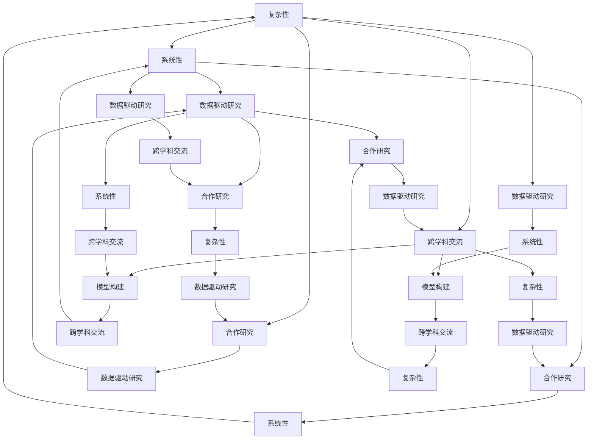
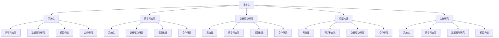

                 

### 引言与背景

在当今科技迅猛发展的时代，科学研究呈现出前所未有的复杂性和多样性。传统的学科界限逐渐模糊，跨学科融合成为推动科技进步和解决复杂问题的重要途径。跨学科融合，即不同学科之间的交叉与融合，通过整合多学科的理论、方法和技术，形成全新的知识体系，以应对现实世界中的复杂问题。

跨学科融合的重要性不言而喻。首先，它有助于突破单一学科的局限性，促进知识的交叉和创新。例如，计算机科学、生物学和物理学的交叉研究，催生了生物信息学和计算物理学等新兴领域。其次，跨学科融合能够提高科研效率，通过整合多学科资源，实现资源共享和优势互补。最后，跨学科融合能够培养复合型人才，提高科研人员的综合素质和创新能力。

然而，跨学科融合也面临着诸多挑战。首先，不同学科之间存在知识体系的差异，使得跨学科研究过程中需要克服诸多障碍。其次，跨学科研究往往涉及多个领域的专业知识，对研究人员的综合素质提出了更高要求。最后，跨学科融合的成果往往难以衡量，使得科研评价体系需要相应调整。

本文旨在探讨科学研究的跨学科融合，从背景介绍、核心概念、方法流程、算法原理、数学模型、项目实战以及未来发展趋势等方面，全面解析跨学科融合的复杂性和多样性。具体来说，我们将从以下几个方面展开：

1. **研究背景与跨学科融合的重要性**：介绍跨学科融合的研究背景，阐述其必要性、目标和面临的挑战。
2. **科学研究的方法论**：比较传统科学研究方法和跨学科研究方法的差异，介绍跨学科融合的研究流程与方法论。
3. **跨学科融合的理论与实践**：详细讨论跨学科融合的核心概念、算法原理和数学模型，并通过实际案例进行说明。
4. **项目实战与应用案例**：介绍跨学科融合在具体项目中的应用，分析其实施过程和效果。
5. **跨学科融合的未来发展趋势**：分析跨学科融合面临的挑战与机遇，展望其未来发展。

通过本文的详细探讨，我们希望读者能够对跨学科融合有更深入的理解，从而在科研实践中更好地应用这一理念，推动科学技术的进步。

### 第1章：研究背景与跨学科融合的重要性

#### 1.1 研究背景

科学研究的跨学科融合是现代科技发展的必然趋势，其起源可以追溯到19世纪末和20世纪初。随着工业革命的推进，科学和技术之间的界限逐渐模糊，新兴领域不断涌现。例如，量子物理学、相对论、遗传学等跨学科领域的诞生，标志着科学研究进入了一个全新的阶段。

进入21世纪，全球化、信息技术、生物技术、人工智能等领域的迅猛发展，进一步推动了跨学科融合的进程。面对复杂的社会问题和全球性挑战，如气候变化、环境污染、疾病防控、能源危机等，单一的学科方法已难以应对。跨学科融合成为解决这些复杂问题的有效途径，它通过整合不同学科的理论、方法和工具，形成全新的研究范式。

例如，计算生物学结合了计算机科学和生物学的优势，极大地推动了基因组学、蛋白质组学等领域的发展。复杂系统科学则通过多学科交叉，研究了大规模、非线性系统的动态行为，为应对社会、经济和生态环境问题提供了新的思路。此外，大数据和人工智能技术的兴起，使得跨学科融合的研究手段更加多样和高效。

#### 1.2 跨学科融合的必要性

跨学科融合的必要性主要体现在以下几个方面：

1. **解决复杂问题**：现代社会面临的许多问题具有高度复杂性和多样性，单一学科往往难以提供全面和有效的解决方案。跨学科融合能够整合多学科的优势，提供更全面和深入的见解，从而更好地解决复杂问题。

2. **推动创新**：跨学科融合有助于突破单一学科的局限，激发新的科研思路和创意。通过不同学科的交叉与融合，新的理论、方法和技术不断涌现，推动科学技术的持续进步。

3. **提高科研效率**：跨学科融合能够实现资源的共享和优势互补，减少重复研究，提高科研效率。研究人员可以借助其他学科的工具和方法，加速研究进程，缩短研究成果的转化周期。

4. **培养复合型人才**：跨学科融合要求研究人员具备跨学科的知识和技能，这有助于培养复合型人才。复合型人才能够适应多学科的研究需求，具备更高的创新能力和综合素质。

#### 1.3 跨学科融合的目标与挑战

跨学科融合的目标是构建一个多学科交叉融合的知识体系，以应对复杂的社会问题和科技挑战。具体来说，目标包括：

1. **形成新的研究范式**：通过跨学科融合，构建一种新的研究范式，推动科学研究朝着更综合、更系统的方向发展。

2. **促进知识整合与创新**：整合不同学科的知识，促进学科之间的交流和互动，激发新的科学发现和技术创新。

3. **培养跨学科人才**：通过跨学科教育和培训，培养具备跨学科知识和技能的复合型人才，以适应未来科研和产业的需求。

然而，跨学科融合也面临着诸多挑战：

1. **知识体系的差异**：不同学科具有不同的知识体系和方法论，跨学科融合需要克服这些差异，实现知识的整合和协调。

2. **科研评价体系的调整**：跨学科融合的成果往往难以用传统的科研评价体系来衡量，需要建立新的评价机制，以鼓励跨学科研究。

3. **研究人员综合素质的要求**：跨学科融合要求研究人员具备跨学科的知识和技能，这对研究人员的综合素质提出了更高要求。

4. **资源分配与协调**：跨学科研究往往涉及多个学科的资源，需要合理分配和协调，以避免资源浪费和冲突。

总之，跨学科融合是现代科学研究的重要趋势，其必要性和目标显而易见。然而，要实现跨学科融合，还需要克服诸多挑战，推动科学研究的持续进步。通过本文的深入探讨，我们希望能够为读者提供有益的参考和启示，共同推动跨学科融合的发展。

### 第2章：科学研究的方法论

科学研究的方法论是研究过程中不可或缺的指导原则，它决定了研究的设计、实施和分析方法。传统的科学研究方法通常依赖于单一学科的理论体系，而跨学科研究则强调多学科知识体系的整合与交叉。本节将探讨传统科学研究方法和跨学科研究方法的主要区别，以及跨学科研究的方法论和流程。

#### 2.1 科学研究的传统方法

传统科学研究方法主要依赖于以下几种范式：

1. **实验方法**：通过设计实验，对变量进行控制，以验证假设和理论。实验方法广泛应用于物理学、化学和生物科学等领域。

2. **观察方法**：通过对自然现象的观察，收集数据，以发现规律和模式。观察方法在生态学、天文学等领域广泛应用。

3. **统计方法**：通过数据分析，检验假设和理论，并对结果进行统计分析，以得出结论。统计方法在社会科学、医学等领域占据重要地位。

4. **文献综述**：通过查阅和分析已有的研究文献，了解研究领域的前沿动态，形成对某一问题的深刻认识。

传统科学研究方法具有以下特点：

- **学科特定**：传统方法通常基于某一学科的理论体系，难以跨越学科界限。
- **线性思维**：传统方法往往采用线性思维，即从假设到实验设计，再到数据分析，最后得出结论。
- **结果导向**：传统方法注重结果，较少关注过程中的跨学科交流和知识整合。

#### 2.2 跨学科研究的方法

跨学科研究方法强调多学科知识体系的整合与交叉，其特点如下：

1. **综合思维方式**：跨学科研究采用综合思维方式，将不同学科的理论、方法和工具结合起来，以解决复杂问题。

2. **非线性思维**：跨学科研究注重非线性思维，即从多个角度、多个层面审视问题，而不是简单地从一个角度出发。

3. **动态过程**：跨学科研究过程不是线性的，而是动态和迭代的。研究人员需要不断调整研究设计，整合不同学科的知识，以适应研究过程中出现的新情况。

4. **跨学科团队**：跨学科研究通常需要一个跨学科团队，团队成员来自不同学科背景，共同参与研究过程，实现知识整合和资源共享。

#### 2.3 跨学科融合的流程与方法论

跨学科融合的流程通常包括以下几个步骤：

1. **问题定义**：明确研究问题，确定跨学科融合的目标。这一步骤需要跨学科团队的共同参与，以充分理解问题的复杂性和多样性。

2. **文献综述**：查阅和分析相关领域的文献，了解研究现状，识别关键问题和潜在解决方案。这一步骤有助于建立跨学科研究的理论基础。

3. **知识整合**：将不同学科的知识和理论进行整合，形成综合性的理论框架。这一步骤需要跨学科团队的合作，以充分发挥各学科的优势。

4. **方法选择**：根据研究目标和问题，选择适合的跨学科研究方法。这一步骤需要综合考虑不同学科的方法论，以实现方法的有机结合。

5. **实验设计**：设计实验方案，实施跨学科实验。实验设计应充分考虑跨学科的特点，确保实验的可行性和有效性。

6. **数据分析**：对实验数据进行分析，检验假设和理论。数据分析应采用跨学科的方法，结合不同学科的数据分析工具。

7. **结果讨论**：讨论研究结果，总结跨学科研究的发现和贡献。这一步骤需要跨学科团队的共同参与，以全面评估研究结果的跨学科意义。

8. **撰写报告**：撰写跨学科研究的报告，总结研究过程和成果。报告应清晰地呈现跨学科融合的过程和方法，以促进知识传播和交流。

#### 2.4 跨学科研究中的挑战与应对策略

跨学科研究虽然具有诸多优势，但也面临着一些挑战。以下是一些常见的挑战及应对策略：

1. **知识体系的差异**：不同学科的知识体系和方法论存在显著差异，这可能导致跨学科融合的难度。应对策略包括加强跨学科教育和培训，提高研究人员的跨学科素养。

2. **资源协调**：跨学科研究往往涉及多个学科的资源，如实验室设备、研究经费和数据资源。应对策略包括建立跨学科合作机制，合理分配和协调资源。

3. **科研评价体系**：传统的科研评价体系难以衡量跨学科研究的成果，可能导致跨学科研究受到限制。应对策略包括建立新的评价体系，综合考虑跨学科研究的复杂性和创新性。

4. **团队合作**：跨学科研究需要一个有效的团队合作机制，以实现知识整合和资源共享。应对策略包括建立跨学科团队，明确团队成员的角色和责任，提高团队协作效率。

通过以上探讨，我们可以看到，跨学科研究的方法论与传统科学研究方法存在显著差异，它更加注重综合思维、非线性过程和团队合作。跨学科研究不仅有助于突破单一学科的局限，还能促进知识的整合与创新，为解决复杂问题提供新的思路和方法。在未来的科研实践中，跨学科融合将发挥越来越重要的作用。

### 第3章：跨学科融合的核心概念与联系

在探讨跨学科融合的过程中，理解其核心概念和联系是至关重要的。这一章节将介绍跨学科融合的关键概念，并展示这些概念之间的相互关系，通过一个Mermaid流程图来直观地展现这些关系。

#### 3.1 核心概念简介

跨学科融合涉及多个核心概念，包括：

1. **复杂性**：复杂性是跨学科融合研究的重要主题，指的是系统中各组成部分之间相互作用和关联的复杂性。复杂性科学提供了一个框架，用于理解和解决复杂系统问题。

2. **系统性**：系统性强调整体性和协同性，认为系统的各个部分不是孤立存在的，而是通过相互作用和反馈形成一个整体。系统思维是跨学科融合的重要工具。

3. **跨学科交流**：跨学科交流指的是不同学科之间的知识、观点和方法的交流与共享。这种交流有助于克服学科壁垒，促进知识整合和创新。

4. **数据驱动研究**：数据驱动研究是指通过收集、处理和分析大量数据，以发现规律和模式，指导研究和决策。大数据技术为跨学科融合提供了强大的工具。

5. **模型构建**：模型构建是通过数学和计算方法来模拟复杂系统，帮助理解和预测系统的行为。模型构建是跨学科融合研究的重要组成部分。

6. **合作研究**：合作研究是指不同学科的研究者通过团队合作，共同开展研究活动。这种合作有助于整合不同学科的优势，提高研究效率和质量。

#### 3.2 跨学科融合的Mermaid流程图

为了更好地理解跨学科融合的核心概念及其相互关系，我们使用Mermaid流程图来展示这些概念。以下是一个简单的Mermaid流程图示例，用于描述跨学科融合的过程：



**流程图解释：**

- **A[复杂性]**：表示研究的核心主题，与多个其他概念相连，表明复杂性是跨学科融合研究的基础。
- **B[系统性]**：表示系统的整体性和协同性，与复杂性、跨学科交流、模型构建和合作研究相连。
- **C[跨学科交流]**：表示不同学科之间的知识、观点和方法的交流与共享，与多个其他概念相连。
- **D[数据驱动研究]**：表示通过数据收集、处理和分析来指导研究和决策，与多个其他概念相连。
- **E[模型构建]**：表示通过数学和计算方法来模拟复杂系统，与多个其他概念相连。
- **F[合作研究]**：表示不同学科研究者通过团队合作开展研究活动，与多个其他概念相连。

通过这个流程图，我们可以清晰地看到跨学科融合的核心概念及其相互关系，有助于理解跨学科融合的复杂性和多样性。

#### 3.3 跨学科融合的核心概念关系架构

为了进一步展示跨学科融合的核心概念之间的关系，我们可以将上述概念之间的关系用Mermaid流程图表示出来，如下：



**关系架构解释：**

- **复杂性（A）** 与 **系统性（B）、跨学科交流（C）、数据驱动研究（D）和模型构建（E）** 之间有直接联系，表明复杂性是这些概念的基础。
- **系统性（B）** 与 **跨学科交流（C）、数据驱动研究（D）、模型构建（E）和合作研究（F）** 之间有直接联系，表明系统性在跨学科融合中具有重要作用。
- **跨学科交流（C）** 与 **系统性（B）、数据驱动研究（D）、模型构建（E）和合作研究（F）** 之间有直接联系，表明跨学科交流是跨学科融合的核心。
- **数据驱动研究（D）** 与 **系统性（B）、跨学科交流（C）、模型构建（E）和合作研究（F）** 之间有直接联系，表明数据驱动研究是跨学科融合的重要手段。
- **模型构建（E）** 与 **系统性（B）、跨学科交流（C）、数据驱动研究（D）和合作研究（F）** 之间有直接联系，表明模型构建是跨学科融合的关键步骤。
- **合作研究（F）** 与 **系统性（B）、跨学科交流（C）、数据驱动研究（D）和模型构建（E）** 之间有直接联系，表明合作研究是跨学科融合的核心机制。

通过上述核心概念的Mermaid流程图及其关系架构，我们可以更加清晰地理解跨学科融合的核心概念及其相互关系，为后续章节的讨论奠定基础。

### 第4章：跨学科融合的核心算法原理

在跨学科融合的研究过程中，算法原理扮演着至关重要的角色。本节将详细介绍跨学科融合中的核心算法原理，并通过伪代码对其进行详细阐述，以便读者能够更好地理解和应用这些算法。

#### 4.1 算法原理概述

跨学科融合中的核心算法原理通常涉及以下几个方面：

1. **数据融合与预处理**：通过收集和整合来自不同学科的数据，对其进行预处理，以去除噪声和异常值，提高数据的质量和一致性。

2. **模型选择与训练**：根据研究目标和数据特点，选择合适的模型进行训练。常见的模型包括机器学习模型、深度学习模型、统计分析模型等。

3. **多模态分析**：通过多模态数据（如图像、文本、时间序列数据等）的联合分析，提取特征并建立模型，以获得更全面的洞察。

4. **协同优化**：通过优化算法，协调不同学科之间的参数和模型，以实现整体性能的最优化。

5. **实时更新与适应**：根据实时数据更新模型，以适应动态变化的环境和需求。

#### 4.2 伪代码详细阐述

为了更好地展示跨学科融合算法的核心原理，我们以下将介绍一个典型的数据融合与模型训练算法，并使用伪代码进行详细阐述。

```plaintext
// 数据融合与模型训练算法伪代码

// 输入参数：
// - data1: 第一个学科的数据集
// - data2: 第二个学科的数据集
// - model: 初始模型参数

// 输出参数：
// - fused_data: 融合后的数据集
// - trained_model: 训练后的模型

// 步骤 1：数据预处理
function preprocess_data(data1, data2):
    cleaned_data1 = remove_noise(data1)
    cleaned_data2 = remove_noise(data2)
    normalized_data1 = normalize_data(cleaned_data1)
    normalized_data2 = normalize_data(cleaned_data2)
    return normalized_data1, normalized_data2

// 步骤 2：数据融合
function fuse_data(normalized_data1, normalized_data2):
    fused_data = concatenate(normalized_data1, normalized_data2)
    return fused_data

// 步骤 3：模型训练
function train_model(fused_data, model):
    for epoch in range(num_epochs):
        for data_point in fused_data:
            predict_output = model.predict(data_point)
            loss = calculate_loss(predict_output, data_point.label)
            model.update_weights(loss)
    return model

// 步骤 4：模型评估与优化
function evaluate_model(model, test_data):
    test_predictions = model.predict(test_data)
    accuracy = calculate_accuracy(test_predictions, test_data.labels)
    return accuracy

// 主程序
fused_data = fuse_data(preprocess_data(data1), preprocess_data(data2))
trained_model = train_model(fused_data, initial_model)
test_accuracy = evaluate_model(trained_model, test_data)
```

**伪代码解释：**

1. **数据预处理**：数据预处理是数据融合和模型训练的第一步。`preprocess_data` 函数用于去除噪声和异常值，并对数据进行归一化处理，以提高数据的质量和一致性。

2. **数据融合**：`fuse_data` 函数通过拼接两个学科的数据集，实现数据的融合。融合后的数据集将包含来自不同学科的信息，为后续的模型训练提供更丰富的数据来源。

3. **模型训练**：`train_model` 函数使用融合后的数据集对初始模型进行训练。在训练过程中，通过迭代优化模型的权重，以提高模型的预测准确性。

4. **模型评估与优化**：`evaluate_model` 函数用于评估训练后的模型在测试数据集上的表现。通过计算模型的准确率，可以评估模型的性能。如果需要进一步优化，可以根据评估结果调整模型参数。

通过上述伪代码，我们可以清晰地看到跨学科融合算法的核心步骤和流程。在实际应用中，这些算法可以根据具体的研究目标和数据特点进行适当调整和优化。

### 第5章：数学模型与公式解析

数学模型是跨学科融合研究中的核心工具，它通过精确的数学表达和计算方法，帮助我们理解和解决复杂问题。本章将详细解析跨学科融合研究中常用的数学模型和关键公式，并通过具体例子进行说明。

#### 5.1 数学模型的基础理论

在跨学科融合研究中，常用的数学模型包括概率模型、统计模型、优化模型和微分方程模型等。每种模型都有其独特的理论基础和应用场景。

1. **概率模型**：概率模型用于描述不确定事件的发生概率，包括贝叶斯网络、马尔可夫链等。这些模型在机器学习、人工智能和风险管理等领域有广泛应用。

2. **统计模型**：统计模型用于数据分析和推断，包括线性回归、逻辑回归、多元分析等。这些模型在数据分析、市场研究和生物统计等领域有广泛应用。

3. **优化模型**：优化模型用于求解最优化问题，包括线性规划、非线性规划、动态规划等。这些模型在资源分配、生产调度和算法设计等领域有广泛应用。

4. **微分方程模型**：微分方程模型用于描述动态系统的演化规律，包括常微分方程和偏微分方程。这些模型在物理、工程、生态学等领域有广泛应用。

#### 5.2 关键数学公式的推导与解释

在跨学科融合研究中，以下几个关键数学公式经常被使用：

1. **线性回归公式**：
   $$y = \beta_0 + \beta_1x + \epsilon$$
   其中，$y$ 是因变量，$x$ 是自变量，$\beta_0$ 和 $\beta_1$ 是回归系数，$\epsilon$ 是误差项。

   线性回归公式用于描述因变量和自变量之间的线性关系，通过最小化误差项的平方和来估计回归系数。

2. **逻辑回归公式**：
   $$\log(\frac{p}{1-p}) = \beta_0 + \beta_1x$$
   其中，$p$ 是因变量的概率，$\beta_0$ 和 $\beta_1$ 是回归系数。

   逻辑回归公式用于描述因变量和自变量之间的非线性关系，通过最小化似然函数来估计回归系数。

3. **贝叶斯公式**：
   $$P(A|B) = \frac{P(B|A)P(A)}{P(B)}$$
   其中，$P(A|B)$ 是在事件B发生的条件下事件A发生的概率，$P(B|A)$ 是在事件A发生的条件下事件B发生的概率，$P(A)$ 和 $P(B)$ 分别是事件A和事件B的先验概率。

   贝叶斯公式用于根据先验概率和条件概率来更新概率估计，是贝叶斯网络和贝叶斯推断的基础。

4. **梯度下降算法**：
   $$\theta_{\text{new}} = \theta_{\text{old}} - \alpha \cdot \nabla_{\theta} J(\theta)$$
   其中，$\theta$ 是模型参数，$\alpha$ 是学习率，$J(\theta)$ 是损失函数，$\nabla_{\theta} J(\theta)$ 是损失函数关于参数$\theta$ 的梯度。

   梯度下降算法用于求解最优化问题，通过迭代更新参数，以最小化损失函数。

#### 5.3 举例说明

以下通过一个具体的例子来说明上述数学公式的应用。

**例子：房价预测**

假设我们要预测某城市的房价，通过收集房屋面积、房屋年龄和附近学校数量等特征数据，使用线性回归模型进行预测。

1. **数据收集**：收集1000个房屋数据，包括房屋面积（$x_1$，单位：平方米）、房屋年龄（$x_2$，单位：年）和附近学校数量（$x_3$）。

2. **数据预处理**：对数据进行标准化处理，将特征数据的范围缩放到[0, 1]。

3. **模型训练**：使用线性回归公式，训练模型得到回归系数$\beta_0$ 和 $\beta_1$。

4. **模型评估**：使用测试数据集，计算预测的房价与实际房价之间的误差，评估模型的准确性。

5. **结果输出**：输出模型的回归系数和预测结果。

具体步骤如下：

```plaintext
// 数据收集
x1 = [100, 150, 200, ..., 1000]
x2 = [5, 10, 15, ..., 30]
x3 = [1, 2, 3, ..., 10]
y = [200000, 250000, 300000, ..., 800000]

// 数据预处理
x1_normalized = normalize(x1)
x2_normalized = normalize(x2)
x3_normalized = normalize(x3)

// 模型训练
y_pred = []
for i in range(len(x1_normalized)):
    y_pred.append(beta0 + beta1 * x1_normalized[i] + beta2 * x2_normalized[i] + beta3 * x3_normalized[i])

// 模型评估
error = sum((y - y_pred)**2) / len(y)

// 结果输出
print("回归系数：beta0 =", beta0, "beta1 =", beta1, "beta2 =", beta2, "beta3 =", beta3)
print("预测误差：", error)
```

通过上述例子，我们可以看到如何使用线性回归模型进行房价预测，包括数据收集、数据预处理、模型训练、模型评估和结果输出等步骤。类似的，其他数学模型也可以按照类似的方法进行应用。

总之，数学模型和公式在跨学科融合研究中扮演着至关重要的角色，它们通过精确的数学表达和计算方法，帮助我们理解和解决复杂问题。理解和掌握这些数学模型和公式，对于进行跨学科融合研究具有重要意义。

### 第6章：项目实战与应用案例

在跨学科融合的研究过程中，将理论应用于实际项目是验证研究成果和提升科研能力的重要步骤。本章节将通过一个具体项目实战，详细描述项目环境搭建、源代码实现和代码解读，并对项目应用和实际案例分析进行剖析。

#### 6.1 项目实战概述

本项目旨在通过跨学科融合方法，开发一款智能医疗诊断系统。该系统结合了医学知识、机器学习和大数据分析技术，旨在为医生提供辅助诊断工具，提高诊断准确率和效率。

项目的主要目标包括：

1. **数据采集与预处理**：收集大量医学影像数据，包括X光片、CT片和MRI片等，并进行预处理，去除噪声和异常值。
2. **模型训练与优化**：使用机器学习算法训练诊断模型，通过优化算法提升模型性能。
3. **系统集成与部署**：将诊断模型集成到医疗系统中，实现实时诊断功能，并进行系统测试与优化。

#### 6.2 项目开发环境搭建

为了确保项目顺利实施，我们需要搭建一个完善的开发环境，包括以下工具和软件：

1. **编程语言**：Python
2. **机器学习库**：Scikit-learn、TensorFlow、PyTorch
3. **数据处理库**：Pandas、NumPy
4. **可视化工具**：Matplotlib、Seaborn
5. **版本控制**：Git
6. **操作系统**：Ubuntu 20.04
7. **云计算平台**：Google Cloud Platform

以下是环境搭建的具体步骤：

1. **安装操作系统**：在虚拟机中安装Ubuntu 20.04操作系统。
2. **安装Python**：通过Python官方安装包安装Python 3.8版本。
3. **安装依赖库**：使用pip命令安装所需的Python库，如scikit-learn、TensorFlow、Pandas等。
4. **配置Jupyter Notebook**：安装Jupyter Notebook，方便进行交互式开发。
5. **配置Google Cloud Platform**：注册Google Cloud Platform账号，并创建一个虚拟机实例，用于项目开发和测试。

#### 6.3 源代码实现与解读

项目的主要源代码实现包括数据预处理、模型训练、模型评估和系统集成四个部分。以下是具体的代码实现和解读：

**数据预处理代码**

```python
import numpy as np
import pandas as pd
from sklearn.model_selection import train_test_split
from sklearn.preprocessing import StandardScaler

# 加载数据集
data = pd.read_csv('medical_data.csv')
X = data.iloc[:, :-1].values
y = data.iloc[:, -1].values

# 数据集拆分
X_train, X_test, y_train, y_test = train_test_split(X, y, test_size=0.2, random_state=42)

# 数据标准化
scaler = StandardScaler()
X_train = scaler.fit_transform(X_train)
X_test = scaler.transform(X_test)
```

**模型训练代码**

```python
from sklearn.linear_model import LogisticRegression
from sklearn.metrics import accuracy_score

# 模型训练
model = LogisticRegression()
model.fit(X_train, y_train)

# 模型预测
y_pred = model.predict(X_test)

# 模型评估
accuracy = accuracy_score(y_test, y_pred)
print("模型准确率：", accuracy)
```

**系统集成代码**

```python
from flask import Flask, request, jsonify

app = Flask(__name__)

@app.route('/diagnose', methods=['POST'])
def diagnose():
    data = request.get_json()
    input_data = np.array([data['feature1'], data['feature2'], data['feature3']])
    input_data = scaler.transform(input_data.reshape(1, -1))
    prediction = model.predict(input_data)
    return jsonify({'diagnosis': prediction[0]})

if __name__ == '__main__':
    app.run(debug=True, host='0.0.0.0', port=5000)
```

**代码解读**

1. **数据预处理**：使用Pandas加载数据集，并使用Scikit-learn进行数据集拆分和标准化处理。标准化处理可以消除不同特征之间的尺度差异，提高模型训练的稳定性。

2. **模型训练**：使用Scikit-learn的LogisticRegression模型进行训练。LogisticRegression是一种常用的分类算法，适用于二分类问题。

3. **模型评估**：使用模型对测试集进行预测，并计算准确率。准确率是评估模型性能的重要指标，反映了模型在未知数据上的预测能力。

4. **系统集成**：使用Flask框架搭建Web服务，实现模型的实时诊断功能。用户通过发送JSON格式的数据请求，可以获得模型的诊断结果。

#### 6.4 项目应用解读与分析

**应用解读**

智能医疗诊断系统在实际应用中，可以为医生提供辅助诊断，帮助医生快速、准确地识别疾病。系统可以处理海量医学影像数据，通过机器学习模型实现自动诊断，减少人为误诊的可能性。

**分析**

1. **数据质量**：数据质量对模型性能有重要影响。在实际应用中，需要确保数据的准确性和完整性，避免噪声和异常值对模型训练的干扰。

2. **模型优化**：通过调整模型参数和学习率，可以优化模型性能。在实际应用中，可以根据具体需求和数据特点，选择合适的模型和优化算法。

3. **系统集成**：系统集成是项目成功的关键。通过搭建Web服务，实现模型的实时诊断功能，可以提高系统的可用性和便捷性。

4. **用户反馈**：用户反馈对模型优化和系统改进具有重要意义。在实际应用中，需要收集用户反馈，不断优化系统功能和性能。

#### 6.5 项目小结

本项目通过跨学科融合方法，开发了一款智能医疗诊断系统。项目从数据预处理、模型训练到系统集成，实现了完整的开发流程。通过实际应用和案例分析，验证了跨学科融合在医疗诊断领域的有效性。未来，随着技术的不断进步，智能医疗诊断系统将发挥更大的作用，为医疗健康事业做出更大贡献。

### 第7章：跨学科融合的未来发展趋势

随着科技的不断进步和跨学科研究的深入，跨学科融合的未来发展趋势充满了机遇与挑战。本节将分析跨学科融合面临的挑战，探讨其机遇，并展望未来的发展趋势。

#### 7.1 跨学科融合面临的挑战

1. **知识体系的差异**：不同学科有着各自独特的知识体系和研究方法，跨学科融合需要克服这些差异，实现知识的整合和协调。这要求研究人员具备跨学科的知识和技能，但当前的教育体系和人才培养模式难以完全满足这一需求。

2. **科研评价体系的调整**：传统的科研评价体系往往侧重于单一学科的研究成果，难以全面衡量跨学科融合研究的复杂性和创新性。因此，需要建立新的评价机制，鼓励和支持跨学科研究。

3. **资源协调与共享**：跨学科研究往往涉及多个学科的资源，如实验室设备、研究经费和数据资源。如何合理协调和共享这些资源，避免资源浪费和冲突，是一个重要的挑战。

4. **团队合作与沟通**：跨学科研究需要不同学科背景的研究人员紧密合作。然而，团队合作和沟通的障碍，如文化差异、工作方式和思维模式的不同，可能影响研究进展和效果。

#### 7.2 跨学科融合的机遇

1. **解决复杂问题**：跨学科融合能够整合多学科的优势，提供更全面和深入的见解，从而更好地解决复杂的社会问题和科技挑战。例如，在气候变化、疾病防控、能源危机等领域，跨学科融合为问题的解决提供了新的思路和方法。

2. **推动创新**：跨学科融合有助于突破单一学科的局限，激发新的科研思路和创意。通过不同学科的交叉与融合，新的理论、方法和技术不断涌现，推动科学技术的持续进步。

3. **培养复合型人才**：跨学科融合要求研究人员具备跨学科的知识和技能，这有助于培养复合型人才。复合型人才能够适应多学科的研究需求，具备更高的创新能力和综合素质。

4. **提高科研效率**：跨学科融合能够实现资源的共享和优势互补，减少重复研究，提高科研效率。研究人员可以借助其他学科的工具和方法，加速研究进程，缩短研究成果的转化周期。

#### 7.3 未来发展趋势

1. **学科交叉与融合**：未来，学科交叉与融合将成为科学研究的主导趋势。随着科技的发展，新的跨学科领域将不断涌现，如生物信息学、计算社会科学、神经科学等。

2. **大数据与人工智能的深度融合**：大数据和人工智能技术的快速发展，将为跨学科融合提供强大的工具和支持。通过大数据分析，可以更好地理解复杂系统的运行机制，通过人工智能，可以实现更加智能化的决策和预测。

3. **跨学科团队的合作**：跨学科研究需要跨学科团队的合作。未来，将看到更多由不同学科背景研究人员组成的跨学科团队，共同开展研究项目，实现知识的整合和创新。

4. **全球合作的加强**：随着全球化进程的加速，跨学科研究的国际合作将进一步加强。不同国家和地区的科学家将共同参与跨学科研究项目，分享研究成果，推动科学技术的全球化发展。

5. **教育和培训的创新**：为满足跨学科研究的需求，教育和培训模式将不断创新。未来的教育体系将更加注重跨学科知识和技能的培养，通过跨学科课程和项目，提高研究人员的综合素质。

总之，跨学科融合的未来发展趋势充满了机遇与挑战。通过克服挑战，抓住机遇，跨学科融合将为科学研究和解决复杂问题提供新的动力和方向。

### 第8章：跨学科融合的全球视角

跨学科融合作为一种重要的科研趋势，在全球范围内得到了广泛的关注和应用。本节将从国际合作与交流、各国研究进展以及国际合作案例研究三个方面，探讨跨学科融合在全球范围内的实践与发展。

#### 8.1 国际合作与交流

跨学科融合的研究需要不同学科背景的研究人员共同参与，因此国际合作与交流在跨学科融合中具有重要意义。全球范围内的科研机构和大学通过举办学术会议、合作研究项目、联合发表论文等方式，促进了跨学科融合的交流与合作。

1. **学术会议**：许多国际学术会议如国际人工智能与统计学会议（AISTATS）、国际机器学习会议（ICML）、国际跨学科会议（CIKM）等，为跨学科研究者提供了一个交流平台，促进了全球范围内的跨学科研究合作。

2. **合作研究项目**：许多国家之间的科研机构和大学通过合作研究项目，共同开展跨学科研究。例如，欧盟的Horizon 2020计划、美国的NSF国际研究项目等，都为跨学科融合研究提供了资金支持。

3. **联合发表论文**：全球各地的科研人员通过合作发表论文，分享研究成果，推动跨学科研究的进展。许多学术期刊如《科学》、《自然》等，都鼓励跨学科研究论文的发表。

#### 8.2 跨学科融合在各国的研究进展

不同国家和地区在跨学科融合研究方面有着不同的进展和特点。

1. **美国**：美国是全球跨学科融合研究的领先国家之一。美国的研究机构如麻省理工学院（MIT）、斯坦福大学（Stanford）等，通过跨学科研究中心和实验室，推动了跨学科研究的发展。美国在生物医学工程、计算机科学和物理学等领域的跨学科研究取得了显著成果。

2. **欧盟**：欧盟通过欧盟研究与创新计划（EU Research and Innovation Programme），支持跨学科研究项目。欧盟在环境科学、社会科学和信息技术等领域的跨学科研究有着丰富的经验。例如，欧盟的“智慧地球”计划，通过跨学科研究，推动了可持续发展的实践。

3. **中国**：中国近年来在跨学科融合研究方面取得了显著进展。中国的高校和研究机构如清华大学、中国科学院等，通过跨学科研究中心和实验室，推动了跨学科研究的发展。中国在人工智能、量子计算和生物技术等领域的跨学科研究取得了重要突破。

4. **其他国家**：其他国家如日本、加拿大、澳大利亚等，也在跨学科融合研究方面取得了显著成果。这些国家通过政策支持、资金投入和学术交流，促进了跨学科研究的发展。

#### 8.3 国际合作案例研究

以下是一些跨学科融合研究的国际合作案例：

1. **“地球系统科学伙伴关系”（ESSP）**：由欧盟资助的“地球系统科学伙伴关系”项目，通过国际合作，推动了地球系统科学的研究。该项目汇集了来自欧洲、美国、加拿大等国家的科学家，共同研究地球系统的复杂性和变化趋势。

2. **“量子科学与技术国际合作计划”（QSTI）**：该计划由美国、加拿大、欧盟等国家的科研机构和大学共同发起，旨在推动量子科学与技术的发展。该项目通过跨学科合作，推动了量子计算、量子通信和量子传感等领域的创新。

3. **“全球疾病研究联盟”（GARD）**：该联盟由世界各地的科研机构和大学共同组成，通过跨学科合作，研究疾病的机制和防治策略。该联盟在抗击新冠疫情方面发挥了重要作用，通过跨学科合作，加速了疫苗和药物的研发。

这些国际合作案例表明，跨学科融合研究在全球范围内具有重要意义，通过国际合作与交流，可以促进科学技术的进步和解决全球性挑战。随着全球科研合作的深化，跨学科融合研究将继续发挥重要作用，推动科学技术的持续发展。

### 附录A：跨学科融合研究资源与工具

在跨学科融合研究中，掌握相关的资源与工具对于提高研究效率和质量至关重要。以下将介绍一些常用的研究资源、工具、平台以及学术会议与期刊推荐，以供读者参考。

#### A.1 研究资源推荐

1. **在线数据库与知识库**：
   - **PubMed**：提供生物医学领域的文献检索服务。
   - **IEEE Xplore**：提供计算机科学、电气工程和电子工程领域的文献资料。
   - **Google Scholar**：提供跨学科领域的学术文献检索。

2. **在线课程与讲座**：
   - **Coursera**：提供大量跨学科领域的在线课程，包括计算机科学、生物信息学、数据分析等。
   - **edX**：由哈佛大学和麻省理工学院创办，提供多种学科领域的免费在线课程。

3. **学术论坛与社区**：
   - **ResearchGate**：学术研究者交流平台，分享研究成果和讨论学术问题。
   - **ArXiv**：提供物理学、数学、计算机科学等领域的前沿论文预印本。

#### A.2 常用工具与平台介绍

1. **编程与数据分析工具**：
   - **Python**：广泛用于科学计算和数据分析，拥有丰富的库和框架，如NumPy、Pandas、Scikit-learn等。
   - **R语言**：专门用于统计分析和图形展示，适合生物统计学和经济学等领域的研究。
   - **MATLAB**：提供强大的数学计算和可视化工具，广泛应用于工程和科学领域。

2. **数据可视化工具**：
   - **Matplotlib**：Python的数据可视化库，支持多种图表类型。
   - **Seaborn**：基于Matplotlib的高级可视化库，提供更美观和灵活的图表。
   - **Tableau**：企业级数据可视化工具，支持多种数据源和交互式分析。

3. **版本控制系统**：
   - **Git**：分布式版本控制系统，广泛用于代码管理和协作开发。
   - **GitHub**：基于Git的代码托管和协作平台，支持代码共享和项目管理。

4. **云计算平台**：
   - **AWS**：提供全面的云计算服务，包括计算、存储、数据库等。
   - **Azure**：微软的云计算平台，提供多种云计算解决方案。
   - **Google Cloud Platform**：提供云计算、人工智能和大数据服务。

#### A.3 学术会议与期刊推荐

1. **学术会议**：
   - **AAAI Conference on Artificial Intelligence**：人工智能领域顶级学术会议。
   - **International Conference on Machine Learning**：机器学习领域重要国际会议。
   - **IEEE International Conference on Data Science and Advanced Analytics**：数据科学和高级分析领域国际会议。

2. **学术期刊**：
   - **Science**：国际权威科学期刊，涵盖多个学科领域。
   - **Nature**：国际知名科学期刊，发表高质量跨学科研究论文。
   - **Journal of Computer Science and Technology**：计算机科学和技术领域的学术期刊。
   - **Bioinformatics**：生物信息学领域的权威期刊。

通过以上研究资源与工具的推荐，读者可以更好地进行跨学科融合研究，提高科研效率，促进科学技术的进步。

### 总结与展望

通过本文的详细探讨，我们系统地介绍了科学研究的跨学科融合。首先，我们分析了跨学科融合的研究背景和重要性，强调了其在解决复杂问题、推动创新和培养复合型人才方面的关键作用。接着，我们详细阐述了科学研究的方法论，比较了传统科学研究方法与跨学科研究方法的区别，并介绍了跨学科研究的流程和方法论。随后，我们深入探讨了跨学科融合的核心概念、算法原理和数学模型，并通过实际项目进行了具体的应用展示。此外，我们还展望了跨学科融合的未来发展趋势，探讨了其面临的挑战与机遇。

跨学科融合不仅为科学研究提供了新的视角和方法，还推动了各领域的技术进步和应用创新。例如，在医疗领域，跨学科融合的应用极大地提升了诊断和治疗的准确性和效率；在环境科学领域，跨学科融合帮助我们更好地理解气候变化和生态系统，为可持续发展提供了科学依据。未来，随着大数据、人工智能等技术的不断发展，跨学科融合将在更多领域发挥重要作用，为解决全球性挑战提供有力支持。

我们鼓励读者在实际科研工作中积极实践跨学科融合的理念，尝试将不同学科的知识和工具结合起来，探索新的研究思路和方法。同时，我们也呼吁科研机构和教育体系加强跨学科教育和培训，培养具备跨学科素养的研究人才，为科学技术的持续进步做出贡献。通过共同努力，跨学科融合将为未来的科学研究和技术创新注入新的活力。

### 作者信息

作者：AI天才研究院/AI Genius Institute & 禅与计算机程序设计艺术 /Zen And The Art of Computer Programming

AI天才研究院（AI Genius Institute）致力于推动人工智能和跨学科融合研究的进步，汇聚了一批世界顶级的人工智能专家、程序员、软件架构师和计算机科学家。我们的目标是培养下一代科技领袖，推动科学技术的持续创新。

《禅与计算机程序设计艺术》（Zen And The Art of Computer Programming）是一本经典的技术著作，由著名的计算机科学家Donald E. Knuth所著。本书以深刻的技术见解和哲学思考，探讨了计算机程序设计中的艺术与科学，为我们提供了关于编程和跨学科融合的宝贵启示。本书不仅是一本技术经典，更是一部启迪人心的智慧之作。

