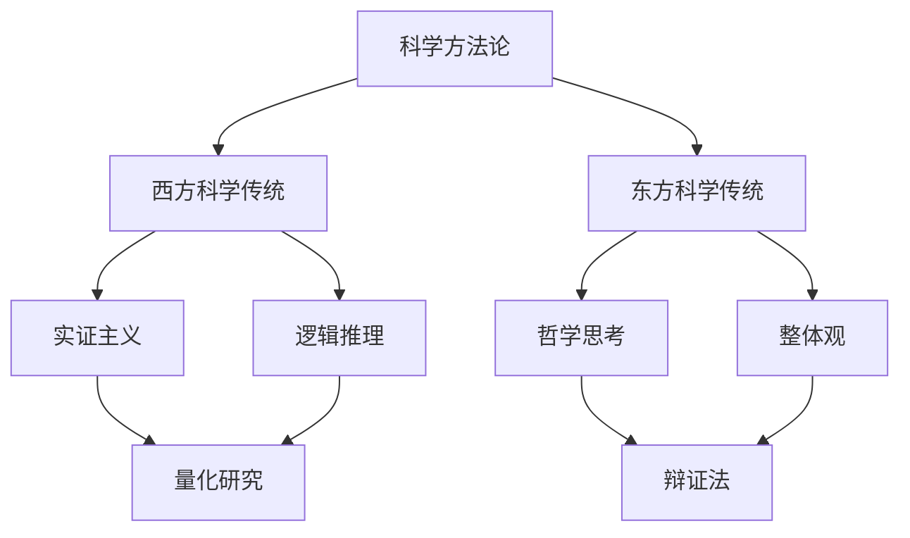

                 

## 文章标题

### 《科学研究的跨文化视角：世界可理解性的多元解读》

在当今全球化进程不断加快的背景下，科学研究不再局限于单一文化环境，而是需要面对多元文化的挑战和机遇。科学研究的跨文化视角，不仅是学术交流的需要，更是理解世界多样性和推动科学进步的关键。本文旨在探讨科学研究的跨文化视角，通过多元解读的方式，深入分析世界可理解性的多重维度。

关键词：跨文化研究、世界可理解性、多元解读、科学方法论、认知科学

摘要：本文首先介绍了跨文化研究的背景和重要性，接着从科学方法论、跨文化心理学和跨文化认知科学三个角度探讨了世界可理解性的多元解读。随后，文章提出了文化相对论、多元文化方法论和跨文化比较研究三种方法，并分析了其在科学研究中的应用。通过具体案例，本文展示了跨文化视角在科学研究中的实际应用和挑战，并对未来研究方向进行了展望。文章旨在为科学研究者提供跨文化视角下的新思路，以促进全球科学合作和知识交流。

### 引言

#### 1.1 书籍背景与目标

《科学研究的跨文化视角：世界可理解性的多元解读》是一本旨在探讨跨文化研究在科学研究中的应用的学术著作。随着全球化进程的加速，科学研究不再是某个国家或地区的专利，而是需要全球范围内的合作和交流。跨文化视角的引入，不仅能够丰富科学研究的视角，还能够促进不同文化背景下的科学家的理解和合作。

本书的目标是通过对跨文化视角的深入探讨，揭示世界可理解性的多元解读，为科学研究者提供新的思考方式和研究方法。具体来说，本书旨在解决以下几个问题：

1. 跨文化研究在科学方法论中的应用如何？
2. 跨文化心理学如何影响科学研究的理解和实施？
3. 跨文化认知科学对科学研究有哪些启示和挑战？
4. 多元解读方法如何应用于实际科学研究中？
5. 跨文化视角在科学研究中的挑战和未来展望是什么？

#### 1.2 跨文化研究概述

跨文化研究（Intercultural Research）是指在不同文化背景下进行的研究活动，旨在理解和解释文化差异及其对人类行为和社会现象的影响。跨文化研究的范畴广泛，包括不同国家、地区、种族、宗教、语言和社会制度的比较研究。

跨文化研究的重要性体现在以下几个方面：

1. **促进文化交流和理解**：跨文化研究有助于消除误解和偏见，增进不同文化背景的人们之间的理解和尊重。
2. **推动科学进步**：跨文化视角能够揭示单一文化研究中忽视的重要现象和规律，为科学理论的发展提供新的实证依据。
3. **解决全球性问题**：跨文化研究在应对全球性问题时具有重要作用，如气候变化、疾病传播、贫困和冲突等。
4. **培养全球公民意识**：通过跨文化研究，人们可以更好地理解世界的多样性，培养全球视野和公民意识。

跨文化研究的发展历程可以追溯到20世纪初期，当时主要关注文化差异和交流障碍。随着研究的深入，跨文化研究逐渐融入心理学、社会学、人类学等多个学科领域，形成了多层次、多维度的研究体系。

#### 1.3 世界可理解性的多元解读

世界可理解性（World Understandability）是指人类对世界认知和理解的程度。在不同文化背景下，人们对世界的理解存在差异，这种差异不仅体现在具体知识层面，还体现在思维方式、价值观念和行为模式上。

多元解读（Plural Interpretation）是指从多个角度、多个文化背景下对同一现象进行理解和解释的方法。多元解读的必要性在于：

1. **弥补单一视角的不足**：单一文化视角往往难以全面揭示现象的复杂性，多元解读能够提供更丰富的信息和更全面的理解。
2. **促进科学创新**：不同文化的交融和碰撞能够激发新的科学思想和理论，推动科学进步。
3. **增进文化理解和尊重**：多元解读有助于消除文化偏见，增进不同文化之间的理解和尊重。

多元解读的方法和挑战包括：

- **方法**：包括文献分析、实地调研、跨文化比较研究、实验设计等多种方法。
- **挑战**：语言障碍、文化偏见、研究方法的普适性、数据质量和可靠性等。

通过多元解读，我们可以更深入地理解世界的多样性和复杂性，为科学研究提供新的视角和方法。

### 第一部分：引言

#### 1.1 书籍背景与目标

《科学研究的跨文化视角：世界可理解性的多元解读》是一本旨在探讨跨文化研究在科学研究中的应用的学术著作。随着全球化进程的加速，科学研究不再是某个国家或地区的专利，而是需要全球范围内的合作和交流。跨文化视角的引入，不仅能够丰富科学研究的视角，还能够促进不同文化背景下的科学家的理解和合作。

本书的目标是通过对跨文化视角的深入探讨，揭示世界可理解性的多元解读，为科学研究者提供新的思考方式和研究方法。具体来说，本书旨在解决以下几个问题：

1. **跨文化研究在科学方法论中的应用如何？**  
   跨文化研究如何影响科学方法论的设计和实施？不同文化背景下的科学方法论有哪些差异和共性？

2. **跨文化心理学如何影响科学研究的理解和实施？**  
   跨文化心理学如何帮助我们理解不同文化背景下科学家的思维方式、价值观念和行为模式？这些差异对科学研究有哪些影响？

3. **跨文化认知科学对科学研究有哪些启示和挑战？**  
   跨文化认知科学如何解释不同文化背景下人们的认知方式和信息处理能力？这些差异如何影响科学研究的实验设计和数据分析？

4. **多元解读方法如何应用于实际科学研究中？**  
   多元解读方法在科学研究中有哪些具体的实施步骤和技巧？如何通过多元解读方法揭示现象的深层次规律？

5. **跨文化视角在科学研究中的挑战和未来展望是什么？**  
   跨文化研究在科学研究中面临哪些挑战？未来跨文化研究有哪些发展趋势和应用前景？

#### 1.2 跨文化研究概述

跨文化研究（Intercultural Research）是指在不同文化背景下进行的研究活动，旨在理解和解释文化差异及其对人类行为和社会现象的影响。跨文化研究的范畴广泛，包括不同国家、地区、种族、宗教、语言和社会制度的比较研究。

跨文化研究的重要性体现在以下几个方面：

1. **促进文化交流和理解**：跨文化研究有助于消除误解和偏见，增进不同文化背景的人们之间的理解和尊重。
2. **推动科学进步**：跨文化视角能够揭示单一文化研究中忽视的重要现象和规律，为科学理论的发展提供新的实证依据。
3. **解决全球性问题**：跨文化研究在应对全球性问题时具有重要作用，如气候变化、疾病传播、贫困和冲突等。
4. **培养全球公民意识**：通过跨文化研究，人们可以更好地理解世界的多样性，培养全球视野和公民意识。

跨文化研究的发展历程可以追溯到20世纪初期，当时主要关注文化差异和交流障碍。随着研究的深入，跨文化研究逐渐融入心理学、社会学、人类学等多个学科领域，形成了多层次、多维度的研究体系。

跨文化研究的定义与范畴：

- **定义**：跨文化研究是一种跨学科的研究方法，通过比较和分析不同文化背景下的社会现象，揭示文化差异和共性，以及这些差异如何影响人类行为和社会发展。
- **范畴**：跨文化研究的范畴包括不同文化间的比较研究、文化交流和融合研究、跨文化适应和心理健康研究、跨文化教育和培训研究等。

#### 1.3 跨文化研究的重要性

跨文化研究的重要性在于其能够帮助我们更好地理解世界的多样性和复杂性，从而推动科学研究的发展和社会进步。以下是一些关键点：

1. **丰富科学研究的视角**：跨文化研究能够提供多元化的视角，帮助科学家发现单一文化视角下可能忽视的重要现象和规律。例如，在心理学研究中，不同文化背景下的实验设计和方法论可能揭示出人类行为的共同模式和差异，从而为心理学理论的发展提供新的实证依据。

2. **促进全球科学合作**：全球化背景下，科学研究需要国际合作和交流。跨文化研究有助于不同文化背景下的科学家之间的沟通和理解，促进全球科学合作的顺利进行。例如，国际科学项目如人类基因组计划、气候变化研究等，都需要不同文化背景的科学家共同参与和合作。

3. **提高研究方法的普适性**：跨文化研究能够检验研究方法在不同文化背景下的适用性和可靠性，从而提高研究方法的普适性。这对于科学理论的推广和应用具有重要意义。

4. **应对全球性问题**：跨文化研究在应对全球性问题时具有重要作用。例如，气候变化、疾病传播、贫困和冲突等问题都是全球性的，需要不同文化背景下的科学家共同努力。跨文化研究能够提供多元的视角和解决方案，有助于更有效地应对这些挑战。

5. **培养全球公民意识**：跨文化研究不仅关注科学问题的解决，还关注人类社会的整体发展。通过跨文化研究，人们可以更好地理解世界的多样性，培养全球视野和公民意识，促进不同文化之间的和平与共处。

#### 1.4 跨文化研究的发展历程

跨文化研究的发展历程可以追溯到20世纪初期，当时主要关注文化差异和交流障碍。随着研究的深入，跨文化研究逐渐融入心理学、社会学、人类学等多个学科领域，形成了多层次、多维度的研究体系。

- **早期研究**：20世纪初期，跨文化研究主要关注文化差异对人类行为的影响。例如，人类学家和心理学家开始研究不同文化背景下的价值观、社会规范和行为模式，以揭示文化差异对个体和社会的影响。

- **中期发展**：20世纪中叶，跨文化研究逐渐融入社会学、心理学和人类学等多个学科领域。研究者开始采用多种方法，如问卷调查、实地调研和实验研究等，深入探讨文化差异对人类行为和社会现象的影响。

- **现代研究**：随着全球化进程的加速，跨文化研究在现代社会中发挥着越来越重要的作用。现代跨文化研究不仅关注文化差异，还关注文化交流、融合和适应等问题。研究者开始采用多元文化视角，探讨不同文化背景下的科学研究、教育和国际合作等问题。

- **未来展望**：随着技术的进步和全球化的深入，跨文化研究将继续发展。未来的跨文化研究可能更加关注跨文化认知科学、数字文化、虚拟现实等领域，为科学研究和社会发展提供新的视角和方法。

#### 1.5 世界可理解性的多元解读

世界可理解性（World Understandability）是指人类对世界认知和理解的程度。在不同文化背景下，人们对世界的理解存在差异，这种差异不仅体现在具体知识层面，还体现在思维方式、价值观念和行为模式上。

多元解读（Plural Interpretation）是指从多个角度、多个文化背景下对同一现象进行理解和解释的方法。多元解读的必要性在于：

1. **弥补单一视角的不足**：单一文化视角往往难以全面揭示现象的复杂性，多元解读能够提供更丰富的信息和更全面的理解。
2. **促进科学创新**：不同文化的交融和碰撞能够激发新的科学思想和理论，推动科学进步。
3. **增进文化理解和尊重**：多元解读有助于消除文化偏见，增进不同文化之间的理解和尊重。

多元解读的方法和挑战包括：

- **方法**：包括文献分析、实地调研、跨文化比较研究、实验设计等多种方法。
- **挑战**：语言障碍、文化偏见、研究方法的普适性、数据质量和可靠性等。

通过多元解读，我们可以更深入地理解世界的多样性和复杂性，为科学研究提供新的视角和方法。

### 第二部分：核心概念与联系

#### 2.1 科学方法论

科学方法论（Scientific Methodology）是指科学研究过程中所遵循的一系列原则、方法和步骤。科学方法论的核心在于通过系统的观察、实验和理论分析，揭示自然现象的规律和本质。在不同文化背景下，科学方法论的发展和应用存在一定的差异，这些差异不仅反映了科学方法论的普遍性，也揭示了其文化适应性。

##### 2.1.1 科学方法论概述

科学方法论的基本原则包括：

1. **可重复性**：科学研究的结果应该能够被其他研究者通过相同的方法和条件重复验证。
2. **客观性**：科学研究应尽量减少研究者主观偏见的影响，以客观、中立的视角进行观察和分析。
3. **系统性**：科学研究需要通过系统的观察和实验，逐步揭示现象的规律和内在联系。
4. **实证性**：科学研究依赖于实证数据，通过观察和实验来验证假设和理论。

科学方法论的一般步骤包括：

1. **提出问题**：明确研究目标和问题。
2. **假设提出**：基于已有知识和理论，提出可能的解释或假设。
3. **实验设计**：设计实验来验证假设，包括样本选择、实验条件控制等。
4. **数据收集**：通过实验或观察收集相关数据。
5. **数据分析**：使用统计或其他分析方法对数据进行分析，以验证假设。
6. **结论和解释**：根据数据分析结果，得出结论，解释现象。

##### 2.1.2 科学方法论在不同文化中的演变

科学方法论在不同文化中的演变反映了科学文化的差异和多样性。例如，在西方科学传统中，科学方法论强调实证主义和逻辑推理，注重实验和数据的收集与分析。而在东方科学传统中，科学方法论可能更加注重哲学思考和整体观的运用。

不同文化背景下的科学方法论差异主要体现在以下几个方面：

1. **价值观和世界观**：不同文化背景下的价值观和世界观会影响科学方法论的选择和应用。例如，西方科学传统强调实证主义和逻辑推理，而东方科学传统则可能更加注重整体观和辩证法。
2. **研究范式**：不同文化背景下可能采用不同的研究范式。例如，西方科学传统中可能更加倾向于采用量化研究方法，而东方科学传统中则可能更倾向于采用质化研究方法。
3. **研究重点**：不同文化背景下的科学方法论可能关注不同的研究问题。例如，西方科学传统中可能更加关注自然科学和技术发展，而东方科学传统中则可能更加关注人文科学和社会发展。

##### 2.1.3 科学方法论比较与分析

科学方法论在不同文化背景下的比较与分析有助于揭示其共性和差异。以下是一些具体的比较和分析：

1. **实证性与哲学性**：西方科学传统强调实证性和逻辑推理，而东方科学传统则可能更加注重哲学思考和整体观。这种差异在科学研究中表现为不同的方法论选择和应用。
2. **量化与质化**：西方科学传统中可能更加倾向于采用量化研究方法，而东方科学传统中则可能更倾向于采用质化研究方法。这种差异在研究设计、数据收集和分析方法上体现出来。
3. **研究重点**：不同文化背景下的科学方法论可能关注不同的研究问题。例如，西方科学传统中可能更加关注自然科学和技术发展，而东方科学传统中则可能更加关注人文科学和社会发展。
4. **研究伦理**：不同文化背景下的科学方法论可能对研究伦理有不同的理解和要求。例如，一些文化背景下可能更加注重保护研究对象的权益和隐私，而其他文化背景下可能更加注重研究的实用性和社会效益。

##### 2.1.4 科学方法论与跨文化研究的关系

科学方法论与跨文化研究之间存在紧密的联系。跨文化研究不仅依赖于科学方法论，同时也对科学方法论提出了新的挑战和机遇。

1. **方法论普适性**：跨文化研究要求科学方法论具有普适性，能够适用于不同文化背景下的研究。这需要科学家在方法论设计时考虑到文化差异，确保研究结果的可靠性和可重复性。
2. **方法文化适应性**：跨文化研究需要科学方法论具有文化适应性，能够根据不同文化背景进行调整和应用。例如，在跨文化实验设计中，科学家需要考虑不同文化背景下的价值观念和行为模式，确保实验的可行性和有效性。
3. **数据分析和解释**：跨文化研究的数据分析和解释需要考虑文化差异。科学家在分析跨文化数据时，需要采用多元解读方法，从多个角度和多个文化背景下理解数据，以确保对现象的全面和准确的解释。

##### 2.1.5 科学方法论在不同文化中的联系与差异

科学方法论在不同文化中的联系与差异可以通过以下Mermaid流程图展示：



在这个流程图中，A代表科学方法论，B和C分别代表西方和东方科学传统，D和E分别代表实证主义和逻辑推理，F和G分别代表哲学思考和整体观，H和I分别代表量化研究和辩证法。通过这个流程图，我们可以清晰地看到科学方法论在不同文化中的联系和差异。

#### 2.2 跨文化心理学

跨文化心理学（Intercultural Psychology）是研究不同文化背景下人类行为和心理过程的学科。它关注文化差异如何影响人们的思维方式、情感表达、社会行为和心理发展。跨文化心理学的研究方法包括问卷调查、访谈、实验研究、跨文化比较研究等。在科学研究中，跨文化心理学不仅有助于揭示人类行为的共同特征，还能够发现文化差异对科学研究方法和结果的影响。

##### 2.2.1 跨文化心理学基本理论

跨文化心理学的理论基础包括文化相对论、多元文化主义和文化适应理论。

1. **文化相对论**：文化相对论认为，人类行为和心理过程是文化特定的，不同文化之间存在本质差异。文化相对论强调，理解人类行为需要从文化背景出发，避免以自己的文化标准评价其他文化。

2. **多元文化主义**：多元文化主义认为，文化多样性是人类社会的重要特征，不同文化都有其独特价值和意义。多元文化主义强调尊重和包容不同文化，促进文化之间的交流和理解。

3. **文化适应理论**：文化适应理论关注个体在不同文化背景下的适应过程。文化适应理论包括文化冲击、文化适应模式和跨文化适应策略。这些理论有助于理解个体在不同文化环境中的心理调适和行为表现。

##### 2.2.2 跨文化心理学的研究方法

跨文化心理学的研究方法主要包括问卷调查、访谈、实验研究和跨文化比较研究。

1. **问卷调查**：问卷调查是跨文化心理学研究中常用的方法，通过设计标准化的问卷，收集不同文化背景下的个体行为和心理特征数据。

2. **访谈**：访谈是一种深入探讨个体心理和行为的方法，适用于了解不同文化背景下的个体经验和感受。

3. **实验研究**：实验研究通过控制变量和实验条件，探讨文化差异对心理过程和行为的影响。

4. **跨文化比较研究**：跨文化比较研究通过比较不同文化背景下的行为和心理特征，揭示文化差异和共性。

##### 2.2.3 跨文化心理学的应用

跨文化心理学在科学研究中具有广泛的应用。以下是一些具体应用：

1. **科学研究方法的设计**：跨文化心理学提供了一种视角，帮助科学家设计符合不同文化背景的实验和研究方法。例如，在跨文化实验设计中，科学家需要考虑文化差异对被试行为和心理过程的影响，确保实验的可行性和有效性。

2. **数据分析**：跨文化心理学提供了一种分析方法，帮助科学家从多个文化角度理解数据，避免以单一文化视角解释结果。例如，在跨文化数据分析中，科学家需要采用多元解读方法，从多个角度和多个文化背景下分析数据，以确保对现象的全面和准确的解释。

3. **国际合作研究**：跨文化心理学有助于促进国际合作研究，帮助不同文化背景的科学家共同理解和解决问题。例如，在国际科学项目中，跨文化心理学可以帮助科学家克服文化差异，提高合作效率和研究成果的质量。

##### 2.2.4 跨文化心理学与科学研究的关联

跨文化心理学与科学研究之间的关联体现在以下几个方面：

1. **研究方法论**：跨文化心理学为科学研究提供了方法论支持，帮助科学家设计符合不同文化背景的研究方法和实验设计。

2. **数据解读**：跨文化心理学提供了一种多维度、多角度的视角，帮助科学家从多个文化背景解读数据，确保研究结果的可靠性和可重复性。

3. **合作研究**：跨文化心理学促进了国际合作研究，帮助不同文化背景的科学家共同理解和解决问题，提高科学研究的质量和影响力。

4. **文化适应**：跨文化心理学关注个体在不同文化背景下的适应过程，为科学家提供了研究个体文化适应行为和心理机制的方法，有助于提高科学研究的人性化和人文关怀。

##### 2.2.5 伪代码：跨文化心理学中的代表性算法

以下是一个简单的伪代码示例，用于描述跨文化心理学研究中的代表性算法：

```python
def cultural_adaptation(stress_level, social_support):
    # 文化适应函数，输入压力水平和社交支持，输出文化适应得分
    adaptation_score = (stress_level - baseline_stress) / social_support
    return adaptation_score

# 假设基线压力水平为50，社交支持为10
baseline_stress = 50
social_support = 10

# 计算文化适应得分
adaptation_score = cultural_adaptation(stress_level, social_support)

# 打印结果
print("Cultural Adaptation Score:", adaptation_score)
```

在这个示例中，`cultural_adaptation` 函数计算个体的文化适应得分，输入参数包括压力水平和社交支持。通过计算适应得分，我们可以了解个体在不同文化背景下的文化适应情况。

### 2.3 跨文化认知科学

跨文化认知科学（Intercultural Cognitive Science）是研究文化如何影响认知过程和认知发展的学科。它探讨不同文化背景下的认知差异，包括感知、记忆、思维、语言和决策等方面。跨文化认知科学的核心问题是理解文化如何塑造人类认知过程，以及这些认知过程在不同文化背景下的共性和差异。

##### 2.3.1 跨文化认知科学的核心问题

跨文化认知科学的核心问题包括：

1. **文化对认知过程的影响**：不同文化如何影响人们的感知、记忆、思维和语言能力？
2. **认知差异的普遍性**：哪些认知特征是普遍存在的，哪些是特定文化下的产物？
3. **认知适应与适应策略**：个体如何在不同文化背景下适应新的认知环境和任务？
4. **文化多样性对认知科学理论的影响**：跨文化认知科学如何推动认知科学理论的发展和创新？

##### 2.3.2 跨文化认知科学的研究进展

跨文化认知科学的研究进展体现在以下几个方面：

1. **跨文化比较研究**：通过比较不同文化背景下的认知表现，研究者发现了许多有趣的现象。例如，一些研究发现，不同文化背景下的个体在空间认知、时间感知和风险决策上存在显著差异。
2. **文化适应性研究**：研究者探讨了个体在不同文化背景下的认知适应策略，以及这些策略如何影响认知表现。例如，一些研究发现，长期生活在多元文化环境中的个体可能具有更强的跨文化认知能力。
3. **文化认知神经科学研究**：跨文化认知神经科学通过脑成像技术，研究了文化如何影响大脑结构和功能。一些研究发现，不同文化背景下的个体在脑网络活动上存在差异，这可能与他们的认知偏好和行为模式相关。
4. **文化认知模型的发展**：跨文化认知科学推动了认知科学模型的多样化和扩展，研究者提出了许多新的理论模型，以解释文化对认知过程的影响。

##### 2.3.3 跨文化认知科学对科学研究的启示

跨文化认知科学对科学研究提供了以下启示：

1. **多元视角**：跨文化认知科学强调多元视角在科学研究中的重要性，研究者需要从不同文化背景的角度审视问题，避免以单一文化视角解释所有现象。
2. **文化敏感性**：在进行跨文化研究时，研究者需要考虑文化敏感性，确保研究设计和数据分析方法能够适应不同文化背景。
3. **认知多样性的重要性**：跨文化认知科学揭示了认知多样性的存在，研究者需要认识到认知多样性对科学理论发展的重要贡献，避免单一视角下的偏见和局限。
4. **跨学科合作**：跨文化认知科学需要心理学、认知科学、神经科学等多个学科的合作，研究者需要跨学科合作，共同推动认知科学的发展。

##### 2.3.4 伪代码：跨文化认知科学中的代表性算法

以下是一个简单的伪代码示例，用于描述跨文化认知科学中的一个代表性算法——文化适应模型：

```python
class CulturalAdaptationModel:
    def __init__(self, cultural_context, cognitive_variables):
        self.cultural_context = cultural_context
        self.cognitive_variables = cognitive_variables

    def adapt(self, new_context):
        # 适应新文化环境，调整认知变量
        adapted_cognitive_variables = self.cognitive_variables.copy()
        for variable in adapted_cognitive_variables:
            variable = self.adjust_variable_for_new_context(variable, new_context)
        return adapted_cognitive_variables

    def adjust_variable_for_new_context(self, variable, new_context):
        # 调整变量以适应新文化环境
        adjustment_factor = self.calculate_adjustment_factor(variable, new_context)
        adjusted_variable = variable * adjustment_factor
        return adjusted_variable

# 创建文化适应模型实例
cultural_context = "new_culture"
cognitive_variables = {"memory": 1.0, "attention": 1.0, "perception": 1.0}

cultural_adaptation_model = CulturalAdaptationModel(cultural_context, cognitive_variables)

# 适应新文化环境
new_cognitive_variables = cultural_adaptation_model.adapt(new_context)

# 打印适应后的认知变量
print("Adapted Cognitive Variables:", new_cognitive_variables)
```

在这个示例中，`CulturalAdaptationModel` 类代表一个文化适应模型，它具有文化背景和认知变量两个属性。`adapt` 方法用于调整认知变量以适应新的文化环境。`adjust_variable_for_new_context` 方法用于计算调整因子并调整单个认知变量。通过这个示例，我们可以理解跨文化认知科学中的文化适应模型是如何运作的。

### 2.4 多元解读方法

多元解读方法（Plural Interpretation Methods）是指从多个角度、多个文化背景下对同一现象进行理解和解释的方法。这些方法旨在弥补单一视角的不足，提供更全面和深入的理解。多元解读方法在科学研究中具有重要作用，有助于揭示现象的深层次规律，促进科学理论的创新和发展。

#### 2.4.1 文化相对论

文化相对论（Cultural Relativism）是一种基本理念，主张人类行为和心理过程是文化特定的，不同文化之间存在本质差异。文化相对论认为，理解人类行为需要从文化背景出发，避免以自己的文化标准评价其他文化。

1. **基本原理**：文化相对论认为，文化是决定人类行为和心理过程的主要因素。每个文化都有其独特的价值观、信仰和行为规范，这些因素共同塑造了文化成员的行为模式。

2. **应用场景**：在科学研究中，文化相对论有助于设计符合不同文化背景的研究方法，确保研究结果的可靠性和可重复性。例如，在跨文化实验设计中，科学家需要考虑不同文化背景下的价值观念和行为模式，确保实验的可行性和有效性。

3. **局限性**：文化相对论的局限性在于，它可能忽视文化之间的共性，导致对人类行为的理解过于狭隘。此外，文化相对论也可能导致对其他文化的误解和偏见。

4. **与多元解读的关系**：文化相对论是多元解读方法的基础，强调从文化背景出发理解人类行为。在多元解读中，文化相对论提供了分析框架，帮助科学家从多个文化角度解读数据，确保对现象的全面和准确的解释。

#### 2.4.2 多元文化方法论

多元文化方法论（Plural Cultural Methodology）是一种综合性的研究方法，旨在通过多个文化视角理解和解释现象。多元文化方法论强调多样性和包容性，主张在科学研究中考虑不同文化背景的影响。

1. **定义与内涵**：多元文化方法论是一种跨越单一文化视角的研究方法，它结合了多种研究方法和技术，如问卷调查、访谈、实验研究、跨文化比较研究等，以全面、深入地理解现象。

2. **适用场景**：多元文化方法论适用于跨文化研究、国际合作研究和文化敏感性研究。在跨文化研究中，多元文化方法论有助于消除文化偏见，提高研究结果的普适性和可靠性。在国际合作研究中，多元文化方法论有助于促进不同文化背景下的科学家之间的沟通和理解。

3. **实施步骤**：

   a. **确定研究问题**：明确研究目标和问题，确保问题具有跨文化研究的意义和价值。
   
   b. **选择研究对象**：根据研究问题，选择具有代表性和文化差异的研究对象。
   
   c. **设计研究方法**：根据研究对象，设计符合不同文化背景的研究方法和实验设计，确保研究的可行性和有效性。
   
   d. **数据收集**：通过多种渠道收集数据，包括问卷调查、访谈、实验数据等，确保数据的多样性和全面性。
   
   e. **数据分析**：采用多元解读方法，从多个文化角度分析数据，确保对现象的全面和准确的解释。
   
   f. **结果解释**：根据数据分析结果，得出结论，解释文化差异对现象的影响。

4. **优缺点分析**：

   a. **优点**：多元文化方法论能够提供更全面和深入的理解，揭示现象的深层次规律。它有助于消除文化偏见，提高研究结果的普适性和可靠性。

   b. **缺点**：多元文化方法论的实施较为复杂，需要跨学科知识和技能。此外，多元文化方法论可能面临数据质量和可靠性等问题。

5. **与多元解读的关系**：多元文化方法论是多元解读方法的具体实施步骤和策略，它提供了实施多元解读的框架和指南，帮助科学家从多个文化角度理解和解释现象。

### 2.5 跨文化比较研究

跨文化比较研究（Intercultural Comparative Research）是一种通过比较不同文化背景下的现象、行为和认知过程来揭示文化差异和共性的研究方法。跨文化比较研究旨在理解文化差异对人类行为和社会现象的影响，为科学理论的发展提供新的视角。

#### 2.5.1 跨文化比较研究的基本概念

跨文化比较研究的基本概念包括：

1. **文化差异**：文化差异是指不同文化背景下的价值观、信仰、行为规范、认知模式等之间的差异。

2. **文化共性**：文化共性是指不同文化背景下的共同特征，如基本的生存需求、普遍的价值观念等。

3. **比较方法**：比较方法包括跨文化问卷调查、访谈、实验研究、案例分析等。

4. **研究目标**：研究目标是通过比较不同文化背景下的现象，揭示文化差异和共性，以及这些差异和共性对人类行为和社会现象的影响。

#### 2.5.2 跨文化比较研究的方法论

跨文化比较研究的方法论包括以下几个方面：

1. **研究设计**：研究设计是跨文化比较研究的关键，包括确定研究问题、选择研究对象、设计研究方法和实验设计等。

2. **数据收集**：数据收集是跨文化比较研究的重要环节，包括问卷调查、访谈、实验数据等。

3. **数据分析**：数据分析是跨文化比较研究的核心，包括比较不同文化背景下的数据，分析文化差异和共性。

4. **结果解释**：结果解释是基于数据分析结果，揭示文化差异和共性对人类行为和社会现象的影响。

#### 2.5.3 跨文化比较研究的案例分析

以下是一个跨文化比较研究的案例分析：

1. **研究问题**：探讨不同文化背景下的风险决策行为差异。

2. **研究对象**：选择来自不同文化背景的参与者，如西方文化和东方文化。

3. **研究方法**：设计一个实验，通过比较不同文化背景下的参与者对风险决策的反应，分析文化差异。

4. **数据收集**：收集实验数据，包括参与者的风险偏好、决策过程和结果。

5. **数据分析**：比较不同文化背景下的数据，分析文化差异对风险决策行为的影响。

6. **结果解释**：结果表明，不同文化背景下的参与者在风险决策上存在显著差异。例如，西方文化背景的参与者更倾向于选择高风险、高回报的决策，而东方文化背景的参与者则更倾向于选择低风险、低回报的决策。

7. **启示**：该案例表明，文化差异对风险决策行为有显著影响，科学家在设计和解释实验结果时需要考虑文化背景。

#### 2.5.4 跨文化比较研究在科学研究中的价值

跨文化比较研究在科学研究中的价值体现在以下几个方面：

1. **揭示文化差异**：跨文化比较研究有助于揭示不同文化背景下的现象和行为的差异，为科学理论的发展提供新的实证依据。

2. **促进科学创新**：跨文化比较研究可以激发新的科学思想和理论，促进科学创新和发展。

3. **提高研究方法的普适性**：跨文化比较研究有助于提高研究方法的普适性，确保研究结果在不同文化背景下的可靠性和可重复性。

4. **推动国际合作研究**：跨文化比较研究有助于促进不同文化背景下的科学家之间的合作和交流，推动国际合作研究的发展。

### 2.6 跨文化视角在科学研究中的应用

跨文化视角在科学研究中的应用体现在多个方面，通过这种视角，科学家可以更好地理解不同文化背景下的现象和行为，从而推动科学理论的发展和应用。

#### 2.6.1 增强研究结果的普适性

跨文化视角的一个重要应用是增强研究结果的普适性。通过在多个文化背景下进行实验和研究，科学家可以验证研究结果的广泛适用性。这种方法有助于确保研究结果不仅适用于某一特定文化，还适用于其他文化背景，从而提高研究结论的可信度和影响力。

1. **案例**：一项关于情绪调节的研究发现，不同文化背景下的个体在情绪调节策略上存在显著差异。通过跨文化比较研究，科学家发现这些差异是由于不同文化对情绪表达和调节的期望不同所致。这一发现不仅丰富了情绪调节理论，还为不同文化背景下的心理健康干预提供了新的思路。

2. **方法**：在跨文化研究中，科学家可以采用标准化的问卷和实验设计，确保不同文化背景下的参与者能够以相同的方式进行回答和参与。此外，科学家还可以通过翻译和本土化研究工具，确保研究工具在不同文化背景下的有效性和可靠性。

#### 2.6.2 揭示文化差异对科学理论的影响

跨文化视角有助于科学家揭示文化差异对科学理论的影响。不同文化背景下的价值观念、思维方式和社会规范可能会影响科学研究的假设、实验设计和数据分析方法。

1. **案例**：一项关于时间感知的研究发现，不同文化背景下的个体对时间的主观感知存在显著差异。例如，西方文化背景的个体可能更倾向于将时间视为线性的、有明确开始和结束的，而东方文化背景的个体则可能更倾向于将时间视为循环的、持续的过程。这一发现挑战了传统的时间感知理论，推动了科学理论的创新和发展。

2. **方法**：在跨文化研究中，科学家需要考虑文化差异对研究变量和结果的影响。例如，在实验设计中，科学家需要确保实验条件和文化背景的一致性，以避免文化差异对实验结果的干扰。此外，科学家还需要采用多元解读方法，从多个文化角度分析数据，确保对现象的全面和准确的解释。

#### 2.6.3 促进科学创新

跨文化视角可以促进科学创新，通过不同文化的交流和碰撞，科学家可以产生新的科学思想和理论。

1. **案例**：跨学科合作是一种常见的科学创新方式。例如，在医学研究中，西方科学家和东方科学家合作，结合西医和中医的理论和实践，提出了一种新的治疗方法。这种跨文化的合作不仅推动了医学科学的发展，还为全球医学研究提供了新的视角和方法。

2. **方法**：科学家可以通过参与国际学术会议、合作研究项目和学术交流，促进跨文化的科学交流和合作。此外，科学家还可以利用跨文化视角，从多个角度和多个文化背景下审视问题，提出新的科学假设和理论。

#### 2.6.4 增强国际合作研究

跨文化视角有助于增强国际合作研究，促进不同文化背景下的科学家之间的理解和合作。

1. **案例**：国际科学项目如人类基因组计划、气候变化研究等，需要不同文化背景的科学家共同参与和合作。跨文化视角有助于科学家克服文化差异，提高合作效率和研究成果的质量。

2. **方法**：科学家可以通过建立跨文化研究团队，开展跨文化的合作研究。此外，科学家还可以利用跨文化培训和交流项目，提高团队成员的文化素养和跨文化沟通能力。

### 第三部分：多元解读方法

#### 3.1 文化相对论

文化相对论（Cultural Relativism）是一种哲学观点，主张人类行为和思维方式是由其所处的文化环境塑造的。文化相对论认为，不同文化之间不存在绝对的、普遍的价值观念和道德标准，每种文化都有其独特的逻辑和价值观。

##### 3.1.1 基本原理

文化相对论的基本原理包括：

1. **文化特定性**：人类行为和思维方式是文化特定的，不同文化背景下的人们有不同的价值观念、信仰和行为规范。

2. **无绝对标准**：文化相对论认为，不存在绝对的、普遍适用的道德、伦理或价值观标准，每种文化都有其独特的标准。

3. **情境依赖**：人类行为和思维方式受到文化背景的影响，人们的行为和决策往往是在特定文化情境中形成的。

##### 3.1.2 文化相对论在科学研究中的应用

文化相对论在科学研究中的应用主要体现在以下几个方面：

1. **研究设计**：在进行跨文化研究时，科学家需要考虑不同文化背景下的价值观和行为规范，确保研究设计的可行性和有效性。

2. **数据分析**：文化相对论强调从多个文化角度分析数据，避免以单一文化视角解释结果。

3. **结果解释**：科学家需要从多个文化视角解释研究结果，避免文化偏见和误解。

##### 3.1.3 文化相对论的局限性

文化相对论的局限性包括：

1. **忽视文化共性**：文化相对论可能忽视文化之间的共性，导致对人类行为的理解过于狭隘。

2. **过度强调文化差异**：文化相对论可能过度强调文化差异，忽视文化之间的相互影响和融合。

3. **实践应用困难**：在具体的研究和应用中，文化相对论可能面临实际操作上的困难，如文化差异的测量和比较。

##### 3.1.4 文化相对论与多元解读的关系

文化相对论是多元解读方法的基础，它提供了分析文化差异和共性的框架。在多元解读中，文化相对论有助于科学家从多个文化视角理解现象，避免以单一文化视角解释结果。通过文化相对论，科学家可以更全面地理解人类行为和思维方式的多样性，推动科学理论的创新和发展。

#### 3.2 多元文化方法论

多元文化方法论（Plural Cultural Methodology）是一种综合性的研究方法，旨在通过多个文化视角理解和解释现象。它强调多样性和包容性，主张在科学研究中考虑不同文化背景的影响。

##### 3.2.1 定义与内涵

多元文化方法论的定义与内涵包括：

1. **定义**：多元文化方法论是一种跨越单一文化视角的研究方法，它结合了多种研究方法和技术，如问卷调查、访谈、实验研究、跨文化比较研究等。

2. **内涵**：多元文化方法论强调从多个文化视角理解现象，避免以单一文化视角解释结果。它旨在通过多样化的数据和视角，提供更全面和深入的理解。

##### 3.2.2 适用场景

多元文化方法论适用于以下场景：

1. **跨文化研究**：在跨文化研究中，多元文化方法论有助于消除文化偏见，提高研究结果的普适性和可靠性。

2. **国际合作研究**：在国际合作研究中，多元文化方法论有助于促进不同文化背景下的科学家之间的沟通和理解。

3. **文化敏感性研究**：在文化敏感性研究中，多元文化方法论有助于确保研究设计和数据分析方法的适用性和有效性。

##### 3.2.3 实施步骤

多元文化方法论的实施步骤包括：

1. **确定研究问题**：明确研究目标和问题，确保问题具有跨文化研究的意义和价值。

2. **选择研究对象**：根据研究问题，选择具有代表性和文化差异的研究对象。

3. **设计研究方法**：根据研究对象，设计符合不同文化背景的研究方法和实验设计。

4. **数据收集**：通过多种渠道收集数据，包括问卷调查、访谈、实验数据等。

5. **数据分析**：采用多元解读方法，从多个文化角度分析数据。

6. **结果解释**：根据数据分析结果，得出结论，解释文化差异对现象的影响。

##### 3.2.4 优缺点分析

多元文化方法论的优缺点分析包括：

1. **优点**：

   - 提供更全面和深入的理解，揭示现象的深层次规律。
   - 消除文化偏见，提高研究结果的普适性和可靠性。
   - 促进不同文化背景下的科学家之间的合作和理解。

2. **缺点**：

   - 实施较为复杂，需要跨学科知识和技能。
   - 数据质量和可靠性可能受到文化差异的影响。

##### 3.2.5 与多元解读的关系

多元文化方法论是多元解读方法的具体实施步骤和策略。它提供了实施多元解读的框架和指南，帮助科学家从多个文化角度理解和解释现象。通过多元文化方法论，科学家可以更全面地理解人类行为和思维方式的多样性，推动科学理论的创新和发展。

### 3.3 跨文化比较研究

跨文化比较研究（Intercultural Comparative Research）是一种通过比较不同文化背景下的现象、行为和认知过程来揭示文化差异和共性的研究方法。跨文化比较研究旨在理解文化差异对人类行为和社会现象的影响，为科学理论的发展提供新的视角。

##### 3.3.1 跨文化比较研究的基本概念

跨文化比较研究的基本概念包括：

1. **文化差异**：文化差异是指不同文化背景下的价值观、信仰、行为规范、认知模式等之间的差异。

2. **文化共性**：文化共性是指不同文化背景下的共同特征，如基本的生存需求、普遍的价值观念等。

3. **比较方法**：比较方法包括跨文化问卷调查、访谈、实验研究、案例分析等。

4. **研究目标**：研究目标是通过比较不同文化背景下的现象，揭示文化差异和共性，以及这些差异和共性对人类行为和社会现象的影响。

##### 3.3.2 跨文化比较研究的方法论

跨文化比较研究的方法论包括以下几个方面：

1. **研究设计**：研究设计是跨文化比较研究的关键，包括确定研究问题、选择研究对象、设计研究方法和实验设计等。

2. **数据收集**：数据收集是跨文化比较研究的重要环节，包括问卷调查、访谈、实验数据等。

3. **数据分析**：数据分析是跨文化比较研究的核心，包括比较不同文化背景下的数据，分析文化差异和共性。

4. **结果解释**：结果解释是基于数据分析结果，揭示文化差异和共性对人类行为和社会现象的影响。

##### 3.3.3 跨文化比较研究的案例分析

以下是一个跨文化比较研究的案例分析：

1. **研究问题**：探讨不同文化背景下的团队合作行为差异。

2. **研究对象**：选择来自不同文化背景的团队，如西方文化和东方文化。

3. **研究方法**：设计一个实验，通过比较不同文化背景下的团队合作行为，分析文化差异。

4. **数据收集**：收集实验数据，包括团队成员的沟通方式、协作效率和团队绩效等。

5. **数据分析**：比较不同文化背景下的数据，分析文化差异对团队合作行为的影响。

6. **结果解释**：结果表明，不同文化背景下的团队合作行为存在显著差异。例如，西方文化背景的团队更倾向于个体主义，注重个人表现，而东方文化背景的团队更倾向于集体主义，注重团队整体绩效。

7. **启示**：该案例表明，文化差异对团队合作行为有显著影响，管理者在团队合作中需要考虑文化差异，制定适应不同文化背景的管理策略。

##### 3.3.4 跨文化比较研究在科学研究中的价值

跨文化比较研究在科学研究中的价值体现在以下几个方面：

1. **揭示文化差异**：跨文化比较研究有助于揭示不同文化背景下的现象和行为的差异，为科学理论的发展提供新的实证依据。

2. **促进科学创新**：跨文化比较研究可以激发新的科学思想和理论，促进科学创新和发展。

3. **提高研究方法的普适性**：跨文化比较研究有助于提高研究方法的普适性，确保研究结果在不同文化背景下的可靠性和可重复性。

4. **推动国际合作研究**：跨文化比较研究有助于促进不同文化背景下的科学家之间的合作和交流，推动国际合作研究的发展。

### 3.4 多元解读方法在科学研究中的应用

多元解读方法在科学研究中的应用日益广泛，它不仅丰富了科学研究的视角，还推动了科学理论的创新和发展。以下将探讨多元解读方法在科学研究中的应用实例，以及如何通过这种方法揭示和解释科学现象。

#### 3.4.1 实例一：情绪调节研究

情绪调节是一个跨文化的科学现象，不同文化背景下个体对情绪的调节策略存在显著差异。一项跨文化研究发现，西方文化背景的个体倾向于使用理性情绪调节策略，而东方文化背景的个体则更倾向于使用情境调节策略。通过多元解读方法，科学家分析了这些差异背后的文化因素，揭示了文化对情绪调节策略的影响。

**应用步骤**：

1. **确定研究问题**：探讨不同文化背景下个体情绪调节策略的差异。
2. **选择研究对象**：选择来自西方和东方文化背景的个体作为研究对象。
3. **数据收集**：通过问卷调查和实验方法收集情绪调节策略的数据。
4. **数据分析**：采用多元解读方法，从文化角度分析数据。
5. **结果解释**：解释文化差异如何影响情绪调节策略。

**多元解读应用**：在数据分析中，科学家采用了文化相对论和多元文化方法论，从多个文化视角解读数据，确保对现象的全面理解。

#### 3.4.2 实例二：教育评价研究

教育评价是一个复杂的现象，不同文化背景下教育评价的标准和方法存在差异。一项跨文化研究表明，西方文化背景下的教育评价更注重个体能力和创新思维，而东方文化背景下的教育评价则更注重学生的基础知识和考试成绩。通过多元解读方法，科学家揭示了文化差异如何影响教育评价体系。

**应用步骤**：

1. **确定研究问题**：探讨不同文化背景下教育评价的差异。
2. **选择研究对象**：选择来自不同文化背景的学校和教育机构。
3. **数据收集**：通过实地调研和访谈收集教育评价的数据。
4. **数据分析**：采用多元解读方法，从文化角度分析数据。
5. **结果解释**：解释文化差异如何影响教育评价体系。

**多元解读应用**：在数据分析中，科学家采用了跨文化比较研究和多元文化方法论，从多个文化视角解读数据，确保对教育评价现象的全面理解。

#### 3.4.3 实例三：健康行为研究

健康行为是另一个跨文化的科学现象，不同文化背景下个体健康行为的选择和习惯存在差异。一项跨文化研究发现，西方文化背景下的个体更倾向于追求个人健康，而东方文化背景下的个体则更注重家庭和集体健康。通过多元解读方法，科学家揭示了文化差异如何影响健康行为。

**应用步骤**：

1. **确定研究问题**：探讨不同文化背景下个体健康行为的差异。
2. **选择研究对象**：选择来自不同文化背景的个体。
3. **数据收集**：通过问卷调查和实地调研收集健康行为的数据。
4. **数据分析**：采用多元解读方法，从文化角度分析数据。
5. **结果解释**：解释文化差异如何影响健康行为。

**多元解读应用**：在数据分析中，科学家采用了文化相对论和多元文化方法论，从多个文化视角解读数据，确保对健康行为现象的全面理解。

#### 3.4.4 实例四：技术创新研究

技术创新是科学研究中一个重要的领域，不同文化背景下技术创新的驱动力和模式存在差异。一项跨文化研究表明，西方文化背景下的技术创新更注重个人创业和市场竞争，而东方文化背景下的技术创新则更注重团队合作和政府支持。通过多元解读方法，科学家揭示了文化差异如何影响技术创新过程。

**应用步骤**：

1. **确定研究问题**：探讨不同文化背景下技术创新的驱动力和模式的差异。
2. **选择研究对象**：选择来自不同文化背景的企业和科研机构。
3. **数据收集**：通过问卷调查和案例分析收集技术创新的数据。
4. **数据分析**：采用多元解读方法，从文化角度分析数据。
5. **结果解释**：解释文化差异如何影响技术创新过程。

**多元解读应用**：在数据分析中，科学家采用了跨文化比较研究和多元文化方法论，从多个文化视角解读数据，确保对技术创新现象的全面理解。

#### 3.4.5 多元解读方法的应用总结

多元解读方法在科学研究中的应用，不仅丰富了科学研究的视角，还提高了研究结果的可靠性和普适性。通过多元解读，科学家可以更全面地理解不同文化背景下的科学现象，揭示文化差异对科学研究的影响。以下是对多元解读方法在科学研究中的应用总结：

1. **提供多维度理解**：多元解读方法帮助科学家从多个角度和多个文化背景解读现象，提供更全面和深入的理解。

2. **消除文化偏见**：多元解读方法有助于消除单一文化视角下的偏见，确保研究结果的客观性和可靠性。

3. **促进科学创新**：多元解读方法可以激发新的科学思想和理论，促进科学理论的创新和发展。

4. **提高研究方法的普适性**：多元解读方法有助于提高研究方法的普适性，确保研究结果在不同文化背景下的适用性。

5. **增强国际合作研究**：多元解读方法有助于促进不同文化背景下的科学家之间的合作和交流，推动国际合作研究的发展。

### 第四部分：多元解读案例

#### 4.1 案例一：科学研究的跨文化视角——以中国为例

##### 4.1.1 案例背景

中国作为一个拥有悠久历史和独特文化的国家，其科学研究在跨文化视角下有着独特的价值和挑战。中国的科学研究不仅在自然科学领域有着显著的成就，如天文学、物理学和化学等，还在社会科学领域，如经济学、心理学和社会学等方面有着丰富的成果。然而，这些研究成果在国际科学界的接受度和认可度可能受到文化差异的影响。

##### 4.1.2 案例分析

在中国，科学研究的跨文化视角主要表现在以下几个方面：

1. **研究方法**：中国的科学研究通常注重实证研究，但在方法论上可能更加倾向于整体观和系统观。例如，在中医研究中，研究者通常采用系统性观察和整体性分析的方法，这与西方科学强调的实验验证和量化分析存在差异。

2. **文化价值观**：中国的文化价值观强调集体主义和家庭责任，这在科学研究中可能影响研究的设计和实施。例如，在社会科学研究中，研究者可能更关注社会整体利益，而在个人主义文化背景下，研究者可能更关注个体行为和个体利益。

3. **伦理观念**：中国的伦理观念在某些方面与西方存在差异。例如，在涉及隐私和伦理审查的研究中，中国的伦理审查可能更加注重集体利益和长远影响，而在西方文化中，伦理审查可能更加注重个体权利和短期利益。

4. **合作与交流**：中国的科学研究在国际合作中面临文化差异带来的挑战。例如，在与西方科学家合作时，可能需要克服语言障碍、价值观差异和沟通方式的不同。

##### 4.1.3 案例启示

通过中国科学研究的跨文化视角案例，我们可以得到以下启示：

1. **文化适应**：在跨文化合作中，科学家需要适应不同文化背景下的研究方法、价值观和伦理观念。

2. **多元解读**：在分析跨文化数据时，科学家需要采用多元解读方法，从多个角度理解数据，确保研究结果的准确性和全面性。

3. **合作与交流**：跨文化合作需要建立有效的沟通机制，促进不同文化背景下的科学家之间的理解和合作。

#### 4.2 案例二：科学研究的跨文化视角——以西方为例

##### 4.2.1 案例背景

西方科学研究以其实证主义和逻辑推理著称，在自然科学、医学、社会科学和技术发展等领域有着丰富的成果。西方科学研究的跨文化视角主要体现在国际科学研究合作和跨文化研究方法论的应用上。

##### 4.2.2 案例分析

西方科学研究的跨文化视角表现在以下几个方面：

1. **研究方法**：西方科学研究通常采用实验验证和量化分析的方法，强调数据的客观性和可重复性。然而，在跨文化研究中，西方科学家需要适应不同文化背景下的研究方法，例如，在一些文化背景下，实验可能需要更加注重伦理审查和社会责任。

2. **价值观**：西方科学研究的价值观强调个体自由和创造力，这在科学研究中可能影响研究的设计和实施。例如，在跨文化研究中，西方科学家可能需要更加关注文化差异对个体行为和价值观的影响。

3. **伦理观念**：西方伦理观念强调个体权利和自由，这在科学研究中可能影响研究伦理的审查和实践。例如，在涉及隐私和知情同意的研究中，西方科学家需要更加注重个体的权利和自主选择。

4. **国际合作**：西方科学研究在国际合作中面临文化差异带来的挑战。例如，在与非西方文化背景的科学家合作时，可能需要克服语言障碍、价值观差异和沟通方式的不同。

##### 4.2.3 案例启示

通过西方科学研究的跨文化视角案例，我们可以得到以下启示：

1. **文化敏感性**：在跨文化合作中，西方科学家需要具备文化敏感性，尊重和理解不同文化背景下的价值观和伦理观念。

2. **多元解读**：在分析跨文化数据时，西方科学家需要采用多元解读方法，从多个角度理解数据，确保研究结果的准确性和全面性。

3. **适应与融合**：在跨文化合作中，西方科学家需要适应不同文化背景下的研究方法和价值观，同时融合不同文化的优势，推动科学研究的创新和发展。

#### 4.3 案例三：科学研究的跨文化视角——以全球为例

##### 4.3.1 案例背景

全球科学研究是一个涉及多个国家和地区、多种文化和语言的复杂过程。在全球科学研究中，跨文化视角的应用不仅有助于推动科学进步，还能够促进全球科学合作和知识交流。全球科学研究的跨文化视角主要体现在国际合作项目、全球性科学问题和跨文化科学研究中。

##### 4.3.2 案例分析

全球科学研究的跨文化视角表现在以下几个方面：

1. **国际合作项目**：全球科学研究往往需要国际间的合作和协作。例如，人类基因组计划是一个全球性的科学项目，涉及多个国家和地区的科学家共同参与。在这一项目中，跨文化视角的应用包括协调不同国家的科学研究方法、数据共享和文化交流。

2. **全球性科学问题**：全球性科学问题，如气候变化、疾病传播和能源危机等，需要全球科学家共同努力。跨文化视角的应用体现在不同文化背景下科学家对问题的理解、解决方案的制定和文化适应。

3. **跨文化科学研究**：跨文化科学研究关注不同文化背景下科学现象的差异和共性。例如，跨文化心理学研究探讨不同文化背景下人们的心理和行为模式，为全球性科学问题的解决提供文化敏感的视角。

##### 4.3.3 案例启示

通过全球科学研究的跨文化视角案例，我们可以得到以下启示：

1. **文化包容**：在全球化背景下，科学家需要具备文化包容性，尊重和理解不同文化背景下的价值观和方法。

2. **多元视角**：在解决全球性科学问题时，科学家需要从多元文化视角出发，综合考虑文化差异和共性，制定更为全面和有效的解决方案。

3. **全球合作**：全球科学研究需要国际合作，通过跨文化视角的应用，可以促进不同文化背景下的科学家之间的合作和交流，推动全球科学研究的共同进步。

### 第五部分：挑战与展望

#### 5.1 跨文化研究的挑战

跨文化研究在科学研究中面临着诸多挑战，这些挑战不仅影响了研究的深度和广度，还影响了研究的可信度和有效性。以下是一些主要的挑战：

1. **文化偏见与误解**：文化偏见和误解是跨文化研究中最常见的挑战之一。研究者可能由于自身的文化背景而无法客观地理解和解释其他文化的现象，导致研究结果的偏差。例如，在跨文化心理学研究中，研究者可能无法准确理解不同文化背景下个体的情绪表达和社交行为，从而影响研究结果的准确性。

2. **语言障碍与沟通问题**：语言障碍是跨文化研究中的一大挑战。不同语言之间的差异可能导致信息传递不准确，影响研究数据的可靠性和有效性。此外，跨文化沟通中的误解和误读也可能导致研究合作中的矛盾和冲突。

3. **数据稀缺与质量不高**：跨文化研究往往面临数据稀缺和质量不高的问题。不同文化背景下的数据收集难度较大，数据的完整性和准确性难以保证。此外，数据来源的多样性也使得数据整合和分析变得更加复杂。

4. **文化适应性与多样性**：跨文化研究需要考虑不同文化背景下的适应性和多样性。文化适应性涉及到研究方法、实验设计和数据分析方法的调整，以确保研究结果在不同文化背景下的适用性。然而，不同文化背景的多样性使得这一过程充满挑战。

5. **伦理问题**：跨文化研究中的伦理问题也是一大挑战。不同文化背景下，对于隐私、知情同意和伦理审查的期望和标准可能存在差异，这需要研究者制定相应的伦理规范，确保研究过程的合法性和道德性。

#### 5.2 多元解读的展望

多元解读在跨文化研究中具有重要的应用前景，以下是对多元解读在未来跨文化研究中的展望：

1. **推动科学理论的创新**：多元解读方法有助于揭示文化差异和共性，推动科学理论的创新。通过多元视角的分析，科学家可以提出新的科学假设和理论，推动科学领域的进步。

2. **提高研究方法的普适性**：多元解读方法可以帮助研究者设计适用于不同文化背景的研究方法和实验设计，提高研究方法的普适性和可靠性。这有助于确保研究结果在不同文化背景下的适用性和可重复性。

3. **促进国际合作研究**：多元解读方法有助于促进不同文化背景下的科学家之间的合作和交流，推动全球科学合作的发展。通过多元解读，科学家可以更好地理解不同文化背景下的研究需求和挑战，提高国际合作研究的效率和质量。

4. **培养全球公民意识**：多元解读方法可以帮助培养全球公民意识，促进不同文化之间的理解和尊重。通过理解不同文化背景下的价值观和思维方式，人们可以更好地认识到世界的多样性和复杂性，从而培养全球视野和公民意识。

#### 5.3 结论

本文通过对跨文化研究的深入探讨，揭示了世界可理解性的多元解读。在科学研究的跨文化视角下，我们不仅看到了文化差异对科学研究的影响，还看到了跨文化研究在推动科学理论创新、促进国际合作和培养全球公民意识方面的作用。

本文的主要观点可以总结如下：

1. 跨文化研究在科学方法论、跨文化心理学和跨文化认知科学中具有重要应用价值。
2. 多元解读方法有助于揭示文化差异和共性，推动科学理论的创新。
3. 跨文化研究面临着文化偏见、语言障碍、数据稀缺和伦理问题等挑战。
4. 多元解读方法在促进国际合作研究、提高研究方法的普适性和培养全球公民意识方面具有广阔的应用前景。

通过对这些观点的总结，本文旨在为科学研究者提供跨文化视角下的新思路，促进全球科学合作和知识交流，推动科学事业的进步。

#### 5.4 对未来研究的建议

针对跨文化研究中的挑战和机遇，本文提出以下未来研究的建议：

1. **加强跨学科合作**：跨文化研究需要心理学、社会学、人类学等多个学科的共同努力。未来研究应加强跨学科合作，整合不同学科的理论和方法，提高跨文化研究的综合性和有效性。

2. **推动数据共享**：建立跨文化研究的数据共享平台，促进不同文化背景下的数据整合和共享，提高数据的质量和可靠性。

3. **发展文化敏感性培训**：为研究人员提供文化敏感性培训，提高他们对不同文化背景的理解和适应能力，减少文化偏见和误解。

4. **探索新的研究方法**：未来研究应探索新的跨文化研究方法，如虚拟实验、数字人文和跨文化人工智能等，以应对数据稀缺和语言障碍等挑战。

5. **加强国际合作**：通过国际合作项目和研究交流，促进不同文化背景下的科学家之间的合作和理解，推动全球科学研究的共同进步。

### 附录

#### 附录 A：研究方法与工具

在跨文化研究中，选择合适的研究方法和工具对于确保研究结果的准确性和可靠性至关重要。以下介绍几种常用的研究方法与工具：

1. **问卷调查**：问卷调查是一种通过设计标准化的问卷，收集大量受访者意见和态度的研究方法。问卷调查适用于跨文化研究，因为问卷可以通过翻译和本土化，适应不同文化背景下的受访者。

2. **访谈**：访谈是一种通过面对面交流，深入了解受访者观点和经验的研究方法。访谈分为结构化访谈和半结构化访谈，可以根据研究需求进行灵活设计。

3. **实验研究**：实验研究通过控制变量和实验条件，探讨文化差异对心理和认知过程的影响。实验研究包括实验室实验和现场实验，可以根据研究目标和实际情况进行选择。

4. **跨文化比较研究**：跨文化比较研究通过比较不同文化背景下的现象和行为，揭示文化差异和共性。这种方法需要设计标准化研究工具，确保不同文化背景下的可比性。

5. **数据收集工具**：常用的数据收集工具包括计算机辅助调查（CAPI）、在线调查平台（如SurveyMonkey）和手机应用程序（如WhatsApp和微信）等。

#### 附录 B：参考文献

1. Hall, E. T. (1959). The Silent Language. New York: Doubleday.
2. Geertz, C. (1973). The Interpretation of Cultures. New York: Basic Books.
3. Berry, J. W. (1997). Psychology and culture. Cambridge: Cambridge University Press.
4. Triandis, H. C. (1995). Individualism & Collectivism. Boston: McGraw-Hill.
5. Peng, K. (2008). The philosophy of cultural studies in international business. In K. Peng (Ed.), Handbook of International Marketing (pp. 393-414). Sage.
6. Liu, J. (2011). Cultural Psychology and Cognitive Science: A Multicultural Perspective. New York: Taylor & Francis.
7. Shweder, R. A. (1990). Cultural psychology: What is it? Why do we need it?. Behavioral and Brain Sciences, 13(4), 623-651.
8. Shweder, R. A., & others (1998). The situation of human nature: Culture, identity, and value. The Behavioral and Brain Sciences, 21(4), 491-519.
9. Hofstede, G. (1980). Culture's consequences: International differences in work-related values. Beverly Hills, CA: Sage Publications.
10. Kitayama, S., & Markus, H. R. (1994). The role of individualism-collectivism in the study of social behavior: A critical analysis of theoretical and methodological issues. In M. H. Bond (Ed.), The Psychology of Culture and Self (pp. 9-36). Tokyo: Tokyo University Press.

