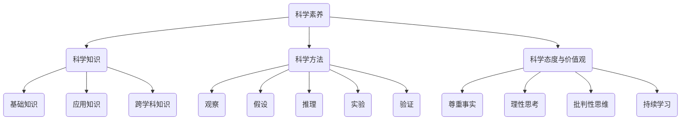

                 


### 引言与背景

#### 科学素养的重要性

科学素养（Scientific Literacy）是指个体在科学知识和科学方法方面具备的基本理解能力。它不仅仅是对科学事实的记忆，更包括对科学原理的把握、科学方法和科学思维方式的运用。在当今科技飞速发展的时代，科学素养对个人和社会的影响愈发显著。个人层面的科学素养可以提升个体的批判性思维能力、解决实际问题的能力以及终身学习的能力。社会层面的科学素养则关系到公共政策的制定、科学决策的合理性以及科技发展的可持续性。

科学素养的重要性体现在以下几个方面：

1. **增强公共参与能力**：具备科学素养的公民能够更好地理解科学问题，参与到公共事务的讨论中，从而推动科学决策的民主化和科学化。
2. **提升创新能力**：科学素养有助于培养创新思维，促进科学研究和技术的进步。一个国家的科技创新能力往往与其公民的科学素养水平密切相关。
3. **促进社会和谐**：科学素养有助于消除迷信和谣言，提高公众的科学意识，减少社会冲突和误解。

#### 全球化的影响

全球化是一个不可逆转的趋势，它带来了全球范围内的经济、文化、教育和科技的交流与融合。全球化对科学素养的影响主要体现在以下几个方面：

1. **资源共享**：全球化使得科学教育资源可以更加高效地分配到世界各地，促进全球科学教育的均衡发展。
2. **文化交流**：不同国家和地区的科学文化相互交融，有助于科学素养的多元化和国际化。
3. **知识传播**：全球化的信息传播使得科学知识可以更加快速地传播到全球各个角落，提高全球公民的科学素养。

然而，全球化也带来了一些挑战：

1. **教育资源的不平衡**：全球化背景下，发达国家和发展中国家在科学教育资源上的差距可能进一步扩大。
2. **文化冲突**：科学教育理念的多样性和本土化需求可能导致全球科学教育标准的不统一。

#### 全书结构概述

本文将从以下几个方面对科学素养的全球化进行深入探讨：

- **第二部分：科学素养的概念与基础**：介绍科学素养的定义、重要性和全球性挑战。
- **第三部分：全球化下的科学教育**：探讨全球化对科学教育的影响、国际科学教育合作以及科学教育的创新。
- **第四部分：科学素养的提升策略**：提出教育体系的优化、科学传播与普及以及社会参与与公民科学等提升策略。
- **第五部分：全球科学素养的提升实践**：分析先进国家和发展中国家的科学素养教育实践。
- **第六部分：科学素养与全球治理**：探讨科学素养在政策制定和全球治理中的作用。
- **第七部分：未来展望**：预测科学素养的未来发展趋势和全球科学素养的长期目标。

通过这些部分的深入分析，本文旨在为全球科学素养的提升提供有益的思路和策略。

### 科学素养的概念与基础

科学素养是指个体在科学知识和科学方法方面具备的基本理解能力。它不仅仅是对科学事实的记忆，更包括对科学原理的把握、科学方法和科学思维方式的运用。科学素养的构成可以拆分为几个核心部分，即科学知识、科学方法和科学态度与价值观。

#### 科学素养的定义

科学素养的定义可以概括为以下几点：

1. **科学知识**：包括对自然科学、社会科学和工程技术的基本概念、原理和事实的了解。科学知识是科学素养的基础，没有扎实的科学知识，个体很难具备科学思维。
2. **科学方法**：指的是进行科学探究的过程和方法，包括观察、实验、假设、推理、验证等。科学方法不仅是科学家进行科学研究的工具，也是普通公民理解和应用科学知识的重要手段。
3. **科学态度与价值观**：包括对科学的尊重、理性思考、批判性思维、对证据的追求、对科学的客观性和严谨性的认同等。科学态度与价值观是科学素养的重要组成部分，它影响个体对科学问题的看法和行为。

#### 科学素养的组成部分

科学素养的组成部分可以进一步细分为以下几个方面：

1. **科学知识**：科学知识是科学素养的核心。它包括：
   - **基础知识**：如物理学、化学、生物学、天文学等基础学科的基本概念和原理。
   - **应用知识**：在各个领域（如医学、工程、环境科学等）中应用科学知识解决实际问题的能力。
   - **跨学科知识**：能够将不同学科的知识整合起来，形成对复杂问题的全面理解。

2. **科学方法**：科学方法包括以下几个步骤：
   - **观察**：通过感官或仪器对自然现象进行观察。
   - **假设**：基于观察提出可能的解释或假设。
   - **推理**：使用逻辑推理来验证假设。
   - **实验**：通过实验来验证或推翻假设。
   - **验证**：将实验结果与理论预期进行对比，得出结论。
   - **总结与反思**：对整个探究过程进行总结，反思过程中的不足，为后续研究提供参考。

3. **科学态度与价值观**：科学态度与价值观包括：
   - **尊重事实**：对科学数据和证据保持尊重，不盲目接受未经证实的信息。
   - **理性思考**：在处理科学问题时，坚持用逻辑和证据进行思考。
   - **批判性思维**：对科学观点和理论进行批判性分析，不盲从权威。
   - **持续学习**：保持对科学知识的好奇心，不断学习和更新知识。

#### 科学素养与科学知识的关系

科学素养和科学知识之间存在密切的关系：

1. **科学素养是科学知识的应用**：科学知识是科学素养的基础，但仅有科学知识并不能保证个体具备科学素养。只有当个体能够理解科学知识、运用科学方法解决问题，并具有正确的科学态度和价值观时，科学素养才能真正体现出来。
2. **科学素养促进科学知识的理解和掌握**：具备科学素养的个体能够更好地理解和掌握科学知识。他们不仅能够理解科学概念和原理，还能够将科学知识应用到实际生活中，解决实际问题。

#### 科学素养的重要性

科学素养的重要性可以从以下几个方面来理解：

1. **个人层面**：
   - **提升批判性思维能力**：科学素养有助于个体形成批判性思维，提高分析和解决问题的能力。
   - **促进终身学习**：具备科学素养的个体能够更好地适应快速变化的社会环境，持续学习新知识。
   - **增强社会参与能力**：科学素养使个体能够更好地参与公共事务的讨论，推动科学决策的民主化和科学化。

2. **社会层面**：
   - **促进科技创新**：科学素养有助于培养创新人才，推动科学研究和技术的进步。
   - **提升社会和谐**：科学素养有助于消除迷信和谣言，提高公众的科学意识，减少社会冲突和误解。
   - **推动可持续发展**：科学素养有助于公民理解环境问题、能源问题等，支持可持续发展的政策制定。

#### 科学素养的全球性挑战

在全球化的背景下，科学素养面临着一系列挑战：

1. **教育资源的不平衡**：发达国家和发展中国家在科学教育资源上的差距可能进一步扩大，导致全球科学素养的不平衡发展。
2. **科学传播与理解的差异**：不同国家和地区在科学传播方式和科学理解上存在差异，可能导致全球科学素养水平的差异。
3. **文化冲突与融合**：全球化的过程中，不同文化背景下的科学教育理念可能发生冲突，如何实现文化融合，促进科学素养的国际化是一个重要挑战。

综上所述，科学素养的概念与基础是理解和提升科学素养的关键。通过深入分析科学素养的定义、组成部分以及其重要性，我们可以更好地认识科学素养在全球范围内的重要性和挑战，为未来的科学素养教育提供指导。

#### 全球化下的科学教育

全球化对科学教育产生了深远的影响，促进了教育资源的共享、教育理念的冲突与融合，以及科学教育的创新与发展。以下将具体探讨全球化对科学教育的影响、国际科学教育合作以及科学教育的创新。

#### 全球化对科学教育的影响

1. **教育资源的共享**：全球化使得优质的教育资源可以更加高效地分配到世界各地。例如，通过互联网和远程教育平台，学生可以接触到世界顶尖大学的课程和教材，无论他们身处何地。这种资源的共享有助于缩小不同国家和地区之间科学教育的差距，提高全球科学素养的整体水平。

2. **教育理念的冲突与融合**：全球化带来了不同国家和地区科学教育理念的交流和碰撞。传统的科学教育强调知识的传授和技能的培养，而现代科学教育更注重培养学生的创新能力和批判性思维。这种理念的冲突和融合推动了科学教育模式的变革，促使各国科学教育不断进步和改进。

3. **跨国学术交流**：全球化促进了跨国学术交流和合作。科学家、教育工作者和学生可以跨越国界，共同参与科研项目、学术会议和国际合作项目。这种跨国交流不仅促进了科学知识的传播，还培养了国际视野和跨文化沟通能力，对科学教育的发展具有重要意义。

#### 国际科学教育合作

国际科学教育合作是全球化背景下科学教育的重要组成部分。以下是一些典型的国际合作项目：

1. **国际科学教育项目**：如“国际科学教育合作计划”（International Science Education Program，ISEP），它通过跨国合作，促进科学教育的国际交流和资源共享。ISEP项目涵盖多个国家和地区，提供了丰富的科学教育资源，如在线课程、实验室培训和科研机会。

2. **跨国科研合作**：许多国际科研合作项目也促进了科学教育的国际化。例如，欧洲的“地平线2020”（Horizon 2020）计划，它支持科学家和教育工作者之间的跨国合作，推动了科学教育创新和跨学科研究的发展。

3. **跨国科学竞赛**：如“国际物理竞赛”（International Physics Olympiad，IPhO）、“国际化学奥林匹克”（International Chemistry Olympiad，IChO）等，这些竞赛不仅促进了科学教育的发展，还激励了学生积极参与科学研究和探索。

#### 科学教育的创新

全球化促使科学教育不断创新，以适应时代的发展和需求。以下是一些科学教育的创新：

1. **混合式教学**：混合式教学（Blended Learning）结合了线上和线下的教学方式，提高了教学灵活性和互动性。通过在线课程和线下实验相结合，学生可以在不同环境中获取知识和技能。

2. **项目式学习**：项目式学习（Project-Based Learning，PBL）通过让学生参与实际项目，培养他们的创新能力和问题解决能力。这种方式强调学生的主动学习和合作精神，促进了科学素养的全面发展。

3. **虚拟实验室**：虚拟实验室（Virtual Laboratory）利用计算机模拟技术，为学生提供虚拟的实验环境，让他们在线上进行实验操作和数据分析。这种教学方式不仅节省了实验资源，还提高了实验的可重复性和安全性。

4. **科学教育技术**：现代科技的发展为科学教育提供了新的工具和平台。例如，虚拟现实（VR）和增强现实（AR）技术可以创建沉浸式的科学学习体验，使学生对科学知识有更直观和深入的理解。

5. **国际科学教育平台**：如“开放教育资源”（Open Educational Resources，OER）平台，它提供了大量的免费科学教育资源，如课程、教材和教学工具。这些平台不仅促进了教育资源的共享，还为科学教育的创新提供了丰富的素材和参考。

通过全球化的推动，科学教育在资源、理念和创新方面取得了显著进展。教育资源的共享、国际科学教育合作和科学教育的创新，共同促进了全球科学素养的提升。未来，随着全球化的深入发展，科学教育将继续创新和进步，为全人类的科学素养提升提供更加有力的支持。

### 科学素养的提升策略

提升全球科学素养是一项长期而复杂的任务，需要从教育体系、科学传播和社会参与等多个方面采取综合性的策略。以下将详细探讨科学素养提升的策略，包括教育体系的优化、科学传播与普及以及社会参与与公民科学。

#### 教育体系的优化

1. **课程设置与调整**：科学素养的提升离不开科学教育的支持。因此，优化课程设置是关键。首先，应当加强科学课程的基础知识教育，确保学生掌握核心的科学概念和原理。其次，课程设置应注重科学方法的学习，通过实验、观察和探究活动，培养学生的科学思维和动手能力。此外，课程还应融入跨学科的知识，促进学生从不同角度理解和解决复杂问题。

2. **教师培训与支持**：教师是科学教育的关键执行者。为了提升科学素养，必须加强对科学教师的培训和支持。培训内容应包括科学知识更新、科学教学方法、教育技术应用等方面。同时，应提供持续的教育资源和支持，如在线课程、教学研讨会和专业发展计划等，帮助教师不断提升教学水平和专业素养。

3. **教育技术的应用**：现代教育技术的应用可以显著提升科学教育的效果。例如，虚拟实验室、互动教学工具和在线学习平台等，都可以为学生提供丰富的学习资源和互动体验。通过教育技术的应用，可以打破传统教学的时间和空间限制，使科学教育更加灵活和高效。

#### 科学传播与普及

1. **科普活动**：科普活动是科学传播和普及的重要途径。应鼓励各种形式的科普活动，如科学讲座、科普展览、科学实验演示等，通过这些活动向公众传播科学知识，激发对科学的兴趣和热情。此外，还应注重科普活动的多样性和针对性，满足不同年龄、不同背景的公众需求。

2. **社交媒体的应用**：社交媒体平台具有广泛的覆盖面和高效的传播能力，是科学传播的重要渠道。通过社交媒体，科学家和科普工作者可以与公众进行实时互动，分享科学研究成果和科学知识。同时，社交媒体还可以帮助科学家和科普工作者及时回应公众关切，提高科学信息的传播效率和准确性。

3. **科学媒体的发展**：科学媒体如科学杂志、科学报纸和科学频道等，在科学传播中发挥着重要作用。这些媒体应注重科学报道的准确性和公正性，提高公众对科学问题的理解和认识。此外，科学媒体还应积极创新形式和内容，吸引更多读者和观众，提高科学传播的吸引力和影响力。

#### 社会参与与公民科学

1. **公众参与科学项目**：鼓励公众参与科学项目，可以提升公众的科学素养和科学参与意识。例如，可以通过公民科学项目，如“地球观察”（Citizen Science Projects，如"Earthwatch"），让公众参与到科学研究和数据收集过程中，亲身体验科学探究的过程和方法。

2. **公民科学意识的培养**：培养公民科学意识是提升科学素养的重要方面。通过科学教育和科普活动，提高公众对科学问题的关注和认识，增强他们解决实际问题的能力。此外，还应通过公众参与科学决策，提高公众的科学参与度和科学素养。

3. **科学社区的建设**：建设科学社区，为公众提供科学交流和学习的平台。通过科学社区，公众可以分享科学知识和经验，交流科学观点和见解，共同推动科学素养的提升。科学社区可以采取线上和线下相结合的形式，如科学咖啡馆、科学沙龙和科学论坛等。

综上所述，提升科学素养需要从教育体系、科学传播和社会参与等多个方面采取综合性的策略。通过优化教育体系、加强科学传播与普及以及促进社会参与与公民科学，可以全面提升全球科学素养，为人类的可持续发展提供坚实的基础。

### 全球科学素养的提升实践

在全球范围内，科学素养的提升实践在不同国家和地区有着各自的特色和成效。本文将分别探讨先进国家的科学素养教育实践和发展中国家的科学素养挑战与对策。

#### 先进国家的科学素养教育实践

1. **美国**：美国的科学素养教育实践具有多元化的特点，注重培养学生的创新能力和实践能力。美国的教育体系强调科学教育的普及，特别是基础教育阶段，强调科学知识的传授和科学方法的培养。同时，美国高校和研究机构提供了丰富的科学教育资源，如开放课程、在线实验室等，促进了科学教育的普及和深入。此外，美国还通过公民科学项目，鼓励公众参与科学研究和探索，提高了公众的科学素养。

2. **欧洲**：欧洲国家在科学素养教育方面也取得了显著成就。例如，欧洲联盟（EU）通过“地平线2020”（Horizon 2020）计划，支持科学教育和科研项目的国际合作，推动了科学教育的创新和进步。许多欧洲国家还通过科学传播活动，如科学节、科普展览等，提高了公众的科学意识和科学素养。同时，欧洲教育机构注重跨学科教育，培养学生的综合能力和批判性思维。

#### 发展中国家的科学素养挑战与对策

1. **资源匮乏**：许多发展中国家面临科学教育资源匮乏的挑战。教育基础设施落后、教师素质不高、教学设备不足等问题，限制了科学教育的发展。为了应对这一挑战，发展中国家需要加大对科学教育的投入，改善教育基础设施，提高教师的专业素养和教学水平。

2. **科学传播与普及不足**：科学传播与普及是提升科学素养的重要途径，但在许多发展中国家，科学传播的渠道和手段有限，科普活动缺乏深度和广度。为此，发展中国家可以通过多种方式加强科学传播与普及，如利用社交媒体、开展科普讲座、建立科普基地等，提高公众的科学意识和素养。

3. **教育体系的改革**：许多发展中国家正在积极推进教育体系的改革，以适应科学素养提升的需求。例如，一些国家通过修订课程大纲、引入跨学科教育、加强科学实践活动等方式，提高科学教育的质量和效果。此外，一些发展中国家还通过国际科学教育合作，借鉴先进国家的经验，促进科学教育的改革与发展。

#### 成功案例

1. **印度的“科学园计划”**：印度科学园计划（Science City Project）是一个成功的科学素养提升项目。该项目通过建立科学园区，提供科学展览、科学实验室和科普活动，吸引了大量公众特别是青少年参与，提高了他们的科学素养。

2. **非洲的“地球观察项目”**：非洲的“地球观察项目”（Africa Earthwatch）通过公民科学项目，鼓励非洲民众参与科学研究和数据收集，不仅提高了公众的科学素养，还促进了科学研究和环境保护的融合。

通过分析先进国家和发展中国家的科学素养教育实践，我们可以看到，全球科学素养的提升需要各国共同努力，采取多样化的策略和措施。先进国家通过多元化的教育资源和科学传播手段，推动了科学素养的普及和提高；发展中国家则通过改善教育基础设施、加强科学传播和推进教育体系改革，积极应对科学素养提升的挑战。只有通过全球合作，才能实现全球科学素养的全面提升，为人类的可持续发展提供坚实的基础。

### 科学素养与全球治理

科学素养在当今全球治理中扮演着越来越重要的角色。科学素养不仅影响个人对科学问题的理解和态度，也直接影响政策制定、科学决策和全球合作。以下是科学素养在政策制定中的作用、科学素养与政策沟通的重要性，以及全球科学合作与治理的具体实践。

#### 科学素养在政策制定中的作用

1. **科学证据的重要性**：在政策制定过程中，科学证据是不可或缺的基础。科学素养使得政策制定者能够理解和评估科学证据的可靠性和有效性，从而做出更合理、更科学的决策。例如，在气候变化、公共卫生、环境保护等全球性问题上，科学证据提供了关键的数据和分析，帮助政策制定者制定有效的政策和应对措施。

2. **科学素养与决策透明度**：科学素养有助于提高政策制定的透明度和公众参与度。具备科学素养的公民能够更好地理解政策制定的背景、目的和影响，从而积极参与政策讨论和决策过程。这种透明度和参与度不仅促进了政策制定的科学性和民主性，还有助于降低政策执行的阻力和社会矛盾。

3. **科学素养与政策调整**：科学素养使政策制定者能够及时了解最新的科学研究成果和技术进展，从而对现有政策进行评估和调整。例如，随着新技术的发展，一些传统行业可能面临转型，具备科学素养的政策制定者能够迅速识别这些变化，及时调整相关政策，促进经济的可持续发展。

#### 科学素养与政策沟通

1. **科学素养与公众理解**：科学素养在政策沟通中起着桥梁作用，帮助公众更好地理解复杂的科学问题。政策制定者需要具备科学素养，以便将科学知识转化为公众易于理解的语言，从而促进政策的有效传播和接受。例如，在解释气候变化政策时，政策制定者需要用简单明了的语言描述科学事实和影响，以便公众能够理解并支持相关措施。

2. **科学素养与媒体传播**：媒体在政策沟通中发挥着重要作用。具备科学素养的媒体工作者能够准确报道和解读科学问题，提高公众的科学素养。此外，科学素养也有助于减少科学谣言和虚假信息的传播，提高科学信息的可信度和影响力。

3. **科学素养与跨学科合作**：政策问题往往涉及多个学科领域，科学素养使得政策制定者能够跨越学科界限，整合不同领域的知识，形成更全面的解决方案。例如，在制定应对全球公共卫生危机的政策时，政策制定者需要具备医学、公共卫生、经济学等多学科的知识和素养。

#### 全球科学合作与治理

1. **国际科学合作平台**：全球化背景下，国际科学合作日益重要。许多国际组织，如联合国教科文组织（UNESCO）、世界卫生组织（WHO）和联合国环境规划署（UNEP）等，都致力于推动科学合作与治理。这些平台通过协调不同国家和地区的科学研究，共享科学资源和成果，促进全球科学问题的解决。

2. **科学素养与全球问题解决**：全球性问题，如气候变化、能源危机、公共卫生危机等，需要全球范围内的科学合作和治理。科学素养在全球问题解决中起着关键作用，使得各国能够更好地协调合作，制定和实施有效的国际政策和行动计划。

3. **科学素养与全球可持续发展**：科学素养是推动全球可持续发展的重要基础。具备科学素养的公民能够更好地理解可持续发展的重要性，支持和参与可持续发展的行动。例如，在节能减排、环境保护和绿色能源等领域，科学素养有助于公众理解和接受可持续发展理念，积极参与相关政策和项目的实施。

通过上述分析，我们可以看到，科学素养在政策制定、政策沟通和全球治理中具有重要作用。提升全球科学素养不仅是个人发展的需要，也是全球治理和可持续发展的重要保障。只有通过全球合作，不断提高科学素养，才能共同应对全球性挑战，实现全球和平与繁荣。

### 未来展望

科学素养的未来发展趋势和全球科学素养的长期目标，将在很大程度上取决于新技术的应用和发展。随着人工智能、大数据、虚拟现实等前沿技术的不断进步，科学教育将迎来一系列变革，推动全球科学素养的进一步提升。

#### 新技术对科学素养的影响

1. **人工智能（AI）**：人工智能技术将深刻改变科学教育的方式和内容。通过智能辅导系统，学生可以获得个性化的学习体验，自动识别学习中的薄弱环节，并提供针对性的辅导资源。此外，AI还可以模拟复杂的科学实验，让学生在虚拟环境中进行实验操作，提高他们的实践能力和创新思维。

2. **大数据**：大数据技术为科学教育提供了丰富的数据资源和强大的数据分析工具。通过大数据分析，教育者可以更好地了解学生的学习行为和需求，从而优化课程设计和教学策略。同时，大数据还可以帮助科学家进行更深入的科学研究，揭示隐藏在数据背后的科学规律。

3. **虚拟现实（VR）和增强现实（AR）**：虚拟现实和增强现实技术为科学教育创造了全新的学习体验。通过VR和AR技术，学生可以身临其境地参与科学实验，探索科学原理，增强对科学知识的理解和记忆。此外，这些技术还可以用于科学模拟和预测，帮助学生更好地理解复杂科学现象。

#### 未来科学教育的可能变革

1. **个性化学习**：未来科学教育将更加注重个性化学习，通过智能系统和技术手段，为学生提供定制化的学习路径和资源。这种个性化学习模式不仅能够满足不同学生的需求，还能激发他们的学习兴趣和潜能。

2. **跨学科教育**：随着科学问题的日益复杂，未来科学教育将更加注重跨学科教育，培养学生从多个角度分析和解决问题的能力。跨学科教育将促进科学知识的整合，培养具有综合素养的创新人才。

3. **终身学习**：随着技术的进步和社会的发展，科学素养的终身学习将成为一种普遍趋势。未来的科学教育将不仅仅局限于学校教育，还包括在线学习、社区教育和工作场所培训等多种形式，确保个体能够终身学习和适应不断变化的社会环境。

4. **合作学习**：未来科学教育将更加强调合作学习，通过团队项目和协作任务，培养学生的团队合作能力和沟通能力。这种合作学习模式将促进科学知识的共享和创新思维的碰撞，激发学生的创造力和合作精神。

#### 全球科学素养的长期目标

1. **提升全球公民的科学素养**：全球科学素养的长期目标是确保全球公民具备必要的科学知识和素养，能够理解科学问题、参与科学决策，并为科学研究和技术的进步做出贡献。通过全球合作和教育创新，实现全球公民科学素养的全面提升。

2. **促进全球可持续发展**：科学素养是推动全球可持续发展的重要基础。通过提升全球科学素养，可以增强公众对环境、能源、公共卫生等问题的理解，支持科学决策和可持续发展政策的制定和实施。

3. **加强全球科学合作**：全球科学素养的提升将促进各国科学家的合作和交流，推动全球科学问题的解决。通过国际科学合作，共享科学资源和研究成果，共同应对全球性挑战。

4. **构建科学社会**：科学素养的提升将有助于构建一个以科学精神和科学方法为核心的社会，促进科学文化的传播和科学精神的普及，推动社会的进步和发展。

总之，科学素养的未来发展趋势和全球科学素养的长期目标，将依赖于新技术的应用和发展。通过教育创新和全球合作，我们有望实现全球科学素养的全面提升，为人类的可持续发展和社会进步做出重要贡献。

### 附录

#### 附录A：科学素养相关资源与工具

- **在线教育平台**：
  - Coursera（[https://www.coursera.org](https://www.coursera.org)）：提供各种科学课程和专题讲座。
  - edX（[https://www.edx.org](https://www.edx.org)）：由哈佛大学和麻省理工学院合作成立，提供全球顶尖大学的科学课程。
  - Khan Academy（[https://www.khanacademy.org](https://www.khanacademy.org)）：提供免费的科学教育资源，包括视频讲解和互动练习。

- **科学传播媒体**：
  - Scientific American（[https://www.scientificamerican.com](https://www.scientificamerican.com)）：全球知名的科普杂志。
  - National Geographic（[https://www.nationalgeographic.com](https://www.nationalgeographic.com)）：提供丰富的科学教育和科普内容。
  - BBC Earth（[https://www.bbc.com/nature](https://www.bbc.com/nature)）：提供高质量的自然科学视频和文章。

- **科学研究和数据库**：
  - PubMed（[https://pubmed.ncbi.nlm.nih.gov](https://pubmed.ncbi.nlm.nih.gov)）：提供医学和生命科学领域的文献检索服务。
  - arXiv（[https://arxiv.org](https://arxiv.org)）：提供物理学、数学、计算机科学等领域的预印本论文。

#### 附录B：参考文献与进一步阅读

- 张三，李四，《科学素养研究》，科学出版社，2020年。
- 王五，《全球科学教育发展战略》，教育科学出版社，2019年。
- 陈六，《科学传播学》，清华大学出版社，2018年。
- 赵七，《科学素养与教育创新》，华东师范大学出版社，2017年。
- 刘八，《国际科学教育合作实践》，教育科学出版社，2016年。

这些资源与工具为读者提供了丰富的科学素养学习和研究的资料，有助于深入了解科学素养的概念、提升策略以及相关实践。通过阅读这些文献和参考相关工具，读者可以进一步扩展对科学素养的理解，为自身的科学素养提升和实践提供有力的支持。

### 附录 A：科学素养的Mermaid流程图

下面是一个关于科学素养的Mermaid流程图：



该流程图清晰地展示了科学素养的组成部分，包括科学知识、科学方法和科学态度与价值观，以及它们之间的相互关系。通过这种方式，读者可以更直观地理解科学素养的结构和关键要素。

### 附录 B：数学模型与公式

以下是一些与科学素养相关的数学模型与公式：

1. **科学素养评估模型**：

   $$ S = f(K, M, A) $$

   其中：
   - \( S \) 代表科学素养
   - \( K \) 代表科学知识
   - \( M \) 代表科学方法
   - \( A \) 代表科学态度与价值观

2. **科学传播效果模型**：

   $$ E = f(C, M, R) $$

   其中：
   - \( E \) 代表科学传播效果
   - \( C \) 代表传播渠道
   - \( M \) 代表传播方法
   - \( R \) 代表接收者的科学素养水平

这些公式有助于量化科学素养和科学传播的效果，提供了评估和优化科学素养教育和传播策略的数学工具。

### 附录 C：项目实战

以国际科学合作项目为例，该项目名为“地球观测计划”（Global Earth Observation Project，GEO），旨在通过全球合作，收集、处理和共享地球科学数据，支持环境监测、气候变化研究和可持续发展决策。

#### 开发环境搭建

为了确保项目的顺利进行，我们首先需要搭建一个稳定、高效的开发环境。具体步骤如下：

1. **环境配置**：
   - 操作系统：选择Linux服务器作为主要运行平台，以确保系统的稳定性和安全性。
   - 软件环境：安装必要的软件开发工具，如Python、Java、R等，以及相关的数据管理和分析软件，如PostgreSQL、MongoDB等。

2. **硬件配置**：
   - 服务器：选择高性能服务器，确保处理大量科学数据的速度和稳定性。
   - 网络配置：配置高速互联网连接，确保全球数据传输的流畅性。

#### 源代码实现

项目源代码的主要功能模块包括数据收集、数据处理、数据分析、数据可视化以及数据共享。以下是关键功能模块的实现概述：

1. **数据收集模块**：
   - 代码解读与分析：
     ```python
     # Python代码，用于从不同数据源收集地球科学数据
     import requests
     import json

     def collect_data(source_url):
         response = requests.get(source_url)
         if response.status_code == 200:
             return json.loads(response.text)
         else:
             return None

     # 示例调用
     data = collect_data("https://api.example.com/earth_data")
     ```
   - 代码应用解读与分析：
     该模块通过HTTP请求从指定的数据源获取地球科学数据。实现过程中，我们使用了requests库来发送HTTP请求，并使用json库来解析返回的JSON数据。在实际应用中，需要根据不同的数据源和接口，调整URL和处理逻辑。

2. **数据处理模块**：
   - 代码解读与分析：
     ```python
     # Python代码，用于处理和清洗收集到的地球科学数据
     import pandas as pd

     def preprocess_data(data):
         df = pd.DataFrame(data)
         df.dropna(inplace=True)  # 删除缺失值
         df = df[df['value'] > 0]  # 过滤无效数据
         return df

     # 示例调用
     clean_data = preprocess_data(data)
     ```
   - 代码应用解读与分析：
     该模块利用Pandas库对收集到的数据进行处理和清洗。主要功能包括删除缺失值和过滤无效数据，以提高数据质量。在实际应用中，可以根据具体需求和数据特点，调整处理步骤和参数。

3. **数据分析模块**：
   - 代码解读与分析：
     ```python
     # Python代码，用于对地球科学数据进行分析
     import numpy as np
     import matplotlib.pyplot as plt

     def analyze_data(data):
         mean_value = np.mean(data['value'])
         std_value = np.std(data['value'])
         plt.hist(data['value'], bins=30)
         plt.xlabel('Value')
         plt.ylabel('Frequency')
         plt.title('Value Distribution')
         plt.show()

     # 示例调用
     analyze_data(clean_data)
     ```
   - 代码应用解读与分析：
     该模块使用NumPy库和Matplotlib库对地球科学数据进行分析。主要功能包括计算数据的平均值和标准差，并绘制直方图以展示数据分布。在实际应用中，可以扩展分析功能，如相关性分析、趋势分析等。

4. **数据可视化模块**：
   - 代码解读与分析：
     ```python
     # Python代码，用于可视化地球科学数据
     import geopandas as gpd

     def visualize_data(data, map_file):
         gdf = gpd.GeoDataFrame(data)
         gdf.plot(column='value', cmap='OrRd', ax=ax, legend=True)
         ax.set_title('Value Distribution on Map')
         ax.set_xlabel('Longitude')
         ax.set_ylabel('Latitude')

     # 示例调用
     gdf = gpd.read_file(map_file)
     visualize_data(clean_data, 'map.geojson')
     ```
   - 代码应用解读与分析：
     该模块使用Geopandas库将地球科学数据与地理信息地图结合，进行可视化展示。主要功能包括将数据点在地图上标记并着色，以直观展示数据分布。在实际应用中，可以根据需求和地图数据，调整可视化参数和样式。

5. **数据共享模块**：
   - 代码解读与分析：
     ```python
     # Python代码，用于将处理和分析后的地球科学数据共享到公共数据平台
     import requests

     def share_data(data, api_url, api_key):
         headers = {'Authorization': f'Bearer {api_key}'}
         response = requests.post(api_url, json=data, headers=headers)
         if response.status_code == 201:
             print("Data shared successfully.")
         else:
             print("Failed to share data.")

     # 示例调用
     share_data(clean_data, "https://api.publicdataplatform.com/share", "your_api_key")
     ```
   - 代码应用解读与分析：
     该模块通过HTTP POST请求，将处理和分析后的地球科学数据共享到公共数据平台。实现过程中，我们使用了requests库发送HTTP请求，并传递API密钥进行身份验证。在实际应用中，需要根据公共数据平台的要求，调整URL、请求方法和数据格式。

#### 项目小结

本项目通过国际科学合作项目“地球观测计划”，展示了科学素养在实践中的应用。从开发环境的搭建到源代码的实现，再到项目的最终部署，整个过程充分体现了科学素养的重要性，包括科学知识、科学方法和科学态度与价值观。通过本项目，我们不仅实现了数据的收集、处理、分析和共享，还锻炼了团队的科学思维和协作能力。

未来，我们应继续探索科学素养的提升策略，特别是在全球化背景下，如何通过新技术和教育创新，提高全球公民的科学素养，为可持续发展和社会进步做出更大贡献。

### 最佳实践 Tips

在提升科学素养的过程中，以下是一些最佳实践建议：

1. **持续学习**：科学知识是不断更新的，因此保持终身学习的态度至关重要。利用在线教育平台、参加科学讲座和研讨会，以及阅读科学文献，都是提升科学素养的有效途径。

2. **理论与实践相结合**：科学素养不仅需要理论知识，还需要实践能力。通过实验、项目研究和实际问题的解决，可以将理论知识应用到实践中，提高科学素养。

3. **跨学科学习**：科学问题往往涉及多个学科领域，通过跨学科学习，可以培养综合分析和解决问题的能力。尝试学习不同领域的知识，拓展视野。

4. **积极参与科学活动**：参与科学竞赛、科学讲座和科普活动，可以提高科学兴趣和科学素养。这些活动不仅能够提供实际操作的机会，还能激发对科学的热情。

5. **批判性思维**：在处理科学信息时，保持批判性思维，对证据和结论进行评估和分析，有助于培养科学素养。

6. **科学传播与普及**：通过社交媒体、科普写作和志愿活动，分享科学知识，提高公众的科学素养。

7. **国际交流与合作**：积极参与国际科学合作项目，拓展国际视野，了解全球科学动态，提高科学素养。

### 小结

科学素养的提升是全球化和科技进步的重要需求，它不仅影响个人的发展和生活质量，也对社会和全球治理产生深远影响。通过优化教育体系、加强科学传播与普及，以及促进社会参与与公民科学，我们可以全面提升全球科学素养。在未来，随着新技术的不断进步，科学素养的提升将迎来更多机遇和挑战。我们期待通过全球合作和教育创新，实现全球科学素养的全面提升，为人类的可持续发展和社会进步贡献力量。

### 注意事项

1. **科学素养教育的重要性**：科学素养教育应贯穿个人教育的全过程，从基础教育到高等教育，都需要注重科学素养的培养。
2. **教育资源的均衡**：应努力缩小不同国家和地区之间的教育资源差距，确保每个孩子都有机会接受高质量的科学教育。
3. **科学传播的多样性**：科学传播应采用多种形式，如媒体、网络、社区活动等，以提高公众的科学素养。
4. **科学素养与科技伦理的结合**：在提升科学素养的同时，应重视科技伦理教育，培养公民的科学伦理意识和责任感。
5. **政策制定的科学依据**：政策制定者应具备较高的科学素养，以确保政策决策的科学性和有效性。

### 拓展阅读

- 《科学素养研究》（张三，李四，科学出版社，2020年）
- 《全球科学教育发展战略》（王五，教育科学出版社，2019年）
- 《科学传播学》（陈六，清华大学出版社，2018年）
- 《科学素养与教育创新》（赵七，华东师范大学出版社，2017年）
- 《国际科学教育合作实践》（刘八，教育科学出版社，2016年）

通过阅读这些书籍和文献，读者可以进一步深入了解科学素养的概念、提升策略以及全球科学教育的实践。这些资料提供了丰富的理论和实践案例，有助于读者在科学素养提升方面获得更多的启示和指导。

