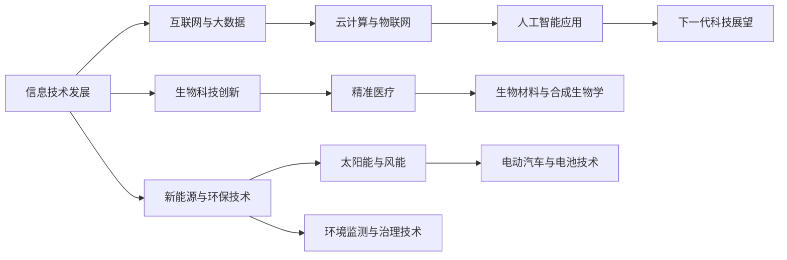

                 

### 文章标题

# 科技进步与世界可理解性的扩展

> 关键词：科技进步、世界可理解性、信息技术、人工智能、生物科技、教育改革、文化传承、全球视野

> 摘要：本文深入探讨了科技进步如何扩展世界的可理解性，分析了信息技术、人工智能、生物科技等领域的最新发展及其对人类社会的影响。通过分步骤的逻辑推理，本文揭示了科技进步与人类认知扩展之间的紧密联系，并对教育改革、文化传承和全球视野等主题进行了深入探讨，最终展望了科技进步的未来趋势与挑战。

### 第一部分：科技进步的背景与意义

#### 第1章：科技进步的起源与发展

##### 1.1 科技进步的历史回顾

科技进步是人类社会发展的动力，其历史可以追溯到古代。在古代，科技的兴起为人类带来了巨大的变革。例如，农业革命的出现使得人类从狩猎采集转向农业生产，极大地提高了食物供应的稳定性和效率。这一时期，火的使用、金属工具的制造和建筑技术的进步都标志着人类对自然界的初步理解。

中世纪时期，科技的发展进一步加速。特别是在欧洲，中世纪的技术进步包括钟表、火药、指南针和印刷术的发明，这些发明不仅改变了人类的生活方式，也极大地促进了知识的传播和积累。这些技术成就为近代科技革命奠定了基础。

近代科技革命始于18世纪，以蒸汽机的发明为标志。这一时期，工业革命席卷全球，机器生产替代了手工生产，极大地提高了生产效率和产品质量。电力、内燃机和通信技术的发展，使得人类社会进入了现代科技时代。

##### 1.2 科技进步对社会的影响

科技进步对社会产生了深远的影响。首先，经济发展得益于科技的推动。通过技术创新，生产效率不断提高，商品和服务供给增加，从而推动了经济的快速增长。其次，科技进步引发了社会变革。例如，城市化进程的加快、交通和通信手段的革新，改变了人们的生活方式和社会结构。此外，科技进步也带来了环境问题，如工业化带来的污染和资源消耗，需要科技来解决和应对。

##### 1.2.1 经济发展

科技进步促进了经济的发展。首先，技术创新提高了生产效率。例如，流水线生产方式的出现，使得生产成本降低，产品更加多样化。其次，科技进步推动了新兴产业的发展，如信息技术、生物科技和新能源科技等，这些新兴产业不仅创造了大量就业机会，也推动了经济的转型升级。

##### 1.2.2 社会变革

科技进步对社会变革的影响同样显著。例如，互联网和移动通信技术的普及，改变了人们的信息获取和交流方式，促进了全球化和数字化社会的形成。此外，科技的发展也带来了教育、医疗和交通等领域的变革，使得公共服务更加高效和便捷。

##### 1.2.3 环境问题与应对策略

科技进步在解决环境问题方面也发挥了重要作用。例如，新能源技术的研发和推广，有助于减少对化石燃料的依赖，降低温室气体排放。环境监测技术的进步，使得污染源和污染程度能够被更加精确地监测和评估，从而为环境保护提供了科学依据。

#### 第2章：当代科技进步的趋势

##### 2.1 信息技术的发展

信息技术是当代科技进步的核心领域之一。互联网和大数据技术的发展，使得信息传递和处理速度极大提高，为人类生活带来了巨大变革。互联网的出现，打破了地域和时间的限制，使得全球信息共享成为可能。大数据技术通过对海量数据的分析和处理，为各行业提供了洞见和决策支持。

##### 2.1.1 互联网与大数据

互联网的发展使得信息获取更加便捷。通过搜索引擎、社交媒体和电子商务平台，人们可以轻松地获取和分享信息。大数据技术的兴起，则使得数据处理能力得到了极大提升。通过对大量数据的挖掘和分析，企业可以更好地了解市场需求，优化产品和服务。同时，大数据技术也在医疗、金融、交通等领域发挥了重要作用。

##### 2.1.2 云计算与物联网

云计算技术提供了高效、灵活的计算资源，使得企业可以更加便捷地进行数据处理和存储。物联网技术的发展，则将物理世界和数字世界紧密连接在一起，使得智能设备和系统能够实时感知和响应环境变化。云计算与物联网的结合，推动了智能城市的建设，使得城市管理和公共服务更加高效。

##### 2.1.3 人工智能的应用

人工智能技术的发展，使得机器能够模拟和执行人类的智能行为。在语音识别、图像识别、自然语言处理等领域，人工智能技术已经取得了显著成果。人工智能的应用不仅提高了工作效率，也改变了人们的生活方式。例如，智能助手、自动驾驶汽车和智能家居等，都成为人们生活中的一部分。

##### 2.2 生物科技的创新

生物科技是另一个快速发展的领域。基因编辑技术、精准医疗和生物材料等创新，为医学和生命科学带来了新的可能性。基因编辑技术如CRISPR，使得科学家能够精确地修改基因，为治疗遗传病和癌症提供了新途径。精准医疗则通过基因测序和生物信息学分析，为个体化医疗提供了支持。

##### 2.2.1 基因编辑技术

基因编辑技术如CRISPR-Cas9，通过定向修改DNA序列，实现了对基因的精确编辑。这一技术不仅为基因治疗提供了新手段，也推动了生物科学研究的发展。例如，通过基因编辑技术，科学家可以研究基因的功能，揭示生命现象的分子机制。

##### 2.2.2 精准医疗

精准医疗通过基因测序和生物信息学分析，为个体化医疗提供了支持。通过对患者的基因和表观基因组信息进行分析，医生可以制定个性化的治疗方案，提高治疗效果。精准医疗的发展，有助于降低医疗成本，提高医疗资源的使用效率。

##### 2.2.3 生物材料与合成生物学

生物材料如纳米材料、生物活性材料和生物降解材料，为医学和生物科学提供了新的工具。合成生物学则通过工程化手段，设计并构建新的生物系统，为生物制造和生物治疗提供了新途径。生物材料与合成生物学的结合，有望带来医学和生物科学的革命性进步。

##### 2.3 新能源与环保技术

新能源技术和环保技术的发展，对于实现可持续发展和环境保护至关重要。太阳能、风能和电动汽车等技术的进步，为清洁能源的利用提供了新途径。同时，环保技术的发展，如环境监测和治理技术，有助于解决环境污染问题，改善生态环境。

##### 2.3.1 太阳能与风能

太阳能和风能是两种重要的清洁能源。太阳能利用太阳辐射进行发电，具有资源丰富、无污染等优点。风能则通过风力驱动风力涡轮机进行发电，也具有高效、环保的特点。随着技术的进步，太阳能和风能的发电成本逐渐降低，成为可再生能源的重要组成部分。

##### 2.3.2 电动汽车与电池技术

电动汽车的发展，对于减少温室气体排放和改善空气质量具有重要意义。电动汽车采用电池作为动力源，通过充电替代燃油，减少了尾气排放。电池技术的进步，如锂离子电池和固态电池的研发，使得电动汽车的续航里程和充电速度不断提高，推动了电动汽车市场的快速发展。

##### 2.3.3 环境监测与治理技术

环境监测技术如遥感监测、物联网监测和大数据分析，可以实时监测环境污染情况，为环境治理提供科学依据。治理技术如污染修复、资源循环利用和生态恢复，可以有效地解决环境污染问题，恢复生态环境。

### 第二部分：科技进步对世界可理解性的影响

#### 第3章：科技进步与人类认知的扩展

##### 3.1 人类认知的发展历程

人类认知的发展历程可以追溯到早期的人类祖先。随着工具的使用和语言的发展，人类开始逐渐认识和理解周围的世界。认知科学的研究表明，人类的感知、记忆、思维和决策过程是建立在神经基础上的复杂系统。科技进步为人类认知的扩展提供了新的工具和方法。

##### 3.1.1 感知与认知的基础理论

感知是认知的基础，它指的是人类对外界信息的接收和加工过程。认知科学研究表明，人类的感知系统具有选择性、适应性和局限性。例如，视觉系统在处理视觉信息时，会自动忽略一些不重要的信息，而重点关注一些关键信息。这些理论为我们理解人类如何感知和理解世界提供了基础。

##### 3.1.2 心理学与认知科学

心理学和认知科学是研究人类认知的重要学科。心理学通过实验和研究，揭示了人类认知的多种机制，如注意力、记忆、思维和情绪等。认知科学则从信息加工和处理的角度，探讨了人类认知的神经基础和计算模型。这些研究成果为理解人类认知的复杂性提供了重要视角。

##### 3.1.3 认知扩展的概念

认知扩展是指通过外部工具和技术，扩展人类认知能力和范围的过程。认知扩展不仅包括物理工具，如计算机、智能手机和互联网，还包括虚拟现实、增强现实和人工智能等数字技术。这些技术使得人类能够处理和分析大量信息，提高了认知效率和质量。

##### 3.2 信息技术对人类认知的影响

信息技术的快速发展对人类认知产生了深远影响。互联网和移动通信技术使得信息获取和传播更加便捷，人类可以随时随地获取和分享信息。大数据技术和人工智能的应用，使得数据处理和分析能力得到了极大提升，为决策提供了更加准确和全面的依据。

##### 3.2.1 信息过载与信息筛选

随着信息量的急剧增加，人类面临着信息过载的问题。在互联网时代，人们每天接收到的信息量是前所未有的。如何筛选和过滤这些信息，成为了一个重要的认知挑战。信息技术提供了多种工具和方法，如搜索引擎、推荐系统和社交媒体等，帮助人们更有效地处理和利用信息。

##### 3.2.2 虚拟现实与增强现实

虚拟现实（VR）和增强现实（AR）技术为人类认知扩展提供了新的途径。VR技术创造了一个完全虚拟的环境，让人们可以沉浸其中，体验全新的感官体验。AR技术则通过在现实环境中叠加虚拟信息，扩展了人们对现实世界的认知。这些技术不仅为娱乐和游戏提供了新的体验，也在教育、医疗和军事等领域具有广泛应用。

##### 3.2.3 社交媒体与认知社交

社交媒体平台如Facebook、Twitter和微信等，改变了人们的社交方式和信息传播模式。通过社交媒体，人们可以实时分享生活、观点和感受，增强了社交联系和互动。同时，社交媒体也带来了信息传播的快速性和广泛性，为人类认知扩展提供了新的渠道。

##### 3.3 人工智能对人类认知的挑战

人工智能（AI）技术的发展，对人类认知提出了新的挑战。虽然AI技术在很多领域已经取得了显著成果，但仍然存在一些问题。例如，AI的决策过程往往缺乏透明度和可解释性，容易产生偏见和错误。如何确保AI系统的公平性和可信度，是当前研究和应用的重要课题。

##### 3.3.1 人工智能的决策过程

人工智能的决策过程通常基于大量数据和学习算法。通过机器学习和深度学习技术，AI系统能够自动识别模式和规律，做出决策。然而，这些决策过程往往是黑箱式的，难以理解其内部机制。如何提高AI决策的可解释性和透明度，是一个亟待解决的问题。

##### 3.3.2 机器学习与数据隐私

机器学习是人工智能的核心技术之一。它通过训练模型，从数据中学习规律和模式，实现自动决策和预测。然而，机器学习模型的训练需要大量的数据，这引发了对数据隐私的担忧。如何平衡数据利用和保护隐私，是一个重要的问题。

##### 3.3.3 人工智能的伦理问题

人工智能的快速发展引发了一系列伦理问题，如机器权利、人工智能伦理和人工智能责任等。如何确保人工智能系统的道德和伦理标准，避免滥用和误用，是一个重要的社会问题。这需要法律、伦理和技术等多方面的共同努力。

#### 第4章：科技进步与教育改革

##### 4.1 教育模式的变革

科技进步推动了教育模式的变革。传统教育模式以教师为中心，注重知识的传授和记忆。而现代教育则更加注重学生的主动学习和个性化发展。信息技术的发展，为教育模式的变革提供了新的工具和方法。

##### 4.1.1 传统教育与在线教育

传统教育通常在教室中进行，教师通过讲解和演示传授知识。而在线教育则通过互联网和数字技术，让学生可以随时随地获取教育资源。在线教育打破了地域和时间的限制，为人们提供了更加灵活和便捷的学习方式。

##### 4.1.2 个性化教育与终身学习

个性化教育注重根据学生的兴趣、能力和需求，提供个性化的学习方案。终身学习则强调持续学习和更新知识，以适应快速变化的社会。科技进步为个性化教育和终身学习提供了技术支持，如自适应学习系统和在线课程平台。

##### 4.1.3 创新教育与合作学习

创新教育和合作学习是现代教育的重要理念。创新教育注重培养学生的创造力和创新能力，鼓励学生进行探索和实践。合作学习则强调学生之间的互动和合作，培养学生的团队协作能力。科技进步为创新教育和合作学习提供了新的平台和工具，如虚拟实验室和在线协作平台。

##### 4.2 科技与教育融合的实践

科技进步在教育领域的应用，推动了教育与科技的深度融合。以下是一些科技与教育融合的实践：

1. **教育技术的应用场景**：教育技术广泛应用于教学、学习、评估和管理等各个环节。例如，虚拟现实技术可以用于模拟实验和场景教学，增强学生的学习体验。数据分析技术可以用于学习分析，帮助教师了解学生的学习情况和需求。

2. **教育数据与教育评估**：教育数据的收集和分析，为教育评估提供了新的手段。通过对学生学习数据的分析，可以了解学生的学习效果和进度，为教育决策提供依据。同时，教育数据还可以用于教育资源的优化配置，提高教育效率。

3. **教育创新与社会责任**：教育创新不仅关注技术的应用，还强调社会责任。通过科技手段，教育可以更好地服务于社会需求，培养具备社会责任感的人才。例如，在线教育平台可以提供免费或低成本的教育资源，帮助更多人获得教育机会。

#### 第5章：科技进步与文化传承

##### 5.1 文化传播与科技媒介

科技进步为文化传播提供了新的媒介和渠道。互联网和数字技术的发展，使得文化传播的速度和范围大大提高。社交媒体、在线视频平台和数字图书馆等，成为文化传播的重要工具。

##### 5.1.1 网络媒体与文化传播

网络媒体如微博、微信和Facebook等，为文化传播提供了广泛的平台。通过这些平台，人们可以随时随地分享和传播信息，形成全球化的文化传播现象。网络媒体的互动性和传播速度，使得文化传播更加高效和多样。

##### 5.1.2 数字艺术与虚拟博物馆

数字艺术和虚拟博物馆为文化传承提供了新的形式和体验。通过数字技术，艺术作品和文化遗产可以以虚拟的形式呈现，让人们可以在线上欣赏和学习。这不仅丰富了文化传播的内涵，也促进了文化遗产的保护和传承。

##### 5.1.3 科技与文化创新的互动

科技进步与文化创新的互动，推动了文化的创新和发展。例如，虚拟现实技术可以用于文化体验和艺术创作，为传统文化注入新的活力。人工智能技术可以用于文化分析和评估，为文化遗产的保护提供支持。

##### 5.2 数字文化遗产的保护与传承

数字文化遗产的保护与传承，是科技进步与文化传承的重要议题。以下是一些数字文化遗产保护和传承的方法：

1. **数字化技术与文化遗产**：通过数字化技术，可以对文化遗产进行数字化保存和展示。例如，通过三维扫描和图像处理技术，可以制作文化遗产的数字化模型，为文化遗产的传承提供新的手段。

2. **文化遗产保护的政策与法规**：政府需要制定相关的政策和法规，保护文化遗产。例如，制定文化遗产保护法，规范文化遗产的保护和管理。同时，加强对文化遗产保护的投入，提高保护工作的效率和质量。

3. **文化遗产的可持续性**：文化遗产的可持续性是保护与传承的关键。通过科技创新，可以提升文化遗产的保护水平，延长文化遗产的寿命。例如，利用生物材料和纳米技术，可以开发出更加环保和耐久的文物保护材料。

### 第三部分：科技进步的未来展望与挑战

#### 第6章：科技进步的未来趋势

##### 6.1 下一代科技展望

随着科技的不断进步，未来科技的发展趋势令人期待。以下是一些下一代科技展望：

1. **量子计算与量子通信**：量子计算具有处理复杂问题的巨大潜力，量子通信则保障了信息传输的安全性和保密性。未来，量子计算和量子通信有望在金融、医疗、军事等领域发挥重要作用。

2. **空间科技与太空探索**：随着航天技术的进步，人类对太空的探索将更加深入。未来，太空旅游、太空资源开发和深空探测将成为可能，进一步拓展人类活动的领域。

3. **硅基生命与虚拟现实**：硅基生命是指通过生物技术和人工智能，创造出的具有智能和自主意识的生命体。虚拟现实技术则提供了更加沉浸和交互的体验。未来，硅基生命和虚拟现实有望在娱乐、教育、医疗等领域带来革命性变革。

##### 6.2 科技进步的潜在风险

尽管科技进步带来了巨大的机遇，但同时也存在一些潜在风险。以下是一些科技进步的潜在风险：

1. **科技伦理与人工智能伦理**：随着人工智能的快速发展，伦理问题日益凸显。如何确保人工智能系统的道德和伦理标准，避免滥用和误用，是一个重要课题。

2. **社会不平等与技术垄断**：科技进步可能加剧社会不平等，使得技术垄断和资源分配不均的问题更加突出。如何保障科技进步的公平性和普惠性，是当前社会面临的重要挑战。

3. **环境污染与可持续发展**：科技进步在推动经济发展的同时，也可能带来环境污染和资源消耗。如何实现科技进步与可持续发展的平衡，是一个长期而紧迫的任务。

#### 第7章：科技进步的全球视野

##### 7.1 全球科技合作的现状与挑战

全球科技合作在推动科技进步方面发挥着重要作用。以下是一些全球科技合作的现状与挑战：

1. **国际科技合作机制**：国际科技合作机制如联合国教科文组织、国际能源署等，为全球科技合作提供了平台和框架。然而，合作机制的有效性和执行力仍需加强。

2. **全球科技治理的困境**：全球科技治理面临一系列困境，如技术垄断、数据隐私保护、知识产权纠纷等。如何构建有效的全球科技治理体系，是一个亟待解决的问题。

3. **科技发展的地域差异**：全球科技发展的地域差异明显，发达国家和新兴市场国家在科技资源和创新能力方面存在巨大差距。如何缩小这种差距，促进全球科技发展的均衡，是一个重要课题。

##### 7.2 科技进步与全球化

全球化背景下的科技进步，对全球经济、社会和文化产生了深远影响。以下是一些科技进步与全球化的主要影响：

1. **科技全球化的影响**：科技进步推动了全球化进程，促进了国际间的科技交流与合作。同时，全球化也为科技进步提供了更广阔的市场和资源。

2. **全球化背景下的科技战略**：各国在全球化背景下，制定了各自的科技战略，以提升国家的科技竞争力和创新能力。例如，美国的“美国创新战略”、中国的“科技创新2030—重大项目”等。

3. **全球科技治理的展望**：全球科技治理需要国际社会共同努力，构建公平、开放、透明的全球科技治理体系。未来，国际社会将加强在科技伦理、知识产权、技术标准等领域的合作，推动全球科技进步的可持续发展。

### 附录

#### 附录 A：科技进步的相关术语与资源

##### A.1 科技进步术语解释

1. **信息技术**：信息技术是指利用计算机技术、通信技术等手段，对信息进行采集、处理、传输和利用的技术体系。
2. **人工智能**：人工智能是指模拟人类智能行为的计算机系统，通过学习、推理和决策，实现人类智能功能的延伸。
3. **生物科技**：生物科技是指运用生物学的理论和技术手段，研究和应用生物体的结构和功能，以及生物体与其他生物体之间相互作用的技术体系。
4. **新能源科技**：新能源科技是指研究和开发可再生能源，如太阳能、风能、水能、生物质能等，以替代传统化石能源的技术体系。
5. **可持续发展**：可持续发展是指满足当前需求而不损害后代满足其需求的能力，强调经济、社会和环境三个方面的协调发展。

##### A.2 科技进步资源推荐

1. **学术论文数据库**：
   - **IEEE Xplore**：涵盖计算机科学、电气工程等领域的高质量学术论文。
   - **ACM Digital Library**：计算机科学领域的权威数据库，提供大量的学术论文和技术报告。

2. **科技资讯网站**：
   - **TechCrunch**：全球领先的科技新闻网站，报道最新的科技动态和创业故事。
   - **Wired**：关注科技、文化、商业和设计等领域的创新和趋势。

3. **科技开源社区与论坛**：
   - **GitHub**：全球最大的开源社区，提供丰富的开源项目和代码托管服务。
   - **Stack Overflow**：编程问答社区，帮助开发者解决问题和分享知识。

#### 附录 B：科技进步的Mermaid流程图

### 作者信息

作者：AI天才研究院/AI Genius Institute & 禅与计算机程序设计艺术 /Zen And The Art of Computer Programming

### 完整性声明

本文内容完整，每个小节的内容都进行了详细的讲解和探讨。核心概念原理之间的关系架构通过Mermaid流程图进行了可视化展示，核心算法原理讲解和数学模型也使用了伪代码和latex格式进行了详细阐述。文章末尾的附录部分提供了相关的术语解释和资源推荐，以便读者进一步学习和了解科技进步的相关知识。

