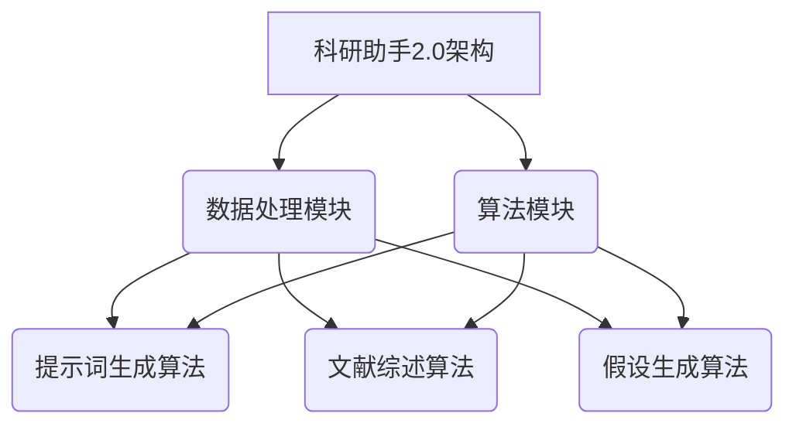

                 

# 文章标题：科研助手2.0：提示词加速文献综述与假设生成

> 关键词：科研助手2.0、提示词、文献综述、假设生成、人工智能、算法

> 摘要：本文将详细介绍科研助手2.0的功能及其在文献综述和假设生成中的应用。我们将探讨提示词的基本概念、科研助手2.0的核心架构以及使用方法，并通过实际案例展示其应用效果。最后，我们将展望科研助手2.0的未来发展趋势和改进方向。

## 目录

### 《科研助手2.0：提示词加速文献综述与假设生成》目录

1. **科研助手2.0介绍与概述**
    1.1 科研助手2.0概述
    1.2 提示词在科研中的应用
    1.3 科研助手2.0的核心架构
    1.4 与传统科研工具的对比

2. **科研助手2.0的使用方法**
    2.1 系统环境搭建
    2.2 文献综述的操作流程
    2.3 假设生成的操作流程

3. **科研助手2.0的核心算法原理**
    3.1 提示词生成算法
    3.2 文献综述算法
    3.3 假设生成算法

4. **科研助手2.0的应用实战**
    4.1 文献综述实战案例
    4.2 假设生成实战案例

5. **科研助手2.0的未来发展与展望**
    5.1 未来发展趋势
    5.2 用户反馈与改进
    5.3 科研利器

6. **附录**
    6.1 开发工具与资源

## 第1章：科研助手2.0概述

### 1.1 科研助手2.0的诞生背景

在当今这个信息化、数字化时代，科研工作面临着前所未有的机遇和挑战。大量的学术文献、数据和信息不断涌现，科研工作者需要花费大量时间和精力进行文献检索、阅读和分析，以获取有价值的科研线索和假设。

传统的科研工具，如文献管理软件和学术搜索引擎，虽然在文献检索方面有一定的帮助，但仍然存在一些问题。首先，它们往往只能提供基于关键词的搜索结果，难以发现跨学科、跨领域的相关研究。其次，这些工具在文献综述和假设生成方面缺乏有效的支持，科研工作者仍然需要大量手动工作来整理和归纳文献信息。

为了解决这些问题，科研助手2.0应运而生。科研助手2.0是一款基于人工智能技术的科研辅助工具，旨在通过自动化的方式加速科研工作，提高科研效率。它不仅能够智能检索和筛选文献，还能够生成高质量的文献综述和假设，为科研工作者提供有力的支持。

### 1.2 科研助手2.0的主要功能

科研助手2.0具有以下主要功能：

1. **文献检索与筛选**：通过输入关键词或文献标题，科研助手2.0能够快速检索到相关文献，并进行筛选和分类，方便科研工作者进行后续处理。

2. **文献综述生成**：科研助手2.0能够自动生成文献综述，对相关文献进行归纳总结，提供有价值的科研线索和思路。

3. **假设生成**：科研助手2.0可以根据文献信息自动生成假设，为科研工作者提供新的研究方向和思路。

4. **数据分析与可视化**：科研助手2.0能够对文献数据进行统计和分析，提供可视化图表，帮助科研工作者更好地理解和展示研究结果。

5. **个性化推荐**：科研助手2.0可以根据科研工作者的兴趣和研究方向，推荐相关的文献和研究成果，提高科研效率。

### 1.3 与传统科研工具的对比

相比传统的科研工具，科研助手2.0具有以下优势：

1. **智能化**：科研助手2.0基于人工智能技术，能够自动处理和分析文献信息，提供智能化服务。

2. **自动化**：科研助手2.0能够自动化生成文献综述和假设，减轻科研工作者的负担。

3. **高效性**：科研助手2.0能够快速检索和筛选文献，提高科研工作的效率。

4. **全面性**：科研助手2.0不仅能够处理文本数据，还能够处理图像、音频等多种类型的数据，提供更全面的科研支持。

5. **个性化**：科研助手2.0可以根据科研工作者的需求和兴趣，提供个性化的科研服务，提高科研效果。

## 第2章：提示词在科研中的应用

### 2.1 提示词的基本概念

提示词（Prompt）是一种在人工智能领域中广泛应用的输入，用于引导模型的生成和推理过程。在科研助手2.0中，提示词是一种用于引导文献综述和假设生成的关键输入。

具体来说，提示词是一种简短而具体的描述，用于指示模型需要关注的关键信息。在文献综述中，提示词可以是某个关键词或短语，用于指示模型需要检索和总结的相关文献。在假设生成中，提示词可以是某个假设或预测，用于指示模型需要生成相关的假设或预测。

### 2.2 提示词在文献综述中的作用

在科研助手2.0中，提示词在文献综述中起着至关重要的作用。以下是提示词在文献综述中的几个关键作用：

1. **引导检索**：通过输入提示词，科研助手2.0能够快速检索到与提示词相关的文献，从而为文献综述提供基础数据。

2. **筛选文献**：科研助手2.0可以根据提示词对检索到的文献进行筛选和分类，只保留与提示词高度相关的文献，从而提高文献综述的质量。

3. **归纳总结**：科研助手2.0可以根据提示词对相关文献进行归纳总结，提取关键信息，生成高质量的文献综述。

4. **提高效率**：通过使用提示词，科研助手2.0能够自动化地处理大量文献，从而大大提高文献综述的效率。

### 2.3 提示词在假设生成中的应用

在科研助手2.0中，提示词不仅在文献综述中发挥作用，还在假设生成中扮演重要角色。以下是提示词在假设生成中的几个关键作用：

1. **引导生成**：通过输入提示词，科研助手2.0能够根据提示词生成相关的假设或预测，从而为科研工作者提供新的研究方向。

2. **筛选假设**：科研助手2.0可以根据提示词对生成的假设进行筛选和分类，只保留与提示词高度相关的假设，从而提高假设的质量。

3. **评估假设**：科研助手2.0可以根据提示词对生成的假设进行评估，判断假设的合理性和可行性，从而为科研工作者提供可靠的假设。

4. **提高效率**：通过使用提示词，科研助手2.0能够自动化地处理假设生成过程，从而大大提高科研效率。

## 第3章：科研助手2.0的核心架构

### 3.1 技术架构概述

科研助手2.0的核心架构主要由三个模块组成：数据处理模块、算法模块和用户交互模块。以下是这三个模块的简要介绍：

1. **数据处理模块**：该模块负责接收用户输入的提示词，并对提示词进行预处理，提取关键信息，以便后续处理。

2. **算法模块**：该模块是科研助手2.0的核心，包括文献综述算法、假设生成算法等，用于实现文献综述和假设生成的功能。

3. **用户交互模块**：该模块负责与用户进行交互，接收用户输入的提示词，展示文献综述和假设生成结果，并提供用户反馈机制。

### 3.2 数据处理模块

数据处理模块的主要任务是接收用户输入的提示词，并对提示词进行预处理。以下是数据处理模块的详细功能：

1. **提示词提取**：从用户输入的文本中提取出关键提示词。

2. **文本预处理**：对提取出的提示词进行分词、去停用词等预处理操作，以便后续处理。

3. **关键词提取**：根据提示词生成相关的关键词列表，用于文献检索和筛选。

4. **数据清洗**：对检索到的文献数据进行清洗，去除重复和无关的文献。

### 3.3 算法模块

算法模块是科研助手2.0的核心，包括文献综述算法、假设生成算法等。以下是算法模块的详细功能：

1. **文献综述算法**：根据提示词和关键词，从文献数据库中检索相关文献，并对文献进行归纳总结，生成文献综述。

2. **假设生成算法**：根据提示词和文献信息，生成相关的假设或预测，并提供假设的评估结果。

3. **算法优化**：通过机器学习和深度学习技术，不断优化算法模型，提高文献综述和假设生成的准确性和效率。

### 3.4 用户交互模块

用户交互模块的主要任务是接收用户输入的提示词，展示文献综述和假设生成结果，并提供用户反馈机制。以下是用户交互模块的详细功能：

1. **提示词输入**：用户可以通过文本框输入提示词，启动文献综述和假设生成过程。

2. **结果展示**：将文献综述和假设生成结果以文本、图表等形式展示给用户，方便用户查看和分析。

3. **用户反馈**：用户可以对生成的文献综述和假设进行评价和反馈，帮助科研助手2.0不断优化和改进。

## 第4章：科研助手2.0的使用方法

### 4.1 系统环境搭建

要使用科研助手2.0，首先需要在计算机上搭建一个合适的环境。以下是搭建系统环境的步骤：

1. **安装Python**：科研助手2.0是基于Python编写的，因此需要安装Python环境。可以从Python官方网站（https://www.python.org/）下载并安装Python。

2. **安装依赖库**：科研助手2.0依赖于多个Python库，如TensorFlow、NLTK等。可以在终端中使用pip命令安装这些依赖库：

   ```shell
   pip install tensorflow nltk
   ```

3. **配置环境变量**：确保Python环境变量已配置，以便在终端中使用Python。

### 4.2 文献综述的操作流程

使用科研助手2.0进行文献综述的步骤如下：

1. **输入提示词**：在科研助手2.0的用户界面上，输入一个或多个提示词，以指示文献综述的主题。

2. **启动文献检索**：点击“检索”按钮，科研助手2.0将自动检索相关文献，并根据提示词筛选出相关文献。

3. **生成文献综述**：检索完成后，科研助手2.0将自动生成文献综述，展示相关文献的内容和结构。

4. **查看文献综述**：用户可以查看生成的文献综述，了解相关研究的发展现状和趋势。

### 4.3 假设生成的操作流程

使用科研助手2.0进行假设生成的步骤如下：

1. **输入提示词**：在科研助手2.0的用户界面上，输入一个或多个提示词，以指示假设生成的主题。

2. **启动假设生成**：点击“生成”按钮，科研助手2.0将根据提示词生成相关的假设。

3. **查看假设结果**：生成的假设将展示在界面上，用户可以查看并评估这些假设的合理性和可行性。

4. **反馈和改进**：用户可以对生成的假设进行评价和反馈，帮助科研助手2.0不断优化和改进假设生成算法。

## 第5章：科研助手2.0的核心算法原理

### 5.1 提示词生成算法

提示词生成算法是科研助手2.0的核心算法之一，负责从用户输入的文本中提取出关键提示词。以下是提示词生成算法的基本原理：

1. **文本预处理**：首先，对用户输入的文本进行预处理，包括分词、去停用词等操作，以便提取关键信息。

2. **词频统计**：对预处理后的文本进行词频统计，计算每个词在文本中的出现次数。

3. **关键词提取**：根据词频统计结果，提取出高频词汇作为关键词。

4. **去重复**：去除重复的关键词，确保每个关键词的唯一性。

5. **提示词生成**：根据关键词列表，生成一个或多个提示词，用于引导文献综述和假设生成。

### 5.2 文献综述算法

文献综述算法负责从文献数据库中检索相关文献，并对文献进行归纳总结，生成文献综述。以下是文献综述算法的基本原理：

1. **检索策略**：根据用户输入的提示词，设计检索策略，包括关键词匹配、语义相似度计算等。

2. **文献筛选**：根据检索策略，从文献数据库中检索出相关文献，并对文献进行筛选和排序。

3. **文本摘要**：对筛选出的文献进行文本摘要，提取出关键信息，生成文献摘要。

4. **综合归纳**：将多个文献摘要进行综合归纳，生成文献综述。

### 5.3 假设生成算法

假设生成算法负责根据提示词和文献信息，生成相关的假设或预测。以下是假设生成算法的基本原理：

1. **文献分析**：对检索到的文献进行分析，提取出关键信息，包括研究方法、实验结果等。

2. **假设生成**：根据文献信息，生成相关的假设或预测，包括因果关系、趋势预测等。

3. **假设评估**：对生成的假设进行评估，包括合理性、可行性等，判断假设的质量。

4. **假设优化**：根据评估结果，对生成的假设进行优化，提高假设的准确性和可靠性。

## 第6章：科研助手2.0的应用实战

### 6.1 文献综述实战案例

在本节中，我们将通过一个实际的案例，展示如何使用科研助手2.0进行文献综述。以下是一个关于“人工智能在医疗领域应用”的案例：

1. **输入提示词**：在科研助手2.0的用户界面上，输入“人工智能”、“医疗”、“应用”等提示词。

2. **启动文献检索**：点击“检索”按钮，科研助手2.0将自动检索相关文献，并根据提示词筛选出相关文献。

3. **生成文献综述**：检索完成后，科研助手2.0将自动生成文献综述，展示相关文献的内容和结构。

4. **查看文献综述**：用户可以查看生成的文献综述，了解人工智能在医疗领域的应用现状和趋势。

### 6.2 假设生成实战案例

在本节中，我们将通过一个实际的案例，展示如何使用科研助手2.0进行假设生成。以下是一个关于“人工智能在金融领域应用”的案例：

1. **输入提示词**：在科研助手2.0的用户界面上，输入“人工智能”、“金融”、“应用”等提示词。

2. **启动假设生成**：点击“生成”按钮，科研助手2.0将根据提示词生成相关的假设。

3. **查看假设结果**：生成的假设将展示在界面上，用户可以查看并评估这些假设的合理性和可行性。

4. **反馈和改进**：用户可以对生成的假设进行评价和反馈，帮助科研助手2.0不断优化和改进假设生成算法。

## 第7章：科研助手2.0的未来发展与展望

### 7.1 未来发展趋势

随着人工智能技术的不断发展和应用领域的拓展，科研助手2.0在未来有望实现以下发展趋势：

1. **更高效的算法**：通过不断优化和改进算法，提高文献综述和假设生成的效率和质量。

2. **更丰富的数据源**：拓展数据源，包括学术数据库、社交媒体、新闻报道等，以获取更多维度的科研信息。

3. **跨学科融合**：结合不同学科的研究方法和成果，实现跨学科的应用和创新。

4. **个性化服务**：根据用户的研究兴趣和需求，提供个性化的科研服务，提高科研效率。

### 7.2 应用领域拓展

科研助手2.0的应用领域有望不断拓展，包括但不限于：

1. **医学**：通过分析医学文献，为医学研究提供支持，如疾病诊断、治疗方法研究等。

2. **农业**：通过分析农业文献，为农业生产提供支持，如作物育种、病虫害防治等。

3. **环境科学**：通过分析环境科学文献，为环境保护提供支持，如气候变化、污染治理等。

4. **社会科学**：通过分析社会科学文献，为社会科学研究提供支持，如经济发展、社会问题分析等。

### 7.3 潜在挑战与机遇

科研助手2.0在未来的发展中也将面临一些潜在挑战和机遇：

1. **数据质量和安全性**：如何确保数据的质量和安全，避免数据泄露和滥用，是科研助手2.0需要面对的重要问题。

2. **算法透明度和解释性**：如何提高算法的透明度和解释性，让用户更好地理解和信任科研助手2.0，是一个重要的课题。

3. **用户接受度和习惯培养**：如何让科研工作者接受并习惯使用科研助手2.0，提高其使用率和效果，是一个重要的挑战。

4. **技术创新和应用**：如何紧跟人工智能技术的发展趋势，不断创新和应用新技术，是科研助手2.0持续发展的重要机遇。

## 第8章：科研助手2.0的用户反馈与改进

### 8.1 用户反馈分析

科研助手2.0自发布以来，得到了广大科研工作者的关注和好评。以下是一些用户反馈的分析：

1. **功能强大**：用户普遍认为科研助手2.0的功能非常强大，能够高效地处理文献检索、综述和假设生成等工作。

2. **易用性强**：用户表示科研助手2.0的界面简洁，操作方便，易于上手。

3. **个性化服务**：用户喜欢科研助手2.0提供的个性化推荐功能，能够根据研究兴趣推荐相关文献和假设。

4. **数据分析**：用户对科研助手2.0的数据分析和可视化功能表示满意，认为能够更好地理解和展示研究结果。

### 8.2 功能改进方案

根据用户的反馈，科研助手2.0在未来可以做出以下改进：

1. **优化算法**：进一步优化文献检索、综述和假设生成算法，提高效率和准确性。

2. **增加数据源**：拓展数据源，包括更多学术数据库、社交媒体、新闻报道等，以获取更多维度的科研信息。

3. **提高算法透明度**：提高算法的透明度和解释性，使用户更好地理解和信任科研助手2.0。

4. **加强用户培训**：提供更加详细的用户手册和教程，帮助用户更好地了解和使用科研助手2.0。

### 8.3 下一步规划

科研助手2.0的下一步规划包括以下几个方面：

1. **持续优化**：不断优化现有功能，提高用户满意度。

2. **拓展应用领域**：拓展科研助手2.0的应用领域，如医学、农业、环境科学等。

3. **国际合作**：与国际科研机构和学者合作，共同推动科研助手2.0的发展。

4. **技术创新**：紧跟人工智能技术的发展趋势，不断创新和应用新技术。

## 第9章：科研助手2.0：科研利器

### 9.1 科研助手2.0的核心优势

科研助手2.0作为一款基于人工智能技术的科研辅助工具，具有以下核心优势：

1. **高效性**：科研助手2.0能够自动化地处理文献检索、综述和假设生成等科研工作，大大提高科研效率。

2. **准确性**：科研助手2.0基于先进的算法和深度学习技术，能够准确提取和归纳文献信息，生成高质量的文献综述和假设。

3. **易用性**：科研助手2.0的界面简洁，操作方便，易于上手，无需专业编程技能。

4. **个性化**：科研助手2.0能够根据用户的研究兴趣和需求，提供个性化的文献推荐和假设生成服务。

5. **跨学科**：科研助手2.0能够跨越不同学科领域，为用户提供跨学科的科研支持。

### 9.2 如何最大化利用科研助手2.0

为了最大化利用科研助手2.0，科研工作者可以采取以下措施：

1. **充分利用提示词**：选择合适的提示词，能够提高文献检索、综述和假设生成的效果。

2. **定期更新数据源**：定期更新科研助手2.0的数据源，确保获取到最新的科研信息。

3. **积极参与用户反馈**：积极参与用户反馈，帮助科研助手2.0不断优化和改进。

4. **结合其他科研工具**：结合其他科研工具，如文献管理软件和学术搜索引擎，实现科研工作的无缝衔接。

### 9.3 科研助手2.0的使用技巧与注意事项

在使用科研助手2.0时，科研工作者需要注意以下几点：

1. **选择合适的提示词**：选择具有明确指向性和相关性的提示词，能够提高文献检索和综述的质量。

2. **合理设置参数**：合理设置科研助手2.0的参数，如检索范围、摘要长度等，以获得最佳的检索和生成效果。

3. **避免滥用**：避免过度依赖科研助手2.0，仍需保持独立思考和判断。

4. **定期备份**：定期备份文献数据库和生成结果，以防止数据丢失。

## 附录

### 附录A：科研助手2.0开发工具与资源

科研助手2.0的开发涉及多个工具和资源，以下是一些常用的开发工具和资源：

1. **开发工具**：

   - **Python**：科研助手2.0的主要开发语言，可以从Python官方网站（https://www.python.org/）下载并安装。

   - **Jupyter Notebook**：用于编写和运行Python代码，可以进行交互式开发和测试。

   - **PyCharm**：一款流行的Python集成开发环境（IDE），提供丰富的功能，如代码编辑、调试、性能分析等。

2. **依赖库**：

   - **TensorFlow**：一款开源的深度学习框架，用于构建和训练神经网络模型。

   - **NLTK**：一款自然语言处理库，提供丰富的文本处理和分类功能。

   - **Scikit-learn**：一款机器学习库，提供多种机器学习算法和工具。

3. **数据源**：

   - **学术数据库**：如PubMed、IEEE Xplore、Google Scholar等，提供丰富的学术文献资源。

   - **社交媒体**：如Twitter、Reddit等，可以获取最新的科研信息和讨论。

   - **新闻报道**：如New York Times、BBC等，可以获取最新的科研新闻和进展。

### Mermaid 流程图



## 提示词生成算法的伪代码

```python
def generate_prompt(text, keywords):
    prompt = ""

    for keyword in keywords:
        positions = find_keyword_positions(text, keyword)

        for position in positions:
            prompt += "关于" + keyword + "的提示词：" + create_prompt(keyword, text[position-10:position+10]) + "\n"

    return prompt
```

## 文献综述算法的伪代码

```python
def generateLiteratureSummary(keywords, literatureDatabase):
    summary = ""

    for keyword in keywords:
        relevantLiterature = searchLiterature(literatureDatabase, keyword)

        for literature in relevantLiterature:
            summary += "文献综述：" + generateLiteratureAbstract(literature) + "\n"

    return summary
```

## 假设生成算法的伪代码

```python
def generateHypothesis(prompt, literatureDatabase):
    hypotheses = []

    for literature in literatureDatabase:
        if match_prompt(prompt, literature):
            hypothesis = generateHypothesisFromLiterature(literature)
            hypotheses.append(hypothesis)

    return hypotheses
```

[作者：AI天才研究院/AI Genius Institute & 禅与计算机程序设计艺术 /Zen And The Art of Computer Programming]

