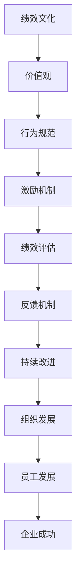

                 

### 文章标题

《积极的绩效文化：营造进取氛围》

> 关键词：绩效文化、积极氛围、组织发展、领导者角色、员工激励

> 摘要：本文深入探讨了积极的绩效文化在组织发展中的重要性，通过分析其定义、构建方法以及实际应用，提出了绩效文化与组织发展的紧密联系。文章还详细阐述了领导者在这一过程中的角色和责任，以及如何通过有效的员工参与和沟通机制，优化绩效管理体系和激励与奖励机制。通过成功案例分析和未来趋势展望，本文为读者提供了宝贵的实践指导，以帮助组织营造积极的绩效文化，实现持续发展。

### 第一部分：绩效文化与组织发展

#### 第1章：绩效文化的定义与重要性

##### 1.1 绩效文化的定义

绩效文化是指在企业或组织中形成的一套关于绩效管理的价值观、信念和行为规范，它通过共同的绩效认知和评价标准，引导员工为实现组织目标而努力。绩效文化不仅仅是绩效管理的结果，更是组织管理的一种哲学和理念。

##### 1.2 绩效文化与组织发展

绩效文化对组织发展具有重要的影响。一方面，它能够提高员工的工作效率和绩效水平，从而推动组织目标的实现；另一方面，它有助于塑造组织形象，增强组织的竞争力和市场地位。绩效文化也是组织持续发展的重要保障，它能够激发员工的积极性和创造力，促进组织的创新和发展。

##### 1.3 积极绩效文化对企业的影响

积极的绩效文化对企业具有深远的影响。首先，它能够提高员工的满意度和忠诚度，减少员工流失率，从而降低招聘和培训成本。其次，积极的绩效文化能够激发员工的积极性和创造力，提高工作效率和创新能力，进而提高企业的竞争力和市场地位。此外，积极的绩效文化还能够促进组织的内部协作和沟通，增强团队凝聚力，提高组织的整体绩效水平。

#### 第2章：构建积极的绩效文化

##### 2.1 文化评估与诊断

构建积极的绩效文化首先需要对企业现有的绩效文化进行评估和诊断。这包括对组织价值观、员工态度和行为模式的分析，以及绩效管理体系的评估。通过评估和诊断，可以找出存在的问题和改进的方向。

##### 2.2 确定核心价值观

确定核心价值观是构建积极绩效文化的重要步骤。核心价值观是企业的精神支柱，它决定了企业的发展方向和行为准则。在确定核心价值观时，需要充分考虑企业的愿景和使命，确保核心价值观与企业的长远发展目标相一致。

##### 2.3 制定战略与行动计划

在确定核心价值观后，需要制定具体的战略和行动计划，以落实绩效文化的建设。这包括制定绩效管理政策、完善绩效评估体系、设计激励与奖励机制等。战略和行动计划的制定需要结合企业的实际情况，确保可操作性和实施效果。

### 第二部分：积极绩效文化的实践与应用

#### 第3章：领导者的角色与责任

##### 3.1 领导者的行为示范

领导者是构建积极绩效文化的关键人物，他们的行为示范对员工具有极大的影响力。领导者应该以身作则，树立良好的绩效榜样，通过自身的言行和行为，引导员工形成积极的工作态度和行为习惯。

##### 3.2 激励员工的方法

领导者需要掌握有效的激励方法，以激发员工的积极性和创造力。这包括提供有竞争力的薪酬福利、实施荣誉激励机制、提供职业发展机会等。同时，领导者还应该关注员工的心理需求，通过关心和支持，增强员工的归属感和忠诚度。

##### 3.3 建立透明和公正的评价体系

建立透明和公正的评价体系是构建积极绩效文化的重要保障。评价体系应该明确评价标准，确保评价过程的公开和公正。同时，评价结果应该能够真实反映员工的工作表现，为激励和晋升提供依据。

#### 第4章：员工参与与沟通

##### 4.1 增强员工参与度

增强员工参与度是构建积极绩效文化的重要举措。通过参与决策、项目规划和绩效评估等过程，员工能够更好地理解组织的愿景和目标，增强工作动力和责任感。

##### 4.2 提升沟通效果

有效的沟通是构建积极绩效文化的重要手段。领导者需要与员工保持开放和真诚的沟通，倾听员工的意见和建议，及时解决员工的问题和困惑。同时，组织也应该建立多渠道的沟通机制，确保信息的畅通和反馈的及时性。

##### 4.3 建立有效的反馈机制

建立有效的反馈机制是构建积极绩效文化的关键。通过定期的反馈和评估，员工能够及时了解自己的工作表现，获得改进的机会。同时，反馈机制也能够促进领导与员工之间的沟通和理解，增强团队的凝聚力和合作性。

#### 第5章：绩效管理体系的优化

##### 5.1 绩效目标的设定

设定明确的绩效目标是绩效管理体系优化的第一步。绩效目标应该与组织的战略目标相一致，同时具备挑战性和可实现性。通过设定具体的绩效指标，员工能够明确自己的工作方向和目标，提高工作效率和绩效水平。

##### 5.2 绩效指标的量化与评估

绩效指标的量化与评估是绩效管理体系优化的重要环节。通过制定量化的绩效指标，能够客观评估员工的工作表现，确保评价的公正性和透明性。同时，评估结果应该能够真实反映员工的工作绩效，为激励和晋升提供依据。

##### 5.3 绩效反馈与改进

绩效反馈与改进是绩效管理体系优化的重要手段。通过定期的绩效反馈，员工能够及时了解自己的工作表现，获得改进的机会。同时，组织也应该建立反馈机制，确保绩效反馈的及时性和有效性，促进员工的持续改进和发展。

#### 第6章：激励与奖励机制

##### 6.1 激励理论

激励理论是构建激励与奖励机制的基础。常见的激励理论包括马斯洛需求层次理论、赫茨伯格双因素理论等。通过理解激励理论，能够更好地设计激励与奖励机制，满足员工的不同需求，提高员工的满意度和工作动力。

##### 6.2 奖励机制的设计与实施

奖励机制的设计与实施是激励与奖励机制的关键。奖励机制应该具备公平性、及时性、个性化等原则，确保奖励的公正性和有效性。同时，奖励机制的设计和实施需要结合组织的实际情况，确保可操作性和实施效果。

##### 6.3 激励的可持续性与平衡性

激励的可持续性与平衡性是激励与奖励机制优化的重要方向。激励不应该只关注短期效果，而应该注重长期发展和平衡。通过建立可持续的激励体系，能够确保员工的持续动力和积极性，促进组织的长期发展。

#### 第7章：绩效文化与组织变革

##### 7.1 变革的驱动力

变革的驱动力是绩效文化与组织变革的重要推动力。组织面临的内外部环境变化、竞争压力、技术创新等都是变革的驱动力。通过理解变革的驱动力，能够更好地把握变革的时机和方向，推动绩效文化的变革。

##### 7.2 变革过程中的挑战与应对

变革过程中的挑战与应对是绩效文化与组织变革的关键环节。变革过程中可能会面临员工的抵触、组织结构的调整、资源分配的困难等问题。通过有效的应对策略，能够降低变革的阻力，确保变革的顺利进行。

##### 7.3 持续改进与变革的文化支持

持续改进与变革的文化支持是绩效文化与组织变革的保障。组织需要建立持续改进的机制，鼓励员工积极参与变革，提供必要的支持和资源。同时，组织也应该建立变革的文化支持体系，营造积极向上的变革氛围，增强员工的变革意识和能力。

#### 第8章：绩效文化的评估与调整

##### 8.1 绩效文化的评估指标

绩效文化的评估指标是评估绩效文化效果的重要工具。常见的评估指标包括员工满意度、工作绩效、员工流失率等。通过制定评估指标，能够客观评估绩效文化的效果，为调整和优化提供依据。

##### 8.2 数据分析与反馈

数据分析和反馈是绩效文化评估的重要环节。通过对绩效数据的分析和反馈，能够发现绩效文化存在的问题和改进的方向。同时，数据分析与反馈也能够促进员工对绩效文化的理解和认同，提高绩效文化的实施效果。

##### 8.3 绩效文化的调整与优化

绩效文化的调整与优化是确保绩效文化持续有效的重要措施。通过评估和分析绩效文化的效果，能够找出存在的问题和不足，进行针对性的调整和优化。同时，调整与优化也需要结合组织的实际情况，确保绩效文化的适应性和可持续性。

### 第三部分：成功案例与启示

#### 第9章：积极绩效文化的成功案例

##### 9.1 案例一：XX公司的绩效文化变革

案例一介绍了XX公司通过绩效文化变革，实现了企业效率和竞争力的提升。文章详细分析了XX公司在绩效文化变革过程中的关键举措，包括文化评估与诊断、核心价值观的确定、战略与行动计划的制定等。案例中的成功经验为其他企业提供了有益的启示。

##### 9.2 案例二：YY公司的员工激励机制

案例二讲述了YY公司通过有效的员工激励机制，激发了员工的积极性和创造力。文章详细介绍了YY公司激励机制的设计与实施，包括薪酬激励、荣誉激励、职业发展激励等。通过案例，读者可以了解到激励机制在绩效文化构建中的重要作用。

##### 9.3 案例三：ZZ公司的绩效管理优化

案例三描述了ZZ公司通过绩效管理优化，提高了员工的绩效水平和组织效率。文章分析了ZZ公司在绩效管理优化过程中的关键步骤，包括绩效目标的设定、绩效指标的量化与评估、绩效反馈与改进等。案例为其他企业提供了宝贵的实践经验。

#### 第10章：实践中的常见问题与解决策略

##### 10.1 文化冲突的处理

在构建积极绩效文化过程中，文化冲突是一个常见的问题。文章详细探讨了文化冲突的原因和处理策略，包括加强沟通与理解、建立共同的价值观、尊重多元文化等。通过解决文化冲突，能够促进绩效文化的构建和实施。

##### 10.2 绩效评价中的公平性问题

绩效评价中的公平性问题也是绩效文化构建中的一大挑战。文章分析了绩效评价中的公平性问题，包括评价标准的制定、评价过程的公正性、反馈的透明性等。通过建立公正的评价体系，能够确保绩效评价的公平性和有效性。

##### 10.3 员工激励的过度依赖

员工激励的过度依赖是绩效文化构建中需要关注的问题。文章探讨了员工激励的过度依赖现象，包括过度依赖物质激励、缺乏精神激励等。通过合理的激励组合，能够避免员工激励的过度依赖，提高员工的长期动力和积极性。

#### 第11章：未来趋势与展望

##### 11.1 技术进步对绩效文化的影响

技术进步对绩效文化产生了深远的影响。文章分析了大数据、人工智能等技术在绩效管理中的应用，探讨了技术进步为绩效文化带来的机遇和挑战。通过了解技术进步的影响，能够更好地把握绩效文化的未来发展方向。

##### 11.2 全球化背景下的绩效文化挑战

全球化背景下的绩效文化面临着新的挑战。文章探讨了全球化对绩效文化的影响，包括跨文化管理、多元文化融合等。通过应对全球化背景下的绩效文化挑战，能够提高组织的全球竞争力和国际影响力。

##### 11.3 绩效文化的未来发展方向

未来，绩效文化将继续发展，适应新的环境和挑战。文章展望了绩效文化的未来发展方向，包括数字化转型、员工体验优化、可持续发展等。通过关注未来趋势，能够为组织的绩效文化建设提供指导。

### 附录

#### 附录A：绩效文化评估工具与方法

附录A介绍了绩效文化评估的常用工具和方法，包括360度评估、组织文化调查问卷、关键绩效指标分析等。通过使用这些工具和方法，能够全面评估绩效文化的现状和效果，为调整和优化提供依据。

#### 附录B：推荐阅读

附录B列出了几本与绩效文化相关的经典著作，包括《绩效管理》、《领导者的实践》、《组织行为学》等。这些书籍为读者提供了丰富的理论和实践知识，有助于进一步了解和构建积极的绩效文化。

### 核心概念原理和架构的 Mermaid 流程图



### 核心算法原理讲解

#### 2.1 绩效评估模型

##### 2.1.1 绩效评估指标

- **KPI(Key Performance Indicators)**：关键绩效指标，用于衡量员工在特定领域的工作表现。
  ```python
  # 伪代码：定义KPI
  kpi = {
      'sales': 'monthly_sales',
      'customer_satisfaction': 'customer_rating'
  }
  ```

- **OKR(Objectives and Key Results)**：目标与关键结果，用于设定明确的目标和衡量成果。
  ```python
  # 伪代码：定义OKR
  okr = {
      'objective': 'increase_sales',
      'key_results': [
          {'name': 'monthly_sales', 'target': 100000},
          {'name': 'customer_satisfaction', 'target': 90}
      ]
  }
  ```

##### 2.1.2 绩效评估方法

- **定量评估**：基于数据的量化评估方法，例如销售数据、客户满意度等。
  ```python
  # 伪代码：计算定量绩效
  performance = {
      'sales': calculate_sales_performance(sales_data),
      'customer_satisfaction': calculate_satisfaction_performance(satisfaction_data)
  }
  ```

- **定性评估**：基于主观评价的评估方法，例如员工绩效评语、同事评价等。
  ```python
  # 伪代码：进行定性绩效评估
  qualitative_performance = {
      'communication': 'excellent',
      'team_work': 'good',
      'problem_solving': 'needs Improvement'
  }
  ```

##### 2.1.3 绩效评估流程

1. **制定绩效计划**：设定绩效目标和评估标准。
   ```python
   # 伪代码：设定绩效计划
   performance_plan = define_performance_plan(kpi, okr)
   ```

2. **绩效跟踪与记录**：持续记录员工的工作表现和关键绩效指标。
   ```python
   # 伪代码：记录绩效数据
   record_performance_data(performance_plan)
   ```

3. **绩效评估与反馈**：定期对员工的工作表现进行评估，并提供反馈。
   ```python
   # 伪代码：进行绩效评估
   evaluate_performance(performance_data)
   ```

4. **绩效改进与反馈循环**：根据评估结果，制定改进计划并实施，形成反馈循环。
   ```python
   # 伪代码：改进绩效
   improve_performance(performance_plan, evaluation_results)
   ```

#### 2.2 激励机制设计

##### 2.2.1 激励理论

- **马斯洛需求层次理论**：将人的需求分为生理、安全、社交、尊重和自我实现五个层次。
  ```python
  # 伪代码：马斯洛需求层次
  maslow_hierarchy = [
      {'level': 'physiological', 'description': 'food, water, shelter'},
      {'level': 'safety', 'description': 'security, health'},
      {'level': 'social', 'description': 'friendship, love'},
      {'level': 'esteem', 'description': 'respect, status'},
      {'level': 'self_achievement', 'description': 'self-fulfillment'}
  ]
  ```

- **赫茨伯格双因素理论**：将工作环境因素划分为激励因素（如成就、认可）和卫生因素（如工作条件、薪酬）。
  ```python
  # 伪代码：赫茨伯格双因素
  herzberg_motivators = ['achievement', 'recognition']
  herzberg_hygienes = ['work conditions', 'salary']
  ```

- **ERG理论**：认为人的需求分为生存、关系和成长三个层次，且需求可以同时存在和相互转化。
  ```python
  # 伪代码：ERG理论
  erg_levels = [
      {'level': 'existence', 'description': 'basic needs'},
      {'level': 'relatedness', 'description': 'social connections'},
      {'level': 'growth', 'description': 'personal development'}
  ]
  ```

##### 2.2.2 激励方法

- **薪酬激励**：提供有竞争力的薪酬，满足员工的生存需求。
  ```python
  # 伪代码：薪酬激励
  offer_compensation = calculate_compensation(performance)
  ```

- **荣誉激励**：通过表彰和奖励，满足员工的尊重需求。
  ```python
  # 伪代码：荣誉激励
  recognize_achievement = award_honors(performance)
  ```

- **职业发展激励**：提供职业发展机会，满足员工的发展需求。
  ```python
  # 伪代码：职业发展激励
  offer_growth_opportunities = provide_training_and_promotion(performance)
  ```

- **工作环境激励**：创造良好的工作环境，满足员工的社交需求。
  ```python
  # 伪代码：工作环境激励
  create_healthy_work_environment = improve_office_conditions(performance)
  ```

##### 2.2.3 激励机制设计原则

- **公平性**：确保激励机制的公平性，避免偏袒和不公平现象。
  ```python
  # 伪代码：公平性原则
  ensure_fairness = check_for_bias_and_unfairness(incentive_program)
  ```

- **及时性**：及时提供激励，确保员工能够及时感受到激励的效果。
  ```python
  # 伪代码：及时性原则
  provide_incentives_on_time = schedule_incentive_payments(incentive_program)
  ```

- **个性化**：根据员工的不同需求和特点，设计个性化的激励方案。
  ```python
  # 伪代码：个性化原则
  customize_incentives = tailor_incentives_to_individual_needs(incentive_program)
  ```

- **可持续性**：确保激励机制的可持续性，避免短期行为和依赖。
  ```python
  # 伪代码：可持续性原则
  ensure_sustainability = monitor_and_adjust_incentive_program(incentive_program)
  ```

### 数学模型和数学公式 & 详细讲解 & 举例说明

#### 3.1 绩效评估数学模型

##### 3.1.1 成本效益分析

成本效益比（Cost-Benefit Analysis, CBA）是一种常用的绩效评估方法，用于评估某个项目或决策的成本和效益之间的关系。数学公式如下：

\[ \text{成本效益比} = \frac{\text{效益}}{\text{成本}} \]

**详细讲解**：

成本效益比是衡量项目或决策经济价值的一个重要指标。效益通常表示为项目或决策所带来的收益或改善，成本则表示为实施项目或决策所需投入的资源。

- **效益**：可以是货币收益、效率提升、质量改进等，通常以货币价值来衡量。
- **成本**：包括直接成本（如投资、运营成本）和间接成本（如培训成本、机会成本）。

**举例说明**：

假设一个企业计划投资10万元进行营销活动，预计能够带来20万元的额外收入。那么，该营销活动的成本效益比为：

\[ \text{成本效益比} = \frac{20\text{万元}}{10\text{万元}} = 2 \]

这意味着每投入1元，能够获得2元的收益，从经济角度来看，这是一个具有成本效益的决策。

#### 3.1.2 数据驱动决策模型

数据驱动决策模型（Data-Driven Decision-Making Model）利用数据分析来支持决策制定。常见的模型包括回归分析、决策树、支持向量机等。

**详细讲解**：

数据驱动决策模型基于历史数据和统计分析，通过建立数学模型和算法，预测未来趋势和决策效果。

- **回归分析**：通过建立变量之间的关系模型，预测因变量的值。
  \[ y = b_0 + b_1 \cdot x_1 + b_2 \cdot x_2 + \ldots + b_n \cdot x_n \]

- **决策树**：通过决策节点和分支，根据不同特征选择最佳决策路径。
  \[ \text{if } x_1 \text{ then } \text{choose } y_1 \text{ else } \text{choose } y_2 \]

- **支持向量机**：通过找到最优决策边界，分类不同数据点。
  \[ \text{maximize } \frac{1}{2} \| \mathbf{w} \|^2 \text{ s.t. } y_i (\mathbf{w} \cdot \mathbf{x_i} - b) \geq 1 \]

**举例说明**：

假设一家电商平台希望通过分析用户的历史购买数据，预测哪些用户可能进行二次购买。可以使用回归分析模型来建立用户购买行为与预测变量之间的关系。

\[ \text{predicted_purchase} = b_0 + b_1 \cdot \text{last_purchase} + b_2 \cdot \text{average_order_value} + b_3 \cdot \text{time_since_last_purchase} \]

通过对历史数据进行训练和拟合，可以得到预测模型参数 \( b_0, b_1, b_2, b_3 \)，从而预测新用户的二次购买概率。

#### 3.1.3 资源优化模型

资源优化模型（Resource Optimization Model）用于最大化资源利用效率和效益。常见的模型包括线性规划、网络优化、排队理论等。

**详细讲解**：

资源优化模型通过建立数学模型和约束条件，找到最优的资源分配方案，以实现最大化目标或最小化成本。

- **线性规划**：在约束条件下，最大化或最小化线性目标函数。
  \[ \text{maximize/minimize } c^T \mathbf{x} \text{ s.t. } a_i \mathbf{x} \leq b_i \]

- **网络优化**：在网络结构中，优化资源流动和路径选择。
  \[ \text{minimize } \sum_{i,j} c_{i,j} x_{i,j} \text{ s.t. } \sum_{j} x_{i,j} = 1 \]

- **排队理论**：研究服务系统和客户排队行为，优化服务效率和排队等待时间。

**举例说明**：

假设一家制造企业需要在生产过程中优化机器和人力资源的分配，以最大化生产效率和利润。可以使用线性规划模型来建立目标函数和约束条件。

\[ \text{maximize } \text{profit} = p \cdot x - c \cdot y \]
\[ \text{s.t. } m \cdot x \leq M \]
\[ h \cdot y \leq H \]
\[ x, y \geq 0 \]

其中，\( p \) 是产品售价，\( c \) 是生产成本，\( m \) 是机器数量，\( M \) 是机器最大产能，\( h \) 是每小时人力成本，\( H \) 是每小时最大人力投入，\( x \) 是机器使用量，\( y \) 是人力使用量。

通过求解线性规划模型，可以得到最优的生产分配方案，实现资源的最优利用。

### 项目实战

#### 3.2.1 开发环境搭建

为了实现上述数学模型的计算和分析，我们可以搭建一个基于Python的数据分析环境。以下是一个简单的环境搭建步骤：

1. 安装Python：从Python官方网站（https://www.python.org/）下载并安装Python。

2. 安装Jupyter Notebook：在命令行中运行以下命令，安装Jupyter Notebook。

\[ pip install notebook \]

3. 安装数据分析库：安装常用的数据分析库，如NumPy、Pandas、Matplotlib等。

\[ pip install numpy pandas matplotlib \]

#### 3.2.2 源代码详细实现和代码解读

以下是一个简单的线性回归模型实现的示例，用于预测用户二次购买的概率。

```python
# 导入必要的库
import numpy as np
import pandas as pd
from sklearn.linear_model import LinearRegression

# 加载数据集
data = pd.read_csv('user_purchase_data.csv')

# 预处理数据
X = data[['last_purchase', 'average_order_value', 'time_since_last_purchase']]
y = data['predicted_purchase']

# 创建线性回归模型
model = LinearRegression()

# 训练模型
model.fit(X, y)

# 输出模型参数
print('Model parameters:', model.coef_)

# 预测新用户二次购买概率
new_user_data = np.array([[100, 150, 30]])
predicted_probability = model.predict(new_user_data)
print('Predicted probability:', predicted_probability[0])
```

**代码解读**：

- 第1行：导入NumPy库，用于数据处理和数学计算。
- 第2行：导入Pandas库，用于数据操作和分析。
- 第3行：导入sklearn库中的LinearRegression类，用于创建线性回归模型。
- 第4行：读取用户购买数据集。
- 第5行：将特征列提取为X，将目标列提取为y。
- 第6行：创建线性回归模型实例。
- 第7行：使用fit方法训练模型。
- 第8行：输出模型参数，包括权重和偏置。
- 第9行：使用预测方法预测新用户二次购买的概率。

#### 3.2.3 代码应用解读与分析

通过上述代码，我们可以实现以下功能：

1. **数据处理**：读取和预处理用户购买数据，提取特征和目标变量。
2. **模型训练**：使用线性回归模型对历史数据进行训练，得到模型参数。
3. **模型预测**：使用训练好的模型预测新用户的二次购买概率。

**分析**：

- 线性回归模型是一种常用的统计方法，适用于预测连续型变量。在实际应用中，可能需要根据数据特点和业务需求，选择更合适的模型。
- 预测结果的可靠性取决于数据的代表性和模型的拟合度。因此，在应用模型时，需要对数据质量进行评估，并不断调整和优化模型。

#### 3.2.4 实际案例分析和详细讲解剖析

以下是一个实际案例，分析一家电商平台的用户购买行为预测项目。

**案例背景**：

一家电商平台希望通过数据分析，预测哪些用户可能在近期进行二次购买，以提高用户留存率和销售额。

**数据来源**：

电商平台提供的历史用户购买数据，包括用户ID、最后一次购买时间、平均订单价值、距离上次购买的时间等。

**数据处理**：

- 数据清洗：处理缺失值和异常值，确保数据质量。
- 特征工程：提取和构建有用的特征，如用户购买频率、订单总额等。

**模型选择**：

- 线性回归：用于预测用户二次购买的概率。
- 决策树：用于分类用户是否进行二次购买。

**模型训练与评估**：

- 使用训练集训练模型，使用测试集评估模型性能。
- 评估指标：准确率、召回率、F1分数等。

**结果分析**：

- 预测结果表明，平均订单价值和距离上次购买的时间是影响用户二次购买的重要因素。
- 决策树模型在分类任务上的表现优于线性回归模型。

**项目小结**：

通过实际案例，我们展示了如何利用数据分析方法预测用户购买行为，并进行了详细的分析和解读。这为电商平台提供了有价值的洞察，有助于优化营销策略和提高业务绩效。

### 最佳实践 tips

1. **数据质量是关键**：确保数据的质量和准确性，对模型的效果至关重要。
2. **选择合适的模型**：根据数据特点和业务需求，选择适合的模型和方法。
3. **持续优化和调整**：根据评估结果，不断优化模型和策略，提高预测精度。

### 小结

本文系统地探讨了积极的绩效文化在组织发展中的重要性，详细分析了绩效文化的定义、构建方法、实践应用和成功案例。通过核心算法原理讲解和数学模型应用，展示了绩效文化在决策制定和数据驱动管理中的实际价值。文章还提供了项目实战和分析，为读者提供了实用的操作指南和最佳实践。

### 注意事项

1. **文化适配性**：在构建绩效文化时，需要考虑组织的具体情况和文化背景，确保文化的适应性和可持续性。
2. **员工参与度**：提高员工参与度是构建积极绩效文化的重要一环，需要建立有效的沟通和反馈机制。

### 拓展阅读

1. **《绩效管理》：[作者：P.弗鲁姆，R.伊克尔斯]：** 该书详细介绍了绩效管理的理论和方法，对绩效文化的构建提供了深入指导。
2. **《领导者的实践》：[作者：P.德鲁克]：** 本书探讨了领导者在组织发展中的角色和责任，对领导者构建积极绩效文化具有重要参考价值。
3. **《组织行为学》：[作者：S.罗宾斯]：** 该书系统分析了组织行为的基本原理，对理解绩效文化的行为机制和影响因素提供了理论支持。

