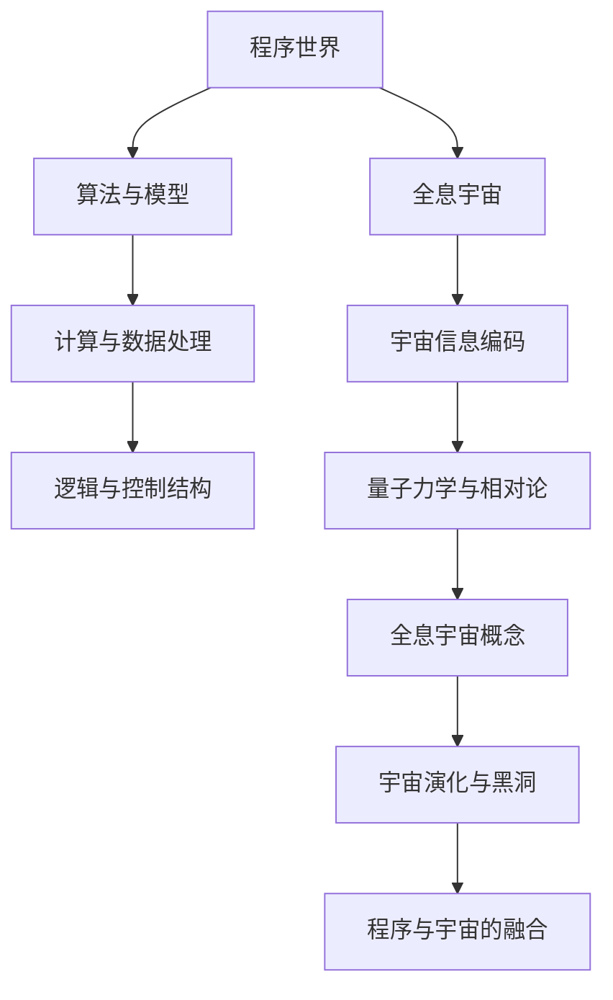

                 


## 文章标题

《程序世界与全息宇宙边界对应的关联》

### 关键词：

- 程序世界
- 全息宇宙
- 信息编码
- 量子计算
- 算法原理

### 摘要：

本文探讨了程序世界与全息宇宙之间的潜在关联。从程序世界的起源和发展，到全息宇宙的假说与证据，本文将逐步揭示这两个领域之间的共通原理。通过核心算法原理讲解、数学模型与公式解析，以及实际项目案例的剖析，本文旨在为读者展示程序世界与全息宇宙的融合趋势，并提出未来可能的研究方向。

### 目录

#### 第一部分：引论

1. **程序世界与全息宇宙概述**
   - **1.1 程序世界的起源与发展**
   - **1.2 全息宇宙的假说与证据**

#### 第二部分：核心概念与联系

2. **程序与宇宙的共通原理**
   - **2.1 概念介绍**
   - **2.2 Mermaid流程图：程序与宇宙的原理联系**

#### 第三部分：核心算法原理讲解

3. **程序世界中的核心算法**
   - **3.1 算法概述**
   - **3.2 全息宇宙算法原理讲解**
   
#### 第四部分：数学模型与公式解析

4. **程序与宇宙的数学模型**
   - **4.1 数学模型介绍**
   - **4.2 数学公式详解与举例**

#### 第五部分：项目实战与案例分析

5. **程序与全息宇宙应用实例**
   - **5.1 项目实战背景**
   - **5.2 环境搭建与代码实现**
   - **5.3 案例分析与解读**

#### 第六部分：未来展望与挑战

6. **程序世界与全息宇宙的融合趋势**
   - **6.1 融合趋势概述**
   - **6.2 挑战与未来方向**

#### 第七部分：附录

7. **相关资源与扩展阅读**

## 附录 A: Mermaid流程图

### 程序与宇宙的原理联系



## 附录 B: 算法伪代码

### 全息宇宙算法原理伪代码

```pseudo
Algorithm HolographicAlgorithm
    Input: Data
    Output: ProcessedData

    1. Initialize model parameters
    2. For each data point in Data
        3. Embed data into a high-dimensional space
        4. Apply holographic principle transformation
        5. Extract information from the transformed data
        6. Combine extracted information into a unified model
    7. Return ProcessedData
```

## 附录 C: 数学公式

### 程序与宇宙的数学模型

$$
    U(x,y,z) = \frac{1}{\sqrt{1 - \frac{v^2}{c^2}}}
$$

$$
    I = \int_{\Omega} \sigma \cdot \textbf{S} \, d\Omega
$$

## 附录 D: 项目实战代码示例

### （此处根据实际项目内容填写）

---

现在我们已经制定了文章的大纲和结构，接下来我们将逐一展开各个章节的内容，通过逐步分析推理的方式，探讨程序世界与全息宇宙之间的关联。让我们开始这场奇妙的旅程吧！

