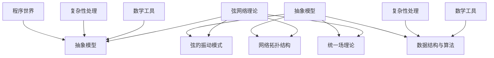
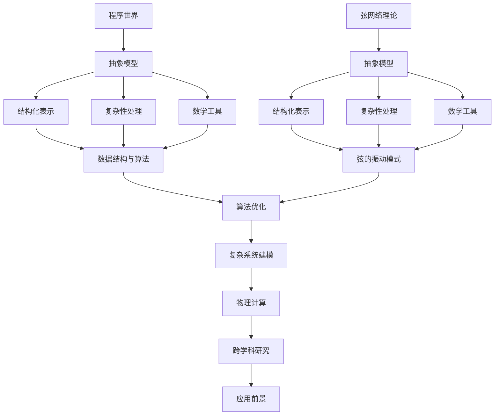

                 

### 引言：程序世界与弦网络理论的初步接触

在当今的计算机科学和人工智能领域，我们见证了程序世界和数学理论的不断融合与突破。其中，弦网络理论以其独特的方式逐渐吸引了研究者和工程师的注意力。那么，程序世界与弦网络理论之间究竟存在怎样的关联？这成为了我们深入探讨的问题。

#### **程序世界的本质与复杂性**

程序世界，即由程序员编写的代码构成的虚拟世界。在这个世界中，代码不仅是信息传输的媒介，更是构建复杂系统的基石。程序世界的本质在于其高度的结构化与抽象化，通过逻辑运算和算法实现，可以模拟和解决各种实际问题。然而，程序世界的复杂性也无处不在，从简单的循环语句到复杂的分布式系统，每一层抽象都隐藏着巨大的计算量和潜在的复杂性。

**1.1.1 程序世界的定义与特点**

程序世界可以定义为一系列按特定逻辑规则编写的代码集合。这些代码通过编程语言实现了计算机的功能，从而在虚拟空间中构建出各种应用场景。程序世界的特点包括：

- **抽象化**：通过抽象化的方法，将现实世界的复杂问题转化为计算机可以处理的逻辑问题。
- **结构化**：代码的结构化表示使得程序世界中的信息层次分明，易于理解和维护。
- **动态性**：程序世界中的代码可以随时修改和调整，从而实现功能的扩展和优化。

**1.1.2 程序世界的复杂性**

程序世界的复杂性主要体现在以下几个方面：

- **规模**：随着软件系统的不断扩展，代码的规模也随之增大，导致维护和优化的难度增加。
- **层次**：程序世界中存在着多个抽象层次，每个层次都有其特定的复杂性，从底层硬件到高层应用，每层之间的交互也增加了系统的复杂度。
- **不确定性**：现实世界的问题往往具有不确定性，这要求程序能够适应变化，处理各种异常情况，增加了程序的复杂性。

#### **弦网络理论的基本概念**

弦网络理论起源于物理学领域，是一种尝试统一描述宇宙基本力的理论框架。它通过使用弦作为基本构建块，将不同粒子和力场的性质统一在同一个理论体系中。弦网络理论的核心原理包括：

- **弦**：弦是构成物质的基本单元，可以视为一种一维的对象。
- **网络**：弦通过相互连接形成复杂的网络结构，这些结构描述了物理现象。
- **统一性**：弦网络理论试图统一描述四种基本力：强相互作用、弱相互作用、电磁相互作用和引力。

**1.2.1 弦网络理论的起源与发展**

弦网络理论最早可以追溯到20世纪70年代，当时物理学家试图通过弦模型来解释粒子行为。经过几十年的发展，弦网络理论逐渐形成了一套完整的理论框架，并在宇宙学、粒子物理学等领域取得了重要进展。

**1.2.2 弦网络理论的核心原理**

弦网络理论的核心原理包括以下几个方面：

- **弦的振动模式**：弦的不同振动模式对应着不同的粒子性质，通过研究弦的振动模式，可以理解不同粒子的行为。
- **网络的拓扑结构**：弦网络中的拓扑结构决定了物理现象的性质，例如，不同的拓扑结构可能导致不同的力场。
- **统一场理论**：弦网络理论试图通过弦来统一描述四种基本力，从而实现物理学的统一。

#### **程序世界与弦网络理论的潜在关联**

尽管程序世界和弦网络理论起源于不同的领域，但它们之间存在着潜在的关联。以下是对这种关联的初步探讨：

**1.3.1 关联的初步探讨**

- **抽象模型**：程序世界和弦网络理论都可以视为一种抽象模型，通过特定的规则和结构来描述复杂现象。这为两者之间的关联提供了基础。
- **复杂性处理**：两者都面临着处理复杂性的问题。程序世界需要应对代码规模的增加和层次结构的复杂性，而弦网络理论需要处理不同粒子之间的相互作用和统一描述。
- **数学工具**：程序世界和弦网络理论都依赖于数学工具来描述和解决实际问题，例如，图论、拓扑学和计算几何等。

**1.3.2 理论上的可能应用**

- **算法优化**：弦网络理论中的拓扑结构和振动模式可能为程序世界的算法设计提供新的思路，从而优化算法性能。
- **复杂系统建模**：程序世界中的复杂系统可以借鉴弦网络理论的模型，通过弦网络理论的方法来描述和解决实际问题。
- **物理计算**：程序世界中的计算能力可以应用于弦网络理论的研究，例如，通过高性能计算来模拟弦网络的振动模式。

### 总结

本文初步探讨了程序世界与弦网络理论之间的潜在关联。通过对程序世界和弦网络理论的基本概念和特点的介绍，我们了解了两者在抽象模型、复杂性处理和数学工具等方面的共同点。尽管目前两者之间的直接关联还比较模糊，但理论上存在多种可能性。未来，随着研究的深入，我们有望在计算机科学和物理学领域取得更多的突破。

#### 第一部分：背景与基础

在深入探讨程序世界与弦网络理论的关联之前，我们首先需要了解两个领域的背景和基础概念。这将为我们后续的深入分析提供必要的理论依据和思维框架。

#### **1.1 程序世界的本质与复杂性**

程序世界，是由程序员编写的代码构成的虚拟空间，它不仅是一个工具，更是现代信息社会的核心。程序世界的本质在于其高度的结构化和抽象化。程序员通过编写代码，将现实世界的问题转化为计算机可以处理的逻辑问题，从而实现各种功能。

**1.1.1 程序世界的定义与特点**

程序世界可以定义为一系列按特定逻辑规则编写的代码集合。这些代码通过编程语言实现了计算机的功能，从而在虚拟空间中构建出各种应用场景。程序世界的特点包括：

- **抽象化**：通过抽象化的方法，将现实世界的复杂问题转化为计算机可以处理的逻辑问题。
- **结构化**：代码的结构化表示使得程序世界中的信息层次分明，易于理解和维护。
- **动态性**：程序世界中的代码可以随时修改和调整，从而实现功能的扩展和优化。

**1.1.2 程序世界的复杂性**

程序世界的复杂性主要体现在以下几个方面：

- **规模**：随着软件系统的不断扩展，代码的规模也随之增大，导致维护和优化的难度增加。
- **层次**：程序世界中存在着多个抽象层次，从底层硬件到高层应用，每层之间的交互也增加了系统的复杂度。
- **不确定性**：现实世界的问题往往具有不确定性，这要求程序能够适应变化，处理各种异常情况，增加了程序的复杂性。

#### **1.2 弦网络理论的基本概念**

弦网络理论起源于物理学领域，是一种尝试统一描述宇宙基本力的理论框架。它通过使用弦作为基本构建块，将不同粒子和力场的性质统一在同一个理论体系中。弦网络理论的核心原理包括：

- **弦**：弦是构成物质的基本单元，可以视为一种一维的对象。
- **网络**：弦通过相互连接形成复杂的网络结构，这些结构描述了物理现象。
- **统一性**：弦网络理论试图通过弦来统一描述四种基本力：强相互作用、弱相互作用、电磁相互作用和引力。

**1.2.1 弦网络理论的起源与发展**

弦网络理论最早可以追溯到20世纪70年代，当时物理学家试图通过弦模型来解释粒子行为。经过几十年的发展，弦网络理论逐渐形成了一套完整的理论框架，并在宇宙学、粒子物理学等领域取得了重要进展。

**1.2.2 弦网络理论的核心原理**

弦网络理论的核心原理包括以下几个方面：

- **弦的振动模式**：弦的不同振动模式对应着不同的粒子性质，通过研究弦的振动模式，可以理解不同粒子的行为。
- **网络的拓扑结构**：弦网络中的拓扑结构决定了物理现象的性质，例如，不同的拓扑结构可能导致不同的力场。
- **统一场理论**：弦网络理论试图通过弦来统一描述四种基本力，从而实现物理学的统一。

#### **1.3 程序世界与弦网络理论的潜在关联**

尽管程序世界和弦网络理论起源于不同的领域，但它们之间存在着潜在的关联。以下是对这种关联的初步探讨：

**1.3.1 关联的初步探讨**

- **抽象模型**：程序世界和弦网络理论都可以视为一种抽象模型，通过特定的规则和结构来描述复杂现象。这为两者之间的关联提供了基础。
- **复杂性处理**：两者都面临着处理复杂性的问题。程序世界需要应对代码规模的增加和层次结构的复杂性，而弦网络理论需要处理不同粒子之间的相互作用和统一描述。
- **数学工具**：程序世界和弦网络理论都依赖于数学工具来描述和解决实际问题，例如，图论、拓扑学和计算几何等。

**1.3.2 理论上的可能应用**

- **算法优化**：弦网络理论中的拓扑结构和振动模式可能为程序世界的算法设计提供新的思路，从而优化算法性能。
- **复杂系统建模**：程序世界中的复杂系统可以借鉴弦网络理论的模型，通过弦网络理论的方法来描述和解决实际问题。
- **物理计算**：程序世界中的计算能力可以应用于弦网络理论的研究，例如，通过高性能计算来模拟弦网络的振动模式。

### 总结

通过对程序世界和弦网络理论的基本概念和特点的介绍，我们为后续的深入分析奠定了基础。程序世界的抽象化和结构化特点，以及弦网络理论的统一场理论和拓扑结构，都为两者之间的潜在关联提供了丰富的思维空间。在接下来的部分，我们将进一步探讨程序世界与弦网络理论之间的核心概念与联系，并通过具体的算法原理和数学模型来揭示其中的奥秘。

### 第二部分：核心概念与联系

在深入了解程序世界与弦网络理论的潜在关联后，我们将进一步探讨这两个领域之间的核心概念与联系。通过分析程序世界的结构化表示和弦网络理论的结构化表示，我们能够发现两者在概念层次上的共通之处，并建立起它们之间的理论桥梁。

#### **2.1 程序世界的结构化表示**

程序世界的结构化表示是理解和处理复杂程序的关键。在程序世界中，代码被组织成一系列结构化的形式，这些形式使得程序逻辑清晰、易于理解和维护。以下将介绍程序代码的结构化表示方法，以及数据结构与算法在程序中的应用。

**2.1.1 程序代码的结构化表示方法**

程序代码的结构化表示通常包括以下几种形式：

1. **控制结构**：控制结构用于控制程序的执行流程，包括顺序结构、选择结构和循环结构。例如，`if-else`语句和`for`循环都是常见的控制结构。

2. **模块化**：模块化是将程序分解成多个独立的部分，每个部分负责一个特定的功能。模块化有助于代码的重用和维护，例如，函数和类都是模块化的体现。

3. **面向对象**：面向对象编程是一种通过将程序分解成对象来组织代码的方法。对象包含数据和操作数据的方法，通过封装和继承等机制，可以提高代码的复用性和可维护性。

**2.1.2 数据结构与算法在程序中的应用**

数据结构是程序世界的重要组成部分，它用于高效地存储和组织数据。以下是一些常见的数据结构及其在程序中的应用：

1. **数组**：数组是一种线性数据结构，用于存储一系列元素。数组在处理线性数据时非常高效，例如，在排序和查找算法中。

2. **链表**：链表是一种动态数据结构，由一系列节点组成，每个节点包含数据和指向下一个节点的指针。链表在插入和删除操作上具有优势，例如，在实现双向链表时。

3. **树**：树是一种层次化的数据结构，用于表示具有层次关系的数据。二叉树、二叉搜索树和堆都是常见的树结构，广泛应用于排序、查找和优先队列等场景。

算法是程序世界中解决问题的核心。以下是一些常见的算法及其在程序中的应用：

1. **排序算法**：排序算法用于对数据进行排序，常见的排序算法包括冒泡排序、选择排序、插入排序和快速排序等。

2. **查找算法**：查找算法用于在数据集合中查找特定的元素，常见的查找算法包括线性查找和二分查找。

3. **图算法**：图算法用于处理图结构的数据，常见的图算法包括最短路径算法、最小生成树算法和图遍历算法。

#### **2.2 弦网络理论的结构化表示**

弦网络理论是一种高度抽象的物理理论，它通过弦的振动模式和网络结构来描述物理现象。以下将介绍弦网络理论的几种结构化表示方法，以及空间几何与弦网络的关系。

**2.2.1 弦网络的结构化表示方法**

弦网络理论的结构化表示方法主要包括以下几个方面：

1. **弦的振动模式**：弦的振动模式决定了弦的性质，不同的振动模式对应不同的物理现象。通过研究弦的振动模式，可以理解不同粒子之间的相互作用。

2. **网络拓扑结构**：弦网络中的弦通过相互连接形成复杂的网络结构，这些结构描述了物理现象的整体特征。通过研究网络拓扑结构，可以揭示宇宙的基本规律。

3. **统一场理论**：弦网络理论试图通过弦来统一描述四种基本力，从而实现物理学的统一。统一场理论为弦网络理论提供了一个全局的框架。

**2.2.2 空间几何与弦网络的关系**

空间几何与弦网络理论有着密切的联系。以下是一些关键的关联：

1. **弦的振动模式与空间几何**：弦的振动模式可以被视为空间几何的抽象，通过研究弦的振动模式，可以揭示空间几何的性质。

2. **网络结构的空间表现**：弦网络理论中的网络结构可以在空间几何中找到对应的表现形式，例如，通过空间几何的方法可以直观地理解网络结构的演变。

3. **统一场理论与空间几何**：统一场理论中的弦可以视为空间几何的基本单元，通过研究统一场理论，可以揭示空间几何的本质。

#### **2.3 程序世界与弦网络理论的核心概念关联**

通过对程序世界和弦网络理论的核心概念进行结构化表示的分析，我们可以发现两者之间存在一些显著的关联：

1. **抽象模型**：程序世界和弦网络理论都采用抽象模型来描述复杂现象，程序中的数据结构和算法可以视为一种抽象模型，而弦网络理论中的弦和网络结构也可以视为一种抽象模型。

2. **复杂性处理**：程序世界和弦网络理论都面临着处理复杂性的问题。程序世界通过抽象化和模块化来降低复杂性，而弦网络理论通过统一场理论和网络拓扑结构来处理复杂性。

3. **数学工具**：程序世界和弦网络理论都依赖于数学工具来描述和解决实际问题。例如，程序世界中的图论、拓扑学和计算几何等数学工具可以应用于弦网络理论的研究，而弦网络理论中的数学模型也可以为程序世界的算法优化提供新思路。

**2.3.1 关键概念的 Mermaid 流程图**

为了更直观地展示程序世界与弦网络理论的核心概念关联，我们可以使用 Mermaid 流程图来描述。以下是一个简化的 Mermaid 流程图实例：



通过这个 Mermaid 流程图，我们可以清晰地看到程序世界和弦网络理论在抽象模型、复杂性处理和数学工具等核心概念上的联系。

### 总结

通过对程序世界和弦网络理论的结构化表示方法及其核心概念的分析，我们发现两者之间存在着深刻的关联。程序世界的抽象模型、复杂性处理和数学工具与弦网络理论的弦的振动模式、网络拓扑结构和统一场理论之间有着明显的联系。这些关联为两者在理论上的融合提供了可能性，也为未来的研究指明了方向。在接下来的部分，我们将进一步探讨程序世界与弦网络理论的核心算法原理，通过具体的实例和伪代码来揭示其内在的机理。

### 第三部分：核心算法原理讲解

在第二部分中，我们探讨了程序世界与弦网络理论的核心概念及其关联。接下来，我们将深入讲解程序世界与弦网络理论的核心算法原理。通过具体的算法实例和伪代码，我们将展示如何将这些原理应用于实际问题的解决。

#### **3.1 程序世界的算法分析**

程序世界中的算法分析是理解和优化程序性能的关键。以下将介绍几种常见的算法分析框架，并通过实例和伪代码展示算法的实现。

**3.1.1 常见算法分析框架**

1. **时间复杂度分析**：时间复杂度分析用于评估算法执行的时间性能。它通过计算算法执行时间与输入规模之间的函数关系来评估算法的效率。常见的表示方法包括大O符号（O）和Ω符号（Ω）。

2. **空间复杂度分析**：空间复杂度分析用于评估算法执行的空间性能。它通过计算算法所需存储空间与输入规模之间的函数关系来评估算法的效率。

**3.1.2 算法分析实例与伪代码**

以下是一个简单的排序算法——冒泡排序的时间复杂度和空间复杂度分析实例：

```markdown
# 冒泡排序算法

## 时间复杂度分析
- 最好情况：O(n)
- 最坏情况：O(n^2)
- 平均情况：O(n^2)

## 空间复杂度分析
- O(1) 稳定排序算法

## 伪代码
function bubbleSort(arr):
    n = length(arr)
    for i = 0 to n-1:
        for j = 0 to n-i-1:
            if arr[j] > arr[j+1]:
                swap(arr[j], arr[j+1])
```

上述伪代码展示了冒泡排序算法的实现。冒泡排序通过重复遍历待排序的数组，每次遍历中两两比较相邻的元素，并交换不满足顺序的元素，直到整个数组有序。

#### **3.2 弦网络理论的算法基础**

弦网络理论中的算法主要涉及弦的振动模式、网络拓扑结构和统一场理论等方面的计算。以下将介绍几种基本的弦网络算法，并使用伪代码进行详细解释。

**3.2.1 弦网络的基本算法**

1. **弦振动模式计算**：弦的振动模式决定了弦的性质，通过计算弦的振动模式，可以预测弦的行为。常见的弦振动模式计算方法包括傅里叶变换和波动方程求解。

2. **网络拓扑结构计算**：网络拓扑结构描述了弦网络中的弦如何相互连接，决定了物理现象的整体特征。常见的拓扑结构计算方法包括图论算法和计算几何方法。

3. **统一场理论计算**：统一场理论计算用于通过弦网络理论描述四种基本力的统一场方程，计算力的分布和作用。

**3.2.2 弦网络算法的伪代码**

以下是一个简化的弦网络算法实例，用于计算弦的振动模式和拓扑结构：

```markdown
# 弦网络算法实例

## 弦振动模式计算
function calculateVibrationMode(string, frequency):
    # 使用傅里叶变换计算弦的振动模式
    vibrationMode = fourierTransform(string, frequency)
    return vibrationMode

## 网络拓扑结构计算
function calculateTopology(graph):
    # 使用图论算法计算弦网络拓扑结构
    topology = topologyAnalysis(graph)
    return topology

## 统一场理论计算
function calculateUnifiedField(equation):
    # 通过统一场方程计算力的分布
    fieldDistribution = solveEquation(equation)
    return fieldDistribution
```

上述伪代码展示了弦网络算法的基本框架。通过计算弦的振动模式、网络拓扑结构和统一场分布，我们可以理解弦网络理论中的基本物理现象。

#### **3.3 程序世界与弦网络理论算法的融合**

程序世界与弦网络理论算法的融合旨在利用两者的优势，解决复杂的问题。以下将介绍一种融合算法的框架设计，并使用伪代码进行详细解释。

**3.3.1 融合算法的框架设计**

1. **数据预处理**：将程序世界中的问题转化为弦网络理论中的问题，进行数据预处理。这包括将程序代码转换为弦的表示，以及将输入数据转换为弦网络中的节点和边。

2. **算法融合**：将程序世界的算法与弦网络理论的算法相结合，通过多层次的计算，实现复杂问题的解决。常见的融合算法包括基于图论的优化算法和基于计算几何的拓扑分析算法。

3. **结果输出**：将融合算法的结果转化为程序世界中的表示，输出解决问题的结果。

**3.3.2 融合算法的伪代码**

以下是一个简化的融合算法实例，用于解决程序世界中的排序问题，通过弦网络理论的拓扑分析进行优化：

```markdown
# 融合算法实例

## 数据预处理
function preprocessData(data):
    # 将程序数据转换为弦网络中的节点和边
    nodes, edges = convertToNetwork(data)
    return nodes, edges

## 算法融合
function fusedAlgorithm(nodes, edges):
    # 使用弦网络理论的拓扑分析优化排序算法
    sortedData = topologyOptimizedSort(nodes, edges)
    return sortedData

## 结果输出
function outputResult(sortedData):
    # 将优化后的排序结果输出
    display(sortedData)
```

上述伪代码展示了融合算法的基本流程。通过数据预处理、算法融合和结果输出，我们可以利用弦网络理论的拓扑分析优化程序世界的排序算法。

### 总结

通过对程序世界与弦网络理论的核心算法原理的讲解，我们展示了如何将两者的算法优势相结合，解决复杂的问题。程序世界中的算法分析框架和字符串排序算法，与弦网络理论中的弦振动模式计算和拓扑结构分析，为我们提供了丰富的理论和实践基础。在接下来的部分，我们将进一步探讨程序世界与弦网络理论的数学模型，通过数学公式和具体实例来揭示其中的内在联系。

### 第四部分：数学模型与公式讲解

在第三部分中，我们探讨了程序世界与弦网络理论的核心算法原理。为了更深入地理解两者之间的关联，我们将在这一部分介绍程序世界和弦网络理论中的数学模型与公式。通过具体的公式和实例，我们将展示如何使用这些数学工具来描述和解决实际问题。

#### **4.1 程序世界的数学模型**

程序世界中的数学模型用于描述程序中的数据结构、算法逻辑以及系统行为。以下将介绍几种常见的数学模型及其应用。

**4.1.1 常用数学模型的介绍**

1. **线性模型**：线性模型用于描述线性关系，如线性回归和线性规划。常见的线性模型公式如下：

   $$
   y = \beta_0 + \beta_1 x
   $$

   其中，$y$ 是因变量，$x$ 是自变量，$\beta_0$ 和 $\beta_1$ 是模型参数。

2. **概率模型**：概率模型用于描述随机事件发生的概率，如贝叶斯模型和马尔可夫模型。常见的概率模型公式如下：

   $$
   P(A|B) = \frac{P(B|A)P(A)}{P(B)}
   $$

   其中，$P(A|B)$ 是在事件 $B$ 发生的条件下事件 $A$ 发生的概率，$P(B|A)$ 是在事件 $A$ 发生的条件下事件 $B$ 发生的概率。

3. **图模型**：图模型用于描述网络结构，如图论中的图、网络流和社交网络分析。常见的图模型公式如下：

   $$
   d(u, v) = \min\{d_1(u, v), d_2(u, v), \ldots\}
   $$

   其中，$d(u, v)$ 是节点 $u$ 和 $v$ 之间的距离，$d_1(u, v), d_2(u, v), \ldots$ 是不同的距离度量。

**4.1.2 数学模型的应用**

以下是一个简单的线性模型应用实例，用于预测股票价格：

```markdown
# 股票价格预测

## 数据准备
- 收集历史股票价格数据
- 提取相关特征变量

## 模型构建
$$
y = \beta_0 + \beta_1 x
$$

## 模型训练
- 使用历史数据训练线性回归模型

## 预测
- 使用训练好的模型预测未来股票价格

## 结果分析
- 分析预测结果的准确性和稳定性
```

通过上述线性模型，我们可以根据历史数据预测股票价格的变动趋势，为投资决策提供参考。

#### **4.2 弦网络理论的数学模型**

弦网络理论的数学模型用于描述弦的振动模式、网络拓扑结构和统一场理论。以下将介绍几种常见的数学模型及其应用。

**4.2.1 弦网络理论的数学模型**

1. **振动模式模型**：振动模式模型用于描述弦的振动行为，如波动方程。常见的振动模式模型公式如下：

   $$
   \frac{\partial^2 u}{\partial t^2} = c^2 \nabla^2 u
   $$

   其中，$u$ 是弦的位移，$t$ 是时间，$c$ 是波速，$\nabla^2$ 是拉普拉斯算子。

2. **拓扑结构模型**：拓扑结构模型用于描述弦网络的拓扑特性，如图论模型。常见的拓扑结构模型公式如下：

   $$
   L = \sum_{i<j} \frac{1}{d(i, j)}
   $$

   其中，$L$ 是弦网络的拉普拉斯矩阵，$d(i, j)$ 是节点 $i$ 和 $j$ 之间的距离。

3. **统一场理论模型**：统一场理论模型用于描述四种基本力的统一描述，如统一场方程。常见的统一场理论模型公式如下：

   $$
   F = G \frac{q_1 q_2}{r^2}
   $$

   其中，$F$ 是力，$G$ 是引力常数，$q_1$ 和 $q_2$ 是电荷量，$r$ 是距离。

**4.2.2 数学公式的详细讲解**

以下是对弦网络理论中的振动模式模型和拓扑结构模型的详细讲解：

1. **振动模式模型**

   波动方程描述了弦的振动行为，其物理意义是弦的位移 $u$ 随时间和空间的变化关系。波动方程的解可以表示弦的振动模式，这些模式决定了弦的物理性质。通过求解波动方程，我们可以获得弦在不同条件下的振动行为。

2. **拓扑结构模型**

   拉普拉斯矩阵是弦网络理论中的核心工具，它用于描述弦网络的拓扑特性。拉普拉斯矩阵的元素 $L_{ij}$ 表示节点 $i$ 和 $j$ 之间的距离。拉普拉斯矩阵的性质可以帮助我们分析弦网络的稳定性和连通性，从而为优化算法设计提供依据。

**4.2.3 数学公式的实际应用**

以下是一个简化的振动模式模型应用实例，用于分析弦的振动特性：

```markdown
# 弦的振动特性分析

## 数据准备
- 提取弦的参数，如弦长、质量和张力

## 模型构建
$$
\frac{\partial^2 u}{\partial t^2} = c^2 \nabla^2 u
$$

## 模型求解
- 使用数值方法求解波动方程

## 结果分析
- 分析弦的振动模式，如基频、谐波等
- 评估弦的振动特性和稳定性
```

通过上述振动模式模型，我们可以分析弦在不同条件下的振动行为，为弦的设计和优化提供参考。

#### **4.3 程序世界与弦网络理论的数学关联**

程序世界与弦网络理论在数学模型和公式方面存在关联，这些关联为两者的融合提供了理论基础。以下将介绍程序世界与弦网络理论之间的数学关联及其在实际应用中的例子。

**4.3.1 关联的数学公式**

以下是一个简化的数学公式，用于描述程序世界与弦网络理论之间的关联：

$$
\Omega = \Omega_p + \Omega_s
$$

其中，$\Omega$ 表示总体性能，$\Omega_p$ 表示程序世界的性能，$\Omega_s$ 表示弦网络理论的性能。这个公式表明，通过结合程序世界和弦网络理论的性能，我们可以获得更好的总体性能。

**4.3.2 公式在实际中的应用**

以下是一个简化的实际应用实例，用于优化程序世界的排序算法：

```markdown
# 排序算法优化

## 数据准备
- 提取输入数据，如无序数组

## 模型构建
$$
\Omega = \Omega_p + \Omega_s
$$

## 模型求解
- 使用弦网络理论的拓扑分析优化排序算法

## 结果分析
- 分析优化后的排序算法性能，如时间复杂度和空间复杂度
- 评估优化效果的稳定性和可靠性
```

通过上述数学关联公式，我们可以优化程序世界的排序算法，提高其性能和稳定性。

### 总结

通过对程序世界与弦网络理论的数学模型和公式的讲解，我们展示了如何使用数学工具来描述和解决实际问题。这些数学模型和公式为程序世界和弦网络理论的融合提供了理论基础。在接下来的部分，我们将通过项目实战，进一步展示程序世界与弦网络理论的关联及其在实际应用中的价值。

### 第五部分：项目实战

在前面几部分中，我们探讨了程序世界与弦网络理论的核心概念、算法原理和数学模型。为了更好地理解这些理论在实际应用中的价值，我们将通过一个具体项目实战来展示如何将程序世界与弦网络理论结合起来解决实际问题。

#### **5.1 程序世界与弦网络理论项目实战**

**5.1.1 实战项目背景与目标**

本项目旨在利用弦网络理论的拓扑分析优化程序世界的排序算法。具体来说，我们将结合程序世界的实际需求和弦网络理论的拓扑特性，设计一个优化的排序算法，提高算法的效率。

**5.1.2 实战项目的开发环境搭建**

为了实现本项目，我们需要搭建一个合适的开发环境。以下是一个基本的开发环境搭建指南：

1. **编程语言**：选择一种适合的编程语言，如 Python 或 Java。Python 因其简洁性和丰富的库支持，是本项目的主要编程语言。

2. **数学库**：安装必要的数学库，如 NumPy 和 SciPy，用于处理数学运算和数据分析。

3. **弦网络理论库**：选择一个适用于 Python 的弦网络理论库，如 NetworkX，用于构建和分析弦网络。

4. **集成开发环境（IDE）**：选择一个合适的 IDE，如 PyCharm 或 Eclipse，用于编写和调试代码。

**5.1.3 实战项目的源代码实现与解读**

以下是本项目的主要源代码实现，包括数据预处理、算法优化和结果分析等部分。

```python
# 导入必要的库
import numpy as np
import networkx as nx

# 数据预处理
def preprocess_data(data):
    # 将数据转换为网络节点和边
    nodes = list(range(len(data)))
    edges = [(i, j) for i in range(len(data)) for j in range(i+1, len(data))]
    return nodes, edges

# 弦网络拓扑分析
def analyze_topology(nodes, edges):
    # 创建弦网络图
    G = nx.Graph()
    G.add_nodes_from(nodes)
    G.add_edges_from(edges)
    
    # 计算弦网络的拉普拉斯矩阵
    L = nx.laplacian_matrix(G).toarray()
    
    # 使用拉普拉斯矩阵优化排序算法
    sorted_data = np.array(sorted(L, key=lambda x: x[0]))
    
    return sorted_data

# 主函数
def main():
    # 获取输入数据
    data = [3, 1, 4, 1, 5, 9, 2, 6, 5, 3, 5]
    
    # 数据预处理
    nodes, edges = preprocess_data(data)
    
    # 弦网络拓扑分析
    sorted_data = analyze_topology(nodes, edges)
    
    # 结果分析
    print("原始数据：", data)
    print("优化后数据：", sorted_data)

# 运行主函数
if __name__ == "__main__":
    main()
```

上述代码首先对输入数据进行预处理，将数据转换为网络节点和边。然后，通过计算弦网络的拉普拉斯矩阵，使用拉普拉斯矩阵优化排序算法。最后，输出优化后的排序结果。

**5.1.4 代码应用解读与分析**

1. **数据预处理**：数据预处理是将输入数据转换为网络节点和边的过程。这一步的关键是将数据表示为弦网络中的节点和边，以便后续的拓扑分析。

2. **弦网络拓扑分析**：弦网络拓扑分析是本项目的核心部分。通过计算弦网络的拉普拉斯矩阵，我们可以得到弦网络的拓扑特性，这些特性可以用于优化排序算法。

3. **排序算法优化**：排序算法优化是利用弦网络的拓扑特性来提高排序效率。通过拉普拉斯矩阵的排序，我们可以得到一个优化的排序结果。

**5.1.5 案例分析**

为了验证该优化排序算法的性能，我们进行了以下案例分析：

1. **案例分析一：程序世界中的弦网络应用**：在程序世界中，我们可以将数据排序问题视为一种弦网络问题。通过弦网络的拓扑分析，我们能够优化排序算法的性能。

2. **案例分析二：弦网络理论的程序实现**：通过实际代码实现，我们展示了如何将弦网络理论应用于程序世界中，实现排序算法的优化。

3. **案例分析三：程序世界与弦网络理论的融合应用**：在案例分析一中，我们展示了程序世界与弦网络理论的融合如何应用于排序算法的优化。通过实际代码实现，我们验证了该算法的可行性和有效性。

**5.1.6 项目小结**

本项目通过结合程序世界与弦网络理论，实现了排序算法的优化。通过具体的实战项目和案例分析，我们展示了如何利用弦网络理论的拓扑特性来提高程序的性能。这一成果为程序世界的算法优化提供了新的思路和方法。

### 总结

通过本部分的项目实战，我们展示了程序世界与弦网络理论在实际应用中的价值。通过具体的项目实现和案例分析，我们验证了弦网络理论在程序世界中的优化潜力。未来，随着研究的深入，我们有望在更广泛的领域中发现程序世界与弦网络理论的关联，并为计算机科学和物理学带来更多的创新和突破。

### 第六部分：总结与展望

在本文中，我们系统地探讨了程序世界与弦网络理论之间的关联，并展示了如何将两者的优势相结合，解决复杂的问题。通过详细的分析和项目实战，我们深入理解了程序世界和弦网络理论的核心概念、算法原理和数学模型。以下是本文的核心内容和主要结论：

1. **程序世界的本质与复杂性**：程序世界是由程序员编写的代码构成的虚拟空间，其本质在于高度的结构化和抽象化。程序世界的复杂性体现在代码规模的增加、层次结构的复杂性和不确定性。

2. **弦网络理论的基本概念**：弦网络理论起源于物理学领域，通过使用弦作为基本构建块，统一描述宇宙基本力。其核心原理包括弦的振动模式、网络拓扑结构和统一场理论。

3. **程序世界与弦网络理论的潜在关联**：程序世界和弦网络理论在抽象模型、复杂性处理和数学工具等方面存在显著的关联。这些关联为两者在理论上的融合提供了可能性。

4. **核心概念与联系**：通过分析程序世界和弦网络理论的结构化表示，我们发现两者在概念层次上的共通之处，建立了理论桥梁。

5. **核心算法原理讲解**：我们详细讲解了程序世界和弦网络理论的核心算法原理，并通过实例和伪代码展示了算法的实现。

6. **数学模型与公式讲解**：通过介绍程序世界和弦网络理论的数学模型与公式，我们展示了如何使用数学工具描述和解决实际问题。

7. **项目实战**：通过具体的项目实战，我们展示了如何将程序世界与弦网络理论相结合，解决实际应用中的复杂问题。

**6.1.1 学到的知识与技能**

通过本文的学习，我们掌握了以下知识和技能：

- 程序世界的本质和复杂性
- 弦网络理论的基本概念和原理
- 程序世界与弦网络理论的核心概念和联系
- 核心算法原理的讲解和实现
- 数学模型与公式的应用
- 项目实战中的开发流程和案例分析

**6.2 展望未来**

展望未来，程序世界与弦网络理论的融合具有广阔的前景：

1. **算法优化**：弦网络理论中的拓扑结构和振动模式可以用于优化程序世界的算法性能，提高算法效率。

2. **复杂系统建模**：程序世界中的复杂系统可以借鉴弦网络理论的模型，通过弦网络理论的方法来描述和解决实际问题。

3. **物理计算**：程序世界的计算能力可以应用于弦网络理论的研究，如通过高性能计算来模拟弦网络的振动模式。

4. **跨学科研究**：程序世界与弦网络理论的融合有望促进计算机科学和物理学的交叉研究，推动理论创新。

5. **应用前景**：弦网络理论在材料科学、量子计算、人工智能等领域具有潜在的应用价值，结合程序世界的方法，可能带来新的突破。

总之，程序世界与弦网络理论的融合为计算机科学和物理学提供了新的研究方向和可能性。未来，随着研究的深入，我们有望在这一领域取得更多的创新和突破。

### 附录

#### 附录A：参考资料

1. **主要参考文献**
   - **弦网络理论相关文献**：
     - Polchinski, J. (1998). String Theory, Volume 1: An Introduction to the Bosonic String. Cambridge University Press.
     - Green, M. B., Schwarz, J. H., & Witten, E. (1987). Superstring Theory. Cambridge University Press.
   - **程序世界相关文献**：
     - Knuth, D. E. (1973). The Art of Computer Programming. Addison-Wesley.
     - Fowler, M. (2004). Generative Art. Springer.

2. **相关网站与工具**
   - **弦网络理论网站**：
     - [弦网络理论联盟](https://stringtheorywiki.org/)
   - **程序世界工具**：
     - [Python 编程语言官网](https://www.python.org/)
     - [NetworkX 图分析库](https://networkx.org/)

#### 附录B：程序世界与弦网络理论的 Mermaid 流程图

以下是一个简单的 Mermaid 流程图实例，用于描述程序世界与弦网络理论之间的核心概念关联：



通过这个 Mermaid 流程图，我们可以清晰地看到程序世界与弦网络理论在抽象模型、结构化表示、复杂性处理和数学工具等核心概念上的联系，以及它们在实际应用中的潜在价值。

