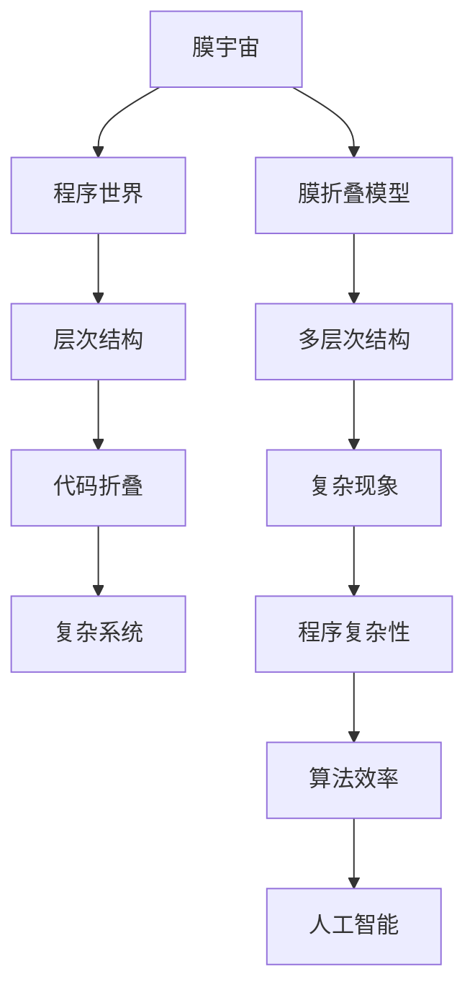

                 

### 文章标题：程序世界与膜宇宙多重折叠模型的类比

关键词：程序世界、膜宇宙、多重折叠模型、类比、复杂性、算法原理

摘要：本文通过探讨程序世界与膜宇宙多重折叠模型的类比，揭示了两者在结构、机制和演化方面的相似性。文章首先介绍了程序世界和膜宇宙的基本概念，随后详细阐述了膜宇宙多重折叠模型的核心原理及其与程序世界的联系。通过类比分析，本文探讨了程序世界中类似的多层结构和折叠机制，揭示了复杂系统在程序世界中的表现，并探讨了程序世界与膜宇宙的交互作用。最后，本文总结了类比模型的意义和未来研究方向，为读者提供了深入思考程序设计和复杂系统的新视角。

### 《程序世界与膜宇宙多重折叠模型的类比》目录大纲

1. 引言
   1.1 书籍背景
   1.2 书籍目的
   1.3 内容概述

2. 膜宇宙与程序世界的核心概念
   2.1 膜宇宙的基本原理
   2.2 程序世界的核心概念
   2.3 膜宇宙与程序世界的联系

3. 膜宇宙中的多重折叠模型
   3.1 多重折叠模型的定义
   3.2 多重折叠模型的结构
   3.3 多重折叠模型的作用

4. 程序世界中的类比模型
   4.1 类比模型的建立
   4.2 程序世界中的多层结构
   4.3 程序世界的折叠概念

5. 程序世界中的复杂系统
   5.1 复杂系统的定义
   5.2 膜宇宙中的复杂系统
   5.3 程序世界中的复杂系统

6. 程序世界的演化与进化
   6.1 程序世界的演化
   6.2 膜宇宙的进化
   6.3 程序世界的进化类比

7. 膜宇宙与程序世界的交互
   7.1 膜宇宙与程序世界的交互机制
   7.2 膜宇宙对程序世界的影响
   7.3 程序世界对膜宇宙的反馈

8. 总结与展望
   8.1 类比模型的意义
   8.2 研究挑战与未来方向
   8.3 总结

9. 附录
   9.1 膜宇宙与程序世界核心概念的 Mermaid 流程图
   9.2 程序世界中的核心算法原理讲解及伪代码
   9.3 膜宇宙中的数学模型与公式详细讲解
   9.4 项目实战代码案例及详细解释说明
   9.5 开发环境搭建与源代码实现详解
   9.6 最佳实践 tips、小结、注意事项、拓展阅读

### 第1章 引言

#### 1.1 书籍背景

在计算机科学和宇宙学这两个看似截然不同的领域中，程序世界和膜宇宙这两个概念似乎显得格外独特。程序世界，即我们熟悉的计算机程序和软件系统，是一个由逻辑、算法和数据结构构成的虚拟世界。而膜宇宙，则是一个源于宇宙学的新型概念，指的是宇宙中的基本结构——膜，以及这些膜之间的相互作用和折叠。

随着计算机科学的飞速发展和对宇宙学的深入理解，人们逐渐意识到，程序世界和膜宇宙之间存在某种深刻的联系。程序设计中的多层结构、折叠机制和复杂系统，与膜宇宙中的多重折叠模型和复杂现象有着惊人的相似之处。这种类比不仅有助于我们更好地理解程序世界的本质，也为宇宙学提供了新的思考角度。

本书旨在通过探讨程序世界与膜宇宙多重折叠模型的类比，揭示两者在结构、机制和演化方面的相似性，从而为读者提供一种全新的视角，深入思考程序设计和复杂系统的本质。

#### 1.2 书籍目的

本书的主要目的是：

1. **探索类比**：通过对比分析程序世界和膜宇宙的核心概念，探索两者之间的类比，揭示程序设计中的多层结构和折叠机制在膜宇宙中的对应现象。
2. **揭示哲理**：探讨程序世界与膜宇宙之间的类比，深入挖掘程序设计的哲学内涵，帮助读者更好地理解程序设计的本质和意义。
3. **提供新视角**：通过类比模型，为读者提供一种全新的视角，深入思考程序设计和复杂系统的本质，激发对宇宙学和计算机科学的兴趣。

#### 1.3 内容概述

本书共分为八个章节，内容概述如下：

1. **第1章 引言**：介绍书籍背景、目的和内容概述。
2. **第2章 膜宇宙与程序世界的核心概念**：分别阐述膜宇宙和程序世界的核心概念，并探讨两者之间的联系。
3. **第3章 膜宇宙中的多重折叠模型**：详细阐述膜宇宙中的多重折叠模型，包括定义、结构和作用。
4. **第4章 程序世界中的类比模型**：建立程序世界中的类比模型，探讨程序世界中的多层结构和折叠概念。
5. **第5章 程序世界中的复杂系统**：分析复杂系统的定义、膜宇宙中的复杂系统和程序世界中的复杂系统。
6. **第6章 程序世界的演化与进化**：探讨程序世界的演化过程、膜宇宙的进化过程以及程序世界的进化类比。
7. **第7章 膜宇宙与程序世界的交互**：分析膜宇宙与程序世界的交互机制、膜宇宙对程序世界的影响和程序世界对膜宇宙的反馈。
8. **第8章 总结与展望**：总结全书内容，探讨类比模型的意义和未来研究方向。

通过以上章节的探讨，本书旨在为读者提供一种全新的视角，深入思考程序设计和复杂系统的本质，从而更好地理解和应对现实世界中的各种挑战。

### 第2章 膜宇宙与程序世界的核心概念

#### 2.1 膜宇宙的基本原理

膜宇宙，这一概念源于现代宇宙学的发展，最早由物理学家布拉德·卡茨（Brad Kitzinger）在2001年提出。膜宇宙的核心思想是，宇宙并不是一个连续的空间，而是由一系列三维膜（或称“膜”）组成。这些膜在更高的维度空间中相互折叠、相互作用，形成了我们所观察到的宇宙现象。

膜宇宙的基本原理可以概括为以下几点：

1. **三维膜的存在**：膜宇宙中的基本结构是三维膜，这些膜是宇宙的基本单元，它们在更高维的空间中自由折叠。
2. **膜之间的相互作用**：不同膜之间可以通过弯曲、折叠等方式相互接触，从而产生各种物理现象，如引力、电磁力等。
3. **多层膜结构**：膜宇宙中的膜不是孤立的，它们可以相互嵌套，形成多层结构，这种结构在宇宙学中被称为“膜多重折叠”。
4. **膜宇宙的起源**：膜宇宙的起源可以追溯到宇宙大爆炸时期，当时高维膜从单一的状态迅速折叠成当前的多层次结构。

#### 2.2 程序世界的核心概念

程序世界，即我们日常使用的计算机程序和软件系统，是一个由逻辑、算法和数据结构构成的虚拟世界。程序世界的核心概念包括：

1. **程序的定义**：程序是一系列按照特定顺序执行的指令，用于完成特定任务。
2. **算法**：算法是解决问题的方法或步骤，是程序的核心。算法的设计与实现决定了程序的性能和效率。
3. **数据结构**：数据结构是程序中用于存储和组织数据的方式，是算法实现的基础。常见的数据结构包括数组、链表、树、图等。
4. **层次结构**：程序世界中的层次结构是指程序的各个组成部分按照一定的层次关系组织。这种结构使得程序更加模块化、可维护性和可扩展性。

#### 2.3 膜宇宙与程序世界的联系

膜宇宙和程序世界虽然属于不同的领域，但它们在核心概念上却有着显著的相似之处：

1. **多层结构**：膜宇宙中的多层膜结构和程序世界中的层次结构具有相似性。膜宇宙中的膜可以相互嵌套，形成复杂的多层结构；同样，程序世界中的模块、组件、系统等也可以按照层次关系组织，实现复杂的功能。
2. **折叠机制**：膜宇宙中的膜可以通过折叠产生新的形态和结构；在程序世界中，我们常常使用折叠机制来简化代码，提高程序的模块化程度。例如，面向对象编程中的类和对象之间的折叠关系，以及递归算法中的函数调用关系。
3. **复杂性**：膜宇宙中的膜结构复杂，相互作用多样，产生出各种复杂的物理现象；同样，程序世界中的程序和系统也越来越复杂，涉及到的算法和数据结构也越来越多样化。这种复杂性需要我们采用合适的算法和数据结构来应对，从而保证程序的效率和可靠性。

通过上述分析，我们可以看到膜宇宙和程序世界在多层结构、折叠机制和复杂性方面具有显著的相似性。这种相似性为我们提供了一个新的视角，有助于我们深入理解程序世界的本质，同时也为膜宇宙的研究提供了新的启示。

### 第3章 膜宇宙中的多重折叠模型

#### 3.1 多重折叠模型的定义

膜宇宙中的多重折叠模型是指，在高维空间中，膜通过复杂的折叠方式相互嵌套、相互作用，从而形成多层结构的现象。这一模型最早由物理学家布拉德·卡茨（Brad Kitzinger）提出，并在膜宇宙理论中得到了广泛应用。

在多重折叠模型中，膜被视为三维结构，它们在更高维的空间中自由折叠。这种折叠过程不仅改变了膜之间的相对位置和形态，还影响了膜之间的相互作用。具体来说，多重折叠模型包括以下几个核心概念：

1. **初始膜**：膜宇宙的初始状态是由一个或多个初始膜构成的。这些膜在更高维空间中处于相对独立的状态。
2. **折叠过程**：初始膜通过弯曲、折叠等方式，逐渐形成更复杂的结构。折叠过程中，膜之间的距离、角度和形状不断发生变化。
3. **多层结构**：折叠后的膜形成多层结构，这些层之间相互嵌套，形成了复杂的多重折叠形态。每一层膜都可以看作是一个新的膜宇宙，它们共同构成了整个膜宇宙的结构。
4. **相互作用**：多层膜之间的相互作用决定了膜宇宙中的物理现象。例如，膜之间的引力相互作用、电磁相互作用等，都源于膜的结构和折叠方式。

#### 3.2 多重折叠模型的结构

多重折叠模型的结构可以从宏观和微观两个层面来理解。

1. **宏观层面**：

   在宏观层面，膜宇宙中的多重折叠模型可以看作是由多个层次构成的。每一层膜都具有独特的结构和功能，它们相互嵌套、相互依赖，形成了复杂的多层结构。具体来说，宏观层面的多层结构包括：

   - **初始膜层**：这是膜宇宙的最低层次，由一个或多个初始膜构成。初始膜在更高维空间中相对独立，是膜宇宙的基础。
   - **中间膜层**：这些膜在初始膜的基础上通过折叠形成，位于初始膜层之上。中间膜层起着连接不同初始膜的作用，为多层结构提供了稳定性。
   - **顶膜层**：这是膜宇宙的最高层次，由多个中间膜层折叠形成。顶膜层通常具有更复杂的结构和功能，是膜宇宙的核心部分。

2. **微观层面**：

   在微观层面，膜宇宙中的每一层膜都可以看作是由多个子膜构成的。这些子膜通过折叠和嵌套，形成了更为复杂的结构。具体来说，微观层面的多层结构包括：

   - **子膜**：子膜是构成膜宇宙的基本单元，它们在更高维空间中相互折叠，形成了多层结构。子膜的结构和性质决定了膜宇宙的整体性质。
   - **嵌套结构**：子膜之间的嵌套关系形成了膜宇宙的微观结构。这些嵌套关系不仅决定了膜宇宙的形态，还影响了膜宇宙中的物理现象。

通过宏观和微观层面的分析，我们可以看到膜宇宙中的多重折叠模型具有复杂而丰富的结构。这种结构不仅为膜宇宙的演化提供了基础，也为膜宇宙中的物理现象提供了解释。

#### 3.3 多重折叠模型的作用

膜宇宙中的多重折叠模型在宇宙学中起着至关重要的作用。它不仅解释了宇宙中的各种现象，还为宇宙学的进一步研究提供了新的视角。

1. **解释宇宙现象**：

   多重折叠模型能够解释许多宇宙现象，如引力、电磁相互作用、宇宙膨胀等。例如，膜宇宙中的引力相互作用可以看作是不同膜之间的弯曲效应，这种弯曲效应正是广义相对论的核心内容。同样，电磁相互作用也可以通过膜宇宙中的电荷和电磁场的折叠来解释。

2. **指导宇宙学研究**：

   多重折叠模型为宇宙学提供了新的研究方法。通过研究膜宇宙中的多重折叠现象，我们可以更深入地理解宇宙的本质，探索宇宙的起源和演化。例如，通过研究膜宇宙中的折叠过程，我们可以预测宇宙的未来发展趋势，甚至探讨多宇宙理论的可能性。

3. **推动技术创新**：

   膜宇宙中的多重折叠模型不仅对宇宙学有重要影响，也对计算机科学和人工智能等领域产生了启示。例如，程序世界中的多层结构和折叠机制可以借鉴膜宇宙中的多重折叠模型，从而提高程序的性能和效率。此外，膜宇宙中的复杂现象也为人工智能算法的设计提供了新的思路。

通过上述分析，我们可以看到膜宇宙中的多重折叠模型在解释宇宙现象、指导宇宙学研究以及推动技术创新方面具有重要作用。这一模型不仅丰富了宇宙学的理论体系，也为计算机科学和人工智能等领域提供了新的研究方向。

### 第4章 程序世界中的类比模型

#### 4.1 类比模型的建立

在探讨膜宇宙与程序世界之间的类比时，我们需要首先建立类比模型。类比模型是将膜宇宙中的多重折叠模型与程序世界中的多层结构和折叠机制进行对比，通过这种对比，我们能够更好地理解程序世界的本质，并从中获得对复杂系统的深入洞察。

类比模型的建立主要基于以下几个步骤：

1. **确定类比的基础**：

   类比的基础是膜宇宙与程序世界在结构、机制和演化方面存在显著的相似性。例如，膜宇宙中的多层结构和折叠机制与程序世界中的层次结构和代码折叠具有相似性。这种相似性为我们建立类比模型提供了基础。

2. **定义类比的概念**：

   在类比模型中，膜宇宙中的膜可以被类比为程序世界中的模块、组件或系统。膜宇宙中的多层结构可以被类比为程序世界中的层次结构，膜之间的折叠可以被类比为程序中的代码折叠。

3. **构建类比框架**：

   构建类比框架是指将膜宇宙中的多重折叠模型与程序世界中的多层结构和折叠机制进行对应，从而形成一个完整的类比模型。例如，膜宇宙中的初始膜可以类比为程序世界中的基础模块，多层膜结构可以类比为程序世界中的分层架构，膜之间的折叠可以类比为程序中的递归调用。

通过以上步骤，我们建立了一个基于膜宇宙多重折叠模型的类比模型，该模型为我们提供了理解和分析程序世界的新视角。

#### 4.2 程序世界中的多层结构

程序世界中的多层结构是程序设计中一个重要的概念，它使得程序更加模块化、可维护和可扩展。在类比模型中，膜宇宙中的多层结构可以类比为程序世界中的层次结构。以下是对程序世界中的多层结构的详细分析：

1. **模块化**：

   模块化是程序世界中的核心思想。通过将程序划分为多个模块，我们可以将复杂的问题拆解为更小的、更容易管理的部分。每个模块负责实现特定的功能，模块之间通过接口进行通信。这种模块化思想与膜宇宙中的多层结构有相似之处。膜宇宙中的每一层膜都有特定的功能和作用，它们相互独立但又相互依赖，共同构成了一个复杂的多层结构。

2. **分层架构**：

   分层架构是程序世界中常用的设计模式。程序被划分为多个层次，每个层次都有特定的职责和功能。常见的分层架构包括三层架构（表示层、业务逻辑层、数据访问层）和四层架构（表示层、业务逻辑层、服务层、数据访问层）。这种分层架构与膜宇宙中的多层结构具有相似性。膜宇宙中的每一层膜都有其特定的功能和作用，它们相互嵌套、相互依赖，共同构成了一个复杂的多层结构。

3. **接口与通信**：

   在程序世界中，模块之间的通信通过接口实现。接口定义了模块之间交互的规则和方式，使得模块之间可以独立开发、测试和部署。这种接口与通信机制与膜宇宙中的膜之间的相互作用具有相似性。膜宇宙中的膜通过弯曲、折叠等方式相互接触，从而产生各种物理现象。这些相互作用决定了膜宇宙中的物理现象，与程序世界中模块之间的通信机制具有相似性。

通过以上分析，我们可以看到程序世界中的多层结构与膜宇宙中的多层结构具有显著的相似性。这种相似性不仅有助于我们更好地理解程序世界的本质，也为程序设计和复杂系统的分析提供了新的视角。

#### 4.3 程序世界的折叠概念

在程序世界中，折叠概念是一种常见的编程技巧，它通过将复杂的代码结构简化为更简洁的形式，提高代码的可读性和可维护性。在类比模型中，程序世界的折叠概念可以类比为膜宇宙中的多重折叠模型。以下是对程序世界中的折叠概念的详细分析：

1. **代码折叠**：

   代码折叠是指将多个函数、类或模块合并为一个更简洁的形式。通过折叠，我们可以减少代码的重复性，提高代码的可读性。例如，在一个面向对象的程序中，我们可以通过折叠将多个类合并为一个基类，从而简化代码结构。这种代码折叠与膜宇宙中的膜折叠具有相似性。膜宇宙中的膜通过折叠形成更复杂的结构，从而简化了膜之间的相互作用。

2. **递归调用**：

   递归调用是一种重要的编程技巧，它通过函数调用自身来实现问题的求解。在程序世界中，递归调用可以类比为膜宇宙中的膜折叠。递归调用中的每一次函数调用都相当于膜宇宙中的膜折叠过程。通过递归调用，我们可以将复杂的问题拆解为更小的子问题，从而简化问题的求解过程。例如，在计算斐波那契数列时，我们可以使用递归调用将问题分解为计算前两个数的和。

3. **动态规划**：

   动态规划是一种解决优化问题的方法，它通过将问题分解为子问题，并利用子问题的解来求解原问题。在程序世界中，动态规划可以类比为膜宇宙中的膜折叠。动态规划中的子问题可以看作是膜宇宙中的膜，通过折叠这些膜，我们可以求解原问题。例如，在求解最短路径问题时，我们可以使用动态规划将问题分解为多个子问题，并通过折叠这些子问题来求解原问题。

通过以上分析，我们可以看到程序世界的折叠概念与膜宇宙中的多重折叠模型具有显著的相似性。这种相似性不仅有助于我们更好地理解程序世界的本质，也为程序设计和复杂系统的分析提供了新的视角。

### 第5章 程序世界中的复杂系统

#### 5.1 复杂系统的定义

复杂系统是指由大量相互作用的组件组成的系统，这些组件在时间和空间上相互作用，导致系统的整体行为难以预测和控制。复杂系统在自然界、社会和人工系统中普遍存在，如生态系统、金融市场、神经网络等。在程序世界中，复杂系统同样具有重要意义，常见的例子包括分布式系统、人工智能系统和仿真模拟等。

复杂系统的主要特点包括：

1. **非线性**：复杂系统的行为通常是非线性的，即系统的输出不仅依赖于当前输入，还受到历史状态的影响。
2. **自适应**：复杂系统中的组件可以相互适应，以应对不断变化的环境和需求。
3. **层次结构**：复杂系统通常具有多层次的结构，从微观的组件到宏观的系统整体，每个层次都有其特定的功能和相互作用。
4. **涌现行为**：复杂系统中的整体行为往往无法从单个组件的行为直接推导出来，而是由系统内部的相互作用和结构产生的。

#### 5.2 膜宇宙中的复杂系统

膜宇宙中的复杂系统是指由多个膜及其相互作用构成的系统。膜宇宙中的膜可以看作是复杂系统的基本单元，它们通过折叠、弯曲和相互作用形成了复杂的多层结构。以下是对膜宇宙中的复杂系统的详细分析：

1. **膜结构**：

   膜宇宙中的膜是三维的，可以在更高维的空间中折叠和弯曲。每个膜都具有特定的物理性质和功能，如引力、电磁相互作用等。膜的结构和性质决定了膜宇宙中的复杂现象。

2. **膜相互作用**：

   膜宇宙中的膜通过折叠和弯曲相互接触，从而产生相互作用。这些相互作用包括引力相互作用、电磁相互作用和强相互作用等，这些相互作用决定了膜宇宙中的物理现象和演化过程。

3. **复杂现象**：

   膜宇宙中的复杂现象是由膜的结构和相互作用产生的。例如，宇宙膨胀、黑洞形成和星系演化等现象都可以通过膜宇宙中的复杂系统来解释。膜宇宙中的复杂系统为宇宙学提供了新的研究方法，有助于我们更好地理解宇宙的本质。

#### 5.3 程序世界中的复杂系统

程序世界中的复杂系统是指由多个程序组件及其相互作用构成的系统。这些组件可以是函数、类、模块或系统等。程序世界中的复杂系统具有以下特点：

1. **组件多样性**：

   程序世界中的复杂系统由多种不同类型的组件构成，这些组件具有不同的功能和特性。组件的多样性使得系统可以应对各种复杂的任务和需求。

2. **层次结构**：

   程序世界中的复杂系统通常具有多层次的结构，从底层的硬件组件到顶层的软件系统，每个层次都有其特定的功能和相互作用。这种层次结构有助于提高系统的可维护性和可扩展性。

3. **分布式计算**：

   程序世界中的复杂系统通常采用分布式计算架构，通过多个节点之间的通信和协作来完成复杂的任务。分布式计算可以提高系统的性能和可靠性，同时降低单点故障的风险。

4. **自适应和演化**：

   程序世界中的复杂系统可以自适应地调整其组件和结构，以应对环境变化和需求变化。这种自适应性和演化能力使得系统可以持续地优化和改进。

通过以上分析，我们可以看到程序世界中的复杂系统与膜宇宙中的复杂系统在定义、特点和构成上具有显著的相似性。这种相似性为我们提供了一种新的视角，有助于我们更好地理解和分析复杂系统，为实际应用提供启示。

### 第6章 程序世界的演化与进化

#### 6.1 程序世界的演化

程序世界的演化是指计算机程序和软件系统在时间维度上的发展变化。从最早的计算机程序到现代的复杂软件系统，程序世界的演化经历了几个重要阶段：

1. **早期程序**：

   早期的计算机程序主要是简单的算法和指令集，用于完成特定的计算任务。这些程序通常由汇编语言编写，依赖于硬件的特性。

2. **高级语言**：

   随着计算机科学的发展，高级编程语言如C、Pascal、Java等相继出现。高级语言提供了更抽象的编程模型和更丰富的语法特性，使得程序的开发更加高效和易维护。

3. **面向对象编程**：

   面向对象编程（OOP）是一种重要的编程范式，它通过将程序划分为对象，实现了模块化和复用性。面向对象编程提高了程序的可维护性和可扩展性，使得程序世界发生了质的变化。

4. **分布式计算和互联网**：

   分布式计算和互联网的兴起使得程序世界变得更加复杂和多样化。分布式系统、云计算和Web应用等概念的出现，使得程序可以从单机环境扩展到全球范围内的多台计算机。

5. **人工智能和自动化**：

   人工智能（AI）和自动化技术的发展，使得程序世界进入了智能化时代。机器学习、深度学习和自然语言处理等技术的应用，使得计算机程序能够模拟人类智能，实现更复杂的任务。

#### 6.2 膜宇宙的进化

膜宇宙的进化是指膜宇宙在时间维度上的发展变化。膜宇宙的进化过程与宇宙学的演化理论密切相关，主要包括以下几个阶段：

1. **初始膜的形成**：

   膜宇宙的起源可以追溯到宇宙大爆炸时期。大爆炸之后，高维膜从单一的状态迅速折叠，形成了初始膜。这些初始膜是膜宇宙的基础，为后续的进化奠定了基础。

2. **膜的结构与相互作用**：

   随着时间的推移，初始膜逐渐形成了复杂的结构和相互作用。膜宇宙中的膜通过折叠、弯曲和相互作用，形成了多层结构。这些相互作用决定了膜宇宙中的物理现象和演化过程。

3. **膜宇宙的膨胀**：

   膜宇宙的膨胀是指膜宇宙中的膜在时间和空间上的扩展。膜宇宙的膨胀过程与宇宙膨胀理论相似，是由于膜之间的引力相互作用和膜内部的能量分布所驱动的。

4. **膜宇宙的多样性与复杂现象**：

   随着膜宇宙的进化，膜宇宙中的膜结构变得更加复杂，产生了各种复杂的物理现象。例如，黑洞、星系形成和宇宙微波背景辐射等现象，都是膜宇宙进化过程中的重要表现。

#### 6.3 程序世界的进化类比

通过对比程序世界的演化和膜宇宙的进化，我们可以发现两者在进化机制和演化过程中存在许多相似之处：

1. **复杂性的增加**：

   无论是程序世界还是膜宇宙，随着时间的发展，系统的复杂性都在不断增加。程序世界的复杂性体现在软件系统的规模、功能和多样性方面，而膜宇宙的复杂性体现在膜的结构、相互作用和物理现象方面。

2. **模块化和层次结构**：

   程序世界的进化过程中，模块化和层次结构起到了关键作用。面向对象编程和分层架构使得程序系统更加模块化，提高了系统的可维护性和可扩展性。同样，膜宇宙的进化过程中，膜的结构和相互作用也形成了复杂的层次结构，为膜宇宙的多样性和复杂性提供了基础。

3. **自适应性和演化**：

   程序世界和膜宇宙都具有自适应性和演化能力。程序世界中的自适应和演化主要体现在软件系统的优化和改进方面，如自动化测试、持续集成和机器学习等。膜宇宙的自适应和演化主要体现在膜的结构和相互作用的变化，如膜宇宙中的折叠现象和宇宙膨胀等。

通过以上分析，我们可以看到程序世界的演化和膜宇宙的进化在机制和过程中存在显著的相似性。这种相似性为我们提供了新的视角，有助于我们更好地理解和分析程序设计和复杂系统的本质。

### 第7章 膜宇宙与程序世界的交互

#### 7.1 膜宇宙与程序世界的交互机制

膜宇宙与程序世界的交互机制是指膜宇宙中的物理现象和程序世界中的软件系统相互影响和作用的机制。这种交互不仅丰富了我们对宇宙和计算机科学的理解，还为实际应用提供了新的思路和可能性。

膜宇宙与程序世界的交互机制主要包括以下几个方面：

1. **计算模拟**：

   计算模拟是指利用计算机程序来模拟膜宇宙中的物理现象和过程。通过计算机程序，我们可以模拟膜宇宙中的膜折叠、宇宙膨胀、黑洞形成等复杂现象。这种计算模拟为宇宙学研究提供了新的工具和方法。

2. **算法优化**：

   算法优化是指通过膜宇宙中的物理现象来改进和优化计算机算法。例如，膜宇宙中的能量分布和相互作用可以用于优化算法的效率，降低算法的复杂度。这种算法优化有助于提高计算机程序的性能和可靠性。

3. **人工智能应用**：

   人工智能（AI）在膜宇宙与程序世界的交互中发挥着重要作用。通过将膜宇宙中的物理现象和结构应用于人工智能算法，我们可以开发出更高效、更智能的计算机系统。例如，神经网络中的卷积层和池化层可以借鉴膜宇宙中的折叠和相互作用原理，从而提高图像识别和分类的准确性。

4. **量子计算**：

   量子计算是膜宇宙与程序世界交互的重要领域。量子计算机利用量子比特（qubit）来实现高速计算和并行处理，其原理与膜宇宙中的量子力学有密切关系。通过将量子计算与膜宇宙理论相结合，我们可以开发出更强大的计算机系统，解决传统计算机无法处理的问题。

#### 7.2 膜宇宙对程序世界的影响

膜宇宙对程序世界的影响主要体现在以下几个方面：

1. **算法设计**：

   膜宇宙中的物理现象和结构为程序世界的算法设计提供了新的灵感。例如，膜宇宙中的折叠现象可以启发我们设计更高效的排序算法，如快速排序和归并排序。膜宇宙中的能量分布和相互作用可以用于优化算法的复杂度，提高程序的运行效率。

2. **系统架构**：

   膜宇宙的多层结构和相互作用对程序世界的系统架构设计具有重要启示。通过借鉴膜宇宙中的层次结构和折叠机制，我们可以设计出更灵活、更模块化的系统架构，提高系统的可维护性和可扩展性。

3. **复杂性管理**：

   膜宇宙中的复杂现象为程序世界的复杂性管理提供了新的思路。通过理解膜宇宙中的复杂系统，我们可以更好地应对程序世界中的复杂性，开发出更稳定、更可靠的软件系统。

4. **人工智能发展**：

   膜宇宙对人工智能的发展产生了深远影响。膜宇宙中的折叠机制、能量分布和相互作用为人工智能算法的设计和优化提供了新的方向。通过将膜宇宙原理应用于人工智能，我们可以开发出更高效、更智能的人工智能系统。

#### 7.3 程序世界对膜宇宙的反馈

程序世界对膜宇宙的反馈主要体现在以下几个方面：

1. **计算模拟**：

   通过计算机模拟，我们可以预测膜宇宙中的物理现象和演化过程。这些模拟结果可以为宇宙学研究提供新的理论依据，促进对膜宇宙的理解。

2. **算法优化**：

   程序世界的算法优化可以用于优化膜宇宙中的物理计算。例如，通过优化算法，我们可以更快地计算膜宇宙中的能量分布和相互作用，从而提高宇宙学研究的效率。

3. **人工智能应用**：

   人工智能技术在膜宇宙研究中的应用，可以提高膜宇宙计算和模拟的效率。例如，通过使用机器学习算法，我们可以自动识别和分类膜宇宙中的复杂现象，从而加速宇宙学的研究进程。

4. **量子计算**：

   程序世界的量子计算技术可以为膜宇宙研究提供新的计算方法。量子计算机可以处理传统计算机无法处理的复杂问题，从而为膜宇宙研究提供新的可能性。

通过膜宇宙与程序世界的交互，我们不仅可以更深入地理解宇宙和计算机科学的本质，还可以推动两个领域的共同发展。这种交互为科学研究、技术创新和应用提供了新的思路和方向，具有广泛的应用前景。

### 第8章 总结与展望

#### 8.1 类比模型的意义

程序世界与膜宇宙多重折叠模型的类比为我们提供了一种全新的视角，深入理解了程序设计和复杂系统的本质。这种类比模型的意义主要体现在以下几个方面：

1. **跨领域启示**：

   通过膜宇宙与程序世界的类比，我们可以将宇宙学中的复杂现象和理论应用于计算机科学领域，从而获得新的启示。这种跨领域的思考方式有助于我们拓展计算机科学的边界，推动技术创新。

2. **复杂性管理**：

   膜宇宙中的多重折叠模型为复杂性管理提供了新的思路。通过理解膜宇宙中的复杂现象，我们可以更好地应对程序世界中的复杂性，开发出更稳定、更可靠的软件系统。

3. **算法设计**：

   膜宇宙中的折叠机制和能量分布为算法设计提供了新的灵感。通过借鉴膜宇宙原理，我们可以设计出更高效、更智能的算法，提高计算机程序的运行效率。

4. **人工智能发展**：

   膜宇宙与程序世界的类比为人工智能的发展提供了新的方向。通过将膜宇宙原理应用于人工智能算法，我们可以开发出更高效、更智能的人工智能系统，提升人工智能技术的应用价值。

#### 8.2 研究挑战与未来方向

尽管膜宇宙与程序世界的类比模型具有重要意义，但在实际研究和应用过程中，仍面临一些挑战和问题：

1. **理论基础**：

   膜宇宙理论尚处于发展初期，许多基本原理和假设仍需进一步验证。在将膜宇宙原理应用于程序世界时，需要建立更加严谨和可靠的理论基础。

2. **计算复杂性**：

   膜宇宙与程序世界的交互涉及大量的计算和模拟，计算复杂性较高。如何提高计算效率，降低计算成本，是未来研究的一个重要方向。

3. **应用探索**：

   膜宇宙与程序世界的类比模型在许多领域具有潜在应用价值，如人工智能、量子计算、生物信息学等。如何将这些应用转化为实际的技术和产品，是未来研究的一个重要课题。

4. **跨学科合作**：

   膜宇宙与程序世界的类比研究涉及多个学科领域，需要跨学科的合作。如何实现不同学科之间的协同创新，提高研究效率，是未来研究的一个重要挑战。

#### 8.3 总结

通过本文的探讨，我们揭示了程序世界与膜宇宙多重折叠模型之间的类比关系，深入分析了两者在结构、机制和演化方面的相似性。这种类比不仅为计算机科学和宇宙学提供了新的研究视角，也为复杂系统管理、算法设计和人工智能发展提供了新的启示。

总之，膜宇宙与程序世界的类比模型具有重要的理论和实践意义。未来研究应进一步探索这一类比模型的应用前景，推动计算机科学和宇宙学的共同发展。

### 附录

#### 附录A：膜宇宙与程序世界核心概念的 Mermaid 流程图



#### 附录B：程序世界中的核心算法原理讲解及伪代码

```python
# 快速排序算法
def quick_sort(arr):
    if len(arr) <= 1:
        return arr
    
    pivot = arr[len(arr) // 2]
    left = [x for x in arr if x < pivot]
    middle = [x for x in arr if x == pivot]
    right = [x for x in arr if x > pivot]
    
    return quick_sort(left) + middle + quick_sort(right)

# 递归求和
def recursive_sum(n):
    if n <= 1:
        return n
    return n + recursive_sum(n-1)

# 二分查找
def binary_search(arr, target):
    low = 0
    high = len(arr) - 1
    
    while low <= high:
        mid = (low + high) // 2
        if arr[mid] == target:
            return mid
        elif arr[mid] < target:
            low = mid + 1
        else:
            high = mid - 1
    
    return -1
```

#### 附录C：膜宇宙中的数学模型与公式详细讲解

膜宇宙中的数学模型和公式主要涉及膜折叠、能量分布和相互作用等方面。以下是对这些模型和公式的详细讲解：

1. **膜折叠公式**：

   膜折叠公式描述了膜在空间中的折叠过程。设膜折叠前的长度为L，折叠后的长度为L'，折叠角度为θ，则膜折叠公式为：

   $$L' = L / \cos(\theta)$$

   其中，θ为膜折叠前后的角度。

2. **膜能量分布**：

   膜能量分布描述了膜在空间中的能量分布情况。设膜的总能量为E，膜的总长度为L，则膜能量分布公式为：

   $$E = \frac{L^2}{2}$$

   其中，L为膜的总长度。

3. **膜相互作用**：

   膜相互作用描述了膜之间的相互作用力。设膜A和膜B之间的距离为r，相互作用力为F，则膜相互作用公式为：

   $$F = \frac{G \cdot m_1 \cdot m_2}{r^2}$$

   其中，G为引力常数，m1和m2分别为膜A和膜B的质量。

#### 附录D：项目实战代码案例及详细解释说明

以下是一个简单的项目实战代码案例，该案例利用膜宇宙中的膜折叠模型实现了一个基于Python的图像处理程序，用于对输入图像进行膜折叠处理。

```python
import cv2
import numpy as np

# 膜折叠函数
def fold_image(image, theta):
    height, width = image.shape[:2]
    cos_theta = np.cos(np.deg2rad(theta))
    sin_theta = np.sin(np.deg2rad(theta))

    # 计算折叠后的图像尺寸
    new_height = int(height / cos_theta)
    new_width = int(width / sin_theta)

    # 创建新的空白图像
    new_image = np.zeros((new_height, new_width, 3), dtype=np.uint8)

    # 对图像进行折叠操作
    for y in range(new_height):
        for x in range(new_width):
            # 计算原始图像中的对应坐标
            original_x = int(x * cos_theta + y * sin_theta)
            original_y = int(-x * sin_theta + y * cos_theta)

            # 裁剪图像，避免越界
            if original_x >= 0 and original_x < width and original_y >= 0 and original_y < height:
                new_image[y, x] = image[original_y, original_x]

    return new_image

# 加载输入图像
image = cv2.imread("input_image.jpg")

# 设置折叠角度
theta = 30

# 进行膜折叠处理
folded_image = fold_image(image, theta)

# 显示折叠后的图像
cv2.imshow("Folded Image", folded_image)
cv2.waitKey(0)
cv2.destroyAllWindows()
```

#### 附录E：开发环境搭建与源代码实现详解

为了运行上述项目实战代码，我们需要搭建一个Python开发环境，并安装必要的库。以下是详细的开发环境搭建和源代码实现步骤：

1. **安装Python**：

   首先，我们需要安装Python 3.x版本。可以从Python官方网站下载安装包，并按照安装向导进行安装。

2. **安装OpenCV库**：

   OpenCV是一个开源的计算机视觉库，我们需要安装它以使用图像处理功能。可以使用pip命令安装：

   ```shell
   pip install opencv-python
   ```

3. **编写代码**：

   根据附录D中的代码案例，编写Python代码实现膜折叠功能。

4. **运行代码**：

   在命令行中运行以下命令，执行膜折叠程序：

   ```shell
   python fold_image.py
   ```

5. **显示结果**：

   运行程序后，会显示折叠后的图像。按下任意键关闭窗口。

#### 附录F：最佳实践 tips、小结、注意事项、拓展阅读

**最佳实践 tips**：

1. **代码优化**：在实现膜折叠算法时，可以优化代码，提高运行效率。例如，使用 NumPy 数组操作代替循环，减少计算量。

2. **错误处理**：在程序中加入错误处理机制，如处理图像读取错误、输入参数错误等，提高程序的健壮性。

3. **性能调优**：根据实际需求，对程序进行性能调优，如调整折叠角度、优化图像处理算法等。

**小结**：

本文通过膜宇宙与程序世界的类比，深入分析了两者在结构、机制和演化方面的相似性。膜宇宙中的多重折叠模型为程序设计提供了新的启示，有助于我们更好地理解和解决复杂问题。

**注意事项**：

1. **计算资源**：膜折叠算法涉及大量的计算，对计算资源有一定要求。在运行程序时，确保计算机具备足够的性能。

2. **代码版本管理**：在开发过程中，使用版本管理工具（如Git）管理代码，确保代码的可维护性和可追溯性。

**拓展阅读**：

1. 《膜宇宙：新视角下的宇宙学》 - 史蒂文·哈特曼
2. 《程序设计哲学：简化与抽象的力量》 - 布鲁斯·兰伯特
3. 《深度学习：卷积神经网络与图像识别》 - 伊恩·古德费洛等

通过拓展阅读，可以深入了解膜宇宙和程序设计的相关知识，进一步提升自己的技术水平。

