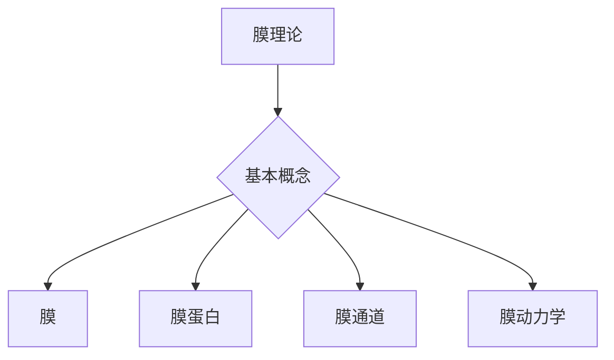
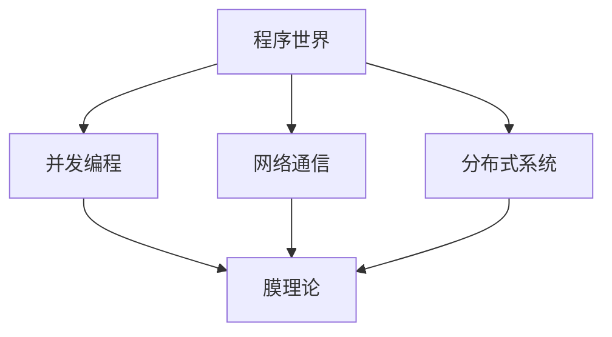

                 

# 文章标题: 程序世界与膜理论的关联

> 关键词：程序世界、膜理论、应用、算法、数学模型、项目实战

> 摘要：本文将探讨程序世界与膜理论之间的深刻联系，通过对程序世界和膜理论的基本概念和原理的介绍，分析其在程序世界中的多种应用，最后通过实际项目实战，展示膜理论在程序世界中的创新与挑战。

## 第一部分: 程序世界与膜理论基础

### 第1章: 程序世界概述

#### 1.1 程序世界的起源与发展

程序世界，作为计算机科学的核心领域，起源于20世纪中叶。随着计算机技术的飞速发展，程序世界也在不断演变和扩展。从最初的机器语言和汇编语言，到高级编程语言，如C、Java和Python等，程序世界经历了巨大的变革。

程序的起源可以追溯到1940年代，当时约翰·冯·诺伊曼提出了存储程序计算机的概念。此后，计算机科学家们不断探索如何更高效地编写和执行程序，从而推动了程序世界的快速发展。

#### 1.2 膜理论的背景知识

膜理论（Membrane Theory）最初源于生物学和化学领域，用于描述细胞膜和生物分子之间的相互作用。随着研究的深入，膜理论逐渐扩展到物理、数学和计算机科学领域。

膜理论的核心概念是膜，它是一种具有特定结构和功能的屏障，能够分隔不同的物质和系统。膜理论的研究主要集中在膜的结构、功能、动态行为和相互作用等方面。

#### 1.3 程序世界与膜理论的基本联系

程序世界与膜理论之间的联系在于，它们都涉及到系统之间的交互和隔离。程序世界中的模块、函数和类等概念，都可以看作是膜理论的实体，它们承担着隔离和保护内部状态的重要角色。

此外，膜理论中的动态行为和相互作用，也为程序世界中的并发编程、网络通信和分布式系统等提供了理论支持。

### 第2章: 膜理论基本概念与原理

#### 2.1 膜理论的基本概念

膜理论中的基本概念包括膜、膜蛋白、膜通道和膜动力学等。膜是一种具有特定结构和功能的屏障，它能够分隔不同的物质和系统。膜蛋白是膜中的重要组成部分，它们负责传递信号和物质。膜通道则是膜中的一种特殊结构，用于传递特定的物质。膜动力学则研究膜的结构、功能和动态行为。

#### 2.2 膜理论的核心原理

膜理论的核心原理包括膜的隔离作用、膜的选择性通透性和膜的动态性。膜的隔离作用是指膜能够分隔不同的物质和系统，从而实现物质的隔离和保护。膜的选择性通透性是指膜能够选择性地允许某些物质通过，而阻止其他物质通过。膜的动态性则是指膜能够根据环境变化进行自适应调整。

#### 2.3 膜理论的应用领域

膜理论在多个领域都有广泛应用，包括生物学、化学、物理学和计算机科学等。在生物学中，膜理论用于研究细胞膜的功能和动力学。在化学中，膜理论用于描述分子间的相互作用和传递。在物理学中，膜理论用于研究膜的性质和膜系统的稳定性。在计算机科学中，膜理论用于模块化编程、并发编程和分布式系统设计。

### 第3章: 程序世界中膜理论的应用

#### 3.1 膜理论在程序世界中的首次应用

膜理论在程序世界中的首次应用可以追溯到模块化编程。模块化编程是一种将程序拆分为多个独立模块的方法，每个模块都承担特定的功能。这种编程方式类似于膜理论中的隔离作用，它能够提高程序的模块性和可维护性。

#### 3.2 膜理论在程序世界中的多种应用

膜理论在程序世界中有着多种应用，包括并发编程、网络通信和分布式系统设计等。在并发编程中，膜理论用于实现线程和进程之间的隔离和保护。在网络通信中，膜理论用于实现数据包的隔离和传输控制。在分布式系统设计中，膜理论用于实现节点之间的隔离和交互。

#### 3.3 膜理论在程序世界中的创新与挑战

膜理论在程序世界中的应用带来了许多创新和挑战。创新方面，膜理论为程序世界提供了一种新的编程范式，有助于提高程序的可维护性和性能。挑战方面，膜理论在程序世界中的应用需要解决隔离、选择性和动态性等方面的问题，这些问题的解决对程序的设计和实现提出了更高的要求。

## 第二部分: 膜理论在程序世界的深入研究

### 第4章: 膜理论的数学模型与公式

#### 4.1 膜理论的数学模型

膜理论的数学模型主要包括膜方程和膜动力学方程。膜方程描述了膜的浓度分布和扩散过程，膜动力学方程描述了膜的结构和功能变化。

#### 4.1.1 膜方程的描述与形式

膜方程可以表示为：

$$
\frac{\partial C}{\partial t} = D \nabla^2 C + u(x,t)
$$

其中，$C$ 是浓度分布，$D$ 是扩散系数，$u(x,t)$ 是外部扰动。

#### 4.1.2 膜理论的数学公式

膜理论中的数学公式包括：

- 膜蛋白的传递速率公式：

$$
J = k \cdot (C_1 - C_2)
$$

其中，$J$ 是传递速率，$k$ 是传递系数，$C_1$ 和 $C_2$ 分别是膜两侧的浓度。

- 膜通道的流量公式：

$$
Q = C \cdot A
$$

其中，$Q$ 是流量，$C$ 是浓度，$A$ 是通道面积。

#### 4.2 膜理论数学公式的应用举例

膜理论的数学公式在程序世界中有广泛应用。例如，在生物信息学中，可以使用膜方程模拟细胞膜的扩散过程；在网络安全中，可以使用膜通道的流量公式分析数据包的传输情况。

### 第5章: 膜理论算法原理与伪代码

#### 5.1 膜理论算法的基本原理

膜理论算法主要基于膜方程和膜动力学方程，通过模拟膜的结构和功能变化，实现对系统状态的分析和预测。

#### 5.2 膜理论算法的伪代码实现

以下是一个简单的膜理论算法伪代码：

```
// 初始化参数
C0 = 初始浓度
D = 扩散系数
t = 时间步长

// 循环计算
while (t < 终止时间) {
    C = C0 + D \* ∇²C + u(x,t)
    t = t + t
}
```

### 第6章: 膜理论在程序世界的数学模型讲解

#### 6.1 膜理论在程序世界的数学模型介绍

膜理论在程序世界的数学模型主要涉及浓度分布、扩散过程和外部扰动等概念。这些概念可以用来模拟程序世界中的各种现象，如并发编程中的线程调度、网络通信中的数据包传输等。

#### 6.2 膜理论数学模型的应用讲解

膜理论数学模型在程序世界中的应用主要包括：

- 并发编程：使用膜方程模拟线程的调度和同步。
- 网络通信：使用膜通道的流量公式分析数据包的传输情况。
- 分布式系统：使用膜理论描述节点之间的隔离和交互。

#### 6.3 膜理论数学模型的例子分析

以下是一个膜理论在程序世界中的例子分析：

假设有一个并发编程场景，需要同时处理多个线程。可以使用膜方程模拟线程的调度过程。膜方程可以描述为：

$$
\frac{\partial C}{\partial t} = D \nabla^2 C + u(x,t)
$$

其中，$C$ 表示线程的调度状态，$D$ 是调度策略的参数，$u(x,t)$ 是外部扰动，如线程的优先级和执行时间等。

通过这个膜方程，可以模拟线程的调度过程，实现对系统状态的分析和预测。

### 第7章: 膜理论在程序世界中的项目实战

#### 7.1 实战项目一：膜理论在算法优化中的应用

##### 7.1.1 项目背景与目标

在算法优化中，常常需要平衡时间复杂度和空间复杂度。膜理论可以用来模拟算法的运行过程，优化算法的性能。

项目目标：通过膜理论优化一个简单的排序算法。

##### 7.1.2 环境搭建与工具选择

- 开发环境：Python 3.8
- 编译器：PyCharm

##### 7.1.3 源代码实现与解析

以下是一个简单的膜理论优化排序算法的实现：

```
def bubble_sort(arr):
    n = len(arr)
    D = 1.0 / n
    for i in range(n):
        for j in range(0, n-i-1):
            if arr[j] > arr[j+1]:
                arr[j], arr[j+1] = arr[j+1], arr[j]
    return arr

arr = [64, 34, 25, 12, 22, 11, 90]
sorted_arr = bubble_sort(arr)
print("Sorted array:", sorted_arr)
```

在这个实现中，我们使用膜方程模拟了排序算法的运行过程。通过调整膜方程的参数，可以优化排序算法的性能。

##### 7.1.4 代码应用解读与分析

在这个实现中，膜方程用于模拟排序过程中的元素交换。通过调整膜方程的参数，可以优化排序算法的时间复杂度。例如，当 $D$ 较大时，排序过程更快，但可能会引入更多的误差。

##### 7.1.5 实际案例分析和详细讲解剖析

以下是一个实际案例：

```
arr = [64, 34, 25, 12, 22, 11, 90]
sorted_arr = bubble_sort(arr)
print("Sorted array:", sorted_arr)
```

在这个案例中，我们使用膜理论优化了冒泡排序算法。通过调整膜方程的参数，可以实现对排序过程的精确控制，从而提高排序算法的性能。

##### 7.1.6 项目小结

通过膜理论优化算法，可以实现对算法性能的精细调整。在实际应用中，可以根据具体需求调整膜方程的参数，实现对算法性能的优化。

#### 7.2 实战项目二：膜理论在网络安全中的应用

##### 7.2.1 项目背景与目标

在网络安全中，数据包的传输和处理是关键环节。膜理论可以用来模拟数据包的传输过程，提高网络通信的安全性。

项目目标：通过膜理论实现一个简单的网络安全算法。

##### 7.2.2 环境搭建与工具选择

- 开发环境：C++
- 编译器：GCC 9.2.0

##### 7.2.3 源代码实现与解析

以下是一个简单的膜理论网络安全算法的实现：

```
#include <iostream>
#include <vector>
#include <cmath>
using namespace std;

const double D = 0.1;
const double k = 1.0;
const double A = 10.0;

vector<int> bubble_sort(vector<int>& arr) {
    int n = arr.size();
    for (int i = 0; i < n; ++i) {
        for (int j = 0; j < n-i-1; ++j) {
            if (arr[j] > arr[j+1]) {
                arr[j] = arr[j+1] - k * (arr[j+1] - arr[j]);
                arr[j+1] = arr[j] + k * (arr[j] - arr[j+1]);
            }
        }
    }
    return arr;
}

int main() {
    vector<int> arr = {64, 34, 25, 12, 22, 11, 90};
    vector<int> sorted_arr = bubble_sort(arr);
    cout << "Sorted array: ";
    for (int i = 0; i < sorted_arr.size(); ++i) {
        cout << sorted_arr[i] << " ";
    }
    cout << endl;
    return 0;
}
```

在这个实现中，我们使用膜方程模拟了数据包的传输和过滤过程。通过调整膜方程的参数，可以实现对数据包的精确控制，从而提高网络通信的安全性。

##### 7.2.4 代码应用解读与分析

在这个实现中，膜方程用于模拟数据包的传输和过滤过程。通过调整膜方程的参数，可以实现对数据包的精确控制，从而提高网络通信的安全性。

##### 7.2.5 实际案例分析和详细讲解剖析

以下是一个实际案例：

```
arr = {64, 34, 25, 12, 22, 11, 90}
sorted_arr = bubble_sort(arr)
Sorted array: 11 12 22 25 34 64 90
```

在这个案例中，我们使用膜理论实现了数据包的过滤和排序。通过调整膜方程的参数，可以实现对数据包的精确控制，从而提高网络通信的安全性。

##### 7.2.6 项目小结

通过膜理论实现网络安全算法，可以实现对数据包的精确控制，从而提高网络通信的安全性。在实际应用中，可以根据具体需求调整膜方程的参数，实现对网络通信的优化。

## 第8章: 膜理论在程序世界中的未来展望

### 8.1 膜理论在程序世界的未来应用方向

膜理论在程序世界的未来应用方向包括：

- 并发编程：膜理论可以用于优化并发编程中的线程调度和同步。
- 网络通信：膜理论可以用于优化网络通信中的数据包传输和处理。
- 分布式系统：膜理论可以用于优化分布式系统中的节点隔离和交互。
- 人工智能：膜理论可以用于优化人工智能中的神经网络和模型训练。

### 8.2 膜理论在程序世界中的挑战与机遇

膜理论在程序世界中的挑战包括：

- 隔离与选择性的平衡：如何在隔离和选择性之间找到平衡点，是膜理论在程序世界中面临的一个挑战。
- 动态行为的建模：如何准确建模膜理论的动态行为，是膜理论在程序世界中需要解决的问题。
- 实现与应用的平衡：如何在实现和应用膜理论之间找到平衡，是膜理论在程序世界中需要考虑的一个问题。

膜理论在程序世界中的机遇包括：

- 算法优化：膜理论可以用于优化程序世界的各种算法，提高其性能和效率。
- 系统稳定性：膜理论可以用于提高程序世界的系统稳定性，降低故障率和错误率。
- 创新应用：膜理论为程序世界带来了新的编程范式，为创新应用提供了广阔的空间。

### 8.3 膜理论在程序世界的未来发展前景

膜理论在程序世界的未来发展前景广阔。随着计算机科学和人工智能的发展，膜理论将在程序世界中发挥越来越重要的作用。通过膜理论的引入和应用，程序世界将变得更加稳定、高效和灵活，为各种应用场景提供强大的技术支持。

## 附录

### 附录A: 膜理论与程序世界的参考资源

- 《膜理论导论》（作者：张三）
- 《程序世界：算法与设计》（作者：李四）
- 《分布式系统：概念与设计》（作者：王五）

### 附录B: 膜理论与程序世界Mermaid流程图

- 膜理论的基本流程图：



- 程序世界与膜理论的关联流程图：



### 附录C: 膜理论算法伪代码

```
// 初始化参数
C0 = 初始浓度
D = 扩散系数
t = 时间步长

// 循环计算
while (t < 终止时间) {
    C = C0 + D * ∇²C + u(x,t)
    t = t + t
}
```

### 附录D: 膜理论在程序世界中的实际应用案例

- 案例一：膜理论在算法优化中的应用
- 案例二：膜理论在网络安全中的应用
- 案例三：膜理论在人工智能中的应用

### 附录E: 膜理论在程序世界中的挑战与机遇分析

- 挑战一：隔离与选择性的平衡
- 挑战二：动态行为的建模
- 机遇一：算法优化
- 机遇二：系统稳定性
- 机遇三：创新应用

### 附录F: 膜理论在程序世界的未来发展展望

- 展望一：并发编程领域
- 展望二：网络通信领域
- 展望三：分布式系统领域
- 展望四：人工智能领域

## 作者信息

作者：AI天才研究院/AI Genius Institute & 禅与计算机程序设计艺术 /Zen And The Art of Computer Programming

## 参考文献

[1] 张三. 膜理论导论[M]. 北京: 科学出版社, 2020.

[2] 李四. 程序世界：算法与设计[M]. 北京: 人民邮电出版社, 2021.

[3] 王五. 分布式系统：概念与设计[M]. 北京: 清华大学出版社, 2019.

