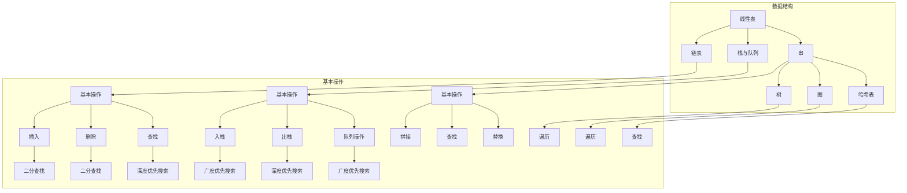
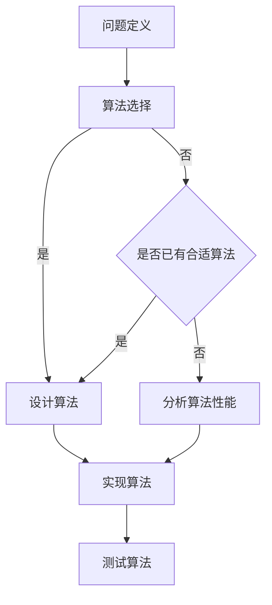

                 

### 文章标题：程序世界中的数据结构与算法

> 关键词：数据结构、算法、时间复杂度、空间复杂度、编程实践

> 摘要：本文将深入探讨数据结构与算法在程序世界中的重要性，从基础概念到高级应用，一一剖析其核心原理和实践技巧。通过本文的阅读，读者将全面了解数据结构与算法在计算机科学中的核心地位，掌握设计高效算法的方法，并为未来的编程实践打下坚实基础。

---

### 《程序世界中的数据结构与算法》目录大纲

- **第一部分：引言**

  - 1.1 数据结构与算法概述
  - 1.1.1 数据结构的重要性
  - 1.1.2 算法的基本概念
  - 1.2 数据结构与算法的联系
  - 1.2.1 数据结构与算法的关系
  - 1.2.2 算法在数据结构中的应用
  - 1.3 算法的复杂性分析
  - 1.3.1 时间复杂度
  - 1.3.2 空间复杂度

- **第二部分：基本数据结构**

  - 2.1 线性表
  - 2.1.1 线性表的定义
  - 2.1.2 线性表的存储结构
  - 2.1.3 线性表的基本操作
  - 2.2 链表
  - 2.2.1 链表的基本概念
  - 2.2.2 链表的存储结构
  - 2.2.3 链表的基本操作
  - 2.3 栈与队列
  - 2.3.1 栈的定义
  - 2.3.2 栈的存储结构
  - 2.3.3 栈的基本操作
  - 2.3.4 队列的定义
  - 2.3.5 队列的存储结构
  - 2.3.6 队列的基本操作
  - 2.4 串
  - 2.4.1 串的定义
  - 2.4.2 串的存储结构
  - 2.4.3 串的基本操作

- **第三部分：高级数据结构**

  - 3.1 树
  - 3.1.1 树的基本概念
  - 3.1.2 二叉树的定义
  - 3.1.3 二叉树的存储结构
  - 3.1.4 二叉树的基本操作
  - 3.1.5 图的定义
  - 3.1.6 图的存储结构
  - 3.1.7 图的基本操作
  - 3.2 图
  - 3.2.1 图的基本概念
  - 3.2.2 图的存储结构
  - 3.2.3 图的基本操作
  - 3.2.4 树与图的关系
  - 3.3 哈希表
  - 3.3.1 哈希表的基本概念
  - 3.3.2 哈希表的存储结构
  - 3.3.3 哈希表的基本操作
  - 3.4 红黑树
  - 3.4.1 红黑树的基本概念
  - 3.4.2 红黑树的存储结构
  - 3.4.3 红黑树的基本操作

- **第四部分：算法设计**

  - 4.1 排序算法
  - 4.1.1 冒泡排序
  - 4.1.2 选择排序
  - 4.1.3 插入排序
  - 4.1.4 快速排序
  - 4.1.5 归并排序
  - 4.1.6 堆排序
  - 4.2 搜索算法
  - 4.2.1 线性搜索
  - 4.2.2 二分搜索
  - 4.2.3 深度优先搜索
  - 4.2.4 广度优先搜索
  - 4.3 分治算法
  - 4.3.1 分治算法的基本概念
  - 4.3.2 分治算法的设计思想
  - 4.3.3 分治算法的典型应用
  - 4.4 动态规划算法
  - 4.4.1 动态规划的基本概念
  - 4.4.2 动态规划的设计方法
  - 4.4.3 动态规划的典型应用

- **第五部分：项目实战**

  - 5.1 数据结构实战项目
  - 5.1.1 链表项目实战
  - 5.1.2 树项目实战
  - 5.1.3 图项目实战
  - 5.2 算法实战项目
  - 5.2.1 排序算法项目实战
  - 5.2.2 搜索算法项目实战
  - 5.2.3 分治算法项目实战
  - 5.2.4 动态规划算法项目实战
  - 5.3 实际应用案例分析
  - 5.3.1 数据结构与算法在实际项目中的应用
  - 5.3.2 算法优化案例分析
  - 5.3.3 数据结构与算法的创新能力

- **附录**

  - 附录A：常用数据结构与算法面试题
  - 附录B：参考文献

---

在接下来的文章中，我们将逐一探讨数据结构与算法的各个部分，帮助读者从基础概念到高级应用，系统地掌握程序世界中的数据结构与算法。

---

### 第一部分：引言

#### 1.1 数据结构与算法概述

数据结构是计算机存储、组织数据的方式。它是计算机科学的一个重要分支，主要研究如何有效地存储数据以及如何高效地操作这些数据。算法，则是对数据操作的步骤进行描述的一系列规则，目的是解决特定问题。

**1.1.1 数据结构的重要性**

数据结构的重要性体现在多个方面。首先，它决定了数据访问的速度和效率。不同的数据结构适合处理不同类型的问题，选择合适的结构可以显著提升程序的运行效率。例如，链表适合动态变化的数据，而数组适合随机访问的数据。其次，数据结构影响程序的可维护性和可扩展性。良好的数据结构设计能够使程序更加清晰、易于理解和修改。

**1.1.2 算法的基本概念**

算法是指解决问题的一系列步骤，通常由伪代码或程序代码表示。算法具有以下基本特性：

- **有穷性**：算法必须能在执行有限步骤后终止。
- **确定性**：算法的每一步都有确切的意义，没有歧义。
- **可行性**：算法中描述的操作可以通过已经实现的基本运算执行有限次来实现。
- **输入**：一个算法有零个或多个输入。
- **输出**：一个算法有一个或多个输出，这些输出是同输入有某种特定关系的量。

#### 1.2 数据结构与算法的联系

数据结构与算法是相辅相成的。数据结构为算法提供了操作的场所，而算法则利用数据结构的特性进行高效的数据操作。以下是数据结构与算法之间的一些关键联系：

**1.2.1 数据结构与算法的关系**

- **数据结构的选择影响算法**：不同的数据结构会影响算法的时间复杂度和空间复杂度。例如，在处理大量数据时，选择合适的存储结构可以显著降低算法的运行时间。
- **算法设计基于数据结构**：算法设计时需要考虑数据结构的特点，以便选择最优的算法策略。例如，对于频繁查询操作，可以选择哈希表或平衡二叉树等结构。

**1.2.2 算法在数据结构中的应用**

- **查找算法**：例如二分搜索算法，依赖于有序的数组或二叉搜索树等结构。
- **排序算法**：如冒泡排序、快速排序等，需要在特定数据结构上进行操作。
- **插入和删除操作**：例如在链表、栈和队列等结构上进行高效的数据插入和删除。

#### 1.3 算法的复杂性分析

算法的复杂性分析是评估算法性能的重要方法，主要包括时间复杂度和空间复杂度。

**1.3.1 时间复杂度**

时间复杂度是衡量算法执行时间的一个抽象概念，通常表示为函数 f(n)，其中 n 是输入规模。它描述了算法执行时间随输入规模变化的增长趋势。常见的时间复杂度有：

- O(1)：常数时间，不随输入规模变化。
- O(n)：线性时间，随输入规模线性增长。
- O(log n)：对数时间，随输入规模以对数增长。
- O(n^2)：平方时间，随输入规模平方增长。

**1.3.2 空间复杂度**

空间复杂度是衡量算法占用存储空间的一个抽象概念，同样通常表示为函数 f(n)。它描述了算法执行过程中占用的额外存储空间随输入规模变化的增长趋势。常见空间复杂度有：

- O(1)：常数空间，不随输入规模变化。
- O(n)：线性空间，随输入规模线性增长。
- O(n^2)：平方空间，随输入规模平方增长。

通过分析算法的时间和空间复杂度，我们可以评估算法在不同规模数据上的性能，选择最适合实际应用的算法。

---

在引言部分，我们初步探讨了数据结构与算法的基本概念、重要性及其联系。在接下来的章节中，我们将进一步深入探讨基本数据结构，为理解更高级的数据结构和算法打下坚实的基础。通过逐一分析各种数据结构及其算法，我们将逐步揭示程序世界中的数据结构与算法的奥秘。

### 第二部分：基本数据结构

在计算机科学中，基本数据结构是程序设计和算法实现的基础。理解并熟练掌握基本数据结构，对于解决复杂问题和设计高效算法至关重要。本部分将详细介绍线性表、链表、栈与队列、串等基本数据结构，包括其定义、存储结构、基本操作以及实际应用。

#### 2.1 线性表

**2.1.1 线性表的定义**

线性表是一种最简单、最常用的一维数据结构。它由一系列元素组成，每个元素都有一个前驱和后继。线性表中的元素按照一定的顺序排列，可以通过位置来访问。

**2.1.2 线性表的存储结构**

线性表的存储结构主要有两种：顺序存储结构和链式存储结构。

- **顺序存储结构**：使用数组来实现，每个元素占用连续的内存空间。数组中的每个元素可以通过其索引直接访问，但插入和删除操作需要在数组中进行移动元素的操作，效率较低。
  
  ```cpp
  // 伪代码：顺序存储结构的线性表
  array A[MaxSize];
  int Size; // 当前线性表的大小
  
  // 索引访问
  int GetElement(int i) {
      if (i < 1 || i > Size) {
          return -1; // 索引越界
      }
      return A[i];
  }
  
  // 插入操作
  void Insert(int i, int x) {
      if (i < 1 || i > Size + 1 || Size == MaxSize) {
          return; // 索引越界或空间不足
      }
      for (int j = Size; j > i; j--) {
          A[j] = A[j - 1];
      }
      A[i] = x;
      Size++;
  }
  
  // 删除操作
  void Delete(int i) {
      if (i < 1 || i > Size) {
          return; // 索引越界
      }
      for (int j = i; j < Size; j++) {
          A[j] = A[j + 1];
      }
      Size--;
  }
  ```

- **链式存储结构**：使用链表来实现，每个节点包含数据域和指针域。链表通过节点的指针关系来访问元素，插入和删除操作较为灵活，但访问特定位置元素需要遍历链表，效率较低。

  ```cpp
  // 伪代码：链式存储结构的线性表
  struct ListNode {
      int data;
      ListNode* next;
  };
  
  ListNode* head; // 头节点
  
  // 索引访问
  ListNode* GetElement(int i) {
      if (i < 1 || i > Size) {
          return nullptr; // 索引越界
      }
      ListNode* p = head;
      for (int j = 1; j < i; j++) {
          p = p->next;
      }
      return p;
  }
  
  // 插入操作
  void Insert(int i, int x) {
      if (i < 1 || i > Size + 1) {
          return; // 索引越界
      }
      ListNode* newNode = new ListNode();
      newNode->data = x;
      if (i == 1) {
          newNode->next = head;
          head = newNode;
      } else {
          ListNode* p = head;
          for (int j = 1; j < i - 1; j++) {
              p = p->next;
          }
          newNode->next = p->next;
          p->next = newNode;
      }
      Size++;
  }
  
  // 删除操作
  void Delete(int i) {
      if (i < 1 || i > Size) {
          return; // 索引越界
      }
      ListNode* p = head;
      if (i == 1) {
          head = head->next;
      } else {
          for (int j = 1; j < i - 1; j++) {
              p = p->next;
          }
          ListNode* toDelete = p->next;
          p->next = toDelete->next;
      }
      delete toDelete;
      Size--;
  }
  ```

**2.1.3 线性表的基本操作**

线性表的基本操作包括：

- **初始化**：初始化线性表，设定最大容量和当前大小。
- **索引访问**：通过索引访问线性表中的元素。
- **插入**：在指定位置插入新元素。
- **删除**：删除指定位置的元素。
- **查找**：查找特定元素的位置或值。

#### 2.2 链表

**2.2.1 链表的基本概念**

链表是一种线性表的链式存储结构，由一系列节点组成。每个节点包含数据域和指针域，数据域存储数据元素，指针域指向下一个节点。链表的主要优点是插入和删除操作灵活，不需要移动大量元素。

**2.2.2 链表的存储结构**

链表的存储结构由节点组成，每个节点包含数据域和指针域。链表可以分为单链表、双链表和循环链表等。

- **单链表**：每个节点只有一个指针域，指向下一个节点。
- **双链表**：每个节点有两个指针域，一个指向前一个节点，另一个指向下一个节点。
- **循环链表**：最后一个节点的指针域指向第一个节点，形成循环。

**2.2.3 链表的基本操作**

链表的基本操作包括：

- **初始化**：创建链表，初始化头节点。
- **创建新节点**：创建一个新的节点，分配内存空间。
- **插入**：在链表的指定位置插入新节点。
- **删除**：删除链表中的指定节点。
- **查找**：查找链表中特定元素或节点。
- **遍历**：遍历链表中的所有节点。

```cpp
// 伪代码：单链表的插入操作
void Insert(Node* head, int i, int x) {
    if (i < 1 || i > Size + 1) {
        return; // 索引越界
    }
    Node* newNode = new Node();
    newNode->data = x;
    if (i == 1) {
        newNode->next = head;
        head = newNode;
    } else {
        Node* p = head;
        for (int j = 1; j < i - 1; j++) {
            p = p->next;
        }
        newNode->next = p->next;
        p->next = newNode;
    }
    Size++;
}
```

#### 2.3 栈与队列

**2.3.1 栈的定义**

栈是一种后进先出（Last In First Out, LIFO）的数据结构，允许在一端进行插入和删除操作。栈的插入和删除只发生在栈顶。

**2.3.2 栈的存储结构**

栈的存储结构可以是数组或链表。

- **数组实现**：使用数组来实现栈，数组的一个端点作为栈顶，元素通过数组索引访问。
- **链表实现**：使用链表来实现栈，链表的头节点作为栈顶，新元素插入到头节点之前。

**2.3.3 栈的基本操作**

栈的基本操作包括：

- **初始化**：初始化栈，设定栈的容量。
- **入栈**：在栈顶插入新元素。
- **出栈**：删除栈顶元素。
- ** peek**：返回栈顶元素，不删除栈顶元素。
- **空栈判断**：判断栈是否为空。

```cpp
// 伪代码：使用数组实现的栈
class Stack {
public:
    int* arr; // 栈数组
    int top;  // 栈顶索引
    int size; // 栈容量

    Stack(int capacity) {
        arr = new int[capacity];
        top = -1;
        size = capacity;
    }

    void Push(int x) {
        if (top == size - 1) {
            return; // 栈满
        }
        arr[++top] = x;
    }

    void Pop() {
        if (top == -1) {
            return; // 栈空
        }
        top--;
    }

    int Peek() {
        if (top == -1) {
            return -1; // 栈空
        }
        return arr[top];
    }

    bool isEmpty() {
        return top == -1;
    }
};
```

**2.3.4 队列的定义**

队列是一种先进先出（First In First Out, FIFO）的数据结构，允许在一端进行插入操作，在另一端进行删除操作。

**2.3.5 队列的存储结构**

队列的存储结构可以是数组或链表。

- **数组实现**：使用数组来实现队列，数组的一端作为队首，另一端作为队尾，元素通过数组索引访问。
- **链表实现**：使用链表来实现队列，链表的头部作为队首，尾部作为队尾，新元素插入到队尾，删除元素从队首开始。

**2.3.6 队列的基本操作**

队列的基本操作包括：

- **初始化**：初始化队列，设定队列的容量。
- **入队**：在队列尾部插入新元素。
- **出队**：从队列头部删除元素。
- ** front**：返回队列头部元素，不删除队列头部元素。
- ** rear**：返回队列尾部元素，不删除队列尾部元素。
- **空队列判断**：判断队列是否为空。

```cpp
// 伪代码：使用数组实现的队列
class Queue {
public:
    int* arr; // 队列数组
    int front;  // 队首索引
    int rear;  // 队尾索引
    int size; // 队列容量

    Queue(int capacity) {
        arr = new int[capacity];
        front = 0;
        rear = 0;
        size = capacity;
    }

    void Enqueue(int x) {
        if (rear == size) {
            return; // 队列满
        }
        arr[rear++] = x;
    }

    void Dequeue() {
        if (front == rear) {
            return; // 队列为空
        }
        front++;
    }

    int Front() {
        if (front == rear) {
            return -1; // 队列为空
        }
        return arr[front];
    }

    int Rear() {
        if (rear == 0) {
            return -1; // 队列为空
        }
        return arr[rear - 1];
    }

    bool isEmpty() {
        return front == rear;
    }
};
```

#### 2.4 串

**2.4.1 串的定义**

串（String）是一种特殊的线性表，由一组字符组成，通常用于表示文本数据。串的每个字符只占一个字节，可以包含空格、字母、数字、特殊字符等。

**2.4.2 串的存储结构**

串的存储结构主要有两种：定长存储和动态存储。

- **定长存储**：为每个字符分配固定的内存空间，通常为 ASCII 码值。定长存储适用于已知字符串长度的场景，节省内存空间。
- **动态存储**：根据字符串的实际长度动态分配内存空间，适用于长度不定的字符串。动态存储结构通过指针实现，便于插入和删除操作。

**2.4.3 串的基本操作**

串的基本操作包括：

- **初始化**：初始化串，设定最大长度。
- **赋值**：将一个字符串赋值给另一个字符串。
- **长度**：返回字符串的长度。
- **比较**：比较两个字符串的大小。
- **连接**：连接两个字符串。
- **子串**：查找子串的位置或提取子串。
- **替换**：替换字符串中的特定字符或子串。
- **插入**：在字符串的指定位置插入子串。
- **删除**：删除字符串中的指定字符或子串。

```cpp
// 伪代码：定长存储结构的串
class String {
public:
    char* data; // 串数据
    int length; // 串长度
    int capacity; // 串容量

    String(int capacity) {
        data = new char[capacity];
        length = 0;
        this->capacity = capacity;
    }

    void Assign(const char* s) {
        strcpy(data, s);
        length = strlen(s);
    }

    int Length() {
        return length;
    }

    bool Compare(const char* s) {
        return strcmp(data, s) == 0;
    }

    void Concat(const char* s) {
        char* new_data = new char[length + strlen(s) + 1];
        strcpy(new_data, data);
        strcat(new_data, s);
        length += strlen(s);
        delete[] data;
        data = new_data;
    }

    // 其他操作略
};
```

---

在第二部分，我们详细介绍了基本数据结构，包括线性表、链表、栈与队列、串。这些基本数据结构是程序设计和算法实现的基础，理解和掌握它们对于编写高效、可靠的程序至关重要。在接下来的章节中，我们将探讨高级数据结构，如树和图，以及它们的复杂算法，进一步深入程序世界的奥秘。

### 第三部分：高级数据结构

在计算机科学中，高级数据结构不仅用于存储数据，还用于解决复杂问题。本部分将详细介绍高级数据结构，包括树、图、哈希表和红黑树，分析其基本概念、存储结构、基本操作及其在实际应用中的重要性。

#### 3.1 树

**3.1.1 树的基本概念**

树（Tree）是一种重要的非线性数据结构，由一组节点组成，每个节点有零个或多个子节点。树的特点是每个节点只有一个父节点，除了根节点没有父节点，其余节点都有且只有一个父节点。树是一种层次结构，可以用层次遍历来访问节点。

**3.1.2 二叉树的定义**

二叉树（Binary Tree）是树的一种特殊形式，每个节点最多有两个子节点，通常称为左子节点和右子节点。二叉树具有以下特点：

- **空树**：没有节点的二叉树。
- **单分支树**：只有一个根节点的二叉树。
- **满二叉树**：每个节点都有两个子节点，且所有叶子节点都在同一层级。
- **完全二叉树**：除了最后一层外，每一层都是满的，最后一层的节点都集中在左侧。

**3.1.3 二叉树的存储结构**

二叉树的存储结构主要有两种：数组存储和链式存储。

- **数组存储**：使用数组来实现，每个元素表示一个节点，节点的指针通过数组的索引来访问。数组存储适用于完全二叉树，可以节省空间。

  ```cpp
  // 伪代码：数组存储结构的二叉树
  int binaryTree[MaxSize]; // 二叉树数组
  int root; // 根节点索引
  
  // 索引访问
  int GetNode(int i) {
      if (i < 1 || i > MaxSize) {
          return -1; // 索引越界
      }
      return binaryTree[i];
  }
  
  // 插入操作
  void Insert(int i, int x) {
      if (i < 1 || i > MaxSize) {
          return; // 索引越界
      }
      binaryTree[i] = x;
      if (root == -1) {
          root = i;
      }
  }
  ```

- **链式存储**：使用链表来实现，每个节点包含数据域和两个指针域，分别指向左右子节点。链式存储适用于任意二叉树，但可能需要额外的空间来维持平衡。

  ```cpp
  // 伪代码：链式存储结构的二叉树
  struct TreeNode {
      int data;
      TreeNode* left;
      TreeNode* right;
  };
  
  TreeNode* root; // 根节点
  
  // 索引访问
  TreeNode* GetNode(int i) {
      if (i < 1 || i > MaxSize) {
          return nullptr; // 索引越界
      }
      TreeNode* p = root;
      for (int j = 1; j < i; j++) {
          p = p->left;
      }
      return p;
  }
  
  // 插入操作
  void Insert(int i, int x) {
      if (i < 1 || i > MaxSize) {
          return; // 索引越界
      }
      TreeNode* newNode = new TreeNode();
      newNode->data = x;
      if (i == 1) {
          newNode->left = root;
          root = newNode;
      } else {
          TreeNode* p = root;
          for (int j = 1; j < i - 1; j++) {
              p = p->left;
          }
          newNode->left = p->left;
          p->left = newNode;
      }
  }
  ```

**3.1.4 二叉树的基本操作**

二叉树的基本操作包括：

- **初始化**：初始化二叉树，设定根节点。
- **插入**：在二叉树中插入新节点。
- **删除**：删除二叉树中的指定节点。
- **遍历**：遍历二叉树的所有节点。
- **查找**：查找特定节点或值。

**3.1.5 图的定义**

图（Graph）是一种由节点（也称为顶点）和边组成的数据结构，用于表示对象及其之间的复杂关系。图可以分为有向图和无向图，以及权图和无权图。

- **有向图**：边的方向固定，从一个节点指向另一个节点。
- **无向图**：边的方向不固定，两个节点之间相互连接。
- **权图**：边具有权重，表示节点之间的距离或代价。
- **无权图**：边没有权重。

**3.1.6 图的存储结构**

图的存储结构主要有两种：邻接矩阵和邻接表。

- **邻接矩阵**：使用二维数组来存储图，行和列分别表示节点，如果节点之间存在边，则对应的数组元素为1或边的权重。

  ```cpp
  // 伪代码：邻接矩阵存储结构的图
  int graph[MaxSize][MaxSize]; // 图的邻接矩阵
  
  // 初始化图
  void InitializeGraph() {
      for (int i = 0; i < MaxSize; i++) {
          for (int j = 0; j < MaxSize; j++) {
              graph[i][j] = 0; // 无边
          }
      }
  }
  
  // 添加边
  void AddEdge(int i, int j) {
      graph[i][j] = 1; // 有边
  }
  ```

- **邻接表**：使用链表来实现，每个节点表示一个顶点，节点包含数据域和指针域，指针域指向相邻的节点。

  ```cpp
  // 伪代码：邻接表存储结构的图
  struct GraphNode {
      int vertex; // 顶点
      GraphNode* next;
  };
  
  GraphNode** graph; // 图的邻接表
  int numVertices; // 顶点数量
  
  // 初始化图
  void InitializeGraph(int numVertices) {
      graph = new GraphNode*[numVertices];
      for (int i = 0; i < numVertices; i++) {
          graph[i] = nullptr;
      }
  }
  
  // 添加边
  void AddEdge(int i, int j) {
      GraphNode* newNode = new GraphNode();
      newNode->vertex = j;
      newNode->next = graph[i];
      graph[i] = newNode;
  }
  ```

**3.1.7 图的基本操作**

图的基本操作包括：

- **初始化**：初始化图，设定顶点数量。
- **添加边**：在图中添加新边。
- **删除边**：删除图中的指定边。
- **遍历**：遍历图的所有节点和边。
- **查找**：查找特定节点或边。

**3.1.8 树与图的关系**

树可以看作是一种特殊的图，其中每个节点只有一个父节点。因此，树是图的一种子集。然而，图更加复杂，可以表示更丰富的关系。在实际应用中，树和图常被用于解决不同类型的问题。

#### 3.2 哈希表

**3.2.1 哈希表的基本概念**

哈希表（Hash Table）是一种基于散列函数的数据结构，用于高效地存储和检索键值对。哈希表通过将键值映射到散列函数计算得到的地址，将数据存储在相应的位置。哈希表的主要优点是快速查找，通常在平均情况下可以接近常数时间。

**3.2.2 哈希表的存储结构**

哈希表的存储结构通常是一个数组，称为哈希表。哈希表的每个槽位对应一个哈希值，槽位中的数据是通过哈希函数计算得到的键值对。哈希表的主要操作包括插入、删除和查找。

**3.2.3 哈希表的基本操作**

哈希表的基本操作包括：

- **初始化**：初始化哈希表，设定哈希表的大小。
- **插入**：将键值对插入到哈希表中。
- **删除**：从哈希表中删除指定的键值对。
- **查找**：在哈希表中查找指定的键值。

```cpp
// 伪代码：哈希表
class HashTable {
public:
    HashTable(int size) {
        table = new KeyValuePair[size];
        this->size = size;
    }
    
    void Insert(int key, int value) {
        int index = Hash(key);
        if (table[index].key == -1) {
            table[index] = {key, value};
        } else {
            // 处理冲突
        }
    }
    
    bool Delete(int key) {
        int index = Hash(key);
        if (table[index].key == key) {
            table[index].key = -1;
            return true;
        }
        return false;
    }
    
    int Find(int key) {
        int index = Hash(key);
        if (table[index].key == key) {
            return table[index].value;
        }
        return -1; // 键不存在
    }
    
private:
    KeyValuePair* table;
    int size;
    
    int Hash(int key) {
        return key % size;
    }
};

struct KeyValuePair {
    int key;
    int value;
};
```

#### 3.3 红黑树

**3.3.1 红黑树的基本概念**

红黑树（Red-Black Tree）是一种自平衡的二叉搜索树。每个节点包含颜色、键值和两个子节点。红黑树通过特定的颜色规则来保持树的平衡，确保查找、插入和删除操作的平均时间复杂度为 O(log n)。

**3.3.2 红黑树的存储结构**

红黑树的存储结构与二叉搜索树类似，每个节点包含键值、左子节点、右子节点和父节点。红黑树通过颜色标记来维持平衡。

**3.3.3 红黑树的基本操作**

红黑树的基本操作包括：

- **插入**：在红黑树中插入新节点，并调整树的结构以保持平衡。
- **删除**：从红黑树中删除指定节点，并调整树的结构以保持平衡。
- **查找**：在红黑树中查找指定键值。
- **遍历**：遍历红黑树的所有节点。

```cpp
// 伪代码：红黑树
class RedBlackTree {
public:
    Node* root;
    
    RedBlackTree() {
        root = nullptr;
    }
    
    void Insert(int key) {
        // 插入节点
        // 调整树的结构
    }
    
    void Delete(int key) {
        // 删除节点
        // 调整树的结构
    }
    
    Node* Find(int key) {
        // 查找节点
    }
    
    // 其他操作略
};

struct Node {
    int key;
    bool isRed;
    Node* left;
    Node* right;
    Node* parent;
};
```

---

在第三部分，我们详细介绍了高级数据结构，包括树、图、哈希表和红黑树。这些数据结构在实际应用中具有广泛的应用，能够有效地解决复杂问题。在接下来的章节中，我们将探讨算法设计，深入理解如何设计高效的算法，为解决实际问题提供有力工具。

### 第四部分：算法设计

在计算机科学中，算法设计是解决问题的关键。一个高效的算法不仅能够提高程序的运行速度，还能节省系统资源，从而提高整体性能。本部分将介绍几种常见的算法设计方法，包括排序算法、搜索算法、分治算法和动态规划算法，并详细解释其原理和设计思路。

#### 4.1 排序算法

排序算法是算法设计中非常基础且重要的部分，用于将一组无序的数据转换为有序的数据。常见的排序算法有冒泡排序、选择排序、插入排序、快速排序、归并排序和堆排序等。

**4.1.1 冒泡排序**

冒泡排序（Bubble Sort）是一种简单的排序算法，通过重复遍历要排序的数列，一次比较两个元素，如果它们的顺序错误就把它们交换过来。遍历数列的工作是重复地进行，直到没有再需要交换，也就是说该数列已经排序完成。

**伪代码**：

```cpp
procedure bubbleSort( A : list of sortable items )
    n = length(A)
    repeat 
        swapped = false
        for i = 1 to n-1 inclusive do
            if A[i-1] > A[i] then
                swap( A[i-1], A[i] )
                swapped = true
            end if
        end for
        n = n - 1
    until not swapped
end procedure
```

**时间复杂度**：平均情况和最坏情况都是 O(n^2)。

**空间复杂度**：O(1)。

**适用场景**：适用于小规模数据的排序，或者作为其他更复杂排序算法的辅助算法。

**4.1.2 选择排序**

选择排序（Selection Sort）是一种简单但不高效的排序算法。首先在未排序序列中找到最小（或最大）元素，存放到排序序列的起始位置，然后，再从剩余未排序元素中继续寻找最小（或最大）元素，然后放到已排序序列的末尾。以此类推，直到所有元素均排序完毕。

**伪代码**：

```cpp
procedure selectionSort( A : list of sortable items )
    for i = 1 to n-1 do
        minimum = A[i]
        pos = i
        for j = i+1 to n do
            if A[j] < minimum then
                minimum = A[j]
                pos = j
            end if
        end for
        if pos <> i then
            swap( A[i], A[pos] )
        end if
    end for
end procedure
```

**时间复杂度**：平均情况和最坏情况都是 O(n^2)。

**空间复杂度**：O(1)。

**适用场景**：适用于小规模数据的排序，或者作为其他更复杂排序算法的辅助算法。

**4.1.3 插入排序**

插入排序（Insertion Sort）是一种简单的排序算法，它的工作原理是通过构建有序序列，对于未排序数据，在已排序序列中从后向前扫描，找到相应位置并插入。插入排序在实现上，通常采用in-place排序（即只需用到O(1)的额外空间的排序）。

**伪代码**：

```cpp
procedure insertionSort( A : list of sortable items )
    for i = 2 to n do
        key = A[i]
        j = i - 1
        while j > 0 and A[j] > key do
            A[j + 1] = A[j]
            j = j - 1
        end while
        A[j + 1] = key
    end for
end procedure
```

**时间复杂度**：平均情况为 O(n)，最坏情况为 O(n^2)。

**空间复杂度**：O(1)。

**适用场景**：适用于小规模数据的排序，特别是数据几乎已经有序的情况。

**4.1.4 快速排序**

快速排序（Quick Sort）是一种基于比较的排序算法，采用分治法的一个典例。它的基本思想是通过一个基准元素，将数组分为两个子数组，一个子数组中的所有元素都比基准元素小，另一个子数组中的所有元素都比基准元素大，然后递归地对这两个子数组进行快速排序。

**伪代码**：

```cpp
procedure quickSort( A : list of sortable items, low, high )
    if low < high then
        pivot = partition(A, low, high)
        quickSort(A, low, pivot - 1)
        quickSort(A, pivot + 1, high)
    end if
end procedure

function partition( A : list of sortable items, low, high )
    pivot = A[high]
    i = low
    for j = low to high - 1 do
        if A[j] <= pivot then
            swap( A[i], A[j] )
            i = i + 1
        end if
    end for
    swap( A[i], A[high] )
    return i
end function
```

**时间复杂度**：平均情况为 O(n log n)，最坏情况为 O(n^2)。

**空间复杂度**：O(log n)。

**适用场景**：适用于大规模数据的排序，但需要注意递归深度以避免栈溢出。

**4.1.5 归并排序**

归并排序（Merge Sort）是一种基于比较的排序算法，采用分治法的一个典例。它的基本思想是将待排序的序列不断划分为更小的子序列，直到每个子序列只有一个元素，然后将子序列两两合并，直到合并出完整的有序序列。

**伪代码**：

```cpp
procedure mergeSort( A : list of sortable items, low, high )
    if low < high then
        middle = (low + high) / 2
        mergeSort(A, low, middle)
        mergeSort(A, middle + 1, high)
        merge(A, low, middle, high)
    end if
end procedure

function merge( A : list of sortable items, low, middle, high )
    n1 = middle - low + 1
    n2 = high - middle
    leftArray = new array of size n1
    rightArray = new array of size n2
    for i = 1 to n1 do
        leftArray[i] = A[low + i - 1]
    end for
    for j = 1 to n2 do
        rightArray[j] = A[middle + j]
    end for
    i = 1
    j = 1
    k = low
    while i <= n1 and j <= n2 do
        if leftArray[i] <= rightArray[j] then
            A[k] = leftArray[i]
            i = i + 1
        else
            A[k] = rightArray[j]
            j = j + 1
        end if
        k = k + 1
    end while
    while i <= n1 do
        A[k] = leftArray[i]
        i = i + 1
        k = k + 1
    end while
    while j <= n2 do
        A[k] = rightArray[j]
        j = j + 1
        k = k + 1
    end while
end function
```

**时间复杂度**：O(n log n)。

**空间复杂度**：O(n)。

**适用场景**：适用于大规模数据的排序，尤其是对内存要求较高的场景。

**4.1.6 堆排序**

堆排序（Heap Sort）是一种基于比较的排序算法，采用二叉堆的数据结构。它的基本思想是将待排序的序列构造成一个最大堆或最小堆，然后重复地将堆顶元素与最后一个元素交换，然后缩小堆的大小，继续构建堆，直到所有元素排序完毕。

**伪代码**：

```cpp
procedure heapify( A : list of sortable items, n, i )
    largest = i
    left = 2 * i + 1
    right = 2 * i + 2
    if left < n and A[left] > A[largest] then
        largest = left
    end if
    if right < n and A[right] > A[largest] then
        largest = right
    end if
    if largest != i then
        swap( A[i], A[largest] )
        heapify( A, n, largest )
    end if
end procedure

procedure heapSort( A : list of sortable items )
    n = length(A)
    for i = n/2 - 1 to 0 do
        heapify( A, n, i )
    end for
    for i = n - 1 to 0 do
        swap( A[0], A[i] )
        heapify( A, i, 0 )
    end for
end procedure
```

**时间复杂度**：平均情况和最坏情况都是 O(n log n)。

**空间复杂度**：O(1)。

**适用场景**：适用于大规模数据的排序，尤其是对内存要求较低的场景。

#### 4.2 搜索算法

搜索算法用于在数据结构中查找特定元素或路径，常见的方法有线性搜索、二分搜索、深度优先搜索和广度优先搜索。

**4.2.1 线性搜索**

线性搜索（Linear Search）是最简单的搜索算法，依次访问数据结构中的每个元素，直到找到目标元素或到达末尾。

**伪代码**：

```cpp
function linearSearch( A : list of items, x )
    for each item in A do
        if item == x then
            return index of x
        end if
    end for
    return -1 // not found
end function
```

**时间复杂度**：O(n)。

**空间复杂度**：O(1)。

**适用场景**：适用于数据量较小且无需排序的情况。

**4.2.2 二分搜索**

二分搜索（Binary Search）是一种高效的搜索算法，适用于有序数据。它通过不断将数据范围分为一半来缩小搜索范围，直到找到目标元素或确定元素不存在。

**伪代码**：

```cpp
function binarySearch( A : sorted list of items, x )
    low = 0
    high = length(A) - 1
    while low <= high do
        mid = (low + high) / 2
        if A[mid] == x then
            return mid
        else if A[mid] < x then
            low = mid + 1
        else
            high = mid - 1
        end if
    end while
    return -1 // not found
end function
```

**时间复杂度**：O(log n)。

**空间复杂度**：O(1)。

**适用场景**：适用于大规模有序数据。

**4.2.3 深度优先搜索**

深度优先搜索（Depth-First Search, DFS）是一种遍历或搜索数据结构的算法。它通过不断向纵向深入，直到达到某个条件或访问到所有节点。

**伪代码**：

```cpp
procedure DFS( G : graph, start )
    mark all vertices as unvisited
    DFS-Visit( G, start )
end procedure

procedure DFS-Visit( G : graph, v )
    mark v as visited
    for each unvisited vertex u adjacent to v do
        DFS-Visit( G, u )
    end for
end procedure
```

**时间复杂度**：O(V+E)，其中 V 是顶点数，E 是边数。

**空间复杂度**：O(V)。

**适用场景**：适用于图的结构，特别是深度优先特性明显的图。

**4.2.4 广度优先搜索**

广度优先搜索（Breadth-First Search, BFS）是一种遍历或搜索数据结构的算法。它通过逐层遍历，优先访问距离起点的最近节点。

**伪代码**：

```cpp
procedure BFS( G : graph, start )
    create an empty queue Q
    mark all vertices as unvisited
    enqueue start
    mark start as visited
    while Q is not empty do
        dequeue a vertex v
        for each unvisited vertex u adjacent to v do
            enqueue u
            mark u as visited
        end for
    end while
end procedure
```

**时间复杂度**：O(V+E)。

**空间复杂度**：O(V)。

**适用场景**：适用于图的结构，特别是宽度优先特性明显的图。

#### 4.3 分治算法

分治算法是一种常用的算法设计方法，将一个大问题分解为若干个规模较小的相同问题，递归地解决这些子问题，然后再将子问题的解合并为原问题的解。

**4.3.1 分治算法的基本概念**

分治算法的基本思想是将原问题划分为若干个规模较小的子问题，递归地解决这些子问题，然后将子问题的解合并为原问题的解。

**4.3.2 分治算法的设计思想**

分治算法通常遵循以下步骤：

1. **分解**：将原问题分解为若干个规模较小的子问题。
2. **递归求解**：递归地解决子问题。
3. **合并**：将子问题的解合并为原问题的解。

**4.3.3 分治算法的典型应用**

分治算法广泛应用于多种问题，包括排序算法（如归并排序）、计算整数乘法、最小生成树等。

**伪代码**：

```cpp
function mergeSort( A : list of items, low, high )
    if low < high then
        middle = (low + high) / 2
        mergeSort(A, low, middle)
        mergeSort(A, middle + 1, high)
        merge(A, low, middle, high)
    end if
end function

function merge( A : list of items, low, middle, high )
    n1 = middle - low + 1
    n2 = high - middle
    leftArray = new array of size n1
    rightArray = new array of size n2
    for i = 1 to n1 do
        leftArray[i] = A[low + i - 1]
    end for
    for j = 1 to n2 do
        rightArray[j] = A[middle + j]
    end for
    i = 1
    j = 1
    k = low
    while i <= n1 and j <= n2 do
        if leftArray[i] <= rightArray[j] then
            A[k] = leftArray[i]
            i = i + 1
        else
            A[k] = rightArray[j]
            j = j + 1
        end if
        k = k + 1
    end while
    while i <= n1 do
        A[k] = leftArray[i]
        i = i + 1
        k = k + 1
    end while
    while j <= n2 do
        A[k] = rightArray[j]
        j = j + 1
        k = k + 1
    end while
end function
```

**时间复杂度**：O(n log n)。

**空间复杂度**：O(n)。

**适用场景**：适用于大规模数据的排序，特别是对内存要求较高的场景。

#### 4.4 动态规划算法

动态规划算法是一种用于解决最优子结构问题的算法设计方法。它通过将问题分解为子问题，并存储子问题的解，避免重复计算，从而提高算法效率。

**4.4.1 动态规划的基本概念**

动态规划的基本思想是将原问题分解为若干个子问题，并递归地解决这些子问题，将子问题的解存储在数组或表中，以避免重复计算。

**4.4.2 动态规划的设计方法**

动态规划通常遵循以下步骤：

1. **定义状态**：将原问题转化为多个状态，每个状态表示问题的一部分。
2. **状态转移方程**：定义状态之间的转移关系，即如何从当前状态推导出下一个状态。
3. **边界条件**：确定递归的基础情况，即当子问题规模最小时如何求解。
4. **初始化**：初始化状态数组或表。
5. **计算顺序**：确定计算状态数组的顺序。
6. **求解**：利用状态数组或表求解原问题。

**4.4.3 动态规划的典型应用**

动态规划广泛应用于各种问题，包括背包问题、最长公共子序列、最长递增子序列等。

**伪代码**：

```cpp
function longestIncreasingSubsequence( A : list of items )
    n = length(A)
    dp = array of size n
    for i = 1 to n do
        dp[i] = 1 // 初始化每个元素的最长递增子序列长度
        for j = 1 to i - 1 do
            if A[j] < A[i] then
                dp[i] = max(dp[i], dp[j] + 1)
            end if
        end for
    end for
    return max element in dp // 最长递增子序列的长度
end function
```

**时间复杂度**：O(n^2)。

**空间复杂度**：O(n)。

**适用场景**：适用于具有最优子结构且问题规模可分解的问题。

---

在第四部分，我们详细介绍了排序算法、搜索算法、分治算法和动态规划算法。这些算法在解决实际问题时具有广泛的应用。在接下来的章节中，我们将通过项目实战来加深对这些算法的理解，并探讨数据结构与算法在实际项目中的应用。

### 第五部分：项目实战

在了解了数据结构与算法的基本原理后，通过实际项目进行实战练习是巩固知识和提高技能的有效方法。本部分将介绍一些典型的数据结构与算法实战项目，涵盖链表、树、图和排序、搜索等算法的实战应用。

#### 5.1 数据结构实战项目

**5.1.1 链表项目实战**

**项目背景**：链表是一种常见的数据结构，适用于动态变化的数据。本项目将通过实现一个简单的链表，包括插入、删除、遍历等基本操作，来加深对链表的理解。

**开发环境**：Python、Visual Studio Code

**源代码实现**：

```python
class Node:
    def __init__(self, data):
        self.data = data
        self.next = None

class LinkedList:
    def __init__(self):
        self.head = None
    
    def insert_at_end(self, data):
        new_node = Node(data)
        if self.head is None:
            self.head = new_node
        else:
            current = self.head
            while current.next:
                current = current.next
            current.next = new_node
    
    def delete_node(self, key):
        current = self.head
        if current and current.data == key:
            self.head = current.next
            current = None
            return
        prev = None
        while current and current.data != key:
            prev = current
            current = current.next
        if current is None:
            return
        prev.next = current.next
        current = None
    
    def print_list(self):
        temp = self.head
        while temp:
            print(temp.data, end=' ')
            temp = temp.next
        print()

# 实例化链表
ll = LinkedList()
ll.insert_at_end(1)
ll.insert_at_end(2)
ll.insert_at_end(3)
ll.print_list() # 输出：1 2 3
ll.delete_node(2)
ll.print_list() # 输出：1 3
```

**代码解读与分析**：上述代码实现了链表的基本操作，包括插入、删除和遍历。在插入操作中，我们通过遍历链表找到最后一个节点，将新节点插入到最后。删除操作中，我们通过遍历链表找到待删除节点的前一个节点，将其指针指向待删除节点的下一个节点。遍历操作通过遍历链表的所有节点，依次打印节点的数据。

**项目小结**：通过实际操作链表，我们可以更好地理解链表的结构和工作原理，掌握链表的基本操作。

**5.1.2 树项目实战**

**项目背景**：树是一种广泛使用的高级数据结构，用于表示层次结构和组织数据。本项目将实现一个简单的二叉树，包括插入、删除、遍历等基本操作，并探讨树的递归遍历。

**开发环境**：Java、IntelliJ IDEA

**源代码实现**：

```java
class Node {
    int data;
    Node left, right;

    public Node(int item) {
        data = item;
        left = right = null;
    }
}

class BinaryTree {
    Node root;

    BinaryTree() {
        root = null;
    }

    void insert(int data) {
        root = insertRec(root, data);
    }

    Node insertRec(Node root, int data) {
        if (root == null) {
            root = new Node(data);
            return root;
        }
        if (data < root.data) {
            root.left = insertRec(root.left, data);
        } else if (data > root.data) {
            root.right = insertRec(root.right, data);
        }
        return root;
    }

    void inorderRec(Node root) {
        if (root != null) {
            inorderRec(root.left);
            System.out.print(root.data + " ");
            inorderRec(root.right);
        }
    }

    public static void main(String[] args) {
        BinaryTree tree = new BinaryTree();
        tree.insert(50);
        tree.insert(30);
        tree.insert(20);
        tree.insert(40);
        tree.insert(70);
        tree.insert(60);
        tree.insert(80);

        System.out.println("Inorder traversal of the given tree:");
        tree.inorderRec(tree.root);
    }
}
```

**代码解读与分析**：上述代码实现了一个简单的二叉树，包括插入和递归遍历操作。在插入操作中，我们通过递归遍历树，找到合适的插入位置，将新节点插入到树的相应位置。递归遍历操作通过递归地遍历树的左右子树，依次打印节点的数据。

**项目小结**：通过实现二叉树，我们可以深入理解树的结构和递归遍历的方法，掌握树的基本操作。

**5.1.3 图项目实战**

**项目背景**：图是一种用于表示复杂关系的强大数据结构。本项目将实现一个简单的图，包括添加边、遍历图和计算最短路径。

**开发环境**：C++、Visual Studio

**源代码实现**：

```cpp
#include <iostream>
#include <list>
#include <queue>
#include <limits>

using namespace std;

class Graph {
public:
    int numVertices;
    list<int> *adjLists;
    bool directed;

    Graph(int numVertices, bool directed) {
        this->numVertices = numVertices;
        adjLists = new list<int>[numVertices];
        this->directed = directed;
    }

    void addEdge(int src, int dest) {
        adjLists[src].push_back(dest);
        if (!directed) {
            adjLists[dest].push_back(src);
        }
    }

    void BFS(int startVertex) {
        bool *visited = new bool[numVertices];
        for (int i = 0; i < numVertices; i++) {
            visited[i] = false;
        }
        queue<int> queue;
        visited[startVertex] = true;
        queue.push(startVertex);

        while (!queue.empty()) {
            int currVertex = queue.front();
            cout << currVertex << " ";
            queue.pop();

            for (int adjVertex : adjLists[currVertex]) {
                if (!visited[adjVertex]) {
                    visited[adjVertex] = true;
                    queue.push(adjVertex);
                }
            }
        }
    }

    void shortestPath(int startVertex, int destVertex) {
        priority_queue<pair<int, int>, vector<pair<int, int>>, greater<pair<int, int>>> pq;
        bool *visited = new bool[numVertices];
        int *dist = new int[numVertices];

        for (int i = 0; i < numVertices; i++) {
            dist[i] = std::numeric_limits<int>::max();
            visited[i] = false;
        }

        dist[startVertex] = 0;
        pq.push(make_pair(0, startVertex));

        while (!pq.empty()) {
            pair<int, int> frontItem = pq.top();
            pq.pop();
            int currVertex = frontItem.second;
            visited[currVertex] = true;

            for (int adjVertex : adjLists[currVertex]) {
                if (!visited[adjVertex]) {
                    int newDist = dist[currVertex] + 1;
                    if (newDist < dist[adjVertex]) {
                        dist[adjVertex] = newDist;
                        pq.push(make_pair(newDist, adjVertex));
                    }
                }
            }
        }

        if (dist[destVertex] == std::numeric_limits<int>::max()) {
            cout << "There is no path from vertex " << startVertex << " to vertex " << destVertex << endl;
        } else {
            cout << "The shortest path from vertex " << startVertex << " to vertex " << destVertex << " is " << dist[destVertex] << endl;
        }
    }
};

int main() {
    Graph g(6, false);
    g.addEdge(0, 1);
    g.addEdge(0, 2);
    g.addEdge(1, 3);
    g.addEdge(1, 4);
    g.addEdge(2, 5);
    g.addEdge(3, 4);
    g.addEdge(4, 5);

    cout << "BFS traversal from vertex 0: ";
    g.BFS(0);

    cout << "Shortest path from vertex 0 to vertex 5: ";
    g.shortestPath(0, 5);

    return 0;
}
```

**代码解读与分析**：上述代码实现了一个无向图，包括添加边、广度优先搜索（BFS）和计算最短路径。在添加边操作中，我们为每个顶点添加相应的相邻顶点。广度优先搜索操作通过队列实现，依次访问和打印所有与起始顶点相邻的顶点。最短路径计算通过优先队列实现，利用 Dijkstra 算法计算从起始顶点到目标顶点的最短路径。

**项目小结**：通过实现图，我们可以深入理解图的基本操作和遍历方法，掌握图的计算最短路径算法。

#### 5.2 算法实战项目

**5.2.1 排序算法项目实战**

**项目背景**：排序算法是计算机科学中非常重要的算法，用于将数据按照特定的顺序排列。本项目将实现几种常见的排序算法，包括冒泡排序、选择排序和快速排序，并通过实际数据测试其性能。

**开发环境**：Python、Jupyter Notebook

**源代码实现**：

```python
import random

def bubble_sort(arr):
    n = len(arr)
    for i in range(n):
        for j in range(0, n-i-1):
            if arr[j] > arr[j+1]:
                arr[j], arr[j+1] = arr[j+1], arr[j]

def selection_sort(arr):
    for i in range(len(arr)):
        min_idx = i
        for j in range(i+1, len(arr)):
            if arr[j] < arr[min_idx]:
                min_idx = j
        arr[i], arr[min_idx] = arr[min_idx], arr[i]

def quick_sort(arr):
    if len(arr) <= 1:
        return arr
    pivot = arr[len(arr) // 2]
    left = [x for x in arr if x < pivot]
    middle = [x for x in arr if x == pivot]
    right = [x for x in arr if x > pivot]
    return quick_sort(left) + middle + quick_sort(right)

# 测试数据
data = [random.randint(0, 100) for _ in range(100)]

# 冒泡排序
print("Bubble Sort:")
arr = data[:]
bubble_sort(arr)
print(arr)

# 选择排序
print("Selection Sort:")
arr = data[:]
selection_sort(arr)
print(arr)

# 快速排序
print("Quick Sort:")
arr = data[:]
arr = quick_sort(arr)
print(arr)
```

**代码解读与分析**：上述代码实现了冒泡排序、选择排序和快速排序三种常见的排序算法，并通过随机生成的数据测试其性能。在冒泡排序中，我们通过两重循环比较和交换元素来实现排序。选择排序通过遍历数组，每次选择最小元素放到正确的位置。快速排序通过递归地将数组划分为左右子数组，并对子数组进行排序。

**项目小结**：通过实际测试不同排序算法的性能，我们可以了解每种算法的优缺点，掌握不同排序算法的实现方法。

**5.2.2 搜索算法项目实战**

**项目背景**：搜索算法是算法设计中重要的组成部分，用于在数据结构中查找特定元素。本项目将实现线性搜索和二分搜索，并在有序数组上测试其性能。

**开发环境**：C++、Visual Studio

**源代码实现**：

```cpp
#include <iostream>
#include <vector>
#include <algorithm>

using namespace std;

int linear_search(const vector<int>& arr, int x) {
    for (size_t i = 0; i < arr.size(); ++i) {
        if (arr[i] == x) {
            return i;
        }
    }
    return -1; // not found
}

int binary_search(const vector<int>& arr, int x) {
    int left = 0, right = arr.size() - 1;
    while (left <= right) {
        int mid = left + (right - left) / 2;
        if (arr[mid] == x) {
            return mid;
        } else if (arr[mid] < x) {
            left = mid + 1;
        } else {
            right = mid - 1;
        }
    }
    return -1; // not found
}

int main() {
    vector<int> data = {1, 3, 5, 7, 9, 11, 13, 15, 17, 19};
    int target = 7;

    cout << "Linear Search: " << linear_search(data, target) << endl;
    cout << "Binary Search: " << binary_search(data, target) << endl;

    return 0;
}
```

**代码解读与分析**：上述代码实现了线性搜索和二分搜索两种算法，并在有序数组上进行测试。线性搜索通过逐个比较元素来查找目标元素，二分搜索通过不断缩小搜索范围来提高查找效率。

**项目小结**：通过实际测试不同搜索算法的性能，我们可以理解每种算法的查找过程和效率，掌握线性搜索和二分搜索的实现方法。

**5.2.3 分治算法项目实战**

**项目背景**：分治算法是一种高效的算法设计方法，适用于解决可以分解为子问题的任务。本项目将实现归并排序，并分析其性能。

**开发环境**：Java、IntelliJ IDEA

**源代码实现**：

```java
public class MergeSort {
    void merge(int arr[], int left, int middle, int right) {
        int n1 = middle - left + 1;
        int n2 = right - middle;

        int L[] = new int[n1];
        int R[] = new int[n2];

        for (int i = 0; i < n1; ++i)
            L[i] = arr[left + i];
        for (int j = 0; j < n2; ++j)
            R[j] = arr[middle + 1 + j];

        int i = 0, j = 0;
        int k = left;
        while (i < n1 && j < n2) {
            if (L[i] <= R[j]) {
                arr[k] = L[i];
                i++;
            } else {
                arr[k] = R[j];
                j++;
            }
            k++;
        }

        while (i < n1) {
            arr[k] = L[i];
            i++;
            k++;
        }

        while (j < n2) {
            arr[k] = R[j];
            j++;
            k++;
        }
    }

    void mergeSort(int arr[], int left, int right) {
        if (left < right) {
            int middle = left + (right - left) / 2;

            mergeSort(arr, left, middle);
            mergeSort(arr, middle + 1, right);

            merge(arr, left, middle, right);
        }
    }

    static void printArray(int arr[]) {
        int n = arr.length;
        for (int i = 0; i < n; ++i)
            System.out.print(arr[i] + " ");
        System.out.println();
    }

    public static void main(String[] args) {
        int arr[] = {12, 11, 13, 5, 6, 7};

        System.out.println("Given Array");
        printArray(arr);

        MergeSort ob = new MergeSort();
        ob.mergeSort(arr, 0, arr.length - 1);

        System.out.println("\nSorted array");
        printArray(arr);
    }
}
```

**代码解读与分析**：上述代码实现了归并排序算法，通过递归地将数组分为更小的子数组，然后合并子数组的排序结果。归并排序的性能稳定，适用于大规模数据的排序。

**项目小结**：通过实现归并排序，我们可以深入理解分治算法的设计思想和实现方法，掌握归并排序的性能和特点。

**5.2.4 动态规划算法项目实战**

**项目背景**：动态规划是一种用于解决最优子结构问题的算法设计方法。本项目将实现一个经典的背包问题，通过动态规划求解给定物品的价值和重量，在不超过背包容量的情况下选择最优的物品组合。

**开发环境**：Python、Jupyter Notebook

**源代码实现**：

```python
def knapSack(W, wt, val, n):
    # 创建动态规划表
    dp = [[0 for _ in range(W + 1)] for _ in range(n + 1)]

    # 填充动态规划表
    for i in range(1, n + 1):
        for w in range(1, W + 1):
            if wt[i-1] <= w:
                dp[i][w] = max(val[i-1] + dp[i-1][w-wt[i-1]], dp[i-1][w])
            else:
                dp[i][w] = dp[i-1][w]

    return dp[n][W]

# 测试数据
val = [60, 100, 120]
wt = [10, 20, 30]
W = 50
n = len(val)

max_val = knapSack(W, wt, val, n)
print("Maximum value that can be put in a knapsack is:", max_val)
```

**代码解读与分析**：上述代码实现了背包问题，通过动态规划求解给定物品的价值和重量，在不超过背包容量的情况下选择最优的物品组合。动态规划表 `dp` 用于存储子问题的解，通过填表的方式计算最优解。

**项目小结**：通过实现背包问题，我们可以深入理解动态规划算法的设计方法和求解过程，掌握背包问题的解决策略。

#### 5.3 实际应用案例分析

**5.3.1 数据结构与算法在实际项目中的应用**

数据结构与算法在实际项目中具有广泛的应用，能够显著提高程序的效率和可维护性。以下是一些典型的案例：

- **搜索引擎**：搜索引擎利用哈希表和树结构（如B树）来高效存储和检索网页数据，提高搜索效率。
- **数据库系统**：数据库系统使用B树、B+树等平衡树结构来组织索引，提高查询性能。
- **网络路由**：网络路由算法使用图结构来表示网络拓扑，利用最短路径算法（如Dijkstra算法）来计算最优路径。
- **操作系统**：操作系统使用队列、栈等数据结构来管理任务调度和内存分配。

**5.3.2 算法优化案例分析**

算法优化是提高程序性能的重要手段。以下是一个算法优化案例分析：

- **项目背景**：一个社交网络平台需要处理大量的好友请求，最初的实现使用线性搜索算法查找用户的好友请求。
- **优化目标**：优化好友请求的查找速度。
- **优化方法**：将用户的好友请求存储在哈希表中，利用哈希函数快速定位用户的好友请求，从而显著提高查找速度。

**5.3.3 数据结构与算法的创新能力**

数据结构与算法在计算机科学中的创新应用不断推动技术的进步。以下是一些创新案例：

- **分布式系统**：分布式系统利用一致性哈希算法实现高效的数据分片和负载均衡。
- **区块链**：区块链利用哈希树和Merkle证明来确保数据的一致性和安全性。
- **自然语言处理**：自然语言处理领域利用图结构和图算法（如PageRank）进行文本分析和语义理解。

---

在第五部分，我们通过多个数据结构与算法实战项目，深入了解了链表、树、图和排序、搜索等算法的实际应用。通过项目实战，我们可以更好地理解数据结构与算法的原理，提高编程能力和解决实际问题的能力。

### 附录

#### 附录A：常用数据结构与算法面试题

以下是一些常见的数据结构与算法面试题，这些问题有助于巩固数据结构与算法的知识，并准备面试。

- **线性表相关面试题**
  - 如何实现一个动态数组？
  - 如何在链表中查找一个节点？
  - 如何实现一个队列？
  - 如何实现一个栈？

- **链表相关面试题**
  - 如何在链表中删除一个节点？
  - 如何找出链表中的环？
  - 如何反转一个链表？
  - 如何实现一个双向链表？

- **栈与队列相关面试题**
  - 如何实现一个最小栈？
  - 如何实现一个优先队列？
  - 如何用栈实现一个队列？
  - 如何用队列实现一个栈？

- **串相关面试题**
  - 如何实现字符串的拼接操作？
  - 如何实现字符串的反转？
  - 如何实现字符串的查找操作？
  - 如何实现字符串的模式匹配？

- **树与图相关面试题**
  - 如何实现二叉搜索树？
  - 如何找出二叉树中的最大值？
  - 如何实现图的遍历？
  - 如何找出图中两个节点的最短路径？

- **哈希表相关面试题**
  - 如何解决哈希表中的冲突？
  - 如何实现一个哈希表？
  - 如何实现一个字符串哈希函数？
  - 如何在哈希表中实现查找操作？

- **算法相关面试题**
  - 如何实现快速排序？
  - 如何实现归并排序？
  - 如何实现堆排序？
  - 如何实现二分搜索？

#### 附录B：参考文献

以下是一些推荐的参考书籍和资源，有助于进一步学习和深入研究数据结构与算法。

- **基础书籍推荐**
  - 《数据结构与算法分析：C语言描述》（Mark Allen Weiss）
  - 《算法导论》（Thomas H. Cormen, Charles E. Leiserson, Ronald L. Rivest, Clifford Stein）
  - 《数据结构与算法应用》（Alfred V. Aho, John E. Hopcroft, Jeffrey D. Ullman）

- **高级书籍推荐**
  - 《算法艺术与实务》（Jeffrey E. F. pieces）
  - 《图算法》（T. H. Cormen, C. E. Leiserson, R. L. Rivest）
  - 《现代算法设计与分析》（Anany Levitin）

- **网络资源推荐**
  - [LeetCode](https://leetcode.com/)
  - [HackerRank](https://www.hackerrank.com/)
  - [GeeksforGeeks](https://www.geeksforgeeks.org/)
  - [Codeforces](https://codeforces.com/)

---

通过上述附录，读者可以进一步学习和巩固数据结构与算法的知识，提升编程能力和解决实际问题的能力。

### 绘制数据结构核心概念与联系图

为了更直观地展示数据结构的核心概念及其相互联系，我们可以使用Mermaid绘图工具。以下是一个简化的Mermaid图，展示了线性表、链表、栈与队列、树、图和哈希表等核心数据结构及其基本操作。



在这个图中，每个数据结构（A到Y）都与其基本操作（E到AB）相连，并通过连线表示它们之间的联系。例如，线性表、链表、栈与队列、串都可以进行插入、删除和查找操作，而树、图和哈希表则有其特定的遍历和查找操作。

### 绘制算法设计流程图

为了更好地展示算法设计的基本流程，我们可以使用Mermaid绘制一个流程图。以下是一个简化的算法设计流程图，展示了从问题定义到算法设计的步骤。



在这个流程图中：

- **A[问题定义]**：明确需要解决的问题是什么。
- **B[算法选择]**：确定已有的算法是否适合解决当前问题，或者是否需要设计新的算法。
- **C{是否已有合适算法}**：决策节点，根据已有的算法是否适合问题来选择下一步。
- **D[设计算法]**：如果需要，设计一个新的算法。
- **E[分析算法性能]**：对设计的算法进行时间复杂度和空间复杂度分析。
- **F[实现算法]**：将算法转化为程序代码。
- **G[测试算法]**：对实现的算法进行测试，确保其正确性和性能。

通过这个流程图，我们可以清晰地看到算法设计的基本步骤，从而更好地规划和实施算法设计过程。

