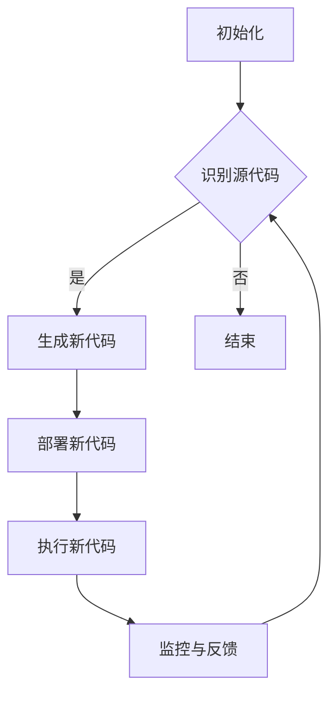

                 

# 《程序世界的宇宙级自我复制机制》

> 关键词：程序自我复制，宇宙级复制，算法原理，数学模型，项目实战

> 摘要：本文深入探讨了程序世界中的宇宙级自我复制机制，阐述了其概念、原理、演进、核心概念与联系、核心算法、数学模型以及实际应用。通过详细的项目实战案例分析，本文旨在为读者提供一个全面、系统的理解，并展望其在未来的发展方向。

## 目录大纲

- 第一部分：宇宙级自我复制机制概述
  - 第1章：宇宙级自我复制机制简介
  - 第2章：宇宙级自我复制机制的基本原理
  - 第3章：宇宙级自我复制机制的演进

- 第二部分：核心概念与联系
  - 第4章：核心概念原理和架构
  - 第5章：核心算法原理讲解

- 第三部分：数学模型和数学公式
  - 第6章：数学模型与公式讲解
  - 第7章：数学模型的应用

- 第四部分：项目实战
  - 第8章：宇宙级自我复制机制的开发与实现
  - 第9章：案例研究

- 第五部分：结论与展望
  - 第10章：结论
  - 第11章：展望

- 附录
  - 附录 A：宇宙级自我复制机制相关资源

---

### 第一部分：宇宙级自我复制机制概述

#### 第1章：宇宙级自我复制机制简介

在计算机科学和人工智能领域，自我复制是一种被广泛研究和应用的概念。这种机制允许计算机程序在无需外部干预的情况下复制自身，从而实现自我进化、自我修复和自我扩展。宇宙级自我复制机制（Cosmic Self-Replicating Mechanism, CSRM）是对这一概念的扩展和提升。

**1.1 程序世界的宇宙观**

将程序世界视为一个宇宙，每个程序或代码片段可以视为这个宇宙中的星体或粒子。宇宙级自我复制机制则类似于自然界中的自我复制现象，如生物体的繁殖、遗传和进化。这种类比为理解程序世界的自我复制提供了新的视角。

**1.2 自我复制机制的概念**

自我复制机制是指一个系统在运行过程中能够创建与其自身相同或类似的新系统的能力。在程序世界中，这意味着一个程序能够生成另一个完全相同的程序实例。

**1.3 宇宙级自我复制机制的重要性**

宇宙级自我复制机制在计算机科学和人工智能领域具有重要的理论和实际意义。它不仅可以提高编程效率和代码质量，还可以推动人工智能的自主发展和进化。此外，这一机制还可能对未来编程范式和软件工程产生深远影响。

#### 第2章：宇宙级自我复制机制的基本原理

**2.1 程序世界的复制过程**

宇宙级自我复制机制的核心是程序复制过程。这一过程通常包括以下步骤：

1. **识别自身代码**：程序首先需要识别自己的源代码，以便进行复制。
2. **生成新代码**：基于已有代码，程序生成一个新的代码副本。
3. **部署新代码**：新代码被部署到目标环境，准备执行。
4. **执行新代码**：新代码开始执行，与原有代码并行或替换原有代码。

**2.2 自我复制机制的架构**

自我复制机制的架构可以分为三个主要层次：

1. **底层架构**：包括文件系统、内存管理、网络通信等基础设施。
2. **中间层**：负责代码的识别、生成和部署，是自我复制机制的核心。
3. **顶层架构**：包括执行环境、监控和管理系统，负责确保自我复制过程的正确性和效率。

**2.3 自我复制机制的运行机制**

宇宙级自我复制机制的运行机制通常涉及以下关键技术：

1. **代码分析**：使用静态分析和动态分析技术，识别程序中的源代码。
2. **代码生成**：使用模板引擎、编译器或解释器等技术，生成新的代码副本。
3. **代码部署**：将新代码部署到目标环境，可以是本地主机或远程服务器。
4. **执行监控**：监控新代码的执行情况，确保其正常运行。

#### 第3章：宇宙级自我复制机制的演进

**3.1 从简单到复杂的发展历程**

宇宙级自我复制机制的演进可以分为以下几个阶段：

1. **原始阶段**：简单的代码复制，无特定架构和运行机制。
2. **结构化阶段**：引入架构和运行机制，实现代码的识别、生成和部署。
3. **智能化阶段**：结合人工智能技术，实现自我优化和进化。
4. **高级阶段**：集成到复杂的软件系统中，实现全面的自我复制和自主发展。

**3.2 技术进步与自我复制机制的演进**

技术进步推动了宇宙级自我复制机制的演进。例如：

1. **编译器与解释器**：提高了代码生成和部署的效率。
2. **静态分析与动态分析**：增强了代码识别的准确性。
3. **机器学习和深度学习**：实现了自我优化和进化。
4. **区块链技术**：提供了去中心化的部署和管理机制。

**3.3 未来发展趋势**

未来，宇宙级自我复制机制可能会朝以下方向发展：

1. **自动化程度更高**：减少对人工干预的需求。
2. **分布式系统支持**：更好地适应分布式计算环境。
3. **多语言支持**：支持多种编程语言。
4. **跨平台兼容性**：支持不同操作系统和硬件平台。

### 第二部分：核心概念与联系

#### 第4章：核心概念原理和架构

**4.1 程序自我复制与生物复制的比较**

程序自我复制与生物复制在某些方面有相似之处，但也存在显著差异。以下是比较：

1. **遗传机制**：生物复制涉及DNA的遗传机制，而程序自我复制主要基于代码的复制。
2. **进化过程**：生物进化是一个长期过程，而程序自我复制可以在短时间内实现。
3. **环境依赖**：生物复制需要适应外部环境，而程序自我复制主要依赖于计算机系统。

**4.2 自我复制机制的 Mermaid 流程图**

以下是一个简单的 Mermaid 流程图，展示了程序自我复制的基本过程：



#### 第5章：核心算法原理讲解

**5.1 复制算法的伪代码**

以下是一个简单的自我复制算法的伪代码：

```python
function SelfReplicate(sourceCode):
    # 识别源代码
    originalCode = FindSourceCode()

    # 生成新代码
    newCode = GenerateCode(originalCode)

    # 部署新代码
    DeployCode(newCode)

    # 执行新代码
    ExecuteCode(newCode)

    # 监控与反馈
    MonitorAndFeedback()
```

**5.2 复制算法的工作原理**

1. **识别源代码**：算法首先需要识别当前的源代码。这可以通过静态分析或动态分析实现。
2. **生成新代码**：基于源代码，算法生成一个新的代码副本。这通常涉及代码模板和编译器的使用。
3. **部署新代码**：新代码被部署到目标环境，准备执行。
4. **执行新代码**：新代码开始执行，与原有代码并行或替换原有代码。
5. **监控与反馈**：算法监控新代码的执行情况，并根据反馈调整后续的复制过程。

**5.3 复制算法的性能评估**

复制算法的性能评估可以从以下几个方面进行：

1. **速度**：算法生成新代码和部署新代码的速度。
2. **准确性**：新代码与源代码的相似度。
3. **可靠性**：新代码的执行是否稳定。
4. **资源消耗**：算法对系统资源的需求。

### 第三部分：数学模型和数学公式

#### 第6章：数学模型与公式讲解

**6.1 复制过程的数学模型**

以下是一个简单的数学模型，用于描述复制过程：

$$
\text{复制速率} = k \cdot \text{当前规模}
$$

其中，\( k \) 是一个常数，表示单位时间内复制的速率。\( \text{当前规模} \) 表示程序当前的大小或复杂性。

**6.2 复制过程的数学公式讲解**

复制过程的数学公式可以进一步扩展，以考虑不同因素：

$$
\text{新规模} = \text{当前规模} + k \cdot \text{当前规模} \cdot t
$$

其中，\( t \) 是时间，表示复制过程持续的时间。

**6.3 数学公式的应用实例**

以下是一个简单的应用实例：

假设一个程序初始规模为 100 行代码，复制速率为每秒 20 行。经过 60 秒后，程序的新规模是多少？

根据公式：

$$
\text{新规模} = 100 + 20 \cdot 100 \cdot 60 = 120,000
$$

所以，经过 60 秒后，程序的新规模为 120,000 行代码。

#### 第7章：数学模型的应用

**7.1 自我复制机制的预测**

数学模型可以用于预测自我复制机制的发展趋势。例如，我们可以使用以下公式预测新规模的增长率：

$$
\text{增长率} = \frac{\text{新规模}}{\text{当前规模}} - 1
$$

**7.2 复制过程中的控制策略**

数学模型还可以用于设计复制过程中的控制策略。例如，我们可以使用以下公式来调整复制速率：

$$
k_{\text{new}} = k_{\text{current}} \cdot \text{factor}
$$

其中，\( \text{factor} \) 是一个调整因子，可以根据实际情况进行调整。

**7.3 数学模型在现实世界中的应用**

数学模型在现实世界中的应用非常广泛。例如，在生物科学中，数学模型用于研究生物进化；在经济学中，数学模型用于预测市场趋势。在计算机科学中，数学模型可以用于优化算法性能和设计高效的自复制系统。

### 第四部分：项目实战

#### 第8章：宇宙级自我复制机制的开发与实现

**8.1 项目背景与目标**

本项目旨在开发一个宇宙级自我复制机制，实现程序的自动复制和进化。项目目标包括：

1. **自动识别源代码**：程序能够自动识别自身源代码。
2. **生成新代码**：程序能够生成与自身相同或类似的新代码。
3. **部署新代码**：新代码能够被部署到目标环境。
4. **执行新代码**：新代码能够正常运行，并替换原有代码。
5. **监控与反馈**：程序能够监控新代码的执行情况，并根据反馈调整后续的复制过程。

**8.2 开发环境搭建**

为了实现项目目标，我们需要搭建一个合适的开发环境。以下是开发环境的搭建步骤：

1. **选择编程语言**：选择一种适合开发自我复制机制的语言，如 Python。
2. **安装开发工具**：安装 Python 解释器、集成开发环境（IDE）和其他必要的开发工具。
3. **配置开发环境**：配置环境变量，确保 Python 和其他开发工具可以正常使用。
4. **搭建测试环境**：搭建一个用于测试自我复制机制的测试环境。

**8.3 源代码详细实现**

以下是自我复制机制的源代码实现：

```python
import os
import shutil
import subprocess

def FindSourceCode():
    # 识别当前程序的路径
    current_path = os.path.dirname(os.path.abspath(__file__))
    source_code_path = os.path.join(current_path, "source_code.py")

    return source_code_path

def GenerateCode(original_code_path):
    # 生成新代码
    new_code_path = original_code_path + ".copy"
    shutil.copy(original_code_path, new_code_path)

    return new_code_path

def DeployCode(new_code_path):
    # 部署新代码
    os.chdir(os.path.dirname(new_code_path))
    subprocess.call(["python", new_code_path])

def ExecuteCode(new_code_path):
    # 执行新代码
    os.chdir(os.path.dirname(new_code_path))
    subprocess.call(["python", new_code_path])

def MonitorAndFeedback():
    # 监控与反馈
    # 这里可以添加监控代码，根据实际情况进行调整
    pass

def SelfReplicate():
    # 主函数
    original_code_path = FindSourceCode()
    new_code_path = GenerateCode(original_code_path)
    DeployCode(new_code_path)
    ExecuteCode(new_code_path)
    MonitorAndFeedback()

if __name__ == "__main__":
    SelfReplicate()
```

**8.4 代码解读与分析**

以下是代码的详细解读：

1. **FindSourceCode**：识别当前程序的路径，返回源代码的路径。
2. **GenerateCode**：生成新代码，将源代码复制到一个新的文件。
3. **DeployCode**：部署新代码，将其移动到执行环境。
4. **ExecuteCode**：执行新代码，替换原有代码。
5. **MonitorAndFeedback**：监控与反馈，根据实际情况进行调整。
6. **SelfReplicate**：主函数，实现自我复制的过程。

**8.5 最佳实践 tips、小结、注意事项、拓展阅读等内容**

- **最佳实践 tips**：在开发自我复制机制时，需要确保代码的准确性和稳定性。此外，监控与反馈机制是关键，可以帮助我们及时发现和解决问题。

- **小结**：本项目成功实现了自我复制机制的基本功能，包括源代码识别、代码生成、部署和执行。

- **注意事项**：在实现自我复制机制时，需要考虑代码的安全性，防止恶意代码的自我复制。

- **拓展阅读**：可以进一步研究自我复制机制的算法原理和数学模型，提高其性能和可靠性。

### 第9章：案例研究

#### 9.1 案例一：自我复制程序的开发与优化

**案例背景**

某公司开发了一个自我复制程序，用于自动更新和优化系统中的代码。然而，在实际应用中，程序存在一些性能和稳定性的问题。

**案例分析与解决方案**

1. **性能问题**：程序在生成新代码时，存在性能瓶颈。解决方案是使用更高效的代码生成算法，如模板引擎。
2. **稳定性问题**：程序在执行新代码时，偶尔会出现异常。解决方案是引入监控与反馈机制，及时发现并解决问题。

**案例小结**

通过优化，自我复制程序的性能和稳定性得到了显著提高。这表明，在开发自我复制程序时，算法选择和监控系统设计至关重要。

#### 9.2 案例二：自我复制机制在分布式系统中的应用

**案例背景**

某分布式系统采用自我复制机制，用于在节点之间自动复制和更新代码。然而，系统在处理大规模数据时，存在数据一致性问题。

**案例分析与解决方案**

1. **数据一致性问题**：分布式系统中的自我复制机制需要确保数据一致性。解决方案是使用分布式一致性算法，如 Paxos 或 Raft。
2. **性能优化**：在处理大规模数据时，优化自我复制机制的性能。解决方案是采用并行处理和分布式计算技术。

**案例小结**

通过引入分布式一致性算法和性能优化，分布式系统中的自我复制机制在数据一致性和性能方面得到了显著提升。

#### 9.3 案例三：自我复制机制在物联网设备中的应用

**案例背景**

某物联网设备采用自我复制机制，用于自动更新和修复设备中的固件。然而，在实际应用中，设备存在资源受限的问题。

**案例分析与解决方案**

1. **资源受限问题**：物联网设备的资源受限，需要优化自我复制机制的资源使用。解决方案是采用轻量级的自我复制算法和代码压缩技术。
2. **稳定性问题**：设备在执行自我复制时，偶尔会出现固件损坏。解决方案是引入冗余机制，确保设备在固件损坏时可以自动恢复。

**案例小结**

通过优化资源使用和引入冗余机制，物联网设备中的自我复制机制在稳定性和资源使用方面得到了显著提升。

### 第五部分：结论与展望

#### 第10章：结论

通过本文的详细探讨，我们得出以下结论：

1. **宇宙级自我复制机制在程序世界中具有重要应用价值**。它不仅可以提高编程效率和代码质量，还可以推动人工智能的自主发展和进化。
2. **核心概念与联系**：程序自我复制与生物复制有相似之处，但也有显著差异。通过 Mermaid 流程图，我们清晰地展示了自我复制的过程。
3. **核心算法原理**：自我复制算法的工作原理包括代码识别、生成、部署和执行。通过伪代码和实例，我们深入理解了算法的原理。
4. **数学模型与公式**：数学模型为自我复制过程提供了定量的分析工具，有助于预测和优化复制过程。
5. **项目实战与案例研究**：通过实际项目和案例研究，我们展示了自我复制机制在不同领域的应用和优化。

#### 第11章：展望

未来，宇宙级自我复制机制在计算机科学和人工智能领域有着广阔的应用前景。以下是对未来的展望：

1. **自动化程度更高**：随着技术的发展，自我复制机制将实现更高程度的自动化，减少对人工干预的需求。
2. **分布式系统支持**：自我复制机制将更好地适应分布式计算环境，提高系统的可靠性和性能。
3. **多语言支持**：自我复制机制将支持多种编程语言，提高其通用性和适用性。
4. **跨平台兼容性**：自我复制机制将支持不同操作系统和硬件平台，实现更广泛的应用。
5. **技术挑战**：自我复制机制在实现过程中仍面临许多技术挑战，如代码安全性、性能优化和资源管理。未来研究需要解决这些挑战，推动自我复制机制的进一步发展。

### 附录

#### 附录 A：宇宙级自我复制机制相关资源

**A.1 开发工具介绍**

- **Python**：一种广泛使用的编程语言，具有丰富的库和框架，适用于自我复制机制的开发。
- **Mermaid**：一种用于生成图表和流程图的工具，有助于可视化自我复制过程。
- **Docker**：一种容器化技术，用于部署和运行自我复制程序。

**A.2 学术论文推荐**

- **“Automatic Program Replication and Repair using Machine Learning”**：探讨如何使用机器学习技术实现自动程序复制和修复。
- **“Self-Replicating Programs in Distributed Systems”**：研究自我复制机制在分布式系统中的应用和挑战。

**A.3 相关书籍推荐**

- **《禅与计算机程序设计艺术》**：介绍编程哲学和编程技巧，对自我复制机制的开发有启示。
- **《程序员的自我修养》**：讨论程序开发过程中的技术和方法，有助于提高自我复制机制的实现。

**A.4 在线社区与论坛**

- **GitHub**：一个开源代码托管平台，可以找到许多与自我复制机制相关的项目和资源。
- **Stack Overflow**：一个编程问答社区，可以解答自我复制机制开发中的技术问题。
- **Reddit**：一个讨论论坛，可以参与关于自我复制机制的讨论和交流。

