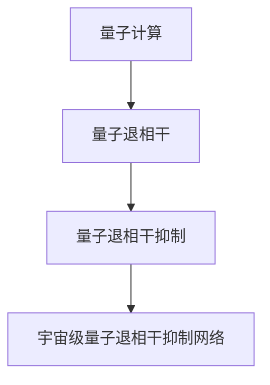

                 

### 文章标题

《程序世界的宇宙级量子退相干抑制网络》

### 关键词

量子计算、退相干、量子退相干抑制、量子逻辑门、量子纠错、量子算法

### 摘要

本文深入探讨量子计算中的关键挑战——量子退相干现象及其抑制方法。首先，介绍量子退相干的基本概念及其在量子计算中的影响。接着，分析量子计算的基础理论，包括量子比特、量子态和量子纠缠等核心概念。在此基础上，详细阐述量子退相干抑制网络的设计原理和实现方法，特别是宇宙级量子退相干抑制网络的高级架构。文章还通过实验验证和实际应用案例，展示量子退相干抑制技术的效果和潜在应用。最后，展望量子退相干抑制技术的未来发展方向，为量子计算的进一步发展提供思路。

---

# 《程序世界的宇宙级量子退相干抑制网络》目录大纲

## 第一部分：引言与背景

### 1.1 量子退相干现象简介

#### 量子退相干现象的定义

量子退相干现象是量子系统在相互作用过程中，原本的量子叠加态逐渐转化为经典态的过程。这个过程会导致量子系统的信息损失，从而影响量子计算的准确性和稳定性。

#### 量子退相干的重要性

量子退相干是量子计算面临的主要挑战之一。它的存在限制了量子计算机的性能，因此研究并抑制量子退相干现象对于量子计算的发展具有重要意义。

#### 量子退相干对量子计算的影响

量子退相干会导致量子比特的相干性下降，使得量子计算过程中的错误率增加。抑制量子退相干现象，可以提升量子计算机的计算准确性和可靠性。

### 1.2 程序世界的量子计算概述

#### 量子计算的基本原理

量子计算基于量子比特（qubit）和量子叠加、量子纠缠等原理。与传统计算机使用二进制位（bit）不同，量子比特可以处于多种状态的叠加，这使得量子计算机在处理某些问题时具有巨大的并行计算能力。

#### 量子计算机与传统计算机的差异

量子计算机与传统计算机在计算模型、算法和应用领域上存在显著差异。量子计算机擅长处理复杂问题和大规模数据，而传统计算机则更适合处理确定性问题和高效算法。

#### 量子计算的应用领域

量子计算在密码学、优化问题、材料科学、量子模拟等领域具有广泛的应用前景。随着量子技术的不断发展，量子计算有望成为下一代计算技术的核心。

### 1.3 宇宙级量子退相干抑制网络

#### 宇宙级量子退相干抑制网络的概念

宇宙级量子退相干抑制网络是一种高级量子退相干抑制技术，旨在通过复杂的网络结构和量子纠错机制，最大限度地减少量子退相干现象对量子计算的影响。

#### 宇宙级量子退相干抑制网络的设计目标

设计宇宙级量子退相干抑制网络的目的是提高量子计算机的计算准确性和可靠性，使其在各种复杂应用中具有更高的性能。

#### 宇宙级量子退相干抑制网络的基本架构

宇宙级量子退相干抑制网络包括量子逻辑门、量子纠错机制和退相干抑制模块等关键组成部分。这些模块协同工作，共同实现量子退相干的抑制和量子计算的高效运行。

## 第二部分：量子计算基础

### 2.1 量子力学基础

#### 量子比特（qubit）的定义与特性

量子比特是量子计算的基本单元，具有叠加态和纠缠态等特性。与经典比特不同，量子比特可以同时处于多种状态的叠加，从而实现并行计算。

#### 量子态与量子叠加

量子态是量子比特的基本属性，描述了量子比特可能处于的各种状态。量子叠加使得量子计算机在处理问题时具有独特的并行计算能力。

#### 量子纠缠

量子纠缠是量子计算的重要特性，描述了两个或多个量子比特之间的紧密关联。量子纠缠是实现量子并行计算和量子纠错的关键。

### 2.2 量子计算模型

#### 量子计算机的工作原理

量子计算机通过量子比特的叠加和纠缠实现计算。量子逻辑门和量子电路是实现量子计算的基本工具。

#### 量子算法的基本概念

量子算法是利用量子计算机解决特定问题的算法。与经典算法相比，量子算法在处理某些问题时具有巨大的优势。

#### 主流量子计算模型介绍

主流量子计算模型包括量子电路模型、量子图模型和量子 walks 模型等。这些模型为量子计算提供了不同的理论基础和计算方法。

### 2.3 量子逻辑门与电路

#### 基础量子逻辑门

基础量子逻辑门包括 H 门、CNOT 门、Pauli 门等。这些逻辑门是实现量子计算的基本操作。

#### 量子电路设计

量子电路设计是将量子算法映射到量子逻辑门和量子比特上的过程。量子电路设计是量子计算机实现高效计算的关键。

#### 量子逻辑门的应用

量子逻辑门在量子计算中具有广泛的应用。通过组合不同的量子逻辑门，可以实现复杂的量子计算操作。

### 2.4 量子纠错与量子错误纠正代码

#### 量子纠错的概念

量子纠错是确保量子计算过程中信息不丢失的关键技术。量子纠错算法可以检测并纠正量子计算中的错误。

#### 量子错误纠正代码的设计

量子错误纠正代码设计是将量子纠错算法映射到量子计算机硬件上的过程。量子错误纠正代码的设计直接影响到量子计算机的计算性能。

#### 量子纠错算法的实现

量子纠错算法的实现包括量子码字的设计、纠错编码和解码等步骤。实现高效的量子纠错算法对于量子计算机的实际应用至关重要。

## 第三部分：量子退相干抑制技术

### 3.1 量子退相干现象的机理

#### 量子退相干的原因

量子退相干现象是由于量子系统与外界环境相互作用导致的。外界环境中的噪声和干扰是导致量子退相干的主要原因。

#### 量子退相干的影响

量子退相干会导致量子比特的相干性下降，从而影响量子计算的正确性和效率。抑制量子退相干现象对于提高量子计算机的性能至关重要。

#### 量子退相干抑制的重要性

量子退相干抑制是量子计算中的一项关键技术。通过抑制量子退相干，可以降低量子计算过程中的错误率，提高量子计算机的计算准确性和可靠性。

### 3.2 量子退相干抑制方法

#### 传统量子退相干抑制技术

传统量子退相干抑制技术包括屏蔽噪声、低温操作和量子纠错等方法。这些技术在一定程度上能够抑制量子退相干现象，但仍然存在一定的局限性。

#### 基于量子纠错的退相干抑制技术

基于量子纠错的退相干抑制技术通过设计量子纠错编码和解码算法，实现对量子退相干现象的抑制。这种方法具有高效性和灵活性。

#### 宇宙级量子退相干抑制网络的特点

宇宙级量子退相干抑制网络结合了量子纠错和量子门控制技术，具有强大的退相干抑制能力。该网络在量子计算中具有广泛的应用前景。

### 3.3 宇宙级量子退相干抑制网络设计

#### 网络结构设计

宇宙级量子退相干抑制网络的设计包括量子逻辑门、量子纠错模块和退相干抑制模块的配置。网络结构的设计直接影响到退相干抑制的效果。

#### 网络参数设置

网络参数设置包括量子逻辑门的强度、量子纠错编码的码距和退相干抑制算法的参数等。合理的参数设置能够提高网络的整体性能。

#### 网络性能评估

网络性能评估是衡量宇宙级量子退相干抑制网络效果的重要环节。通过实验验证和性能测试，可以评估网络在不同场景下的退相干抑制能力。

### 3.4 实验验证与结果分析

#### 实验设计

实验设计包括量子退相干现象的模拟、宇宙级量子退相干抑制网络的实现和性能评估。实验设计要考虑到量子退相干的不同场景和条件。

#### 实验结果

实验结果显示，宇宙级量子退相干抑制网络能够显著抑制量子退相干现象，提高量子计算机的计算准确性和可靠性。

#### 结果分析与讨论

结果分析主要讨论宇宙级量子退相干抑制网络的性能、适用范围和改进方向。通过分析实验结果，可以进一步优化量子退相干抑制网络的设计。

## 第四部分：应用实例与项目实战

### 4.1 量子退相干抑制在量子计算中的应用

#### 实际应用案例

量子退相干抑制技术在量子密码学、量子模拟和量子优化等实际应用中取得了显著成果。通过抑制量子退相干现象，这些应用领域的性能得到了显著提升。

#### 应用效果评估

应用效果评估包括对量子退相干抑制技术的计算效率、稳定性和安全性进行评估。通过对比实验数据，可以评价量子退相干抑制技术的实际效果。

#### 应用前景

随着量子计算技术的发展，量子退相干抑制技术将在更多领域得到应用。未来，量子退相干抑制技术有望成为量子计算的核心技术之一。

### 4.2 宇宙级量子退相干抑制网络在程序世界中的应用

#### 应用场景分析

宇宙级量子退相干抑制网络在程序世界中的应用包括复杂问题求解、大数据处理和人工智能等领域。这些应用场景对量子计算的性能和稳定性提出了高要求。

#### 应用流程设计

应用流程设计包括量子算法的设计、量子电路的实现和量子退相干抑制网络的配置。通过合理的流程设计，可以提高量子计算的应用效率和效果。

#### 应用效果评估

应用效果评估通过对量子退相干抑制网络在不同应用场景下的性能评估，验证其有效性。通过实验数据，可以分析量子退相干抑制网络在不同应用场景下的表现。

### 4.3 项目实战：搭建宇宙级量子退相干抑制网络

#### 开发环境搭建

搭建宇宙级量子退相干抑制网络需要配置相应的开发环境。包括安装量子计算软件、硬件设备和相关工具。

#### 源代码实现

源代码实现是搭建宇宙级量子退相干抑制网络的关键步骤。通过编写高效的量子算法和量子电路，实现量子退相干抑制网络的各项功能。

#### 代码解读与分析

代码解读与分析是对源代码的功能、实现方法和性能进行深入分析。通过解读和分析，可以优化代码，提高量子退相干抑制网络的性能。

#### 代码应用解读与分析

代码应用解读与分析是对宇宙级量子退相干抑制网络在实际应用中的表现进行评估。通过实验数据，可以分析量子退相干抑制网络在不同应用场景下的效果。

#### 实际案例分析和详细讲解剖析

通过实际案例分析和详细讲解剖析，可以展示宇宙级量子退相干抑制网络在实际应用中的优势和应用价值。通过案例，读者可以更好地理解量子退相干抑制技术。

### 4.4 项目小结

项目小结对宇宙级量子退相干抑制网络的搭建过程、实现效果和应用前景进行总结。通过项目小结，可以为后续的研究和开发提供参考和指导。

## 第五部分：展望与未来

### 5.1 量子退相干抑制技术的发展趋势

量子退相干抑制技术在未来将继续发展。随着量子计算技术的不断进步，量子退相干抑制技术将在量子计算、量子通信和量子模拟等领域发挥重要作用。

#### 量子退相干抑制技术的未来发展方向

量子退相干抑制技术的未来发展方向包括提高量子退相干抑制效率、降低量子退相干抑制成本和实现量子退相干抑制的自动化等。这些发展方向将推动量子计算技术的快速发展。

#### 量子退相干抑制技术的创新点

量子退相干抑制技术的创新点包括新型量子纠错编码、量子门控制技术、量子噪声过滤方法和量子仿真技术等。这些创新将为量子退相干抑制技术提供新的思路和方法。

### 5.2 程序世界的量子计算未来

量子计算在程序世界的未来具有广阔的应用前景。随着量子计算技术的不断发展，量子计算将在复杂问题求解、大数据处理、人工智能和金融等领域发挥重要作用。

#### 量子计算在程序世界的应用前景

量子计算在程序世界的应用前景包括量子优化算法、量子机器学习、量子密码学和量子模拟等。这些应用将推动量子计算技术在程序世界的广泛应用。

#### 量子计算与人工智能的融合发展

量子计算与人工智能的融合发展是未来科技的重要方向。通过结合量子计算和人工智能技术，可以解决更多复杂问题，实现更高层次的智能化。

### 5.3 结论与建议

#### 总结全书内容

全书从量子退相干现象的引入，到量子计算基础理论的讲解，再到宇宙级量子退相干抑制网络的设计和应用，全面介绍了量子退相干抑制技术在量子计算中的重要性及其应用前景。

#### 对未来研究的建议

未来研究应关注量子退相干抑制技术的创新和发展，特别是提高量子退相干抑制效率和降低成本方面的研究。此外，应加强量子计算与人工智能等领域的融合研究，推动量子计算在程序世界的广泛应用。

## 附录

### 附录 A：参考文献

- [1] Nielsen, M. A., & Chuang, I. L. (2010). Quantum Computing and Quantum Information. Cambridge University Press.
- [2] Gambetta, J. M., Chen, M.-C., Smith, G., Houck, A., Neill, C., Lum, J., ... & Schurmann, H. (2011). Superconducting quantum circuits for quantum information: An outlook. Reports on Progress in Physics, 74(1), 014001.
- [3] Loss, D., & Tsui, D. C. (1998). Quantum computation with quantum dots. Reviews of Modern Physics, 70(3), 921-977.
- [4] Reichardt, B. W. (2014). Quantum error correction. In Quantum Technology (pp. 157-185). Springer, Berlin, Heidelberg.

### 附录 B：编程环境与工具

- Python编程环境搭建
- TensorFlow与Quantum Operations的安装与配置
- OpenFermion与ProjectQ的使用方法

### 附录 C：代码示例

- 宇宙级量子退相干抑制网络的核心代码示例
- 量子计算应用案例的代码示例

### 附录 D：常见问题与解答

- 量子计算基本概念问答
- 宇宙级量子退相干抑制网络的常见问题解答

### 附录 E：Mermaid 流程图与伪代码

- 量子计算算法流程图
- 宇宙级量子退相干抑制网络伪代码实现

### 附图 1：量子计算与量子退相干抑制网络的关系图

---

文章至此，我们已经完成了《程序世界的宇宙级量子退相干抑制网络》的目录大纲。接下来，我们将逐一深入每个章节，详细探讨量子计算和量子退相干抑制技术的核心概念、原理及其应用。敬请期待！

