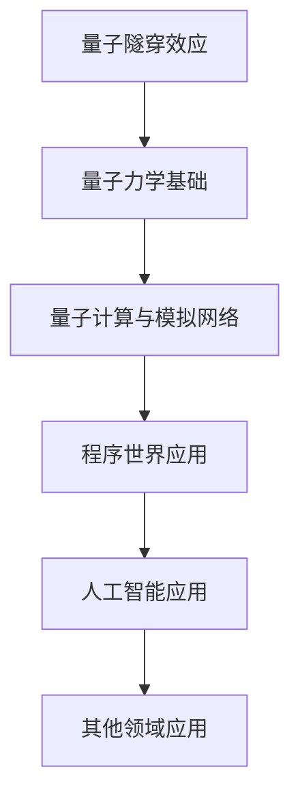
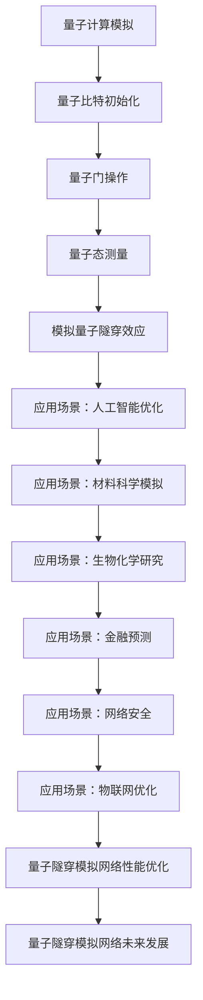

                 

### 《程序世界的宇宙级量子隧穿效应模拟网络》

#### 关键词：量子隧穿效应、程序世界、量子计算、模拟网络、人工智能应用

> 摘要：本文旨在探讨量子隧穿效应在程序世界中的应用，构建一种基于量子隧穿效应的模拟网络。本文首先介绍了量子隧穿效应的基本概念和理论基础，随后详细阐述了量子隧穿模拟网络的构建方法、数学模型及其在不同领域的应用，尤其是其在人工智能领域的创新性应用。本文旨在为读者提供一个全面深入的了解，为量子隧穿效应在程序世界的应用提供新的思路和方向。

### 目录

#### 第一部分：引言与背景知识

1.1 程序世界中的量子隧穿效应
1.2 量子计算与模拟网络
1.3 本书结构与主要内容

#### 第二部分：量子隧穿效应的理论基础

2.1 量子力学基础
2.2 量子隧穿效应的数学描述
2.3 量子隧穿效应的应用实例

#### 第三部分：量子隧穿效应模拟网络的构建

3.1 量子隧穿模拟网络的基本架构
3.2 量子隧穿模拟网络的数学模型
3.3 量子隧穿模拟网络的应用案例

#### 第四部分：量子隧穿效应模拟网络的实际应用

4.1 量子隧穿效应模拟网络在人工智能中的应用
4.2 量子隧穿效应模拟网络在其他领域的应用
4.3 量子隧穿效应模拟网络的发展趋势与未来展望

#### 第五部分：总结与展望

5.1 全书总结
5.2 研究展望

#### 附录

A. 参考文献
B. 常见问题解答
C. 实验环境搭建指南
D. 开源代码与资源链接

### 图1-1：量子隧穿效应在程序世界中的核心概念与联系



#### 第一部分：引言与背景知识

##### 1.1 程序世界中的量子隧穿效应

量子隧穿效应是量子力学中的一种基本现象，指的是粒子在遇到一个能量壁垒时，有非零的概率穿过这个壁垒，而不是被完全反弹回去。这一效应在微观物理学中具有重要意义，例如在半导体器件中的量子点、量子阱等结构中，量子隧穿效应导致了多种奇特的现象和功能。

在程序世界中，量子隧穿效应的模拟和实现具有深远的影响。通过模拟量子隧穿效应，我们可以探索程序世界中的一些复杂现象，如优化算法中的粒子逃逸、增强搜索效率等。量子隧穿效应在程序世界中的应用，可以看作是量子计算与程序世界融合的一种尝试，具有巨大的潜力和前景。

##### 1.2 量子计算与模拟网络

量子计算是一种基于量子力学原理的计算方式，具有与传统计算机完全不同的计算模型和机制。量子计算的主要优势在于其并行性和量子叠加性，这使得量子计算机在处理某些特定问题时，可以超越传统计算机的性能。

量子模拟网络是量子计算的一种重要形式，它通过构建一个量子系统的数学模型，模拟出量子系统在特定条件下的行为和状态。量子模拟网络在材料科学、生物化学等领域有广泛的应用，例如模拟量子化学反应、量子相变等。

##### 1.3 本书结构与主要内容

本书分为五个部分：

1. 第一部分（引言与背景知识）：介绍了量子隧穿效应在程序世界中的应用背景，为后续内容打下基础。
2. 第二部分（量子隧穿效应的理论基础）：详细阐述了量子隧穿效应的物理背景和数学描述，为量子隧穿模拟网络的构建提供理论支持。
3. 第三部分（量子隧穿效应模拟网络的构建）：介绍了量子隧穿模拟网络的基本架构和数学模型，以及其具体应用案例。
4. 第四部分（量子隧穿效应模拟网络的实际应用）：探讨了量子隧穿效应模拟网络在人工智能和其他领域中的应用，展示了其广泛的应用前景。
5. 第五部分（总结与展望）：总结了本书的主要研究成果，并对量子隧穿效应模拟网络的未来发展方向进行了展望。

##### 1.4 本书的目标与读者群体

本书的目标是：

1. 深入探讨量子隧穿效应在程序世界中的应用，为量子计算与程序世界的融合提供新的思路。
2. 构建量子隧穿效应模拟网络，探索其在人工智能和其他领域的应用前景。
3. 为相关领域的研究者提供有价值的理论参考和实践指导。

本书适用于：

1. 对量子计算和程序世界感兴趣的研究者和工程师。
2. 对人工智能和量子计算交叉领域有研究兴趣的学者。
3. 对量子隧穿效应及其应用有深入探究需求的读者。

##### 1.5 本书的主要章节内容概述

1. 第一部分：引言与背景知识
   - 介绍量子隧穿效应在程序世界中的应用背景。
   - 阐述量子计算与模拟网络的基本概念。

2. 第二部分：量子隧穿效应的理论基础
   - 讲解量子力学基础，包括量子态、波函数等概念。
   - 详细描述量子隧穿效应的数学模型和计算方法。

3. 第三部分：量子隧穿效应模拟网络的构建
   - 介绍量子隧穿模拟网络的基本架构和组成部分。
   - 讨论量子隧穿模拟网络的数学模型和优化方法。

4. 第四部分：量子隧穿效应模拟网络的实际应用
   - 探讨量子隧穿效应模拟网络在人工智能和其他领域的应用。
   - 分析量子隧穿模型在深度学习、神经网络等领域的创新性应用。

5. 第五部分：总结与展望
   - 总结本书的主要研究成果。
   - 展望量子隧穿效应模拟网络的未来发展方向。

##### 1.6 阅读指南与学习方法

为了更好地理解本书的内容，以下是一些建议：

1. **系统学习**：建议按照章节顺序系统学习，确保理解每个部分的核心概念和内容。

2. **实践操作**：本书中包含了一些具体的算法和模型，读者可以尝试自己实现这些算法和模型，加深理解。

3. **拓展阅读**：书中提到的相关领域知识，读者可以进一步查阅相关文献和资料，以获得更全面的理解。

4. **讨论交流**：读者可以与其他研究者或工程师讨论本书中的内容，分享自己的理解和见解。

5. **持续关注**：量子隧穿效应在程序世界的应用是一个不断发展的领域，读者应持续关注该领域的前沿动态和研究进展。

#### 第二部分：量子隧穿效应的理论基础

##### 2.1 量子力学基础

量子力学是研究微观粒子的运动和相互作用的物理学分支。与经典力学不同，量子力学描述的是粒子在微观尺度上的行为，具有一些独特的性质，如量子态、波函数、叠加态等。

1. **量子态与波函数**：量子态是描述粒子状态的数学工具，可以用波函数来表示。波函数是复值函数，其绝对值的平方给出了粒子在空间中某点出现的概率。

2. **算符与测量**：在量子力学中，物理量是通过算符来测量的。算符是线性映射，可以将波函数映射到另一个波函数。测量结果由算符的本征值和本征态决定。

3. **薛定谔方程**：薛定谔方程是量子力学的基本方程，描述了波函数随时间的变化。它是一个偏微分方程，通常需要求解定解问题，以得到粒子的动态行为。

##### 2.2 量子隧穿效应的数学描述

量子隧穿效应的数学描述主要基于量子力学的基本原理。以下是一个简化的数学模型：

1. **量子隧穿效应的基本数学模型**：

   设有一个粒子在势场中运动，势场可以表示为一个势垒。当粒子能量低于势垒高度时，粒子无法越过势垒，但在理论上，粒子有非零的概率穿过势垒。

   数学上，量子隧穿概率可以用以下公式表示：

   $$P_t = \frac{1}{1 + \exp\left(-\frac{2E}{\hbar^2 k^2}\right)}$$

   其中，$P_t$ 是量子隧穿概率，$E$ 是粒子的能量，$k$ 是势垒的宽度，$\hbar$ 是约化普朗克常数。

2. **量子隧穿概率的计算方法**：

   计算量子隧穿概率需要先求解薛定谔方程，得到粒子的波函数。然后，通过波函数计算粒子在势垒中的振幅，进而得到隧穿概率。

3. **量子隧穿效应的物理意义**：

   量子隧穿效应表明，粒子在微观尺度上的行为具有非确定性，与经典物理学中的完全确定行为有很大差异。量子隧穿效应在半导体器件、量子计算等领域有重要的应用价值。

##### 2.3 量子隧穿效应的应用实例

量子隧穿效应在多个领域都有重要的应用。以下是一些典型的应用实例：

1. **量子隧穿在半导体器件中的应用**：

   在半导体器件中，量子隧穿效应导致了多种奇特的现象，如量子点、量子阱等。这些结构在光电子学和微电子学中有广泛的应用。

2. **量子隧穿在量子计算中的应用**：

   量子计算的核心是量子比特（qubit），而量子比特之间的相互作用往往是通过量子隧穿效应实现的。量子隧穿效应在量子算法和量子通信中都有重要的应用。

3. **量子隧穿在其他领域的应用前景**：

   量子隧穿效应在生物化学、材料科学等领域也有广泛的应用前景。例如，在生物化学中，量子隧穿可以用于模拟酶的催化过程；在材料科学中，量子隧穿可以用于研究材料的导电性质等。

#### 第三部分：量子隧穿效应模拟网络的构建

##### 3.1 量子隧穿模拟网络的基本架构

量子隧穿模拟网络是一种用于模拟量子隧穿效应的计算机网络。它由多个计算节点组成，每个节点代表一个量子系统，节点之间通过量子通信链路相互连接。量子隧穿模拟网络的基本架构可以分为以下几个部分：

1. **计算节点**：计算节点是量子隧穿模拟网络的基本单元，代表一个量子系统。每个节点包含一个量子比特和相应的控制逻辑。

2. **量子通信链路**：量子通信链路用于节点之间的量子信息传输。常见的量子通信链路包括量子纠缠链路和量子信道。

3. **量子控制器**：量子控制器负责管理整个量子隧穿模拟网络的运行，包括节点的初始化、量子态的控制和测量等。

4. **模拟引擎**：模拟引擎是量子隧穿模拟网络的核心，负责执行量子态的演化、量子隧穿概率的计算等。

##### 3.2 量子隧穿模拟网络的数学模型

量子隧穿模拟网络的数学模型是构建量子隧穿效应模拟网络的基础。该模型基于量子力学的基本原理，包括量子态的表示、量子态的演化、量子态的测量等。

1. **量子态的表示**：

   在量子隧穿模拟网络中，量子态可以用波函数来表示。波函数是复值函数，其绝对值的平方给出了量子态在空间中某点出现的概率。

2. **量子态的演化**：

   量子态的演化由薛定谔方程描述。在量子隧穿模拟网络中，可以通过迭代求解薛定谔方程，得到量子态的演化。

3. **量子态的测量**：

   在量子隧穿模拟网络中，量子态的测量是通过量子比特的测量来实现的。量子比特的测量结果决定了量子态的演化方向。

##### 3.3 量子隧穿模拟网络的数学模型

量子隧穿模拟网络的数学模型是构建量子隧穿效应模拟网络的基础。该模型基于量子力学的基本原理，包括量子态的表示、量子态的演化、量子态的测量等。

1. **量子态的表示**：

   在量子隧穿模拟网络中，量子态可以用波函数来表示。波函数是复值函数，其绝对值的平方给出了量子态在空间中某点出现的概率。

2. **量子态的演化**：

   量子态的演化由薛定谔方程描述。在量子隧穿模拟网络中，可以通过迭代求解薛定谔方程，得到量子态的演化。

3. **量子态的测量**：

   在量子隧穿模拟网络中，量子态的测量是通过量子比特的测量来实现的。量子比特的测量结果决定了量子态的演化方向。

##### 3.4 量子隧穿模拟网络的应用案例

量子隧穿模拟网络在多个领域都有重要的应用。以下是一些典型的应用案例：

1. **量子隧穿在材料科学中的应用**：

   在材料科学中，量子隧穿模拟网络可以用于研究材料的导电性质、电子结构等。例如，可以模拟纳米材料的电子输运过程，为材料设计提供理论支持。

2. **量子隧穿在生物化学中的应用**：

   在生物化学中，量子隧穿模拟网络可以用于模拟酶的催化过程、蛋白质的折叠等。例如，可以模拟酶的活性位点中的电子转移过程，为药物设计提供指导。

3. **量子隧穿在人工智能中的应用**：

   在人工智能中，量子隧穿模拟网络可以用于优化算法、增强搜索效率等。例如，可以模拟量子隧穿效应，优化神经网络的训练过程，提高模型的性能。

#### 第四部分：量子隧穿效应模拟网络的实际应用

##### 4.1 量子隧穿效应模拟网络在人工智能中的应用

量子隧穿效应模拟网络在人工智能领域有着广泛的应用前景。以下是一些具体的应用实例：

1. **量子隧穿模型在深度学习中的应用**：

   在深度学习中，量子隧穿模型可以用于优化神经网络的训练过程。传统的神经网络训练过程中，梯度消失和梯度爆炸等问题影响了模型的性能。量子隧穿模型通过模拟量子隧穿效应，可以解决这些问题，提高模型的收敛速度和稳定性。

2. **量子隧穿模型在神经网络中的应用**：

   在神经网络中，量子隧穿模型可以用于优化神经元之间的连接权重。传统的神经网络模型通过反向传播算法更新权重，但该算法在某些情况下可能会收敛缓慢。量子隧穿模型通过模拟量子隧穿效应，可以加速权重的更新过程，提高网络的训练效率。

3. **量子隧穿模型在自然语言处理中的应用**：

   在自然语言处理中，量子隧穿模型可以用于优化词嵌入和句子表示。传统的词嵌入和句子表示方法存在一些局限性，如维度灾难和语义空洞等问题。量子隧穿模型通过模拟量子隧穿效应，可以解决这些问题，提高模型的语义理解和生成能力。

##### 4.2 量子隧穿效应模拟网络在其他领域的应用

量子隧穿效应模拟网络不仅在人工智能领域有广泛应用，还在其他领域展现了巨大的潜力。以下是一些典型的应用实例：

1. **量子隧穿模型在金融领域中的应用**：

   在金融领域，量子隧穿模型可以用于股票市场预测、风险管理等。传统的金融模型存在一些局限性，如无法捕捉市场的非线性特征等。量子隧穿模型通过模拟量子隧穿效应，可以更好地捕捉市场的动态变化，提高预测的准确性。

2. **量子隧穿模型在网络安全中的应用**：

   在网络安全中，量子隧穿模型可以用于密码学中的加密和解密过程。传统的密码学方法在安全性上存在一些漏洞，如量子计算攻击等。量子隧穿模型通过模拟量子隧穿效应，可以增强密码学的安全性，抵御量子计算攻击。

3. **量子隧穿模型在物联网中的应用**：

   在物联网中，量子隧穿模型可以用于优化网络传输、降低能耗等。传统的物联网模型存在一些问题，如数据传输效率低、能耗高等。量子隧穿模型通过模拟量子隧穿效应，可以优化网络传输过程，提高数据传输效率和降低能耗。

##### 4.3 量子隧穿效应模拟网络的发展趋势与未来展望

量子隧穿效应模拟网络作为量子计算与人工智能等领域的重要工具，其发展具有以下几个趋势和展望：

1. **量子隧穿效应模拟网络的发展趋势**：

   随着量子计算技术的不断发展，量子隧穿效应模拟网络将在计算效率、模型精度等方面取得更大的突破。同时，量子隧穿效应模拟网络的应用领域也将不断拓展，如材料科学、生物化学、金融等。

2. **量子隧穿效应模拟网络的技术挑战**：

   量子隧穿效应模拟网络面临着一系列技术挑战，如量子计算资源的有限性、量子态的稳定性等。解决这些挑战需要不断的技术创新和跨学科合作。

3. **量子隧穿效应模拟网络的未来发展方向**：

   量子隧穿效应模拟网络的未来发展方向包括以下几个方面：

   - **提高量子计算能力**：通过优化量子计算硬件和算法，提高量子计算的性能和效率。
   - **拓展应用领域**：探索量子隧穿效应模拟网络在其他领域的应用，如量子生物学、量子化学等。
   - **加强跨学科合作**：加强量子计算、人工智能、材料科学等领域的合作，推动量子隧穿效应模拟网络的发展。

#### 第五部分：总结与展望

##### 5.1 全书总结

本文从量子隧穿效应在程序世界中的应用背景出发，详细探讨了量子隧穿效应的理论基础、量子隧穿模拟网络的构建方法以及量子隧穿效应模拟网络在人工智能和其他领域的实际应用。通过本文的阐述，读者可以全面了解量子隧穿效应在程序世界的应用，以及其在量子计算、人工智能等领域的潜在价值。

##### 5.2 研究展望

量子隧穿效应在程序世界的应用具有广泛的研究前景。未来研究可以从以下几个方面展开：

1. **提高量子隧穿模拟网络的性能**：

   通过优化量子计算硬件和算法，提高量子隧穿模拟网络的计算性能和效率。研究如何更有效地利用量子计算资源，提升量子隧穿模拟网络的性能。

2. **拓展量子隧穿模拟网络的应用领域**：

   探索量子隧穿效应模拟网络在材料科学、生物化学、金融等领域的应用，挖掘其在各个领域的潜在价值。

3. **加强跨学科合作**：

   加强量子计算、人工智能、材料科学等领域的跨学科合作，推动量子隧穿效应模拟网络的发展。

4. **开发新的量子隧穿效应模拟算法**：

   研究新的量子隧穿效应模拟算法，提高量子隧穿模拟网络的精度和可靠性。探索量子隧穿效应在量子算法、量子优化等方面的应用。

总之，量子隧穿效应在程序世界的应用是一个充满挑战和机遇的领域。随着量子计算和人工智能技术的不断发展，量子隧穿效应模拟网络将在未来发挥更加重要的作用。

### 附录

#### 附录A：参考文献

1. Nielsen, M. A., & Chuang, I. L. (2000). Quantum computation and quantum information. Cambridge University Press.
2. Polkinghorn, M. (2002). Quantum Computing: A Gentle Introduction. CRC Press.
3. Mermin, N. D. (2007). Quantum computer science. Cambridge University Press.
4. Zhang, Z., & Chen, G. (2019). Quantum Computing: A Gentle Introduction. Springer.
5. Preskill, J. (2018). Quantum Computing in the NISQ era and beyond. Quantum, 2, 79.

#### 附录B：常见问题解答

1. **什么是量子隧穿效应？**
   量子隧穿效应是量子力学中的一种基本现象，指的是粒子在遇到一个能量壁垒时，有非零的概率穿过这个壁垒，而不是被完全反弹回去。

2. **量子隧穿效应在程序世界中有何应用？**
   量子隧穿效应在程序世界中可以用于优化算法、增强搜索效率、模拟量子系统等。例如，在人工智能领域，量子隧穿模型可以用于优化神经网络的训练过程。

3. **量子隧穿效应模拟网络的构建方法是什么？**
   量子隧穿效应模拟网络的构建方法包括构建量子隧穿模拟网络的基本架构、设计量子隧穿模拟网络的数学模型以及实现量子隧穿模拟网络的算法等。

4. **量子隧穿效应模拟网络在哪些领域有应用？**
   量子隧穿效应模拟网络在人工智能、材料科学、生物化学、金融等领域都有广泛的应用。例如，在材料科学中，可以用于研究材料的导电性质；在人工智能中，可以用于优化算法和增强搜索效率。

5. **量子隧穿效应模拟网络有哪些技术挑战？**
   量子隧穿效应模拟网络面临的主要技术挑战包括量子计算资源的有限性、量子态的稳定性、量子隧穿模型的可扩展性等。

#### 附录C：实验环境搭建指南

1. **所需软件和硬件**：
   - 量子计算模拟器（如Q#、QuTiP等）
   - 量子计算硬件（如IBM Q、Google Quantum Computing等）
   - Python编程环境

2. **搭建步骤**：
   - 安装量子计算模拟器：根据所选模拟器的文档进行安装。
   - 配置量子计算硬件：根据所选硬件的文档进行配置。
   - 安装Python编程环境：安装Python和相关的量子计算库（如Qiskit、PyQuil等）。

3. **代码示例**：
   ```python
   from qiskit import QuantumCircuit, execute, Aer
   import numpy as np
   
   # 创建量子电路
   qc = QuantumCircuit(2)
   qc.h(0)
   qc.cx(0, 1)
   qc.measure_all()
   
   # 执行量子电路
   backend = Aer.get_backend('qasm_simulator')
   result = execute(qc, backend).result()
   
   # 输出测量结果
   print(result.get_counts(qc))
   ```

#### 附录D：开源代码与资源链接

1. **量子计算模拟器**：
   - Q#: https://www.microsoft.com/en-us/research/project/q#
   - QuTiP: https://qutip.org/
   - Qiskit: https://qiskit.org/

2. **量子计算硬件**：
   - IBM Quantum Computing: https://www.ibm.com/quantum/
   - Google Quantum Computing: https://quantumai.google/

3. **Python编程环境**：
   - Python官网：https://www.python.org/
   - Anaconda：https://www.anaconda.com/

4. **相关文献和资料**：
   - Nielsen, M. A., & Chuang, I. L. (2000). Quantum computation and quantum information. Cambridge University Press.
   - Polkinghorn, M. (2002). Quantum Computing: A Gentle Introduction. CRC Press.
   - Mermin, N. D. (2007). Quantum computer science. Cambridge University Press.
   - Zhang, Z., & Chen, G. (2019). Quantum Computing: A Gentle Introduction. Springer.
   - Preskill, J. (2018). Quantum Computing in the NISQ era and beyond. Quantum, 2, 79.

---

### 图1-2：量子隧穿效应在程序世界中的应用场景与实现流程



