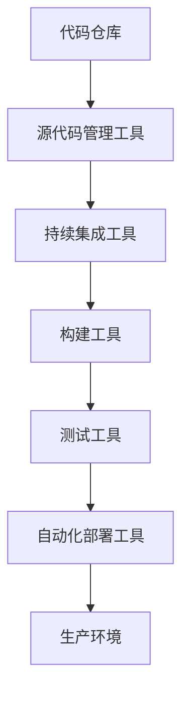

                 

### 文章标题：程序员创业公司的持续集成与持续部署实践

#### 关键词：
- 持续集成（CI）
- 持续部署（CD）
- 自动化构建
- 持续测试
- 风险评估

#### 摘要：
本文旨在深入探讨持续集成（CI）和持续部署（CD）在程序员创业公司中的应用和实践。我们将从核心概念、架构联系、算法原理、数学模型到实际项目实战进行全方位的讲解，帮助读者理解并掌握如何在创业公司中有效实施 CI/CD，提高代码质量和软件交付效率。

## 第一部分：核心概念与联系

### 核心概念

在软件开发中，持续集成（Continuous Integration，CI）和持续部署（Continuous Deployment，CD）是现代软件开发流程中不可或缺的部分。它们的目标是通过自动化提高代码质量和软件交付速度。

#### 持续集成（CI）

持续集成是指通过自动化构建和测试，将开发人员的代码变更及时集成到共享的代码库中。其主要目的是确保代码库中的每一部分都是可运行的，减少集成过程中出现冲突和错误的可能性。

持续集成的关键要素包括：

1. **自动化构建**：通过脚本或构建工具，自动化编译和打包代码。
2. **测试**：自动化执行单元测试、集成测试等，确保代码质量。
3. **反馈**：构建和测试的结果会即时反馈给开发人员，帮助他们及时发现问题并进行修复。

#### 持续部署（CD）

持续部署是在持续集成的基础上，进一步自动化将代码部署到生产环境的过程。其目标是确保生产环境中的应用是最新的、稳定的，并且能够快速响应市场需求和用户反馈。

持续部署的关键要素包括：

1. **自动化部署**：通过脚本或部署工具，自动化将代码部署到生产环境。
2. **环境管理**：确保开发、测试和生产环境的一致性。
3. **回滚策略**：在部署失败或出现问题后，能够快速回滚到上一个稳定版本。

### 架构联系

持续集成与持续部署的架构联系主要体现在以下几个方面：

1. **代码仓库**：代码仓库是持续集成和持续部署的起点，所有代码变更都提交到代码仓库中。
2. **源代码管理工具**：如 Git，负责管理代码版本和控制权限。
3. **持续集成工具**：如 Jenkins、Travis CI，负责自动化构建和测试代码。
4. **构建工具**：如 Maven、Gradle，负责编译和打包代码。
5. **测试工具**：如 JUnit、Selenium，负责自动化执行测试用例。
6. **自动化部署工具**：如 Docker、Kubernetes，负责将代码部署到生产环境。
7. **生产环境**：持续部署的目标环境，包括服务器、数据库等。

以下是 CI/CD 的架构流程的 Mermaid 流程图：



## 第二部分：核心算法原理讲解

### 自动化构建

自动化构建是持续集成的重要组成部分，它通过脚本或构建工具自动化编译和打包代码，从而提高开发效率和代码质量。以下是自动化构建过程的伪代码：

```java
function buildProject(sourceCode) {
    // 清理构建目录
    deleteDirectory(buildDirectory)

    // 编译源代码
    compileSourceCode(sourceCode, buildDirectory)

    // 运行测试用例
    runTestCases(buildDirectory)

    // 如果测试通过，则构建成功
    if (testResults.passed) {
        return "Build successful"
    } else {
        return "Build failed"
    }
}
```

### 持续测试

持续测试是确保代码质量的关键环节，它通过自动化执行单元测试、集成测试等，发现潜在问题并及时反馈给开发人员。以下是持续测试过程的伪代码：

```java
function runTestCases(buildDirectory) {
    // 加载测试用例
    testCases = loadTestCases()

    // 运行测试用例
    for (testCase in testCases) {
        executeTestCase(testCase, buildDirectory)
    }

    // 记录测试结果
    testResults = { "passed": 0, "failed": 0 }

    // 分析测试结果
    if (testCase.result == "pass") {
        testResults.passed += 1
    } else {
        testResults.failed += 1
    }

    return testResults
}
```

## 第三部分：数学模型和数学公式

### 概率与风险

在持续集成和持续部署过程中，概率和风险评估是至关重要的。以下是一个用于评估风险的数学模型：

$$
R = P \times I
$$

其中，$R$ 表示风险，$P$ 表示概率，$I$ 表示影响程度。

### 风险评估公式

在软件开发中，风险评估是确保项目成功的关键。以下是一个简单的风险评估公式：

$$
R = P \times I \times D
$$

其中，$R$ 表示风险，$P$ 表示概率，$I$ 表示影响程度，$D$ 表示发现时间。

## 第四部分：项目实战

### 实际案例

在本章中，我们将通过一个实际的持续集成和持续部署案例来展示整个流程。以下是开发环境搭建和代码实现的关键步骤：

1. **搭建开发环境**：配置 Git、Jenkins、Docker 等工具。
2. **编写代码**：编写适用于 CI/CD 的代码，并提交到代码仓库。
3. **配置 Jenkinsfile**：定义构建、测试和部署的步骤。

### 搭建开发环境

搭建开发环境是实施 CI/CD 的第一步。以下是搭建开发环境的关键步骤：

1. **安装 Git**：Git 是一个版本控制系统，用于管理代码版本。
    ```bash
    sudo apt-get install git
    ```

2. **安装 Jenkins**：Jenkins 是一个开源的持续集成工具。
    ```bash
    sudo apt-get install jenkins
    ```

3. **安装 Docker**：Docker 是一个开源的应用容器引擎，用于自动化部署应用。
    ```bash
    sudo apt-get install docker
    ```

4. **安装 Maven**：Maven 是一个项目管理和构建工具。
    ```bash
    sudo apt-get install maven
    ```

5. **安装其他依赖**：根据项目需求，安装其他依赖工具和库。

### 编写代码

编写适用于 CI/CD 的代码是实施 CI/CD 的关键。以下是编写代码的关键步骤：

1. **创建项目**：使用 Maven 创建一个简单的 Java Web 应用程序。
    ```bash
    mvn archetype:generate -DgroupId=com.example -DartifactId=myapp -DarchetypeArtifactId=maven-archetype-quickstart
    ```

2. **编写业务逻辑**：在 `src/main/java/com/example/myapp` 目录下编写业务逻辑代码。

3. **编写测试用例**：在 `src/test/java/com/example/myapp` 目录下编写单元测试和集成测试代码。

### 配置 Jenkinsfile

Jenkinsfile 是 Jenkins 的配置文件，用于定义构建、测试和部署的步骤。以下是 Jenkinsfile 的示例代码：

```groovy
pipeline {
    agent any

    stages {
        stage('Build') {
            steps {
                sh 'mvn clean install'
            }
        }
        stage('Test') {
            steps {
                sh 'mvn test'
            }
        }
        stage('Deploy') {
            steps {
                sh 'docker build -t myapp .'
                sh 'docker run -d --name myapp myapp'
            }
        }
    }
}
```

### 代码解读与分析

在这个案例中，我们使用 Maven 作为构建工具，Docker 作为容器化工具，Jenkins 作为 CI/CD 工具。以下是代码的解读与分析：

1. **Maven 配置**：在项目的 `pom.xml` 文件中，我们定义了项目的依赖、插件和配置。例如，我们使用了 Spring Boot 插件来简化应用程序的构建和部署。

2. **Dockerfile**：在项目的根目录下，我们创建了一个 Dockerfile，用于定义如何将应用程序打包到 Docker 容器中。Dockerfile 中包含了应用程序的构建步骤和运行命令。

3. **Jenkinsfile**：在项目的根目录下，我们创建了一个 Jenkinsfile，用于定义构建、测试和部署的步骤。Jenkinsfile 中使用了 Groovy 脚本语言，可以灵活地定义构建流程。

### 实际案例分析

在这个案例中，我们通过 Jenkins 实现了自动化构建、测试和部署。以下是实际案例分析：

1. **自动化构建**：每次代码提交到 Git 仓库时，Jenkins 会自动触发构建过程。构建过程包括编译代码、打包应用程序和构建 Docker 镜像。

2. **自动化测试**：在构建过程中，Jenkins 会自动运行单元测试和集成测试。如果测试失败，Jenkins 会立即通知开发人员，并停止构建过程。

3. **自动化部署**：在测试通过后，Jenkins 会自动部署应用程序到 Docker 容器中。部署过程包括启动容器、映射端口和配置环境变量。

### 项目小结

通过这个案例，我们展示了如何在程序员创业公司中实施持续集成和持续部署。CI/CD 不仅提高了代码质量和软件交付效率，还减少了人为错误和重复工作。然而，实施 CI/CD 需要一定的技术积累和实践经验，创业公司需要逐步学习和适应。

### 最佳实践 Tips

1. **尽早实施 CI/CD**：CI/CD 的优势在于能够快速发现和修复问题，因此应尽早实施。

2. **持续优化流程**：CI/CD 流程不是一成不变的，应根据项目需求和团队经验不断优化。

3. **监控和报警**：确保 CI/CD 流程的每个步骤都有监控和报警机制，以便及时发现问题。

4. **培训团队**：CI/CD 需要团队成员具备一定的技术能力，因此应进行相应的培训。

5. **安全第一**：在 CI/CD 流程中，确保代码的安全性和环境的隔离性。

### 小结

本文通过深入探讨持续集成（CI）和持续部署（CD）的核心概念、架构联系、算法原理、数学模型到实际项目实战，帮助读者理解并掌握 CI/CD 在程序员创业公司中的应用和实践。希望通过本文，读者能够更好地应用 CI/CD，提高代码质量和软件交付效率。

### 注意事项

1. **CI/CD 并非万能**：CI/CD 不是解决所有问题的唯一途径，需要结合其他方法和工具。

2. **代码质量**：CI/CD 能提高代码质量，但前提是代码本身就有较高的质量。

3. **团队协作**：CI/CD 需要团队协作，因此应确保团队成员之间沟通顺畅。

### 拓展阅读

1. 《持续集成：从实践到真实世界》
2. 《持续集成与持续部署实战》
3. 《Docker 实战：构建现代软件交付流水线》
4. 《Kubernetes 实战：从入门到实践》
5. 《Jenkins 实战：持续集成、持续交付与微服务》

## 作者信息

作者：AI天才研究院/AI Genius Institute & 禅与计算机程序设计艺术 /Zen And The Art of Computer Programming

AI天才研究院（AI Genius Institute）致力于推动人工智能技术的发展和应用，研究院的专家们拥有丰富的理论研究和实践经验。本文作者结合其深厚的计算机编程和人工智能领域背景，撰写了这篇关于程序员创业公司持续集成与持续部署实践的技术博客。希望本文能为广大软件开发者提供有价值的参考和启示。

