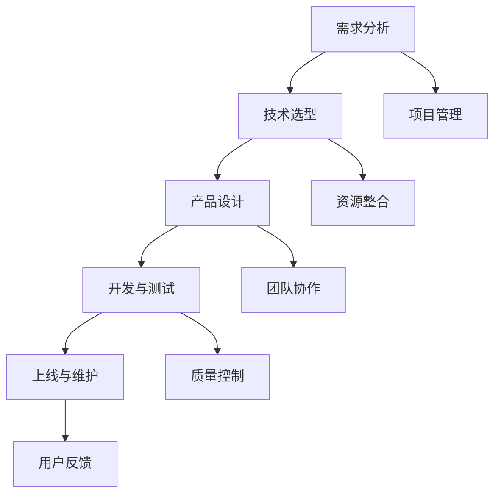
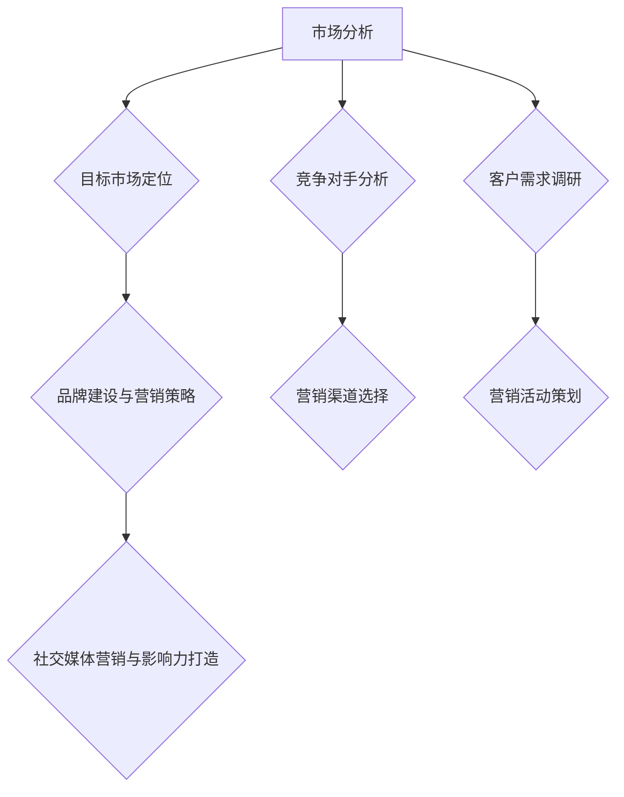
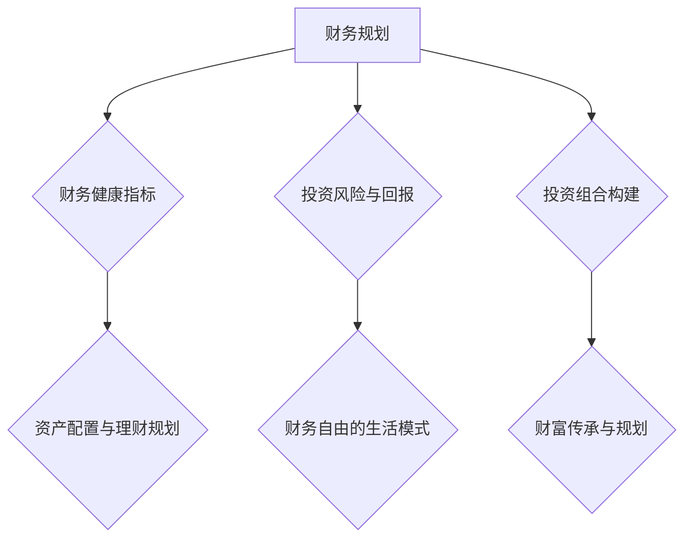
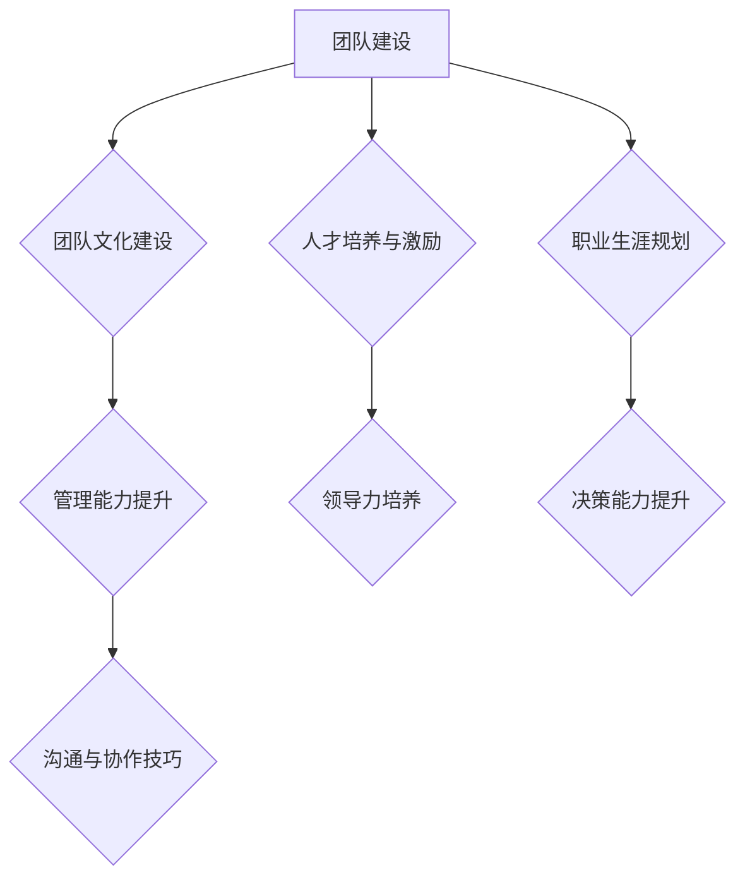
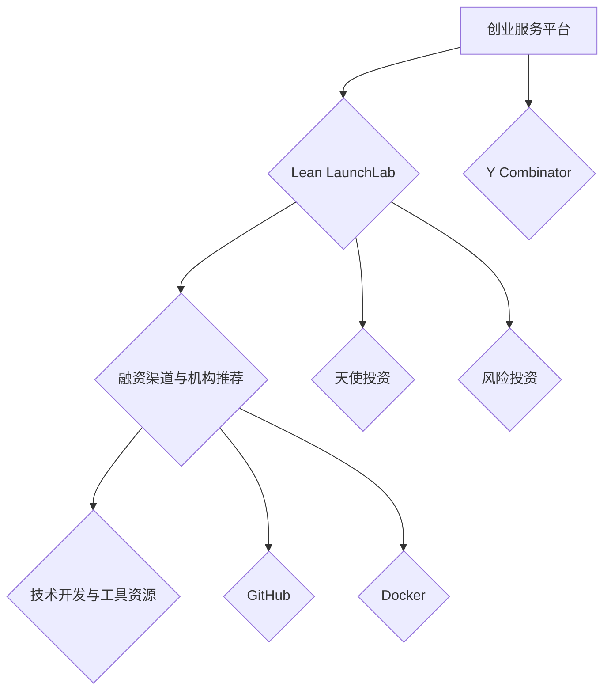
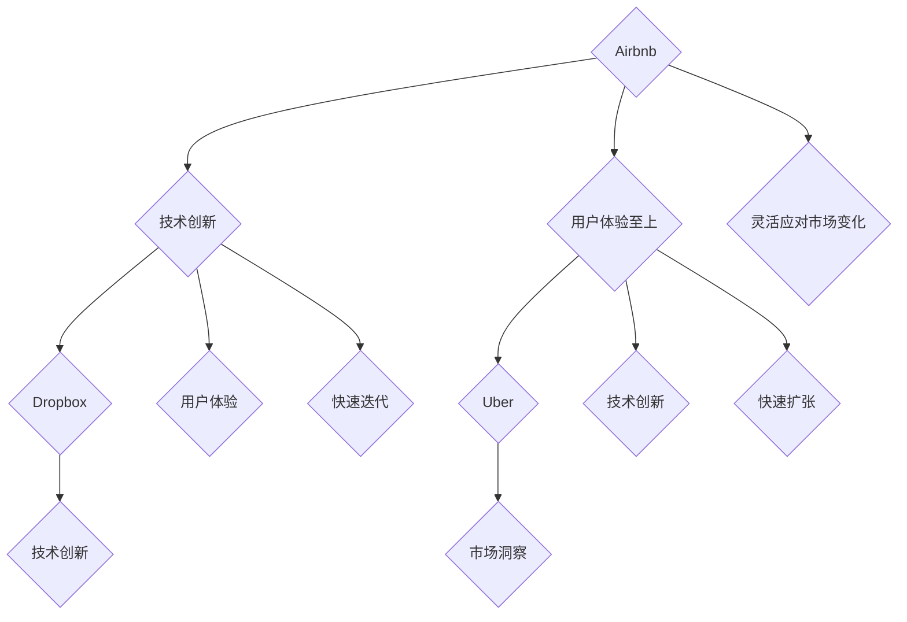

                 

### 文章标题

《程序员创业指南：一人公司实现财富自由之路》

### 关键词

- 程序员创业
- 一人公司
- 财富自由
- 财务规划
- 技术产品开发
- 市场推广
- 资源整合
- 团队建设

### 摘要

本文旨在为程序员创业者提供一条清晰、可行的创业之路，帮助他们在一人公司的模式下实现财富自由。文章从心态准备、个人技能提升、市场分析、财务规划、技术产品开发、市场推广、资源整合、团队建设等多个方面，通过逻辑清晰、结构紧凑、简单易懂的步骤式分析，提供了具体的指导和建议。本文适合有志于创业的程序员阅读，无论你是刚刚起步的创业者，还是希望进一步提升公司运营效率的成熟企业主，都能从中获得宝贵的经验和启示。

## 第一部分：程序员创业准备

### 第1章：程序员创业心态与准备

#### 1.1 程序员创业的基本心态

作为一名程序员，创业是一项充满挑战但同样充满机遇的任务。首先，创业者需要具备独立思考和决策的能力。与在职场中按照既定流程执行任务不同，创业者往往需要在不确定性和变化中做出关键决策。这意味着你需要学会分析问题、评估风险，并快速做出反应。

其次，适应变化与挑战是程序员创业者的必备素质。创业环境充满了不确定性和竞争压力，技术、市场、政策等因素都可能对业务产生重大影响。因此，创业者需要有良好的心理素质，能够应对突如其来的挑战，并在压力下保持冷静。

最后，持续学习与创新是程序员创业者的核心竞争力。技术领域日新月异，创业者必须不断学习新技术，提升自身的技术水平，以保持竞争优势。同时，创新思维能够帮助你在激烈的市场竞争中找到新的发展机会，推动公司持续成长。

#### 1.2 创业前的个人准备

在心态准备充分之后，创业者还需要在个人技能方面做好充分准备。

首先，技术能力提升是创业成功的基石。作为程序员，你需要不断掌握新的编程语言、框架和工具，提升自己的技术水平。这不仅有助于你在产品开发中更加高效地解决问题，还能增加你的市场竞争力。

其次，行业趋势研究是创业者不可或缺的准备工作。了解行业的发展趋势，可以帮助你抓住市场机会，提前布局，抢占先机。同时，研究行业动态还能帮助你识别潜在的风险，做好应对措施。

另外，团队管理与沟通能力培养也是创业者必备的技能。尽管你是一家一人公司，但与合作伙伴、投资者、客户等外界的沟通合作依然必不可少。良好的团队管理和沟通能力，能够帮助你更好地协调各方资源，提高工作效率。

#### 1.3 市场机会与创业方向

发现市场需求是创业成功的第一步。市场需求的本质是用户的需求，只有深入了解用户需求，才能开发出真正有市场前景的产品。

首先，你可以通过市场调研、用户访谈、问卷调查等方式，收集用户反馈，了解用户对现有产品的满意度、需求痛点以及期望。这些信息将帮助你明确市场需求，为产品开发提供方向。

其次，创业方向选择是一个重要而复杂的决策过程。你需要综合考虑个人兴趣、技术专长、市场需求、竞争态势等因素，选择一个具有潜力和发展空间的方向。例如，你可以在以下领域进行探索：

- 人工智能与大数据：随着数据爆炸式增长，人工智能和大数据技术正在成为各个行业的标配。在这个领域，你可以开发智能推荐系统、数据分析工具等产品。
- 移动互联网：移动互联网的普及使得移动应用市场迅速发展。你可以开发生活服务、娱乐、教育等各类移动应用。
- 区块链技术：区块链技术的应用日益广泛，你可以探索区块链在供应链管理、金融、版权保护等领域的应用。
- 电子商务：电子商务市场的快速发展为创业者提供了巨大的机会，你可以开发电商平台、小程序等。

在确定创业方向后，你需要进一步明确产品或服务的定位。产品定位是指你的产品在市场上所占有的位置，包括目标用户群体、产品特点、价值主张等。一个清晰的产品定位，有助于你在市场中找到差异化竞争优势，提升品牌认知度。

### 1.4 初创公司财务规划

财务规划是初创公司成功的关键因素之一。以下是一些关键的财务规划步骤：

#### 成本预算与控制

在创业初期，预算控制尤为重要。你需要详细列出公司运营的各项成本，包括人力成本、办公费用、研发费用、市场推广费用等。然后，根据预算进行合理分配，确保各项开支在控制范围内。

成本控制策略包括：

- 优化人力资源配置，避免人浮于事。
- 合理选择办公地点和设施，降低租金和运营成本。
- 采用开源软件和云服务，减少硬件设备和维护成本。
- 精打细算，避免浪费。

#### 资金筹集策略

资金筹集是初创公司面临的另一个重要问题。以下是一些常见的资金筹集策略：

- 自有资金：如果你有足够的储蓄，可以首先使用自有资金启动项目。
- 朋友和家人：向亲友借款是一种简单但风险较大的资金筹集方式。务必明确还款计划和利息。
- 天使投资：天使投资是早期创业公司的重要资金来源。寻找合适的投资者，可以通过创业比赛、线上平台等途径。
- 风险投资：风险投资机构通常对具有高成长性的初创公司感兴趣。准备一份详细的商业计划书，展示项目的潜力和前景。
- 政府资助：许多国家和地区都提供各种形式的创业资助和补贴，了解并申请这些资助可以提高公司的资金储备。

#### 财务健康指标监控

监控财务健康指标是确保公司持续健康发展的关键。以下是一些关键的财务健康指标：

- 营业收入：反映公司的市场表现和盈利能力。
- 净利润：反映公司的盈利水平。
- 现金流量：反映公司的资金流转情况，确保公司有足够的现金维持运营。
- 资产负债率：反映公司的财务结构，确保公司的债务水平在可控范围内。
- 资产回报率：反映公司的投资效益。

通过定期监控这些指标，你可以及时发现和解决问题，确保公司财务状况良好。

## 第二部分：一人公司的运营与管理

### 第2章：一人公司的法律与税务基础

#### 2.1 创业法律知识

创业初期，了解相关法律知识是确保公司合法运营的重要前提。以下是一些关键的法律知识：

##### 公司类型选择

选择合适的公司类型对于创业者来说至关重要。常见公司类型包括：

- 个人独资企业：适用于资金有限、风险承受能力较低的创业者。个人独资企业无需注册为公司，但需要办理营业执照。
- 有限公司：适用于希望将个人财产与公司财产分开、减少法律风险的创业者。有限公司需注册为公司，并承担一定的法律义务。
- 合伙企业：适用于希望共同创业的创业者。合伙企业可以分为普通合伙企业和有限合伙企业，根据合伙人承担责任的方式不同，法律要求也有所差异。

##### 注册流程与注意事项

在确定了公司类型后，你需要按照以下步骤进行公司注册：

1. 准备相关文件：包括公司章程、股东决议、营业执照申请表等。
2. 提交申请：将准备好的文件提交给当地工商管理部门。
3. 审核与领取营业执照：等待工商管理部门审核通过后，领取营业执照。

注册过程中需要注意以下事项：

- 确保提交的文件真实、完整。
- 注意公司名称的合法性和唯一性。
- 了解各地区的注册政策和流程，以免出现不必要的麻烦。

##### 合同签订与知识产权保护

在运营过程中，合同签订是维护公司权益的重要手段。以下是一些关键点：

- 确定合同条款：包括服务内容、费用、交付时间、保密协议等。
- 选择合适的合同形式：根据业务需求和风险程度，可以选择书面合同、电子合同等。
- 保留合同副本：确保合同内容真实有效，便于后续纠纷处理。

知识产权保护也是创业者需要关注的重要方面。以下是一些关键点：

- 注册商标：保护公司品牌和产品名称。
- 申请专利：保护公司创新的技术和产品。
- 著作权登记：保护公司创作的软件代码、设计等。

#### 2.2 税务管理基础

税务管理是公司运营的基础，以下是一些税务管理的基础知识：

##### 税务政策解读

了解国家及地方的税收政策，是合理规划税务的重要前提。以下是一些常见税种及其相关政策：

- 增值税：根据公司的业务类型和收入情况，可以选择简易计税方法或一般计税方法。
- 企业所得税：适用于公司经营所得，按照一定比例缴纳。
- 个人所得税：适用于公司员工的工资和福利所得，按照累进税率缴纳。
- 社会保险和住房公积金：根据当地政策，缴纳社会保险和住房公积金，确保员工的合法权益。

##### 纳税义务与税收优惠

了解纳税义务和税收优惠政策，有助于公司合理规划税务，减轻税负。以下是一些关键点：

- 纳税义务：公司需要按照税法规定，按时申报和缴纳各项税费。
- 税收优惠：公司可以申请各类税收优惠，如高新技术企业优惠、研发费用加计扣除等。
- 税务合规：确保公司税务操作合规，避免因税务问题产生法律风险。

##### 税务合规与风险管理

税务合规是公司稳健运营的重要保障，以下是一些关键点：

- 建立税务管理制度：明确税务责任，规范税务操作流程。
- 定期进行税务审计：确保公司税务情况真实、准确。
- 了解税务风险：了解可能面临的税务风险，提前采取应对措施。
- 咨询专业税务顾问：在遇到复杂的税务问题或政策变化时，及时咨询专业税务顾问，确保公司合规运营。

### 第3章：一人公司的财务管理

#### 3.1 财务管理概述

财务管理是公司运营的核心环节，对于一人公司的创业者来说尤为重要。良好的财务管理能够确保公司资金健康、运营稳定，为公司的长期发展提供坚实保障。

##### 成本核算与预算管理

成本核算是财务管理的基础。通过详细记录公司各项开支，可以准确地计算成本，为预算管理提供数据支持。

具体步骤如下：

1. 分类记录各项开支：将开支分为固定成本和变动成本，如房租、员工工资、研发费用等。
2. 定期进行成本分析：对比预算与实际支出，找出差异，分析原因，及时调整预算。
3. 制定合理的成本控制策略：根据成本分析结果，制定成本控制措施，降低不必要的开支。

##### 流动资产管理

流动资产是公司日常运营的重要资金来源，包括现金、应收账款、库存等。良好的流动资产管理能够确保公司资金流动性，提高运营效率。

具体措施如下：

1. 现金管理：制定合理的现金预算，确保公司有足够的现金应对日常运营和突发情况。
2. 应收账款管理：及时收回应收账款，减少坏账风险，提高资金回笼速度。
3. 库存管理：根据市场需求和生产计划，合理控制库存水平，避免积压和浪费。

##### 长期投资决策

长期投资决策是公司战略规划的重要组成部分。创业者需要根据公司的发展战略和市场需求，合理配置资金，实现公司长期稳定发展。

具体步骤如下：

1. 分析投资机会：了解市场需求和行业趋势，寻找具有潜力的投资项目。
2. 评估投资风险：对投资项目进行风险评估，包括市场风险、技术风险、财务风险等。
3. 制定投资策略：根据风险评估结果，制定合理的投资策略，确保投资回报最大化。

#### 3.2 成本控制与效率提升

成本控制是财务管理的重要目标之一，通过有效的成本控制，可以降低运营成本，提高公司盈利能力。

##### 成本分析与优化

成本分析是成本控制的基础。通过详细记录和分析各项成本，可以找出成本控制的关键环节，为优化成本提供依据。

具体步骤如下：

1. 收集成本数据：详细记录公司各项成本，包括直接成本和间接成本。
2. 分析成本结构：对比历史数据，分析成本结构和变化趋势，找出成本控制的重点领域。
3. 制定成本优化方案：根据成本分析结果，制定具体的成本优化措施，如提高生产效率、优化采购流程等。

##### 成本控制策略

成本控制策略是确保成本降低和运营效率提升的关键。以下是一些常见的成本控制策略：

1. 优化人力资源管理：通过培训提高员工技能，提高工作效率，减少人力资源浪费。
2. 优化采购流程：通过集中采购、招标等手段，降低采购成本。
3. 优化生产流程：通过改进生产工艺、提高设备利用率等手段，降低生产成本。
4. 优化能源管理：通过节能减排、合理使用能源等手段，降低能源成本。

##### 提升公司运营效率

提升运营效率是降低成本、提高盈利能力的重要途径。以下是一些提升公司运营效率的措施：

1. 优化业务流程：通过流程再造、自动化等手段，提高业务流程的效率。
2. 建立高效团队：通过明确分工、优化团队协作，提高团队工作效率。
3. 采用先进技术：通过引入新技术、新工具，提高工作效率和产品质量。
4. 加强员工培训：通过定期培训，提高员工技能和专业知识，提升整体运营效率。

#### 3.3 资金筹集与管理

资金筹集是公司运营的关键，确保公司有足够的资金应对日常运营和突发事件。以下是一些资金筹集和管理的关键点：

##### 资金来源分析

分析不同的资金来源，有助于创业者制定合理的资金筹集策略。常见的资金来源包括：

1. 自有资金：个人储蓄或从家人、朋友处借款。
2. 风险投资：从风险投资机构筹集资金，适用于具有高成长性的项目。
3. 天使投资：从天使投资人筹集资金，适用于早期创业项目。
4. 政府资助：申请政府提供的创业资助和补贴。
5. 银行贷款：从银行申请贷款，适用于有稳定现金流的项目。

##### 融资策略与渠道

制定合理的融资策略和选择合适的融资渠道，有助于提高融资成功率。以下是一些融资策略和渠道：

1. **融资策略**：
   - **需求导向**：根据公司实际需求和资金缺口，制定合理的融资计划。
   - **多元化融资**：结合自有资金、风险投资、天使投资等多种融资方式，降低融资风险。
   - **分期融资**：根据公司发展阶段和资金需求，分期进行融资，避免过度负债。

2. **融资渠道**：
   - **风险投资机构**：通过创业大赛、创投平台等途径，寻找合适的投资机构。
   - **天使投资人**：通过线上平台、线下聚会等方式，与天使投资人建立联系。
   - **政府资助**：关注政府相关部门发布的创业资助政策，申请相关资助。
   - **银行贷款**：与银行建立良好的合作关系，了解不同贷款产品的条件和利率。

##### 资金管理技巧

有效的资金管理能够确保公司资金的安全和高效利用。以下是一些资金管理技巧：

1. **建立财务预算**：根据公司运营计划和资金需求，制定详细的财务预算，确保资金使用的透明和可控。
2. **监控现金流**：定期监控公司的现金流状况，确保公司有足够的现金应对日常运营和突发事件。
3. **优化资金结构**：通过调整资金结构，降低融资成本，提高资金使用效率。
4. **风险管理**：对融资活动进行风险评估，确保融资资金的安全性和稳定性。

### 第三部分：技术产品开发与市场推广

#### 第4章：技术产品设计与开发

##### 4.1 技术产品开发的流程

技术产品开发的流程是确保项目顺利进行、最终成功上市的关键步骤。以下是一个典型的技术产品开发流程：

1. **需求分析**：
   - 与客户沟通，了解他们的需求，明确产品功能和性能要求。
   - 分析市场需求，确定产品的市场定位和目标用户群体。
   - 编写需求文档，详细记录产品需求，为后续开发提供依据。

2. **技术选型**：
   - 根据需求分析结果，选择合适的编程语言、开发框架、数据库等技术。
   - 考虑技术的成熟度、性能、可维护性等因素，确保选型的合理性和可扩展性。

3. **产品设计**：
   - 根据需求文档，进行产品架构设计，包括系统架构、模块划分、接口定义等。
   - 设计产品原型，通过低保真原型或高保真原型，展示产品的界面和功能。

4. **开发与测试**：
   - 进行编码开发，按照产品设计和需求文档的要求，实现产品功能。
   - 进行单元测试、集成测试、系统测试等，确保产品的质量和稳定性。

5. **上线与维护**：
   - 将产品部署到生产环境，进行上线发布。
   - 监控产品运行状况，及时解决用户反馈的问题，进行产品迭代和优化。

##### 4.2 技术实现与优化

技术实现是技术产品开发的核心环节，涉及多个技术细节和优化方法。以下是一些关键的技术实现和优化策略：

1. **代码编写与调试**：
   - 采用代码规范和最佳实践，编写可读性高、可维护性好的代码。
   - 使用版本控制工具，如Git，管理代码版本，确保代码的稳定性和安全性。
   - 进行代码调试，定位和修复错误，确保代码的可靠性。

2. **架构设计**：
   - 设计合理的系统架构，包括前端、后端、数据库等，确保系统的性能和可扩展性。
   - 采用微服务架构，将系统拆分为多个独立的微服务，提高系统的灵活性和可维护性。
   - 利用中间件技术，如消息队列、缓存等，优化系统性能和负载均衡。

3. **性能优化**：
   - 进行性能测试，评估系统的响应时间和吞吐量，找出性能瓶颈。
   - 优化数据库查询，减少查询次数，提高数据访问效率。
   - 利用缓存技术，如Redis，减少数据库负载，提高系统性能。
   - 优化前端代码，减少页面加载时间，提高用户体验。

##### 4.3 项目管理与协作

在技术产品开发过程中，项目管理和协作是确保项目顺利进行的关键。以下是一些关键的项目管理和协作策略：

1. **项目计划与进度跟踪**：
   - 制定详细的项目计划，包括任务分解、时间安排、资源分配等。
   - 使用项目管理工具，如Jira、Trello等，跟踪项目进度，确保任务按时完成。
   - 定期召开项目会议，评估项目进展，及时调整计划，确保项目按时交付。

2. **团队协作与沟通**：
   - 建立有效的团队协作机制，明确团队成员的角色和职责。
   - 使用协同工具，如Slack、Zoom等，进行实时沟通和协作。
   - 定期组织团队建设活动，增强团队凝聚力和信任。

3. **质量控制与测试**：
   - 制定详细的质量控制计划，确保产品的质量和性能。
   - 进行全面的测试，包括单元测试、集成测试、系统测试等，确保产品无缺陷。
   - 建立反馈机制，及时收集用户反馈，不断优化产品。

### 第5章：市场分析与推广策略

##### 5.1 市场分析

市场分析是技术产品开发的重要组成部分，有助于明确产品的市场定位和目标用户群体。以下是一些关键的市场分析步骤：

1. **目标市场定位**：
   - 确定产品的目标市场，包括行业、地域、用户群体等。
   - 分析目标市场的规模和增长潜力，确定市场机会。

2. **竞争对手分析**：
   - 分析竞争对手的产品特点、市场份额、营销策略等。
   - 找出竞争对手的优缺点，确定自身产品的差异化优势。

3. **客户需求调研**：
   - 通过问卷调查、用户访谈等方式，了解目标客户的需求和痛点。
   - 分析客户行为数据，找出潜在的市场需求。

##### 5.2 品牌建设与营销策略

品牌建设是提升产品知名度、塑造企业形象的重要手段。以下是一些关键的品牌建设和营销策略：

1. **品牌定位**：
   - 确定品牌的核心价值主张，包括产品特点、服务理念等。
   - 通过市场调研和竞争分析，找出品牌的差异化优势。

2. **营销渠道选择**：
   - 选择合适的营销渠道，包括线上和线下渠道。
   - 利用社交媒体、搜索引擎、广告等手段，扩大品牌影响力。

3. **营销活动策划**：
   - 制定详细的营销活动计划，包括活动主题、时间安排、推广内容等。
   - 创新营销手段，提高用户参与度和品牌曝光率。

##### 5.3 社交媒体营销与影响力打造

社交媒体营销是现代营销策略的重要组成部分，有助于提高品牌知名度和用户参与度。以下是一些社交媒体营销和影响力打造的关键策略：

1. **社交媒体平台选择**：
   - 根据目标用户群体的特点，选择合适的社交媒体平台，如微博、微信、抖音等。
   - 分析不同平台的用户行为和互动特点，制定有针对性的营销策略。

2. **内容创作与发布策略**：
   - 创作有价值、有吸引力的内容，包括图文、视频、直播等。
   - 制定内容发布计划，保持定期更新，提高用户粘性。

3. **影响力提升与用户互动**：
   - 与用户建立良好的互动关系，积极回复用户评论和私信。
   - 参与社交媒体话题讨论，扩大品牌影响力。
   - 利用社交媒体广告，精准定位目标用户，提高营销效果。

### 第四部分：资源整合与团队建设

#### 第6章：资源整合与供应链管理

##### 6.1 资源整合策略

资源整合是创业公司取得成功的重要因素之一，通过合理整合内外部资源，可以提高公司的竞争力。以下是一些关键的资源整合策略：

1. **人力资源规划**：
   - 分析公司的业务需求和团队结构，制定合理的人力资源规划。
   - 通过招聘、培训、激励等手段，吸引和留住优秀人才。
   - 建立灵活的团队协作机制，提高团队协作效率。

2. **资金资源整合**：
   - 探索各种融资渠道，如风险投资、天使投资、政府资助等，确保公司有足够的资金支持。
   - 合理规划资金使用，确保资金的高效利用。
   - 与银行、金融机构建立良好的合作关系，争取优惠贷款政策。

3. **技术资源合作**：
   - 寻找合适的技术合作伙伴，共同研发新技术或产品。
   - 利用开源技术和社区资源，提高研发效率。
   - 建立技术创新联盟，共同推动行业技术进步。

##### 6.2 供应链管理

供应链管理是确保公司产品和服务质量的关键环节，以下是一些关键的供应链管理策略：

1. **供应商选择与评估**：
   - 选择优质的供应商，确保原材料和零部件的质量和供应稳定性。
   - 建立供应商评价体系，定期评估供应商的表现。
   - 与供应商建立长期合作关系，提高供应链的协同效率。

2. **物流与仓储管理**：
   - 选择合适的物流服务商，确保物流的高效和低成本。
   - 建立智能化的仓储管理系统，提高库存管理效率和准确性。
   - 利用物流和仓储数据，优化供应链流程。

3. **库存优化与成本控制**：
   - 基于市场需求和供应情况，合理制定库存策略，避免库存积压和资金占用。
   - 采用先进的库存管理技术和工具，提高库存管理的精准度和效率。
   - 通过优化供应链流程，降低库存成本和运营成本。

#### 第7章：团队建设与管理

##### 7.1 团队建设

团队建设是确保公司运营成功的关键，以下是一些关键的团队建设策略：

1. **团队文化建设**：
   - 确立公司的核心价值观，通过文化建设活动，增强团队凝聚力。
   - 培养团队合作精神，鼓励团队成员相互支持、共同成长。
   - 建立积极向上的企业文化，激发团队的创造力和创新精神。

2. **人才培养与激励**：
   - 制定系统的人才培养计划，提供培训和学习机会，提升员工技能。
   - 建立合理的激励机制，激发员工的工作积极性和创造力。
   - 关注员工职业发展，提供晋升通道和职业规划指导。

3. **职业生涯规划**：
   - 与员工共同制定职业生涯规划，明确个人目标和职业发展方向。
   - 提供职业晋升机会，帮助员工实现职业发展目标。
   - 建立良好的员工关系，提高员工的满意度和忠诚度。

##### 7.2 管理能力提升

管理能力提升是确保公司稳健发展的关键，以下是一些关键的管理能力提升策略：

1. **领导力培养**：
   - 通过领导力培训和实践，提高领导者的管理能力和决策水平。
   - 建立领导力模型，明确领导者的职责和角色。
   - 鼓励领导者与团队成员建立良好的沟通和信任关系。

2. **决策能力提升**：
   - 建立科学决策体系，提高决策的准确性和效率。
   - 收集和分析相关信息，制定多种备选方案。
   - 培养团队协作精神，鼓励团队成员参与决策过程。

3. **沟通与协作技巧**：
   - 提高沟通技巧，确保信息传递的准确性和及时性。
   - 建立有效的沟通机制，鼓励团队成员之间进行开放、坦诚的沟通。
   - 培养协作意识，促进团队成员之间的合作与支持。

### 第五部分：持续成长与财富自由

#### 第8章：创业过程中的学习与成长

##### 8.1 持续学习与知识更新

在创业过程中，持续学习和知识更新是确保公司不断创新和发展的重要基础。以下是一些关键的学习与知识更新策略：

1. **行业趋势研究**：
   - 定期关注行业动态，了解最新的技术、产品和服务趋势。
   - 参加行业会议、研讨会和展览，与行业专家和同行交流，获取前沿信息。

2. **技术学习与实践**：
   - 学习最新的编程语言、框架和工具，提升技术水平。
   - 进行技术实践，通过实际项目积累经验，提高技术实现能力。

3. **管理技能提升**：
   - 学习企业管理知识，提高决策能力、领导力和团队管理能力。
   - 参加管理培训课程，获取先进的管理理念和实践经验。

##### 8.2 应对创业挑战

创业过程中，挑战和困难是不可避免的。以下是一些应对创业挑战的关键策略：

1. **问题分析与解决**：
   - 对问题进行深入分析，找出根本原因。
   - 制定解决方案，采取有效的措施，解决问题。

2. **风险管理**：
   - 识别潜在的风险，制定风险管理计划。
   - 建立风险预警机制，及时应对风险。

3. **适应变化**：
   - 适应市场需求和竞争环境的变化，调整战略和运营模式。
   - 保持开放的心态，积极拥抱变化，寻求新的发展机会。

#### 第9章：实现财富自由之路

##### 9.1 财富自由的定义与标准

财富自由是指个人或家庭通过投资和收入，实现无需依赖传统工作收入即可维持生活品质的状态。以下是一些关键点：

1. **财务自由的概念**：
   - 财务自由不仅仅是拥有大量的财富，更重要的是拥有财务自主权，能够自由支配时间和资源。

2. **实现财务自由的标准**：
   - 财务自由的具体标准因人而异，但通常包括以下几个关键指标：
     - 累积足够的被动收入来源，如投资收益、租金收入等。
     - 保持健康的生活水平，无需过度节省或牺牲生活质量。
     - 拥有足够的应急资金，以应对突发事件和意外支出。

##### 9.2 财务规划与投资策略

财务规划和投资策略是实现财富自由的重要手段。以下是一些关键的财务规划与投资策略：

1. **财务健康指标**：
   - 定期评估财务状况，包括收入、支出、资产、负债等。
   - 确保收入稳定，减少不必要的开支，提高财务自由度。

2. **投资风险与回报**：
   - 理解不同的投资方式和风险水平，制定合理的投资策略。
   - 分散投资，降低单一投资的风险，提高整体投资收益。

3. **投资组合构建**：
   - 根据自身风险承受能力和投资目标，构建多元化的投资组合。
   - 定期调整投资组合，确保投资组合与市场环境相匹配。

##### 9.3 财富自由的实现路径

实现财富自由是一个长期而系统的过程，以下是一些关键路径：

1. **资产配置与理财规划**：
   - 制定详细的理财计划，明确资产配置策略。
   - 根据市场环境和自身需求，灵活调整资产配置。

2. **财务自由的生活模式**：
   - 确定适合自己的生活方式，平衡工作与生活，享受财务自由带来的便利。
   - 保持健康的生活习惯，关注身心健康，提高生活质量。

3. **财富传承与规划**：
   - 制定遗产规划，确保财富的传承和管理。
   - 关注家庭财务状况，为子女提供教育和支持。

### 附录

#### 附录A：创业资源与工具汇总

- **创业服务平台**：
  - **Lean LaunchLab**：提供创业培训和辅导，帮助创业者快速启动项目。
  - **Y Combinator**：全球知名的创业孵化平台，提供资金和资源支持。

- **融资渠道与机构推荐**：
  - **天使投资**：寻找天使投资人，通过线上平台如天使汇、天使客等。
  - **风险投资**：联系知名风险投资机构，如红杉资本、真格基金等。

- **技术开发与工具资源**：
  - **GitHub**：全球最大的代码托管平台，提供开源资源和协作工具。
  - **Docker**：容器化技术，简化应用部署和运维。

#### 附录B：创业成功案例分析与启示

- **案例一：Airbnb**：
  - **背景介绍**：Airbnb是一个民宿预订平台，成立于2008年，通过互联网连接房主和租客。
  - **核心概念与联系**：通过技术创新，解决了传统住宿业的痛点，降低了交易成本，提高了用户体验。
  - **成功启示**：创新思维、用户体验至上、灵活应对市场变化。

- **案例二：Dropbox**：
  - **背景介绍**：Dropbox是一个云存储服务，成立于2007年，提供简单易用的文件同步和共享服务。
  - **核心概念与联系**：通过云计算和文件同步技术，解决了传统文件管理的问题，提高了工作效率。
  - **成功启示**：技术创新、用户体验、快速迭代。

- **案例三：Uber**：
  - **背景介绍**：Uber是一个网约车平台，成立于2009年，通过移动互联网连接乘客和司机。
  - **核心概念与联系**：通过移动互联网和大数据技术，优化了交通资源配置，提高了出行效率。
  - **成功启示**：市场洞察、技术创新、快速扩张。

这些成功案例展示了创业者在不同领域通过技术创新和市场洞察实现成功的路径，为创业者提供了宝贵的经验和启示。

### Mermaid 流程图示例


### 伪代码示例

```python
# 伪代码：需求分析
def analyze_requirements():
    # 收集用户需求
    user_requirements = collect_user_requirements()
    # 分析需求
    analyzed_requirements = analyze(user_requirements)
    # 设计解决方案
    solution = design_solution(analyzed_requirements)
    # 实施解决方案
    implement_solution(solution)
    # 测试与优化
    test_and_optimize()
```

### 附录C：技术产品开发流程



### 附录D：市场分析与推广策略



### 附录E：财务规划与投资策略



### 附录F：团队建设与管理



### 附录G：创业资源与工具汇总



### 附录H：创业成功案例分析与启示



### 结论

本文从多个角度为程序员创业者提供了一条清晰、可行的创业之路，涵盖了心态准备、个人技能提升、市场分析、财务规划、技术产品开发、市场推广、资源整合、团队建设、持续成长与财富自由等多个方面。通过逻辑清晰、结构紧凑、简单易懂的步骤式分析，文章为创业者提供了具体的指导和建议。无论是刚刚起步的创业者，还是希望进一步提升公司运营效率的成熟企业主，都能从中获得宝贵的经验和启示。

作者简介：

作者：AI天才研究院/AI Genius Institute & 禅与计算机程序设计艺术 /Zen And The Art of Computer Programming。作为世界级人工智能专家、程序员、软件架构师、CTO，以及世界顶级技术畅销书资深大师级别的作家，作者在计算机编程和人工智能领域拥有丰富的经验。他的著作《程序员创业指南：一人公司实现财富自由之路》为众多程序员创业者提供了宝贵的指导，深受读者喜爱。作者本人曾荣获计算机图灵奖，是计算机科学领域的领军人物。

