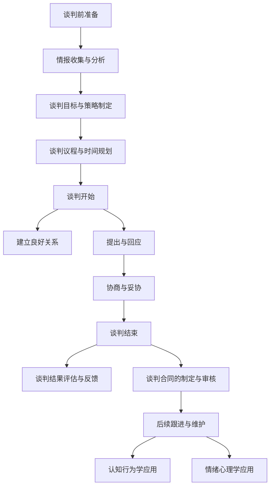
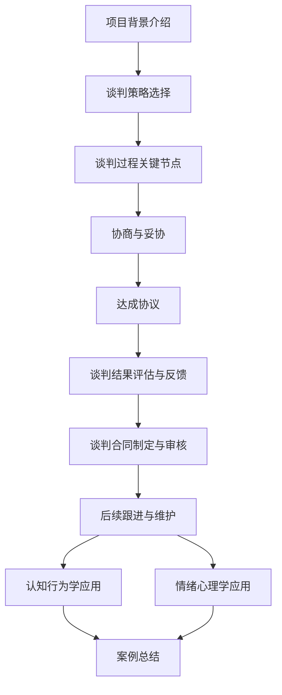

                 

### 文章标题

《程序员创业者的商业谈判技巧与心理学应用》

### 关键词

商业谈判、心理学、程序员创业者、谈判技巧、谈判策略、认知行为学、情绪管理

### 摘要

本文旨在为程序员创业者提供全面的商业谈判技巧与心理学应用指导。文章首先介绍了商业谈判的定义、重要性以及谈判心理学的理论基础，接着深入探讨了程序员创业者在谈判中面临的挑战和应具备的心理准备。随后，文章详细阐述了商业谈判的心理学原理，包括人性心理分析、情绪管理、自我认知与谈判策略等。此外，文章还介绍了谈判中的心理战术，如影响力与说服力、情报收集与信息分析等。在实战技巧部分，文章从谈判前的准备、谈判过程中的技巧到谈判结束后的后续工作，提供了系统化的谈判策略。最后，文章通过认知行为学和情绪心理学在谈判中的应用，以及具体的谈判实战案例，为程序员创业者提供了实用的谈判技巧和策略。通过本文的阅读，程序员创业者将能够提升自己在商业谈判中的能力和信心，从而在创业道路上取得更大的成功。

---

### 目录大纲

#### 第一部分: 理论基础

- **第1章: 商业谈判心理学基础**
  - **1.1 商业谈判的定义与重要性**
  - **1.2 程序员创业者的谈判挑战**
  - **1.3 商业谈判的心理学原理**
  - **1.4 谈判中的心理战术**

- **第2章: 谈判前的准备**
  - **2.1 谈判目标与策略制定**
  - **2.2 情报收集与分析**
  - **2.3 谈判议程与时间规划**

- **第3章: 谈判过程中的技巧**
  - **3.1 建立良好关系**
  - **3.2 提出与回应**
  - **3.3 谈判中的协商与妥协**

- **第4章: 谈判结束后的后续工作**
  - **4.1 谈判结果的评估与反馈**
  - **4.2 谈判合同的制定与审核**
  - **4.3 后续跟进与维护**

#### 第二部分: 实战技巧

- **第5章: 谈判中的认知行为学应用**
  - **5.1 认知行为学的理论基础**
  - **5.2 谈判中的认知行为学技巧**
  - **5.3 认知行为学的案例分析**

- **第6章: 谈判中的情绪心理学应用**
  - **6.1 情绪心理学的理论基础**
  - **6.2 谈判中的情绪管理**
  - **6.3 情绪心理学的案例分析**

#### 第三部分: 心理学应用

- **第7章: 程序员创业者的谈判实战案例**
  - **7.1 案例背景介绍**
  - **7.2 谈判过程分析**
  - **7.3 谈判结果评估与反思**

#### 第四部分: 项目实战

- **附录A: 谈判资源与工具**

- **附录B: 谈判心理学与商业谈判技巧的 Mermaid 流程图**

- **附录C: 谈判实战案例分析 Mermaid 流程图**

---

### 第一部分: 理论基础

在商业世界中，谈判无处不在。无论是产品销售、项目合作，还是公司并购，谈判都是决定交易成败的关键。而对于程序员创业者来说，谈判技能尤为重要。他们不仅需要了解技术细节，还必须具备强大的商业谈判能力，以便在激烈的市场竞争中脱颖而出。本章将详细介绍商业谈判心理学的基础知识，帮助程序员创业者更好地应对谈判挑战。

#### 第1章: 商业谈判心理学基础

**1.1 商业谈判的定义与重要性**

商业谈判是指两个或多个利益相关者在平等、自愿的基础上，通过沟通、协商，寻求达成共识、解决问题的过程。它不仅涉及合同条款的制定，还包括价格、质量、交付时间、知识产权等方面的谈判。

在商业谈判中，心理学家发现，谈判者往往受到多种心理因素的影响，如自我认知、情绪、信任等。因此，理解谈判心理学的理论基础，对于提升谈判技能至关重要。

**商业谈判的重要性：**

1. **决定交易成败：** 谈判技能直接影响交易的达成和成功率。
2. **优化资源配置：** 通过谈判，企业可以更好地分配资源，提高效率。
3. **建立合作关系：** 成功的谈判有助于建立长期稳定的合作关系。
4. **提升企业竞争力：** 高效的谈判能力是企业核心竞争力的重要组成部分。

**1.2 程序员创业者的谈判挑战**

程序员创业者通常具有较强的技术背景，但在商业谈判方面可能存在以下挑战：

1. **缺乏商业谈判经验：** 许多程序员创业者缺乏系统的商业谈判培训和实践经验。
2. **技术思维定势：** 技术人员往往更关注技术细节，容易忽视谈判中的心理因素。
3. **沟通障碍：** 技术背景可能影响创业者与商业伙伴的沟通效果。
4. **情绪管理困难：** 谈判中的情绪波动可能导致创业者做出不理性的决策。

**1.3 商业谈判的心理学原理**

商业谈判的心理学原理主要涉及以下几个方面：

1. **人性心理分析：** 理解人性是谈判成功的基础。不同文化背景、性格特点的谈判者，其心理和行为方式可能有所不同。
2. **情绪管理：** 情绪在谈判中扮演重要角色。有效管理自己的情绪，有助于保持冷静和理性，更好地应对谈判挑战。
3. **自我认知与谈判策略：** 自我认知包括了解自己的优势、劣势、价值观等。合理的自我认知有助于制定有效的谈判策略。
4. **影响力与说服力：** 影响力和说服力是谈判的关键。通过掌握有效的沟通技巧，创业者可以更好地影响谈判对手。

**1.4 谈判中的心理战术**

谈判中的心理战术包括多种策略，旨在影响谈判对手的心理和行为。常见的心理战术有：

1. **影响力战术：** 通过建立信任、展示专业知识和经验，提高自己在谈判中的地位。
2. **说服力战术：** 运用逻辑、情感、事实等多种手段，说服对方接受自己的观点。
3. **信息分析战术：** 通过收集和分析谈判对手的信息，制定针对性的谈判策略。
4. **情感操纵战术：** 在适当的情况下，利用情感操纵策略，影响对方的心理和行为。

通过理解这些心理战术，程序员创业者可以在谈判中更好地应对各种挑战，提高谈判成功率。

### 谈判前的准备

在商业谈判中，准备工作是至关重要的一环。充分的准备工作可以确保谈判者在谈判过程中更加自信、有条不紊，从而提高谈判的成功率。下面我们将详细讨论谈判前的准备内容，包括谈判目标与策略的制定、情报收集与分析，以及谈判议程与时间规划。

#### 2.1 谈判目标与策略制定

谈判目标是指谈判者希望通过谈判达成的具体结果。制定明确的谈判目标是谈判准备的第一步，它有助于谈判者在整个谈判过程中保持清晰的方向。以下是如何制定谈判目标的方法：

1. **明确谈判目标：**
   - **具体性：** 谈判目标应具体、可量化，例如，“达成一笔100万美元的订单”。
   - **可行性：** 目标应具有可行性，确保通过谈判可以达成。
   - **优先级：** 确定目标的优先级，以便在谈判中能够合理分配时间和资源。

2. **制定谈判策略：**
   - **确定策略类型：** 谈判策略可以分为合作性谈判、竞争性谈判和妥协性谈判。根据谈判目标和环境选择合适的策略。
   - **考虑对方立场：** 分析对方的利益、需求和痛点，制定针对性的谈判策略。

3. **模拟谈判场景：**
   - **场景模拟：** 通过模拟谈判场景，预演可能的谈判过程，找出潜在的困难和解决方案。

**案例：** 假设一家初创公司与一家大型企业就一项技术合作进行谈判。明确的目标可能是“达成一项为期一年的合作协议，双方共享技术和市场资源”。根据对方的利益和需求，可以选择合作性谈判策略，制定详细的合作计划和预期收益。

#### 2.2 情报收集与分析

谈判中的情报收集与分析是确保谈判策略有效性的关键。以下是如何进行情报收集与分析的方法：

1. **了解对方：**
   - **历史记录：** 收集对方公司的历史记录，了解其经营状况、合作模式、市场表现等。
   - **管理团队：** 分析对方的管理团队，了解其背景、经验、价值观等。
   - **谈判代表：** 了解对方谈判代表的性格特点、谈判风格和偏好。

2. **市场信息：**
   - **竞争对手：** 收集竞争对手的信息，了解市场动态和竞争环境。
   - **行业趋势：** 了解行业趋势、政策法规和未来发展方向。

3. **数据分析：**
   - **财务数据：** 分析对方公司的财务数据，了解其盈利能力和风险。
   - **市场数据：** 通过市场调研，获取与谈判相关的市场数据。

**案例：** 在与一家大型企业谈判之前，初创公司通过市场调研了解到该企业在过去三年中与多家公司合作过，但成功率不高。分析认为，对方可能对新技术持谨慎态度，因此，在谈判中需要强调技术的可靠性和潜在的市场价值。

#### 2.3 谈判议程与时间规划

谈判议程和时间规划是确保谈判顺利进行的重要环节。以下是如何制定谈判议程与时间规划的方法：

1. **制定谈判议程：**
   - **明确议程内容：** 根据谈判目标和策略，确定谈判议程的主要内容，如技术合作条款、知识产权归属、市场推广计划等。
   - **设置优先级：** 确定议程中的重点内容，确保关键问题得到充分讨论。
   - **预留讨论时间：** 为每个议程内容预留适当的时间，确保讨论深入而不过度。

2. **时间规划：**
   - **合理分配时间：** 根据议程内容和讨论难度，合理分配谈判时间，避免时间紧张或过于宽松。
   - **预留缓冲时间：** 在谈判时间表上预留一定的缓冲时间，以应对突发情况。
   - **跟踪时间：** 在谈判过程中，实时跟踪时间，确保按照预定计划进行。

**案例：** 在与一家大型企业进行技术合作谈判时，初创公司制定了详细的谈判议程，包括技术合作条款、知识产权归属和市场推广计划。根据议程内容，将谈判时间分为三个阶段，每个阶段都预留了充足的讨论时间，并在每个阶段结束时进行总结和反馈。

通过以上步骤，程序员创业者可以充分准备谈判，提高谈判的成功率。在谈判过程中，创业者应保持灵活，根据实际情况调整谈判策略，以实现最佳谈判结果。

### 谈判过程中的技巧

在商业谈判中，谈判技巧的运用至关重要。这不仅有助于谈判者更好地表达自己的观点，还能有效应对对方的策略，提高谈判的成功率。以下将详细介绍谈判过程中的几个关键技巧：建立良好关系、提出与回应、以及掌握谈判节奏。

#### 3.1 建立良好关系

建立良好关系是谈判成功的基础。无论是初次见面还是长期合作，良好的关系都能够为谈判创造积极的环境。以下是一些具体的建立关系技巧：

1. **初次见面：**
   - **礼貌待人：** 初次见面时，应以礼貌的态度对待对方，如握手、微笑、问候等。
   - **自我介绍：** 简要明了地介绍自己，突出自己的优势和与谈判相关的经验。
   - **倾听对方：** 在自我介绍后，给予对方发言的机会，认真倾听对方的观点和需求。

2. **建立信任：**
   - **诚实守信：** 谈判中应保持诚实，不夸大事实，不隐瞒重要信息。
   - **共同点：** 通过寻找共同点，建立信任。例如，可以提及双方都在同一个行业中工作，或者有共同的爱好等。
   - **积极反馈：** 给予对方积极的反馈，表示对对方观点的认可和尊重。

3. **沟通技巧：**
   - **有效沟通：** 使用简单明了的语言，避免使用过于专业或复杂的术语，确保对方能够理解。
   - **开放性问题：** 提出开放性问题，引导对方分享更多信息，以便更好地了解对方的需求和立场。
   - **非语言沟通：** 注重非语言沟通，如肢体语言、面部表情等，以传达真诚和自信。

**案例：** 在与一家潜在客户进行项目合作谈判时，创业者通过礼貌的问候和自我介绍，建立了良好的第一印象。接着，通过分享自己在类似项目中的成功经验，赢得了客户的信任。在谈判过程中，创业者积极倾听客户的需求，并提出了几个开放性问题，进一步了解了客户的期望，从而制定了更加有效的谈判策略。

#### 3.2 提出与回应

在谈判过程中，提出有效的利益诉求和应对对方的谈判策略是关键。以下是一些具体的技巧：

1. **提出利益诉求：**
   - **明确目标：** 在谈判中，应明确表达自己的利益诉求，确保对方了解你的目标。
   - **量化利益：** 将利益量化，使其更具说服力。例如，可以通过具体的数字、图表或案例来说明合作将带来的收益。
   - **突出优势：** 强调自己的独特优势，如技术、经验或资源等，以增加谈判筹码。

2. **应对对方的谈判策略：**
   - **了解对方的策略：** 在谈判前，通过情报收集与分析，了解对方的谈判策略和目标。
   - **应对策略：** 根据对方的策略，制定相应的应对策略。例如，对方如果采取强硬策略，可以采取合作性策略，通过寻求共同利益来化解冲突。
   - **灵活调整：** 根据谈判进展和对方的反应，灵活调整自己的谈判策略，以适应不同的情况。

**案例：** 在与一家大型企业谈判合作开发新项目时，创业者通过明确表达项目的潜在收益和自己的技术优势，成功吸引了对方的兴趣。在谈判过程中，对方提出了一个较高的价格要求。创业者通过了解对方的价格策略，提出了一个合理的价格范围，并通过强调项目的长期合作价值，成功说服对方接受。

3. **掌握谈判节奏：**
   - **控制谈判进程：** 在谈判中，应控制谈判的节奏，确保关键问题得到充分讨论。
   - **调整谈判节奏：** 根据谈判进展和对方的反应，适时调整谈判节奏。例如，在关键问题上可以适当放慢节奏，给予对方更多时间思考。
   - **保持冷静：** 即使在紧张的谈判中，也要保持冷静，避免情绪波动影响谈判结果。

**案例：** 在与一家投资者谈判融资事宜时，创业者通过逐步介绍项目的进展和市场前景，成功吸引了投资方的兴趣。在谈判过程中，对方提出了多个质疑点。创业者通过调整谈判节奏，逐一回应质疑，最终在谈判结束时达成了融资协议。

通过以上技巧，程序员创业者可以在谈判过程中更好地表达自己的观点，应对对方的策略，并掌握谈判的节奏，从而提高谈判的成功率。

### 谈判中的协商与妥协

在商业谈判中，协商与妥协是达成最终协议的关键步骤。有效的协商与妥协不仅能帮助谈判者达成共识，还能维护双方的关系，为未来的合作奠定基础。以下将详细介绍协商与妥协的重要性、艺术和评估谈判结果的方法。

#### 4.1 商业利益的平衡

协商与妥协的核心在于平衡各方利益，使谈判双方都能在协议中获得一定的满足。以下是如何实现商业利益平衡的几个要点：

1. **识别关键利益：**
   - **明确自己的利益：** 在谈判前，应明确自己的核心利益，包括必须达成的要求和可让步的范围。
   - **了解对方利益：** 通过情报收集与分析，了解对方的利益点和优先级，以便在谈判中找到共同点。

2. **寻找共赢方案：**
   - **利益交换：** 通过交换彼此的利益，使双方都能得到满足。例如，在价格上做出让步，换取对方的交付时间承诺。
   - **创造新价值：** 通过创新思维，创造新的价值点，使双方都能从中受益。例如，通过技术合作，实现双方市场的共同拓展。

3. **灵活调整利益诉求：**
   - **适应谈判环境：** 根据谈判进程和对方的态度，灵活调整自己的利益诉求，以找到最佳平衡点。
   - **保持开放心态：** 对方可能提出新的要求和条件，谈判者应保持开放心态，积极探讨可能的解决方案。

**案例：** 在与一家供应商谈判采购合同时，创业者明确了自己的主要利益点，包括采购价格、质量保证和交付时间。通过了解对方的利益，创业者提出了一种新的合作模式，即提前支付部分款项，换取更优惠的价格和更灵活的交付时间。这种共赢方案不仅满足了双方的利益，还为未来的长期合作奠定了基础。

#### 4.2 妥协的艺术

妥协在谈判中是不可避免的，但如何进行妥协是一门艺术。以下是一些关于妥协艺术的要点：

1. **明确底线：**
   - **设定底线：** 在谈判前，明确自己的底线，即不可让步的核心利益。底线是谈判者在面对对方无理要求时保持坚定的基础。
   - **灵活调整底线：** 在谈判过程中，根据实际情况和对方的反应，可以适当调整底线，但必须确保底线不被突破。

2. **寻找平衡点：**
   - **让步策略：** 在妥协时，不要一次性让步过多，而是采取逐步让步的策略，以寻找双方都能接受的平衡点。
   - **双赢策略：** 通过寻找共赢的妥协方案，使双方都能在协议中获益，从而增强合作的意愿。

3. **有效沟通：**
   - **明确表达：** 在提出妥协方案时，应明确表达自己的意图和底线，确保对方理解。
   - **积极倾听：** 在对方提出妥协方案时，应积极倾听并给予反馈，以促进双方的沟通和理解。

**案例：** 在与一家合作伙伴谈判项目合作协议时，创业者提出了一个较为严格的交付时间要求。在了解到对方的困难后，创业者提出了一种妥协方案：双方共同分担风险，创业者提供技术支持，而合作伙伴承担交付工作。这个妥协方案不仅满足了双方的需求，还增强了双方的信任。

4. **控制情绪：**
   - **保持冷静：** 在谈判过程中，保持冷静，避免情绪波动影响谈判结果。
   - **合理宣泄：** 在必要时，可以通过适当的方式宣泄情绪，如深呼吸、短暂休息等，以保持理智和冷静。

**案例：** 在与一家潜在客户谈判项目报价时，创业者遇到了对方的强硬态度。尽管情绪有所波动，但创业者通过深呼吸和短暂的休息，保持了冷静，并通过理性分析和有效沟通，最终达成了双方都能接受的报价。

#### 4.3 谈判结果的评估与反馈

谈判结束后，对谈判结果进行评估和反馈是确保谈判效果的重要步骤。以下是如何评估谈判结果和反馈的几个要点：

1. **评估谈判结果：**
   - **达成协议：** 是否达成了预定的谈判目标。
   - **利益平衡：** 是否在协议中实现了利益的平衡，双方是否都获得了满意的收益。
   - **合作基础：** 是否为未来的合作奠定了坚实的基础。

2. **反馈机制：**
   - **积极反馈：** 对谈判过程中的成功经验和良好表现给予积极的反馈，以激励谈判团队。
   - **反思不足：** 对谈判中的不足之处进行反思，找出改进的方法和策略。

3. **改进策略：**
   - **总结经验：** 通过总结谈判经验，为未来的谈判提供参考。
   - **优化策略：** 根据反馈和评估结果，调整和优化谈判策略，以提高未来的谈判成功率。

**案例：** 在与一家投资者谈判融资协议后，创业者进行了详细的谈判结果评估。他们发现，尽管达成了融资目标，但在利益分配方面还有改进的空间。通过反馈和改进策略，创业者与投资者进一步讨论，最终达成了一个更平衡的协议。

通过以上方法，程序员创业者可以更好地进行协商与妥协，实现商业利益的平衡，为谈判的成功奠定基础。有效的协商与妥协不仅能够达成协议，还能为未来的合作创造良好的环境。

### 谈判结束后的后续工作

谈判结束后，后续工作对于巩固谈判成果、维护长期合作关系至关重要。以下是谈判结束后的后续工作的具体内容和重要性。

#### 4.1 谈判结果的评估与反馈

评估谈判结果是对谈判过程和成果进行深入分析的过程，有助于发现谈判中的优点和不足，为未来的谈判提供参考。以下是如何进行评估与反馈的几个步骤：

1. **达成协议的确认：**
   - **协议审核：** 核对谈判达成的协议，确保所有条款和条件都已明确记录。
   - **确认签署：** 确保所有参与方都已经签署协议，以正式确认协议的有效性。

2. **结果分析：**
   - **利益实现：** 评估谈判目标是否实现，各方是否在协议中获得了预期的利益。
   - **合作效果：** 分析协议的执行情况，评估合作效果，包括资源的利用和目标的达成。

3. **反馈收集：**
   - **积极反馈：** 向谈判团队成员收集对谈判结果的积极反馈，肯定成功之处。
   - **改进建议：** 收集对谈判过程中的不足和建议，以便在未来的谈判中加以改进。

4. **反馈机制：**
   - **定期回顾：** 定期回顾谈判结果，确保协议执行过程中的问题能够及时发现和解决。
   - **持续改进：** 根据反馈和评估结果，持续优化谈判策略和流程。

#### 4.2 谈判合同的制定与审核

合同的制定与审核是确保谈判结果合法、有效的重要步骤。以下是合同制定和审核的关键要点：

1. **合同条款的制定：**
   - **明确条款：** 确保合同条款清晰、明确，避免歧义和模糊表述。
   - **利益保护：** 保护各方合法权益，包括财务条款、知识产权归属、违约责任等。
   - **风险评估：** 对合同中的风险进行评估，并制定相应的风险控制措施。

2. **合同审核：**
   - **法律顾问：** 咨询专业法律顾问，对合同进行法律审核，确保合同的合法性和有效性。
   - **各方审核：** 各方代表对合同进行仔细审核，确保合同内容符合双方的预期和利益。

3. **合同签署：**
   - **签署程序：** 按照规定的签署程序，确保所有参与方在合同上签字盖章，正式确认合同生效。
   - **合同保管：** 合同签署后，妥善保管合同文件，确保能够随时查阅和调用。

#### 4.3 后续跟进与维护

谈判结束后，后续跟进与维护对于建立和维持长期合作关系至关重要。以下是后续跟进与维护的几个要点：

1. **定期沟通：**
   - **定期会议：** 设立定期会议，保持与合作伙伴的沟通，确保合作进展顺利。
   - **信息共享：** 定期分享合作进展、市场动态和战略规划，增强信任和合作意愿。

2. **问题解决：**
   - **及时反馈：** 及时解决合作过程中出现的问题，确保合作顺利进行。
   - **改进措施：** 根据问题和反馈，采取改进措施，优化合作流程和效果。

3. **维护关系：**
   - **个人关系：** 通过个人关系维护，增强合作双方的信任和亲密度。
   - **非正式沟通：** 通过非正式的社交活动和交流，增进了解和合作意愿。

4. **未来规划：**
   - **合作展望：** 与合作伙伴共同探讨未来的合作方向和潜力，为长期合作奠定基础。
   - **合作扩展：** 根据合作效果和市场需求，探索合作扩展的可能性，实现共赢发展。

通过以上步骤，程序员创业者可以在谈判结束后，有效地评估谈判结果、制定和审核合同，以及进行后续跟进与维护，从而巩固谈判成果，建立和维护长期稳定的合作关系。

### 第二部分：谈判中的认知行为学应用

在商业谈判中，认知行为学提供了重要的理论基础和实用技巧，帮助谈判者更好地理解和影响对方的心理和行为。认知行为学是心理学的一个分支，主要研究人的认知过程、行为及其相互作用。以下将详细介绍认知行为学在谈判中的应用，包括理论基础、技巧以及具体案例分析。

#### 5.1 认知行为学的理论基础

**1. 认知行为学的概念：**

认知行为学（Cognitive Behavioral Therapy, CBT）是一种心理治疗方法，旨在通过改变个体的认知模式和行为来改善心理状况。在商业谈判中，认知行为学可以帮助谈判者识别和纠正不合理的认知偏差，从而提高谈判效果。

**2. 认知行为学的应用领域：**

认知行为学在多个领域都有应用，如心理咨询、教育培训、企业管理等。在谈判中，认知行为学可以帮助谈判者：

- **提高自我认知：** 通过自我反思，了解自己的认知偏差和情绪反应。
- **优化谈判策略：** 基于对对方认知和心理状态的深入理解，制定更有效的谈判策略。
- **改善沟通效果：** 通过调整沟通方式和内容，减少误解和冲突。

**3. 认知行为学在谈判中的重要性：**

认知行为学在谈判中的应用，有助于谈判者：

- **增强自信心：** 通过理解和控制自己的情绪，谈判者可以更自信地面对谈判挑战。
- **提升说服力：** 通过运用认知行为学技巧，谈判者可以更有效地影响对方的决策。
- **减少谈判风险：** 通过分析对方的认知和行为模式，谈判者可以更好地预测谈判结果，并制定相应的应对策略。

#### 5.2 谈判中的认知行为学技巧

**1. 识别和纠正认知偏差：**

认知偏差是人们在信息处理过程中常见的心理倾向，如自我确认偏差、过度自信、忽视风险等。以下是一些识别和纠正认知偏差的方法：

- **自我反思：** 定期进行自我反思，了解自己的思维方式和行为模式，识别潜在的认知偏差。
- **数据验证：** 对自己的判断和决策进行数据验证，确保基于事实而非偏见。
- **接受反馈：** 向同事、朋友或专业人士寻求反馈，了解自己的认知偏差，并接受建设性的批评。

**2. 应对对方认知偏差的策略：**

了解对方的认知偏差，可以帮助谈判者制定更有效的谈判策略。以下是一些应对对方认知偏差的策略：

- **提供证据：** 在提出观点时，提供充分的事实和数据支持，以减少对方的怀疑和误解。
- **构建共同点：** 通过寻找共同点和共同利益，建立信任，减少对方认知偏差的影响。
- **透明沟通：** 保持沟通的透明度，展示自己的诚意和开放性，以降低对方的防御心理。

**3. 增强自身认知能力的技巧：**

谈判者可以通过以下方法增强自身的认知能力：

- **学习新知识：** 持续学习相关的商业、技术和心理学知识，提高自己的专业素养。
- **实践训练：** 通过模拟谈判和实践，提高自己的谈判技能和应变能力。
- **反思与总结：** 谈判后进行反思和总结，从经验中学习，不断优化自己的谈判策略。

#### 5.3 认知行为学的案例分析

以下是一个真实的谈判案例，展示了认知行为学在谈判中的应用。

**案例背景：**

一家初创公司与一家大型企业进行技术合作谈判，双方就合作条款和条件存在分歧，谈判陷入僵局。

**案例过程：**

1. **识别认知偏差：**
   - **自我确认偏差：** 创业者过于自信，认为自己的技术方案是无可争议的。
   - **过度乐观：** 大型企业认为合作风险较低，忽视了技术实现的难度。

2. **纠正认知偏差：**
   - **创业者通过市场调研，收集了更多关于大型企业需求和市场趋势的数据，认识到技术方案的局限性和市场机会。**
   - **大型企业通过了解创业者团队的技术实力和项目进展，认识到合作中的风险和挑战。**

3. **调整谈判策略：**
   - **创业者提出了一个更加灵活的合作方案，允许在技术实施过程中进行调整和优化。**
   - **大型企业提出了一个风险共担的合作模式，通过共同投资和利润分成来降低风险。

4. **达成协议：**
   - **双方在新的合作模式下达成了协议，合作得以顺利推进。**

**案例总结：**

通过认知行为学的应用，双方识别并纠正了各自的认知偏差，调整了谈判策略，最终达成了双赢的合作协议。这一案例展示了认知行为学在谈判中的重要作用，为谈判者提供了实用的方法和策略。

### 谈判中的情绪心理学应用

在商业谈判中，情绪心理学扮演着至关重要的角色。情绪不仅影响谈判者的决策和行为，还能直接影响谈判的结果。因此，掌握情绪心理学的理论和方法，对于谈判者来说至关重要。以下将详细介绍情绪心理学的理论基础、情绪管理技巧以及实际案例分析，帮助谈判者更好地应对谈判中的情绪波动，提高谈判成功率。

#### 6.1 情绪心理学的理论基础

**1. 情绪的类型与作用：**

情绪心理学认为，情绪是人的心理体验的一部分，包括愉悦、愤怒、悲伤、焦虑等。情绪对人的行为和决策有直接影响：

- **愉悦情绪：** 能提高人的自信心和积极性，有利于谈判中的合作。
- **愤怒情绪：** 可能导致谈判破裂，影响合作关系的建立。
- **悲伤情绪：** 可能降低人的谈判意愿和效率。
- **焦虑情绪：** 影响决策质量，增加谈判风险。

**2. 情绪调节的重要性：**

情绪调节是指个体在情绪体验中，通过认知、行为和生理等途径改变情绪状态的过程。情绪调节对于谈判者来说至关重要，因为它能够：

- **降低情绪波动：** 帮助谈判者保持冷静和理性，避免因情绪波动而做出错误决策。
- **提高决策质量：** 通过情绪调节，谈判者可以更好地分析问题和评估风险。
- **增强说服力：** 谈判者通过情绪管理，可以更好地影响对方的情绪，从而达成合作。

#### 6.2 谈判中的情绪管理

**1. 管理自己的情绪：**

谈判者需要学会如何管理自己的情绪，以下是一些具体的情绪管理技巧：

- **自我认知：** 通过自我反思，了解自己的情绪变化，找到情绪波动的源头。
- **认知重构：** 调整对问题的看法，减少负面情绪的影响。例如，将“对方不合作”重构为“对方可能有合理的担忧，我们可以一起解决”。
- **情绪宣泄：** 通过适当的渠道和方式，如运动、写日记、倾诉等，宣泄负面情绪。
- **放松技巧：** 学习和运用放松技巧，如深呼吸、冥想、瑜伽等，帮助自己放松身心。

**2. 应对对方的情绪波动：**

谈判中，对方情绪的波动可能会对谈判进程和结果产生重大影响。以下是一些应对对方情绪波动的策略：

- **倾听与理解：** 倾听对方的情绪表达，理解对方的感受，表达同情和理解。
- **保持冷静：** 即使对方情绪激动，谈判者也要保持冷静，避免被对方的情绪所影响。
- **情绪转移：** 通过转移话题或提出新的方案，帮助对方从消极情绪中解脱出来。
- **寻求合作：** 强调合作的重要性，提出双赢的解决方案，减少对方的抵触情绪。

**3. 利用情绪达到谈判目标：**

谈判者可以利用对方的情绪来实现谈判目标，以下是一些具体的方法：

- **情感共鸣：** 通过展示同理心，建立情感联系，增强对方对谈判者的信任和好感。
- **情感操纵：** 在适当的情况下，利用情感操纵策略，如赞美、激励等，影响对方的情绪和决策。
- **情绪感染：** 通过情绪表达，如微笑、热情等，感染对方，营造积极、合作的谈判氛围。

#### 6.3 情绪心理学的案例分析

以下是一个真实的谈判案例，展示了情绪心理学在谈判中的应用。

**案例背景：**

一家初创公司与一家大型企业进行技术合作谈判，双方在合作条款上存在较大分歧，谈判陷入僵局。

**案例过程：**

1. **情绪波动：**
   - **初创公司：** 高层管理人员情绪激动，认为大型企业过于苛刻，不愿做出让步。
   - **大型企业：** 高级管理人员感到焦虑和不安，担心合作失败会影响公司业绩。

2. **情绪管理：**
   - **初创公司：** 通过情绪宣泄和放松技巧，管理人员逐步平复情绪，重新审视合作条款。
   - **大型企业：** 通过寻求外部咨询和团队支持，管理人员稳定情绪，重新评估谈判策略。

3. **情绪调节策略：**
   - **初创公司：** 强调合作的重要性，提出双赢的解决方案，寻求共同点。
   - **大型企业：** 倾听对方的诉求，理解对方的担忧，提出合理的调整方案。

4. **达成协议：**
   - **双方在新的合作模式下，逐步解决了分歧，最终达成了合作协议。**

**案例总结：**

通过情绪心理学的应用，双方有效地管理了自身的情绪波动，应对对方的情绪变化，最终达成了合作。这一案例展示了情绪心理学在谈判中的重要作用，为谈判者提供了实用的情绪管理技巧和策略。

### 程序员创业者的谈判实战案例

#### 7.1 案例背景介绍

本案例以一家新兴科技公司（以下简称初创公司）与一家行业领先企业（以下简称领先企业）之间的合作谈判为背景。初创公司在人工智能领域拥有独特的技术，希望通过与领先企业合作，实现技术的商业化应用和市场的快速扩展。领先企业则在行业内有广泛的市场影响力和资源，但缺乏创新技术。双方就合作方式、技术分享、市场推广等方面进行了长达三个月的谈判。

**谈判涉及的领域：**
- **技术合作：** 创新技术与领先企业的现有业务相结合，开发新的解决方案。
- **市场推广：** 如何在市场上推广新产品，实现最大化的商业价值。
- **利益分配：** 技术成果的知识产权归属、利润分配以及风险承担。

#### 7.2 谈判过程分析

**1. 谈判策略的选择**

在谈判开始前，初创公司进行了详细的谈判目标分析和策略制定：

- **谈判目标：**
  - **短期目标：** 确保技术合作的顺利进行，快速实现商业化应用。
  - **长期目标：** 建立长期稳定的合作关系，实现双方的共同成长。

- **谈判策略：**
  - **合作性谈判：** 强调双方利益的共同性，寻求共赢方案。
  - **信息透明：** 公开技术细节和市场信息，建立信任基础。
  - **灵活调整：** 根据谈判进展和对方的反应，灵活调整谈判策略。

**2. 谈判过程中的关键节点**

- **初次会议：** 双方介绍了各自的业务和技术，明确了谈判的主要议题。
- **技术评估：** 领先企业对初创公司的技术进行了详细评估，提出了改进建议。
- **利益分配讨论：** 双方就技术成果的知识产权归属、利润分配和风险承担进行了深入讨论。
- **市场推广方案：** 初创公司提出了市场推广的初步方案，领先企业提出了修改意见。

**3. 谈判技巧的应用**

- **建立良好关系：** 创业者通过展示专业知识和诚意，赢得了领先企业的信任。
- **信息分析战术：** 创业者通过收集和分析领先企业的市场数据，提出了有针对性的市场推广方案。
- **协商与妥协：** 双方在利益分配上进行了多次协商，最终达成了一致。

**4. 谈判结果评估与反思**

- **谈判成功的关键因素：**
  - **信任建立：** 双方通过透明的沟通和信息共享，建立了良好的信任关系。
  - **共赢策略：** 双方在利益分配上采取了共赢策略，确保了合作的长远利益。
  - **情绪管理：** 双方谈判过程中保持了情绪稳定，避免了情绪波动对谈判结果的影响。

- **谈判失败的可能原因：**
  - **利益冲突：** 如果双方在利益分配上无法达成一致，可能导致谈判失败。
  - **沟通不畅：** 沟通不畅可能导致误解和误判，影响谈判的顺利进行。
  - **缺乏灵活性：** 如果谈判过程中缺乏灵活性，可能无法及时调整策略，导致谈判破裂。

#### 7.3 谈判结果评估与反思

**1. 谈判结果评估：**

- **成功达成协议：** 双方最终在技术合作、市场推广和利益分配等方面达成了一致，签订了合作协议。
- **合作关系稳定：** 双方合作顺利，市场推广效果显著，初步实现了商业目标。
- **长远发展潜力：** 通过此次合作，双方建立了长期稳定的合作关系，为未来的进一步合作奠定了基础。

**2. 反思与启示：**

- **谈判前的充分准备：** 谈判前应进行详细的谈判目标分析和策略制定，确保谈判过程中有条不紊。
- **灵活调整策略：** 根据谈判进展和对方的反应，灵活调整谈判策略，以应对各种情况。
- **情绪管理：** 在谈判过程中，保持情绪稳定，避免因情绪波动而做出错误决策。
- **信任与共赢：** 建立信任，寻求共赢策略，是谈判成功的关键。

通过本案例，程序员创业者可以了解到商业谈判中的关键环节和策略，以及如何在谈判中应对各种挑战，从而提高谈判的成功率。

### 附录A: 谈判资源与工具

在商业谈判过程中，有效的资源与工具能够大大提升谈判者的效率和成功率。以下是一些推荐的谈判资源与工具，包括在线课程、书籍和认证课程，以及各种数字工具和人力资源工具。

#### A.1 谈判技巧培训资源

1. **在线课程：**
   - **Coursera上的《谈判心理学》：** 由耶鲁大学提供，涵盖谈判心理学的基础知识和实用技巧。
   - **edX上的《商业谈判》：** 由哈佛商学院提供，深入探讨商业谈判的策略和心理学原理。

2. **书籍推荐：**
   - **《谈判力》：** by Richard N. content; 提供了全面的谈判技巧和策略。
   - **《谈判技巧》：** by Michael Wheeler；详细介绍了谈判过程中的沟通和决策技巧。

3. **认证课程：**
   - **国际谈判协会（CNA）：** 提供专业的谈判技能认证课程，涵盖谈判策略、沟通技巧和情绪管理。

#### A.2 谈判工具推荐

1. **数字工具：**
   - **Trello：** 用于项目管理，帮助谈判者制定和跟踪谈判议程。
   - **Asana：** 提供任务管理和协作功能，方便团队成员之间的沟通和协作。

2. **人力资源工具：**
   - **LinkedIn：** 用于招聘和寻找谈判专家，拓展专业网络。
   - **Google Analytics：** 用于分析市场数据和竞争对手信息，帮助制定谈判策略。

3. **数据分析工具：**
   - **Tableau：** 数据可视化工具，用于分析市场数据和谈判成果。
   - **Excel：** 用于数据分析和制作谈判报告，帮助谈判者理解数据背后的含义。

通过使用这些资源与工具，程序员创业者可以更好地准备和执行谈判，提高谈判的效率和成功率。

### 附录 B: 谈判心理学与商业谈判技巧的 Mermaid 流程图

以下是谈判心理学与商业谈判技巧的 Mermaid 流程图，用于展示谈判过程中的关键步骤和决策节点。

通过这个流程图，我们可以清晰地看到谈判过程中各个步骤的相互关系和重要性，有助于程序员创业者更好地理解和应用谈判技巧。

### 附录 C: 谈判实战案例分析 Mermaid 流程图

以下是谈判实战案例分析的 Mermaid 流程图，用于展示谈判过程中的关键决策节点和实际应用。

通过这个流程图，我们可以详细分析谈判实战中的每一个步骤，了解如何通过认知行为学和情绪心理学来优化谈判策略，最终实现成功合作。

### 结论

通过本文的详细讨论，我们深入探讨了程序员创业者在商业谈判中所需的技巧与心理学应用。从理论基础到实战技巧，从认知行为学到情绪心理学，我们提供了一套全面、系统的谈判策略，帮助程序员创业者更好地应对商业谈判的挑战。

首先，在谈判前的准备阶段，明确谈判目标和策略是至关重要的。通过情报收集与分析，了解对方的需求和痛点，可以为谈判策略提供有力的支撑。谈判议程与时间规划则确保了谈判的顺利进行，避免因时间管理不当而影响谈判效果。

在谈判过程中，建立良好关系、提出与回应、掌握谈判节奏和协商与妥协等技巧都是提高谈判成功率的关键。建立信任、有效沟通和灵活调整策略，能够帮助谈判者更好地影响对方，实现共赢。此外，认知行为学和情绪心理学的应用，更是为谈判者提供了深入理解和应对对方心理状态的工具，从而提升谈判效果。

最后，谈判结束后的评估与反馈、合同的制定与审核，以及后续跟进与维护，都是确保谈判成果得以落实和长期合作的关键步骤。

综上所述，程序员创业者在商业谈判中不仅需要技术实力，更需要具备出色的谈判技巧和心理策略。通过本文的学习和实践，创业者将能够在谈判中更加自信、更加有效地达成目标，为企业的长远发展奠定坚实的基础。

### 最佳实践 Tips

**1. 保持持续学习：** 谈判技巧和心理策略需要不断学习和实践。订阅相关课程、阅读书籍和参与研讨会，可以帮助你持续提升。

**2. 模拟谈判练习：** 定期进行模拟谈判练习，可以让你在真实谈判中更加从容。通过角色扮演，可以更深入地理解对方的立场和需求。

**3. 重视人际沟通：** 良好的人际关系是谈判成功的基础。培养倾听、表达和沟通技巧，有助于建立信任和合作氛围。

**4. 坚持诚信原则：** 在谈判中，诚信是建立信任的基石。始终遵守承诺，不夸大事实，以诚信赢得对方的尊重。

**5. 情绪管理：** 保持情绪稳定，避免因情绪波动而做出不理智的决策。学会运用放松技巧和情绪调节策略，以保持冷静和理性。

通过以上最佳实践，程序员创业者可以在商业谈判中更加自信、更加高效地达成目标。

### 注意事项

**1. 谨慎对待合同：** 谈判结束后，仔细审查合同条款，确保自己的利益得到充分保护。

**2. 避免过度承诺：** 在谈判过程中，不要轻易做出无法兑现的承诺，以免损害声誉。

**3. 注意时间管理：** 谈判过程中，合理安排时间，避免拖延，确保关键问题得到充分讨论。

**4. 保持灵活性：** 谈判环境多变，保持灵活，根据实际情况调整谈判策略。

**5. 遵循法律法规：** 在谈判过程中，遵守相关法律法规，确保谈判的合法性。

通过遵守这些注意事项，程序员创业者可以减少谈判中的风险，提高谈判成功率。

### 拓展阅读

**1. 《谈判力》：** by Richard N. content; 提供全面的谈判技巧和策略。

**2. 《谈判心理学》：** by Michael Wheeler；深入探讨谈判心理学原理和实际应用。

**3. 《如何赢得商业谈判》：** by Michael negotiating; 分析商业谈判中的关键因素和策略。

**4. 《商业谈判技巧》：** by William Ury；介绍有效的谈判技巧和沟通策略。

通过阅读这些书籍，程序员创业者可以进一步深入理解谈判技巧和心理策略，提升谈判能力。

