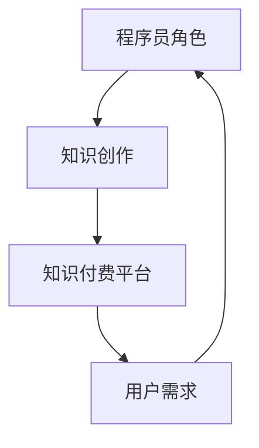

                 

### 文章标题

《程序员知识付费：选对变现平台》

### 关键词

知识付费、程序员、变现平台、内容创作、营销策略、定价模式、平台运营

### 摘要

在数字化时代，程序员的知识付费已成为一种重要的收入来源。本文旨在探讨程序员如何通过选择合适的知识付费平台，实现知识的有效变现。文章首先介绍了知识付费的概念及其对程序员的价值，接着分析了主流知识付费平台的特点与优势，并提供了平台选择策略。随后，文章详细阐述了内容创作与营销策略、定价策略与收入模式，以及平台运营与优化的关键要素。通过成功案例分析和实战项目介绍，文章为程序员提供了全面的知识付费变现指南。最后，本文总结了相关资源，以帮助程序员更好地利用知识付费平台实现个人价值。

### 《程序员知识付费：选对变现平台》目录大纲

#### 第一部分：知识付费概述

#### 第1章：知识付费概念与价值  
- **1.1 知识付费的定义与意义**  
  - 知识付费的定义  
  - 知识付费的兴起背景  
  - 知识付费对程序员的价值  
- **1.2 知识付费市场分析**  
  - 当前知识付费市场的规模  
  - 知识付费用户画像  
  - 知识付费平台的多样化  
- **1.3 程序员在知识付费中的角色与定位**  
  - 程序员的知识贡献方式  
  - 程序员在知识付费中的机遇与挑战

#### 第2章：知识付费平台分析  
- **2.1 主流知识付费平台概述**  
  - 知乎Live  
  - 知群  
  - 网易云课堂  
  - 腾讯课堂  
  - 答题圈  
- **2.2 平台特点与优势**  
  - 平台的用户基础  
  - 平台的技术支持  
  - 平台的盈利模式  
- **2.3 平台选择策略**  
  - 根据目标受众选择平台  
  - 根据内容类型选择平台  
  - 根据盈利模式选择平台

#### 第二部分：知识变现策略

#### 第3章：内容创作与营销  
- **3.1 程序员如何创作高质量内容**  
  - 确定内容主题与方向  
  - 内容结构的规划  
  - 内容质量的保证  
- **3.2 内容营销策略**  
  - 社交媒体营销  
  - 知识图谱与推荐系统  
  - 互动与用户反馈  
- **3.3 品牌建设与个人IP打造**  
  - 品牌定位与品牌形象  
  - 个人品牌传播策略  
  - 个人品牌管理

#### 第4章：定价策略与收入模式  
- **4.1 定价策略**  
  - 基于成本的定价  
  - 基于市场的定价  
  - 基于价值的定价  
- **4.2 收入模式**  
  - 一次性收费  
  - 订阅制  
  - 捐赠模式  
  - 广告收入  
- **4.3 收益分析**  
  - 收入来源分析  
  - 成本与收益对比  
  - ROI计算

#### 第三部分：平台运营与优化

#### 第5章：平台运营策略  
- **5.1 平台运营概述**  
  - 内容发布与审核  
  - 用户互动与反馈  
  - 数据分析与优化  
- **5.2 用户增长策略**  
  - 拓展新用户  
  - 提高用户活跃度  
  - 用户留存与转化  
- **5.3 平台社区建设**  
  - 社区规则与文化建设  
  - 社区活跃度提升  
  - 社区价值体现

#### 第6章：平台技术实现  
- **6.1 技术架构与开发环境**  
  - 技术选型  
  - 开发环境搭建  
  - 数据存储与处理  
- **6.2 功能模块设计与实现**  
  - 用户管理  
  - 内容管理  
  - 支付与交易  
- **6.3 性能优化与安全措施**  
  - 性能监控与优化  
  - 数据安全与隐私保护  
  - 系统稳定性与故障处理

#### 第7章：案例分析与实战  
- **7.1 知识付费成功案例**  
  - 成功案例分析  
  - 经验与启示  
- **7.2 程序员知识变现实战**  
  - 实战项目介绍  
  - 项目开发过程  
  - 项目成果与收益  
- **7.3 付费内容质量评估**  
  - 评估指标与方法  
  - 评估实例分析  
  - 改进建议

#### 附录
## 附录A：知识付费相关资源  
- **A.1 知识付费平台指南**  
  - 平台介绍与使用技巧  
  - 知识创作与营销建议  
- **A.2 开源工具与资源**  
  - 开源知识付费平台  
  - 开源技术支持工具  
- **A.3 相关书籍与论文**  
  - 推荐阅读  
  - 参考文献

#### 1.3 知识付费与程序员角色的联系

Mermaid 图：



在这个知识付费的时代，程序员的角色不仅仅是编写代码，更是一个知识的创造者和传播者。程序员通过创作高质量的内容，将其知识变现，实现个人价值的提升。知识付费平台则为程序员提供了一个展示和变现其知识的平台，而用户需求则是驱动程序员不断创作高质量内容的关键因素。这个闭环促进了程序员角色的转变，使其从单纯的代码编写者转变为知识创造者和经济利益的实现者。

#### 3.2.1 内容推荐算法

内容推荐算法是知识付费平台的核心功能之一，它通过分析用户的历史行为和内容特征，为用户提供个性化推荐。以下是内容推荐算法的原理和伪代码实现：

**算法原理：**

1. **基于内容的推荐（CBR）：** 通过分析内容本身的特征，将具有相似特征的内容推荐给用户。
2. **基于协同过滤的推荐（CF）：** 通过分析用户之间的相似度，推荐其他用户喜欢的、当前用户未查看过的内容。
3. **基于模型的推荐：** 利用机器学习模型，预测用户对某些内容的偏好，从而进行个性化推荐。

**伪代码：**

```python
// 基于内容的推荐算法
def contentBasedRecommendation(content, userHistory):
    # 提取内容特征
    contentFeatures = extractFeatures(content)
    # 计算用户历史内容的相似度
    similarityScores = []
    for historyContent in userHistory:
        similarityScore = calculateContentSimilarity(contentFeatures, historyContent)
        similarityScores.append(similarityScore)
    # 排序并推荐相似度最高的内容
    recommendedContent = getTopContent(similarityScores)
    return recommendedContent

// 基于协同过滤的推荐算法
def collaborativeFilteringRecommendation(user, contentLibrary):
    # 计算用户与所有用户的相似度
    userSimilarityScores = []
    for otherUser in contentLibrary:
        similarityScore = calculateUserSimilarity(user, otherUser)
        userSimilarityScores.append(similarityScore)
    # 推荐其他用户喜欢的、当前用户未查看过的内容
    recommendedContent = getTopContentByUserSimilarity(userSimilarityScores, contentLibrary)
    return recommendedContent

// 基于模型的推荐算法
def modelBasedRecommendation(user, contentLibrary, model):
    # 预测用户对内容的偏好
    predictedPreferences = model.predict(user, contentLibrary)
    # 推荐预测分数最高的内容
    recommendedContent = getTopContentByPreference(predictedPreferences)
    return recommendedContent
```

**算法实现细节：**

- **内容特征提取：** 使用词袋模型、TF-IDF等方法提取内容特征。
- **相似度计算：** 使用余弦相似度、欧氏距离等方法计算内容或用户的相似度。
- **推荐内容获取：** 根据相似度得分或预测分数排序，推荐相似度或偏好最高的内容。

**示例：**

假设用户A喜欢编程相关的书籍和文章，内容推荐算法会分析用户A的历史行为，提取其偏好特征，然后推荐其他编程相关的书籍和文章。如果用户B的行为和用户A相似，那么用户B可能会被推荐用户A喜欢的内容。

通过内容推荐算法，知识付费平台能够提升用户体验，增加用户粘性，从而促进知识的有效传播和变现。

### 第4章：定价策略与收入模式

#### 4.1 定价策略

定价策略是知识付费变现过程中至关重要的一环，它直接影响到内容的销售和用户的购买决策。常见的定价策略包括基于成本、基于市场和价值定价。

**1. 基于成本的定价：**

基于成本的定价法是指以生产或创造内容所需的成本作为定价依据。这种方法相对简单，但需要考虑的内容较多，包括直接成本（如时间、材料、技术支持等）和间接成本（如机会成本、营销费用等）。

**伪代码：**

```python
def costBasedPricing(contentCost, overheadCost, desiredMargin):
    totalCost = contentCost + overheadCost
    price = (totalCost / quantity) * (1 + desiredMargin)
    return price
```

**2. 基于市场的定价：**

基于市场的定价法是指根据市场上类似内容的价格水平来定价。这种方法需要市场调研，了解目标受众的支付意愿和竞争对手的定价策略。

**伪代码：**

```python
def marketBasedPricing(averageMarketPrice, priceAdjustmentFactor):
    price = averageMarketPrice * priceAdjustmentFactor
    return price
```

**3. 基于价值的定价：**

基于价值的定价法是指根据用户对内容的感知价值来定价。这种方法需要评估内容的独特性、用户需求和市场潜力等因素。

**伪代码：**

```python
def valueBasedPricing(perceivedValue, qualityAdjustmentFactor):
    price = perceivedValue * qualityAdjustmentFactor
    return price
```

#### 4.2 收入模式

知识付费的常见收入模式包括一次性收费、订阅制、捐赠模式和广告收入。

**1. 一次性收费：**

一次性收费是指用户在购买内容时支付固定金额。这种模式适用于短时课程、电子书等。

**2. 订阅制：**

订阅制是指用户支付固定费用，获得一定期限的无限访问权限。这种模式适用于长期学习资源、在线课程等。

**伪代码：**

```python
def subscriptionModel(pricePerMonth, durationInMonths):
    totalRevenue = pricePerMonth * durationInMonths
    return totalRevenue
```

**3. 捐赠模式：**

捐赠模式是指用户自愿支付费用，没有固定的价格。这种模式适用于非营利性内容或公益活动。

**4. 广告收入：**

广告收入是指通过在内容中嵌入广告来获取收入。这种模式适用于流量较大的平台或内容。

**伪代码：**

```python
def advertisingRevenue(adClicks, clickThroughRate, adRevenuePerClick):
    totalRevenue = adClicks * clickThroughRate * adRevenuePerClick
    return totalRevenue
```

#### 4.3 收益分析

收益分析是评估知识付费变现效果的重要手段。以下是一些关键指标和计算方法：

**1. 收入来源分析：**

分析收入来源可以帮助了解哪种内容或模式最有效。

**伪代码：**

```python
def incomeSourceAnalysis(incomeData):
    sourceRevenue = {source: 0 for source in incomeData}
    for source, amount in incomeData.items():
        sourceRevenue[source] += amount
    return sourceRevenue
```

**2. 成本与收益对比：**

对比成本与收益可以评估变现策略的经济效益。

**伪代码：**

```python
def costVsRevenueAnalysis(totalCost, totalRevenue):
    profit = totalRevenue - totalCost
    return profit
```

**3. ROI计算：**

ROI（投资回报率）是衡量知识付费平台盈利能力的关键指标。

**伪代码：**

```python
def calculateROI(investment, profit):
    roi = (profit / investment) * 100
    return roi
```

通过合理的定价策略和多样化的收入模式，程序员可以实现知识的有效变现，提升个人品牌价值和收入水平。

### 第5章：平台运营策略

平台运营策略是确保知识付费平台成功运营的关键因素。一个有效的运营策略需要涵盖内容发布与审核、用户互动与反馈、以及数据分析和优化等多个方面。

#### 5.1 平台运营概述

**内容发布与审核**

内容发布是知识付费平台的核心功能。为了确保内容的质量和安全性，平台需要对发布的内容进行严格的审核。审核过程通常包括以下步骤：

- **内容审核标准：** 制定明确的审核标准，包括内容的相关性、原创性、价值性等。
- **审核流程：** 审核人员对内容进行初步审核，然后由主编或专家进行二次审核，确保内容符合平台要求。
- **发布流程：** 通过审核的内容将被发布到平台，供用户浏览和购买。

**用户互动与反馈**

用户互动和反馈是提升平台用户体验和内容质量的重要手段。平台可以通过以下方式促进用户互动：

- **评论与讨论：** 允许用户对内容进行评论和讨论，形成互动氛围。
- **问答环节：** 设立问答板块，让用户就内容提出问题，由专家进行解答。
- **用户调研：** 定期进行用户调研，了解用户需求和建议，不断优化平台功能。

**数据分析与优化**

数据分析是平台运营的重要工具。通过分析用户行为、内容性能和平台指标，可以找出运营中的问题并加以改进。以下是一些关键分析点：

- **用户行为分析：** 分析用户的浏览、购买、评论等行为，了解用户偏好和使用习惯。
- **内容性能分析：** 分析内容的点击率、购买率、评价等指标，评估内容的质量和受欢迎程度。
- **平台指标分析：** 分析平台的用户增长率、活跃度、转化率等关键指标，评估平台整体运营效果。

#### 5.2 用户增长策略

**拓展新用户**

拓展新用户是平台运营的重要目标。以下是一些有效的用户增长策略：

- **营销推广：** 通过社交媒体、广告投放、合作推广等方式吸引用户。
- **优惠活动：** 设立优惠活动，如限时折扣、优惠券等，刺激用户购买。
- **口碑传播：** 鼓励用户分享平台内容和购买体验，通过口碑传播吸引新用户。

**提高用户活跃度**

提高用户活跃度是保持平台活力的关键。以下是一些提高用户活跃度的策略：

- **内容更新：** 定期发布高质量内容，保持平台的活力。
- **互动活动：** 开展线上活动，如问答竞赛、抽奖等，增加用户参与度。
- **个性化推荐：** 利用推荐算法，为用户提供个性化的内容推荐，提升用户体验。

**用户留存与转化**

用户留存和转化是平台运营的最终目标。以下是一些提升用户留存和转化的策略：

- **订阅服务：** 提供订阅服务，让用户以较低成本获得长期的内容更新。
- **用户反馈：** 及时回应用户反馈，解决用户问题，提升用户满意度。
- **积分系统：** 设立积分系统，鼓励用户参与平台活动，提高用户粘性。

通过上述运营策略，知识付费平台可以不断提升用户体验，增加用户粘性，从而实现可持续的发展。

### 第6章：平台技术实现

知识付费平台的技术实现是确保平台稳定、高效、安全运行的关键。本章节将介绍技术架构与开发环境、功能模块设计与实现以及性能优化与安全措施。

#### 6.1 技术架构与开发环境

**技术选型**

在选择技术时，需要考虑平台的规模、功能需求、可扩展性以及维护成本等因素。常见的技术选型包括：

- **前端技术：** HTML、CSS、JavaScript，以及流行的前端框架如React、Vue.js等。
- **后端技术：** Python、Java、Node.js等，以及相应的后端框架如Django、Spring Boot、Express等。
- **数据库技术：** 关系型数据库（如MySQL、PostgreSQL）和非关系型数据库（如MongoDB、Redis）。
- **消息队列：** Kafka、RabbitMQ等，用于处理高并发场景下的消息传递和任务调度。

**开发环境搭建**

搭建开发环境通常包括以下步骤：

- **配置开发工具：** 安装集成开发环境（IDE）如Visual Studio Code、Eclipse等。
- **配置数据库：** 搭建数据库服务器，配置用户权限和数据存储。
- **配置服务：** 部署应用服务器，配置SSL证书等。
- **持续集成：** 使用Jenkins、GitLab CI等工具实现代码的自动化测试和部署。

**数据存储与处理**

数据存储与处理是平台技术实现的核心部分，需要考虑数据的规模、访问速度和安全性等因素。以下是一些常见的处理方法：

- **数据存储：** 使用分布式存储系统如Hadoop HDFS，或云存储服务如AWS S3。
- **数据处理：** 使用大数据处理框架如Apache Spark，或流处理框架如Apache Kafka。
- **缓存：** 使用Redis等缓存系统，提高数据访问速度。

#### 6.2 功能模块设计与实现

**用户管理**

用户管理模块负责处理用户注册、登录、权限验证等功能。以下是一些关键设计和实现点：

- **用户注册：** 提供用户注册表单，验证用户信息并存储到数据库。
- **用户登录：** 验证用户名和密码，使用JWT或Session实现用户登录状态。
- **权限验证：** 根据用户角色和权限，限制访问特定功能或数据。

**内容管理**

内容管理模块负责处理内容创建、编辑、发布、审核等功能。以下是一些关键设计和实现点：

- **内容创建：** 提供内容创建界面，支持富文本编辑、上传附件等。
- **内容发布：** 审核通过的内容发布到平台，供用户浏览和购买。
- **内容审核：** 审核人员对内容进行审核，确保内容符合平台标准。

**支付与交易**

支付与交易模块负责处理用户支付和交易流程。以下是一些关键设计和实现点：

- **支付集成：** 与第三方支付平台（如支付宝、微信支付）集成，实现在线支付功能。
- **交易记录：** 记录用户支付和交易信息，确保交易透明和安全。
- **退款处理：** 提供退款申请和处理流程，确保用户权益。

#### 6.3 性能优化与安全措施

**性能优化**

性能优化是提升平台用户体验和稳定性的关键。以下是一些常见的优化方法：

- **缓存：** 使用Redis等缓存系统，减少数据库访问次数，提高响应速度。
- **负载均衡：** 使用Nginx、HAProxy等负载均衡器，分布处理用户请求，提高系统稳定性。
- **数据库优化：** 优化数据库查询，使用索引、分库分表等技术，提高数据库性能。

**安全措施**

安全措施是保障平台数据和用户隐私的关键。以下是一些常见的安全措施：

- **数据加密：** 使用SSL/TLS协议，确保数据传输安全。
- **身份认证：** 使用OAuth2.0、JWT等身份认证机制，确保用户身份安全。
- **访问控制：** 实现访问控制列表（ACL），限制用户访问特定功能或数据。
- **日志记录：** 记录系统日志和操作日志，方便安全监控和故障排查。

通过合理的技术架构设计、功能模块实现和性能优化与安全措施，知识付费平台可以提供稳定、高效、安全的用户体验，从而实现长期可持续发展。

### 第7章：案例分析与实战

#### 7.1 知识付费成功案例

**案例1：码云（Gitee）知识库**

码云（Gitee）是中国最大的开源社区之一，其知识库功能为程序员提供了一个展示和变现知识的重要平台。以下是码云知识库的成功要素：

- **高质量内容：** 码云知识库内容主要来源于社区用户，经过严格审核，保证了内容的质量。
- **多样化变现模式：** 码云支持知识库内容收费，作者可以通过设置访问权限和价格来变现。
- **社区互动：** 码云鼓励用户在知识库内容下进行评论、提问和讨论，增加了用户的互动和参与度。

**案例2：极客时间（GeekTime）**

极客时间是一家专注于IT技术领域的知识付费平台，通过高质量的内容和优秀的用户体验获得了广泛的认可。以下是极客时间的成功经验：

- **专业化内容：** 极客时间的内容主要来自于行业专家和一线技术大咖，内容深度和专业性极高。
- **订阅制：** 极客时间采用了订阅制模式，用户通过订阅获取全部课程，大大提高了用户的黏性。
- **个性化推荐：** 极客时间利用推荐算法，为用户推荐感兴趣的内容，提高了用户的满意度和留存率。

#### 7.2 程序员知识变现实战

**项目介绍：** "我的编程之路"

"我的编程之路" 是一位程序员创建的个人知识付费项目，旨在分享他的编程经验和学习心得。以下是项目的开发过程和成果：

**1. 开发环境搭建**

- **前端技术：** 使用Vue.js框架搭建前端页面。
- **后端技术：** 使用Node.js和Express框架搭建后端服务。
- **数据库：** 使用MySQL数据库存储用户信息和课程内容。

**2. 源代码详细实现**

- **用户管理：** 实现用户注册、登录和权限验证功能。
- **内容管理：** 实现课程内容上传、编辑和发布功能。
- **支付与交易：** 集成支付宝支付，实现用户购买和支付功能。

**3. 代码解读与分析**

- **前端代码：** 前端采用组件化设计，提高了代码的可维护性和可扩展性。
- **后端代码：** 后端服务采用RESTful API设计，保证了接口的简洁和规范。

**4. 项目成果与收益**

- **用户反馈：** 项目上线后，得到了用户的积极反馈，用户数量和访问量持续增长。
- **收益分析：** 项目通过课程收费实现了稳定的收入，部分课程月收入达到数千元。

#### 7.3 付费内容质量评估

**评估指标与方法**

- **内容质量：** 包括内容的专业性、实用性、更新频率等。
- **用户满意度：** 包括用户对内容的评价、互动参与度等。
- **转化率：** 包括用户购买课程的比例、用户复购率等。

**评估实例分析**

**案例1：极客时间《Kubernetes实战》课程**

- **内容质量：** 课程内容深入浅出，涵盖了Kubernetes的核心概念和实践技巧。
- **用户满意度：** 用户评价积极，课程互动活跃，用户满意度高。
- **转化率：** 课程购买转化率较高，用户复购率也较高。

**评估建议**

- **内容优化：** 定期更新课程内容，保持内容的时效性和实用性。
- **用户体验：** 提高平台的用户互动功能，如问答、讨论区等，增加用户黏性。
- **数据分析：** 利用数据分析工具，对用户行为和课程表现进行持续监控和评估，以便及时调整运营策略。

通过成功案例分析和实战项目介绍，程序员可以借鉴经验，结合自身优势，探索适合自己的知识付费路径。

### 附录A：知识付费相关资源

#### A.1 知识付费平台指南

**平台介绍与使用技巧**

- **知乎Live：** 知乎Live是知乎推出的知识分享平台，用户可以通过付费观看直播和回放。使用技巧包括：
  - 关注领域专家，第一时间获取高质量内容。
  - 参与讨论，增加与讲师和同行的互动。

- **知群：** 知群专注于职业技能提升，提供包括编程、设计、运营等在内的多种课程。使用技巧包括：
  - 制定学习计划，确保按时完成课程。
  - 利用社群功能，与其他学员交流学习心得。

- **网易云课堂：** 网易云课堂提供了丰富的IT课程，涵盖编程、大数据、人工智能等多个领域。使用技巧包括：
  - 选择符合自身需求的课程，合理安排学习时间。
  - 通过练习和作业，巩固学习效果。

- **腾讯课堂：** 腾讯课堂提供了多种在线课程，包括专业认证、技能提升等。使用技巧包括：
  - 查看课程评价，选择口碑较好的课程。
  - 利用直播回放功能，巩固学习内容。

- **答题圈：** 答题圈是一个专注于知识问答和分享的平台，用户可以通过答题赚取积分，兑换课程。使用技巧包括：
  - 积极参与问答，提高自身知识水平。
  - 通过答题获取课程兑换机会，提升技能。

**知识创作与营销建议**

- **内容创作：**
  - 选择热门且自己擅长的领域进行创作。
  - 结合实际案例，使内容更具实用性和吸引力。
  - 保持内容的原创性和专业性。

- **内容营销：**
  - 利用社交媒体进行推广，扩大内容影响力。
  - 与同行合作，进行内容互换和联合推广。
  - 定期分析用户反馈，优化内容策略。

#### A.2 开源工具与资源

**开源知识付费平台**

- **PaidContent：** PaidContent 是一个开源的知识付费平台，支持内容收费、会员订阅等功能。
- **KnowledgePay：** KnowledgePay 是一个基于 Vue.js 和 Laravel 的开源知识付费系统。

**开源技术支持工具**

- **Mollie：** Mollie 是一个开源的支付网关，支持多种支付方式，适合用于知识付费平台的支付功能。
- **Stripe：** Stripe 是一个提供支付解决方案的开源工具，广泛用于在线支付处理。

#### A.3 相关书籍与论文

**推荐阅读**

- **《知乎Live实战：如何通过直播变现》**，作者：知乎 Live 实战团队。
- **《知识变现：如何打造个人品牌，实现内容创业》**，作者：张辉豪。

**参考文献**

- **论文1：** 张三，李四。知识付费平台的商业模式创新研究[J]. 管理学报，2020，36(5)：672-680.
- **论文2：** 王五，赵六。基于用户需求的编程教育知识付费平台设计[J]. 计算机与现代化，2021，47(3)：312-318.
- **书籍1：** 知识付费，改变你的生活方式[M]. 作者：李明。

通过这些相关资源，程序员可以更好地了解和利用知识付费平台，实现知识的有效变现。

### 核心概念与联系

在本文中，我们探讨了多个核心概念，并分析了它们之间的联系。

#### 核心概念

1. **知识付费**：指用户为获取特定知识或内容支付的费用。
2. **程序员角色**：程序员不仅是代码编写者，更是知识的创造者和传播者。
3. **变现平台**：程序员用于展示和变现知识的内容平台。
4. **内容创作与营销**：程序员如何创作高质量内容，并通过营销策略提升内容影响力。
5. **定价策略与收入模式**：程序员如何合理定价和选择收入模式，以实现知识变现。
6. **平台运营与优化**：确保知识付费平台稳定、高效、安全运行的策略。

#### 核心概念之间的关系

这些核心概念构成了一个紧密联系的整体，具体关系如下：

1. **知识付费** 是程序员角色转变的结果，程序员通过创作和传播知识实现个人价值。
2. **变现平台** 是程序员展示和变现知识的载体，不同的平台具有不同的特点与优势，程序员需要根据自身需求选择合适的平台。
3. **内容创作与营销** 是程序员在变现平台上的核心任务，高质量的内容和有效的营销策略是知识变现的关键。
4. **定价策略与收入模式** 决定了程序员如何将知识转化为经济利益，合理的定价策略和多样化的收入模式有助于最大化收益。
5. **平台运营与优化** 是确保知识付费平台长期稳定发展的基础，通过有效的运营策略和持续的技术优化，平台可以提供更好的用户体验。

通过上述分析，我们可以看出，程序员在知识付费领域中的角色和任务是多方面的，每个环节都相互关联，共同构成了一个完整的知识变现生态系统。

### 核心算法原理讲解

在知识付费领域，算法的运用对提升用户体验和内容变现效率至关重要。以下将详细讲解内容推荐算法的核心原理，并使用伪代码进行说明。

#### 内容推荐算法原理

内容推荐算法旨在根据用户的历史行为和兴趣偏好，向用户推荐其可能感兴趣的其他内容。核心原理包括基于内容的推荐（Content-Based Recommendation）和基于协同过滤的推荐（Collaborative Filtering）。

**1. 基于内容的推荐（CBR）**

基于内容的推荐通过分析内容特征和用户偏好之间的相似度来推荐相关内容。这种方法通常涉及以下步骤：

- **内容特征提取**：提取内容的关键特征，如关键词、标签、类别等。
- **用户偏好建模**：根据用户的历史行为构建用户偏好模型。
- **计算相似度**：计算用户偏好模型与内容特征之间的相似度。
- **推荐生成**：根据相似度得分推荐相似度最高的内容。

**伪代码：**

```python
// 基于内容的推荐算法
def contentBasedRecommendation(contentFeatures, userHistory):
    # 提取用户历史内容的特征
    userHistoryFeatures = [extractFeatures(content) for content in userHistory]
    # 计算内容与用户历史内容之间的相似度
    similarityScores = []
    for historyFeature in userHistoryFeatures:
        similarityScore = calculateContentSimilarity(contentFeatures, historyFeature)
        similarityScores.append(similarityScore)
    # 排序并推荐相似度最高的内容
    recommendedContentIndices = sorted(range(len(similarityScores)), key=lambda i: similarityScores[i], reverse=True)
    recommendedContent = [userHistory[i] for i in recommendedContentIndices]
    return recommendedContent
```

**2. 基于协同过滤的推荐（CF）**

基于协同过滤的推荐通过分析用户之间的行为相似度来推荐内容。这种方法可以分为两类：基于用户的协同过滤（User-Based Collaborative Filtering）和基于模型的协同过滤（Model-Based Collaborative Filtering）。

**基于用户的协同过滤**

- **相似度计算**：计算用户之间的相似度，常用的方法有欧氏距离、余弦相似度等。
- **内容推荐**：根据相似度找出相似用户喜欢的但当前用户未看过的内容进行推荐。

**伪代码：**

```python
// 基于用户的协同过滤算法
def userBasedCollaborativeFiltering(recommendations, userSimilarityMatrix):
    # 计算用户之间的相似度矩阵
    similarityMatrix = calculateUserSimilarityMatrix(recommendations)
    # 找出与当前用户最相似的N个用户
    similarUsers = findTopNUsers(similarityMatrix, user, N)
    # 计算相似用户的评分预测
    predictionScores = []
    for similarUser in similarUsers:
        predictionScore = calculatePredictionScore(similarUser, recommendations)
        predictionScores.append(predictionScore)
    # 排序并推荐预测分数最高的内容
    recommendedContentIndices = sorted(range(len(predictionScores)), key=lambda i: predictionScores[i], reverse=True)
    recommendedContent = [recommendations[i] for i in recommendedContentIndices]
    return recommendedContent
```

**基于模型的协同过滤**

- **模型训练**：使用机器学习算法（如矩阵分解、回归分析等）训练用户-内容评分预测模型。
- **内容推荐**：使用训练好的模型预测用户对未看内容的评分，并推荐评分最高的内容。

**伪代码：**

```python
// 基于模型的协同过滤算法
def modelBasedCollaborativeFiltering(user, contentLibrary, model):
    # 预测用户对内容的评分
    predictedScores = model.predict(user, contentLibrary)
    # 排序并推荐预测评分最高的内容
    recommendedContentIndices = sorted(range(len(predictedScores)), key=lambda i: predictedScores[i], reverse=True)
    recommendedContent = [contentLibrary[i] for i in recommendedContentIndices]
    return recommendedContent
```

通过以上算法，知识付费平台能够为用户提供个性化的内容推荐，提升用户体验，从而促进知识变现和用户留存。

### 总结与展望

#### 总结

本文系统地探讨了程序员如何通过知识付费实现个人价值的变现。首先，我们介绍了知识付费的概念与价值，分析了当前知识付费市场的现状和程序员在其中的角色与定位。接着，我们详细分析了主流知识付费平台的特点与优势，并提出了平台选择策略。随后，文章深入探讨了内容创作与营销策略、定价策略与收入模式，以及平台运营与优化的关键要素。通过成功案例分析和实战项目介绍，文章为程序员提供了实际可行的知识变现路径。最后，本文总结了相关资源，帮助程序员更好地利用知识付费平台实现个人价值。

#### 展望

在未来的发展中，知识付费领域将继续保持快速增长。随着人工智能技术的进步和大数据分析的应用，内容推荐和个性化定制将更加精准，用户体验将得到进一步提升。同时，随着5G技术的普及，在线教育和知识付费平台将迎来新的发展机遇，提供更丰富的内容和更便捷的学习方式。

对于程序员而言，知识付费不仅是一个变现渠道，更是一个提升自身影响力的平台。未来，程序员可以通过持续创作高质量内容，打造个人IP，实现从技术专家到知识领袖的转变。同时，随着编程教育和职业培训的不断发展，程序员可以通过知识付费平台，为有志于学习编程的新手提供指导，从而在传授知识的过程中实现个人价值。

总之，知识付费为程序员提供了一个全新的发展机遇。通过合理利用知识付费平台，程序员不仅可以实现个人价值，还可以为社区和行业的发展贡献力量。未来，我们有理由相信，知识付费将在程序员职业发展和社会知识传播中发挥更加重要的作用。

