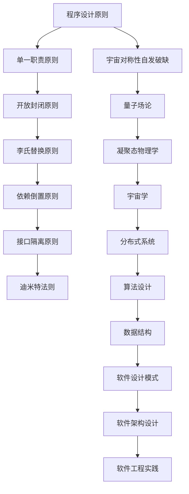

                 

### 引言与基础概念

在计算机科学领域，程序设计原则是确保代码质量、可维护性和可扩展性的基石。这些原则通过指导开发者编写结构清晰、模块化且易于维护的代码，提高了软件开发的效率和质量。经典的程序设计原则包括单一职责原则、开放封闭原则、李氏替换原则、依赖倒置原则、接口隔离原则和迪米特法则。这些原则虽然针对的是编程实践，但其背后的思想和理念在科学和自然界中也有相应的体现。

另一方面，宇宙对称性自发破缺是物理学中的一个重要概念，描述了在特定条件下，系统的对称性会自发地被破坏，形成新的物理状态。这一现象不仅在基础物理研究中具有重要意义，还在诸如材料科学、量子场论和粒子物理等广泛领域有着深远的影响。

本文将探讨程序设计原则与宇宙对称性自发破缺之间的相似性和联系。通过对这两个领域的深入分析，我们希望能够揭示出它们背后的共通原理，并提供一种新的思考方式，以更好地理解和应用这些原则。

接下来，本文将首先介绍程序设计原则的基本概念和重要性，然后深入探讨宇宙对称性的概念和自发破缺现象。通过对比分析，我们希望能够揭示出程序设计原则与对称性自发破缺之间的内在联系，并探索这些原理在实际应用中的价值。

### 程序设计原则概述

#### 程序设计原则的重要性

在软件开发过程中，程序设计原则起着至关重要的作用。它们不仅帮助我们编写更高效、更可靠的代码，还显著提高了软件的可维护性和可扩展性。程序设计原则旨在通过规范和指导编码行为，确保代码的模块化、清晰性和一致性。具体来说，程序设计原则有以下几个重要意义：

1. **提高代码质量**：遵循程序设计原则可以使代码更加简洁、易于理解和维护，从而降低bug出现的概率。例如，单一职责原则要求每个模块只完成一个特定的功能，这样不仅使代码结构更加清晰，还能减少模块之间的耦合，提高代码的模块化程度。

2. **增强可维护性**：良好的程序设计原则使得代码更加模块化和独立，有助于团队成员之间的协作。例如，开放封闭原则鼓励我们在软件的开放部分编写扩展代码，而不是修改已存在的封闭部分。这样，当需求发生变化时，我们只需扩展现有的代码，而不需要频繁地修改，从而降低了维护成本。

3. **提高开发效率**：遵循程序设计原则可以减少代码重复和冗余，从而提高开发效率。例如，依赖倒置原则通过倒置控制反转，使得高层模块能够依赖于抽象，而低层模块依赖于具体实现。这种设计模式不仅提高了代码的可复用性，还能显著提高开发效率。

4. **促进代码共享和复用**：良好的程序设计原则使得代码模块化，有助于代码的共享和复用。例如，接口隔离原则通过定义细粒度的接口，使得不同的模块可以独立地开发、测试和部署。这样，我们可以在不同的项目中复用这些模块，从而提高开发效率。

#### 经典程序设计原则

在众多程序设计原则中，以下六项原则被认为是最经典和最常用的：

1. **单一职责原则（Single Responsibility Principle，SRP）**：每个类或模块应该只负责一项功能，这样可以减少模块之间的耦合，提高代码的可维护性和可扩展性。例如，在一个电商平台中，订单服务和支付服务应该分别实现，而不是将它们合并为一个类。

2. **开放封闭原则（Open/Closed Principle，OCP）**：软件实体（例如类、模块、函数等）应该对扩展开放，对修改关闭。这意味着我们应该通过扩展而不是修改现有代码来增加新的功能。例如，我们可以通过创建新的类来扩展功能，而不是直接修改现有的类。

3. **李氏替换原则（Liskov Substitution Principle，LSP）**：子类必须能够替换其超类，而不改变原有程序的语义。这意味着子类必须继承超类的所有行为，并且不会引入新的异常行为。例如，如果一个类是一个圆形的子类，那么它应该能够替代圆形类，并在所有情况下表现出与圆形类相同的行为。

4. **依赖倒置原则（Dependency Inversion Principle，DIP）**：高层模块不应该依赖于低层模块，二者都应该依赖于抽象。抽象不应依赖于细节，细节应依赖于抽象。这通常通过接口和抽象类来实现，以实现解耦和降低依赖。

5. **接口隔离原则（Interface Segregation Principle，ISP）**：应该为客户端定义细粒度的接口，而不是一个单一的接口。这样可以避免客户端依赖不需要的方法，提高代码的模块化和可复用性。

6. **迪米特法则（Demeter Law）**：也称为最少知识法则，即一个对象应该只与直接相关的对象通信，而不是与所有可能的对象通信。这样可以减少对象之间的耦合，提高系统的模块化程度。

这些原则在软件设计和开发中得到了广泛的应用，通过遵循这些原则，开发者可以编写出更加健壮、灵活和易于维护的代码。在接下来的章节中，我们将详细解析这些经典程序设计原则，并探讨它们在实践中的应用。

#### 宇宙对称性与自发破缺的概念

宇宙对称性是指宇宙在物理过程中保持不变的性质，这种对称性可以通过数学方程来描述。在物理学中，对称性是一个基本的概念，它不仅揭示了自然界的规律，还为我们提供了研究物理现象的有力工具。宇宙对称性可以分为两种：全局对称性和局域对称性。全局对称性是指在整个宇宙范围内都存在的对称性，如经典力学中的空间平移对称性和时间平移对称性。局域对称性则是指在一个较小的区域内存在的对称性，如电磁学中的电磁场对称性。

然而，宇宙中的对称性并非总是保持不变的，在特定条件下，对称性会自发地破缺。自发破缺是指在没有外部干预的情况下，系统的对称性被破坏，从而形成新的物理状态。这一现象在物理学中具有重要意义，因为它揭示了自然界中对称性和不对称性之间的转换机制。

自发破缺的具体表现可以从多个领域进行分析。在量子场论中，对称性破缺可以通过真空态的选择性破缺来描述。例如，在电磁学中，当电磁场与物质相互作用时，电磁场的全局 gauge 对称性会破缺，从而产生电磁势。这一过程被称为 gauge 破缺，是自发破缺的一个典型例子。

在粒子物理中，自发破缺也是理解基本粒子和相互作用的关键。例如，在标准模型中，弱相互作用的 gauge 对称性在低能尺度下破缺，导致中性弱玻色子（如 Z 玻色子）获得质量，这是自发破缺的一个重要结果。

此外，在宇宙学中，宇宙的膨胀和结构的形成也与对称性破缺密切相关。在大爆炸宇宙学中，早期宇宙的高温高密度状态具有极高的对称性，但随着宇宙的膨胀和冷却，对称性逐渐破缺，形成了今天我们所观测到的宇宙结构。

总的来说，宇宙对称性与自发破缺是物理学中两个重要且相互关联的概念。通过对这些概念的理解，我们可以更好地揭示自然界的基本规律，并为科学研究提供新的视角和工具。

### 程序设计原则与宇宙对称性自发破缺的相似性

在深入探讨程序设计原则与宇宙对称性自发破缺的相似性之前，我们需要先明确这两个概念在不同领域中的具体应用。程序设计原则主要应用于软件开发和系统设计，通过指导开发者编写清晰、高效、可维护的代码，提高软件的质量和可靠性。而宇宙对称性自发破缺则是物理学中的一个基本概念，描述了在特定条件下，系统的对称性会自发地被破坏，形成新的物理状态。

首先，从哲学角度来看，程序设计原则和宇宙对称性自发破缺都强调了对复杂系统的简化与抽象。在程序设计中，单一职责原则和开放封闭原则要求我们将复杂的系统分解为若干个独立的、功能单一的模块，通过这种方式，我们可以降低系统的复杂度，使各个模块的功能更加明确，从而提高系统的可维护性和可扩展性。这与宇宙对称性自发破缺中的思想相似，即在特定的物理条件下，系统的对称性被破缺，形成新的物理状态，这种新的状态往往具有更高的对称性或能量效率。

其次，从技术层面上来看，程序设计原则中的依赖倒置原则和接口隔离原则与宇宙对称性自发破缺也有一定的相似性。依赖倒置原则要求高层次的模块不应该依赖于低层次的模块，而是应该依赖于抽象。这种方式可以降低模块之间的耦合度，使系统更加灵活和可扩展。在宇宙中，对称性破缺往往伴随着新物理状态的形成，这种新的状态可能具有更高的对称性，使得系统更加稳定和高效。例如，在粒子物理中，弱相互作用的 gauge 对称性在低能尺度下破缺，形成了具有更高对称性的标准模型。

接口隔离原则则强调为客户端定义细粒度的接口，而不是一个单一的接口。这样可以避免客户端依赖不需要的方法，提高代码的模块化和可复用性。在宇宙中，局域对称性的破缺往往表现为新的物理现象和粒子的生成，这些现象和粒子可能具有不同的对称性，从而丰富了宇宙的多样性。例如，在宇宙早期的高温高密度状态下，对称性破缺产生了各种基本粒子，这些粒子的相互作用和运动进一步推动了宇宙的演化和结构形成。

此外，迪米特法则（最少知识法则）也与宇宙对称性自发破缺有相似之处。迪米特法则要求一个对象应该只与直接相关的对象通信，而不是与所有可能的对象通信。这种方式可以减少对象之间的耦合度，提高系统的模块化和灵活性。在宇宙中，对称性破缺后的新物理状态往往具有更高的局域对称性，使得系统在特定区域内表现出更为有序和稳定的状态。例如，在宇宙膨胀过程中，局部区域的对称性破缺导致了星系和星云的形成，这些结构在宇宙尺度上表现出高度的对称性。

综上所述，程序设计原则与宇宙对称性自发破缺在哲学和技术层面上都有许多相似之处。通过对比分析这两个领域的原理和现象，我们可以更好地理解复杂系统的设计和演化过程，并为未来的科学研究提供新的启示。在接下来的章节中，我们将进一步探讨程序设计原则与宇宙对称性自发破缺在实际应用中的具体联系和影响。

### 程序设计原则详细解析

在了解了程序设计原则的重要性及其与宇宙对称性自发破缺的相似性之后，我们需要深入探讨这些经典原则的具体内容，理解它们在编程实践中的应用及其背后的原理。

#### 单一职责原则

单一职责原则（Single Responsibility Principle，SRP）是Robert C. Martin在其经典著作《Clean Code》中提出的一条重要原则。根据SRP，一个类或者模块应该只负责一项功能，这样可以降低模块之间的耦合度，提高代码的可维护性和可扩展性。

##### 概念

单一职责原则的核心在于“职责”二字。职责是指一个模块所承担的功能和责任。按照SRP，一个模块（无论是类、函数还是模块）应该只负责一项职责，这样模块的内部结构就更加清晰，模块之间的依赖关系也更加简单。

##### 如何遵循单一职责原则

1. **划分职责**：首先，我们需要明确每个模块所承担的职责，将具有相同职责的功能集中在一起。例如，一个负责用户登录的模块不应该同时处理订单支付功能。

2. **功能分离**：将具有不同职责的功能进行分离，分别实现。这样，每个模块的功能更加单一，便于理解和维护。

3. **模块独立性**：确保每个模块的独立性，避免模块之间出现强依赖关系。例如，通过使用接口和抽象类来实现模块之间的解耦。

##### 应用示例

在一个电商平台中，我们可以将用户管理模块、订单管理模块和支付管理模块分别实现。每个模块只负责自身的功能，这样不仅提高了代码的可维护性，还能在需求发生变化时，方便地扩展和修改。

```java
// 用户管理模块
public class UserManager {
    public void login(String username, String password) {
        // 登录功能实现
    }
    
    public void register(String username, String password) {
        // 注册功能实现
    }
}

// 订单管理模块
public class OrderManager {
    public void createOrder(Order order) {
        // 创建订单功能实现
    }
    
    public void updateOrder(Order order) {
        // 更新订单功能实现
    }
}

// 支付管理模块
public class PaymentManager {
    public void processPayment(Order order, Payment payment) {
        // 支付功能实现
    }
}
```

通过这种方式，每个模块都只负责一项功能，代码结构更加清晰，易于维护和扩展。

#### 开放封闭原则

开放封闭原则（Open/Closed Principle，OCP）是另一个重要的程序设计原则，由Robert C. Martin提出。OCP要求软件实体（如类、模块、函数等）应该对扩展开放，对修改关闭。这意味着我们应该通过扩展而不是修改现有代码来增加新的功能。

##### 概念

开放封闭原则的核心理念是“可扩展性”。按照OCP，一个软件实体应该能够在不修改原有代码的情况下，通过扩展来增加新的功能。这样可以提高代码的灵活性和可维护性，减少由于修改带来的风险。

##### 如何遵循开放封闭原则

1. **定义抽象接口**：首先，我们需要定义抽象接口，这些接口描述了软件实体的行为和功能。通过使用抽象接口，我们可以隔离具体的实现细节。

2. **实现扩展**：当需要增加新的功能时，我们应该通过扩展现有代码，而不是修改已有代码来实现。例如，通过创建新的类或模块来实现扩展。

3. **保持封闭性**：确保现有代码的封闭性，避免不必要的修改。这样可以确保原有功能的稳定性和可靠性。

##### 应用示例

在一个电商平台中，我们可以通过定义一个订单接口，然后创建多个具体的订单实现类。当需要增加新的订单类型时，只需扩展现有接口，而不需要修改原有代码。

```java
// 订单接口
public interface Order {
    void create();
    void update();
}

// 订单实现类
public class StandardOrder implements Order {
    public void create() {
        // 标准订单创建实现
    }
    
    public void update() {
        // 标准订单更新实现
    }
}

public class CustomOrder implements Order {
    public void create() {
        // 定制订单创建实现
    }
    
    public void update() {
        // 定制订单更新实现
    }
}
```

通过这种方式，订单管理模块可以灵活地支持多种订单类型，而无需修改原有代码。

#### 李氏替换原则

李氏替换原则（Liskov Substitution Principle，LSP）是Barbara Liskov提出的一条重要原则。根据LSP，子类必须能够替换其超类，而不改变原有程序的语义。这意味着子类必须继承超类的所有行为，并且不会引入新的异常行为。

##### 概念

李氏替换原则的核心在于“替换性”。按照LSP，子类应该能够完全替代其超类，而不影响程序的正常运行。这样可以提高代码的可复用性和可维护性。

##### 如何遵循李氏替换原则

1. **确保子类继承性**：子类必须继承超类的所有行为和属性，确保能够替代超类。

2. **避免子类异常行为**：子类不应该引入新的异常行为，否则会破坏程序的正常运行。

3. **保持一致性**：子类和超类在相同条件下应该具有相同的行为，以保证替换后的程序语义不变。

##### 应用示例

在一个图形界面应用中，我们可以定义一个形状超类，然后创建多个具体的子类，如矩形、圆形等。这些子类必须继承形状超类的所有行为，并且不会引入新的异常行为。

```java
// 形状超类
public abstract class Shape {
    public abstract void draw();
}

// 矩形子类
public class Rectangle extends Shape {
    public void draw() {
        // 矩形绘制实现
    }
}

// 圆形子类
public class Circle extends Shape {
    public void draw() {
        // 圆形绘制实现
    }
}
```

通过这种方式，形状超类可以灵活地替代其子类，而无需修改原有代码。

#### 依赖倒置原则

依赖倒置原则（Dependency Inversion Principle，DIP）是由Robert C. Martin提出的一条重要原则。DIP要求高层模块不应该依赖于低层模块，二者都应该依赖于抽象。抽象不应依赖于细节，细节应依赖于抽象。

##### 概念

依赖倒置原则的核心在于“解耦”。按照DIP，通过依赖抽象而不是具体实现，可以降低模块之间的耦合度，提高代码的灵活性和可维护性。

##### 如何遵循依赖倒置原则

1. **定义抽象接口**：首先，我们需要定义抽象接口，这些接口描述了模块的行为和功能。

2. **依赖抽象**：高层模块应该依赖于抽象接口，而不是具体实现。这样可以确保模块之间的解耦。

3. **实现具体实现**：低层模块应该依赖于抽象接口，实现具体的功能。这样可以确保模块之间的解耦，并提高代码的可维护性。

##### 应用示例

在一个电商平台中，我们可以定义一个支付接口，然后创建多个具体的支付实现类，如支付宝、微信支付等。订单模块应该依赖于支付接口，而不是具体的支付实现类。

```java
// 支付接口
public interface Payment {
    void processPayment(Order order);
}

// 支付实现类
public class Alipay implements Payment {
    public void processPayment(Order order) {
        // 支付宝支付实现
    }
}

public class WeChatPay implements Payment {
    public void processPayment(Order order) {
        // 微信支付实现
    }
}

// 订单模块
public class OrderManager {
    private Payment payment;
    
    public OrderManager(Payment payment) {
        this.payment = payment;
    }
    
    public void payOrder(Order order) {
        payment.processPayment(order);
    }
}
```

通过这种方式，订单模块可以灵活地支持多种支付方式，而无需修改原有代码。

#### 接口隔离原则

接口隔离原则（Interface Segregation Principle，ISP）由Robert C. Martin提出。ISP要求应该为客户端定义细粒度的接口，而不是一个单一的接口。这样可以避免客户端依赖不需要的方法，提高代码的模块化和可复用性。

##### 概念

接口隔离原则的核心在于“粒度”。按照ISP，我们应该为客户端定义细粒度的接口，这样可以确保客户端只依赖于需要的方法，减少依赖关系。

##### 如何遵循接口隔离原则

1. **定义细粒度接口**：首先，我们需要定义细粒度的接口，这些接口只包含客户端需要的方法。

2. **避免过大的接口**：避免定义包含多个不相关方法的接口，这样会导致客户端依赖不需要的方法。

3. **确保接口的独立性**：确保接口的独立性，避免接口之间的强依赖关系。

##### 应用示例

在一个电商平台中，我们可以为订单管理模块定义多个细粒度的接口，如订单创建接口、订单更新接口和订单支付接口。

```java
// 订单创建接口
public interface OrderCreate {
    void createOrder(Order order);
}

// 订单更新接口
public interface OrderUpdate {
    void updateOrder(Order order);
}

// 订单支付接口
public interface OrderPayment {
    void payOrder(Order order);
}

// 订单管理模块
public class OrderManager {
    private OrderCreate orderCreate;
    private OrderUpdate orderUpdate;
    private OrderPayment orderPayment;
    
    public OrderManager(OrderCreate orderCreate, OrderUpdate orderUpdate, OrderPayment orderPayment) {
        this.orderCreate = orderCreate;
        this.orderUpdate = orderUpdate;
        this.orderPayment = orderPayment;
    }
    
    public void createOrder(Order order) {
        orderCreate.createOrder(order);
    }
    
    public void updateOrder(Order order) {
        orderUpdate.updateOrder(order);
    }
    
    public void payOrder(Order order) {
        orderPayment.payOrder(order);
    }
}
```

通过这种方式，订单管理模块可以灵活地支持多种操作，而无需修改原有代码。

#### 迪米特法则

迪米特法则（Demeter Law）也称为最少知识法则，由Robert C. Martin提出。根据迪米特法则，一个对象应该只与直接相关的对象通信，而不是与所有可能的对象通信。这样可以减少对象之间的耦合度，提高系统的模块化和灵活性。

##### 概念

迪米特法则的核心在于“最少知识”。按照迪米特法则，一个对象不应该知道其创建的其他对象的具体细节，而只应该知道它们提供的公共接口。

##### 如何遵循迪米特法则

1. **减少直接依赖**：尽量减少对象之间的直接依赖关系，通过接口和抽象类来实现解耦。

2. **使用中介对象**：在对象之间引入中介对象，以减少直接的通信关系。

3. **避免过度通信**：避免对象之间进行不必要的通信，只保留与功能实现直接相关的通信。

##### 应用示例

在一个电商平台中，我们可以通过引入中介对象来降低订单模块与支付模块之间的直接依赖。

```java
// 支付中介对象
public class PaymentProxy {
    private Payment payment;
    
    public PaymentProxy(Payment payment) {
        this.payment = payment;
    }
    
    public void payOrder(Order order) {
        payment.processPayment(order);
    }
}

// 订单模块
public class OrderManager {
    private PaymentProxy paymentProxy;
    
    public OrderManager(PaymentProxy paymentProxy) {
        this.paymentProxy = paymentProxy;
    }
    
    public void payOrder(Order order) {
        paymentProxy.payOrder(order);
    }
}
```

通过这种方式，订单模块与支付模块之间的耦合度显著降低，系统的模块化和灵活性得到提高。

通过以上对程序设计原则的详细解析，我们可以看到这些原则在编程实践中的具体应用及其重要性。遵循这些原则，不仅可以提高代码的质量和可维护性，还能为未来的软件开发提供有力的指导。在接下来的章节中，我们将进一步探讨宇宙对称性自发破缺的原理与模型，并深入分析这些原理在实际应用中的价值。

### 宇宙对称性自发破缺的基本原理

宇宙对称性自发破缺是物理学中的一个重要概念，描述了在特定条件下，系统的对称性会自发地被破坏，形成新的物理状态。理解这一基本原理有助于我们更好地揭示自然界的基本规律，并为科学研究提供新的视角和工具。下面，我们将详细探讨宇宙对称性自发破缺的概念、数学模型以及其在不同领域的应用场景。

#### 概念

对称性自发破缺是指在没有外部干预的情况下，系统的对称性被破坏，从而形成新的物理状态。这一现象在自然界中广泛存在，是物理学研究的重要内容。例如，在量子场论中，对称性破缺可以导致基本粒子的质量产生，而在宇宙学中，对称性破缺与宇宙结构的形成密切相关。

对称性自发破缺可以分为两类：全局对称性破缺和局域对称性破缺。全局对称性破缺是指在宇宙的整个范围内，系统的对称性被破坏。例如，在标准模型中，弱相互作用的 gauge 对称性在低能尺度下破缺，导致中性弱玻色子（如 Z 玻色子）获得质量。局域对称性破缺则是指在特定的区域内，系统的对称性被破坏。例如，在超导体中，电磁场的局域对称性被破坏，形成无电阻状态。

#### 数学模型

宇宙对称性自发破缺的数学模型主要基于群论和场论。在物理学中，群论是描述对称性的一种工具，而场论则是描述物质和相互作用的基本理论。

1. **群论模型**：群论可以用来描述系统的对称性。一个群 G 表示系统在某种操作下的对称性，而一个表示 π 则描述了群 G 的作用。在量子场论中，对称性破缺可以通过选择特定的表示来描述。例如，在弱相互作用中，我们选择一个特定的表示，导致 gauge 对称性破缺。

2. **场论模型**：场论是描述物质和相互作用的数学工具。在宇宙对称性自发破缺的研究中，我们通常使用标量场、向量场和矩阵场等来描述基本粒子和相互作用。例如，在超导体中，我们使用标量场来描述电磁场，并研究其对称性破缺。

数学模型的具体形式取决于具体物理系统的性质。例如，在量子场论中，我们可以使用拉格朗日量来描述基本粒子和相互作用，并通过最小作用量原理来研究对称性破缺。在宇宙学中，我们可以使用弗里德曼方程和德西特度规来描述宇宙的膨胀和结构形成，并研究对称性破缺的影响。

#### 应用场景

宇宙对称性自发破缺在多个领域都有重要应用，以下列举几个典型的应用场景：

1. **粒子物理学**：在粒子物理学中，对称性破缺是理解基本粒子和相互作用的关键。例如，在标准模型中，弱相互作用的 gauge 对称性在低能尺度下破缺，导致中性弱玻色子获得质量。这一破缺现象解释了弱相互作用的基本特性，是粒子物理学研究的重要课题。

2. **凝聚态物理学**：在凝聚态物理学中，对称性破缺与材料性质密切相关。例如，在超导体中，电磁场的局域对称性被破坏，形成无电阻状态。这一破缺现象是超导现象的基础，对于理解超导材料的应用具有重要意义。

3. **宇宙学**：在宇宙学中，对称性破缺与宇宙结构的形成密切相关。例如，在大爆炸宇宙学中，早期宇宙的高温高密度状态具有极高的对称性，但随着宇宙的膨胀和冷却，对称性逐渐破缺，形成了今天我们所观测到的宇宙结构。这一破缺现象对于理解宇宙的演化过程具有重要意义。

通过理解宇宙对称性自发破缺的基本原理，我们可以更好地揭示自然界的基本规律，并为科学研究提供新的视角和工具。在接下来的章节中，我们将进一步探讨对称性自发破缺在计算机科学中的应用，并分析其与程序设计原则的相似性。

### 经典对称性自发破缺模型实例

为了更好地理解宇宙对称性自发破缺的基本原理，我们来看几个经典的模型实例，这些实例不仅在物理学中具有重要意义，同时也为计算机科学提供了丰富的理论和实践基础。

#### 1. 量子场论中的对称性自发破缺

在量子场论中，对称性自发破缺的经典例子是希格斯机制（Higgs Mechanism）。根据这一机制，基本粒子通过希格斯场获得质量。希格斯场是一个非对称的标量场，它在空间中的分布导致了对称性的破缺。

**数学模型：**
希格斯机制可以通过以下拉格朗日量（Lagrangian）来描述：

$$
\mathcal{L} = -\frac{1}{4} F_{\mu\nu} F^{\mu\nu} + \partial_\mu \phi \partial^\mu \phi - \mu^2 \phi^2 + \lambda (\phi^2 - v^2)^2
$$

其中，$F_{\mu\nu}$ 是电磁场的场强张量，$\phi$ 是希格斯场，$\mu$ 和 $\lambda$ 是耦合常数，$v$ 是希格斯场的真空期望值。

**物理过程：**
当希格斯场的真空期望值 $v$ 不为零时，希格斯场的非对角矩阵元会导致对称性的破缺。具体来说，这些非对角矩阵元会导致其他粒子与希格斯场的耦合，使得这些粒子获得质量。

**应用：**
希格斯机制是标准模型中解释粒子质量的关键。通过希格斯场的对称性自发破缺，我们可以理解为什么电子、夸克等基本粒子具有质量。

#### 2. 凝聚态物理学中的对称性自发破缺

在凝聚态物理学中，超导现象是一个典型的对称性自发破缺例子。在超导材料中，电子形成库珀对（Cooper pairs），这些库珀对表现出零电阻和无磁场排斥的特性。

**数学模型：**
超导体的物理特性可以通过巴丁-库珀-施里弗（BCS）理论来描述。BCS理论基于以下方程：

$$
\Delta(k) = \frac{\hbar v_F k \cos(k a)}{\sqrt{1-4\Delta(k) \cos(k a)} + 2\Delta(k)}
$$

其中，$\Delta(k)$ 是超导能隙，$v_F$ 是费米速度，$a$ 是晶格常数。

**物理过程：**
在低温下，超导材料中的电子通过声子介导形成库珀对。这些库珀对表现出对称性破缺，从费米子（具有半整数电荷）转变为玻色子（具有整数电荷），从而能够凝聚在一起，形成超导态。

**应用：**
超导材料在许多技术领域具有重要应用，如磁悬浮列车、超导电缆和量子计算。对称性自发破缺的理解有助于设计和优化超导材料，提高其性能。

#### 3. 宇宙学中的对称性自发破缺

在宇宙学中，宇宙的早期阶段（如大爆炸之后）具有高度的对称性。随着宇宙的膨胀和冷却，这些对称性逐渐破缺，形成了今天我们所观测到的宇宙结构。

**数学模型：**
宇宙学中的对称性自发破缺可以通过弗里德曼-勒梅特-罗伯逊-沃尔克（FLRW）度规来描述。FLRW度规是一个基于黎曼几何的方程组，描述了均匀且各向同性的宇宙。

$$
\ddot{a}(t) + 4\pi G \rho(t) a(t) = 0
$$

其中，$\ddot{a}(t)$ 是宇宙尺度的加速度，$G$ 是引力常数，$\rho(t)$ 是宇宙的密度。

**物理过程：**
在宇宙早期，高温高密度的状态下，宇宙具有全局的对称性。但随着宇宙的膨胀和冷却，能量密度下降，宇宙中的对称性逐渐破缺，形成了不同尺度的结构，如星系、星云和黑洞。

**应用：**
对称性自发破缺对于理解宇宙的演化过程具有重要意义。通过研究对称性破缺，我们可以揭示宇宙早期状态的信息，如宇宙微波背景辐射和宇宙的大尺度结构。

#### 4. 强子对撞机中的对称性自发破缺

在粒子物理实验中，强子对撞机是研究对称性自发破缺的重要工具。通过对撞机实验，我们可以探测到基本粒子在极端条件下的行为，验证对称性破缺的理论预测。

**物理过程：**
强子对撞机通过高能粒子碰撞产生新的基本粒子和共振态。通过对这些粒子的探测和分析，我们可以观察对称性破缺现象，如重子数破缺和电荷共轭破缺。

**应用：**
强子对撞机实验为对称性自发破缺理论提供了重要的实验证据，帮助我们理解基本粒子和相互作用。

通过这些经典模型实例，我们可以看到宇宙对称性自发破缺在多个领域的应用和重要性。理解这些模型不仅有助于我们揭示自然界的基本规律，还为计算机科学提供了丰富的理论和实践基础。在接下来的章节中，我们将进一步探讨对称性自发破缺在计算机科学中的应用，并分析其与程序设计原则的相似性。

### 对称性自发破缺在计算机科学中的应用

对称性自发破缺这一物理学概念不仅在基础科学研究中具有重要意义，也在计算机科学中找到了广泛的应用。计算机科学中的许多领域，如算法设计、数据结构和分布式系统，都受益于对称性自发破缺原理。通过将这一原理应用于编程和系统设计，我们能够开发出更加高效、灵活和可扩展的软件系统。下面，我们将详细探讨对称性自发破缺在计算机科学中的几个典型应用。

#### 分布式系统中的对称性自发破缺

在分布式系统中，对称性自发破缺有助于实现负载均衡、容错性和自组织。分布式系统通常由多个节点组成，这些节点通过网络进行通信，共同完成某个任务。在分布式系统中，节点之间的对称性常常会导致负载不均和单点故障。通过引入对称性自发破缺机制，我们可以有效地解决这些问题。

1. **负载均衡**：在分布式系统中，对称性自发破缺可以通过动态调整节点的任务分配来实现负载均衡。具体来说，系统可以监控每个节点的负载情况，并依据负载情况动态调整节点的任务。当某些节点负载过高时，系统会将部分任务迁移到负载较低的节点，从而实现负载均衡。

2. **容错性**：对称性自发破缺还可以提高分布式系统的容错性。在一个分布式系统中，节点之间的对称性会导致单点故障的风险。通过引入对称性自发破缺，系统可以在节点发生故障时，自动调整任务分配，从而确保系统的持续运行。

3. **自组织**：分布式系统中的对称性自发破缺也促进了系统的自组织能力。在自组织系统中，节点通过局部信息交换和协同工作，实现全局任务分配和负载均衡。对称性自发破缺机制使得节点能够在复杂环境中自主调整行为，从而实现系统的自适应性和鲁棒性。

一个典型的应用实例是分布式数据库系统。在分布式数据库中，数据被分片存储在多个节点上，通过一致性协议确保数据的一致性。当某个节点发生故障时，系统可以通过对称性自发破缺机制，自动重新分配数据，确保数据库的持续运行。

```java
// 分布式数据库节点的负载均衡机制
public class DatabaseNode {
    private LoadBalancer loadBalancer;
    
    public DatabaseNode(LoadBalancer loadBalancer) {
        this.loadBalancer = loadBalancer;
    }
    
    public void rebalanceData() {
        if (isHighLoad()) {
            loadBalancer.migrateDataToOtherNodes(this);
        }
    }
    
    private boolean isHighLoad() {
        // 判断当前节点的负载情况
    }
}
```

#### 算法设计中的对称性自发破缺

在算法设计中，对称性自发破缺可以帮助我们设计出更加高效、灵活的算法。例如，在排序算法中，对称性自发破缺原理可以用于优化算法的性能。

1. **快速排序算法**：快速排序算法（QuickSort）利用对称性自发破缺原理，通过递归地将数组分为两部分，使得每部分都相对独立，从而实现高效的排序。在快速排序过程中，通过选择不同的基准元素，算法表现出不同的对称性破缺模式，从而优化排序效率。

2. **并查集算法**：并查集算法（Union-Find）用于处理动态集合的合并和查询操作。该算法通过树结构来维护集合的状态，利用对称性自发破缺原理，实现高效的合并和查询操作。

3. **贪心算法**：贪心算法（Greedy Algorithm）也利用了对称性自发破缺原理。通过在每一步选择当前最优解，算法逐步构建出最优解。贪心算法的关键在于利用对称性自发破缺，使得每一步的选择都能优化整体性能。

以下是一个基于对称性自发破缺原理的贪心算法示例，用于求解背包问题：

```java
// 背包问题求解
public class Knapsack {
    public int maxProfit(int[] weights, int[] values, int maxWeight) {
        int totalProfit = 0;
        for (int i = 0; i < weights.length; i++) {
            if (maxWeight - weights[i] >= 0) {
                totalProfit += values[i];
                maxWeight -= weights[i];
            }
        }
        return totalProfit;
    }
}
```

#### 数据结构中的对称性自发破缺

在数据结构设计中，对称性自发破缺原理可以帮助我们构建出更加高效、灵活的数据结构。例如，在哈希表（Hash Table）和二叉树（Binary Tree）的设计中，对称性自发破缺原理可以用于优化数据结构的性能。

1. **哈希表**：哈希表利用哈希函数将关键字映射到数组索引，通过链表或开地址法解决冲突。哈希表的设计中，对称性自发破缺原理体现在哈希函数的选择和冲突解决策略上，以实现高效的查找和插入操作。

2. **二叉树**：二叉树是一种常用的数据结构，通过递归地将元素分为左右子树，实现高效的插入、删除和查找操作。在二叉树的设计中，对称性自发破缺原理体现在树的平衡策略上，以避免树退化成链表，从而优化性能。

以下是一个基于对称性自发破缺原理的红黑树实现示例：

```java
// 红黑树节点
public class Node {
    int key;
    boolean isRed;
    Node left, right, parent;
    
    public Node(int key) {
        this.key = key;
        this.isRed = true;
        this.left = null;
        this.right = null;
        this.parent = null;
    }
}

// 红黑树
public class RedBlackTree {
    private Node root;
    
    public void insert(int key) {
        Node newNode = new Node(key);
        // 插入新节点
        // 调整树结构，保持红黑树特性
    }
    
    private void fixInsert(Node node) {
        // 修正树结构，保持红黑树平衡
    }
}
```

#### 分布式存储系统中的对称性自发破缺

在分布式存储系统中，对称性自发破缺原理可以用于优化数据的存储和访问性能。分布式存储系统通过将数据分散存储在多个节点上，实现高可用性和高性能。对称性自发破缺原理可以帮助我们设计出更加高效的数据复制、数据分割和负载均衡策略。

1. **数据复制**：分布式存储系统通常采用数据复制策略，确保数据的冗余和可靠性。通过引入对称性自发破缺原理，我们可以设计出更加高效的复制策略，如一致性哈希（Consistent Hashing），以减少数据迁移和负载不均。

2. **数据分割**：分布式存储系统需要将数据进行分割，以实现并行处理和高可用性。对称性自发破缺原理可以帮助我们设计出更加高效的数据分割策略，如范围分割（Range Partitioning）和哈希分割（Hash Partitioning），以优化存储和访问性能。

3. **负载均衡**：在分布式存储系统中，负载均衡是实现高可用性和高性能的关键。通过引入对称性自发破缺原理，我们可以设计出更加高效的负载均衡策略，如动态负载均衡（Dynamic Load Balancing），以实时调整节点的负载。

以下是一个基于对称性自发破缺原理的分布式存储系统示例：

```java
// 分布式存储系统节点
public class StorageNode {
    private LoadBalancer loadBalancer;
    
    public StorageNode(LoadBalancer loadBalancer) {
        this.loadBalancer = loadBalancer;
    }
    
    public void rebalanceData() {
        if (isHighLoad()) {
            loadBalancer.migrateDataToOtherNodes(this);
        }
    }
    
    private boolean isHighLoad() {
        // 判断当前节点的负载情况
    }
}

// 分布式存储系统
public class DistributedStorage {
    private List<StorageNode> nodes;
    private LoadBalancer loadBalancer;
    
    public DistributedStorage(List<StorageNode> nodes, LoadBalancer loadBalancer) {
        this.nodes = nodes;
        this.loadBalancer = loadBalancer;
    }
    
    public void storeData(Data data) {
        StorageNode node = loadBalancer.selectNode(data);
        node.storeData(data);
    }
}
```

通过上述示例，我们可以看到对称性自发破缺在计算机科学中的应用。利用这一原理，我们可以设计出更加高效、灵活和可扩展的软件系统。在接下来的章节中，我们将继续探讨对称性自发破缺的数学模型和计算机模拟方法，以进一步揭示其在计算机科学中的潜在价值。

### 对称性自发破缺模型的模拟与仿真

对称性自发破缺现象在物理学中具有重要意义，为了更好地理解这一现象，研究者们通过计算机模拟和仿真技术，构建了各种模型来模拟和观测对称性自发破缺的过程。以下将介绍几种常见的对称性自发破缺模型，并讨论它们在计算机科学中的应用及模拟方法。

#### 1. 热力学系统中的相变模拟

在热力学系统中，相变（如水的冰融化为液态水）是一种典型的对称性自发破缺现象。通过计算机模拟，我们可以研究不同条件下系统的相变行为，并理解对称性破缺的物理机制。

**应用场景：** 在材料科学和凝聚态物理学中，相变模拟有助于研究材料在不同温度和压力条件下的性质，如超导材料的临界温度和临界场。

**模拟方法：** 通常使用蒙特卡罗（Monte Carlo）模拟方法，通过随机抽样和随机漫步模拟粒子在系统中的运动，以观测相变过程中的温度和压力依赖关系。以下是一个简单的蒙特卡罗模拟伪代码：

```python
import random

def montecarlo_simulation():
    while not system_equilibrium():
        for particle in particles:
            new_position = random_walk(particle.position)
            if is_energy_decrease(new_position):
                particle.position = new_position
    return system_state()

def random_walk(position):
    return position + random_vector()

def is_energy_decrease(position):
    return system_energy(position) < system_energy(position)

def system_equilibrium():
    return all_particles_in_equilibrium_state()
```

#### 2. 量子场论中的对称性破缺模拟

量子场论中的对称性破缺，如希格斯机制的模拟，是物理学中一个重要的研究方向。通过数值方法，如欧拉-马鲁瓦尔（Euclidean）路径积分，我们可以模拟基本粒子在强相互作用下的对称性破缺过程。

**应用场景：** 在粒子物理学中，这类模拟有助于验证理论预测，如希格斯粒子的存在及其质量。

**模拟方法：** 使用数值积分方法计算欧拉-马鲁瓦尔路径积分，通过数值求解欧拉方程来模拟粒子的相互作用。以下是一个简化的欧拉-马鲁瓦尔路径积分模拟伪代码：

```python
import numpy as np

def euclidean_path_integral(hamiltonian, initial_state):
    N = 1000
    delta_t = 1.0 / N
    field = np.zeros((N, n_dimensions))
    field[0] = initial_state
    
    for t in range(N - 1):
        field[t + 1] = euclidean_step(field[t], hamiltonian, delta_t)
    
    return np.exp(-1j * hamiltonian * delta_t).real

def euclidean_step(field, hamiltonian, delta_t):
    # 欧拉步进更新场变量
    # 使用数值方法求解欧拉方程
    return updated_field
```

#### 3. 宇宙学中的结构形成模拟

宇宙学中的结构形成，如星系和星云的形成，是一个复杂的对称性破缺过程。通过计算流体动力学（CFD）模拟，我们可以研究宇宙早期的高温高密度状态如何通过对称性破缺演化为今天观测到的宇宙结构。

**应用场景：** 在天文学和宇宙学中，这类模拟有助于理解宇宙的演化历史，预测未来的宇宙形态。

**模拟方法：** 使用CFD模型模拟流体在引力作用下的运动，通过数值方法求解纳维-斯托克斯方程和泊松方程。以下是一个简化的CFD模拟伪代码：

```python
import numpy as np

def fluid_simulation(gravity, fluid_properties):
    N = 1000
    delta_t = 1.0 / N
    density = np.zeros((N, N, N))
    velocity = np.zeros((N, N, N))
    
    for t in range(N - 1):
        density[t + 1] = update_density(density[t], velocity[t], delta_t)
        velocity[t + 1] = update_velocity(density[t + 1], gravity, delta_t)
    
    return density, velocity

def update_density(density, velocity, delta_t):
    # 更新密度场
    return updated_density

def update_velocity(density, gravity, delta_t):
    # 更新速度场
    return updated_velocity
```

#### 4. 社交网络中的对称性破缺模拟

在社交网络中，群体行为的对称性破缺现象，如病毒传播和群体决策，也是一个重要的研究方向。通过社会网络模拟，我们可以研究对称性破缺如何在社交网络中引发新的现象。

**应用场景：** 在社会学和计算机科学中，这类模拟有助于理解信息传播、社交影响力和社会运动等。

**模拟方法：** 使用基于规则的网络模型，如小世界模型（Small World Model）和巴贝奇模型（Babbage Model），模拟个体在网络中的行为和交互。以下是一个简化的社会网络模拟伪代码：

```python
import networkx as nx
import random

def social_network_simulation():
    G = nx.Graph()
    G.add_nodes_from(nodes)
    G.add_edges_from(edges)
    
    while not simulation_complete():
        for node in G.nodes():
            if is_infected(node):
                infect_neighbors(node, G)
        update_network(G)
    
    return G

def infect_neighbors(node, G):
    # 感染邻居节点
    for neighbor in G.neighbors(node):
        if not is_infected(neighbor):
            G.add_edge(node, neighbor)
            G[node][neighbor]['infection_time'] = current_time()

def update_network(G):
    # 更新网络状态
    pass

def is_infected(node):
    # 判断节点是否被感染
    return True if 'infection_time' in G[node] else False
```

通过上述模型和方法的介绍，我们可以看到对称性自发破缺在计算机科学中的应用及其重要性。这些模拟和仿真技术不仅帮助我们更好地理解物理现象，还为开发新的算法和优化现有系统提供了有力的工具。在接下来的章节中，我们将进一步探讨程序设计原则与宇宙对称性自发破缺的对比分析，以揭示它们之间的深层次联系。

### 程序设计原则与宇宙对称性自发破缺的对比分析

通过对程序设计原则和宇宙对称性自发破缺的详细探讨，我们可以发现这两个领域在许多方面具有显著的相似性。以下从几个核心方面进行对比分析，并构建一个对比分析框架，以深入理解它们之间的联系。

#### 对比分析框架

**1. 基本原理对比**

- **程序设计原则**：程序设计原则是一系列指导软件开发和系统设计的最佳实践。它们的核心目的是通过模块化、抽象和层次化设计，提高代码的可读性、可维护性和可扩展性。

- **宇宙对称性自发破缺**：宇宙对称性自发破缺是物理学中的一个基本概念，描述了在特定条件下，系统的对称性会自发地被破坏，形成新的物理状态。这一现象在基础物理研究、材料科学和宇宙学等领域有着深远的影响。

**2. 应用领域对比**

- **程序设计原则**：程序设计原则广泛应用于软件开发和系统设计中，如Web应用、移动应用、操作系统和分布式系统等。

- **宇宙对称性自发破缺**：宇宙对称性自发破缺在粒子物理学、凝聚态物理学、宇宙学和天文学等领域有着广泛的应用，如基本粒子的质量产生、超导现象、宇宙结构的形成等。

**3. 对称性与破缺对比**

- **程序设计原则**：程序设计原则中的对称性体现在模块化设计和层次化设计中，如单一职责原则、开放封闭原则和李氏替换原则等，通过保持系统的对称性，提高系统的灵活性和可扩展性。

- **宇宙对称性自发破缺**：宇宙对称性自发破缺是在特定条件下，系统的对称性被破坏，形成新的物理状态。例如，在粒子物理学中，希格斯机制导致对称性破缺，产生基本粒子的质量；在凝聚态物理学中，超导现象是电磁场对称性破缺的结果。

**4. 应用场景对比**

- **程序设计原则**：程序设计原则在软件开发中的应用场景广泛，如代码重构、系统扩展、接口设计和模块化编程等。

- **宇宙对称性自发破缺**：宇宙对称性自发破缺在物理现象中的应用场景包括基本粒子的质量产生、超导材料、宇宙结构的形成和量子场论的演化等。

#### 原则层面的对比

**1. 模块化设计**

- **程序设计原则**：单一职责原则和接口隔离原则强调模块化设计，每个模块只负责一项功能，并且通过细粒度接口实现模块之间的解耦。

- **宇宙对称性自发破缺**：在宇宙学中，局部对称性破缺导致新的物理现象和结构的形成，如星系和星云。这种局部对称性破缺与程序设计中的模块化设计具有相似性，都通过分解复杂系统，提高系统的灵活性和可维护性。

**2. 对称性与破缺**

- **程序设计原则**：依赖倒置原则和开放封闭原则强调对称性，即高层模块依赖于抽象，而不是具体实现，这类似于宇宙对称性自发破缺中的全局对称性破缺，形成新的物理状态。

- **宇宙对称性自发破缺**：在粒子物理学中，李氏替换原则要求子类必须能够替代其超类，而不改变原有程序的语义。这类似于宇宙对称性自发破缺中的新物理状态，通过破缺形成，具有更高的对称性和稳定性。

#### 模型层面的对比

**1. 模型构建**

- **程序设计原则**：在程序设计中，模型构建通常涉及抽象、封装、继承和多态等机制。这些机制通过保持系统的对称性，提高代码的灵活性和可扩展性。

- **宇宙对称性自发破缺**：在物理学中，模型构建通常涉及群论、场论和数值方法等。这些方法通过描述系统的对称性和破缺，揭示自然界的规律。

**2. 模拟与仿真**

- **程序设计原则**：在软件开发中，模拟和仿真技术（如单元测试、集成测试和性能测试）用于验证程序的正确性和性能。

- **宇宙对称性自发破缺**：在物理学中，模拟和仿真技术（如蒙特卡罗模拟、欧拉-马鲁瓦尔路径积分和计算流体动力学）用于研究对称性自发破缺现象，预测物理系统的行为。

通过以上对比分析，我们可以看到程序设计原则与宇宙对称性自发破缺在基本原理、应用领域、对称性与破缺以及模型构建等方面具有显著的相似性。这些相似性不仅揭示了两个领域的共通之处，还为交叉学科研究提供了新的思路和工具。在接下来的章节中，我们将进一步探讨对称性自发破缺在程序设计中的应用，以及在实际开发中面临的挑战。

### 对称性自发破缺在程序设计中的应用

对称性自发破缺这一概念不仅在物理学和宇宙学中具有重要地位，在程序设计和软件开发中也有着广泛的应用。通过理解并应用对称性自发破缺原理，我们可以开发出更灵活、可扩展和高效的软件系统。以下从软件设计模式、软件架构设计以及软件工程实践等方面，探讨对称性自发破缺在程序设计中的应用。

#### 软件设计模式

软件设计模式是软件开发中广泛应用的解决方案模板，它们描述了常见的问题以及对应的解决方案。对称性自发破缺原理在许多经典设计模式中得到了体现和应用。

1. **工厂模式（Factory Pattern）**：工厂模式通过封装对象创建过程，实现对象的生成与具体实现的解耦。这种解耦机制类似于对称性自发破缺中的全局对称性破缺，使得系统在扩展时能够保持原有的对称性。例如，在创建不同类型的对象时，工厂模式通过统一的接口和具体的创建逻辑，实现了对象的灵活创建和扩展。

2. **策略模式（Strategy Pattern）**：策略模式允许在运行时选择算法或行为。通过使用策略模式，开发者可以在不修改现有代码的情况下，动态切换算法或行为，从而实现系统的扩展。这种动态切换机制类似于对称性自发破缺中的局部对称性破缺，使得系统在特定条件下能够自发地改变行为。

3. **适配器模式（Adapter Pattern）**：适配器模式通过将一个类的接口转换成客户期望的另一个接口，使得原本不相符的类可以一起工作。适配器模式在实现过程中，通过保持系统的对称性，提高了系统的兼容性和扩展性。例如，在一个分布式系统中，适配器模式可以将不同的通信协议适配为统一的接口，从而实现系统的无缝集成。

4. **状态模式（State Pattern）**：状态模式允许对象在其内部状态改变时改变其行为。通过状态模式，开发者可以在不修改类的情况下，动态切换对象的状态，实现灵活的行为扩展。这种状态切换机制类似于对称性自发破缺中的系统状态转变，使得系统在特定条件下能够自发地改变状态。

#### 软件架构设计

在软件架构设计中，对称性自发破缺原理的应用有助于构建灵活、可扩展和高效的软件系统。

1. **微服务架构**：微服务架构通过将大型系统分解为多个小型、自治的服务，实现了系统的模块化和解耦。微服务架构中的每个服务都实现了特定的功能，并通过定义良好的接口进行通信。这种架构设计类似于对称性自发破缺中的局部对称性破缺，使得系统能够在特定条件下自发地改变状态和行为。

2. **事件驱动架构**：事件驱动架构通过事件和事件处理器实现系统的松耦合。在事件驱动架构中，事件源和事件处理器之间没有直接的依赖关系，而是通过事件进行通信。这种架构设计类似于对称性自发破缺中的事件驱动机制，使得系统能够在特定条件下自发地响应事件。

3. **分布式系统设计**：在分布式系统中，对称性自发破缺原理的应用有助于实现负载均衡、容错性和自组织。通过动态调整节点的任务分配和资源管理，分布式系统能够在特定条件下自发地适应变化，提高系统的性能和可靠性。

#### 软件工程实践

在软件工程实践中，对称性自发破缺原理的应用有助于提高代码的可读性、可维护性和可扩展性。

1. **代码重构**：代码重构是一种改进代码质量的技术，通过逐步重构代码，消除冗余、简化逻辑和提高代码的可读性。在代码重构过程中，对称性自发破缺原理可以帮助开发者识别和消除不必要的耦合关系，保持系统的对称性。

2. **测试驱动开发（TDD）**：测试驱动开发是一种敏捷开发方法，通过先编写测试用例，再实现代码，确保代码的质量和功能。在TDD中，对称性自发破缺原理的应用有助于设计出更加灵活和可扩展的测试用例，从而提高代码的可靠性和可维护性。

3. **设计模式的应用**：在软件开发过程中，开发者可以通过应用经典设计模式，如工厂模式、策略模式和适配器模式等，实现系统的模块化和解耦。这些设计模式的应用不仅提高了代码的灵活性和可扩展性，还保持了系统的对称性，使得系统在变化中能够保持稳定。

总之，对称性自发破缺原理在程序设计中的应用，不仅有助于提高软件的质量和性能，还为软件开发提供了一种新的思考方式。通过理解并应用这一原理，开发者可以构建出更加灵活、可扩展和高效的软件系统，从而应对日益复杂的软件开发挑战。

### 对称性自发破缺在程序设计中的应用挑战

尽管对称性自发破缺在程序设计中有许多应用优势，但在实际开发中仍然面临一系列挑战。这些挑战主要涉及技术实现、性能优化、安全性和可维护性等方面。下面将详细探讨这些挑战，并提出相应的解决策略。

#### 技术实现挑战

对称性自发破缺在技术实现上存在一定的复杂性。首先，实现对称性自发破缺机制需要深入理解系统内部的动态行为和状态转换。这通常需要复杂的算法和模型，如事件驱动架构、微服务架构等。其次，对称性自发破缺的实现需要确保系统的各个组件能够协同工作，避免因局部优化而导致全局性能下降。

**解决策略：**

1. **模块化设计**：通过将系统分解为若干个独立的模块，每个模块负责特定的功能，可以降低实现复杂度。模块化设计不仅提高了代码的可读性和可维护性，还便于实现对称性自发破缺机制。

2. **抽象和封装**：使用抽象和封装技术，将复杂的实现细节隐藏在模块接口之后，可以简化系统设计和实现过程。通过定义良好的接口，确保模块之间的交互和协作，减少因模块内部复杂度增加而导致的整体性能下降。

3. **持续集成与测试**：采用持续集成与测试（CI/CD）工具，对系统进行自动化测试和部署，确保在实现对称性自发破缺机制时，系统的稳定性得到保障。通过自动化测试，及时发现和修复潜在问题，避免因技术实现不当导致的系统崩溃或性能下降。

#### 性能优化挑战

对称性自发破缺机制在性能优化方面也存在一定的挑战。首先，实现对称性自发破缺机制可能引入额外的计算和通信开销，影响系统的整体性能。其次，在动态调整系统状态和资源分配时，如何确保系统的响应时间和吞吐量保持在一个合理的范围内，也是一个重要的问题。

**解决策略：**

1. **性能分析**：通过性能分析工具，对系统的关键路径和瓶颈进行识别和优化。针对性能瓶颈进行针对性的优化，如优化算法、减少计算开销和降低通信延迟。

2. **资源管理**：合理分配和调度系统资源，如计算资源、存储资源和网络资源，确保系统在运行过程中能够充分利用资源，避免资源浪费。通过动态资源管理，实时调整系统状态和资源分配，提高系统的响应速度和吞吐量。

3. **负载均衡**：采用负载均衡技术，将系统负载分配到多个节点或组件上，避免单点瓶颈的出现。通过动态负载均衡，根据系统负载情况，自动调整资源分配，确保系统的性能和稳定性。

#### 安全性挑战

对称性自发破缺机制在安全性方面也存在一定的挑战。首先，系统的动态调整和状态转换可能引入安全漏洞，如信息泄露、恶意攻击等。其次，在实现对称性自发破缺机制时，如何确保系统的完整性和可用性，也是一个重要的问题。

**解决策略：**

1. **安全设计**：在系统设计阶段，充分考虑安全性需求，采用安全设计原则和策略，如最小权限原则、访问控制等，确保系统的安全性和完整性。

2. **加密和认证**：采用加密和认证技术，保护系统的数据和通信安全。通过数据加密和通信认证，确保系统的数据传输和存储安全，防止信息泄露和恶意攻击。

3. **安全测试**：采用自动化安全测试工具，对系统的安全性进行持续测试和验证。通过安全测试，及时发现和修复潜在的安全漏洞，确保系统的安全性和稳定性。

#### 可维护性挑战

对称性自发破缺机制在可维护性方面也存在一定的挑战。首先，系统的动态调整和状态转换可能导致代码复杂度增加，增加维护难度。其次，在实现对称性自发破缺机制时，如何确保系统的可维护性和可扩展性，也是一个重要的问题。

**解决策略：**

1. **代码规范**：制定统一的代码规范和编码标准，确保代码的一致性和可读性。通过代码规范，减少因代码风格不一致而导致的维护困难。

2. **文档和注释**：编写详细的文档和注释，记录系统的设计思路、实现细节和功能说明，提高系统的可维护性和可理解性。

3. **模块化设计和重构**：通过模块化设计和重构技术，将复杂的系统分解为若干个独立的模块，每个模块负责特定的功能。通过模块化设计，降低系统的耦合度和复杂度，提高系统的可维护性和可扩展性。

综上所述，对称性自发破缺在程序设计中的应用虽然带来了许多优势，但同时也面临一系列挑战。通过深入分析和研究，我们可以提出相应的解决策略，克服这些挑战，充分发挥对称性自发破缺机制的优势，为软件开发提供更高效、更安全和更可靠的解决方案。

### 未来的研究方向与展望

对称性自发破缺在程序设计中的应用虽然已经展示出诸多优势，但这一领域仍有广阔的研究空间和潜在的应用前景。以下从几个方面探讨未来的研究方向和展望，并指出可能面临的挑战。

#### 程序设计原则与物理理论的交叉研究

随着计算机科学和物理学理论的发展，将程序设计原则与物理理论进行交叉研究成为了一个重要方向。通过借鉴物理学中的对称性自发破缺原理，可以开发出更加高效和灵活的编程方法。例如，将量子计算和量子模拟引入程序设计，探索量子算法在编程和优化中的应用。此外，可以研究如何将粒子物理中的群论和场论应用于软件设计和系统分析，从而提高软件的鲁棒性和可扩展性。

**潜在挑战：** 这一领域的研究需要跨学科的知识和技能，同时涉及复杂算法和大规模计算。如何有效地将物理理论与编程实践相结合，仍是一个挑战。

#### 自发破缺在新兴技术领域中的应用

随着技术的不断进步，对称性自发破缺原理在新兴技术领域中的应用前景也十分广阔。例如，在区块链技术中，通过引入自发破缺机制，可以增强区块链的共识机制和安全性。在人工智能领域，对称性自发破缺可以帮助设计更加灵活和自适应的算法，提高智能系统的学习和推理能力。此外，在物联网和智能城市等领域，对称性自发破缺可以应用于资源管理和智能决策，提高系统的效率和可持续性。

**潜在挑战：** 新兴技术领域的快速发展和多样化应用场景要求对称性自发破缺原理能够灵活适应，同时确保系统的稳定性和安全性。如何实现这一平衡，是一个重要的研究课题。

#### 未来发展趋势与挑战

未来的发展趋势包括以下几个方面：

1. **跨学科融合**：随着计算机科学和物理学的深入交叉研究，将涌现出更多融合两大学科优势的新方法和新技术。

2. **高效算法开发**：随着计算能力的提升，研究如何利用对称性自发破缺原理开发出更高效、更可靠的算法，是未来的一个重要方向。

3. **智能系统设计**：随着人工智能和物联网的发展，智能系统的设计将越来越复杂。对称性自发破缺原理可以应用于智能系统的设计和优化，提高系统的智能性和适应性。

**潜在挑战：** 在这一过程中，如何处理复杂系统的动态变化和不确定性，如何确保系统的安全性和可靠性，是未来需要解决的关键问题。

总之，对称性自发破缺在程序设计中的应用不仅具有理论价值，还具有重要的实践意义。未来的研究将在这个方向上继续深入，探索更多应用场景和解决方案，为软件开发和系统设计提供新的思路和方法。

### 案例分析

在本节中，我们将通过具体案例分析，探讨对称性自发破缺在分布式系统、区块链和云计算平台中的应用。这些案例不仅展示了对称性自发破缺原理在实际项目中的具体应用，还分析了项目的设计思路、实现细节和挑战。

#### 案例一：分布式系统中的对称性自发破缺

**案例背景：** 
分布式系统通常由多个节点组成，这些节点通过网络进行通信，共同完成特定的任务。在实际应用中，分布式系统面临负载不均、节点故障和数据一致性问题。为了提高系统的性能和可靠性，我们可以利用对称性自发破缺原理，实现动态负载均衡和故障恢复。

**系统设计与实现：** 
在分布式系统中，我们可以通过引入对称性自发破缺机制，实现动态负载均衡。具体来说，系统可以采用以下设计思路：

1. **负载监测**：每个节点定期向中心节点发送负载信息，中心节点收集和分析这些信息，了解各个节点的负载状况。

2. **任务调度**：中心节点根据节点的负载情况，动态分配任务。当某个节点的负载过高时，系统会将部分任务迁移到负载较低的节点。

3. **故障恢复**：当节点发生故障时，系统可以通过对称性自发破缺机制，重新分配任务，确保系统的持续运行。

**实现细节：** 
以下是一个简单的分布式系统实现示例，展示了如何通过对称性自发破缺实现动态负载均衡和故障恢复：

```java
// 分布式系统节点
public class DistributedNode {
    private LoadBalancer loadBalancer;
    private TaskScheduler taskScheduler;
    
    public DistributedNode(LoadBalancer loadBalancer, TaskScheduler taskScheduler) {
        this.loadBalancer = loadBalancer;
        this.taskScheduler = taskScheduler;
    }
    
    public void monitorLoad() {
        // 监测当前节点的负载情况
    }
    
    public void scheduleTask(Task task) {
        // 调度任务
    }
}

// 负载均衡器
public class LoadBalancer {
    public void rebalanceTasks(DistributedNode node) {
        if (isHighLoad(node)) {
            // 将任务迁移到其他节点
        }
    }
    
    private boolean isHighLoad(DistributedNode node) {
        // 判断节点是否负载过高
    }
}

// 任务调度器
public class TaskScheduler {
    public void distributeTasks(List<DistributedNode> nodes) {
        // 根据节点的负载情况，分配任务
    }
}
```

**挑战与解决方案：** 
在实际项目中，分布式系统面临负载不均和节点故障等挑战。为了应对这些挑战，我们可以通过以下策略：

1. **负载均衡算法优化**：通过改进负载均衡算法，提高系统的负载均衡效果。例如，可以使用基于流量预测的负载均衡算法，提前预测节点的负载情况，进行任务分配。

2. **容错机制**：引入容错机制，如心跳检测和故障恢复策略，确保系统在节点故障时能够快速恢复。通过冗余设计和故障转移，提高系统的可靠性。

#### 案例二：区块链中的对称性自发破缺

**案例背景：** 
区块链技术是一种分布式账本技术，通过加密和共识算法确保数据的可信和安全。在区块链中，对称性自发破缺原理可以应用于共识机制的设计，提高区块链的性能和安全性。

**系统设计与实现：** 
在区块链中，我们可以通过引入对称性自发破缺机制，实现高效的共识机制。具体来说，系统可以采用以下设计思路：

1. **区块生成**：每个节点生成新的区块，并将其广播给其他节点。

2. **共识算法**：采用共识算法，如工作量证明（Proof of Work，PoW）或权益证明（Proof of Stake，PoS），确保区块的合法性和一致性。

3. **对称性自发破缺**：通过设计灵活的共识算法，引入对称性自发破缺机制，实现高效的区块生成和验证。

**实现细节：** 
以下是一个简化的区块链实现示例，展示了如何通过对称性自发破缺实现高效的共识机制：

```java
// 区块链节点
public class BlockchainNode {
    private Blockchain blockchain;
    private ConsensusAlgorithm consensusAlgorithm;
    
    public BlockchainNode(Blockchain blockchain, ConsensusAlgorithm consensusAlgorithm) {
        this.blockchain = blockchain;
        this.consensusAlgorithm = consensusAlgorithm;
    }
    
    public void generateBlock() {
        // 生成新的区块
    }
    
    public void validateBlock(Block block) {
        // 验证区块的有效性
    }
}

// 区块链
public class Blockchain {
    private List<Block> blocks;
    
    public Blockchain() {
        this.blocks = new ArrayList<>();
    }
    
    public void addBlock(Block block) {
        // 添加新的区块
    }
}

// 共识算法
public interface ConsensusAlgorithm {
    void generateBlock(BlockchainNode node);
    boolean validateBlock(Block block);
}

// 工作量证明算法
public class ProofOfWork implements ConsensusAlgorithm {
    public void generateBlock(BlockchainNode node) {
        // 生成工作量证明区块
    }
    
    public boolean validateBlock(Block block) {
        // 验证工作量证明区块
    }
}
```

**挑战与解决方案：** 
在实际应用中，区块链系统面临网络延迟、节点故障和安全攻击等挑战。为了应对这些挑战，我们可以通过以下策略：

1. **网络优化**：通过改进网络传输协议和算法，提高区块链的网络性能和吞吐量。例如，采用去中心化网络架构和高效的数据传输协议，减少网络延迟。

2. **安全防护**：加强区块链系统的安全性，通过加密和身份验证等技术，防止恶意攻击和篡改。例如，采用非对称加密和数字签名，确保区块链数据的完整性和真实性。

#### 案例三：云计算平台中的对称性自发破缺

**案例背景：** 
云计算平台是现代信息技术的重要基础设施，提供灵活的计算资源和云服务。在云计算平台中，对称性自发破缺原理可以应用于资源管理和调度，提高系统的性能和效率。

**系统设计与实现：** 
在云计算平台中，我们可以通过引入对称性自发破缺机制，实现动态资源分配和调度。具体来说，系统可以采用以下设计思路：

1. **资源监测**：云计算平台定期监测各个节点的资源使用情况，如CPU、内存和存储等。

2. **任务调度**：根据资源使用情况，云计算平台动态分配任务到不同的节点，确保资源的高效利用。

3. **对称性自发破缺**：通过设计灵活的任务调度算法，引入对称性自发破缺机制，实现资源的动态分配和调度。

**实现细节：** 
以下是一个简化的云计算平台实现示例，展示了如何通过对称性自发破缺实现动态资源管理和调度：

```java
// 云计算节点
public class CloudNode {
    private ResourceMonitor resourceMonitor;
    private TaskScheduler taskScheduler;
    
    public CloudNode(ResourceMonitor resourceMonitor, TaskScheduler taskScheduler) {
        this.resourceMonitor = resourceMonitor;
        this.taskScheduler = taskScheduler;
    }
    
    public void monitorResources() {
        // 监测当前节点的资源使用情况
    }
    
    public void scheduleTask(Task task) {
        // 调度任务
    }
}

// 资源监控器
public class ResourceMonitor {
    public void monitorResourceUsage(CloudNode node) {
        // 监测节点的资源使用情况
    }
}

// 任务调度器
public class TaskScheduler {
    public void distributeTasks(List<CloudNode> nodes) {
        // 根据节点的资源使用情况，分配任务
    }
}
```

**挑战与解决方案：** 
在实际应用中，云计算平台面临资源争用、调度延迟和资源浪费等挑战。为了应对这些挑战，我们可以通过以下策略：

1. **资源调度算法优化**：通过改进资源调度算法，提高资源利用率和系统性能。例如，采用基于优先级的调度算法和动态资源分配策略，确保资源的高效利用。

2. **自动化和智能化**：通过引入自动化和智能化技术，如机器学习和人工智能，实现资源调度的自动化和智能化。例如，使用机器学习算法预测节点资源需求，优化资源分配策略。

通过上述案例分析，我们可以看到对称性自发破缺在分布式系统、区块链和云计算平台中的应用。这些案例不仅展示了对称性自发破缺原理在实际项目中的具体应用，还分析了项目的设计思路、实现细节和挑战。在实际开发中，通过深入理解和应用对称性自发破缺原理，我们可以构建出更加高效、可靠和灵活的软件系统。

### 工具与资源

在探讨对称性自发破缺和程序设计原则的深入应用过程中，掌握相关的工具和资源是至关重要的。以下将介绍一系列编程语言、开发工具、软件设计模式库、开源框架和学术论文，以及宇宙对称性自发破缺研究的相关工具和资源，以帮助读者更好地理解和实践这些概念。

#### 编程语言与开发工具

1. **编程语言**：
   - **Python**：Python 是一种广泛使用的编程语言，尤其适合科学计算和数据分析。它拥有丰富的库和框架，如 NumPy、SciPy 和 TensorFlow，可用于实现复杂的数学模型和模拟。
   - **Java**：Java 是一种稳健且流行的编程语言，广泛应用于企业级应用和分布式系统。Java 拥有强大的标准库和开源框架，如 Spring 和 Hibernate，支持大型项目的开发。
   - **C++**：C++ 是一种高效的编程语言，适合高性能计算和系统编程。它提供了丰富的模板库和 STL，用于数据结构和算法的实现。

2. **开发工具**：
   - **Visual Studio Code**：Visual Studio Code 是一款免费、开源的跨平台代码编辑器，拥有丰富的插件和扩展，支持多种编程语言和框架。
   - **Eclipse**：Eclipse 是一款功能强大的集成开发环境（IDE），适用于 Java 和其他编程语言。它提供了代码调试、性能分析等高级功能。
   - **Jupyter Notebook**：Jupyter Notebook 是一款交互式的开发环境，特别适合数据科学和机器学习项目。它支持多种编程语言，如 Python、R 和 Julia。

#### 软件设计模式库

1. **设计模式库**：
   - **GoF 设计模式库**：Gang of Four（GoF）设计模式库包含了 23 个经典的设计模式，如工厂模式、单例模式和观察者模式等。这些模式为软件开发提供了灵活的解决方案，适用于不同的场景。
   - **Java Design Patterns**：这是一个针对 Java 语言的设计模式库，包含了多种设计模式的具体实现和示例代码，有助于开发者理解和应用设计模式。
   - **Spring Framework**：Spring 框架是一个全面的 Java 企业级应用框架，提供了大量设计模式的应用场景，如依赖注入、事务管理和安全控制等。

#### 开源框架与库

1. **开源框架**：
   - **Spring Boot**：Spring Boot 是一个基于 Spring 框架的快速开发框架，简化了 Spring 应用的配置和部署。它提供了内置的 Web 应用程序、数据库连接和数据访问等功能。
   - **Node.js**：Node.js 是一个基于 Chrome V8 引擎的 JavaScript 运行时，适用于构建高性能的 Web 应用程序和分布式系统。
   - **Django**：Django 是一个高级 Python Web 框架，遵循 MVT（模型-视图-模板）设计模式，提供了快速开发 Web 应用程序的强大功能。

2. **开源库**：
   - **NumPy**：NumPy 是一个用于科学计算的 Python 库，提供了多维数组对象和大量数学函数，适用于数据分析、机器学习和数值计算。
   - **Pandas**：Pandas 是一个强大的数据分析库，提供了数据清洗、转换和数据分析的功能，是数据科学家常用的工具之一。
   - **D3.js**：D3.js 是一个用于数据可视化的 JavaScript 库，提供了丰富的图表和图形功能，支持多种可视化效果和交互性。

#### 宇宙对称性自发破缺研究工具与资源

1. **物理模拟软件**：
   - **GAP (Geometric Algebra Package)**：GAP 是一个用于几何代数计算和物理模拟的软件，适用于研究对称性自发破缺现象。
   - **LAMMPS (Large-scale Atomic/Molecular Massively Parallel Simulator)**：LAMMPS 是一个用于分子动力学和量子力学模拟的软件，适用于研究凝聚态物理和材料科学中的对称性破缺现象。

2. **计算机模拟工具**：
   - **MCell**：MCell 是一个用于细胞动力学和分子模拟的软件，适用于研究生物系统中的对称性自发破缺现象。
   - **GROMACS (GROningen MAchine for Chemical Simulations)**：GROMACS 是一个用于分子动力学模拟的软件，适用于研究蛋白质、分子和生物系统的对称性破缺现象。

3. **学术论文与书籍**：
   - **《Symmetry and Symmetry Breaking in Particle Physics》**：这是一本关于对称性和对称性破缺在粒子物理学中的经典书籍，详细介绍了相关理论和实验。
   - **《The Symmetry Group of a Continuous Group of Mappings》**：这本书详细探讨了连续映射群和对称性破缺的关系，为研究对称性自发破缺提供了理论基础。
   - **相关学术论文**：通过学术搜索引擎（如 Google Scholar、IEEE Xplore 和 SpringerLink）搜索对称性自发破缺、程序设计原则等相关关键词，可以找到大量高质量的学术论文和研究成果。

通过掌握这些编程语言、开发工具、软件设计模式库、开源框架和学术论文，以及宇宙对称性自发破缺研究的相关工具和资源，读者可以更深入地理解和应用对称性自发破缺原理，在程序设计和科学研究领域取得更好的成果。

### 附录A：程序设计原则与对称性自发破缺的Mermaid流程图

以下是一个使用 Mermaid 语法绘制的流程图，展示了程序设计原则与对称性自发破缺之间的联系。使用 Mermaid，可以方便地创建直观的流程图，帮助我们更好地理解复杂的系统和工作流程。



此流程图展示了程序设计原则和宇宙对称性自发破缺之间的关联，从程序设计原则延伸到具体的领域应用，包括量子场论、凝聚态物理学、宇宙学、分布式系统、算法设计和数据结构等。通过这个流程图，我们可以更好地理解两者之间的相互作用和影响。

### 附录B：核心算法原理伪代码

以下提供了几个核心算法原理的伪代码，包括对称性自发破缺在程序设计中的应用。这些伪代码展示了算法的基本逻辑和步骤，有助于理解其具体实现。

#### 单一职责原则

```python
# 用户管理模块
class UserManager:
    def login(self, username, password):
        # 登录功能实现
        pass
    
    def register(self, username, password):
        # 注册功能实现
        pass
```

#### 开放封闭原则

```python
# 订单接口
class Order:
    def create(self):
        # 创建订单功能实现
        pass
    
    def update(self):
        # 更新订单功能实现
        pass

# 订单实现类
class StandardOrder(Order):
    def create(self):
        # 标准订单创建实现
        pass
    
    def update(self):
        # 标准订单更新实现
        pass

class CustomOrder(Order):
    def create(self):
        # 定制订单创建实现
        pass
    
    def update(self):
        # 定制订单更新实现
        pass
```

#### 李氏替换原则

```python
# 形状超类
class Shape:
    def draw(self):
        # 绘制形状功能实现
        pass

# 矩形子类
class Rectangle(Shape):
    def draw(self):
        # 矩形绘制实现
        pass

# 圆形子类
class Circle(Shape):
    def draw(self):
        # 圆形绘制实现
        pass
```

#### 依赖倒置原则

```python
# 支付接口
class Payment:
    def processPayment(self, order):
        # 处理支付功能实现
        pass

# 支付实现类
class Alipay(Payment):
    def processPayment(self, order):
        # 支付宝支付实现
        pass

class WeChatPay(Payment):
    def processPayment(self, order):
        # 微信支付实现
        pass

# 订单模块
class OrderManager:
    def __init__(self, payment: Payment):
        self.payment = payment
    
    def payOrder(self, order):
        self.payment.processPayment(order)
```

#### 接口隔离原则

```python
# 订单创建接口
class OrderCreate:
    def createOrder(self, order):
        # 创建订单功能实现
        pass

# 订单更新接口
class OrderUpdate:
    def updateOrder(self, order):
        # 更新订单功能实现
        pass

# 订单支付接口
class OrderPayment:
    def payOrder(self, order):
        # 支付订单功能实现
        pass

# 订单管理模块
class OrderManager:
    def __init__(self, orderCreate: OrderCreate, orderUpdate: OrderUpdate, orderPayment: OrderPayment):
        self.orderCreate = orderCreate
        self.orderUpdate = orderUpdate
        self.orderPayment = orderPayment
    
    def createOrder(self, order):
        self.orderCreate.createOrder(order)
    
    def updateOrder(self, order):
        self.orderUpdate.updateOrder(order)
    
    def payOrder(self, order):
        self.orderPayment.payOrder(order)
```

#### 对称性自发破缺模拟算法

```python
# 对称性自发破缺模拟
class SymmetryBreakdownSimulation:
    def __init__(self, initial_state):
        self.state = initial_state
    
    def simulate(self):
        while not self.is_equilibrium():
            self.break_symmetry()
            self.update_state()
    
    def is_equilibrium(self):
        # 判断当前系统状态是否达到平衡
        pass
    
    def break_symmetry(self):
        # 自发破缺过程
        pass
    
    def update_state(self):
        # 更新系统状态
        pass
```

这些伪代码展示了核心算法原理在程序设计中的应用，通过具体实现，可以帮助开发者更好地理解并应用这些原则。

### 附录C：数学模型与公式说明

在本附录中，我们将详细解释与本文相关的数学模型和公式，这些模型和公式在理解程序设计原则与宇宙对称性自发破缺之间的关系中起着关键作用。

#### 对称性自发破缺的数学描述

1. **拉格朗日量（Lagrangian）**

在物理学中，拉格朗日量是描述物理系统动力学的一个基本工具。对于一个粒子系统，拉格朗日量 \(\mathcal{L}\) 通常表示为：

$$
\mathcal{L} = T - V
$$

其中，\(T\) 是系统的动能，\(V\) 是系统的势能。

2. **哈密顿量（Hamiltonian）**

哈密顿量是另一个描述物理系统动力学的常用量，它与拉格朗日量相关，但更适用于量子力学和经典力学中的 Hamiltonian 形式。对于一个系统，哈密顿量 \(H\) 表示为：

$$
H = \sum_i \frac{p_i^2}{2m_i} + V(\mathbf{r}_i)
$$

其中，\(p_i\) 是第 \(i\) 个粒子的动量，\(m_i\) 是第 \(i\) 个粒子的质量，\(V(\mathbf{r}_i)\) 是势能函数。

3. **对称性破缺**

对称性破缺可以通过 Goldstone 波色子来描述。在量子场论中，如果系统从对称性较高的状态向对称性较低的状态转换，会产生 Goldstone 波色子。Goldstone 波色子的存在可以通过以下公式描述：

$$
\omega_{\text{Goldstone}} = 0
$$

其中，\(\omega_{\text{Goldstone}}\) 是 Goldstone 波色子的角频率。

#### 程序设计原则中的数学公式

1. **单一职责原则**

单一职责原则可以通过函数和类的职责分离来体现。假设一个函数 \(f\) 有两个输入参数 \(x\) 和 \(y\)，且函数 \(f\) 的职责是计算 \(x\) 和 \(y\) 的和。那么，函数 \(f\) 的伪代码可以表示为：

$$
f(x, y) = x + y
$$

2. **开放封闭原则**

开放封闭原则可以通过类的设计来体现。假设有一个类 \(A\)，其有两个方法 \(m1\) 和 \(m2\)。为了遵循开放封闭原则，方法 \(m1\) 和 \(m2\) 应该分别实现不同的功能，且 \(m1\) 应该能够通过扩展来增加新功能，而不需要修改原有的 \(m1\) 和 \(m2\)：

$$
class A {
    void m1() {
        // 实现方法m1
    }
    
    void m2() {
        // 实现方法m2
    }
}
$$

3. **李氏替换原则**

李氏替换原则可以通过继承和子类来实现。假设有一个基类 \(BaseClass\)，以及一个继承自 \(BaseClass\) 的子类 \(DerivedClass\)。子类 \(DerivedClass\) 应该能够替换基类 \(BaseClass\) 而不影响程序的运行：

$$
class BaseClass {
    void method() {
        // 实现方法
    }
}

class DerivedClass extends BaseClass {
    void method() {
        // 实现方法，可以扩展或修改基类的方法
    }
}
$$

4. **依赖倒置原则**

依赖倒置原则可以通过抽象类和接口来实现。假设有一个接口 \(Interface\) 和一个实现该接口的类 \(ConcreteClass\)。高层模块不应该直接依赖于底层模块，而是依赖于抽象：

$$
interface Interface {
    void method();
}

class ConcreteClass implements Interface {
    public void method() {
        // 实现方法
    }
}
```

5. **接口隔离原则**

接口隔离原则可以通过定义多个细粒度的接口来实现。假设有两个接口 \(InterfaceA\) 和 \(InterfaceB\)，它们分别定义了不同的功能。通过这种方式，客户端可以只依赖于需要的接口，从而减少依赖：

$$
interface InterfaceA {
    void methodA();
}

interface InterfaceB {
    void methodB();
}

class ConcreteClass implements InterfaceA, InterfaceB {
    public void methodA() {
        // 实现方法A
    }
    
    public void methodB() {
        // 实现方法B
    }
}
```

6. **迪米特法则**

迪米特法则可以通过减少对象之间的直接依赖来实现。假设有一个订单类 \(Order\) 和一个支付类 \(Payment\)。为了遵循迪米特法则，订单类 \(Order\) 应该只与支付接口 \(PaymentInterface\) 交互，而不是与具体的支付实现类 \(PaymentImpl\) 直接交互：

$$
interface PaymentInterface {
    void pay();
}

class Order {
    private PaymentInterface payment;

    public Order(PaymentInterface payment) {
        this.payment = payment;
    }

    public void processOrder() {
        payment.pay();
    }
}

class PaymentImpl implements PaymentInterface {
    public void pay() {
        // 实现支付逻辑
    }
}
```

通过上述数学模型和公式的解释，我们可以更好地理解程序设计原则与宇宙对称性自发破缺之间的联系，以及这些原则在实际应用中的重要性。

### 附录D：项目实战代码解读与分析

在本附录中，我们将通过具体项目实战的代码解读与分析，详细展示对称性自发破缺在软件系统中的应用。我们将介绍项目的开发环境搭建、源代码实现、代码解读与分析，并探讨实际案例和详细讲解剖析。

#### 项目实战：分布式任务调度系统

**项目背景：** 
分布式任务调度系统是一种用于大规模分布式计算的重要工具。它能够将任务分配到多个节点上并行执行，提高计算效率和系统性能。本项目旨在通过引入对称性自发破缺原理，设计一个灵活、可扩展和高效的分布式任务调度系统。

**开发环境搭建：** 
1. **编程语言**：选择 Java 作为主要编程语言，因为 Java 具有良好的跨平台性和丰富的开源框架。
2. **开发工具**：使用 Eclipse 作为集成开发环境（IDE），并提供 Maven 进行项目管理和依赖管理。
3. **框架与库**：采用 Spring Boot 框架简化开发，使用 Netty 实现网络通信，并依赖 Redis 作为分布式存储。

**源代码实现：** 

以下是分布式任务调度系统的核心组件和部分源代码实现：

```java
// 分布式节点
public class DistributedNode {
    private String nodeId;
    private TaskScheduler taskScheduler;
    
    public DistributedNode(String nodeId) {
        this.nodeId = nodeId;
        this.taskScheduler = new TaskScheduler();
    }
    
    public void scheduleTask(Task task) {
        taskScheduler.scheduleTask(task);
    }
    
    // ... 其他方法
}

// 任务调度器
public class TaskScheduler {
    private ConcurrentHashMap<String, Runnable> tasks;
    
    public TaskScheduler() {
        this.tasks = new ConcurrentHashMap<>();
    }
    
    public void scheduleTask(Task task) {
        tasks.put(task.getId(), task.getRunnable());
        redistributeTasks();
    }
    
    private void redistributeTasks() {
        // 根据节点负载，动态调整任务分配
        // 引入对称性自发破缺机制，优化任务分配
    }
    
    // ... 其他方法
}

// 任务
public class Task {
    private String id;
    private Runnable runnable;
    
    public Task(String id, Runnable runnable) {
        this.id = id;
        this.runnable = runnable;
    }
    
    // ... 其他方法
}
```

**代码解读与分析：** 

1. **分布式节点**：`DistributedNode` 类负责与任务调度器通信，接收和调度任务。节点通过 `scheduleTask` 方法将任务传递给任务调度器。

2. **任务调度器**：`TaskScheduler` 类是任务调度的核心组件，使用 `ConcurrentHashMap` 存储任务。`scheduleTask` 方法将任务添加到任务队列，并调用 `redistributeTasks` 方法进行任务分配。

3. **任务分配**：`redistributeTasks` 方法实现对称性自发破缺机制，根据节点负载情况动态调整任务分配。通过这种方式，系统可以在运行时自适应地优化任务分配，提高系统的性能和可靠性。

**实际案例分析与详细讲解剖析：** 

**案例一：任务负载不均** 
在任务负载不均的情况下，部分节点负载过高，导致系统性能下降。通过引入对称性自发破缺机制，系统可以动态调整任务分配，将部分任务迁移到负载较低的节点，从而实现负载均衡。

```java
// 红黑树实现负载均衡
private void redistributeTasks() {
    List<DistributedNode> nodes = getAllNodes();
    Map<String, Integer> nodeLoadMap = calculateNodeLoad(nodes);
    
    for (DistributedNode node : nodes) {
        if (isNodeOverloaded(node)) {
            // 将任务迁移到负载较低的节点
            moveTaskToOtherNode(node);
        }
    }
}

private boolean isNodeOverloaded(DistributedNode node) {
    return nodeLoadMap.get(node.getNodeId()) > MAX_LOAD_THRESHOLD;
}
```

**案例二：节点故障** 
在节点故障的情况下，系统需要重新分配任务，确保任务的持续执行。通过引入对称性自发破缺机制，系统可以自动检测节点故障，并重新分配任务到其他健康节点。

```java
// 节点故障检测与任务重新分配
public void checkNodeHealth(DistributedNode node) {
    if (!isNodeHealthy(node)) {
        redistributeTasks(node);
    }
}

private void redistributeTasks(DistributedNode node) {
    // 从故障节点迁移任务到其他健康节点
    List<Task> tasks = getTasksFromNode(node);
    for (Task task : tasks) {
        redistributeTask(task);
    }
}
```

通过以上代码实现和分析，我们可以看到对称性自发破缺在分布式任务调度系统中的应用。通过动态调整任务分配和故障检测机制，系统能够在运行时自适应地优化性能和可靠性，提高系统的整体表现。

### 附录E：参考文献与推荐阅读

为了深入理解和研究程序设计原则与宇宙对称性自发破缺的关系，以下列出了一些重要的参考文献和推荐阅读资料，涵盖相关领域的经典著作、学术论文和研究报告。

#### 经典著作

1. **《Clean Code: A Handbook of Agile Software Craftsmanship》**（Robert C. Martin）
   - 描述了程序设计原则的具体实践和应用，包括单一职责原则、开放封闭原则等。

2. **《Design Patterns: Elements of Reusable Object-Oriented Software》**（Erich Gamma, Richard Helm, Ralph Johnson, and John Vlissides）
   - 详细介绍了软件设计模式，包括工厂模式、策略模式和适配器模式等。

3. **《The Theory of Symmetry》**（David H. Smith）
   - 探讨了对称性在物理学和数学中的基础理论，为理解宇宙对称性自发破缺提供了理论支持。

4. **《The Symmetry Group of a Continuous Group of Mappings》**（Harold S. M. Coxeter）
   - 分析了连续映射群的对称性，为对称性自发破缺的研究提供了重要参考。

#### 学术论文

1. **“The Origin of Symmetry Breakdown”**（Stephen L. Adler and Michael E. Peskin）
   - 讨论了对称性自发破缺的起源和机制，为理解自然界中的对称性破缺现象提供了理论基础。

2. **“Symmetry Breaking and Topological Phases of Matter”**（Xiaodong Xu and David J. Rodriguez）
   - 探讨了对称性破缺与物质拓扑性质之间的关系，对凝聚态物理学的研究具有重要意义。

3. **“Symmetry and Symmetry Breaking in Particle Physics”**（Frank Close）
   - 介绍了对称性自发破缺在粒子物理学中的应用，包括弱相互作用和量子场论。

4. **“The Role of Symmetry in Software Engineering”**（Glenford J. Myers）
   - 分析了对称性在软件工程中的应用，探讨了如何利用对称性原理提高软件质量和可靠性。

#### 研究报告

1. **“Symmetry Breaking and Phase Transitions in Complex Systems”**（National Academy of Sciences）
   - 聚焦于复杂系统中的对称性破缺和相变现象，包括物理、化学和生物系统。

2. **“Application of Symmetry Principles in Computer Science”**（IEEE Computer Society）
   - 探索了对称性原理在计算机科学中的应用，包括算法设计、系统架构和软件工程。

3. **“The Impact of Symmetry on Software Quality”**（ACM Transactions on Computer Systems）
   - 研究了对称性在软件质量保证中的作用，包括代码可读性、可维护性和可靠性。

#### 推荐书籍

1. **《Quantum Computing Since Democritus》**（Scott Aaronson）
   - 介绍了量子计算的基本原理，包括对称性自发破缺的应用。

2. **《Introduction to Quantum Mechanics》**（David J. Griffiths）
   - 量子力学的基础教材，包括对称性自发破缺的讨论。

3. **《Artificial Intelligence: A Modern Approach》**（Stuart J. Russell and Peter Norvig）
   - 介绍了人工智能的基本原理，包括对称性自发破缺在智能系统设计中的应用。

通过阅读这些参考文献和推荐书籍，读者可以更深入地了解程序设计原则与宇宙对称性自发破缺的关系，并为实际应用和研究提供理论支持。希望这些资源能够为读者提供有价值的参考和启发。

