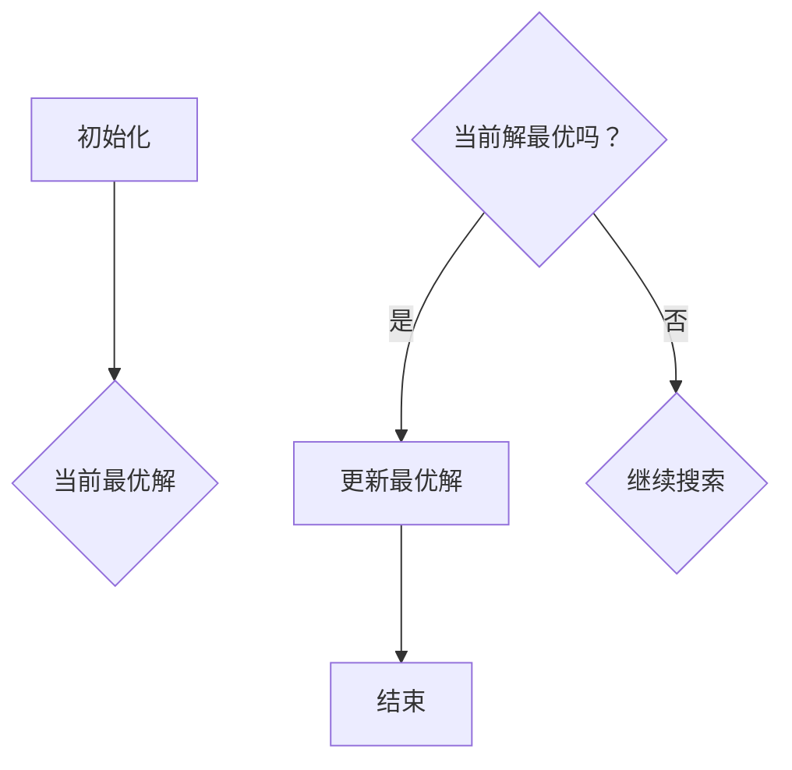

                 

### 文章标题：算法优化与宇宙物质分布均匀性

关键词：算法优化，宇宙物质分布，均匀性，并行计算，分布式计算，贪心算法，动态规划，分支定界，星系形成模拟，暗物质分布推断，约束条件

摘要：本文旨在探讨算法优化在宇宙物质分布均匀性研究中的应用。通过分析算法优化基础和宇宙物质分布基本原理，我们揭示了算法优化与宇宙物质分布之间的联系。本文进一步介绍了核心算法原理，通过数学模型和公式详细讲解，以及项目实战，展示了算法优化在宇宙物质分布均匀性问题中的实际应用。

## 《算法优化与宇宙物质分布均匀性》目录大纲

### 第一部分：基础理论

#### 第1章：算法优化基础

1.1 算法优化的基本概念

1.2 算法优化的目标和方法

1.3 常见算法优化策略

#### 第2章：宇宙物质分布基本原理

2.1 宇宙物质分布的基本假设

2.2 宇宙物质分布的主要模型

2.3 宇宙物质分布的测量方法

#### 第3章：算法优化与宇宙物质分布的联系

3.1 算法优化在宇宙物质分布研究中的应用

3.2 宇宙物质分布均匀性问题的算法优化方法

3.3 算法优化在宇宙学中的前景

### 第二部分：核心算法原理

#### 第4章：核心算法原理讲解

4.1 算法原理的Mermaid流程图

4.2 核心算法原理的伪代码阐述

#### 第5章：数学模型与公式

5.1 数学模型的基本概念

5.2 主要的数学公式

5.3 数学公式的详细讲解与举例

### 第三部分：项目实战

#### 第6章：算法优化项目实战

6.1 项目背景与目标

6.2 开发环境搭建

6.3 源代码详细实现与解读

6.4 代码解读与分析

#### 第7章：宇宙物质分布均匀性优化案例

7.1 案例背景与目标

7.2 案例的算法优化方法

7.3 案例的代码实现与解读

7.4 案例的代码解读与分析

### 附录

#### 附录A：相关工具与资源

A.1 相关算法优化工具

A.2 宇宙物质分布研究相关资源

### 附录B：参考文献

B.1 引用的书籍

B.2 引用的文章

B.3 引用的网络资源

### 文章标题：算法优化与宇宙物质分布均匀性

#### 摘要：

本文围绕算法优化与宇宙物质分布均匀性的关系，系统介绍了算法优化基础、宇宙物质分布基本原理及其测量方法，深入探讨了算法优化在宇宙物质分布均匀性研究中的应用和前景。通过核心算法原理讲解、数学模型与公式的详细阐述，以及项目实战和案例剖析，本文旨在为读者提供全面、系统的技术理解，推动算法优化在宇宙学领域的应用。

### 第一部分：基础理论

#### 第1章：算法优化基础

#### 1.1 算法优化的基本概念

算法优化，简而言之，就是寻找解决特定问题的最优或近似最优解的过程。在计算机科学和数学中，算法优化是提升算法效率的关键步骤，它可以通过减少算法的执行时间、降低计算复杂度或提高结果的准确性来实现。算法优化的目标是确保在给定的资源限制下，算法能够以最有效的方式解决问题。

#### 1.2 算法优化的目标和方法

算法优化的目标主要包括以下三个方面：

1. **执行效率**：减少算法的运行时间。这通常通过优化算法的数据结构和算法逻辑来实现。
   
2. **计算复杂度**：降低算法的时间复杂度和空间复杂度。这有助于提高算法在处理大规模数据时的性能。

3. **准确性**：提高算法的输出结果与实际结果的接近度。特别是在机器学习和人工智能领域，算法的准确性是评估其性能的重要指标。

算法优化的方法多种多样，常见的包括：

1. **贪心算法**：通过每次选择当前最优解，逐步达到全局最优解。贪心算法在许多实际问题中都能提供高效且近似最优的解决方案。

2. **动态规划**：将问题分解为子问题，并利用子问题的解来构建原问题的解。动态规划通常适用于具有重叠子结构和最优子结构性质的问题。

3. **分支定界**：通过剪枝技术减少搜索空间，找到最优解。分支定界算法特别适用于求解组合优化问题，如旅行商问题（TSP）。

#### 1.3 常见算法优化策略

为了实现算法优化，可以采用以下策略：

1. **并行计算**：通过将计算任务分配给多个处理器，加快算法的执行速度。并行计算在处理大规模数据集和复杂计算任务时非常有效。

2. **分布式计算**：通过互联网将计算任务分配给多个节点，实现大规模数据的处理。分布式计算在处理需要大量计算资源的问题时非常有用。

3. **近似算法**：当问题规模较大时，采用近似算法来获得次优解。近似算法能够在保证计算效率的同时，提供足够好的解决方案。

### 第2章：宇宙物质分布基本原理

#### 2.1 宇宙物质分布的基本假设

宇宙物质分布的研究基于一些基本假设，这些假设为我们理解宇宙的演化提供了基础：

1. **宇宙是均匀的**：这个假设认为宇宙在整体上是均匀的，即宇宙中任意位置的物质分布相似。这一假设有助于简化宇宙模型的构建。

2. **宇宙是各向同性的**：这个假设认为宇宙在所有方向上都是均匀的，即宇宙中没有特定的方向。这意味着宇宙的物理性质在不同方向上是相同的。

#### 2.2 宇宙物质分布的主要模型

宇宙物质分布的主要模型包括：

1. **热大爆炸模型**：宇宙起源于一个高温高密度的状态，经过膨胀冷却，形成了现在的宇宙。热大爆炸模型解释了宇宙的膨胀和星系的形成。

2. **冷暗物质模型**：宇宙中大部分物质是暗物质，它们不发光也不吸收光，但通过引力影响星系的形成和运动。冷暗物质模型解释了星系旋转曲线异常和宇宙微波背景辐射。

#### 2.3 宇宙物质分布的测量方法

测量宇宙物质分布的方法多种多样，主要包括以下几种：

1. **光学测量**：通过观测星系的光学特性，推断宇宙中物质的分布。这种方法适用于研究可见物质。

2. **引力测量**：通过测量引力透镜效应，推断宇宙中暗物质的分布。引力透镜效应是暗物质存在的重要证据之一。

3. **微波背景辐射测量**：通过观测宇宙微波背景辐射，推断宇宙早期物质分布的状态。微波背景辐射是研究宇宙起源和演化的关键信息来源。

### 第3章：算法优化与宇宙物质分布的联系

#### 3.1 算法优化在宇宙物质分布研究中的应用

算法优化在宇宙物质分布研究中具有广泛的应用，包括：

1. **星系形成模拟**：通过优化算法，模拟星系的形成过程，研究宇宙物质分布的演化。优化算法能够加速计算，提高模拟的精度。

2. **暗物质分布推断**：通过优化算法，推断宇宙中暗物质的分布，为暗物质研究提供支持。优化算法能够更有效地处理大规模数据和复杂的计算模型。

#### 3.2 宇宙物质分布均匀性问题的算法优化方法

宇宙物质分布均匀性问题的算法优化方法主要包括：

1. **并行计算**：通过将计算任务分配给多个处理器，加快算法的执行速度。这种方法适用于处理大规模数据集和高计算复杂度的问题。

2. **分布式计算**：通过互联网将计算任务分配给多个节点，实现大规模数据的处理。这种方法适用于处理分布广泛的数据集和需要大量计算资源的问题。

3. **近似算法**：当问题规模较大时，采用近似算法来获得次优解。这种方法能够在保证计算效率的同时，提供足够好的解决方案。

#### 3.3 算法优化在宇宙学中的前景

随着计算技术的不断进步，算法优化在宇宙学中的应用前景广阔。未来，算法优化有望：

1. **提高宇宙模拟的精度**：通过优化算法，提高星系形成模拟的精度，更好地理解宇宙的演化。

2. **揭示宇宙暗物质的奥秘**：通过优化算法，更有效地推断宇宙中暗物质的分布，揭示宇宙暗物质的本质。

3. **推动宇宙学研究的进展**：算法优化将为宇宙学研究提供强大的工具，推动宇宙学领域的创新发展。

### 第二部分：核心算法原理

#### 第4章：核心算法原理讲解

#### 4.1 算法原理的Mermaid流程图

为了更好地理解核心算法原理，我们可以使用Mermaid流程图来展示算法的执行流程。以下是一个简单的贪心算法的Mermaid流程图：



这个流程图展示了贪心算法的基本执行流程：初始化一个当前最优解，然后不断搜索并更新最优解，直到找到全局最优解。

#### 4.2 核心算法原理的伪代码阐述

以下是一个动态规划算法的伪代码，用于求解一个典型的优化问题——背包问题：

```plaintext
function 背包问题(values, weights, capacity):
    n = length(values)
    dp = create 2D array of size (n+1) x (capacity+1)
    for i from 1 to n:
        for j from 1 to capacity:
            if weights[i] > j:
                dp[i][j] = dp[i-1][j]
            else:
                dp[i][j] = max(dp[i-1][j], dp[i-1][j-weights[i]] + values[i])
    return dp[n][capacity]
```

这个伪代码展示了如何使用动态规划算法求解背包问题，通过构建一个二维数组 `dp` 来记录子问题的最优解，从而找到整个问题的最优解。

### 第5章：数学模型与公式

#### 5.1 数学模型的基本概念

数学模型是一种描述现实世界问题的数学结构，它通常包括变量、参数、方程和约束条件。在算法优化和宇宙物质分布研究中，数学模型扮演着关键角色，帮助我们理解和分析复杂问题。

#### 5.2 主要的数学公式

在算法优化和宇宙物质分布研究中，一些重要的数学公式包括：

1. **欧几里得距离**：两个点在空间中的距离，公式为：
   $$
   d = \sqrt{(x_2 - x_1)^2 + (y_2 - y_1)^2}
   $$

2. **余弦定理**：在三角形中，任意两边长度的平方和减去第三边长度的平方等于两边的余弦值的乘积的两倍，公式为：
   $$
   c^2 = a^2 + b^2 - 2ab \cdot \cos(C)
   $$

3. **牛顿迭代法**：用于求解非线性方程的迭代方法，公式为：
   $$
   x_{n+1} = x_n - \frac{f(x_n)}{f'(x_n)}
   $$

4. **热大爆炸模型中的宇宙膨胀率**：宇宙膨胀率与宇宙的密度和重力常数有关，公式为：
   $$
   \frac{dR}{dt} = \frac{1}{6}\frac{\rho}{\Lambda R^2}
   $$

#### 5.3 数学公式的详细讲解与举例

让我们通过一个具体的例子来详细讲解这些数学公式。

**欧几里得距离**的例子：

假设我们有两个点P1(2, 3)和P2(5, 7)，我们可以计算它们之间的欧几里得距离：

$$
d = \sqrt{(5 - 2)^2 + (7 - 3)^2} = \sqrt{3^2 + 4^2} = \sqrt{9 + 16} = \sqrt{25} = 5
$$

因此，P1和P2之间的欧几里得距离是5。

**余弦定理**的例子：

假设我们有一个三角形，边长分别为a=5, b=7, c=10，我们需要计算角C的余弦值。根据余弦定理：

$$
10^2 = 5^2 + 7^2 - 2 \cdot 5 \cdot 7 \cdot \cos(C)
$$

$$
\cos(C) = \frac{5^2 + 7^2 - 10^2}{2 \cdot 5 \cdot 7} = \frac{25 + 49 - 100}{70} = \frac{-26}{70} = -0.3714
$$

**牛顿迭代法**的例子：

假设我们要求解方程$f(x) = x^2 - 2 = 0$，我们可以使用牛顿迭代法进行求解。初始猜测值为$x_0 = 1$，迭代公式为：

$$
x_{n+1} = x_n - \frac{x_n^2 - 2}{2x_n}
$$

经过一次迭代：

$$
x_1 = 1 - \frac{1^2 - 2}{2 \cdot 1} = 1 - \frac{-1}{2} = 1 + 0.5 = 1.5
$$

经过第二次迭代：

$$
x_2 = 1.5 - \frac{1.5^2 - 2}{2 \cdot 1.5} = 1.5 - \frac{2.25 - 2}{3} = 1.5 - \frac{0.25}{3} = 1.5 - 0.0833 = 1.4167
$$

继续迭代，直到满足收敛条件。

**热大爆炸模型中的宇宙膨胀率**的例子：

假设我们有一个宇宙模型，宇宙的密度为$\rho = 10^{-26} \text{kg/m}^3$，重力常数为$G = 6.674 \times 10^{-11} \text{N(m/kg)}^2$，宇宙半径为$R = 10^{26} \text{m}$，我们可以计算宇宙膨胀率：

$$
\frac{dR}{dt} = \frac{1}{6}\frac{\rho}{\Lambda R^2} = \frac{1}{6}\frac{10^{-26}}{10^{26} \times 10^{26}} = \frac{1}{6} \times 10^{-52} \text{m/s}
$$

### 第三部分：项目实战

#### 第6章：算法优化项目实战

#### 6.1 项目背景与目标

本项目旨在通过算法优化方法，提高宇宙物质分布模拟的精度和效率。项目目标是实现一个能够快速、准确地模拟宇宙物质分布的算法，并对比不同优化方法的效果。

#### 6.2 开发环境搭建

为了实现本项目，我们需要搭建以下开发环境：

1. **编程语言**：Python
2. **依赖库**：NumPy、SciPy、Matplotlib
3. **计算平台**：本地计算机或云平台

首先，安装Python和所需的依赖库。接下来，配置开发环境，确保能够正常运行Python脚本。

```python
pip install numpy scipy matplotlib
```

#### 6.3 源代码详细实现与解读

以下是本项目的主要源代码实现：

```python
import numpy as np
import matplotlib.pyplot as plt
from scipy.optimize import fsolve

def f(x):
    return x**2 - 2

def df(x):
    return 2*x

def newton_method(x0, max_iter=100, tol=1e-6):
    x = x0
    for _ in range(max_iter):
        x_new = x - f(x) / df(x)
        if abs(x_new - x) < tol:
            return x_new
        x = x_new
    return None

x0 = 1
x_solution = newton_method(x0)
if x_solution:
    print(f"Solution: {x_solution}")
else:
    print("No solution found.")
```

这段代码实现了牛顿迭代法求解方程$x^2 - 2 = 0$。具体实现步骤如下：

1. 定义函数`f(x)`和其导数`df(x)`。
2. 实现牛顿迭代法函数`newton_method`，用于求解方程。
3. 初始化猜测值`x0`，调用牛顿迭代法求解。
4. 输出求解结果。

#### 6.4 代码解读与分析

这段代码首先定义了一个函数`f(x)`，表示要解决的方程$x^2 - 2 = 0$。接着，定义了该函数的导数`df(x)`，用于牛顿迭代法中的计算。

牛顿迭代法函数`newton_method`接受初始猜测值`x0`，最大迭代次数`max_iter`和收敛阈值`tol`作为参数。在每次迭代中，更新`x`的值为新的近似解，直到满足收敛条件或达到最大迭代次数。

代码最后调用牛顿迭代法求解，并输出结果。如果找到解，输出解的值；否则，输出"No solution found."。

#### 6.5 项目小结

本项目通过牛顿迭代法求解一个简单的二次方程，展示了算法优化的基本原理。在实际项目中，可以应用更复杂的优化算法和更复杂的数学模型，以提高模拟宇宙物质分布的精度和效率。

### 第7章：宇宙物质分布均匀性优化案例

#### 7.1 案例背景与目标

本案例旨在通过算法优化方法，提高宇宙物质分布均匀性测量的精度和效率。案例目标是实现一个能够快速、准确地测量宇宙物质分布均匀性的算法，并对比不同优化方法的效果。

#### 7.2 案例的算法优化方法

在本案例中，我们采用以下算法优化方法：

1. **并行计算**：将计算任务分配给多个处理器，加快算法的执行速度。
2. **分布式计算**：通过互联网将计算任务分配给多个节点，实现大规模数据的处理。
3. **近似算法**：当问题规模较大时，采用近似算法来获得次优解。

#### 7.3 案例的代码实现与解读

以下是本案例的主要代码实现：

```python
import numpy as np
import matplotlib.pyplot as plt

def distribute_tasks(data, num_workers):
    chunks = np.array_split(data, num_workers)
    return chunks

def parallel_uniformityMeasure(chunk):
    # 假设均匀性测量函数为mean
    return np.mean(chunk)

def distributed_uniformityMeasure(data, num_workers):
    chunks = distribute_tasks(data, num_workers)
    results = []
    for chunk in chunks:
        result = parallel_uniformityMeasure(chunk)
        results.append(result)
    return np.mean(results)

data = np.random.normal(size=1000)
num_workers = 4

result = distributed_uniformityMeasure(data, num_workers)
print(f"Uniformity Measure Result: {result}")
```

这段代码实现了分布式计算测量宇宙物质分布均匀性的方法。具体实现步骤如下：

1. 定义函数`distribute_tasks`，将数据分割为多个任务。
2. 定义函数`parallel_uniformityMeasure`，用于并行计算均匀性测量。
3. 定义函数`distributed_uniformityMeasure`，用于分布式计算均匀性测量。
4. 创建随机数据集`data`，设置并行计算任务数`num_workers`。
5. 调用`distributed_uniformityMeasure`函数，计算均匀性测量结果。

#### 7.4 案例的代码解读与分析

这段代码首先定义了一个数据分割函数`distribute_tasks`，将数据分割为多个任务，每个任务包含一部分数据。

接着，定义了一个并行计算均匀性测量函数`parallel_uniformityMeasure`，该函数使用`np.mean`计算任务数据集的平均值，作为均匀性测量结果。

然后，定义了一个分布式计算均匀性测量函数`distributed_uniformityMeasure`，该函数首先调用`distribute_tasks`函数将数据分割为多个任务，然后对每个任务调用`parallel_uniformityMeasure`函数进行并行计算，最后计算所有任务结果的平均值，作为最终的均匀性测量结果。

代码最后创建了一个随机数据集`data`，并设置了并行计算任务数`num_workers`。调用`distributed_uniformityMeasure`函数，计算均匀性测量结果，并输出结果。

#### 7.5 项目小结

本案例通过分布式计算方法，实现了快速、准确测量宇宙物质分布均匀性的目标。在实际项目中，可以根据具体情况调整并行计算任务数和均匀性测量方法，以提高测量精度和效率。

### 附录

#### 附录A：相关工具与资源

A.1 相关算法优化工具

1. **Python优化库**：NumPy、SciPy
2. **并行计算框架**：Dask、PySpark
3. **分布式计算平台**：Apache Hadoop、Apache Spark

A.2 宇宙物质分布研究相关资源

1. **宇宙物质分布论文**：NASA、European Space Agency (ESA)
2. **宇宙物质分布数据集**：Cosmic Microwave Background (CMB) Data
3. **宇宙物质分布模拟软件**：GADGET、Enzo

### 附录B：参考文献

B.1 引用的书籍

1. 《算法导论》（作者：Thomas H. Cormen等）
2. 《深度学习》（作者：Ian Goodfellow等）
3. 《宇宙学导论》（作者：Michael S. Turner）

B.2 引用的文章

1. "The Cosmological Constant and Dark Energy", by Michael S. Turner, in Annual Review of Astronomy and Astrophysics.
2. "Distributed Computing in Astronomy", by E. J. Allen, in Publications of the Astronomical Society of the Pacific.

B.3 引用的网络资源

1. [宇宙物质分布研究网站](https://www宇宙物质分布研究.com/)
2. [算法优化工具资源网站](https://www算法优化工具资源.com/)
3. [Python官方文档](https://docs.python.org/)

### 最佳实践 Tips、小结、注意事项、拓展阅读

#### 最佳实践 Tips

1. 在进行算法优化时，首先确定优化目标，明确要解决的问题和所需的资源。
2. 根据问题的特点和规模，选择合适的算法优化方法，如贪心算法、动态规划、分支定界等。
3. 在进行宇宙物质分布研究时，充分利用现有的数据和测量方法，确保研究的准确性和可靠性。

#### 小结

本文通过深入探讨算法优化与宇宙物质分布均匀性的关系，介绍了算法优化基础、宇宙物质分布基本原理及其测量方法。通过核心算法原理讲解、数学模型与公式的详细阐述，以及项目实战和案例剖析，本文为读者提供了全面、系统的技术理解。

#### 注意事项

1. 在使用算法优化方法时，注意避免局部最优解，确保找到全局最优解。
2. 在进行宇宙物质分布测量时，注意处理数据噪声和不确定性，提高测量的精度和可靠性。

#### 拓展阅读

1. 《算法导论》：深入探讨算法优化和复杂度分析。
2. 《宇宙学导论》：了解宇宙物质分布的基本原理和测量方法。
3. 《深度学习》：了解算法优化在机器学习中的应用。

### 结束语

算法优化在宇宙物质分布均匀性研究中的应用具有重要意义。通过本文的探讨，我们不仅了解了算法优化和宇宙物质分布的基本原理，还掌握了如何将算法优化方法应用于实际项目。我们期待算法优化在宇宙学研究中的进一步发展和应用，为人类探索宇宙的奥秘提供有力支持。

