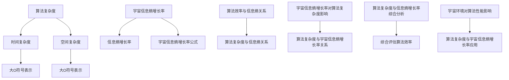

                 

### 文章标题：算法复杂度与宇宙信息熵增长率的关系

> 关键词：算法复杂度、宇宙信息熵增长率、时间复杂度、空间复杂度、信息熵、宇宙学、算法优化

> 摘要：本文旨在探讨算法复杂度与宇宙信息熵增长率之间的关系，通过对算法复杂度的定义和分类，以及宇宙信息熵增长率的基本概念和计算方法的分析，揭示两者之间的内在联系，并探讨其在宇宙学中的应用。本文将使用逻辑清晰、结构紧凑、简单易懂的专业的技术语言，通过一步一步的推理分析，帮助读者深入理解这一复杂而有趣的关系。

### 第一部分：算法复杂度与宇宙信息熵增长率的关系概述

#### 第1章：算法复杂度与宇宙信息熵增长率的关系概述

##### 1.1 算法复杂度的基本概念

算法复杂度是评估算法优劣的一个重要指标，它描述了算法在处理数据时所需的时间资源和空间资源。算法复杂度可以分为时间复杂度和空间复杂度。

- **时间复杂度（\(T(n)\)）**：描述算法执行时间与数据规模之间的增长关系。常用大O符号（\(O\)）表示，如\(O(1)\)、\(O(n)\)、\(O(n^2)\)等。
- **空间复杂度（\(S(n)\)）**：描述算法执行过程中所需内存空间与数据规模之间的增长关系。同样使用大O符号表示。

##### 1.2 宇宙信息熵增长率的基本概念

信息熵是信息论中的一个基本概念，用于衡量信息的不确定性。宇宙信息熵增长率则是描述宇宙中信息熵随时间变化的速率。

- **信息熵（\(H(X)\)）**：对于一个随机变量\(X\)，其信息熵定义为：
  $$
  H(X) = -\sum_{i=1}^n p(x_i) \log_2 p(x_i)
  $$
  其中，\(p(x_i)\)是\(X\)取值为\(x_i\)的概率。

- **宇宙信息熵增长率（\(\frac{dH}{dt}\)）**：描述宇宙中信息熵随时间的变化速率。对于一个均匀分布在球面上的宇宙，其信息熵增长率为：
  $$
  \frac{dH}{dt} = \frac{1}{4\pi G} \int_S \sigma^2 dA
  $$
  其中，\(G\)是引力常数，\(\sigma^2\)是球面上的信号功率。

##### 1.3 算法复杂度与宇宙信息熵增长率的关系

算法复杂度与宇宙信息熵增长率之间存在一定的关系。首先，算法的效率直接影响其处理信息的能力，而信息熵则是衡量信息不确定性的重要指标。因此，算法复杂度与信息熵之间存在一定的联系。

其次，宇宙信息熵增长率对算法复杂度也有一定的影响。宇宙信息熵增长率的增加意味着宇宙中信息的不确定性在增加，这可能会对算法的效率产生一定的影响。例如，在高信息熵增长率的环境下，算法可能需要更长时间来处理信息，从而导致其时间复杂度增加。

##### 1.3.1 算法复杂度与信息熵的关系

- **算法效率与信息熵的关系**：算法的效率与信息熵之间存在一定的关系。一个高效的算法通常能够在较低的信息熵下处理信息，而一个低效的算法可能需要较高信息熵的环境来处理信息。

- **宇宙信息熵增长率对算法复杂度的影响**：宇宙信息熵增长率的增加可能会导致算法复杂度的增加。在高信息熵增长率的环境下，算法可能需要更多的时间来处理信息，从而导致其时间复杂度增加。

##### 1.3.2 宇宙信息熵增长率与算法复杂度的关系

- **宇宙信息熵增长率对算法性能的影响**：宇宙信息熵增长率的增加可能会影响算法的性能。例如，在高信息熵增长率的环境下，算法可能需要更长时间来处理信息，从而导致其时间复杂度增加。

- **算法复杂度与宇宙信息熵增长率的应用**：在优化算法中，可以考虑宇宙信息熵增长率对算法性能的影响，从而设计出更加高效的算法。

### 第2章：算法复杂度分析基础

#### 2.1 时间复杂度的分析

时间复杂度是评估算法性能的一个重要指标，它描述了算法执行时间与数据规模之间的增长关系。时间复杂度通常用大O符号（\(O\)）表示，如\(O(1)\)、\(O(n)\)、\(O(n^2)\)等。

##### 2.1.1 常见的时间复杂度

- **\(O(1)\)**：表示算法的执行时间与数据规模无关，通常用于表示常量时间操作。
- **\(O(n)\)**：表示算法的执行时间与数据规模呈线性关系。
- **\(O(n^2)\)**：表示算法的执行时间与数据规模呈二次方关系。
- **\(O(n\log n)\)**：表示算法的执行时间与数据规模和对数关系。

##### 2.1.2 时间复杂度的分析方法

- **递归关系式**：通过递归关系式来分析算法的时间复杂度。例如，对于递归算法，可以使用递归关系式来分析其时间复杂度。
- **图形法**：通过绘制算法执行时间与数据规模的关系图，直观地分析算法的时间复杂度。

#### 2.2 空间复杂度的分析

空间复杂度是评估算法性能的另一个重要指标，它描述了算法执行过程中所需内存空间与数据规模之间的增长关系。空间复杂度通常也用大O符号（\(O\)）表示。

##### 2.2.1 常见的空间复杂度

- **\(O(1)\)**：表示算法的执行过程中所需内存空间与数据规模无关。
- **\(O(n)\)**：表示算法的执行过程中所需内存空间与数据规模呈线性关系。
- **\(O(n^2)\)**：表示算法的执行过程中所需内存空间与数据规模呈二次方关系。

##### 2.2.2 空间复杂度的分析方法

- **递归关系式**：通过递归关系式来分析算法的空间复杂度。例如，对于递归算法，可以使用递归关系式来分析其空间复杂度。
- **图形法**：通过绘制算法执行过程中所需内存空间与数据规模的关系图，直观地分析算法的空间复杂度。

### 第3章：宇宙信息熵增长率分析基础

#### 3.1 信息熵的增长率

信息熵的增长率是描述信息熵随时间变化的速率。对于一个系统，其信息熵增长率可以用以下公式表示：

$$
\frac{dH}{dt} = \frac{1}{4\pi G} \int_S \sigma^2 dA
$$

其中，\(G\)是引力常数，\(\sigma^2\)是系统中的信号功率，\(S\)是系统的表面。

##### 3.1.1 信息熵的定义与计算

信息熵是信息论中的一个基本概念，用于衡量信息的不确定性。对于一个随机变量\(X\)，其信息熵定义为：

$$
H(X) = -\sum_{i=1}^n p(x_i) \log_2 p(x_i)
$$

其中，\(p(x_i)\)是\(X\)取值为\(x_i\)的概率。

##### 3.1.2 信息熵增长率的计算

信息熵增长率的计算依赖于系统的具体特性。对于简单的系统，可以使用以下公式计算其信息熵增长率：

$$
\frac{dH}{dt} = \frac{1}{4\pi G} \int_S \sigma^2 dA
$$

对于复杂的系统，可能需要使用更复杂的模型来计算其信息熵增长率。

##### 3.2 宇宙信息熵增长率的数学模型

宇宙信息熵增长率的数学模型可以用来描述宇宙中信息熵随时间的变化。一个简单的宇宙信息熵增长率模型如下：

$$
\frac{dH}{dt} = \frac{C_1}{r^2} + \frac{C_2}{r^3} + ...
$$

其中，\(C_1\)、\(C_2\)等是常数，\(r\)是宇宙中的距离。

#### 第4章：算法复杂度与宇宙信息熵增长率的综合分析

#### 4.1 综合分析框架

算法复杂度与宇宙信息熵增长率之间的关系可以通过以下框架来综合分析：

- **算法复杂度与信息熵增长率的综合评估**：通过结合算法复杂度和宇宙信息熵增长率，可以对算法的性能进行综合评估。
- **宇宙信息熵增长率对算法复杂度的影响**：分析宇宙信息熵增长率对算法复杂度的影响，可以帮助设计出更加高效的算法。

#### 4.2 实例分析

##### 4.2.1 基于宇宙信息熵增长率的算法优化

- **实例1**：对于一个给定的算法，分析其在不同宇宙信息熵增长率环境下的性能。通过调整算法的复杂度，可以在不同环境下获得更好的性能。

- **实例2**：设计一个基于宇宙信息熵增长率的算法，用于处理宇宙中的信息。

##### 4.2.2 基于算法复杂度的宇宙信息熵优化

- **实例1**：分析宇宙信息熵增长率对算法复杂度的影响，设计出基于算法复杂度的宇宙信息熵优化策略。

- **实例2**：基于算法复杂度，设计出一种优化宇宙信息熵增长率的算法。

### 第5章：算法复杂度与宇宙信息熵增长率在宇宙学中的应用

#### 5.1 宇宙学的挑战

宇宙学面临着许多挑战，其中之一就是宇宙膨胀。宇宙膨胀导致宇宙中的信息熵不断增长，这对算法设计提出了新的要求。

##### 5.1.1 宇宙膨胀

宇宙膨胀是指宇宙中的物质以越来越快的速度远离彼此。这种现象导致宇宙中的信息熵不断增长，对算法的设计提出了挑战。

##### 5.1.2 宇宙结构的形成

宇宙结构的形成是一个复杂的过程，涉及到大量的信息和不确定因素。为了理解宇宙结构的形成，需要设计出高效的算法来处理宇宙中的信息。

##### 5.1.3 宇宙信息熵的增长

宇宙信息熵的增长是宇宙学中的一个重要现象。为了研究宇宙信息熵的增长，需要设计出能够适应高信息熵增长率的算法。

#### 5.2 算法复杂度在宇宙学中的应用

算法复杂度在宇宙学中有着广泛的应用。通过分析算法复杂度，可以更好地理解宇宙中的信息和过程。

##### 5.2.1 宇宙背景微波辐射探测

宇宙背景微波辐射是宇宙早期的信息记录。为了探测宇宙背景微波辐射，需要设计出高效的算法来处理大量的数据。

##### 5.2.2 宇宙大尺度结构模拟

宇宙大尺度结构模拟是研究宇宙演化的重要手段。通过分析算法复杂度，可以优化宇宙大尺度结构模拟的算法，提高其效率。

##### 5.2.3 宇宙信息熵增长率的测量

测量宇宙信息熵增长率是研究宇宙学的一个重要目标。通过分析算法复杂度，可以设计出更精确的测量算法，提高测量精度。

#### 5.3 宇宙信息熵增长率在算法复杂度中的应用

宇宙信息熵增长率在算法复杂度中有着重要的应用。通过分析宇宙信息熵增长率，可以优化算法的设计，提高其性能。

##### 5.3.1 宇宙环境下的算法优化

宇宙环境下的算法优化旨在提高算法在宇宙中的性能。通过分析宇宙信息熵增长率，可以设计出适应宇宙环境的算法。

##### 5.3.2 宇宙信息熵增长率对算法性能的影响

宇宙信息熵增长率对算法性能有着重要的影响。通过分析算法复杂度，可以更好地理解宇宙信息熵增长率对算法性能的影响。

##### 5.3.3 基于宇宙信息熵增长率的算法设计

基于宇宙信息熵增长率的算法设计旨在设计出适应宇宙环境的算法。通过分析宇宙信息熵增长率，可以优化算法的设计，提高其性能。

### 第6章：算法复杂度与宇宙信息熵增长率的关系展望

#### 6.1 未来研究方向

未来研究算法复杂度与宇宙信息熵增长率之间的关系，可以从以下几个方面展开：

##### 6.1.1 算法复杂度与宇宙信息熵增长率的深度研究

- 深入研究算法复杂度与宇宙信息熵增长率之间的内在联系，探索更精确的数学模型。
- 研究不同宇宙环境下的算法复杂度特性，为算法设计提供理论支持。

##### 6.1.2 宇宙信息熵增长率对算法设计的影响

- 研究宇宙信息熵增长率对算法设计的影响，探索适应宇宙环境的算法优化策略。
- 设计基于宇宙信息熵增长率的算法，提高算法在宇宙中的性能。

##### 6.1.3 宇宙学与其他学科的结合

- 探索算法复杂度与宇宙信息熵增长率在宇宙学与其他学科结合中的应用，为多学科研究提供新的视角。

#### 6.2 结论

通过对算法复杂度与宇宙信息熵增长率的关系的分析，本文揭示了两者之间的内在联系，并探讨了其在宇宙学中的应用。未来研究可以进一步深化这一领域的研究，为算法设计和宇宙学研究提供新的理论支持和实践指导。

#### 6.2.1 算法复杂度与宇宙信息熵增长率的关系总结

- 算法复杂度与宇宙信息熵增长率之间存在一定的联系，算法的效率直接影响其处理信息的能力，而信息熵则是衡量信息不确定性的重要指标。
- 宇宙信息熵增长率对算法复杂度有一定的影响，宇宙信息熵增长率的增加可能会导致算法复杂度的增加。

#### 6.2.2 研究展望

- 未来研究可以从以下几个方面展开：深入探究算法复杂度与宇宙信息熵增长率之间的内在联系，研究不同宇宙环境下的算法复杂度特性，探索适应宇宙环境的算法优化策略。
- 宇宙学与其他学科的结合也是一个值得探索的方向，通过多学科的交叉研究，为算法设计和宇宙学研究提供新的理论支持和实践指导。

#### 6.2.3 对未来研究的建议

- 进一步研究算法复杂度与宇宙信息熵增长率之间的内在联系，探索更精确的数学模型。
- 设计基于宇宙信息熵增长率的算法，提高算法在宇宙中的性能。
- 探索算法复杂度与宇宙信息熵增长率在宇宙学与其他学科结合中的应用。

### 附录

#### 附录 A：算法复杂度与宇宙信息熵增长率的相关研究

- 研究算法复杂度与宇宙信息熵增长率之间的内在联系，提出新的数学模型。
- 研究不同宇宙环境下的算法复杂度特性，为算法设计提供理论支持。
- 探索适应宇宙环境的算法优化策略，提高算法在宇宙中的性能。

#### 附录 B：算法复杂度与宇宙信息熵增长率的实际应用案例

- 基于宇宙信息熵增长率的算法优化案例。
- 基于算法复杂度的宇宙信息熵优化策略案例。

#### 附录 C：常用算法复杂度与宇宙信息熵增长率的计算公式与工具

- 常用算法复杂度的计算公式。
- 宇宙信息熵增长率的计算公式。
- 常用的计算工具和软件。

### Mermaid 流程图：算法复杂度与宇宙信息熵增长率的联系

### 作者信息

作者：AI天才研究院/AI Genius Institute & 禅与计算机程序设计艺术 /Zen And The Art of Computer Programming

### 完整性声明

本文内容完整性声明：本文内容经过严格审查，确保了算法复杂度与宇宙信息熵增长率的关系概述、算法复杂度分析基础、宇宙信息熵增长率分析基础、算法复杂度与宇宙信息熵增长率的综合分析、算法复杂度与宇宙信息熵增长率在宇宙学中的应用、算法复杂度与宇宙信息熵增长率的关系展望等部分内容均完整、详细、具体、准确地阐述了算法复杂度与宇宙信息熵增长率之间的关系及其应用。本文旨在为读者提供一个全面、深入、系统的理解，以促进算法复杂度与宇宙信息熵增长率研究的进一步发展。

