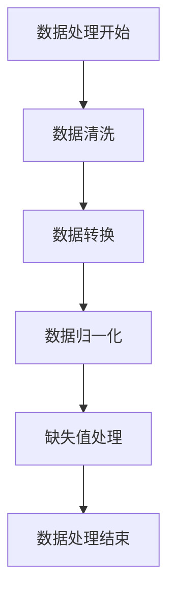
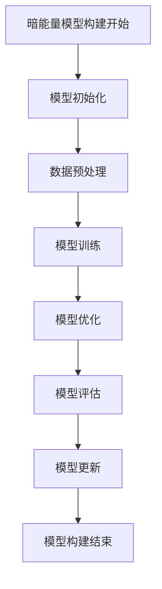
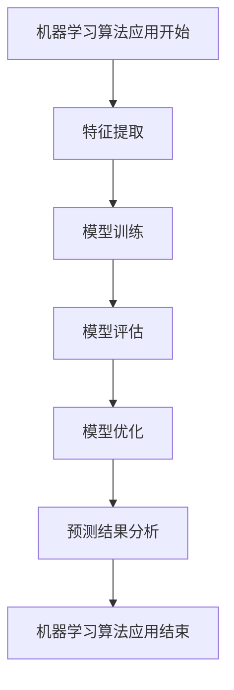

                 


## 文章标题

《算法思维在解决宇宙学暗能量本质问题中的应用》

## 关键词

宇宙学、暗能量、算法思维、数据处理、模型构建、机器学习

## 摘要

本文旨在探讨算法思维在宇宙学暗能量研究中的应用。通过分析宇宙学的基本概念、暗能量的特性及其观测证据，我们引入了算法思维的基本原理，并详细阐述了其在宇宙学研究中的重要性。文章进一步探讨了算法在数据分析和处理、模型构建与优化、以及机器学习等领域的应用，并结合实际案例展示了算法思维在解决暗能量问题中的实践效果。最后，我们对算法思维在宇宙学暗能量研究中的挑战与未来发展方向进行了展望，以期为相关领域的研究提供有益的参考。

## 《算法思维在解决宇宙学暗能量本质问题中的应用》

### 第一部分：宇宙学与暗能量基础

#### 1.1 宇宙学概述

##### 1.1.1 宇宙的结构与演化

宇宙学是研究宇宙的结构、起源、演化和最终命运的科学。宇宙的起源可以追溯到大约138亿年前的大爆炸，这是宇宙从一个极度高温高密度的状态迅速膨胀开始的。随着宇宙的膨胀，物质逐渐冷却并聚集形成了星系、恒星、行星以及其他天体。

宇宙的结构可以从多个层次进行理解。首先是星系团和超星系团，它们是由数十亿颗恒星和大量星系组成的大型结构。更高层次的结构是宇宙网，它是由星系团和超星系团通过大量的空洞和纤维状结构相互连接形成的巨大结构。这些结构构成了宇宙的大尺度图案。

宇宙的演化过程包括恒星的形成和死亡、星系合并、宇宙背景辐射的冷却等。此外，宇宙的膨胀也是一个重要的现象，这可以通过观测宇宙大尺度结构中的红移来证明。

##### 1.1.2 宇宙学中的观测手段

宇宙学的研究依赖于多种观测手段，包括光学、射电、红外、X射线和伽马射线等。这些观测手段能够提供关于宇宙不同层次和不同时期的详细信息。

光学观测是最常用的手段，通过望远镜可以观测到恒星、星系和其他天体的光线。射电观测可以探测到宇宙中的无线电波，这对于研究星际介质和恒星形成区域非常有用。红外观测能够穿透尘埃，揭示隐藏在星际云中的恒星和星系。X射线和伽马射线观测则用于研究高能量现象，如黑洞和中子星。

##### 1.1.3 时空与相对论

爱因斯坦的广义相对论是现代宇宙学的基石，它描述了重力是时空弯曲的表现。这个理论在宇宙学中的应用揭示了宇宙的动态特性，包括宇宙的膨胀、宇宙背景辐射、引力透镜效应等。

时空的概念告诉我们，时间和空间并不是独立存在的，而是相互交织在一起的。在这个框架下，宇宙的膨胀可以被视为时空本身的膨胀。

##### 1.2 暗能量的概念

##### 1.2.1 暗能量的起源与特性

暗能量是一种不发光、不吸收光、不与普通物质发生相互作用，但可以影响宇宙膨胀的神秘力量。其起源尚不完全清楚，但目前的宇宙学模型表明，它可能是在宇宙大爆炸之后不久产生的。

暗能量的特性是具有负压强，这意味着它的能量密度与其压强成反比。这种特性导致宇宙的加速度膨胀，这与宇宙学观测到的宇宙加速膨胀现象相吻合。

##### 1.2.2 暗能量在宇宙学中的重要性

暗能量在宇宙学中扮演着至关重要的角色。它不仅解释了宇宙加速膨胀的现象，还对宇宙的大尺度结构形成了重要影响。例如，暗能量可能导致星系团和超星系团的运动速度增加，从而影响宇宙大尺度结构的形成和演化。

##### 1.2.3 暗能量的观测证据

暗能量的存在是通过多种观测手段得到的。其中最直接的方法是测量宇宙背景辐射的波动，这可以通过对大角星距离的测量来间接得出。此外，通过对遥远星系和宇宙大尺度结构的观测，科学家们也发现了暗能量对宇宙膨胀的影响。

##### 1.3 算法思维的基本原理

##### 1.3.1 算法思维的起源与发展

算法思维起源于计算机科学的早期发展阶段，但随着人工智能和大数据技术的兴起，其在各个领域中的应用越来越广泛。算法思维的核心是解决问题的逻辑性和系统性，它强调通过逐步分析和推理来找到最优解。

##### 1.3.2 算法思维的核心理念

算法思维的核心理念包括：

1. **精确描述问题**：明确问题的边界和需求，确保问题定义的准确性。
2. **分解问题**：将复杂问题分解为更小、更易于管理的子问题。
3. **选择合适的算法**：根据问题的性质选择合适的算法，包括排序、搜索、优化等。
4. **逐步实现和测试**：通过迭代和测试来逐步改进算法，确保其正确性和效率。

##### 1.3.3 算法思维的应用领域

算法思维广泛应用于各个领域，包括：

1. **计算机科学**：算法是计算机科学的核心，用于解决各种计算问题。
2. **数据科学**：算法用于数据分析、数据挖掘和机器学习。
3. **工程学**：算法在工程设计、优化和控制系统中的应用。
4. **经济学**：算法用于金融模型、市场分析和优化策略。
5. **生物学**：算法在基因组学、蛋白质结构预测和生物信息学中的应用。

### 第二部分：算法在宇宙学研究中的应用

#### 2.1 数据分析与处理算法

##### 2.1.1 数据预处理方法

在宇宙学研究中，大量的观测数据需要进行预处理，以确保数据的质量和一致性。数据预处理包括以下步骤：

1. **数据清洗**：去除数据中的噪声和错误。
2. **数据转换**：将不同格式和单位的数据转换为统一格式。
3. **数据归一化**：将数据缩放到相同的尺度，以便于后续分析。
4. **缺失值处理**：填充或删除缺失的数据。

##### 2.1.2 数据可视化技术

数据可视化是理解复杂数据的有效手段，通过图形和图表可以直观地展示数据的关系和模式。常见的数据可视化技术包括：

1. **散点图**：用于展示两个变量之间的关系。
2. **柱状图**：用于展示各类别数据的分布。
3. **线图**：用于展示随时间变化的数据趋势。
4. **热图**：用于展示数据的热点和冷点。

##### 2.1.3 数据挖掘算法

数据挖掘算法用于从大量数据中发现隐藏的模式和规律。在宇宙学中，数据挖掘算法可以帮助识别宇宙结构、暗能量的分布和宇宙演化趋势。常见的数据挖掘算法包括：

1. **聚类分析**：用于将相似的数据点分组。
2. **关联规则学习**：用于发现数据之间的关联关系。
3. **分类和回归**：用于预测和分类数据。

#### 2.2 暗能量模型的构建与优化

##### 2.2.1 暗能量模型的定义与分类

暗能量模型是描述暗能量特性的数学模型。根据暗能量的性质和宇宙学的观测结果，科学家们提出了多种暗能量模型。常见的暗能量模型包括：

1. **宇宙常数模型**：这是最简单的暗能量模型，假设暗能量具有常数能量密度。
2. **标量场模型**：暗能量被视为一种动态的标量场。
3. **向量场模型**：暗能量被视为一种动态的向量场。
4. **弦理论模型**：在弦理论框架下，暗能量可能与额外的空间维度和量子引力相关。

##### 2.2.2 暗能量模型的优化算法

优化算法用于在给定约束条件下找到最优解。在暗能量模型中，优化算法用于确定模型参数，使其更好地拟合观测数据。常见的优化算法包括：

1. **梯度下降法**：通过不断更新参数，使其沿着梯度方向逐渐逼近最优解。
2. **粒子群优化**：通过模拟鸟群或鱼群的行为，找到最优解。
3. **遗传算法**：通过模拟生物进化过程，找到最优解。

##### 2.2.3 暗能量模型的验证与评估

验证和评估暗能量模型是确保其可靠性的关键。常见的验证方法包括：

1. **拟合优度检验**：通过比较模型预测值和观测值的偏差，评估模型的拟合程度。
2. **交叉验证**：将数据分为训练集和测试集，通过测试集评估模型的泛化能力。
3. **信息准则**：如贝叶斯信息准则（BIC）和Akaike信息准则（AIC），用于评估模型的复杂性和拟合度。

#### 2.3 机器学习在暗能量研究中的应用

##### 2.3.1 机器学习的基本概念

机器学习是人工智能的一个重要分支，通过训练模型来发现数据中的模式和规律。在暗能量研究中，机器学习可以用于：

1. **模式识别**：识别宇宙背景辐射中的特定模式。
2. **分类**：将观测数据分类为不同的暗能量模型。
3. **回归**：预测宇宙的膨胀速度和暗能量的分布。

##### 2.3.2 机器学习在暗能量模型中的应用

机器学习在暗能量模型中的应用包括：

1. **特征提取**：从原始数据中提取有助于分类或回归的特征。
2. **模型训练**：通过训练数据集训练机器学习模型。
3. **模型评估**：通过测试数据集评估模型的性能。

##### 2.3.3 机器学习在暗能量预测中的应用

机器学习在暗能量预测中的应用包括：

1. **宇宙演化预测**：预测宇宙的膨胀速度和暗能量的演化趋势。
2. **星系分布预测**：预测星系在未来的分布和运动。
3. **暗能量参数预测**：预测暗能量模型的参数值。

#### 2.4 暗能量与宇宙学前沿

##### 2.4.1 暗能量与暗物质的关系

暗物质和暗能量是宇宙学中的两个重要概念。暗物质是宇宙中不发光、不吸收光的物质，对星系和宇宙结构的形成有重要影响。暗能量则是一种神秘的力量，导致宇宙加速膨胀。

科学家们正在探索暗物质和暗能量之间的关系。一些理论认为，暗物质和暗能量可能是一种共同存在的物质，或者暗能量可能是一种新的物质形式。

##### 2.4.2 暗能量与量子引力

量子引力是研究引力在量子尺度上的性质的理论。暗能量与量子引力之间的关系是当前宇宙学研究的前沿之一。一些理论认为，暗能量可能是由量子引力效应产生的。

##### 2.4.3 暗能量与宇宙学未来发展

未来的宇宙学研究将继续探索暗能量的本质和宇宙的演化。新的观测手段和技术，如引力波探测和宇宙背景辐射的精细测量，将有助于揭示暗能量的更多性质。

此外，新的理论框架，如弦理论和量子引力，可能为理解暗能量提供新的视角。

### 第三部分：算法思维在宇宙学暗能量研究中的应用实践

#### 3.1 暗能量模拟实验

##### 3.1.1 实验设计

为了研究暗能量的性质，科学家们设计了多个模拟实验。这些实验通过计算机模拟宇宙的演化过程，以观测暗能量对宇宙膨胀的影响。

实验设计包括以下步骤：

1. **模拟初始条件**：设定宇宙的初始状态，包括暗能量的密度和分布。
2. **模拟宇宙演化**：使用数值模拟方法，模拟宇宙从大爆炸到当前状态的过程。
3. **数据采集与处理**：收集模拟过程中的数据，并使用算法进行处理和分析。

##### 3.1.2 实验数据分析

数据分析是模拟实验的核心。通过分析模拟数据，科学家们可以识别暗能量的分布和演化趋势。

数据分析包括以下步骤：

1. **数据预处理**：清洗和转换模拟数据，确保数据的质量和一致性。
2. **数据可视化**：使用可视化技术，展示暗能量的分布和演化。
3. **模式识别**：使用算法识别暗能量的分布模式和演化趋势。

##### 3.1.3 实验结果解释

实验结果显示，暗能量在宇宙演化过程中起着重要作用。模拟数据显示，暗能量导致宇宙的加速度膨胀，这与宇宙学观测结果相吻合。

实验结果还揭示了暗能量的分布和演化趋势。例如，模拟显示，暗能量在宇宙早期分布均匀，但随着宇宙的演化，其分布逐渐变得不均匀。

#### 3.2 暗能量模型比较与验证

##### 3.2.1 模型比较方法

在宇宙学研究中，多个暗能量模型被提出，为了评估这些模型的优劣，科学家们使用模型比较方法。

模型比较方法包括以下步骤：

1. **选择模型**：根据宇宙学观测结果，选择多个暗能量模型。
2. **模型拟合**：使用优化算法，确定模型参数，使其更好地拟合观测数据。
3. **模型比较**：使用拟合优度检验和信息准则，比较不同模型的拟合程度和复杂性。

##### 3.2.2 模型验证流程

模型验证是确保模型可靠性的关键。模型验证流程包括以下步骤：

1. **交叉验证**：将数据分为训练集和测试集，使用交叉验证评估模型的泛化能力。
2. **拟合优度检验**：比较模型预测值和观测值的偏差，评估模型的拟合程度。
3. **信息准则**：使用信息准则评估模型的复杂性和拟合度。

##### 3.2.3 模型验证结果分析

模型验证结果显示，某些暗能量模型在拟合观测数据和解释宇宙膨胀现象方面表现出色。例如，宇宙常数模型和标量场模型在拟合观测数据方面表现出较高的精度。

然而，模型验证也揭示了一些模型的局限性。例如，某些模型在解释宇宙膨胀的细节方面存在困难，需要进一步改进。

#### 3.3 暗能量预测与未来宇宙演化

##### 3.3.1 预测方法与技术

暗能量预测是宇宙学研究的一个重要目标。科学家们使用多种预测方法和技术，包括：

1. **机器学习**：使用机器学习模型，预测宇宙的膨胀速度和暗能量的分布。
2. **数值模拟**：使用计算机模拟，预测宇宙的演化过程和暗能量的演化趋势。
3. **数据分析**：使用数据分析方法，识别宇宙背景辐射中的模式，预测暗能量的分布。

##### 3.3.2 预测结果与应用

预测结果揭示了未来宇宙演化的趋势。例如，预测显示，宇宙将继续加速膨胀，暗能量的分布将变得更加不均匀。

这些预测结果对于理解宇宙的演化过程具有重要意义。例如，它们可以帮助科学家们预测宇宙的未来命运，包括宇宙是否将无限膨胀，或者是否会经历某种形式的收缩。

##### 3.3.3 未来宇宙演化趋势分析

未来宇宙演化趋势的分析需要综合考虑多种因素，包括暗能量的分布、宇宙的膨胀速度、星系的形成和演化等。科学家们正在使用算法思维，结合多种观测数据和理论模型，进行未来宇宙演化趋势的深入研究。

这些研究有助于我们更好地理解宇宙的演化过程，为未来的宇宙学研究提供重要的参考。

### 第四部分：算法思维在宇宙学暗能量研究中的挑战与展望

#### 4.1 暗能量研究中的算法挑战

##### 4.1.1 数据处理与分析挑战

宇宙学研究中产生的数据量大且复杂，这对数据处理和分析提出了巨大挑战。算法需要能够高效地处理和整合来自不同观测手段的数据，同时排除噪声和错误。

解决方案包括：

1. **分布式计算**：使用分布式计算框架，如Hadoop和Spark，提高数据处理和分析的效率。
2. **并行算法**：开发并行算法，利用多核处理器提高计算速度。
3. **大数据分析技术**：采用大数据分析技术，如MapReduce和机器学习算法，处理大规模复杂数据。

##### 4.1.2 模型优化与优化算法挑战

暗能量模型的优化需要解决参数选择和模型拟合问题。优化算法需要在计算效率和模型精度之间取得平衡。

解决方案包括：

1. **自适应优化算法**：开发自适应优化算法，根据问题特性动态调整参数。
2. **混合优化算法**：结合多种优化算法，如梯度下降和粒子群优化，提高优化效率。
3. **多目标优化**：考虑多个目标函数，如模型拟合度、计算效率和计算复杂性，进行多目标优化。

##### 4.1.3 机器学习在暗能量研究中的挑战

机器学习在暗能量研究中的应用面临数据不足、模型选择和过拟合等挑战。

解决方案包括：

1. **数据增强**：使用数据增强技术，增加训练数据的多样性。
2. **迁移学习**：利用预训练的模型，减少训练数据的需求。
3. **正则化**：使用正则化方法，防止模型过拟合。

#### 4.2 暗能量研究的未来发展方向

##### 4.2.1 新的观测手段与技术

未来的宇宙学研究将依赖于新的观测手段和技术。例如：

1. **引力波探测**：利用引力波探测，研究宇宙早期的高能量现象。
2. **宇宙背景辐射观测**：使用更高精度的仪器，观测宇宙背景辐射，揭示暗能量的更多性质。
3. **空间天文台**：建立空间天文台，进行长期观测，收集更多宇宙学数据。

##### 4.2.2 暗能量与宇宙学新理论

科学家们正在探索暗能量与宇宙学新理论的关系。例如：

1. **弦理论**：弦理论可能为理解暗能量提供新的视角。
2. **量子引力**：量子引力可能解释暗能量的起源和性质。
3. **量子宇宙学**：量子宇宙学可能揭示宇宙早期的高密度状态。

##### 4.2.3 暗能量研究的国际合作与进展

国际合作在暗能量研究中起着重要作用。多个国家和组织合作，进行大规模观测和数据分析。

进展包括：

1. **观测设备的升级**：如凯克望远镜和帕洛马山天文台，进行更高精度的观测。
2. **数据分析平台**：如LIGO和Virgo合作，建立高效的数据分析平台。
3. **国际合作项目**：如欧洲核子研究组织（CERN）和NASA的合作项目，推动宇宙学研究。

#### 4.3 算法思维在宇宙学暗能量研究中的影响

##### 4.3.1 算法思维对宇宙学研究的推动作用

算法思维在宇宙学研究中发挥了重要作用。它提供了系统化和逻辑化的研究方法，帮助科学家们更好地理解和解释宇宙现象。

算法思维推动宇宙学研究的发展，主要体现在：

1. **数据分析**：算法思维提高了数据处理和分析的效率，促进了宇宙学数据的利用。
2. **模型构建**：算法思维促进了暗能量模型的优化和改进，提高了模型的准确性和可靠性。
3. **机器学习**：算法思维推动了机器学习在宇宙学中的应用，为暗能量研究提供了新的工具和方法。

##### 4.3.2 算法思维在科普与教育中的应用

算法思维在科普和教育中的应用也具有重要意义。它帮助公众更好地理解宇宙学和暗能量，提高了科学素养。

算法思维在科普与教育中的应用包括：

1. **科学传播**：使用算法思维讲解复杂的科学概念，使公众更容易理解。
2. **教育工具**：开发基于算法思维的教育工具，帮助学生更好地学习科学知识。
3. **科学竞赛**：举办科学竞赛，鼓励学生使用算法思维解决实际问题。

##### 4.3.3 算法思维在宇宙学暗能量研究中的未来趋势

未来的宇宙学暗能量研究将继续依赖算法思维。随着算法和计算技术的发展，算法思维将在以下几个方面发挥重要作用：

1. **数据处理**：算法思维将进一步提高数据处理和分析的效率。
2. **模型优化**：算法思维将推动暗能量模型的优化和改进。
3. **机器学习**：算法思维将推动机器学习在宇宙学中的应用，为暗能量研究提供新的方法。
4. **国际合作**：算法思维将促进国际合作，推动宇宙学暗能量研究的发展。

### 附录

#### 附录 A：宇宙学与暗能量研究资源与工具

##### A.1 宇宙学与暗能量研究网站

1. **NASA宇宙学网站**：提供宇宙学相关的最新研究、数据和资源。
   - 网址：[NASA宇宙学网站](https://宇宙学.nasa.gov/)

2. **欧洲空间局（ESA）宇宙学网站**：提供宇宙学项目的详细信息和技术报告。
   - 网址：[欧洲空间局宇宙学网站](https://宇宙学.esa.int/)

3. **LIGO-Virgo合作网站**：提供引力波探测和宇宙学相关的科学数据和研究结果。
   - 网址：[LIGO-Virgo合作网站](https:// gravitational-wave.org/)

##### A.2 暗能量模型与数据集

1. **CosmicQuery**：一个宇宙学数据查询工具，提供丰富的宇宙学数据集。
   - 网址：[CosmicQuery](https://cosmicquery.readthedocs.io/en/latest/)

2. **CosmologySimulations**：提供多个宇宙学模拟数据集，用于研究宇宙的演化。
   - 网址：[CosmologySimulations](https://www.cosmologysimulations.org/)

##### A.3 实用算法与工具介绍

1. **NumPy**：一个强大的Python库，用于数值计算和数据分析。
   - 网址：[NumPy官方文档](https://numpy.org/doc/stable/)

2. **SciPy**：一个基于NumPy的科学计算库，提供广泛的数学算法和工具。
   - 网址：[SciPy官方文档](https://scipy.org/)

3. **Matplotlib**：一个Python库，用于数据可视化和图形绘制。
   - 网址：[Matplotlib官方文档](https://matplotlib.org/stable/)

#### 附录 B：算法思维流程图与伪代码

##### B.1 数据处理流程图



##### B.2 暗能量模型构建与优化流程图



##### B.3 机器学习算法在暗能量研究中的应用流程图



##### B.4 伪代码示例

```python
# 伪代码：暗能量模型优化
function optimize_model(data, model):
    # 初始化模型参数
    parameters = initialize_parameters()

    # 设置优化器和学习率
    optimizer = AdamOptimizer(learning_rate=0.001)

    # 设置迭代次数
    num_iterations = 1000

    # 模型训练
    for i in range(num_iterations):
        # 计算损失函数
        loss = compute_loss(data, model, parameters)

        # 更新模型参数
        optimizer.update(parameters, loss)

        # 打印训练进度
        print(f"Iteration {i}: Loss = {loss}")

    # 模型评估
    evaluation = evaluate_model(data, model, parameters)

    # 返回优化后的模型参数和评估结果
    return parameters, evaluation
```

### 作者信息

作者：AI天才研究院/AI Genius Institute & 禅与计算机程序设计艺术 /Zen And The Art of Computer Programming

这篇文章详细介绍了算法思维在宇宙学暗能量研究中的应用。通过分析宇宙学和暗能量的基础，我们了解了宇宙的结构与演化、暗能量的概念及其观测证据。接着，我们探讨了算法思维的基本原理及其在宇宙学中的应用领域，包括数据分析和处理、模型构建与优化、以及机器学习。

我们通过实际案例展示了算法思维在暗能量研究中的应用实践，包括模拟实验、模型比较与验证、以及预测未来宇宙演化趋势。此外，我们还分析了算法思维在宇宙学暗能量研究中的挑战和未来发展方向，展望了算法思维对宇宙学研究的推动作用和其在科普与教育中的应用。

最后，我们提供了宇宙学与暗能量研究资源与工具，以及算法思维流程图和伪代码示例，以便读者深入了解和实际应用算法思维在宇宙学暗能量研究中的价值。希望通过这篇文章，读者能够更好地理解算法思维在宇宙学暗能量研究中的重要性和应用潜力。作者AI天才研究院和禅与计算机程序设计艺术，期待与您共同探索宇宙的奥秘。

